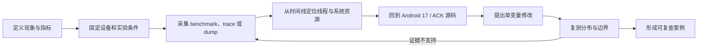

# 附录 G：Android 性能学习路线

这条路线面向已有 Android 开发经验、准备进入应用性能、Framework、系统性能或稳定性方向的读者。学习顺序围绕四个动作展开：记录现象、采集证据、解释机制、验证修改。章节阅读服务于当前实验，不以通读目录作为完成条件。

每次练习都应保留原始数据、采集配置、设备状态、分析过程和复测结果。只有结论，没有可复查证据的记录，无法判断结论来自机制分析还是偶然波动。

## 阅读基准与版本边界

这份路线及其引用章节统一采用以下源码坐标：

| 范围 | 阅读坐标 | 使用规则 |
|---|---|---|
| Android 平台 | Android 17、API 37、AOSP tag `android-17.0.0_r1` | 当前机制和路径以该 tag 为准 |
| Android 内核 | ACK tag `android17-6.18-2026-06_r6` | 调度、Binder、内存与文件系统问题以该 tag 为准 |
| 版本演进 | Android 17 及更早版本 | 用于解释 API 引入、机制替换和兼容分支 |

厂商设备可能修改 Framework、HAL、内核配置和性能策略。分析商用设备时，应同时记录 build fingerprint、API level、内核版本、SoC、刷新率、电源模式和温控状态。AOSP 路径用于定位公共机制，不能代替目标设备上的 trace、配置与符号。

训练过程按下面的证据流推进。



图中的回路用于约束分析纪律：源码可以解释已经观察到的路径，却不能单独证明目标设备当时走过该路径。证据不足时，应调整采集项后重测。

## 阶段 0：定义可测量的问题

“慢”“卡”“耗电”都不是可直接验证的指标。开始抓 trace 前，先把用户场景、时间窗口、度量单位和失败阈值写下来。

| 问题族 | 现象定义 | 主证据 | 常见混淆项 | 推荐入口 |
|---|---|---|---|---|
| 启动 | 冷、温、热启动下的 TTID 与 TTFD 分布 | Macrobenchmark、启动 trace、`reportFullyDrawn()` | 把首帧当作内容全部可交互；混用不同编译状态 | [启动分析](../part5-app/ch21-startup/01-startup-analysis.md)、[Baseline Profile 实践](../part5-app/ch21-startup/04-baseline-profile-practice.md) |
| 卡顿 | 特定交互中的慢帧比例、帧时长分布 | FrameTimeline、主线程与 RenderThread slice、SurfaceFlinger timeline | 只按主线程耗时归因；忽略刷新率与 deadline | [卡顿定义](../part2-performance/ch07-smoothness/01-jank-definition.md)、[FrameTimeline 分析](../part3-tools/ch13-perfetto/20-frame-timeline-api33-perfetto-analysis.md) |
| ANR | ANR 类型、触发时间、目标进程与系统负载 | 系统 ANR 记录、线程栈、Perfetto、Binder 状态 | 把事后主线程栈当成触发瞬间；只看应用进程 | [ANR 设计](../part2-performance/ch09-anr/01-anr-design.md) |
| 内存 | PSS/RSS、Java heap、native heap、GPU/共享内存或资源数量的异常增长 | heap dump、heapprofd、smaps、meminfo、对象/FD/线程计数 | 把 PSS 增长全部归入 Java 泄漏；忽略缓存与共享页 | [内存基础](../part1-fundamentals/ch04-memory/01-memory-overview.md) |
| 功耗与发热 | 固定工作量下的能量、功率、温度、频率和完成时间 | PowerStats/BatteryStats、CPU/GPU 频率、thermal 事件、工作量计数 | 用电量百分比比较短实验；忽略屏幕、信号和温控阶段 | [Android 功耗](../part1-fundamentals/ch05-cpu-power/06-android-power.md) |
| I/O | 业务操作的 I/O 延迟、吞吐、fsync 与阻塞时间 | ftrace/Perfetto I/O 数据源、系统调用、文件系统事件 | 将所有 `D` 状态视为存储慢；忽略 page fault 与 reclaim | [存储架构](../part1-fundamentals/ch06-storage/01-storage-architecture.md) |

这一阶段要制作六张排查卡片。每张卡片包含：

1. 一句可测量的问题描述；
2. 设备、构建、数据集和操作脚本；
3. 一个主指标与两个防误判指标；
4. 需要开启的 trace 数据源；
5. 至少三个候选原因及各自的反证；
6. 触发补采或停止分析的条件。

验收时随机抽取一张卡片，要求说明某项数据如何支持或排除候选原因，并指出现有数据还不能回答什么。

## 阶段 1：用 Perfetto 建立统一时间轴

Perfetto 的价值在于把应用 slice、线程调度、频率、Binder、内存、图形管线和系统事件放到同一时钟域。学习时按“可靠采集、界面定位、SQL 复现”三个层次推进：

1. 阅读 [Perfetto 概览](../part3-tools/ch13-perfetto/01-perfetto-intro.md) 和 [trace 采集](../part3-tools/ch13-perfetto/02-trace-capture.md)，保存采集配置。
2. 阅读 [线程 CPU 状态](../part3-tools/ch13-perfetto/06-thread-cpu-states.md)，区分 Running、Runnable、Sleeping 和不可中断等待。
3. 阅读 [Perfetto SQL 手册](../part3-tools/ch13-perfetto/10-perfetto-sql-cookbook.md)，把界面上的判断转换成查询。

### 三个起步实验

| 实验 | 必备数据 | 必须回答的问题 |
|---|---|---|
| 冷启动 | `atrace`/TrackEvent、`sched`、进程状态、CPU 频率、Binder、FrameTimeline | 时间消耗位于进程创建、Provider、`Application`、Activity 创建、首次 traversal、渲染提交中的哪一段 |
| 列表滑动 | FrameTimeline、主线程、RenderThread、SurfaceFlinger、GPU counter 或 fence | App deadline 和 present deadline 哪一个错过；对应线程当时在运行、排队还是等待 |
| ANR 复盘 | 主线程、Binder、锁、I/O、CPU/内存压力、系统服务线程 | trace 时间窗口是否覆盖触发点；主线程阻塞是否由远端服务或系统压力放大 |

下面的查询用于列出 trace 中持续时间最长的 slice，帮助寻找进一步筛选的入口。

```sql
SELECT
  process.name AS process_name,
  thread.name AS thread_name,
  slice.name,
  slice.dur / 1e6 AS duration_ms
FROM slice
JOIN thread_track ON slice.track_id = thread_track.id
JOIN thread USING (utid)
LEFT JOIN process USING (upid)
WHERE slice.dur > 0
ORDER BY slice.dur DESC
LIMIT 50;
```

这份结果只是候选列表。异步 slice、调度等待和 GPU 工作未必表现为同一线程上的长 slice；后续仍要结合目标时间窗口、线程状态、flow 和 FrameTimeline 关系核对。

### 采集质量检查

一份 trace 至少要回答这些问题：

- 开始和结束是否覆盖完整操作，是否包含预热或冷却阶段；
- buffer 是否发生丢包，关键数据源是否启用；
- 应用包名、PID、线程名和用户操作时间是否可对应；
- 目标进程是否为预期构建，编译状态是否已记录；
- CPU/GPU 频率、刷新率、电源模式和 thermal 状态是否在各轮一致；
- 问题能否连续复现，正常样本能否用同一配置采到。

阶段验收采用一份未见过的 trace。报告须包含时间窗口、关键 track/slice、线程状态、SQL 结果、候选原因、排除项和补采计划。截图可以辅助定位，不能负责全部论证。

## 阶段 2：从 trace 回到 Android 17 源码

源码阅读从一个观测事实出发，例如“主线程在 18 ms 内持续运行某段 traversal”“Binder reply 延迟 120 ms”“RenderThread 等待 acquire fence”。接着查明事件由谁记录、调用关系经过哪些组件、跨进程或跨内核边界时使用什么对象。

### 源码导航表

| 主线 | Android 17 平台入口 | 内核或 native 入口 | 配套章节 |
|---|---|---|---|
| 进程与组件启动 | `ActivityThread`、`LoadedApk`、`ContentProvider`、`ZygoteInit` | `frameworks/base/cmds/app_process`、ART runtime | [启动分析](../part5-app/ch21-startup/01-startup-analysis.md) |
| 消息与帧调度 | `Looper`、`MessageQueue`、`Handler`、`Choreographer`、`ViewRootImpl` | `android_os_MessageQueue.cpp`、epoll | [Choreographer](../part1-fundamentals/ch02-rendering/04-choreographer.md) |
| View 渲染 | `ViewRootImpl`、`ThreadedRenderer`、HWUI RenderThread | Skia、`libhwui`、sync fence | [渲染总览](../part1-fundamentals/ch02-rendering/01-rendering-overview.md)、[主线程与 RenderThread](../part1-fundamentals/ch02-rendering/05-main-render-thread.md) |
| 合成与显示 | WindowManager、DisplayManager | SurfaceFlinger、HWC、BufferQueue、gralloc、dma-buf | [SurfaceFlinger](../part1-fundamentals/ch02-rendering/06-surfaceflinger.md)、[BufferQueue](../part1-fundamentals/ch02-rendering/13-buffer-queue.md)、[dma-buf/gralloc](../part1-fundamentals/ch02-rendering/15-dmabuf-gralloc.md) |
| 输入与 ANR | InputManagerService、ActivityManagerService、WindowManagerService | `InputReader`、`InputDispatcher`、evdev | [ANR 设计](../part2-performance/ch09-anr/01-anr-design.md) |
| Binder | Java Binder、system service、service manager | `frameworks/native/libs/binder`、`drivers/android/binder.c` | [Binder 基础](../part1-fundamentals/ch01-architecture/04-binder.md) |
| 内存与进程优先级 | ActivityManagerService、OomAdjuster、cached-app freezer | ART、lmkd、cgroup、reclaim、zram | [内存基础](../part1-fundamentals/ch04-memory/01-memory-overview.md) |
| 调度、功耗、热 | PowerManagerService、Power HAL、Thermal HAL | CFS/EEVDF、uclamp、cpuset、thermal、sched_ext | [Android 功耗](../part1-fundamentals/ch05-cpu-power/06-android-power.md)、[sched_ext](../part4-system/ch17-oem/04-sched-ext-oem-bpf-scheduler.md) |

类名只是入口，不能替代调用点。每次源码练习都要记录 tag、仓库、相对路径、方法名以及对应的 trace 事件。平台代码用 `android-17.0.0_r1`；进入 Binder 驱动、调度器、reclaim 或文件系统后切换到 `android17-6.18-2026-06_r6`。

### “trace → 源码”六步练习

1. 在 trace 中固定一个时间范围和一个可命名事件。
2. 找到事件的生产者；优先查 trace category、TrackEvent 名称或 atrace 调用点。
3. 从调用点向上还原业务入口，向下跟到线程、进程或内核边界。
4. 标注同步调用、异步消息、Binder transaction、BufferQueue 和 fence 等边界。
5. 将每个耗时区间对应到 Running、Runnable 或等待对象。
6. 改变一个条件复测，例如移除初始化、降低并发、替换数据集或固定刷新率。

渲染案例应完整覆盖以下路径：

`Choreographer#doFrame` → `ViewRootImpl#performTraversals` → HWUI/RenderThread → BufferQueue → SurfaceFlinger → HWC/GPU → present fence。

这条表示责任传递顺序，不代表每帧都由一个同步调用栈贯穿。应用绘制、buffer 提交、系统合成和显示呈现运行在不同线程或进程中，依靠队列、时间线与 fence 协调。

阶段验收产物为四张带证据的调用链图：启动、帧、Binder、内存或调度任选其一。图上每条跨层箭头都要附源码位置或 trace 关系。

## 阶段 3：完成可重复的应用优化实验

应用侧练习要把基线、变量、收益和副作用放进同一实验。测试对象应尽量接近发布构建；debuggable 构建、IDE 附加调试器和随机后台负载都会改变结果。

| 主题 | 学习入口 | 实验目标 | 边界条件 |
|---|---|---|---|
| Macrobenchmark | [Jetpack Benchmark](../part3-tools/ch19-apm/14-jetpack-benchmark.md) | 固定启动模式、CompilationMode、迭代次数和设备状态，输出原始样本及分位数 | target app 需满足 Macrobenchmark 对 profileable/non-debuggable 构建的要求 |
| Baseline Profile | [Baseline Profile 实践](../part5-app/ch21-startup/04-baseline-profile-practice.md) | 用 `BaselineProfileRule` 生成关键用户路径，比较无 profile、首次安装和 profile 已编译状态 | 每个 release 都要重新生成并验证；收益依赖代码路径和设备 |
| Startup Profile / DEX layout | [Startup Profile 与 DEX 布局](../part5-app/ch21-startup/12-startup-profile-dex-layout.md) | 检查生成文件、R8/D8 消费结果和主 dex 布局，再用启动 trace 验证类加载变化 | 文件存在不能证明已进入最终产物 |
| App Startup | [启动分析](../part5-app/ch21-startup/01-startup-analysis.md) | 把无依赖的首帧前初始化移后，检查功能正确性与启动分布 | 延迟初始化可能把耗时转移到首次交互 |
| 16 KB page size | [16 KB page size](../part1-fundamentals/ch04-memory/06-16kb-page-size.md) | 检查 APK/AAB 中 ELF LOAD segment 对齐、打包对齐和目标设备加载 | Java/Kotlin-only 应用与包含预编译 native 库的检查范围不同 |
| ADPF | [PerformanceHintManager](../part1-fundamentals/ch05-cpu-power/09-adpf.md) | 创建 `PerformanceHintSession`，稳定报告工作时长和 target duration，观察性能及能耗 | hint 是协作信号，不承诺固定频率或调度结果 |
| ProfilingManager | [ProfilingManager](../part3-tools/ch19-apm/16-profiling-manager.md) | 在 API 35+ 请求 system trace、heap dump、heap profile 或 stack sampling，记录回调与失败 | 请求受系统限流，系统可以拒绝；产品设计不能假定每次都有产物 |

### 基准实验记录模板

每个实验至少记录以下内容：

- 设备型号、build fingerprint、API level、内核、刷新率；
- APK version、variant、签名、R8 和 profile 状态；
- 电量、充电状态、thermal status、网络和后台负载；
- 操作脚本、数据集、预热方式、迭代次数；
- 每轮原始数据、P50/P90/P95、离散程度；
- 对应 trace、benchmark JSON 和构建产物；
- 单变量修改、收益范围、回归风险和不适用场景。

分位数在样本很少时容易产生误导。不要用三到五轮结果宣称稳定收益；先检查设备是否进入热稳定区，再根据噪声大小增加迭代或拆分实验。

阶段验收选择两个实验：一个启动实验，一个帧、内存、功耗或二进制体积实验。每个实验都要能由另一位工程师按文档复现，并得到方向一致的结果。

## 阶段 4：把观测能力带入生产环境

生产环境的采集能力受开销、功耗、隐私、平台权限和数据成本约束。线下 trace 可以持续数十秒并包含大量系统事件，线上方案通常需要轻量信号发现异常，再对少量会话请求重样本。

| 能力 | 可用信号 | 取证方式 | 必须记录的限制 |
|---|---|---|---|
| 帧性能 | FrameMetrics、JankStats、业务场景与刷新率 | 采样 trace、现场指标上下文 | 不同刷新率的 deadline；系统负载；后台帧 |
| ANR | 系统 exit reason、主线程心跳、消息与 Binder 摘要 | 系统 ANR 痕迹、受控 trace、服务端日志 | 现场时间偏移；OEM 行为；权限与可用性 |
| Java 内存 | heap 指标、GC、对象或页面生命周期 | 采样 heap dump、LeakCanary/Shark 分析 | dump 暂停、文件大小、隐私字段 |
| native 内存与 crash | allocator 统计、RSS、signal/tombstone | heapprofd、unwind、符号化 | 符号版本、采样偏差、MTE 设备覆盖 |
| 方法与系统 trace | 自定义 TrackEvent、关键路径耗时 | Perfetto 或 ProfilingManager 请求 | buffer、限流、拒绝、上传成本 |
| 功耗与热 | 工作量、温度、thermal status、前后台状态 | BatteryStats/PowerStats 汇总、抽样 trace | 设备电池老化、网络、亮度和环境温度 |

一个生产事件至少要带上 app version、build ID、设备/SoC、系统版本、内核、会话、场景、时间、进程状态和采集配置版本。缺少版本归属的数据很难与发布变更对应。

生产方案验收包含四项：

1. 在低端、中端、高端设备上测量 CPU、内存、I/O、功耗和包体开销；
2. 说明采样规则、限流、失败率和数据保留周期；
3. 对路径、文本、heap、账号和设备标识做隐私评审；
4. 用一次故障演练证明轻量信号可以关联到重样本与发布版本。

## 阶段 5：进入系统与 OEM 问题

跨层分析要回答“应用线程为何在这一刻得不到资源”以及“应用能控制哪些变量”。同一个 Runnable 等待可能来自竞争线程过多、cpuset/uclamp、CPU 容量、IRQ、thermal 降频或厂商策略，不能只凭线程状态选定原因。

| 方向 | 平台与内核证据 | 练习目标 |
|---|---|---|
| CPU 调度 | `sched_switch`、`sched_wakeup`、runqueue、CPU frequency、uclamp、cpuset | 分开 on-CPU 执行时间与 Runnable 等待，比较同工作量在不同 CPU/thermal 状态下的完成时间 |
| Binder | transaction/reply、客户端与服务端线程状态、线程池、驱动等待 | 找出延迟位于客户端排队、驱动传递、服务端执行还是 reply 调度 |
| 内存回收 | page fault、reclaim、compaction、zram、LMKD、cached-app freezer | 把 GC、进程回收、direct reclaim 和 swap I/O 分开 |
| 存储 | block I/O、fsync、page cache、F2FS、线程 `D` 状态 | 追踪一次业务写入从系统调用到文件系统和块层的等待 |
| 图形与显示 | FrameTimeline、BufferQueue、fence、SurfaceFlinger、HWC/GPU | 区分 App deadline、合成 deadline、GPU 完成和 present |
| 功耗与温控 | Power HAL mode/boost、ADPF、thermal zone、频率与工作量 | 解释性能下降来自工作增加还是单位工作可用算力下降 |
| 厂商策略 | framework/HAL 差异、内核 config、设备 overlay、性能服务 | 将 AOSP 公共路径与设备扩展分别标注，避免用单一品牌结论覆盖 Android |

这一阶段至少完成两个案例，其中一个进入 ACK 源码。每个案例要标出：

- 用户可感知现象和业务时间窗口；
- 应用、Framework、native/HAL、kernel 各层证据；
- AOSP/ACK tag 与目标设备源码或符号的差异；
- 应用可改项、系统可改项及各自验证方式；
- 对功耗、温度、内存、公平性和兼容性的副作用。

## 十二周训练安排

| 周次 | 主问题 | 阅读与实验 | 当周交付物 |
|---|---|---|---|
| 1 | trace 是否可信 | Perfetto 采集、buffer、线程状态 | 一份采集检查表和一份正常样本 |
| 2 | 冷启动慢在哪里 | Macrobenchmark + 启动 trace | 冷启动报告，包含 TTID/TTFD 与源码入口 |
| 3 | 慢帧由谁错过 deadline | FrameTimeline + 主线程/RenderThread | 一份滑动案例和帧归因 SQL |
| 4 | ANR 现场是否偏移 | ANR 记录 + Binder/调度 trace | 一份带时间轴的 ANR 复盘 |
| 5 | 帧请求如何到达显示 | Choreographer、HWUI、BufferQueue、SurfaceFlinger | 一张渲染跨进程调用链图 |
| 6 | Binder 延迟在哪里 | Java/native Binder + ACK 驱动 | 一张 transaction/reply 证据图 |
| 7 | 编译状态如何影响启动 | Baseline Profile + CompilationMode | 可重复 benchmark 与原始 JSON |
| 8 | DEX 与初始化怎么调整 | Startup Profile + App Startup | 构建产物检查和启动复测 |
| 9 | 线上卡顿如何低成本发现 | FrameMetrics/JankStats + 采样取证 | 最小监控 demo 和开销报告 |
| 10 | 内存异常如何分类 | heap、heapprofd、smaps、GC | Java 或 native 内存案例 |
| 11 | 调度与温控如何改变完成时间 | sched、frequency、thermal、ADPF | 一个固定工作量的跨层实验 |
| 12 | 结论能否被他人复查 | 选择前述案例重做并补全边界 | 一份完整案例和一次同行复核记录 |

每周只设一个问题。阅读、改 demo、采集、分析和复测围绕同一场景进行；未通过验收的交付物在下一周补齐，避免把未证实结论带到后续案例。

## 案例报告模板

一份可复查的性能报告应包含：

1. **问题定义**：用户场景、指标、阈值、发生比例。
2. **实验条件**：设备、软件版本、构建、数据、网络、温控和操作脚本。
3. **证据时间轴**：问题窗口、线程状态、系统资源与跨进程关系。
4. **源码解释**：Android 17 / ACK 对应路径，事件记录点和版本差异。
5. **候选与反证**：哪些原因被数据支持，哪些已排除，哪些仍待补采。
6. **修改内容**：单变量改动和预期影响。
7. **复测数据**：原始样本、统计分布、trace 对照和功能回归。
8. **适用边界**：设备差异、副作用、回退条件与后续监控。

任何一项关键结论都应能指向 trace、dump、benchmark 输出、构建产物或源码位置。仅凭工具截图中的一条长条，无法判定阻塞对象、调度原因或最终责任组件。

## 最小作品集与完成标准

完成路线后，作品集至少包含：

- 三份 Perfetto 分析：冷启动、滑动、ANR；
- 一个 Macrobenchmark + Baseline Profile / Startup Profile 项目；
- 一个初始化治理或 16 KB page size 构建验证；
- 一个卡顿、ANR、Java/native 内存中的生产观测 demo；
- 四张 trace 对应源码的调用链图，其中一张进入 ACK；
- 一份覆盖 App、Framework、native/HAL、kernel 的跨层案例；
- 一份采集开销、隐私、采样和版本归属说明。

完成标准由复现能力决定。另一位工程师应能依据记录还原环境、运行实验、找到同一证据区间，并判断修改是否改善目标指标。结果方向不一致时，报告需要解释噪声来源或缩小结论范围。

## 一手资料

- [AOSP `android-17.0.0_r1` tag](https://android.googlesource.com/platform/manifest/+/refs/tags/android-17.0.0_r1/)
- [ACK `android17-6.18-2026-06_r6` tag](https://android.googlesource.com/kernel/common/+/refs/tags/android17-6.18-2026-06_r6/)
- [Perfetto system tracing](https://perfetto.dev/docs/getting-started/system-tracing)
- [Perfetto trace analysis](https://perfetto.dev/docs/analysis/getting-started)
- [PerfettoSQL 入门](https://perfetto.dev/docs/analysis/perfetto-sql-getting-started)
- [Macrobenchmark 概览](https://developer.android.com/topic/performance/benchmarking/macrobenchmark-overview)
- [生成 Baseline Profile](https://developer.android.com/topic/performance/baselineprofiles/create-baselineprofile)
- [测量 Baseline Profile](https://developer.android.com/topic/performance/baselineprofiles/measure-baselineprofile)
- [ProfilingManager API](https://developer.android.com/reference/android/os/ProfilingManager)
- [ProfilingManager 采集指南](https://developer.android.com/topic/performance/tracing/profiling-manager/how-to-capture)
- [Android Dynamic Performance Framework](https://developer.android.com/games/optimize/adpf)
- [PerformanceHintManager API](https://developer.android.com/reference/android/os/PerformanceHintManager)
