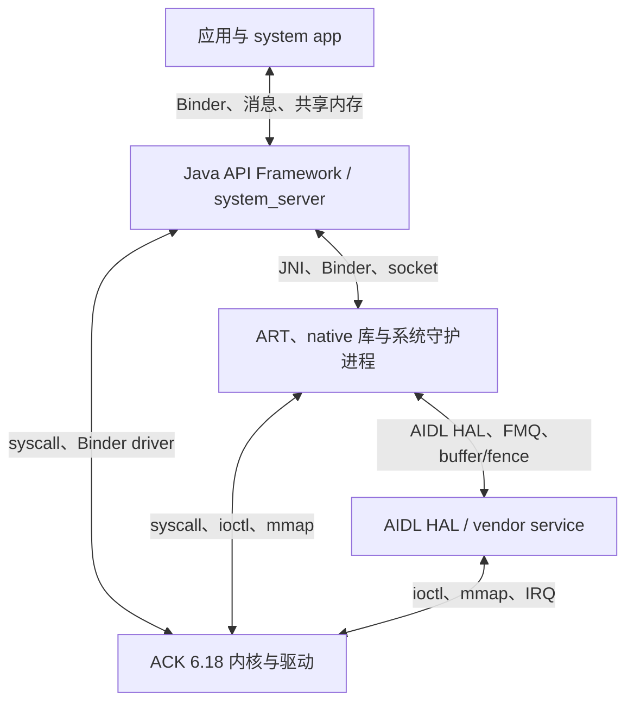

# Android架构概览

<!-- outline-start -->
## 要点

### 🔹 Android 系统架构层次

Android 采用分层架构设计，从底层到上层依次为：

**Linux 内核层**：提供进程管理、内存管理、设备驱动、电源管理、安全性等基础能力。Android 在 Linux 内核基础上增加了针对移动设备的优化，如唤醒管理、低内存管理（LMK）等。

**系统运行时层**：包含 ART 虚拟机、Core Libraries 和 Android 运行时。ART 虚拟机取代了早期的 Dalvik，提供更好的性能和内存管理；Core Libraries 提供 Java 核心功能；Android 运行时负责应用生命周期管理和资源分配。

**系统服务层**：包含众多系统级服务，如 WindowManagerService、ActivityManagerService、PackageManagerService 等。这些服务通过 Binder 机制为上层应用提供系统功能接口。

**应用框架层**：提供应用开发所需的 API，包括四大组件（Activity、Service、BroadcastReceiver、ContentProvider）以及各种系统工具类。

**应用层**：包括用户应用和系统应用，是用户直接交互的部分。

### 🔹 关键组件与职责

**SurfaceFlinger**：负责窗口合成与显示管理，是 Android 显示系统的核心。它收集所有应用的图层信息，进行合成，然后输出到显示设备。SurfaceFlinger 的性能直接影响用户体验的流畅度。

**ActivityManagerService (AMS)**：管理应用的生命周期，包括进程创建、销毁、任务管理等。AMS 还负责内存管理，在系统内存紧张时决定终止哪些进程。

**WindowManagerService (WMS)**：管理系统窗口的创建、布局、显示和交互。它与 SurfaceFlinger 紧密配合，确保窗口正确显示和响应。

**PackageInstaller**：负责应用的安装、卸载和更新。它处理应用的 APK 解析、权限验证、代码加载等过程。

**Binder IPC**：Android 的跨进程通信机制，基于 Linux 的 ioctl 实现。Binder 提供了高性能、类型安全的进程间通信，是 Android 系统各个组件之间通信的基础。

### 🔹 性能优化架构演进

Android 17 在系统架构上进行了多项重要优化，主要体现在：

**消息队列重写**：Android 17 对 MessageQueue 进行了重写，优化了异步消息处理机制。新的实现减少了消息传递的延迟，提高了系统的响应性。这是对沿用二十年的消息机制的重大改进，针对现代多核处理器和高并发场景进行了优化。

**渲染管线优化**：通过减少合成开销、优化图层合并算法，提升了帧率和显示流畅度。新的渲染管线更好地支持高刷新率屏幕和复杂的窗口动画效果。

**内存管理改进**：引入了更精准的垃圾回收策略，减少了内存碎片，提高了内存使用效率。同时优化了低内存杀死的触发条件，减少了应用被意外终止的情况。

**启动流程优化**：通过并行启动、预加载等策略，显著提升了应用的冷启动和热启动性能。特别是系统启动过程，通过优化服务的初始化顺序和减少不必要的等待，大幅缩短了启动时间。

## 扩展

### 🔸 架构演进趋势

**模块化**：从 Android 12 开始，系统采用更加模块化的设计，将系统服务拆分为可独立更新的模块。这种设计提高了系统的灵活性，允许在不升级整个系统的情况下更新特定功能。

**性能导向**：Android 14 进一步强调性能优先的设计理念，在系统各个层面都进行了性能优化，包括编译优化、运行时优化、存储优化等。

**可观测性**：Android 17 增强了系统的可观测性，提供了更详细的性能监控和诊断工具。这对系统性能调优和问题排查具有重要意义。

### 🔸 跨进程通信机制

**Binder 架构与原理**：Binder 采用 C/S 架构，通过驱动程序实现进程间通信。它提供了高效的同步和异步通信方式，支持对象引用传递。

**共享内存与零拷贝优化**：对于大数据传输场景，Android 支持使用共享内存实现零拷贝，减少数据在用户空间和内核空间之间的拷贝开销。

**RPC 调用性能分析**：Binder 调用虽然高效，但在高频调用场景下仍需注意性能瓶颈。通过调用追踪和性能分析工具，可以识别和优化性能热点。

<!-- outline-end -->

> [!CAUTION]
> 上面的 outline 是 Hermes/OpenClaw 依赖的历史内容，本轮保持原字节。它遗漏 HAL 层，并把多项既有机制或带条件的改动概括成 Android 17 通用能力。以下正文以 Android 17 / API 37 / `android-17.0.0_r1` 与 ACK `android17-6.18-2026-06_r6` 为准。

## 五个观察层次

Android 官方架构图用于说明职责，不代表所有调用都沿一条同步栈逐层下行。主线可以按五个层次阅读：

| 层次 | 代表组件 | 性能分析时关注什么 |
|---|---|---|
| 应用 | system app、普通 app、isolated process | 业务调用、线程、组件生命周期、内存与帧 |
| Java API Framework 与系统服务 | `ActivityThread`、AMS、WMS、PMS、InputManagerService | Binder 边界、锁、消息队列、进程状态与权限检查 |
| ART 与 native 库/守护进程 | ART、Bionic、libbinder、libhwui、SurfaceFlinger、lmkd | 编译/GC、native 分配、IPC、渲染、媒体和回收策略 |
| HAL | AIDL HAL、vendor service、HWC、Power/Thermal/Camera HAL | 跨 system/vendor 接口、硬件能力、队列与厂商策略 |
| Linux 内核 | Binder、调度、cgroup、内存、文件系统、网络与驱动 | Runnable 等待、IRQ、reclaim、I/O、fence 和硬件事件 |

下面的图表示常见责任边界。

同一层内也可能跨进程，例如应用调用独立服务；相邻层之间也可能被绕过，例如 native 进程直接访问允许使用的内核接口。分析时应根据 trace 和源码还原目标路径。

## 组件职责要按边界理解

### ActivityManager、WindowManager 与 PackageManager

- AMS 及相关 ActivityManager 组件维护进程、组件、任务、OOM 调整等状态。内存压力下的最终进程选择还涉及 OomAdjuster、lmkd 和内核信号。
- WMS 管理窗口层级、布局、焦点、输入窗口和 display area 等策略。SurfaceFlinger 消费图层事务并完成合成与呈现，两者职责不能合成一个“窗口渲染服务”。
- PackageManagerService 维护包、权限、组件和安装状态；PackageInstaller 提供安装会话与公开接口。APK 解析、验证、dexopt、staged session 和回滚由多个组件共同完成。

### SurfaceFlinger 与显示链路

应用通过 View/HWUI、Surface 或媒体组件生产 buffer。BufferQueue 传递 buffer 与 fence，SurfaceFlinger 根据图层状态选择 HWC 或 GPU 合成，再把结果提交到显示设备。SurfaceFlinger 的长 slice 只表示合成侧耗时，不能单独证明应用绘制、GPU 或 HWC 中哪一方负责。

渲染细节见 [2.1 渲染系统概览](part1-fundamentals/ch02-rendering/01-rendering-overview.md)。

### Binder 传输与服务执行

Binder 驱动负责 transaction 传递、对象引用、线程唤醒和部分优先级处理。AIDL stub、服务线程池、服务端锁与业务代码仍在用户空间执行。

一次同步调用的延迟至少要拆成：

1. 客户端序列化与进入驱动；
2. transaction 进入目标进程；
3. 服务端线程排队；
4. 服务端代码、锁、I/O 或下游调用；
5. reply 传回与客户端重新获得 CPU。

`FLAT_BINDER_FLAG_INHERIT_RT` 由 Binder node 配置控制，不能把 RT 继承写成所有 transaction 的默认行为。权限、调度策略和恢复路径还受 Binder 驱动及内核调度约束。

细节见 [1.4 Binder IPC](part1-fundamentals/ch01-architecture/04-binder.md)。

## 三处版本勘误

### MessageQueue：Android 17 引入 DeliQueue 兼容路径

Android 17 保留 `Handler`、`Looper`、同步屏障、IdleHandler 和 native poll 的外部语义。面向 `targetSdkVersion >= 37` 的应用，compat change 默认选择 `CombinedDeliMessageQueue`：生产者把消息压入无锁栈，Looper 再把消息整理到自己使用的 heap。

这项改动针对入队/出队竞争。`dispatchMessage()` 中的 layout、I/O、Binder 或业务计算仍需单独优化。旧 outline 中“异步消息处理整体提速”的范围过宽。

细节见 [1.13 MessageQueue 与 DeliQueue](part1-fundamentals/ch01-architecture/13-messagequeue-deliqueue.md)。

### lmkd：userspace 与 PSI 路径早于 Android 17

旧的内核 lowmemorykiller 驱动在更早版本已经退出 Android 公共主线，lmkd 也早已运行在用户空间。Android 17 的 `lmkd.cpp` 可使用 PSI trigger、epoll、meminfo/vmstat/zoneinfo、thrashing、swap 和进程状态做决策。

`PSI_POLL_PERIOD_SHORT_MS = 10` 与 `PSI_POLL_PERIOD_LONG_MS = 100` 是压力事件后的状态轮询间隔，PSI trigger window 由另一项配置控制。把它们称为两档 PSI 监控窗口会误读源码。原文中的“200–500 ms 降到 50–100 ms”“CPU 开销降低 30%/40%”没有设备、workload 和复现步骤，本章不采用。

细节见 [4.15 PSI、LowMemDetector 与 lmkd](part1-fundamentals/ch04-memory/15-psi-lowmemdetector-lmkd-architecture.md)。

### 模块化：Mainline 不能概括为 Android 12 开始

Project Mainline 在 Android 10 已引入，后来持续增加可更新模块。APEX、APK、system/vendor 分区和稳定 AIDL 解决的是不同问题：

- Mainline 允许部分系统组件通过 Google Play system update 或 OEM 更新通道独立更新；
- Treble 通过稳定 vendor interface 分离 system 与 vendor；
- APEX 适合在启动早期或 native 环境使用的模块；
- 模块可更新不表示任意系统服务都能脱离整机版本单独升级。

阅读版本差异时，应检查目标 tag 的模块清单、接口稳定性和设备产品配置。

## 用一条性能证据穿过各层

以“点击后 300 ms 才显示新页面”为例，可以按下面顺序取证：

| 证据 | 可以回答的问题 | 还不能回答什么 |
|---|---|---|
| 应用 TrackEvent 与主线程 slice | 点击处理、业务代码、首次 traversal 花了多久 | 系统服务或 GPU 内部为何等待 |
| Binder transaction/reply | 是否跨进程，远端服务用了多久 | 服务端长 slice 内的锁或 I/O |
| sched/thread_state | 线程在运行、Runnable 还是等待 | 某段业务代码的语义 |
| FrameTimeline 与 SurfaceFlinger | App deadline、合成 deadline、present 是否迟到 | 业务请求为何晚到 |
| frequency、thermal、Power HAL 事件 | 可用算力是否变化 | 工作量本身是否增加 |
| 内核 I/O、reclaim、fence | 是否被存储、内存回收或设备同步阻塞 | 上层为何触发该操作 |

源码用于解释观测到的事件生产者、状态机和边界。目标设备是否走过某条分支，要由 trace、日志、dump 或实验支持。

## 源码阅读与实验记录

每次跨层分析应记录：

- build fingerprint、API level、AOSP/厂商版本和内核；
- 进程、线程、UID、场景与时间窗口；
- Java、native、HAL、kernel 的路径和方法/函数；
- Binder、socket、共享内存、BufferQueue 或 ioctl 等边界；
- 线程状态、CPU/频率、内存、I/O、GPU 与 thermal 证据；
- 单变量修改及复测分布。

Android 17 的公共源码用于建立可定位的基线。厂商改动可能位于 vendor service、HAL、内核模块、overlay 或性能服务中，分析商用设备时还要补充厂商符号、配置和日志。

## 正式章节入口

本文件保留旧链接兼容，系统架构的持续维护入口是：

- [1.1 Android 分层架构](part1-fundamentals/ch01-architecture/01-layered-architecture.md)
- [1.4 Binder IPC](part1-fundamentals/ch01-architecture/04-binder.md)
- [1.13 MessageQueue 与 DeliQueue](part1-fundamentals/ch01-architecture/13-messagequeue-deliqueue.md)
- [2.1 渲染系统概览](part1-fundamentals/ch02-rendering/01-rendering-overview.md)
- [4.15 PSI、LowMemDetector 与 lmkd](part1-fundamentals/ch04-memory/15-psi-lowmemdetector-lmkd-architecture.md)

## 一手资料

- [AOSP Android 17 tag](https://android.googlesource.com/platform/manifest/+/refs/tags/android-17.0.0_r1/)
- [Android platform architecture](https://source.android.com/docs/core/architecture)
- [Android 17 `frameworks/base`](https://android.googlesource.com/platform/frameworks/base/+/refs/tags/android-17.0.0_r1/)
- [Android 17 `frameworks/native`](https://android.googlesource.com/platform/frameworks/native/+/refs/tags/android-17.0.0_r1/)
- [Android 17 HAL interfaces](https://android.googlesource.com/platform/hardware/interfaces/+/refs/tags/android-17.0.0_r1/)
- [Android 17 lmkd](https://android.googlesource.com/platform/system/memory/lmkd/+/refs/tags/android-17.0.0_r1/)
- [ACK `android17-6.18-2026-06_r6`](https://android.googlesource.com/kernel/common/+/refs/tags/android17-6.18-2026-06_r6/)

架构图的作用是帮助定位责任边界。遇到性能问题时，应把用户现象转成时间窗口，再沿应用、服务、native/HAL 与内核证据逐段缩小范围。
