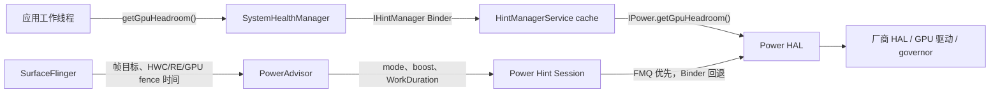

# 2.17 Android 17 GPU 功耗管理策略与 DVFS 调优机制

本文从渲染时间线解释 GPU 功耗与频率问题。平台坐标是 Android 17 / API 37 / `android-17.0.0_r1`，内核坐标是 `android17-6.18-2026-06_r6`。GPU 的 OPP、调频算法、驱动计数器和 thermal cooling device 多由 SoC 厂商实现；AOSP 只能给出 Framework、Power HAL、SurfaceFlinger 与通用内核接口的公共边界。

## 先区分四种量

GPU 性能分析中常被混用的四种量含义不同：

| 量 | 表达什么 | 不能直接推出什么 |
|---|---|---|
| GPU frequency | 当前或采样窗口内的 GPU 时钟频点 | shader 是否忙、帧是否按时完成 |
| GPU utilization/busy | 采样窗口内硬件忙碌比例 | 当前频率是否足够、工作量为何增加 |
| GPU headroom | Power HAL 对计算窗口内可用 GPU 容量的估计 | utilization、频率或 thermal headroom |
| thermal headroom/status | 设备接近 thermal throttling 的程度或离散状态 | GPU 单元的独立温度与频率上限 |

高频率配合低 utilization 可能来自短 burst 后的采样偏差，也可能来自 governor 的迟滞。高 utilization 配合按时呈现表示 GPU 很忙，但当前配置仍满足 deadline。只有把频率、busy、GPU 完成时间、帧 deadline 和温控状态放到同一时间轴，才能判断是否需要调频或减少工作量。

## AOSP 暴露的两条独立路径

Android 17 中，应用查询 GPU headroom 与 SurfaceFlinger 上报合成工作量共享 Power HAL 边界，但调用方向独立。

`PowerAdvisor` 没有读取 `getGpuHeadroom()`；应用查询也不经过 SurfaceFlinger。厂商 Power HAL 可以综合多个输入，AIDL 契约没有规定它必须选择哪个频点、电压或内存带宽档位。

## GPU headroom 的版本与语义

### 公共 API 从 API 36 提供

`SystemHealthManager.getGpuHeadroom()`、`GpuHeadroomParams`、计算窗口范围和最小轮询间隔在 API 36 加入。Android 17 继续提供这些接口，因此不能写成 API 37 首次公开。

Power HAL AIDL 的版本号属于另一套版本体系：

- 冻结的 V6 首次声明 GPU headroom、support info 与 composition data 等接口；
- `android-17.0.0_r1` 的 `hardware/interfaces/power/aidl/Android.bp` 构建 `android.hardware.power-V7`；
- V6/V7 不能按数字对应 Android 16/17 或 API 36/37。

应用是否能调用公共 API，与设备 Power HAL 是否声明 GPU headroom 支持，是两个检查项。

### 返回值是设备估计

`GpuHeadroomResult.globalHeadroom` 的有效范围是 `[0, 100]`：

- `0` 表示计算窗口内没有可继续分配的 GPU 容量余量；
- 较高值表示 HAL 估计的可用容量更多；
- `Float.NaN` 表示数据不足、波动过大或结果暂不可用。

请求参数包含 calculation type 与 calculation window：

| 参数 | 用途 |
|---|---|
| `MIN` | 返回窗口内最小余量，关注较差片段 |
| `AVERAGE` | 返回窗口内平均余量，适合趋势观察 |
| `calculationWindowMillis` | 历史窗口，合法范围由设备 support info 给出 |

调用方应通过 `getGpuHeadroomCalculationWindowRange()` 读取设备范围，通过 `getGpuHeadroomMinIntervalMillis()` 限制请求频率。不要把某个示例中的窗口范围写成所有设备的固定值。

### 这是一条同步调用

应用调用 `SystemHealthManager` 时至少跨一次到 system_server 的同步 Binder。缓存命中只能省掉 system_server 到 Power HAL 的访问，不能消除应用侧 Binder。

公共 API 文档提醒调用可能超过 1 ms，首次查询或更换参数还可能触发 HAL 初始化。它不适合放在 UI、RenderThread 或游戏逐帧热路径。常见做法是在工作线程按设备最小间隔采样，把结果作为缓慢变化的策略输入；收到 `NaN` 时维持现有策略。

## `HintManagerService` 缓存的准确边界

Android 17 以完整的 `GpuHeadroomParams` 为 key，缓存 HAL 结果。有效期来自 `SupportInfo.headroom.gpuMinIntervalMillis`。

源码中的 `HeadroomCache(2, ...)` 容易被误读：

- `2` 传给 `ArrayMap` 作为初始容量；
- `add()` 没有固定两项的淘汰逻辑；
- `get()` 命中后没有移动条目；
- 过期条目在查询时从链表头清理。

所以该实现是按参数和过期时间管理的缓存，不是“两槽 LRU”。源码也不能证明“降低 90% RPC”一类固定收益；收益取决于调用参数、频率、最小间隔和 HAL 时延。

每次服务调用可写入 `GPU_HEADROOM_REPORTED` statsd atom，包括窗口、类型、缓存命中、状态和归一化结果。statsd atom 不会自动变成同名 Perfetto track，需要设备采集配置或消费者。

## SurfaceFlinger `PowerAdvisor`

### Mode 与 Boost 是意图信号

`setExpensiveRenderingExpected(displayId, expected)` 维护需要昂贵合成的显示集合。集合在空与非空之间切换时，PowerAdvisor 向 Power HAL 发送 `Mode::EXPENSIVE_RENDERING`。

`notifyDisplayUpdateImminentAndCpuReset()` 可以发送 `Boost::DISPLAY_UPDATE_IMMINENT` 与 hint-session `CPU_LOAD_RESET`。内部 timer 控制连续更新期间是否重复发送。

HAL 返回 unsupported 后，PowerAdvisor 会缓存“不支持”并跳过后续调用。普通调用失败走重新连接路径，不能概括成任何失败后永久关闭能力。

Mode/Boost 只表达场景和时机。HAL 可以调整 CPU、GPU、内存或其他资源，也可以忽略；AOSP 没有要求固定升频幅度或持续时间。

### Power Hint Session 报告工作时长

SurfaceFlinger 的 hint session 可以包含 SF 主线程及 RenderEngine 线程。PowerAdvisor 结合下列时间估算 `WorkDuration`：

- commit start 与 expected present time；
- HWC validate/present 起止；
- 是否使用 RenderEngine；
- GPU command submit 附近的起点和 GPU fence；
- present 与 post-composition 时间。

相关 flag 启用时，报告可区分 CPU duration 与 GPU duration。报告值是调度与功耗策略的输入，不能据此断言 GPU 已升频。

### FMQ 优先，Binder 回退

`createHintSessionWithConfig()` 成功后，PowerAdvisor 尝试建立 FMQ channel。descriptor、write flag 或 event flag 无效，以及 FMQ 写入失败时，代码回退到 `IPowerHintSession` Binder 方法。

FMQ 可以减少高频 Binder transaction，源码没有给出每帧固定节省值。正常发送后队列会清空，也不应描述成跨多帧固定批处理。

### composition data 接口不等于活跃调用

Power HAL AIDL 和 wrapper 定义了 `sendCompositionData()` / `sendCompositionUpdate()`，测试也覆盖接口转发。但在 `android-17.0.0_r1` 的 `frameworks/native` 生产代码中，没有找到 SurfaceFlinger 持续调用这些方法的路径。

写版本能力时，应分开“接口已冻结”“wrapper 可调用”“测试已覆盖”“产品路径正在调用”四个状态。

## 内核与厂商 DVFS 边界

Linux devfreq 提供设备频率伸缩框架，OPP 描述支持的频率/电压点，thermal framework 可以通过 cooling device 限制可用状态。目标手机的 GPU 仍可能采用厂商 KMD、固件、专用 governor、总线投票与 Power HAL 策略。

AOSP/ACK 公共源码无法给出所有设备的下列信息：

- 频率切换延迟；
- GPU OPP 数量和具体 MHz；
- shader core 的 power gating 策略；
- GPU 与内存带宽的投票关系；
- thermal trip point 与最大频率；
- Adreno、Mali、PowerVR 的策略优劣。

分析商用设备时，应读取产品公开的 sysfs、Perfetto data source、vendor tracepoint 或 GPU profiler，并记录 SoC、驱动、固件和 thermal 配置。某个设备的路径不能外推为 Android 17 标准。

## 65 Hz kernel idle timer 与 GPU DVFS

SurfaceFlinger Scheduler 的 `FPS_THRESHOLD_FOR_KERNEL_TIMER = 65_Hz` 控制 kernel idle timer 到 HW VSYNC 的 resync/disable 行为。该分支服务于 VSYNC 调度状态，源码没有调用 GPU frequency、devfreq 或 Power HAL。

高刷新率可能增加单位时间内的帧工作量，从而间接影响 GPU busy 与 governor；这属于 workload 变化。不能把 65 Hz 条件写成 GPU DVFS 阈值，也不能把分支描述成固定的“高刷保频、低刷降频”策略。

## 热限制与持续性能

Power HAL mode、Thermal HAL、kernel thermal framework 和 GPU 驱动分别承担不同职责：

| 机制 | 作用 | 设备差异 |
|---|---|---|
| `SUSTAINED_PERFORMANCE` mode | 请求设备采用适合长期负载的策略 | HAL 可以不支持；动作未由 AIDL 固定 |
| `GAME` / `GAME_LOADING` mode | 表达游戏运行或加载场景 | 是否支持及映射动作由设备决定 |
| Thermal API | 向应用报告 thermal status/headroom | 更新频率、传感器与策略由设备实现 |
| thermal cooling device | 限制 GPU/CPU 等设备状态 | trip point 与映射由产品配置 |

`SUSTAINED_PERFORMANCE` 不承诺性能下限，也不承诺把 GPU 锁在某个频点。合理目标是降低长时间运行中的波动，并让厂商在性能与温度之间选择可持续状态。

应用侧不要硬编码“headroom < 20 关闭 MSAA”之类跨设备阈值。应在目标产品上用固定 workload 标定，并使用迟滞、冷却时间与逐级降级，避免频繁切换分辨率、特效和帧率。

## 从掉帧到 DVFS 的诊断顺序

### 1. 确认是哪条 deadline 迟到

用 FrameTimeline 区分 App deadline 与 SurfaceFlinger present deadline，再定位主线程、RenderThread、GPU 或 HWC。主线程长任务不应直接归因给 GPU 频率。

CPU submit 返回只说明命令已经交给 driver。producer completion fence signal 后，消费者才能安全读取 buffer；present fence 表示本轮 display present 到达 Android 可观察的完成边界；per-layer release fence 决定旧 buffer 何时可复用。三个时间点需要分别对齐，不能合并为一个“渲染完成”时间。

### 2. 对齐 GPU 工作与频率

采集目标设备支持的数据：

- GPU work period 或 vendor busy counter；
- GPU frequency 与可用上限；
- GPU fence signal 时间；
- RenderEngine/HWC composition；
- 内存带宽或总线 counter；
- thermal status、cooling state 与温度；
- Power HAL mode/boost 或 ADPF marker。

计数器的单位、采样周期与复位行为要写入报告。跨厂商 counter 名称相同，也可能不代表同一硬件事件。

### 3. 区分工作量增加与可用算力下降

| 证据组合 | 优先判断 |
|---|---|
| GPU duration 上升、频率和上限稳定 | shader、纹理、分辨率、过绘制或带宽工作量增加 |
| GPU busy 高、频率低于正常样本、thermal/cooling 变化 | 温控或功耗限制降低可用算力 |
| GPU fence 按时、App deadline 迟到 | 回到 CPU、调度、Binder、GC 或 UI 工作 |
| HWC → GPU composition 切换后 GPU duration 上升 | 图层属性、overlay 条件或显示配置变化 |
| 频率升高但 GPU duration 无变化 | workload 未受 GPU 算力限制，或计数器/采样窗口不匹配 |

### 4. 做单变量复测

可控变量包括渲染分辨率、刷新率、后处理、shader、纹理格式、图层属性、动画数量和帧率上限。每轮保留相同场景、温度阶段和数据集，比较：

- slow frame 比例与 P50/P90/P95；
- GPU duration、busy 与 frequency 分布；
- 能量、平均功率、温度与完成工作量；
- 图像质量、交互和兼容性。

只提升频率可能缩短帧时间，也可能增加功耗并更早触发 thermal throttling。评估应覆盖冷态峰值与热稳定阶段。

## 应用侧策略

| 场景 | 优先动作 | 验证证据 |
|---|---|---|
| fill-rate/过绘制受限 | 减少全屏透明层、模糊与重复绘制 | GPU duration、fragment counter、功耗 |
| shader/ALU 受限 | 简化 shader、减少分支或计算精度 | shader profiler、GPU cycle、画质对照 |
| 带宽受限 | 调整纹理/RenderTarget 格式、分辨率与采样 | 带宽 counter、GPU duration、内存 |
| HWC overlay 退化 | 检查 layer transform、alpha、dataspace、保护内容 | SurfaceFlinger/HWC composition type |
| 长时间游戏发热 | 动态分辨率、帧率上限、特效分级、ADPF 工作时长 | 热稳定阶段的帧时间、功耗与温度 |

策略输入应来自稳定的场景指标，不能由一次 headroom 或 frequency 采样触发。设置升降级迟滞，并在设备不支持 GPU headroom、ADPF 或相关 counter 时提供静态配置。

## 与正式章节的关系

本文件保留旧路径，GPU headroom 与 SurfaceFlinger PowerAdvisor 的源码级说明统一维护在 [5.29 Android 17 GPU DVFS Headroom 与 PowerAdvisor](../../part1-fundamentals/ch05-cpu-power/5.29-android17-gpu-dvfs-headroom-power-advisor.md)。Power HAL 与 schedutil 的系统边界见 [17.21 SoC 厂商 Power HAL 与 schedutil](../../part4-system/ch17-oem/17.21-android17-soc-vendor-power-hal-schedutil-loop.md)。

## 一手资料

- [Android 17 Power HAL AIDL](https://android.googlesource.com/platform/hardware/interfaces/+/refs/tags/android-17.0.0_r1/power/aidl/android/hardware/power/IPower.aidl)
- [Android 17 Power HAL build version](https://android.googlesource.com/platform/hardware/interfaces/+/refs/tags/android-17.0.0_r1/power/aidl/Android.bp)
- [Android 17 `HintManagerService`](https://android.googlesource.com/platform/frameworks/base/+/refs/tags/android-17.0.0_r1/services/core/java/com/android/server/power/hint/HintManagerService.java)
- [Android 17 `SystemHealthManager`](https://android.googlesource.com/platform/frameworks/base/+/refs/tags/android-17.0.0_r1/core/java/android/os/health/SystemHealthManager.java)
- [Android 17 SurfaceFlinger `PowerAdvisor`](https://android.googlesource.com/platform/frameworks/native/+/refs/tags/android-17.0.0_r1/services/surfaceflinger/PowerAdvisor/)
- [API 37 `SystemHealthManager`](https://developer.android.com/reference/android/os/health/SystemHealthManager)
- [ACK 6.18 devfreq documentation](https://android.googlesource.com/kernel/common/+/refs/tags/android17-6.18-2026-06_r6/Documentation/driver-api/devfreq.rst)
- [ACK 6.18 thermal documentation](https://android.googlesource.com/kernel/common/+/refs/tags/android17-6.18-2026-06_r6/Documentation/driver-api/thermal/)
- [ACK 6.18 `dma-fence.h`](https://android.googlesource.com/kernel/common/+/refs/tags/android17-6.18-2026-06_r6/include/linux/dma-fence.h)
- [ACK 6.18 `sync_file.c`](https://android.googlesource.com/kernel/common/+/refs/tags/android17-6.18-2026-06_r6/drivers/dma-buf/sync_file.c)

GPU DVFS 调优应以帧 deadline 和固定工作量为主线，同时记录频率、busy、fence、带宽、功耗与温度。AOSP 提供公共接口和系统侧提示路径，最终频点与功耗策略要在目标设备上验证。
