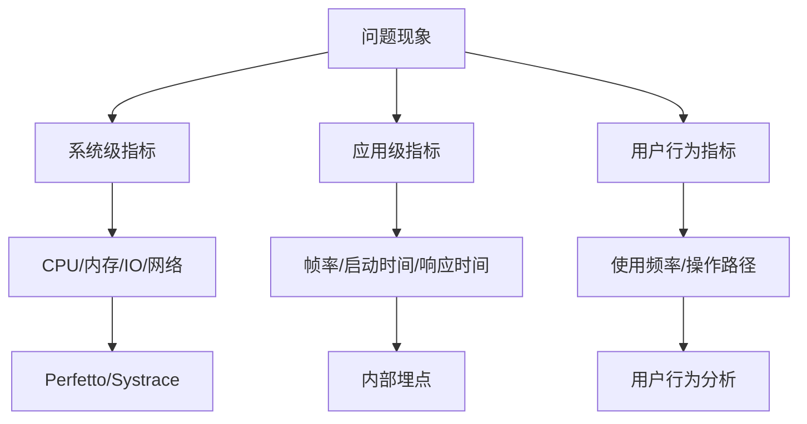

# 第 15 章：Android 性能优化研究方法论

## 为什么要建立性能研究方法论？

性能问题是系统性问题，不是简单的"代码慢"或"内存高"。在实际排查中，经常会遇到：

- **盲人摸象现象**：只看到表面的 ANR，却不知道背后的 Binder 调用链
- **头痛医头问题**：针对某个优化点做了改进，却引发了其他性能下降
- **数据孤岛问题**：CPU 数据和内存数据割裂分析，找不到实际瓶颈

系统化的研究方法论能够：

1. **建立观测体系**：从系统调用到应用代码的全链路可观测性
2. **形成可复用的知识体系**：把零散的经验形成可复用的分析模式
3. **提升诊断效率**：减少无效的排查路径，快速定位核心问题

## 定量研究与定性研究

### 定量研究的价值

定量研究通过数据和指标说话，是性能优化的基础。典型的定量指标包括：

| 指标类型 | 具体指标 | 用途 |
|---------|---------|------|
| CPU 指标 | CPU 使用率、调度延迟、上下文切换次数 | CPU 瓶颈识别 |
| 内存指标 | PSS、RSS、内存增长趋势、GC 频次 | 内存泄漏和压力分析 |
| 渲染指标 | 帧率、掉帧、VSync 延迟 | 渲染性能评估 |
| IO 指标 | IO 延迟、读写次数、缓存命中率 | 磁盘/网络瓶颈定位 |

**关键实践**：建立基准测试体系，在开发环境和生产环境分别设置不同的指标阈值。

### 定性研究的角色

定量指标反映"是什么"，定性研究回答"为什么"。定性研究方法包括：

1. **代码走读**：分析关键路径的代码实现
2. **架构分析**：审视模块间的通信方式和数据流
3. **用户行为分析**：了解实际使用场景和压力模式

**最佳实践**：先通过定量数据缩小问题范围，再用定性方法深入分析根本原因。

## A/B测试与实验设计

### 实验设计基本原则

科学的实验设计是性能优化的验证基础。需要考虑：

1. **对照组设置**：没有性能优化前的基线数据
2. **样本数量**：需要足够的样本量来消除随机波动
3. **测试环境控制**：尽量保持硬件、网络、系统版本的一致性

### 实验类型与适用场景

| 实验类型 | 适用场景 | 优势 | 局限性 |
|---------|---------|------|-------|
| 基准测试 | 功能点性能对比 | 精确测量，结果可重现 | 无法模拟真实用户场景 |
| A/B 测试 | 线上流量验证 | 真实环境验证，统计显著性 | 周期长，需要流量配置 |
| 微基准测试 | 算法效率对比 | 快速迭代，成本低 | 缺乏系统层面优化考量 |

### 实验结果分析

实验数据需要系统性分析：

1. **统计显著性**：确保结果不是随机波动
2. **效应大小**：评估优化的实际价值
3. **副作用监控**：观察优化对其他指标的影响

## 数据收集与分析方法

### 多维度数据收集

有效的性能诊断需要多维度的数据支撑：

### 数据分析流程

1. **现象描述**：准确描述性能问题的表现形式
2. **数据收集**：使用合适的工具收集相关数据
3. **关联分析**：找到不同数据间的关联关系
4. **假设验证**：提出假设并设计验证方案
5. **根因定位**：锁定性能问题的根本原因

**关键工具**：
- **Perfetto**：系统级性能数据的采集和分析
- **SimplePerf**：应用级性能剖析
- **Systrace**：渲染性能分析
- **ADB**：基础性能数据获取

## 常见研究误区

### 误区一：过度关注单一指标

**问题表现**：只优化某个单一指标，导致其他指标恶化。

**案例**：过度减少内存占用，导致更多的磁盘 IO。

**解决方法**：建立综合评估体系，关注整体用户体验。

### 误区二：忽略环境差异

**问题表现**：在实验室环境表现良好，线上出现性能问题。

**案例**：没有考虑网络条件、设备性能差异、用户使用习惯等因素。

**解决方法**：建立多层次测试环境，涵盖不同场景和配置。

### 误区三：过早优化

**问题表现**：在没有充分分析的情况下就开始优化，浪费资源。

**案例**：对性能瓶颈判断错误，在非关键路径上花费大量时间。

**解决方法**：先做性能分析，找到瓶颈再针对性优化。

## 研究工具推荐

### 基础工具

1. **ADB 命令集**：
   - `adb shell dumpsys meminfo`：内存使用分析
   - `adb shell top`：进程级别 CPU 使用情况
   - `adb shell dumpsys batterystats`：电池使用统计

2. **Trace 工具**：
   - `adb shell atrace`：系统级跟踪
   - `adb shell systrace`：渲染性能跟踪

### 专业工具

1. **Perfetto**：
   - 支持数据源扩展和自定义分析
   - 可视化界面完善
   - 支持长时间数据记录

2. **SimplePerf**：
   - 应用级性能剖析
   - 支持多种采样模式
   - 分析结果详细

### 工具选型指南

| 场景 | 推荐工具 | 适用阶段 |
|-----|---------|---------|
| 启动性能分析 | Perfetto + Systrace | 调试阶段 |
| 内存泄漏检测 | ADB + SimplePerf | 调试阶段 |
| 渲染性能分析 | Systrace + Perfetto | 调试阶段 |
| 线上性能监控 | 自定义埋点 + 数据平台 | 运维阶段 |

## 总结

建立系统化的性能研究方法论需要：

1. **定量与定性结合**：既要有数据支撑，也要有深度分析
2. **实验设计严谨**：确保优化结果的可信度
3. **工具链完善**：覆盖不同场景的性能分析需求
4. **持续学习**：跟进 Android 系统的最新特性和优化手段

记住：好的性能优化不是"修修补补"，而是建立从问题发现到解决方案验证的完整体系。只有这样，才能系统性提升应用性能。

---

> *提示：本章方法论适用于 Android 8-17 各个版本的性能问题研究，在具体实践中需要注意各版本的 API 变化和工具差异。*