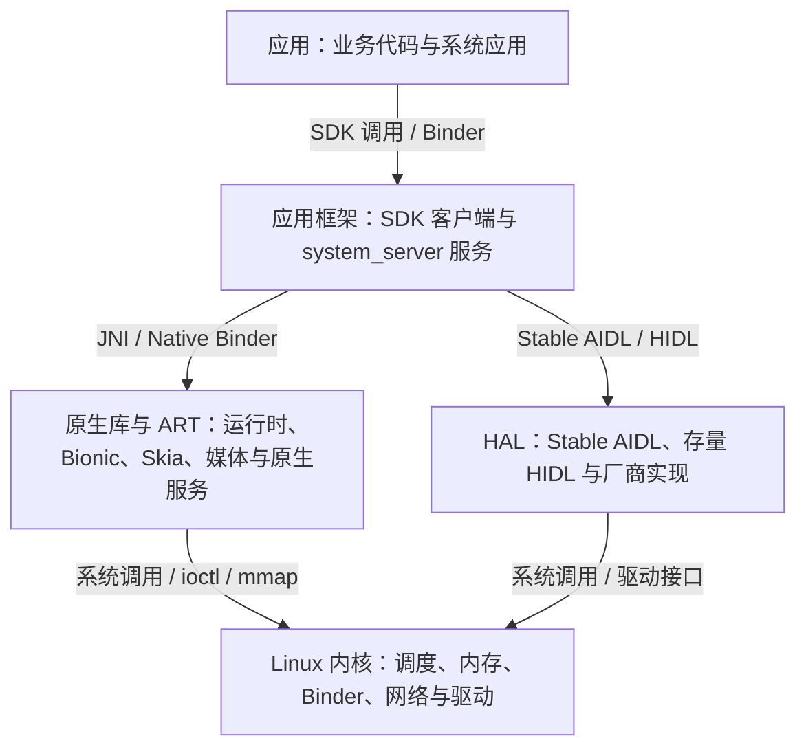

# Android 分层架构、进程模型与线程协作

Android 的“五层架构”按职责划分系统组件，并不对应五个严格套叠的进程。一个应用进程同时包含应用代码、应用框架（Framework）客户端代码、Android 运行时（ART）和原生库。`system_server` 进程既运行 Java 系统服务，也加载 Java 原生接口（JNI）库；SurfaceFlinger 是独立的显示合成服务进程。硬件抽象层（HAL）既可能通过 Android 进程间通信机制 Binder 提供跨进程服务，也可能在旧实现中作为共享库加载到调用方进程。

这种分层仍适合用来确定排查方向。面对一次卡顿、启动慢或硬件访问延迟，先确定工作发生在哪个进程，再确认它通过 Binder、JNI、系统调用还是 HAL 接口进入下一个模块。进程、接口和调度状态共同构成证据，单看“属于哪一层”不足以定位问题。

定位架构问题时，先确认调用跨越了哪些系统层，再沿进程生命周期和线程调度寻找等待、抢占或回收发生的位置。三条线共同决定一次系统行为最终落在哪个进程、哪条线程以及哪个资源边界。

## 系统分层、进程边界与跨层接口

### 五层分别解决什么问题

Android 通常从上到下分为应用、应用框架、原生库与 ART、HAL、Linux 内核五层：



图中的箭头表示常见接口，不表示所有请求都必须逐层经过。例如，应用可以直接通过 Bionic 发起文件系统调用，SurfaceFlinger 可以直接与 Composer HAL 和 Linux DRM 显示子系统或显示驱动交互，媒体数据也常通过共享缓冲区传递。

| 层次 | Android 17 中的典型对象 | 主要边界 | 性能分析入口 |
| --- | --- | --- | --- |
| 应用 | `Activity`、Compose/View、业务线程、RenderThread | SDK、Binder、JNI、文件与网络 API | 应用主线程、RenderThread、自定义跟踪事件（trace）、FrameTimeline |
| 应用框架 | `ActivityTaskManagerService`、`WindowManagerService`、`PackageManagerService` 等 `system_server` 服务 | Java Binder、原生 Binder、系统服务内部锁 | `system_server` Binder 线程、服务跟踪时间片（slice）、锁与调度状态 |
| 原生库与 ART | ART、Android C 标准库 Bionic、Skia、SQLite、SurfaceFlinger、AudioFlinger、媒体服务 | JNI、原生 Binder、共享内存、系统调用 | ART 垃圾回收（GC）/即时编译（JIT）、原生代码时间片、调用栈、原生堆与系统调用 |
| HAL | Stable AIDL HAL、存量 HIDL HAL、厂商服务或同进程实现 | Binder、hwbinder、快速消息队列（FMQ）、共享缓冲区、设备节点 | HAL 服务进程、Binder 事务、锁、输入输出（I/O）与硬件同步栅栏（fence） |
| Linux 内核 | 调度器、内存管理、Binder 驱动、网络栈、文件系统、DMA-BUF 与设备驱动 | 系统调用、`ioctl`、`mmap`、中断 | ftrace 内核跟踪、线程状态、CPU 频率、I/O、Binder 与驱动事件 |

本书的 Android 17 平台机制统一按 Android 开源项目（AOSP）的固定源码标签 `android-17.0.0_r1` 核对，内核机制统一按 Android Common Kernel（ACK，Android 公共内核）`android17-6.18-2026-06_r6` 核对。量产设备会在 ACK 之上增加片上系统（SoC）驱动、通用内核镜像（GKI）的厂商模块、产品配置和厂商调度策略，因此公共内核源码标签不能替代设备自己的内核提交版本与配置。

### 启动过程把这些层连在一起

Android 17 的 init 进程仍按第一阶段（first stage）、SELinux 访问控制初始化和第二阶段（second stage）执行。第二阶段的 init 解析 `.rc` 配置并启动 Zygote、SurfaceFlinger 等服务。Zygote 随后预加载常用类和资源，通过 `fork` 创建 `system_server`，再进入命令套接字（socket）循环，等待创建应用进程。

`frameworks/base/core/java/com/android/internal/os/ZygoteInit.java` 的 `main()` 给出了这条顺序：

1. 未启用延迟预加载（lazy preload）时调用 `preload()`。
2. 创建 `ZygoteServer`。
3. 主 Zygote 调用 `forkSystemServer()`。
4. 父进程进入 `zygoteServer.runSelectLoop()` 接收后续进程创建（fork）请求。

在这一步里，“init 管理 Zygote”和“Zygote 创建 system_server”是两个不同层级的关系。Android 17 的 `init.zygote64.rc` 把 `zygote` 服务定义为 `/system/bin/app_process64 ... --zygote --start-system-server --socket-name=zygote`，`init.rc` 的 `zygote-start` 再执行 `start zygote`；init 直接管理的是 Zygote 进程。[来源: https://juejin.cn/post/7679264879620374568；已验证: system/core/rootdir/init.zygote64.rc 与 init.rc @ android-17.0.0_r1] `system_server` 的直接创建点在 Zygote：`ZygoteInit.main()` 完成预加载和 `new ZygoteServer(...)` 后，在进入 `zygoteServer.runSelectLoop()` 前执行 `forkSystemServer()`。因此它不走普通应用冷启动时由 `system_server` 请求 Zygote socket 的后续 fork 路径。[已验证: frameworks/base/core/java/com/android/internal/os/ZygoteInit.java @ android-17.0.0_r1]

`system_server` 子进程最终进入 `SystemServer.main()`。下面的 Android 17 服务启动骨架比旧资料常列的三组多出第四个 `startApexServices()`，对应 APEX 可更新系统模块的服务阶段。

进入 `SystemServer.main()` 之前，子进程路径会先把 Zygote 模板进程改造成 `system_server` 身份。Android 17 的 `nativeForkSystemServer()` 在 `pid == 0` 分支调用 `SpecializeCommon(..., is_system_server=true, ...)`，处理系统服务的控制组与 task profile、补充组和资源限制、seccomp、`setresgid()`/`setresuid()`、capabilities、SELinux context 和 post-fork hooks；`handleSystemServerProcess()` 随后经 `ZygoteInit.zygoteInit()`、`RuntimeInit.applicationInit()` 找到 `com.android.server.SystemServer.main()`。[来源: https://juejin.cn/post/7679264879620374568；已验证: frameworks/base/core/jni/com_android_internal_os_Zygote.cpp、ZygoteInit.java 与 RuntimeInit.java @ android-17.0.0_r1] `zygoteInit()` 会先调用 `nativeZygoteInit()`，而 `app_process/app_main.cpp` 的 `AppRuntime::onZygoteInit()` 在该回调中执行 `ProcessState::self()->startThreadPool()`，所以 `system_server` 接收 Binder 事务的线程池早于 `SystemServer.main()` 启动。[已验证: frameworks/base/cmds/app_process/app_main.cpp @ android-17.0.0_r1]

排查时可以把进程树、socket 和死亡重启分开取证：`ps -A -o PID,PPID,NAME,ARGS`（或 `/proc/<pid>/status` 的 `PPid`）用于确认 `system_server` 的父进程是否指向 Zygote；Zygote socket 只解释后续应用进程 fork 请求；若 `system_server` 退出，Zygote 的 SIGCHLD 处理路径会 `waitpid()` 匹配 `gSystemServerPid` 并杀死 Zygote，让 init 的 Zygote 服务监督链路接管后续重启。[已验证: frameworks/base/core/jni/com_android_internal_os_Zygote.cpp 与 system/core/rootdir/init.zygote64.rc @ android-17.0.0_r1]

```java
// AOSP android-17.0.0_r1
// frameworks/base/services/java/com/android/server/SystemServer.java
startBootstrapServices(t);
startCoreServices(t);
startOtherServices(t);
startApexServices(t);
```

这段代码证明的是启动分组和调用顺序。它不能证明所有服务都在主线程串行完成初始化：各组内部可以使用专门线程或 `SystemServerInitThreadPool` 执行允许并行的工作。排查开机耗时时，应从 `SystemServerTiming`、init 服务事件和具体线程的时间片还原实际执行。

应用冷启动还会经过另一个方向：应用或桌面（Launcher）通过 Binder 请求 `system_server` 中的 Activity/Task 管理服务，系统服务通过 Zygote 套接字请求创建进程，子进程进入 `ActivityThread.main()`，再通过 Binder 向 `system_server` 完成应用绑定（attach）。这里同时存在 Binder 和本地套接字，不能把整条启动路径统称为 Binder 调用。

### 三类跨边界接口

#### Binder：跨进程传递控制命令

Binder 由用户态 `libbinder` 与内核 Binder 驱动共同完成。Android 17 的 `frameworks/native/libs/binder/ProcessState.cpp` 定义了接收 Binder 事务的映射区，以及通过 `BINDER_SET_MAX_THREADS` 写入驱动的动态线程上限：

```cpp
// AOSP android-17.0.0_r1
#define BINDER_VM_SIZE ((1 * 1024 * 1024) - sysconf(_SC_PAGE_SIZE) * 2)
#define DEFAULT_MAX_BINDER_THREADS 15
```

`DEFAULT_MAX_BINDER_THREADS = 15` 不是进程内 Binder 线程总数，`ProcessState::startThreadPool()` 会另行启动池中的首个线程。只有在没有等待线程、没有尚未完成的增线程请求、驱动已请求启动的线程数低于 `max_threads`，且当前线程已经进入 Binder 事件循环（looper）等条件同时成立时，内核才会通过 `BR_SPAWN_LOOPER` 请求用户态增加线程。手工调用 `IPCThreadState::joinThreadPool()` 的线程也不包含在这 15 个驱动请求名额中。`setThreadPoolMaxThreadCount()` 会使用 `BINDER_SET_MAX_THREADS` 配置驱动，而且线程池启动后不能缩小已有上限。

这些常量不能直接变成“应用用 4 到 8 个、系统服务用 30 到 50 个”之类的通用建议。线程数太少会让长事务阻塞后续请求，线程数太多会增加并发、锁竞争和内存成本。调整前要用 Perfetto 系统跟踪和服务日志确认：

- 调用方是否在同步等待 Binder 回复；
- 目标进程是否没有空闲 Binder 线程；
- 处理线程是在运行、等待 CPU、等锁还是等 I/O；
- 长事务来自少数异常请求，还是稳定的并发容量不足。

Binder 事务数据由驱动从发送方用户空间复制到接收方可映射的 Binder 缓冲区，常被概括为“一次拷贝”。文件描述符转换、对象解析、权限检查、线程调度和目标服务执行仍会产生开销。同步 Binder 的端到端延迟由整条请求决定，不能用“一次拷贝”推导调用一定很快。

SELinux 也在 Binder 事务路径上参与授权。ACK `android17-6.18-2026-06_r6` 的 `security/selinux/hooks.c` 中，`selinux_binder_transaction()` 会检查 `BINDER__CALL`；当前凭据与事务发起方凭据不同时，还会检查 `BINDER__IMPERSONATE`。源码只能证明检查与条件存在；没有同设备、同策略与同负载的测量，不能给它写固定纳秒开销。

#### JNI：同一进程里的托管代码与原生代码边界

JNI 不是进程切换，也不会因为进入 C/C++ 就自动发生 Binder 或内核态切换。它是同一进程内从 ART 托管执行环境进入原生函数的应用二进制接口（ABI）边界。成本来自调用约定、线程状态转换、引用管理、参数转换、数组或字符串的复制或固定，以及原生函数自身的工作。

优化 JNI 时优先减少跨边界次数和数据转换：

- 循环中的细粒度调用可以改成一次批量调用，但要同时评估额外内存与延迟。
- 大块二进制数据可以评估直接缓冲区（direct buffer）或其他共享表示，避免反复构造 Java 对象。
- `@FastNative` 与 `@CriticalNative` 只适用于满足签名和运行时约束的系统级场景，不能按一组固定倍数估算收益。

是否值得调整要用目标设备上的基准和调用栈判断。空 JNI 基准测试的纳秒结果不能代表包含字符串、数组、锁和 I/O 的业务调用。

#### 系统调用与共享缓冲区：大量数据通常走另一条路径

高吞吐数据不适合反复塞进 Binder `Parcel`。图形、相机和音频通常用 Binder 传递控制命令，再用 BufferQueue、DMA-BUF 共享缓冲区机制、共享内存、快速消息队列（FMQ）或硬件缓冲区传递数据和同步信息。

这类问题要把控制命令、缓冲区生命周期和同步栅栏分开观察。一次相机请求可以很快完成 Binder 往返，却仍然长时间等待传感器、图像信号处理器（ISP）或缓冲区同步栅栏；一次显示提交也可能在 SurfaceFlinger 侧很短，而 GPU 或硬件合成器（HWC）的完成时间更晚。

### Treble、HIDL 与 Stable AIDL

HIDL 与 AIDL 都用于定义跨进程或 HAL 接口，但生成的传输代码与兼容规则不同。Project Treble 从 Android 8.0 开始约束系统框架与厂商实现之间的接口。VINTF 清单用于描述系统与厂商接口要求，它与框架端、设备端的兼容配置和稳定 HAL 接口共同决定 `system` 与 `vendor` 分区是否兼容。Treble 提供只更新系统框架所需的稳定接口，但不保证任意系统框架与任意厂商实现都能组合，具体组合仍要通过 VINTF 与兼容性测试。

HIDL 时代需要区分两种传输：

- 服务化（binderized）HIDL HAL 以服务进程运行，常使用 `/dev/hwbinder`。
- 直通式（passthrough）HIDL HAL 以共享库加载到调用方进程，调用路径中没有独立 HAL 服务进程。

新 HAL 接口已经转向 Stable AIDL。用于 `system`/`vendor` 边界的 AIDL HAL 需要声明 VINTF 稳定性，并以 Binder 服务运行。旧 HIDL HAL 仍可能为了兼容已有厂商镜像（vendor image）而保留，Android 17 设备上不能仅凭系统版本假定全部 HAL 都已经迁移。

排查 HAL 延迟时按实际传输模式处理：

1. 从应用框架或原生客户端找到接口调用与目标服务。
2. 服务化实现沿 Binder 调用进入 HAL 进程，检查服务线程、锁、系统调用与同步栅栏。
3. 直通式实现留在调用方进程，检查原生调用栈和共享库内部等待。
4. 涉及大量数据传输的请求继续追踪缓冲区、FMQ、DMA-BUF 与驱动事件，不能停在控制命令的回复位置。

### Android 15 到 Android 17 的三个架构边界

#### 16 KB 页大小

从 Android 15 开始，AOSP 支持配置为 16 KB 页大小的设备。应用只包含 Java/Kotlin 代码时通常不需要为 ELF 对齐做改造；包含 Android 原生开发工具包（NDK）编译的库或通过 SDK 间接引入 `.so` 时，需要检查 ELF（Android 原生可执行文件和共享库使用的二进制格式）的 `LOAD` 段，以及 APK 内未压缩原生库的 ZIP 对齐。

设备运行时页大小可直接读取：

```bash
adb shell getconf PAGE_SIZE
```

`4096` 表示 4 KB，`16384` 表示 16 KB。Android Developers 文档公布的启动、功耗和系统启动收益来自 Google 的初始测试，并明确说明实际设备结果会不同。它们适合作为测试方向，不能作为任意应用或设备的预期收益。

Google Play 当前要求目标版本为 Android 15 / API 35 或更高的应用支持 64 位设备上的 16 KB 页；从 2027 年 2 月 1 日起，不支持的应用更新将无法发布。这是应用分发兼容要求，不等于所有 Android 15、16 或 17 设备都运行在 16 KB 模式。

#### Mainline 模块

Mainline 把一部分系统组件封装为 APEX 或 APK，使它们可以通过 Google Play 系统更新或合作伙伴 OTA 独立更新。Android 17 的 `SystemServer.run()` 也明确执行每个进程所需的 Mainline 模块初始化，并在常规服务组之后调用 `startApexServices()`。

分析问题时，Android 版本号不足以唯一确定 ART、Media、Wi-Fi、Bluetooth 等模块的实现。报告应同时记录构建指纹（build fingerprint）、相关 APEX/APK 版本和复现时间。模块更新可能改变实现，但仍受稳定 SDK/System API、稳定 C API 或 Stable AIDL 边界约束。

#### VNDK 废弃与动态链接器命名空间

VNDK 用于约束 `system` 与 `vendor` 分区之间可使用的原生库，从 Android 15 开始废弃。新的 `vendor` 或 `product` 分区不再声明 `ro.vndk.version`，原 VNDK 库按厂商分区可用库（vendor-available library）的方式安装到 `vendor` 或 `product` 镜像；为旧厂商镜像提供兼容性的 VNDK APEX 仍可能存在。

VNDK 废弃没有删除动态链接器命名空间。Android 17 的 `bionic/linker/linker_namespaces.cpp` 中，隔离命名空间仍通过 `android_namespace_t::is_accessible()` 检查 `allowed_libs_`、库搜索路径和 `permitted_paths_`。这段源码支持“加载前存在可访问性校验”，不能推出固定的启动耗时比例。`dlopen()` 成本要结合加载库数量、搜索路径、文件系统缓存、重定位、RELRO 只读重定位保护和构造函数一起测量。

### SurfaceFlinger 说明了“层”和“进程”为什么不能混为一谈

WindowManagerService 运行在 `system_server`，负责窗口容器、层级、焦点、配置和策略。SurfaceFlinger 是 init 启动的独立原生服务，负责接收图层（layer）状态与缓冲区，借助 CompositionEngine、RenderEngine 和 Composer HAL 生成显示输出。二者协作，但不在同一进程，也不能简单归入同一个“应用框架进程”。

Android 17 的 `frameworks/native/services/surfaceflinger/SurfaceFlinger.cpp` 中，主刷新路径包含：

- `SurfaceFlinger::commit(...)`：提交本轮状态并决定是否需要合成。
- `SurfaceFlinger::composite(...)`：进入各显示设备的合成与显示提交（present）路径。
- `postComposition` 跟踪事件：记录合成后的处理阶段。

历史跟踪数据中的搜索词会变化：

| 版本范围 | 建议先查的 SurfaceFlinger 入口 | 使用范围 |
| --- | --- | --- |
| Android 17 | `commit <vsyncId>`、`composite <vsyncId>`、`postComposition` | 以 `android-17.0.0_r1` 为当前核对版本 |
| Android 15-16 | `commit <vsyncId>`、`composite <vsyncId>`；再按源码标签确认 `post-composition` 标记 | 不把 Android 17 的跟踪宏与名称直接套到旧源码标签 |
| Android 13-14 | `commit`、`composite` 与对应的 `post-composition` 路径 | 名称是否带 VSync ID 要以设备跟踪数据为准 |
| Android 11-12 | `onMessageInvalidate`、`onMessageRefresh`、CompositionEngine 显示提交路径 | 仍是消息驱动入口 |
| Android 10 及以前 | `onMessageReceived`、`handleMessageRefresh`、`doComposition` | 只用于历史设备与版本演进 |

`composite` 变长也不能直接判定 GPU 过载。还要检查 HWC 合成决策、显示提交同步栅栏（present fence）、RenderEngine、显示模式、图层数量和驱动等待。

### 在 Perfetto 中按因果关系定位

Perfetto 数据源与五层架构没有一一对应关系：

- `linux.ftrace` 可以提供调度、频率、I/O、Binder 驱动和部分驱动事件。它来自内核，但描述的线程可能属于应用、系统服务或 HAL。
- ATrace/TrackEvent 允许用户态代码主动记录跟踪事件。应用、应用框架、原生服务和 HAL 都可以产生时间片（slice），分类标签（category）是采集开关，不是架构层名称。
- 进程统计、堆分析、FrameTimeline、功耗计数器等数据源各自回答特定问题，不能合并成一个“上层数据源”。

一次跨进程等待可以按下面的顺序读：

1. 在调用方找到同步 Binder 时间片，确认发起线程和事务。
2. 沿流向关联（flow）找到目标进程的处理线程。
3. 检查目标线程处于 Running、Runnable、Sleeping 还是 Uninterruptible Sleep。
4. Running 表示线程正在 CPU 上执行，仍需用时间片或调用栈判断执行内容。
5. Runnable 表示已经可运行但尚未获得 CPU，结合优先级、CPU 利用率、频率和温控信息判断调度延迟。
6. Sleeping 可能是 Binder 回复、`futex` 锁等待、`epoll` 事件等待或定时等待；Uninterruptible Sleep 常见于不可中断的内核等待，但仍要用 `wchan` 记录的内核等待位置、I/O 与驱动事件确认对象。

Binder 流向关联只说明事务关系。调用方时间片的持续时间、目标线程的排队时间和服务执行时间需要分别计算，不能根据箭头视觉长度直接下结论。

### 三个常见排障场景

| 现象 | 第一组证据 | 向下追踪 | 不应直接得出的结论 |
| --- | --- | --- | --- |
| 应用主线程同步 Binder 很长 | 调用方 Binder 时间片、目标进程与目标线程 | 目标线程调度、锁、I/O、服务代码与下游 Binder | “Binder 驱动慢” |
| `surfaceflinger` 的 `composite` 变长 | SurfaceFlinger 主线程、CompositionEngine、HWC/RenderEngine 事件 | 合成类型（composition type）、同步栅栏、GPU/HWC、显示模式与图层变化 | “一定是应用绘制慢” |
| Camera 请求返回慢 | 应用框架、CameraService 与 HAL 之间的事务及请求 ID | HAL 线程、FMQ/缓冲区、同步栅栏、驱动与传感器时间 | “HAL 只是接口，不会产生延迟” |

定位不能停在调用 API 的进程，还要继续寻找接收进程、执行线程和内核等待对象。每多跨一个边界，都要保存事务 ID、线程 ID、时间范围或源码符号，避免只凭相邻事件建立因果关系。

### Android 17 源码入口

以下路径用于复核上述结论：

1. init 三阶段入口：`system/core/init/main.cpp`，AOSP `android-17.0.0_r1`。
2. Zygote 预加载、创建 SystemServer 与套接字循环：`frameworks/base/core/java/com/android/internal/os/ZygoteInit.java`，AOSP `android-17.0.0_r1`。
3. SystemServer 服务分组：`frameworks/base/services/java/com/android/server/SystemServer.java`，AOSP `android-17.0.0_r1`。
4. SurfaceFlinger 的 `commit()`/`composite()`：`frameworks/native/services/surfaceflinger/SurfaceFlinger.cpp`，AOSP `android-17.0.0_r1`。
5. Binder 用户态线程池：`frameworks/native/libs/binder/ProcessState.cpp` 与 `IPCThreadState.cpp`，AOSP `android-17.0.0_r1`。
6. 动态链接器命名空间：`bionic/linker/linker_namespaces.cpp`，AOSP `android-17.0.0_r1`。
7. Binder 驱动：`drivers/android/binder.c`，ACK `android17-6.18-2026-06_r6`。
8. Binder 的 SELinux 安全检查钩子：`security/selinux/hooks.c`，ACK `android17-6.18-2026-06_r6`。

固定源码标签、项目路径和符号一起使用，才能把架构图中的箭头还原成可验证的运行路径。

### 常见误区

- **SurfaceFlinger 不在 `system_server`。** 它是独立原生服务；WMS 与 SurfaceFlinger 通过明确接口协作。
- **Zygote fork 不会立即复制全部物理内存。** 写时复制（Copy-on-Write）让父子进程共享未修改页面；后续写入、ART 运行和应用初始化会逐步产生私有页。
- **HAL 不等于独立进程。** Stable AIDL HAL 是 Binder 服务，存量 HIDL 还要区分服务化与直通式实现。
- **JNI 不等于 IPC。** JNI 在同一进程内跨托管/原生边界；原生函数随后是否发起系统调用或 Binder 是另一件事。
- **Binder 一次拷贝不等于端到端低延迟。** 排队、调度、权限检查、对象解析、目标服务和下游依赖都会进入总耗时。
- **应用现象不保证根因位于应用层。** `system_server`、SurfaceFlinger、HAL、驱动与硬件等待都可能把延迟传回应用。

## 应用进程的创建、状态与回收

分层描述解决组件归属问题，运行时故障还要落实到具体进程。应用进程从 Zygote 创建后，AMS、OomAdjuster、lmkd 与 Freezer 共同改变它的状态和可运行性。本节只建立进程生命周期的总览；组件调度、adj 计算和 system_server 锁模型由 [1.12](12-activitymanager-process-lock-priority.md) 展开，具体 cgroup 落点由 [1.13](13-cgroup-v1-v2-process-isolation.md) 展开，Binder Freezer 的事务语义由 [1.10](10-binder-scheduling-freezer-threadpool.md) 展开。

Android 应用可以创建线程，却不能自行决定进程能活多久。系统根据进程中正在运行的组件、组件与其他进程的依赖关系、用户能否感知这些工作以及整机内存压力，持续计算进程重要性。内存紧张时，重要性较低的进程先成为回收候选。

这个模型解释了三类常见问题：

- 进程不存在时，启动组件要先由 Zygote（预加载 Android 运行环境、用于派生应用进程的模板进程）创建进程，再经过应用绑定和组件调度，冷启动路径因此更长。
- 缓存进程能缩短应用切回时间，但会占用内存；系统必须在切回速度与前台可用内存之间取舍。
- 一个线程即使还在运行，如果所属进程中没有系统认可的活跃组件，进程仍可能进入缓存态（cached）并被终止。

分析这类问题时，要把“应用代码是否还有工作”“ActivityManagerService（AMS）认为进程是什么状态”“内核是否允许它获得 CPU”“低内存策略是否把它列为候选”分开看。

### 应用进程从哪里来

默认情况下，每个应用使用自己的 Linux 用户 ID（UID）和进程，Activity、Service、BroadcastReceiver、ContentProvider 等组件运行在默认进程中。进程刚启动时只有主线程；组件生命周期回调通常由主线程分发，但这不表示组件的所有方法都只会在主线程执行。例如，远程 Binder 方法和来自其他进程的 ContentProvider 调用可以落在 Binder 线程池，相关实现仍要满足线程安全要求。

`AndroidManifest.xml` 可以改变进程边界：

- `<application android:process="...">` 为应用组件指定默认进程。
- `<activity>`、`<service>`、`<receiver>`、`<provider>` 可以覆盖该值。
- 以冒号开头的名字，例如 `:player`，表示应用私有进程，实际名字会带上包名前缀。
- 不以冒号开头的全局进程名只在共享 Linux UID 且签名匹配时才可能跨应用共用。`android:sharedUserId` 从 API 29 起已经废弃，新应用不应依赖这种设计。

在 Android 17 中，`android.os.Process.start()` 仍把用户 ID（UID）、组 ID（GID）、应用二进制接口（ABI）、目标 SDK 版本（targetSdk）、数据目录和运行时参数交给 `ZygoteProcess.start()`。进程创建（fork）发生在 Zygote 一侧；`Process.start()` 是应用框架的请求入口，不会直接调用 Linux `fork()`。应用进程创建后再经 Binder 向 `system_server` 回连，AMS 才能继续 `bindApplication` 和组件调度。

#### 普通应用创建请求为什么走 Zygote socket

普通应用冷启动时，`system_server` 负责决定是否需要目标进程和整理启动参数，不负责自己 `fork()` 出应用进程。Android 17 的 `ProcessList` 会把 UID/GID、运行时标志、目标 SDK、SELinux `seInfo`、ABI、数据目录、包名和入口类 `android.app.ActivityThread` 传给 `Process.start()`；`Process.start()` 再进入 `ZygoteProcess.startViaZygote()`，由后者把参数编码成换行分隔的 Zygote 命令并写入本地 `LocalSocket`。[来源: https://juejin.cn/post/7681511201547255842；已验证: frameworks/base/services/core/java/com/android/server/am/ProcessList.java、frameworks/base/core/java/android/os/Process.java 与 ZygoteProcess.java @ android-17.0.0_r1]

服务端端点也不是 Zygote 临时绑定的 TCP 端口。Android 17 的 `init.zygote64.rc` 为主 Zygote 声明 `socket zygote stream 660 root system` 和 `socket usap_pool_primary stream 660 root system`；Zygote 继承这些受 init 管理的 Unix domain socket 后，由 `ZygoteServer.runSelectLoop()` 轮询服务端和会话文件描述符，连接进入 `ZygoteConnection.processCommand()`，再读取 peer credentials、解析 `ZygoteArguments`、执行参数/身份策略检查并进入 Zygote 侧 fork 与 specialize 路径。[来源: https://juejin.cn/post/7681511201547255842；已验证: system/core/rootdir/init.zygote64.rc、frameworks/base/core/java/com/android/internal/os/ZygoteServer.java、ZygoteConnection.java 与 Zygote.java @ android-17.0.0_r1]

USAP（Unspecialized App Process）池改变的是“从哪个预备进程完成 specialize”和“是否先走 USAP pool socket”，不是把创建权交回 `system_server`。Android 17 的 `ZygoteProcess` 只有在 USAP pool 受支持、已启用、策略允许且命令形态受支持时才尝试 USAP；USAP 通信失败或请求不适合时会回退主 Zygote socket。无论走主 Zygote 还是 USAP，AMS 仍要维护 `ProcessRecord`、启动序号和 PID 映射；客户端读到 PID 只说明 Zygote/USAP 侧返回了创建结果，不等于 `Application` 已经绑定、组件已经启动或首帧已经完成。[来源: https://juejin.cn/post/7681511201547255842；已验证: frameworks/base/core/java/android/os/ZygoteProcess.java 与 frameworks/base/services/core/java/com/android/server/am/ProcessList.java @ android-17.0.0_r1]

这条源码路径只能证明 AOSP Android 17 的普通应用创建请求走 Zygote/USAP 本地 socket，而不是把 Zygote 暴露成一个普通 Binder 服务；它不能推出“Binder 从原理上不能承载创建进程命令”，也不能把“启动更早”或“socket 天然更安全”写成唯一官方原因。当前方案的安全边界来自 init socket 权限、SELinux 策略、peer credentials、Zygote 参数校验和 native specialize 共同作用；Binder 本身也提供调用方身份并经过 Binder 驱动与 SELinux 检查。[来源: https://juejin.cn/post/7681511201547255842；已验证: frameworks/base/core/java/com/android/internal/os/ZygoteConnection.java、frameworks/base/cmds/app_process/app_main.cpp @ android-17.0.0_r1；drivers/android/binder.c 与 security/selinux/hooks.c @ android17-6.18-2026-06_r6]

排查应用“出生点”时，应把三个时间点分开：`ProcessList` 发起进程启动、Zygote/USAP 返回 PID、应用进程进入 `ActivityThread.main()` 并通过 Binder attach 到 AMS。`ps -A -o PID,PPID,NAME,ARGS` 可以先确认新进程父子关系，`dumpsys activity processes` 可以核对 AMS 视角的进程记录；如果只有 PID 已返回，还不能说明 `bindApplication`、组件生命周期或首帧已经成功。[来源: https://juejin.cn/post/7681511201547255842；已验证: frameworks/base/services/core/java/com/android/server/am/ProcessList.java 与 frameworks/base/core/java/android/app/ActivityThread.java @ android-17.0.0_r1]

多进程会带来额外的隔离成本。一个 `android:process=":remote"` 至少增加一套进程地址空间、ART 运行时状态、Java 与原生堆、线程栈、主线程消息循环和 `Application` 初始化；原来的进程内调用也可能变成 Binder 进程间通信（IPC）。

适合拆进程的场景通常有明确的故障或内存边界，例如：

- 不可信插件或需要隔离访问权限的服务；
- 崩溃后不应导致主界面进程一同崩溃的独立模块；
- 生命周期清楚、结束后希望通过终止整个进程释放大块原生或图形内存的模块；
- 系统明确提供隔离进程模型的组件。

如果两个模块高频同步调用、共享大量可变状态，拆进程往往只会增加序列化、Binder 线程池、锁和状态同步成本。

### 组件状态决定进程重要性

开发者文档把应用进程概括为前台（foreground）、可见（visible）、服务（service）和缓存（cached）四类。AOSP 的执行策略还使用更细的 `adj` 回收优先级分数，数值越小，进程在低内存时越不容易成为终止候选。Android 17 的常量已经从旧版 `ProcessList` 移到 `com.android.server.am.psc.Constants`：

| 典型状态 | Android 17 基准 `adj` | 含义 |
| --- | ---: | --- |
| 顶层/前台（top/foreground） | `FOREGROUND_APP_ADJ = 0` | 用户正在交互，或进程正在执行广播接收器、服务回调等受保护工作 |
| 可见（visible） | `VISIBLE_APP_ADJ = 100` 起 | 内容仍可见；部分策略可以在可见区间内进一步分层 |
| 可感知（perceptible） | `PERCEPTIBLE_APP_ADJ = 200` 起 | 用户能感知中断，例如受认可的媒体播放或前台服务场景 |
| 服务（service） | `SERVICE_ADJ = 500` | 持有已启动服务（started service），但没有更重要组件 |
| 桌面（home） | `HOME_APP_ADJ = 600` | 当前桌面进程 |
| 上一个应用（previous） | `PREVIOUS_APP_ADJ = 700` 起 | 最近离开的应用；Android 17 可按开关对该区间分层 |
| B 类服务（service B） | `SERVICE_B_ADJ = 800` | 重要性进一步降低的老化服务 |
| 缓存（cached） | `CACHED_APP_MIN_ADJ = 900` 到 `CACHED_APP_MAX_ADJ = 999` | 当前没有用户可感知工作，可按系统需要回收 |

这些数值适合解释 AOSP 的相对顺序，不能当成所有设备不变的“保活等级”。Android 17 中的可见、上一个应用和缓存区间都存在更细的排序策略与功能开关；厂商还可以调整进程上限、冻结阈值和 `lmkd` 参数。

分类遵循三条规则。

第一，进程按其中最重要的活跃组件定级。一个进程同时拥有可见 Activity 和已启动服务时，不会因为服务的重要性较低就降到服务级别。

第二，重要性会沿依赖关系传播。高优先级进程绑定另一个进程的 Service，或正在使用另一个进程的 ContentProvider 时，被依赖进程需要获得足以完成请求的保护。绑定标志（flag）、依赖类型和能力传播规则都会影响最终结果，不能只看服务端自身组件。

第三，组件回调结束就可能撤销保护。`BroadcastReceiver.onReceive()` 返回后，广播接收器不再被视为活跃；此时让普通线程继续工作，不能保证进程还会存活。需要可靠完成的任务应交给 JobScheduler、WorkManager 或其他与系统调度约束相匹配的接口。

从 Android 13 开始，缓存进程在重新进入活跃生命周期状态前，可能只得到有限的执行时间，甚至得不到执行时间。应用必须把缓存态视为“可以立即停止”的状态，不能当作低优先级后台运行模式。

### Android 17 如何计算进程状态

Android 17 的实现不再适合用“AMS 调用一个旧版 `OomAdjuster.java`”一句话概括。进程状态相关实现已经进入 `com.android.server.am.psc`：

1. Activity、Service、Broadcast 等管理模块把组件和依赖变化交给 `ProcessStateController`。
2. `ProcessStateController` 提交待处理事件，并触发局部或全量内存不足（Out of Memory，OOM）优先级调整（adjustment）。
3. `OomAdjusterImpl.computeOomAdjLSP()` 从最重要条件开始计算 `adj`、`procState`、`schedGroup` 和能力标志（capability）。
4. 依赖遍历继续修正服务端、Provider 端及其他可达进程的结果。
5. 计算值提交后，回调更新调度组、缓存进程冻结器（freezer）、统计信息，并把 OOM 优先级同步给 `lmkd`。

下面的 Android 17 源码片段显示，顶层应用（top app）、正在接收广播和正在执行 Service 回调会得到不同的 `procState` 与调度组；这些是初始规则，后续还会处理 Activity、前台服务和进程依赖。

```java
// frameworks/base/services/core/java/com/android/server/am/psc/OomAdjusterImpl.java
// @ android-17.0.0_r1
if (app == topApp && PROCESS_STATE_CUR_TOP == PROCESS_STATE_TOP) {
    adj = FOREGROUND_APP_ADJ;
    schedGroup = useTopSchedGroupForTopProcess()
            ? SCHED_GROUP_TOP_APP : SCHED_GROUP_DEFAULT;
    procState = PROCESS_STATE_TOP;
} else if (isReceivingBroadcast(app)) {
    adj = FOREGROUND_APP_ADJ;
    schedGroup = app.getReceivers().getBroadcastReceiverSchedGroup();
    procState = ActivityManager.PROCESS_STATE_RECEIVER;
} else if (psr.hasExecutingServices()) {
    adj = FOREGROUND_APP_ADJ;
    schedGroup = psr.isExecServicesFg()
            ? SCHED_GROUP_DEFAULT : SCHED_GROUP_BACKGROUND;
    procState = PROCESS_STATE_SERVICE;
}
```

四组结果负责不同职责：

- `adj` 是 Android 的进程回收优先级，提交后与 `/proc/<pid>/oom_score_adj`、`lmkd` 进程表相关。
- `procState` 描述更细的运行状态，供后台限制、统计、内存采样和其他策略使用。
- `schedGroup` 决定进程应进入哪类 CPU 调度资源组。
- 能力标志描述进程当前可以继承或使用的特定能力。Android 17 的冻结策略会直接检查 CPU 时间能力标志。

所以，“`oom_score_adj` 较低”不能推出“它一定在 top-app CPU 集合（cpuset）”，“有前台服务”也不能推出“它等同于顶层 Activity”。排查时必须同时记录这几组值。

### `lmkd` 决定何时杀、杀谁

Android 使用用户态低内存终止守护进程（`lmkd`）监控内存压力。Android 10 及以上支持 PSI（Pressure Stall Information，资源压力停顿信息）模式：内核统计任务因 CPU、内存或 I/O 资源争用而停顿的时间，`lmkd` 订阅内存压力阈值。当前官方配置仍以 `ro.lmk.use_psi=true` 为默认值，但前提是设备内核启用 PSI。

Android 17 的固定平台与内核源码版本可以核对这条路径：

- `ProcessList.setOomAdj()` 向 `lmkd` 发送 `LMK_PROCPRIO`，包含进程 ID（pid）、用户 ID（uid）、`adj`、进程类型等字段。
- `system/memory/lmkd/lmkd.cpp` 保存进程的 `oomadj`，读取 PSI、交换空间（swap）、页面缓存抖动（thrashing）、工作集页面淘汰后又被访问（workingset refault）等信号后选择合格目标。
- ACK `android17-6.18-2026-06_r6` 的 `kernel/sched/psi.c` 实现 PSI 触发器（trigger）的创建与轮询。

下面这段代码只是在同步优先级，不表示进程会立即被杀：

```java
// frameworks/base/services/core/java/com/android/server/am/ProcessList.java
// @ android-17.0.0_r1
ByteBuffer buf = ByteBuffer.allocate(4 * 6);
buf.putInt(LMK_PROCPRIO);
buf.putInt(pid);
buf.putInt(uid);
buf.putInt(amt);
buf.putInt(0); // PROC_TYPE_APP
buf.putInt(forLmkdOnly ? 1 : 0);
writeLmkd(buf, null);
```

`lmkd` 也不是简单地找常驻内存集（RSS）最大的进程。选择结果至少受以下信息共同影响：

- 当前内存压力及 PSI 记录的停顿时间；
- 进程是否达到本轮允许回收的最小 `oom_score_adj`；
- 交换空间剩余量、页面缓存抖动和工作集页面淘汰后的再次访问；
- 是否启用“杀最大合格进程”等策略；
- 低内存设备与高性能设备的不同配置；
- 厂商在产品属性与内存控制组（cgroup）上的调整。

官方文档列出的 `ro.lmk.medium=800`、`ro.lmk.critical=0` 是特定模式下的默认配置说明，不是跨设备、跨压力级别的固定杀进程公式。应用侧更不应依赖某个数值来承诺存活时间。

`ApplicationExitInfo.REASON_LOW_MEMORY` 可用于分析一部分低内存退出，但官方 API 也说明，设备未必能把所有低内存终止都准确归为这一原因；某些情况可能表现为 `REASON_SIGNALED` 和 `SIGKILL`。退出原因要和 `lmkd` 日志、系统跟踪数据、当时的 `oom_score_adj` 一起判断。

### 缓存进程冻结器（Freezer）：进程还在，不等于线程还能运行

缓存应用冻结器（Cached App Freezer）与 `lmkd` 执行两种不同操作：

- `lmkd` 终止进程，释放其资源。
- 冻结器通过 cgroup v2 控制组的 `cgroup.freeze` 暂停进程中的任务，进程和内存仍然存在。

Android 17 的 `CachedAppOptimizer.DEFAULT_USE_FREEZER` 为 `true`，但设备实际启用还要同时满足可动态调整系统参数的 DeviceConfig 配置、内核和进程资源管理库 `libprocessgroup` 对冻结功能的支持。`task_profiles.json` 中的 `Frozen`/`Unfrozen` 配置最终写入 `FreezerState`，Android 通用内核（Android Common Kernel，ACK）固定版本中的 `kernel/cgroup/freezer.c` 与 `kernel/cgroup/cgroup.c` 实现并暴露 `cgroup.freeze`。

“`adj >= 900` 就一定冻结”也不准确。Android 17 的常规默认冻结阈值来自 `ActivityManagerConstants.DEFAULT_FREEZER_CUTOFF_ADJ`：未启用 `Flags.prototypeAggressiveFreezing()` 时为 `CACHED_APP_MIN_ADJ`，启用该实验开关时可前移到 `HOME_APP_ADJ`；`freezer_cutoff_adj` 还允许产品配置调整。此外，`OomAdjuster.getFreezePolicy()` 还会检查进程是否持有显式或隐式 CPU 时间能力标志。AMS 只有在冻结功能已启用、进程达到阈值且策略认为可冻结时，才安排异步冻结；中间还存在用于避免频繁切换状态的延迟（debounce）、待处理消息、Binder 事务和解冻原因。

同步 Binder 调用不能简单概括为“自动解冻后一切正常”。Android 17 会冻结 Binder 接口并处理待处理事务；如果应用通过持续 Binder 事务规避冻结，或者冻结状态下异步 Binder 缓冲区耗尽，系统可以终止进程。`ApplicationExitInfo.REASON_FREEZER` 表示进程因为冻结相关错误被终止，例如 Binder `ioctl`、同步事务或异步缓冲区问题；它不表示一次普通冻结事件，也不是“解冻失败”的通用标签。

系统性能跟踪工具 Perfetto 中进程存在、线程长时间没有 `sched_switch` 记录，只能作为“可能被冻结”的线索。线程也可能只是睡眠、等待锁、等待 Binder 或没有任务。要确认冻结状态，应组合检查：

- `dumpsys activity processes` 中的已冻结/待冻结状态（frozen/pending freeze）、`adj`、`procState`；
- 目标进程实际 cgroup 的 `cgroup.freeze` / `cgroup.events`；
- ActivityManager 的冻结跟踪事件与调度轨迹；
- `dumpsys activity exit-info` 中的退出原因（reason）与子原因（subreason）；
- Binder 和 `lmkd` 日志。

同样，Perfetto 上的进程轨迹结束也不能单独证明是 `lmkd` 所为：崩溃、强制停止（force-stop）、用户停止、升级和其他信号都能结束进程。

### Android 17 的 `mmd` 不取代 `lmkd`

Android 17 新增内存管理守护进程（Memory Management Daemon，`mmd`），用来集中处理内存压缩块设备（ZRAM）的配置、参数和持续维护任务。它与 `lmkd` 的分工不同：

- `lmkd` 在内存压力下选择并终止较不重要的进程。
- `mmd` 处理 ZRAM 重压缩、写回、按进程写回和预取等维护任务。

系统启动完成后，`mmd_setup` 尝试配置 ZRAM，随后启动 `mmd` 服务。`system_server` 中的 `ZramMaintenance` 通过 JobScheduler 在设备空闲且电量不低时安排全局维护，并调用 `IMmd.doZramMaintenanceAsync()`。

Android 17 的 `CachedAppOptimizer` 还可以在缓存进程压缩后，经进程文件描述符（pidfd）请求 `mmd.asyncWritebackProcessZramMemory()`；用户重新启动已写回的缓存进程时，可以调用 `asyncPrefetchProcessZramMemory()`，减少从后备存储恢复页面造成的主要缺页（major fault，即需要存储 I/O 才能补回页面）。是否启用、是否有后备块设备以及具体参数都属于产品配置，不能假设每台 Android 17 设备都会发生按进程写回。

这条新路径改变的是缓存进程的内存驻留和再次启动代价，并没有取消 OOM 优先级调整、冻结器或 `lmkd`。

### 调度组与任务配置（task profile）

进程重要性还会影响 CPU 和 I/O 资源。`OomAdjusterImpl` 计算 `schedGroup` 后，libprocessgroup 把抽象组映射为任务配置。Android 17 的 `task_profiles.json` 仍包含这些典型映射：

- `SCHED_SP_BACKGROUND` 组合节能、低 I/O 优先级和更大的定时器容许延迟（timer slack）；
- `SCHED_SP_FOREGROUND` 组合较高性能、较高 I/O 优先级和正常的定时器容许延迟；
- `SCHED_SP_TOP_APP` 组合最大性能、最大进程容量和最大 I/O 优先级。

任务配置只是平台默认策略的名字，应用时可能涉及 CPU 集合（cpuset）、CPU 利用率上下限（uclamp）、I/O 优先级或其他控制器。实际 cgroup 层级和文件路径由内核版本、init 配置与厂商产品配置共同决定。不要把某台设备的 `/dev/cpuset/...` 路径复制成所有 Android 17 设备的固定结构。

### 最小诊断方法

先记录同一时刻的进程 ID（pid）、用户 ID（uid）和进程名，再把 AMS、`/proc`、cgroup、退出记录和系统跟踪数据按时间对应起来。

```bash
# 找到精确进程；同一包可能有多个 processName
adb shell ps -A -o PID,UID,NAME | grep '<package-or-process>'

# AMS 视角：adj、procState、schedGroup、组件和冻结状态
adb shell dumpsys activity processes

# 内核 / lmkd 使用的当前优先级
adb shell cat /proc/<pid>/oom_score_adj

# 先找进程实际所属 cgroup，再读取相应 controller 文件
adb shell cat /proc/<pid>/cgroup

# 历史退出原因；需要结合日志和 trace 解释
adb shell dumpsys activity exit-info <package>

# 低内存和进程事件。不同产品的日志 tag、可见级别会有差异
adb logcat -b events -b system | grep -Ei 'lmkd|lowmemory|freez'
```

抓 Perfetto 时，应至少覆盖问题发生前后的调度、进程生命周期、ActivityManager 事件、内存计数器和 PSI。按以下顺序分析：

1. 进程的重要组件何时消失，`procState` 与 `adj` 何时改变；
2. 调度组和冻结状态是否随后改变；
3. PSI、交换空间与页面淘汰后的再次访问（refault）是否显示持续内存压力；
4. 进程是被冻结、被 `lmkd` 终止，还是因其他原因退出；
5. 下次返回应用时，是原进程解冻、ZRAM 页面预取，还是创建了新进程。

只保存最终一张 `dumpsys` 快照，通常无法还原这条时序。

### 版本与实现边界

- Android 10：`lmkd` 支持 PSI 模式，默认配置为 `ro.lmk.use_psi=true`，内核需启用 `CONFIG_PSI=y`。
- Android 11：AOSP 引入缓存应用冻结器代码路径，并改进基于 PSI、交换空间和页面缓存抖动的 `lmkd` 策略。
- Android 12：AOSP 冻结器的默认值改为启用，但设备仍需满足配置和内核能力。
- Android 13：缓存进程可能只有有限或没有执行时间；`ApplicationExitInfo` 增加冻结相关退出原因。
- Android 17：进程状态计算代码位于 `com.android.server.am.psc`，常量与实现不应再引用 Android 16 的旧路径；平台新增 `mmd`，负责 ZRAM 与交换空间维护，但保留 `lmkd` 作为低内存终止决策者。

平台结论以 `android-17.0.0_r1` 为准；PSI 与 cgroup 冻结器的内核实现以 `android17-6.18-2026-06_r6` 为准。具体设备的功能开关、DeviceConfig、产品属性、cgroup 挂载和厂商内存策略仍需在目标构建上实测。

### 常见误区

#### “进程还在，后台任务就可靠”

缓存进程可以被冻结或终止。普通线程、线程池、协程不会自行提升进程重要性；需要可靠完成的任务必须使用系统能识别和调度的组件。

#### “前台服务就是前台应用”

前台服务能让用户感知持续工作，也能提高进程重要性，但顶层 Activity、可见 Activity、前台服务在 `adj`、`procState`、调度组和后台能力上仍是不同状态。

#### “`oom_score_adj` 就是全部优先级”

它主要服务于内存回收。CPU 资源要看 `schedGroup` 与任务配置，后台权限和能力还要看 `procState`、能力标志、应用待机分组（App Standby Bucket）及相应子系统策略。

#### “线程轨迹空白就是进程被冻结”

睡眠、锁等待、Binder 等待和没有任务都可能导致线程没有 CPU 时间片。必须读取冻结状态或 ActivityManager 冻结事件来确认。

#### “低内存退出只看 RSS 最大者”

常驻内存集（RSS）只是候选选择的一部分。进程重要性、PSI、交换空间、页面缓存抖动、页面再次访问和产品配置都会影响 `lmkd` 决策。

#### “多进程总能提高稳定性”

多进程可以隔离一部分崩溃与内存峰值，但会增加启动、常驻内存、Binder 和一致性成本。只有边界稳定、通信较少且失败可以隔离时，这笔成本才合理。

## 线程协作、调度与性能诊断

进程状态确定资源和调度的大边界，实际执行延迟最终体现在线程上。主线程、RenderThread、Binder 线程与后台执行器需要按依赖关系分析。

Android 应用的线程模型远比“主线程加几个后台线程”复杂。一次点击可能依次经过主线程的输入分发、业务代码、Binder 调用和渲染提交；其中任何线程因锁等待、输入输出（I/O）或调度延迟而阻塞，都可能让这一帧错过按时显示的截止时间。

理解线程模型，是为了建立三种判断能力：

1. 这段工作为什么运行在当前线程？
2. 当前线程是在执行、等待 CPU，还是等待另一个线程或内核事件？
3. 这段工作应该留在当前线程，还是交给其他执行机制？

### 主线程负责什么

应用进程由 Zygote（用于派生应用进程的模板进程）通过 `fork()` 创建后，`ActivityThread.main()` 在进程初始线程上完成主消息循环的初始化。`ActivityThread` 是应用进程的调度中枢，不是另一个 `Thread` 对象。

Android 17 中的关键顺序如下，代码省略了参数解析、日志和调试初始化：

```java
// frameworks/base/core/java/android/app/ActivityThread.java
// @ android-17.0.0_r1，节选
public static void main(String[] args) {
    // 参数解析可在此前处理 --use-deliqueue。
    Looper.prepareMainLooper();

    ActivityThread thread = new ActivityThread();
    thread.attach(false, startSeq);

    if (sMainThreadHandler == null) {
        sMainThreadHandler = thread.getHandler();
    }
    Looper.loop();

    throw new RuntimeException("Main thread loop unexpectedly exited");
}
```

`Looper.loop()` 正常情况下不会返回。主线程持续处理消息，直到进程退出。

应用组件和 View 体系的大部分回调都在主线程运行，包括：

- Activity、Service 和 BroadcastReceiver 的主要生命周期回调；
- 输入事件分发；
- View 的测量（measure）、布局（layout），以及记录待执行渲染命令的显示列表；
- 帧调度器 `Choreographer` 驱动的动画与帧回调；
- 主线程 `Handler`、主线程 `Executor` 和 `Dispatchers.Main` 上的任务；
- 直接在主线程发起的同步 Binder 调用。

“Binder 回调都在主线程”则是错误的。远程 Android 接口定义语言（AIDL）调用默认由进程的 Binder 线程池接收；服务代码是否再切回主线程，取决于组件和实现。反过来，主线程主动发起同步 Binder 调用时会等待远端返回，因此仍可能造成主线程卡顿。

### Looper、MessageQueue 与 Handler

一个已经调用 `Looper.prepare()` 的线程拥有一个消息循环 `Looper` 和一个消息队列 `MessageQueue`，也可以有多个绑定到这个 `Looper` 的消息处理器 `Handler`。

- `Handler` 负责投递消息或 `Runnable` 任务，并在消息被取出时分发回调；
- `MessageQueue` 保存尚未处理的消息，并计算下一次唤醒时间；
- `Looper` 循环取出到期消息，调用消息对应 `Handler` 的 `dispatchMessage()`。

`Looper` 通过线程局部变量 `ThreadLocal` 与当前线程关联。它不会自己创建线程，也不会自动改用后台线程。回调在哪个线程执行，只取决于 `Handler` 绑定的 `Looper`。

Android 17 的循环主体仍可以概括为：

```java
// frameworks/base/core/java/android/os/Looper.java
// @ android-17.0.0_r1，按调用关系简化
for (;;) {
    if (!loopOnce(me, ident, thresholdOverride)) {
        return;
    }
}

// loopOnce() 内部取得消息后执行：
msg.target.dispatchMessage(msg);
msg.recycleUnchecked();
```

创建 `Handler` 时应显式指定 `Looper`，或者使用能够明确执行线程的 `Executor`。无参 `Handler()` 和隐式绑定当前线程的构造方式已经废弃，因为调用点一旦换到没有 `Looper` 的线程，或者意外绑定到错误的 `Looper`，问题通常要到运行时才暴露。

```kotlin
private val mainHandler = Handler(Looper.getMainLooper())

fun updateUiLater() {
    mainHandler.post {
        // 这里明确运行在主线程。
    }
}
```

构造点已经把执行目标固定为主线程 `Looper`，因此调用方位于哪条线程都不会改变消息归属。它只解决投递位置问题，不保证任务能在某个固定时限内执行。

#### Android 17 的 MessageQueue 不能再只按链表理解

经典 `LegacyMessageQueue` 以 `mMessages` 为头结点，维护按执行时间排序的单向链表。这个模型适合解释旧版本的插入、同步屏障（暂时阻止普通同步消息，只允许异步消息越过）和 `next()`，但不能代表 Android 17 的全部实现。

Android 17 有两层选择：

1. **构建时选择源码实现。** `frameworks/base/core/java/Android.bp` 排除各个 MessageQueue 实现目录，再由 `messagequeue-gen` 选择一套源码生成最终的 `android.os.MessageQueue`。默认配置和产品变量可以选择不同实现。
2. **运行时选择兼容模式。** `CombinedMessageQueue` 和 `CombinedDeliMessageQueue` 自身还会根据以目标 SDK 版本等条件控制行为的兼容性变更、平台进程身份与功能开关，在旧版（legacy）路径和新路径之间选择。

因此，源树中存在多个同名源码文件，不代表它们会作为三个公开类同时装入应用进程。最终 Java API 仍然是 `android.os.MessageQueue`。

Android 17 对以 API 37 为目标版本的应用启用新的并发 `MessageQueue` 路径。依赖 `mMessages` 等私有字段的反射代码可能失效。测试代码应使用公开或测试框架提供的同步机制，例如用于告知测试框架何时空闲的 `IdlingResource`；不要通过遍历私有链表判断“队列已空”。具体数据结构和兼容路径见 §1.8。

#### Looper 空闲时为什么不消耗 CPU

没有到期消息时，Java `MessageQueue` 会进入原生层的轮询等待（native poll）。Android 17 的 `system/core/libutils/Looper.cpp` 创建 Linux I/O 多路复用机制 `epoll` 的实例，以及用于发送唤醒通知的事件文件描述符 `eventfd`，等待时调用 `epoll_wait()`。

新消息改变下一次到期时间时，投递消息的线程写入 `eventfd` 来唤醒 `Looper`。通过原生 `Looper` 或 `MessageQueue` 文件描述符监听接口注册的文件描述符（fd），也可以由同一轮 `epoll` 等待发现。线程此时处于阻塞睡眠，不会在 Java 层不断检查队列。

Binder 线程池使用另一条等待路径。Binder 工作线程通过 Binder 驱动的输入输出控制调用（`ioctl`）等待事务，默认不依赖主线程 `Looper` 的 `epoll`。系统性能跟踪工具 Perfetto 中看到主线程睡在 `epoll_wait`，不能据此判断 Binder 线程也处于同一种等待。

#### 延迟消息不是精确定时器

`postDelayed()` 和 `sendMessageAtTime()` 表达的是“到这个时刻后才有资格执行”，不是“保证在这个时刻执行”。消息到期后仍可能受以下因素影响：

- 队列前方正在执行的长消息；
- 同步屏障对同步消息的阻挡；
- 线程处于可运行（Runnable）状态，但仍在等待 CPU；
- 进程冻结、省电策略或系统负载；
- 系统时钟和休眠语义。

如果业务要求持久化、跨进程存活或由系统在约束满足后调度，应使用 `AlarmManager`、`JobScheduler` 或 `WorkManager` 等相应机制，不应让主线程 `Handler` 保存一个很长的延迟任务。

#### IdleHandler 只适合短小工作

`MessageQueue.IdleHandler` 在队列暂时没有可执行消息时运行，回调仍发生在所属 `Looper` 线程。系统不会为它预留一段保证可用的“空闲时间”。回调运行期间新消息可以入队，而新消息必须等回调返回。

适合放入 `IdleHandler` 的是短小、可中断或只做一次的初始化。磁盘扫描、网络访问、大对象反序列化和不可控循环都应移出主线程。返回 `false` 会在本次调用后移除该 `IdleHandler`；返回 `true` 表示以后队列进入空闲状态时仍可调用。

### 主线程与 RenderThread 如何分工

硬件加速窗口不会把整个绘制过程都放到主线程。

主线程主要负责：

- 执行动画和 View 回调；
- 测量与布局；
- 遍历 View 树并记录显示列表；
- 把本帧状态同步给渲染管线。

RenderThread 主要负责：

- 消费已记录的渲染节点和显示列表；
- 准备、批处理并提交图形处理器（GPU）工作；
- 管理 Android 硬件加速界面渲染库 HWUI 的渲染上下文；
- 执行一部分可以脱离主线程推进的属性动画。

Android 17 的 `RenderThread::getInstance()` 按需创建名为 `RenderThread` 的线程。`threadLoop()` 把线程的 Linux 调度优先级（`nice` 值）调整为 `PRIORITY_DISPLAY`，然后初始化原生 `Looper`、`Choreographer` 及图形后端。普通应用的 `RenderThread` 不应被笼统描述为使用 `SCHED_FIFO` 策略的实时线程。

#### `syncAndDrawFrame()` 是主线程与 RenderThread 的交接点

主线程经过 `ThreadedRenderer`、`HardwareRenderer` 和 `RenderProxy`，最终调用 `DrawFrameTask::drawFrame()`。后者把任务投递给 `RenderThread`，并等待渲染线程完成允许主线程继续的同步阶段：

```cpp
// frameworks/base/libs/hwui/renderthread/DrawFrameTask.cpp
// @ android-17.0.0_r1，节选
int DrawFrameTask::drawFrame() {
    mSyncResult = SyncResult::OK;
    mSyncQueued = systemTime(SYSTEM_TIME_MONOTONIC);
    postAndWait();
    return mSyncResult;
}

void DrawFrameTask::postAndWait() {
    AutoMutex _lock(mLock);
    mRenderThread->queue().post([this]() { run(); });
    mSignal.wait(mLock);
}
```

`RenderThread` 执行 `run()` 时先同步帧状态。满足条件时，它可以在提交绘制前解除主线程等待；如果纹理准备等工作要求继续保持同步，则会在稍后解除。因此，不能把这段关系简化成“主线程提交后立即自由运行”，也不能理解成“主线程必须等 GPU 完成整帧”。

Perfetto 中常见三种情况：

- 主线程长：输入、业务、布局或显示列表记录成为瓶颈；
- `RenderThread` 长：渲染准备、图形驱动或 GPU 侧压力更可疑；
- 主线程在同步点等待 `RenderThread`：需要沿唤醒关系继续看 `RenderThread` 当时是在运行、等 CPU、等锁，还是等图形资源。

软件渲染窗口不走这条 `ThreadedRenderer` 硬件渲染路径。但不能据此断言“进程中一定没有 `RenderThread`”，因为同一进程中的其他硬件加速窗口仍可能创建它。

### 如何选择后台执行机制

先判断任务是否需要立即完成、是否必须持久化、是否要求串行和线程亲和性，再选择工具。

| 需求 | 首选工具 | 关键边界 |
|---|---|---|
| 很短的 UI 更新 | 主线程 `Handler`、主线程 `Executor`、`Dispatchers.Main` | 不做阻塞 I/O 或长计算 |
| 与生命周期绑定的异步任务 | Kotlin 协程 + `lifecycleScope`/`viewModelScope` | 父任务取消时，子任务也应随之取消 |
| CPU 密集型并行计算 | `Dispatchers.Default` 或有界 `Executor` | 控制并行度，避免超过设备承受能力 |
| 阻塞式磁盘或网络调用 | `Dispatchers.IO` 或专用有界 `Executor` | 线程池不能消除底层阻塞，只是把它移出主线程 |
| 必须在一个带 `Looper` 的专用线程串行执行 | `HandlerThread` | 明确所有权，并安全退出 |
| 必须在约束满足后可靠执行的持久任务 | `WorkManager` | 调度时刻不精确，普通 `Worker` 有运行时长限制 |
| 需要立即运行且用户可感知的长任务 | 前台服务及相应任务 API | 遵守后台启动和通知限制 |

#### HandlerThread：仅在需要 Looper 时使用

`HandlerThread` 适合任务必须固定在同一线程执行（线程亲和）、要求顺序处理，且依赖 `Handler`/`Looper` API 的组件。只为了“开一个后台线程”时，`Executor` 或协程通常更容易管理并发、返回值和取消。

```kotlin
class SerialWorker : Closeable {
    private val thread = HandlerThread(
        "serial-worker",
        Process.THREAD_PRIORITY_BACKGROUND
    ).apply { start() }

    private val handler = Handler(thread.looper)

    fun submit(block: () -> Unit) {
        check(handler.post(block)) { "worker is shutting down" }
    }

    override fun close() {
        thread.quitSafely()
        thread.join()
    }
}
```

`quitSafely()` 会处理已经到期的消息，再丢弃未来消息并退出；`quit()` 会更直接地终止队列。调用方还要避免在该线程自身执行 `join()`，并保证关闭后不再投递。

#### 协程管理任务结构，不会让代码自动变快

协程可以用较少线程表达大量挂起任务，但实际的阻塞调用仍会占用承载它的线程。协程调度器（`CoroutineDispatcher`）的选择需要与工作类型相符：

```kotlin
class UserRepository(
    private val api: UserApi,
    private val db: UserDatabase,
) {
    suspend fun refresh(id: String): User = withContext(Dispatchers.IO) {
        val user = api.load(id)   // 阻塞式接口会占用 IO worker
        db.users().upsert(user)
        user
    }
}
```

- `Dispatchers.Main` 用于短小的 UI 工作；
- `Dispatchers.Default` 用于 CPU 密集工作；
- `Dispatchers.IO` 用于阻塞式 I/O；
- 专用调度器用于线程亲和、资源隔离或严格并发上限。

不要依赖 `Dispatchers.Default` 或 `Dispatchers.IO` 当前的具体线程数。它们会随 Kotlin 版本、系统属性和运行环境调整。协程在挂起后也可能由另一个工作线程继续执行，因此普通 `ThreadLocal` 无法自动保留跨挂起点的上下文；需要时使用协程上下文或 `ThreadLocal.asContextElement()`。

结构化并发要求每项任务都有明确的作用域（scope），由页面、`ViewModel`、服务或应用级组件持有；生命周期结束时，取消操作才能从父任务传播到子任务。只看任务在哪条线程运行，无法判断哪个组件负责管理和取消它。

#### WorkManager 用于持久任务调度

`WorkManager` 面向需要在应用退出、进程重建后仍应继续安排的持久后台任务。它会根据系统版本使用 `JobScheduler` 等调度设施，并在约束满足后尽力执行，但不保证精确启动时间，也不保证业务操作只生效一次。

`Worker`（WorkManager 的任务执行单元）可能因为约束变化、进程终止或重试策略重复运行。上传、扣减、写入远端等操作应设计为重复执行也不改变最终结果的幂等操作，或者由服务端提供去重键。普通 `Worker` 还受到单次运行时长限制；需要长时间运行时，应按 WorkManager 长任务和前台服务规则设计，不能无限阻塞一个 `Worker`。

立即发生、只需随当前页面存活的任务不应交给 `WorkManager`。这样会增加调度开销，也会让人难以判断哪个组件负责管理和取消任务。

#### AsyncTask 与 IntentService 的版本位置

`AsyncTask` 在 API 30 已废弃。它把线程池、生命周期和主线程回调包装在一个类里，但容易造成 Android `Context` 对象泄漏、配置变更后回调错位、取消语义不完整和异常处理不一致。新代码应按任务性质选择协程或 `java.util.concurrent`。

`IntentService` 同样在 API 30 废弃，原因是 Android 8.0 以后后台执行限制可能中断其工作。替代方案不是固定的：

- 需要持久、可延迟的工作，使用 WorkManager；
- 需要立即执行且用户可感知的长工作，评估前台服务；
- 仅在进程内短时串行执行，使用协程、`Executor`，或确有 `Looper` 需求时使用 `HandlerThread`。

### 线程优先级、调度类与任务配置

Android Java 层的 `Process.setThreadPriority()` 调整的是 Linux 的 `nice` 值，也就是普通线程参与 CPU 调度时的优先级输入。Android 17 中常见常量包括：

- `THREAD_PRIORITY_DEFAULT = 0`；
- `THREAD_PRIORITY_BACKGROUND = 10`；
- `THREAD_PRIORITY_FOREGROUND = -2`；
- `THREAD_PRIORITY_DISPLAY = -4`；
- `THREAD_PRIORITY_URGENT_DISPLAY = -8`；
- `THREAD_PRIORITY_AUDIO = -16`。

数值越小，`nice` 优先级越高，但这不等于获得固定比例的 CPU，也不保证立即运行。对普通应用线程，`Process.setThreadPriority()` 比 `Thread.setPriority()` 更能准确表达 Android/Linux 层的调度意图。

在 Android 通用内核（Android Common Kernel，ACK）`android17-6.18-2026-06_r6` 中，普通 `SCHED_NORMAL`/`SCHED_BATCH` 线程进入公平调度类。`kernel/sched/fair.c` 使用 EEVDF，根据任务何时具备调度资格和虚拟截止时间来选择下一个可运行任务。`nice` 值会改变调度权重和虚拟时间推进方式，不会把 CPU 简单切成固定份额。

Android 还通过任务配置（task profile）、控制组（cgroup）和 CPU 集合（cpuset）管理进程或线程。AOSP Android 17 的 `task_profiles.json` 为后台、前台、顶层应用（background、foreground、top-app）等组设置不同的性能、I/O、定时器容许延迟（timer slack）和 CPU 容量配置；设备厂商可以覆盖这些配置。因此，“前台组必定运行在某几颗大核”不是跨设备成立的结论。

#### 不要把实时调度和 CPU 亲和性当成常规优化

`SCHED_FIFO`/`SCHED_RR` 会绕过普通公平调度，配置不当可能让主线程、系统服务甚至关键内核工作长期得不到 CPU。设置实时策略通常还需要系统权限和经过约束的系统组件，不是第三方应用的通用性能开关。

手动把 `RenderThread` 或业务线程绑定到所谓“大核”也不可移植。片上系统（System on Chip，SoC）的 CPU 拓扑、能效模型、温控状态和厂商调度策略各不相同，固定亲和性可能降低性能或增加功耗。普通应用应先缩短关键路径、控制并行度，并通过系统调度器和 Android 动态性能框架（Android Dynamic Performance Framework，ADPF）等公开机制表达性能需求。

### 线程越多，吞吐量不一定越高

增加线程只有在任务能并行、资源没有成为瓶颈且调度成本可接受时才可能提高吞吐量。过度线程化会带来：

- 每个线程的原生层元数据与栈地址空间开销；
- 更多上下文切换，也会让 CPU 缓存中的工作集更频繁地被替换；
- 更多可运行线程争抢有限 CPU；
- 锁竞争、队列竞争，以及高优先级线程等待低优先级线程的优先级反转；
- 不受控的并行 I/O，使存储或服务端更拥塞。

线程栈大小和实际物理内存占用会随运行时、架构、线程创建方式及实际访问过的内存页而变化，不应把某个固定数值当成所有 Android 设备的成本。

CPU 密集型任务应使用有界并行度，并以目标设备上的吞吐量、最慢一批请求的延迟、功耗和温度为依据。I/O 密集型线程池可以比 CPU 核数大，但仍需限制并发，避免耗尽文件描述符、连接池、数据库和远端服务容量。

### 用 Perfetto 判断线程为什么慢

看到一个很长的时间片段（slice），只能说明某段逻辑从开始到结束经历了很长时间。下一步要区分这段时间内的线程状态：

- **运行（Running）**：线程正在 CPU 上执行；
- **可运行（Runnable）**：线程可以运行，但仍在等待 CPU；
- **睡眠/可中断睡眠（Sleeping/Interruptible sleep）**：常见于等待消息、Binder、快速用户态互斥锁原语（futex）、I/O 或条件变量；
- **不可中断睡眠（Uninterruptible sleep）**：通常需要继续检查内核 I/O、驱动或等待链。

排查一帧卡顿时，可以按以下顺序推进：

1. 从 Perfetto 帧时间线（FrameTimeline）或对应帧事件确认错过的是应用期限还是显示合成期限；
2. 同时查看主线程和 `RenderThread`，不要只盯 `doFrame`；
3. 对长区间展开线程状态（thread state），区分线程正在使用 CPU（on-CPU）、等待 CPU 还是阻塞；
4. 可运行状态持续很久时，查看 CPU 是否被更高优先级或大量线程占用；
5. 阻塞时沿唤醒事件（wakeup）、futex、Binder、I/O 或锁持有者寻找真正负责唤醒它的线程或事件；
6. 回到源码确认时间片段对应的执行边界，再决定优化业务、并行度还是跨线程协议。

主线程睡在 `Looper` 的轮询等待中，通常表示“当前没有到期消息”，本身不是卡顿证据。相反，如果关键消息已到期而主线程仍被前一条消息占用，才需要缩短那条消息的执行路径。

### Android 17 的虚拟线程边界

Android 17 的 `libcore` 源码和 API 文本已经出现第一版虚拟线程接口，包括 `Thread.ofVirtual()`、`Thread.startVirtualThread()`、`Thread.isVirtual()` 和 `Executors.newVirtualThreadPerTaskExecutor()`。`com.android.libcore.virtual_thread_api_v1` 等发布开关决定这些接口能否对外开放。

源码与发布开关共同划定了使用边界：

- “Android 的虚拟线程永远没有实现”已经不符合 Android 17 源码；
- “所有 Android 17 设备都可以无条件使用虚拟线程”同样没有依据。

应用需要以实际软件开发工具包（SDK）公开的接口、构建开关和目标设备行为为准，并准备兼容路径。虚拟线程适合表达大量阻塞式并发任务，但不会让 CPU 密集计算突破处理器上限，也不会替代主线程、`Looper`、生命周期作用域或 `WorkManager` 的持久调度语义。面向多个 Android 版本的应用，协程和有界 `Executor` 仍是更稳定的基础工具。

### 版本与实现边界

| 版本 | 与线程模型相关的变化 |
|---|---|
| Android 5.0 | 硬件加速渲染管线进一步采用独立 RenderThread，主线程与渲染提交的分工成为常见分析对象 |
| Android 8.0 | 后台执行限制趋严，后台 Service 不再适合承载任意长任务 |
| Android 11 / API 30 | `AsyncTask` 与 `IntentService` 废弃 |
| Android 12 以后 | 前台服务启动和后台工作的限制持续增加，任务类型必须与系统 API 语义匹配 |
| Android 17 / API 37 | 以 API 37 为目标的应用启用新的并发 MessageQueue 路径；私有字段反射存在兼容风险 |
| Android 17 / API 37 | `libcore` 出现受发布开关控制的虚拟线程 v1 API 与实现，不能假定所有构建均启用 |

分析线程问题时，先确认平台版本、应用目标 SDK 版本（`targetSdk`）、设备构建与实际调度配置，再解释系统跟踪数据。只凭线程名称、某个 `nice` 值或旧版 `MessageQueue` 字段，无法得出可靠结论。

### 常见误区

#### “只要不在主线程就不会卡”

后台线程过多会抢占 CPU；后台线程持锁、占满 Binder 线程池或制造大量 I/O，也会间接拖慢主线程。

#### “RenderThread 会接管所有绘制”

主线程仍要执行布局、显示列表记录和帧状态同步。RenderThread 无法补救主线程上的长业务、复杂布局或错误的同步等待。

#### “线程优先级设得越高越快”

优先级只是调度输入，还受控制组、CPU 容量、温控和其他实时负载约束。滥用高优先级会导致其他关键线程变慢。

#### “Handler 延迟时间到了就会准时执行”

到期只表示消息可以被选择。队列前方工作、同步屏障和 CPU 调度都可能继续推迟执行。

#### “协程等于后台线程”

协程是可挂起任务的结构。它在哪个线程运行由调度器和上下文决定；`Dispatchers.Main` 上的协程仍会占用主线程。
