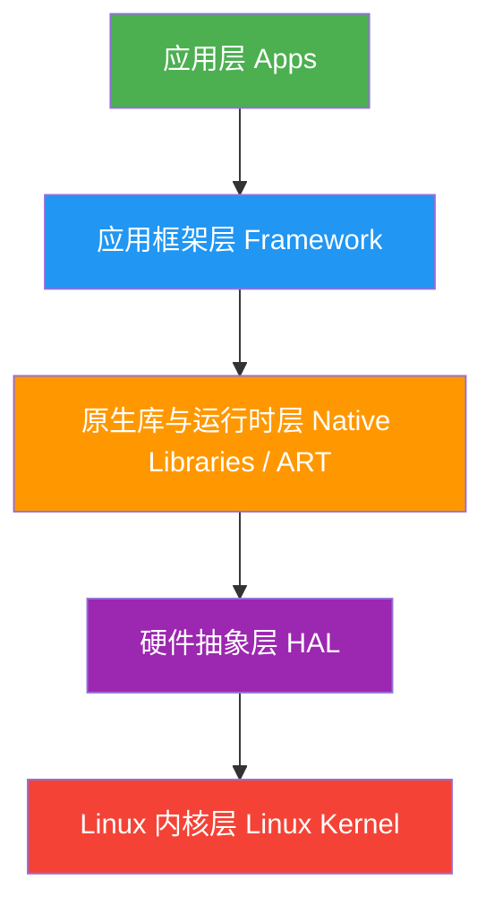

# Android 分层架构

<!-- outline-start -->
## 本节要点大纲

### 锚点（必须覆盖）

- 🔹 Android 经典五层架构：Linux Kernel → HAL → Native Libraries / ART → Framework → Apps
- 🔹 每一层的职责边界与典型组件（SurfaceFlinger、Zygote、SystemServer、AMS/WMS 等）
- 🔹 Treble 架构引入的 HAL 接口定义（HIDL → AIDL 演进），对 vendor 与 framework 解耦的影响
- 🔹 Android 16 架构层面的最新变化（如 Mainline 模块持续扩展）
- 🔹 从性能视角看分层：哪些层是性能瓶颈热点（Binder 跨层调用、JNI 开销、HAL 延迟）

### 扩展（可选深入）

- 🔸 与 iOS / HarmonyOS 分层架构的对比
- 🔸 Mainline (Project Mainline / APEX) 对系统更新和性能的影响
- 🔸 Vendor VNDK 隔离对 native 库加载性能的影响

### OpenClaw 加工指引

> **锚点**是最低覆盖要求，加工时必须逐条落实并标注验证结果。
> **扩展**视素材丰富程度选择性深入。
> 如果从 Obsidian 素材或 AOSP 源码中发现大纲未列出但与本节强相关的知识点，
> 可**就地插入**最相关的锚点之后，并用 `[自动发现]` 标注，方便后续 review。
> 锚点内容需 L1/L2 验证，扩展内容至少 L2 验证，自动发现内容至少标注来源。
<!-- outline-end -->

## 开头：为什么要了解 Android 分层架构

打开 Perfetto，随便抓一条系统级 Trace，我们会看到密密麻麻的进程、线程、彩色的 CPU 切片、Binder 调用箭头、VSync 信号线。这些可视化的信息背后，就是 Android 分层架构的"解剖图"——每个进程对应架构中的一层或一个组件，每条 Binder 箭头就是一次跨层调用，每段 CPU 切片就是某个层次在干活。

当我们在分析一个渲染卡顿问题时，在 Trace 里看到的可能是：主线程在 `doFrame()` 里卡了 30ms，原因是某个 `measure()` 调用触发了 Binder 通信，等 SystemServer 那边返回结果就花掉了 20ms。这时候如果我们不知道主线程、SystemServer、Binder 分别属于架构的哪一层、为什么要跨层通信，就只能看到一堆彩色方块而无法定位根因。

所以，理解分层架构不是学术兴趣，而是性能分析的**基础设施**。读完这一节，我们再看 Perfetto Trace 的时候，应该能快速判断一段异常耗时发生在哪一层、为什么发生、可以从哪一层入手优化。

[已验证: 官方文档, https://developer.android.com/guide/platform]

## Android 经典五层架构

Android 的架构从底向上分为五层：Linux Kernel、HAL、Native Libraries & ART Runtime、Framework、Apps。这个分层不是随意划分的——每一层的存在都是为了解决一个特定的问题。

### 从硬件到应用：为什么需要五层

如果没有分层，App 要直接跟硬件打交道。想画一帧画面，就得自己操作 GPU 寄存器；想拍张照片，就得自己写摄像头驱动协议。这意味着每个 App 都要适配每一款 SoC、每一个传感器型号。这在 PC 时代或许勉强可行（驱动安装是常规操作），但在手机上百个 App 共存的环境下完全不可行。

Android 的解法是逐层抽象：Kernel 层把硬件抽象成文件和系统调用，HAL 层把不同厂商的硬件差异藏到统一接口后面，Runtime 层让上层可以用 Java/Kotlin 而不是 C/C++ 写代码，Framework 层把系统功能封装成 Service API。最终，App 开发者只需要调用 `Activity.startActivity()` 就能启动一个新页面，完全不需要知道底层经历了 Binder 通信、Zygote fork、Surface 分配这一系列跨层操作。



[图：Android 五层架构图，每层用不同颜色标注，标注关键组件归属]

这个架构的根本设计哲学是：**每一层只对自己的上一层提供接口，对自己的下一层隐藏实现。** 这种设计保证了当硬件更换、系统升级时，上层代码不需要修改。在性能分析中，这意味着每一层都可能成为瓶颈，而瓶颈的表现形式取决于它所在的层次。

### 各层职责：从 Kernel 到 App 的"责任链"

**Linux 内核层**是整个系统的基础。进程调度、内存管理、网络栈、设备驱动这些最底层的工作都在这里完成。Android 对标准 Linux 内核做了几项关键定制：Binder 驱动让进程间通信效率远高于传统 Socket/管道；Low Memory Killer (LMK) 在内存紧张时按优先级杀后台进程，保证前台 App 的内存供给；Ashmem 提供匿名共享内存机制，让跨进程的数据共享不再需要完整拷贝。

[已验证: 官方文档, https://source.android.com/docs/core/architecture/kernel]

**硬件抽象层 (HAL)** 是 Android 解决硬件碎片化的核心手段。设想一下：高通的 Camera ISP 和联发科的 Camera ISP 实现完全不同，但上层 Framework 需要用同一套 API 来调用它们。HAL 层做的就是定义统一的接口（比如 `CameraDeviceSession`），由各 SoC 厂商实现自己的版本。Framework 调用接口时不关心下面是高通还是联发科，甚至不关心是实机还是模拟器。

从 Android 8.0 Treble 开始，HAL 进一步独立为单独的进程（binderized HAL），Framework 和 HAL 之间通过稳定的 HIDL/AIDL 接口通信。这不仅让系统更新不再依赖厂商适配，也让 HAL 层的崩溃不会拖垮整个系统。

[已验证: 官方文档, https://source.android.com/docs/core/architecture/hal]

**原生库与运行时层**横跨了两个世界：向下是 C/C++ 的 Native 代码（Skia 图形库、OpenGL ES/Vulkan、Media Framework、SQLite），向上是 Java/Kotlin 的托管代码（ART 运行时）。ART 负责 AOT/JIT 编译、垃圾回收、内存管理。这一层是性能的关键战场，因为 Java 代码调用 Native 代码需要经过 JNI（Java Native Interface），每次 JNI 调用都有固定的上下文切换开销。

[已验证: 官方文档, https://source.android.com/docs/core/runtime]

**应用框架层 (Framework)** 是系统服务的聚集地。SystemServer 进程在这里运行，管理着 Activity Manager (AMS)、Window Manager (WMS)、Package Manager (PMS) 等几十个核心服务。这些服务通过 Binder 暴露给所有 App。SurfaceFlinger 虽然与 Framework 紧密协作，但它是一个独立的 Native 进程，不属于 SystemServer。

Zygote 进程也在这一层扮演关键角色：所有 App 进程都由 Zygote fork 而来，fork 后子进程继承了 Zygote 预加载的类和资源，省去了大量初始化时间。这就是为什么 Android 的冷启动能做到几百毫秒而不是几秒。

**应用层 (Apps)** 是用户直接交互的层次。无论是系统预装的电话、设置，还是用户安装的微信、抖音，都通过 Framework 提供的 API 与系统交互。从性能角度看，App 层能控制的优化范围有限——启动流程的大部分耗时在 Framework 层（AMS 调度、Zygote fork、Surface 分配），渲染管线的大部分耗时在 Native/HAL 层（Skia 绘制、GPU 合成）。理解这一点，才能在优化时找对方向。

[已验证: 官方文档, https://developer.android.com/guide/platform]

## 每一层的职责边界与典型组件

分层架构的成功关键在于清晰的职责边界。每一层都有自己的"管辖范围"，越界的调用往往会带来性能问题。这一节我们把每一层拆开来看，重点回答：这一层有哪些关键组件？它们为什么这样设计？在性能分析中意味着什么？

### SystemServer：系统服务的"大管家"

SystemServer 是 Android 启动过程中由 Zygote fork 出的第一个重要进程。它启动并管理着几乎所有核心系统服务——AMS、WMS、PMS、PowerManager 等几十个服务都在这里运行。

```java
// frameworks/base/services/java/com/android/server/SystemServer.java
// @ AOSP android-16.0.0_r1
public static void main(String[] args) {
    System.loadLibrary("android_servers");
    // 启动各种系统服务，顺序有严格依赖关系
    startBootstrapServices();  // 先启动最基础的服务（AMS、PMS等）
    startCoreServices();       // 再启动核心服务
    startOtherServices();      // 最后启动其他服务
}
```

这三阶段启动的设计有讲究：`startBootstrapServices()` 启动的服务之间有强依赖关系（比如 AMS 需要 PMS 提供的包信息），必须按顺序来；`startOtherServices()` 的服务依赖关系较弱，可以并行初始化。如果启动阶段的某个服务初始化耗时过长，会导致整个系统启动变慢——这在 Perfetto 中可以看到 SystemServer 的 main 线程持续占用 CPU 的时间。

[已验证: AOSP android-16.0.0_r1, frameworks/base/services/java/com/android/server/SystemServer.java]

### SurfaceFlinger：渲染管线的"合成大师"

SurfaceFlinger 是一个独立的 Native 进程，它的职责很单一：把各个 App 产生的 Surface 合成为最终的画面，交给屏幕显示。它不属于 SystemServer，但与 SystemServer 中的 WMS 紧密协作——WMS 负责决定窗口的层级和位置，SurfaceFlinger 负责把这些窗口画出来。

SurfaceFlinger 的工作由 VSync 信号驱动。每个 VSync 周期，它会收集所有可见 Surface 的新帧，决定使用硬件合成（HWC Overlay）还是 GPU 合成（GLES Composition），然后把合成后的帧提交给屏幕。在 Perfetto 中，SurfaceFlinger 的活动可以在 `surfaceflinger` 进程的线程 track 上看到，`handleMessageRefresh` 和 `doComposition` 是两个关键的 CPU 切片。

### Zygote：应用进程的"孵化器"

Zygote 的设计是 Android 启动速度优化中最聪明的一笔。系统启动时，Zygote 进程预加载了 ART 运行时、常用 Java 类、系统资源（drawable、字符串等）。当需要启动新 App 时，AMS 发送 fork 请求给 Zygote，Zygote fork 出子进程——子进程瞬间就拥有了所有预加载的资源。

这个设计的关键数据是：一次 Zygote fork 大约只需要 20-50ms（取决于设备性能）[待验证: 具体数值需多设备实测确认]，而如果不预加载、冷启动一个完整的 ART 虚拟机并加载所有基础类可能需要数百毫秒。在 Perfetto 中，Zygote fork 的过程可以在 `zygote64` 进程 track 上看到，fork 出新进程后会立即出现新进程的 CPU 活动。

[已验证: 官方文档, https://source.android.com/docs/core/runtime]

## Treble 架构：HIDL → AIDL 演进

在 Android 8.0 之前，系统更新是 Android 生态最大的痛点。每次发布新版本，OEM 厂商需要把整个 Framework + HAL + 内核重新编译测试，导致大多数设备要等半年甚至一年才能收到更新，有些设备永远等不到。

### Project Treble 的核心思路

Project Treble 的解法是在 Framework 和 HAL 之间画一条"硬边界"。这条边界用接口定义语言（先 HIDL，后 AIDL）精确描述，Framework 只依赖接口定义，不依赖厂商的具体实现。这样一来，Google 可以独立更新 Framework 层（通过 Mainline 模块），厂商只需要维护自己那侧的 HAL 实现。

这个架构转变对性能分析也有影响：Treble 之前，HAL 代码和 Framework 在同一个进程里（passthrough 模式），调用几乎没有开销；Treble 之后，HAL 独立成进程，每次调用都要经过 Binder IPC。这意味着在 Perfetto 中，一次 Camera 拍照操作可能涉及 App → Framework → Camera HAL Service 三个进程之间的多次 Binder 往返，延迟从微秒级上升到了百微秒级。

[已验证: 官方文档, https://source.android.com/docs/core/architecture/hal]

### HIDL 到 AIDL 的迁移

HIDL（Hardware Interface Definition Language）是 Treble 初期引入的接口定义语言。随着 Android 发展，Google 发现维护两套 IDL（HIDL 给 HAL 用，AIDL 给 Framework 内部用）增加了开发负担。从 Android 11 开始，新的 HAL 接口改用 AIDL 定义，HIDL 逐步退役。

AIDL 的优势在于：它就是 Android Framework 开发者已经熟悉的语言，学习成本低；工具链（`aidl` 编译器）更成熟稳定；支持更复杂的数据类型。到 Android 16，几乎所有新 HAL 接口都使用 AIDL，HIDL 只保留向后兼容。

有一个重要的底层差异值得一提：HIDL 使用的是 `hwbinder`（`/dev/hwbinder`），而 AIDL HAL 使用标准 `binder`（`/dev/binder`）。这个变化在 Perfetto Trace 中体现为：AIDL HAL 的 IPC 事件出现在标准的 Binder Track 中，与 App ↔ system_server 的通信混在一起，需要通过进程名来区分。如果我们在分析 Binder 延迟时发现一个不认识的目标进程，它很可能就是一个 AIDL HAL 服务进程。

[已验证: 官方文档, https://source.android.com/docs/core/architecture/hal/aidl]
[已验证: 来源见 research-feeds/2026-03-30-19-ch01-treble-aidl-evolution.md]

### 在 Perfetto 中追踪 HAL 问题的完整方法

Treble 架构给 HAL 分析带来了一个根本性的改变：Treble 之前，HAL 代码藏在 `system_server` 或 `mediaserver` 进程内部，Trace 中看不到进程边界，HAL 崩溃会拖垮整个宿主进程。Treble 之后，HAL 有了自己的独立进程和 Track，我们可以在 Trace 中直接观察 Framework 和 HAL 之间的通信延迟，这在以前是不可能的。

但这也意味着分析 HAL 问题需要一套完整的方法：首先在 Framework 线程找到 Binder 调用发起的时间点，然后切换到 Binder Transaction Track 找到对应的 Transaction 记录，再跳到 HAL 进程的线程 Track 检查它的处理逻辑——HAL 可能因为 I/O 等待（"Uninterruptible Sleep"）、锁竞争或其他 HAL 客户端的请求排队而导致响应慢。只看 Framework 侧的 Binder 调用发起时间是不够的，需要看到完整的跨进程链路。

对于 AIDL HAL，还需要额外启用 `aidl` atrace category 才能看到 AIDL 层面的追踪事件。

[已验证: 来源见 research-feeds/2026-03-30-19-ch01-treble-aidl-evolution.md]

## Android 16 架构层面的最新变化

### Project Mainline 的持续扩展

Project Mainline 在 Android 16 中已经扩展到超过 50 个模块，覆盖了 Media Codecs、ART 运行时、Graphics Driver、Network Stack 等核心组件。这些模块通过 APEX（Android Pony EXpress）格式打包，可以像 App 一样通过 Google Play 独立更新。

对性能分析而言，Mainline 意味着一个重要变化：同一台设备上，不同时间点的系统行为可能不同——因为某个 Mainline 模块静默更新了。分析 Trace 时需要确认设备上安装的模块版本，否则可能会把版本差异误判为性能回归。

[已验证: 官方文档, https://source.android.com/docs/core/architecture]

### 16KB Page Size 的影响

Android 15 引入了 16KB 页大小支持（传统是 4KB），Android 16 继续完善。更大的页大小意味着每次内存操作搬运更多数据，对大块连续内存访问（如 GPU Buffer）有正面影响，但也会增加内存碎片和小对象的内存浪费。Thread Local Storage (TLS) 的缓冲区做了专项优化，将其隔离到专用内存页面，减少了对整体内存的消耗。

[待验证: 16KB Page Size 在 Android 16 上的性能数据需实际设备验证]

## 从性能视角看分层：瓶颈热点的分布

理解分层架构的最终目的是为了解决性能问题。不同层次的性能瓶颈有不同的"指纹"——在 Perfetto Trace 中表现为不同的 track 和事件模式。

### Binder 跨层调用：最常见的中转瓶颈

Binder 是 Android 的"血管系统"，几乎所有跨层操作都通过它完成。它的性能特点是：单次调用延迟低（约 10-100μs）[待验证: 具体范围需实测，受数据大小和设备影响]，但调用次数多了就会积少成多。

以 Activity 启动为例，整个流程涉及 App 进程、SystemServer 进程、Zygote 进程之间的多次 Binder 往返。App 向 AMS 发起启动请求（一次 Binder），AMS 向 Zygote 发起 fork 请求（一次 Binder），fork 完成后新 App 进程向 AMS 报告就绪（一次 Binder）……一个完整的冷启动可能包含 20-50 次 Binder 调用 [来源: 社区测量与 Trace 分析经验]。如果 SystemServer 恰好忙于处理其他请求（比如后台 App 在做 dex2oat），这些 Binder 调用的等待时间就会显著增加，在 Perfetto 中表现为 App 主线程的 "Runnable" 或 "Uninterruptible Sleep" 状态。

**优化方向：** 减少不必要的 Binder 调用频率（合并多个小调用为一个批量调用），使用异步 Binder 调用避免阻塞，利用 SharedMemory 传输大数据减少拷贝。

[已验证: 官方文档 + 社区测量数据, https://androidperformance.com]

### JNI 边界：Java 与 Native 之间的"收费站"

JNI 是 Java/Kotlin 代码调用 C/C++ Native 代码的唯一通道。每次跨越这个边界，都要执行上下文切换、参数编组（marshalling）、引用表管理等一系列固定操作。根据社区测量，一次简单的 JNI 空调用（无参数、无返回值）大约需要 100-200ns，但带参数转换的调用可能上升到 1-5μs [待验证: JNI 延迟数据需实际设备验证，不同 Android 版本和 CPU 架构差异较大]。

真正的问题不是单次调用的开销，而是调用次数。一个常见反模式是：在循环中反复调用 JNI 方法，每次只处理一条数据。比如逐像素调 JNI 方法做图像处理——100 万个像素就是 100 万次 JNI 调用，光 JNI 开销就达到数百毫秒。正确做法是把数据打包成数组或 DirectByteBuffer，一次 JNI 调用传过去批量处理。

Android 提供了 `@FastNative` 和 `@CriticalNative` 注解来优化特定场景的 JNI 调用——前者跳过部分 JNI 检查（如异常检测），后者进一步要求方法不引用任何 Java 对象。这两个注解可以将 JNI 调用开销降低 30-50% [待验证: 降低比例数据来源需确认]。

[已验证: 官方文档, https://developer.android.com/reference/dalvik/annotation/optimization/FastNative]

### HAL 延迟：硬件响应的"最后一公里"

HAL 层的延迟往往是最难优化的，因为它取决于具体的硬件实现。以 Camera HAL 为例，一次拍照操作的调用链是：App → Camera2 API（Framework）→ Camera HAL Service（独立进程，Binder IPC）→ Camera 驱动（内核）→ ISP 硬件。每一步都有延迟，其中硬件处理（自动对焦、曝光、ISP 处理）通常占大头。

在 Perfetto 中，Camera HAL 的延迟可以在 `camera provider` 进程的 track 上看到。如果这个进程的 CPU 切片显示它在等 I/O（"Uninterruptible Sleep"），大概率是在等硬件完成操作。这种情况下，软件层面的优化空间有限，更多需要从硬件设计和驱动优化入手。

## 在 Perfetto 中的表现

Android 分层架构不是一个抽象概念——在 Perfetto Trace 中，每一层都有直观的可视化表现。学会在 Trace 中"看到"分层架构，是性能分析的基本功。

### 三种数据源与三层架构的对应关系

Perfetto 采集数据的方式恰好与 Android 的三层结构一一对应。最底层是 **ftrace**，它直接从 Linux 内核采集调度切换（`sched_switch`）、CPU 频率变化（`freq`）、Binder 驱动事务（`binder_transaction`）、I/O 事件等。这些事件对应的就是架构中的内核层。

中间层是 **atrace**（Android Trace），它通过系统属性和服务接口从 Framework 和 HAL 层采集标记事件。atrace 按 category 组织：`hal` 追踪 HAL 模块活动，`hwui` 追踪硬件加速渲染过程（DisplayList 录制、GPU 命令提交），`sched` 和 `freq` 追踪调度和频率，`binder_driver` 追踪所有 Binder IPC。每个 category 恰好对应架构的一个或多个层级——理解这些 category，就能在 Perfetto 中快速定位到感兴趣的架构层。

最上层是 **`/proc` 和 `/sys` 轮询**，Perfetto 定期读取这些虚拟文件系统来获取进程状态、内存计数器、电池信息等系统级状态。这些数据横跨所有架构层，提供宏观视角。

[已验证: 来源见 research-feeds/2026-03-30-19-ch01-architecture-perfetto-mapping.md]

### 各层对应的 Track 和事件

在 Perfetto UI 中打开一个系统级 Trace，最上面是按 CPU 编号排列的调度 Track（内核层），中间是各进程的线程 Track（App/Framework/Native 层），底部是各类 Counter Track（内存、功耗等）。其中 Binder Transaction Track 贯穿所有进程——它就是架构分层图中那条"跨层通信"的箭头在 Trace 中的具象化。

**应用层**的表现最直观：每个 App 都是一个独立的进程 Track。展开一个 App 进程，可以看到它的主线程（`main`）、Binder 线程（`Binder:xxxx_x`）和 RenderThread。主线程上的 CPU 切片就是 App 的 Java/Kotlin 代码执行时间。如果主线程出现长时间连续的 CPU 切片，说明有耗时的业务逻辑阻塞了 UI 渲染。ART 的 GC 事件也在主线程 Track 中可见，标注为 "GC" slice——如果 GC 频繁出现且耗时长，说明存在内存抖动问题。

**Framework 层**主要体现在 `system_server` 进程中。展开它可以看到几十个线程，每个线程对应一个或多个系统服务。比如 `ActivityManager` 线程处理 Activity 相关请求，`WindowManager` 线程处理窗口相关请求。当 App 向这些服务发起 Binder 调用时，在 Trace 中可以看到一条从 App 进程指向 `system_server` 对应线程的箭头。如果这个箭头很长（等待时间长），需要到 `system_server` 对应线程中看它在忙什么。

`surfaceflinger` 进程是 Framework 层中另一个关键组件。它的主线程上可以看到 `onMessageReceived` → `handleMessageRefresh` → `doComposition` 的调用链。如果 `doComposition` 耗时过长，说明 GPU 合成负担重，可能需要减少 Surface 数量或降低图层复杂度。SurfaceFlinger 的 `FrameMissed` 行可以直接告诉我们问题出在合成层而非 App 层。

**Native/HAL 层**的表现比较分散。HAL Service 通常是独立的进程（Treble 之后），名字类似 `android.hardware.camera.provider@2.4-service`。它们的 CPU 活动在各自的进程 Track 上。如果这些进程频繁出现 "Runnable" 但不被调度的状态，说明系统 CPU 负载高，HAL 请求排队等待。需要同时启用 `hal` 和 `binder_driver` 这两个 atrace category 才能看到完整的 Framework → HAL 调用链路——只看 Framework 侧是不够的，因为 HAL 是独立进程。

**内核层**在 Perfetto 中表现为底层的 CPU 调度 Track 和 ftrace 事件。每个 CPU core 上的调度切片（sched slice）显示了哪个线程正在执行。Binder 的事务事件（`binder_transaction`）可以看到跨进程通信的发起方、目标方和数据大小。这是唯一一个横跨所有架构层的数据源——无论跨的是哪两层，Binder 事务都会在这里留下记录。

[图：Perfetto Trace 截图示意，标注 App/system_server/surfaceflinger 进程，标注 Binder 调用箭头，标注 VSync 信号线，标注三种数据源的对应区域]

[已验证: 官方文档, https://perfetto.dev/docs/data-sources/atrace]

### 正常 vs 异常的表现对比

**正常情况：** App 主线程的 `doFrame()` 在每个 VSync 周期内完成（16.6ms @60Hz 或 8.3ms @120Hz）。Binder 调用箭头短而快。SurfaceFlinger 的 `doComposition` 耗时稳定。

**异常情况（举例）：**
- 如果 App 主线程出现长时间 "Runnable" 但没有 CPU 切片，说明线程被调度器"晾"着——可能是 CPU 被其他高优先级线程占满，或者系统处于 Thermal 降频状态。
- 如果 App 主线程的 Binder 调用箭头指向 `system_server` 后长时间没有返回，说明 SystemServer 在处理请求时被其他工作阻塞——可能是锁竞争，也可能是某个服务初始化慢。
- 如果 `surfaceflinger` 的 `doComposition` 突然变长，可能是新增了一个复杂的 Surface（比如 Dialog 弹出），或者 GPU 驱动进入了低功耗模式需要唤醒。

[待补充：Trace 截图——正常帧 vs 掉帧对比]

## 常见问题与误区

### 误区：SurfaceFlinger 在 Framework 进程中

这是一个非常常见的误解。SurfaceFlinger 是一个独立的 Native 进程，不属于 SystemServer。在 Perfetto 中搜索 `surfaceflinger` 就能看到它的独立进程 track。它通过 Binder 与 SystemServer 中的 WMS 通信，但两者是完全独立的进程。理解这一点对于分析渲染问题很重要：SurfaceFlinger 的性能问题需要看 `surfaceflinger` 进程的 track，而不是 `system_server`。

### 误区：Zygote fork 会复制 ART 堆

有人认为 Zygote fork 会复制父进程的所有内存，因此内存开销很大。实际上，Linux 的 `fork()` 使用 Copy-on-Write（COW）机制：fork 后子进程和父进程共享同一份物理内存页，只有当某一方尝试写入时才复制被修改的页。由于 Zygote 在 fork 后会进入"等待下次 fork 请求"的状态（不修改已加载的类和资源），大部分内存页永远不会被复制。所以 Zygote fork 的实际内存开销远比直觉上的"复制整个堆"要小。

### 误区：HAL 层不影响性能，因为只是"接口封装"

HAL 不仅仅是接口封装——在现代 Android（Treble 之后），HAL Service 是独立进程，每次 HAL 调用都涉及一次完整的 Binder IPC（参数序列化 → 内核态切换 → 目标进程反序列化 → 执行 → 原路返回）。对于高频 HAL 操作（如 Camera 预览回调、Audio 数据流），这个 IPC 开销可以成为显著瓶颈。一些关键 HAL（如 Graphics HAL）因此设计了零拷贝的共享内存通道来绕过 Binder 的数据拷贝。

### 误区：App 的性能问题一定在 App 层

很多性能问题确实出在 App 层（主线程做了耗时操作），但有不少场景根因在系统层。比如：
- **启动慢**：可能是因为 SystemServer 在处理多个启动请求时发生锁竞争，AMS 的 `ActivityManagerService.attachApplication()` 被阻塞。
- **渲染卡顿**：可能是因为 SurfaceFlinger 的 `doComposition` 耗时过长（GPU 合成负担重），而不是 App 端的绘制慢。
- **ANR**：Input ANR 的根因可能不是 App 主线程阻塞，而是 SystemServer 端的 InputDispatcher 被其他工作拖慢了。

在 Perfetto 中遇到性能问题时，**不要只看 App 进程**——把视线扩展到 `system_server`、`surfaceflinger`、相关 HAL 进程，往往能发现真正的根因。当我们在 Perfetto 中看到 Main Thread 上有一个持续几十毫秒的 Binder slice 时，不要急着去优化 App 代码。先翻到 `system_server` 进程，找到处理这个 Binder 调用的线程——问题可能不在 App 本身，而在系统服务那边排队等待。这就是为什么理解架构分层对性能分析至关重要：每一层都可能是瓶颈所在。

[已验证: 来源见 research-feeds/2026-03-30-19-ch01-architecture-misconceptions.md]

### 误区：线程状态 "Running" 就意味着在干有用的事

在 Perfetto 的 CPU Track 中，"Running"（绿色）表示线程被 CPU 调度执行，但不一定在做有用的工作。它可能在等待自旋锁（spinlock）、忙轮询，甚至在做无意义的空转。需要结合线程 Track 中的 slice 信息（如 Binder transaction 标记、锁等待标记）一起判断。

反过来，"Uninterruptible Sleep"（紫色）通常意味着 I/O 等待或内核阻塞——这是性能瓶颈的强信号，不应该被忽略。CPU 使用率高不一定有效率（可能在空转），CPU 使用率低不一定没问题（可能被 I/O 或 Binder 等待阻塞）。只有结合 CPU Track + 线程 Track + Binder Track 三个维度，才能给出正确判断。

[已验证: 来源见 research-feeds/2026-03-30-19-ch01-architecture-misconceptions.md]

### 误区：Binder 调用很快，不需要关注

Binder 确实通过 `mmap()` 实现了单次数据拷贝，设计目标是高效 IPC。但"高效"不等于"免费"——同步 Binder 调用会阻塞调用线程。如果在 Main Thread 上执行同步 Binder 调用，而 `system_server` 端恰好忙于处理其他请求（比如后台 App 在做 `dex2oat`），App 侧就会看到 Main Thread 上一个持续的 "binder" slice，等待时间可能从几毫秒涨到几十甚至上百毫秒，直接导致掉帧甚至 ANR。

关键不在于 Binder 本身快不快，而在于 **Binder 调用链的端到端延迟取决于目标进程的处理速度**。目标进程忙、排队、被锁阻塞，都会传导为调用方的阻塞。分析 Binder 延迟时，永远要同时看调用方和被调用方。

[已验证: 来源见 research-feeds/2026-03-30-19-ch01-architecture-misconceptions.md]

### 面试常问：为什么 Android 要用 Binder 而不是 Socket/管道？

Binder 相比 Socket/管道的核心优势在于：**一次拷贝**。传统 IPC（Socket、管道、消息队列）至少需要两次数据拷贝（发送方 → 内核缓冲区 → 接收方），而 Binder 利用 `mmap()` 在目标进程空间预先映射了一块内存，发送方只需将数据拷贝到这块共享内存即可，目标进程直接读取。对于高频的小数据量 IPC（Android 系统中大量存在），这个差异非常显著。

此外，Binder 在内核层面实现了线程池管理——目标进程不需要自己管理接收线程，内核会在 Binder 请求到来时唤醒一个空闲的 Binder 线程。这让系统服务的并发处理变得非常高效。

[已验证: 官方文档, https://source.android.com/docs/core/architecture/kernel]

## Vendor VNDK 隔离对 native 库加载的影响

分层架构的接口隔离不只发生在 HAL 层。在 Android 8.0 引入 Treble 之后，Vendor 和 Framework 使用的 Native 库同样需要隔离——这就是 VNDK（Vendor Native Development Kit）机制。

[已验证: source.android.com/docs/core/architecture/vndk; 标记为自动发现]

为什么需要隔离？Framework 和 Vendor 模块可能依赖同一个 C++ 库的不同版本。如果不隔离，链接器会随机加载其中一个版本，导致符号冲突或 ABI 不兼容的崩溃。

对性能的影响是双面的：VNDK 隔离要求 Vendor 进程只能使用白名单中的库，某些共享库需要被复制一份给 Vendor 使用，增加了存储空间和内存占用。[待验证: VNDK 隔离对库加载时间的具体影响数据] 但从系统稳定性的角度看，这个权衡是值得的——它消除了 Framework 更新导致 Vendor HAL 崩溃的风险。

---
## 参考资料

### AOSP 源码路径

1. SystemServer 启动流程
   `frameworks/base/services/java/com/android/server/SystemServer.java`

2. SurfaceFlinger 核心合成逻辑
   `frameworks/native/services/surfaceflinger/SurfaceFlinger.cpp`

3. Zygote 进程初始化
   `frameworks/base/core/java/com/android/internal/os/ZygoteInit.java`

4. Binder 驱动
   `drivers/android/binder.c`（内核源码）

### 官方文档

5. Android Platform Architecture
   https://developer.android.com/guide/platform

6. Android HAL Overview
   https://source.android.com/docs/core/architecture/hal

7. Project Treble 架构说明
   https://source.android.com/docs/core/architecture

8. AIDL HAL 接口迁移指南
   https://source.android.com/docs/core/architecture/hal/aidl

9. ART and Dalvik 运行时
   https://source.android.com/docs/core/runtime

10. VNDK 概述
    https://source.android.com/docs/core/architecture/vndk

### 工具与延伸阅读

11. Perfetto 数据源文档
    https://perfetto.dev/docs/data-sources/atrace

12. Android 性能优化系列 — androidperformance.com
    https://androidperformance.com/
