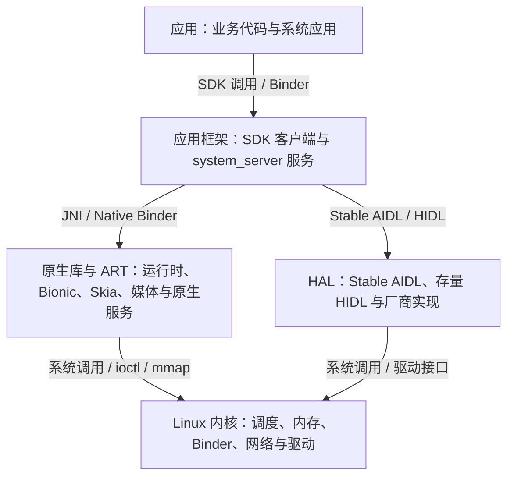

# 1.1 Android 分层架构

Android 的“五层架构”按职责划分系统组件，并不对应五个严格套叠的进程。一个应用进程同时包含应用代码、应用框架（Framework）客户端代码、Android 运行时（ART）和原生库。`system_server` 进程既运行 Java 系统服务，也加载 Java 原生接口（JNI）库；SurfaceFlinger 是独立的显示合成服务进程。硬件抽象层（HAL）既可能通过 Android 进程间通信机制 Binder 提供跨进程服务，也可能在旧实现中作为共享库加载到调用方进程。

这种分层仍适合用来确定排查方向。面对一次卡顿、启动慢或硬件访问延迟，先确定工作发生在哪个进程，再确认它通过 Binder、JNI、系统调用还是 HAL 接口进入下一个模块。进程、接口和调度状态共同构成证据，单看“属于哪一层”不足以定位问题。

## 五层分别解决什么问题

Android 通常从上到下分为应用、应用框架、原生库与 ART、HAL、Linux 内核五层：



图中的箭头表示常见接口，不表示所有请求都必须逐层经过。例如，应用可以直接通过 Bionic 发起文件系统调用，SurfaceFlinger 可以直接与 Composer HAL 和 Linux DRM 显示子系统或显示驱动交互，媒体数据也常通过共享缓冲区传递。

| 层次 | Android 17 中的典型对象 | 主要边界 | 性能分析入口 |
| --- | --- | --- | --- |
| 应用 | `Activity`、Compose/View、业务线程、RenderThread | SDK、Binder、JNI、文件与网络 API | 应用主线程、RenderThread、自定义跟踪事件（trace）、FrameTimeline |
| 应用框架 | `ActivityTaskManagerService`、`WindowManagerService`、`PackageManagerService` 等 `system_server` 服务 | Java Binder、原生 Binder、系统服务内部锁 | `system_server` Binder 线程、服务跟踪时间片（slice）、锁与调度状态 |
| 原生库与 ART | ART、Android C 标准库 Bionic、Skia、SQLite、SurfaceFlinger、AudioFlinger、媒体服务 | JNI、原生 Binder、共享内存、系统调用 | ART 垃圾回收（GC）/即时编译（JIT）、原生代码时间片、调用栈、原生堆与系统调用 |
| HAL | Stable AIDL HAL、存量 HIDL HAL、厂商服务或同进程实现 | Binder、hwbinder、快速消息队列（FMQ）、共享缓冲区、设备节点 | HAL 服务进程、Binder 事务、锁、输入输出（I/O）与硬件同步栅栏（fence） |
| Linux 内核 | 调度器、内存管理、Binder 驱动、网络栈、文件系统、DMA-BUF 与设备驱动 | 系统调用、`ioctl`、`mmap`、中断 | ftrace 内核跟踪、线程状态、CPU 频率、I/O、Binder 与驱动事件 |

本书的 Android 17 平台机制统一按 Android 开源项目（AOSP）的固定源码标签 `android-17.0.0_r1` 核对，内核机制统一按 Android Common Kernel（ACK，Android 公共内核）`android17-6.18-2026-06_r6` 核对。量产设备会在 ACK 之上增加片上系统（SoC）驱动、通用内核镜像（GKI）的厂商模块、产品配置和厂商调度策略，因此公共内核源码标签不能替代设备自己的内核提交版本与配置。

## 启动过程把这些层连在一起

Android 17 的 init 进程仍按第一阶段（first stage）、SELinux 访问控制初始化和第二阶段（second stage）执行。第二阶段的 init 解析 `.rc` 配置并启动 Zygote、SurfaceFlinger 等服务。Zygote 随后预加载常用类和资源，通过 `fork` 创建 `system_server`，再进入命令套接字（socket）循环，等待创建应用进程。

`frameworks/base/core/java/com/android/internal/os/ZygoteInit.java` 的 `main()` 给出了这条顺序：

1. 未启用延迟预加载（lazy preload）时调用 `preload()`。
2. 创建 `ZygoteServer`。
3. 主 Zygote 调用 `forkSystemServer()`。
4. 父进程进入 `zygoteServer.runSelectLoop()` 接收后续进程创建（fork）请求。

`system_server` 子进程最终进入 `SystemServer.main()`。下面的 Android 17 服务启动骨架比旧资料常列的三组多出第四个 `startApexServices()`，对应 APEX 可更新系统模块的服务阶段。

```java
// AOSP android-17.0.0_r1
// frameworks/base/services/java/com/android/server/SystemServer.java
startBootstrapServices(t);
startCoreServices(t);
startOtherServices(t);
startApexServices(t);
```

这段代码证明的是启动分组和调用顺序。它不能证明所有服务都在主线程串行完成初始化：各组内部可以使用专门线程或 `SystemServerInitThreadPool` 执行允许并行的工作。排查开机耗时时，应从 `SystemServerTiming`、init 服务事件和具体线程的时间片还原实际执行。

应用冷启动还会经过另一个方向：应用或桌面（Launcher）通过 Binder 请求 `system_server` 中的 Activity/Task 管理服务，系统服务通过 Zygote 套接字请求创建进程，子进程进入 `ActivityThread.main()`，再通过 Binder 向 `system_server` 完成应用绑定（attach）。这里同时存在 Binder 和本地套接字，不能把整条启动路径统称为 Binder 调用。

## 三类跨边界接口

### Binder：跨进程传递控制命令

Binder 由用户态 `libbinder` 与内核 Binder 驱动共同完成。Android 17 的 `frameworks/native/libs/binder/ProcessState.cpp` 定义了接收 Binder 事务的映射区，以及通过 `BINDER_SET_MAX_THREADS` 写入驱动的动态线程上限：

```cpp
// AOSP android-17.0.0_r1
#define BINDER_VM_SIZE ((1 * 1024 * 1024) - sysconf(_SC_PAGE_SIZE) * 2)
#define DEFAULT_MAX_BINDER_THREADS 15
```

`DEFAULT_MAX_BINDER_THREADS = 15` 不是进程内 Binder 线程总数，`ProcessState::startThreadPool()` 会另行启动池中的首个线程。只有在没有等待线程、没有尚未完成的增线程请求、驱动已请求启动的线程数低于 `max_threads`，且当前线程已经进入 Binder 事件循环（looper）等条件同时成立时，内核才会通过 `BR_SPAWN_LOOPER` 请求用户态增加线程。手工调用 `IPCThreadState::joinThreadPool()` 的线程也不包含在这 15 个驱动请求名额中。`setThreadPoolMaxThreadCount()` 会使用 `BINDER_SET_MAX_THREADS` 配置驱动，而且线程池启动后不能缩小已有上限。

这些常量不能直接变成“应用用 4 到 8 个、系统服务用 30 到 50 个”之类的通用建议。线程数太少会让长事务阻塞后续请求，线程数太多会增加并发、锁竞争和内存成本。调整前要用 Perfetto 系统跟踪和服务日志确认：

- 调用方是否在同步等待 Binder 回复；
- 目标进程是否没有空闲 Binder 线程；
- 处理线程是在运行、等待 CPU、等锁还是等 I/O；
- 长事务来自少数异常请求，还是稳定的并发容量不足。

Binder 事务数据由驱动从发送方用户空间复制到接收方可映射的 Binder 缓冲区，常被概括为“一次拷贝”。文件描述符转换、对象解析、权限检查、线程调度和目标服务执行仍会产生开销。同步 Binder 的端到端延迟由整条请求决定，不能用“一次拷贝”推导调用一定很快。

SELinux 也在 Binder 事务路径上参与授权。ACK `android17-6.18-2026-06_r6` 的 `security/selinux/hooks.c` 中，`selinux_binder_transaction()` 会检查 `BINDER__CALL`；当前凭据与事务发起方凭据不同时，还会检查 `BINDER__IMPERSONATE`。源码只能证明检查与条件存在；没有同设备、同策略与同负载的测量，不能给它写固定纳秒开销。

### JNI：同一进程里的托管代码与原生代码边界

JNI 不是进程切换，也不会因为进入 C/C++ 就自动发生 Binder 或内核态切换。它是同一进程内从 ART 托管执行环境进入原生函数的应用二进制接口（ABI）边界。成本来自调用约定、线程状态转换、引用管理、参数转换、数组或字符串的复制或固定，以及原生函数自身的工作。

优化 JNI 时优先减少跨边界次数和数据转换：

- 循环中的细粒度调用可以改成一次批量调用，但要同时评估额外内存与延迟。
- 大块二进制数据可以评估直接缓冲区（direct buffer）或其他共享表示，避免反复构造 Java 对象。
- `@FastNative` 与 `@CriticalNative` 只适用于满足签名和运行时约束的系统级场景，不能按一组固定倍数估算收益。

是否值得调整要用目标设备上的基准和调用栈判断。空 JNI 基准测试的纳秒结果不能代表包含字符串、数组、锁和 I/O 的业务调用。

### 系统调用与共享缓冲区：大量数据通常走另一条路径

高吞吐数据不适合反复塞进 Binder `Parcel`。图形、相机和音频通常用 Binder 传递控制命令，再用 BufferQueue、DMA-BUF 共享缓冲区机制、共享内存、快速消息队列（FMQ）或硬件缓冲区传递数据和同步信息。

这类问题要把控制命令、缓冲区生命周期和同步栅栏分开观察。一次相机请求可以很快完成 Binder 往返，却仍然长时间等待传感器、图像信号处理器（ISP）或缓冲区同步栅栏；一次显示提交也可能在 SurfaceFlinger 侧很短，而 GPU 或硬件合成器（HWC）的完成时间更晚。

## Treble、HIDL 与 Stable AIDL

HIDL 与 AIDL 都用于定义跨进程或 HAL 接口，但生成的传输代码与兼容规则不同。Project Treble 从 Android 8.0 开始约束系统框架与厂商实现之间的接口。VINTF 清单用于描述系统与厂商接口要求，它与框架端、设备端的兼容配置和稳定 HAL 接口共同决定 `system` 与 `vendor` 分区是否兼容。Treble 提供只更新系统框架所需的稳定接口，但不保证任意系统框架与任意厂商实现都能组合，具体组合仍要通过 VINTF 与兼容性测试。

HIDL 时代需要区分两种传输：

- 服务化（binderized）HIDL HAL 以服务进程运行，常使用 `/dev/hwbinder`。
- 直通式（passthrough）HIDL HAL 以共享库加载到调用方进程，调用路径中没有独立 HAL 服务进程。

新 HAL 接口已经转向 Stable AIDL。用于 `system`/`vendor` 边界的 AIDL HAL 需要声明 VINTF 稳定性，并以 Binder 服务运行。旧 HIDL HAL 仍可能为了兼容已有厂商镜像（vendor image）而保留，Android 17 设备上不能仅凭系统版本假定全部 HAL 都已经迁移。

排查 HAL 延迟时按实际传输模式处理：

1. 从应用框架或原生客户端找到接口调用与目标服务。
2. 服务化实现沿 Binder 调用进入 HAL 进程，检查服务线程、锁、系统调用与同步栅栏。
3. 直通式实现留在调用方进程，检查原生调用栈和共享库内部等待。
4. 涉及大量数据传输的请求继续追踪缓冲区、FMQ、DMA-BUF 与驱动事件，不能停在控制命令的回复位置。

## Android 15 到 Android 17 的三个架构边界

### 16 KB 页大小

从 Android 15 开始，AOSP 支持配置为 16 KB 页大小的设备。应用只包含 Java/Kotlin 代码时通常不需要为 ELF 对齐做改造；包含 Android 原生开发工具包（NDK）编译的库或通过 SDK 间接引入 `.so` 时，需要检查 ELF（Android 原生可执行文件和共享库使用的二进制格式）的 `LOAD` 段，以及 APK 内未压缩原生库的 ZIP 对齐。

设备运行时页大小可直接读取：

```bash
adb shell getconf PAGE_SIZE
```

`4096` 表示 4 KB，`16384` 表示 16 KB。Android Developers 文档公布的启动、功耗和系统启动收益来自 Google 的初始测试，并明确说明实际设备结果会不同。它们适合作为测试方向，不能作为任意应用或设备的预期收益。

Google Play 自 2025 年 11 月 1 日起要求面向 Android 15 及以上设备的新应用和更新支持 16 KB 页大小。这是应用分发兼容要求，不等于所有 Android 15、16 或 17 设备都运行在 16 KB 模式。

### Mainline 模块

Mainline 把一部分系统组件封装为 APEX 或 APK，使它们可以通过 Google Play 系统更新或合作伙伴 OTA 独立更新。Android 17 的 `SystemServer.run()` 也明确执行每个进程所需的 Mainline 模块初始化，并在常规服务组之后调用 `startApexServices()`。

分析问题时，Android 版本号不足以唯一确定 ART、Media、Wi-Fi、Bluetooth 等模块的实现。报告应同时记录构建指纹（build fingerprint）、相关 APEX/APK 版本和复现时间。模块更新可能改变实现，但仍受稳定 SDK/System API、稳定 C API 或 Stable AIDL 边界约束。

### VNDK 废弃与动态链接器命名空间

VNDK 用于约束 `system` 与 `vendor` 分区之间可使用的原生库，从 Android 15 开始废弃。新的 `vendor` 或 `product` 分区不再声明 `ro.vndk.version`，原 VNDK 库按厂商分区可用库（vendor-available library）的方式安装到 `vendor` 或 `product` 镜像；为旧厂商镜像提供兼容性的 VNDK APEX 仍可能存在。

VNDK 废弃没有删除动态链接器命名空间。Android 17 的 `bionic/linker/linker_namespaces.cpp` 中，隔离命名空间仍通过 `android_namespace_t::is_accessible()` 检查 `allowed_libs_`、库搜索路径和 `permitted_paths_`。这段源码支持“加载前存在可访问性校验”，不能推出固定的启动耗时比例。`dlopen()` 成本要结合加载库数量、搜索路径、文件系统缓存、重定位、RELRO 只读重定位保护和构造函数一起测量。

## SurfaceFlinger 说明了“层”和“进程”为什么不能混为一谈

WindowManagerService 运行在 `system_server`，负责窗口容器、层级、焦点、配置和策略。SurfaceFlinger 是 init 启动的独立原生服务，负责接收图层（layer）状态与缓冲区，借助 CompositionEngine、RenderEngine 和 Composer HAL 生成显示输出。二者协作，但不在同一进程，也不能简单归入同一个“应用框架进程”。

Android 17 的 `frameworks/native/services/surfaceflinger/SurfaceFlinger.cpp` 中，主刷新路径包含：

- `SurfaceFlinger::commit(...)`：提交本轮状态并决定是否需要合成。
- `SurfaceFlinger::composite(...)`：进入各显示设备的合成与显示提交（present）路径。
- `postComposition` 跟踪事件：记录合成后的处理阶段。

历史跟踪数据中的搜索词会变化：

| 版本范围 | 建议先查的 SurfaceFlinger 入口 | 使用范围 |
| --- | --- | --- |
| Android 17 | `commit <vsyncId>`、`composite <vsyncId>`、`postComposition` | 以 `android-17.0.0_r1` 为当前核对版本 |
| Android 15-16 | `commit <vsyncId>`、`composite <vsyncId>`；再按源码标签确认 `post-composition` 标记 | 不把 Android 17 的跟踪宏与名称直接套到旧源码标签 |
| Android 13-14 | `commit`、`composite` 与对应的 `post-composition` 路径 | 名称是否带 VSync ID 要以设备跟踪数据为准 |
| Android 11-12 | `onMessageInvalidate`、`onMessageRefresh`、CompositionEngine 显示提交路径 | 仍是消息驱动入口 |
| Android 10 及以前 | `onMessageReceived`、`handleMessageRefresh`、`doComposition` | 只用于历史设备与版本演进 |

`composite` 变长也不能直接判定 GPU 过载。还要检查 HWC 合成决策、显示提交同步栅栏（present fence）、RenderEngine、显示模式、图层数量和驱动等待。

## 在 Perfetto 中按因果关系定位

Perfetto 数据源与五层架构没有一一对应关系：

- `linux.ftrace` 可以提供调度、频率、I/O、Binder 驱动和部分驱动事件。它来自内核，但描述的线程可能属于应用、系统服务或 HAL。
- ATrace/TrackEvent 允许用户态代码主动记录跟踪事件。应用、应用框架、原生服务和 HAL 都可以产生时间片（slice），分类标签（category）是采集开关，不是架构层名称。
- 进程统计、堆分析、FrameTimeline、功耗计数器等数据源各自回答特定问题，不能合并成一个“上层数据源”。

一次跨进程等待可以按下面的顺序读：

1. 在调用方找到同步 Binder 时间片，确认发起线程和事务。
2. 沿流向关联（flow）找到目标进程的处理线程。
3. 检查目标线程处于 Running、Runnable、Sleeping 还是 Uninterruptible Sleep。
4. Running 表示线程正在 CPU 上执行，仍需用时间片或调用栈判断执行内容。
5. Runnable 表示已经可运行但尚未获得 CPU，结合优先级、CPU 利用率、频率和温控信息判断调度延迟。
6. Sleeping 可能是 Binder 回复、`futex` 锁等待、`epoll` 事件等待或定时等待；Uninterruptible Sleep 常见于不可中断的内核等待，但仍要用 `wchan` 记录的内核等待位置、I/O 与驱动事件确认对象。

Binder 流向关联只说明事务关系。调用方时间片的持续时间、目标线程的排队时间和服务执行时间需要分别计算，不能根据箭头视觉长度直接下结论。

## 三个常见排障场景

| 现象 | 第一组证据 | 向下追踪 | 不应直接得出的结论 |
| --- | --- | --- | --- |
| 应用主线程同步 Binder 很长 | 调用方 Binder 时间片、目标进程与目标线程 | 目标线程调度、锁、I/O、服务代码与下游 Binder | “Binder 驱动慢” |
| `surfaceflinger` 的 `composite` 变长 | SurfaceFlinger 主线程、CompositionEngine、HWC/RenderEngine 事件 | 合成类型（composition type）、同步栅栏、GPU/HWC、显示模式与图层变化 | “一定是应用绘制慢” |
| Camera 请求返回慢 | 应用框架、CameraService 与 HAL 之间的事务及请求 ID | HAL 线程、FMQ/缓冲区、同步栅栏、驱动与传感器时间 | “HAL 只是接口，不会产生延迟” |

定位不能停在调用 API 的进程，还要继续寻找接收进程、执行线程和内核等待对象。每多跨一个边界，都要保存事务 ID、线程 ID、时间范围或源码符号，避免只凭相邻事件建立因果关系。

## 容易混淆的六个判断

- **SurfaceFlinger 不在 `system_server`。** 它是独立原生服务；WMS 与 SurfaceFlinger 通过明确接口协作。
- **Zygote fork 不会立即复制全部物理内存。** 写时复制（Copy-on-Write）让父子进程共享未修改页面；后续写入、ART 运行和应用初始化会逐步产生私有页。
- **HAL 不等于独立进程。** Stable AIDL HAL 是 Binder 服务，存量 HIDL 还要区分服务化与直通式实现。
- **JNI 不等于 IPC。** JNI 在同一进程内跨托管/原生边界；原生函数随后是否发起系统调用或 Binder 是另一件事。
- **Binder 一次拷贝不等于端到端低延迟。** 排队、调度、权限检查、对象解析、目标服务和下游依赖都会进入总耗时。
- **应用现象不保证根因位于应用层。** `system_server`、SurfaceFlinger、HAL、驱动与硬件等待都可能把延迟传回应用。

## Android 17 源码入口

以下路径用于复核上述结论：

1. init 三阶段入口：`system/core/init/main.cpp`，AOSP `android-17.0.0_r1`。
2. Zygote 预加载、创建 SystemServer 与套接字循环：`frameworks/base/core/java/com/android/internal/os/ZygoteInit.java`，AOSP `android-17.0.0_r1`。
3. SystemServer 服务分组：`frameworks/base/services/java/com/android/server/SystemServer.java`，AOSP `android-17.0.0_r1`。
4. SurfaceFlinger 的 `commit()`/`composite()`：`frameworks/native/services/surfaceflinger/SurfaceFlinger.cpp`，AOSP `android-17.0.0_r1`。
5. Binder 用户态线程池：`frameworks/native/libs/binder/ProcessState.cpp` 与 `IPCThreadState.cpp`，AOSP `android-17.0.0_r1`。
6. 动态链接器命名空间：`bionic/linker/linker_namespaces.cpp`，AOSP `android-17.0.0_r1`。
7. Binder 驱动：`drivers/android/binder.c`，ACK `android17-6.18-2026-06_r6`。
8. Binder 的 SELinux 安全检查钩子：`security/selinux/hooks.c`，ACK `android17-6.18-2026-06_r6`。

固定源码标签、项目路径和符号一起使用，才能把架构图中的箭头还原成可验证的运行路径。
