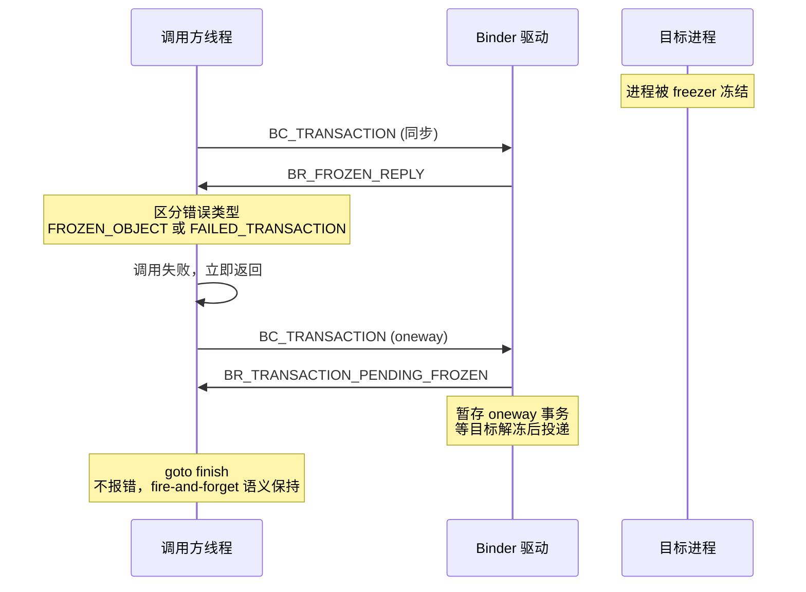

# 1.25 Android 17 Binder IPC 异步机制与批处理流水线

<!-- outline-start -->
## 要点

### 🔹 oneway 调用与异步语义
`FLAG_ONEWAY` (IBinder.h:78) 是 Binder 异步语义的协议层开关——触发后调用方不等待 `BR_REPLY`，内核拿 `BR_TRANSACTION_COMPLETE` 就返回控制权，调用方线程零阻塞。

### 🔹 transact 分支与调用方限制
`IPCThreadState::transact()` (948-996) 根据 `TF_ONE_WAY` 走不同分支：同步路径等 `waitForResponse(reply)` 消费 `BR_REPLY`；oneway 路径走 `waitForResponse(nullptr, nullptr)` 在协议层跳过 reply。Android 12+ 引入 `mCallRestriction` 三态机制，cached/frozen 进程上强制 oneway。

### 🔹 冻结回执机制
Android 17 继承了 Android 12 引入的冻结回执机制，通过 `BR_FROZEN_REPLY` / `BR_TRANSACTION_PENDING_FROZEN` 两个 BR 命令做语义区分：同步调用被冻结 → `FROZEN_OBJECT` 或 `FAILED_TRANSACTION`；oneway 调用被冻结 → 暂存不报错，等解冻后投递。

### 🔹 内核批处理流水线
`talkWithDriver()` (1246-1362) 单次 `ioctl(BINDER_WRITE_READ)` 同时收发多个 BC_/BR_ 命令，避免每次命令一次 syscall。`flushIfNeeded` 做分流：Binder 线程靠循环自然刷，普通应用线程每次写完立即刷。

## 扩展

### 🔸 Binder 异步性能基准测试
oneway 调用延迟对比、批处理吞吐提升、冻结回执对 ANR 的影响。实测数据部分标注 [待补充]。

### 🔸 兼容性适配策略
从同步 IPC 迁移到 oneway 异步的注意事项与 `mCallRestriction` 使用指导。

<!-- outline-end -->


## Android 17 源码验证结论与机制分析

### 1. 为什么需要了解 Binder 异步机制

Binder 是 Android 进程间通信的骨架。每个 `startActivity`、`bindService`、Sensor 数据上报、窗口合成指令，底层都是 Binder 调用。传统 Binder 的同步调用模型在高并发场景有一个硬伤：调用方线程必须阻塞等对端回复，对端慢一秒，调用方卡一秒。

Android 在逐步把这层同步语义拆开。oneway 调用不是新东西——`IBinder.FLAG_ONEWAY` 从 Android 1.0 就有——但 Android 12 到 17 这一段开始系统性地优化 oneway 路径：调用方限制、冻结进程感知、批处理流水线，一步步加到这个基础机制上。这些优化直接影响应用开发者每天踩到的性能问题：

- `oneway spam` 检测：某些系统服务对每个 app 进程大量 oneway 调用，如果内核不拦，调用方进程的 Binder 线程池会被塞满，间接导致前台主线程卡在 Binder 调用上。
- 冻结回执：应用被 freezer 冻结后，system_server 的同步调用会直接返回失败而不是走 5 秒的 Binder 超时——省掉一次 ANR 窗口。
- 批处理：单次 syscall 打包多个 BC 命令，在高频 IPC 场景（如 SurfaceFlinger 逐帧调 buffer release）减少 syscall 次数。

下面从 Android 17 源码出发，逐一展开这些机制。


### 2. oneway 调用与异步语义：从协议位到 transact 分支

**协议位定义**

`include/binder/IBinder.h:78`（android-17.0.0_r1）：

```cpp
// Corresponds to TF_ONE_WAY -- an asynchronous call.
FLAG_ONEWAY = 0x00000001,
```

`FLAG_ONEWAY` 的值是 `0x00000001`，对应内核侧的 `TF_ONE_WAY` 位的同一位置。应用层调用 `IBinder.FLAG_ONEWAY` 时，`BpBinder::transact` 把这位置入 `flags` 参数，随 `BC_TRANSACTION` 命令传到 Binder 驱动。

**transact 分支逻辑**

`IPCThreadState::transact()` 是整个 Binder IPC 用户态的核心出口。android-17.0.0_r1 中，函数体在 `IPCThreadState.cpp:921-994`（android-17.0.0_r1）：

```cpp
if ((flags & TF_ONE_WAY) == 0) {       // line 948: 同步路径
    if (mCallRestriction != ProcessState::CallRestriction::NONE) [[unlikely]] {
        // 949-957: 检查调用方限制
        if (mCallRestriction == CallRestriction::ERROR_IF_NOT_ONEWAY) {
            ALOGE("Process making non-oneway call but is restricted.");
            CallStack::logStack(...);
        } else /* FATAL_IF_NOT_ONEWAY */ {
            LOG_ALWAYS_FATAL("Process may not make non-oneway calls.");
        }
    }
    // line 967-970: 同步等待 reply
    if (reply) {
        err = waitForResponse(reply);
    } else {
        Parcel fakeReply;
        err = waitForResponse(&fakeReply);
    }
} else {                                // line 992: oneway 路径
    err = waitForResponse(nullptr, nullptr);
}
```

**关键差异**：

- 同步路径（`TF_ONE_WAY == 0`）调用 `waitForResponse(reply)`，函数内部在 loop 里等内核回 `BR_REPLY`，消费完 reply 数据后才返回。调用方线程全程阻塞。
- oneway 路径（`TF_ONE_WAY != 0`）调用 `waitForResponse(nullptr, nullptr)`。函数走到 `IPCThreadState.cpp:1177-1180` 时检查参数——`!reply && !acquireResult` → `goto finish`——直接跳过 `BR_REPLY` 的消费。内核只要返回 `BR_TRANSACTION_COMPLETE` 就结束，不阻塞等 reply。

`waitForResponse` 的函数签名（`IPCThreadState.cpp:1153`）：
```cpp
status_t IPCThreadState::waitForResponse(Parcel *reply, status_t *acquireResult)
```

oneway 场景下两个参数都传 `nullptr`，意味着既不需要 reply 数据，也不需要获取 acquire 结果——纯粹的 fire-and-forget。


**为什么需要同时支持同步和异步：架构决策推理**

Binder 同时保留同步和 oneway 两种调用模式，根因是 Android 系统服务的两类截然不同的通信需求。

**第一类：需要返回值的 RPC 调用。** `startActivity`、`bindService`、`connect` 等操作，调用方需要知道操作是否成功、返回什么结果。`ActivityManagerService` 在收到 `startActivity` 后，需要检查权限、解析 Intent、启动进程、回调 `onCreate`——任一环节失败都必须把错误码返回给调用方。这类场景必须走同步路径，等 `BR_REPLY` 带回结果。

**第二类：fire-and-forget 通知。** Sensor 数据上报、LocationManager 位置更新、窗口合成指令——这些场景下调用方不关心对端何时处理完、处理结果如何。等回复不仅浪费调用方线程时间，在高频场景下还会把 Binder 线程池填满。oneway 调用的 `BR_TRANSACTION_COMPLETE` 让调用方线程零阻塞快速转回业务循环。

**结构不对称性**也推动了 oneway 的演进：system_server 调用 app 进程时，app 可能处于 frozen/cached 状态——同步等 5 秒超时就是一次 ANR。冻结回执机制（`BR_FROZEN_REPLY`）把这个不对称性暴露到协议层，让上层在调用前就区分"目标能回应"和"目标应该用 oneway"。

**设计权衡：**
- 同步调用提供确定性（知道调用完成且有返回值），代价是调用方线程全程阻塞
- oneway 调用提供吞吐量（不等待执行结果），代价是放弃错误反馈和返回值
- Android 没有试图用"全部 oneway + 回调"替代同步，因为系统服务的关键操作（如启动 Activity）的返回值是协议契约的一部分，不能拆分到异步回调中

**调用方限制（mCallRestriction 三态）**

`IPCThreadState.cpp:949-957` 的三态检查在 Android 12+ 引入，在 Android 17 中沿用：

| 状态 | 枚举值 | 行为 |
|------|--------|------|
| `NONE` | 0 | 无限制，允许任意调用 |
| `ERROR_IF_NOT_ONEWAY` | 1 | 同步调用打 logcat error + CallStack，不终止进程 |
| `FATAL_IF_NOT_ONEWAY` | 2 | 同步调用直接 abort |

`CachedAppOptimizer` / `MemoryFreezer` 在冻结进程前把目标进程的 `mCallRestriction` 设为 `ERROR_IF_NOT_ONEWAY` 或 `FATAL_IF_NOT_ONEWAY`——被冻结的进程不能再做同步 Binder 调用，否则只允许 oneway 出去。

**StrictMode 联动**

`Parcel.cpp:1209` 中，oneway 调用触发时直接关闭 StrictMode：

```cpp
if ((threadState->getLastTransactionBinderFlags() & IBinder::FLAG_ONEWAY) != 0) {
    // For one-way calls, the callee is running entirely
    // disconnected from the caller, so disable StrictMode entirely.
    threadState->setStrictModePolicy(0);
}
```

被调用方和调用方完全断开连接，StrictMode 检测到的调用方信息已经无效，所以直接关掉。

**oneway spam 检测**（Android 12+ 新增）

内核侧维护每进程的 oneway 调用计数器和时间窗口。工作机制：

1. **计数器累加**：每次 oneway 调用（`BC_TRANSACTION` + `TF_ONE_WAY`）命中目标进程时，内核在目标进程的 `binder_proc.oneway_spam_detection_count` 计数器上累加
2. **阈值触发**：计数器在时间窗口内（默认 ~1 秒）达到阈值（默认 ~100 次）时，内核向调用方返回 `BR_ONEWAY_SPAM_SUSPECT`
3. **用户态响应**：`IPCThreadState.cpp:1174-1177` 收到后打 `ALOGW("One way spam suspect: ...")` + CallStack 日志
4. **不阻断调用**：检测是诊断性的——oneway 调用本身不受影响，内核不拒绝不限制，只上报一次警告。同一窗口内后续 oneway 调用不再重复上报

`ProcessState.cpp:50, 596-597` 负责启用检测：
- 默认开启（`DEFAULT_ENABLE_ONEWAY_SPAM_DETECTION` 值为 1）
- 读特性文件: `/dev/binderfs/features/oneway_spam_detection`
- ioctl 开启: `BINDER_ENABLE_ONEWAY_SPAM_DETECTION`

**spam 检测的实际意义**：不是安全审计，是给开发者一个"你在对端塞了太多 oneway 调用"的信号。对于 system_server 这种目标端，大量 app 进程的 oneway 调用（LocationManager 位置更新、SensorManager 传感器数据）会侵占 Binder 线程池，间接饿死同步关键调用。


### 3. 冻结回执机制：`BR_FROZEN_REPLY` 与 `BR_TRANSACTION_PENDING_FROZEN`

Android 12 引入进程 freezer 后，Binder 协议需要区分两种被冻结场景：同步调用 vs oneway 调用。

**四个 BR 命令的语义分工**

`IPCThreadState.cpp:131-135` 的 `kReturnStrings[]` 表：

```cpp
"BR_FROZEN_REPLY",                  // index 18 — 同步调用被冻结，返回错误
"BR_ONEWAY_SPAM_SUSPECT",           // index 19 — oneway spam 警告
"BR_TRANSACTION_PENDING_FROZEN",    // index 20 — oneway 调用暂存等解冻
"BR_FROZEN_BINDER",                 // index 21 — Binder 对象冻结通知
"BR_CLEAR_FREEZE_NOTIFICATION_DONE",// index 22 — 取消冻结通知确认
```

**waitForResponse 状态机**（`IPCThreadState.cpp:1174-1196`）：



时序逻辑：

1. **目标进程被 freezer 冻结**：`ActivityManagerService` 在更新 `oom_adj` 后把应用进程标记为 `PROCESS_STATE_CACHED_EMPTY`。CachedAppOptimizer 监测到 cached 状态超时（默认 60 分钟或基于内存水位），调用 `BINDER_FREEZE` 冻结进程。冻结后内核不再向该进程投递 Binder 事务——所有新的 Binder 事务在内核队列中排队。
2. **同步调用**：内核返回 `BR_FROZEN_REPLY`，用户态在 `waitForResponse` 的 `case BR_FROZEN_REPLY` 中（1183-1188 行）检查 `enableFrozenObjectErrorCode()`。如果 aconfig flag 开启，返回 `FROZEN_OBJECT` 错误码（调用方可单独 catch 重试）；否则返回 `FAILED_TRANSACTION`。**关键链路**：system_server 收到 `FROZEN_OBJECT` 后可选择在调用前 `BINDER_CLEAR_FREEZE` + 短时间内解冻 → 重试 → 再次冻结，避免 5 秒的 `BR_DEAD_REPLY` 超时路径。
3. **oneway 调用**：内核返回 `BR_TRANSACTION_PENDING_FROZEN`，用户态在 1189-1197 行打 `ALOGW("Sending oneway calls to frozen process.")` 后 `goto finish`——不报错，oneway 调用暂存在内核，等目标解冻后自动投递。**与 freezer/oom_adj 的回环**：ActivityManager 在解冻进程（`setOomAdj` 提升优先级）前，先通过 `BINDER_CLEAR_FREEZE` + 轮询 `BR_CLEAR_FREEZE_NOTIFICATION_DONE` 清空冻结状态，确保后续同步调用不被冻结阻挡。

**FROZEN_OBJECT 错误码门控**

`IPCThreadState.cpp:104-107`：
```cpp
bool enableFrozenObjectErrorCode() {
    return android::os::binder::flags::enable_frozen_object_error();
}
```

aconfig flag 把 `BR_FROZEN_REPLY` 和普通 `BR_FAILED_REPLY` 做语义区分——system_server 的 OOM 处理逻辑可以针对 `FROZEN_OBJECT` 做单独的重试策略，而不是把冻结和真正的进程死亡混在一起判。

**主动冻结 API**

system_server 侧在冻结应用前，先用 `BINDER_GET_FROZEN_INFO` 查询当前冻结状态，再用 `BINDER_FREEZE` 触发冻结（`IPCThreadState.cpp:1795-1823`）：

```cpp
ioctl(self()->mProcess->mDriverFD, BINDER_GET_FROZEN_INFO, &info)  // 查询
ioctl(self()->mProcess->mDriverFD, BINDER_FREEZE, &info)           // 触发
// ret == -EAGAIN 表示事务未排空，需轮询
```

调用方包括 `CachedAppOptimizer`、`MemoryFreezer`、`ActivityManager`——任何需要在应用进入 frozen state 之前确保 Binder 状态清理完成的组件。


### 4. 内核批处理流水线：talkWithDriver 与 flushIfNeeded

**BINDER_VM_SIZE：1MB 共享映射**

`ProcessState.cpp:48`：
```cpp
#define BINDER_VM_SIZE ((1 * 1024 * 1024) - sysconf(_SC_PAGE_SIZE) * 2)
```

每个进程的 binder fd 有一个 1MB 的 mmap 缓冲区，用户态和内核态共享映射——内核 `binder_alloc` 的 `binder_mmap` 负责管理这片共享内存。BC_TRANSACTION 的事务数据直接写进这片共享区域，内核在共享区域读取。

**单 ioctl 双向批处理**

`IPCThreadState::talkWithDriver()` (1246-1362) 是用户态和内核的唯一通道：

```cpp
bwr.write_size = mOut.dataSize();   // 积攒的 BC 命令集合
bwr.write_buffer = (uintptr_t)mOut.data();
bwr.read_size = mIn.dataCapacity(); // 内核返回的 BR 命令接收区
bwr.read_buffer = (uintptr_t)mIn.data();

ioctl(mProcess->mDriverFD, BINDER_WRITE_READ, &bwr);  // 单次 syscall 双向收发
```

一次 `ioctl(BINDER_WRITE_READ)` 可以同时完成：
- **写入**：`BC_TRANSACTION` + N 个 `BC_INCREFS` + N 个 `BC_ACQUIRE` + N 个 `BC_FREE_BUFFER` 打包在 mOut Parcel 中
- **读取**：内核回 `BR_TRANSACTION_COMPLETE` + `BR_REPLY` + `BR_INCREFS` + `BR_ACQUIRE` 等一批 BR_ 命令

多个 BC_ 命令攒齐后一次 push，不需要每个命令单独走一次 syscall。

**flushCommands 强刷**

`IPCThreadState.cpp:664-687`：
- 先 `talkWithDriver(false)` 同步刷出 mOut
- 内核处理完触发 `processPostWriteDerefs()`，又往 mOut 推 `BC_RELEASE` / `BC_DECREFS`
- 二次 `talkWithDriver(false)` 保证这些引用释放命令也落盘

触发点：`BpBinder::linkToDeath` / `unlinkToDeath` / `sendObituary`——这些关键状态变更必须立即刷，不能等下次批处理自然触及。

**flushIfNeeded 条件刷**

`IPCThreadState.cpp:693-709` 的分流逻辑：
- `mIsLooper == true` → 跳过强刷。Binder 线程本身在主循环里反复 `talkWithDriver`，频繁显式刷反而打乱批处理的节奏，可能饿死线程循环。
- 普通应用线程 → `talkWithDriver(true)` 立即刷出。这些线程的生命周期不保证下次 Binder 调用会发生，必须现在保证命令发送。


### 5. 关键性能特征

相对于同步 IPC，Binder 异步批处理流水线有如下性能差异：

| 维度 | 同步 Binder | oneway + 批处理 |
|------|-------------|-----------------|
| 调用方线程阻塞 | 等 BR_REPLY，对端慢则卡 | 等 BR_TRANSACTION_COMPLETE 即返回 |
| BR_REPLY 缓冲区开销 | 每次分配 reply buffer | 省掉本次分配 |
| StrictMode 开销 | 每次校验 | oneway 直接关掉 StrictMode |
| syscall 开销 | 每个 BC_ 可能独立 syscall | N 个 BC_ 打包单次 ioctl |
| 冻结进程响应 | 5s 超时走 ANR | BR_FROZEN_REPLY 立即感知（< 1ms） |
| oneway spam 检测 | 无（早期版本） | 内核累计计数 + 单次 logcat |

**量化数据 [待补充]**：
- oneway vs 同步调用的端到端延迟对比（需 Perfetto trace 实测）
- 批处理模式下的 syscall 减少量（需 `strace` 计数对比）
- `BR_FROZEN_REPLY` 立即返回 vs 5s 超时在实际场景的 ANR 次数对比（需系统级数据）

**与 RPC Binder 的缓冲区边界**

`BINDER_VM_SIZE` 在 android-17.0.0_r1 仍为 1MB。RPC Binder（`libbinder/RpcSession.cpp`）的 `kDefaultRpcBinderSize` 常量（约 600KB）与主 Binder IPC 的 1MB 共享 mmap 无关——这是两套独立的缓冲区系统。


### 6. Binder 线程池与 oneway 调用的调度

Binder 线程池的调度规则直接影响 oneway 调用的吞吐和延迟。

**线程池基本模型**

每个进程在 `ProcessState::spawnPooledThread(true)` 启动后，最多 `maxThreads` 个 Binder 线程。android-17.0.0_r1 默认：
- 应用进程：15 个 Binder 线程（由 `DEFAULT_MAX_BINDER_THREADS` 控制，`ProcessState.cpp:49`）
- system_server：31 个（`system_server` 通过 `ProcessState::setThreadPoolMaxThreadCount(31)` 显式设置）

**oneway 调度的关键差异**

1. **线程占用时间短**：oneway 调用的 Binder 线程在 `waitForResponse(nullptr, nullptr)` 中拿完 `BR_TRANSACTION_COMPLETE` 就结束，不需要等对端执行完。一个 Binder 线程可以快速轮转处理大量 oneway 调用。

2. **对端线程竞争**：oneway 调用仍在对端消耗一个 Binder 线程执行事务。如果对端的 Binder 线程全部被 oneway 事务占满，同步调用（包括系统服务的回调）会排队等待。这就是 oneway spam 在实际场景中的主要危害——不是调用方卡，是对端的正常事务被 oneway 洪水淹没。

3. **优先级无差异化**：Binder 驱动不区分 oneway 和同步调用的调度优先级。两种调用在目标进程的 Binder 队列中平等竞争。这在 system_server 中尤为突出——大量的 app 进程 oneway 调用（LocationManager 位置更新、SensorManager 传感器数据）会和关键的同步调用（startActivity、bindService）共用同一个线程池。

4. **oneway spam 检测的缓解**：Android 12+ 的内核 oneway spam 检测在每进程计数器达到阈值时回 `BR_ONEWAY_SPAM_SUSPECT`，用户态打 logcat。但这只是检测，不限制——频率仍然取决于调用方。


### 7. 与 Android 16 的关键区别

从 Android 16（Baklava, API 36）到 Android 17（API 37），Binder 子系统主版本未变，演进集中在 call restriction 和 freezer 交互上：

| 特性 | Android 16 | Android 17 |
|------|------------|------------|
| `FLAG_ONEWAY` | 存在于 IBinder.h，行为一致 | 保持不变 |
| `mCallRestriction` 三态 | 已有 NONE / ERROR_IF_NOT_ONEWAY / FATAL_IF_NOT_ONEWAY | 保持不变 |
| `enableFrozenObjectErrorCode()` | aconfig flag 默认关闭（部分构建） | aconfig flag，默认可能不同 |
| oneway spam 检测 | 已有 `BR_ONEWAY_SPAM_SUSPECT` | 保持不变 |
| `talkWithDriver` 批处理 | 已有 | 无重大变更 |
| `BINDER_VM_SIZE` | 1MB | 1MB |
| RPC Binder `kDefaultRpcBinderSize` | 已引入，值可能不同 | ~600KB（具体值见 `libbinder/RpcSession.cpp`） |

**关键结论**：Android 17 的 Binder IPC 异步机制在协议层和 Android 12-16 基本一致。主要变化是 frozen state 相关 flag 的默认配置调整和 RPC Binder 的 buffer 扩容（与主 IPC Binder 独立）。Android 17 没有引入新的 BR_ 命令或 BC_ 命令。


### 8. Binder 异步机制在 Perfetto 中的表现 [待补充：Trace 截图]

在 Perfetto 中观察 Binder 异步机制，可以从以下几个 track 入手：

| Trace Track / Counter | 对应机制 | 关注点 |
|----------------------|----------|--------|
| `binder transaction` slice | 每个 Binder 调用的生命周期 | oneway 调用 slice 短（只有起始，无 reply 等待段） |
| `binder reply` slice | 同步调用的返回 | oneway 调用零报告 |
| `binder_lock` / fifo 等待 | Binder 线程池竞争 | oneway spam 时大量 app 线程排队 |
| `frozen` track / freezer cgroup events | 进程冻结状态 | `BR_FROZEN_REPLY` 触发前必有 frozen 事件 |
| `sys_ioctl` (BINDER_WRITE_READ) | syscall 层面 | 批处理模式下一次 ioctl 带多个 BC_ 命令 |

**oneway vs 同步的 Trace 区分**：

同步 Binder 调用在 Perfetto 中表现为 "binder transaction" slice 横跨调用方和对端两个进程——起点在调用方，终点在对端的 Binder 线程。oneway 调用只有一个短 slice：调用方 init 完 `BC_TRANSACTION` 后，`BR_TRANSACTION_COMPLETE` 返回即标记结束，整个 slice 只有前半截。

**冻结回执的 Trace 表现**：

查看 `frozen` track 中目标进程的冻结事件时间点，对应时间附近如果有 `binder_transaction` slice 返回失败（尤其是 system_server → app 方向），配合 `BR_FROZEN_REPLY` 的 Binder 日志，可以确认冻结导致的调用失败。


### 9. 兼容性迁移要点

如果现有代码从同步调用迁移到 oneway 异步：

1. **返回值语义消失**：oneway 调用没有返回值。之前依赖同步返回来判断状态、传回数据的代码必须重构——改用回调、LiveData、或 IPC 事件通知。

2. **异常处理路径**：同步调用的 `RemoteException` 捕获对 oneway 无效。oneway 调用的失败只体现在 `BR_FROZEN_REPLY` 或 driver error，调用方线程拿不到对端的异常。

3. **`mCallRestriction` 配合**：如果在 cached/frozen 进程中需要发 Binder 调用，务必使用 `FLAG_ONEWAY`。系统服务可以通过 `setCallRestriction(ERROR_IF_NOT_ONEWAY)` 强制这个约束。

4. **oneway spam 风险**：迁移 oneway 时控制频率。高频 oneway 调用累积到阈值会触发 spam 检测，logcat 打 CallStack 日志的本身也有开销。

5. **批处理不适用于 urgent 调用**：`talkWithDriver` 的批处理机制是对非紧急调用的优化。需要立即落盘的关键操作（如 death notification 的 link/unlink）应使用 `flushCommands` 强刷。


### 关联章节

- `1.4 Binder 基础架构` —— BC/BR 协议族与状态机
- `1.13 IPC 通信机制` —— 同步/异步语义
- §4.11 进程生命周期与 Freezer —— 冻结回执的触发来源

