# 1.2 系统启动全流程

“开机耗时”必须先定义终点。Bootloader 把控制权交给内核、`system_server` 进入 `run()`、屏幕被允许点亮、桌面应用（Launcher）提交首帧、用户收到 `LOCKED_BOOT_COMPLETED` 或 `BOOT_COMPLETED`，都可以成为里程碑，但它们回答的问题不同。比较设备或版本时，如果起点和终点不一致，数字没有可比性。

Android 17 的主启动路径可以概括为：

```mermaid
flowchart LR
    ROM["Boot ROM"]
    BL["Bootloader / AVB / slot 选择"]
    K["Linux Kernel"]
    F["first-stage init"]
    S["SELinux setup"]
    I["second-stage init"]
    Z["Zygote preload 与 fork SystemServer"]
    SS["SystemServer 启动服务"]
    H["启动 Home"]
    UI["Launcher 首帧与输入可用"]
    BC["per-user boot completed 广播"]

    ROM --> BL --> K --> F --> S --> I --> Z --> SS --> H --> UI --> BC
```



这是一条主线，不代表所有工作都严格串行。驱动探测（probe）、init 服务、APEX 模块准备、SystemServer 内部初始化和 Virtual A/B 快照合并（snapshot merge）都可能并行执行或争用 CPU、存储与锁。

## Boot ROM、Bootloader 与 Verified Boot

Boot ROM 是片上系统（SoC）固化的第一段代码，负责最小硬件初始化并建立信任链起点。Bootloader 选择启动槽位（slot），校验并加载 `boot` 镜像、内核、初始内存盘（ramdisk）、设备树（device tree）等内容，再把启动参数交给内核。

Android Verified Boot（AVB）用于校验可执行代码和只读数据的完整性。较小的 `boot`、`dtbo` 等分区通常在加载时整体校验；`system`、`vendor` 等大分区可以通过 dm-verity 的哈希树，在读取存储块（block）时验证。dm-verity 的校验位于实际 I/O 路径中，不能简单写成“开机时把整个 `system` 分区重新哈希一遍”。

Bootloader 阶段通常不在 Android Perfetto 系统跟踪数据中。分析这段时间要使用 SoC/Bootloader 日志、串口、Bootloader 上报的启动耗时属性和 `bootstat` 记录。跨机型比较前还要确认两个设备是否上报了同名、同起点的里程碑。

## Linux 内核：建立 Android 用户空间的运行条件

内核完成 CPU、内存管理、调度器、中断、设备模型、文件系统与必要驱动初始化，并启动 PID 1。内核源码标签与平台源码标签属于两套版本体系：本书用 Android Common Kernel（ACK，Android 公共内核）`android17-6.18-2026-06_r6` 解释 Android 17 的公共内核实现，量产设备还要核对自身的内核提交版本、配置、设备树和厂商模块。

启动期常见的内核耗时来源包括：

- 启动关键驱动（boot-critical driver）的同步探测阻塞后续初始化；
- 存储、加密或 dm-verity 路径上的 I/O 延迟；
- 厂商模块的依赖顺序错误，造成等待或重复探测；
- CPU 频率、温控或调度配置让关键线程长时间处于 Runnable（已经可以运行但尚未获得 CPU）。

异步探测和延迟加载只适合非启动关键设备。官方启动耗时文档给出的 `module_name.async_probe=1` 需要结合设备依赖验证；显示、存储、加密或启动必需总线若被错误推迟，可能把耗时转移为服务等待，甚至让设备无法启动。结论应由 `dmesg` 内核日志、init 服务等待、ftrace 的内核初始化函数（initcall）/模块事件和实际设备配置共同支持。

## init 的三个执行阶段

Android 17 的 `/init` 不是一次进入后从头跑到底。`system/core/init/main.cpp` 根据参数进入三个入口：

```cpp
// AOSP android-17.0.0_r1
if (!strcmp(argv[1], "selinux_setup")) {
    return SetupSelinux(argv);
}
if (!strcmp(argv[1], "second_stage")) {
    return SecondStageMain(argc, argv);
}
return FirstStageMain(argc, argv);
```

这三个入口由 `execv()` 依次连接，运行在不同的初始化条件下。排障时应先确认耗时属于第一阶段、SELinux 初始化还是第二阶段，再选择对应日志和源码路径。

### 第一阶段 init（first stage）

`FirstStageMain()` 建立早期用户空间（early userspace）所需的文件系统和设备条件，通过 `FirstStageMount::DoFirstStageMount()` 挂载启动必需分区，处理 ramdisk 与根文件系统切换，然后 `execv("/system/bin/init", {"selinux_setup"})`。

这一阶段发生在完整属性服务、常规 init 动作（action）和大部分 Android 守护进程启动之前。早期挂载变慢时，应检查 `fstab` 挂载配置、块设备、device-mapper 设备映射层、AVB/dm-verity、快照和存储 I/O，不能直接归因于 `system_server`。

### SELinux 初始化

`SetupSelinux()` 调用 Android SELinux 策略加载路径，设置强制模式（enforcing），给 init 可执行文件恢复安全上下文，再 `execv("/system/bin/init", {"second_stage"})`。这一步有独立的执行阶段，不能混入第一阶段挂载或第二阶段 `.rc` 解析。

策略规模、文件读取和设备存储会影响耗时，但 AOSP 源码不能给出某台设备固定的毫秒数。测量应使用对应构建的内核/init 日志和系统跟踪数据。

### 第二阶段 init（second stage）

`SecondStageMain()` 初始化属性服务、解析 `.rc` 文件、创建服务（service）/动作对象并执行动作队列（action queue）。Android 17 的 `LoadBootScripts()` 默认读取：

- `/system/etc/init/hw/init.rc`：主 init 脚本和全局动作。
- `/system/etc/init`、`/system_ext/etc/init`：平台与 `system_ext` 扩展服务。
- `/vendor/etc/init`、`/odm/etc/init`：设备和厂商服务。
- `/product/etc/init`：产品级服务和动作。

看到一个服务启动慢时，先用进程可执行文件、`.rc` 定义位置和触发条件（trigger）确定归属。把所有服务都归到主 `init.rc` 会漏掉 `vendor`、`odm`、`product` 和 APEX 配置。

## Zygote 启动前必须满足的条件

Android 17 的 `system/core/rootdir/init.rc` 在 `late-init` 流程中触发 `zygote-start`。对应动作如下：

```rc
# AOSP android-17.0.0_r1
on zygote-start
    wait_for_prop odsign.verification.done 1
    start statsd
    start zygote
    start zygote_secondary
```

`odsign` 负责校验设备上生成的 ART 编译产物，因此 `odsign.verification.done` 未就绪会直接推迟 Zygote。OTA、ART APEX 变化或编译产物异常后，如果 Zygote 启动点明显后移，应先量出 `wait_for_prop` 的等待区间，再核对 `odsign` 和 ART 的 dexopt 编译优化产物。不能只看 Zygote 的 `PreloadClasses`。

## Zygote：预加载、创建 SystemServer、等待应用请求

init 的 Zygote `.rc` 服务通过 `app_process` 启动 `ZygoteInit.main()`，并给主 Zygote 传入 `--start-system-server`。Android 17 的主 Zygote 执行顺序是：[已验证: `frameworks/base/core/java/com/android/internal/os/ZygoteInit.java` @ AOSP `android-17.0.0_r1`]

1. 默认模式调用 `preload()`，加载类、资源、共享库和其他公共运行时内容。[已验证: `ZygoteInit.java` @ AOSP `android-17.0.0_r1`]
2. 创建 `ZygoteServer`。[已验证: `ZygoteInit.java` @ AOSP `android-17.0.0_r1`]
3. `--start-system-server` 存在时，主动调用 `forkSystemServer()` 创建 SystemServer 进程。[已验证: `ZygoteInit.java` @ AOSP `android-17.0.0_r1`]
4. 子进程进入 `handleSystemServerProcess()` 并最终运行 `SystemServer.main()`。[已验证: `ZygoteInit.java` 与 `SystemServer.java` @ AOSP `android-17.0.0_r1`]
5. Zygote 父进程进入 `runSelectLoop()`，处理后续应用进程创建请求。[已验证: `ZygoteInit.java` @ AOSP `android-17.0.0_r1`]

SystemServer 进程由 Zygote 主动创建，不需要 ActivityManagerService（AMS）发起；应用进程由 `system_server` 通过 Zygote 命令套接字请求创建，两条路径要分开。[已验证: `ZygoteInit.java` 与 `ZygoteProcess.java` @ AOSP `android-17.0.0_r1`]

Android 17 的默认预加载还有 eager 与 lazy 两种进入方式。主 Zygote 的常规 `init.zygote64.rc` 命令行不带 `--enable-lazy-preload`，因此在启动期执行 `preload()`；64/32 mixed 配置中的 `init.zygote64_32.rc` 会让 `zygote_secondary` 携带 `--enable-lazy-preload`，次 Zygote 先进入 socket 监听，等待后续默认预加载命令。[来源: DeepResearch/2026-07-15-android17-zygote-lazy-preload-true-triggers-securefs-not-in-aosp17.md][已验证: `system/core/rootdir/init.zygote64.rc`、`system/core/rootdir/init.zygote64_32.rc` 与 `ZygoteInit.java` @ AOSP `android-17.0.0_r1`]

SystemServer 在 `startOtherServices()` 周期提交 `SecondaryZygotePreload` 线程池任务：当 `Build.SUPPORTED_32_BIT_ABIS` 非空时，它调用 `Process.ZYGOTE_PROCESS.preloadDefault(abis32[0])`，向匹配 ABI 的 Zygote socket 写入 `1\n--preload-default\n`；Zygote 端的 `ZygoteConnection.handlePreload()` 若发现默认预加载尚未完成，就调用 `ZygoteInit.lazyPreload()` 并回写 `0`，已完成时回写 `1`。[来源: DeepResearch/2026-07-15-android17-zygote-lazy-preload-true-triggers-securefs-not-in-aosp17.md][已验证: `frameworks/base/services/java/com/android/server/SystemServer.java`、`frameworks/base/core/java/android/os/ZygoteProcess.java`、`frameworks/base/core/java/com/android/internal/os/ZygoteConnection.java` 与 `ZygoteInit.java` @ AOSP `android-17.0.0_r1`]

这个 lazy preload 链路主要服务 32-bit WebView RELRO 准备：`SystemServer.java` 的注释把触发点放在 WebView factory 准备前约 1 秒，`WebViewFactoryPreparation` 会等待 `mZygotePreload`，从而让 32-bit RELRO 进程 fork 前先拿到次 Zygote 的默认预加载结果；socket 调用本身同步，但它运行在线程池任务中，SystemServer 主线程可以继续推进其他服务。[来源: DeepResearch/2026-07-15-android17-zygote-lazy-preload-true-triggers-securefs-not-in-aosp17.md][已验证: `SystemServer.java` 与 `ZygoteProcess.java` @ AOSP `android-17.0.0_r1`]

排查 Zygote 预加载时要区分来源：启动期 eager 预加载通常表现为 `ZygotePreload` 与 `Zygote32Timing`/`Zygote64Timing`，lazy 预加载会出现 `SecondaryZygotePreload`、`WebViewFactoryPreparation` 和 `ZygoteInitTiming_lazy`；只有结合 32-bit ABI 是否存在，才能判断次 Zygote lazy preload 是否位于关键路径。[来源: DeepResearch/2026-07-15-android17-zygote-lazy-preload-true-triggers-securefs-not-in-aosp17.md][已验证: `ZygoteInit.java`、`SystemServer.java` 与 `ZygoteProcess.java` @ AOSP `android-17.0.0_r1`]

`frameworks/base/config/preloaded-classes` 在 `android-17.0.0_r1` 中去掉注释和空行后有 18,784 条。这个数字只描述该固定源码标签的生成输入，不是所有 Android 版本和厂商构建的常量。预加载过少会把公共类加载成本留给进程启动，预加载过多会增加整机开机时间、Zygote 常驻内存和可能被写脏的页面。调整列表必须同时测量整机启动、进程启动与 PSS（按共享比例分摊后的进程物理内存）。[已验证: `frameworks/base/config/preloaded-classes` 与 `ZygoteInit.java` @ AOSP `android-17.0.0_r1`]

Zygote 创建进程时使用写时复制（Copy-on-Write）共享未修改页面。它降低公共运行时的重复物理内存，并不保证创建进程后没有内存成本：ART 线程、应用类加载、堆写入和原生代码初始化都会逐步产生私有页。[已验证: `ZygoteInit.java` 与 ART/Zygote fork 路径 @ AOSP `android-17.0.0_r1`]

## SystemServer：四组服务与 APEX 服务阶段

Android 17 的 `SystemServer.main()` 进入 `run()`，写入 `BOOT_PROGRESS_SYSTEM_RUN`，准备消息循环（Looper）、系统上下文和可独立更新的 Mainline 模块，再执行四组服务：

```java
// AOSP android-17.0.0_r1
startBootstrapServices(t);
startCoreServices(t);
startOtherServices(t);
startApexServices(t);
```

- 引导服务组（bootstrap services）提供 Activity/Task、进程、电源、显示、包管理等后续服务依赖的基础能力。
- 核心服务组（core services）建立电池、使用情况、WebView 更新等核心能力；具体归属以当前源码标签的方法体为准。
- 其他服务组（other services）覆盖窗口、输入、Alarm、JobScheduler、通知及大量可选或设备相关服务。
- APEX 服务组（apex services）从已激活 APEX 中发现并启动声明的 SystemServer 服务。

分组名称不能直接代表线程模型。某个服务的构造、`onStart()`、启动阶段（boot phase）回调或异步任务可能运行在不同线程。Perfetto 中应从 `SystemServerTiming`/`TimingsTraceAndSlog` 时间片找到具体服务，再看其执行线程和依赖。

## Home（桌面）、屏幕点亮与启动完成广播

`ActivityManagerService.systemReady()` 之后，Activity/Task 管理路径会尝试在各显示设备启动 Home。这个调用只表示系统请求启动 Launcher，不表示 Launcher 首帧已经提交或显示。

用户可见启动至少包含三类不同信号：

- `boot_progress_enable_screen`：应用框架开始允许屏幕显示，不能替代 Launcher 首帧。
- Launcher 首帧：需要从 Launcher、WindowManager、FrameTimeline 和 SurfaceFlinger 事件确认缓冲区提交与显示。
- 输入可用：还要确认焦点、InputDispatcher 和目标窗口已经就绪。

`UserController` 按用户生命周期发送 `ACTION_LOCKED_BOOT_COMPLETED` 和 `ACTION_BOOT_COMPLETED`。前者面向支持 Direct Boot 的组件，在凭据加密存储尚未解锁时即可发送；后者在该用户完成解锁和启动流程后发送。它们按用户分别发送（per-user），多用户、无界面的系统用户模式（headless system user）和设备解锁条件会改变时间线。

桌面可见、屏幕启用和 `BOOT_COMPLETED` 没有固定先后间隔。性能报告应选择一个符合产品目标的里程碑，并另外记录相关广播全部完成所需的时间。

## 怎样测量各阶段

| 阶段 | 可靠入口 | 能回答的问题 | 不能覆盖的范围 |
| --- | --- | --- | --- |
| Bootloader | 串口、厂商启动日志、Bootloader 属性、bootstat | 槽位选择、镜像加载与 Bootloader 分段时间 | Android 用户空间内部耗时 |
| 内核 | `dmesg` 时间戳、ftrace/initcall、bootchart、串口 | 驱动探测、存储与内核初始化 | SystemServer 服务内部 |
| 第一阶段/SELinux/第二阶段 init | init 日志、bootstat、启动跟踪（boot trace）中可见的后半段 | 挂载、策略加载、`.rc` 动作、服务等待 | 启动跟踪开始前的早期用户空间 |
| Zygote | `Zygote*Timing`、`PreloadClasses`、`PreloadResources` | 预加载与创建进程前的准备 | Launcher 与应用业务初始化 |
| SystemServer | `SystemServerTiming`、`boot_progress_*`、events 日志 | 服务组和具体服务初始化 | Launcher 首帧是否显示 |
| Home 与广播 | Launcher/WindowManager/SurfaceFlinger 跟踪事件、FrameTimeline、UserController/events | 首帧、输入和各用户广播完成时间 | Bootloader 与早期内核 |

### bootstat

Android 17 的 `system/core/bootstat/bootstat.cpp` 把 `-p` 定义为打印已记录的启动事件（boot events）：

```bash
adb shell bootstat -p
```

输出是里程碑集合，不是自动生成的统一“总开机时间”。设备厂商可以增加或缺少事件，跨设备比较时需要检查事件名和记录点。

### 事件日志与内核日志

下面两条命令分别读取应用框架启动里程碑和内核早期日志，用于判断延迟发生在哪一侧：

```bash
adb logcat -b events -d | grep -E 'boot_progress|boot_complete'
adb shell dmesg
```

`boot_progress_system_run` 表示进入 `SystemServer.run()`；PackageManagerService（PMS）、ActivityManagerService（AMS）、屏幕启用等事件各有自己的写入位置。事件名看起来接近也不能合并语义。`dmesg` 用于查看早期内核、驱动、device-mapper 和存储信息；量产用户版本（user build）可能限制读取权限。

### Android 17 的 Perfetto 启动跟踪

普通 `adb shell perfetto ...` 在命令执行后才开始采集，不能回溯已经完成的启动阶段。Android 17 的 `external/perfetto/perfetto.rc` 提供 `perfetto_trace_on_boot`：

```bash
adb push boottrace.pbtxt /data/misc/perfetto-configs/boottrace.pbtxt
adb shell setprop persist.debug.perfetto.boottrace 1
adb reboot
adb pull /data/misc/perfetto-traces/boottrace.perfetto-trace
```

这些命令需要允许写入 `/data/misc/perfetto-configs` 并设置调试系统属性，通常用于 `userdebug`/`eng` 构建或具备等价权限的实验环境；量产用户版本可能拒绝操作。

对应的 init 服务会读取文本配置并把结果写到固定跟踪文件。这个服务要等 `/data` 已挂载、持久属性已加载且 `traced` 跟踪守护进程已就绪后启动，所以它能覆盖较晚的用户空间启动，通常可以分析 Zygote、SystemServer 和 Launcher，但看不到 Boot ROM、Bootloader、完整内核和第一阶段 init。需要更早证据时，应组合 bootstat、`dmesg`、串口、bootconfig/ftrace 与厂商工具。

跟踪配置至少应包含线程调度、CPU 频率、进程生命周期、Binder、`am`/`wm`/`dalvik`/`gfx` 等 ATrace 类别，并分配足够的环形缓冲区（ring buffer）。具体分类和数据源是否可用，要以 Android 17 设备的 `perfetto --query-raw` 或工具查询结果为准。

## 优化要跟着证据走

### 内核和早期 init

看到驱动探测或模块装载位于关键路径时，先确认依赖。非关键模块可以评估异步探测或延迟加载；关键存储、显示与安全设备应保持可预测的初始化顺序。

init 动作执行慢时，从日志里的动作、命令、`.rc` 文件和属性等待入手。可以推迟不影响 Zygote、显示、解锁和输入的目录扫描或数据准备，但要评估延后后是否与 Launcher 首帧争用 I/O。

### odsign、ART 与 Zygote

`zygote-start` 直接等待 odsign 属性。OTA 后首启回归要区分：

- odsign 校验或产物准备尚未完成；
- ART/APEX 或启动类路径（boot class path）变化触发额外工作；
- Zygote 的类、资源或共享库预加载变慢；
- 存储和 CPU 竞争让上述阶段的耗时同时增加。

这些情况对应的修复位置不同。把所有 OTA 后首次启动变慢都写成“dex2oat 慢”，会漏掉校验、快照合并和 I/O 竞争。

### SystemServer

从四个服务组中找到耗时增加的一组，再定位具体服务的时间片。常见处理方向包括减少同步 I/O、修正服务依赖、把允许并行的初始化移到受控线程，以及把无需开机常驻的 HAL 改为按需启动服务（lazy service）。

Android 17 的条件访问系统（CAS）AIDL 示例使用下面的 `.rc` 组合：

```rc
service vendor.cas-default-lazy /vendor/bin/hw/android.hardware.cas-service.example-lazy
    interface aidl android.hardware.cas.IMediaCasService/default
    class hal
    oneshot
    disabled
```

`interface aidl` 让 Binder 服务管理器 `servicemanager` 识别接口，`disabled` 避免随 init 服务分组（class）自动启动，`oneshot` 控制退出后的重启行为。按需启动只适合客户端可以接受首次启动延迟、且没有必须在启动早期先就绪的依赖服务的场景。

### Home 和较晚完成的广播

Launcher 首帧慢时，按应用启动问题处理：应用绑定（bind）、布局/Compose、图标和数据库读取、Widget 恢复、WindowManagerService 与 SurfaceFlinger 都要纳入系统跟踪。较晚完成的广播要从具体接收器（receiver）、用户状态和后台任务检查，不能为了缩短一个总指标而提前发送 `BOOT_COMPLETED`。

## Virtual A/B 与启动期 I/O

现代 Virtual A/B 把更新数据写入快照/写时复制（snapshot/COW）设备，重启进入新系统后再执行合并（merge）。Android 13 及以后推出的新设备使用 `snapuserd` 在用户空间合并快照。合并期间，`system` 等分区的 I/O 可能经过 device-mapper 的用户空间路径 dm-user/snapuserd。

OTA 后首次启动变慢时，应记录快照合并状态、`snapuserd` 的 CPU/I/O、`odsign`/ART 工作和存储带宽。A/B 可以缩短设备因更新而不可用的时间并支持回滚，但不能保证更新后第一次启动与普通启动耗时相同。

## 常见误判

- **“init 解析一个 `init.rc` 就启动全部服务。”** Android 17 有第一阶段、SELinux 初始化、第二阶段，还会读取 `system`、`system_ext`、`vendor`、`odm`、`product` 和 APEX 配置。
- **“SystemServer 进程由 AMS 请求创建。”** 主 Zygote 根据 `--start-system-server` 主动创建 SystemServer；ActivityManagerService 的进程管理路径通过 Zygote 套接字请求的是后续应用进程。
- **“屏幕亮了就是开机完成。”** 屏幕启用、Launcher 首帧、输入可用和各用户的广播是不同里程碑。
- **“一次 adb Perfetto 命令能抓完整重启。”** 普通会话只能记录命令启动之后的过程；启动跟踪（trace-on-boot）也要等 `/data` 和跟踪守护进程就绪。
- **“关闭 dm-verity 就能验证启动收益。”** Verified Boot 是平台安全边界，且 dm-verity 在读取存储块时执行验证。性能评估应在保持产品安全配置的前提下分析 I/O、硬件加速和缓存，不能把关闭完整性保护当作量产优化方案。
- **“多加预加载类一定让应用更快。”** 它可能缩短部分进程启动，也会增加整机启动时间、内存和写时复制成本，必须看整机指标。
- **“Android 17 有 SecureFS 与 Zygote lazy preload 的启动交互。”** AOSP `android-17.0.0_r1` 的公开平台源码中未找到名为 `SecureFSService`、`SecureFsService`、`system/security/securefs` 或 `frameworks/native/cmds/sfs` 的实现；`system/core/rootdir/init.rc` 中的 `/mnt/secure` 目录与 Zygote lazy preload 链路没有源码级调用关系。[来源: DeepResearch/2026-07-15-android17-zygote-lazy-preload-true-triggers-securefs-not-in-aosp17.md]

## 固定源码入口

1. init 入口分派：`system/core/init/main.cpp`，AOSP `android-17.0.0_r1`。
2. 第一阶段挂载与切换根文件系统：`system/core/init/first_stage_init.cpp`，AOSP `android-17.0.0_r1`。
3. SELinux 初始化：`system/core/init/selinux.cpp`，AOSP `android-17.0.0_r1`。
4. 第二阶段与 `.rc` 解析：`system/core/init/init.cpp`，AOSP `android-17.0.0_r1`。
5. `zygote-start` 动作：`system/core/rootdir/init.rc`，AOSP `android-17.0.0_r1`。
6. 主/次 Zygote `.rc` 入口：`system/core/rootdir/init.zygote64.rc` 与 `system/core/rootdir/init.zygote64_32.rc`，AOSP `android-17.0.0_r1`。[来源: DeepResearch/2026-07-15-android17-zygote-lazy-preload-true-triggers-securefs-not-in-aosp17.md]
7. Zygote 预加载、创建进程和套接字循环：`frameworks/base/core/java/com/android/internal/os/ZygoteInit.java`，AOSP `android-17.0.0_r1`。
8. Zygote socket 命令解析：`frameworks/base/core/java/com/android/internal/os/ZygoteConnection.java` 与 `frameworks/base/core/java/android/os/ZygoteProcess.java`，AOSP `android-17.0.0_r1`。[来源: DeepResearch/2026-07-15-android17-zygote-lazy-preload-true-triggers-securefs-not-in-aosp17.md]
9. SystemServer 四组服务：`frameworks/base/services/java/com/android/server/SystemServer.java`，AOSP `android-17.0.0_r1`。
10. 各用户的启动完成广播：`frameworks/base/services/core/java/com/android/server/am/UserController.java`，AOSP `android-17.0.0_r1`。
11. 启动事件命令：`system/core/bootstat/bootstat.cpp`，AOSP `android-17.0.0_r1`。
12. 启动跟踪的 init 服务：`external/perfetto/perfetto.rc`，AOSP `android-17.0.0_r1`。
13. Linux 启动公共版本：`init/main.c` 及设备相关驱动，ACK `android17-6.18-2026-06_r6`。

同时记录分段测量结果、固定源码标签和设备配置，才能把“开机慢”定位到可修改的代码与依赖。
