# 1.2 系统启动全流程

“开机耗时”必须先定义终点。Bootloader 把控制权交给内核、`system_server` 进入 `run()`、屏幕被允许点亮、Launcher 提交首帧、用户收到 `LOCKED_BOOT_COMPLETED` 或 `BOOT_COMPLETED`，都可以成为里程碑，但它们回答的问题不同。比较设备或版本时，如果起点和终点不一致，数字没有可比性。

Android 17 的主启动路径可以概括为：

```mermaid
flowchart LR
    ROM["Boot ROM"]
    BL["Bootloader / AVB / slot 选择"]
    K["Linux Kernel"]
    F["first-stage init"]
    S["SELinux setup"]
    I["second-stage init"]
    Z["Zygote preload 与 fork SystemServer"]
    SS["SystemServer 启动服务"]
    H["启动 Home"]
    UI["Launcher 首帧与输入可用"]
    BC["per-user boot completed 广播"]

    ROM --> BL --> K --> F --> S --> I --> Z --> SS --> H --> UI --> BC
```



这是一条主线，不代表所有工作都严格串行。驱动 probe、init service、APEX 准备、SystemServer 内部初始化和 Virtual A/B snapshot merge 都可能并行执行或争用 CPU、存储与锁。

## Boot ROM、Bootloader 与 Verified Boot

Boot ROM 是 SoC 固化的第一段代码，负责最小硬件初始化和信任链起点。Bootloader 选择启动 slot，校验并加载 boot image、内核、ramdisk、device tree 等内容，再把启动参数交给内核。

Android Verified Boot（AVB）覆盖可执行代码和只读数据的完整性。较小的 boot、dtbo 等分区通常在加载时整体校验；system、vendor 等大分区可以通过 dm-verity 的哈希树在读取 block 时验证。dm-verity 的校验位于实际 I/O 路径中，不能简单写成“开机时把整个 system 分区重新哈希一遍”。

Bootloader 阶段通常不在 Android Perfetto trace 中。分析这段时间要使用 SoC/Bootloader 日志、串口、Bootloader 上报的 boot time 属性和 `bootstat` 记录。跨机型比较前还要确认两个设备是否上报了同名、同起点的里程碑。

## Linux Kernel：建立 Android 用户空间的运行条件

内核完成 CPU、内存管理、调度器、中断、设备模型、文件系统与必要驱动初始化，并启动 PID 1。内核 tag 与平台 tag 是两套版本体系：本书用 ACK `android17-6.18-2026-06_r6` 解释 Android 17 的公共内核基线，量产设备还要核对自身 kernel commit、配置、device tree 和 vendor modules。

启动期常见的 kernel 慢点包括：

- boot-critical driver 的同步 probe 阻塞后续初始化；
- 存储、加密或 dm-verity 路径上的 I/O 延迟；
- vendor module 的依赖顺序错误，造成等待或重复 probe；
- CPU 频率、thermal 或调度配置让关键线程长时间处于 Runnable。

异步 probe 和延迟加载只适合非启动关键设备。官方 boot-time 文档给出的 `module_name.async_probe=1` 需要结合设备依赖验证；显示、存储、加密或启动必需总线若被错误推迟，可能把耗时变成服务等待，甚至让设备无法启动。结论应由 dmesg、init service wait、ftrace initcall/module 事件和实际设备配置共同支持。

## init 的三个执行阶段

Android 17 的 `/init` 不是一次进入后从头跑到底。`system/core/init/main.cpp` 根据参数进入三个入口：

```cpp
// AOSP android-17.0.0_r1
if (!strcmp(argv[1], "selinux_setup")) {
    return SetupSelinux(argv);
}
if (!strcmp(argv[1], "second_stage")) {
    return SecondStageMain(argc, argv);
}
return FirstStageMain(argc, argv);
```

这三个入口由 `execv()` 串接，运行在不同的初始化条件下。排障时应先确认耗时属于 first stage、SELinux setup 还是 second stage，再选择对应日志和源码路径。

### first-stage init

`FirstStageMain()` 建立 early userspace 所需的文件系统和设备条件，通过 `FirstStageMount::DoFirstStageMount()` 挂载启动必需分区，处理 ramdisk/root 切换，然后 `execv("/system/bin/init", {"selinux_setup"})`。

这一阶段发生在完整属性服务、常规 init action 和大部分 Android daemon 之前。early mount 慢时，应检查 fstab、block device、device-mapper、AVB/dm-verity、snapshot 和存储 I/O，而不是直接归因于 `system_server`。

### SELinux setup

`SetupSelinux()` 调用 Android SELinux policy 加载路径，设置 enforcing 状态，给 init 可执行文件恢复安全上下文，再 `execv("/system/bin/init", {"second_stage"})`。这一步有自己的执行阶段，不能混进 first-stage mount 或 second-stage rc 解析。

策略规模、文件读取和设备存储会影响耗时，但 AOSP 源码不能给出某台设备固定的毫秒数。测量应使用对应构建的内核/init 日志和 trace。

### second-stage init

`SecondStageMain()` 初始化属性服务、解析 rc 文件、创建 service/action 对象并推进 action queue。Android 17 的 `LoadBootScripts()` 默认读取：

- `/system/etc/init/hw/init.rc`：主 init 脚本和全局 action。
- `/system/etc/init`、`/system_ext/etc/init`：平台与 system extension 服务。
- `/vendor/etc/init`、`/odm/etc/init`：设备和厂商服务。
- `/product/etc/init`：产品级服务和 action。

看到一个服务启动慢时，先用进程可执行文件、rc 定义位置和 trigger 确定归属。把所有服务都归到主 `init.rc` 会漏掉 vendor、odm、product 和 APEX 配置。

## `zygote-start` 前的明确门槛

Android 17 的 `system/core/rootdir/init.rc` 在 `late-init` 流程中触发 `zygote-start`。对应 action 如下：

```rc
# AOSP android-17.0.0_r1
on zygote-start
    wait_for_prop odsign.verification.done 1
    start statsd
    start zygote
    start zygote_secondary
```

因此，`odsign.verification.done` 未就绪会直接推迟 Zygote。OTA、ART APEX 变化或编译产物异常后，如果 Zygote 启动点明显后移，应先量出 `wait_for_prop` 的区间，再核对 odsign 和 ART/dexopt 相关产物。不能只看 Zygote 的 `PreloadClasses`。

## Zygote：预加载、fork SystemServer、等待应用请求

init 的 zygote rc 服务通过 `app_process` 启动 `ZygoteInit.main()`，并给主 Zygote 传入 `--start-system-server`。Android 17 的执行顺序是：

1. 默认模式调用 `preload()`，加载类、资源、共享库和其他公共运行时内容。
2. 创建 `ZygoteServer`。
3. `--start-system-server` 存在时，主动调用 `forkSystemServer()`。
4. 子进程进入 `handleSystemServerProcess()` 并最终运行 `SystemServer.main()`。
5. Zygote 父进程进入 `runSelectLoop()`，处理后续应用进程创建请求。

SystemServer 的 fork 由 Zygote 主动执行，不需要 AMS 发起。应用进程则由 `system_server` 通过 Zygote command socket 请求创建，两条路径要分开。

`frameworks/base/config/preloaded-classes` 在 `android-17.0.0_r1` 中去掉注释和空行后有 18,784 条。这个数字只描述该固定 tag 的生成输入，不是所有 Android 版本和厂商构建的常量。预加载过少会把公共类加载成本留给进程启动，预加载过多会增加整机开机时间、Zygote 常驻内存和可能被写脏的页面。调整列表必须同时测量 boot、进程启动与 PSS。

Zygote fork 使用 Copy-on-Write 共享未修改页面。它降低公共运行时的重复物理内存，并不保证 fork 后没有内存成本：ART 线程、应用类加载、堆写入和 native 初始化都会逐步产生私有页。

## SystemServer：四组服务与 APEX 服务阶段

Android 17 的 `SystemServer.main()` 进入 `run()`，写入 `BOOT_PROGRESS_SYSTEM_RUN`，准备 Looper、system context 和 Mainline module 初始化，再执行四组服务：

```java
// AOSP android-17.0.0_r1
startBootstrapServices(t);
startCoreServices(t);
startOtherServices(t);
startApexServices(t);
```

- bootstrap services 提供 Activity/Task、进程、电源、显示、包管理等后续服务依赖的基础能力。
- core services 建立电池、使用情况、WebView 更新等核心能力；具体归属以当前 tag 的方法体为准。
- other services 覆盖窗口、输入、Alarm、JobScheduler、通知及大量可选或设备相关服务。
- apex services 从已激活 APEX 中发现并启动声明的 SystemServer 服务。

分组名称不能直接代表线程模型。某个服务的构造、`onStart()`、boot phase 回调或异步任务可能运行在不同线程。Perfetto 中应从 `SystemServerTiming`/`TimingsTraceAndSlog` slice 找到具体服务，再看其执行线程和依赖。

## Home、屏幕点亮与 boot completed

`ActivityManagerService.systemReady()` 之后，Activity/Task 管理路径会尝试在各显示设备启动 Home。这个调用只表示系统请求启动 Launcher，不表示 Launcher 首帧已经提交或显示。

用户可见启动至少包含三类不同信号：

- `boot_progress_enable_screen`：Framework 开始允许屏幕显示，不能替代 Launcher 首帧。
- Launcher 首帧：需要从 Launcher、WindowManager、FrameTimeline 和 SurfaceFlinger 事件确认 buffer 提交与显示。
- 输入可用：还要确认焦点、InputDispatcher 和目标窗口已经就绪。

`UserController` 按用户生命周期发送 `ACTION_LOCKED_BOOT_COMPLETED` 和 `ACTION_BOOT_COMPLETED`。前者面向 Direct Boot aware 组件，在凭据加密存储尚未解锁时即可发送；后者在该用户完成解锁和 boot 流程后发送。它们是 per-user 广播，多用户、headless system user 和设备解锁条件会改变时间线。

桌面可见、屏幕 enable 和 `BOOT_COMPLETED` 没有固定先后间隔。性能报告应选择一个符合产品目标的里程碑，并另外记录广播长尾。

## 怎样测量各阶段

| 阶段 | 可靠入口 | 能回答的问题 | 不能覆盖的范围 |
| --- | --- | --- | --- |
| Bootloader | 串口、厂商 boot log、Bootloader 属性、bootstat | slot 选择、镜像加载与 Bootloader 分段时间 | Android 用户空间内部耗时 |
| Kernel | dmesg 时间戳、ftrace/initcall、bootchart、串口 | driver probe、存储与内核初始化 | SystemServer 服务内部 |
| first-stage/SELinux/second-stage init | init 日志、bootstat、boot trace 中可见的后半段 | mount、policy、rc action、service wait | boot trace 启动前的 early userspace |
| Zygote | `Zygote*Timing`、`PreloadClasses`、`PreloadResources` | 预加载与 fork 前准备 | Launcher 与应用业务初始化 |
| SystemServer | `SystemServerTiming`、`boot_progress_*`、events log | 服务组和具体服务初始化 | Launcher 首帧是否显示 |
| Home 与广播 | Launcher/WM/SF trace、FrameTimeline、UserController/events | 首帧、输入和 per-user 广播长尾 | Bootloader 与早期内核 |

### bootstat

Android 17 的 `system/core/bootstat/bootstat.cpp` 把 `-p` 定义为打印已记录的 boot events：

```bash
adb shell bootstat -p
```

输出是里程碑集合，不是自动生成的统一“总开机时间”。设备厂商可以增加或缺少事件，跨设备比较时需要检查事件名和记录点。

### event log 与内核日志

下面两条命令分别读取 framework 启动里程碑和内核早期日志，用于判断延迟发生在哪一侧：

```bash
adb logcat -b events -d | grep -E 'boot_progress|boot_complete'
adb shell dmesg
```

`boot_progress_system_run` 表示进入 `SystemServer.run()`；PMS、AMS、enable-screen 等事件各有自己的写入位置。事件名看起来接近也不能合并语义。dmesg 用于 early kernel、driver、device-mapper 和存储信息；量产 user build 可能限制读取权限。

### Android 17 的 Perfetto boot trace

普通 `adb shell perfetto ...` 在命令执行后才开始采集，不能回溯已经完成的启动阶段。Android 17 的 `external/perfetto/perfetto.rc` 提供 `perfetto_trace_on_boot`：

```bash
adb push boottrace.pbtxt /data/misc/perfetto-configs/boottrace.pbtxt
adb shell setprop persist.debug.perfetto.boottrace 1
adb reboot
adb pull /data/misc/perfetto-traces/boottrace.perfetto-trace
```

这些命令需要允许写入 `/data/misc/perfetto-configs` 并设置 debug property，通常用于 userdebug/eng 构建或具备等价权限的实验环境；量产 user build 可能拒绝操作。

对应 init service 会读取文本配置并把结果写到固定 trace 文件。这个服务要等 `/data` 已挂载、持久属性已加载且 `traced` 已就绪后启动，所以它能覆盖较晚的用户空间启动，通常可以分析 Zygote、SystemServer 和 Launcher，但看不到 Boot ROM、Bootloader、完整 Kernel 和 first-stage init。需要更早证据时，应组合 bootstat、dmesg、串口、bootconfig/ftrace 与厂商工具。

trace 配置至少应考虑 sched/frequency、进程生命周期、Binder、`am`/`wm`/`dalvik`/`gfx` 等 ATrace 类别和足够的 ring buffer。具体 category 与 data source 可用性要以 Android 17 设备的 `perfetto --query-raw` 或工具查询结果为准。

## 优化要跟着证据走

### Kernel 和 early init

看到 driver probe 或模块装载位于关键路径时，先确认依赖。非关键模块可以评估异步 probe 或延迟加载；关键存储、显示与安全设备应保持可预测的初始化顺序。

init action 慢时，从日志里的 action、command、rc 文件和属性等待入手。可以推迟不影响 Zygote、显示、解锁和输入的目录扫描或数据准备，但要评估延后后是否与 Launcher 首帧争用 I/O。

### odsign、ART 与 Zygote

`zygote-start` 直接等待 odsign 属性。OTA 后首启回归要区分：

- odsign 校验或产物准备尚未完成；
- ART/APEX 或 boot class path 变化触发额外工作；
- Zygote 的类、资源或共享库预加载变慢；
- 存储和 CPU 竞争让上述阶段同时变宽。

这些情况对应的修复位置不同。把所有 OTA 首启慢都写成“dex2oat 慢”会漏掉校验、snapshot merge 和 I/O 竞争。

### SystemServer

从四个 service group 中找到变宽的一组，再定位具体 service slice。常见处理方向包括减少同步 I/O、修正服务依赖、把允许并行的初始化移到受控线程，以及把无需开机常驻的 HAL 改为 lazy service。

Android 17 的 CAS AIDL 示例使用下面的 rc 组合：

```rc
service vendor.cas-default-lazy /vendor/bin/hw/android.hardware.cas-service.example-lazy
    interface aidl android.hardware.cas.IMediaCasService/default
    class hal
    oneshot
    disabled
```

`interface aidl` 让 servicemanager 识别接口，`disabled` 避免随 class 自动启动，`oneshot` 控制退出后的重启行为。lazy 只适合客户端可以接受首次启动延迟、且服务没有早期硬依赖的场景。

### Home 和广播长尾

Launcher 首帧慢时，按应用启动问题处理：bind、布局/Compose、图标和数据库读取、Widget 恢复、WMS 与 SurfaceFlinger 都要进入 trace。广播长尾则从具体 receiver、用户状态和后台任务检查，不能为了缩短一个总指标而提前发送 `BOOT_COMPLETED`。

## Virtual A/B 与启动期 I/O

现代 Virtual A/B 把更新数据写入 snapshot/COW 设备，重启进入新系统后再执行 merge。Android 13 及以后启动的新设备使用 `snapuserd` 用户空间 merge。merge 期间，system 等分区的 I/O 可能经过 dm-user/snapuserd 路径。

OTA 后首启变慢时应记录 snapshot merge 状态、`snapuserd` CPU/I/O、odsign/ART 工作和存储带宽。A/B 的价值是缩短设备不可用的更新窗口并支持回滚，不保证更新后第一次启动与普通启动耗时相同。

## 常见误判

- **“init 解析一个 `init.rc` 就启动全部服务。”** Android 17 有 first-stage、SELinux setup、second-stage，还会读取 system、system_ext、vendor、odm、product 和 APEX 配置。
- **“SystemServer fork 由 AMS 请求。”** 主 Zygote 根据 `--start-system-server` 主动 fork；AMS/进程管理路径通过 Zygote socket 请求的是后续应用进程。
- **“屏幕亮了就是开机完成。”** enable screen、Launcher 首帧、输入可用和 per-user 广播是不同里程碑。
- **“一次 adb Perfetto 命令能抓完整重启。”** 普通会话只能记录启动命令之后；trace-on-boot 也要等 `/data` 和 tracing daemon 就绪。
- **“关闭 dm-verity 就能验证启动收益。”** Verified Boot 是平台安全边界，且 dm-verity 按 block 读取验证。性能评估应在保持产品安全配置的前提下分析 I/O、硬件加速和缓存，不把关闭完整性保护当作量产优化方案。
- **“多加预加载类一定让应用更快。”** 它可能缩短部分进程启动，也会增加 boot、内存和 COW 成本，必须看整机指标。

## 固定源码入口

1. init 入口分派：`system/core/init/main.cpp`，AOSP `android-17.0.0_r1`。
2. first-stage mount 与切根：`system/core/init/first_stage_init.cpp`，AOSP `android-17.0.0_r1`。
3. SELinux setup：`system/core/init/selinux.cpp`，AOSP `android-17.0.0_r1`。
4. second-stage 与 rc 解析：`system/core/init/init.cpp`，AOSP `android-17.0.0_r1`。
5. `zygote-start` action：`system/core/rootdir/init.rc`，AOSP `android-17.0.0_r1`。
6. Zygote preload/fork/socket loop：`frameworks/base/core/java/com/android/internal/os/ZygoteInit.java`，AOSP `android-17.0.0_r1`。
7. SystemServer 四组服务：`frameworks/base/services/java/com/android/server/SystemServer.java`，AOSP `android-17.0.0_r1`。
8. per-user boot broadcasts：`frameworks/base/services/core/java/com/android/server/am/UserController.java`，AOSP `android-17.0.0_r1`。
9. boot events 命令：`system/core/bootstat/bootstat.cpp`，AOSP `android-17.0.0_r1`。
10. boot trace init service：`external/perfetto/perfetto.rc`，AOSP `android-17.0.0_r1`。
11. Linux 启动公共基线：`init/main.c` 及设备相关驱动，ACK `android17-6.18-2026-06_r6`。

分段测量、固定 tag 和设备配置同时记录，才能把“开机慢”缩小到可修改的代码与依赖。
