# 系统启动、Zygote 与图形栈预加载

“开机耗时”必须先定义终点。Bootloader 把控制权交给内核、`system_server` 进入 `run()`、屏幕被允许点亮、桌面应用（Launcher）提交首帧、用户收到 `LOCKED_BOOT_COMPLETED` 或 `BOOT_COMPLETED`，都可以成为里程碑，但它们回答的问题不同。比较设备或版本时，如果起点和终点不一致，数字没有可比性。

Android 17 的主启动路径可以概括为：

```mermaid
flowchart LR
    ROM["Boot ROM"]
    BL["Bootloader / AVB / slot 选择"]
    K["Linux Kernel"]
    F["first-stage init"]
    S["SELinux setup"]
    I["second-stage init"]
    Z["Zygote preload 与 fork SystemServer"]
    SS["SystemServer 启动服务"]
    H["启动 Home"]
    UI["Launcher 首帧与输入可用"]
    BC["per-user boot completed 广播"]

    ROM --> BL --> K --> F --> S --> I --> Z --> SS --> H --> UI --> BC
```



这是一条主线，不代表所有工作都严格串行。驱动探测（probe）、init 服务、APEX 模块准备、SystemServer 内部初始化和 Virtual A/B 快照合并（snapshot merge）都可能并行执行或争用 CPU、存储与锁。

启动耗时可以按系统启动、进程孵化和应用首帧三段归因。前一段准备内核与系统服务，Zygote 负责共享预加载结果并创建进程，应用进程仍需完成图形环境和首帧资源初始化。

## 从 Boot ROM 到 SystemServer

### Boot ROM、Bootloader 与 Verified Boot

Boot ROM 是片上系统（SoC）固化的第一段代码，负责最小硬件初始化并建立信任链起点。Bootloader 选择启动槽位（slot），校验并加载 `boot` 镜像、内核、初始内存盘（ramdisk）、设备树（device tree）等内容，再把启动参数交给内核。

Android Verified Boot（AVB）用于校验可执行代码和只读数据的完整性。较小的 `boot`、`dtbo` 等分区通常在加载时整体校验；`system`、`vendor` 等大分区可以通过 dm-verity 的哈希树，在读取存储块（block）时验证。dm-verity 的校验位于实际 I/O 路径中，不能简单写成“开机时把整个 `system` 分区重新哈希一遍”。

Bootloader 阶段通常不在 Android Perfetto 系统跟踪数据中。分析这段时间要使用 SoC/Bootloader 日志、串口、Bootloader 上报的启动耗时属性和 `bootstat` 记录。跨机型比较前还要确认两个设备是否上报了同名、同起点的里程碑。

### Linux 内核：建立 Android 用户空间的运行条件

内核完成 CPU、内存管理、调度器、中断、设备模型、文件系统与必要驱动初始化，并启动 PID 1。内核源码标签与平台源码标签属于两套版本体系：本书用 Android Common Kernel（ACK，Android 公共内核）`android17-6.18-2026-06_r6` 解释 Android 17 的公共内核实现，量产设备还要核对自身的内核提交版本、配置、设备树和厂商模块。

启动期常见的内核耗时来源包括：

- 启动关键驱动（boot-critical driver）的同步探测阻塞后续初始化；
- 存储、加密或 dm-verity 路径上的 I/O 延迟；
- 厂商模块的依赖顺序错误，造成等待或重复探测；
- CPU 频率、温控或调度配置让关键线程长时间处于 Runnable（已经可以运行但尚未获得 CPU）。

异步探测和延迟加载只适合非启动关键设备。官方启动耗时文档给出的 `module_name.async_probe=1` 需要结合设备依赖验证；显示、存储、加密或启动必需总线若被错误推迟，可能把耗时转移为服务等待，甚至让设备无法启动。结论应由 `dmesg` 内核日志、init 服务等待、ftrace 的内核初始化函数（initcall）/模块事件和实际设备配置共同支持。

### init 的三个执行阶段

Android 17 的 `/init` 不是一次进入后从头跑到底。`system/core/init/main.cpp` 根据参数进入三个入口：

```cpp
// AOSP android-17.0.0_r1
if (!strcmp(argv[1], "selinux_setup")) {
    return SetupSelinux(argv);
}
if (!strcmp(argv[1], "second_stage")) {
    return SecondStageMain(argc, argv);
}
return FirstStageMain(argc, argv);
```

这三个入口由 `execv()` 依次连接，运行在不同的初始化条件下。排障时应先确认耗时属于第一阶段、SELinux 初始化还是第二阶段，再选择对应日志和源码路径。

#### 第一阶段 init（first stage）

`FirstStageMain()` 建立早期用户空间（early userspace）所需的文件系统和设备条件，通过 `FirstStageMount::DoFirstStageMount()` 挂载启动必需分区，处理 ramdisk 与根文件系统切换，然后 `execv("/system/bin/init", {"selinux_setup"})`。

这一阶段发生在完整属性服务、常规 init 动作（action）和大部分 Android 守护进程启动之前。早期挂载变慢时，应检查 `fstab` 挂载配置、块设备、device-mapper 设备映射层、AVB/dm-verity、快照和存储 I/O，不能直接归因于 `system_server`。

#### SELinux 初始化

`SetupSelinux()` 调用 Android SELinux 策略加载路径，设置强制模式（enforcing），给 init 可执行文件恢复安全上下文，再 `execv("/system/bin/init", {"second_stage"})`。这一步有独立的执行阶段，不能混入第一阶段挂载或第二阶段 `.rc` 解析。

策略规模、文件读取和设备存储会影响耗时，但 AOSP 源码不能给出某台设备固定的毫秒数。测量应使用对应构建的内核/init 日志和系统跟踪数据。

#### 第二阶段 init（second stage）

`SecondStageMain()` 初始化属性服务、解析 `.rc` 文件、创建服务（service）/动作对象并执行动作队列（action queue）。Android 17 的 `LoadBootScripts()` 默认读取：

- `/system/etc/init/hw/init.rc`：主 init 脚本和全局动作。
- `/system/etc/init`、`/system_ext/etc/init`：平台与 `system_ext` 扩展服务。
- `/vendor/etc/init`、`/odm/etc/init`：设备和厂商服务。
- `/product/etc/init`：产品级服务和动作。

看到一个服务启动慢时，先用进程可执行文件、`.rc` 定义位置和触发条件（trigger）确定归属。把所有服务都归到主 `init.rc` 会漏掉 `vendor`、`odm`、`product` 和 APEX 配置。

### Zygote 启动前必须满足的条件

Android 17 的 `system/core/rootdir/init.rc` 在 `late-init` 流程中触发 `zygote-start`。对应动作如下：

```rc
# AOSP android-17.0.0_r1
on zygote-start
    wait_for_prop odsign.verification.done 1
    start statsd
    start zygote
    start zygote_secondary
```

`odsign` 负责校验设备上生成的 ART 编译产物，因此 `odsign.verification.done` 未就绪会直接推迟 Zygote。OTA、ART APEX 变化或编译产物异常后，如果 Zygote 启动点明显后移，应先量出 `wait_for_prop` 的等待区间，再核对 `odsign` 和 ART 的 dexopt 编译优化产物。不能只看 Zygote 的 `PreloadClasses`。

### Zygote：预加载、创建 SystemServer、等待应用请求

init 的 Zygote `.rc` 服务通过 `app_process` 启动 `ZygoteInit.main()`，并给主 Zygote 传入 `--start-system-server`。Android 17 的主 Zygote 执行顺序是：[已验证: `frameworks/base/core/java/com/android/internal/os/ZygoteInit.java` @ AOSP `android-17.0.0_r1`]

1. 默认模式调用 `preload()`，加载类、资源、共享库和其他公共运行时内容。[已验证: `ZygoteInit.java` @ AOSP `android-17.0.0_r1`]
2. 创建 `ZygoteServer`。[已验证: `ZygoteInit.java` @ AOSP `android-17.0.0_r1`]
3. `--start-system-server` 存在时，主动调用 `forkSystemServer()` 创建 SystemServer 进程。[已验证: `ZygoteInit.java` @ AOSP `android-17.0.0_r1`]
4. 子进程进入 `handleSystemServerProcess()` 并最终运行 `SystemServer.main()`。[已验证: `ZygoteInit.java` 与 `SystemServer.java` @ AOSP `android-17.0.0_r1`]
5. Zygote 父进程进入 `runSelectLoop()`，处理后续应用进程创建请求。[已验证: `ZygoteInit.java` @ AOSP `android-17.0.0_r1`]

SystemServer 进程由 Zygote 主动创建，不需要 ActivityManagerService（AMS）发起；应用进程由 `system_server` 通过 Zygote 命令套接字请求创建，两条路径要分开。[已验证: `ZygoteInit.java` 与 `ZygoteProcess.java` @ AOSP `android-17.0.0_r1`]

Android 17 的默认预加载还有 eager 与 lazy 两种进入方式。主 Zygote 的常规 `init.zygote64.rc` 命令行不带 `--enable-lazy-preload`，因此在启动期执行 `preload()`；64/32 mixed 配置中的 `init.zygote64_32.rc` 会让 `zygote_secondary` 携带 `--enable-lazy-preload`，次 Zygote 先进入 socket 监听，等待后续默认预加载命令。[来源: DeepResearch/2026-07-15-android17-zygote-lazy-preload-true-triggers-securefs-not-in-aosp17.md][已验证: `system/core/rootdir/init.zygote64.rc`、`system/core/rootdir/init.zygote64_32.rc` 与 `ZygoteInit.java` @ AOSP `android-17.0.0_r1`]

SystemServer 在 `startOtherServices()` 周期提交 `SecondaryZygotePreload` 线程池任务：当 `Build.SUPPORTED_32_BIT_ABIS` 非空时，它调用 `Process.ZYGOTE_PROCESS.preloadDefault(abis32[0])`，向匹配 ABI 的 Zygote socket 写入 `1\n--preload-default\n`；Zygote 端的 `ZygoteConnection.handlePreload()` 若发现默认预加载尚未完成，就调用 `ZygoteInit.lazyPreload()` 并回写 `0`，已完成时回写 `1`。[来源: DeepResearch/2026-07-15-android17-zygote-lazy-preload-true-triggers-securefs-not-in-aosp17.md][已验证: `frameworks/base/services/java/com/android/server/SystemServer.java`、`frameworks/base/core/java/android/os/ZygoteProcess.java`、`frameworks/base/core/java/com/android/internal/os/ZygoteConnection.java` 与 `ZygoteInit.java` @ AOSP `android-17.0.0_r1`]

这个 lazy preload 链路主要服务 32-bit WebView RELRO 准备：`SystemServer.java` 的注释把触发点放在 WebView factory 准备前约 1 秒，`WebViewFactoryPreparation` 会等待 `mZygotePreload`，从而让 32-bit RELRO 进程 fork 前先拿到次 Zygote 的默认预加载结果；socket 调用本身同步，但它运行在线程池任务中，SystemServer 主线程可以继续推进其他服务。[来源: DeepResearch/2026-07-15-android17-zygote-lazy-preload-true-triggers-securefs-not-in-aosp17.md][已验证: `SystemServer.java` 与 `ZygoteProcess.java` @ AOSP `android-17.0.0_r1`]

排查 Zygote 预加载时要区分来源：启动期 eager 预加载通常表现为 `ZygotePreload` 与 `Zygote32Timing`/`Zygote64Timing`，lazy 预加载会出现 `SecondaryZygotePreload`、`WebViewFactoryPreparation` 和 `ZygoteInitTiming_lazy`；只有结合 32-bit ABI 是否存在，才能判断次 Zygote lazy preload 是否位于关键路径。[来源: DeepResearch/2026-07-15-android17-zygote-lazy-preload-true-triggers-securefs-not-in-aosp17.md][已验证: `ZygoteInit.java`、`SystemServer.java` 与 `ZygoteProcess.java` @ AOSP `android-17.0.0_r1`]

`frameworks/base/config/preloaded-classes` 在 `android-17.0.0_r1` 中去掉注释和空行后有 18,784 条。这个数字只描述该固定源码标签的生成输入，不是所有 Android 版本和厂商构建的常量。预加载过少会把公共类加载成本留给进程启动，预加载过多会增加整机开机时间、Zygote 常驻内存和可能被写脏的页面。调整列表必须同时测量整机启动、进程启动与 PSS（按共享比例分摊后的进程物理内存）。[已验证: `frameworks/base/config/preloaded-classes` 与 `ZygoteInit.java` @ AOSP `android-17.0.0_r1`]

Zygote 创建进程时使用写时复制（Copy-on-Write）共享未修改页面。它降低公共运行时的重复物理内存，并不保证创建进程后没有内存成本：ART 线程、应用类加载、堆写入和原生代码初始化都会逐步产生私有页。[已验证: `ZygoteInit.java` 与 ART/Zygote fork 路径 @ AOSP `android-17.0.0_r1`]

### SystemServer：四组服务与 APEX 服务阶段

Android 17 的 `SystemServer.main()` 进入 `run()`，写入 `BOOT_PROGRESS_SYSTEM_RUN`，准备消息循环（Looper）、系统上下文和可独立更新的 Mainline 模块，再执行四组服务：

```java
// AOSP android-17.0.0_r1
startBootstrapServices(t);
startCoreServices(t);
startOtherServices(t);
startApexServices(t);
```

- 引导服务组（bootstrap services）提供 Activity/Task、进程、电源、显示、包管理等后续服务依赖的基础能力。
- 核心服务组（core services）建立电池、使用情况、WebView 更新等核心能力；具体归属以当前源码标签的方法体为准。
- 其他服务组（other services）覆盖窗口、输入、Alarm、JobScheduler、通知及大量可选或设备相关服务。
- APEX 服务组（apex services）从已激活 APEX 中发现并启动声明的 SystemServer 服务。

分组名称不能直接代表线程模型。某个服务的构造、`onStart()`、启动阶段（boot phase）回调或异步任务可能运行在不同线程。Perfetto 中应从 `SystemServerTiming`/`TimingsTraceAndSlog` 时间片找到具体服务，再看其执行线程和依赖。

### Home（桌面）、屏幕点亮与启动完成广播

`ActivityManagerService.systemReady()` 之后，Activity/Task 管理路径会尝试在各显示设备启动 Home。这个调用只表示系统请求启动 Launcher，不表示 Launcher 首帧已经提交或显示。

用户可见启动至少包含三类不同信号：

- `boot_progress_enable_screen`：应用框架开始允许屏幕显示，不能替代 Launcher 首帧。
- Launcher 首帧：需要从 Launcher、WindowManager、FrameTimeline 和 SurfaceFlinger 事件确认缓冲区提交与显示。
- 输入可用：还要确认焦点、InputDispatcher 和目标窗口已经就绪。

`UserController` 按用户生命周期发送 `ACTION_LOCKED_BOOT_COMPLETED` 和 `ACTION_BOOT_COMPLETED`。前者面向支持 Direct Boot 的组件，在凭据加密存储尚未解锁时即可发送；后者在该用户完成解锁和启动流程后发送。它们按用户分别发送（per-user），多用户、无界面的系统用户模式（headless system user）和设备解锁条件会改变时间线。

桌面可见、屏幕启用和 `BOOT_COMPLETED` 没有固定先后间隔。性能报告应选择一个符合产品目标的里程碑，并另外记录相关广播全部完成所需的时间。

### 怎样测量各阶段

| 阶段 | 可靠入口 | 能回答的问题 | 不能覆盖的范围 |
| --- | --- | --- | --- |
| Bootloader | 串口、厂商启动日志、Bootloader 属性、bootstat | 槽位选择、镜像加载与 Bootloader 分段时间 | Android 用户空间内部耗时 |
| 内核 | `dmesg` 时间戳、ftrace/initcall、bootchart、串口 | 驱动探测、存储与内核初始化 | SystemServer 服务内部 |
| 第一阶段/SELinux/第二阶段 init | init 日志、bootstat、启动跟踪（boot trace）中可见的后半段 | 挂载、策略加载、`.rc` 动作、服务等待 | 启动跟踪开始前的早期用户空间 |
| Zygote | `Zygote*Timing`、`PreloadClasses`、`PreloadResources` | 预加载与创建进程前的准备 | Launcher 与应用业务初始化 |
| SystemServer | `SystemServerTiming`、`boot_progress_*`、events 日志 | 服务组和具体服务初始化 | Launcher 首帧是否显示 |
| Home 与广播 | Launcher/WindowManager/SurfaceFlinger 跟踪事件、FrameTimeline、UserController/events | 首帧、输入和各用户广播完成时间 | Bootloader 与早期内核 |

#### bootstat

Android 17 的 `system/core/bootstat/bootstat.cpp` 把 `-p` 定义为打印已记录的启动事件（boot events）：

```bash
adb shell bootstat -p
```

输出是里程碑集合，不是自动生成的统一“总开机时间”。设备厂商可以增加或缺少事件，跨设备比较时需要检查事件名和记录点。

#### 事件日志与内核日志

下面两条命令分别读取应用框架启动里程碑和内核早期日志，用于判断延迟发生在哪一侧：

```bash
adb logcat -b events -d | grep -E 'boot_progress|boot_complete'
adb shell dmesg
```

`boot_progress_system_run` 表示进入 `SystemServer.run()`；PackageManagerService（PMS）、ActivityManagerService（AMS）、屏幕启用等事件各有自己的写入位置。事件名看起来接近也不能合并语义。`dmesg` 用于查看早期内核、驱动、device-mapper 和存储信息；量产用户版本（user build）可能限制读取权限。

#### Android 17 的 Perfetto 启动跟踪

普通 `adb shell perfetto ...` 在命令执行后才开始采集，不能回溯已经完成的启动阶段。Android 17 的 `external/perfetto/perfetto.rc` 提供 `perfetto_trace_on_boot`：

```bash
adb push boottrace.pbtxt /data/misc/perfetto-configs/boottrace.pbtxt
adb shell setprop persist.traced.enable 1
adb shell setprop persist.debug.perfetto.boottrace 1
adb reboot
adb pull /data/misc/perfetto-traces/boottrace.perfetto-trace
```

这些命令需要允许写入 `/data/misc/perfetto-configs` 并设置调试系统属性，通常用于 `userdebug`/`eng` 构建或具备等价权限的实验环境；量产用户版本可能拒绝操作。`external/perfetto/perfetto.rc` 的启动条件同时检查 `persist.debug.perfetto.boottrace=1`、`persist.traced.enable=1` 和 `sys.trace.traced_started=1`，缺少 `persist.traced.enable=1` 时，`perfetto_trace_on_boot` 不会被 init 触发。

对应的 init 服务会读取文本配置并把结果写到固定跟踪文件。这个服务要等 `/data` 已挂载、持久属性已加载且 `traced` 跟踪守护进程已就绪后启动，所以它能覆盖较晚的用户空间启动，通常可以分析 Zygote、SystemServer 和 Launcher，但看不到 Boot ROM、Bootloader、完整内核和第一阶段 init。需要更早证据时，应组合 bootstat、`dmesg`、串口、bootconfig/ftrace 与厂商工具。

跟踪配置至少应包含线程调度、CPU 频率、进程生命周期、Binder、`am`/`wm`/`dalvik`/`gfx` 等 ATrace 类别，并分配足够的环形缓冲区（ring buffer）。具体分类和数据源是否可用，要以 Android 17 设备的 `perfetto --query-raw` 或工具查询结果为准。

### 优化要跟着证据走

#### 内核和早期 init

看到驱动探测或模块装载位于关键路径时，先确认依赖。非关键模块可以评估异步探测或延迟加载；关键存储、显示与安全设备应保持可预测的初始化顺序。

init 动作执行慢时，从日志里的动作、命令、`.rc` 文件和属性等待入手。可以推迟不影响 Zygote、显示、解锁和输入的目录扫描或数据准备，但要评估延后后是否与 Launcher 首帧争用 I/O。

#### odsign、ART 与 Zygote

`zygote-start` 直接等待 odsign 属性。OTA 后首启回归要区分：

- odsign 校验或产物准备尚未完成；
- ART/APEX 或启动类路径（boot class path）变化触发额外工作；
- Zygote 的类、资源或共享库预加载变慢；
- 存储和 CPU 竞争让上述阶段的耗时同时增加。

这些情况对应的修复位置不同。把所有 OTA 后首次启动变慢都写成“dex2oat 慢”，会漏掉校验、快照合并和 I/O 竞争。

#### SystemServer

从四个服务组中找到耗时增加的一组，再定位具体服务的时间片。常见处理方向包括减少同步 I/O、修正服务依赖、把允许并行的初始化移到受控线程，以及把无需开机常驻的 HAL 改为按需启动服务（lazy service）。

Android 17 的条件访问系统（CAS）AIDL 示例使用下面的 `.rc` 组合：

```rc
service vendor.cas-default-lazy /vendor/bin/hw/android.hardware.cas-service.example-lazy
    interface aidl android.hardware.cas.IMediaCasService/default
    class hal
    oneshot
    disabled
```

`interface aidl` 让 Binder 服务管理器 `servicemanager` 识别接口，`disabled` 避免随 init 服务分组（class）自动启动，`oneshot` 控制退出后的重启行为。按需启动只适合客户端可以接受首次启动延迟、且没有必须在启动早期先就绪的依赖服务的场景。

#### Home 和较晚完成的广播

Launcher 首帧慢时，按应用启动问题处理：应用绑定（bind）、布局/Compose、图标和数据库读取、Widget 恢复、WindowManagerService 与 SurfaceFlinger 都要纳入系统跟踪。较晚完成的广播要从具体接收器（receiver）、用户状态和后台任务检查，不能为了缩短一个总指标而提前发送 `BOOT_COMPLETED`。

### Virtual A/B 与启动期 I/O

现代 Virtual A/B 把更新数据写入快照/写时复制（snapshot/COW）设备，重启进入新系统后再执行合并（merge）。Android 13 及以后推出的新设备使用 `snapuserd` 在用户空间合并快照。合并期间，`system` 等分区的 I/O 可能经过 device-mapper 的用户空间路径 dm-user/snapuserd。

OTA 后首次启动变慢时，应记录快照合并状态、`snapuserd` 的 CPU/I/O、`odsign`/ART 工作和存储带宽。A/B 可以缩短设备因更新而不可用的时间并支持回滚，但不能保证更新后第一次启动与普通启动耗时相同。

### 常见误区

- **“init 解析一个 `init.rc` 就启动全部服务。”** Android 17 有第一阶段、SELinux 初始化、第二阶段，还会读取 `system`、`system_ext`、`vendor`、`odm`、`product` 和 APEX 配置。
- **“SystemServer 进程由 AMS 请求创建。”** 主 Zygote 根据 `--start-system-server` 主动创建 SystemServer；ActivityManagerService 的进程管理路径通过 Zygote 套接字请求的是后续应用进程。
- **“屏幕亮了就是开机完成。”** 屏幕启用、Launcher 首帧、输入可用和各用户的广播是不同里程碑。
- **“一次 adb Perfetto 命令能抓完整重启。”** 普通会话只能记录命令启动之后的过程；启动跟踪（trace-on-boot）也要等 `/data` 和跟踪守护进程就绪。
- **“关闭 dm-verity 就能验证启动收益。”** Verified Boot 是平台安全边界，且 dm-verity 在读取存储块时执行验证。性能评估应在保持产品安全配置的前提下分析 I/O、硬件加速和缓存，不能把关闭完整性保护当作量产优化方案。
- **“多加预加载类一定让应用更快。”** 它可能缩短部分进程启动，也会增加整机启动时间、内存和写时复制成本，必须看整机指标。
- **“Android 17 有 SecureFS 与 Zygote lazy preload 的启动交互。”** AOSP `android-17.0.0_r1` 的公开平台源码中未找到名为 `SecureFSService`、`SecureFsService`、`system/security/securefs` 或 `frameworks/native/cmds/sfs` 的实现；`system/core/rootdir/init.rc` 中的 `/mnt/secure` 目录与 Zygote lazy preload 链路没有源码级调用关系。[来源: DeepResearch/2026-07-15-android17-zygote-lazy-preload-true-triggers-securefs-not-in-aosp17.md]

## Zygote 预加载、fork 与进程特化

SystemServer 和桌面可运行后，应用启动进入 Zygote 管理的进程创建阶段。预加载、普通 fork 与 USAP 分别影响共享内存、创建延迟和特化成本。

Zygote 是长期存活的应用进程父进程，它提前完成每个 Android 应用都会用到的一部分运行时初始化。启动应用时，系统不必从空进程重新装载 ART 和常用框架状态，而是从 Zygote 派生（fork）子进程，或把未特化应用进程池（USAP 池）中的预备进程转换成目标应用进程。

这套机制同时解决启动和内存问题：

- 预加载结果可被子进程继承；
- fork 后的私有可写内存页暂时共享，父进程或子进程首次写入时再触发写时复制（Copy-on-Write，COW）；
- `system_server` 可以通过受控协议为子进程设置 UID、GID、SELinux 安全域、挂载命名空间、资源上限和系统调用过滤规则。

分析冷启动时，Zygote 只负责“请求进程、创建或特化进程、进入应用入口”这一段。后面的 `bindApplication`（系统向新进程发送应用绑定信息）、Provider 初始化、`Application.onCreate()` 和首帧都属于应用初始化。若把整段冷启动都归因于 Zygote，就会找错优化位置。

平台基线为 AOSP `android-17.0.0_r1`；涉及 `fork` 与 COW 时，内核基线为 Android 通用内核（ACK）`android17-6.18-2026-06_r6`。Android 5～16 仅用于解释版本演进。

---

### 从启动请求到 Zygote

桌面启动器（Launcher）发起 Activity 启动时，请求先通过 Binder 进入 `system_server`。Activity Task Manager Service（ATMS）和 Activity Manager Service（AMS）解析 Activity、Task 与进程状态；只有目标进程不存在时，`ProcessList` 才请求创建进程。

普通应用进程的控制流可以简化为：

```text
Launcher / App
  → Binder
system_server: ATMS / AMS / ProcessList
  → Process.start()
  → ZygoteProcess.startViaZygote()
  → LocalSocket
primary 或 secondary Zygote
  → forkAndSpecialize() 或 USAP specialize
  → 返回 PID
```

`system_server` 与 Zygote 之间不使用 Binder 服务调用。`ZygoteProcess.openZygoteSocketIfNeeded(abi)` 先根据目标应用二进制接口（ABI，用于匹配处理器架构）选择主（primary）或次（secondary）Zygote 的套接字，再把参数写入 `LocalSocket`。请求中包含 UID、GID、附加用户组（supplementary groups）、目标 SDK 版本、ABI、SELinux `seInfo`、进程名和挂载选项等。

`ProcessList.startProcess()` 还会先看进程类型：

- WebView 相关进程可以走 `WebViewZygote`；
- 声明使用 App Zygote 的隔离服务（isolated service，以独立 UID 运行的服务）可以走 `AppZygote`；
- 其余应用走普通的主/次 Zygote。

因此，调用 `Process.start()` 不代表所有进程都会连接同一个 Zygote 套接字。

---

### Zygote 在开机时预加载什么

Android 17 的 `ZygoteInit.main()` 先解析启动参数，并根据 `--enable-lazy-preload` 决定立即预加载还是延后执行 `preload()`；随后创建 `ZygoteServer`，再按参数 fork `system_server`。常见的 64 位主 Zygote 由 `init.zygote64.rc` 启动，它带有 `--start-system-server`，但没有延迟预加载参数，因此会先预加载，再 fork `system_server`。

`ZygoteInit.preload()` 的当前顺序是：

```text
beginPreload
  → preloadClasses
  → cacheNonBootClasspathClassLoaders
  → Resources.preloadResources
  → nativePreloadAppProcessHALs
  → maybePreloadGraphicsDriver
  → preloadSharedLibraries
  → preloadTextResources
  → preloadCompatConfig
  → HttpEngine.preload              [feature flag]
  → WebViewFactory.prepareWebViewInZygote
  → endPreload
  → warmUpJcaProviders
```

`HttpEngine.preload()` 受功能开关（flag）控制，并用 `NoSuchMethodError` 兼容 Zygote 与模块版本不一致的情况。它并非所有 Android 17 产品都会执行的固定阶段。

#### `preloaded-classes` 的边界

`preloadClasses()` 读取 `/system/etc/preloaded-classes`。AOSP 对应的源文件是 `frameworks/base/config/preloaded-classes`，主要包含启动类路径（boot class path）和 Android 框架中适合跨进程共享的类。AndroidX、业务代码和普通第三方 SDK 不会因为“常用”就自动进入主 Zygote。

预加载并非越多越好：

- 类加载会增加开机时间；
- 预加载对象若在子进程中很快被写，会触发 COW，降低共享收益；
- 很少使用的类会增加 Zygote 常驻内存；
- 预加载后若遗留不适合由子进程继承的文件描述符或线程，会给 fork 后的进程带来错误状态。

应根据启动样本和内存样本选择条目，不能只按类加载次数扩充列表。

#### HAL 与图形驱动预加载

`nativePreloadAppProcessHALs()` 在 Android 17 的 JNI 实现中只调用：

```cpp
android::GraphicBufferMapper::preloadHal();
```

源码注释给出的约束是：适合放在这里的硬件抽象层（HAL）实现，应当始终采用直通模式，也就是在应用进程内直接调用，并且会被大多数应用进程使用。因此，不能把这个入口理解成“Zygote 预加载所有 HAL”。

`nativePreloadGraphicsDriver()` 调用 `zygote_preload_graphics()`。`ZygoteInit` 的注释说明，它通过一次 OpenGL 或 Vulkan 调用加载并初始化图形驱动；属性 `ro.zygote.disable_gl_preload=true` 可以关闭该动作。

这里预热的是可继承的驱动装载状态，不包含每个应用自己的图形运行环境。应用的 RenderThread、EGL/Vulkan 图形上下文（context）、Surface 和首帧命令仍在子进程中创建。应用选择的可更新 GPU 驱动（updatable GPU driver）也不一定与 Zygote 预加载的系统驱动相同。

#### 32 位次 Zygote 的延迟预加载

在 64/32 双 ABI 的 AOSP 配置中：

- `init.zygote64.rc` 启动 64 位主 Zygote，并立即预加载（eager preload）；
- `init.zygote64_32.rc` 启动 32 位次 Zygote，并带有 `--enable-lazy-preload`，采用延迟预加载（lazy preload）。

Android 17 的 `SystemServer` 提交 `SecondaryZygotePreload` 任务，调用：

```java
Process.ZYGOTE_PROCESS.preloadDefault(Build.SUPPORTED_32_BIT_ABIS[0]);
```

该任务约在 WebView 准备任务开始前一秒启动，后者会等待它完成。`preloadDefault()` 通过 Zygote 套接字发送 `--preload-default`。返回 `true` 表示本次触发了延迟预加载；返回 `false` 表示此前已经完成，或该 Zygote 没有采用延迟预加载模式。

这是特定 `init` 配置下的行为。只支持 64 位、只支持 32 位以及使用厂商自定义 Zygote 配置的设备可能不同。分析设备时，要同时检查 `ro.zygote`、实际的 `init` 服务配置和对应进程。

---

### 普通 fork 路径

普通路径进入 `Zygote.forkAndSpecialize()`：

```java
ZygoteHooks.preFork();
int pid = nativeForkAndSpecialize(...);
if (pid == 0) {
    Trace.traceBegin(TRACE_TAG_ACTIVITY_MANAGER, "PostFork");
    // child-only Java setup
}
ZygoteHooks.postForkCommon();
```

`preFork()` 会让 ART 和运行时完成 fork 前的必要准备，避免子进程继承不合适的运行时状态。JNI（Java 与原生代码的调用桥梁）层的 `nativeForkAndSpecialize()` 调用 `ForkCommon()`；子进程随后进入 `SpecializeCommon()`。

“特化”是把通用子进程转换成具有目标应用身份和安全限制的进程，远不止修改 UID。Android 17 的原生实现包含：

- 关闭或替换不应继承的文件描述符；
- 建立应用的挂载命名空间（mount namespace），形成该应用可见的文件系统视图；
- 设置附加用户组与资源上限（rlimit）；
- 切换 GID、UID；
- 安装 seccomp 系统调用过滤器；
- 设置调度策略；
- 收缩 Linux capabilities（按权限拆分的内核特权）；
- 执行 SELinux 安全域切换（domain transition）；
- 设置进程名、调试与内存安全选项；
- 运行 ART 在 fork 后为子进程准备的回调（post-fork child hooks）。

这些步骤负责建立应用的安全隔离，也会计入进程创建时间。某次启动在 `PostFork` 区段内显著变慢时，应检查挂载操作、文件描述符、SELinux、调度和运行时回调，不能只看 `fork()` 系统调用本身。

#### 内核中的 fork 与 COW

在 ACK `android17-6.18-2026-06_r6` 中，`copy_process()` 通过 `copy_mm()` 复制地址空间描述，`dup_mmap()` 复制虚拟内存区域（VMA）和必要的页表。私有可写页起初可以继续引用同一物理页；子进程或父进程首次写入时，会触发写保护缺页异常（write-protect fault）并进入 `do_wp_page()`，需要时再由 `wp_page_copy()` 创建独占副本。

写时复制的边界如下：

- fork 时不会把 Zygote 全部内存复制一遍；
- 共享文件映射和只读页可以继续共享；
- 私有可写页在被修改后逐步私有化；
- 预加载后对象越容易被子进程修改，共享收益越低。

已退出的普通应用进程不会成为后续应用的父进程。`lmkd` 终止缓存应用，不会让下一次 fork 脱离 Zygote，也不会因为“缓存子进程少了”直接降低 Zygote 的 COW 复用率。内存压力可以通过回收文件页、交换空间（swap）、调度与 I/O 间接影响启动，但这属于另一条因果路径。

#### 16KB 内存页不会只带来收益

对于相同的虚拟内存范围，16KB 页通常需要更少的页表项；但 VMA 数量由内存映射布局决定，不会因为页大小从 4KB 变为 16KB 就自动减少 75%。

更大的页可能减少部分页表和缺页管理开销，也会改变 COW 的复制单位：即使只修改页内少量数据，也要私有化整个更大的页面。对 Zygote 子进程而言，启动时间、按共享比例分摊的内存（PSS）和驻留物理内存（RSS）的净变化，取决于内存访问是否集中、脏页比例、文件映射和设备内存配置，不能只根据页大小推导固定收益。

---

### USAP：先 fork，后特化

USAP 是未特化应用进程（Unspecialized App Process）。启用后，主/次 Zygote 可以预先维护一小组尚未绑定具体应用身份的进程。满足条件的启动请求直接发送到 USAP 套接字，由池中的进程调用 `specializeAppProcess()` 完成 UID、GID、SELinux 等特化，无需再为这次请求 fork 新进程。

普通路径和 USAP 路径的区别是：

| 路径 | 本次请求是否执行新的 fork | Java 入口 | 共同结果 |
|---|---|---|---|
| 普通 Zygote | 是 | `forkAndSpecialize()` | 子进程完成特化并进入应用入口 |
| USAP 命中 | 否，使用池中现有进程 | `specializeAppProcess()` | 现有进程完成特化并进入应用入口 |

两条路径都会在目标进程中开始名为 `PostFork` 的 Trace 区段。看到该区段只能证明 fork 后或特化后的准备阶段已经开始，不能证明这次启动刚执行了 `fork()`。

#### USAP 默认关闭

Android 17 的 `ZygoteConfig.USAP_POOL_ENABLED_DEFAULT` 是 `false`。配置读取顺序是：

1. `persist.device_config.runtime_native.usap_pool_enabled`；
2. `dalvik.vm.usap_pool_enabled`；
3. 源码默认值。

即使池已经启用，也只有标记为延迟敏感（latency-sensitive）且不属于系统进程的请求符合基础策略。`--start-child-zygote`、`--invoke-with` 和各种预加载命令等参数会让请求改走传统 Zygote；USAP 套接字通信失败时，`ZygoteProcess` 也会改走传统路径。

设备上可先读取这两个属性：

```bash
adb shell getprop persist.device_config.runtime_native.usap_pool_enabled
adb shell getprop dalvik.vm.usap_pool_enabled
```

属性为空不代表 USAP 最终一定启用，应按上述优先级和默认值解释，并结合启动轨迹判断请求是否使用了池中进程。

#### 子 Zygote 为什么没有 USAP

`ZygoteServer(boolean isPrimaryZygote)` 用于系统的主/次 Zygote，并设置 `mUsapPoolSupported = true`。无参 `ZygoteServer()` 用于子 Zygote（child zygote，即专门派生某类进程的次级父进程），明确设置 `mUsapPoolSupported = false`。

App Zygote 和 WebView Zygote 不从主 Zygote 的 USAP 池获取进程，也不维护自己的 USAP 池。两者通过各自的子 Zygote 套接字接收后续 fork 请求。

---

### 从特化完成到 `Application.onCreate()`

普通应用的入口类参数 `processClass` 是 `android.app.ActivityThread`。子进程完成特化后，调用顺序如下：

```text
ZygoteConnection.handleChildProc()
  → 结束 PostFork trace
  → ZygoteInit.zygoteInit()
      → RuntimeInit.commonInit()
      → nativeZygoteInit()
      → RuntimeInit.applicationInit()
      → findStaticMain("android.app.ActivityThread")
  → ActivityThread.main()
      → Looper.prepareMainLooper()
      → ActivityThread.attach()
      → IActivityManager.attachApplication()
```

`nativeZygoteInit()` 最终进入 `AppRuntime.onZygoteInit()`，为普通应用启动 Binder 线程池。子 Zygote 使用 `childZygoteInit()`，跳过这套普通应用初始化，再进入自己的 Zygote 服务端循环，等待派生后续进程。

新进程通过 `attachApplication()` 回到 `system_server` 后，AMS 才发送 `bindApplication`。接下来才会执行：

- 创建 Application 并调用其 `attach()`；
- 安装当前进程的 ContentProvider；
- 调用 `Application.onCreate()`；
- 启动目标 Activity；
- 创建窗口并绘制首帧。

这给出了清晰的责任边界：

| 区间 | 优先怀疑 |
|---|---|
| `system_server` 发出请求到 PID 返回 | Zygote 套接字、USAP/fork、父进程调度 |
| `PostFork` | 原生特化、挂载操作、SELinux、运行时 fork 后回调 |
| `ActivityThreadMain` 到 `attachApplication` | 子进程调度、运行时入口、Binder 初始化 |
| `bindApplication` | APK/类加载、Application、Provider、配置 |
| 应用绑定完成到首帧 | Activity、View、资源、RenderThread、Surface |

---

### 四类 Zygote 不要混在一起

| 类型 | 谁启动 | 服务对象 | 预加载特点 | USAP |
|---|---|---|---|---|
| 主 Zygote（Primary Zygote） | `init` | 主 ABI、`system_server`、普通应用 | 通常立即预加载 | 产品配置可启用 |
| 次 Zygote（Secondary Zygote） | `init` | 次 ABI 的普通应用 | 64/32 位配置中通常延迟预加载 | 产品配置可启用 |
| WebView Zygote | `WebViewZygote` 经主 Zygote 创建 | WebView 及其渲染器进程 | 预加载当前 WebView 实现 | 不支持 |
| App Zygote | `AppZygote` 经主 Zygote 创建 | 声明 `useAppZygote` 的隔离服务 | 调用应用的 `ZygotePreload` 实现 | 不支持 |

#### App Zygote 与 `ZygotePreload`

`android.app.ZygotePreload` 从 API 29 开始提供。应用在 `<application>` 上用 `android:zygotePreloadName` 指定实现类，并在隔离服务上设置 `android:useAppZygote="true"`。

预加载的数据会被该 App Zygote 后续 fork 的隔离服务进程继承。实现时必须遵守与主 Zygote 类似的约束：

- 不创建 fork 后状态会失效的线程；
- 不保留不该继承的连接和文件描述符；
- 优先加载只读、可共享且会被多个隔离服务使用的数据；
- 不把用户或单次请求状态放入父进程。

它不是普通 Activity 进程的通用预加载 API。

#### WebView Zygote

`WebViewZygote` 通过 `startChildZygote()` 创建 `webview_zygote`，等待套接字可用，再用 `preloadApp()` 预加载当前 WebView 实现的应用信息。切换 WebView 实现后，旧 Zygote 需要停止或重建，不能把一次预热当作永久状态。

---

### Perfetto 中怎样拆分启动时间

建议同时采集：

- atrace 的 `am` 与 `dalvik`；
- `sched` 的线程切换与唤醒事件；
- Binder 事务；
- 进程创建和退出等生命周期事件；
- Android EventLog 的 `events` 缓冲区；
- 需要分析内核 fork 时，再加入系统调用（syscall）和内存事件。

Android 17 可使用的源码锚点包括：

- Zygote 进程：`ZygotePreload`、`PreloadClasses`、`CacheNonBootClasspathClassLoaders`、`PreloadResources`、`PreloadAppProcessHALs`、`PreloadGraphicsDriver`；
- 目标应用：`PostFork`、`ZygoteInit`、`ActivityThreadMain`、`bindApplication`；
- `system_server`：异步 Trace 区段 `launching: <package>`；
- EventLog：进程启动/绑定相关事件；AOSP 17 公开 `EventLogTags.logtags` 中部分 tag 名称被脱敏，查询时应以设备 `logcat -b events` 输出和对应构建的 logtags 为准。

只有在性能轨迹启用了 Android 日志并包含 `events` 缓冲区时，才能查询 EventLog。没有查到这些记录，不能证明进程没有启动。

#### 诊断顺序

1. 用 `launching: <package>` 定位一次 Activity 启动；
2. 确认目标 PID 是否为新进程；
3. 查设备是否启用 USAP，不要仅凭 `PostFork` 判断；
4. 比较 `system_server` 发出进程请求、目标进程首次获得调度、`PostFork`、`ActivityThreadMain`、EventLog 里的进程启动/绑定事件和 `bindApplication` 的时间；
5. 对最长区间展开线程状态、Binder、I/O 和锁等待；
6. 把 `bindApplication` 之后的问题交给应用初始化和首帧分析。

几个常见结论：

- Zygote 侧等待很久、目标进程尚未运行：检查套接字排队、USAP 池补充进程（pool refill）、父 Zygote 调度和系统负载；
- `PostFork` 长：检查原生特化步骤；
- `PostFork` 已结束，但 `ActivityThreadMain` 或 `attach()` 很晚：检查新进程是否长时间处于可运行（runnable）状态却没有获得 CPU，或运行时入口是否阻塞；
- `bindApplication` 长：优先检查内容提供者、Application、类加载和资源；
- 目标进程早已存在：本次属于温启动或热启动（warm/hot start），Zygote 不在关键路径上。

不能用固定的“fork 应小于 N 毫秒”作为跨设备阈值。ABI、内存页大小、SELinux、挂载操作、调度、内存压力和厂商实现都会改变耗时分布，应与同一设备、同一构建、同一启动类型的基线比较。

---

### 版本与实现边界

| 版本 | 已确认变化 | 分析意义 |
|---|---|---|
| Android 8 | AOSP 出现 `WebViewZygote` | WebView 相关进程有独立预加载父进程 |
| Android 9 | `PreloadAppProcessHALs` 出现在 Zygote 预加载流程 | 图形缓冲区映射器（gralloc mapper）HAL 开始在主 Zygote 阶段预热 |
| Android 10 | `PreloadGraphicsDriver` 替代旧 `preloadOpenGL`；AOSP 出现 USAP、App Zygote 与 `ZygotePreload` | 普通 fork、USAP、WebView/App 子 Zygote 需要分开判断 |
| Android 17 | 当前固定基线；保留可选的 `HttpEngine.preload()`、次 Zygote 延迟预加载和当前 USAP 策略 | 以产品功能开关、ABI、`init` 配置和实际轨迹判断生效路径 |

历史版本只用于说明机制何时出现。判断当前平台行为时，以 `android-17.0.0_r1` 为准；判断内核 COW 行为时，以 `android17-6.18-2026-06_r6` 为准。

---

### 常见误区

#### “`system_server` 通过 Binder 调用 Zygote”

创建进程的命令通过 Zygote `LocalSocket` 传递。Binder 用在启动请求进入 `system_server`，以及子进程通过 `attachApplication()` 连接回 `system_server` 等位置。

#### “看到 `PostFork` 就证明刚执行了 fork”

普通 fork 和 USAP 特化都会开始 `PostFork` Trace 区段，还要结合 USAP 配置、PID 和父进程事件判断实际路径。

#### “预加载越多，应用一定越快”

预加载会增加开机时间和常驻内存；容易被子进程写入并形成脏页的对象还会削弱 COW 收益。只读、普遍使用且可安全继承的数据才适合预加载。

#### “图形驱动预加载已经创建应用的 GPU 图形上下文”

它只预热驱动装载状态。应用自己的 RenderThread、图形上下文、Surface 与首帧仍在子进程中创建。

#### “lmkd 杀缓存应用会破坏 Zygote 的父子复用”

普通应用始终从 Zygote 或 USAP 派生，不会从其他缓存应用 fork。`lmkd` 清理子进程不会改变这个父进程关系。

#### “16KB 页让 fork 固定快 75%”

页表项、COW 粒度、缺页和内存浪费会同时变化；VMA 数量也不会按页大小等比缩减。必须实测。

---

## 图形栈预加载与应用首帧边界

Zygote 只提前承担一部分公共图形初始化。GraphicsEnvironment、RenderThread、着色器和首批资源仍在应用进程执行，需要与系统预加载收益分开测量。

Zygote 是 Android 创建应用进程时使用的进程模板。Android 会在 Zygote 通过 `fork` 派生应用进程前，预先调用一部分图形栈入口。这项工作不会替应用绘制首帧；它只是把多数应用都会遇到的硬件抽象层（HAL）发现、动态库映射和首次执行成本，提前到系统启动阶段。

这里有两个常见误解：

1. Zygote 调过一次 EGL 或 Vulkan，应用就不需要再初始化 RenderThread 和图形上下文。
2. Zygote 预加载了“GPU 驱动”，每个应用使用的驱动就已经确定。

Android 17 源码都不支持这两个结论。要看清收益和边界，需要把图形初始化拆成四段：

```text
系统启动
  └─ Zygote preload
       ├─ GraphicBufferMapper HAL 预热
       └─ system graphics loader/driver 入口预热

应用 bindApplication
  └─ GraphicsEnvironment.setup()
       ├─ debug layers
       ├─ ANGLE 选择
       └─ system / updatable driver 选择

Activity 即将创建
  └─ HardwareRenderer.preload()
       ├─ 启动 RenderThread
       └─ 创建 GL 或 Vulkan context

窗口与首帧
  └─ CanvasContext / Surface / BufferQueue / fence / SurfaceFlinger
```

四段发生在不同进程、不同线程：Zygote 只处理可复用的公共准备；具体应用仍要选驱动、创建渲染线程与上下文，最后把缓冲区提交给 SurfaceFlinger 合成显示。每一段变慢时，修复位置都不同。

### 1. Zygote 预加载转移了什么成本

普通应用进程由匹配其应用二进制接口（ABI）的 Zygote 派生。Zygote 派生进程前映射的共享库代码页，以及适合继承的只读状态，可以由后续子进程复用；同一个 Zygote 只需承担一次首次加载成本。

图形预加载主要覆盖：

- 图形缓冲区映射器 HAL 的发现与加载。
- EGL 或 Vulkan 加载器、驱动的一段低成本入口路径。
- `fork` 后可共享的库映射和页面缓存收益。

它明确不覆盖：

- 某个应用的驱动允许名单或拒绝名单选择。
- 应用的 EGLContext、VkInstance、VkDevice 或 VkPipeline。
- Surface、BLASTBufferQueue 和具体 `GraphicBuffer`。
- 着色器编译、渲染管线缓存未命中和应用资源上传。
- SurfaceFlinger 合成、硬件合成器（HWC）的验证与显示，以及同步栅栏等待。

所以，Zygote 预加载只能削减公共冷路径，不能消灭首帧图形初始化。

#### 1.1 这笔成本从应用启动移到了系统启动

预加载开启时：

```text
boot / Zygote 多做一次通用初始化
                   ↓
多个 App 少走一部分重复冷路径
```

预加载关闭时：

```text
Zygote 启动可能更轻
                   ↓
首次使用相应图形路径的 App 自行承担更多成本
```

这属于系统级成本分摊，并非没有代价。评估时要同时测量系统启动和应用启动，不能只截取一张应用轨迹。

### 2. Android 17 的 Zygote 预加载顺序

下面列出 `android-17.0.0_r1` 中 `ZygoteInit.preload()` 的关键调用顺序：

```text
beginPreload()
preloadClasses()
cacheNonBootClasspathClassLoaders()
Resources.preloadResources()
nativePreloadAppProcessHALs()
maybePreloadGraphicsDriver()
preloadSharedLibraries()
preloadTextResources()
preloadCompatConfig()
HttpEngine.preload()          # 受 flag 控制
WebViewFactory.prepareWebViewInZygote()
endPreload()
warmUpJcaProviders()
```

图形 HAL 预热发生在共享库和 WebView 预加载之前。其中两个图形轨迹区段使用 `Trace.TRACE_TAG_DALVIK`：

```java
Trace.traceBegin(Trace.TRACE_TAG_DALVIK, "PreloadAppProcessHALs");
nativePreloadAppProcessHALs();
Trace.traceEnd(Trace.TRACE_TAG_DALVIK);

Trace.traceBegin(Trace.TRACE_TAG_DALVIK, "PreloadGraphicsDriver");
maybePreloadGraphicsDriver();
Trace.traceEnd(Trace.TRACE_TAG_DALVIK);
```

几个边界值得单独记住：

- `PreloadAppProcessHALs` 先于 `PreloadGraphicsDriver`。
- `preloadSharedLibraries()` 在二者之后；Android 17 还会按 flag 预加载 `perfetto_framework_jni`。
- WebView 的 Zygote 初始化在后面，是另一条共享内存与启动优化路径。
- 这些轨迹区段属于系统启动期间的 Zygote，不属于某个应用的 `bindApplication` 或 `launchingActivity`。

应用启动轨迹中通常没有这两个区段，需要采集包含 Zygote 的系统启动轨迹才能看到。

### 3. `PreloadAppProcessHALs` 当前只预热 GraphicBufferMapper

JNI 实现非常克制：

```cpp
void android_internal_os_ZygoteInit_nativePreloadAppProcessHALs(
        JNIEnv* env, jclass) {
    android::GraphicBufferMapper::preloadHal();
    // Add preloading here for other HALs that are (a) always passthrough, and
    // (b) loaded by most app processes.
}
```

方法名是复数，但 Android 17 当前只调用 `GraphicBufferMapper::preloadHal()`。源码注释为未来扩展设了两个条件：

1. HAL 总是以同进程直通（passthrough）方式加载。
2. 大多数应用进程都会使用。

Zygote 是所有普通应用的父进程。把一个很少有应用使用、或依赖应用身份的 HAL 放进这里，会增加系统启动时间、常驻映射和 `fork` 安全风险。因此，不能因为某个厂商 HAL 首次加载慢，就直接推导出“应该放进 Zygote 预加载”。

#### 3.1 Android 17 不再无条件预加载 Gralloc 2/3

Android 14–16 的实现可以简写为：

```cpp
Gralloc2Mapper::preload();
Gralloc3Mapper::preload();
Gralloc4Mapper::preload();
Gralloc5Mapper::preload();
```

这对 Android 14–16 成立，对 Android 17 不完整。当前实现是：

```cpp
static bool requireMapper4() {
    return android_get_device_api_level() >= 36
            && flags::require_gralloc4_or_newer();
}

void GraphicBufferMapper::preloadHal() {
    if (!requireMapper4()) {
        Gralloc2Mapper::preload();
        Gralloc3Mapper::preload();
    }
    Gralloc4Mapper::preload();
    Gralloc5Mapper::preload();
}
```

对应关系如下：

- Gralloc 4/5 始终参与预加载。
- 只有不要求 Mapper 4+ 的设备才预加载 Gralloc 2/3。

构造 `GraphicBufferMapper` 时同样先尝试 Gralloc 5，再尝试 Gralloc 4；允许旧版映射器时，才继续回退到 3/2。若设备被要求使用 Mapper 4 及以上版本，但 4/5 都不可用，源码会触发 `LOG_ALWAYS_FATAL`，不会静默退回旧版映射器。

#### 3.2 预热映射器不等于分配缓冲区

`preloadHal()` 没有宽高、格式、用途或原生句柄等具体缓冲区参数。它无法：

- 为首帧分配 `GraphicBuffer`。
- 导入某个 DMA-BUF。
- 执行锁定或解锁。
- 建立应用与 SurfaceFlinger 之间的 BufferQueue。

`PreloadAppProcessHALs` 很快，只能说明映射器预热没有明显阻塞；据此无法判断首帧缓冲区分配是否顺畅。

### 4. `PreloadGraphicsDriver` 只触达低成本入口

Java 层先检查一个只读系统属性：

```java
private static final String PROPERTY_DISABLE_GRAPHICS_DRIVER_PRELOADING =
        "ro.zygote.disable_gl_preload";

private static void maybePreloadGraphicsDriver() {
    if (!SystemProperties.getBoolean(
            PROPERTY_DISABLE_GRAPHICS_DRIVER_PRELOADING, false)) {
        nativePreloadGraphicsDriver();
    }
}
```

属性缺省为 false，也就是默认执行预加载。JNI 再调用：

```cpp
zygote_preload_graphics();
```

Android 17 的 C++ 分支由 HWUI 渲染管线决定：

```cpp
if (Properties::peekRenderPipelineType()
        == RenderPipelineType::SkiaGL) {
    eglGetDisplay(EGL_DEFAULT_DISPLAY);
} else {
    uint32_t apiVersion;
    vkEnumerateInstanceVersion(&apiVersion);

    if (Properties::initializeGlAlways()) {
        eglGetDisplay(EGL_DEFAULT_DISPLAY);
    }
}
```

这段分支只触发所选图形后端的早期加载器路径；它没有创建应用的图形上下文、绘制表面或交换链（swapchain）。交换链是一组轮流提交给显示系统的图像缓冲区。

#### 4.1 GL 分支没有创建 EGLContext

`eglGetDisplay(EGL_DEFAULT_DISPLAY)` 让 EGL 加载器和驱动执行到取得显示连接的路径，但源码没有调用：

- `eglInitialize()`
- `eglChooseConfig()`
- `eglCreateContext()`
- `eglCreateWindowSurface()`
- `eglMakeCurrent()`

因此，“Zygote 已初始化应用的 GL 图形上下文”这一说法不成立。真正的上下文仍由子进程中的 RenderThread 创建。

#### 4.2 Vulkan 分支没有创建 VkInstance 或 VkDevice

`vkEnumerateInstanceVersion()` 查询加载器支持的实例 API 版本，不需要创建 `VkInstance`。这条路径同样没有：

- `vkCreateInstance()`
- 枚举并选择物理设备。
- `vkCreateDevice()`
- 创建队列、交换链或渲染管线。

它预热的是 Vulkan 加载器和驱动入口，不包含完整的 Vulkan 运行时状态。

#### 4.3 Vulkan HWUI 也可能顺便预热 GL

`Properties::initializeGlAlways()` 读取 `debug.hwui.initialize_gl_always`，默认值来自 HWUI 功能开关。当 HWUI 使用 SkiaVulkan，但设备上仍有大量应用直接使用 GLES 时，这个分支会额外调用一次 `eglGetDisplay()`。

源码说明，这次 GL 调用发生在 `fork` 前，相关内存应可共享；不使用 GL 的应用不需要在自己的启动路径中再次承担同样的公共成本。

### 5. `ro.zygote.disable_gl_preload` 不是应用调优开关

这个属性容易被误用。需要先看清三点：

1. 它只跳过 `maybePreloadGraphicsDriver()`。
2. 它不会跳过 `nativePreloadAppProcessHALs()`，映射器 HAL 仍会预热。
3. `ro.*` 是只读属性，普通应用不能在运行时切换。

要对比开关效果，平台或设备厂商团队需要准备不同的系统镜像或启动属性配置，并重启 Zygote 或设备。在已经启动的设备上执行 `setprop` 后立即重跑应用，不能构成有效的 A/B 对比。

关闭它可用于设备级兼容性应急，例如某个厂商 EGL/Vulkan 实现在 `fork` 前的入口调用中崩溃、死锁或创建了不能安全继承的状态。后续仍应修复驱动或系统集成问题；永久关闭会把首次初始化成本还给应用进程。

### 6. 应用进程仍要执行 `GraphicsEnvironment.setup()`

应用进程从 Zygote 派生后，`ActivityThread.handleBindApplication()` 会在加载应用代码前调用：

```text
setupGraphicsSupport(appContext)
  └─ GraphicsEnvironment.getInstance().setup(...)
```

Android 17 的 `GraphicsEnvironment.setup()` 有四个连续的轨迹区段：

```text
setupGpuLayers
setupAngle
chooseDriver
notifyGraphicsEnvironmentSetup
```

前三个轨迹区段决定当前进程的图形环境；最后一个主要用于通知 `GameManager` 图形环境已经设置完成。

#### 6.1 `setupGpuLayers`：调试层

它处理 Vulkan/GLES 调试层的搜索路径和选择。不可调试的量产应用不能随意加载外部调试代码；应用是否可调试、目标包名、全局设置和清单元数据共同约束这条路径。

如果启动性能下降只出现在安装了验证层或图形抓帧工具的测试环境，应先排除这一层，再判断是否与 Zygote 预加载有关。

#### 6.2 `setupAngle`：选择 GLES 实现

ANGLE 不是“另一块 GPU 驱动”。它把 OpenGL ES 调用翻译到其他图形后端，在 Android 上通常与 Vulkan 驱动配合。Android 17 会综合以下条件进行选择：

- 全局或按应用设置的 ANGLE 选项。
- `persist.graphics.egl` 与 `ro.hardware.egl`。
- 设备、全局和动态拒绝名单。
- 游戏类别与设备资源配置。
- 应用清单中的 `com.android.graphics.driver.prefer_angle`。

Android 17 对应用在清单中主动选择 ANGLE 还有设备条件：被归入 essential tier（基础设备能力层级）的设备、低内存设备或 `ro.vendor.api_level < 202604` 时，不会根据这项元数据启用 ANGLE。也就是说，在清单中写入 `prefer_angle`，不代表所有 Android 17 设备都会采用 ANGLE。

#### 6.3 `chooseDriver`：系统驱动与可更新驱动

`chooseDriverInternal()` 先排除：

- 特权应用。
- 尚未通过更新包替换的系统应用。

这类组件继续使用系统驱动，避免驱动更新破坏关键系统组件。

对普通应用，选择优先级是：

```text
UPDATABLE_DRIVER_ALL_APPS
  > production opt-out
  > prerelease opt-in
  > production opt-in
  > production denylist
  > production allowlist
```

这里的 production 指正式可更新驱动，prerelease 指预发布驱动；opt-in / opt-out 分别表示应用明确选择加入或退出，allowlist / denylist 分别表示允许名单和拒绝名单。

当前属性名：

```text
ro.gfx.driver.0   # production driver package
ro.gfx.driver.1   # prerelease driver package
```

选择可更新驱动后，Android 框架会：

1. 确认驱动包是系统软件包。
2. 检查 `targetSdk` 与当前 ABI。
3. 生成原生库和 APK 内 `lib/<abi>` 的搜索路径。
4. 读取 APK 的 `assets` 目录中的 `sphal_libraries.txt`。
5. 调用 `setDriverPathAndSphalLibraries()` 配置原生库加载器。

这一步发生在每个应用进程。Zygote 虽然调用过系统 EGL/Vulkan 入口，但不会替应用选择可更新驱动包路径、ANGLE 软件包或调试层。

### 7. 启动 RenderThread 的是 `HardwareRenderer.preload()`

`ActivityThread.handleLaunchActivity()` 在创建硬件加速 Activity 之前调用：

```java
if (ThreadedRenderer.sRendererEnabled
        && (activityInfo.flags
                & ActivityInfo.FLAG_HARDWARE_ACCELERATED) != 0) {
    int tid = HardwareRenderer.preload();
    // 随后把 RenderThread TID 告诉 ActivityManager 调整调度。
}
```

`HardwareRenderer.preload()` 的 Android 17 注释直接说明了目的：

源码注释原文为 “Start render thread and initialize EGL or Vulkan.”

这表示实际图形上下文仍由应用进程创建。该方法要求 `GraphicsEnvironment.chooseDriver()` 已完成，C++ 调用路径如下：

```text
HardwareRenderer.preload()
  └─ RenderProxy::preload()
       ├─ RenderThread::getInstance()
       │    └─ 创建并启动 "RenderThread"
       └─ 向 RenderThread queue 投递 RenderThread::preload()
```

`RenderThread::preload()` 再按 HWUI 渲染管线分支：

```cpp
if (SkiaGL) {
    queue().post([this]() {
        ATRACE_NAME("earlyPreloadGlContext");
        requireGlContext();
    });
} else {
    requireVkContext();
}
HardwareBitmapUploader::initialize();
```

这一步与 Zygote 预加载的区别是：

| Zygote | 应用 RenderThread |
| --- | --- |
| `eglGetDisplay()` | `EglManager::initialize()`、创建 GL 上下文与 Skia `GrDirectContext` |
| `vkEnumerateInstanceVersion()` | `VulkanManager::initialize()`、创建 Vulkan/Skia 上下文 |
| 没有具体应用与窗口 | 已确定应用驱动，准备实际渲染 |
| 系统启动期间执行一次 | 每个需要硬件加速的应用进程执行 |

`HardwareRenderer.preload()` 把任务投到 RenderThread，使驱动与图形上下文初始化尽量和主线程创建 Activity 的过程并行。若预热尚未完成，首帧仍可能在 RenderThread 或 UI 线程等待 RenderThread 的同步点阻塞。

### 8. 首帧阶段还有哪些 Zygote 帮不了的成本

即使前面三段都很快，首帧仍可能卡在：

#### 8.1 Surface 与 BufferQueue

`ViewRootImpl`、`ThreadedRenderer` 和 `CanvasContext` 需要绑定有效的 Surface，设置 BLASTBufferQueue，并建立缓冲区生产者与消费者关系。这里涉及 Binder、SurfaceControl 事务和缓冲区槽位，仅加载驱动无法完成这些工作。

#### 8.2 缓冲区分配与导入

Gralloc 映射器已预热，不代表分配器也已预热。首次分配还可能经过：

- `GraphicBufferAllocator` 初始化。
- 分配器 HAL 的 Binder 调用。
- DMA-BUF heap 分配。
- 映射器导入与元数据校验。

Android 17 的 `HardwareRenderer.preInitBufferAllocator()` 专门把分配器单例初始化放到异步任务中，因为低资源设备上的这段工作可能阻塞首帧。分析时要区分映射器与分配器。

#### 8.3 着色器与渲染管线

Skia、GL 或 Vulkan 首次创建着色器和渲染管线、加载持久化缓存、上传纹理和字体图集，都是每个应用或每份驱动缓存各自承担的成本。Zygote 没有应用资源，无法提前完成。

#### 8.4 提交、同步栅栏与合成

应用已经完成绘制，不代表画面已经显示。首帧还要经过：

```text
queueBuffer
  → SurfaceFlinger latch
  → composition strategy
  → HWC / GPU composition
  → present fence
  → display
```

其中，latch 表示 SurfaceFlinger 接收本帧缓冲区，composition strategy 决定由 HWC 还是 GPU 合成，present fence 则表示显示提交何时完成。这条链路慢时，修改 Zygote 预加载并不能解决对应问题。

### 9. 系统轨迹应按四个进程或线程域分析

| 域 | 关键轨迹区段 / 事件 | 回答的问题 |
| --- | --- | --- |
| Zygote / 系统启动 | `PreloadAppProcessHALs`、`PreloadGraphicsDriver` | 系统是否在启动期间负责预热，哪一段慢 |
| 应用主线程 / 绑定 | `setupGraphicsSupport`、`setupGpuLayers`、`setupAngle`、`chooseDriver` | 当前应用选择了什么环境，选择过程是否异常耗时 |
| RenderThread | `earlyPreloadGlContext`、EGL/Vulkan/Skia 初始化 | 图形上下文是否在首帧前完成，驱动是否仍有首次执行成本 |
| 应用 + SurfaceFlinger | FrameTimeline、BufferQueue、同步栅栏、锁存（latch）、显示（present） | 首帧是否卡在提交或合成 |

#### 9.1 不要用一个 `dlopen` 解释全部耗时

驱动初始化可能包含：

- 动态链接与地址重定位（relocation）。
- 打开 `/dev` 节点。
- `ioctl` / Binder 查询。
- 读取配置与缓存。
- 启动驱动内部线程。
- 着色器编译器或渲染管线缓存初始化。

只看到 `libGLES*.so` 或 Vulkan `.so` 被映射，不能推断耗时全在加载器。还要对齐 CPU 轨迹区段、I/O、Binder、线程调度和调用栈。

#### 9.2 应用主线程与 RenderThread 可能并行

`HardwareRenderer.preload()` 主要向 RenderThread 投递工作，不表示主线程已经同步完成全部 GPU 初始化。轨迹中要看：

- 应用主线程何时调用预加载。
- RenderThread 何时开始 `earlyPreloadGlContext` 或 Vulkan 初始化。
- 首帧同步与绘制是否等到了尚未完成的预热。

主线程轨迹区段很短、首帧仍慢时，问题可能已经转移到 RenderThread。

### 10. 设备侧核查

#### 10.1 记录属性和全局选择

下面的属性和全局设置共同描述 Zygote 预加载开关、HWUI 渲染管线，以及可更新驱动与 ANGLE 的选择：

```bash
adb shell getprop ro.zygote.disable_gl_preload
adb shell getprop debug.hwui.renderer
adb shell getprop debug.hwui.initialize_gl_always
adb shell getprop ro.hardware.egl
adb shell getprop ro.gfx.driver.0
adb shell getprop ro.gfx.driver.1
adb shell getprop ro.gfx.driver_build_time

adb shell settings get global updatable_driver_all_apps
adb shell settings get global angle_gl_driver_all_angle
adb shell settings get global angle_gl_driver_selection_pkgs
adb shell settings get global angle_gl_driver_selection_values
```

这些值应与系统轨迹同时保存。只截取 `chooseDriver` 耗时、不记录最终配置，无法比较两台设备。

#### 10.2 检查当前应用实际映射

在 userdebug/root 或具备调试权限的环境中：

```bash
adb shell cat /proc/<PID>/maps \
  | grep -E 'libEGL|libGLES|libvulkan|angle|graphics'
```

这能证明“哪些库已映射”，但不能单独证明“所有 GL/Vulkan 调用最终由哪套驱动处理”。还要结合 `GraphicsEnvironment` 日志、属性、驱动软件包和 API 轨迹。

#### 10.3 日志入口

下面的日志筛选用于查找 Zygote 预加载、驱动选择、动态链接和 SELinux 拒绝信息：

```bash
adb logcat -v threadtime \
  | grep -E 'Zygote|GraphicsEnvironment|EGL|Vulkan|RenderThread|avc: denied'
```

重点看：

- 可更新驱动包或 ANGLE 软件包不存在，或 ABI 不匹配。
- `sphal_libraries.txt` 读取失败。
- 驱动元数据缺失。
- 链接器命名空间或 SELinux 拒绝。
- EGL/Vulkan 加载器回退。

日志没有错误，也不能排除性能问题；耗时仍以系统轨迹为准。

### 11. 如何进行有效的 A/B 对比

要评估 `ro.zygote.disable_gl_preload` 或 mapper 预热变化，至少控制：

1. 使用同一硬件、同一 ABI、同一系统与厂商构建版本，只改变目标配置。
2. 两组都从完整重启开始，让对应 Zygote 重新创建。
3. 等待系统启动完成后再启动测试应用。
4. 保持 ANGLE、可更新驱动、HWUI 渲染器和调试层配置一致。
5. 分别记录系统启动期间的 Zygote 预加载、应用绑定阶段、RenderThread 初始化和首帧。
6. 报告中位数与高分位，不根据单次轨迹下结论。
7. 同时观察按比例分摊的物理内存（PSS）、共享页和 Zygote 常驻成本，避免只换来时间而忽略内存。

如果关闭预加载后系统启动变快、应用首帧却变慢，这属于成本转移；如果应用启动没有变化，可能有以下原因：

- 对应驱动已由其他系统启动组件加载。
- 应用选择了 ANGLE 或可更新驱动，没有复用目标路径。
- 文件页仍在页面缓存中。
- 瓶颈位于着色器、缓冲区分配器或 SurfaceFlinger。

没有调用栈与配置证据时，不要猜是哪一种。

### 版本与实现边界

| 版本 | 已确认变化 | 当前写作边界 |
| --- | --- | --- |
| Android 13（API 33） | mapper 预加载 Gralloc 2/3/4；Zygote 按 SkiaGL/Vulkan 分别触达 `eglGetDisplay()` / `vkEnumerateInstanceVersion()` | 没有预加载 Gralloc 5 |
| Android 14（API 34） | 映射器预加载加入 Gralloc 5 | 仍按 5→4→3→2 选择可用映射器 |
| Android 15–16 | Vulkan HWUI 分支可通过 `initializeGlAlways()` 额外预热 GL；映射器仍预热 2/3/4/5 | 是否额外预热 GL 取决于属性和功能开关 |
| Android 17（API 37） | `requireMapper4()` 可在设备 API ≥ 36 时跳过旧版 Gralloc 2/3；ANGLE 增加面向 Android 17 设备的应用清单主动启用项与设备条件 | 当前结论以 `android-17.0.0_r1` 为准 |

历史差异可用于解释旧设备，但分析 Android 17 时不能继续使用 Android 16 无条件预加载四个版本的代码。

### 常见误区

#### “Zygote 已经创建好 EGLContext”

不成立。Zygote 只调用 `eglGetDisplay()`；应用的 RenderThread 才初始化 EGL、创建图形上下文并构造 Skia 上下文。

#### “Vulkan 预加载已经创建 VkDevice”

不成立。Zygote 调用的是 `vkEnumerateInstanceVersion()`。

#### “PreloadAppProcessHALs 会预加载所有应用 HAL”

不成立。Android 17 当前只预热 GraphicBufferMapper。

#### “Android 17 一定预加载 Gralloc 2/3/4/5”

不成立。要求 Mapper 4+ 时会跳过 2/3。

#### “Zygote 预加载决定应用使用的驱动”

不成立。应用进程从 Zygote 派生后，仍通过 `GraphicsEnvironment.setup()` 选择 ANGLE、系统驱动或可更新驱动。

#### “应用可通过关闭 `ro.zygote.disable_gl_preload` 动态调优”

不成立。该属性是只读平台配置，而且关闭它只影响图形驱动入口，不影响映射器 HAL 预热。

#### “首帧慢就是驱动预加载失效”

不成立。图形上下文、缓冲区分配器、着色器、BufferQueue、同步栅栏和合成都可能是主因。

## 诊断与验证清单

1. 分清 Zygote、应用主线程、RenderThread 与 SurfaceFlinger 四个时间域。
2. 确认应用由哪个 ABI 的 Zygote 派生。
3. 在系统启动轨迹中检查 `PreloadAppProcessHALs` 与 `PreloadGraphicsDriver`。
4. Android 17 映射器路径要按 `requireMapper4()` 判断是否包含 Gralloc 2/3。
5. 记录 `ro.zygote.disable_gl_preload` 与 HWUI 渲染器。
6. 在应用绑定阶段检查 `setupAngle`、`chooseDriver` 和最终软件包。
7. 不把 `eglGetDisplay()` 写成 EGLContext 初始化。
8. 不把 `vkEnumerateInstanceVersion()` 写成 Vulkan device 初始化。
9. 检查 `HardwareRenderer.preload()` 是否在首帧前给 RenderThread 留出足够时间。
10. 分开分析映射器与分配器。
11. 为着色器、渲染管线、缓冲区、同步栅栏与合成分别取证。
12. A/B 对比必须重启 Zygote 或设备，并保持驱动选择一致。
13. 厂商结论应附上系统级芯片（SoC）、系统与厂商构建版本、驱动软件包和属性快照。
14. 当前平台源码统一引用 `android-17.0.0_r1`。

## 参考资料

1. init 入口分派：`system/core/init/main.cpp`，AOSP `android-17.0.0_r1`。
2. 第一阶段挂载与切换根文件系统：`system/core/init/first_stage_init.cpp`，AOSP `android-17.0.0_r1`。
3. SELinux 初始化：`system/core/init/selinux.cpp`，AOSP `android-17.0.0_r1`。
4. 第二阶段与 `.rc` 解析：`system/core/init/init.cpp`，AOSP `android-17.0.0_r1`。
5. `zygote-start` 动作：`system/core/rootdir/init.rc`，AOSP `android-17.0.0_r1`。
6. 主/次 Zygote `.rc` 入口：`system/core/rootdir/init.zygote64.rc` 与 `system/core/rootdir/init.zygote64_32.rc`，AOSP `android-17.0.0_r1`。[来源: DeepResearch/2026-07-15-android17-zygote-lazy-preload-true-triggers-securefs-not-in-aosp17.md]
7. Zygote 预加载、创建进程和套接字循环：`frameworks/base/core/java/com/android/internal/os/ZygoteInit.java`，AOSP `android-17.0.0_r1`。
8. Zygote socket 命令解析：`frameworks/base/core/java/com/android/internal/os/ZygoteConnection.java` 与 `frameworks/base/core/java/android/os/ZygoteProcess.java`，AOSP `android-17.0.0_r1`。[来源: DeepResearch/2026-07-15-android17-zygote-lazy-preload-true-triggers-securefs-not-in-aosp17.md]
9. SystemServer 四组服务：`frameworks/base/services/java/com/android/server/SystemServer.java`，AOSP `android-17.0.0_r1`。
10. 各用户的启动完成广播：`frameworks/base/services/core/java/com/android/server/am/UserController.java`，AOSP `android-17.0.0_r1`。
11. 启动事件命令：`system/core/bootstat/bootstat.cpp`，AOSP `android-17.0.0_r1`。
12. 启动跟踪的 init 服务：`external/perfetto/perfetto.rc`，AOSP `android-17.0.0_r1`。
13. Linux 启动公共版本：`init/main.c` 及设备相关驱动，ACK `android17-6.18-2026-06_r6`。

同时记录分段测量结果、固定源码标签和设备配置，才能把“开机慢”定位到可修改的代码与依赖。

普通冷启动涉及以下源码路径：

1. `ProcessList.startProcess()`：选择普通、WebView 还是 App Zygote；
2. `ZygoteProcess.startViaZygote()`：组装参数、选择对应 ABI 的套接字、判断是否使用 USAP；
3. `ZygoteServer.runSelectLoop()` / `ZygoteConnection.processCommand()`：Zygote 端接收命令；
4. `Zygote.forkAndSpecialize()` 与 `com_android_internal_os_Zygote.cpp`：fork 并为进程设置安全身份；
5. `ZygoteConnection.handleChildProc()`：结束 `PostFork` 并选择普通应用或子 Zygote 入口；
6. `ZygoteInit.zygoteInit()` / `RuntimeInit.applicationInit()`：进入 `ActivityThread.main()`；
7. `ActivityThread.attach()` 与 AMS 的绑定处理：从新进程回到 `bindApplication`。

冷启动轨迹中的每段时间都能对应到具体进程和职责：创建慢就检查 Zygote，特化慢就检查原生安全准备，绑定慢就检查应用初始化，首帧慢就检查组件与渲染。Zygote 优化应限定在它负责的范围内。

- [AOSP：Graphics architecture](https://source.android.com/docs/core/graphics)
- [AOSP：Vulkan architecture](https://source.android.com/docs/core/graphics/arch-vulkan)
- [AOSP：Implement Vulkan](https://source.android.com/docs/core/graphics/implement-vulkan)
- [Android Developers：Games guidelines / Android 17 ANGLE opt-in](https://developer.android.com/games/guidelines)
- [AOSP：ZygoteInit.java（android-17.0.0_r1）](https://android.googlesource.com/platform/frameworks/base/+/refs/tags/android-17.0.0_r1/core/java/com/android/internal/os/ZygoteInit.java)
- [AOSP：com_android_internal_os_ZygoteInit.cpp（android-17.0.0_r1）](https://android.googlesource.com/platform/frameworks/base/+/refs/tags/android-17.0.0_r1/core/jni/com_android_internal_os_ZygoteInit.cpp)
- [AOSP：zygote_preload_graphics（android-17.0.0_r1）](https://android.googlesource.com/platform/frameworks/base/+/refs/tags/android-17.0.0_r1/libs/hwui/apex/jni_runtime.cpp)
- [AOSP：GraphicBufferMapper.cpp（android-17.0.0_r1）](https://android.googlesource.com/platform/frameworks/native/+/refs/tags/android-17.0.0_r1/libs/ui/GraphicBufferMapper.cpp)
- [AOSP：GraphicsEnvironment.java（android-17.0.0_r1）](https://android.googlesource.com/platform/frameworks/base/+/refs/tags/android-17.0.0_r1/core/java/android/os/GraphicsEnvironment.java)
- [AOSP：ActivityThread.java（android-17.0.0_r1）](https://android.googlesource.com/platform/frameworks/base/+/refs/tags/android-17.0.0_r1/core/java/android/app/ActivityThread.java)
- [AOSP：HardwareRenderer.java（android-17.0.0_r1）](https://android.googlesource.com/platform/frameworks/base/+/refs/tags/android-17.0.0_r1/graphics/java/android/graphics/HardwareRenderer.java)
- [AOSP：RenderProxy.cpp（android-17.0.0_r1）](https://android.googlesource.com/platform/frameworks/base/+/refs/tags/android-17.0.0_r1/libs/hwui/renderthread/RenderProxy.cpp)
- [AOSP：RenderThread.cpp（android-17.0.0_r1）](https://android.googlesource.com/platform/frameworks/base/+/refs/tags/android-17.0.0_r1/libs/hwui/renderthread/RenderThread.cpp)
- [版本演进：GraphicBufferMapper.cpp（android-13.0.0_r1）](https://android.googlesource.com/platform/frameworks/native/+/refs/tags/android-13.0.0_r1/libs/ui/GraphicBufferMapper.cpp)
- [版本演进：GraphicBufferMapper.cpp（android-14.0.0_r1）](https://android.googlesource.com/platform/frameworks/native/+/refs/tags/android-14.0.0_r1/libs/ui/GraphicBufferMapper.cpp)
- [版本演进：GraphicBufferMapper.cpp（android-16.0.0_r1）](https://android.googlesource.com/platform/frameworks/native/+/refs/tags/android-16.0.0_r1/libs/ui/GraphicBufferMapper.cpp)
- [版本演进：zygote_preload_graphics（android-13.0.0_r1）](https://android.googlesource.com/platform/frameworks/base/+/refs/tags/android-13.0.0_r1/libs/hwui/apex/jni_runtime.cpp)
- [版本演进：zygote_preload_graphics（android-15.0.0_r1）](https://android.googlesource.com/platform/frameworks/base/+/refs/tags/android-15.0.0_r1/libs/hwui/apex/jni_runtime.cpp)
