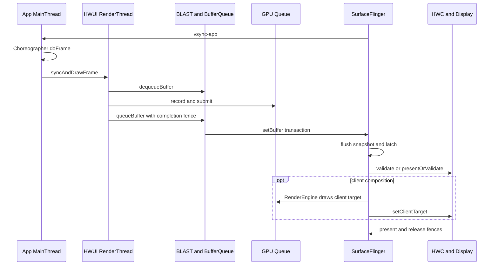

# Android 显示架构与 WindowManager

窗口管理负责窗口身份、层级、布局和 Surface 生命周期，渲染系统负责产生和合成缓冲区。本文先建立应用窗口到显示设备的公共主线，再沿 addWindow、StartingWindow、relayout、BLAST 同步、转场和输入窗口快照追踪一次窗口变化。定位问题时，应把 WMS 状态、应用 buffer 与 SurfaceFlinger 的 layer/present 放在同一时间轴上。

## 从应用窗口到显示设备

### 证据范围

AOSP 没有承诺通用的“动态分辨率自动调整”或“基于机器学习的渲染参数自动调整”，`RenderThread`、BufferQueue 复用和 HWC 也都早于 Android 17。GPU 驱动、硬件叠加平面（overlay plane）、显示带宽和功耗策略，大多由芯片系统（SoC）与设备厂商实现，平台版本号无法证明某台设备一定获得性能提升。

讨论范围限定为能够由源码和系统轨迹证明的内容：

- 框架锚定 Android 17 / API 37 / `android-17.0.0_r1`；
- 涉及 dma-buf、dma-fence、sync_file 或显示驱动边界时，内核锚定 `android17-6.18-2026-06_r6`；
- 版本演进保留 Android 12—17 的现代显示基线，版本首引由对应标签或公开 API 文档确认；
- “性能更好”必须落实到具体对象、等待点和显示时间边界，不能由系统版本或 API 名字推导。

各类出图路径的源码细节和 Perfetto 案例见[第 13 章：渲染管线专题](../../part2-performance/ch13-rendering-pipelines/README.md)。这里先统一定义公共显示主线、时间边界和分类索引。

### 1. Android 17 的公共显示主线

普通硬件加速窗口可以概括为：

`VSync 调度 → Choreographer → ViewRootImpl/HWUI → RenderThread/GPU → BLAST → SurfaceFlinger → HWC → 显示屏`

这条主线是分析基线。下文把生产图像缓冲区的一方称为 Producer（生产者），把读取缓冲区的一方称为 Consumer（消费者）；layer 是 SurfaceFlinger 管理和合成的画面层。SurfaceView、TextureView、Camera、视频、WebView、Flutter、游戏引擎会在生产者、Surface 数量、layer 组织关系或合成位置上出现不同路径。

标准应用窗口从起帧到提交显示（present）的观察点如下：



这里的 buffer 是承载一帧像素的图形缓冲区。CPU 调用结束、GPU 完成、buffer 被 SurfaceFlinger 采纳，以及画面提交到显示设备，属于不同时间边界。把这些边界合成一个“渲染完成”时间，会误导排查方向。

#### 1.1 起帧与 UI 状态准备

Android 17 的 SurfaceFlinger 调度器会根据预测显示时间（present time），以及应用和 SurfaceFlinger 的工作预算安排唤醒时刻，再经 EventThread 与 `DisplayEventReceiver` 把 VSync 事件送到应用。旧资料中的固定应用偏移、SurfaceFlinger 偏移或 `DispSync` 模型，不宜直接用于解释 Android 17。

`Choreographer#doFrame()` 在主线程按下面的回调顺序组织一帧：

`INPUT → ANIMATION → INSETS_ANIMATION → TRAVERSAL → COMMIT`

其中，Traversal 是 View 树的遍历阶段，可能执行测量（measure）、布局（layout）和绘制（draw），但不表示每帧都会完整遍历整棵 View 树。硬件加速路径中的 View `draw()` 主要更新 `RenderNode` / `DisplayList` 绘制指令，真正的像素工作还要经过 HWUI RenderThread 和 GPU。

#### 1.2 RenderThread、GPU 与 buffer 提交

`ViewRootImpl.performDraw()` 经 `ThreadedRenderer`、`HardwareRenderer.syncAndDrawFrame()` 进入原生 HWUI。RenderThread 同步 `RenderNode` 状态、组织 Skia 绘制工作并向 GPU 提交命令。主线程可能在同步阶段等待 RenderThread；`syncAndDrawFrame()` 返回不能证明 GPU 已完成。

RenderThread 通过 `dequeueBuffer` 取得可写缓冲槽（slot），再以 `queueBuffer` 交回 buffer、描述信息和生产完成 fence。fence 是表示异步图形工作何时完成的同步对象；消费者把这条完成关系作为 acquire fence 使用。`queueBuffer` 传递的是缓冲槽、buffer 句柄、裁剪区域、变换、色彩空间标识（dataspace）、时间戳和同步对象，不会通过 Binder 复制整帧像素。

标准应用窗口的 `BLASTBufferQueue` 位于应用进程。它取得 `BufferItem` 后，用 `SurfaceComposerClient::Transaction::setBuffer()` 携带 buffer、acquire fence、帧号与释放回调，再把事务提交给 SurfaceFlinger。窗口几何事务还可以按帧号与 buffer 更新对齐。

#### 1.3 SurfaceFlinger FrontEnd 与 latch

Android 17 的 FrontEnd 以 `RequestedLayerState` 保存请求状态，经 `LayerLifecycleManager` 和 `LayerSnapshotBuilder` 形成当前帧快照（snapshot）。CompositionEngine 根据快照中的可见性、几何、Z 轴顺序、buffer、dataspace 和效果状态，为每个显示屏准备输出。

`latch` 表示 SurfaceFlinger 在本轮采纳了某个 layer 的新 buffer。Android 13 之后，部分受限场景允许先采纳 fence 尚未发出完成信号的 buffer，把等待推迟到真正读取内容之前；RenderEngine 或 HWC 读取内容时仍须遵守 acquire fence。该策略只覆盖满足条件的简单单 layer buffer 更新，不能用来证明跨 layer 或跨窗口同步已经完成。

#### 1.4 HWC、RenderEngine 与 present

SurfaceFlinger 会根据显示屏上的可见 layer 集合，与硬件合成器（Hardware Composer，HWC）协商每个 layer 的合成类型（composition type）：

- `DEVICE`：显示硬件可处理该 layer；
- `CLIENT`：RenderEngine 把相关 layer 画入客户端合成目标（client target），再由 HWC 提交显示；
- `SOLID_COLOR`、`CURSOR`、`SIDEBAND` 等类型用于对应的 Composer3 场景。

几何变换、像素格式、dataspace、混合方式、色彩变换、受保护内容、硬件叠加平面数量和厂商策略，都会改变协商结果。同一 layer 在不同帧之间可能从 `DEVICE` 变成 `CLIENT`，因此“使用 SurfaceView 就一定由硬件叠加平面直接合成”的说法不成立。

Android 17 也不保证每轮单独执行 `validate()`。`HWComposer::getDeviceCompositionChanges()` 在满足 `canSkipValidate` 条件时尝试 `presentOrValidate()`：

- 返回 `PresentSucceeded`，组合调用已经完成显示提交，后续流程不会再次提交；
- 返回 `Validated`，验证已在该调用中完成，SurfaceFlinger 继续读取变化后的 composition type 和 request；
- 无法跳过验证时，流程走 `validate()`，必要的 client composition 完成后再调用 `present()`。

FrameTimeline 中 SurfaceFlinger 的实际帧区间可延伸到屏幕更新，覆盖 Composer / Display HAL 等显示栈时间。它的持续时间不能全部计入 SurfaceFlinger 主线程的 CPU 时间。

### 2. 三类 fence 与三个时间边界

图形系统里的 fence 名称相似，方向和责任对象却不同：

| 对象 | 方向与粒度 | 回答的问题 |
|---|---|---|
| acquire fence | 生产者 → 消费者，每个 buffer 一份 | 生产者何时写完，消费者何时可以读取 |
| release fence | SurfaceFlinger / 消费者 → 生产者，每个 layer、每帧一份 | 旧 buffer 何时可以安全复用 |
| present fence | HWC → SurfaceFlinger，每个显示屏、每帧一份 | 本轮显示提交何时越过系统显示边界 |

对应的三个常用观察点也不能互换：

- `queueBuffer`：生产者已把 buffer 交回队列，GPU 写入仍可能在进行；
- `latch`：SurfaceFlinger 已采纳该 layer 的新 buffer；
- present fence signal：本轮 present 到达用户态可观察的显示时间锚点。

present fence 不包含面板扫描、像素响应和人眼感知时间。定位端到端显示延迟时，Android 框架系统轨迹只能回答到系统显示边界；再往后的光学延迟需要显示驱动、面板数据或外部测量证据。

### 3. 出图类型要按拓扑分类

框架名称不足以确定渲染路径。分类需要回答三项：谁生产像素、内容写入哪个 Surface、SurfaceFlinger 看到几个可见 layer。

| 路径 | 主要生产者与 layer 形态 | 排查重点 | 深入阅读 |
|---|---|---|---|
| 标准 View / Compose 宿主 | 主线程准备状态，HWUI RenderThread / GPU 产出宿主窗口 buffer | `doFrame`、`syncAndDrawFrame`、BLAST、FrameTimeline | [标准 Android View](../../part2-performance/ch13-rendering-pipelines/01-android-view-pipeline-analysis.md)、[Compose](../../part2-performance/ch13-rendering-pipelines/08-compose-rendering-pipeline.md) |
| CPU 或离屏绘制 | CPU `lockCanvas()`、软件 layer，或 GPU / HardwareBuffer 离屏产出 | 生产目标、消费方、生产完成 fence 与显示 fence | [软件渲染](../../part2-performance/ch13-rendering-pipelines/02-android-software-offscreen-mixed-rendering.md)、[HardwareBufferRenderer](../../part2-performance/ch13-rendering-pipelines/06-surfacecontrol-hardwarebuffer-renderer.md) |
| SurfaceView | 宿主窗口与独立子 Surface 各有生产者 | 容器几何、子 Surface buffer、挖洞显示、HWC 合成 | [SurfaceView](../../part2-performance/ch13-rendering-pipelines/03-surfaceview-textureview-pipelines.md) |
| TextureView | 外部生产者写入 SurfaceTexture，HWUI 再采样进宿主窗口 | 外部 BufferQueue、宿主采样、宿主窗口提交 | [TextureView](../../part2-performance/ch13-rendering-pipelines/03-surfaceview-textureview-pipelines.md) |
| 混合页面 | 宿主 HWUI 与多个独立 Surface 或嵌入对象并存 | 每个内容对象的生产者、几何、buffer、fence 与 layer | [混合渲染](../../part2-performance/ch13-rendering-pipelines/02-android-software-offscreen-mixed-rendering.md) |
| 多窗口 | 每个窗口有独立 ViewRoot / Surface；同一进程可共享 Looper 与 RenderThread | 按显示屏、窗口、进程和生产者分组 | [多窗口](../ch02-rendering/14-multiwindow-desktop-rendering.md) |
| OpenGL ES / Vulkan / ANGLE | 应用自己的渲染循环写入 ANativeWindow / swapchain | 获取图像、CPU 提交、GPU 完成、队列深度、帧节奏 | [OpenGL ES](../../part2-performance/ch13-rendering-pipelines/04-opengl-egl-angle.md)、[Vulkan](../../part2-performance/ch13-rendering-pipelines/05-vulkan-hwui-multi-queue.md)、[ANGLE](../../part2-performance/ch13-rendering-pipelines/04-opengl-egl-angle.md) |
| WebView | Chromium 渲染进程、提供方和 GPU 服务经 functor 接入宿主，媒体可另建 layer | Android 与 WebView 提供方双版本、渲染进程、宿主、媒体叠加层 | [WebView](../../part2-performance/ch13-rendering-pipelines/09-webview-rendering.md) |
| Flutter | 根视图渲染模式、外部纹理与 PlatformView 策略共同决定拓扑 | Android 与 Flutter 双版本、Raster 线程、插件生产者、PlatformView | [Flutter](../../part2-performance/ch13-rendering-pipelines/07-flutter-rendering-pipeline.md) |
| Camera | HAL3 请求与结果向预览、录像、分析、拍照多路输出 | 传感器时间戳、输出 buffer、消费者释放、预览显示 | [Camera](../../part2-performance/ch13-rendering-pipelines/10-camera-pipeline.md) |
| Video | MediaCodec 输出到 Surface；隧道模式使用 sideband | PTS 时间戳、编解码器输出、队列、合成类型、刷新节奏、显示提交 | [Video 与 HWC](../../part2-performance/ch13-rendering-pipelines/11-video-overlay-media3-codec-pipeline.md) |
| Game | 游戏、渲染与 RHI 线程，GPU 队列和 swapchain 自主管理帧节奏 | 输入、逻辑、提交、GPU、队列积压、显示提交、温控 | [游戏引擎](../../part2-performance/ch13-rendering-pipelines/12-game-engine.md) |
| React Native | Fabric Render / Commit / Mount 后进入普通 Android View / HWUI；原生组件可另建 Surface | JS、提交与布局、挂载、View 遍历、独立 Surface | [类型识别总览](../../part2-performance/ch13-rendering-pipelines/01-android-view-pipeline-analysis.md) |

SurfaceView 与 TextureView 的差异值得单独记：

- SurfaceView 的主体通常保留独立可见 layer，HWC 可以单独评估该 layer；
- TextureView 把外部 buffer 当纹理交给 HWUI，主体像素进入宿主 Window buffer；
- SurfaceView 有使用硬件叠加平面的机会，但结果受整屏 layer 集合和设备能力约束；
- TextureView 通常增加一次宿主采样，不能笼统描述为固定的 CPU 像素拷贝。

Camera、视频、游戏描述生产者或业务类型，SurfaceView、TextureView 则描述承载方式。Camera 可以输出到 SurfaceView、TextureView、ImageReader 或自研 GL / Vulkan 渲染器；看到 Camera 线程并不能直接确定 layer 拓扑。

### 4. Android 12—17 的有效演进

现代 trace 分析可以从 Android 12 建立基线：

| 版本 | 可以确认的变化 | 阅读系统轨迹时的含义 |
|---|---|---|
| Android 12 / API 31 | BLAST 与 FrameTimeline 已进入现代应用窗口主线 | 标准窗口可用应用 / SF 的预期与实际时间线；独立 Surface 仍需 layer、BufferQueue 和 fence 证据 |
| Android 13 / API 33 | `AutoSingleLayer` 下的 latch-unsignaled 策略成为重要边界；Composer HAL 进入 AIDL 时代 | acquire fence 未发出完成信号，不代表事务一定无法先被采纳；内容读取仍受 fence 约束 |
| Android 14 / API 34 | 标准公共主线延续；SurfaceView 增加任意 alpha 与公开 lifecycle 策略 | SurfaceView 的透明度和 Surface 保留行为要按版本确认 |
| Android 15 / API 35 | Window / SurfaceView 可以表达期望的 HDR 亮度余量（headroom），支持的设备可使用自适应刷新率（ARR）；Android 15/16 API 文本中的 headroom 方法仍带 `limited_hdr` 功能开关 | 亮度余量和帧率请求都是期望值，不能证明实际亮度、刷新率或合成类型；功能开关与设备能力都要核对 |
| Android 16 / API 36 | SurfaceView API 文本中出现带 `surface_view_set_composition_order` flag 的整数 `compositionOrder` | 多 Surface 页面要记录 parent、relative layer 和 Z-order；flag-gated API 不能当成所有设备无条件可用 |
| Android 17 / API 37 | 现行 FrontEnd 帧快照、预测显示调度与 HWC 流程；SurfaceView API 文本中出现受 `surface_view_set_blur_regions` 开关控制的模糊区域 | 当前对象名按 `android-17.0.0_r1` 解释；厂商合成能力和功能开关状态仍需设备证据 |

这些版本差异没有建立“版本越新，所有页面越快”的因果关系。Android 17 的渲染评审应把版本能力、应用用法、设备实现和运行时证据分别记录。

#### 4.1 常见“新技术”说法的源码边界

| 常见说法 | 源码边界 |
|---|---|
| HWC 改进 | AOSP 可确认合成类型协商和 present 流程；性能结果由 layer 条件、Composer HAL、显示硬件和厂商策略决定 |
| 渲染线程优化 | RenderThread 是长期存在的 HWUI 执行角色；应用不能把任意 UI 工作“移到 RenderThread”，应减少主线程状态准备、RenderNode 更新和同步等待 |
| GPU 驱动更新 | Android 支持可更新 GPU 驱动等机制，但具体版本、兼容性和收益必须按设备、驱动包和工作负载测量 |
| buffer 管理优化 | BLAST、BufferQueue、GraphicBuffer 与 fence 构成现代主线；吞吐量要看缓冲槽状态、`dequeueBuffer` 等待、acquire fence 和 release fence，不能写成统一收益 |
| 异步合成 | CPU、GPU、SurfaceFlinger 与 HWC 通过队列和 fence 并行推进；异步不代表没有依赖或不会阻塞 |
| 色彩管理增强 | dataspace、HDR 元数据、期望的 HDR 亮度余量、RenderEngine 与 HWC 能力要逐项核对，平台版本不保证显示结果 |
| 动态分辨率 | AOSP 没有给所有应用自动缩放渲染分辨率的通用承诺；游戏引擎、XR 运行时或厂商策略需按各自实现分析 |
| 机器学习（ML）自动调参 | `android-17.0.0_r1` 的公共显示主线不能支撑该结论；只有存在明确组件、模型输入、控制输出和源码时才可写入 |

### 5. Perfetto：按对象复原一帧

出现卡顿后，可按以下顺序建立证据。

#### 5.1 确认显示对象、窗口、Surface 与 layer

记录目标显示设备（Display）、窗口（Window）、Surface，以及 layer 的父子关系、Z-order、buffer 格式、dataspace 和合成类型。混合页面要为每个可见内容对象单独建表，不能只用宿主应用窗口的 FrameTimeline 代表整页。

#### 5.2 找到每个生产者

标准页面查看主线程（MainThread）与 RenderThread；原生引擎查看游戏、渲染与 RHI 线程；视频查看编解码器输出；Camera 查看 HAL 请求、结果与各路输出流；WebView、Flutter、React Native 还要补齐各自的框架线程与宿主线程。

#### 5.3 对齐生产阶段

标准路径关注 `vsync-app`、`Choreographer#doFrame`、五类回调、`syncAndDrawFrame`、`dequeueBuffer` 和 `queueBuffer`。原生图形路径还要观察 swapchain 图像获取、CPU 提交、GPU 完成和交换链深度（swapchain depth）。

`dequeueBuffer` 长时间等待，常指向可复用 slot 不足或 release fence 迟到；CPU 调度只是候选原因之一。

#### 5.4 对齐系统消费阶段

`BufferTX - <layerName>` 是 SurfaceFlinger 服务端待处理 buffer 事务的计数。含 buffer 的事务进入待处理状态时计数增加，buffer 被采纳（latch）或丢弃（drop）时计数减少。数值长期偏高说明系统侧已有待处理 buffer，仍需结合 acquire fence、事务就绪条件、latch 原因和 SurfaceFlinger 的实际帧区间判断原因。

`BufferTX` 接近零只说明 SurfaceFlinger 服务端没有这类积压，不能证明生产者、GPU、HWC 和显示设备都按期完成。

#### 5.5 对齐合成与显示阶段

检查 SurfaceFlinger 的 CPU/GPU 截止时间、RenderEngine 客户端合成、每个 layer 的合成类型、HWC/DisplayHAL 事件和 present fence。若 buffer 入队与 latch 按时、present 仍晚，排查范围应移向合成阶段、显示模式切换、Composer HAL、显示驱动与面板。

FrameTimeline 对标准应用窗口很有价值，对 SurfaceView 主体、Camera、视频和某些引擎 layer 的覆盖可能不完整。缺少应用侧实际帧区间时，应回到生产者入队、layer、`BufferTX`、fence、latch 和 present 证据。

### 6. 优化动作与证据对应

优化动作应对应已确认的等待点：

| 证据 | 可检查的工程问题 |
|---|---|
| `doFrame` 中 INPUT/ANIMATION/TRAVERSAL 超预算 | 同步 I/O、布局反复失效、过深层级、对象分配、主线程锁竞争 |
| `syncAndDrawFrame` 等待明显 | RenderThread 任务积压、复杂 DisplayList、GPU 提交压力、UI 线程与 RenderThread 同步 |
| `dequeueBuffer` 长等待 | BufferQueue 可用缓冲槽数量、消费者持有时间、release fence、过深的在途队列 |
| GPU 完成时间迟到 | 着色器、纹理带宽、过度绘制（overdraw）、离屏渲染阶段、分辨率和热降频 |
| `BufferTX` 积压或 latch 迟到 | 生产者出帧节奏、acquire fence、事务屏障，以及下游阻塞迫使上游等待的反压（backpressure） |
| `DEVICE` 频繁变为 `CLIENT` | 几何变换、透明度、像素格式、dataspace、受保护内容、硬件叠加平面竞争 |
| latch 按时而 present 晚 | HWC、DisplayHAL、刷新率切换、显示驱动和面板后段 |

“启用硬件加速”“减少层级”“避免过度绘制”只能作为检查入口。修改前应保存同一场景的系统轨迹、设备信息、刷新率、温度和驱动版本，再以帧耗时分位数、卡顿类型（jank type）、GPU 时间、合成类型与功耗数据复测。

### 7. Android 17 源码阅读入口

以下链接固定到 `android-17.0.0_r1`：

- [`Choreographer.java`](https://android.googlesource.com/platform/frameworks/base/+/android-17.0.0_r1/core/java/android/view/Choreographer.java)：VSync 请求与五类回调；
- [`ViewRootImpl.java`](https://android.googlesource.com/platform/frameworks/base/+/android-17.0.0_r1/core/java/android/view/ViewRootImpl.java)、[`ThreadedRenderer.java`](https://android.googlesource.com/platform/frameworks/base/+/android-17.0.0_r1/core/java/android/view/ThreadedRenderer.java)：Traversal、绘制入口与 HWUI 交接；
- [`RenderProxy.cpp`](https://android.googlesource.com/platform/frameworks/base/+/android-17.0.0_r1/libs/hwui/renderthread/RenderProxy.cpp)、[`DrawFrameTask.cpp`](https://android.googlesource.com/platform/frameworks/base/+/android-17.0.0_r1/libs/hwui/renderthread/DrawFrameTask.cpp)、[`CanvasContext.cpp`](https://android.googlesource.com/platform/frameworks/base/+/android-17.0.0_r1/libs/hwui/renderthread/CanvasContext.cpp)：RenderThread 状态同步、绘制和 buffer 提交；
- [`BLASTBufferQueue.cpp`](https://android.googlesource.com/platform/frameworks/native/+/android-17.0.0_r1/libs/gui/BLASTBufferQueue.cpp)：buffer 回调、`setBuffer()` 与事务提交；
- [SurfaceFlinger FrontEnd](https://android.googlesource.com/platform/frameworks/native/+/android-17.0.0_r1/services/surfaceflinger/FrontEnd/)、[`SurfaceFlinger.cpp`](https://android.googlesource.com/platform/frameworks/native/+/android-17.0.0_r1/services/surfaceflinger/SurfaceFlinger.cpp)：事务就绪条件、快照、latch 与合成；
- [`HWComposer.cpp`](https://android.googlesource.com/platform/frameworks/native/+/android-17.0.0_r1/services/surfaceflinger/DisplayHardware/HWComposer.cpp)、[`HWC2.cpp`](https://android.googlesource.com/platform/frameworks/native/+/android-17.0.0_r1/services/surfaceflinger/DisplayHardware/HWC2.cpp)：`validate()`、`presentOrValidate()`、present 与 fence；
- [`FrameTimeline.cpp`](https://android.googlesource.com/platform/frameworks/native/+/android-17.0.0_r1/services/surfaceflinger/Scheduler/FrameTimeline.cpp)：应用 / SurfaceFlinger 时间线与显示反馈。

进入共享 buffer 与 fence 的内核边界时，使用固定标签 `android17-6.18-2026-06_r6`：

- [`dma-buf.c`](https://android.googlesource.com/kernel/common/+/refs/tags/android17-6.18-2026-06_r6/drivers/dma-buf/dma-buf.c)；
- [`sync_file.c`](https://android.googlesource.com/kernel/common/+/refs/tags/android17-6.18-2026-06_r6/drivers/dma-buf/sync_file.c)；
- [`dma-fence.h`](https://android.googlesource.com/kernel/common/+/refs/tags/android17-6.18-2026-06_r6/include/linux/dma-fence.h)。

这些内核文件能说明共享 buffer 与同步对象的公共语义。硬件叠加平面分配、显示链路的带宽申请（常称“带宽投票”）、安全显示路径和扫描输出时序（scanout timing），仍要查看目标设备的 Composer HAL、GPU / 显示驱动与厂商轨迹。

### 8. 核查清单

一段渲染论述至少应回答：

1. Android、WebView、Flutter、React Native 或引擎版本分别是什么？
2. 主体像素由哪个线程、进程或硬件模块生产？
3. 内容写入哪个 Surface，SurfaceFlinger 看到哪些 layer？
4. 几何事务与内容 buffer 是否按同一帧号对齐？
5. acquire、release、present fence 分别属于哪个对象？
6. `queueBuffer`、latch 和 present 各自发生在什么时间？
7. HWC 本帧选择了 `DEVICE` 还是 `CLIENT`，选择变化时 layer 条件有何差异？
8. FrameTimeline 覆盖了宿主 Window，还是也覆盖主体内容？
9. 结论来自固定标签源码、运行时轨迹、设备能力查询，还是厂商文档？
10. 优化前后的指标、场景、刷新率、温度与驱动版本是否一致？

完成这十项映射后，问题会定位到应用生产、GPU 执行、buffer 周转、SurfaceFlinger 消费、HWC 合成或显示后段中的一个责任区间。具体场景的操作步骤见[渲染管线分析方法](../../part2-performance/ch13-rendering-pipelines/01-android-view-pipeline-analysis.md#统一分析方法)。

## WindowManager 的窗口、Surface 与事务

建立显示主路径后，WMS 分析要落到 WindowToken、WindowState、SurfaceControl 和同步事务。布局循环与跨窗口同步是 system_server 侧常见的延迟来源。

WindowManager 需要保持四套状态一致：

1. 应用进程里的 View 树、`ViewRootImpl` 与绘制 Surface；
2. `system_server` 里的窗口/任务层级、焦点、可见性和转场；
3. SurfaceFlinger 里的 Layer、buffer 与 transaction；
4. InputFlinger 里的输入窗口快照、焦点和事件队列。

`WindowManagerService`（WMS）负责第 2 层，并把需要合成与输入系统执行的状态写进 `SurfaceControl.Transaction`（一批原子提交的 Surface 属性修改）。它不会绘制应用 View，也不负责逐个消费触摸事件。这条边界可用于判断卡顿发生在应用遍历、WMS 全局锁、等待首帧、SurfaceFlinger 提交，还是 InputDispatcher。

版本范围是 Android 17 / API 37 / `android-17.0.0_r1`。SurfaceFlinger、BLAST 与 InputDispatcher 以同一标签下的 `frameworks/native` 为准。耗时和 Surface 内存必须结合设备、刷新率、窗口数量与 trace 采集条件测量。

本文沿用源码中的图形术语：`Surface` 是应用提交图像缓冲区的目标，buffer 是一帧像素数据，Layer 是 SurfaceFlinger 合成树中的节点，`SurfaceControl` 是修改 Layer 的控制句柄。transaction 把一组 Layer 属性修改合并提交；traversal 是 View 树的一轮 measure、layout 和 draw；window token 则标识一组窗口的归属和策略上下文。

### 从 `addView()` 到屏幕上的 Layer

应用添加一个顶层 View 时，主要调用链如下：

```text
App process
  WindowManagerImpl.addView()
    → WindowManagerGlobal.addView()
      → new ViewRootImpl(...)
      → ViewRootImpl.setView()
        → IWindowSession.addToDisplayAsUser()
                     │ Binder
                     ▼
system_server
  Session.addToDisplayAsUser()
    → WindowManagerService.addWindow()
      → 校验 display / token / type / permission
      → 创建 WindowState
      → 创建 input channel（调用者需要时）
      → 更新焦点、输入窗口与层级

后续首次 traversal
  ViewRootImpl.performTraversals()
    → 按需执行首次 measure
    → IWindowSession.relayout*()
      → WMS 计算 frame / insets / SurfaceControl
    → 根据返回结果按需重新 measure，再 layout、draw 并提交 buffer
    → finishDrawing / BLAST sync
    → SurfaceFlinger 合成显示
```

`addWindow()` 只把逻辑窗口加入系统。方法尾部的源码注释明确说明：这里不做 layout，窗口必须随后调用 relayout（让 WMS 重新计算窗口几何与 Surface）才会显示。因此，“addWindow 返回成功”和“首帧已经可见”是两个时间点。

#### 三个容易混在一起的对象

| 对象 | 所在进程 | 持有什么 |
| --- | --- | --- |
| `ViewRootImpl` | 应用 | View 树根、遍历调度、`Surface`、`BLASTBufferQueue`、`IWindow` 客户端 |
| `WindowState` | `system_server` | 窗口属性、token/父子关系、frame/insets、焦点与可见性状态 |
| `SurfaceControl` | 两侧均有句柄，实体由 SurfaceFlinger 管理 | 对 Layer 的控制句柄；位置、裁剪、alpha、layer、reparent 等通过 transaction 修改 |

`SurfaceControl` 本身不是像素缓冲区。应用通过 `Surface`/BufferQueue 生产 graphic buffer（图像缓冲区），SurfaceFlinger 获取 buffer 并按 Layer 树合成。只统计 Java `SurfaceControl` 对象数量，无法得到窗口图形内存。

[源码依据：`WindowManagerGlobal.addView()`、`ViewRootImpl.setView()`、`Session.addToDisplayAsUser()`、`WindowManagerService.addWindow()`，`android-17.0.0_r1`]

### 容器、图层与内容事务的职责边界

窗口状态变化会同时经过容器、图层几何与内容 buffer 三条事务链。先分清事务承载的对象，才能判断 resize 中的一帧错位发生在哪个边界。

窗口 resize 或 transition 中经常同时出现三类 transaction，它们虽然都叫“事务”，表达的状态却不同：

| 类型 | 表达的内容 | 典型持有者 |
|------|-----------|-----------|
| `WindowContainerTransaction`（WCT） | Task、Activity、DisplayArea 等 WindowContainer 的 bounds、窗口模式和层级操作 | WM Shell、ATMS/WMS organizer（受托管理窗口容器的接口）路径 |
| `SurfaceControl.Transaction` | layer 的位置、crop、alpha、变换、reparent、visibility 和 input info | WMS、WM Shell、App 或其他系统组件 |
| BLAST buffer transaction | 新内容 buffer 及 acquire fence（表示何时可安全读取该 buffer），与目标 layer 的内容更新配套 | App producer、BLASTBufferQueue、SurfaceFlinger |

WCT 是“窗口容器要变成什么状态”的管理请求，处理后可能引发一个或多个 SurfaceControl transaction；它不属于 SurfaceFlinger 的几何 transaction。几何属性与内容 buffer 分属两路输入：resize 时可能短暂出现新 geometry（位置和尺寸）配旧 buffer，或新 buffer 已到、但同步组尚未放行 geometry。

遇到拉伸、黑边或一帧错位，需要分别核对 container 状态、layer geometry、buffer 尺寸和 fence；只搜索“transaction”无法确定问题位置。

### WMS 的容器树与 Surface 树

Android 17 的窗口层级建立在 `WindowContainer` 上。应用窗口的常见逻辑路径可简化为：

```text
RootWindowContainer
  └─ DisplayContent
      └─ DisplayArea hierarchy
          └─ TaskDisplayArea
              └─ Task
                  └─ ActivityRecord（也是 WindowToken）
                      └─ WindowState
                          └─ sub WindowState
```

IME、wallpaper、system overlay 等窗口会进入由 `DisplayAreaPolicy` 决定的其他 DisplayArea/Token，不一定挂在 Task 下。多显示器则有多个 `DisplayContent`。

#### Z-order 不是每帧对所有窗口做一次全量排序

Z-order 表示窗口从底到顶的遮挡顺序。`WindowContainer.mChildren` 保存有序子节点，索引方向表达 bottom-to-top 关系。添加、移动到顶/底、reparent（更换父节点）、task reorder（调整任务顺序）或特殊窗口策略改变顺序后，`assignChildLayers()` 把结果写入 SurfaceControl transaction。

需要同时考虑：

- DisplayArea policy 决定不同窗口类别落在哪个区域；
- Task/Activity 的前后顺序影响应用窗口；
- `WindowToken` 负责同一 token 下主窗口与子窗口的相对关系；
- IME、wallpaper、always-on-top、magnification 等有专门的 layering 规则；
- 动画期间 `SurfaceAnimator` 会创建 leash（承载动画变换的临时父 Layer），把待动画 Surface 临时 reparent 到 leash。

所以，SurfaceFlinger trace 中的即时父子关系可能处于动画结构，不能只凭某一帧的 Layer parent 反推稳定的 WMS 容器树。应同时查看 WindowManager trace 与 SurfaceFlinger layers/transactions。

#### `mGlobalLock` 是架构和性能的共同约束

WMS 与 ActivityTaskManagerService（ATMS）共享 `WindowManagerGlobalLock`。`addWindow()`、`relayoutWindow()`、容器 reparent、焦点变化和大量配置更新都会在锁内修改状态。共享锁让 Task/Activity/Window 的相关状态作为整体一致更新，也意味着慢操作会扩大等待范围。

排查 `system_server` 窗口卡顿时，应区分：

- 线程在等待 `mGlobalLock`；
- 持锁线程执行过长；
- AnimationThread 已收到 traversal，但在等待锁；
- WMS 已提交 transaction，后续时间消耗在应用绘制或 SurfaceFlinger。

“WMS 很忙”不足以解释延迟，必须把锁持有者和调用阶段标出来。

### WMS 的线程分工

Android 17 至少有三条与窗口动画/布局密切相关的执行通道：

| 通道 | Android 17 实现 | 主要职责 |
| --- | --- | --- |
| WMS `H` | `DisplayThread`，线程名 `android.display` | 一般服务消息、异步状态处理，也是 `BLASTSyncEngine` 超时与提交回调的 Handler |
| `mAnimationHandler` | `AnimationThread`，线程名 `android.anim` | traversal、layout、surface placement（重算窗口/Surface 状态并提交 transaction）以及影响动画时序的任务 |
| `SurfaceAnimationThread` | 线程名 `android.anim.lf` | `SurfaceAnimationRunner` 的逐帧动画计算，设计目标是不持有 WMS 全局锁 |

WMS 构造通过 `DisplayThread.getHandler().runWithScissors()` 同步切到 DisplayThread 执行，`mH = new H()` 因而绑定到该线程。`AnimationThread` 和 `SurfaceAnimationThread` 都由 `ServiceThread` 以 `THREAD_PRIORITY_DISPLAY` 创建。源码没有在这两个类里把线程配置为 `SCHED_FIFO`，不应把 display priority 写成实时调度策略。

`SurfaceAnimationRunner` 同时使用两条线程：动画帧计算在 `SurfaceAnimationThread`，transaction apply 会借助 `AnimationThread` 调度。这样可以把逐帧动画计算与持有窗口全局锁的容器变更隔开。

线程分开不等于没有共享瓶颈。surface placement 仍会读取和修改受 `mGlobalLock` 保护的窗口树；大量同步 Binder 调用或锁内工作仍可能影响动画路径。

[源码依据：`DisplayThread.java`、`AnimationThread.java`、`SurfaceAnimationThread.java`、`SurfaceAnimationRunner.java`、`WindowManagerService.main()`，`android-17.0.0_r1`]

### `addWindow()`：先证明“这个窗口有资格存在”

`WindowManagerService.addWindow()` 在创建 `WindowState` 前完成多组校验：

1. `WindowManagerPolicy.checkAddPermission()` 检查窗口类型权限及 AppOp（应用操作授权状态）；
2. 确认 session 未死亡，display 已就绪且调用 UID 有访问权；
3. 拒绝重复 `IWindow`；
4. 验证 presentation、跨用户和 display 条件；
5. 解析父窗口与 `WindowToken`；
6. 按应用、IME、wallpaper、Toast、accessibility overlay 等类型验证 token；
7. 创建 `WindowState` 后建立 input channel、更新焦点与 child layers。

#### 子窗口和 Token

子窗口的 `attrs.token` 必须指向现有父 `WindowState`，而且父窗口本身不能还是子窗口。通过后，子窗口复用父窗口的 `WindowToken`，从而继承同一组可见性与策略约束。

非子窗口先在目标 `DisplayContent` 中查找 token：

- 应用窗口必须对应有效 `ActivityRecord`；未知 application token 会返回 `ADD_BAD_APP_TOKEN`；
- 已知 token 还会按 window type 检查，例如 IME token 不能用来添加 wallpaper；
- 合法的 `WindowContext` listener 可以让 WMS 以其 binder/options 构造 `WindowToken`；`WindowContext` 是绑定到特定显示与窗口类型的 Context；
- 其他允许自行创建 token 的非应用窗口，可使用 `attrs.token` 或 `client.asBinder()` 创建。

`TYPE_APPLICATION_OVERLAY` 的授权主要由 policy permission/AppOp 检查。`unprivilegedAppCanCreateTokenWith()` 的源码并没有把 application overlay 列入“未知 token 必须拒绝”的类型，不能把这个 helper 描述成专门防止 overlay 提升权限的开关。

如果 `displayContent.getWindowToken(attrs.token)` 查不到现有 token，还要区分 WindowContext 与兜底 Binder 两条路径：合法的 `WindowContext` 监听器会通过 `WindowToken.Builder` 携带 `ownerCanManageAppTokens`、`roundedCornerOverlay`、`fromClientToken` 和 `options` 等语义标志构造 token；否则使用 `attrs.token` 或 `client.asBinder()` 继续按窗口类型约束创建或验证。这里不是在 HashMap 查询失败后直接调用 `new WindowToken`。

#### 常见失败码对应的是哪个阶段

| 返回码 | 典型原因 |
| --- | --- |
| `ADD_PERMISSION_DENIED` | 窗口类型权限或 presentation 条件失败 |
| `ADD_INVALID_DISPLAY` | display 不存在或调用者无权访问 |
| `ADD_DUPLICATE_ADD` | 同一个 `IWindow` 已加入 |
| `ADD_BAD_SUBWINDOW_TOKEN` | 子窗口找不到合法父窗口 |
| `ADD_BAD_APP_TOKEN` / `ADD_NOT_APP_TOKEN` | token 缺失、类型不符或不是 Activity token |
| `ADD_APP_EXITING` | session/client 已死亡或 Activity 已脱离层级 |

应用侧收到 `BadTokenException` 时，应核对 window type、Context/token 来源、Activity 生命周期和 display；失败发生在 Layer 创建之前，无需先查 SurfaceFlinger。

[源码依据：`WindowManagerService.addWindow()`、`unprivilegedAppCanCreateTokenWith()`、`WindowToken.Builder`，`android-17.0.0_r1`]

### StartingWindow 与应用首帧交接

窗口身份建立后，冷启动还需要在应用主窗口交出首帧前维持可见反馈。StartingWindow 是这段窗口生命周期的一部分，但它的创建者、内容生产者和移除信号不在同一进程。

冷启动期间，进程创建、Runtime/Application/Activity 初始化和首帧绘制尚未完成。StartingWindow（启动占位窗口）在这段空档提供可见内容，避免用户只看到桌面、空白或旧画面。它可以显示统一 SplashScreen，也可以在恢复历史任务时显示 TaskSnapshot（此前任务画面的快照）。

#### 决策与创建为何分属 WMS 和 WM Shell

Android 12 之后，StartingWindow 的决策与实际创建分在两侧。ATMS/WMS 负责判断本次 Activity 启动是否需要 starting surface，`StartingSurfaceController` 根据 SplashScreen 或 TaskSnapshot 路径生成 starting data（描述启动窗口类型和资源的请求数据）；WM Shell（WindowManager Shell）的 starting-surface 组件负责创建 SplashScreen/TaskSnapshot 窗口并挂到对应 Task 上。常用源码锚点包括：

- `frameworks/base/services/core/java/com/android/server/wm/StartingSurfaceController.java`：服务端发起 starting surface 请求
- `frameworks/base/services/core/java/com/android/server/wm/SplashScreenStartingData.java`：保存 SplashScreen starting data
- `frameworks/base/libs/WindowManager/Shell/src/com/android/wm/shell/startingsurface/StartingWindowController.java`：Shell 侧接收 `TaskOrganizer.addStartingWindow` 回调
- `StartingSurfaceDrawer.java`/`SplashscreenWindowCreator.java`：Shell 侧创建并绘制 SplashScreen window

冷启动路径可以按这组边界读：

1. ATMS 推进 Activity 启动，WMS 在 `ActivityRecord`/Task 可见性变化中判断是否需要 starting surface。
2. `StartingSurfaceController` 生成请求，SplashScreen 路径使用 `SplashScreenStartingData`，历史任务恢复路径可能使用 TaskSnapshot starting data。
3. Android 12+ 的 Shell starting-surface 组件收到 `addStartingWindow` 回调后，在承载 WM Shell 的 Shell/SystemUI 进程侧创建 SplashScreen 或 TaskSnapshot 窗口。
4. App 进程启动并绘制主 Window 第一帧。
5. App 通过 `finishDrawing`/`reportDrawFinished` 把主窗口首帧完成信号交给服务端，随后由 `removeStartingWindow` 路径通知 Shell 移除 starting surface。

Perfetto 里要把三段分开看：system_server 侧是 starting data、Activity/Task 状态和移除请求；Shell/SystemUI 侧负责启动 surface 的创建与绘制；App 侧的 `reportDrawFinished` 标记主 Window 首帧完成。把 starting surface 的绘制职责放在 system_server，会混淆服务端、Shell 和 App 进程边界。

#### Android 12 SplashScreen API 的责任边界

在 Android 12 之前，StartingWindow 的外观主要由 `windowBackground` 决定，OEM 定制差异较大。Android 12 引入 SplashScreen API（`android.window.SplashScreen`），用统一接口配置启动页主题、icon（图标）、背景色和退出动画：

- 开发者通过 `Theme.SplashScreen` 配置 icon、背景色、动画等元素。
- 退出动画通过 `setOnExitAnimationListener` 接入，移除时机仍要和主 Window 首帧完成信号配合。
- `androidx.core:core-splashscreen` 向后支持 Android 5.0+，但 Android 12+ 的系统 starting surface 创建仍落在 Shell starting-surface 路径。

这套 API 可以避免 App 为启动页另建 SplashActivity。自建启动页会多一次 Activity 启动、窗口切换和可能的 relayout；系统 SplashScreen 则复用 starting surface 生命周期，不增加 App 侧 Activity 数量。

#### 移除时机：首帧完成不等于已经呈现

StartingWindow 的移除时机会影响启动体感：

- **过早移除**：App 主 Window 第一帧还没准备好时移除 starting surface，用户可能看到短暂闪白或闪黑。
- **过晚移除**：主 Window 已经完成首帧，starting surface 仍停留在前台，用户会把这段时间感知为启动变慢。

主 Window 首帧完成后，服务端才确认有新内容可以替换 StartingWindow。服务端通过 `finishDrawing`/`reportDrawFinished` 收到信号，再走 `removeStartingWindow` 路径让 Shell 移除 starting surface。分析启动 trace 时，`reportDrawFinished` 只说明 App 首帧完成；视觉切换还要看 Shell 移除窗口、SurfaceFlinger 消费 transaction 和后续 present。

### Android 17 的两种窗口 Surface 所有权路径

`WindowManager.useClientSurface()` 由 `com.android.window.flags.Flags.useClientSurface()` 控制。Android 17 源码保留两条可执行路径，不能把其中一条当作已经不可达的兼容代码。

#### server-created surface

flag 关闭时，`WindowStateAnimator.createSurfaceLocked()` 在 `system_server` 创建窗口 buffer layer：

```text
WindowStateAnimator.createSurfaceLocked()
  → WindowState.makeSurface()
  → SurfaceControl.Builder
      parent = WindowState.mSurfaceControl
      format = hardware accelerated ? TRANSLUCENT : attrs.format
      metadata = window type / owner UID / owner PID
      layer type = BLAST
  → relayout 把 SurfaceControl 返回给 ViewRootImpl
```

硬件加速时选择 `PixelFormat.TRANSLUCENT` 是源码事实；它的原因不能简化成“避免一次 alpha 拷贝”，因为实际 buffer 格式、opaque hint（内容是否完全不透明的提示）和合成策略还受 RenderThread、gralloc（图形缓冲区分配器）与 SurfaceFlinger 影响。

#### client-created surface

flag 开启时，`ViewRootImpl.createSurfaceControl()` 在应用进程创建 BLAST layer，并在 `relayout2()` / `relayoutAsync2()` 中把可见 SurfaceControl 交给 WMS。此时服务端若误入 `WindowStateAnimator.createSurfaceLocked()`，会记录 `No longer create client surfaces on the server side` 并返回 `null`。

这条错误日志表达的是“client-owned surface 不应再由 server 创建”，并不表示 client-created surface 已经废弃。

`ViewRootImpl.updateSurfaceControl()` 在该路径还会对 `INVISIBLE` 的 SurfaceControl 做缓存，后续重新可见时可复用有效句柄。它受 flag 和可见性条件约束，不是 WMS 面向所有窗口的通用 Surface 池。

#### 两条路径都使用 BLAST

`SurfaceControl.Builder.build()` 遇到未显式指定 effect/container 类型的普通 layer 时会调用 `setBLASTLayer()`；WMS 和 `ViewRootImpl` 的窗口创建代码也显式设置 BLAST layer。

“谁创建 SurfaceControl”与“是否为 BLAST buffer layer”是两个维度：

```text
server-created ─┐
            ├─ SurfaceControl BLAST layer ─ BLASTBufferQueue ─ app buffers
client-created ─┘
```

图中两条路径只表示 `SurfaceControl` 的创建方不同；后续都进入 BLAST layer、`BLASTBufferQueue` 和应用 buffer 链路。

[源码依据：`WindowManager.useClientSurface()`、`ViewRootImpl.createSurfaceControl()`、`WindowStateAnimator.createSurfaceLocked()`、`SurfaceControl.Builder.build()`，`android-17.0.0_r1`]

### `BLASTBufferQueue`：把应用 buffer 与 transaction 对齐

BLAST 让 buffer 到达与 SurfaceControl transaction 之间建立明确的同步关系。`ViewRootImpl` 为窗口 render target（绘制目标）创建 `BLASTBufferQueue`，通过它取得交给 HWUI/软件绘制的 `Surface`。当 SurfaceControl、尺寸或格式变化时，`updateBlastSurfaceIfNeeded()` 更新或重建 BLASTBufferQueue。

关键 API 的职责如下：

| API | 职责 |
| --- | --- |
| `createSurfaceWithHandle()` | 从 adapter（适配层）的 producer（buffer 生产端）取得应用绘制用 `Surface` |
| `update(sc, width, height, format)` | 更新目标 SurfaceControl 与 buffer 配置 |
| `syncNextTransaction()` | 等下一个 buffer 被 acquire（由消费端接收）并关联到 transaction 后回调 |
| `mergeWithNextTransaction(t, frameNumber)` | 把几何/属性 transaction 与指定 frame number 对齐 |
| `applyPendingTransactions(frameNumber)` | 目标帧没有绘制时，避免待合并 transaction 永久滞留 |

不要从 `requestLayout()` 直接推导“一定重建 BLASTBufferQueue”。`requestLayout()` 先触发 ViewRoot traversal；是否 relayout、Surface 尺寸是否变化、SurfaceControl 是否更换，需要由 `performTraversals()` 的状态判断。相同 SurfaceControl 下，BLASTBufferQueue 可以只做 `update()`；SurfaceControl 改变时才销毁并重建 adapter。

BLAST 是否降低某台设备上的延迟、降低多少，需要 trace 比较；源码没有“每帧固定少一次 round trip（跨进程或组件往返）”或“固定节省若干毫秒”的保证。

### relayout：同步返回与异步发送的选择

`ViewRootImpl.relayoutWindow()` 在允许时先用本地 `WindowLayout.computeFrames()` 计算 frame（窗口边界），然后决定调用同步或异步 relayout。

#### 哪些 traversal 会跨进程 relayout

`ViewRootImpl.performTraversals()` 不会每帧跨进程调用 WMS。Android 17 `ViewRootImpl.java` 的直接条件有五类：

- **`mFirst`**：窗口首次显示，必须向 WMS 申请初始 `SurfaceControl`、frames 和 Insets。
- **`windowShouldResize`**：`requestLayout()` 后测量结果改变了窗口尺寸，常见于旋转、多窗口 resize，或 Dialog 的 `WRAP_CONTENT` 内容变大。
- **`viewVisibilityChanged`**：窗口从隐藏变为显示、从显示变为隐藏，或 `mNewSurfaceNeeded=true`。
- **`params != null`**：`setLayoutParams()`、system UI visibility、keepScreenOn 等窗口属性发生变化。
- **`mForceNextWindowRelayout`**：WMS 通过 `resized()` 或配置变化回调，强制下一次 traversal 重新 relayout。

Insets 变化会先走 `mApplyInsetsRequested`、`dispatchApplyInsets()`，并可能引起 measure/layout、窗口属性变化或强制 relayout，但 `insetsChanged` 不是 Android 17 这段 `if` 的独立布尔条件。`invalidate()` 引起的纯重绘不会因此进入 WMS；`requestLayout()` 也只有在上述条件成立时才跨进程。

#### scheduleTraversals 与 performTraversals 的进程边界

`ViewRootImpl.scheduleTraversals()` 是 App 侧调度入口，不跨进程。它向 Choreographer 投递 `TraversalRunnable`，在下一次 VSync 时触发 `doTraversal()` → `performTraversals()`。WMS 跨进程调用只发生在 `performTraversals()` 内部条件满足时。

以下代码从 Android 17 `ViewRootImpl.java` 抽取等价逻辑，只保留调度与 relayout 条件：

```java
// 调度入口 — App 进程内，不跨进程
void scheduleTraversals() {
    if (!mTraversalScheduled) {
        mTraversalScheduled = true;
        mChoreographer.postCallback(Choreographer.CALLBACK_TRAVERSAL,
                mTraversalRunnable, null);
    }
}

// performTraversals 内部的条件判断 — 跨进程阈值
final boolean relayoutRequested = mFirst || windowShouldResize
        || viewVisibilityChanged || params != null
        || mForceNextWindowRelayout;

if (relayoutRequested) {
    // 这里才跨进程 → WMS
    relayoutWindow(params, viewVisibility, insetsPending);
}
```

这段代码只抽取调度与 relayout 分支。`requestLayout()` → `scheduleTraversals()` → `performTraversals()` 先在 App 进程内执行；命中前述五类条件后，才从 `performTraversals()` 调用 WMS。

Perfetto 中可以用下表区分这些 slice（时间线上有起止时间的一段事件）：

| Slice 名称 | 进程 | 线程 | 含义 |
|-----------|------|------|------|
| `ViewRootImpl#doTraversal` | App | UI Thread | App 侧 measure/layout/draw 调度 |
| `ViewRootImpl#performTraversals` | App | UI Thread | 完整 measure+layout+draw，内部可能嵌套 `relayoutWindow` |
| `relayoutWindow` | system_server | `Binder:*` 入口 | WMS 侧 Window 属性更新；同步/oneway 异步入口都可在当前线程内执行强制 placement |

**时序判读**：

- App 发起：`performTraversals` 内嵌同步或异步 relayout，常见于首次显示、尺寸或 LayoutParams 变化；
- system_server 发起状态变化：WMS 通过 `IWindow.resized()`、Insets/configuration 等回调通知客户端，客户端再 schedule traversal；下一次 traversal 是否再次调用 relayout，仍由上述五类条件决定。

#### `canRelayoutAsync()` 检查本地计算条件

Android 17 中会阻止异步 relayout 的典型条件包括：

- server-created surface 路径发生窗口可见性变化，需要从 WMS 取新 Surface；
- starting window（应用首帧前的启动占位窗口）缺少本地计算 fixed-rotation frame 所需信息；
- 有尚未确认的 BLAST sync sequence（同步序列）；
- ActivityManager 与 WMS 的 window configuration 不一致；
- watch/flag 路径下有尚未确认的 sequence。

开启 fluid-resize（流畅调整尺寸）优化且正处于拖拽调整尺寸时，源码允许客户端只绘制已确认的最新状态，`canRelayoutAsync()` 可直接返回 `true`。

#### frame 变化决定是否需要同步获取 sync id

本地 frame 可计算时，`ViewRootImpl` 比较新旧尺寸和相对父 Surface 的位置：

```text
relative position changed AND size changed
  → 同步 relayout，取得 BLAST sync seq id

只有一项变化，或两项都没变
  → 异步 relayout
```

`improveFluidResizingPerformance` flag 开启时，position 比较使用“相对父 frame 的偏移”，避免父子一起移动时被误判为窗口自身位置变化。

异步路径也分两种：server-created surface 调用 `relayoutAsync()`，client-created surface 调用 `relayoutAsync2()`。因此不能把 async relayout 写成只服务于 visibility/insets，或写成 client-surface 路径专属。

优化 resize 时，应查看 `TRACE_TAG_VIEW` 下源码明确写入的 `relayoutSync ...` instant（瞬时 trace 事件），结合 frame、sync id 与应用 draw 时长判断同步原因。

[源码依据：`ViewRootImpl.canRelayoutAsync()`、`relayoutWindow()`、`IWindowSession.relayout*()`，`android-17.0.0_r1`]

#### WindowInsets 更新与应用布局成本

WMS/InsetsStateController 维护状态栏、导航栏、IME、caption 和 cutout（屏幕刘海/挖孔）等 Insets source（产生占用区域的来源）。客户端 `InsetsController` 接收 relayout 结果或独立的 Insets 回调，再由 `ViewRootImpl` 分发给 View hierarchy。Insets 变化不必每次都通过同步 relayout 返回。

布局成本取决于 App 怎样消费 Insets：

- listener（监听器）修改 padding/margin 并调用 `requestLayout()`，会触发 measure/layout；
- IME/系统栏动画若每帧改布局，成本会持续到动画结束；
- View 与 Compose 同时应用相同 Insets，可能出现重复 padding；
- PlatformView、SurfaceView、camera preview（相机预览）还需要同步内容 crop/transform。

应先确定哪个容器负责处理 Insets，再选择 View listener 或 Compose modifier（修饰符）。只有当前容器已经完整处理、子树不再需要同一 Insets 时，才把它标记为已消费；无条件返回 `WindowInsets.CONSUMED` 会让子 View 丢失所需信息。Edge-to-edge 场景还应把 layout 成本与 SurfaceControl/IME 动画分开测量。

### surface placement：让一次状态变更收敛

这里的“收敛”是指反复处理新产生的布局请求，直到窗口、Surface、焦点和输入状态不再要求重算。`WindowSurfacePlacer.requestTraversal()` 会合并重复请求，并把 `mPerformSurfacePlacement` 投递到 `mAnimationHandler`。核心流程是：

```text
requestTraversal()
  → AnimationThread
    → performSurfacePlacement()
      → performSurfacePlacementLoop()
        → RootWindowContainer.performSurfacePlacement()
          ├─ layout
          ├─ visibility / wallpaper / insets / focus
          ├─ layer assignment
          ├─ input window transaction
          └─ BLASTSyncEngine.onSurfacePlacement()
```

#### 两个“6”保护的含义

Android 17 有两处相关计数：

1. `performSurfacePlacement()` 的 `loopCount = 6`：同一次直接调用中，如果 placement 又请求 traversal，最多立即再跑 6 轮；
2. `performSurfacePlacementLoop()` 的 `mLayoutRepeatCount`：Root 仍标记 `layoutNeeded` 时继续请求 traversal，累计到阈值后输出 `Performed 6 layouts in a row. Skipping` 并重置。

两者会相互影响，但不能描述成“严格跨 6 帧”和“同一帧内、内外两层各 6 次”。源码约束的是调用/重复布局次数，最终跨多少 vsync（显示刷新同步信号）取决于调度时机和每轮耗时。

#### 延后、重入和内存故障

- `deferLayout()` 增加 defer depth（嵌套延后层数）；期间请求只标记为 pending（待处理），defer depth 回到 0 时由 `continueLayout()` 继续执行；
- 已有 traversal pending 时，后续 `requestTraversal()` 会被合并；
- placement 尚未结束又再次进入属于重入；debug 条件下会抛异常，普通构建记录警告并返回；`force=true` 只绕过 defer，不绕过重入检查；
- `mForceRemoves` 非空表示之前发生 Surface 内存故障，WMS 会强制移除窗口并等待 250 ms 后再继续 placement。

250 ms 等待属于故障恢复路径，不应把它当成正常 layout 的固定成本。trace 中若出现该停顿，应继续查 `Out of memory for surface`、被清理的窗口和图形内存。

[源码依据：`WindowSurfacePlacer.java`、`RootWindowContainer.performSurfacePlacement()`，`android-17.0.0_r1`]

### `BLASTSyncEngine`：多 Surface 状态的原子交付

这里的“原子交付”表示一组参与者的 Surface 修改在同一个合并 transaction 中交给下一层。`BLASTSyncEngine` 与 `BLASTBufferQueue` 分属不同层：

- `BLASTBufferQueue` 在 producer/consumer（buffer 生产端/消费端）之间把某个窗口的 buffer 与 transaction 对齐；
- `BLASTSyncEngine` 在 WMS 中等待一组 `WindowContainer` 完成同步，再合并这组容器的 SurfaceControl transaction。

#### SyncGroup 的生命周期

以 transition 为例：

```text
Transition 创建 SyncGroup
  → startSyncSet()
  → addToSyncSet(WindowContainer...)
  → 参与者进入 prepareSync / 等待绘制
  → Transition 根据 ready groups 调用 setReady()
  → setReady(true) 请求一次 surface placement
  → RootWindowContainer placement 末尾调用 onSurfacePlacement()
  → SyncGroup 检查 ready、依赖、各成员 isSyncFinished()
  → finishSync() 合并 transaction
  → TransactionReadyListener.onTransactionReady()
```

`METHOD_BLAST` 表示应用绘制并把 buffer 纳入同步；`METHOD_NONE` 表示应用自行呈现后报告，不使用 BLAST sync method。它们不等同于“等待”和“立即 apply（提交）”两个简单开关。

#### 并行组与依赖

显式声明 parallel 的 sync 可以并行收集不同层级的容器。两个组观察范围冲突时，engine 会建立依赖；若发现 dependency cycle（依赖环），则移动冲突容器以解除循环。组只有在依赖清空后才能完成。

这比“B 总要等 A”更精确：依赖是运行时按容器重叠关系建立，且 engine 尝试按开始顺序完成相互依赖的组。

#### 两类超时

`BLASTSyncEngine` 分别处理：

- **sync group timeout（同步组超时）**：组没有正常完成。`isReadinessTimeout=true` 只表示所有容器已 finished（完成绘制或同步工作）、但组还没 ready（获准提交）；`false` 还可能是未绘制容器或依赖未完成；
- **transaction commit timeout（事务提交超时）**：合并 transaction 已交给 listener/organizer（负责转场的组织者），却迟迟没有收到 committed callback（提交完成回调）。

因此，看到 sync timeout 时不能直接断言“应用 buffer 没 acquire”；应查看日志中的 unfinished container（未完成容器）、draw state、sync state 和 dependency。commit timeout 则应继续核对 organizer、SurfaceFlinger transaction 和 commit callback。

[源码依据：`BLASTSyncEngine.SyncGroup`、`Transition.onTransactionReady()`，`android-17.0.0_r1`]

#### 与公开 `SurfaceSyncGroup` 的边界

API 34 起公开的 `SurfaceSyncGroup` 面向 `AttachedSurfaceControl`、`SurfaceView`、`SurfaceControlViewHost` 等 Surface，可跨组件甚至跨进程等待多个 Surface ready 后一起应用 transaction。它与 system_server 内部的 `BLASTSyncEngine` 都解决“多个 Surface 何时一起可见”，但调用方和同步对象不同。

看到 sync id 或超时时，先确认它属于 WMS 的 WindowContainer 同步，还是应用/组件侧的 `SurfaceSyncGroup`。前者继续检查 `WindowState` draw state、SyncGroup 依赖和 transition ready；后者检查参与 Surface 是否报告 ready、回调进程是否存活，以及合并 transaction 是否真正提交。

### 窗口转场与动画

Android 17 的 Shell Transitions 由 `TransitionController`/`Transition` 在 `system_server` 收集参与者和起止状态，通过 `BLASTSyncEngine` 得到一致的 start transaction，再把 `TransitionInfo`、start transaction、finish transaction 交给 transition player（执行转场动画的一方）。

`SurfaceAnimator` 则提供更基础的 Surface 动画机制：

1. 为被动画对象创建 leash；
2. 把目标 Surface reparent 到 leash；
3. `AnimationAdapter` 修改 leash 的变换参数、position、alpha、crop 等；
4. 动画完成后把 Surface reparent 回原父节点并销毁 leash。

应用 View 内容仍由应用/HWUI 绘制。WMS/Shell 对 Surface 做变换，并不代替应用执行 GPU 渲染，也没有一个名为 `WindowAnimationController` 的 Android 17 核心类负责“统一 GPU 优化”。

共享元素转场通常还涉及应用侧捕获、布局和绘制，不能只从 WMS 动画线程判断成本。诊断时要同时看：

- transition collect/ready 是否等待应用；
- start transaction 何时交付；
- animation leash 的逐帧 transaction；
- 应用 RenderThread 是否按时生产 buffer；
- SurfaceFlinger latch/present 是否延迟；latch 表示选取即将合成的 buffer，present 表示这一帧真正送到显示设备。

#### Activity 切换的版本边界

Activity open / close 动画可以按版本分层理解：

| 版本范围 | 主线口径 | 排查重点 |
|----------|----------|----------|
| Android 12—14 | legacy `AppTransition` 仍覆盖一部分路径，`TransitionController` 和 Shell transition 逐步接管 Task/Activity 级过渡 | 同时看 `wm`、`transition`、`android.anim*`、Shell 进程和 SurfaceFlinger transaction |
| Android 15—17 | `TransitionController` / Shell transition 是 Activity、Recents、predictive back、桌面模式等场景的主要分析入口 | 先定位 transition id，再看 Shell handler、remote transition、leash transaction 与 SF `commit`/`composite` |

一次 Activity 切换里，旧 Activity 和新 Activity 的 Window 往往会被包到 leash Surface 下。动画过程更新 transform（变换）、alpha、crop 和 layer，App 不需要每帧重绘 Activity 内容。App 侧首帧准备慢、Shell 动画线程慢、system_server transition 状态收集慢或 SurfaceFlinger 合成慢，都会表现成切换掉帧，但对应的慢点不同。

Perfetto 里不能只看 `android.anim`。如果掉帧发生在 Activity open/close 期间，应按这个顺序检查：

1. App 主线程和 RenderThread 是否按时提交首帧。
2. system_server 里 transition collect/ready/finish 是否被锁等待或 Binder 调用拖长。
3. Shell/SystemUI 进程里的 transition handler 是否每帧稳定产出 transaction。
4. SurfaceFlinger 的 `commit`、`composite`/present 是否及时处理这些 transaction。

#### Predictive Back 的跨组件路径

Predictive Back（预测返回）会随用户返回手势的进度，实时预览当前页面退出后的目标画面。它的版本线要分开读：

- **Android 13**：引入 `OnBackInvokedCallback` 和预测返回早期能力，系统动画可通过开发者选项测试。
- **Android 14**：完善跨 Activity、跨 Task 和自定义过渡接入，开发者仍经常通过开发者选项验证 predictive back animation。
- **Android 15**：开发者选项不再是系统动画显示前提；对已经 opt-in（显式接入）的应用或 Activity，back-to-home、cross-task、cross-activity 等系统动画会按系统策略显示。未接入的应用仍按传统返回行为处理。
- **Android 16**：target SDK 36 的应用默认启用 predictive back，`android:enableOnBackInvokedCallback` 默认值改为 `true`；旧 `OnBackPressed`/`KEYCODE_BACK` 调用在该行为下被忽略，同时新增 `finishAndRemoveTaskCallback`、`moveTaskToBackCallback` 等 API。
- **Android 17**：沿用该 transition/Shell 主路径；应用仍需按目标 SDK、manifest 与 AndroidX callback 实际配置判断，不能从系统版本单独推断是否参与预测动画。

它的性能路径跨 Input、ATMS/WMS、Shell transition 和 SurfaceFlinger。手势开始后，Input 侧持续上报 back progress（返回进度）；WMS/Shell 根据返回目标更新当前窗口和目标窗口的 leash；手势完成或取消时，transition 进入 finish 或 cancel。分析卡顿时要同时看 Input 事件节奏、Shell transition handler、system_server transition 状态，以及 SurfaceFlinger 是否在同一时间段出现 transaction 堆积。

### “可见”不是一个布尔值

Android 17 没有 `SurfaceVisibilityManager` 作为统一可见性状态机。`WindowState` 同时维护/派生多种含义：

| 状态/方法 | 回答的问题 |
| --- | --- |
| `ActivityRecord.isVisibleRequested()` | 上层组织状态是否希望 Activity 可见 |
| `WindowState.isVisibleRequested()` | 请求态、父窗口、policy/insets、token 请求态是否允许 |
| `WindowState.isVisible()` | 当前 token/client/policy 与 Surface 状态是否满足可见 |
| `WindowState.isOnScreen()` | 当前是否在屏幕上，离场动画中的窗口也可能为 true |
| `mHasSurface` | WMS 是否认为窗口已有可用 Surface |
| `WindowStateAnimator.getShown()` | 对应 Surface 是否已执行 show（显示操作） |

首次绘制还有单独的 draw state：

```text
NO_SURFACE
  → DRAW_PENDING
  → COMMIT_DRAW_PENDING
  → READY_TO_SHOW
  → HAS_DRAWN
```

`READY_TO_SHOW` 允许 WMS 等同一 token 或 sync group 的其他窗口准备好后再统一显示。因此，`mHasSurface=true` 只能说明资源存在，不能证明用户已经看到内容。

排查黑屏/闪屏时，应分别确认“请求可见、已有 Surface、首帧已提交、Surface 已 show、Layer 已 present（显示到屏幕）”。

[源码依据：`WindowState.isVisible*()`、`isOnScreen()`、`WindowStateAnimator` draw states，`android-17.0.0_r1`]

### WMS 与输入系统的分工

InputReader 和 InputDispatcher 位于 native InputFlinger：前者读取并规范化设备事件，后者选择目标窗口并分发事件。WMS 不遍历每个触摸事件，它负责向输入系统提供当前窗口信息：

- `WindowState` 对应的 input token/channel（输入身份与事件传输通道）；
- touchable region（可触摸区域）、transform（坐标变换）、display、owner PID/UID；
- focusable（能否获得焦点）、trusted overlay（受系统信任的覆盖层）、input config 等属性；
- 当前 focused window；
- PIP、wallpaper、recents、drag 等 input consumer（消费特定输入事件的系统对象）。

`DisplayContent.InputMonitor` 把这些信息写进 `SurfaceControl.Transaction.setInputWindowInfo()`，并通过 transaction 与 Layer 状态一起提交。这样输入命中区域可以和可见 Surface 几何保持同一批更新，输入系统随后使用这份 input window snapshot（输入窗口快照）选择目标。

主要关系如下：

```text
WMS add/relayout/focus/layout
  → InputMonitor.updateInputWindows()
    → SurfaceControl.Transaction.setInputWindowInfo()
      → SurfaceFlinger / InputFlinger 更新输入窗口快照
        → InputDispatcher 命中目标并投递事件
```

当 InputDispatcher 判断无焦点窗口或窗口无响应时，通过 `InputManagerCallback` 回到 WMS，随后由 `AnrController` 解析窗口/Activity/进程并通知 ActivityManager。窗口 ANR 超时受目标窗口和应用状态影响，不应把所有输入超时硬编码成一个通用 5 秒结论。

#### 输入延迟应拆成三段

```text
设备事件 → InputReader/InputDispatcher 选目标
         → Binder/input channel 到应用
         → 应用主线程分发并处理
```

如果 input window 快照里的 transform/region/focus 已过期，问题在 WMS/InputMonitor 更新；目标正确但队列等待长，则查 InputDispatcher 与进程调度；事件已到应用却迟迟不完成，则查主线程、锁和 View 事件处理。

[源码依据：`InputMonitor.java`、`InputManagerCallback.java`、`AnrController.java`、`InputDispatcher.cpp`，`android-17.0.0_r1`]

#### `WindowInfosUpdate` 的发布与消费时序

Android 17 的 `InputMonitor.UpdateInputWindows` 在 `mGlobalLock` 下按 Z-order 填充窗口输入信息，再用 `SurfaceControl.Transaction.setInputWindowInfo()` 把 touchable region、transform、focusability 与对应 layer 一起提交。非立即路径会先合并进 `DisplayContent` 的 pending transaction，而不是为每个输入事件同步询问 WMS。

SurfaceFlinger 消费 transaction 后，从已提交的 layer snapshot 生成 `WindowInfo`/`DisplayInfo`，`updateInputFlinger()` 再发布 `WindowInfosUpdate`。InputDispatcher 的 `onWindowInfosChanged()` 按 Display 替换窗口缓存并唤醒 poll loop；`onWindowInfosReported()` 表示监听器已处理通知，不是 InputDispatcher 更新命中缓存的前置等待。

窗口移动、转场、焦点或 touchable region 变化时，应依次对齐：WMS 标记并提交 input info、SurfaceFlinger 生成新 snapshot、InputDispatcher 替换缓存和处理 focus request、应用 input channel 收到事件。点击无响应可能来自旧 snapshot、不可触摸窗口、未完成的焦点请求、channel backlog 或应用主线程迟到，不能只凭焦点切换下结论。

### 多窗口、自由窗体与大屏

split screen（分屏）、freeform（自由窗体）、嵌入式 Activity 和多显示器没有另建一套 WMS。它们复用同一棵 `WindowContainer` 树，通过 Task/TaskFragment bounds（边界）、windowing mode（窗口模式）、DisplayArea policy、organizer 与 transitions 改变容器关系。

多窗口会放大几类成本：

- 更多可见应用同时 measure/layout/draw；
- 更多 buffer 与 Layer 留在合成工作集；
- resize/configuration 变化更频繁；
- transition SyncGroup 参与者增加；
- IME、壁纸、焦点和 input region 的关系更复杂。

但“窗口数量增加”不自动等于某种固定内存或帧耗。每个窗口的 buffer 尺寸、格式、buffer 数量、是否持续更新、是否被硬件合成，以及显示器分辨率/刷新率都会改变结果。

fluid resize 的重点是减少不必要的同步 relayout，同时保证“尺寸和相对位置一起变”时仍取得 BLAST sync id。应用侧还应避免在拖拽期间对整棵 View 树做与尺寸无关的重复测量、耗时的图片解码或同步 I/O。

#### 按 Display、进程与 ViewRoot 划分共享域

“屏幕上有多个窗口”不能直接说明它们竞争哪条线程或哪份显示资源。应按 Display、进程和 ViewRoot 分组：

| 拓扑关系 | 共享对象 | 各自独立的对象 | 常见瓶颈 |
|---------|---------|---------------|---------|
| 同进程、同一 UI 线程的多个 ViewRoot | UI Looper（消息循环）；`Choreographer.getInstance()` 返回保存在该线程 ThreadLocal（线程私有存储）中的实例 | 每个 ViewRoot 的 traversal、窗口 Surface 与 BLAST 队列 | 一个窗口的主线程工作挤占其他窗口的 traversal 时段 |
| 同进程的多个硬件加速窗口 | 进程内 `RenderThread::getInstance()` 单例 | 各窗口的渲染目标、buffer 队列和 fence | RenderThread 排队、GPU 上下文与内存带宽竞争 |
| 不同进程、位于同一 Display | SurfaceFlinger 的该 Display layer 集合、HWC/overlay（硬件合成平面）、输出带宽和本轮 present | App UI 线程、进程 RenderThread、窗口 buffer 队列 | 单个慢窗口拖延同步组，或合成资源不足 |
| 位于不同 Display | 设备级 GPU/HWC 资源仍可能共享 | 各 Display 的 layer 集合、时序和 present fence | 只看默认屏会漏掉外接屏的掉帧 |

因此，多窗口 trace 的第一层索引应是 Display，第二层是 Window/ViewRoot，第三层才是进程、UI 线程、RenderThread 和内容 producer（内容生产者）。每个 ViewRoot 有自己的 Surface/BLAST 内容通道；同进程只表示部分执行资源共享，多个窗口仍各有自己的 BufferQueue。

#### 折叠屏与大屏的配置边界

折叠、展开或跨 Display 移动会改变 display area、window bounds、Insets 与 configuration。App 是否重建 Activity，取决于变化类型、target SDK、compat change（可按应用启停的平台兼容行为）、`configChanges` 与 Android 17 的新默认行为。

target SDK 37 的应用运行在 `sw >= 600dp` 的大屏时，固定方向、`resizeableActivity` 和 min/max aspect ratio 限制会被忽略。这里的 `sw` 是 smallest width，即设备当前配置下的最小可用宽度；游戏、小于 600 dp 的屏幕，以及用户显式选择 App 默认比例的情况属于例外。窗口因此更可能经历 resize、旋转和 configuration 回调，但 BLAST/SF 主线没有换代。

Android 17 还减少了部分配置变化的 Activity 重建：`CONFIG_KEYBOARD`、`CONFIG_KEYBOARD_HIDDEN`、`CONFIG_NAVIGATION`、`CONFIG_TOUCHSCREEN`、`CONFIG_COLOR_MODE`，以及进入/离开 `UI_MODE_TYPE_DESK` 的 `CONFIG_UI_MODE` 默认改为 `onConfigurationChanged()`。

当前 AOSP tag 的 `attrs_manifest.xml` 为 `android:recreateOnConfigChanges` 定义了 `mcc`、`mnc`、`touchscreen`、`keyboard`、`keyboardHidden`、`navigation`、`colorMode`，没有 `uiMode`。`mcc`/`mnc` 分别是移动国家码和移动网络码，其余名称对应触摸屏、键盘、导航设备和颜色模式等配置。因此：

- 对已列出的 flag，如果 App 依赖 Activity 重建来刷新资源，可以通过 `recreateOnConfigChanges` 显式要求重建；
- 不要把 `uiMode` 写进该属性；进入或离开 desk mode（桌面模式）时，应在 `onConfigurationChanged()` 更新依赖配置的资源和组件；
- `recreateOnConfigChanges` 与声明 App 自行处理变化的 `android:configChanges` 方向相反，同一 flag 同时出现在两者时不会重建。

#### Connected Display Desktop 的设备边界

QPR 是 Android 的季度平台更新；Connected Display Desktop 是把桌面式自由窗口扩展到外接显示器的能力。它在 Android 16 QPR3 对受支持设备正式可用（GA，General Availability），但仍受设备能力、OEM 配置、外接显示器与用户入口约束，不能仅从 `Build.VERSION` 推断某台设备已经启用。

对 WMS 来说，自由窗口、caption bar Insets（标题栏占用区域）、多实例和跨 Display 移动会增加 WindowContainer、WCT、transition 与 resize 工作。App 还要处理不同 Display 的密度、刷新率、color mode（颜色模式）、输入与资源。

这类场景里的 Binder 线程只是入口。还要分别检查 DisplayThread 上的 WMS handler 工作、AnimationThread 上的常规 surface placement/动画、WM Shell transition、App traversal/RenderThread，以及每个 Display 的 SF/HWC/present。

### Surface 内存与故障恢复

窗口图形资源至少要分开统计：

- Java/native `SurfaceControl` 句柄；
- BLASTBufferQueue/BufferQueue 对象；
- gralloc graphic buffers；
- RenderEngine/GPU 纹理与中间目标；
- task snapshot（最近任务界面使用的任务快照）；
- SurfaceFlinger Layer 与 transaction 状态。

`WindowStateAnimator.createSurfaceLocked()` 捕获 `OutOfResourcesException` 后调用 `RootWindowContainer.reclaimSomeSurfaceMemory()`。恢复逻辑会先扫描并销毁 leaked surfaces（已经失去有效窗口归属却仍占资源的 Surface）；没有发现泄漏时，还可能收集持有 Surface 的进程 PID 并请求 ActivityManager 终止进程，以释放图形内存。成功回收后会销毁本次失败的 Surface，要求客户端重新申请。

这是一条严重故障路径，不能称为温和的 Surface 池回收。出现时应保存：

- `Out of memory for surface` 与 `wm_no_surface_memory`；
- 被识别的 leaked surface 或被终止进程；
- SurfaceFlinger layer/buffer 状态；
- 各可见窗口分辨率、格式和 buffer 数量；
- 最近是否有旋转、分屏、录屏、虚拟显示或窗口反复创建。

WMS 也没有公开的“常用窗口预加载池”。starting window 和 task snapshot 用于启动/切换期间的视觉连续性，不等同于提前创建完整应用窗口及其 buffer。

### 性能诊断：按状态链取证

#### 静态快照

以下命令分别观察 WMS 容器/窗口、输入窗口和 SurfaceFlinger Layer：

```bash
adb shell dumpsys window windows
adb shell dumpsys window displays
adb shell dumpsys window tokens
adb shell dumpsys window containers
adb shell dumpsys input
adb shell dumpsys SurfaceFlinger --list
```

应把同一窗口的 title、token、owner PID/UID、display、frame、surface、focus 和 input channel 对齐。只截取 `dumpsys window` 的焦点行，无法判断首帧和 Layer 是否完成。

#### WindowManager state tracing

Android 17 的默认窗口状态跟踪实现是 `WindowTracingPerfetto`，注册的数据源名为 `android.windowmanager`。该版本的 `adb shell wm tracing start/stop` 会被 `onShellCommand()` 明确忽略，并提示改用 Perfetto，不能沿用旧版命令。

下面的命令以 frame 频率采集 15 秒 WindowManager 状态，并把 trace 拉回主机：

```bash
adb shell perfetto --txt -c - \
  -o /data/misc/perfetto-traces/wm.perfetto-trace <<'EOF'
duration_ms: 15000
buffers: {
  size_kb: 32768
  fill_policy: RING_BUFFER
}
data_sources: {
  config {
    name: "android.windowmanager"
    windowmanager_config {
      log_frequency: LOG_FREQUENCY_FRAME
      log_level: LOG_LEVEL_DEBUG
    }
  }
}
EOF

adb pull /data/misc/perfetto-traces/wm.perfetto-trace
```

在 15 秒采集窗口内复现问题，命令结束后再执行 `adb pull`。需要观察每次 transaction 时，可以把 `LOG_FREQUENCY_FRAME` 改为 `LOG_FREQUENCY_TRANSACTION`，代价是更高的采集量；`LOG_LEVEL_VERBOSE`、`DEBUG`、`CRITICAL` 依次改变状态明细与开销。配置中的 `RING_BUFFER` 表示缓冲区写满后覆盖最旧数据。产品构建是否允许采集、能看到哪些字段，还受设备的 Perfetto 权限和安全配置约束。

[源码依据：`WindowTracing.java`、`WindowTracingPerfetto.java`、`WindowTracingDataSource.java`、`windowmanager_config.proto`，`android-17.0.0_r1`]

#### Perfetto 时间线

源码中可直接确认的 trace 点包括：

- WMS：`wm.addWindow_<tag>`、`new SurfaceControl`、`performSurfacePlacement`；
- ViewRootImpl：`relayoutSync ...`、`createSurfaceControl`；
- InputMonitor：`updateInputWindows`；
- BLAST sync：`onTransactionReady`、`onTransactionCommitTimeout`；
- Window tracing：`traceStateLocked`。

再配合 `sched`、`binder_driver`、`view`/`wm`/`gfx`/`input` atrace category（跟踪分类）、SurfaceFlinger transactions/layers 和应用自定义 trace，可以在同一份 Perfetto trace 中建立：

```text
T0  WindowManagerGlobal.addView
T1  WMS addWindow 完成
T2  首次 relayout：同步路径记录返回，异步路径记录发送
T3  应用开始/结束首次 draw
T4  buffer 被 BLAST acquire；若参与同步组，记录 sync transaction ready
T5  SurfaceFlinger commit / present
```

`T0` 和 `T3` 需要应用自定义 trace 或等价的应用侧时间记录；`T1`、`T2` 来自 framework 的窗口 trace/atrace；`T4`、`T5` 依赖 BLAST 与 SurfaceFlinger 数据源。只有这些事件处于同一采集时间轴并能对应到同一个窗口、sync id 或 frame number 时，下面的分段才成立。缺少关联信息时，不能用时间上最近的一条 transaction 代替因果关系。

定位原则：

- `T0→T1`：Binder、WMS 全局锁、token/display/permission；
- `T1→T2`：layout、insets、configuration、surface 创建；
- `T2→T3`：应用 measure/layout/draw、RenderThread；
- `T3→T4`：buffer queue、BLAST sync、等待其他参与者；
- `T4→T5`：organizer/transaction commit、SurfaceFlinger 合成与 present。

### 与其他章节的关系

| 关联章节 | 内容边界 |
| --- | --- |
| §1.9 | `IWindowSession` Binder、oneway/sync relayout 与 `system_server` 锁竞争 |
| §1.16 | PackageManager 提供包/组件信息，但窗口 token、显示与焦点由 WMS/ATMS 管理 |

`android-17.0.0_r1` 包含上述窗口添加、两种 Surface 所有权、BLASTBufferQueue、surface placement、BLASTSyncEngine、transition、visibility 与 input integration。设备侧合成能力、gralloc buffer 策略和显示时序由具体产品实现决定，性能结论应附 trace、设备和复现条件。

## 诊断与验证清单

应用开发：

- Activity 生命周期结束后，不继续持有需要移除的 overlay/dialog/window；
- 不在动画或拖拽 resize 中高频重复 `updateViewLayout()`；
- `requestLayout()` 的调用原因可追踪，避免无尺寸变化的整树 traversal；
- 首帧阶段不做同步 I/O、图片解码或大对象初始化；
- 区分 View 已 attach（连接到窗口）、WMS 已 add、Surface 已创建、首帧已 present；
- overlay 使用正确的 Context/token/type，并处理 display/lifecycle 变化。

系统与厂商开发：

- 先确认 client-created/server-created surface flag 路径；
- 不把 BLAST layer、BLASTBufferQueue、BLASTSyncEngine 混为一个组件；
- 查 WMS 延迟时记录 `mGlobalLock` 的等待与持有者；
- layout repeat 达到 6 时，沿 pending layout changes 查找反复把布局标为需要重算的来源；
- sync timeout 区分 ready、unfinished container、dependency 与 commit；
- 输入问题同时核对 WMS input window snapshot 和 native InputDispatcher；
- Surface 图形内存不足（OOM）按严重故障处理，不能用普通 Java heap 结论代替图形内存证据；
- 多窗口性能要按可见 buffer、resize、transition 参与者和合成路径测量。
