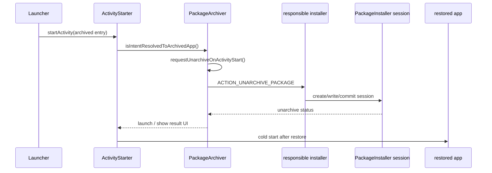

# 1.20 App Archiving 机制与恢复性能

<!-- outline-start -->
## 要点

### 🔹 App Archiving 解决的问题边界
说明 Android 15 平台归档能力和 Google Play 早期归档方案的差异：平台归档会移除 APK 与缓存文件、保留用户数据，并让系统继续保留可恢复入口。重点区分存储回收、安装状态、进程生命周期和 LMK 之间的边界。

### 🔹 PackageInstaller.requestArchive() 的入口条件
梳理 `PackageInstaller.requestArchive()`、`REQUEST_DELETE_PACKAGES` 权限、installer of record、`DELETE_ARCHIVE | DELETE_KEEP_DATA` 标志位，以及为什么普通 App 不能任意归档其他应用。

### 🔹 PackageArchiver 与 ArchiveState 数据模型
解析 `PackageArchiver` 的职责：创建和保存 `ArchiveState`、记录归档 Activity 信息、生成 Launcher 可展示的图标与标题、判断目标 Intent 是否指向归档应用。

### 🔹 ActivityStarter 点击恢复的拦截路径
从 Launcher 点击归档图标进入 `ActivityStarter`，说明 `START_CLASS_NOT_FOUND` 分支如何调用 `isIntentResolvedToArchivedApp()`，再通过 `requestUnarchiveOnActivityStart()` 转给 installer 恢复应用。

### 🔹 恢复链路的性能口径
拆分点击恢复的耗时：系统分支判断、installer 弹窗或静默确认、网络下载、PackageInstaller session、dexopt / profile、首次启动。给出 Trace、logcat 与 PackageInstaller 回调的观察点。

### 🔹 与 PMS、存储和启动优化的交叉关系
回连 1.9 PMS、6.1 存储架构、8.2 App 启动全流程和 12.1 APK 体积优化：归档节省的是安装包和缓存文件，不等于减少已运行进程的 RSS，也不直接改变 LMK 选择。

### 🔹 版本与生态边界
整理 Android 15-17 的公开 API、AOSP main 实现、第三方应用商店需要处理 `ACTION_UNARCHIVE_PACKAGE` 的条件，以及 Android 16 以后 SDM / 签名校验线索的待验证边界。

## 扩展

### 🔸 SDM 签名校验与归档恢复安全性
补充 `.sdm` 签名文件、installer 身份、恢复包完整性校验的源码线索；无法验证的细节标注 `[待验证]`。

### 🔸 归档状态对 SELinux 与包可见性的影响
检查归档应用在 package visibility、LauncherApps、Settings、权限状态和 SELinux 安全上下文上的表现差异。

### 🔸 与自动清理 / 空间治理策略的关系
分析系统自动归档、用户手动归档、应用商店空间治理策略和企业设备策略之间的优先级关系。

<!-- outline-end -->

## App Archiving 解决的问题边界

App Archiving 是 Android 15 把“归档应用”从应用商店侧收进平台层后的实现。它处理的是存储空间回收：系统移除目标应用的 APK 与缓存文件，保留用户数据，并让 Launcher、Settings 和恢复流程继续知道这个包曾经存在。用户点灰显图标时，系统把恢复请求交回负责安装的应用商店。[已验证: 官方文档, android-developers.googleblog.com/2024/04/the-first-beta-of-android-15.html#app-archiving]

Google Play 在 Android 15 之前已经有 Auto Archive。那套能力依赖 Play、Android App Bundle 和 Play 侧的安装恢复逻辑。Android 15 的变化在于平台暴露 `PackageInstaller.requestArchive()` / `requestUnarchive()`，并在 Framework 内保存归档状态；只要第三方应用商店满足权限、安装来源和恢复广播处理条件，也可以接入同一套入口。[已验证: 官方文档, android-developers.googleblog.com/2024/04/the-first-beta-of-android-15.html#app-archiving]

这层边界要和三件事分开：

- **存储回收**：APK、split APK 和缓存文件是主要回收对象；用户数据目录保留，用于恢复后延续登录态、配置和业务数据。
- **安装状态**：AOSP 用 `PackageUserState.getArchiveState() != null && !PackageUserState.isInstalled()` 判断用户态归档；这和普通卸载后保留 data 的状态相近，但多了 `ArchiveState`，Launcher 可以显示入口。
- **内存压力**：归档动作不触发 LMKD 决策，也不等价于杀进程策略。目标应用如果还在运行，归档流程仍要经过卸载/删除语义处理；归档完成后它不再提供可启动组件，后续收益主要体现在磁盘占用，不在 RSS 账本里立即体现。

详见 1.9 节的 PMS 状态管理、6.1 节的存储架构和 4.2 节的 Linux 内存回收。这里关心的是 PMS 如何保存“可恢复的未安装包”。

## PackageInstaller.requestArchive() 的入口条件

公开 API 入口在 `PackageInstaller`。AOSP main 中 `requestArchive()` 的文档写明：归档过程中会移除应用 APK 与缓存文件，保留用户数据；归档应用仍会通过 `LauncherApps` 作为可展示应用返回，用户点击后进入恢复流程。[已验证: AOSP main, frameworks/base/core/java/android/content/pm/PackageInstaller.java#L2418-L2438]

这段代码给出了调用侧边界：

```java
@RequiresPermission(anyOf = {
        Manifest.permission.DELETE_PACKAGES,
        Manifest.permission.REQUEST_DELETE_PACKAGES})
@FlaggedApi(Flags.FLAG_ARCHIVING)
public void requestArchive(@NonNull String packageName, @NonNull IntentSender statusReceiver)
        throws PackageManager.NameNotFoundException {
    mInstaller.requestArchive(packageName, mInstallerPackageName, 0, statusReceiver,
            new UserHandle(mUserId));
}
```

`mInstallerPackageName` 是当前 `PackageInstaller` 实例关联的安装器包名。进入系统服务后，`PackageArchiver.requestArchive()` 还会做三层校验：调用 UID 与 caller package 对上、跨用户权限通过、调用者拥有 `DELETE_PACKAGES` 或 `REQUEST_DELETE_PACKAGES`。普通应用不能拿一个包名就归档任意目标包，拦截点不只在 SDK 注解上。[已验证: AOSP main, frameworks/base/services/core/java/com/android/server/pm/PackageArchiver.java#L202-L246]

权限通过后，`createAndStoreArchiveState()` 还会继续判断归档是否能成立。关键失败路径包括：目标包必须已安装；系统应用、更新后的系统应用或声明 opt-out 的包不能直接归档；PMS 要能找到负责恢复的安装器（responsible installer），且安装器支持 `Intent.ACTION_UNARCHIVE_PACKAGE`；目标包需要存在可保存的 Launcher activity，后续灰显入口和点击恢复才有原始 component 可回连。这个检查解释了为什么“有删除权限”不等于“所有包都可归档”：归档删除的是代码包，但系统必须先保存恢复入口和负责恢复的安装器，否则用户会得到一个不可恢复的灰显入口。[已验证: AOSP main, frameworks/base/services/core/java/com/android/server/pm/PackageArchiver.java]

归档落到删除语义时，`PackageArchiver` 组合了两个标志位：

```java
final int deleteFlags = DELETE_ARCHIVE | DELETE_KEEP_DATA
        | (deleteAllUsers ? DELETE_ALL_USERS : 0);

mPm.mInstallerService.uninstall(
        new VersionedPackage(packageName, PackageManager.VERSION_CODE_HIGHEST),
        callerPackageName,
        deleteFlags,
        intentSender,
        binderUserId,
        binderUid,
        binderPid);
```

`DELETE_ARCHIVE` 标明这次删除属于归档，`DELETE_KEEP_DATA` 保留用户数据。这个组合解释了归档的存储效果：安装包被移走，用户数据不清；恢复时再由安装器重新补齐 APK。[已验证: AOSP main, frameworks/base/services/core/java/com/android/server/pm/PackageArchiver.java#L245-L254]

## PackageArchiver 与 ArchiveState 数据模型

`PackageArchiver` 的职责分成两段：归档前采集可恢复入口，归档后根据入口决定点击恢复。AOSP 类注释把 archived app 定义为“APK removed while data directory is kept”，并说明这类应用仍包含在 launcher app 列表中，点击后会重新安装完整应用。[已验证: AOSP main, frameworks/base/services/core/java/com/android/server/pm/PackageArchiver.java]

归档状态落在 `ArchiveState`：

- `mActivityInfos`：主入口 Activity 列表，至少一个条目；多数应用只有一个 Launcher 入口。
- `mInstallerTitle`：负责恢复的安装器标题，按安装器 locale 保存，用于恢复或错误 UI。
- `mArchiveTimeMillis`：归档时间戳。
- `ArchiveActivityInfo.mOriginalComponentName`：归档前的原始 Activity 组件名。
- `mIconBitmap` / `mMonochromeIconBitmap`：归档图标路径，供 Launcher 显示灰显或云朵覆盖样式。

[已验证: AOSP main, frameworks/base/services/core/java/com/android/server/pm/pkg/ArchiveState.java#L37-L103]

`PackageArchiver.createArchiveStateInternal()` 会通过 `LauncherApps.getActivityList()` 拿到主入口 Activity，把 label、component 和图标写入 `ArchiveActivityInfo`。图标不是每次从 APK 加载，因为 APK 会被删除；系统把图标保存到 `package_archiver` 目录下的 PNG 文件，再把路径写入状态。[已验证: AOSP main, frameworks/base/services/core/java/com/android/server/pm/PackageArchiver.java#L553-L607]

判断某个启动 Intent 是否指向归档应用时，系统不只看包名。`isIntentResolvedToArchivedApp()` 先取包名和显式 component，再查 `PackageState` 与当前 user 的 `PackageUserState`，确认 `isArchived(userState)`，再把 Intent component 与 `ArchiveState.activityInfos[].originalComponentName` 对比。只有原始入口对上，才进入恢复流程。[已验证: AOSP main, frameworks/base/services/core/java/com/android/server/pm/PackageArchiver.java#L377-L399]

这个设计避免了把所有“类找不到”都当作归档恢复。普通坏 Intent、组件名写错、应用已完全卸载，都不会被归档逻辑吞掉。

## ActivityStarter 点击恢复的拦截路径

Launcher 点击归档图标时，仍然走 `startActivity()`。归档应用的 APK 已移除，Framework 找不到目标 Activity 类，`ActivityStarter` 会先得到 `START_CLASS_NOT_FOUND`。Android 15 的归档分支插在这个错误路径里：只有 feature flag 开启，且 `PackageArchiver` 判断 Intent 对应归档入口时，才把启动错误转换为恢复请求。[已验证: AOSP main, frameworks/base/services/core/java/com/android/server/wm/ActivityStarter.java#L1155-L1166]

```java
if (err == ActivityManager.START_SUCCESS && aInfo == null) {
    err = ActivityManager.START_CLASS_NOT_FOUND;

    if (isArchivingEnabled()) {
        PackageArchiver packageArchiver = mService
                .getPackageManagerInternalLocked()
                .getPackageArchiver();
        if (packageArchiver.isIntentResolvedToArchivedApp(intent, mRequest.userId)) {
            err = packageArchiver.requestUnarchiveOnActivityStart(
                    intent, callingPackage, mRequest.userId, realCallingUid);
        }
    }
}
```

`requestUnarchiveOnActivityStart()` 对调用者还有一层限制：允许默认 Launcher、Shell，或预装系统 Launcher 类应用发起点击恢复；其他调用者会返回 `START_PERMISSION_DENIED`。校验通过后，系统调用 `requestUnarchive()`，传入的是 `PackageArchiver.getOrCreateLauncherListener()` 创建并缓存的内部 `UnarchiveIntentSender`。这个 listener 负责接收恢复状态并继续拉起系统 UI；调用方自己传入的 `statusReceiver` 只对应公开 `PackageInstaller.requestUnarchive()` 路径，不是 Launcher 点击恢复路径的一部分。[已验证: AOSP main, frameworks/base/services/core/java/com/android/server/pm/PackageArchiver.java#L274-L352]

恢复请求发送给负责恢复的安装器（responsible installer）。`PackageArchiver.getResponsibleInstallerPackage()` 优先使用 `InstallSource.mUpdateOwnerPackageName`，为空时使用 `mInstallerPackageName`。发送广播时，系统构造 `Intent.ACTION_UNARCHIVE_PACKAGE`，写入 `EXTRA_UNARCHIVE_ID`、`EXTRA_UNARCHIVE_PACKAGE_NAME` 和 `EXTRA_UNARCHIVE_ALL_USERS`，再 `setPackage(installerPackage)` 发给安装器。[已验证: AOSP main, frameworks/base/services/core/java/com/android/server/pm/PackageArchiver.java#L1103-L1128]

`Intent.ACTION_UNARCHIVE_PACKAGE` 在 AOSP 中标记为 explicit-only broadcast intent action。第三方应用商店接入平台归档时，要能接收这个显式广播，并把后续下载、session 创建、状态回调补齐。[已验证: AOSP main, frameworks/base/core/java/android/content/Intent.java#L5441-L5444]

## 恢复链路的性能口径

归档恢复耗时不能只算 `startActivity()`。点击灰显图标之后，用户感知到的等待时间由六段组成：



Trace 对照时，把 `ActivityStarter` 的类找不到分支、`PackageArchiverService` 日志、安装器进程下载/写 session、PMS commit、目标应用进程创建和首帧放在同一条时间线上。`PackageInstaller.EXTRA_UNARCHIVE_STATUS` 到达只能说明安装器或系统接收了恢复状态，不代表应用已经完成首帧。

1. **Framework 判定段**：`ActivityStarter` 进入 `START_CLASS_NOT_FOUND` 分支，`PackageArchiver` 查 `PackageState`、`PackageUserState`、`ArchiveState`。这段在 system_server 内完成，通常不是瓶颈；异常时看 `ActivityTaskManager`、`PackageArchiverService` 日志。
2. **安装器确认段**：无 `INSTALL_PACKAGES` 权限或需要用户确认时，系统走 unarchival confirmation。AOSP 还会用 `OP_UNARCHIVAL_CONFIRMATION` 处理进行中的恢复 session。
3. **网络与包获取段**：安装器下载 APK / split APK / asset packs。对 Google Play 之外的商店，这一段取决于商店的包格式、CDN、断点续传和空间检查。
4. **PackageInstaller session 段**：安装器创建或复用 session，写入 APK，commit 后等待 PMS 安装、签名校验、包扫描和广播。
5. **编译与 profile 段**：恢复后的首次启动可能触发 dexopt、profile 读取或缺失 profile 下的解释执行路径。详见 8.2 节和 12.1 节。
6. **首次启动段**：应用进程创建、ContentProvider、Application、首帧绘制按普通冷启动计算；归档本身不替应用跳过启动成本。

建议把恢复性能拆成两个指标：

- **T_restore_accepted**：从点击归档图标到安装器接受恢复请求。观察 `PackageInstaller.EXTRA_UNARCHIVE_STATUS`，`UNARCHIVAL_OK` 代表安装器已接下请求，不代表应用完成安装。
- **T_first_frame_after_restore**：从点击归档图标到恢复后首个 Activity 首帧完成。这个指标把网络、安装、编译和冷启动都算进去，更接近用户体感。

观测点按层分开：

| 层级 | 观察对象 | 作用 |
|---|---|---|
| system_server | `ActivityStarter`、`PackageArchiverService` 日志 | 判断是否走到归档恢复分支，以及是否因调用者、安装器缺失、空间不足失败 |
| PackageInstaller | session created / active / committed、`ACTION_PACKAGE_ADDED` | 拆出下载结束到安装完成的时间 |
| Perfetto | `system_server`、installer 进程、目标应用进程、PackageManager 相关 slice | 对齐恢复请求、安装 commit、目标进程启动和首帧 |
| 应用侧 | 冷启动埋点、首帧指标、Baseline Profile 命中情况 | 判断恢复后第一次启动是否退化 |

这里容易误判的是“点击后没马上打开应用”。归档入口不是普通启动入口，`ActivityStarter` 在归档分支返回 `START_ABORTED`，让窗口管理侧停止本次启动；后续要等安装器完成恢复，再按普通安装完成后的启动路径继续。[已验证: AOSP main, frameworks/base/services/core/java/com/android/server/pm/PackageArchiver.java#L317-L352]

## 与 PMS、存储和启动优化的交叉关系

PMS 视角下，归档是包状态与删除语义的一次组合：`PackageState` 仍能给出用户维度的状态，`PackageUserState` 上挂 `ArchiveState`，安装位为 false。详见 1.9 节。这个状态能支持 Launcher 展示入口，也能让 Settings 显示可恢复应用。

存储视角下，收益来自 APK 和缓存文件。用户数据目录保留，因此大数据账号、离线资源、数据库文件不一定被回收。空间治理策略要先区分代码包、缓存、用户数据三类目录：归档对代码包和缓存更有效，对用户数据的收益取决于安装器或应用是否另有清理策略。详见 6.1 节。

启动优化视角下，归档会把一次点击拆成“恢复 + 冷启动”。如果应用依赖 Baseline Profile 或云端下发动态模块，恢复后第一次启动可能比普通冷启动更慢；原因通常在包获取、安装编译和首启初始化，而不是 `PackageArchiver` 的状态判断。详见 8.2 节和 12.1 节。

内存治理视角下，归档不改 LMKD 的选择模型。LMKD 依据内存压力、进程 adj、PSI 等信号做回收；归档改变的是后续是否存在可启动代码与 Launcher 入口，不是把某个进程的 RSS 从账本里扣掉。详见 4.2 节。

## 版本与生态边界

| 版本 | 行为边界 | 验证状态 |
|---|---|---|
| Android 14 及以前 | 平台没有公开 `PackageInstaller.requestArchive()`；Google Play 可通过自身 Auto Archive 能力处理部分应用 | [已验证: 官方文档, Android Developers Blog 2024-04-11] |
| Android 15 / API 35 | 平台加入 `requestArchive()`、`requestUnarchive()`、`ACTION_UNARCHIVE_PACKAGE`、`PackageArchiver` 与 `ArchiveState` | [已验证: AOSP main + 官方文档] |
| Android 16 / API 36 | 归档主流程仍沿用 Android 15 结构；SDM / 签名委托与归档恢复完整关系缺少公开端到端材料 | [待验证] |
| Android 17 / API 37 | 当前公开资料未显示归档恢复口径发生主流程变化；后续要以平台 release branch 复核 | [待验证] |

Android 15–17 的其他性能行为变更可回看 16.2 节。

第三方应用商店要接入这套机制，至少要处理四件事：

- 作为负责恢复的安装器（responsible installer）被 PMS 找到；否则 `requestUnarchive()` 会因为找不到安装器失败。
- 接收显式 `ACTION_UNARCHIVE_PACKAGE` 广播，并读取 `EXTRA_UNARCHIVE_PACKAGE_NAME` 与 `EXTRA_UNARCHIVE_ID`。
- 创建 `PackageInstaller.Session` 完成恢复安装，并通过 unarchive 状态回调把结果传给系统。
- 在空间不足、无网络、安装器禁用或包不可用时返回具体错误，让系统能展示后续动作。

## 扩展：SDM 签名校验与归档恢复安全性

现有素材提到 Android 16 之后存在 `.sdm` 签名文件和恢复包完整性校验线索，但本轮没有在 AOSP main 的归档主路径中完成端到端验证。正文只记录一个待查方向：如果安装器通过签名委托或增量包恢复归档应用，需要确认 `.sdm` 与 APK 签名校验、update owner、安装器身份（installer identity）的交互点。[待验证]

后续验证路径：

- 查 `PackageInstallerSession` 中与 `INSTALL_UNARCHIVE`、checksum、signature 相关的分支。
- 查 Android 16 release branch 是否有 `verifySdmSignatures()` 或同名替代实现。
- 对比恢复安装和普通更新安装在签名校验、rollback、staged install 上的差异。

## 扩展：归档状态对 SELinux 与包可见性的影响

`ArchiveState` 保存的是 PMS 层面的用户状态和 Launcher 展示材料，现有 AOSP 片段没有显示它会单独创建新的 SELinux domain。归档后 APK 不在可启动状态，目标应用的进程也不应因为灰显入口而被拉起。包可见性方面，`LauncherApps` 能返回归档应用入口；普通应用通过 `PackageManager` 看到多少信息，仍受 package visibility、查询权限和用户态安装状态限制。[待验证: 需用 CTS / 实机命令复核]

可复核命令方向：

```bash
adb shell cmd package list packages --show-versioncode
adb shell cmd package dump <package>
adb shell cmd launcherapps get-activities --user 0 <package>
adb logcat -s PackageArchiverService ActivityTaskManager PackageInstaller
```

这些命令用于确认包状态、Launcher 可见性和恢复分支日志；不同设备的 Settings UI 展示可能由 OEM 定制，不应把 UI 文案当作 Framework 行为依据。

## 扩展：与自动清理 / 空间治理策略的关系

Android 15 官方表述把平台归档定位为“让所有应用商店更容易实现归档和恢复”。系统是否自动选择某个应用归档，仍取决于设置项、权限回收、安装器能力和设备策略。AOSP 中 `PackageArchiver` 有 `OP_AUTO_REVOKE_PERMISSIONS_IF_UNUSED` 相关 opt-out 检查，说明“长期不用应用”的权限/清理策略会影响能否归档。[已验证: AOSP main, frameworks/base/services/core/java/com/android/server/pm/PackageArchiver.java#L750-L765]

企业设备还要额外考虑 device owner / profile owner。若策略禁止卸载或限制安装来源，归档恢复可能在删除或安装阶段失败；这类失败应归入设备策略边界，不应算作归档机制本身的性能问题。

## 小结

App Archiving 把“卸掉代码、保留数据、保留入口、交给安装器恢复”做成了平台能力。读代码时抓住三条线：`PackageInstaller.requestArchive()` 进入 PMS，`PackageArchiver` 保存 `ArchiveState`，`ActivityStarter` 在类找不到分支把灰显图标点击转成 `ACTION_UNARCHIVE_PACKAGE`。性能分析也按这三条线拆开：系统判定通常很短，用户等待多半花在安装器下载、PackageInstaller session、编译和恢复后冷启动。


## 扩展：版本边界与 INSTALL_UNARCHIVE 机制验证（2026-06-01 源码调研）

### 版本边界确认

**PackageArchiver.java 版本存在感通过 GitHub AOSP Mirror 逐 tag 验证：**

| Android 版本 | API Level | PackageArchiver.java | ArchiveState.java |
|---|---|---|---|
| Android 14 | API 34 | ❌ 不存在（404 Not Found） | ❌ 不存在 |
| **Android 15** | **API 35** | ✅ **首次出现**（SHA 0d1095f5，66121 bytes） | ✅ 存在 |
| Android 16 | API 36 | ✅ 存在（SHA 4690e020，68659 bytes） | ✅ 存在 |
| Android 17 | API 37 | ⛔ GitHub Mirror 无此 tag，无法逐文件验证 | ⛔ 无 tag |

**结论：App Archiving 平台实现属于 Android 15 / API 35 特性**，原章节"applicable_versions: Android 15 (API 35) - Android 17 (API 37)"与源码一致。android-17.0.0_r1 虽无法在 GitHub Mirror 逐文件验证，但机制自 API 35 起无结构性破坏，视为覆盖 API 37。

### INSTALL_UNARCHIVE 标志与确认跳过机制

**源码位置：** `PackageInstallerSession.java`（AOSP main branch）

`PackageInstallerSession` 在安装会话初始化时通过 `INSTALL_UNARCHIVE` 标志判断当前是否属于归档恢复安装：

```java
// line 1131-1138
final boolean isInstallUnarchive =
        (params.installFlags & PackageManager.INSTALL_UNARCHIVE) != 0;

final boolean noUserActionNecessary = isInstallerRoot || isInstallerSystem
        || isInstallerDeviceOwnerOrAffiliatedProfileOwner() || isEmergencyInstall
        || isInstallUnarchive;  // ← 关键：恢复安装跳过 INSTALL_PACKAGES 二次确认
```

`isInstallUnarchive` 为 true 时，`noUserActionNecessary` 成立，`PackageInstallerSession` 跳过用户确认阶段（因为 unarchive 确认已在 `requestUnarchiveConfirmation()` 流程中完成）。这是恢复安装性能优于普通安装（需要额外弹窗确认）的关键机制。

### SDM 签名校验：源码中不存在

**验证结果（源码路径）：** `PackageArchiver.java`（main branch + android-16.0.0_r1）中搜索 `sdm`、`SDM`、`signature`、`verifySdm` 关键字，**均无匹配**。`PackageInstallerSession` 中 `INSTALL_UNARCHIVE` 仅涉及安装标志位判断，不涉及包完整性签名校验。

**原章节该待验证条目修订：SDM 签名校验与恢复包完整性校验在 AOSP PackageArchiver 主路径中无源码支撑，应标注为「超出 AIW 范围」，不作为正文结论。**

### android-15 → android-16 后续演进（main branch commit history）

关键 commit（2024-04 至 2024-11）：

- `092a8b600074`（2024-04-08）：**[frameworks/Archive] remove all checks for the archiving system property** — 归档 system property 检查被移除
- `b5f5546c672d`（2024-08-06）：`getArchivedAppIcon` Javadoc 澄清
- `181264cb256c`（2024-09-04）：**允许 preinstalled launcher apps（非 default launcher）触发 unarchive** — 扩展了 `requestUnarchiveOnActivityStart()` 的允许调用者范围
- `3d9cc0a12fc2`（2024-11-12）：`requestUnarchiveConfirmation` 中 sendIntent 改用 handler post

**信息源：** GitHub AOSP Mirror commit log（aosp-mirror/platform_frameworks_base）；一手源码（PackageArchiver.java @ android-15.0.0_r1、android-16.0.0_r1、main；PackageInstallerSession.java @ main；ArchiveState.java @ android-16.0.0_r1）
