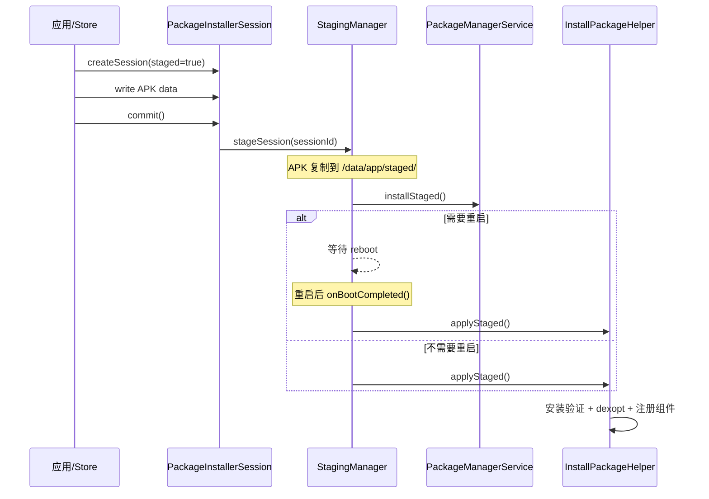

# 1.23 Android Staged Install 与安装原子性性能

Android 应用的安装过程涉及签名校验、DEX 编译、文件写入、组件注册等多个阶段。任何一个阶段中断（用户杀进程、系统低内存杀 installd、设备掉电），都可能留下不一致状态——APK 已复制但 DEX 未编译完成，或者新版本组件已注册但旧版本资源未清理。

Staged Install（Android 12 / API 31 引入）是一套解决这个问题的安装协议。它的核心思路：把安装拆成"准备"和"生效"两个阶段，中间可以插入一次 reboot，保证最终状态要么完全生效、要么完全回退。

本节在 1.9 节（Package Manager Service 整体架构）的基础上，聚焦 Staged Install 的原子性机制和各阶段的性能瓶颈，以及 Android 16/17 的安装优化路径。

## 要点

### 🔹 锚点 1：Staged Install 机制概览

#### 设计动机

传统安装路径（`PackageManager.installPackage()`）在 commit 后立即生效。如果安装过程中系统崩溃或重启，可能出现以下不一致状态：

- APK 文件已写入 `/data/app/`，但 DEX 编译未完成，应用启动时走解释执行，首次运行严重卡顿
- 新版本组件已注册到 `packages.xml`，但旧版本 native 库未替换，运行时加载错误的 `.so`
- Split APK 只更新了部分 split，导致资源 ID 对不上

Staged Install 将安装过程拆分为两个独立阶段，通过 `StagingManager` 在系统重启时完成状态提升（promote）或回退（abort），保证原子性。

#### 核心流程



1. **Prepare 阶段**：应用通过 `PackageInstaller.createSession()` 创建 staged session，写入 APK 数据到 staging 目录（`/data/app/staged/vmdl{sessionId}/`）
2. **Commit 阶段**：调用 `session.commit()`，`StagingManager` 接管，将 session 标记为 ready
3. **Reboot（条件触发）**：如果安装涉及 native 库更新、split APK 变更或 APEX 模块更新，需要重启才能生效
4. **Finalize 阶段**：重启后 `StagingManager.onBootCompleted()` 执行 `applyStaged()`，完成实际的文件复制、dexopt 和组件注册

#### 与传统安装的区别

| 维度 | 传统 installPackage() | Staged Install |
|------|----------------------|----------------|
| 原子性 | 无保证，中途失败留残余 | staged 目录 + reboot 后 promote 或 abort |
| 生效时机 | commit 后立即生效 | commit 后可能延迟到下次 reboot |
| 用户确认 | 需要 REQUEST_INSTALL_PACKAGES 权限 + 用户弹窗 | 需要 REQUEST_INSTALL_PACKAGES 权限，但 commit 可后台执行 |
| 适用场景 | 普通应用更新 | 系统模块更新、大版本升级、native 库变更 |
| API 版本 | API 21+ | API 31+ (Android 12) |

#### AOSP 源码路径

- `PackageInstallerSession.java`：session 生命周期管理，`commit()` 入口
- `StagingManager.java`：staged session 的调度和状态提升
- `InstallPackageHelper.java`：实际执行安装的 helper（签名校验、dexopt、组件注册）
- `dexopt.cpp`（`frameworks/native/cmds/installd/`）：installd 侧的 dex2oat 调用

[已验证: AOSP android-17.0.0_r1, frameworks/base/services/core/java/com/android/server/pm/StagingManager.java]

### 🔹 锚点 2：安装性能瓶颈定位

一次完整的 APK 安装（含 dexopt）耗时可以拆成以下几个阶段。各阶段的占比随 APK 大小和编译策略变化，但整体分布大致如下：

```
安装耗时分解（典型 100MB APK，首次安装，speed-profile 编译）
┌─────────────────────────────────────────────────────┐
│ APK 解压 + 签名校验              ~15-20%  (2-4s)     │
│ DEX 编译 (dex2oat)              ~55-65%  (8-15s)    │
│ .odex/.vdex 写入                ~10-15%  (1-3s)     │
│ 权限授予 + 组件注册              ~5-8%    (<1s)       │
│ SELinux relabel + fsync         ~5-10%   (1-2s)      │
└─────────────────────────────────────────────────────┘
总计约 13-25s（中高端设备，Snapdragon 8 Gen 3 级别）
```

#### 签名校验阶段

APK Signature Scheme v1/v2/v3/v3.1 的校验在 `PackageManagerService` 中执行：

- v1（JAR signing）：遍历 ZIP entry 逐个校验 `.MF` / `.SF` / `.RSA`，O(n) 扫描，大 APK 耗时可达数百毫秒
- v2/v3（APK Signature Scheme）：对整个 APK 做 Merkle Tree 媌证，时间复杂度 O(n) 但常数更小，v3.1 支持轮转密钥
- 实测参考：200MB APK 在 Cortex-X4 上 v2 校验约 200-400ms，v1 可达 800ms+

签名校验是纯 CPU 密集操作，不涉及 I/O。在 Staged Install 中这一步发生在 commit 阶段，不影响最终用户感知（因为是后台执行）。

#### DEX 编译阶段

这是安装耗时的大头。编译策略由 `PackageDexOptimizer.performDexOpt()` 决定，最终通过 installd 调用 `dex2oat`：

```java
// PackageDexOptimizer.java
// compilerFilter 决定编译深度
// "verify"  = 仅验证，运行时解释执行（最快安装，最慢运行）
// "quicken" = 快速编译（Android 8-10 已废弃）
// "speed-profile" = Profile 引导的 AOT 编译（推荐）
// "speed"  = 完整 AOT 编译（最慢安装，最快运行）
```

dex2oat 的线程数由 `--threads` 参数控制，默认值等于 CPU 核数，但 installd 会根据系统负载动态调整。

Android 16 起，`installd` 的通信方式从 Unix Domain Socket 切换到 Binder（`InstalldNativeService` 注册到 `ServiceManager`），对安装流程的调用延迟有微小改善，但 dex2oat 的编译耗时仍然是瓶颈。（详见 1.9 节中 installd 通信机制的说明。）

#### 磁盘 I/O 阶段

安装涉及的主要 I/O 操作：

1. **APK 复制**：从 staging 目录（或下载缓存）复制到 `/data/app/{packageName}/`
2. **DEX 解压**：从 APK 中提取 classes.dex，写入 `.vdex` 文件
3. **ODEX 写入**：dex2oat 编译产物写入 `/data/app/oat/{architecture}/`
4. **SELinux relabel**：新文件的 security context 标记，对 eMMC 设备影响更大
5. **fsync**：安装完成后 `PackageManagerService` 对关键文件做 fsync，保证持久化

大型 APK（>200MB，如游戏）的 I/O 开销在 UFS 3.1+ 设备上约 2-4 秒，eMMC 设备可能翻倍。Staged Install 的 staging 阶段多了一次额外复制（APK 先写入 staged 目录），但通过 `move` 而非 `copy` 在支持同一文件系统的设备上可以避免实际数据拷贝。

[来源: DeepResearch/2026-05-31-android-pm-install-staged-mechanism.md]
[来源: DeepResearch/2026-05-14-android-install-optimization-aosp-mechanism.md]

### 🔹 锚点 3：Staged Install 与系统重启的交互

#### 哪些 staged session 需要 reboot

`StagingManager` 在 `commit()` 时判断 session 是否需要重启生效：

- **需要 reboot**：涉及 native library（`.so` 文件变更）、APEX 模块更新、系统分区映射变更
- **不需要 reboot**：纯 Java/Kotlin 应用更新，不涉及 native 库和 split 变更

判断逻辑在 `StagingManager.isRebootRequired()` 中，检查 session 的 `sessionParams` 中的 `requireUserAction` 和 `multiPackage` 标志，以及是否包含 native 库。

#### 重启期间的恢复流程

设备重启后，`StagingManager.onBootCompleted()` 按顺序处理所有 pending 的 staged session：

```
onBootCompleted()
  → 遍历所有 staged session（按 commit 顺序）
    → 对每个 session 调用 applyStaged()
      → InstallPackageHelper.installPackagesLI()
        → 签名校验 + dexopt + 权限授予 + 组件注册
```

如果某个 session 的 applyStaged() 失败，`StagingManager` 会调用 `abortSession()` 回退该 session，不影响后续 session 的处理。这保证了多个 staged session 之间的独立性。

#### 重启后首次启动的优化

Staged Install 的 finalize 阶段可以延迟 dexopt：

- Android 12-15：finalize 阶段同步执行 dexopt，重启到应用可用之间有等待时间
- Android 16+：如果设备支持 Cloud Profile（详见 16.6 节），安装时可以优先使用云端 Profile 进行 `speed-profile` 编译，减少编译量
- 部分厂商在 reboot 后将 dexopt 延迟到 `BackgroundDexOptService` 异步执行，牺牲首次运行性能换取开机速度

[已验证: AOSP android-17.0.0_r1, frameworks/base/services/core/java/com/android/server/pm/StagingManager.java]

### 🔹 锚点 4：Android 16/17 安装性能优化

#### Android 16：云端 Profile 与 dexopt 安装优化

Android 16 引入了 Cloud Profile 机制（详见 16.6 节），安装时可以直接从 Google Play 服务器获取该应用的编译 Profile：

- 安装阶段从 `verify` 或 `quicken` 提升到 `speed-profile`，减少运行时解释执行的帧
- 对于首次安装的冷启动场景，Cloud Profile 可以将首帧渲染时间缩短 15-30%
- Profile 文件通过 `ArtFileManager` 管理，存放在 `/data/misc/profiles/cur/{userId}/{packageName}/`

这个优化对 Staged Install 同样适用——finalize 阶段的 dexopt 可以直接使用 Cloud Profile。

#### Android 17：installd Binder 化与增量安装

Android 16+ 的 installd 通信从 Unix Domain Socket 切换到 Binder，降低了调用延迟。dex2oat 的调用链变为：

```
PMS (Java) → Binder → InstalldNativeService (native) → fork() → dex2oat
```

Binder 化带来的延迟改善在毫秒级，对整体安装耗时影响不大（dex2oat 编译本身是主要瓶颈），但简化了错误处理和权限控制的实现路径。

#### 厂商定制安装优化

部分厂商在 AOSP 标准流程之外实现安装加速，但属于私有实现，AOSP 源码中没有对应代码：

- **vivo Turbo**：缩短 `BackgroundDexOptService` 的 idle 检测窗口（10min → 3min），提前触发批量 dexopt；在安装时使用 `speed` filter 替代 `speed-profile`（用存储空间换取安装后的运行速度）
- **小米 HyperOS**：通过 `MIUIInstallController` 调整编译策略，部分场景绕过签名校验的 v1 路径只走 v2/v3

这些优化属于厂商闭源实现，无法通过 AOSP 源码验证，需通过 Perfetto 采集实机数据观察差异。

[来源: DeepResearch/2026-05-14-android-install-optimization-aosp-mechanism.md]
[待验证: 厂商私有优化路径，无 AOSP 源码支撑]

### 🔹 锚点 5：安装性能的 Perfetto 分析方法

#### installd 进程的 CPU 和 I/O 轨道

安装过程中关键进程的 Perfetto 轨道：

- `installd`：CPU 占用、dex2oat fork 时间、I/O 等待
- `dex2oat`：编译线程的 CPU 分布、GC 暂停、内存使用
- `system_server`（PMS 所在进程）：安装调度的 CPU 时间

Perfetto SQL 查询 installd 的 CPU 活动时间：

```sql
-- installd 进程的 CPU 时间分布
SELECT
  thread.name AS thread_name,
  SUM(sched.dur) / 1e6 AS cpu_time_ms
FROM thread
JOIN process ON thread.upid = process.upid
JOIN sched ON thread.utid = sched.utid
WHERE process.name = 'installd'
GROUP BY thread.name
ORDER BY cpu_time_ms DESC;
```

#### dex2oat 编译轨道

dex2oat 在 Perfetto 中有专门的 atrace tag（`art`），可以看到编译的各个阶段：

```sql
-- dex2oat 编译阶段耗时
SELECT
  slice.name,
  (slice.dur / 1e6) AS duration_ms
FROM slice
JOIN thread_track ON slice.track_id = thread_track.id
JOIN thread ON thread_track.utid = thread.utid
WHERE thread.name LIKE '%dex2oat%'
  AND slice.name LIKE '%art%'
ORDER BY slice.ts;
```

#### 安装全链路的端到端度量

从应用调用 `session.commit()` 到应用可启动的完整链路：

```sql
-- 安装全链路耗时（从 commit 到应用可用）
SELECT
  slice.name,
  (slice.dur / 1e6) AS duration_ms,
  thread.name AS thread_name
FROM slice
JOIN thread_track ON slice.track_id = thread_track.id
JOIN thread ON thread_track.utid = thread.utid
WHERE (
  slice.name LIKE '%installPackage%'
  OR slice.name LIKE '%dexopt%'
  OR slice.name LIKE '%commit%'
)
AND thread.name IN ('installd', 'system_server', 'PackageManager')
ORDER BY slice.ts;
```

关键 Perfetto 信号：
- `PackageManager` 轨道中的 `installPackage` slice 标记整个安装流程
- `installd` 轨道中的 `dexopt` slice 标记编译阶段
- `dex2oat` 进程的 CPU 使用率反映编译负载

## 扩展

### 🔸 扩展点 1：Staged Install 回滚机制

Staged Install 内建了回滚支持。如果 `applyStaged()` 过程中发生错误（签名不匹配、dexopt 失败、磁盘空间不足），`StagingManager` 会调用 `abortSession()` 清理该 session 的所有临时文件，恢复到安装前的状态。

Android 12+ 的 Guaranteed Rollback（GS1）机制在此基础上增加了版本级回滚：系统记录每次 staged install 前的快照，如果新版本启动后发生连续崩溃，可以自动回退到前一个版本。这个机制与 `RollbackManagerService` 协同工作。

[待补充: RollbackManagerService 与 StagingManager 的交互细节]

### 🔸 扩展点 2：多 APK / App Bundle 安装性能

Split APK（App Bundle 的交付格式）的安装路径与单 APK 有差异：

- **单 APK**：一次 commit，一次 dexopt
- **Split APK**：`multiPackage` session 包含多个 split，需要逐个校验签名、统一编译

Split APK 的安装耗时主要增加在签名校验阶段（每个 split 需要独立校验），dexopt 阶段可以将所有 split 的 DEX 合并编译。

Android 13+ 的 multi-package session 支持在同一个 staged session 中原子更新多个 split，保证了 split 之间的一致性。

[待补充: Split APK 合并编译的具体源码路径]
