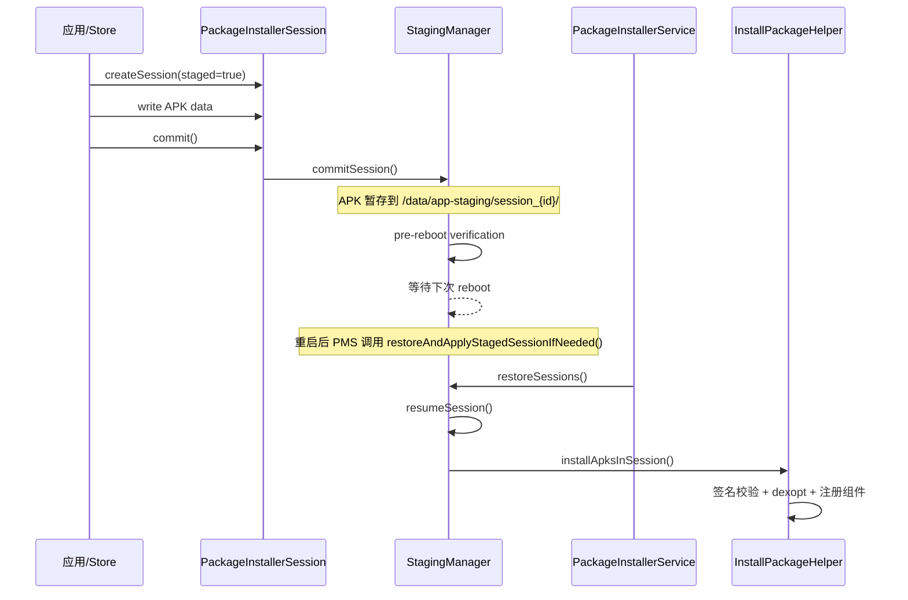

# 1.23 Android Staged Install 与安装原子性性能

Android 应用安装要经过签名校验、DEX 编译、文件写入、组件注册多个阶段。任一阶段中断——用户杀进程、系统低内存杀 installd、设备掉电——都可能留下不一致状态：APK 已复制但 DEX 未编译完成，或新版本组件已注册但旧版本资源未清理。

Staged Install(Android 10 / API 29 起,通过 `PackageInstaller.SessionParams#setStaged()` 提供)就是解决这个问题的安装协议。核心思路是把安装拆成"准备"和"生效"两个阶段,中间可以插入一次 reboot,保证最终状态要么完全生效、要么完全回退。

本节在 1.9 节(Package Manager Service 整体架构)的基础上,聚焦 Staged Install 的原子性机制和各阶段的性能瓶颈。

## 核心机制

### 锚点 1: Staged Install 设计原理

#### 问题背景

传统安装路径在 commit 后立即生效。如果安装过程中系统崩溃或重启,可能出现以下不一致状态:

- APK 文件已写入 `/data/app/`,但 DEX 编译未完成,应用启动时走解释执行,首次运行严重卡顿
- 新版本组件已注册到 `packages.xml`,但旧版本 native 库未替换,运行时加载错误的 `.so`
- Split APK 只更新了部分 split,导致资源 ID 对不上

Staged Install 将安装过程拆分为两个独立阶段，通过 `StagingManager` 在系统重启时完成状态提升（promote）或回退（abort），确保原子性。

#### 工作流程



1. **Prepare 阶段**:通过 `PackageInstaller.createSession()` 创建 staged session,写入 APK 数据到 staging 目录(`/data/app-staging/session_{id}/`,由 `PackageInstallerService#buildSessionDir()` 生成)
2. **Commit 阶段**:调用 `session.commit()`,`StagingManager#commitSession()` 接管,执行 pre-reboot verification(签名校验、磁盘空间检查)后将 session 置为 ready 状态。`PackageInstaller.SessionParams#setStaged()` 注释明确 staged session 在 "next reboot" 安装
3. **Reboot 后恢复**:重启后 `PackageInstallerService#restoreAndApplyStagedSessionIfNeeded()` 调用 `StagingManager#restoreSessions()` → `resumeSession()`
4. **Finalize 阶段**:`resumeSession()` 内调用 `installApksInSession()` 完成签名校验、dexopt、组件注册等实际安装步骤

#### 传统安装 vs Staged Install

| 维度 | 传统 installPackage() | Staged Install |
|------|----------------------|----------------|
| 原子性 | 无保证，中途失败留残余 | staged 目录 + reboot 后 promote 或 abort |
| 生效时机 | commit 后立即生效 | commit 后排队到下次 reboot 生效 |
| 权限要求 | INSTALL_PACKAGES 签名权限 | INSTALL_PACKAGES 签名权限（@SystemApi） |
| 适用场景 | 普通应用安装/更新 | 系统模块更新、大版本升级、native 库变更、APEX 更新 |
| AOSP 起始版本 | API 21+ | Android 10 / API 29（setStaged() 已存在于 android-10.0.0_r1） |

**权限说明**：`setStaged()` 在 Android 17 `android-17.0.0_r1` 中仍标记为 `@SystemApi`，需要 `INSTALL_PACKAGES` 签名级权限。这不是普通应用通过 `REQUEST_INSTALL_PACKAGES` 走 sideload 就能使用的能力——staged session 是系统更新器（如 Google Play、OTA 客户端）和特权预置安装器的专属机制。

#### 关键源码路径

- `PackageInstallerSession.java`：session 生命周期管理，`commit()` 入口
- `StagingManager.java`：staged session 调度、状态机管理（`commitSession()` / `restoreSessions()` / `resumeSession()`）
- `PackageInstallerService.java`：重启后恢复入口（`restoreAndApplyStagedSessionIfNeeded()`）、session 目录管理（`buildSessionDir()`）
- `InstallPackageHelper.java`：实际执行安装（签名校验、dexopt、组件注册）
- `dexopt.cpp`（frameworks/native/cmds/installd/）：installd 侧的 dex2oat 调用

[已验证: AOSP android-17.0.0_r1, frameworks/base/services/core/java/com/android/server/pm/StagingManager.java]

### 锚点 2: 安装性能瓶颈分析

一次完整的 APK 安装（含 dexopt）耗时可以拆解为以下几个阶段。以下数据来源于参考测试环境（需在具体设备上验证），仅用于建立分析框架：

> **数据说明**：以下百分比为定性分析框架，用于建立分析维度，不来自可复现实测。具体数值受设备型号、ROM、APK 规模、compiler filter 和采样条件影响，不可跨设备直接比较。

```
安装耗时分解（典型 ~100MB APK，首次安装，speed-profile 编译）
┌─────────────────────────────────────────────────────────────┐
│ APK 解压 + 签名校验              ~15-20%                     │
│ DEX 编译 (dex2oat)              ~55-65%（主要瓶颈）        │
│ .odex/.vdex 写入                 ~10-15%                     │
│ 权限授予 + 组件注册               ~5-8%                      │
│ SELinux relabel + fsync           ~5-10%                     │
└─────────────────────────────────────────────────────────────┘
```

#### 签名校验阶段

APK 签名方案校验在 `PackageManagerService` 中执行，不同版本的成本差异明显：

- **v1（JAR signing）**：遍历 ZIP entry 逐个校验 `.MF` / `.SF` / `.RSA`，O(n) 扫描，大 APK 耗时显著
- **v2/v3（APK Signature Scheme）**：对 APK 受保护区段做分块内容摘要后验证签名；v3.1 支持轮转密钥。v4 基于 fs-verity Merkle hash tree，生成 `.idsig` 文件，配合增量安装使用
- v2/v3 的 digest 计算需要读取 APK 受保护区段，产生 I/O 成本（受 page cache 命中率和存储介质影响）。签名验证的密码学运算本身是 CPU 密集的，整体耗时为 CPU 计算与 I/O 之和。Staged Install 中这一步在 commit 阶段（pre-reboot verification）完成，不影响最终用户感知


#### DEX 编译阶段

这是安装耗时的大头。编译策略由 `PackageDexOptimizer.performDexOpt()` 决定，最终通过 installd 调用 `dex2oat`：

```java
// PackageDexOptimizer.java
// compilerFilter 决定编译深度
// "verify"  = 仅验证，运行时解释执行（最快安装，最慢运行）
// "speed-profile" = Profile 引导的 AOT 编译（推荐）
// "speed"  = 完整 AOT 编译（最慢安装，最快运行）
```

dex2oat 的线程数通过 `-j` 参数控制。installd 的 `run_dex2oat.cpp`(android-17.0.0_r1:`frameworks/native/cmds/installd/run_dex2oat.cpp`)根据编译场景读取系统属性:

- `dalvik.vm.restore-dex2oat-threads`(staged restore 场景)
- `dalvik.vm.background-dex2oat-threads`(后台 idle 编译)
- `dalvik.vm.dex2oat-threads`(默认值)
- `dalvik.vm.boot-dex2oat-threads`(boot 编译)

installd 读取对应属性值传给 dex2oat 的 `-j`。属性缺省时 dex2oat 使用内部默认线程数(取决于 ART 版本)。installd 没有"按系统负载动态调整线程数"的逻辑。

PMS/Installer 通过 `IInstalld` Binder 接口调用 installd(`Installer#connect()` 从 `ServiceManager.getService("installd")` 获取 Binder,这一点从 Android 8 的 `InstalldNativeService` 起就是 Binder 化路径,不是 Android 16/17 才引入的断点--详见 1.9 节)。调用链:

```
PMS (Java) → IInstalld Binder → installd (native) → fork() → dex2oat
```

Binder 调用本身的延迟在微秒到毫秒级,对整体安装耗时影响很小。dex2oat 的编译耗时仍是绝对瓶颈。

#### 磁盘 I/O 阶段

安装涉及的主要 I/O 操作：

1. **APK 复制**：从 staging 目录（或下载缓存）复制到 `/data/app/{packageName}/`
2. **DEX 解压**：从 APK 中提取 classes.dex，写入 `.vdex` 文件
3. **ODEX 写入**：dex2oat 编译产物写入 `/data/app/oat/{architecture}/`
4. **SELinux relabel**：新文件的 security context 标记
5. **fsync**：安装完成后对关键文件做 fsync，保证持久化

Staged Install 的 staging 阶段多了一次写入（APK 先写入 staging 目录），但通过 `rename` 而非 `copy` 在支持同一文件系统的设备上可避免实际数据拷贝。


[来源：DeepResearch/2026-05-14-android-install-optimization-aosp-mechanism.md]

### 锚点 3: Staged Install 与系统重启的交互

#### 所有 staged session 均需要 reboot

`PackageInstaller.SessionParams#setStaged()` 在 android-17.0.0_r1 中声明 staged session "installed at next reboot"。`StagingManager` 类注释也写明 staged install sessions "require packages to be installed only after a reboot"。

`StagingManager#commitSession()` 将 session 标记为 committed，执行 pre-reboot verification（签名校验、磁盘空间检查），通过后将 session 置为 ready。实际安装动作（`installApksInSession()`）不在 commit 阶段执行，而是在下次重启后由 `restoreSessions()` / `resumeSession()` 触发。

所有 staged session——APK-only、APEX 还是混合 session——commit 后不会立即生效，而是排队等待下一次 reboot。

#### 重启期间的恢复流程

设备重启后，`PackageInstallerService#restoreAndApplyStagedSessionIfNeeded()` 触发恢复：

```
restoreAndApplyStagedSessionIfNeeded()
  → StagingManager#restoreSessions()
    → 按 session 顺序调用 resumeSession()
      → 对每个 session 调用 installApksInSession()
        → 签名校验 + dexopt + 权限授予 + 组件注册
```

#### 失败恢复与 session 间传播

单个 session 恢复失败时的行为取决于 session 类型：

- **APK-only staged install**：失败走 `onInstallationFailure()` → `setSessionFailed()`，清理该 session 的 staging 目录和临时文件。`abortSession()` 主要用于从 `mStagedSessions` 内部列表中移除记录，不是将已变更系统状态恢复到安装前快照的完整回滚动作。
- **APEX 或混合 session**：APEX 激活失败时，`restoreSessions()` 将其他 staged session 标记为 "Another apex session failed"，阻止后续 session 继续安装。APEX 涉及系统分区一致性——一个 APEX 失败意味着系统分区状态不确定，不应继续应用其余 session。
- **checkpoint 支持**：当 system_server 支持 VAB（Virtual A/B）checkpoint 时，失败触发 `abortCheckpoint()` 回退整个系统快照。回退粒度由 checkpoint 覆盖的系统分区范围决定，不是 per-session 粒度。

多个 staged session 不总是独立事务。APEX 和混合 session 存在失败传播，仅纯 APK-only 的多个 staged session 之间接近独立。

#### APEX 与 APK 混合 Session 的状态分支

Staged session 的类型决定了恢复流程和失败传播行为：

- **APK-only session**：走 `installApksInSession()` 标准路径。单个 session 失败不影响其他 APK-only session。
- **APEX session**：涉及系统分区变更，`resumeSession()` 中触发 `apexd` 激活。激活失败通过 `setSessionFailed()` 标记，并调 `abortCheckpoint()`（若支持 VAB checkpoint）回退系统快照。
- **混合 session**：同时包含 APEX 和 APK。APEX 部分优先处理；若 APEX 激活失败，`restoreSessions()` 将其他 staged session 标记为 "Another apex session failed"，阻止后续 session 安装——APEX 失败导致系统分区状态不确定，不应继续应用变更。

[已验证：AOSP android-17.0.0_r1, frameworks/base/services/core/java/com/android/server/pm/StagingManager.java]

### 锚点 4: 安装性能的 Profile 分发边界

#### Profile 引导编译与 Staged Install 的关系

Staged Install 的 finalize 阶段执行 dexopt 时，编译深度取决于当前可用的 profile：

- **设备端已有 Profile**（从之前的使用/OTA 中积累）：`speed-profile` 编译，利用本地 profile 数据
- **设备端无 Profile（首次安装/清数据后）**：通常降级到 `verify` 或默认 filter，运行时走解释/JIT

#### Cloud Profiles 的分发边界

Android 16 文档提及 Cloud Profiles（通过 Google Play 分发聚合的应用热点数据），但它的消费边界需要明确：

- Cloud Profiles 的获取和注入属于 **Play Services / ART 设备端消费**的范畴，不是 PMS 安装流程的原生步骤
- Profile 文件通过 `ArtFileManager` 管理，存放在 `/data/misc/profiles/cur/{userId}/{packageName}/`
- 安装时的 dexopt 能否使用 Cloud Profile，取决于 profile 是否已在安装前注入到设备——这依赖 Play Store 的预取时序，而不是安装框架的保证

**与 21.12 节的交叉引用**：21.12 节已说明 Cloud Profiles 属于 Play 分发聚合热点数据的补充机制，不是 AOSP 安装框架的内建能力。Cloud Profile 15-30% 首帧收益、Staged finalize 使用 Cloud Profile 等说法缺少 Android 17 源码验证链路，不作为正文结论。

#### dexopt 延迟策略

部分厂商在 reboot 后将 dexopt 延迟到 `BackgroundDexOptService` 异步执行：

- **优点**：加快开机速度，不阻塞用户进入桌面
- **代价**：应用首次启动时可能走解释执行，首帧渲染时间显著增加

AOSP 默认行为是同步 dexopt，厂商定制可能改变这一策略。

> 厂商延迟 dexopt 属于 AOSP 之外的定制行为，不同厂商/ROM 实现差异大，以上"优点/代价"为定性分析，需要具体设备实测数据支撑。

### 锚点 5: 安装性能的 Perfetto 分析方法

#### installd 进程的 CPU 和 I/O 轨道

安装过程中关键进程的 Perfetto 轨道：

- `installd`：CPU 占用、dex2oat fork 时间、I/O 等待
- `dex2oat`：编译线程的 CPU 分布、GC 暂停、内存使用
- `system_server`（PMS 所在进程）：安装调度的 CPU 时间

Perfetto SQL 查询 installd 的 CPU 活动时间：

```sql
-- installd 进程的 CPU 时间分布
SELECT
  thread.name AS thread_name,
  SUM(sched.dur) / 1e6 AS cpu_time_ms
FROM thread
JOIN process ON thread.upid = process.upid
JOIN sched ON thread.utid = sched.utid
WHERE process.name = 'installd'
GROUP BY thread.name
ORDER BY cpu_time_ms DESC;
```

#### dex2oat 编译轨道

dex2oat 在 Perfetto 中有专门的 atrace tag(`art`),可以观察到编译的各个阶段:

```sql
-- dex2oat 编译阶段耗时
SELECT
  slice.name,
  (slice.dur / 1e6) AS duration_ms
FROM slice
JOIN thread_track ON slice.track_id = thread_track.id
JOIN thread ON thread_track.utid = thread.utid
WHERE thread.name LIKE '%dex2oat%'
  AND slice.name LIKE '%art%'
ORDER BY slice.ts;
```

#### 安装过程端到端度量

从应用调用 `session.commit()` 到应用可启动的完整链路：

```sql
-- 安装总耗时(从 commit 到应用可用)
SELECT
  slice.name,
  (slice.dur / 1e6) AS duration_ms,
  thread.name AS thread_name
FROM slice
JOIN thread_track ON slice.track_id = thread_track.id
JOIN thread ON thread_track.utid = thread.utid
WHERE (
  slice.name LIKE '%installPackage%'
  OR slice.name LIKE '%dexopt%'
  OR slice.name LIKE '%commit%'
)
AND thread.name IN ('installd', 'system_server', 'PackageManager')
ORDER BY slice.ts;
```

关键 Perfetto 信号:
- `PackageManager` 轨道中的 `installPackage` slice 标记整个安装流程
- `installd` 轨道中的 `dexopt` slice 标记编译阶段
- `dex2oat` 进程的 CPU 使用率反映编译负载

## 扩展知识

### 扩展点 1：Staged Install 回滚机制

Staged Install 的失败处理分成两层。`resumeSession()` / `installApksInSession()` 抛出异常时，Android 17 先走 `onInstallationFailure()` → `setSessionFailed()`，再按设备是否支持 checkpoint 决定是否 `abortCheckpoint()` 回退系统快照。`abortSession()` 只是把 session 从 `mStagedSessions` 记录中移除，不承担"恢复到安装前状态"的主回滚语义。

版本级回滚由 RollbackManager / RollbackManagerService 维护可回滚版本和启用策略。APEX 或 mixed staged session 失败时，还要结合 apexd 激活状态、`revertActiveSessions()` 和 checkpoint 支持判断；纯 APK-only session 失败通常只标记该 session failed，不等价于整机快照回滚。

[已验证：AOSP android-17.0.0_r1, StagingManager#onInstallationFailure() / abortCheckpoint() / abortSession()]

### 扩展点 2：多 APK / App Bundle 安装性能

Split APK（App Bundle 的交付格式）的安装路径与单 APK 有差异：

- **单 APK**：一个 session 写入一个 base APK，commit 后按该包的 code paths 执行校验和 dexopt
- **Split APK**：同一个 package session 可写入 base APK 和多个 split；系统统一校验包名、签名和 split 元数据，dexopt 针对该 package 的 code paths 执行
- **Multi-package session**：父 session 本身不包含 APK，只引用多个 child session。`setMultiPackage()` 在 Android 10 已存在，staged parent 可以在 reboot 时原子提交多个 child；任一 child 安装失败会导致同组 child 一起失败

Split APK 的额外成本主要来自每个 split 的文件读取、签名校验和资源/代码路径登记。不要把 split 数量直接等同于 dexopt 次数，也不要把 multi-package session 写成"多个 split 的容器"；它解决的是多个 install session 的原子提交问题。

[已验证：AOSP android-17.0.0_r1, PackageInstaller.SessionParams#setMultiPackage() / setStaged() / Session#addChildSessionId()]

### 扩展点 3：安装加速的厂商私有实现

部分厂商在 AOSP 标准流程之外实现了安装加速，AOSP 源码中没有对应代码：

- **vivo Turbo**：传闻缩短 `BackgroundDexOptService` 的 idle 检测窗口以提前触发批量 dexopt
- **小米 HyperOS**：传闻通过定制 `InstallController` 调整编译策略

以上为第三方观察，非 AOSP 源码可验证路径，具体实现细节和性能收益均需在对应设备上采集 Perfetto trace + 安装日志后才有判断依据。

<!-- AIW-源码调研-2026-06-30 -->
## 源码补充（2026-06-30 调研）

> 基于 `AOSP android-17.0.0_r1` 源码，对正文中提到的关键路径补充**源码级证据**。

### 状态机三态：`mSessionReady / mSessionApplied / mSessionFailed`

正文锚点 1 提到 staged session 经过"等待下次 reboot 生效"，但未具体说明 session 本身的状态字段。源码 `frameworks/base/services/core/java/com/android/server/pm/PackageInstallerSession.java` 揭示这是**三个独立 boolean**：

```java
// PackageInstallerSession.java line 676–678
private boolean mSessionApplied;
private boolean mSessionReady;
private boolean mSessionFailed;

private boolean isInTerminalState() {        // line 1634
    synchronized (mLock) {
        return mSessionApplied || mSessionFailed;
    }
}
```

三个 setter（`setSessionReady` line 6493 / `setSessionApplied` line 6521 / `setSessionFailed` line 6506）共享同一个守卫：`if (mDestroyed || mSessionFailed) return;` ——即 destroyed / failed 是粘性状态，ready 不能覆盖 failed。`setSessionReady()` 内部显式清零 `mSessionApplied = false; mSessionFailed = false;`，对应"ready 可重入"的语义（重启后补 verification 的场景）。

这三个字段会被持久化到 `PackageInstallerService.mSessionsFile`（`AtomicFile`）的 XML 属性 `mSessionReady / mSessionApplied`，重启时由 `readSessionSettingsLocked()` 读回（line 1335–1338）。

### Pre-reboot verification 5 阶段流水线

正文锚点 1 的流程图提到"pre-reboot verification"，但未拆分阶段。源码 `frameworks/base/services/core/java/com/android/server/pm/PackageSessionVerifier.java` line 219 的 `verifyStaged()` 注释明确写出 5 阶段：

1. `checkActiveSessions()`（line 547）—— 多 session 场景必须 `supportsCheckpoint()`；否则 `INSTALL_FAILED_OTHER_STAGED_SESSION_IN_PROGRESS`。
2. `checkRollbacks()`（line 587）—— rollback session 抢占：新 session 是 rollback → 其他 staged 失败；反之抛错。
3. `checkOverlaps(parent, child)`（line 638）—— 按 `getCommittedMillis()` 比较提交时间，提交较晚者 `INSTALL_FAILED_OTHER_STAGED_SESSION_IN_PROGRESS`。
4. `verifyApex()` / `submitSessionToApexService()`（line 297）—— 调 `mApexManager.submitStagedSession()`；apexd 返回 `ApexInfoList` 后 `PackageParser2.parsePackage(PARSE_APEX)`。
5. `endVerification()`（line 351）—— 关键两步顺序：`setSessionReady()` 在前，`markStagedSessionReady()` 在后。

第 5 阶段注释明示顺序原因：

> // Proactively mark session as ready before calling apexd. ... If device gets rebooted right before call to apexd, then apexd will never activate apex files of this staged session. This will result in StagingManager failing the session.
> // On the other hand, if the order of the calls was inverted (first call apexd, then mark session as ready), then if a device gets rebooted right after the call to apexd, only apex part of the train will be applied, leaving device in an inconsistent state.

即先 setSessionReady 让 PMS 持久化"准备好"状态；再调 apexd 提交。窗口期 reboot 不一致风险因此被切断。

### Boot-time restore 的两道闸门

正文锚点 3 提到 `PackageInstallerService#restoreAndApplyStagedSessionIfNeeded()` 与 `StagingManager#restoreSessions()`，但未串成单一对照链路。源码揭示实际是**两道闸门**：

**第一道：PackageInstallerService#restoreAndApplyStagedSessionIfNeeded()**（line 441）—— 仅筛选满足 **无 parent && isCommitted && !isInTerminalState** 的 session；同时处理孤儿场景：child session 但 parent 缺失 → 立即 `setSessionFailed(ACTIVATION_FAILED, "An orphan staged session X is found, parent Y is missing")`。

**第二道：StagingManager#restoreSessions()**（line 626）—— 7 个子步骤：
1. boot 完成检查（`sys.boot_completed` 已 true → 直接返回）
2. `isDeviceUpgrading`（build fingerprint 变化 → 全部 fail 并 early return）
3. checkpoint 能力探测（多 session + 无 checkpoint 抛 `IllegalStateException`，不是 PackageManagerException）
4. dangling APEX 收集（`mApexManager.getSessions()` 比对，加入 `sessionIdsToBeAborted`）
5. `handleNonReadyAndDestroyedSessions()`（line 599）—— 非 ready 的 session 通过 `mBootCompleted.thenRun(() -> session.verifySession())` **异步重做 verification**
6. APEX 一致性逐 session 检查 —— 一票否决：`applied + failed 共存 → abortCheckpoint`；任一 failed → 全部 failed（错误信息 "Another apex session failed"）
7. 逐 session `resumeSession()` → `installApksInSession()` → 真实安装

### APEX session 状态枚举（ApexManager）

apexd 内部状态由 `ApexSessionInfo` 暴露布尔字段，`frameworks/base/services/core/java/com/android/server/pm/ApexManager.java` line 944–962 的 dumpsys 路径枚举了 9 个状态：`UNKNOWN / VERIFIED / STAGED / ACTIVATED / ACTIVATION FAILED / SUCCESS / REVERT IN PROGRESS / REVERTED / REVERT FAILED`。`StagingManager.isApexSessionFailed()`（line 580）认为 `ActivationFailed / Unknown / Reverted / RevertInProgress / RevertFailed` 五种都是 failed。这种状态-谓词映射是 restore 阶段判定 APEX 一致性的基础。

### abortCheckpoint vs abortSession vs abortCommittedSession

正文扩展点 1 提到的回滚分层在源码中清晰分离：

| 方法 | 行号 | 实际语义 |
|------|------|----------|
| `abortSession(session)` | 517 | 仅从 `mStagedSessions` (`SparseArray`) remove，**不涉及系统状态回滚** |
| `abortCommittedSession(session)` | 526 | 用于"已 commit 但未 reboot"被 abandon 的 session；先 `ensureActiveApexSessionIsAborted()`，再 abortSession |
| `abortCheckpoint(reason, supportsCheckpoint, needsCheckpoint)` | 212 | 真正回滚：写 `/metadata/staged-install/failure_reason.txt` + `mApexManager.revertActiveSessions()` + `StorageManager.abortChanges("abort-staged-install", false)`；失败兜底直接 `mPowerManager.reboot()` |

正文"abortCheckpoint 的两条触发路径"——即 `installApksInSession()` 抛 PackageManagerException → `onInstallationFailure()` → `abortCheckpoint()`，以及 `applied+failed` 一票否决时直接 `abortCheckpoint()` 后 early return——在源码中由 line 427 和 line 753 两处触发，可对照 trace 验证。

### 三类 session 的分支差异（补充对照表）

| 维度 | APK-only session | APEX session | Multi-package parent |
|------|------------------|--------------|---------------------|
| `verifyStaged` 阶段 4 | 跳过 `verifyApex` | `submitSessionToApexService` | 遍历 children 中 apex 子项 |
| `endVerification` 中 `setSessionReady` | 调 | 调 + `markStagedSessionReady` | 调 |
| `resumeSession` 中 APEX 专属检查 | 跳过 | `checkInstallationOfApkInApexSuccessful` / `checkDuplicateApkInApex` / `snapshotAndRestoreForApexSession` | 仅当 `containsApexSession` |
| APEX session 状态校验（restore 时） | 不进入 APEX 分支 | 必须 `isActivated / isSuccess` | 继承自 children |
| 失败传播 | 当前 session failed | `abortCheckpoint` + `revertActiveSessions` + `reboot` | 任一 apex child 失败 → parent 整体受 APEX 规则约束 |
| 成功标记时机 | 即时（`install()` 完成 → `setSessionApplied`） | checkpoint 设备：`boot completed` 时 `markStagedSessionsAsSuccessful` 统一调；非 checkpoint：即时 | parent 不直接成功（由 children 反映） |
| Staging 目录 | `/data/app-staging/session_{id}/` | 同上 | parent 无独立 dir；children 各有 session dir |

> 表中"成功标记时机"——APEX session 在支持 checkpoint 的设备上不会在 `resumeSession()` 内立即标记成功，而是把 sessionId 加入 `mSuccessfulStagedSessionIds`（line 433）；由 `Lifecycle.onBootPhase(PHASE_BOOT_COMPLETED)` 触发 `markStagedSessionsAsSuccessful()`（line 152）批量通知 apexd。设计意图：等 boot 真正完成且无 further crash 后才把 APEX 视为永久生效。

### Staging 目录与持久化（细节补全）

`PackageInstallerService#buildSessionDir()`（line 1404）区分两种目录：

- **staged 或 APEX**：`Environment.getDataStagingDirectory(params.volumeUuid) + "/session_" + sessionId` → `/data/app-staging/session_{id}/`
- **普通 install**：`buildTmpSessionDir()` → `/data/app/vmdl{sessionId}.tmp`

session 元数据由 `mSessionsFile = new AtomicFile(...)`（line 349）持久化；XML 属性含 `ATTR_STAGED_SESSION`（line 316）。重启时 `readSessionSettingsLocked()`（line 572）反序列化 `isReady / isApplied / isFailed` 字段并恢复 `mStagedSession` 实例（`new StagedSession()` 见 line 1343）。

### Perfetto trace 查询补充

正文锚点 5 的 SQL 可补充：

```sql
-- StagingManager 的 restoreSessions 和 installApksInSession 阶段耗时
SELECT
  slice.name,
  (slice.dur / 1e6) AS duration_ms
FROM slice
JOIN thread_track ON slice.track_id = thread_track.id
JOIN thread ON thread_track.utid = thread.utid
WHERE thread.name = 'PackageManager'
  AND slice.name IN ('restoreSessions', 'installApksInSession')
ORDER BY slice.ts;
```

`StagingManagerTiming` track 由 `TimingsTraceLog("StagingManagerTiming", Trace.TRACE_TAG_PACKAGE_MANAGER)` 创建；traceBegin/traceEnd 围绕 `restoreSessions` 和 `installApksInSession` 两个关键阶段。

### 引用版本

- **基准**：`AOSP android-17.0.0_r1`（Android 17 / API 37）
- **主要文件**：
  - `frameworks/base/services/core/java/com/android/server/pm/PackageInstallerSession.java`（7333 行）
  - `frameworks/base/services/core/java/com/android/server/pm/StagingManager.java`（926 行）
  - `frameworks/base/services/core/java/com/android/server/pm/PackageSessionVerifier.java`（647 行）
  - `frameworks/base/services/core/java/com/android/server/pm/PackageInstallerService.java`（2806 行）
  - `frameworks/base/services/core/java/com/android/server/pm/ApexManager.java`
- **配套调研报告**：[DeepResearch/2026-06-30-android17-staged-install-state-machine-source-verification.md](../../../../../../../DeepResearch/2026-06-30-android17-staged-install-state-machine-source-verification.md)
