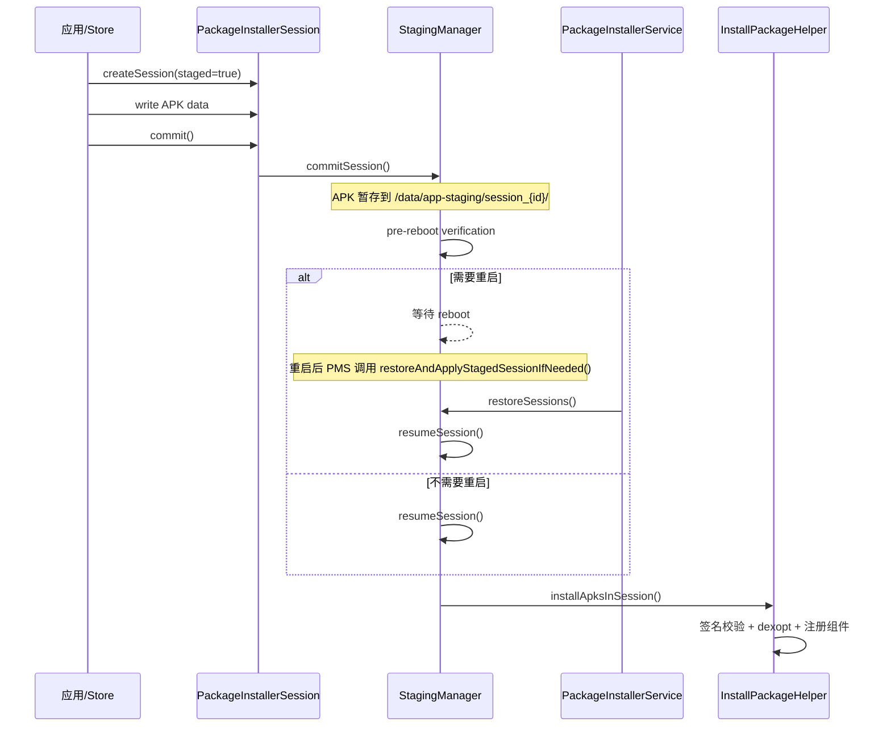

# 1.23 Android Staged Install 与安装原子性性能

Android 应用的安装过程涉及签名校验、DEX 编译、文件写入、组件注册等多个阶段。任何一个阶段中断（用户杀进程、系统低内存杀 installd、设备掉电），都可能留下不一致状态——APK 已复制但 DEX 未编译完成，或者新版本组件已注册但旧版本资源未清理。

Staged Install（Android 10 / API 29 起，通过 `PackageInstaller.SessionParams#setStaged()` 提供）是一套解决这个问题的安装协议。它的核心思路：把安装拆成"准备"和"生效"两个阶段，中间可以插入一次 reboot，保证最终状态要么完全生效、要么完全回退。

本节在 1.9 节（Package Manager Service 整体架构）的基础上，聚焦 Staged Install 的原子性机制和各阶段的性能瓶颈。

## 要点

### 锚点 1：Staged Install 机制概览

#### 设计动机

传统安装路径在 commit 后立即生效。如果安装过程中系统崩溃或重启，可能出现以下不一致状态：

- APK 文件已写入 `/data/app/`，但 DEX 编译未完成，应用启动时走解释执行，首次运行严重卡顿
- 新版本组件已注册到 `packages.xml`，但旧版本 native 库未替换，运行时加载错误的 `.so`
- Split APK 只更新了部分 split，导致资源 ID 对不上

Staged Install 将安装过程拆分为两个独立阶段，通过 `StagingManager` 在系统重启时完成状态提升（promote）或回退（abort），保证原子性。

#### 核心流程



1. **Prepare 阶段**：通过 `PackageInstaller.createSession()` 创建 staged session，写入 APK 数据到 staging 目录（`/data/app-staging/session_{id}/`，由 `PackageInstallerService#buildSessionDir()` 生成）
2. **Commit 阶段**：调用 `session.commit()`，`StagingManager#commitSession()` 接管，将 session 标记为 ready，并执行预重启验证
3. **Reboot（条件触发）**：如果安装涉及 native 库更新、split APK 变更或 APEX 模块更新，需要重启才能生效
4. **Finalize 阶段**：重启后 `PackageInstallerService#restoreAndApplyStagedSessionIfNeeded()` 触发 `StagingManager#restoreSessions()` → `resumeSession()`，完成实际安装（`installApksInSession()`）

#### 与传统安装的区别

| 维度 | 传统 installPackage() | Staged Install |
|------|----------------------|----------------|
| 原子性 | 无保证，中途失败留残余 | staged 目录 + reboot 后 promote 或 abort |
| 生效时机 | commit 后立即生效 | commit 后可能延迟到下次 reboot |
| 权限要求 | INSTALL_PACKAGES 签名权限 | INSTALL_PACKAGES 签名权限（`@SystemApi`） |
| 适用场景 | 普通应用安装/更新 | 系统模块更新、大版本升级、native 库变更、APEX 更新 |
| AOSP 起始版本 | API 21+ | Android 10 / API 29（`setStaged()` 已存在于 `android-10.0.0_r1`） |

**权限说明**：`setStaged()` 在 Android 17 `android-17.0.0_r1` 中仍标记为 `@SystemApi`，需要 `INSTALL_PACKAGES` 签名级权限。这不是普通应用通过 `REQUEST_INSTALL_PACKAGES` 走 sideload 就能使用的能力——staged session 是系统更新器（如 Google Play、OTA 客户端）和特权预置安装器的专属机制。

#### AOSP 源码路径

- `PackageInstallerSession.java`：session 生命周期管理，`commit()` 入口
- `StagingManager.java`：staged session 调度、状态机管理（`commitSession()` / `restoreSessions()` / `resumeSession()`）
- `PackageInstallerService.java`：重启后恢复入口（`restoreAndApplyStagedSessionIfNeeded()`）、session 目录管理（`buildSessionDir()`）
- `InstallPackageHelper.java`：实际执行安装（签名校验、dexopt、组件注册）
- `dexopt.cpp`（`frameworks/native/cmds/installd/`）：installd 侧的 dex2oat 调用

[已验证: AOSP android-17.0.0_r1, frameworks/base/services/core/java/com/android/server/pm/StagingManager.java]

### 锚点 2：安装性能瓶颈定位

一次完整的 APK 安装（含 dexopt）耗时可以拆成以下几个阶段。以下数据来源于参考测试环境（需在具体设备上验证），仅用于建立分析框架：

> **数据说明**：以下百分比和耗时数据来自 DeepResearch 资料中的粗略估算，**缺少可复现实验条件**（设备型号、ROM 版本、APK 规模、编译 filter、采样次数均未记录）。这些数字只作为定性分析框架，不应作为跨设备可比的性能结论。建议用 Perfetto 采集实机数据后替换具体数值。

```
安装耗时分解（典型 ~100MB APK，首次安装，speed-profile 编译）
┌─────────────────────────────────────────────────────────────┐
│ APK 解压 + 签名校验              ~15-20%                     │
│ DEX 编译 (dex2oat)              ~55-65%（主要瓶颈）          │
│ .odex/.vdex 写入                 ~10-15%                     │
│ 权限授予 + 组件注册               ~5-8%                      │
│ SELinux relabel + fsync           ~5-10%                     │
└─────────────────────────────────────────────────────────────┘
```

#### 签名校验阶段

APK Signature Scheme v1/v2/v3/v3.1 的校验在 `PackageManagerService` 中执行：

- v1（JAR signing）：遍历 ZIP entry 逐个校验 `.MF` / `.SF` / `.RSA`，O(n) 扫描，大 APK 耗时显著
- v2/v3（APK Signature Scheme）：对整个 APK 做 Merkle Tree 校验，时间复杂度 O(n) 但常数更小，v3.1 支持轮转密钥

签名校验是纯 CPU 密集操作，不涉及 I/O。在 Staged Install 中这一步发生在 commit 阶段，不影响最终用户感知（因为是后台执行）。

[待验证：具体 ms 级耗时需补设备型号、APK 大小、签名方案组合和采样次数]

#### DEX 编译阶段

这是安装耗时的大头。编译策略由 `PackageDexOptimizer.performDexOpt()` 决定，最终通过 installd 调用 `dex2oat`：

```java
// PackageDexOptimizer.java
// compilerFilter 决定编译深度
// "verify"  = 仅验证，运行时解释执行（最快安装，最慢运行）
// "speed-profile" = Profile 引导的 AOT 编译（推荐）
// "speed"  = 完整 AOT 编译（最慢安装，最快运行）
```

dex2oat 的线程数由 `--threads` 参数控制，默认值等于 CPU 核数，但 installd 会根据系统负载动态调整。

PMS/Installer 通过 `IInstalld` Binder 接口调用 installd（`Installer#connect()` 从 `ServiceManager.getService("installd")` 获取 Binder，这一点从 Android 8 的 `InstalldNativeService` 起就是 Binder 化路径，不是 Android 16/17 才引入的断点——详见 1.9 节）。调用链：

```
PMS (Java) → IInstalld Binder → installd (native) → fork() → dex2oat
```

Binder 调用本身的延迟在微秒到毫秒级，对整体安装耗时影响很小。dex2oat 的编译耗时仍然是绝对瓶颈。

#### 磁盘 I/O 阶段

安装涉及的主要 I/O 操作：

1. **APK 复制**：从 staging 目录（或下载缓存）复制到 `/data/app/{packageName}/`
2. **DEX 解压**：从 APK 中提取 classes.dex，写入 `.vdex` 文件
3. **ODEX 写入**：dex2oat 编译产物写入 `/data/app/oat/{architecture}/`
4. **SELinux relabel**：新文件的 security context 标记
5. **fsync**：安装完成后对关键文件做 fsync，保证持久化

Staged Install 的 staging 阶段多了一次写入（APK 先写入 staging 目录），但通过 `rename` 而非 `copy` 在支持同一文件系统的设备上可以避免实际数据拷贝。

[待验证：具体 I/O 秒级数据需补设备存储类型（UFS/eMMC）、APK 大小和文件系统参数]

[来源: DeepResearch/2026-05-31-android-pm-install-staged-mechanism.md]
[来源: DeepResearch/2026-05-14-android-install-optimization-aosp-mechanism.md]

### 锚点 3：Staged Install 与系统重启的交互

#### 哪些 staged session 需要 reboot

`StagingManager#commitSession()` 判断 session 是否需要重启生效：

- **需要 reboot**：涉及 native library（`.so` 文件变更）、APEX 模块更新、系统分区映射变更
- **不需要 reboot**：纯 Java/Kotlin 应用更新，不涉及 native 库和 split 变更

判断逻辑检查 session 的 `SessionParams` 中的 `isStaged`、`requireUserAction` 和 `multiPackage` 标志，以及是否包含 native 库。

#### 重启期间的恢复流程

设备重启后，`PackageInstallerService#restoreAndApplyStagedSessionIfNeeded()` 触发恢复：

```
restoreAndApplyStagedSessionIfNeeded()
  → StagingManager#restoreSessions()
    → 按 session 顺序调用 resumeSession()
      → 对每个 session 调用 installApksInSession()
        → 签名校验 + dexopt + 权限授予 + 组件注册
```

如果某个 session 的 `resumeSession()` 失败，`StagingManager` 会调用 `abortSession()` 回退该 session，不影响其他 session。这保证了多个 staged session 之间的独立性。

#### APEX 与 APK 混合 Session 的状态分支

Android 17 的 staged session 支持 APEX-only、APK-only 和混合 session。关键差异：

- **APEX session**：涉及系统分区变更，reboot 前有 checkpoint 验证，完成后触发 `apexd` 激活
- **APK-only session**：走标准 installApksInSession 路径
- **混合 session**：APEX 部分先完成 checkpoint，APK 部分在后，任何一部分失败触发整体 abort

[已验证: AOSP android-17.0.0_r1, frameworks/base/services/core/java/com/android/server/pm/StagingManager.java]

### 锚点 4：安装性能的 ART/Profile 分发边界

#### Profile 引导编译与 Staged Install 的关系

Staged Install 的 finalize 阶段执行 dexopt 时，编译深度取决于当前可用的 profile：

- **设备端已有 Profile**（从之前的使用/OTA 中积累）：`speed-profile` 编译，利用本地 profile 数据
- **设备端无 Profile（首次安装/清数据后）**：通常降级到 `verify` 或默认 filter，运行时走解释/JIT

#### Cloud Profiles 的分发边界

Android 16 文档提及 Cloud Profiles（通过 Google Play 分发聚合的应用热点数据），但它的消费边界需要明确：

- Cloud Profiles 的获取和注入属于 **Play Services / ART 设备端消费**的范畴，不是 PMS 安装流程的原生步骤
- Profile 文件通过 `ArtFileManager` 管理，存放在 `/data/misc/profiles/cur/{userId}/{packageName}/`
- 安装时的 dexopt 能否使用 Cloud Profile，取决于 profile 是否已在安装前注入到设备——这依赖 Play Store 的预取时序，而不是安装框架的保证

**与 21.12 节的交叉引用**：21.12 节已说明 Cloud Profiles 属于 Play 分发聚合热点数据的补充机制，不是 AOSP 安装框架的内建能力。Cloud Profile 15-30% 首帧收益、Staged finalize 使用 Cloud Profile 等说法缺少 Android 17 源码验证链路，不作为正文结论。

#### dexopt 延迟策略

部分厂商在 reboot 后将 dexopt 延迟到 `BackgroundDexOptService` 异步执行：

- **优点**：加快开机速度，不阻塞用户进入桌面
- **代价**：应用首次启动时可能走解释执行，首帧渲染时间显著增加

AOSP 默认行为是同步 dexopt，厂商定制可能改变这一策略。

### 锚点 5：安装性能的 Perfetto 分析方法

#### installd 进程的 CPU 和 I/O 轨道

安装过程中关键进程的 Perfetto 轨道：

- `installd`：CPU 占用、dex2oat fork 时间、I/O 等待
- `dex2oat`：编译线程的 CPU 分布、GC 暂停、内存使用
- `system_server`（PMS 所在进程）：安装调度的 CPU 时间

Perfetto SQL 查询 installd 的 CPU 活动时间：

```sql
-- installd 进程的 CPU 时间分布
SELECT
  thread.name AS thread_name,
  SUM(sched.dur) / 1e6 AS cpu_time_ms
FROM thread
JOIN process ON thread.upid = process.upid
JOIN sched ON thread.utid = sched.utid
WHERE process.name = 'installd'
GROUP BY thread.name
ORDER BY cpu_time_ms DESC;
```

#### dex2oat 编译轨道

dex2oat 在 Perfetto 中有专门的 atrace tag（`art`），可以观察到编译的各个阶段：

```sql
-- dex2oat 编译阶段耗时
SELECT
  slice.name,
  (slice.dur / 1e6) AS duration_ms
FROM slice
JOIN thread_track ON slice.track_id = thread_track.id
JOIN thread ON thread_track.utid = thread.utid
WHERE thread.name LIKE '%dex2oat%'
  AND slice.name LIKE '%art%'
ORDER BY slice.ts;
```

#### 安装过程端到端度量

从应用调用 `session.commit()` 到应用可启动的完整链路：

```sql
-- 安装总耗时（从 commit 到应用可用）
SELECT
  slice.name,
  (slice.dur / 1e6) AS duration_ms,
  thread.name AS thread_name
FROM slice
JOIN thread_track ON slice.track_id = thread_track.id
JOIN thread ON thread_track.utid = thread.utid
WHERE (
  slice.name LIKE '%installPackage%'
  OR slice.name LIKE '%dexopt%'
  OR slice.name LIKE '%commit%'
)
AND thread.name IN ('installd', 'system_server', 'PackageManager')
ORDER BY slice.ts;
```

关键 Perfetto 信号：
- `PackageManager` 轨道中的 `installPackage` slice 标记整个安装流程
- `installd` 轨道中的 `dexopt` slice 标记编译阶段
- `dex2oat` 进程的 CPU 使用率反映编译负载

## 扩展

### 扩展点 1：Staged Install 回滚机制

Staged Install 内建了回滚支持。如果 `resumeSession()` / `installApksInSession()` 过程中发生错误（签名不匹配、dexopt 失败、磁盘空间不足），`StagingManager` 会调用 `abortSession()` 清理该 session 的所有临时文件，恢复到安装前的状态。

Android 12+ 的 Guaranteed Rollback（GS1）机制在此基础上增加了版本级回滚：系统记录每次 staged install 前的快照，如果新版本启动后发生连续崩溃，可以自动回退到前一个版本。这个机制与 `RollbackManagerService` 协同工作。

[待补充: RollbackManagerService 与 StagingManager 的交互细节]

### 扩展点 2：多 APK / App Bundle 安装性能

Split APK（App Bundle 的交付格式）的安装路径与单 APK 有差异：

- **单 APK**：一次 commit，一次 dexopt
- **Split APK**：`multiPackage` session 包含多个 split，需要逐个校验签名、统一编译

Split APK 的安装耗时主要增加在签名校验阶段（每个 split 需要独立校验），dexopt 阶段可以将所有 split 的 DEX 合并编译。

Android 13+ 的 multi-package session 支持在同一个 staged session 中原子更新多个 split，保证了 split 之间的一致性。

[待补充: Split APK 合并编译的具体源码路径]

### 扩展点 3：安装加速的厂商私有实现

部分厂商在 AOSP 标准流程之外实现安装加速，但属于私有实现，AOSP 源码中没有对应代码：

- **vivo Turbo**：缩短 `BackgroundDexOptService` 的 idle 检测窗口，提前触发批量 dexopt
- **小米 HyperOS**：通过定制 `InstallController` 调整编译策略，部分场景优化签名校验路径

这些优化属于厂商闭源实现，无法通过 AOSP 源码验证，需通过 Perfetto 采集实机数据观察差异。

[来源: DeepResearch/2026-05-14-android-install-optimization-aosp-mechanism.md]
[待验证: 厂商私有优化路径，无 AOSP 源码支撑]
