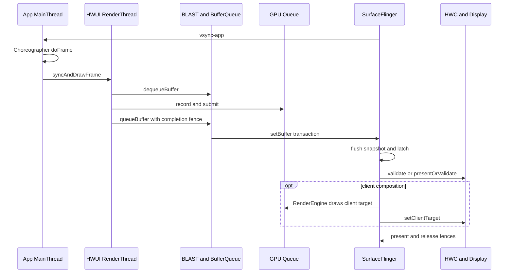

# 1.28 Android 显示与渲染架构总览

## 证据范围

AOSP 没有承诺通用的“动态分辨率自动调整”或“基于机器学习的渲染参数自动调整”，`RenderThread`、BufferQueue 复用和 HWC 也都早于 Android 17。GPU 驱动、硬件叠加平面（overlay plane）、显示带宽和功耗策略，大多由芯片系统（SoC）与设备厂商实现，平台版本号无法证明某台设备一定获得性能提升。

讨论范围限定为能够由源码和系统轨迹证明的内容：

- 框架锚定 Android 17 / API 37 / `android-17.0.0_r1`；
- 涉及 dma-buf、dma-fence、sync_file 或显示驱动边界时，内核锚定 `android17-6.18-2026-06_r6`；
- 版本演进保留 Android 12—17 的现代显示基线，版本首引由对应标签或公开 API 文档确认；
- “性能更好”必须落实到具体对象、等待点和显示时间边界，不能由系统版本或 API 名字推导。

各类出图路径的源码细节和 Perfetto 案例见[第 18 章：渲染链路全景](../../part2-performance/ch18-rendering-pipelines/README.md)。这里先统一定义公共显示主线、时间边界和分类索引。

## 1. Android 17 的公共显示主线

普通硬件加速窗口可以概括为：

`VSync 调度 → Choreographer → ViewRootImpl/HWUI → RenderThread/GPU → BLAST → SurfaceFlinger → HWC → 显示屏`

这条主线是分析基线。下文把生产图像缓冲区的一方称为 Producer（生产者），把读取缓冲区的一方称为 Consumer（消费者）；layer 是 SurfaceFlinger 管理和合成的画面层。SurfaceView、TextureView、Camera、视频、WebView、Flutter、游戏引擎会在生产者、Surface 数量、layer 组织关系或合成位置上出现不同路径。

标准应用窗口从起帧到提交显示（present）的观察点如下：

这里的 buffer 是承载一帧像素的图形缓冲区。CPU 调用结束、GPU 完成、buffer 被 SurfaceFlinger 采纳，以及画面提交到显示设备，属于不同时间边界。把这些边界合成一个“渲染完成”时间，会误导排查方向。

### 1.1 起帧与 UI 状态准备

Android 17 的 SurfaceFlinger 调度器会根据预测显示时间（present time），以及应用和 SurfaceFlinger 的工作预算安排唤醒时刻，再经 EventThread 与 `DisplayEventReceiver` 把 VSync 事件送到应用。旧资料中的固定应用偏移、SurfaceFlinger 偏移或 `DispSync` 模型，不宜直接用于解释 Android 17。

`Choreographer#doFrame()` 在主线程按下面的回调顺序组织一帧：

`INPUT → ANIMATION → INSETS_ANIMATION → TRAVERSAL → COMMIT`

其中，Traversal 是 View 树的遍历阶段，可能执行测量（measure）、布局（layout）和绘制（draw），但不表示每帧都会完整遍历整棵 View 树。硬件加速路径中的 View `draw()` 主要更新 `RenderNode` / `DisplayList` 绘制指令，真正的像素工作还要经过 HWUI RenderThread 和 GPU。

### 1.2 RenderThread、GPU 与 buffer 提交

`ViewRootImpl.performDraw()` 经 `ThreadedRenderer`、`HardwareRenderer.syncAndDrawFrame()` 进入原生 HWUI。RenderThread 同步 `RenderNode` 状态、组织 Skia 绘制工作并向 GPU 提交命令。主线程可能在同步阶段等待 RenderThread；`syncAndDrawFrame()` 返回不能证明 GPU 已完成。

RenderThread 通过 `dequeueBuffer` 取得可写缓冲槽（slot），再以 `queueBuffer` 交回 buffer、描述信息和生产完成 fence。fence 是表示异步图形工作何时完成的同步对象；消费者把这条完成关系作为 acquire fence 使用。`queueBuffer` 传递的是缓冲槽、buffer 句柄、裁剪区域、变换、色彩空间标识（dataspace）、时间戳和同步对象，不会通过 Binder 复制整帧像素。

标准应用窗口的 `BLASTBufferQueue` 位于应用进程。它取得 `BufferItem` 后，用 `SurfaceComposerClient::Transaction::setBuffer()` 携带 buffer、acquire fence、帧号与释放回调，再把事务提交给 SurfaceFlinger。窗口几何事务还可以按帧号与 buffer 更新对齐。

### 1.3 SurfaceFlinger FrontEnd 与 latch

Android 17 的 FrontEnd 以 `RequestedLayerState` 保存请求状态，经 `LayerLifecycleManager` 和 `LayerSnapshotBuilder` 形成当前帧快照（snapshot）。CompositionEngine 根据快照中的可见性、几何、Z 轴顺序、buffer、dataspace 和效果状态，为每个显示屏准备输出。

`latch` 表示 SurfaceFlinger 在本轮采纳了某个 layer 的新 buffer。Android 13 之后，部分受限场景允许先采纳 fence 尚未发出完成信号的 buffer，把等待推迟到真正读取内容之前；RenderEngine 或 HWC 读取内容时仍须遵守 acquire fence。该策略只覆盖满足条件的简单单 layer buffer 更新，不能用来证明跨 layer 或跨窗口同步已经完成。

### 1.4 HWC、RenderEngine 与 present

SurfaceFlinger 会根据显示屏上的可见 layer 集合，与硬件合成器（Hardware Composer，HWC）协商每个 layer 的合成类型（composition type）：

- `DEVICE`：显示硬件可处理该 layer；
- `CLIENT`：RenderEngine 把相关 layer 画入客户端合成目标（client target），再由 HWC 提交显示；
- `SOLID_COLOR`、`CURSOR`、`SIDEBAND` 等类型用于对应的 Composer3 场景。

几何变换、像素格式、dataspace、混合方式、色彩变换、受保护内容、硬件叠加平面数量和厂商策略，都会改变协商结果。同一 layer 在不同帧之间可能从 `DEVICE` 变成 `CLIENT`，因此“使用 SurfaceView 就一定由硬件叠加平面直接合成”的说法不成立。

Android 17 也不保证每轮单独执行 `validate()`。`HWComposer::getDeviceCompositionChanges()` 在满足 `canSkipValidate` 条件时尝试 `presentOrValidate()`：

- 返回 `PresentSucceeded`，组合调用已经完成显示提交，后续流程不会再次提交；
- 返回 `Validated`，验证已在该调用中完成，SurfaceFlinger 继续读取变化后的 composition type 和 request；
- 无法跳过验证时，流程走 `validate()`，必要的 client composition 完成后再调用 `present()`。

FrameTimeline 中 SurfaceFlinger 的实际帧区间可延伸到屏幕更新，覆盖 Composer / Display HAL 等显示栈时间。它的持续时间不能全部计入 SurfaceFlinger 主线程的 CPU 时间。

## 2. 三类 fence 与三个时间边界

图形系统里的 fence 名称相似，方向和责任对象却不同：

| 对象 | 方向与粒度 | 回答的问题 |
|---|---|---|
| acquire fence | 生产者 → 消费者，每个 buffer 一份 | 生产者何时写完，消费者何时可以读取 |
| release fence | SurfaceFlinger / 消费者 → 生产者，每个 layer、每帧一份 | 旧 buffer 何时可以安全复用 |
| present fence | HWC → SurfaceFlinger，每个显示屏、每帧一份 | 本轮显示提交何时越过系统显示边界 |

对应的三个常用观察点也不能互换：

- `queueBuffer`：生产者已把 buffer 交回队列，GPU 写入仍可能在进行；
- `latch`：SurfaceFlinger 已采纳该 layer 的新 buffer；
- present fence signal：本轮 present 到达用户态可观察的显示时间锚点。

present fence 不包含面板扫描、像素响应和人眼感知时间。定位端到端显示延迟时，Android 框架系统轨迹只能回答到系统显示边界；再往后的光学延迟需要显示驱动、面板数据或外部测量证据。

## 3. 出图类型要按拓扑分类

框架名称不足以确定渲染路径。分类需要回答三项：谁生产像素、内容写入哪个 Surface、SurfaceFlinger 看到几个可见 layer。

| 路径 | 主要生产者与 layer 形态 | 排查重点 | 深入阅读 |
|---|---|---|---|
| 标准 View / Compose 宿主 | 主线程准备状态，HWUI RenderThread / GPU 产出宿主窗口 buffer | `doFrame`、`syncAndDrawFrame`、BLAST、FrameTimeline | [标准 Android View](../../part2-performance/ch18-rendering-pipelines/02-android-view-standard.md)、[Compose](../../part2-performance/ch18-rendering-pipelines/23-compose-rendering-pipeline.md) |
| CPU 或离屏绘制 | CPU `lockCanvas()`、软件 layer，或 GPU / HardwareBuffer 离屏产出 | 生产目标、消费方、生产完成 fence 与显示 fence | [软件渲染](../../part2-performance/ch18-rendering-pipelines/03-android-view-software.md)、[HardwareBufferRenderer](../../part2-performance/ch18-rendering-pipelines/17-hardware-buffer-renderer.md) |
| SurfaceView | 宿主窗口与独立子 Surface 各有生产者 | 容器几何、子 Surface buffer、挖洞显示、HWC 合成 | [SurfaceView](../../part2-performance/ch18-rendering-pipelines/06-surfaceview.md) |
| TextureView | 外部生产者写入 SurfaceTexture，HWUI 再采样进宿主窗口 | 外部 BufferQueue、宿主采样、宿主窗口提交 | [TextureView](../../part2-performance/ch18-rendering-pipelines/07-textureview.md) |
| 混合页面 | 宿主 HWUI 与多个独立 Surface 或嵌入对象并存 | 每个内容对象的生产者、几何、buffer、fence 与 layer | [混合渲染](../../part2-performance/ch18-rendering-pipelines/04-android-view-mixed.md) |
| 多窗口 | 每个窗口有独立 ViewRoot / Surface；同一进程可共享 Looper 与 RenderThread | 按显示屏、窗口、进程和生产者分组 | [多窗口](../../part2-performance/ch18-rendering-pipelines/05-android-view-multi-window.md) |
| OpenGL ES / Vulkan / ANGLE | 应用自己的渲染循环写入 ANativeWindow / swapchain | 获取图像、CPU 提交、GPU 完成、队列深度、帧节奏 | [OpenGL ES](../../part2-performance/ch18-rendering-pipelines/08-opengl-es.md)、[Vulkan](../../part2-performance/ch18-rendering-pipelines/09-vulkan-native.md)、[ANGLE](../../part2-performance/ch18-rendering-pipelines/11-angle-gles-vulkan.md) |
| WebView | Chromium 渲染进程、提供方和 GPU 服务经 functor 接入宿主，媒体可另建 layer | Android 与 WebView 提供方双版本、渲染进程、宿主、媒体叠加层 | [WebView](../../part2-performance/ch18-rendering-pipelines/13-webview-rendering.md) |
| Flutter | 根视图渲染模式、外部纹理与 PlatformView 策略共同决定拓扑 | Android 与 Flutter 双版本、Raster 线程、插件生产者、PlatformView | [Flutter](../../part2-performance/ch18-rendering-pipelines/12-flutter-rendering.md) |
| Camera | HAL3 请求与结果向预览、录像、分析、拍照多路输出 | 传感器时间戳、输出 buffer、消费者释放、预览显示 | [Camera](../../part2-performance/ch18-rendering-pipelines/14-camera-pipeline.md) |
| Video | MediaCodec 输出到 Surface；隧道模式使用 sideband | PTS 时间戳、编解码器输出、队列、合成类型、刷新节奏、显示提交 | [Video 与 HWC](../../part2-performance/ch18-rendering-pipelines/15-video-overlay-hwc.md) |
| Game | 游戏、渲染与 RHI 线程，GPU 队列和 swapchain 自主管理帧节奏 | 输入、逻辑、提交、GPU、队列积压、显示提交、温控 | [游戏引擎](../../part2-performance/ch18-rendering-pipelines/16-game-engine.md) |
| React Native | Fabric Render / Commit / Mount 后进入普通 Android View / HWUI；原生组件可另建 Surface | JS、提交与布局、挂载、View 遍历、独立 Surface | [类型识别总览](../../part2-performance/ch18-rendering-pipelines/01-pipeline-overview.md) |

SurfaceView 与 TextureView 的差异值得单独记：

- SurfaceView 的主体通常保留独立可见 layer，HWC 可以单独评估该 layer；
- TextureView 把外部 buffer 当纹理交给 HWUI，主体像素进入宿主 Window buffer；
- SurfaceView 有使用硬件叠加平面的机会，但结果受整屏 layer 集合和设备能力约束；
- TextureView 通常增加一次宿主采样，不能笼统描述为固定的 CPU 像素拷贝。

Camera、视频、游戏描述生产者或业务类型，SurfaceView、TextureView 则描述承载方式。Camera 可以输出到 SurfaceView、TextureView、ImageReader 或自研 GL / Vulkan 渲染器；看到 Camera 线程并不能直接确定 layer 拓扑。

## 4. Android 12—17 的有效演进

现代 trace 分析可以从 Android 12 建立基线：

| 版本 | 可以确认的变化 | 阅读系统轨迹时的含义 |
|---|---|---|
| Android 12 / API 31 | BLAST 与 FrameTimeline 已进入现代应用窗口主线 | 标准窗口可用应用 / SF 的预期与实际时间线；独立 Surface 仍需 layer、BufferQueue 和 fence 证据 |
| Android 13 / API 33 | `AutoSingleLayer` 下的 latch-unsignaled 策略成为重要边界；Composer HAL 进入 AIDL 时代 | acquire fence 未发出完成信号，不代表事务一定无法先被采纳；内容读取仍受 fence 约束 |
| Android 14 / API 34 | 标准公共主线延续；SurfaceView 增加任意 alpha 与公开 lifecycle 策略 | SurfaceView 的透明度和 Surface 保留行为要按版本确认 |
| Android 15 / API 35 | Window / SurfaceView 可以表达期望的 HDR 亮度余量（headroom），支持的设备可使用自适应刷新率（ARR）；Android 15/16 API 文本中的 headroom 方法仍带 `limited_hdr` 功能开关 | 亮度余量和帧率请求都是期望值，不能证明实际亮度、刷新率或合成类型；功能开关与设备能力都要核对 |
| Android 16 / API 36 | SurfaceView API 文本中出现带 `surface_view_set_composition_order` flag 的整数 `compositionOrder` | 多 Surface 页面要记录 parent、relative layer 和 Z-order；flag-gated API 不能当成所有设备无条件可用 |
| Android 17 / API 37 | 现行 FrontEnd 帧快照、预测显示调度与 HWC 流程；SurfaceView API 文本中出现受 `surface_view_set_blur_regions` 开关控制的模糊区域 | 当前对象名按 `android-17.0.0_r1` 解释；厂商合成能力和功能开关状态仍需设备证据 |

这些版本差异没有建立“版本越新，所有页面越快”的因果关系。Android 17 的渲染评审应把版本能力、应用用法、设备实现和运行时证据分别记录。

### 4.1 常见“新技术”说法的源码边界

| 常见说法 | 源码边界 |
|---|---|
| HWC 改进 | AOSP 可确认合成类型协商和 present 流程；性能结果由 layer 条件、Composer HAL、显示硬件和厂商策略决定 |
| 渲染线程优化 | RenderThread 是长期存在的 HWUI 执行角色；应用不能把任意 UI 工作“移到 RenderThread”，应减少主线程状态准备、RenderNode 更新和同步等待 |
| GPU 驱动更新 | Android 支持可更新 GPU 驱动等机制，但具体版本、兼容性和收益必须按设备、驱动包和工作负载测量 |
| buffer 管理优化 | BLAST、BufferQueue、GraphicBuffer 与 fence 构成现代主线；吞吐量要看缓冲槽状态、`dequeueBuffer` 等待、acquire fence 和 release fence，不能写成统一收益 |
| 异步合成 | CPU、GPU、SurfaceFlinger 与 HWC 通过队列和 fence 并行推进；异步不代表没有依赖或不会阻塞 |
| 色彩管理增强 | dataspace、HDR 元数据、期望的 HDR 亮度余量、RenderEngine 与 HWC 能力要逐项核对，平台版本不保证显示结果 |
| 动态分辨率 | AOSP 没有给所有应用自动缩放渲染分辨率的通用承诺；游戏引擎、XR 运行时或厂商策略需按各自实现分析 |
| 机器学习（ML）自动调参 | `android-17.0.0_r1` 的公共显示主线不能支撑该结论；只有存在明确组件、模型输入、控制输出和源码时才可写入 |

## 5. Perfetto：按对象复原一帧

出现卡顿后，可按以下顺序建立证据。

### 5.1 确认显示对象、窗口、Surface 与 layer

记录目标显示设备（Display）、窗口（Window）、Surface，以及 layer 的父子关系、Z-order、buffer 格式、dataspace 和合成类型。混合页面要为每个可见内容对象单独建表，不能只用宿主应用窗口的 FrameTimeline 代表整页。

### 5.2 找到每个生产者

标准页面查看主线程（MainThread）与 RenderThread；原生引擎查看游戏、渲染与 RHI 线程；视频查看编解码器输出；Camera 查看 HAL 请求、结果与各路输出流；WebView、Flutter、React Native 还要补齐各自的框架线程与宿主线程。

### 5.3 对齐生产阶段

标准路径关注 `vsync-app`、`Choreographer#doFrame`、五类回调、`syncAndDrawFrame`、`dequeueBuffer` 和 `queueBuffer`。原生图形路径还要观察 swapchain 图像获取、CPU 提交、GPU 完成和交换链深度（swapchain depth）。

`dequeueBuffer` 长时间等待，常指向可复用 slot 不足或 release fence 迟到；CPU 调度只是候选原因之一。

### 5.4 对齐系统消费阶段

`BufferTX - <layerName>` 是 SurfaceFlinger 服务端待处理 buffer 事务的计数。含 buffer 的事务进入待处理状态时计数增加，buffer 被采纳（latch）或丢弃（drop）时计数减少。数值长期偏高说明系统侧已有待处理 buffer，仍需结合 acquire fence、事务就绪条件、latch 原因和 SurfaceFlinger 的实际帧区间判断原因。

`BufferTX` 接近零只说明 SurfaceFlinger 服务端没有这类积压，不能证明生产者、GPU、HWC 和显示设备都按期完成。

### 5.5 对齐合成与显示阶段

检查 SurfaceFlinger 的 CPU/GPU 截止时间、RenderEngine 客户端合成、每个 layer 的合成类型、HWC/DisplayHAL 事件和 present fence。若 buffer 入队与 latch 按时、present 仍晚，排查范围应移向合成阶段、显示模式切换、Composer HAL、显示驱动与面板。

FrameTimeline 对标准应用窗口很有价值，对 SurfaceView 主体、Camera、视频和某些引擎 layer 的覆盖可能不完整。缺少应用侧实际帧区间时，应回到生产者入队、layer、`BufferTX`、fence、latch 和 present 证据。

## 6. 优化动作与证据对应

优化动作应对应已确认的等待点：

| 证据 | 可检查的工程问题 |
|---|---|
| `doFrame` 中 INPUT/ANIMATION/TRAVERSAL 超预算 | 同步 I/O、布局反复失效、过深层级、对象分配、主线程锁竞争 |
| `syncAndDrawFrame` 等待明显 | RenderThread 任务积压、复杂 DisplayList、GPU 提交压力、UI 线程与 RenderThread 同步 |
| `dequeueBuffer` 长等待 | BufferQueue 可用缓冲槽数量、消费者持有时间、release fence、过深的在途队列 |
| GPU 完成时间迟到 | 着色器、纹理带宽、过度绘制（overdraw）、离屏渲染阶段、分辨率和热降频 |
| `BufferTX` 积压或 latch 迟到 | 生产者出帧节奏、acquire fence、事务屏障，以及下游阻塞迫使上游等待的反压（backpressure） |
| `DEVICE` 频繁变为 `CLIENT` | 几何变换、透明度、像素格式、dataspace、受保护内容、硬件叠加平面竞争 |
| latch 按时而 present 晚 | HWC、DisplayHAL、刷新率切换、显示驱动和面板后段 |

“启用硬件加速”“减少层级”“避免过度绘制”只能作为检查入口。修改前应保存同一场景的系统轨迹、设备信息、刷新率、温度和驱动版本，再以帧耗时分位数、卡顿类型（jank type）、GPU 时间、合成类型与功耗数据复测。

## 7. Android 17 源码阅读入口

以下链接固定到 `android-17.0.0_r1`：

- [`Choreographer.java`](https://android.googlesource.com/platform/frameworks/base/+/android-17.0.0_r1/core/java/android/view/Choreographer.java)：VSync 请求与五类回调；
- [`ViewRootImpl.java`](https://android.googlesource.com/platform/frameworks/base/+/android-17.0.0_r1/core/java/android/view/ViewRootImpl.java)、[`ThreadedRenderer.java`](https://android.googlesource.com/platform/frameworks/base/+/android-17.0.0_r1/core/java/android/view/ThreadedRenderer.java)：Traversal、绘制入口与 HWUI 交接；
- [`RenderProxy.cpp`](https://android.googlesource.com/platform/frameworks/base/+/android-17.0.0_r1/libs/hwui/renderthread/RenderProxy.cpp)、[`DrawFrameTask.cpp`](https://android.googlesource.com/platform/frameworks/base/+/android-17.0.0_r1/libs/hwui/renderthread/DrawFrameTask.cpp)、[`CanvasContext.cpp`](https://android.googlesource.com/platform/frameworks/base/+/android-17.0.0_r1/libs/hwui/renderthread/CanvasContext.cpp)：RenderThread 状态同步、绘制和 buffer 提交；
- [`BLASTBufferQueue.cpp`](https://android.googlesource.com/platform/frameworks/native/+/android-17.0.0_r1/libs/gui/BLASTBufferQueue.cpp)：buffer 回调、`setBuffer()` 与事务提交；
- [SurfaceFlinger FrontEnd](https://android.googlesource.com/platform/frameworks/native/+/android-17.0.0_r1/services/surfaceflinger/FrontEnd/)、[`SurfaceFlinger.cpp`](https://android.googlesource.com/platform/frameworks/native/+/android-17.0.0_r1/services/surfaceflinger/SurfaceFlinger.cpp)：事务就绪条件、快照、latch 与合成；
- [`HWComposer.cpp`](https://android.googlesource.com/platform/frameworks/native/+/android-17.0.0_r1/services/surfaceflinger/DisplayHardware/HWComposer.cpp)、[`HWC2.cpp`](https://android.googlesource.com/platform/frameworks/native/+/android-17.0.0_r1/services/surfaceflinger/DisplayHardware/HWC2.cpp)：`validate()`、`presentOrValidate()`、present 与 fence；
- [`FrameTimeline.cpp`](https://android.googlesource.com/platform/frameworks/native/+/android-17.0.0_r1/services/surfaceflinger/Scheduler/FrameTimeline.cpp)：应用 / SurfaceFlinger 时间线与显示反馈。

进入共享 buffer 与 fence 的内核边界时，使用固定标签 `android17-6.18-2026-06_r6`：

- [`dma-buf.c`](https://android.googlesource.com/kernel/common/+/refs/tags/android17-6.18-2026-06_r6/drivers/dma-buf/dma-buf.c)；
- [`sync_file.c`](https://android.googlesource.com/kernel/common/+/refs/tags/android17-6.18-2026-06_r6/drivers/dma-buf/sync_file.c)；
- [`dma-fence.h`](https://android.googlesource.com/kernel/common/+/refs/tags/android17-6.18-2026-06_r6/include/linux/dma-fence.h)。

这些内核文件能说明共享 buffer 与同步对象的公共语义。硬件叠加平面分配、显示链路的带宽申请（常称“带宽投票”）、安全显示路径和扫描输出时序（scanout timing），仍要查看目标设备的 Composer HAL、GPU / 显示驱动与厂商轨迹。

## 8. 核查清单

一段渲染论述至少应回答：

1. Android、WebView、Flutter、React Native 或引擎版本分别是什么？
2. 主体像素由哪个线程、进程或硬件模块生产？
3. 内容写入哪个 Surface，SurfaceFlinger 看到哪些 layer？
4. 几何事务与内容 buffer 是否按同一帧号对齐？
5. acquire、release、present fence 分别属于哪个对象？
6. `queueBuffer`、latch 和 present 各自发生在什么时间？
7. HWC 本帧选择了 `DEVICE` 还是 `CLIENT`，选择变化时 layer 条件有何差异？
8. FrameTimeline 覆盖了宿主 Window，还是也覆盖主体内容？
9. 结论来自固定标签源码、运行时轨迹、设备能力查询，还是厂商文档？
10. 优化前后的指标、场景、刷新率、温度与驱动版本是否一致？

完成这十项映射后，问题会定位到应用生产、GPU 执行、buffer 周转、SurfaceFlinger 消费、HWC 合成或显示后段中的一个责任区间。具体场景的操作步骤见[渲染管线分析方法](../../part2-performance/ch18-rendering-pipelines/01-pipeline-overview.md#统一分析方法)。
