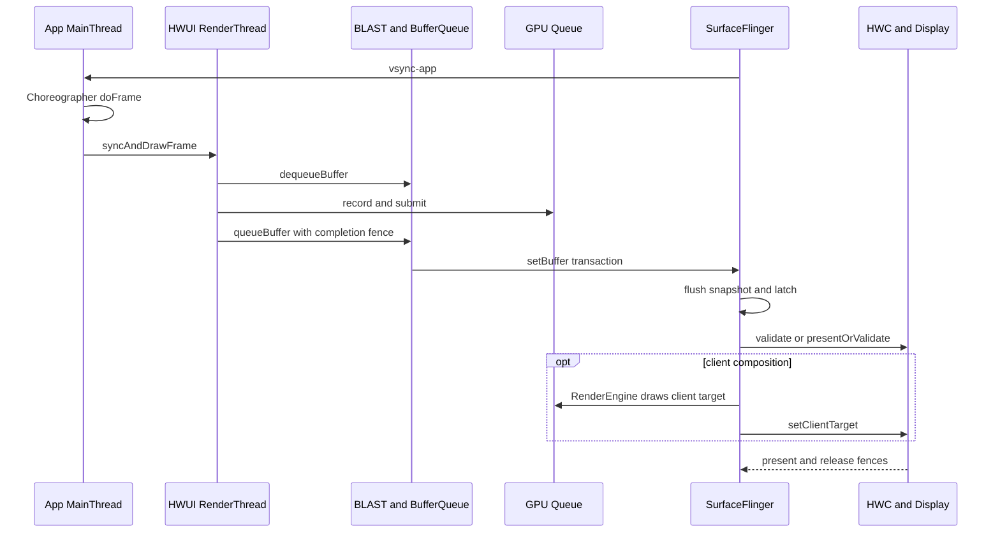

# Android 17 渲染新技术

<!-- outline-start -->
## 要点

### 🔹 Android 17 渲染管线优化
- **HWC 改进**：硬件合成器性能提升，降低 CPU 开销
- **渲染线程优化**：减少主线程渲染压力，提升帧率稳定性
- **GPU 驱动更新**：更好的硬件兼容性和性能调优
- **缓冲区管理**：更高效的内存分配和复用策略

### 🔹 图层合成技术演进
- **多层合成架构**：支持更复杂的图层关系和特效
- **异步合成**：减少渲染阻塞，提升响应速度
- **色彩管理**：HDR 内容支持增强，色彩空间转换优化
- **动态分辨率**：根据负载自动调整渲染分辨率

### 🔹 渲染性能监控
- **实时性能指标**：帧时间、GPU 利用率、内存占用
- **性能分析工具**：Perfetto 渲染管线追踪
- **性能基线**：不同设备类型的性能基准线
- **自动化调优**：基于机器学习的渲染参数自动调整

## 扩展

### 🔸 开发者优化建议
- **使用 RenderThread**：将渲染操作移出主线程
- **优化布局层次**：减少过度嵌套和重绘区域
- **硬件加速启用**：确保使用硬件加速路径
- **避免过度绘制**：优化 UI 层级，减少无效绘制

### 🔸 兼容性考虑
- **版本适配**：Android 16 与 Android 17 渲染特性差异
- **设备兼容**：不同厂商实现的渲染特性差异
- **性能回归**：避免新特性引入的性能倒退
- **测试策略**：多设备、多场景的性能测试

<!-- outline-end -->

## 复核结论与阅读范围

上方 outline 是采集阶段留下的线索，继续原样保留，供 Hermes 任务识别。它不能直接充当 Android 17 的技术结论：AOSP 没有承诺通用的“动态分辨率自动调整”或“基于机器学习的渲染参数自动调整”，`RenderThread`、BufferQueue 复用和 HWC 也都早于 Android 17。GPU 驱动、overlay plane、显示带宽和功耗策略大多由 SoC 与设备厂商实现，平台版本号无法证明某台设备一定获得性能提升。

本文把范围收窄到能由源码和 trace 证明的内容：

- framework 锚定 Android 17 / API 37 / `android-17.0.0_r1`；
- 涉及 dma-buf、dma-fence、sync_file 或显示驱动边界时，kernel 锚定 `android17-6.18-2026-06_r6`；
- 版本演进保留 Android 12—17 的现代显示基线，版本首引由对应 tag 或公开 API 文档确认；
- “性能更好”必须落实到具体对象、等待点和显示时间边界，不能由系统版本或 API 名字推导。

这篇是架构入口。各类出图路径的源码细节和 Perfetto 案例已经迁移到[第 18 章：渲染链路全景](../../part2-performance/ch18-rendering-pipelines/README.md)，本文负责建立共同语言并给出分流索引。

## 1. Android 17 的公共显示主线

普通硬件加速窗口可以概括为：

`VSync 调度 → Choreographer → ViewRootImpl/HWUI → RenderThread/GPU → BLAST → SurfaceFlinger → HWC → Display`

这条主线只是一张基准图。SurfaceView、TextureView、Camera、视频、WebView、Flutter、游戏引擎会在 Producer、Surface 数量、layer 拓扑或合成位置上分叉。

下图用于固定标准 App Window 从起帧到 present 的观察点。

图中的 CPU 调用结束、GPU 完成、buffer 被采纳和 display present 是不同时间边界。把这些边界压成一个“渲染完成”时间，会把排查方向带偏。

### 1.1 起帧与 UI 状态准备

Android 17 的 SurfaceFlinger Scheduler 围绕预测的 present time 和 app/SF 工作预算安排 wakeup，经 EventThread 与 `DisplayEventReceiver` 把 VSync 事件送到应用。旧资料中的固定 app offset、sf offset 或 `DispSync` 模型不宜直接解释 Android 17。

`Choreographer#doFrame()` 在主线程按下面的 callback 顺序组织一帧：

`INPUT → ANIMATION → INSETS_ANIMATION → TRAVERSAL → COMMIT`

Traversal 可能执行 measure、layout 和 draw，但不表示每帧都会完整遍历整棵 View 树。硬件加速路径中的 View `draw()` 主要更新 RenderNode/DisplayList，像素工作还要经过 HWUI RenderThread 和 GPU。

### 1.2 RenderThread、GPU 与 buffer 提交

`ViewRootImpl.performDraw()` 经 `ThreadedRenderer`、`HardwareRenderer.syncAndDrawFrame()` 进入 native HWUI。RenderThread 同步 RenderNode 状态、组织 Skia 工作并向 GPU 提交命令。主线程可能在同步阶段等待 RenderThread；`syncAndDrawFrame()` 返回不能证明 GPU 已完成。

RenderThread 通过 `dequeueBuffer` 取得可写 slot，再以 `queueBuffer` 交回 buffer、元数据和 producer completion fence。Consumer 将这条完成关系作为 acquire fence 使用。`queueBuffer` 传递的是 slot、buffer handle、crop、transform、dataspace、时间戳和同步对象，不会通过 Binder 复制整帧像素。

标准 App Window 的 `BLASTBufferQueue` 位于应用进程。它取得 `BufferItem` 后，用 `SurfaceComposerClient::Transaction::setBuffer()` 携带 buffer、acquire fence、frame number 与 release callback，再把事务提交给 SurfaceFlinger。窗口几何事务还可以按 frame number 与 buffer 更新对齐。

### 1.3 SurfaceFlinger FrontEnd 与 latch

Android 17 的 FrontEnd 以 `RequestedLayerState` 保存请求状态，经 `LayerLifecycleManager` 和 `LayerSnapshotBuilder` 形成当前帧 snapshot。CompositionEngine 根据 snapshot 中的可见性、几何、Z-order、buffer、dataspace 和效果状态准备每个 display 的输出。

`latch` 表示 SurfaceFlinger 在本轮采纳了某个 layer 的新 buffer。Android 13 之后的受限场景允许 latch unsignaled buffer，把部分 fence wait 推后；RenderEngine 或 HWC 读取内容时仍须遵守 acquire fence。该策略只覆盖满足条件的简单单 layer buffer update，不能用于证明跨 layer 或跨窗口同步已经完成。

### 1.4 HWC、RenderEngine 与 present

SurfaceFlinger 会按 display 的可见 layer 集合与 HWC 协商 composition type：

- `DEVICE`：显示硬件可处理该 layer；
- `CLIENT`：RenderEngine 先把相关 layer 画入 client target，再由 HWC present；
- `SOLID_COLOR`、`CURSOR`、`SIDEBAND` 等类型用于对应的 Composer3 场景。

transform、format、dataspace、blend、color transform、受保护内容、overlay plane 数量和厂商策略都会改变协商结果。同一 layer 在不同帧之间可能从 `DEVICE` 变成 `CLIENT`，因此“使用 SurfaceView 就会走 overlay”不成立。

Android 17 也不保证每轮单独执行 `validate()`。`HWComposer::getDeviceCompositionChanges()` 在满足 `canSkipValidate` 条件时尝试 `presentOrValidate()`：

- 返回 PresentSucceeded，组合调用已经完成 present，后续流程不会再次 present；
- 返回 Validated，validate 已在该调用中完成，SurfaceFlinger 继续读取 changed composition types 和 requests；
- 无法跳过 validate 时，流程走 `validate()`，必要的 client composition 完成后再 `present()`。

FrameTimeline 的 SurfaceFlinger actual slice 可延伸到 on-screen update，覆盖 Composer/DisplayHAL 等显示栈时间。它的持续时间不能整体归到 SurfaceFlinger 主线程 CPU。

## 2. 三类 fence 与三个时间边界

图形系统里的 fence 名称相似，方向和责任对象却不同：

| 对象 | 方向与粒度 | 回答的问题 |
|---|---|---|
| acquire fence | Producer → Consumer，per-buffer | Producer 何时写完，Consumer 何时可以读取 |
| release fence | SurfaceFlinger/Consumer → Producer，per-layer、per-frame | 旧 buffer 何时可以安全复用 |
| present fence | HWC → SurfaceFlinger，per-display、per-frame | 本轮 display present 何时越过系统显示边界 |

对应的三个常用观察点也不能互换：

- `queueBuffer`：Producer 已把 buffer 交回队列，GPU 写入仍可能在进行；
- `latch`：SurfaceFlinger 已采纳该 layer 的新 buffer；
- present fence signal：本轮 present 到达用户态可观察的显示时间锚点。

present fence 不包含 panel 扫描、像素响应和人眼感知时间。定位端到端显示延迟时，framework trace 能回答到系统显示边界；再往后的光学延迟需要显示驱动、面板或外部测量证据。

## 3. 出图类型要按拓扑分类

框架名字不足以确定渲染路径。更稳妥的分类依据有三项：谁生产像素、内容写入哪个 Surface、SurfaceFlinger 最终看到几个可见 layer。

| 路径 | 主体 Producer 与 layer 形态 | 排查重点 | 深入阅读 |
|---|---|---|---|
| 标准 View / Compose Host | MainThread 准备状态，HWUI RenderThread/GPU 产出宿主 Window buffer | `doFrame`、`syncAndDrawFrame`、BLAST、FrameTimeline | [标准 Android View](../../part2-performance/ch18-rendering-pipelines/02-android-view-standard.md)、[Compose](../../part2-performance/ch18-rendering-pipelines/25-compose-rendering-pipeline.md) |
| CPU 或离屏绘制 | CPU `lockCanvas()`、软件 layer，或 GPU/HardwareBuffer 离屏产出 | 生产目标、消费方、production fence 与 display fence | [软件渲染](../../part2-performance/ch18-rendering-pipelines/03-android-view-software.md)、[HardwareBufferRenderer](../../part2-performance/ch18-rendering-pipelines/17-hardware-buffer-renderer.md) |
| SurfaceView | 宿主 Window 与独立 child Surface 各有 Producer | container 几何、child buffer、hole-punch、HWC composition | [SurfaceView](../../part2-performance/ch18-rendering-pipelines/06-surfaceview.md) |
| TextureView | 外部 Producer 写入 SurfaceTexture，HWUI 再采样进宿主 Window | 外部 BufferQueue、宿主采样、宿主窗口提交 | [TextureView](../../part2-performance/ch18-rendering-pipelines/07-textureview.md) |
| 混合页面 | 宿主 HWUI 与多个独立 Surface/嵌入对象并存 | 每个内容对象的 Producer、几何、buffer、fence 与 layer | [混合渲染](../../part2-performance/ch18-rendering-pipelines/04-android-view-mixed.md) |
| 多窗口 | 每个 Window 有独立 ViewRoot/Surface；同进程可共享 Looper 与 RenderThread | 先按 Display，再按 Window、进程和 Producer 分组 | [多窗口](../../part2-performance/ch18-rendering-pipelines/05-android-view-multi-window.md) |
| OpenGL ES / Vulkan / ANGLE | 应用自有 render loop 写入 ANativeWindow/swapchain | acquire、CPU submit、GPU completion、queue depth、frame pacing | [OpenGL ES](../../part2-performance/ch18-rendering-pipelines/08-opengl-es.md)、[Vulkan](../../part2-performance/ch18-rendering-pipelines/09-vulkan-native.md)、[ANGLE](../../part2-performance/ch18-rendering-pipelines/11-angle-gles-vulkan.md) |
| WebView | Chromium renderer/provider/GPU service 经 functor 合入宿主，媒体可另建 layer | Android 与 WebView provider 双版本、renderer、host、media overlay | [WebView](../../part2-performance/ch18-rendering-pipelines/13-webview-rendering.md) |
| Flutter | root render mode、external texture 与 PlatformView 策略共同决定拓扑 | Android 与 Flutter 双版本、Raster、插件 Producer、PlatformView | [Flutter](../../part2-performance/ch18-rendering-pipelines/12-flutter-rendering.md) |
| Camera | HAL3 request/result 向 preview、record、analysis、capture 多路输出 | sensor timestamp、output buffer、consumer release、preview present | [Camera](../../part2-performance/ch18-rendering-pipelines/14-camera-pipeline.md) |
| Video | MediaCodec 输出到 Surface；tunneled path 使用 sideband | PTS、codec output、queue、composition type、refresh cadence、present | [Video 与 HWC](../../part2-performance/ch18-rendering-pipelines/15-video-overlay-hwc.md) |
| Game | game/render/RHI 线程、GPU queue 和 swapchain 自主管理帧节奏 | 输入、逻辑、submit、GPU、queue-stuffing、present、温控 | [游戏引擎](../../part2-performance/ch18-rendering-pipelines/16-game-engine.md) |
| React Native | Fabric Render/Commit/Mount 后进入普通 Android View/HWUI；原生组件可另建 Surface | JS、Commit/Layout、Mount、traversal、独立 Surface | [类型识别总览](../../part2-performance/ch18-rendering-pipelines/01-pipeline-overview.md) |

SurfaceView 与 TextureView 的差异值得单独记：

- SurfaceView 的主体通常保留独立可见 layer，HWC 可以单独评估该 layer；
- TextureView 把外部 buffer 当纹理交给 HWUI，主体像素进入宿主 Window buffer；
- SurfaceView 有 overlay 机会，但结果受整屏 layer 集合和设备能力约束；
- TextureView 通常增加一次宿主采样，不能笼统描述为固定的 CPU 像素拷贝。

Camera、视频、游戏属于 Producer 或业务类型，SurfaceView、TextureView 属于承载方式。Camera 可以输出到 SurfaceView、TextureView、ImageReader 或自研 GL/Vulkan renderer；看到 Camera 线程并不能直接确定 layer 拓扑。

## 4. Android 12—17 的有效演进

现代 trace 分析可以从 Android 12 建立基线：

| 版本 | 可以确认的变化 | 阅读 trace 时的含义 |
|---|---|---|
| Android 12 / API 31 | BLAST 与 FrameTimeline 已进入现代应用窗口主线 | 标准窗口可用 App/SF expected 与 actual timeline；独立 Surface 仍需 layer、BufferQueue 和 fence 证据 |
| Android 13 / API 33 | `AutoSingleLayer` 下的 latch-unsignaled 策略成为重要边界；Composer HAL 进入 AIDL 时代 | acquire fence 未 signal 不代表 transaction 一定无法先 latch，内容读取仍受 fence 约束 |
| Android 14 / API 34 | 标准公共主线延续；SurfaceView 增加任意 alpha 与公开 lifecycle 策略 | SurfaceView 的透明度和 Surface 保留行为要按版本确认 |
| Android 15 / API 35 | Window/SurfaceView 可以表达 desired HDR headroom；支持设备可使用 ARR | headroom 和 frame-rate 请求都是期望值，不能证明最终亮度、刷新率或 composition type |
| Android 16 / API 36 | SurfaceView 增加整数 `compositionOrder` | 多 Surface 页面要记录 parent、relative layer 和 Z-order |
| Android 17 / API 37 | 本文锚定现行 FrontEnd snapshot、预测 present 调度与 HWC 流程；SurfaceView 增加 blur region | 当前对象名按 `android-17.0.0_r1` 解释；厂商合成能力仍需设备证据 |

这些版本差异没有建立“版本越新，所有页面越快”的因果关系。Android 17 的渲染评审应把版本能力、应用用法、设备实现和运行时证据分别记录。

### 4.1 对原 outline 中“新技术”的校正

| 原线索 | 源码复核后的表述 |
|---|---|
| HWC 改进 | AOSP 可确认 composition 协商和 present 流程；性能结果由 layer 条件、Composer HAL、显示硬件和厂商策略决定 |
| 渲染线程优化 | RenderThread 是长期存在的 HWUI 执行角色；应用不能把任意 UI 工作“移到 RenderThread”，应减少主线程状态准备、RenderNode 更新和同步等待 |
| GPU 驱动更新 | Android 支持可更新 GPU 驱动等机制，但具体版本、兼容性和收益必须按设备、驱动包和工作负载测量 |
| 缓冲区管理优化 | BLAST、BufferQueue、GraphicBuffer 与 fence 构成现代主线；吞吐量要看 slot、dequeue/acquire 状态和 release fence，不能写成统一收益 |
| 异步合成 | CPU、GPU、SurfaceFlinger 与 HWC 本来就通过队列和 fence 并行推进；异步不代表没有依赖或不会阻塞 |
| 色彩管理增强 | dataspace、HDR metadata、desired HDR headroom、RenderEngine 与 HWC 能力要逐项核对，平台版本不保证显示结果 |
| 动态分辨率 | AOSP 没有给所有应用自动缩放渲染分辨率的通用承诺；游戏引擎、XR runtime 或厂商策略需按各自实现分析 |
| ML 自动调参 | `android-17.0.0_r1` 的公共显示主线不能支撑该结论；只有存在明确组件、模型输入、控制输出和源码时才可写入 |

## 5. Perfetto：按对象复原一帧

看到卡顿后，可按下面的顺序建立证据。

### 5.1 确认 Display、Window、Surface 与 layer

记录目标 display、窗口、Surface、layer parent、Z-order、buffer format、dataspace 和 composition type。混合页面要给每个可见内容对象单独建表，不能只拿宿主 App Window 的 FrameTimeline 代表整页。

### 5.2 找到每个 Producer

标准页面查看 MainThread 与 RenderThread；原生引擎查看 game/render/RHI 线程；视频查看 codec 输出；Camera 查看 HAL request/result 与各 output stream；WebView、Flutter、React Native 还要补齐各自框架线程与宿主线程。

### 5.3 对齐生产阶段

标准路径关注 `vsync-app`、`Choreographer#doFrame`、五类 callback、`syncAndDrawFrame`、`dequeueBuffer` 和 `queueBuffer`。原生图形路径要增加 acquire、CPU submit、GPU completion 与 swapchain 深度。

`dequeueBuffer` 长时间等待，常指向可复用 slot 不足或 release fence 迟到；CPU 调度只是候选原因之一。

### 5.4 对齐系统消费阶段

`BufferTX - <layerName>` 是 SurfaceFlinger server 侧的 pending buffer transaction 计数。它在含 buffer 的事务计入 pending 时增加，在 buffer 被 latch 或 drop 时减少。数值长期偏高说明系统侧已有待处理 buffer，仍需结合 acquire fence、transaction readiness、latch reason 和 SF actual slice 判断原因。

`BufferTX` 接近零只说明 server 没有这类积压，不能证明 Producer、GPU、HWC 和 display 都按期完成。

### 5.5 对齐合成与显示阶段

检查 SurfaceFlinger CPU/GPU deadline、RenderEngine client composition、per-layer composition type、HWC/DisplayHAL 事件和 present fence。若 queue 与 latch 按时、present 仍晚，排查范围应移向合成、显示模式切换、Composer HAL、display driver 与 panel。

FrameTimeline 对标准 App Window 很有价值，对 SurfaceView 主体、Camera、视频和某些引擎 layer 的覆盖可能不完整。缺失 app actual slice 时，应回到 Producer queue、layer、`BufferTX`、fence、latch 和 present 证据。

## 6. 开发者如何选择优化动作

优化动作应对应已确认的等待点：

| 证据 | 可检查的工程问题 |
|---|---|
| `doFrame` 中 INPUT/ANIMATION/TRAVERSAL 超预算 | 同步 I/O、布局反复失效、过深层级、对象分配、主线程锁竞争 |
| `syncAndDrawFrame` 等待明显 | RenderThread backlog、复杂 DisplayList、GPU 提交压力、UI 与 RT 同步 |
| `dequeueBuffer` 长等待 | BufferQueue slot、Consumer 持有时间、release fence、过深 in-flight 队列 |
| GPU completion 迟到 | shader、纹理带宽、过度绘制、离屏 pass、分辨率和热降频 |
| `BufferTX` 积压或 latch 迟到 | Producer 节拍、acquire fence、transaction barrier、backpressure |
| `DEVICE` 频繁变为 `CLIENT` | transform、alpha、format、dataspace、protected content、overlay plane 竞争 |
| latch 按时而 present 晚 | HWC、DisplayHAL、刷新率切换、显示驱动和 panel 后段 |

“启用硬件加速”“减少层级”“避免过度绘制”只能作为检查入口。完成修改前应保存同一场景的 trace、设备信息、刷新率、温度和驱动版本，以帧分位数、jank type、GPU 时间、composition type 与功耗数据复测。

## 7. Android 17 源码阅读入口

以下链接固定到 `android-17.0.0_r1`：

- [`Choreographer.java`](https://android.googlesource.com/platform/frameworks/base/+/android-17.0.0_r1/core/java/android/view/Choreographer.java)：VSync 请求与五类 callback；
- [`ViewRootImpl.java`](https://android.googlesource.com/platform/frameworks/base/+/android-17.0.0_r1/core/java/android/view/ViewRootImpl.java)、[`ThreadedRenderer.java`](https://android.googlesource.com/platform/frameworks/base/+/android-17.0.0_r1/core/java/android/view/ThreadedRenderer.java)：Traversal、绘制入口与 HWUI 交接；
- [`RenderProxy.cpp`](https://android.googlesource.com/platform/frameworks/base/+/android-17.0.0_r1/libs/hwui/renderthread/RenderProxy.cpp)、[`DrawFrameTask.cpp`](https://android.googlesource.com/platform/frameworks/base/+/android-17.0.0_r1/libs/hwui/renderthread/DrawFrameTask.cpp)、[`CanvasContext.cpp`](https://android.googlesource.com/platform/frameworks/base/+/android-17.0.0_r1/libs/hwui/renderthread/CanvasContext.cpp)：RenderThread 状态同步、绘制和 buffer 提交；
- [`BLASTBufferQueue.cpp`](https://android.googlesource.com/platform/frameworks/native/+/android-17.0.0_r1/libs/gui/BLASTBufferQueue.cpp)：buffer callback、`setBuffer()` 与 transaction；
- [SurfaceFlinger FrontEnd](https://android.googlesource.com/platform/frameworks/native/+/android-17.0.0_r1/services/surfaceflinger/FrontEnd/)、[`SurfaceFlinger.cpp`](https://android.googlesource.com/platform/frameworks/native/+/android-17.0.0_r1/services/surfaceflinger/SurfaceFlinger.cpp)：transaction readiness、snapshot、latch 与 composition；
- [`HWComposer.cpp`](https://android.googlesource.com/platform/frameworks/native/+/android-17.0.0_r1/services/surfaceflinger/DisplayHardware/HWComposer.cpp)、[`HWC2.cpp`](https://android.googlesource.com/platform/frameworks/native/+/android-17.0.0_r1/services/surfaceflinger/DisplayHardware/HWC2.cpp)：validate、`presentOrValidate()`、present 与 fences；
- [`FrameTimeline.cpp`](https://android.googlesource.com/platform/frameworks/native/+/android-17.0.0_r1/services/surfaceflinger/Scheduler/FrameTimeline.cpp)：App/SF 时间线与 present feedback。

进入共享 buffer 与 fence 的 kernel 边界时，使用固定 tag `android17-6.18-2026-06_r6`：

- [`dma-buf.c`](https://android.googlesource.com/kernel/common/+/refs/tags/android17-6.18-2026-06_r6/drivers/dma-buf/dma-buf.c)；
- [`sync_file.c`](https://android.googlesource.com/kernel/common/+/refs/tags/android17-6.18-2026-06_r6/drivers/dma-buf/sync_file.c)；
- [`dma-fence.h`](https://android.googlesource.com/kernel/common/+/refs/tags/android17-6.18-2026-06_r6/include/linux/dma-fence.h)。

这些 kernel 文件能说明共享 buffer 与同步对象的公共语义。overlay plane 分配、带宽投票、安全显示路径和 scanout 时序仍要查看目标设备的 Composer HAL、GPU/display 驱动与厂商 trace。

## 8. Review 检查表

一段渲染论述至少应回答：

1. Android、WebView、Flutter、React Native 或引擎版本分别是什么？
2. 主体像素由哪个线程、进程或硬件模块生产？
3. 内容写入哪个 Surface，SurfaceFlinger 看到哪些 layer？
4. 几何事务与内容 buffer 是否按同一 frame number 对齐？
5. acquire、release、present fence 分别属于哪个对象？
6. `queueBuffer`、latch 和 present 各自发生在什么时间？
7. HWC 本帧选择了 `DEVICE` 还是 `CLIENT`，选择变化时 layer 条件有何差异？
8. FrameTimeline 覆盖了宿主窗口，还是也覆盖主体内容？
9. 结论来自固定 tag 源码、运行时 trace、设备能力查询，还是厂商文档？
10. 优化前后的指标、场景、刷新率、温度与驱动版本是否一致？

完成这十项映射后，问题会收敛到应用生产、GPU 执行、buffer 周转、SurfaceFlinger 消费、HWC 合成或显示后段中的一个责任区间。面向具体场景的操作步骤可继续阅读[渲染管线分析方法](../../part2-performance/ch18-rendering-pipelines/20-pipeline-analysis-methodology.md)。
