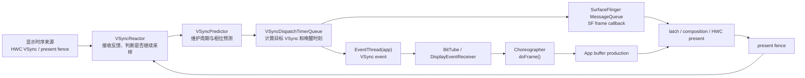
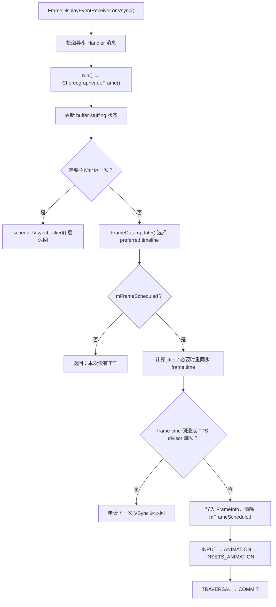
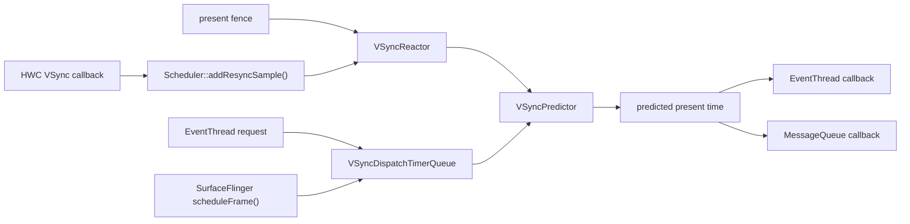
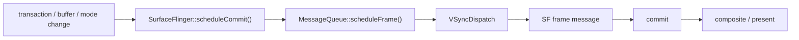

# VSync、Choreographer 与 SurfaceFlinger 调度

VSync 提供显示时间基准，Choreographer 把应用工作安排到帧窗口，SurfaceFlinger Scheduler 决定合成节奏和显示帧率。三者使用相关但不相同的时间点，不能只看一个 doFrame 判断整帧是否按期显示。

## VSync 来源、时间线与分发

### Android 17 的 VSync 分析模型

VSync 在 Android 中负责两类工作：

1. 提供或校准显示设备的时间节奏。
2. 围绕预计呈现时刻，为 App 和 SurfaceFlinger 安排合适的唤醒时间。

理解 Android 17 应侧重第二点。App 收到的 VSync 回调并非“屏幕此刻开始扫描”的原样广播，SurfaceFlinger 也不会等硬件脉冲到来后才开始合成。系统先根据硬件样本和 present fence（标记一次显示提交越过 Android present 边界的同步信号）建立显示时序模型，再从目标呈现时刻向前扣除各阶段的工作预算。

因此，分析一帧时要分清四个时刻：

| 时刻 | 回答的问题 | 常见证据 |
|------|------------|----------|
| 显示时序样本 | 显示设备当前按什么节奏运行 | HWC VSync callback、TE、DRM vblank、present fence |
| App wakeup | App 应在何时开始生产目标帧 | `VSYNC-app`、`Choreographer#doFrame` |
| SF wakeup | SF 应在何时开始处理目标显示帧 | `VSYNC-sf`、SF main thread、FrameTimeline |
| present | 本轮合成何时越过 Android 显示栈的呈现边界 | present fence、DisplayHAL、actual timeline |

这四个时刻可能相互接近，也可能相隔一个或多个显示周期。它们不能互相替代。

---

### 一、VSync 为什么能避免画面撕裂

#### 1.1 撕裂发生在哪里

显示控制器通常按固定扫描顺序读取一幅图像。如果扫描过程中，控制器读取的数据源切换到了下一幅内容，同一次扫描就可能混入两帧：屏幕的一部分来自旧帧，另一部分来自新帧。这就是画面撕裂。

垂直消隐区（Vertical Blanking Interval，VBlank）来自栅格扫描时序，表示上一帧有效扫描结束到下一帧有效扫描开始之间的区间。传统显示系统在这个边界更新扫描输出（scanout）配置，能够避免在有效扫描中途换图。

#### 1.2 VSync、VBlank、TE 不是同一个对象

这些术语经常被混写，但它们处在不同层：

| 术语 | 所在层 | 准确含义 |
|------|--------|----------|
| VBlank | 显示控制器/扫描时序 | 一次垂直消隐区间；DRM/KMS 可围绕它维护计数与事件 |
| TE | Panel 接口 | Panel 用来提示安全更新窗口或扫描节奏的撕裂效应（Tearing Effect）信号 |
| HWC VSync callback | Composer HAL | HWC 向 SurfaceFlinger 报告的时间戳事件 |
| App/SF VSync | Android 调度 | Scheduler 依据预测模型安排的客户端或 SF 唤醒 |

某台设备可以从 panel TE、显示控制器中断或其他 vendor 路径获得底层时间基准，再由 HWC 上报给 framework。不能把所有实现概括成“屏幕引脚产生 GPIO（通用输入输出）中断”。DRM/KMS 是 Linux 内核的显示设备与模式设置框架，DRM VBlank 只适用于采用这套驱动路径的设备；它不是 Android 对所有设备强制规定的唯一路径。

#### 1.3 现代 Android 没有全局 Front/Back Buffer 互换

双缓冲是理解撕裂的入门模型：一块缓冲供显示读取，另一块供生产者写入，到安全边界后交换角色。现代 Android 的对象更多：

- 每个可独立提交内容的 Surface 通常有自己的 BufferQueue 或等价队列；
- App、视频解码器、Camera、游戏引擎等生产各自的 buffer；
- SurfaceFlinger 从多个 layer 选择可用内容并组织合成；
- HWC 决定哪些 Layer 采用 device composition（由显示硬件直接合成），哪些交给 GPU 生成 client target（客户端合成的中间输出）；
- 显示控制器最终 scanout 的对象可能是硬件 plane（可独立叠加输出的硬件图层），也可能包含 GPU 合成结果。

VSync 不负责交换一对全局缓冲，而是为 buffer 生产、latch、合成和 present 提供时间约束。某个 App 的 buffer 未就绪时，SurfaceFlinger 可能继续使用旧内容，其他 layer 仍可正常更新。

---

### 二、理解“HW-VSync → SF-VSync → App-VSync”

#### 2.1 三级信号是教学图，不是 Android 17 的调用顺序

早期资料常用三条周期信号解释相位：

- `HW_VSYNC`：硬件显示节奏；
- `VSYNC` 或 App VSync：应用开始处理输入、动画和绘制；
- `SF_VSYNC`：SurfaceFlinger 开始 latch 与合成。

这张图有助于理解“App 和 SF 要在呈现前预留时间”，但箭头 `HW-VSync → SF-VSync → App-VSync` 容易造成两个误解：

1. App/SF 每次都由刚刚到达的硬件中断逐级转发；
2. 三条信号永久保持同一周期和固定相位。

Android 17 的实现不满足这两个前提。Scheduler 维护预测模型，App 和 SF 分别注册定时回调；ARR 还允许 TE/VSync 频率与内容呈现频率不同。

#### 2.2 Android 17 的组件关系

下面这张图按数据和调度方向组织组件：



图中的 BitTube 是由本地套接字对（socketpair）构成的跨进程事件通道，DisplayEventReceiver 用它接收 VSync 等显示事件；它不是每帧都重新发起一次 Binder 调用。

`VsyncSchedule` 是这组对象的容器。Android 17 的 `VsyncSchedule.h` 明确把它定义为与某个物理显示的硬件 VSync 同步的 `IVsyncSource`，内部持有：

- `VSyncTracker`：当前实现是 `VSyncPredictor`，负责预测；
- `VSyncController`：当前实现是 `VSyncReactor`，负责接收硬件样本和 present fence；
- `VSyncDispatch`：当前实现是 `VSyncDispatchTimerQueue`，负责定时分发。

每个物理显示有自己的时序状态。多显示场景不能套用一条全局 VSync 时间线。

---

### 三、Android 17 如何预测下一次 VSync

#### 3.1 默认模型：有限历史样本加线性回归

`VsyncSchedule::createTracker()` 在普通模式下创建 `VSyncPredictor`，参数是：

- 历史窗口：20 个样本；
- 开始形成预测所需的最少样本：6 个；
- 异常点容忍比例：20%。

`VSyncPredictor::validate()` 会检查新时间戳与当前理想周期的对齐程度，过滤重复或明显不一致的样本。样本足够后，它对“VSync 序号—时间戳”做简单线性回归，斜率代表估计周期，截距描述相位。

这里有几组容易被误写成同一个“预测误差”的常量：

- 默认历史窗口/最少样本：20/6；
- 时间戳相位校验与近重复样本：20% 容差；
- `VSyncTracker::kPredictorThreshold`：200 ms，用于优先考虑近期样本；
- Reactor 在模式切换期确认观测周期：10% 允许偏差（allowance）。

它们分别属于 Predictor 历史、样本校验、近期样本选择和 Reactor 周期确认，不能互相替代。

默认多样本路径会对序号和时间戳做最小二乘拟合。`validate()` 先按理想周期取模检查相位，再寻找邻近历史样本；距离小于一个周期 20% 的时间戳会被当作重复样本。这个 20% 不是“允许预测偏离目标呈现时间 20%”。

这套模型的目标是回答：

> 从给定时刻往后，哪个时刻最适合作为下一次目标 VSync？

它不生成更多图像，也不会替 App 补帧。

#### 3.2 ARR 的单样本预测分支

Android 17 在满足以下条件时可以采用一条不同分支：

- 当前 mode 带有 VRR/ARR 配置；VRR 是可变刷新率硬件能力，ARR 是 Android 的自适应刷新率机制；
- present fence 可用；
- `use_last_vsync_predict` 特性开启。

此时历史窗口和最少样本都可缩为 1。单个样本不能进行线性回归，源码会把模型锚定到最近脉冲，并按理想周期预测下一次时刻。这个分支依赖较强的显示反馈，不能外推成所有设备的默认行为。

#### 3.3 为什么硬件 VSync 会开关

持续接收硬件回调会增加唤醒和功耗。模型稳定后，`VSyncReactor` 可以告诉 `VsyncSchedule` 当前不再需要更多硬件样本，系统随后关闭 HWC VSync；发生 mode 切换、模型漂移（预测逐渐偏离真实时序）或需要重新校准时，再开启采样。

`VSyncReactor` 会把 HWC VSync 与 present fence 作为两类校准证据。模式切换期间，若 HWC 直接携带 period，就把它和目标周期比较；否则比较相邻硬件样本。过渡期可以暂时忽略 present fence，避免把新旧 mode 交界处的时间戳写入错误模型。看到硬件 VSync 重新密集出现，优先确认是否处于重新采样或周期确认，而不是直接归因为 App 或驱动异常。

Android 17 的硬件 VSync 状态包括 `Enabled`、`Disabled` 和 `Disallowed`（当前条件下禁止启用）。present fence 是否参与模型、kernel idle timer（内核空闲状态定时器）、外部显示和设备配置都会影响采样策略。看到硬件 VSync 持续开启，只能说明当前实现仍在请求样本；还要结合控制器状态和设备配置，不能直接判定为驱动错误。

#### 3.4 present fence 是反馈，不代表光学完成

HWC 的 present 操作会为每个显示器、每一帧返回 present fence。它后续 signal（变为完成状态）时，为 Android 显示栈提供本轮 present 的时间锚点，SurfaceFlinger 可用它校准模型和更新 FrameTimeline。

present fence 不表示 panel 所有像素已经完成响应，也不表示人眼此刻已经看到稳定图像。Panel 扫描、传输、像素响应和显示后处理仍可能发生在这个边界之后。

---

### 四、从目标呈现时刻反推 App 与 SF 的唤醒

#### 4.1 调度公式

`VSyncDispatchTimerQueueEntry::schedule()` 展示了 Android 17 的核心计算。下面只保留决定目标与唤醒时间的部分：

```cpp
auto nextVsyncTime =
        tracker.nextAnticipatedVSyncTimeFrom(
                max(lastVsync, now + workDuration + readyDuration),
                committedVsyncOpt.value_or(lastVsync));

auto nextWakeupTime =
        nextVsyncTime - workDuration - readyDuration;
```

第一行选择一个足够晚、仍能容纳全部预算的预测 VSync；第二行向前扣除工作时间和就绪时间。实际源码还会处理已经 armed（已排定、等待触发）的回调、避免跳过既定目标、合并相近唤醒以及定时器误差。

Dispatch 的 500 µs timer slack（允许合并相近定时器的时间窗口）用于合并时间接近的 callback 唤醒，3 ms minimum VSync distance（两次目标 VSync 的最小间隔）用于避免把同一或过近目标当成两次独立 VSync。二者是定时分发约束，不是 GPU pipeline 的固定安全余量。

用时间轴表示：

```text
wakeup                    ready/deadline              target VSync
  |<---- workDuration ----->|<---- readyDuration ----->|
```

`workDuration` 是该消费者完成自身工作的预算，`readyDuration` 是目标呈现前还要留给后继阶段的预算。对 App EventThread，`readyDuration` 通常承接 SF 工作预算；对 SF MessageQueue，`readyDuration` 为 0，`workDuration` 是 SF 自己的预算。

#### 4.2 Phase Offset 在 Android 17 中仍然存在

这里的 phase 表示 App 或 SF 的唤醒点相对目标 VSync 的位置，offset 是这个相对位置的数值表达。

不能因为运行时按工作预算调度，就断言相位偏移已经消失。`VsyncConfig` 同时保留：

```cpp
struct VsyncConfig {
    nsecs_t sfOffset;
    nsecs_t appOffset;
    std::chrono::nanoseconds sfWorkDuration;
    std::chrono::nanoseconds appWorkDuration;
};
```

这段结构说明配置层仍能用 offset 表达相对相位，也能用工作时长表达 deadline 预算。`VsyncConfiguration` 支持 `PhaseOffsets` 和 `WorkDuration` 两套构造方式，最终提供统一的 `VsyncConfigSet`。

阅读 Android 17 运行时调度时，优先使用 `workDuration`、`readyDuration`、expected presentation time 和 actual present 解释；排查设备配置时，再回到 offset 与 duration 的换算关系。固定写成“App 永远提前 N ms、SF 永远提前 M ms”会漏掉刷新率、状态切换和厂商配置的影响。

#### 4.3 Late、Early、EarlyGpu

`VsyncConfigSet` 包含三组配置：

| 配置 | 典型使用时机 | 目的 |
|------|--------------|------|
| `late` | 默认稳定路径 | 在满足预算的前提下尽量晚唤醒，减少输入到呈现的等待 |
| `early` | early transaction、刷新率切换等 | 给 transaction 和合成预留更多时间 |
| `earlyGpu` | 检测到 GPU composition 后的若干帧 | 给 GPU 合成路径增加预算 |

`VsyncModulator` 根据 early wakeup 请求、transaction 状态、刷新率切换和近期是否使用 GPU composition，选择下一组配置。它不是一张恒定的毫秒表。设备 overlay（厂商覆盖的资源配置）、刷新率和工作负载改变后，具体 duration 都可能变化。

#### 4.4 调 phase 的代价

把 App 或 SF 唤醒向目标呈现靠近，可以减少等待时间，但也会缩短可用预算。向前移动则增加容错，同时可能增加输入到显示的排队时间和功耗。

调优时至少同时观察：

- App、SF、DisplayHAL 错过截止时间的类型；
- `workDuration` 配置是否覆盖 P95/P99（第 95/99 百分位）耗时；
- runnable 等待，也就是线程已经可运行却尚未获得 CPU 的时间，是否占掉可用预算；
- GPU composition 是否触发 `earlyGpu`；
- 刷新率切换或 ARR cadence 是否改变了目标；
- actual present 是否稳定对齐 expected present。

仅凭平均帧耗时调整 offset，很容易让高分位慢帧变多。

---

### 五、App VSync 如何进入 Choreographer

#### 5.1 申请是按需的

应用侧没有持续收到一份必须逐个消费的全局 VSync 广播。`Choreographer.scheduleFrameLocked()` 先用 `mFrameScheduled` 合并重复请求；需要新帧时才调用 `scheduleVsyncLocked()`，最终进入 `DisplayEventReceiver.scheduleVsync()`。

Android 17 的关键逻辑可以缩写为：

```java
if (!mFrameScheduled) {
    mFrameScheduled = true;
    if (isRunningOnLooperThreadLocked()) {
        scheduleVsyncLocked();
    } else {
        Message msg = mHandler.obtainMessage(MSG_DO_SCHEDULE_VSYNC);
        msg.setAsynchronous(true);
        mHandler.sendMessageAtFrontOfQueue(msg);
    }
}
```

这段代码说明两件事：同一 pending frame（已经申请、尚未处理的帧）的多次 `invalidate()` 不会一一换成多次 VSync 申请；从其他线程发起调度时，会先把异步消息放到 Choreographer 所在线程的队首，再由该线程申请 VSync。

#### 5.2 系统进程到 App 进程的路径

按 Android 17 源码，应用侧事件路径是：

1. `EventThread("app")` 在 `VSyncDispatchTimerQueue` 注册回调；
2. 某个 `DisplayEventReceiver` connection（客户端事件连接）调用 `requestNextVsync()`；
3. `EventThread` 把该 connection 的请求标记为 `Single`，表示只请求下一次事件；
4. dispatch（定时分发点）到达后，`EventThread::onVsync()` 生成带 FrameTimeline 数据的 VSync event；
5. 事件经 connection 的 `BitTube` 发送到客户端；
6. native `DisplayEventReceiver` 从 fd 读取事件；
7. Java 层 `DisplayEventReceiver` 回调到 `FrameDisplayEventReceiver.onVsync()`；
8. `FrameDisplayEventReceiver` 投递异步 Handler 消息；
9. 消息执行 `run()`，再进入 `Choreographer.doFrame()`。

这个路径中，Binder 用于创建 connection 和发出请求；每帧事件通过 BitTube 通道传递。把每次 App VSync 都描述成一次 Binder 回调并不准确。

#### 5.3 VSync 到达不等于 doFrame 立即开始

`FrameDisplayEventReceiver.onVsync()` 会记录 pending VSync 并投递异步消息。源码注释明确允许时间戳更早的消息先执行。主线程若正忙于长任务、锁等待或同步 Binder 调用，`doFrame()` 仍可能晚于预计唤醒点。

因此：

- `VSYNC-app` counter（Perfetto 中的数值轨道）跳变，不证明目标进程已经开始绘制；
- 一次系统侧 VSync event 不必然对应一个成功提交的 App buffer；
- 判断 App 起帧，应看目标进程的 `Choreographer#doFrame` 及其 FrameTimeline token；
- 判断迟到原因，还要看线程从 wakeup 到 running 的调度延迟。

#### 5.4 FrameData 提供多个候选 timeline

`EventThread` 会为 VSync event 生成 `VsyncEventData`，其中包含候选 frame timelines。每项带有：

- `vsyncId`：候选 VSync 的标识；
- `deadlineTimestamp`：完成本帧工作的截止时间；
- `expectedPresentationTime`：期望呈现时间。

`Choreographer.FrameData` 把这些信息交给回调。应用和系统可以围绕首选 timeline 工作，也能在错过首选目标时识别后续合法目标。在高刷新率、不同渲染 cadence 和提前启动配置下，这比只传一个裸时间戳更有表达力。

---

### 六、SurfaceFlinger 的 VSync 路径

SurfaceFlinger 不通过 App 侧 EventThread 驱动主循环。`Scheduler::initVsync()` 把 SF 的 `MessageQueue` 注册到 pacesetter display（为多个显示器提供调度基准的显示器）的 `VSyncDispatch`，注册名为 `"sf"`。

当 SF 有一帧需要处理时，`MessageQueue::scheduleFrame()` 使用当前 SF `workDuration` 调度回调。到时后，SF 处理 transaction（Layer 状态或 buffer 的一组更新）、生成 layer snapshot（本轮合成使用的状态快照）、选择 buffer、制定 composition strategy（设备合成与 GPU 合成方案），随后和 HWC 完成 validate/present。

App 与 SF 共享同一物理显示的预测基础，但它们有不同的注册项、预算和回调路径：

| 对象 | 调度入口 | 工作内容 |
|------|----------|----------|
| App | `EventThread("app")` → DisplayEventReceiver → Choreographer | 输入、动画、Traversal、RenderThread/GPU、提交 buffer |
| SF | `MessageQueue` 的 `"sf"` registration | transaction、latch、composition、HWC present |

这就是 Perfetto 中 `VSYNC-app` 与 `VSYNC-sf` 分开的原因。两条轨迹是调度证据，不是两块硬件各自发出的脉冲。

---

### 七、ARR/VRR 下，VSync 周期不再等于呈现周期

#### 7.1 Android 15 引入 ARR

Android 15 引入自适应刷新率（Adaptive Refresh Rate，ARR）。ARR 所需的 `vrrConfig`、`getDisplayConfigurations()` 与 `notifyExpectedPresent()` 基础契约从 Composer3 AIDL version 3 开始出现。

Android 17 tag 同时保留 version 3、4、5 的冻结快照，也就是各版本已固定的接口定义；此处以 version 3 标出这组契约的起点，不表示 Android 17 设备只能实现 version 3。支持 ARR 的 mode 在 `DisplayConfiguration` 中提供 `vrrConfig`：

- `vsyncPeriod` 表示显示 VSync/TE 节奏；
- `VrrConfig.minFrameIntervalNs` 约束最快呈现间隔；
- `DisplayCommand.frameIntervalNs` 提示后续内容 cadence；
- `notifyExpectedPresent` 可提前告知下一次预计呈现及后续间隔。

在非 ARR mode 中，`vsyncPeriod` 通常对应当前显示刷新周期。ARR mode 中，两者可以解耦。

#### 7.2 一个具体例子

假设 panel 的 TE/VSync 为 240 Hz，周期约 4.17 ms；`minFrameIntervalNs` 对应 120 Hz，最快每 8.33 ms 呈现一帧。系统还可以按内容 cadence，把后续呈现间隔取为离散 VSync 步长的整数倍，例如约 16.67 ms 一帧。

此时不能看到 240 Hz 的 VSync 就断言屏幕正在以 240 fps 更新内容。需要同时区分：

- VSync/TE rate；
- mode 的 peak refresh rate（该模式允许的最高刷新率）；
- 当前 render rate；
- 帧的 expected/actual presentation cadence。

#### 7.3 `minFramePeriod()` 的含义

`VSyncPredictor` 根据 mode 的 peak refresh period 与 VSync rate 计算每个显示帧跨越多少个 VSync tick（时序步进），`minFramePeriod()` 返回最小显示帧间隔。这里的倍数描述显示 mode 的 cadence 约束，不表示预测器要“收集多帧才输出一帧”。

---

### 八、VSync 与 BufferQueue：没有固定“三缓冲公式”

#### 8.1 Buffer 数量是动态约束的结果

Android 图形文章常把卡顿解释为“双缓冲切三缓冲”。这个模型可以说明“增加一块可周转缓冲有时能减少 producer 阻塞”，但不能作为现代 BufferQueue 的固定配置。

实际可用 slot 数受多项状态共同影响：

- producer 最多可同时 dequeue 的数量；
- consumer 最多可 acquire 的数量；
- async/non-blocking（异步/不等待）模式；
- 当前 `DEQUEUED`、`QUEUED`、`ACQUIRED`、`FREE` slot 分布；
- release fence 是否 signal（变为完成状态）；
- BLAST 待释放缓冲和当前刷新率策略。

所以，Android 没有对所有 Surface 保证“默认正好三块缓冲”。

#### 8.2 队列加深会改变什么

更多可周转缓冲可能减少 producer 阻塞，但也可能让旧内容排在队列中，增加从输入到呈现的等待。是否丢弃旧 buffer、SF 本轮是否 latch 新内容、producer 是否受到背压限制，还取决于队列模式和 transaction 状态。

下列推导都不成立：

- 一次超时必然造成固定数量的连续掉帧；
- 三缓冲一定比双缓冲多一帧延迟；
- 增加 slot 一定改善流畅度；
- `queueBuffer()` 返回就说明目标 VSync 能显示该帧。

VSync 只提供时间机会。buffer 是否赶上目标，要结合提交时刻、acquire fence、latch 和 present 逐帧判断。

---

### 九、VSync 如何影响输入延迟

从触摸到显示，至少经过：

```text
InputReader/InputDispatcher
  → App 线程收到或批量消费输入
  → Choreographer callback
  → UI/RenderThread/GPU
  → queueBuffer + acquire fence
  → SurfaceFlinger latch/composition
  → HWC present
  → panel scanout/response
```

VSync phase 影响其中 App 与 SF 的起跑点，但总延迟还取决于：

- 输入在本次 App wakeup 前还是后到达；
- 主线程是否及时运行；
- batched input（合并后批量分发的输入事件）是否在本帧消费；
- App/GPU 是否赶上目标 deadline；
- SF 是否在本轮 latch 该 buffer；
- HWC 和显示后段是否按时 present；
- panel 扫描方向和像素响应。

不能用“平均半个 VSync”概括触摸等待，也不能只根据 phase offset 推导端到端延迟。可靠做法是用同一帧的输入事件、FrameTimeline token、buffer 和 present 证据测量。

---

### 十、在 Perfetto 中观察 VSync

#### 10.1 先找对观察对象

不同 Android 版本、trace 配置和设备实现显示的轨迹名称可能不同。常见对象包括：

- SurfaceFlinger 中的 `VSYNC-app`、`VSYNC-sf` 或 `VSYNC-predicted` counter；
- App 进程主线程的 `Choreographer#doFrame`；
- RenderThread 的 `DrawFrame`；
- App 与 SurfaceFlinger 的 FrameTimeline Expected/Actual；
- SurfaceFlinger main thread、RenderEngine/GPU、HWC/DisplayHAL；
- `BufferTX - <layerName>`、acquire/release/present fence；
- `sched_wakeup`、`sched_switch` 和线程状态。

不要要求 trace 必须出现一组固定轨迹名。轨迹缺失时，先检查 trace config 和设备是否暴露对应数据源。

#### 10.2 逐帧分析顺序

对一帧 UI 更新，按下面的顺序核对：

1. App Expected Timeline 给出的 wakeup、deadline 和 expected present 是什么？
2. `Choreographer#doFrame` 何时开始，开始前有多少 runnable 等待（线程已可运行但尚未获得 CPU 的时间）？
3. UI 线程、RenderThread 和 GPU 何时结束，buffer 何时提交？
4. SF 是否在目标显示帧接收并 latch 该 buffer？
5. SF CPU、SF GPU 或 DisplayHAL 哪一段错过 deadline？
6. Actual Timeline 的 present 与 Expected Timeline 偏差是多少？
7. 同期是否发生刷新率切换、ARR cadence 变化或 early 配置切换？

Perfetto 的 FrameTimeline 从 Android 12 开始提供 Expected 和 Actual 轨迹。Expected 描述系统给这一帧安排的预算，Actual 描述帧的执行与呈现结果。二者按 token 对齐，比统计 `VSYNC-app` counter 更能说明问题。

#### 10.3 常见现象如何解释

| 现象 | 先检查 | 不应直接得出的结论 |
|------|--------|--------------------|
| `VSYNC-app` 在跳，App 没有 `doFrame` | App 是否请求帧、目标进程是否有回调、主线程状态 | VSync 丢失 |
| `doFrame` 晚于预计起点 | runnable 等待、长消息、锁、Binder、GC | UI 逻辑一定很重 |
| App 按时提交，Actual 仍晚 | latch、SF CPU/GPU、HWC、DisplayHAL | App 渲染慢 |
| SF 持续使用 early 配置 | transaction、刷新率切换、GPU composition | phase 参数配置错误 |
| HW VSync 一直开启 | Reactor 是否需要样本、present fence、mode 状态 | HWC 驱动有故障 |
| VSync rate 高于呈现 rate | ARR 的 TE rate、min frame interval、render cadence | 系统重复显示了每个新帧 |

#### 10.4 `dumpsys SurfaceFlinger` 的定位价值

`dumpsys SurfaceFlinger` 在具体分支和设备上会打印当前 VSync controller、dispatch、预测器、硬件 VSync 状态、显示 mode 与调度配置。字段名会随版本变化，排查时应以目标设备输出为准。

可以把 dumpsys 当成“当前配置快照”，把 Perfetto 当成“运行过程证据”：

- dumpsys 能说明当时选择了哪种 mode、预算和控制状态；
- Perfetto 能说明每一帧何时被唤醒、执行、提交和 present；
- vendor trace 或 DRM/HWC tracepoint（驱动记录的事件点）才能继续观察显示后段。

---

### 十一、Framework、HAL 与 kernel 的边界

VSync 问题容易在层级之间互相甩锅。可以按责任划分：

| 层级 | 负责内容 | 常见源码入口 |
|------|----------|--------------|
| App framework | 请求帧、分发 callback、组织 `doFrame()` | `Choreographer.java`、`DisplayEventReceiver.java` |
| SurfaceFlinger Scheduler | 预测、反馈控制、分发 App/SF wakeup | `VsyncSchedule`、`VSyncPredictor`、`VSyncReactor`、`VSyncDispatchTimerQueue` |
| Composer HAL/HWC | 上报 VSync、接收 expected present 提示、返回 present fence | Composer3 AIDL、vendor composer 实现 |
| kernel/显示驱动 | 显示控制器中断、vblank/TE、commit 与 fence 的底层实现 | vendor display driver；DRM/KMS 设备可看 `drm_vblank.c` |
| panel | 扫描、TE、自刷新、像素响应 | panel/controller 规格与 vendor 实现 |

kernel 行为以 `android17-6.18-2026-06_r6` 为准。通用内核的 `drivers/gpu/drm/drm_vblank.c` 和 `include/drm/drm_vblank.h` 说明 DRM vblank 计数、事件与时间戳框架；Android 设备是否走该路径，要看 SoC 显示驱动和 HWC 实现。通用 AOSP framework 无法证明某款设备使用哪根 panel 信号或哪种中断接线。

---

### 十二、排查清单

遇到“VSync 异常”时，先把宽泛描述拆成可验证问题：

- App 是否申请了下一帧？
- EventThread 是否为该 connection 安排了 single VSync？
- App 主线程是否按预计时间运行？
- App 的 buffer 是否在目标 deadline 前提交并可读？
- SF 是否在目标显示帧 latch 了这块 buffer？
- 当前使用 `late`、`early` 还是 `earlyGpu` 配置？
- VSync 预测是否正在重新采样或切换显示 mode？
- 当前是固定刷新 mode、MRR 还是 ARR mode？
- trace 中的 VSync rate、render rate、actual present rate 是否被混为一谈？
- present fence 晚，是 SF/HWC 提交晚，还是显示后段反馈晚？
- 设备使用 DRM vblank、panel TE 还是 vendor 私有时间源？

把每个问题都绑定到具体时间戳、线程、buffer、fence 和 FrameTimeline token，才能把笼统的“VSync 异常”还原为一套可逐帧验证的调度机制。

---

### Android 17 的 VSync 调度边界

1. VBlank、TE、HWC VSync callback、App/SF VSync 分属不同层，不能当成同一个 GPIO 信号。
2. 现代 Android 使用 per-Surface buffer 队列、layer 合成和 HWC present，不存在一对全局前后缓冲统一交换的实现。
3. “HW-VSync、SF-VSync、App-VSync”适合解释历史相位关系；Android 17 应按“显示反馈 → 预测目标 → 预算反推唤醒”理解。
4. `VsyncSchedule` 持有预测器、反馈控制器和分发器；App 与 SF 使用不同注册项和工作预算。
5. Phase offset 仍存在于配置层，运行时诊断应同时看 `workDuration`、`readyDuration`、expected presentation 和 actual present。
6. Choreographer 按需请求下一次 VSync，系统侧 counter 不等于 App 已经执行 `doFrame()`。
7. ARR 允许 TE/VSync rate 与呈现 rate 解耦，不能再用单一刷新周期解释所有帧。
8. BufferQueue 深度是动态约束结果，没有通用的双缓冲/三缓冲固定延迟公式。
9. Perfetto 分析要用 FrameTimeline token 对齐 App、SF 与 present，再结合调度、buffer 和 fence 证据定位超时。

---

### 版本与实现边界

| 版本 | 变化 | 阅读提示 |
|------|------|----------|
| Android 4.1 | Project Butter 把 App、合成和显示节奏纳入统一帧调度 | 适合理解 App/SF VSync 的起点 |
| Android 4.x～10 | DispSync 软件 PLL 与固定 phase offset 是主流说明模型 | PLL（锁相环）在这里指用采样持续校正周期和相位的软件模型；旧源码和官方 VSync 文档仍大量使用这些术语 |
| Android 11～12 | Scheduler、VSyncPredictor、FrameTimeline 等逐步成为分析重点 | 开始从固定相位转向目标呈现与逐帧 deadline |
| Android 13～14 | 刷新率策略、FrameTimeline 和调度模型继续演进 | 不能把旧属性名直接套到新分支 |
| Android 15 | Composer3 v3 引入 ARR 支持，TE/VSync rate 可与呈现 rate 解耦 | 需要同时看 `vsyncPeriod` 与 `minFrameIntervalNs` |
| Android 16 | API 36 增加 ARR 能力查询与建议帧率接口 | App 更容易识别和利用 ARR |
| Android 17 | `VsyncSchedule`、预测/反馈/分发模型延续并加强 ARR 时序支持 | 源码基线为 `android-17.0.0_r1` |

`DispSync` 对理解 Android 图形历史仍有价值，但 Android 17 的实现入口应从 `VsyncSchedule`、`VSyncPredictor`、`VSyncReactor` 和 `VSyncDispatchTimerQueue` 开始。

---

## 应用侧帧回调与绘制调度

VSync 到达应用后，Choreographer 按 input、animation、traversal 和 commit 阶段执行回调。回调开始时间和 deadline 决定应用是否错过当前帧。

### Choreographer 管理“何时开始一帧”

Choreographer 是绑定到某个 `Looper` 的帧回调调度器。它把需要和显示节奏配合的工作分组，在一次 App VSync 到来后按固定阶段执行。

下文把已经申请、但尚未进入 `doFrame()` 分发的帧称为 pending frame；FrameTimeline 则为一帧提供候选呈现目标，每个候选项包含 VSync ID、完成工作的 deadline（截止时间）与 expected presentation time（期望呈现时间）。buffer stuffing recovery 指缓冲区积压后，Choreographer 主动调整应用帧节奏的恢复机制。

它负责：

- 合并同一 pending frame 的重复调度请求；
- 按需向 `DisplayEventReceiver` 申请下一次 VSync；
- 保存五类回调队列；
- 提供稳定的帧时间、候选 FrameTimeline、deadline 和 VSync ID；
- 在 `doFrame()` 中按阶段执行已经到期的回调；
- 检测迟到、帧时间倒退和 buffer stuffing recovery 条件。

它不负责：

- 直接读取触摸设备；
- 独自完成 View 的 measure、layout、draw；
- 在 RenderThread 上执行 GPU 绘制；
- 决定 SurfaceFlinger 采用哪块 buffer；
- 判断 panel 像素何时完成光学响应。

标准 View 窗口的一帧可以概括为：

```text
状态变化 / 输入 / 动画
  → ViewRootImpl 或其他组件注册帧回调
  → Choreographer 申请一次 App VSync
  → FrameDisplayEventReceiver 投递异步消息
  → Choreographer.doFrame()
  → INPUT → ANIMATION → INSETS_ANIMATION → TRAVERSAL → COMMIT
  → ViewRootImpl / HWUI / RenderThread 生产 buffer
  → SurfaceFlinger / HWC 完成合成与 present
```

这条路径说明 Choreographer 位于 App 生产阶段的起点。`doFrame()` 结束只表示这次 Looper 回调已经完成，不能证明 GPU、buffer、SurfaceFlinger 或显示后段已经完成。

这里的 buffer 保存一帧图形内容，latch 指 SurfaceFlinger 选中并取得可用于本轮合成的 buffer，present 则指合成结果越过 Android 显示栈呈现边界的动作。三者都发生在 Choreographer 安排帧起点之后。

### 冷启动首帧：从 `onResume()` 到第一块 buffer 被 latch

Activity 生命周期到达 `onResume()` 之后，标准 Activity 窗口仍可能还没有可供 HWUI 绘制的有效 `Surface`。AOSP `android-17.0.0_r1` 的 `ActivityThread.handleResumeActivity()` 会在恢复 Activity 后、窗口需要可见且尚未添加时调用 `WindowManager.addView()`；`WindowManagerGlobal.addView()` 再创建 `ViewRootImpl` 并调用 `root.setView()`。Android 14 车机冷启动日志也按 `FF01/FF02`（resume）、`FF03/FF04`（addView 与 ViewRootImpl 创建）的顺序记录了这个边界，因此“Activity 已 resumed”不能等同于“窗口 buffer 已经开始生产”。

`ViewRootImpl.setView()` 的一个关键排序是先安排首次 traversal，再通过 `Session.addToDisplayAsUser()` 到 WMS 登记窗口。`android-17.0.0_r1` 的 `ViewRootImpl.scheduleTraversals()` 会设置 `mTraversalScheduled`、向主线程 `MessageQueue` 放置同步屏障，并把 traversal 作为 Choreographer 的 VSync callback 注册；同源日志中 `FF08` 早于 `FF06/FF30`，可作为可复现实验入口。这个顺序只说明“下一轮 traversal 已经挂起等待 App VSync”，不表示 measure/layout/draw 会绕过 VSync 立即执行。

首次 `performTraversals()` 进入 `relayoutWindow()` 后，WMS 才为窗口创建或返回 `SurfaceControl`，并通过 SurfaceFlinger 创建对应 layer。日志把 WMS 用于组织窗口层级/动画的容器 layer 与 App 真实提交 buffer 的 layer 分开记录为不同 ID；这些数字只属于该次采集，排查时应保留这一区分：看见窗口相关 layer 创建，不等于 App 侧 `Surface` 已经可用于提交像素。`android-17.0.0_r1` 的标准 View 路径中，`ViewRootImpl.updateBlastSurfaceIfNeeded()` 会围绕当前 `SurfaceControl` 建立或更新 BLASTBufferQueue，并把可绘制的 `Surface` 交给 HWUI。

硬件加速路径里的 `ViewRootImpl.draw()` 和 `ThreadedRenderer.draw()` 仍处在 App 生产阶段。UI 线程主要更新或录制 RenderNode/DisplayList，并通过 `syncAndDrawFrame()` 把工作交给 RenderThread；像素填充、GPU command submission、buffer 提交和 fence 交接随后继续发生。日志中的 `FF13/FF14/FF18/FF19/FF20` 适合用来分辨“UI 线程 draw 入口”“display list 已准备好”和“RenderThread 后半段仍在工作”这三个不同证据点。

App 提交 BLAST transaction 之后，还要等待 SurfaceFlinger 自己的调度相位。SF 在 commit 阶段处理 transaction 与 latch buffer，在 composite/present 阶段与 HWC、RenderEngine 和显示硬件交接；日志中的 `FF42/FF43/FF44` 同样把这三个观察点连在一起。若启动画面、过渡动画或其他更高 Z 序 layer 仍覆盖目标窗口，`SurfaceFrame` 已经 latch 也不等于用户已经完整看见 App 内容；排查首帧应同时核对 layer 可见区域、窗口动画状态、FrameTimeline token 和 present 结果。

观察这类冷启动首帧，建议把日志或 trace 至少分成五段：`ActivityThread.handleResumeActivity` 到 `WindowManagerGlobal.addView()`，`ViewRootImpl.setView()` 到 `scheduleTraversals()`，`relayoutWindow()` 到 `SurfaceControl` 与 BLAST-backed `Surface` 就绪，`ThreadedRenderer.draw()` 到 buffer/fence 提交，最后是 SF commit、latch、composite 与 HWC present。其 26 个 FF 点位是一套验证方法，不应把其中某台 Android 14 车机的 pid、layer ID、分屏状态或耗时数字外推为 Android 17 通用性能预算。

---

### 一、Choreographer 与线程、Looper 的关系

#### 1.1 每个实例绑定一个 Looper

`Choreographer.getInstance()` 使用 `ThreadLocal` 保存实例，也就是每个线程各自保存一个 Choreographer 引用。当前线程必须已经有 `Looper`，否则会抛出 `IllegalStateException`。实例创建后，`FrameHandler` 和 `FrameDisplayEventReceiver` 都绑定到这个 Looper。

主线程是最常见的使用位置，但“Choreographer 只存在于主线程”不准确。带 Looper 的其他线程也能取得自己的实例。普通 App UI 的 `ViewRootImpl`、动画和窗口绘制仍主要由主线程实例驱动。

#### 1.2 VSync 到达与回调执行之间还有 MessageQueue

系统侧 `EventThread("app")` 把 VSync event 发送到 App 的 `DisplayEventReceiver`。`FrameDisplayEventReceiver.onVsync()` 不会直接执行全部帧回调，而是创建一条异步 `Message`，按 VSync 时间戳投到绑定 Looper 的 MessageQueue，再由 Handler 分发。

Android 17 源码注释给出了消息顺序：

- 时间戳早于本次 VSync 的消息可以先执行；
- 没有更早消息时，VSync 消息可以立即处理；
- 若已有 pending VSync，源码会记录诊断信息，但仍更新待处理数据；
- VSync 时间戳若落在 `System.nanoTime()` 未来，会被修正为当前时间。

因此，系统侧出现 `VSYNC-app` 不等于目标线程已经进入 `doFrame()`。两者之间可能存在 Looper 排队、同步代码执行和 CPU 调度等待。

---

### 二、一帧是怎样被安排出来的

#### 2.1 状态变化先注册工作

一帧通常由这些事件触发：

- View 调用 `invalidate()` 或 `requestLayout()`；
- 输入需要在显示节奏上批量消费；
- 属性动画、滚动或其他帧动画仍在运行；
- Window、Insets、可见性或几何状态变化；
- 应用主动注册 `FrameCallback` 或 `VsyncCallback`。

这些调用先把工作放进 Choreographer 的某个 `CallbackQueue`。队列按 `dueTime`（回调最早可执行的时间）排序。回调已经到期时，Choreographer 安排一帧；延迟回调尚未到期时，先投递 `MSG_DO_SCHEDULE_CALLBACK`，到期后再判断是否需要安排一帧。

#### 2.2 `mFrameScheduled` 合并重复请求

`scheduleFrameLocked()` 的核心判断可以简化为：`mFrameScheduled == false` 时才设置标志并申请 VSync，已经调度过则直接返回。多个组件在同一 pending frame 内注册工作，只会共享一次 VSync 申请。从其他线程安排帧时，Choreographer 先把异步消息放到所属 Looper 的队首，再由正确线程调用 `DisplayEventReceiver.scheduleVsync()`。这段逻辑与本章前文“App VSync 如何进入 Choreographer”给出的代码片段对应；引用本节时只指出标志合并语义，不再重复同一份代码。

`mFrameScheduled` 只合并一次 frame dispatch（五类回调的本轮分发），不会合并不同 callback queue 中的业务内容。每个到期 callback 仍会在对应阶段执行。

#### 2.3 `scheduleVsync()` 请求单次脉冲

`DisplayEventReceiver.scheduleVsync()` 调用 native `nativeScheduleVsync()`。native connection（客户端与系统侧 EventThread 的连接）最终向 SurfaceFlinger EventThread 发出 `requestNextVsync()`，请求类型是单次 VSync。

如果动画还要继续，动画回调必须再次安排下一帧；如果 View 状态在本帧处理后又需要更新，`ViewRootImpl` 或相应组件也会再次注册工作。Choreographer 不会因为注册过一次回调就永久订阅每个显示周期。

---

### 三、ViewRootImpl、同步屏障与 Traversal

#### 3.1 `scheduleTraversals()` 做了三件关键事情

Android 17 的 `ViewRootImpl.scheduleTraversals()` 在尚未安排 traversal 时：

```java
mTraversalScheduled = true;
postTraversalBarrier();
mChoreographer.postVsyncCallback(
        Choreographer.CALLBACK_TRAVERSAL, mTraversalCallback);
notifyRendererOfFramePending();
```

这段代码承担三项不同的责任：

1. `mTraversalScheduled` 合并重复的布局/绘制请求；
2. `ViewRootImpl` 向主线程 MessageQueue 放置同步屏障；
3. traversal 以 `CALLBACK_TRAVERSAL` 类型的 `VsyncCallback` 注册到 Choreographer。

Android 17 的 `TraversalCallback.onVsync(FrameData)` 读取 `frameData.getFrameTimeNanos()`，然后进入 `doTraversal()` 和 `performTraversals()`。

#### 3.2 同步屏障属于 ViewRootImpl 的调度策略

同步屏障是 MessageQueue 中一个没有执行目标的特殊标记：它会暂时阻止屏障之后的普通同步消息继续执行，异步消息仍可穿过。Choreographer 的 VSync 调度消息和 `FrameDisplayEventReceiver` 消息会标记为异步，因此 traversal 能在屏障存在时获得执行机会。

常见表述“Choreographer 放置同步屏障”会把责任写错。放置和移除 traversal barrier 的是 `ViewRootImpl`；Choreographer 提供异步帧消息和 callback dispatch。

`doTraversal()` 开始时会清除 `mTraversalScheduled` 并移除屏障，再进入 `performTraversals()`。屏障忘记移除会阻塞普通消息，因此这部分代码对异常返回和取消路径很谨慎。

---

### 四、五类回调的顺序与边界

`doFrame()` 的固定顺序是：

```text
CALLBACK_INPUT
  → CALLBACK_ANIMATION
  → CALLBACK_INSETS_ANIMATION
  → CALLBACK_TRAVERSAL
  → CALLBACK_COMMIT
```

五类回调各自解决不同问题：

| 阶段 | Android 17 trace 子切片 | 主要工作 | 容易误解的地方 |
|------|--------------------------|----------|----------------|
| INPUT | `input` | 帧同步的 batched input（批量输入）消费、重采样等 | 普通输入事件也可以在其他时机处理 |
| ANIMATION | `animation` | 属性动画、`FrameCallback`、公开 `VsyncCallback` 等 | 回调只推进状态，不保证一定产生新 buffer |
| INSETS_ANIMATION | `insets_animation` | 汇总系统栏、IME（输入法）等 Insets 动画更新 | 它位于 Animation 之后、Traversal 之前 |
| TRAVERSAL | `traversal` | ViewRoot traversal、measure/layout/draw、HWUI 交接 | 三项工作是否都执行取决于本帧状态 |
| COMMIT | `commit` | post-draw 收尾与提交后回调 | 该阶段观察到的 frame time 可能因前面迟到而调整 |

#### 4.1 INPUT 不等于全部输入处理

普通输入经 `InputChannel` 到达应用后，可以由主线程异步处理。`ViewRootImpl.scheduleConsumeBatchedInput()` 注册 `CALLBACK_INPUT`，用于把一批 motion event 按本帧时间消费，或根据连续采样估算更接近当前帧时刻的位置（重采样）。

列表拖动时，手指仍在移动，INPUT 阶段常有批量 MotionEvent 处理；松手进入 fling（按松手速度继续滚动）后，新输入减少，位移主要由 ANIMATION 阶段的滚动物理模型推进。INPUT 变短并不表示帧调度失效。

#### 4.2 ANIMATION 包含两个公开入口

`postFrameCallback()` 把 `FrameCallback` 放进 `CALLBACK_ANIMATION`。公开的 `postVsyncCallback(VsyncCallback)` 也默认放进 ANIMATION；Android 17 另有隐藏重载，可指定 callback type。

这两个公开回调都是一次性的，执行后自动移除。连续动画或采样器需要在回调内再次注册。

#### 4.3 INSETS_ANIMATION 为什么单独存在

Input 和普通 animation 都可能修改 Insets（系统栏、输入法等占用的窗口区域）。Choreographer 在二者之后集中分发 `INSETS_ANIMATION`，把多个仍在进行的 Insets 动画更新汇总后再交给 View 系统。这样 Traversal 读取到的是本帧已经合并的 Insets 状态。

#### 4.4 TRAVERSAL 不总是完整重走整棵树

`performTraversals()` 根据 layout request、窗口变化、dirty state（哪些显示区域或节点已经失效）和绘制状态决定本帧是否执行 measure、layout、draw。硬件加速路径的 draw 主要更新 RenderNode/DisplayList 并进入 `syncAndDrawFrame()`；像素绘制和 GPU 提交由后续 HWUI/RenderThread 完成。

看到 `traversal` 较长，要继续展开内部 slice，区分：

- 大范围 measure/layout；
- DisplayList 重录；
- UI 线程业务回调；
- `syncAndDrawFrame()` 等待 RenderThread；
- 锁、Binder 或 buffer 相关等待。

#### 4.5 COMMIT 的 frame time 可能更新

Choreographer 的注释明确指出：Traversal 若很重并跨过多个帧，COMMIT 阶段报告的 frame time 可以更新，以更接近这批 UI 状态开始生效的帧。监控代码若混用不同阶段的 frame time，可能把这种调整误判为时钟异常。

---

### 五、`doFrame()` 的完整执行流程

#### 5.1 从 VSync event 到五阶段回调

下面的流程图把 Android 17 的关键分支放在一条线上：



收到 VSync event 后，`doFrame()` 仍可能因为没有待处理工作、正在恢复 buffer backlog（缓冲区积压）、frame time 异常或 FPS divisor（按固定倍数降低应用回调频率）而不执行五阶段回调。

#### 5.2 FrameData 先选择 preferred timeline

`doFrame()` 先用传入的 `VsyncEventData` 更新 `mFrameData`。一次 VSync event 最多可携带多条候选 timeline，每条包含：

- `vsyncId`；
- `expectedPresentationTime`；
- 截止时间 `deadline`。

平台同时用 `preferredFrameTimelineIndex` 标记当前推荐的候选项。如果主线程已经迟到，`FrameData.update()` 会在现有候选中寻找 deadline 尚未过期的目标；现有候选都过期时，还可能通过 `DisplayEventReceiver.getLatestVsyncEventData()` 向 SurfaceFlinger 查询新数据。该 Binder 查询只在需要新 timeline 时发生，源码也注明它可能较慢。

#### 5.3 jitter 如何影响 frame time

`jitterNanos = System.nanoTime() - frameTimeNanos` 表示 `doFrame()` 开始时相对原始 VSync 时间的迟到量，下文简称 jitter。迟到至少一个 `frameInterval`（本次使用的帧间隔）时，Choreographer 会：

1. 计算跨过了多少个 interval；
2. 把用于动画的 frame time 对齐到最近一个有效边界；
3. 必要时切换 preferred timeline；
4. 超过日志阈值时打印 `Skipped N frames`。

`debug.choreographer.skipwarning` 的默认阈值是 30。它只控制日志警告，不能当作系统判定 jank 的唯一门槛。没有 `Skipped N frames` 日志，仍可能错过截止时间；出现日志也只能说明主线程回调严重迟到，不能单靠它确认显示端结果。

#### 5.4 写入 FrameInfo 后才分发回调

通过迟到和时间单调性检查后，Choreographer 将下列数据写进 `FrameInfo`，供 HWUI 记录和统计本帧各阶段时序：

- intended VSync time（原计划的 VSync 时间）；
- 当前用于动画/绘制的 frame time；
- preferred timeline 的 `vsyncId`；
- deadline；
- `doFrame()` 实际开始时间；
- 当前 `frameInterval`。

随后清除 `mFrameScheduled`，按顺序运行五类 callback。新的状态变化可以在当前 callback 执行期间再次安排下一帧。

#### 5.5 `doFrame()` 结束仍处在 App 生产阶段

Traversal 可能把本帧状态交给 RenderThread，但以下工作可以继续发生：

- RenderThread 准备 RenderNode 树；
- GPU command submission（命令提交）和执行；
- `dequeueBuffer()`/`queueBuffer()`；
- acquire fence signal，也就是 Producer 写完 buffer、Consumer 可以安全读取；
- SurfaceFlinger transaction、latch 和 composition；
- HWC present 与显示后段。

因此，“`doFrame()` 用时小于刷新周期”不能证明这一帧按时显示。需要用 FrameMetrics、FrameTimeline、RenderThread 和显示侧证据继续判断。

---

### 六、帧时间：`frameTimeNanos`、deadline 与 expected present

#### 6.1 `frameTimeNanos` 是稳定时间基准

`FrameCallback.doFrame(long frameTimeNanos)` 接收的是系统为本帧选定的帧时间，时间基准与 `System.nanoTime()` 一致。它可能早于回调开始执行的时刻。同一 frame dispatch 中的所有回调共享这个稳定时间，动画可据此计算同一时刻的状态。

动画应根据帧时间计算进度，不要用“每次回调固定增加 16.6 ms”。刷新率可变、App render rate 可低于 display VSync rate，主线程也可能迟到或跳过候选 timeline。

#### 6.2 deadline 回答“何时必须准备好”

`FrameTimeline.getDeadlineNanos()` 表示该候选帧必须就绪的时刻。它比“当前屏幕刷新周期是多少”更适合判断 App 是否命中预算，因为 App 唤醒 offset（相对目标 VSync 的时间偏移）、SF 预算、刷新率和候选 timeline 都会影响 deadline。

#### 6.3 expected present 回答“系统预计何时呈现”

`FrameTimeline.getExpectedPresentationTimeNanos()` 表示平台预计该 timeline 何时呈现。这个值属于预测时间，不代表 present fence 或实际显示结果。比较 expected 与 actual presentation，才能判断这一帧是否按计划显示。

#### 6.4 VSync ID 是跨层关联键

`FrameTimeline.getVsyncId()` 用于把 HWUI 生产的帧与 SurfaceFlinger 保存的 timeline 数据关联起来。Android 17 的 trace slice 名为 `Choreographer#doFrame <vsyncId>`，RenderThread 和 SurfaceFlinger 的相应 slice 也会带 token（跨轨道关联帧的标识）。

一个 App VSync 可以携带多个候选 timeline，最终帧也可能丢弃或换到后续目标。不要把“第几个 VSync counter”当成跨进程关联键。

---

### 七、FrameCallback：适合观察 cadence，不等于显示帧率

#### 7.1 连续采样必须主动续订

下面的 Kotlin 示例只测量 Choreographer callback 间隔，包含显式启停和去重：

```kotlin
class CallbackCadenceSampler(
    private val choreographer: Choreographer = Choreographer.getInstance(),
    private val onInterval: (Long) -> Unit,
) : Choreographer.FrameCallback {
    private var running = false
    private var lastFrameTimeNanos = 0L

    fun start() {
        if (running) return
        running = true
        lastFrameTimeNanos = 0L
        choreographer.postFrameCallback(this)
    }

    fun stop() {
        running = false
        choreographer.removeFrameCallback(this)
    }

    override fun doFrame(frameTimeNanos: Long) {
        if (!running) return
        if (lastFrameTimeNanos != 0L) {
            onInterval(frameTimeNanos - lastFrameTimeNanos)
        }
        lastFrameTimeNanos = frameTimeNanos
        if (running) {
            choreographer.postFrameCallback(this)
        }
    }
}
```

这段代码应在 Choreographer 所属 Looper 线程启停。它能观察 callback cadence（连续回调的时间节奏）、长间隔和节奏抖动，但不能回答 buffer 是否提交、GPU 是否完成、SF 是否 latch 或实际何时 present。回调自身也会给主线程增加工作，采样逻辑应保持轻量。

#### 7.2 不要用固定阈值数“掉帧”

常见实现把间隔除以 `16_666_667`，再把商减一当作掉帧数。这个算法在 90/120 Hz、动态刷新率、ARR、App 帧率 override 和主动降帧场景都会误判。

如果只统计 callback 节奏，应同时记录当前 frame interval 或 display/render rate；如果目标是判断用户可见 jank，应使用 FrameTimeline、FrameMetrics 或 JankStats 等呈现相关数据。

---

### 八、VsyncCallback 与多候选 FrameTimeline

#### 8.1 API 33+ 的公开入口

`postVsyncCallback()` 从 API 33 提供 `FrameData`。下面的示例在回调有效期内复制基础值：

```kotlin
Choreographer.getInstance().postVsyncCallback { data ->
    val preferred = data.preferredFrameTimeline
    val vsyncId = preferred.vsyncId
    val deadlineNanos = preferred.deadlineNanos
    val expectedPresentNanos = preferred.expectedPresentationTimeNanos
    record(vsyncId, deadlineNanos, expectedPresentNanos)
}
```

`FrameData` 和其中的 `FrameTimeline` 只在 `onVsync()` 回调期间有效。源码在回调前后切换 `mInCallback`，离开回调再访问会抛出 `IllegalStateException`。需要异步保存时，只复制 `long` 等基础值，不要缓存对象引用。

#### 8.2 多条 timeline 用来表达可选目标

`getFrameTimelines()` 返回按时间排序的候选项，`getPreferredFrameTimeline()` 返回平台当前推荐项。多候选设计允许系统在高刷新率、不同 render cadence 或主线程迟到时表达后续合法呈现目标。

应用通常遵循 preferred timeline。低延迟渲染器或系统组件若要选择其他 timeline，需要同时理解 buffer 提交与 SurfaceFlinger 的 token 约定；只改变业务动画时间不能改变系统实际采用的 display frame。

---

### 九、FrameMetrics：观察 Window 帧的阶段耗时

#### 9.1 FrameCallback 与 FrameMetrics 解决不同问题

| 工具 | 观察起点 | 能回答 | 不能单独回答 |
|------|----------|--------|--------------|
| `FrameCallback` | Choreographer callback | 回调间隔、主线程帧节奏 | GPU/present、具体阶段耗时 |
| `VsyncCallback` | App VSync dispatch | deadline、expected present、VSync ID | actual present、Window 各阶段耗时 |
| `FrameMetrics` | 硬件加速 Window 已渲染帧 | input/animation/layout/draw/sync/GPU/total/deadline | 独立 Surface 内容、panel 光学完成 |
| Perfetto FrameTimeline | App SurfaceFrame 与 SF DisplayFrame | expected/actual、jank type（异常原因）、present type（呈现结果）、跨层 token | 未采集的 vendor/面板细节 |

#### 9.2 关键指标怎么读

`FrameMetrics` 从 API 24 开始提供 Window 帧指标。常用字段包括：

- `INPUT_HANDLING_DURATION`；
- `ANIMATION_DURATION`；
- `LAYOUT_MEASURE_DURATION`；
- `DRAW_DURATION`；
- `SYNC_DURATION`；
- `COMMAND_ISSUE_DURATION`；
- `SWAP_BUFFERS_DURATION`；
- `TOTAL_DURATION`；
- `INTENDED_VSYNC_TIMESTAMP` 与 `VSYNC_TIMESTAMP`；
- API 31 的 `GPU_DURATION` 和 `DEADLINE`；
- API 36 的 `FRAME_TIMELINE_VSYNC_ID`。

`TOTAL_DURATION` 不一定等于各阶段相加，因为部分阶段可以并行。官方 API 契约指出，`TOTAL_DURATION < DEADLINE` 表示 App 在分配的 Window 帧预算内完成；这仍不能替代 SF/DisplayHAL 的 actual present 判断。

#### 9.3 Listener 中先复制再异步处理

下面的写法展示正确的对象生命周期：

```kotlin
window.addOnFrameMetricsAvailableListener(
    { _, metrics, droppedReports ->
        val snapshot = FrameMetrics(metrics)
        metricsWorker.execute {
            consume(snapshot, droppedReports)
        }
    },
    metricsHandler,
)
```

回调传入的 `FrameMetrics` 对象会被框架复用，离开回调后不能继续持有原引用。监听器执行太慢还会丢报告，`droppedReports` 必须一并记录。回调线程只负责复制与入队，聚合、日志和上报放到其他线程。

#### 9.4 适用范围

FrameMetrics 面向某个硬件加速 Window。`SurfaceView`、视频、Camera、游戏引擎等可能有独立 Surface 和生产节奏；宿主 Window 的 FrameMetrics 不能代表这些内容 layer 的每一帧。此类场景要结合对应 Producer、layer 和 FrameTimeline。

---

### 十、在 Perfetto 中定位 Choreographer 问题

#### 10.1 先看哪些轨迹

Android 17 常见证据包括：

- App 主线程：`Choreographer#doFrame <vsyncId>`；
- doFrame 子阶段：`input`、`animation`、`insets_animation`、`traversal`、`commit`；
- RenderThread：`DrawFrame` 及同一 token；
- App FrameTimeline：Expected 与 Actual；
- SurfaceFlinger FrameTimeline：DisplayFrame Expected 与 Actual；
- `BufferTX - <layerName>`、buffer/fence 相关轨迹；
- `sched_wakeup`、`sched_switch`、Running/Runnable/Sleeping 状态。

trace 配置、平台版本和设备实现会影响轨迹是否出现。没有某条 counter（数值随时间变化的轨道）时，先检查数据源，不要仅凭轨迹名称推断机制已经失效。

#### 10.2 Expected 与 Actual 怎么读

Perfetto FrameTimeline 从 Android 12 开始可用：

- App Expected slice 表示系统给 App 生产目标帧的预算窗口，起点是 Choreographer callback 计划运行的时刻；
- App Actual slice 从 `Choreographer#doFrame` 或 NDK VSync callback 实际开始，结束时间取 GPU 完成与 buffer post 中更晚者；
- SF Actual slice 覆盖 SF 工作以及其下方 Composer/DisplayHAL 到 on-screen update 的显示栈区间；
- App SurfaceFrame 与 SF DisplayFrame 可通过 token 和 flow（Perfetto 中连接相关事件的因果线）关联。

Expected slice 长度不保证等于一个固定显示周期。App/SF work budget（预留的工作时长）、刷新率和 timeline 选择都会影响它。

#### 10.3 一条可复用的 SQL

下面的查询用于列出目标进程的 App Actual FrameTimeline：

```sql
SELECT
  p.name AS process_name,
  a.ts,
  a.dur,
  a.surface_frame_token,
  a.display_frame_token,
  a.jank_type,
  a.on_time_finish,
  a.present_type,
  a.layer_name
FROM actual_frame_timeline_slice AS a
JOIN process AS p USING (upid)
WHERE p.name = 'com.example.app'
ORDER BY a.ts;
```

查询结果提供逐帧 token、jank 分类和 layer。把包名换成目标进程后，再用 `surface_frame_token` 回到 UI 选择对应 slice，查看流向哪一个 DisplayFrame。

#### 10.4 常见现象的证据解释

| 现象 | 先检查 | 可能原因 |
|------|--------|----------|
| `VSYNC-app` 已出现，`doFrame` 晚 | Looper 早期消息、Runnable 等待、长任务、锁、Binder、GC | callback 尚未得到执行机会 |
| `doFrame` 很长 | 五个子阶段和内部 slice | input/animation/traversal/RenderThread 同步成本 |
| `doFrame` 不长，App Actual 很长 | RenderThread、GPU、`queueBuffer` | App 后半段仍未完成 |
| App on-time，SF Actual 晚 | SF CPU/GPU、HWC、DisplayHAL | 系统显示侧错过目标 |
| callback cadence 平稳，FrameTimeline 高延迟 | Expected/Actual 整体偏移、buffer backlog | 帧率平稳但输入到显示延迟增加 |
| 一次 token 对应多个 App Actual slice | `layer_name`、`is_buffer` | 同一进程更新多个 Surface/layer |

#### 10.5 不要把所有 `doFrame` 长度和刷新周期硬比较

“60 Hz 超过 16.6 ms 就算 jank”只适合做粗筛。现代设备可能运行 90/120 Hz、动态刷新率、ARR 或 App frame-rate override；App deadline 也不等于裸显示周期。

逐帧判断优先使用：

1. Expected timeline 的 deadline；
2. App Actual 的 `on_time_finish`、`jank_type`；
3. SF Actual 的 present 结果；
4. 同一 token 的线程、GPU、buffer 和 display 证据。

---

### 十一、缓冲积压恢复

#### 11.1 它处理的是队列积压后的延迟

Android 17 的标准 HWUI/BLAST 路径会把等待 buffer release 的时长回传给 Choreographer：

```text
BBQBufferQueueProducer::waitForBufferRelease() 统计等待时长
  → BLASTBufferQueue → CanvasContext/HardwareRenderer callback
  → ViewRootImpl 绑定 Choreographer.onWaitForBufferRelease()
  → 等待时长超过上一帧 interval 的一半
  → 标记 buffer stuffed
```

`BBQBufferQueueProducer` 是 Android 17 标准 App Window 的 BLAST Producer 实现。它在没有 free buffer（可供 Producer 取得的缓冲区）、`dequeueBuffer()` 必须等待 Consumer release 时进入这条路径。`onWaitForBufferRelease()` 只负责设置状态，具体动作在后续 `doFrame()` 开始时由 `updateBufferStuffingState()` 决定。

#### 11.2 恢复动作有 DELAY_FRAME 和 OFFSET

当系统判定需要恢复时：

- `DELAY_FRAME`：主动申请下一次 VSync 并结束本次 `doFrame()`，给 Consumer 留出处理队列的时间；
- `OFFSET`：恢复期间把交给动画的帧时间向前偏移一个 frame interval；
- `NONE`：无需动作或恢复已经结束。

相关 aconfig flag（Android 平台功能开关）可以控制同一段动画是否多次恢复，以及累计主动延迟是否受 100 ms 阈值限制。设备上的 flag 取值必须从配置或 trace 确认。

状态机需要分清四个量：

- `isStuffed` 只表示 RenderThread 一侧刚报告过一次较长的 release wait；
- `isRecovering` 表示 App 帧时间线仍在恢复；
- `numberWaitsForNextVsync` 统计主动或被动等待过的 VSync 次数；
- `accumulatedDelayNanos` 只累计 `DELAY_FRAME` 带来的动画延迟。

它们都不是 BufferQueue depth（排队等待 Consumer 处理的缓冲区数量）或被占用 buffer 数。

首次进入恢复时，`DELAY_FRAME` 会跳过本轮 input、animation、traversal 和 commit callback，安排下一次 VSync。恢复期的 `OFFSET` 只把交给 `FrameData.update()` 的 frame time 减去一个 interval；硬件 VSync、真实唤醒和 present 时间不会倒退。系统发现自上一次未偏移 callback 以来已有足够长的自然空闲后，才清理恢复状态。

Android 17 有两个独立 flag：`buffer_stuffing_multi_recovery` 允许同一动画内多次主动 delay，`buffer_stuffing_recovery_threshold` 启用时用 100 ms 限制累计主动延迟。源码中存在常量不等于量产设备一定开启对应分支。

Choreographer recovery 与 FrameTimeline 的 `BufferStuffing` jank bit（异常类型中的一个位标记）也不是同一事件。前者来自标准 HWUI/BLAST Producer 的 release wait callback；后者由 SurfaceFlinger 根据 predicted/actual finish、latch 和 present 关系分类。独立 SurfaceView、Camera、Codec 或自建 renderer（渲染器）可能发生 queue stuffing，却没有主 Choreographer recovery trace。

Perfetto 可搜索：

- `Buffer stuffing recovery`；
- `buffer stuffed`；
- `Negative offset`；
- `dequeueBuffer` 等待；
- FrameTimeline 的 `Buffer Stuffing` jank type。

看到主动 delay 时，不能把这帧简单归因于主线程计算慢。还要检查 backlog（尚未处理完的缓冲区积压）是否下降、后续输入延迟是否恢复。

---

### 十二、Compose 与 Choreographer 的关系

#### 12.1 Compose 有自己的阶段，但仍使用 Android 帧时钟

Compose 官方把 UI 更新分为：

1. 组合（Composition）：决定显示哪些 UI；
2. 布局（Layout）：测量与放置；
3. 绘制（Drawing）：绘制内容。

Compose runtime 使用帧时钟推进动画和需要按帧运行的状态，承载 Compose 的 Android Window 最终仍参与 ViewRoot/HWUI 的窗口生产路径。纯 Compose 窗口通常与 View 页面共享 App Window、RenderThread、BLAST、SurfaceFlinger 和 HWC 后半段。

#### 12.2 不要把 Compose 三阶段强行等同于 Choreographer 五阶段

Choreographer 的五类 callback 是 Android Looper 上的调度分类；Compose 的 Composition/Layout/Drawing 是 UI runtime 的工作阶段。二者粒度不同。

一次 Compose 状态变化可能：

- 触发 recomposition（重新执行受状态影响的组合逻辑）；
- 只触发 relayout（重新测量或放置）；
- 只触发 redraw（重新绘制）；
- 因状态读取位置不同而跳过前面的阶段。

不能写成“Compose 的三阶段始终全部位于一个固定 Traversal 子切片”。trace 中要同时看 `Choreographer#doFrame`、Compose tracing、宿主 traversal 和 RenderThread。

#### 12.3 Platform 与 Jetpack 版本要分别记录

Android 17 / API 37 的 platform tag 不能确定 App 使用的 Compose runtime、compiler plugin、Kotlin 或 BOM（统一管理一组 Compose 库版本的物料清单）版本。同一系统镜像可以运行多种 Compose 版本。

做性能对比时至少记录：

- Android build/tag 与 vendor build；
- Compose Runtime/UI 与 BOM 版本；
- Kotlin 与 Compose compiler plugin；
- debug、profileable（允许采集部分性能数据）或 release 构建；
- 是否开启 composition tracing（记录 Compose 组合过程的 trace）；
- 刷新率、热状态和测试输入。

没有这些条件，Compose slice 的跨版本差异很难归因。

---

### 十三、Framework 与 kernel 的排查边界

Choreographer 位于用户态 framework，不直接决定线程何时获得 CPU。`FrameDisplayEventReceiver` 已投递异步消息后，目标线程仍可能处于：

- Running：正在执行其他代码；
- Runnable：已经可运行，但仍在 CPU 的 runqueue（可运行任务队列）中等待；
- Sleeping/Blocked：等待锁、futex（Linux 用户态同步原语的内核等待机制）、Binder、buffer 或其他资源。

Framework 源码回答“回调何时被安排、按什么顺序执行”；kernel 调度轨迹回答“线程何时被唤醒、何时被调度上 CPU”。kernel 行为以 `android17-6.18-2026-06_r6` 为准，通用入口是 `kernel/sched/core.c` 和 `kernel/sched/fair.c`。

Perfetto 中看到 wakeup 到运行的长间隔时，再检查优先级、CFS/fair 调度路径（Linux 普通任务的公平调度类）、CPU contention（多个任务竞争 CPU）、cpuset（线程可运行在哪些 CPU 上）/ uclamp（调度器利用率上下限）和热状态。没有对应 trace 或设备配置，不能仅凭 `doFrame()` 起点晚就推断厂商调度策略。

---

### 十四、排查清单

遇到 Choreographer 相关卡顿时，按下面顺序核对：

- 本帧由什么状态变化或 callback 触发？
- `mFrameScheduled` 前是否已有 pending frame？
- `FrameDisplayEventReceiver.onVsync()` 到 `doFrame()` 之间等了多久？
- 目标线程在等待 Looper、CPU、锁、Binder 还是 buffer？
- preferred timeline 的 deadline 与 expected present 是多少？
- `doFrame()` 是否发生 jitter 重同步、frame time 倒退或主动 delay？
- INPUT、ANIMATION、INSETS_ANIMATION、TRAVERSAL、COMMIT 哪一段变长？
- Traversal 内是 measure/layout/draw，还是 `syncAndDrawFrame()` 等待？
- App Actual 是否按时结束？GPU 与 buffer post 谁更晚？
- SF DisplayFrame 是否按时 present？
- 是否出现 `Buffer Stuffing`，恢复动作后 backlog 是否下降？
- 当前刷新率、render rate、Compose 版本和 trace 配置是否与对照组一致？

---

### Android 17 的 Choreographer 调度边界

1. Choreographer 是绑定 Looper 的帧回调调度器，负责安排 App 帧起点，不负责后续显示完成。
2. callback 先进入五个队列，`mFrameScheduled` 合并同一 pending frame 的 VSync 申请。
3. 标准 View traversal 的同步屏障由 `ViewRootImpl` 管理，异步 VSync 消息可以穿过屏障。
4. 五阶段顺序固定为 INPUT、ANIMATION、INSETS_ANIMATION、TRAVERSAL、COMMIT；各阶段是否有工作取决于到期 callback。
5. `doFrame()` 还会处理 timeline 选择、jitter、frame time 单调性、FPS divisor 和 buffer stuffing recovery。
6. `frameTimeNanos` 是稳定动画时间，deadline 与 expected present 分别描述 ready 约束和呈现目标。
7. `FrameCallback` 适合观察 callback cadence；FrameMetrics 和 Perfetto FrameTimeline 提供更完整的 Window 与呈现证据。
8. Compose 的 UI 阶段与 Choreographer callback 分类粒度不同，Platform 和 Jetpack 版本需要分别记录。

---

### 版本与实现边界

| 版本 | 与 Choreographer 相关的变化 | 分析影响 |
|------|------------------|----------|
| Android 4.1 / API 16 | Project Butter（Android 针对界面流畅度的一组平台改进）引入 Choreographer | App 输入、动画和 traversal 开始围绕 VSync 调度 |
| Android 7.0 / API 24 | FrameMetrics 公开 | 可按 Window 帧观察阶段耗时 |
| Android 8.0 / API 26 | FrameMetrics 增加 intended/actual VSync 时间 | 可识别 UI 线程未及时响应 intended VSync |
| Android 10 / API 29 | Choreographer 已包含独立的 Insets animation callback 类别 | 五阶段顺序包含 `INSETS_ANIMATION` |
| Android 12 / API 31 | SurfaceFlinger/Perfetto FrameTimeline 可用；FrameMetrics 增加 GPU duration/deadline | App 与 SF 可以按 token 分析 expected/actual；此时还没有 API 33 的公开 `Choreographer.FrameData` |
| Android 13 / API 33 | 公开 `VsyncCallback`、`FrameData`、`FrameTimeline` | App 可读取候选 timeline、deadline 和 VSync ID |
| Android 16 / API 36 | FrameMetrics 公开 `FRAME_TIMELINE_VSYNC_ID` | 线上 Window 指标更容易与 trace token 关联 |
| Android 17 / API 37 | 源码基线；五类 callback、多 timeline、buffer stuffing recovery 均按 `android-17.0.0_r1` 核验 | 不把当前实现倒推成 Android 17 首次新增 |

版本表只声明有公开 API 或旧 tag 证据的起点。Android 17 当前存在的内部方法，不自动等于该版本新增。

---

### 常见误区

#### 误区 1：一次 `invalidate()` 对应一次 VSync

`ViewRootImpl.mTraversalScheduled` 和 `Choreographer.mFrameScheduled` 都会合并重复请求。多次失效可以共享一次 traversal 和一次 VSync 申请。

#### 误区 2：每个 VSync 都会执行 `doFrame()`

App 按需申请单次 VSync。没有 pending frame 时不会持续执行；收到 event 后也可能因无工作、buffer recovery、frame time 检查或 FPS divisor 提前返回。

#### 误区 3：INPUT 阶段处理所有触摸事件

普通输入可以异步处理。Choreographer INPUT 重点包含 batched motion event 的帧同步消费和重采样。

#### 误区 4：`FrameCallback` 就是帧率监控的完整答案

它只能观察 callback cadence。用户可见帧率和 jank 还涉及 RenderThread、GPU、buffer、SF 与 present。

#### 误区 5：`doFrame()` 超过显示周期就一定掉帧

deadline、候选 timeline 和后半段执行共同决定结果。使用 FrameTimeline 的 expected/actual 和 jank type 判断具体帧。

#### 误区 6：同步屏障由 Choreographer 插入

标准窗口 traversal barrier 由 `ViewRootImpl` 插入和移除；Choreographer 的异步消息能够穿过屏障。

#### 误区 7：COMMIT 表示 buffer 已显示

COMMIT 是 App callback 阶段。buffer 生产、SF 合成、HWC present 和 panel 显示仍在后面。

---

## 系统合成节奏与显示帧率策略

应用提交 buffer 后，SurfaceFlinger 仍要选择合成时刻、latch 内容并协调显示模式。App deadline 与 SF deadline 应分别核对。

Android 显示调度包含两类彼此独立的问题：

1. 下一帧应当在什么时间唤醒 App 和 SurfaceFlinger？
2. 当前内容适合使用哪个渲染帧率和显示模式？

第一类由 `VsyncSchedule`、`VSyncPredictor`、`VSyncReactor`、`VSyncDispatch`、`EventThread` 等组件协作完成；第二类由 layer frame-rate vote（图层帧率投票）、`LayerHistory`、`RefreshRateSelector` 和设备策略共同决定。`Surface.setFrameRate()` 会影响第二类决策，但不会直接触发 `Scheduler::requestNextVsync()`。排查卡顿或刷新率异常时，应先区分这两类路径。

下文的平台实现按 Android 17（API 37）的 `android-17.0.0_r1` 核对，内核能力以 `android17-6.18-2026-06_r6` 为版本边界。面板 TE（Tearing Effect，面板时序信号）、HWC（Hardware Composer，硬件合成器）、DRM/KMS（Direct Rendering Manager 与 Kernel Mode Setting，内核显示框架）与厂商 VRR（Variable Refresh Rate，可变刷新率）驱动仍取决于具体设备，AOSP 通用代码不能替代设备侧证据。

### 一、三种频率与两个时间点

显示问题里至少要区分三种频率：

- **内容帧率**：内容自身产生新画面的速度，例如视频的 24 fps。
- **渲染帧率**：App 或某个 layer 希望提交新 buffer（图像缓冲区）的速度，例如游戏限制为 60 fps。
- **显示刷新率**：显示设备当前模式的输出速率，例如 120 Hz。

在 Android 17 的 VRR 模型里还要区分：

- **VSync rate**：面板时间事件或 TE 所在的节拍。
- **Peak refresh rate**：当前模式允许的最高刷新速率。

二者在固定刷新率模式中通常一致，在 ARR（Adaptive Refresh Rate，自适应刷新率）或 VRR 模式中可能分离。`DisplayMode::getVsyncRate()`、`getPeakFps()` 和 `VSyncPredictor::minFramePeriod()` 用于表达这种差异。仅看到 120 Hz 模式，不能推断每个 TE 都必须对应一帧。

调度时间线上还要区分：

- **wakeup time**：调度器应当唤醒回调的时间；
- **expected present time**：这次工作的目标显示时间。

FrameTimeline 使用 predicted（预测）和 actual（实际）的 start、deadline、present，记录一帧何时开始、何时到达截止时间以及何时显示。它不等同于硬件 VSync trace，也不等同于 App 主线程的 `Choreographer#doFrame`。

### 二、Android 17 的 VSync 调度骨架

每个物理显示都有自己的 `VsyncSchedule`。它组合三部分：

- `VSyncPredictor`：根据有效时间戳预测后续 VSync；
- `VSyncReactor`：管理硬件 VSync、present fence（标记实际 present 时刻的同步栅栏）、模式切换与重新采样；
- `VSyncDispatchTimerQueue`：把多个消费者的目标 VSync 换算成定时回调。

`Scheduler` 再把显示级策略、`EventThread`、SurfaceFlinger `MessageQueue` 和这些 per-display schedule（各显示设备的调度器）连接起来。多显示场景下，SurfaceFlinger 的主合成循环及 EventThread 使用 pacesetter display（节拍基准显示设备）的 schedule；pacesetter 变化时，`Scheduler::promotePacesetterDisplay()` 会替换它们使用的 `VsyncSchedule`。

下面这张图用于确定硬件样本、预测和回调各自停留在哪一层：



HWC 回调的入口是 `SurfaceFlinger::onComposerHalVsync()`，随后进入 `Scheduler::addResyncSample(displayId, timestamp, period, source)`。回调可能同时携带 HWC 估算的 period（周期），也可能只有时间戳。`VSyncReactor` 根据当前模式和采样状态决定是否继续启用硬件 VSync。

源码入口：

- [`VsyncSchedule.cpp`](https://cs.android.com/android/platform/superproject/+/android-17.0.0_r1:frameworks/native/services/surfaceflinger/Scheduler/VsyncSchedule.cpp)
- [`VSyncReactor.cpp`](https://cs.android.com/android/platform/superproject/+/android-17.0.0_r1:frameworks/native/services/surfaceflinger/Scheduler/VSyncReactor.cpp)
- [`Scheduler.cpp`](https://cs.android.com/android/platform/superproject/+/android-17.0.0_r1:frameworks/native/services/surfaceflinger/Scheduler/Scheduler.cpp)

#### 2.1 Predictor、Reactor、Dispatch 不共享一套“误差阈值”

Android 17 源码中有几个容易被混用的常量：

| 常量 | Android 17 值 | 负责的机制 |
|---|---:|---|
| Predictor history 与 minimum samples | 20（历史容量）、6（最低样本数） | 默认预测模型的样本容量与开始拟合所需样本 |
| Predictor discard outlier percent | 20% | 时间戳相位校验与近重复样本判断 |
| `VSyncTracker::kPredictorThreshold` | 200 ms | 优先选择近期样本，并作为部分 resync（重新同步）节流的默认时间域 |
| Reactor period allowance | 10% | 模式切换时确认观测周期是否接近目标周期 |
| Dispatch timer slack | 500 µs | 合并时间相近的 callback（回调）唤醒 |
| Dispatch minimum VSync distance | 3 ms | 避免把同一或过近的目标当成两次独立 VSync |

这些常量属于不同组件。200 ms 不是 Predictor 允许的预测误差，3 ms 也不是 GPU pipeline（图形处理流水线）的固定安全余量。

### 三、VSyncPredictor 如何建立时间模型

`VsyncSchedule::createTracker()` 在默认路径创建 `VSyncPredictor`：历史容量为 20，至少积累 6 个样本才开始拟合，丢弃离群样本的比例为 20%。Android 17 还有一条条件严格的单样本路径：只有启用 `use_last_vsync_predict` flag（功能开关）、使用 VRR config（可变刷新率配置），且 present fence 功能可用时，历史容量和最少样本数才会都改为 1。

因此，Android 17 并非总是使用末次 VSync 预测。调试具体设备前，应在 `dumpsys SurfaceFlinger` 诊断输出、日志和对应产品 flag 中确认它使用默认模型还是单样本模型。

#### 3.1 `validate()` 检查的是什么

默认模型收到新时间戳后，先调用 `validate()`：

1. 以理想 VSync period 为模，检查新时间戳的 phase（相位）是否落在已有模型的 tolerance（容差）内；
2. 从历史里寻找与新样本最接近的时间戳，并优先考虑 200 ms 内的近期样本；
3. 如果两者距离小于一个周期的 20%，把新时间戳视作重复样本。

相位校验允许样本落在周期起点或终点附近的 20% 区间，而不是以拟合值为中心的简单“±20% 周期”判断。跨周期的合法样本因此不会仅因取模后靠近周期尾部而被误拒。

#### 3.2 多样本模式做线性拟合

样本足够后，`VSyncPredictor` 通过最小二乘法拟合时间戳序列：

```text
timestamp(n) ≈ intercept + slope × sequence(n)
```

这里 `slope` 表示模型估计的周期，`intercept` 表示相位。实现先对时间值做缩放以降低大整数参与运算时的精度风险，最终再恢复纳秒尺度。拟合完成后还会检查各样本与模型之间的误差，超出 20% 容差的模型不会直接采用。

单样本模式不会执行这组回归；它以最新有效 pulse（VSync 脉冲）为锚点，并使用理想 period 预测。分析 trace 时，要区分样本较少和预测器失效。

#### 3.3 ARR 下的最小帧间隔

`idealPeriod()` 来自 mode（显示模式）的 `vsyncRate`。`minFramePeriod()` 则使用拟合后的 slope 乘以 `mNumVsyncsForFrame`；后者由 peak refresh period（最高刷新周期）与 VSync period 的比值计算。这样可以在 TE 节拍与最低帧间隔分离时，避免连续 present 违反当前 VRR 模式约束。

`setRenderRate()` 也不是每次都清空相位：

- `applyImmediately = true` 时，当前 timeline（渲染帧率时间线）直接更新 render rate；
- 延迟应用且切到更高 render rate 的特定路径会重置 timeline；
- 其他延迟切换会冻结旧 timeline，并加入承载新 render rate 的 timeline。

模式切换附近出现不均匀的预测间隔，需要结合 timeline 过渡、真实 present fence 和显示模式事件判断，不能只凭一两个 interval（时间间隔）定性为掉帧。

源码依据见 [`VSyncPredictor.cpp`](https://cs.android.com/android/platform/superproject/+/android-17.0.0_r1:frameworks/native/services/surfaceflinger/Scheduler/VSyncPredictor.cpp) 与 [`VSyncTracker.h`](https://cs.android.com/android/platform/superproject/+/android-17.0.0_r1:frameworks/native/services/surfaceflinger/Scheduler/VSyncTracker.h)。

### 四、VSyncReactor 如何决定重新采样

软件预测仍要由真实显示结果校正。`VSyncReactor` 可以接收两类证据：

- HWC VSync 时间戳及可选 period；
- present fence 表示的实际 present 时间。

模式切换期间，`periodConfirmed()` 用 10% allowance（容差）判断观测周期是否接近目标周期。若 HWC 直接给出 period，就比较该值与目标；否则比较相邻硬件 VSync 时间戳的距离。这里没有固定的 17～33 ms 模式切换窗口。

present fence 可靠且功能启用时，它可以补充预测样本。若样本被拒、模式尚未确认或 fence 信息不足，Reactor 会请求更多硬件 VSync；进入周期过渡时还会临时忽略 present fence，避免把新旧模式交界处的时间戳写入错误模型。样本稳定后，可以关闭硬件 VSync 以减少持续中断。

这条控制逻辑可以解释两类 trace：

- 一段时间内 HW VSync 重新密集出现，可能是模型正在重新采样，不必先归因于 App；
- 模式切换时 present fence 没进入 Predictor，可能是 Reactor 主动忽略，不代表 fence 丢失。

### 五、VSyncDispatch 如何反推唤醒时间

消费者注册 callback 后，`VSyncDispatchTimerQueueEntry::schedule()` 根据工作预算寻找下一次目标 VSync。下面的伪代码保留 Android 17 实现中的主要关系，用于在 trace 中核对目标 VSync、唤醒和就绪三个时间点：

```text
earliest = max(lastVsync, now + workDuration + readyDuration)
nextVsync = tracker.nextAnticipatedVSyncTimeFrom(
    earliest,
    committedVsyncOpt.value_or(lastVsync)
)
nextWakeup = max(now, nextVsync - workDuration - readyDuration)
nextReady = nextVsync - readyDuration
```

这组计算先找到满足工作预算的目标 VSync，再减去工作与准备时长得到唤醒时间。`workDuration` 是消费者完成自身工作的预算；`readyDuration` 表示消费者必须提前多久准备好：

- 对 App 这类 SF 外部消费者，`readyDuration` 通常使用 SF 的工作时长，为后续 latch（接收 buffer）、compose（合成）和 present 留出预算；
- 对 SF 内部消费者，`readyDuration` 通常为 0。

如果重新调度会跳过已经 armed（已设定等待）的目标或唤醒点，队列会保留原目标。`adjustVsyncIfNeeded()` 还会避开已经分发过或距离过近的 VSync。500 µs timer slack（定时器宽限）用于把时间接近的 callback 放进同一次 timer 唤醒；3 ms minimum VSync distance（最小 VSync 间距）用于区分目标事件。

源码依据见 [`VSyncDispatch.h`](https://cs.android.com/android/platform/superproject/+/android-17.0.0_r1:frameworks/native/services/surfaceflinger/Scheduler/VSyncDispatch.h) 与 [`VSyncDispatchTimerQueue.cpp`](https://cs.android.com/android/platform/superproject/+/android-17.0.0_r1:frameworks/native/services/surfaceflinger/Scheduler/VSyncDispatchTimerQueue.cpp)。

### 六、App 与 SurfaceFlinger 是两条调度路径

#### 6.1 App 请求下一次 VSync

App UI 路径从 `DisplayEventReceiver::requestNextVsync()` 开始，经 Binder（Android 跨进程通信机制）请求到 `EventThreadConnection`，再由 `EventThread` 标记该连接需要一次 VSync。EventThread 的 VSync callback 由 pacesetter schedule 的 Dispatch 驱动，事件最终回到 `DisplayEventReceiver`，由 Choreographer 组织 input（输入）、animation（动画）、traversal（View 树遍历）等工作。

```mermaid
flowchart LR
    CH["Choreographer"] --> DER["DisplayEventReceiver::requestNextVsync()"]
    DER --> CONN["EventThreadConnection"]
    CONN --> ET["EventThread request state"]
    ET --> VD["VSyncDispatch registration"]
    VD --> VP["VSyncPredictor"]
    VP --> ET2["EventThread VSync event"]
    ET2 --> CH2["Choreographer#doFrame"]
```



连续 VSync 与 one-shot request（单次请求）在 EventThread 内有不同状态；`requestNextVsync()` 不会无限叠加已经待处理的请求。App 侧发生阻塞时，可沿 `Choreographer`、`DisplayEventReceiver`、EventThread connection（连接）和 Dispatch registration（注册项）逐级确认。

#### 6.2 SurfaceFlinger 请求合成帧

SurfaceFlinger 在 transaction、buffer latch、mode change（显示模式变化）等事件到来时调用 `scheduleCommit()` 或 `scheduleFrame()`。Android 17 的 SF `MessageQueue::scheduleFrame()` 使用以下时长：

```text
workDuration = sfWorkDuration - workDurationSlack
readyDuration = 0
```

Dispatch 到点后，MessageQueue 投递 SF frame message（合成帧消息），依次进入 commit（提交状态）、composite 和 present。App 请求与 SF 请求可以指向同一个 predicted present time，但两者的 wakeup time 不同。

下面的流程图只展示 SF 侧从状态变化到显示提交的调度路径：



图中的 commit、composite 和 present 是连续阶段，不表示一收到 transaction 就已经完成显示。

#### 6.3 WorkDuration 与旧 phase offset 的边界

`Scheduler::setVsyncConfig()` 最终向 EventThread 写入 `appWorkDuration` 与 `sfWorkDuration`，向 SF MessageQueue 写入 `sfWorkDuration`。这说明 Dispatch 当前使用持续时间语义。

不过，Android 17 的 `VsyncConfiguration` 同时保留 `PhaseOffsets`（相位偏移）和 `WorkDuration`（工作时长）两套配置实现；默认工厂还会依据 `debug.sf.use_phase_offsets_as_durations` 属性选择实现。旧 offset 会先转换成 `VsyncConfig` 中的 duration。写排障结论时，可以说“当前分发以 work duration 和 ready duration 计算”，不应说“Android 17 已删除 phase offset 配置”。

### 七、frame-rate 请求如何进入刷新率选择

frame-rate 请求的主路径与 `requestNextVsync()` 分离：

```mermaid
flowchart LR
    API["View / Surface / SurfaceControl frame-rate request"] --> TX["layer transaction state"]
    TX --> SNAP["LayerSnapshot frameRate"]
    SNAP --> HIST["SurfaceFlinger::updateLayerHistory()"]
    HIST --> SUM["LayerHistory::summarize()"]
    SUM --> CHOOSE["Scheduler::chooseRefreshRateForContent()"]
    CHOOSE --> RRS["RefreshRateSelector::getRankedFrameRates()"]
    RRS --> DECISION["mode / render-rate decision"]
```



Android 17 的 `SurfaceFlinger::updateLayerHistory()` 遍历 FrontEnd 生成的 layer snapshot。当 `FrameRate`、`Buffer`、`Animation`、几何或可见性发生变化时，它把 layer 属性写入历史。刷新率选择发生在 layer 更新与 buffer latch 之后，以便纳入本次已经生效的内容状态。

`LayerHistory::summarize()` 把历史与当前属性整理成 `LayerRequirement`（图层刷新率需求）。`RefreshRateSelector` 处理的 vote 类型包括：

- `NoVote`：没有主动投票；
- `Min`、`Max`：选择允许范围的最低或最高帧率；
- `Heuristic`：根据 buffer 历史推断；
- `ExplicitDefault`：显式帧率请求，使用默认兼容策略；
- `ExplicitExactOrMultiple`：请求精确帧率或其整数倍；
- `ExplicitExact`：请求精确帧率；
- `ExplicitGte`：请求不低于指定值；
- `ExplicitCategory`：按高、低、普通等类别请求。

每个 requirement 还带 owner UID（所属进程身份）、desired refresh rate（期望刷新率）、seamlessness（是否要求无缝切换）、category（请求类别）、weight（权重）、focused（是否聚焦）、smooth-switch-only（仅允许平滑切换）与 layer filter（图层筛选条件）等信息。

选择器在 display policy（显示策略）、primary 与 app request（系统主范围与应用请求范围）、mode group（模式组）和设备能力允许的候选中评分，并结合 touch、idle、power-on-imminent（即将点亮屏幕）等全局信号。

应用提交的 frame rate 是投票输入，不是切换命令。它可能被以下条件压低或覆盖：

- 当前 display policy 不允许该候选；
- 多个可见 layer 的请求冲突；
- focused layer 权重更高；
- 切换要求 seamless（无缝），而目标模式需要非无缝切换；
- 省电、idle、触摸或热管理策略介入；
- 多显示的 pacesetter 与 follower 约束不允许各自任意选择。

源码依据见 [`SurfaceFlinger.cpp`](https://cs.android.com/android/platform/superproject/+/android-17.0.0_r1:frameworks/native/services/surfaceflinger/SurfaceFlinger.cpp)、[`LayerHistory.cpp`](https://cs.android.com/android/platform/superproject/+/android-17.0.0_r1:frameworks/native/services/surfaceflinger/Scheduler/LayerHistory.cpp) 与 [`RefreshRateSelector.cpp`](https://cs.android.com/android/platform/superproject/+/android-17.0.0_r1:frameworks/native/services/surfaceflinger/Scheduler/RefreshRateSelector.cpp)。

### 八、MRR、ARR 与应用 API

#### 8.1 MRR：在离散显示模式之间切换

MRR（Multiple Refresh Rate，多刷新率）设备通常暴露 60 Hz、90 Hz、120 Hz 等离散 mode。SurfaceFlinger 选出候选后，还要由 mode switch（模式切换）、HWC 和显示驱动执行。跨 mode group 或需要重新训练显示链路的切换可能黑屏或抖动，因此 compatibility（兼容模式）与 change strategy（切换策略）会影响是否允许切换。

#### 8.2 ARR：同一模式内调整帧间隔

Android 15 引入平台 ARR 支持。面板可以在一个 VRR mode 内依据 present 时机调整实际刷新间隔，不必每次切换完整 display mode。官方 ARR 文档将硬件能力、Composer HAL（硬件合成器接口）、内核与驱动，以及 SurfaceFlinger 列为协作条件；设备是否支持仍需实机确认。

ARR 不保证支持任意连续帧率。设备通常受离散 VSync step（步进间隔）、最小帧间隔、面板范围和 HWC 实现约束。应用把 57 fps 传入 API，不代表显示器会稳定输出 57 Hz。

#### 8.3 公开 API 的版本边界

| Android 版本 | 公开能力 |
|---|---|
| Android 11（API 30） | `Surface.setFrameRate(float, int)`，应用可声明 surface 内容帧率与 compatibility |
| Android 12（API 31） | 增加带 `changeFrameRateStrategy` 的三参数 overload（重载），可表达仅无缝切换或始终允许切换 |
| Android 15（API 35） | `View.setRequestedFrameRate()`、`View.setFrameContentVelocity()`；Window 增加触摸 boost（触摸期间提升帧率）与省电平衡控制 |
| Android 16（API 36） | `Display.hasArrSupport()`、`Display.getSuggestedFrameRate()`；新系统上的 supported refresh rates 更偏向“可用 render rate”语义 |
| Android 17（API 37） | `Display.getFrameRateVelocityMapping()`，为 View fling（快速滑动）的速度到帧率映射提供设备建议 |

API 只能表达意图。`SurfaceControl.Transaction.setFrameRate()` 适合直接管理 SurfaceControl layer 的系统组件；普通 View 应优先使用 View 或 Window 层 API，让声明随可见性和 View 生命周期传播。

Android 17 源码中还有受 flag 控制的 `Surface.FrameRateParams` overload，但当前 Java 实现仍留有“把 desired min 与 max（期望下限与上限）继续传给原生层”的 TODO。只有同时核对目标 SDK、设备 flag 和实现后，才能判断区间控制是否完整生效。

参考：

- [Frame rate（Android media）](https://developer.android.com/media/optimize/performance/frame-rate)
- [Adaptive refresh rate（Android Developers）](https://developer.android.com/develop/ui/views/animations/adaptive-refresh-rate)
- [Adaptive refresh rate（AOSP）](https://source.android.com/docs/core/graphics/arr)
- [`Surface.setFrameRate()`](https://developer.android.com/reference/android/view/Surface#setFrameRate(float,%20int))
- [`Display` API](https://developer.android.com/reference/android/view/Display)

### 九、24 fps、30 fps 内容该选什么刷新率

判断候选时，先看整数倍关系，再看切换成本：

- 24 fps 在 120 Hz 上每帧可显示 5 个刷新周期，节奏均匀；
- 30 fps 在 60 Hz、90 Hz、120 Hz 上分别对应 2、3、4 个周期；
- 24 fps 在 90 Hz 上不是整数倍，若固定在 90 Hz，系统可能采用不均匀 cadence（帧呈现节奏）；
- 从 120 Hz 切到 60 Hz 能降低功耗，但 mode switch 成本、其他 layer 请求和交互状态可能让系统暂时保留 120 Hz。

视频播放应把媒体帧率声明给承载视频的 Surface，并让 Media3 或平台 frame-rate strategy（帧率策略）处理模式切换。游戏需要同时考虑目标 FPS、swap interval（交换间隔）、Frame Pacing 库与热预算。普通 UI 动画若只降低渲染频率，却没有调整动画时间基准，可能减少帧数，但不会修复卡顿。

### 十、多显示：确认节拍基准设备

Android 17 的 Scheduler 为每个 display 保存独立的 selector（刷新率选择器）与 `VsyncSchedule`。SurfaceFlinger 主循环需要一个时间基准，因此会选择 pacesetter display，并让 EventThread 与 SF MessageQueue 使用它的 schedule。

这带来两个排障原则：

1. 外接显示器存在时，主合成节拍未必来自内屏；
2. follower display（跟随显示设备）的 mode 与 render-rate 选择可能受 pacesetter 限制，除非相应 feature flag（功能开关）允许更独立的选择。

仅看到某个 display 的 HWC VSync，不能断定它驱动了 App 的 `Choreographer`。应同时查看 display ID、pacesetter 变化、active mode（当前显示模式）与 EventThread 使用的 schedule。

### 十一、用 FrameTimeline 和 Perfetto 定位问题

推荐同时开启：

- FrameTimeline；
- `gfx`（SurfaceFlinger）事件；
- `view`（Choreographer）事件；
- `sched` 调度数据与 CPU frequency（频率）；
- HWC、VSync、fence 与 GPU 相关数据源；
- 存在模式切换时的 display mode 与 power 事件。

#### 11.1 先对齐同一帧

优先使用 VSync ID 或 token（帧关联标识）关联 App frame（应用帧）、SurfaceFrame（单个 layer 的帧）与 DisplayFrame（最终显示帧），再比较：

- predicted start、deadline、present（预测的开始、截止和显示时间）；
- actual start、end、present（实际的开始、结束和显示时间）；
- App buffer 是否按时进入 BufferQueue（连接生产者与消费者的缓冲区队列）；
- SF 是否及时 latch、compose 并提交 HWC；
- present fence 是否晚于 expected present。

Android 17 `TokenManager` 使用容量为 500 的环形存储保存 prediction（预测记录）。源码中没有基于时间戳的固定 120 ms TTL；不能用“token 超过 120 ms 必然过期”解释关联失败。

#### 11.2 Jank 类型要按责任域解释

Android 17 `JankType` 中，除 `None` 外有 15 个 bit flag（位标志）：

- `DisplayHAL`
- `SurfaceFlingerCpuDeadlineMissed`
- `SurfaceFlingerGpuDeadlineMissed`
- `AppDeadlineMissed`
- `AppResyncedJitter`
- `PredictionError`
- `SurfaceFlingerScheduling`
- `BufferStuffing`
- `Unknown`
- `SurfaceFlingerStuffing`
- `Dropped`
- `NonAnimating`
- `DisplayNotOn`
- `DisplayModeChangeInProgress`
- `DisplayPowerModeChangeInProgress`

`SurfaceFrame::isSelfJanky()` 只把 `AppDeadlineMissed`、`Unknown`、`AppResyncedJitter` 归入该 layer 的 self-janky（由该 layer 自身造成的卡顿）集合。其他 bit 仍可能与这一帧同时出现，但责任域不同。完整定义见 [`JankInfo.h`](https://cs.android.com/android/platform/superproject/+/android-17.0.0_r1:frameworks/native/libs/gui/include/gui/JankInfo.h) 与 [`FrameTimeline.cpp`](https://cs.android.com/android/platform/superproject/+/android-17.0.0_r1:frameworks/native/services/surfaceflinger/Scheduler/FrameTimeline.cpp)。

#### 11.3 排查顺序

**第一步：确认显示上下文。**

记录 display ID、pacesetter、active mode、peak refresh rate、VSync rate、ARR support（是否支持 ARR）、模式切换和 power state（电源状态）。缺少这些信息时，8.33 ms 与 16.67 ms 的预算都可能套错对象。

**第二步：判断 App 是否按时提交 buffer。**

查看 `Choreographer#doFrame`、主线程 traversal、RenderThread 与 GPU、`queueBuffer` 和 App FrameTimeline。若出现 `AppDeadlineMissed`，继续追踪 CPU 调度、锁、GC、Binder 或 GPU 工作负载。

**第三步：判断 SF 与 HWC 是否按时 present。**

App 按时而 `SurfaceFlingerCpuDeadlineMissed`、`SurfaceFlingerGpuDeadlineMissed` 或 `DisplayHAL` 出现时，检查 latch、composition strategy（合成策略）、GPU composition、HWC validate 与 present（验证与送显）和 fence。

**第四步：检查预测与模式过渡。**

出现 `PredictionError`、`AppResyncedJitter` 或 interval 突变时，核对 VSyncReactor 是否正在重新采样，Predictor 是默认模型（历史容量 20、最低 6 个样本）还是单样本模型，以及是否发生 render-rate timeline 切换。

**第五步：审查 frame-rate vote。**

显示模式“不按应用请求切换”时，查看可见 layer vote、focused 与 weight、seamlessness、全局 touch 与 idle 信号、policy 范围和多显示约束。只检查应用传入的 FPS，不足以解释 selector 的结果。

### 十二、源码阅读路线

可按以下顺序阅读 Android 17 源码：

1. `SurfaceFlinger::initScheduler()`：查看 EventThread 与 SF MessageQueue 分别获得的持续时间；
2. `VsyncSchedule.cpp`：看 tracker（预测跟踪器）、controller（采样控制器）、dispatch（分发器）的创建参数；
3. `VSyncPredictor.cpp`：看样本校验、拟合、timeline 与 render rate；
4. `VSyncReactor.cpp`：看 HW VSync、present fence 和 period transition（周期过渡）；
5. `VSyncDispatchTimerQueue.cpp`：看 target、wakeup、ready 的换算；
6. `EventThread.cpp` 与 `MessageQueue.cpp`：区分 App 和 SF callback；
7. `SurfaceFlinger::updateLayerHistory()`：看 snapshot 如何进入 layer history；
8. `RefreshRateSelector.cpp`：看 vote、policy、scoring（评分）与最终候选；
9. `FrameTimeline.cpp`：用预测、实际 present 和 jank 分类校验结论。

内核锚点 `android17-6.18-2026-06_r6` 主要用于确认通用时间、fence、DRM/KMS 基础设施的版本边界。某款设备能否执行 ARR、最小间隔是多少、模式切换是否无缝，仍应补充对应 kernel module（内核模块）、Composer HAL、panel timing（面板时序）和实机 trace。

### 常见误区

#### 收到 VSync 就代表马上显示

App 收到的是面向 predicted present 的调度事件。之后还有 App 工作、buffer queue、SF latch 与 compose、HWC present 和面板扫描输出。

#### `setFrameRate(60)` 会固定屏幕为 60 Hz

这只是 layer vote。SurfaceFlinger 仍要综合其他 layer、策略、设备能力和切换成本。

#### “120 Hz 的每一帧都只有 8.33 ms App CPU 时间”

8.33 ms 是刷新周期。App 实际获得的 CPU 时间由 wakeup VSync config（唤醒配置）和调度目标共同决定；流水线可以跨周期，ARR 还可能让实际 frame interval 与 TE 周期不同。

#### “present fence 可以完全替代 HW VSync”

两者都能提供时间证据，但 Reactor 会根据可靠性和模式切换状态选择是否采纳。过渡期可能忽略 present fence，并重新启用硬件 VSync。

#### 看到 `PredictionError` 就说明 Predictor 算法有 bug

该 bit 表示预测与实际时间关系不满足分类条件。模式切换、周期错误、样本丢失、HWC 或 present 异常都可能产生同样结果，需要回到原始时间线验证。

## 结论

Android 17 的显示调度可以按两条主线理解：

- 时间线：真实 VSync 与 present 样本进入 Reactor 和 Predictor，Dispatch 再按 work duration 与 ready duration 唤醒 App 和 SF；
- 策略线：layer 的 frame-rate 请求进入 snapshot 与 LayerHistory，RefreshRateSelector 综合 policy、候选模式和全局信号做选择。

排障时先确认 display 与 pacesetter，再用 FrameTimeline 关联同一帧，接着按 App、SF、HWC、预测与切换四个责任域缩小范围。这样得出的结论以时间戳、frame token 和源码分支为依据，不会把一个 API hint（提示）、一个 VSync slice（时间片）或一个常量孤立地解释成根因。

## 参考资料

- AOSP Android 17：`frameworks/native/services/surfaceflinger/Scheduler/`
- AOSP Android 17：`frameworks/base/core/java/android/view/Choreographer.java`
- AOSP Android 17：`frameworks/base/core/java/android/view/DisplayEventReceiver.java`
- AOSP Android 17：`frameworks/native/libs/gui/DisplayEventReceiver.cpp`
- AOSP Composer3 v3：`DisplayConfiguration.aidl`、`VrrConfig.aidl`、`DisplayCommand.aidl`
- Android common kernel `android17-6.18-2026-06_r6`：`drivers/gpu/drm/drm_vblank.c`
- [AOSP VSync](https://source.android.com/docs/core/graphics/implement-vsync)
- [AOSP Adaptive refresh rate](https://source.android.com/docs/core/graphics/arr)
- [Android 16 features: Adaptive refresh rate](https://developer.android.com/about/versions/16/features#adaptive-refresh-rate)
- [Perfetto FrameTimeline](https://perfetto.dev/docs/data-sources/frametimeline)

- AOSP `android-17.0.0_r1`：`core/java/android/view/Choreographer.java`
- AOSP `android-17.0.0_r1`：`core/java/android/view/DisplayEventReceiver.java`
- AOSP `android-17.0.0_r1`：`core/java/android/view/ViewRootImpl.java`
- AOSP `android-17.0.0_r1`：`graphics/java/android/graphics/HardwareRenderer.java`
- AOSP `android-17.0.0_r1`：`libs/hwui/renderthread/CanvasContext.cpp`
- AOSP `android-17.0.0_r1`：`core/java/android/view/FrameMetrics.java`
- AOSP `android-17.0.0_r1`：`core/java/android/view/Window.java`
- AOSP `android-17.0.0_r1`：`frameworks/native/services/surfaceflinger/Scheduler/EventThread.cpp`
- AOSP `android-17.0.0_r1`：`frameworks/native/libs/gui/DisplayEventReceiver.cpp`
- AOSP `android-17.0.0_r1`：`frameworks/native/libs/gui/BLASTBufferQueue.cpp`
- Android common kernel `android17-6.18-2026-06_r6`：`kernel/sched/core.c`、`kernel/sched/fair.c`
- [Choreographer API](https://developer.android.com/reference/android/view/Choreographer)
- [Choreographer.FrameData API](https://developer.android.com/reference/android/view/Choreographer.FrameData)
- [Choreographer.FrameTimeline API](https://developer.android.com/reference/android/view/Choreographer.FrameTimeline)
- [FrameMetrics API](https://developer.android.com/reference/android/view/FrameMetrics)
- [Jetpack Compose phases](https://developer.android.com/develop/ui/compose/phases)
- 技术文章日志材料：`技术文章/source/juejin-android/2026-08-31-76788792-Android显示流程从onResume到像素上屏.md`
