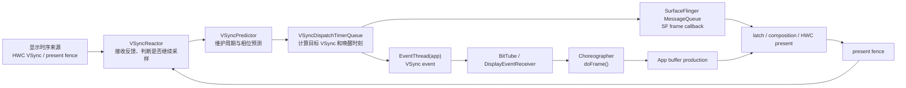

# VSync 机制

## Android 17 的 VSync 分析模型

VSync 在 Android 中负责两类工作：

1. 提供或校准显示设备的时间节奏。
2. 围绕预计呈现时刻，为 App 和 SurfaceFlinger 安排合适的唤醒时间。

第二点更适合解释 Android 17。App 收到的 VSync 回调并非“屏幕此刻开始扫描”的原样广播，SurfaceFlinger 也不会等硬件脉冲到来后才开始合成。系统先根据硬件样本和 present fence 建立显示时序模型，再从目标呈现时刻向前扣除各阶段的工作预算。

因此，分析一帧时要分清四个时刻：

| 时刻 | 回答的问题 | 常见证据 |
|------|------------|----------|
| 显示时序样本 | 显示设备当前按什么节奏运行 | HWC VSync callback、TE、DRM vblank、present fence |
| App wakeup | App 应在何时开始生产目标帧 | `VSYNC-app`、`Choreographer#doFrame` |
| SF wakeup | SF 应在何时开始处理目标显示帧 | `VSYNC-sf`、SF main thread、FrameTimeline |
| present | 本轮合成何时越过 Android 显示栈的呈现边界 | present fence、DisplayHAL、actual timeline |

这四个时刻可能相互接近，也可能相隔一个或多个显示周期。它们不能互相替代。

---

## 一、VSync 为什么能避免画面撕裂

### 1.1 撕裂发生在哪里

显示控制器通常按固定扫描顺序读取一幅图像。如果扫描过程中，控制器读取的数据源切换到了下一幅内容，同一次扫描就可能混入两帧：屏幕的一部分来自旧帧，另一部分来自新帧。这就是画面撕裂。

垂直消隐区（Vertical Blanking Interval，VBlank）来自栅格扫描时序，表示上一帧有效扫描结束到下一帧有效扫描开始之间的区间。传统显示系统在这个边界更新扫描输出（scanout）配置，能够避免在有效扫描中途换图。

### 1.2 VSync、VBlank、TE 不是同一个对象

这些术语经常被混写，但它们处在不同层：

| 术语 | 所在层 | 准确含义 |
|------|--------|----------|
| VBlank | 显示控制器/扫描时序 | 一次垂直消隐区间；DRM/KMS 可围绕它维护计数与事件 |
| TE | Panel 接口 | Panel 用来提示安全更新窗口或扫描节奏的撕裂效应（Tearing Effect）信号 |
| HWC VSync callback | Composer HAL | HWC 向 SurfaceFlinger 报告的时间戳事件 |
| App/SF VSync | Android 调度 | Scheduler 依据预测模型安排的客户端或 SF 唤醒 |

某台设备可以从 panel TE、显示控制器中断或其他 vendor 路径获得底层时间基准，再由 HWC 上报给 framework。不能把所有实现概括成“屏幕引脚产生 GPIO 中断”。DRM vblank 也只适用于采用 DRM/KMS 的显示驱动；它不是 Android 对所有设备强制规定的唯一路径。

### 1.3 现代 Android 没有全局 Front/Back Buffer 互换

双缓冲是理解撕裂的入门模型：一块缓冲供显示读取，另一块供生产者写入，到安全边界后交换角色。现代 Android 的对象更多：

- 每个可独立提交内容的 Surface 通常有自己的 BufferQueue 或等价队列；
- App、视频解码器、Camera、游戏引擎等生产各自的 buffer；
- SurfaceFlinger 从多个 layer 选择可用内容并组织合成；
- HWC 决定哪些 layer 由设备 composition，哪些交给 GPU 生成 client target；
- 显示控制器最终 scanout 的对象可能是硬件 plane，也可能包含 GPU 合成结果。

VSync 不负责交换一对全局缓冲，而是为 buffer 生产、latch、合成和 present 提供时间约束。某个 App 的 buffer 未就绪时，SurfaceFlinger 可能继续使用旧内容，其他 layer 仍可正常更新。

---

## 二、理解“HW-VSync → SF-VSync → App-VSync”

### 2.1 三级信号是教学图，不是 Android 17 的调用顺序

早期资料常用三条周期信号解释相位：

- `HW_VSYNC`：硬件显示节奏；
- `VSYNC` 或 App VSync：应用开始处理输入、动画和绘制；
- `SF_VSYNC`：SurfaceFlinger 开始 latch 与合成。

这张图有助于理解“App 和 SF 要在呈现前预留时间”，但箭头 `HW-VSync → SF-VSync → App-VSync` 容易造成两个误解：

1. App/SF 每次都由刚刚到达的硬件中断逐级转发；
2. 三条信号永久保持同一周期和固定相位。

Android 17 的实现不满足这两个前提。Scheduler 维护预测模型，App 和 SF 分别注册定时回调；ARR 还允许 TE/VSync 频率与内容呈现频率不同。

### 2.2 Android 17 的组件关系

下面这张图按数据和调度方向组织组件：



`VsyncSchedule` 是这组对象的容器。Android 17 的 `VsyncSchedule.h` 明确把它定义为与某个物理显示的硬件 VSync 同步的 `IVsyncSource`，内部持有：

- `VSyncTracker`：当前实现是 `VSyncPredictor`，负责预测；
- `VSyncController`：当前实现是 `VSyncReactor`，负责接收硬件样本和 present fence；
- `VSyncDispatch`：当前实现是 `VSyncDispatchTimerQueue`，负责定时分发。

每个物理显示有自己的时序状态。多显示场景不能套用一条全局 VSync 时间线。

---

## 三、Android 17 如何预测下一次 VSync

### 3.1 默认模型：有限历史样本加线性回归

`VsyncSchedule::createTracker()` 在普通模式下创建 `VSyncPredictor`，参数是：

- 历史窗口：20 个样本；
- 开始形成预测所需的最少样本：6 个；
- 异常点容忍比例：20%。

`VSyncPredictor::validate()` 会检查新时间戳与当前理想周期的对齐程度，过滤重复或明显不一致的样本。样本足够后，它对“VSync 序号—时间戳”做简单线性回归，斜率代表估计周期，截距描述相位。

这套模型的目标是回答：

> 从给定时刻往后，哪个时刻最适合作为下一次目标 VSync？

它不生成更多图像，也不会替 App 补帧。

### 3.2 ARR 的单样本预测分支

Android 17 在满足以下条件时可以采用一条不同分支：

- 当前 mode 带有 VRR/ARR 配置；
- present fence 可用；
- `use_last_vsync_predict` 特性开启。

此时历史窗口和最少样本都可缩为 1。单个样本不能进行线性回归，源码会把模型锚定到最近脉冲，并按理想周期预测下一次时刻。这个分支依赖较强的显示反馈，不能外推成所有设备的默认行为。

### 3.3 为什么硬件 VSync 会开关

持续接收硬件回调会增加唤醒和功耗。模型稳定后，`VSyncReactor` 可以告诉 `VsyncSchedule` 当前不再需要更多硬件样本，系统随后关闭 HWC VSync；发生 mode 切换、模型漂移或需要重新校准时，再开启采样。

Android 17 的硬件 VSync 状态包括 `Enabled`、`Disabled` 和 `Disallowed`。present fence 是否参与模型、kernel idle timer、外部显示和设备配置都会影响采样策略。看到硬件 VSync 持续开启，只能说明当前实现仍在请求样本；还要结合控制器状态和设备配置，不能直接判定为驱动错误。

### 3.4 present fence 是反馈，不代表光学完成

HWC 的 present 操作会按显示、按帧返回 present fence。栅栏发出信号后，会为 Android 显示栈提供本轮 present 的时间锚点，SurfaceFlinger 可用它校准模型和更新 FrameTimeline。

present fence 不表示 panel 所有像素已经完成响应，也不表示人眼此刻已经看到稳定图像。Panel 扫描、传输、像素响应和显示后处理仍可能发生在这个边界之后。

---

## 四、从目标呈现时刻反推 App 与 SF 的唤醒

### 4.1 调度公式

`VSyncDispatchTimerQueueEntry::schedule()` 展示了 Android 17 的核心计算。下面只保留决定目标与唤醒时间的部分：

```cpp
auto nextVsyncTime =
        tracker.nextAnticipatedVSyncTimeFrom(
                max(lastVsync, now + workDuration + readyDuration),
                committedVsyncOpt.value_or(lastVsync));

auto nextWakeupTime =
        nextVsyncTime - workDuration - readyDuration;
```

第一行选择一个足够晚、仍能容纳全部预算的预测 VSync；第二行向前扣除工作时间和就绪时间。实际源码还会处理已经 armed 的回调、避免跳过既定目标、合并相近唤醒以及定时器误差。

用时间轴表示：

```text
wakeup                    ready/deadline              target VSync
  |<---- workDuration ----->|<---- readyDuration ----->|
```

`workDuration` 是该消费者完成自身工作的预算，`readyDuration` 是目标呈现前还要留给后继阶段的预算。对 App EventThread，`readyDuration` 通常承接 SF 工作预算；对 SF MessageQueue，`readyDuration` 为 0，`workDuration` 是 SF 自己的预算。

### 4.2 Phase Offset 在 Android 17 中仍然存在

不能据此断言相位偏移已经消失。`VsyncConfig` 同时保留：

```cpp
struct VsyncConfig {
    nsecs_t sfOffset;
    nsecs_t appOffset;
    std::chrono::nanoseconds sfWorkDuration;
    std::chrono::nanoseconds appWorkDuration;
};
```

这段结构说明配置层仍能用 offset 表达相对相位，也能用工作时长表达 deadline 预算。`VsyncConfiguration` 支持 `PhaseOffsets` 和 `WorkDuration` 两套构造方式，最终提供统一的 `VsyncConfigSet`。

阅读 Android 17 运行时调度时，优先使用 `workDuration`、`readyDuration`、expected presentation time 和 actual present 解释；排查设备配置时，再回到 offset 与 duration 的换算关系。固定写成“App 永远提前 N ms、SF 永远提前 M ms”会漏掉刷新率、状态切换和厂商配置的影响。

### 4.3 Late、Early、EarlyGpu

`VsyncConfigSet` 包含三组配置：

| 配置 | 典型使用时机 | 目的 |
|------|--------------|------|
| `late` | 默认稳定路径 | 在满足预算的前提下尽量晚唤醒，减少输入到呈现的等待 |
| `early` | early transaction、刷新率切换等 | 给 transaction 和合成预留更多时间 |
| `earlyGpu` | 检测到 GPU composition 后的若干帧 | 给 GPU 合成路径增加预算 |

`VsyncModulator` 根据 early wakeup 请求、transaction 状态、刷新率切换和近期是否使用 GPU composition，选择下一组配置。它不是一张恒定的毫秒表。设备 overlay 配置、刷新率和工作负载改变后，具体 duration 都可能变化。

### 4.4 调 phase 的代价

把 App 或 SF 唤醒向目标呈现靠近，可以减少等待时间，但也会缩短可用预算。向前移动则增加容错，同时可能增加输入到显示的排队时间和功耗。

调优时至少同时观察：

- App、SF、DisplayHAL 错过截止时间的类型；
- `workDuration` 配置是否覆盖 P95/P99 耗时；
- runnable 等待是否把可用预算吃掉；
- GPU composition 是否触发 `earlyGpu`；
- 刷新率切换或 ARR cadence 是否改变了目标；
- actual present 是否稳定对齐 expected present。

仅凭平均帧耗时调整 offset，很容易让高分位慢帧变多。

---

## 五、App VSync 如何进入 Choreographer

### 5.1 申请是按需的

应用侧没有持续收到一份必须逐个消费的全局 VSync 广播。`Choreographer.scheduleFrameLocked()` 先用 `mFrameScheduled` 合并重复请求；需要新帧时才调用 `scheduleVsyncLocked()`，最终进入 `DisplayEventReceiver.scheduleVsync()`。

Android 17 的关键逻辑可以缩写为：

```java
if (!mFrameScheduled) {
    mFrameScheduled = true;
    if (isRunningOnLooperThreadLocked()) {
        scheduleVsyncLocked();
    } else {
        Message msg = mHandler.obtainMessage(MSG_DO_SCHEDULE_VSYNC);
        msg.setAsynchronous(true);
        mHandler.sendMessageAtFrontOfQueue(msg);
    }
}
```

这段代码说明两件事：同一 pending frame 的多次 `invalidate()` 不会一一换成多次 VSync 申请；从其他线程发起调度时，会先把异步消息放到 Choreographer 所在线程的队首，再由该线程申请 VSync。

### 5.2 系统进程到 App 进程的路径

按 Android 17 源码，应用侧事件路径是：

1. `EventThread("app")` 在 `VSyncDispatchTimerQueue` 注册回调；
2. 某个 `DisplayEventReceiver` connection 调用 `requestNextVsync()`；
3. `EventThread` 把该 connection 的请求标记为 `Single`；
4. dispatch 到达后，`EventThread::onVsync()` 生成带 FrameTimeline 数据的 VSync event；
5. 事件经 connection 的 `BitTube` 发送到客户端；
6. native `DisplayEventReceiver` 从 fd 读取事件；
7. Java 层 `DisplayEventReceiver` 回调到 `FrameDisplayEventReceiver.onVsync()`；
8. `FrameDisplayEventReceiver` 投递异步 Handler 消息；
9. 消息执行 `run()`，再进入 `Choreographer.doFrame()`。

这个路径中，Binder 用于创建 connection 和发出请求；每帧事件通过 BitTube 通道传递。把每次 App VSync 都描述成一次 Binder 回调并不准确。

### 5.3 VSync 到达不等于 doFrame 立即开始

`FrameDisplayEventReceiver.onVsync()` 会记录 pending VSync 并投递异步消息。源码注释明确允许时间戳更早的消息先执行。主线程若正忙于长任务、锁等待或同步 Binder 调用，`doFrame()` 仍可能晚于预计唤醒点。

因此：

- `VSYNC-app` counter 跳变，不证明目标进程已经开始绘制；
- 一次系统侧 VSync event 不必然对应一个成功提交的 App buffer；
- 判断 App 起帧，应看目标进程的 `Choreographer#doFrame` 及其 FrameTimeline token；
- 判断迟到原因，还要看线程从 wakeup 到 running 的调度延迟。

### 5.4 FrameData 提供多个候选 timeline

`EventThread` 会为 VSync event 生成 `VsyncEventData`，其中包含候选 frame timelines。每项带有：

- `vsyncId`；
- `deadlineTimestamp`；
- `expectedPresentationTime`。

`Choreographer.FrameData` 把这些信息交给回调。应用和系统可以围绕首选 timeline 工作，也能在错过首选目标时识别后续合法目标。在高刷新率、不同渲染 cadence 和提前启动配置下，这比只传一个裸时间戳更有表达力。

---

## 六、SurfaceFlinger 的 VSync 路径

SurfaceFlinger 不通过 App 侧 EventThread 驱动主循环。`Scheduler::initVsync()` 把 SF 的 `MessageQueue` 注册到同一个节奏基准显示（pacesetter display）的 `VSyncDispatch`，注册名为 `"sf"`。

当 SF 有一帧需要处理时，`MessageQueue::scheduleFrame()` 使用当前 SF `workDuration` 调度回调。到时后，SF 处理 transaction、更新 layer snapshot、选择 buffer、制定 composition strategy，随后和 HWC 完成 validate/present。

App 与 SF 共享同一物理显示的预测基础，但它们有不同的注册项、预算和回调路径：

| 对象 | 调度入口 | 工作内容 |
|------|----------|----------|
| App | `EventThread("app")` → DisplayEventReceiver → Choreographer | 输入、动画、Traversal、RenderThread/GPU、提交 buffer |
| SF | `MessageQueue` 的 `"sf"` registration | transaction、latch、composition、HWC present |

这就是 Perfetto 中 `VSYNC-app` 与 `VSYNC-sf` 分开的原因。两条轨迹是调度证据，不是两块硬件各自发出的脉冲。

---

## 七、ARR/VRR 下，VSync 周期不再等于呈现周期

### 7.1 Android 15 引入 ARR

Android 15 引入自适应刷新率（Adaptive Refresh Rate，ARR）。ARR 所需的 `vrrConfig`、`getDisplayConfigurations()` 与 `notifyExpectedPresent()` 基础契约从 Composer3 AIDL version 3 开始出现。Android 17 tag 同时保留 version 3、4、5 的冻结快照；此处以 version 3 标出这组契约的起点，不表示 Android 17 设备只能实现 version 3。支持 ARR 的 mode 在 `DisplayConfiguration` 中提供 `vrrConfig`：

- `vsyncPeriod` 表示显示 VSync/TE 节奏；
- `VrrConfig.minFrameIntervalNs` 约束最快呈现间隔；
- `DisplayCommand.frameIntervalNs` 提示后续内容 cadence；
- `notifyExpectedPresent` 可提前告知下一次预计呈现及后续间隔。

在非 ARR mode 中，`vsyncPeriod` 通常对应当前显示刷新周期。ARR mode 中，两者可以解耦。

### 7.2 一个具体例子

假设 panel 的 TE/VSync 为 240 Hz，周期约 4.17 ms；`minFrameIntervalNs` 对应 120 Hz，最快每 8.33 ms 呈现一帧。系统还可以按内容 cadence 在后续离散 VSync 步长呈现，例如约 16.67 ms 一帧。

此时不能看到 240 Hz 的 VSync 就断言屏幕正在以 240 fps 更新内容。需要同时区分：

- VSync/TE rate；
- mode 的 peak refresh rate；
- 当前 render rate；
- 帧的 expected/actual presentation cadence。

### 7.3 `minFramePeriod()` 的含义

`VSyncPredictor` 根据 mode 的 peak refresh period 与 VSync rate 计算每个显示帧跨越多少个 VSync tick，`minFramePeriod()` 返回最小显示帧间隔。这里的倍数描述显示 mode 的 cadence 约束，不表示预测器要“收集多帧才输出一帧”。

---

## 八、VSync 与 BufferQueue：没有固定“三缓冲公式”

### 8.1 Buffer 数量是动态约束的结果

Android 图形文章常把卡顿解释为“双缓冲切三缓冲”。这个模型可以说明“增加一块可周转缓冲有时能减少 producer 阻塞”，但不能作为现代 BufferQueue 的固定配置。

实际可用 slot 数受多项状态共同影响：

- producer 最多可同时 dequeue 的数量；
- consumer 最多可 acquire 的数量；
- async/non-blocking 模式；
- 当前 `DEQUEUED`、`QUEUED`、`ACQUIRED`、`FREE` slot 分布；
- release fence 是否 signal；
- BLAST 待释放缓冲和当前刷新率策略。

所以，Android 没有对所有 Surface 保证“默认正好三块缓冲”。

### 8.2 队列加深会改变什么

更多可周转缓冲可能减少 producer 阻塞，但也可能让旧内容排在队列中，增加从输入到呈现的等待。是否丢弃旧 buffer、SF 本轮是否 latch 新内容、producer 是否受到背压限制，还取决于队列模式和 transaction 状态。

下列推导都不成立：

- 一次超时必然造成固定数量的连续掉帧；
- 三缓冲一定比双缓冲多一帧延迟；
- 增加 slot 一定改善流畅度；
- `queueBuffer()` 返回就说明目标 VSync 能显示该帧。

VSync 只提供时间机会。buffer 是否赶上目标，要结合提交时刻、acquire fence、latch 和 present 逐帧判断。

---

## 九、VSync 如何影响输入延迟

从触摸到显示，至少经过：

```text
InputReader/InputDispatcher
  → App 线程收到或批量消费输入
  → Choreographer callback
  → UI/RenderThread/GPU
  → queueBuffer + acquire fence
  → SurfaceFlinger latch/composition
  → HWC present
  → panel scanout/response
```

VSync phase 影响其中 App 与 SF 的起跑点，但总延迟还取决于：

- 输入在本次 App wakeup 前还是后到达；
- 主线程是否及时运行；
- batched input 是否在本帧消费；
- App/GPU 是否赶上目标 deadline；
- SF 是否在本轮 latch 该 buffer；
- HWC 和显示后段是否按时 present；
- panel 扫描方向和像素响应。

不能用“平均半个 VSync”概括触摸等待，也不能只根据 phase offset 推导端到端延迟。可靠做法是用同一帧的输入事件、FrameTimeline token、buffer 和 present 证据测量。

---

## 十、在 Perfetto 中观察 VSync

### 10.1 先找对观察对象

不同 Android 版本、trace 配置和设备实现显示的轨迹名称可能不同。常见对象包括：

- SurfaceFlinger 中的 `VSYNC-app`、`VSYNC-sf` 或 `VSYNC-predicted` counter；
- App 进程主线程的 `Choreographer#doFrame`；
- RenderThread 的 `DrawFrame`；
- App 与 SurfaceFlinger 的 FrameTimeline Expected/Actual；
- SurfaceFlinger main thread、RenderEngine/GPU、HWC/DisplayHAL；
- `BufferTX - <layerName>`、acquire/release/present fence；
- `sched_wakeup`、`sched_switch` 和线程状态。

不要要求 trace 必须出现一组固定轨迹名。轨迹缺失时，先检查 trace config 和设备是否暴露对应数据源。

### 10.2 逐帧分析顺序

对一帧 UI 更新，按下面的顺序核对：

1. App Expected Timeline 给出的 wakeup、deadline 和 expected present 是什么？
2. `Choreographer#doFrame` 何时开始，开始前有多少 runnable 等待？
3. UI 线程、RenderThread 和 GPU 何时结束，buffer 何时提交？
4. SF 是否在目标显示帧接收并 latch 该 buffer？
5. SF CPU、SF GPU 或 DisplayHAL 哪一段错过 deadline？
6. Actual Timeline 的 present 与 Expected Timeline 偏差是多少？
7. 同期是否发生刷新率切换、ARR cadence 变化或 early 配置切换？

Perfetto 的 FrameTimeline 从 Android 12 开始提供 Expected 和 Actual 轨迹。Expected 描述系统给这一帧安排的预算，Actual 描述帧的执行与呈现结果。二者按 token 对齐，比统计 `VSYNC-app` counter 更能说明问题。

### 10.3 常见现象如何解释

| 现象 | 先检查 | 不应直接得出的结论 |
|------|--------|--------------------|
| `VSYNC-app` 在跳，App 没有 `doFrame` | App 是否请求帧、目标进程是否有回调、主线程状态 | VSync 丢失 |
| `doFrame` 晚于预计起点 | runnable 等待、长消息、锁、Binder、GC | UI 逻辑一定很重 |
| App 按时提交，Actual 仍晚 | latch、SF CPU/GPU、HWC、DisplayHAL | App 渲染慢 |
| SF 持续使用 early 配置 | transaction、刷新率切换、GPU composition | phase 参数配置错误 |
| HW VSync 一直开启 | Reactor 是否需要样本、present fence、mode 状态 | HWC 驱动有故障 |
| VSync rate 高于呈现 rate | ARR 的 TE rate、min frame interval、render cadence | 系统重复显示了每个新帧 |

### 10.4 `dumpsys SurfaceFlinger` 的定位价值

`dumpsys SurfaceFlinger` 在具体分支和设备上会打印当前 VSync controller、dispatch、预测器、硬件 VSync 状态、显示 mode 与调度配置。字段名会随版本变化，排查时应以目标设备输出为准。

可以把 dumpsys 当成“当前配置快照”，把 Perfetto 当成“运行过程证据”：

- dumpsys 能说明当时选择了哪种 mode、预算和控制状态；
- Perfetto 能说明每一帧何时被唤醒、执行、提交和 present；
- vendor trace 或 DRM/HWC tracepoint 才能继续观察显示后段。

---

## 十一、Framework、HAL 与 kernel 的边界

VSync 问题容易在层级之间互相甩锅。可以按责任划分：

| 层级 | 负责内容 | 常见源码入口 |
|------|----------|--------------|
| App framework | 请求帧、分发 callback、组织 `doFrame()` | `Choreographer.java`、`DisplayEventReceiver.java` |
| SurfaceFlinger Scheduler | 预测、反馈控制、分发 App/SF wakeup | `VsyncSchedule`、`VSyncPredictor`、`VSyncReactor`、`VSyncDispatchTimerQueue` |
| Composer HAL/HWC | 上报 VSync、接收 expected present 提示、返回 present fence | Composer3 AIDL、vendor composer 实现 |
| kernel/显示驱动 | 显示控制器中断、vblank/TE、commit 与 fence 的底层实现 | vendor display driver；DRM/KMS 设备可看 `drm_vblank.c` |
| panel | 扫描、TE、自刷新、像素响应 | panel/controller 规格与 vendor 实现 |

kernel 行为以 `android17-6.18-2026-06_r6` 为准。通用内核的 `drivers/gpu/drm/drm_vblank.c` 和 `include/drm/drm_vblank.h` 说明 DRM vblank 计数、事件与时间戳框架；Android 设备是否走该路径，要看 SoC 显示驱动和 HWC 实现。通用 AOSP framework 无法证明某款设备使用哪根 panel 信号或哪种中断接线。

---

## 十二、版本演进

| 版本 | 变化 | 阅读提示 |
|------|------|----------|
| Android 4.1 | Project Butter 把 App、合成和显示节奏纳入统一帧调度 | 适合理解 App/SF VSync 的起点 |
| Android 4.x～10 | DispSync 软件 PLL 与固定 phase offset 是主流说明模型 | 旧源码和官方 VSync 文档仍大量使用这些术语 |
| Android 11～12 | Scheduler、VSyncPredictor、FrameTimeline 等逐步成为分析重点 | 开始从固定相位转向目标呈现与逐帧 deadline |
| Android 13～14 | 刷新率策略、FrameTimeline 和调度模型继续演进 | 不能把旧属性名直接套到新分支 |
| Android 15 | Composer3 v3 引入 ARR 支持，TE/VSync rate 可与呈现 rate 解耦 | 需要同时看 `vsyncPeriod` 与 `minFrameIntervalNs` |
| Android 16 | API 36 增加 ARR 能力查询与建议帧率接口 | App 更容易识别和利用 ARR |
| Android 17 | `VsyncSchedule`、预测/反馈/分发模型延续并加强 ARR 时序支持 | 源码基线为 `android-17.0.0_r1` |

`DispSync` 对理解 Android 图形历史仍有价值，但 Android 17 的实现入口应从 `VsyncSchedule`、`VSyncPredictor`、`VSyncReactor` 和 `VSyncDispatchTimerQueue` 开始。

---

## 十三、排查清单

遇到“VSync 异常”时，先把宽泛描述拆成可验证问题：

- App 是否申请了下一帧？
- EventThread 是否为该 connection 安排了 single VSync？
- App 主线程是否按预计时间运行？
- App 的 buffer 是否在目标 deadline 前提交并可读？
- SF 是否在目标显示帧 latch 了这块 buffer？
- 当前使用 `late`、`early` 还是 `earlyGpu` 配置？
- VSync 预测是否正在重新采样或切换显示 mode？
- 当前是固定刷新 mode、MRR 还是 ARR mode？
- trace 中的 VSync rate、render rate、actual present rate 是否被混为一谈？
- present fence 晚，是 SF/HWC 提交晚，还是显示后段反馈晚？
- 设备使用 DRM vblank、panel TE 还是 vendor 私有时间源？

把每个问题都绑定到具体时间戳、线程、buffer VSync 还原为一套可逐帧验证的调度机制。

---

## Android 17 的 VSync 调度边界

1. VBlank、TE、HWC VSync callback、App/SF VSync 分属不同层，不能当成同一个 GPIO 信号。
2. 现代 Android 使用 per-Surface buffer 队列、layer 合成和 HWC present，不存在一对全局前后缓冲统一交换的实现。
3. “HW-VSync、SF-VSync、App-VSync”适合解释历史相位关系；Android 17 应按“显示反馈 → 预测目标 → 预算反推唤醒”理解。
4. `VsyncSchedule` 持有预测器、反馈控制器和分发器；App 与 SF 使用不同注册项和工作预算。
5. Phase offset 仍存在于配置层，运行时诊断应同时看 `workDuration`、`readyDuration`、expected presentation 和 actual present。
6. Choreographer 按需请求下一次 VSync，系统侧 counter 不等于 App 已经执行 `doFrame()`。
7. ARR 允许 TE/VSync rate 与呈现 rate 解耦，不能再用单一刷新周期解释所有帧。
8. BufferQueue 深度是动态约束结果，没有通用的双缓冲/三缓冲固定延迟公式。
9. Perfetto 分析要用 FrameTimeline token 对齐 App、SF 与 present，再结合调度、buffer 和 fence 证据定位超时。

---

## 参考资料

- AOSP Android 17：`frameworks/native/services/surfaceflinger/Scheduler/`
- AOSP Android 17：`frameworks/base/core/java/android/view/Choreographer.java`
- AOSP Android 17：`frameworks/base/core/java/android/view/DisplayEventReceiver.java`
- AOSP Android 17：`frameworks/native/libs/gui/DisplayEventReceiver.cpp`
- AOSP Composer3 v3：`DisplayConfiguration.aidl`、`VrrConfig.aidl`、`DisplayCommand.aidl`
- Android common kernel `android17-6.18-2026-06_r6`：`drivers/gpu/drm/drm_vblank.c`
- [AOSP VSync](https://source.android.com/docs/core/graphics/implement-vsync)
- [AOSP Adaptive refresh rate](https://source.android.com/docs/core/graphics/arr)
- [Android 16 features: Adaptive refresh rate](https://developer.android.com/about/versions/16/features#adaptive-refresh-rate)
- [Perfetto FrameTimeline](https://perfetto.dev/docs/data-sources/frametimeline)
