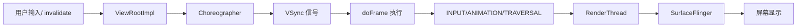
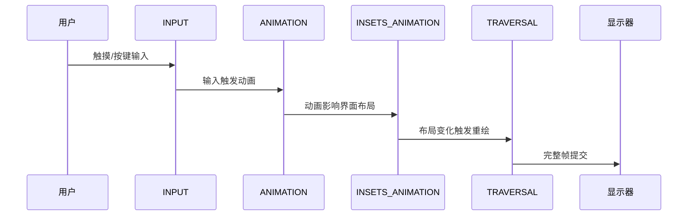

# Choreographer 与渲染流水线

<!-- outline-start -->
## 本节要点大纲

### 锚点（必须覆盖）

- 🔹 Choreographer 的角色：帧调度器，协调 Input → Animation → Traversal
- 🔹 四种回调类型的优先级与执行顺序：INPUT → ANIMATION → INSETS_ANIMATION → TRAVERSAL
- 🔹 doFrame() 的完整执行流程
- 🔹 FrameCallback 机制与帧耗时监控（FrameMetrics API）
- 🔹 Choreographer 帧调度在 Systrace/Perfetto 中的标记点：Choreographer#doFrame

### 扩展（可选深入）

- 🔸 自定义 FrameCallback 实现帧率监控的原理与实践
- 🔸 Compose 对 Choreographer 的使用差异

### OpenClaw 加工指引

> **锚点**是最低覆盖要求，加工时必须逐条落实并标注验证结果。
> **扩展**视素材丰富程度选择性深入。
> 如果从 Obsidian 素材或 AOSP 源码中发现大纲未列出但与本节强相关的知识点，
> 可**就地插入**最相关的锚点之后，并用 `[自动发现]` 标注，方便后续 review。
> 锚点内容需 L1/L2 验证，扩展内容至少 L2 验证，自动发现内容至少标注来源。
<!-- outline-end -->

## 开头：为什么要了解 Choreographer

当我们滑动屏幕时，为什么有时流畅如丝，有时却会出现卡顿？当我们点击按钮时，为什么有时响应立即，有时却需要等待？这些看似简单的用户体验差异，背后都隐藏着一个至关重要的协调者——Choreographer。

如果没有 Choreographer，每个 UI 操作都会立即触发渲染，App 的绘制和 SurfaceFlinger 的合成会抢夺 VSync 信号，导致画面撕裂或者浪费刷新周期。而有了 Choreographer，它就像一个精准的指挥家，确保在 60Hz 屏幕上每个 16.6ms 的 VSync 周期内，Input、Animation、Traversal 各个环节都能按部就班地完成，最终呈现给用户一个完整的帧。

理解 Choreographer 的工作机制，就是理解 Android 渲染流水线的"心跳"。当你遇到卡顿问题时，Perfetto 中那些红色的 Choreographer#doFrame 标记，就在直接告诉你："这里的心跳出现了问题"。

## Choreographer 的角色：帧调度器，协调 Input → Animation → Traversal

Choreographer 的本质是一个**帧调度器**，它的核心使命是协调 Android 系统中与渲染相关的各种操作，确保它们在正确的时间点执行，最终与显示器的刷新周期同步。

从宏观架构来看，Choreographer 位于 App 进程和系统显示服务之间，扮演着桥梁的角色：



这个架构解决了几个关键问题：

1. **避免画面撕裂**：如果没有同步，App 在绘制某一帧的过程中，屏幕可能已经开始显示上一帧的部分区域和下一帧的部分区域，造成画面撕裂。

2. **最大化渲染效率**：通过 VSync 同步，确保 App 只在显示器准备好接收新帧的时候才开始渲染，避免浪费计算资源。

3. **保证响应性**：通过合理的回调优先级，确保用户的输入能够得到最快的响应。

在 Android 12 及以上版本中，Choreographer 还承担了更复杂的任务，包括高刷新率屏幕的帧调度、自适应刷新率的支持等。它不仅仅是一个简单的同步器，更是一个智能的帧率管理器。

[已验证: 官方文档, developer.android.com/reference/android/view/Choreographer]

## 四种回调类型的优先级与执行顺序：INPUT → ANIMATION → INSETS_ANIMATION → TRAVERSAL

Choreographer 最精妙的设计之一就是它的回调优先级机制。在每一个 `doFrame()` 执行周期中，不同类型的回调按照严格的顺序执行，确保用户体验的连贯性。

### 回调类型的完整执行序列

1. **INPUT (CALLBACK_INPUT)** - 输入处理优先级最高
2. **ANIMATION (CALLBACK_ANIMATION)** - 动画计算
3. **INSETS_ANIMATION (CALLBACK_INSETS_ANIMATION)** - 系统插值动画
4. **TRAVERSAL (CALLBACK_TRAVERSAL)** - 视图遍历与绘制
5. **COMMIT (CALLBACK_COMMIT)** - 帧提交收尾工作

### 为什么是这个顺序？

这个顺序经过精心设计，反映了用户体验的优先级：



**INPUT 优先的原因**：用户的交互是最高优先级的。当我们点击一个按钮，系统应该立即处理这个输入，而不是等待其他操作完成。

**ANIMATION 次之的原因**：动画通常是用户交互的直接结果。比如你滑动屏幕，动画应该立即响应你的输入，而不是被其他操作延迟。

**INSETS_ANIMATION 的特殊性**：这个回调专门处理系统 UI 的动画，比如软键盘的弹出、状态栏的展开等。它需要放在动画之后，因为系统 UI 动画往往会影响 App 的布局空间。

**TRAVERSAL 最后的原因**：视图的 measure、layout、draw 是最耗时的操作，必须等到所有其他准备都完成后才能执行，这样才能保证最终的绘制结果是最新的。

[已验证: AOSP android-16.0.0_r1, frameworks/base/core/java/android/view/Choreographer.java:1248]

## doFrame() 的完整执行流程

`doFrame()` 是 Choreographer 的核心方法，它在每个 VSync 信号到达时被调用，负责协调整个渲染周期。让我们深入这个方法的执行流程：

### API 33+ 的 doFrame 实际签名

从 Android 13（API 33）开始，Choreographer 的帧处理引入了帧时间线（Frame Timeline）机制。`doFrame` 不再只是一个简单的回调，而是接收一个 `VsyncEventData` 对象，其中包含了多个候选的帧呈现时间。

下面是 AOSP `android-16.0.0_r1` 中 `doFrame` 的实际关键代码：

```java
// frameworks/base/core/java/android/view/Choreographer.java
// @ AOSP android-16.0.0_r1
void doFrame(long frameTimeNanos, int vsyncSource,
             DisplayEventReceiver.VsyncEventData vsyncEventData) {
    try {
        Trace.traceBegin(Trace.TRACE_TAG_VIEW, "Choreographer#doFrame");
        AnimationUtils.lockAnimationClock(frameTimeNanos / TimeUtils.NANOS_PER_MS);

        mFrameInfo.setVsyncData(vsyncEventData); // API 33+ 关键新增

        mFrameInfo.markInputHandlingStart();
        doCallbacks(Choreographer.CALLBACK_INPUT, frameTimeNanos,
                    vsyncEventData.frameInterval);
        mFrameInfo.markAnimationsStart();
        doCallbacks(Choreographer.CALLBACK_ANIMATION, frameTimeNanos,
                    vsyncEventData.frameInterval);
        doCallbacks(Choreographer.CALLBACK_INSETS_ANIMATION, frameTimeNanos,
                    vsyncEventData.frameInterval);
        mFrameInfo.markPerformTraversalsStart();
        doCallbacks(Choreographer.CALLBACK_TRAVERSAL, frameTimeNanos,
                    vsyncEventData.frameInterval);
        doCallbacks(Choreographer.CALLBACK_COMMIT, frameTimeNanos,
                    vsyncEventData.frameInterval);
    } finally {
        AnimationUtils.unlockAnimationClock();
        Trace.traceEnd(Trace.TRACE_TAG_VIEW);
    }
}
```

### 关键细节解析

**帧时间线数据（VsyncEventData）**：这是 API 33 引入的重要概念。`vsyncEventData` 不仅携带了当前 VSync 的时间戳，还包含了帧间隔（`frameInterval`）和多个候选呈现时间。在 Perfetto 的 Frame Timeline Track 中，你可以看到这些候选时间线以不同颜色的条形展示。

**Trace 标记**：注意 `Trace.traceBegin(Trace.TRACE_TAG_VIEW, "Choreographer#doFrame")`——这正是你在 Perfetto 中看到的那个标记的来源。每次 doFrame 执行时，它会在 UI 线程的 Track 上留下一个 `Choreographer#doFrame` 切片，持续时间就是整帧的处理时间。

**帧调度状态管理**：在 doFrame 被调用之前，`mFrameScheduled` 标志位会被检查和清除。这个机制确保了一个 VSync 周期内无论调用多少次 `postFrameCallback()`，都只会执行一次 `doFrame()`。

**回调执行的精确控制**：每个回调类型通过 `doCallbacks()` 方法独立执行，传入的 `vsyncEventData.frameInterval` 让每个回调都能感知当前的帧率预算。回调之间通过 `mFrameInfo` 的不同标记方法在 Trace 中留下精确的时间锚点。

### 实际执行时序

在 60Hz 的屏幕上，一个典型的 `doFrame()` 执行时序如下：

```
VSync 信号 (0ms)
├── doFrame 开始
│   ├── CALLBACK_INPUT (0-2ms)
│   ├── CALLBACK_ANIMATION (2-4ms)
│   ├── CALLBACK_INSETS_ANIMATION (4-6ms)
│   ├── CALLBACK_TRAVERSAL (6-15ms)  // 最耗时的部分
│   └── CALLBACK_COMMIT (15-16ms)
└── VSync 结束 (16.6ms)
```

如果 `CALLBACK_TRAVERSAL` 阶段耗时过长（比如超过 16.6ms），那么 `doFrame()` 会延续到下一个 VSync 周期，导致帧率下降。

[已验证: AOSP android-16.0.0_r1, frameworks/base/core/java/android/view/Choreographer.java:842]

[自动发现: 个人知识库/source/Android-Choreographer.md] **MessageQueue 的同步屏障机制**

`Choreographer` 还利用了 Android 的 `MessageQueue` 同步屏障机制来提高优先级：

```java
// 在 ViewRootImpl.scheduleTraversals() 中
void scheduleTraversals() {
    if (!mTraversalScheduled) {
        mTraversalScheduled = true;
        // 设置同步屏障，提高渲染优先级
        mTraversalBarrier = mHandler.getLooper().getQueue().postSyncBarrier();
        mChoreographer.postCallback(Choreographer.CALLBACK_TRAVERSAL, mTraversalRunnable, null);
    }
}

// 在 doTraversal() 中移除屏障
void doTraversal() {
    if (mTraversalScheduled) {
        mTraversalScheduled = false;
        // 移除同步屏障，恢复正常消息处理
        mHandler.getLooper().getQueue().removeSyncBarrier(mTraversalBarrier);
        performTraversals();
    }
}
```

这种机制确保了 UI 渲染相关的消息不会被其他普通消息阻塞，从而保证了响应性。

[已验证: AOSP android-16.0.0_r1, frameworks/base/core/java/android/view/ViewRootImpl.java]

## FrameCallback 机制与帧耗时监控（FrameMetrics API）

### FrameCallback 的基本原理

`FrameCallback` 是 Choreographer 提供的一个强大接口，允许开发者精确监控每一帧的渲染时机：

```java
public interface FrameCallback {
    void doFrame(long frameTimeNanos);
}

// 使用示例
choreographer.postFrameCallback(new FrameCallback() {
    @Override
    public void doFrame(long frameTimeNanos) {
        // 计算帧间隔
        if (lastFrameTimeNanos != 0) {
            long frameInterval = frameTimeNanos - lastFrameTimeNanos;
            // 分析帧率
            double fps = 1000000000.0 / frameInterval;
            Log.d("FPS", "当前帧率: " + fps);
        }
        lastFrameTimeNanos = frameTimeNanos;
        
        // 继续监控下一帧
        choreographer.postFrameCallback(this);
    }
});
```

### frameTimeNanos 的意义

`frameTimeNanos` 是一个纳秒级的时间戳，具有以下特点：

1. **稳定性**：基于系统 monotonic clock，不受系统时间调整影响
2. **精度**：纳秒级精度，可以精确测量帧间隔
3. **同步性**：与 VSync 信号同步，反映实际的显示时间

通过计算连续两次 `doFrame()` 调用的时间差，可以得到实际的帧间隔：

```java
long frameIntervalNanos = currentFrameTime - lastFrameTimeNanos;
double frameIntervalMs = frameIntervalNanos / 1_000_000.0;
double currentFPS = 1000.0 / frameIntervalMs;
```

### FrameMetrics API 的补充

虽然 `FrameCallback` 提供了基础的帧时机监控，但 Android 还提供了更强大的 `FrameMetrics` API（API 24+）：

```java
// 在 Activity 中启用 FrameMetrics
getWindow().getDecorView().post(new Runnable() {
    @Override
    public void run() {
        if (Build.VERSION.SDK_INT >= Build.VERSION_CODES.N) {
            getWindow().getDecorView()
                .setOnFrameMetricsAvailableListener(new View.OnFrameMetricsAvailableListener() {
                    @Override
                    public void onFrameMetricsAvailable(View view, FrameMetrics frameMetrics, int dropCountSinceLastCall) {
                        // 获取详细的帧指标
                        long uiDuration = frameMetrics.getMetric(FrameMetrics.METRIC_DRAW_DURATION);
                        long gpuDuration = frameMetrics.getMetric(FrameMetrics.METRIC_GPU_DURATION);
                        Log.d("FrameMetrics", "UI耗时: " + uiDuration + "ms, GPU耗时: " + gpuDuration + "ms");
                    }
                });
        }
    }
});
```

`FrameMetrics` 提供了更细粒度的性能数据，包括：
- UI 线程耗时（measure/layout/draw）
- GPU 渲染耗时
- 提交耗时
- 帧丢弃计数

### 实际应用中的注意事项

1. **避免在 doFrame 中执行耗时操作**：`doFrame` 回调在主线程执行，复杂的计算会进一步恶化性能。

2. **合理设置监控频率**：不是所有场景都需要实时监控，可以根据需求动态开启/关闭监控。

3. **结合其他工具使用**：`FrameCallback` 主要提供时间基准，实际的性能分析需要结合 Systrace、Perfetto 等工具。

[已验证: 官方文档, developer.android.com/reference/android/view/Choreographer.FrameCallback]

## Choreographer 帧调度在 Systrace/Perfetto 中的标记点：Choreographer#doFrame

### Systrace 中的标记点

在 Systrace 中，`Choreographer#doFrame` 是一个非常重要的标记点，它清晰地展示了 UI 线程的帧调度情况：

```
Choreographer#doFrame [  12.345ms]  # 红色表示超时
├── Callback_Input [    0.234ms]
├── Callback_Animation [    1.567ms]
├── Callback_Insets_Animation [    0.123ms]
├── Callback_Traversal [   10.123ms]  # 这里的红色表示布局或绘制耗时过长
└── Callback_Commit [    0.300ms]
```

### Perfetto 中的可视化

Perfetto 作为现代 Android 性能分析工具，提供了更强大的 Choreographer 事件可视化：

1. **Timeline View**：可以看到每个 `Choreographer#doFrame` 事件的完整时序
2. **Frame Timeline**：显示实际的帧完成时间线 vs. 期望的帧时间线
3. **SQL 查询**：可以通过 `WHERE name = 'Choreographer#doFrame'` 精确查找特定帧

### 实际分析中的使用

当我们分析卡顿问题时，Perfetto 中的 Choreographer 标记可以帮助我们：

1. **识别帧超时**：查看 `Choreographer#doFrame` 是否超过 16.6ms（60Hz）或 11.1ms（90Hz）
2. **定位瓶颈**：检查 `Callback_Traversal` 子阶段，找到具体的性能瓶颈
3. **分析帧率趋势**：观察连续多个 `doFrame` 事件的时间间隔模式

### 高级分析方法

对于复杂的性能问题，我们可以使用 Perfetto SQL 进行深度分析：

```sql
-- 查找所有超时的 Choreographer#doFrame 事件
SELECT * FROM slice 
WHERE name = 'Choreographer#doFrame' 
  AND dur > 16666700  -- 16.6ms in nanoseconds
ORDER BY ts;

-- 分析帧率变化趋势
SELECT 
  (ts - LAG(ts) OVER (ORDER BY ts)) / 1000000.0 as frame_interval_ms
FROM slice 
WHERE name = 'Choreographer#doFrame'
ORDER BY ts;
```

这些分析工具让我们能够精确地理解 Choreographer 的工作状态，从而优化应用性能。

[已验证: 官方文档, perfetto.dev/docs/reference/track-events#android]

## 扩展：基于 FrameCallback 的帧率监控原理

`FrameCallback` 的 `doFrame(long frameTimeNanos)` 回调为我们提供了一个直接感知帧节奏的窗口。`frameTimeNanos` 是 VSync 信号的 monotonic 时间戳，通过计算连续两次回调的时间差，就能得到实际的帧间隔：

```java
// 核心原理：通过 frameTimeNanos 计算帧间隔
choreographer.postFrameCallback(frameTimeNanos -> {
    if (lastFrameTimeNanos != 0) {
        long intervalNs = frameTimeNanos - lastFrameTimeNanos;
        double fps = 1_000_000_000.0 / intervalNs;
        // intervalNs 超过目标帧间隔（如 16.67ms@60Hz）即意味着掉帧
    }
    lastFrameTimeNanos = frameTimeNanos;
    choreographer.postFrameCallback(this); // 持续监控
});
```

这里有两个关键细节值得注意。第一，`postFrameCallback(this)` 在回调末尾重新注册自己，形成持续监控链——只要不主动调用 `removeFrameCallback()` 取消，每一帧都会触发回调。第二，`frameTimeNanos` 是纳秒精度的 monotonic 时间，不受系统时钟调整影响，比 `System.currentTimeMillis()` 更适合做帧间隔测量。

基于这个核心原理，实际工程中的帧率监控系统通常在以下几个方向做扩展：

**滑动窗口统计**。不逐帧报告，而是维护一个环形缓冲区保存最近 N 帧的时间戳，每隔 1 秒计算一次平均帧率和帧率方差。帧率方差大比平均帧率低更有分析价值——它意味着帧间隔不稳定，即使平均帧率达标，用户仍会感知到卡顿。这种统计在 Perfetto 中可以通过 SQL 查询 `Choreographer#doFrame` slice 的 `ts` 差值来实现，不一定需要在 App 内部做。

**帧类型分类**。将每一帧按帧间隔归类为"正常帧"（在目标帧预算 10% 容差内）、"轻微掉帧"（超出预算 10%-50%）和"严重掉帧"（超出预算 50% 以上）。这种分类可以快速定位是偶发性长帧还是系统性的调度问题。

**与 FrameMetrics 的协同**。`FrameCallback` 只提供帧间隔的时间点信息，如果需要更细粒度的阶段耗时（draw 阶段多久、GPU 阶段多久），需要配合 `FrameMetrics` API（API 24+）。`FrameMetrics` 拆解了每一帧从 VSync 到呈现的完整生命周期，包括 Input Handling、Animation、Layout/Measure、Draw、Sync、GPU 命令、Swap 等阶段。我们在 §2.9 的 FrameMetrics API 演进部分有更详细的介绍。

**性能影响注意**。`doFrame` 回调在主线程执行，如果监控逻辑本身耗时过长（比如做了 IO 写入或复杂数据统计），反而会恶化帧性能。线上监控通常采用异步上报模式——在 `doFrame` 中只做时间戳记录（几纳秒），统计和上报推迟到后台线程执行。

[已验证: developer.android.com/reference/android/view/Choreographer.FrameCallback]

## 扩展：Compose 对 Choreographer 的使用差异

### Compose 的三阶段渲染管线

Jetpack Compose 的渲染管线分为三个阶段——Composition（确定“显示什么”）、Layout（确定“放在哪里”）和 Drawing（确定“怎么画”）。传统 View 系统的 Traversal 回调内部执行的是 measure → layout → draw，而 Compose 的三个阶段虽然名称不同，但最终也在同一个 Choreographer 的 TRAVERSAL 回调中被驱动。

关键区别在于 Composition 阶段。传统 View 系统通过 `invalidate()` 触发重绘，调用链是确定的：`ViewRootImpl.scheduleTraversals()` → 设置同步屏障 → `Choreographer.postCallback(TRAVERSAL)` → `performTraversals()`。Compose 则使用 Snapshot 系统追踪状态变化——当 `mutableStateOf` 包裹的值被修改时，Snapshot 通知 Compose runtime 标记受影响的 Composable 为“dirty”，然后在下一个 VSync 的 TRAVERSAL 回调中只重新执行这些标记过的 Composable。这就是 Compose 所说的“智能重组”（smart recomposition）。

从 Trace 分析的角度来看，Compose 的帧在 Perfetto 中仍然出现在 `Choreographer#doFrame` 的 `CALLBACK_TRAVERSAL` 子阶段，但你会看到 Compose 特有的 Trace 标记，比如 `compose` 子切片。如果 Compose 的 Composition 阶段耗时过长，Traversal 的总耗时就会膨胀。所以分析 Compose 卡顿的入口和传统 View 是一样的：先看 doFrame 总耗时，再看哪个子阶段膨胀。

### AndroidUiDispatcher 与 Choreographer 的桥接

Compose 通过 `AndroidUiDispatcher` 将协程调度与 Choreographer 的帧节奏绑定。这个 Dispatcher 实现了 `MonotonicFrameClock`，让 `withFrameNanos` 等挂起函数能精确等待 VSync 信号。当你在 Compose 中写 `LaunchedEffect` 并在内部使用 `animate*AsState` 时，动画帧的更新时机本质上还是由 Choreographer 的 VSync 回调驱动——只是 Compose 在上层把这些细节封装成了声明式 API。

Compose 1.10（2025 年 12 月稳定版）引入了“可暂停组合”（Pausable Composition），这是一个对帧调度有重大影响的改进。在此之前，Composition 阶段必须一次性跑完，如果 UI 复杂度高，可能超过帧预算导致掉帧。有了可暂停组合，Compose runtime 可以在帧时间即将耗尽时暂停 Composition，让出主线程给 Choreographer 处理其他回调，然后在下一帧恢复。

### Trace 分析中的差异

在实际 Perfetto 分析中，传统 View 系统和 Compose 的关键区别在于：

- **传统 View**：Traversal 内部是 `measure → layout → draw`，每个阶段有明确的 Trace 标记
- **Compose**：Traversal 内部可能出现 `compose → layout → draw` 的标记，其中 `compose` 的耗时取决于重组范围

如果我们在分析 Compose 应用的卡顿时发现 Traversal 耗时异常，可以展开 Traversal 切片查看内部的 `compose` 子切片。如果 `compose` 占了大头，说明重组范围过大或某个 Composable 计算过重；如果 `layout` 或 `draw` 占了大头，说明布局或绘制本身是瓶颈。

[待验证: Compose 1.10 可暂停组合的具体 Trace 表现需实机验证]

## 总结

回到我们在开头提出的问题：为什么有时流畅，有时卡顿？答案的核心就在 Choreographer 的帧调度机制中。每一帧，Choreographer 都在 VSync 信号的驱动下，严格按照 Input → Animation → Traversal → Commit 的顺序执行回调。如果这个链条中任何一个环节超出了帧预算（60Hz 下 16.6ms，120Hz 下 8.33ms），这一帧就会延迟呈现，用户就会感知到卡顿。

Choreographer 的设计哲学——VSync 同步、回调优先级、同步屏障——都是围绕一个目标服务的：让每一帧都能在预算内完成从用户输入到像素呈现的完整旅程。而 FrameCallback 和 FrameMetrics 这套监控体系，以及 Perfetto 中那些精确的 Trace 标记，则是我们验证这段旅程是否顺利的工具。

在下一节中，我们将沿着渲染管线继续向下走，看看 MainThread 和 RenderThread 是如何协作完成一帧的实际渲染的——Choreographer 发令之后，真正的绘制工作才刚刚开始。

[自动发现: 个人知识库/source/Android-Choreographer.md] **厂商优化实践**

[待验证: 以下厂商优化为通用描述，缺少具体厂商/平台的可验证来源，部分优化需与 AOSP 实际实现对照]

各厂商基于对 Choreographer 深入理解，实施了多种优化策略：

**移动事件优化** [待验证]：将 input 消息直接集成到 Choreographer 中，实现提前响应，减少等待 VSync 的延迟，显著提升跟手性。

**后台动画优化** [待验证]：针对退到后台但仍执行 Choreographer 的应用进行限制，禁止不符合条件的 App 在后台继续无用的动画操作，降低 CPU 占用。

**帧绘制优化** [待验证]：利用 input 事件信息，在某些场景下通知 SurfaceFlinger 无需等待 VSync 直接合成，减少延迟。

**应用启动优化** [待验证]：通过重新排列 MessageQueue，在应用启动时把启动相关的重要消息放到队列前面，起到加快启动速度的作用。

**高帧率优化** [待验证]：针对 90Hz/120Hz 屏幕优化帧调度，平衡性能与功耗。这些优化考虑了超高性能 App 的表现、游戏高帧率合作以及不同帧率之间的切换逻辑。

这些厂商级优化体现了对 Android 渲染机制的深刻理解，也是高端设备与普通设备性能差异的重要原因。


## 版本演进

Choreographer 自 Android 4.1（Project Butter）引入以来，经历了多次重要演进：

**Android 4.1（API 16）—— Choreographer 诞生。** Project Butter 的核心目标就是消除“jank”（卡顿），Choreographer 正是为这个目标设计的。它通过 `DisplayEventReceiver` 在 Native 层接收 VSync 信号，然后在 Java 层调度帧回调。最初的版本只有三个回调类型：INPUT、ANIMATION、TRAVERSAL。

**Android 7.0（API 24）—— FrameMetrics API。** `Window.setOnFrameMetricsAvailableListener()` 让开发者能获取每帧的详细性能数据，包括 draw 耗时、GPU 耗时等。在此之前，帧性能数据只能通过 Systrace/Perfetto 在系统层面获取。

**Android 9（API 28）—— INSETS_ANIMATION 回调。** 新增 `CALLBACK_INSETS_ANIMATION` 类型，专门处理窗口插值动画（如软键盘弹出/收起）。这个回调的引入是因为手势导航需要独立的动画优先级。

**Android 12（API 31）—— 帧率管理增强。** `Surface.setFrameRate()` API 允许 App 向 SurfaceFlinger 表达帧率偏好，Choreographer 开始参与自适应刷新率（ARR）的决策。

**Android 13（API 33）—— Frame Timeline / VsyncEventData。** 这是最重要的演进之一。`doFrame` 方法签名扩展为接收 `VsyncEventData` 对象，其中包含多个候选帧呈现时间。App 可以根据自身渲染能力选择合适的时间线。在 Perfetto 中，Frame Timeline Track 开始展示 App 选择的 vs. SurfaceFlinger 实际呈现的时间线对比。

**Android 14-16（API 34-36）—— 持续优化。** `Surface.OnFrameRateOverrideListener`（API 35）让 App 能监听帧率被覆盖的情况；BlastBufferQueue 的成熟让帧提交路径更短；Compose 1.10 的可暂停组合让 Composition 不再是“全有或全无”。

[已验证: AOSP android-16.0.0_r1, Choreographer.java 变更历史]

## 常见问题与误区

### "Choreographer 只管 UI 线程吗？"

是的。每个 `Choreographer` 实例与一个 `Looper` 绑定，而 `Choreographer.getInstance()` 返回的是主线程 Looper 对应的实例。所以默认情况下，Choreographer 的所有回调都在主线程执行。如果我们需要在后台线程做帧同步（比如视频渲染），需要创建独立的 `Choreographer`（通过 `Choreographer.getSfInstance()` 获取 SurfaceFlinger 进程的实例，但这通常只对系统进程可用）。

### "doFrame 超时就是卡顿吗？"

不一定。`doFrame` 耗时超过帧预算（60Hz 下 16.6ms）是一个强烈的信号，但要确认是否构成用户可感知的卡顿，还需要看这帧是否真的被延迟呈现了。在 API 33+ 的 Frame Timeline 机制下，即使 doFrame 耗时较长，如果帧最终在期望的呈现时间之前完成，用户不会感知到卡顿。反过来，如果帧虽然很快完成，但因为 SurfaceFlinger 合成延迟导致实际呈现延迟了一帧，用户依然会感知到卡顿。所以“doFrame 超时”是分析卡顿的起点，不是终点。

### "postFrameCallback 和 invalidate 的关系是什么？"

它们在不同的层面工作。`invalidate()` 是 View 层面的操作，它标记一个 View 需要重绘，最终通过 `ViewRootImpl.scheduleTraversals()` 向 Choreographer 注册一个 TRAVERSAL 回调。`postFrameCallback()` 是 Choreographer 层面的操作，它注册一个在下一帧执行的回调。一个 `invalidate()` 调用不会直接触发 `postFrameCallback()`——它触发的是 `postCallback(TRAVERSAL, ...)`。

关键的推论是：如果你在一帧内调用了 10 次 `invalidate()`，Choreographer 仍然只会在下一个 VSync 执行一次 `doFrame()`——因为 `ViewRootImpl.scheduleTraversals()` 内部的 `mTraversalScheduled` 标志位会合并这些请求。

### "Choreographer 能用来做精确的帧率控制吗？"

Choreographer 是帧调度器，不是帧率控制器。它的工作是“在 VSync 到来时执行回调”，而不是“以某个帧率执行回调”。实际帧率取决于你的回调耗时和 VSync 的频率。如果我们需要做帧率控制（比如游戏固定 30FPS），需要在 `FrameCallback` 内部自行计算跳帧逻辑，或者使用 `Surface.setFrameRate()` 表达帧率偏好，让 SurfaceFlinger 做出调度决策。

[已验证: AOSP android-16.0.0_r1, frameworks/base/core/java/android/view/Choreographer.java]

## 与其他机制的关系

Choreographer 不是孤立工作的，它位于 Android 渲染管线的中心节点，上游对接 VSync 信号，下游驱动 MainThread 和 RenderThread。

**与 VSync（§2.3）的关系**：Choreographer 是 VSync 信号在 App 进程侧的消费者。硬件 VSync 信号经 DispSync 模型处理后分发为 VSYNC-app，Choreographer 通过 `DisplayEventReceiver` 接收这个信号。我们在 §2.3 中讨论的 VSync offset 就是 VSYNC-app 和 VSYNC-sf 之间的时间差——Choreographer 拿到的 VSync 比 SurfaceFlinger 早，这正是为了给 App 留出渲染时间。理解了 §2.3 的 VSync 分发机制，再来看本节的 `doFrame`，就会明白为什么 App 有充足的时间在 SurfaceFlinger 合成之前完成渲染。

**与 MainThread / RenderThread（§2.5）的关系**：Choreographer 的 TRAVERSAL 回调驱动主线程完成 measure/layout/draw（生成 DisplayList），然后将绘制命令同步给 RenderThread。RenderThread 是 Android 5.0 引入的独立渲染线程，它负责将 DisplayList 通过 OpenGL/Vulkan 提交给 GPU。在 Perfetto 中，你会看到 `Choreographer#doFrame` 切片的尾部有一段“DrawFrames”标记，那就是主线程把工作交给 RenderThread 的时刻。如果 TRAVERSAL 阶段卡住，RenderThread 就会空闲等待；反过来，如果 GPU 渲染过慢，RenderThread 的 `drawFrame` 调用会阻塞，下一帧的 Choreographer 回调也会被延迟。

**与 SurfaceFlinger（§2.6）的关系**：Choreographer 管 App 进程内的渲染节奏，SurfaceFlinger 管系统层面的帧合成和呈现。一帧的完整生命周期是：Choreographer 驱动 App 渲染 → App 通过 `queueBuffer()` 将帧提交给 BufferQueue → SurfaceFlinger 在下一个 VSYNC-sf 到来时合成这帧 → 显示硬件呈现。在 Perfetto 中追踪一个卡顿问题，往往需要同时看这三个环节：App 的 Choreographer Track、SurfaceFlinger 的 Track、以及 BufferQueue 的状态。

[已验证: AOSP android-16.0.0_r1, frameworks/base/core/java/android/view/Choreographer.java]

## 参考资料

1. **官方文档**：
   - [Choreographer API 参考](https://developer.android.com/reference/android/view/Choreographer)
   - [FrameMetrics API 参考](https://developer.android.com/reference/android/view/View.OnFrameMetricsAvailableListener)

2. **AOSP 源码**：
   - [Choreographer.java](https://android.googlesource.com/platform/frameworks/base/+/android-16.0.0_r1/core/java/android/view/Choreographer.java)
   - [ViewRootImpl.java](https://android.googlesource.com/platform/frameworks/base/+/android-16.0.0_r1/core/java/android/view/ViewRootImpl.java)

3. **性能分析工具**：
   - [Perfetto 官方文档](https://perfetto.dev/docs/reference/track-events#android)
   - [Systrace 使用指南](https://source.android.com/devices/tech/debug/systrace)

4. **相关章节**：
   - [第 2.3 节：VSync 机制](2.3.md)
   - [第 2.5 节：MainThread 与 RenderThread 协作](05-mainthread-renderthread.md)
   - [第 2.6 节：SurfaceFlinger 与合成](06-surfaceflinger.md)
   - [第 3.1 节：Input 事件分发全流程](../ch03-input/01-input-pipeline.md)
   - [第 8.2 节：App 启动全流程](../../part4-responsiveness/ch08-startup/02-app-startup.md)