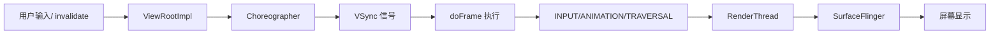
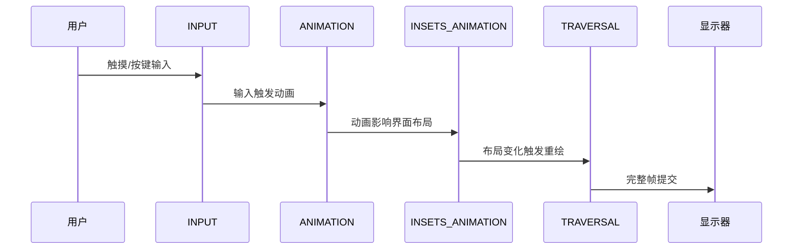

# Choreographer 与渲染流水线

<!-- outline-start -->
## 本节要点大纲

### 锚点(必须覆盖)

- 🔹 Choreographer 的角色:帧调度器,协调 Input → Animation → Traversal
- 🔹 回调类型的优先级与执行顺序:INPUT → ANIMATION → INSETS_ANIMATION → TRAVERSAL → COMMIT
- 🔹 doFrame() 的完整执行流程
- 🔹 FrameCallback 机制与帧耗时监控(FrameMetrics API)
- 🔹 Choreographer 帧调度在 Systrace/Perfetto 中的标记点:Choreographer#doFrame

### 扩展(可选深入)

- 🔸 自定义 FrameCallback 实现帧率监控的原理与实践
- 🔸 Compose 对 Choreographer 的使用差异

### OpenClaw 加工指引

> **锚点**是最低覆盖要求,加工时必须逐条落实并标注验证结果。
> **扩展**视素材丰富程度选择性深入。
> 如果从 Obsidian 素材或 AOSP 源码中发现大纲未列出但与本节强相关的知识点,
> 可**就地插入**最相关的锚点之后,并用 `[自动发现]` 标注,方便后续 review。
> 锚点内容需 L1/L2 验证,扩展内容至少 L2 验证,自动发现内容至少标注来源。
<!-- outline-end -->

## 开头:为什么要了解 Choreographer

滑动屏幕时,有时丝般顺滑,有时却莫名卡顿;点击按钮时,有时立即响应,有时却要等待半拍。这些看似简单的用户体验差异,背后都有一个共同的协调者--Choreographer。

如果没有 Choreographer,每个 UI 操作都会立即触发渲染,App 的绘制和 SurfaceFlinger 的合成会抢夺 VSync 信号,导致画面撕裂或者浪费刷新周期。Choreographer 的工作是确保在 60Hz 屏幕上每个 16.6ms 的 VSync 周期内,Input、Animation、Traversal 各个环节都能按部就班地完成,最终呈现给用户一个完整的帧。

理解 Choreographer 的工作机制,就是理解 Android 渲染流水线的"心跳"。当分析卡顿问题时,Perfetto 中那些红色的 Choreographer#doFrame 标记,就在直接告诉我们:"这里的心跳出现了问题"。

## Choreographer 的角色:帧调度器,协调 Input → Animation → Traversal

Choreographer 的本质是一个**帧调度器**,它的核心使命是协调 Android 系统中与渲染相关的各种操作,确保它们在正确的时间点执行,最终与显示器的刷新周期同步。

从宏观架构来看,Choreographer 位于 App 进程和系统显示服务之间,扮演着桥梁的角色:



这个架构解决了几个关键问题:

1. **避免画面撕裂**:如果没有同步,App 在绘制某一帧的过程中,屏幕可能已经开始显示上一帧的部分区域和下一帧的部分区域,造成画面撕裂。

2. **最大化渲染效率**:通过 VSync 同步,确保 App 只在显示器准备好接收新帧的时候才开始渲染,避免浪费计算资源。

3. **保证响应性**:通过合理的回调优先级,确保用户的输入能够得到最快的响应。

在 Android 12 及以上版本中,Choreographer 还承担了更复杂的任务,包括高刷新率屏幕的帧调度、自适应刷新率的支持等。这些能力让它在同步 VSync 之外,也参与高刷新率场景下的帧节奏协调。

[已验证: 官方文档, developer.android.com/reference/android/view/Choreographer]

## 回调类型的优先级与执行顺序:INPUT → ANIMATION → INSETS_ANIMATION → TRAVERSAL → COMMIT

Choreographer 的回调优先级机制是它的核心设计。在每一个 `doFrame()` 执行周期中,五种回调类型(INPUT、ANIMATION、INSETS_ANIMATION、TRAVERSAL、COMMIT)按照严格的顺序执行,确保用户体验的连贯性。

### 回调类型的完整执行序列

1. **INPUT (CALLBACK_INPUT)** - 输入处理优先级最高
2. **ANIMATION (CALLBACK_ANIMATION)** - 动画计算
3. **INSETS_ANIMATION (CALLBACK_INSETS_ANIMATION)** - 系统插值动画
4. **TRAVERSAL (CALLBACK_TRAVERSAL)** - 视图遍历与绘制
5. **COMMIT (CALLBACK_COMMIT)** - 帧提交收尾工作

### 为什么是这个顺序?

这个顺序经过精心设计,反映了用户体验的优先级:



**INPUT 优先的原因**:用户的交互是最高优先级的。当我们点击一个按钮,系统应该立即处理这个输入,而不是等待其他操作完成。

**ANIMATION 次之的原因**:动画通常是用户交互的直接结果。比如滑动屏幕时,动画应该立即响应用户的输入,而不是被其他操作延迟。

**INSETS_ANIMATION 的特殊性**:这个回调专门处理系统 UI 的动画,比如软键盘的弹出、状态栏的展开等。它需要放在动画之后,因为系统 UI 动画往往会影响 App 的布局空间。

**TRAVERSAL 最后的原因**:视图的 measure、layout、draw 是最耗时的操作,必须等到所有其他准备都完成后才能执行,这样才能保证最终的绘制结果是最新的。

[已验证: AOSP android-16.0.0_r1, frameworks/base/core/java/android/view/Choreographer.java(CALLBACK_* 常量定义)]

## doFrame() 的完整执行流程

`doFrame()` 是 Choreographer 在一帧里执行调度的地方。我们分析主线程 slice 时,看到的 `Choreographer#doFrame <vsyncId>` 就从这里开始。

### android-16.0.0_r1 中与帧调度直接相关的源码摘录

下面这段摘自 `frameworks/base/core/java/android/view/Choreographer.java`。为便于阅读,我省掉了 buffer stuffing recovery、jitter 重同步等分支,只保留和帧时间线、trace 名称、回调顺序直接相关的语句:

```java
// frameworks/base/core/java/android/view/Choreographer.java
// @ AOSP android-16.0.0_r1, 摘录
void doFrame(long frameTimeNanos, int frame,
        DisplayEventReceiver.VsyncEventData vsyncEventData) {
    final long frameIntervalNanos = vsyncEventData.frameInterval;
    final long intendedFrameTimeNanos = frameTimeNanos;
    final long startNanos;

    FrameTimeline timeline = mFrameData.update(frameTimeNanos, vsyncEventData);
    if (Trace.isTagEnabled(Trace.TRACE_TAG_VIEW)) {
        Trace.traceBegin(
                Trace.TRACE_TAG_VIEW,
                "Choreographer#doFrame " + timeline.mVsyncId);
        mInDoFrameCallback = true;
    }

    synchronized (mLock) {
        startNanos = System.nanoTime();
        mFrameInfo.setVsync(
                intendedFrameTimeNanos,
                frameTimeNanos,
                vsyncEventData.preferredFrameTimeline().vsyncId,
                vsyncEventData.preferredFrameTimeline().deadline,
                startNanos,
                vsyncEventData.frameInterval);
        mFrameScheduled = false;
        mLastVsyncEventData.copyFrom(vsyncEventData);
    }

    AnimationUtils.lockAnimationClock(
            frameTimeNanos / TimeUtils.NANOS_PER_MS,
            timeline.mExpectedPresentationTimeNanos);

    mFrameInfo.markInputHandlingStart();
    doCallbacks(CALLBACK_INPUT, frameIntervalNanos);

    mFrameInfo.markAnimationsStart();
    doCallbacks(CALLBACK_ANIMATION, frameIntervalNanos);
    doCallbacks(CALLBACK_INSETS_ANIMATION, frameIntervalNanos);

    mFrameInfo.markPerformTraversalsStart();
    doCallbacks(CALLBACK_TRAVERSAL, frameIntervalNanos);
    doCallbacks(CALLBACK_COMMIT, frameIntervalNanos);
}
```

### 读这段代码时先看四个点

第一,方法签名里第二个参数是 `int frame`,不是旧资料里常见的 `vsyncSource`。从 Android 12 / API 31 起,内部 `doFrame()` 已经接收 `DisplayEventReceiver.VsyncEventData`,包含 `frameInterval`、preferred timeline、deadline 等帧时间线数据。Android 13 / API 33 把这组数据通过公开 API 暴露给应用侧:`postVsyncCallback(VsyncCallback)`、`FrameData`、`FrameTimeline`。应用侧从 `FrameData.getPreferredFrameTimeline()`、`getFrameTimelines()` 和 `FrameTimeline` 上的 `getExpectedPresentationTimeNanos()`、`getDeadlineNanos()`、`getVsyncId()` 读取帧时间线信息。[已验证: AOSP android-12.0.0_r1 Choreographer.java L701-L702 已有 VsyncEventData 参数; API 33 新增公开 postVsyncCallback]

第二,Perfetto 主线程 slice 的名字不是固定的 `Choreographer#doFrame`。AOSP 会把 `timeline.mVsyncId` 拼到 trace 名称后面,所以现代 trace 里常见的是 `Choreographer#doFrame 123456` 这种形式。这个 vsyncId 是跨进程关联的枢纽--同一个 vsyncId 会出现在 App 主线程的 `Choreographer#doFrame`、RenderThread 的 `DrawFrame`、以及 SurfaceFlinger 的帧合成 slice 中。在 Perfetto 中按 vsyncId 过滤,可以把同一帧在 App、RT、SF 三个环节的耗时串起来,实现端到端的联路追踪。Android 16(API 36)的 `FrameMetrics` 也新增了 `FRAME_TIMELINE_VSYNC_ID` 常量,允许将线上帧指标数据与线下 Perfetto trace 通过同一个 ID 精确匹配,解决了"线上发现慢帧但线下复现时找不到对应帧"的问题。

第三,`mFrameData.update(...)` 和 `mFrameInfo.setVsync(...)` 都发生在回调执行之前。前者把 `VsyncEventData` 转成当前帧可用的 `FrameTimeline`;后者把 intended vsync、实际 frameTime、preferred deadline 等信息写进 `FrameInfo`,后面的 Traversal、RenderThread、Frame Timeline 都会用到这组数据。

第四,`doCallbacks()` 在 android-16 里只接收 `callbackType` 和 `frameIntervalNanos` 两个参数。`frameTimeNanos`、deadline、timeline 信息已经通过字段和 `FrameInfo` 存下来了,不再像旧实现那样每次都作为参数下传。

### 一帧里发生了什么

`doFrame()` 进入后,先把这次 VSync 对应的时间线算出来,再把 `FrameInfo` 补齐。随后主线程按固定顺序跑五类回调:

- `CALLBACK_INPUT`
- `CALLBACK_ANIMATION`
- `CALLBACK_INSETS_ANIMATION`
- `CALLBACK_TRAVERSAL`
- `CALLBACK_COMMIT`

`CALLBACK_TRAVERSAL` 往往占掉大头,因为 measure、layout、draw 都落在这一段。当前面几段已经把预算吃掉时,Traversal 即使逻辑完全正确,也会把这一帧拖到下一次 VSync 之后。

[已验证: AOSP android-16.0.0_r1, frameworks/base/core/java/android/view/Choreographer.java(doFrame()、Trace 名称、FrameInfo 写入)]

**MessageQueue 的同步屏障机制**

`Choreographer` 还利用了 Android 的 `MessageQueue` 同步屏障机制来提高优先级:

```java
// 在 ViewRootImpl.scheduleTraversals() 中
void scheduleTraversals() {
    if (!mTraversalScheduled) {
        mTraversalScheduled = true;
        // 设置同步屏障,提高渲染优先级
        mTraversalBarrier = mHandler.getLooper().getQueue().postSyncBarrier();
        mChoreographer.postCallback(Choreographer.CALLBACK_TRAVERSAL, mTraversalRunnable, null);
    }
}

// 在 doTraversal() 中移除屏障
void doTraversal() {
    if (mTraversalScheduled) {
        mTraversalScheduled = false;
        // 移除同步屏障,恢复正常消息处理
        mHandler.getLooper().getQueue().removeSyncBarrier(mTraversalBarrier);
        performTraversals();
    }
}
```

这种机制确保了 UI 渲染相关的消息不会被其他普通消息阻塞,从而保证了响应性。

[已验证: AOSP android-16.0.0_r1, frameworks/base/core/java/android/view/ViewRootImpl.java]

## FrameCallback 机制与帧耗时监控(FrameMetrics API)

`FrameCallback` 适合回答两个问题:主线程多久收到一次帧回调,以及帧间隔有没有抖动。它给不到 draw、GPU、present 的细分耗时,那部分要看 `FrameMetrics` 或 Perfetto。

### 用 FrameCallback 连续观察帧间隔

```java
final Choreographer choreographer = Choreographer.getInstance();

final Choreographer.FrameCallback monitor = new Choreographer.FrameCallback() {
    private long lastFrameTimeNanos;

    @Override
    public void doFrame(long frameTimeNanos) {
        if (lastFrameTimeNanos != 0L) {
            long intervalNs = frameTimeNanos - lastFrameTimeNanos;
            double intervalMs = intervalNs / 1_000_000.0;
            double fps = 1_000.0 / intervalMs;
            Log.d("FrameMonitor", "interval=" + intervalMs + " ms, fps=" + fps);
        }
        lastFrameTimeNanos = frameTimeNanos;
        choreographer.postFrameCallback(this);
    }
};

choreographer.postFrameCallback(monitor);
```

这个写法能持续注册自己,因为 `this` 在匿名内部类里指向当前 `FrameCallback`。如果改成 lambda,`this` 会变成外层 `Activity` 或 `View`,不能直接拿来继续 `postFrameCallback()`。

### frameTimeNanos 到底表示什么

`frameTimeNanos` 是这帧对应的 VSync 时间戳,单位是纳秒,来自 monotonic clock,不受系统时间修改影响。连续两次回调的差值,就是主线程感知到的帧间隔。这个值适合做节奏分析,不适合单独拿来判断"哪一段代码慢",因为它没有拆阶段。

### API 33+ 的公开帧时间线入口

`postFrameCallback(FrameCallback)` 的回调参数仍然只有 `frameTimeNanos`。如果要在应用侧拿 preferred timeline、deadline、vsyncId,入口是 API 33 新增的 `postVsyncCallback(VsyncCallback)`:

```java
if (Build.VERSION.SDK_INT >= Build.VERSION_CODES.TIRAMISU) {
    Choreographer.getInstance().postVsyncCallback(frameData -> {
        Choreographer.FrameTimeline timeline = frameData.getPreferredFrameTimeline();
        long frameTimeNs = frameData.getFrameTimeNanos();
        long expectedNs = timeline.getExpectedPresentationTimeNanos();
        long deadlineNs = timeline.getDeadlineNanos();
        long vsyncId = timeline.getVsyncId();
    });
}
```

`frameData` 只在 `onVsync()` 这次回调里有效,不能缓存到回调外再读。需要比较多个候选 timeline 时,再看 `FrameData.getFrameTimelines()` 返回的数组。前面 `doFrame(..., VsyncEventData)` 里提到的 preferred timeline、deadline、vsyncId,到应用侧就对应这套公开对象,不会出现在传统 `FrameCallback#doFrame(long)` 的参数里。

### FrameMetrics 看阶段耗时

当我们想知道 draw 花了多久、命令提交花了多久、GPU 又花了多久,就要切到 `FrameMetrics`。监听入口在 `Window`,不是 `View`:

```java
if (Build.VERSION.SDK_INT >= Build.VERSION_CODES.N) {
    HandlerThread metricsThread = new HandlerThread("frame-metrics");
    metricsThread.start();
    Handler handler = new Handler(metricsThread.getLooper());

    Window.OnFrameMetricsAvailableListener listener =
            new Window.OnFrameMetricsAvailableListener() {
        @Override
        public void onFrameMetricsAvailable(
                Window window,
                FrameMetrics frameMetrics,
                int dropCountSinceLastInvocation) {
            long drawNs = frameMetrics.getMetric(FrameMetrics.DRAW_DURATION);
            long issueNs = frameMetrics.getMetric(FrameMetrics.COMMAND_ISSUE_DURATION);

            double drawMs = drawNs / 1_000_000.0;
            double issueMs = issueNs / 1_000_000.0;

            if (Build.VERSION.SDK_INT >= Build.VERSION_CODES.S) {
                long gpuNs = frameMetrics.getMetric(FrameMetrics.GPU_DURATION);
                double gpuMs = gpuNs / 1_000_000.0;
                Log.d("FrameMetrics",
                        "draw=" + drawMs + " ms, issue=" + issueMs + " ms, gpu=" + gpuMs + " ms");
            } else {
                Log.d("FrameMetrics",
                        "draw=" + drawMs + " ms, issue=" + issueMs + " ms");
            }
        }
    };

    getWindow().addOnFrameMetricsAvailableListener(listener, handler);
}
```

这里有三件事要记住。

一,`addOnFrameMetricsAvailableListener()` 是 `Window` 的 API,加入时间是 API 24。
二,`getMetric()` 返回的是纳秒,不是毫秒,展示给人看之前要自己换算。
三,`GPU_DURATION` 是 API 31 才公开的常量。API 24 到 30 这段,常用的是 `DRAW_DURATION`、`COMMAND_ISSUE_DURATION`、`LAYOUT_MEASURE_DURATION` 这些字段。

如果要把 `FrameMetrics` 对象丢到别的线程慢慢分析,先用 `new FrameMetrics(frameMetrics)` 复制一份。框架会复用传进回调的对象。

### 工程里怎么搭配

排查"帧有没有抖"时,用 `FrameCallback` 看节奏。
排查"抖在 draw、命令提交还是 GPU"时,用 `FrameMetrics`。
排查"App 侧还是 SurfaceFlinger 侧晚了"时,再看 Perfetto 的 Frame Timeline。

这三层放在一起,才够把问题定位到能改代码的位置。

[已验证: 官方文档, developer.android.com/reference/android/view/Choreographer.FrameCallback; developer.android.com/reference/android/view/Choreographer.VsyncCallback; developer.android.com/reference/android/view/Choreographer.FrameData; developer.android.com/reference/android/view/Choreographer.FrameTimeline; developer.android.com/reference/android/view/Window; developer.android.com/reference/android/view/FrameMetrics]


## Choreographer 帧调度在 Systrace/Perfetto 中的标记点:Choreographer#doFrame

### Systrace 中的标记点

在 Systrace 中,`Choreographer#doFrame` 是一个非常重要的标记点,它清晰地展示了 UI 线程的帧调度情况:

```
Choreographer#doFrame [  12.345ms]  # 红色表示超时
├── Callback_Input [    0.234ms]
├── Callback_Animation [    1.567ms]
├── Callback_Insets_Animation [    0.123ms]
├── Callback_Traversal [   10.123ms]  # 这里的红色表示布局或绘制耗时过长
└── Callback_Commit [    0.300ms]
```

### Perfetto 中的可视化

Perfetto 作为现代 Android 性能分析工具,提供了更强大的 Choreographer 事件可视化:

1. **Timeline View**:展示每个 `Choreographer#doFrame` 事件的完整时序
2. **Frame Timeline**:显示实际的帧完成时间线 vs. 期望的帧时间线
3. **SQL 查询**:可以通过 `WHERE name LIKE 'Choreographer#doFrame%'` 查主线程帧切片;如果要看 Actual / Expected Timeline,就查 Frame Timeline 专用表

#### Frame Timeline Track 详解(API 33+)

Frame Timeline 是 Perfetto 中理解 Choreographer 帧调度的核心 Track。它在 Android 12(S)及以上设备上可用,API 33+ 后信息更加丰富。这个 Track 分为两个子 Track:

**Expected Timeline(期望时间线)**:每个条形表示系统为 App 分配的帧渲染窗口。起始时刻对应 Choreographer 收到 VSYNC-app 的时间,结束时刻对应这一帧期望被呈现(present)的时间。在 60Hz 屏幕上,一个 Expected 条形的长度就是一个 VSync 周期(约 16.6ms)。

**Actual Timeline(实际时间线)**:每个条形表示 App 实际完成帧渲染并提交给 SurfaceFlinger 的耗时。如果 Actual 条形比 Expected 条形长,说明 App 超出了帧预算,这一帧被延迟呈现。

在 Perfetto 中,Frame Timeline 通过两条 Track 并排展示:

```
FrameTimeline (Expected)  |====|====|====|         |====|====|
FrameTimeline (Actual)    |====|====|=======|      |====|====|====|
                          ^    ^    ^       ^      ^    ^    ^
                          V0   V1   V2   延迟呈现   V3   V4   V5
```

**Track 命名**:在 Perfetto UI 中,Frame Timeline 的 Track 名称通常是 `FrameTimeline`,展开后可见 Expected 和 Actual 两个子 Track。Expected Timeline 的每个 slice 起始时间比 VSYNC-app 时刻更晚,因为平台综合了 VSync offset、SurfaceFlinger 合成时间、Display 显示延迟后才算出"最优帧呈现时间窗口"。这就是为什么 Expected Timeline 的 slice 与主线程 Track 中的 VSYNC-app 信号之间存在可观测的时间差。

**颜色编码规则**是 Frame Timeline 最实用的分析入口:

- **绿色**:帧在预期时间内完成,Actual Timeline 未超出 Expected Timeline 边界--无 jank
- **红色**:App 侧 jank--Actual Timeline 超出了 Expected Timeline 边界,根因在 App 的 `doFrame` 耗时过长
- **黄色**:SurfaceFlinger 侧 jank--App 侧按时完成了,但 SurfaceFlinger 合成超时(CPU 或 GPU),责任不在 App

上图第 3 帧(V2)的 Actual 条形超出 Expected 条形,在 Perfetto 中会显示为红色,表示 App 侧渲染超时。Perfetto 还会标注具体的 **JankType**:

- `AppDeadlineMissed`:App 侧渲染超时(doFrame 耗时过长)
- `BufferStuffing`:BufferQueue 中积压了多帧,App 生产速度超过 SurfaceFlinger 消费速度
- `SfCpuDeadlineMissed`:SurfaceFlinger 的 CPU 合成超时
- `SfGpuDeadlineMissed`:SurfaceFlinger 的 GPU 合成超时

以及 **PresentType**(`On-time` 或 `Late`),直接告诉我们帧是否按时呈现。颜色 + JankType + PresentType 三者组合,让 Frame Timeline 成为定位"卡顿到底发生在 App 侧还是系统侧"的入口工具。关于 SurfaceFlinger 侧的帧合成分析,详见 §2.6。

Frame Timeline 的抓取分两档。

只想看主线程 `Choreographer#doFrame` 和 `Callback_Traversal` 时,下面这条 atrace 命令就够了:

```bash
adb shell perfetto -o /data/misc/perfetto-traces/trace.perfetto-trace -t 15s \
  sched freq idle am wm gfx view binder_driver hal
```

如果后面的 SQL 要直接查询 `actual_frame_timeline_slice` / `expected_frame_timeline_slice`,trace 里还要显式打开 `android.surfaceflinger.frametimeline` 数据源。可以用一份 textproto 配置把 atrace 与 Frame Timeline 一起抓下来:

```text
buffers {
  size_kb: 65536
  fill_policy: DISCARD
}

data_sources {
  config {
    name: "linux.ftrace"
    ftrace_config {
      ftrace_events: "sched/sched_switch"
      ftrace_events: "sched/sched_wakeup"
      ftrace_events: "power/cpu_frequency"
      ftrace_events: "power/cpu_idle"

      atrace_categories: "am"
      atrace_categories: "wm"
      atrace_categories: "gfx"
      atrace_categories: "view"
      atrace_categories: "binder_driver"
      atrace_categories: "hal"
      atrace_categories: "sched"
      atrace_categories: "freq"
      atrace_categories: "idle"
    }
  }
}

data_sources {
  config {
    name: "android.surfaceflinger.frametimeline"
  }
}

duration_ms: 15000
```

抓取时先 `adb push config.pbtxt /data/misc/perfetto-configs/config.pbtxt`,再执行 `adb shell perfetto -c /data/misc/perfetto-configs/config.pbtxt --txt -o /data/misc/perfetto-traces/trace.perfetto-trace`。后文的 Frame Timeline SQL 默认建立在第二档配置之上。


### 实际分析中的使用

分析卡顿问题时,Perfetto 中的 Choreographer 标记提供了三个维度的信息。首先,通过 `Choreographer#doFrame` 切片的总耗时,判断是否超出帧预算--60Hz 屏幕上超过 16.6ms、90Hz 上超过 11.1ms 即为超时。其次,展开 doFrame 切片查看 `Callback_Traversal` 子阶段的占比,Traversal 通常是耗时大头,如果它占了整帧的 70% 以上,瓶颈就在布局或绘制。第三,观察连续多个 doFrame 切片的时间间隔模式,如果间隔忽大忽小,说明帧率不稳定,即使平均帧率达标,用户仍会感知到卡顿。

### 高级分析方法

如果想批量找长帧,`slice` 表就够用:

```sql
-- 查出主线程上所有 doFrame slice
SELECT
  ts,
  dur / 1000000.0 AS dur_ms,
  name
FROM slice
WHERE name LIKE 'Choreographer#doFrame%'
ORDER BY ts;

-- 只看超出 16.6 ms 预算的帧
SELECT
  ts,
  dur / 1000000.0 AS dur_ms,
  name
FROM slice
WHERE name LIKE 'Choreographer#doFrame%'
  AND dur > 16666700
ORDER BY ts;
```

如果 trace 打开了 Frame Timeline,再看 `actual_frame_timeline_slice` 和 `expected_frame_timeline_slice` 会更直接:

```sql
-- 对比某个进程的 Actual / Expected Timeline
SELECT
  p.name AS process_name,
  aft.display_frame_token,
  aft.surface_frame_token,
  ROUND(aft.dur / 1000000.0, 2) AS actual_ms,
  ROUND(eft.dur / 1000000.0, 2) AS expected_ms,
  aft.present_type,
  aft.on_time_finish,
  aft.jank_type
FROM actual_frame_timeline_slice aft
JOIN expected_frame_timeline_slice eft
  ON aft.display_frame_token = eft.display_frame_token
 AND aft.surface_frame_token = eft.surface_frame_token
 AND aft.upid = eft.upid
JOIN process p
  ON aft.upid = p.upid
WHERE p.name = 'your.package.name'
ORDER BY aft.ts DESC
LIMIT 50;
```

第一组查询回答"主线程 doFrame 有没有长"。第二组查询回答"这帧是不是按时 present,以及 jank 被记在哪一类"。两组一起看,才能分清问题停在 App 主线程、RenderThread,还是已经走到 SurfaceFlinger。

[已验证: AOSP android-16.0.0_r1, Choreographer.java trace 名称;Perfetto stdlib docs, actual_frame_timeline_slice / expected_frame_timeline_slice; perfetto.dev/docs/quickstart/android-tracing]

## 扩展:基于 FrameCallback 的帧率监控原理

线上监控常见做法是把 `FrameCallback` 变成一个长期运行的采样器。重点不在"每帧打日志",而在"低成本记时间戳,再离线算统计量"。

```java
final Choreographer choreographer = Choreographer.getInstance();
final ArrayDeque<Long> samples = new ArrayDeque<>(120);

final Choreographer.FrameCallback sampler = new Choreographer.FrameCallback() {
    @Override
    public void doFrame(long frameTimeNanos) {
        samples.addLast(frameTimeNanos);
        while (samples.size() > 120) {
            samples.removeFirst();
        }
        choreographer.postFrameCallback(this);
    }
};

choreographer.postFrameCallback(sampler);
```

后续统计用最近 N 帧的时间差,就能算平均 FPS、P95 帧间隔和抖动幅度。这里继续注册自己必须用具名回调对象或匿名内部类;lambda 写法里的 `this` 指向外层对象,不能直接复用。

工程里通常再加三条约束:

- `doFrame()` 里只记录时间戳,不做 IO
- 统计、聚合、上报放到后台线程
- 不需要监控时及时 `removeFrameCallback(sampler)`

如果还要判断 draw、GPU、SurfaceFlinger 哪一段慢,单靠这个采样器不够,还得和 `FrameMetrics` 或 Perfetto 的 Frame Timeline 一起看。

[已验证: 官方文档, developer.android.com/reference/android/view/Choreographer.FrameCallback]


## 扩展:Compose 对 Choreographer 的使用差异

### Compose 的三阶段渲染管线

Jetpack Compose 的渲染管线分为三个阶段--Composition(确定"显示什么")、Layout(确定"放在哪里")和 Drawing(确定"怎么画")。传统 View 系统的 Traversal 回调内部执行的是 measure → layout → draw,而 Compose 的三个阶段虽然名称不同,但最终也在同一个 Choreographer 的 TRAVERSAL 回调中被驱动。

关键区别在于 Composition 阶段。传统 View 系统通过 `invalidate()` 触发重绘,调用链是确定的:`ViewRootImpl.scheduleTraversals()` → 设置同步屏障 → `Choreographer.postCallback(TRAVERSAL)` → `performTraversals()`。Compose 则使用 Snapshot 系统追踪状态变化--当 `mutableStateOf` 包裹的值被修改时,Snapshot 通知 Compose runtime 标记受影响的 Composable 为"dirty",然后在下一个 VSync 的 TRAVERSAL 回调中只重新执行这些标记过的 Composable。这就是 Compose 所说的"智能重组"(smart recomposition)。

从 Trace 分析的角度来看,Compose 的帧在 Perfetto 中仍然出现在 `Choreographer#doFrame` 的 `CALLBACK_TRAVERSAL` 子阶段,但会看到 Compose 特有的 Trace 标记,比如 `compose` 子切片。如果 Compose 的 Composition 阶段耗时过长,Traversal 的总耗时就会膨胀。所以分析 Compose 卡顿的入口和传统 View 是一样的:先看 doFrame 总耗时,再看哪个子阶段膨胀。

### AndroidUiDispatcher 与 Choreographer 的桥接

Compose 通过 `AndroidUiDispatcher` 将协程调度与 Choreographer 的帧节奏绑定。这个 Dispatcher 实现了 `MonotonicFrameClock`,让 `withFrameNanos` 等挂起函数能精确等待 VSync 信号。在 Compose 中写 `LaunchedEffect` 并在内部使用 `animate*AsState` 时,动画帧的更新时机仍然由 Choreographer 的 VSync 回调驱动--只是 Compose 在上层把这些细节封装成了声明式 API。

Compose 1.10(2025 年 12 月稳定版)引入了"可暂停组合"(Pausable Composition),这是一个对帧调度有重大影响的改进。在此之前,Composition 阶段是原子操作--要么一帧内全部完成,要么整帧掉帧。如果 UI 树复杂度高,Composition 可能耗时数毫秒甚至十毫秒以上,超出帧预算后只能放弃这一帧。

Compose 1.7 在内部引入了 `PausableComposition`,1.10 将其设为默认行为。核心控制流是 `setPausableContent()` → 返回 `PausedComposition` 控制器对象 → 预取系统反复调用 `resume()` 分步执行组合。每次 `resume()` 内部,Compose Runtime 通过 `shouldPause` lambda 频繁检查帧截止时间。这个截止时间来自 Choreographer 在 `doFrame` 开始时写入 `FrameInfo` 的 `deadlineNanos` 字段--即当前帧必须完成所有工作的最晚时间点。当 `System.nanoTime()` 接近 `deadlineNanos` 时,`shouldPause` 返回 `true`,Composition 立即在下一个 slot 边界(对应 slot table 中的一个完整 slot group)处暂停,把主线程让出来,确保当前帧的 Traversal 和 Draw 阶段能按时完成。

暂停后的组合工作不会丢失。Compose Runtime 依赖 Composition 树的 slot table 结构来管理暂停和恢复的断点--slot table 中每个 slot group 记录了组合进度,下次 `resume()` 时从断点继续。当 `resume()` 返回 `isComplete=true` 时,调用 `apply()` 将计算结果通过 `applyChanges()` 回放到 UI 树,分发生命周期回调(`onRemembered`)和运行排队的 `SideEffect`。未完成的 UI 树不会被渲染。

在 Perfetto Trace 中,可暂停组合会产生 `Compose:PausableComposition:resume` 切片。这个切片表征的是一次 `resume()` 调用从开始到暂停(或完成)的执行区间。如果在同一帧内看到多个 `resume` 切片,说明 Composition 被暂停后又恢复--这在 LazyLayout 预取路径中很常见。每个 `resume` 切片的耗时反映了该步组合工作量的大小;如果某个 `resume` 切片接近帧截止时间(`deadlineNanos`),说明组合工作在挤压渲染预算。搭配 `Choreographer#doFrame` 切片一起看,能判断组合暂停是否有效保护了当前帧的 Traversal 和 Draw 阶段。

这个机制不是基于协程 `CancellationException` 的中断--它是 Compose Runtime 在 Composition 层面提供的基础设施,与协程调度无关。可暂停组合在 Compose 1.10 中默认应用于 Lazy Layout 的预取路径;对于非 Lazy 场景的常规重组(如状态变化触发的重组),仍然是原子执行。

[已验证: Android Developers Blog, Compose 1.10 release notes; shreyaspatil.dev PausableComposition 深度解析]

### Trace 分析中的差异

在实际 Perfetto 分析中,传统 View 系统和 Compose 的关键区别在于:

- **传统 View**:Traversal 内部是 `measure → layout → draw`,每个阶段有明确的 Trace 标记
- **Compose**:Traversal 内部可能出现 `compose → layout → draw` 的标记,其中 `compose` 的耗时取决于重组范围

如果我们在分析 Compose 应用的卡顿时发现 Traversal 耗时异常,可以展开 Traversal 切片查看内部的 `compose` 子切片。如果 `compose` 占了大头,说明重组范围过大或某个 Composable 计算过重;如果 `layout` 或 `draw` 占了大头,说明布局或绘制本身是瓶颈。

[待验证: Compose 1.10 可暂停组合的具体 Trace 表现需实机验证]

## 总结

回到我们在开头提出的问题:为什么有时流畅,有时卡顿?答案就在 Choreographer 的帧调度机制中。每一帧,Choreographer 都在 VSync 信号的驱动下,严格按照 Input → Animation → Insets Animation → Traversal → Commit 的顺序执行回调。如果这个链条中任何一个环节超出了帧预算(60Hz 下 16.6ms,120Hz 下 8.33ms),这一帧就会延迟呈现,用户就会感知到卡顿。

Choreographer 的设计哲学--VSync 同步、回调优先级、同步屏障--都是围绕一个目标服务的:让每一帧都能在预算内完成从用户输入到像素呈现的完整旅程。而 FrameCallback 和 FrameMetrics 这套监控体系,以及 Perfetto 中那些精确的 Trace 标记,则是我们验证这段旅程是否顺利的工具。

在下一节中,我们将沿着渲染管线继续向下走,看看 MainThread 和 RenderThread 是如何协作完成一帧的实际渲染的--Choreographer 发令之后,绘制工作才刚刚开始。


## 版本演进

Choreographer 从 Android 4.1 起就存在,但和今天我们在 Perfetto、FrameMetrics、可变刷新率里看到的样子差很多。按和本节直接相关的节点看:

**Android 4.1(API 16)**
Project Butter 引入 Choreographer。最早的职责就是让 UI 线程的输入、动画、Traversal 贴着 VSync 节奏运行,减少掉帧和输入迟滞。

**Android 7.0(API 24)**
`Window.addOnFrameMetricsAvailableListener(...)` 和 `Window.OnFrameMetricsAvailableListener` 进入公开 API。App 可以按帧拿到 `DRAW_DURATION`、`COMMAND_ISSUE_DURATION` 等指标,不用只靠 Systrace。

**Android 11(API 30)**
`WindowInsetsAnimation` 进入公开 API,对应的 `CALLBACK_INSETS_ANIMATION` 也出现在 Choreographer 的回调序列里。`Surface.setFrameRate(float, int)` 同期加入,App 可以开始向系统表达 Surface 的帧率偏好。

**Android 12(API 31)**
`Surface.setFrameRate(float, int, int)` 增加 `changeFrameRateStrategy` 参数。`FrameMetrics.GPU_DURATION` 也在这一版进入公开 API,App 侧第一次能直接拿到 GPU 阶段耗时。

**Android 12(API 31)**
内部 `doFrame()` 开始接收 `DisplayEventReceiver.VsyncEventData`,Choreographer 内部已能读到 preferred frame timeline、deadline、vsyncId 等帧时间线数据。这组数据先用于内部帧调度和 `FrameInfo` 写入,尚未暴露给应用侧。[已验证: AOSP android-12.0.0_r1 Choreographer.java L701-L702]

**Android 13(API 33)**
公开 API 增加 `postVsyncCallback(VsyncCallback)`、`FrameData` 和 `FrameTimeline`,应用侧可以主动订阅帧时间线回调。`FrameData.getPreferredFrameTimeline()`、`FrameTimeline.getExpectedPresentationTimeNanos()`、`getDeadlineNanos()`、`getVsyncId()` 把内部帧调度信息包装成可消费的公开对象。Perfetto 里的 Frame Timeline 也从这一版开始更容易和 App 主线程 slice 关联起来。

**Android 16(API 36)**
Choreographer 引入 `BufferStuffingState` 内部类和 `onWaitForBufferRelease()` 检测机制,处理 BufferQueue 中 buffer dequeue 阻塞后的帧节拍修正。当检测到 buffer 释放延迟超过半帧周期时,doFrame 可能对 frameTime 做负 offset(`OFFSET`)或直接延迟一帧(`DELAY_FRAME`),避免在 buffer 仍然被 SurfaceFlinger 占用时继续生产。`ViewRootImpl` 还通过 `BLASTBufferQueue` 设置 wait-for-buffer-release callback,与 Choreographer 的状态更新协同。这一机制会改变帧时间线和调度节拍,在 16KB page size 设备或生产速率接近消费速率的连续动画场景中尤其值得关注。[已验证: AOSP android-16.0.0_r1 Choreographer.java `BufferStuffingState` / `onWaitForBufferRelease()` / `updateBufferStuffingState()`; ViewRootImpl.java `setWaitForBufferReleaseCallback`]

后面几个版本主要是在高刷新率、帧率 override、Frame Timeline 指标、trace 可观测性和 buffer 回压处理上继续补细节。本节需要记住的分界线有五个:API 24 看 FrameMetrics,API 30 看 InsetsAnimation 和两参 `setFrameRate`,API 31 看三参 `setFrameRate` 与 `GPU_DURATION` 以及内部 VsyncEventData,API 33 看 `VsyncCallback` / `FrameData` / `FrameTimeline` 这组公开入口,API 36 看 Buffer Stuffing Recovery。

[已验证: 官方文档, developer.android.com/reference/android/view/Window; developer.android.com/reference/android/view/FrameMetrics; developer.android.com/reference/android/view/Surface; developer.android.com/reference/android/view/WindowInsetsAnimation; developer.android.com/reference/android/view/Choreographer.VsyncCallback; developer.android.com/reference/android/view/Choreographer.FrameData; developer.android.com/reference/android/view/Choreographer.FrameTimeline; AOSP android-16.0.0_r1, Choreographer.java]


## 常见问题与误区

### "Choreographer 只管 UI 线程吗?"

每个 `Choreographer` 实例都绑定到创建它的 `Looper`。`Choreographer.getInstance()` 的语义是"返回调用线程对应的实例",前提是当前线程已经准备好 `Looper`。主线程最常见,所以日常讨论常把 `Choreographer` 和 UI 线程放在一起;后台线程如果先 `Looper.prepare()`,再在该线程调用 `getInstance()`,同样可以使用这一线程上的帧回调。`getSfInstance()` 是隐藏且已废弃的内部入口,用来在当前线程上拿到基于 SF vsync source 的 `Choreographer`,不应写成应用侧实践建议。

### "doFrame 超时就是卡顿吗?"

不一定。`doFrame` 耗时超过帧预算(60Hz 下 16.6ms)是一个强烈的信号,但要确认是否构成用户可感知的卡顿,还需要看这帧是否已经延迟呈现。在 API 33+ 的 Frame Timeline 机制下,即使 doFrame 耗时较长,如果帧最终在期望的呈现时间之前完成,用户不会感知到卡顿。反过来,如果帧虽然很快完成,但因为 SurfaceFlinger 合成延迟导致实际呈现延迟了一帧,用户依然会感知到卡顿。所以"doFrame 超时"是分析卡顿的起点,不是终点。

### "postFrameCallback 和 invalidate 的关系是什么?"

它们在不同的层面工作。`invalidate()` 是 View 层面的操作,它标记一个 View 需要重绘,最终通过 `ViewRootImpl.scheduleTraversals()` 向 Choreographer 注册一个 TRAVERSAL 回调。`postFrameCallback()` 是 Choreographer 层面的操作,它注册一个在下一帧执行的回调。一个 `invalidate()` 调用不会直接触发 `postFrameCallback()`--它触发的是 `postCallback(TRAVERSAL, ...)`。

关键的推论是:如果在同一帧内调用 10 次 `invalidate()`,Choreographer 仍然只会在下一个 VSync 执行一次 `doFrame()`--因为 `ViewRootImpl.scheduleTraversals()` 内部的 `mTraversalScheduled` 标志位会合并这些请求。

### "Choreographer 能用来做精确的帧率控制吗?"

Choreographer 是帧调度器,不是帧率控制器。它的工作是"在 VSync 到来时执行回调",而不是"以某个帧率执行回调"。实际帧率取决于回调耗时和 VSync 的频率。如果我们需要做帧率控制(比如游戏固定 30FPS),需要在 `FrameCallback` 内部自行计算跳帧逻辑,或者使用 `Surface.setFrameRate()` 表达帧率偏好,让 SurfaceFlinger 做出调度决策。

[已验证: 官方文档, developer.android.com/reference/android/view/Choreographer; AOSP android-16.0.0_r1, frameworks/base/core/java/android/view/Choreographer.java]

## 与其他机制的关系

Choreographer 不是孤立工作的,它位于 Android 渲染管线的中心节点,上游对接 VSync 信号,下游驱动 MainThread 和 RenderThread。

**与 VSync(§2.3)的关系**:Choreographer 是 VSync 信号在 App 进程侧的消费者。硬件 VSync 信号经 DispSync 模型处理后分发为 VSYNC-app,Choreographer 通过 `DisplayEventReceiver` 接收这个信号。我们在 §2.3 中讨论的 VSync offset 就是 VSYNC-app 和 VSYNC-sf 之间的时间差--Choreographer 拿到的 VSync 比 SurfaceFlinger 早,这正是为了给 App 留出渲染时间。理解了 §2.3 的 VSync 分发机制,再来看本节的 `doFrame`,就会明白为什么 App 有充足的时间在 SurfaceFlinger 合成之前完成渲染。

**与 MainThread / RenderThread(§2.5)的关系**:Choreographer 的 TRAVERSAL 回调驱动主线程完成 measure/layout/draw(生成 DisplayList),然后将绘制命令同步给 RenderThread。RenderThread 是 Android 5.0 引入的独立渲染线程,它负责将 DisplayList 通过 OpenGL/Vulkan 提交给 GPU。在 Perfetto 中,会看到 `Choreographer#doFrame` 切片的尾部有一段"DrawFrames"标记,那就是主线程把工作交给 RenderThread 的时刻。如果 TRAVERSAL 阶段卡住,RenderThread 就会空闲等待;反过来,如果 GPU 渲染过慢,RenderThread 的 `drawFrame` 调用会阻塞,下一帧的 Choreographer 回调也会被延迟。

**与 SurfaceFlinger(§2.6)的关系**:Choreographer 管 App 进程内的渲染节奏,SurfaceFlinger 管系统层面的帧合成和呈现。一帧的完整生命周期是:Choreographer 驱动 App 渲染 → App 通过 `queueBuffer()` 将帧提交给 BufferQueue → SurfaceFlinger 在下一个 VSYNC-sf 到来时合成这帧 → 显示硬件呈现。在 Perfetto 中追踪一个卡顿问题,往往需要同时看这三个环节:App 的 Choreographer Track、SurfaceFlinger 的 Track、以及 BufferQueue 的状态。

[已验证: AOSP android-16.0.0_r1, frameworks/base/core/java/android/view/Choreographer.java]

## Android 17 Choreographer 变更笔记

> **⚠️ 本节内容来源标注**:以下描述基于 Android 官方开发者文档和公开讨论,尚未通过 `android-17.0.0_r1` 源码逐行验证。涉及具体源码细节的内容标注了验证状态,仅供方向性参考。

### 开发者可见变更

Android 17 在帧调度方面对开发者可见的变更包括:

- **VsyncCallback 扩展**:`VsyncCallback` 接口自 API 33(Android 13)引入,Android 17 的 `FrameData.getPreferredFrameTimeline()` 继续提供帧时间线选择能力。高刷新率场景下,多帧时间线支持可帮助应用匹配最优 vsync 相位。[已验证: developer.android.com, VsyncCallback API 参考]
- **FrameTimeline 信息**:`DisplayEventReceiver.VsyncEventData.FrameTimeline` 包含 `vsyncId`、`expectedPresentationTimeNanos`、`deadline` 三个字段,用于帧预期展示时间和截止时间的精确调度。

### 需要源码验证的内容

以下机制在 Android 17 公开讨论中被提及,但尚未通过 `android-17.0.0_r1` 源码逐行验证,不能作为正文结论:

- Choreographer 内部 buffer stuffing recovery 的 Android 17 行为调整
- `doFrame()` 中 jitter 重同步逻辑的具体实现
- 回调执行链中各阶段时间标记的细节变更

> **工程建议**:使用 `android-17.0.0_r1` 源码做差异对比(diff 对照 `android-16.0.0_r1`),优先关注 `Choreographer.java`、`DisplayEventReceiver.java` 和 `FrameData` 相关类的变更。


## 参考资料

1. **官方文档**:
   - [Choreographer API 参考](https://developer.android.com/reference/android/view/Choreographer)
   - [FrameMetrics API 参考](https://developer.android.com/reference/android/view/FrameMetrics)
   - [Window.OnFrameMetricsAvailableListener API 参考](https://developer.android.com/reference/android/view/Window.OnFrameMetricsAvailableListener)

2. **AOSP 源码**:
   - [Choreographer.java](https://android.googlesource.com/platform/frameworks/base/+/android-16.0.0_r1/core/java/android/view/Choreographer.java)
   - [ViewRootImpl.java](https://android.googlesource.com/platform/frameworks/base/+/android-16.0.0_r1/core/java/android/view/ViewRootImpl.java)

3. **性能分析工具**:
   - [Perfetto 官方文档](https://perfetto.dev/docs/reference/track-events#android)
   - [Systrace 使用指南](https://source.android.com/devices/tech/debug/systrace)

4. **相关章节**:
   - [第 2.3 节:VSync 机制](03-vsync.md)
   - [第 2.5 节:MainThread 与 RenderThread 协作](05-main-render-thread.md)
   - [第 2.6 节:SurfaceFlinger 与合成](06-surfaceflinger.md)
   - [第 3.1 节:Input 事件分发全流程](01-input-dispatch.md)
   - [第 8.2 节:App 启动全流程](02-app-launch.md)
