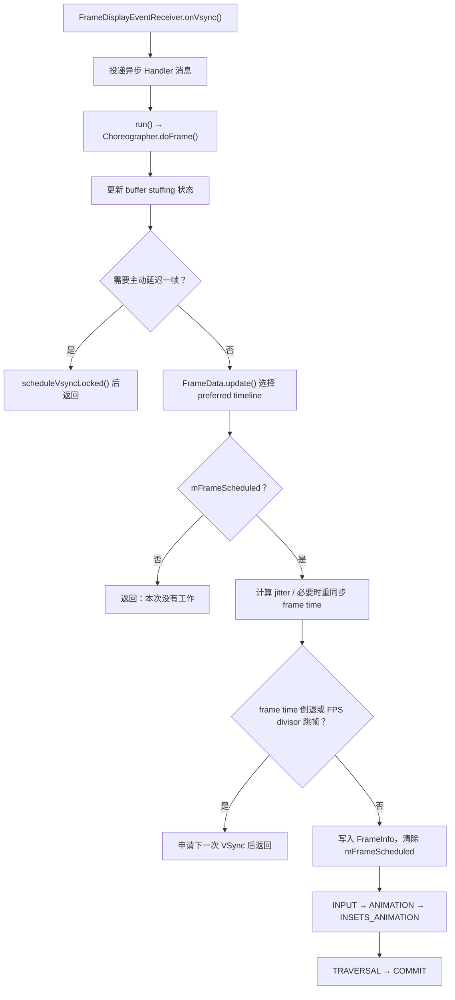

# 2.4 Choreographer 与渲染流水线

## Choreographer 管理“何时开始一帧”

Choreographer 是绑定到某个 `Looper` 的帧回调调度器。它把需要和显示节奏配合的工作分组，在一次 App VSync 到来后按固定阶段执行。

它负责：

- 合并同一 pending frame 的重复调度请求；
- 按需向 `DisplayEventReceiver` 申请下一次 VSync；
- 保存五类回调队列；
- 提供稳定的帧时间、候选 FrameTimeline、deadline 和 VSync ID；
- 在 `doFrame()` 中按阶段执行已经到期的回调；
- 检测迟到、帧时间倒退和 buffer stuffing recovery 条件。

它不负责：

- 直接读取触摸设备；
- 独自完成 View 的 measure、layout、draw；
- 在 RenderThread 上执行 GPU 绘制；
- 决定 SurfaceFlinger 采用哪块 buffer；
- 判断 panel 像素何时完成光学响应。

标准 View 窗口的一帧可以概括为：

```text
状态变化 / 输入 / 动画
  → ViewRootImpl 或其他组件注册帧回调
  → Choreographer 申请一次 App VSync
  → FrameDisplayEventReceiver 投递异步消息
  → Choreographer.doFrame()
  → INPUT → ANIMATION → INSETS_ANIMATION → TRAVERSAL → COMMIT
  → ViewRootImpl / HWUI / RenderThread 生产 buffer
  → SurfaceFlinger / HWC 完成合成与 present
```

这条路径说明 Choreographer 位于 App 生产阶段的起点。`doFrame()` 结束只表示这次 Looper 回调已经完成，不能证明 GPU、buffer、SurfaceFlinger 或显示后段已经完成。

---

## 一、Choreographer 与线程、Looper 的关系

### 1.1 每个实例绑定一个 Looper

`Choreographer.getInstance()` 使用 `ThreadLocal` 保存实例。当前线程必须已经有 `Looper`，否则会抛出 `IllegalStateException`。实例创建后，`FrameHandler` 和 `FrameDisplayEventReceiver` 都绑定到这个 Looper。

主线程是最常见的使用位置，但“Choreographer 只存在于主线程”不准确。带 Looper 的其他线程也能取得自己的实例。普通 App UI 的 `ViewRootImpl`、动画和窗口绘制仍主要由主线程实例驱动。

### 1.2 VSync 到达与回调执行之间还有 MessageQueue

系统侧 `EventThread("app")` 把 VSync event 发送到 App 的 `DisplayEventReceiver`。`FrameDisplayEventReceiver.onVsync()` 不会直接执行全部帧回调，而是创建一条异步 `Message`，按 VSync 时间戳投到绑定的 Handler。

Android 17 源码注释给出了消息顺序：

- 时间戳早于本次 VSync 的消息可以先执行；
- 没有更早消息时，VSync 消息可以立即处理；
- 若已有 pending VSync，源码会记录诊断信息，但仍更新待处理数据；
- VSync 时间戳若落在 `System.nanoTime()` 未来，会被修正为当前时间。

因此，系统侧出现 `VSYNC-app` 不等于目标线程已经进入 `doFrame()`。两者之间可能存在 Looper 排队、同步代码执行和 CPU 调度等待。

---

## 二、一帧是怎样被安排出来的

### 2.1 状态变化先注册工作

一帧通常由这些事件触发：

- View 调用 `invalidate()` 或 `requestLayout()`；
- 输入需要在显示节奏上批量消费；
- 属性动画、滚动或其他帧动画仍在运行；
- Window、Insets、可见性或几何状态变化；
- 应用主动注册 `FrameCallback` 或 `VsyncCallback`。

这些调用先把工作放进 Choreographer 的某个 `CallbackQueue`。队列按 `dueTime` 排序。回调已经到期时，Choreographer 安排一帧；延迟回调尚未到期时，先投递 `MSG_DO_SCHEDULE_CALLBACK`，到期后再判断是否需要安排一帧。

### 2.2 `mFrameScheduled` 合并重复请求

`scheduleFrameLocked()` 只在 `mFrameScheduled == false` 时继续：

```java
if (!mFrameScheduled) {
    mFrameScheduled = true;
    if (isRunningOnLooperThreadLocked()) {
        scheduleVsyncLocked();
    } else {
        Message msg = mHandler.obtainMessage(MSG_DO_SCHEDULE_VSYNC);
        msg.setAsynchronous(true);
        mHandler.sendMessageAtFrontOfQueue(msg);
    }
}
```

这段代码用于说明合并机制。多个组件在同一 pending frame 内注册工作，只会共享一次 VSync 申请。从其他线程安排帧时，Choreographer 先把异步消息放到所属 Looper 的队首，再由正确线程调用 `DisplayEventReceiver.scheduleVsync()`。

`mFrameScheduled` 只合并“一次 frame dispatch”，不会合并不同 callback queue 中的业务内容。每个到期 callback 仍会在对应阶段执行。

### 2.3 `scheduleVsync()` 请求单次脉冲

`DisplayEventReceiver.scheduleVsync()` 调用 native `nativeScheduleVsync()`。native connection 最终向 SurfaceFlinger EventThread 发出 `requestNextVsync()`，请求类型是单次 VSync。

如果动画还要继续，动画回调必须再次安排下一帧；如果 View 状态在本帧处理后又需要更新，`ViewRootImpl` 或相应组件也会再次注册工作。Choreographer 不会因为注册过一次回调就永久订阅每个显示周期。

---

## 三、ViewRootImpl、同步屏障与 Traversal

### 3.1 `scheduleTraversals()` 做了三件关键事情

Android 17 的 `ViewRootImpl.scheduleTraversals()` 在尚未安排 traversal 时：

```java
mTraversalScheduled = true;
postTraversalBarrier();
mChoreographer.postVsyncCallback(
        Choreographer.CALLBACK_TRAVERSAL, mTraversalCallback);
notifyRendererOfFramePending();
```

这段结构展示三个不同责任：

1. `mTraversalScheduled` 合并重复的布局/绘制请求；
2. `ViewRootImpl` 向主线程 MessageQueue 放置同步屏障；
3. traversal 以 `CALLBACK_TRAVERSAL` 类型的 `VsyncCallback` 注册到 Choreographer。

Android 17 的 `TraversalCallback.onVsync(FrameData)` 读取 `frameData.getFrameTimeNanos()`，然后进入 `doTraversal()` 和 `performTraversals()`。

### 3.2 同步屏障属于 ViewRootImpl 的调度策略

同步屏障会阻止屏障之后的普通同步消息继续执行，异步消息仍可穿过。Choreographer 的 VSync 调度消息和 `FrameDisplayEventReceiver` 消息会标记为异步，因此 traversal 能在屏障存在时获得执行机会。

常见表述“Choreographer 放置同步屏障”会把责任写错。放置和移除 traversal barrier 的是 `ViewRootImpl`；Choreographer 提供异步帧消息和 callback dispatch。

`doTraversal()` 开始时会清除 `mTraversalScheduled` 并移除屏障，再进入 `performTraversals()`。屏障忘记移除会阻塞普通消息，因此这部分代码对异常返回和取消路径很谨慎。

---

## 四、五类回调的顺序与边界

`doFrame()` 的固定顺序是：

```text
CALLBACK_INPUT
  → CALLBACK_ANIMATION
  → CALLBACK_INSETS_ANIMATION
  → CALLBACK_TRAVERSAL
  → CALLBACK_COMMIT
```

五类回调各自解决不同问题：

| 阶段 | Android 17 trace 子切片 | 主要工作 | 容易误解的地方 |
|------|--------------------------|----------|----------------|
| INPUT | `input` | 帧同步的 batched input 消费、重采样等 | 普通输入事件也可以在其他时机处理 |
| ANIMATION | `animation` | 属性动画、`FrameCallback`、公开 `VsyncCallback` 等 | 回调只推进状态，不保证一定产生新 buffer |
| INSETS_ANIMATION | `insets_animation` | 汇总系统栏、IME 等 Insets 动画更新 | 它位于 Animation 之后、Traversal 之前 |
| TRAVERSAL | `traversal` | ViewRoot traversal、measure/layout/draw、HWUI 交接 | 三项工作是否都执行取决于本帧状态 |
| COMMIT | `commit` | post-draw 收尾与提交后回调 | 该阶段观察到的 frame time 可能因前面迟到而调整 |

### 4.1 INPUT 不等于全部输入处理

普通输入经 `InputChannel` 到达应用后，可以由主线程异步处理。`ViewRootImpl.scheduleConsumeBatchedInput()` 注册 `CALLBACK_INPUT`，用于把一批 motion event 按本帧时间消费或重采样。

列表拖动时，手指仍在移动，INPUT 阶段常有 batched motion work；松手进入 fling 后，新输入减少，位移主要由 ANIMATION 阶段的滚动物理模型推进。INPUT 变短并不表示帧调度失效。

### 4.2 ANIMATION 包含两个公开入口

`postFrameCallback()` 把 `FrameCallback` 放进 `CALLBACK_ANIMATION`。公开的 `postVsyncCallback(VsyncCallback)` 也默认放进 ANIMATION；Android 17 另有隐藏重载，可指定 callback type。

这两个公开回调都是一次性的，执行后自动移除。连续动画或采样器需要在回调内再次注册。

### 4.3 INSETS_ANIMATION 为什么单独存在

Input 和普通 animation 都可能修改 Insets。Choreographer 在二者之后集中分发 `INSETS_ANIMATION`，把多个 ongoing inset animation 的更新汇总后再交给 View 系统。这样 Traversal 读取到的是本帧已经合并的 Insets 状态。

### 4.4 TRAVERSAL 不总是完整重走整棵树

`performTraversals()` 根据 layout request、窗口变化、dirty state 和绘制状态决定本帧是否执行 measure、layout、draw。硬件加速路径的 draw 主要更新 RenderNode/DisplayList 并进入 `syncAndDrawFrame()`；像素绘制和 GPU 提交由后续 HWUI/RenderThread 完成。

看到 `traversal` 较长，要继续展开内部 slice，区分：

- 大范围 measure/layout；
- DisplayList 重录；
- UI 线程业务回调；
- `syncAndDrawFrame()` 等待 RenderThread；
- 锁、Binder 或 buffer 相关等待。

### 4.5 COMMIT 的 frame time 可能更新

Choreographer 的注释明确指出：Traversal 若很重并跨过多个帧，COMMIT 阶段报告的 frame time 可以更新，以更接近这批 UI 状态开始生效的帧。监控代码若混用不同阶段的 frame time，可能把这种调整误判为时钟异常。

---

## 五、`doFrame()` 的完整执行流程

### 5.1 从 VSync event 到五阶段回调

下面的流程图把 Android 17 的关键分支放在一条线上：



收到 VSync event 后，`doFrame()` 仍可能因为没有待处理工作、正在恢复 buffer backlog、frame time 异常或 FPS divisor 而不执行五阶段回调。

### 5.2 FrameData 先选择 preferred timeline

`doFrame()` 先用传入的 `VsyncEventData` 更新 `mFrameData`。一次 VSync event 最多可携带多条候选 timeline，每条包含：

- `vsyncId`；
- `expectedPresentationTime`；
- 截止时间 `deadline`。

平台同时标记 `preferredFrameTimelineIndex`。如果主线程已经迟到，`FrameData.update()` 会在现有候选中寻找仍有效的 deadline；现有候选都过期时，还可能通过 `DisplayEventReceiver.getLatestVsyncEventData()` 向 SurfaceFlinger 查询新数据。该 Binder 查询只在需要新 timeline 时发生，源码也注明它可能较慢。

### 5.3 jitter 如何影响 frame time

`jitterNanos = System.nanoTime() - frameTimeNanos` 表示 `doFrame()` 开始时相对原始 VSync 时间的迟到量。迟到至少一个 `frameInterval` 时，Choreographer 会：

1. 计算跨过了多少个 interval；
2. 把用于动画的 frame time 对齐到最近一个有效边界；
3. 必要时切换 preferred timeline；
4. 超过日志阈值时打印 `Skipped N frames`。

`debug.choreographer.skipwarning` 的默认阈值是 30。它只控制日志警告，不能当作系统判定 jank 的唯一门槛。没有 `Skipped N frames` 日志，仍可能错过截止时间；出现日志也只能说明主线程回调严重迟到，不能单靠它确认显示端结果。

### 5.4 写入 FrameInfo 后才分发回调

通过迟到和时间单调性检查后，Choreographer 将下列数据写进 `FrameInfo`：

- intended VSync time；
- 当前用于动画/绘制的 frame time；
- preferred timeline 的 `vsyncId`；
- deadline；
- `doFrame()` 实际开始时间；
- 当前 `frameInterval`。

随后清除 `mFrameScheduled`，按顺序运行五类 callback。新的状态变化可以在当前 callback 执行期间再次安排下一帧。

### 5.5 `doFrame()` 结束仍处在 App 生产阶段

Traversal 可能把本帧状态交给 RenderThread，但以下工作可以继续发生：

- RenderThread 准备 RenderNode 树；
- GPU command submission 和执行；
- `dequeueBuffer()`/`queueBuffer()`；
- acquire fence signal；
- SurfaceFlinger transaction、latch 和 composition；
- HWC present 与显示后段。

因此，“`doFrame()` 用时小于刷新周期”不能证明这一帧按时显示。需要用 FrameMetrics、FrameTimeline、RenderThread 和显示侧证据继续判断。

---

## 六、帧时间：`frameTimeNanos`、deadline 与 expected present

### 6.1 `frameTimeNanos` 是稳定时间基准

`FrameCallback.doFrame(long frameTimeNanos)` 接收的是系统为本帧选定的帧时间，时间基准与 `System.nanoTime()` 一致。它可以早于回调开始执行的当前时间。同一 frame dispatch 中的所有回调共享这个稳定时间，有利于动画保持一致。

动画应根据帧时间计算进度，不要用“每次回调固定增加 16.6 ms”。刷新率可变、App render rate 可低于 display VSync rate，主线程也可能迟到或跳过候选 timeline。

### 6.2 deadline 回答“何时必须准备好”

`FrameTimeline.getDeadlineNanos()` 表示该候选帧必须就绪的时刻。它比“当前屏幕刷新周期是多少”更适合判断 App 是否命中预算，因为 App 唤醒 offset、SF 预算、刷新率和候选 timeline 都会影响 deadline。

### 6.3 expected present 回答“系统预计何时呈现”

`FrameTimeline.getExpectedPresentationTimeNanos()` 表示平台预计该 timeline 何时呈现。这个值属于预测时间，不代表 present fence 或实际显示结果。比较 expected 与 actual presentation，才能判断这一帧是否按计划显示。

### 6.4 VSync ID 是跨层关联键

`FrameTimeline.getVsyncId()` 用于把 HWUI 生产的帧与 SurfaceFlinger 保存的 timeline 数据关联起来。Android 17 的 trace slice 名为 `Choreographer#doFrame <vsyncId>`，RenderThread 和 SurfaceFlinger 的相应 slice 也会带 token。

一个 App VSync 可以携带多个候选 timeline，最终帧也可能丢弃或换到后续目标。不要把“第几个 VSync counter”当成跨进程关联键。

---

## 七、FrameCallback：适合观察 cadence，不等于显示帧率

### 7.1 连续采样必须主动续订

下面的 Kotlin 示例只测量 Choreographer callback 间隔，包含显式启停和去重：

```kotlin
class CallbackCadenceSampler(
    private val choreographer: Choreographer = Choreographer.getInstance(),
    private val onInterval: (Long) -> Unit,
) : Choreographer.FrameCallback {
    private var running = false
    private var lastFrameTimeNanos = 0L

    fun start() {
        if (running) return
        running = true
        lastFrameTimeNanos = 0L
        choreographer.postFrameCallback(this)
    }

    fun stop() {
        running = false
        choreographer.removeFrameCallback(this)
    }

    override fun doFrame(frameTimeNanos: Long) {
        if (!running) return
        if (lastFrameTimeNanos != 0L) {
            onInterval(frameTimeNanos - lastFrameTimeNanos)
        }
        lastFrameTimeNanos = frameTimeNanos
        if (running) {
            choreographer.postFrameCallback(this)
        }
    }
}
```

这段代码应在 Choreographer 所属 Looper 线程启停。它能观察 callback cadence、长间隔和节奏抖动，但不能回答 buffer 是否提交、GPU 是否完成、SF 是否 latch 或实际何时 present。回调自身也会给主线程增加工作，采样逻辑应保持轻量。

### 7.2 不要用固定阈值数“掉帧”

常见实现把间隔除以 `16_666_667`，再把商减一当作掉帧数。这个算法在 90/120 Hz、动态刷新率、ARR、App 帧率 override 和主动降帧场景都会误判。

如果只统计 callback 节奏，应同时记录当前 frame interval 或 display/render rate；如果目标是判断用户可见 jank，应使用 FrameTimeline、FrameMetrics 或 JankStats 等呈现相关数据。

---

## 八、VsyncCallback 与多候选 FrameTimeline

### 8.1 API 33+ 的公开入口

`postVsyncCallback()` 从 API 33 提供 `FrameData`。下面的示例在回调有效期内复制基础值：

```kotlin
Choreographer.getInstance().postVsyncCallback { data ->
    val preferred = data.preferredFrameTimeline
    val vsyncId = preferred.vsyncId
    val deadlineNanos = preferred.deadlineNanos
    val expectedPresentNanos = preferred.expectedPresentationTimeNanos
    record(vsyncId, deadlineNanos, expectedPresentNanos)
}
```

`FrameData` 和其中的 `FrameTimeline` 只在 `onVsync()` 回调期间有效。源码在回调前后切换 `mInCallback`，离开回调再访问会抛出 `IllegalStateException`。需要异步保存时，只复制 long 等基础值，不要缓存对象引用。

### 8.2 多条 timeline 用来表达可选目标

`getFrameTimelines()` 返回按时间排序的候选项，`getPreferredFrameTimeline()` 返回平台当前推荐项。多候选设计允许系统在高刷新率、不同 render cadence 或主线程迟到时表达后续合法呈现目标。

应用通常遵循 preferred timeline。低延迟渲染器或系统组件若要选择其他 timeline，需要同时理解 buffer 提交与 SurfaceFlinger 的 token 约定；只改变业务动画时间不能改变系统实际采用的 display frame。

---

## 九、FrameMetrics：观察 Window 帧的阶段耗时

### 9.1 FrameCallback 与 FrameMetrics 解决不同问题

| 工具 | 观察起点 | 能回答 | 不能单独回答 |
|------|----------|--------|--------------|
| `FrameCallback` | Choreographer callback | 回调间隔、主线程帧节奏 | GPU/present、具体阶段耗时 |
| `VsyncCallback` | App VSync dispatch | deadline、expected present、VSync ID | actual present、Window 各阶段耗时 |
| `FrameMetrics` | 硬件加速 Window 已渲染帧 | input/animation/layout/draw/sync/GPU/total/deadline | 独立 Surface 内容、panel 光学完成 |
| Perfetto FrameTimeline | App SurfaceFrame 与 SF DisplayFrame | expected/actual、jank type、present type、跨层 token | 未采集的 vendor/面板细节 |

### 9.2 关键指标怎么读

`FrameMetrics` 从 API 24 开始提供 Window 帧指标。常用字段包括：

- `INPUT_HANDLING_DURATION`；
- `ANIMATION_DURATION`；
- `LAYOUT_MEASURE_DURATION`；
- `DRAW_DURATION`；
- `SYNC_DURATION`；
- `COMMAND_ISSUE_DURATION`；
- `SWAP_BUFFERS_DURATION`；
- `TOTAL_DURATION`；
- `INTENDED_VSYNC_TIMESTAMP` 与 `VSYNC_TIMESTAMP`；
- API 31 的 `GPU_DURATION` 和 `DEADLINE`；
- API 36 的 `FRAME_TIMELINE_VSYNC_ID`。

`TOTAL_DURATION` 不一定等于各阶段相加，因为部分阶段可以并行。官方 API 契约指出，`TOTAL_DURATION < DEADLINE` 表示 App 在分配的 Window 帧预算内完成；这仍不能替代 SF/DisplayHAL 的 actual present 判断。

### 9.3 Listener 中先复制再异步处理

下面的写法展示正确的对象生命周期：

```kotlin
window.addOnFrameMetricsAvailableListener(
    { _, metrics, droppedReports ->
        val snapshot = FrameMetrics(metrics)
        metricsWorker.execute {
            consume(snapshot, droppedReports)
        }
    },
    metricsHandler,
)
```

回调传入的 `FrameMetrics` 对象会复用，离开回调后不能继续持有原引用。监听器执行太慢还会丢报告，`droppedReports` 必须一并记录。回调线程只负责复制与入队，聚合、日志和上报放到其他线程。

### 9.4 适用范围

FrameMetrics 面向某个硬件加速 Window。`SurfaceView`、视频、Camera、游戏引擎等可能有独立 Surface 和生产节奏；宿主 Window 的 FrameMetrics 不能代表这些内容 layer 的每一帧。此类场景要结合对应 Producer、layer 和 FrameTimeline。

---

## 十、在 Perfetto 中定位 Choreographer 问题

### 10.1 先看哪些轨迹

Android 17 常见证据包括：

- App 主线程：`Choreographer#doFrame <vsyncId>`；
- doFrame 子阶段：`input`、`animation`、`insets_animation`、`traversal`、`commit`；
- RenderThread：`DrawFrame` 及同一 token；
- App FrameTimeline：Expected 与 Actual；
- SurfaceFlinger FrameTimeline：DisplayFrame Expected 与 Actual；
- `BufferTX - <layerName>`、buffer/fence 相关轨迹；
- `sched_wakeup`、`sched_switch`、Running/Runnable/Sleeping 状态。

trace 配置、平台版本和设备实现会影响轨迹是否出现。没有某条 counter 时，先检查数据源，不要用名称猜测机制失效。

### 10.2 Expected 与 Actual 怎么读

Perfetto FrameTimeline 从 Android 12 开始可用：

- App Expected slice 表示系统给 App 生产目标帧的预算窗口，起点是 Choreographer callback 计划运行的时刻；
- App Actual slice 从 `Choreographer#doFrame` 或 NDK VSync callback 实际开始，结束时间取 GPU 完成与 buffer post 中更晚者；
- SF Actual slice 覆盖 SF 工作以及其下方 Composer/DisplayHAL 到 on-screen update 的显示栈区间；
- App SurfaceFrame 与 SF DisplayFrame 可通过 token 和 flow 关联。

Expected slice 长度不保证等于一个固定显示周期。App/SF work budget、刷新率和 timeline 选择都会影响它。

### 10.3 一条可复用的 SQL

下面的查询用于列出目标进程的 App Actual FrameTimeline：

```sql
SELECT
  p.name AS process_name,
  a.ts,
  a.dur,
  a.surface_frame_token,
  a.display_frame_token,
  a.jank_type,
  a.on_time_finish,
  a.present_type,
  a.layer_name
FROM actual_frame_timeline_slice AS a
JOIN process AS p USING (upid)
WHERE p.name = 'com.example.app'
ORDER BY a.ts;
```

查询结果提供逐帧 token、jank 分类和 layer。把包名换成目标进程后，再用 `surface_frame_token` 回到 UI 选择对应 slice，查看流向哪一个 DisplayFrame。

### 10.4 常见现象的证据解释

| 现象 | 先检查 | 可能原因 |
|------|--------|----------|
| `VSYNC-app` 已出现，`doFrame` 晚 | Looper 早期消息、Runnable 等待、长任务、锁、Binder、GC | callback 尚未得到执行机会 |
| `doFrame` 很长 | 五个子阶段和内部 slice | input/animation/traversal/RenderThread 同步成本 |
| `doFrame` 不长，App Actual 很长 | RenderThread、GPU、`queueBuffer` | App 后半段仍未完成 |
| App on-time，SF Actual 晚 | SF CPU/GPU、HWC、DisplayHAL | 系统显示侧错过目标 |
| callback cadence 平稳，FrameTimeline 高延迟 | Expected/Actual 整体偏移、buffer backlog | 帧率平稳但输入到显示延迟增加 |
| 一次 token 对应多个 App Actual slice | `layer_name`、`is_buffer` | 同一进程更新多个 Surface/layer |

### 10.5 不要把所有 `doFrame` 长度和刷新周期硬比较

“60 Hz 超过 16.6 ms 就算 jank”只适合做粗筛。现代设备可能运行 90/120 Hz、动态刷新率、ARR 或 App frame-rate override；App deadline 也不等于裸显示周期。

逐帧判断优先使用：

1. Expected timeline 的 deadline；
2. App Actual 的 `on_time_finish`、`jank_type`；
3. SF Actual 的 present 结果；
4. 同一 token 的线程、GPU、buffer 和 display 证据。

---

## 十一、缓冲积压恢复

### 11.1 它处理的是队列积压后的延迟

Android 17 的标准 HWUI/BLAST 路径会把等待 buffer release 的时长回传给 Choreographer：

```text
BBQBufferQueueProducer::waitForBufferRelease() 统计等待时长
  → BLASTBufferQueue → CanvasContext/HardwareRenderer callback
  → ViewRootImpl 绑定 Choreographer.onWaitForBufferRelease()
  → 等待时长超过上一帧 interval 的一半
  → 标记 buffer stuffed
```

`BBQBufferQueueProducer` 是 Android 17 标准 App Window 的 BLAST Producer 实现。它在没有 free buffer、`dequeueBuffer()` 必须等待 release 时进入这条路径。`onWaitForBufferRelease()` 只负责设置状态，具体动作在后续 `doFrame()` 开始时由 `updateBufferStuffingState()` 决定。

### 11.2 恢复动作有 DELAY_FRAME 和 OFFSET

当系统判定需要恢复时：

- `DELAY_FRAME`：主动申请下一次 VSync 并结束本次 `doFrame()`，给队列消费留时间；
- `OFFSET`：恢复期间把动画时间线向前偏移一个 frame interval；
- `NONE`：无需动作或恢复已经结束。

相关 aconfig flag 可以控制同一段动画是否多次恢复，以及累计主动延迟是否受 100 ms 阈值限制。设备上的 flag 取值必须从配置或 trace 确认。

状态机需要分清四个量：`isStuffed` 只表示 RenderThread 一侧刚报告过一次长 release wait，`isRecovering` 表示 App 帧时间线仍在恢复，`numberWaitsForNextVsync` 统计主动或被动等待过的 VSync 次数，`accumulatedDelayNanos` 只累计 `DELAY_FRAME` 带来的动画延迟。它们都不是 BufferQueue depth 或被占用 buffer 数。

首次进入恢复时，`DELAY_FRAME` 会跳过本轮 input、animation、traversal 和 commit callback，安排下一次 VSync。恢复期的 `OFFSET` 只把交给 `FrameData.update()` 的 frame time 减去一个 interval；硬件 VSync、真实唤醒和 present 时间不会倒退。系统发现自上一次未偏移 callback 以来已有足够长的自然空闲后，才清理恢复状态。

Android 17 有两个独立 flag：`buffer_stuffing_multi_recovery` 允许同一动画内多次主动 delay，`buffer_stuffing_recovery_threshold` 启用时用 100 ms 限制累计主动延迟。源码中存在常量不等于量产设备一定开启对应分支。

Choreographer recovery 与 FrameTimeline 的 `BufferStuffing` jank bit 也不是同一事件。前者来自标准 HWUI/BLAST producer 的 release wait callback；后者由 SurfaceFlinger 根据 predicted/actual finish、latch 和 present 关系分类。独立 SurfaceView、Camera、Codec 或自建 renderer 可能发生 queue stuffing，却没有主 Choreographer recovery trace。

Perfetto 可搜索：

- `Buffer stuffing recovery`；
- `buffer stuffed`；
- `Negative offset`；
- `dequeueBuffer` 等待；
- FrameTimeline 的 `Buffer Stuffing` jank type。

看到主动 delay 时，不能把这帧简单归因于主线程计算慢。还要检查 backlog 是否下降、后续输入延迟是否恢复。

---

## 十二、Compose 与 Choreographer 的关系

### 12.1 Compose 有自己的阶段，但仍使用 Android 帧时钟

Compose 官方把 UI 更新分为：

1. 组合（Composition）：决定显示哪些 UI；
2. 布局（Layout）：测量与放置；
3. 绘制（Drawing）：绘制内容。

Compose runtime 使用帧时钟推进动画和需要按帧运行的状态，Android 宿主最终仍参与 ViewRoot/HWUI 的窗口生产路径。纯 Compose 窗口通常与 View 页面共享 App Window、RenderThread、BLAST、SurfaceFlinger 和 HWC 后半段。

### 12.2 不要把 Compose 三阶段强行等同于 Choreographer 五阶段

Choreographer 的五类 callback 是 Android Looper 上的调度分类；Compose 的 Composition/Layout/Drawing 是 UI runtime 的工作阶段。二者粒度不同。

一次 Compose 状态变化可能：

- 触发 recomposition；
- 只触发 relayout；
- 只触发 redraw；
- 因状态读取位置不同而跳过前面的阶段。

不能写成“Compose 的三阶段始终全部位于一个固定 Traversal 子切片”。trace 中要同时看 `Choreographer#doFrame`、Compose tracing、宿主 traversal 和 RenderThread。

### 12.3 Platform 与 Jetpack 版本要分别记录

Android 17 / API 37 的 platform tag 不能确定 App 使用的 Compose runtime、compiler plugin、Kotlin 或 BOM 版本。同一系统镜像可以运行多种 Compose 版本。

做性能对比时至少记录：

- Android build/tag 与 vendor build；
- Compose Runtime/UI 与 BOM 版本；
- Kotlin 与 Compose compiler plugin；
- debug、profileable 或 release 构建；
- 是否开启 composition tracing；
- 刷新率、热状态和测试输入。

没有这些条件，Compose slice 的跨版本差异很难归因。

---

## 十三、常见误区

### 误区 1：一次 `invalidate()` 对应一次 VSync

`ViewRootImpl.mTraversalScheduled` 和 `Choreographer.mFrameScheduled` 都会合并重复请求。多次失效可以共享一次 traversal 和一次 VSync 申请。

### 误区 2：每个 VSync 都会执行 `doFrame()`

App 按需申请单次 VSync。没有 pending frame 时不会持续执行；收到 event 后也可能因无工作、buffer recovery、frame time 检查或 FPS divisor 提前返回。

### 误区 3：INPUT 阶段处理所有触摸事件

普通输入可以异步处理。Choreographer INPUT 重点包含 batched motion event 的帧同步消费和重采样。

### 误区 4：`FrameCallback` 就是帧率监控的完整答案

它只能观察 callback cadence。用户可见帧率和 jank 还涉及 RenderThread、GPU、buffer、SF 与 present。

### 误区 5：`doFrame()` 超过显示周期就一定掉帧

deadline、候选 timeline 和后半段执行共同决定结果。使用 FrameTimeline 的 expected/actual 和 jank type 判断具体帧。

### 误区 6：同步屏障由 Choreographer 插入

标准窗口 traversal barrier 由 `ViewRootImpl` 插入和移除；Choreographer 的异步消息能够穿过屏障。

### 误区 7：COMMIT 表示 buffer 已显示

COMMIT 是 App callback 阶段。buffer 生产、SF 合成、HWC present 和 panel 显示仍在后面。

---

## 十四、版本演进

| 版本 | 与 Choreographer 相关的变化 | 分析影响 |
|------|------------------|----------|
| Android 4.1 / API 16 | Project Butter 引入 Choreographer | App 输入、动画和 traversal 开始围绕 VSync 调度 |
| Android 7.0 / API 24 | FrameMetrics 公开 | 可按 Window 帧观察阶段耗时 |
| Android 8.0 / API 26 | FrameMetrics 增加 intended/actual VSync 时间 | 可识别 UI 线程未及时响应 intended VSync |
| Android 10 / API 29 | Choreographer 已包含独立的 Insets animation callback 类别 | 五阶段顺序包含 `INSETS_ANIMATION` |
| Android 12 / API 31 | SurfaceFlinger/Perfetto FrameTimeline 可用；FrameMetrics 增加 GPU duration/deadline | App 与 SF 可以按 token 分析 expected/actual；此时还没有 API 33 的公开 `Choreographer.FrameData` |
| Android 13 / API 33 | 公开 `VsyncCallback`、`FrameData`、`FrameTimeline` | App 可读取候选 timeline、deadline 和 VSync ID |
| Android 16 / API 36 | FrameMetrics 公开 `FRAME_TIMELINE_VSYNC_ID` | 线上 Window 指标更容易与 trace token 关联 |
| Android 17 / API 37 | 源码基线；五类 callback、多 timeline、buffer stuffing recovery 均按 `android-17.0.0_r1` 核验 | 不把当前实现倒推成 Android 17 首次新增 |

版本表只声明有公开 API 或旧 tag 证据的起点。Android 17 当前存在的内部方法，不自动等于该版本新增。

---

## 十五、Framework 与 kernel 的排查边界

Choreographer 位于用户态 framework，不直接决定线程何时获得 CPU。`FrameDisplayEventReceiver` 已投递异步消息后，目标线程仍可能处于：

- Running：正在执行其他代码；
- Runnable：已经可运行，但在 runqueue 等待；
- Sleeping/Blocked：等待锁、futex、Binder、buffer 或其他资源。

Framework 源码回答“回调何时被安排、按什么顺序执行”；kernel 调度轨迹回答“线程何时被唤醒、何时被调度上 CPU”。kernel 行为以 `android17-6.18-2026-06_r6` 为准，通用入口是 `kernel/sched/core.c` 和 `kernel/sched/fair.c`。

Perfetto 中看到 wakeup 到运行的长间隔时，再检查优先级、CFS 调度、CPU contention、cpuset/uclamp 和热状态。没有对应 trace 或设备配置，不能仅凭 `doFrame()` 起点晚就推断厂商调度策略。

---

## 十六、排查清单

遇到 Choreographer 相关卡顿时，按下面顺序核对：

- 本帧由什么状态变化或 callback 触发？
- `mFrameScheduled` 前是否已有 pending frame？
- `FrameDisplayEventReceiver.onVsync()` 到 `doFrame()` 之间等了多久？
- 目标线程在等待 Looper、CPU、锁、Binder 还是 buffer？
- preferred timeline 的 deadline 与 expected present 是多少？
- `doFrame()` 是否发生 jitter 重同步、frame time 倒退或主动 delay？
- INPUT、ANIMATION、INSETS_ANIMATION、TRAVERSAL、COMMIT 哪一段变长？
- Traversal 内是 measure/layout/draw，还是 `syncAndDrawFrame()` 等待？
- App Actual 是否按时结束？GPU 与 buffer post 谁更晚？
- SF DisplayFrame 是否按时 present？
- 是否出现 `Buffer Stuffing`，恢复动作后 backlog 是否下降？
- 当前刷新率、render rate、Compose 版本和 trace 配置是否与对照组一致？

---

## Android 17 的 Choreographer 调度边界

1. Choreographer 是绑定 Looper 的帧回调调度器，负责安排 App 帧起点，不负责后续显示完成。
2. callback 先进入五个队列，`mFrameScheduled` 合并同一 pending frame 的 VSync 申请。
3. 标准 View traversal 的同步屏障由 `ViewRootImpl` 管理，异步 VSync 消息可以穿过屏障。
4. 五阶段顺序固定为 INPUT、ANIMATION、INSETS_ANIMATION、TRAVERSAL、COMMIT；各阶段是否有工作取决于到期 callback。
5. `doFrame()` 还会处理 timeline 选择、jitter、frame time 单调性、FPS divisor 和 buffer stuffing recovery。
6. `frameTimeNanos` 是稳定动画时间，deadline 与 expected present 分别描述 ready 约束和呈现目标。
7. `FrameCallback` 适合观察 callback cadence；FrameMetrics 和 Perfetto FrameTimeline 提供更完整的 Window 与呈现证据。
8. Compose 的 UI 阶段与 Choreographer callback 分类粒度不同，Platform 和 Jetpack 版本需要分别记录。

---

## 参考资料

- AOSP `android-17.0.0_r1`：`core/java/android/view/Choreographer.java`
- AOSP `android-17.0.0_r1`：`core/java/android/view/DisplayEventReceiver.java`
- AOSP `android-17.0.0_r1`：`core/java/android/view/ViewRootImpl.java`
- AOSP `android-17.0.0_r1`：`graphics/java/android/graphics/HardwareRenderer.java`
- AOSP `android-17.0.0_r1`：`libs/hwui/renderthread/CanvasContext.cpp`
- AOSP `android-17.0.0_r1`：`core/java/android/view/FrameMetrics.java`
- AOSP `android-17.0.0_r1`：`core/java/android/view/Window.java`
- AOSP `android-17.0.0_r1`：`frameworks/native/services/surfaceflinger/Scheduler/EventThread.cpp`
- AOSP `android-17.0.0_r1`：`frameworks/native/libs/gui/DisplayEventReceiver.cpp`
- AOSP `android-17.0.0_r1`：`frameworks/native/libs/gui/BLASTBufferQueue.cpp`
- Android common kernel `android17-6.18-2026-06_r6`：`kernel/sched/core.c`、`kernel/sched/fair.c`
- [Choreographer API](https://developer.android.com/reference/android/view/Choreographer)
- [Choreographer.FrameData API](https://developer.android.com/reference/android/view/Choreographer.FrameData)
- [Choreographer.FrameTimeline API](https://developer.android.com/reference/android/view/Choreographer.FrameTimeline)
- [FrameMetrics API](https://developer.android.com/reference/android/view/FrameMetrics)
- [Perfetto FrameTimeline](https://perfetto.dev/docs/data-sources/frametimeline)
- [Jetpack Compose phases](https://developer.android.com/develop/ui/compose/phases)
