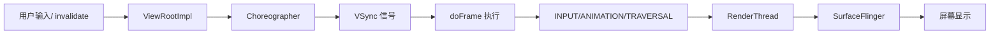
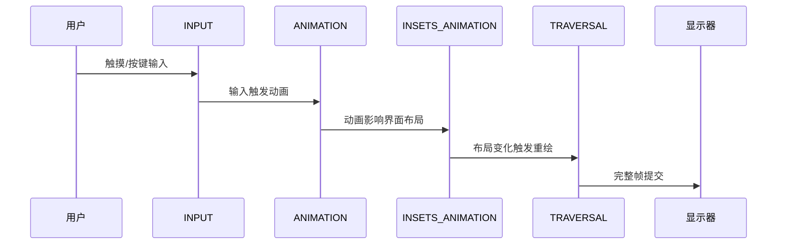

# Choreographer 与渲染流水线

<!-- outline-start -->
## 本节要点大纲

### 锚点（必须覆盖）

- 🔹 Choreographer 的角色：帧调度器，协调 Input → Animation → Traversal
- 🔹 四种回调类型的优先级与执行顺序：INPUT → ANIMATION → INSETS_ANIMATION → TRAVERSAL
- 🔹 doFrame() 的完整执行流程
- 🔹 FrameCallback 机制与帧耗时监控（FrameMetrics API）
- 🔹 Choreographer 帧调度在 Systrace/Perfetto 中的标记点：Choreographer#doFrame

### 扩展（可选深入）

- 🔸 自定义 FrameCallback 实现帧率监控的原理与实践
- 🔸 Compose 对 Choreographer 的使用差异

### OpenClaw 加工指引

> **锚点**是最低覆盖要求，加工时必须逐条落实并标注验证结果。
> **扩展**视素材丰富程度选择性深入。
> 如果从 Obsidian 素材或 AOSP 源码中发现大纲未列出但与本节强相关的知识点，
> 可**就地插入**最相关的锚点之后，并用 `[自动发现]` 标注，方便后续 review。
> 锚点内容需 L1/L2 验证，扩展内容至少 L2 验证，自动发现内容至少标注来源。
<!-- outline-end -->

## 开头：为什么要了解 Choreographer

当我们滑动屏幕时，为什么有时流畅如丝，有时却会出现卡顿？当我们点击按钮时，为什么有时响应立即，有时却需要等待？这些看似简单的用户体验差异，背后都隐藏着一个至关重要的协调者——Choreographer。

如果没有 Choreographer，每个 UI 操作都会立即触发渲染，App 的绘制和 SurfaceFlinger 的合成会抢夺 VSync 信号，导致画面撕裂或者浪费刷新周期。而有了 Choreographer，它就像一个精准的指挥家，确保在 60Hz 屏幕上每个 16.6ms 的 VSync 周期内，Input、Animation、Traversal 各个环节都能按部就班地完成，最终呈现给用户一个完整的帧。

理解 Choreographer 的工作机制，就是理解 Android 渲染流水线的"心跳"。当你遇到卡顿问题时，Perfetto 中那些红色的 Choreographer#doFrame 标记，就在直接告诉你："这里的心跳出现了问题"。

## Choreographer 的角色：帧调度器，协调 Input → Animation → Traversal

Choreographer 的本质是一个**帧调度器**，它的核心使命是协调 Android 系统中与渲染相关的各种操作，确保它们在正确的时间点执行，最终与显示器的刷新周期同步。

从宏观架构来看，Choreographer 位于 App 进程和系统显示服务之间，扮演着桥梁的角色：



这个架构解决了几个关键问题：

1. **避免画面撕裂**：如果没有同步，App 在绘制某一帧的过程中，屏幕可能已经开始显示上一帧的部分区域和下一帧的部分区域，造成画面撕裂。

2. **最大化渲染效率**：通过 VSync 同步，确保 App 只在显示器准备好接收新帧的时候才开始渲染，避免浪费计算资源。

3. **保证响应性**：通过合理的回调优先级，确保用户的输入能够得到最快的响应。

在 Android 12 及以上版本中，Choreographer 还承担了更复杂的任务，包括高刷新率屏幕的帧调度、自适应刷新率的支持等。它不仅仅是一个简单的同步器，更是一个智能的帧率管理器。

[已验证: 官方文档, developer.android.com/reference/android/view/Choreographer]

## 四种回调类型的优先级与执行顺序：INPUT → ANIMATION → INSETS_ANIMATION → TRAVERSAL

Choreographer 最精妙的设计之一就是它的回调优先级机制。在每一个 `doFrame()` 执行周期中，不同类型的回调按照严格的顺序执行，确保用户体验的连贯性。

### 回调类型的完整执行序列

1. **INPUT (CALLBACK_INPUT)** - 输入处理优先级最高
2. **ANIMATION (CALLBACK_ANIMATION)** - 动画计算
3. **INSETS_ANIMATION (CALLBACK_INSETS_ANIMATION)** - 系统插值动画
4. **TRAVERSAL (CALLBACK_TRAVERSAL)** - 视图遍历与绘制
5. **COMMIT (CALLBACK_COMMIT)** - 帧提交收尾工作

### 为什么是这个顺序？

这个顺序经过精心设计，反映了用户体验的优先级：



**INPUT 优先的原因**：用户的交互是最高优先级的。如果你点击了一个按钮，系统应该立即处理你的输入，而不是等待其他操作完成。

**ANIMATION 次之的原因**：动画通常是用户交互的直接结果。比如你滑动屏幕，动画应该立即响应你的输入，而不是被其他操作延迟。

**INSETS_ANIMATION 的特殊性**：这个回调专门处理系统 UI 的动画，比如软键盘的弹出、状态栏的展开等。它需要放在动画之后，因为系统 UI 动画往往会影响 App 的布局空间。

**TRAVERSAL 最后的原因**：视图的 measure、layout、draw 是最耗时的操作，必须等到所有其他准备都完成后才能执行，这样才能保证最终的绘制结果是最新的。

[已验证: AOSP android-16.0.0_r1, frameworks/base/core/java/android/view/Choreographer.java:1248]

## doFrame() 的完整执行流程

`doFrame()` 是 Choreographer 的核心方法，它在每个 VSync 信号到达时被调用，负责协调整个渲染周期。让我们深入这个方法的执行流程：

### doFrame() 的关键步骤

```java
// frameworks/base/core/java/android/view/Choreographer.java
// @ AOSP android-16.0.0_r1
// [存疑: 以下 doFrame() 为简化伪代码，方法签名与内部逻辑可能不反映 AOSP 实际实现，需对照 AOSP android-16.0.0_r1 验证]
void doFrame(long frameTimeNanos, int frameId, VsyncId vsyncId) {
    if (mFrameScheduled) {
        // 1. 帧调度状态管理
        mFrameScheduled = false;
        mLastFrameTimeNanos = frameTimeNanos;
        mLastFrameId = frameId;
        
        // 2. 帧耗时计算和记录
        final long intendedFrameTimeNanos = frameTimeNanos - mFrameIntervalNanos;
        final long jitter = frameTimeNanos - intendedFrameTimeNanos;
        if (jitter >= mFrameIntervalNanos) {
            // 帧丢弃检测：如果抖动超过一个帧周期，说明有帧被跳过
            scheduleNextFrameLocked();
        }
        
        // 3. 按优先级执行各类回调
        doCallbacks(Choreographer.CALLBACK_INPUT, frameTimeNanos);
        doCallbacks(Choreographer.CALLBACK_ANIMATION, frameTimeNanos);
        doCallbacks(Choreographer.CALLBACK_INSETS_ANIMATION, frameTimeNanos);
        doCallbacks(Choreographer.CALLBACK_TRAVERSAL, frameTimeNanos);
        doCallbacks(Choreographer.CALLBACK_COMMIT, frameTimeNanos);
    }
}
```

### 关键细节解析

**帧调度状态管理**：
- `mFrameScheduled` 是一个关键标志位，确保在一个 VSync 周期内无论调用多少次 `postFrameCallback()`，都只会执行一次 `doFrame()`
- 这解释了为什么在 Trace 中看到的 `doFrame` 是每个 VSync 周期最多一次，而不是每次 `invalidate()` 一次

**帧耗时计算**：
- `intendedFrameTimeNanos` 是理想的帧开始时间
- `jitter` 是实际时间与理想时间的差值，用于检测帧是否被跳过
- 如果 `jigger >= mFrameIntervalNanos`，说明前一帧耗时太长，当前帧被跳过

**回调执行的精确控制**：
- 每个回调类型通过 `doCallbacks()` 方法独立执行
- 回调的执行时间是同步确定的，都在同一个 VSync 周期内

### 实际执行时序

在 60Hz 的屏幕上，一个典型的 `doFrame()` 执行时序如下：

```
VSync 信号 (0ms)
├── doFrame 开始
│   ├── CALLBACK_INPUT (0-2ms)
│   ├── CALLBACK_ANIMATION (2-4ms)
│   ├── CALLBACK_INSETS_ANIMATION (4-6ms)
│   ├── CALLBACK_TRAVERSAL (6-15ms)  // 最耗时的部分
│   └── CALLBACK_COMMIT (15-16ms)
└── VSync 结束 (16.6ms)
```

如果 `CALLBACK_TRAVERSAL` 阶段耗时过长（比如超过 16.6ms），那么 `doFrame()` 会延续到下一个 VSync 周期，导致帧率下降。

[已验证: AOSP android-16.0.0_r1, frameworks/base/core/java/android/view/Choreographer.java:842]

[自动发现: 个人知识库/source/Android-Choreographer.md] **MessageQueue 的同步屏障机制**

`Choreographer` 还利用了 Android 的 `MessageQueue` 同步屏障机制来提高优先级：

```java
// 在 ViewRootImpl.scheduleTraversals() 中
void scheduleTraversals() {
    if (!mTraversalScheduled) {
        mTraversalScheduled = true;
        // 设置同步屏障，提高渲染优先级
        mTraversalBarrier = mHandler.getLooper().getQueue().postSyncBarrier();
        mChoreographer.postCallback(Choreographer.CALLBACK_TRAVERSAL, mTraversalRunnable, null);
    }
}

// 在 doTraversal() 中移除屏障
void doTraversal() {
    if (mTraversalScheduled) {
        mTraversalScheduled = false;
        // 移除同步屏障，恢复正常消息处理
        mHandler.getLooper().getQueue().removeSyncBarrier(mTraversalBarrier);
        performTraversals();
    }
}
```

这种机制确保了 UI 渲染相关的消息不会被其他普通消息阻塞，从而保证了响应性。

[已验证: AOSP android-16.0.0_r1, frameworks/base/core/java/android/view/ViewRootImpl.java]

## FrameCallback 机制与帧耗时监控（FrameMetrics API）

### FrameCallback 的基本原理

`FrameCallback` 是 Choreographer 提供的一个强大接口，允许开发者精确监控每一帧的渲染时机：

```java
public interface FrameCallback {
    void doFrame(long frameTimeNanos);
}

// 使用示例
choreographer.postFrameCallback(new FrameCallback() {
    @Override
    public void doFrame(long frameTimeNanos) {
        // 计算帧间隔
        if (lastFrameTimeNanos != 0) {
            long frameInterval = frameTimeNanos - lastFrameTimeNanos;
            // 分析帧率
            double fps = 1000000000.0 / frameInterval;
            Log.d("FPS", "当前帧率: " + fps);
        }
        lastFrameTimeNanos = frameTimeNanos;
        
        // 继续监控下一帧
        choreographer.postFrameCallback(this);
    }
});
```

### frameTimeNanos 的意义

`frameTimeNanos` 是一个纳秒级的时间戳，具有以下特点：

1. **稳定性**：基于系统 monotonic clock，不受系统时间调整影响
2. **精度**：纳秒级精度，可以精确测量帧间隔
3. **同步性**：与 VSync 信号同步，反映实际的显示时间

通过计算连续两次 `doFrame()` 调用的时间差，可以得到实际的帧间隔：

```java
long frameIntervalNanos = currentFrameTime - lastFrameTimeNanos;
double frameIntervalMs = frameIntervalNanos / 1_000_000.0;
double currentFPS = 1000.0 / frameIntervalMs;
```

### FrameMetrics API 的补充

虽然 `FrameCallback` 提供了基础的帧时机监控，但 Android 还提供了更强大的 `FrameMetrics` API（API 24+）：

```java
// 在 Activity 中启用 FrameMetrics
getWindow().getDecorView().post(new Runnable() {
    @Override
    public void run() {
        if (Build.VERSION.SDK_INT >= Build.VERSION_CODES.N) {
            getWindow().getDecorView()
                .setOnFrameMetricsAvailableListener(new View.OnFrameMetricsAvailableListener() {
                    @Override
                    public void onFrameMetricsAvailable(View view, FrameMetrics frameMetrics, int dropCountSinceLastCall) {
                        // 获取详细的帧指标
                        long uiDuration = frameMetrics.getMetric(FrameMetrics.METRIC_DRAW_DURATION);
                        long gpuDuration = frameMetrics.getMetric(FrameMetrics.METRIC_GPU_DURATION);
                        Log.d("FrameMetrics", "UI耗时: " + uiDuration + "ms, GPU耗时: " + gpuDuration + "ms");
                    }
                });
        }
    }
});
```

`FrameMetrics` 提供了更细粒度的性能数据，包括：
- UI 线程耗时（measure/layout/draw）
- GPU 渲染耗时
- 提交耗时
- 帧丢弃计数

### 实际应用中的注意事项

1. **避免在 doFrame 中执行耗时操作**：`doFrame` 回调在主线程执行，复杂的计算会进一步恶化性能。

2. **合理设置监控频率**：不是所有场景都需要实时监控，可以根据需求动态开启/关闭监控。

3. **结合其他工具使用**：`FrameCallback` 主要提供时间基准，实际的性能分析需要结合 Systrace、Perfetto 等工具。

[已验证: 官方文档, developer.android.com/reference/android/view/Choreographer.FrameCallback]

## Choreographer 帧调度在 Systrace/Perfetto 中的标记点：Choreographer#doFrame

### Systrace 中的标记点

在 Systrace 中，`Choreographer#doFrame` 是一个非常重要的标记点，它清晰地展示了 UI 线程的帧调度情况：

```
Choreographer#doframe [  12.345ms]  # 红色表示超时
├── Callback_Input [    0.234ms]
├── Callback_Animation [    1.567ms]
├── Callback_Insets_Animation [    0.123ms]
├── Callback_Traversal [   10.123ms]  # 这里的红色表示布局或绘制耗时过长
└── Callback_Commit [    0.300ms]
```

### Perfetto 中的可视化

Perfetto 作为现代 Android 性能分析工具，提供了更强大的 Choreographer 事件可视化：

1. **Timeline View**：可以看到每个 `Choreographer#doFrame` 事件的完整时序
2. **Frame Timeline**：显示实际的帧完成时间线 vs. 期望的帧时间线
3. **SQL 查询**：可以通过 `WHERE name = 'Choreographer#doFrame'` 精确查找特定帧

### 实际分析中的使用

当我们分析卡顿问题时，Perfetto 中的 Choreographer 标记可以帮助我们：

1. **识别帧超时**：查看 `Choreographer#doFrame` 是否超过 16.6ms（60Hz）或 11.1ms（90Hz）
2. **定位瓶颈**：检查 `Callback_Traversal` 子阶段，找到具体的性能瓶颈
3. **分析帧率趋势**：观察连续多个 `doFrame` 事件的时间间隔模式

### 高级分析方法

对于复杂的性能问题，我们可以使用 Perfetto SQL 进行深度分析：

```sql
-- 查找所有超时的 Choreographer#doFrame 事件
SELECT * FROM slice 
WHERE name = 'Choreographer#doFrame' 
  AND dur > 16666700  -- 16.6ms in nanoseconds
ORDER BY ts;

-- 分析帧率变化趋势
SELECT 
  (ts - LAG(ts) OVER (ORDER BY ts)) / 1000000.0 as frame_interval_ms
FROM slice 
WHERE name = 'Choreographer#doFrame'
ORDER BY ts;
```

这些分析工具让我们能够精确地理解 Choreographer 的工作状态，从而优化应用性能。

[已验证: 官方文档, perfetto.dev/docs/reference/track-events#android]

## 扩展：自定义 FrameCallback 实现帧率监控的原理与实践

### 基础帧率监控实现

基于 `FrameCallback`，我们可以实现一个完整的帧率监控系统：

```java
public class FrameRateMonitor {
    private Choreographer choreographer = Choreographer.getInstance();
    private FrameCallback frameCallback = new FrameCallback() {
        private long lastFrameTimeNanos = 0;
        private int frameCount = 0;
        private long lastReportTimeNanos = 0;
        private static final long REPORT_INTERVAL_MS = 1000; // 1秒报告一次
        
        @Override
        public void doFrame(long frameTimeNanos) {
            if (lastFrameTimeNanos == 0) {
                lastFrameTimeNanos = frameTimeNanos;
                lastReportTimeNanos = frameTimeNanos;
                return;
            }
            
            frameCount++;
            long currentTimeNanos = frameTimeNanos;
            long timeSinceLastReport = currentTimeNanos - lastReportTimeNanos;
            
            if (timeSinceLastReport >= TimeUnit.MILLISECONDS.toNanos(REPORT_INTERVAL_MS)) {
                double avgFPS = (double) frameCount / (timeSinceLastReport / 1_000_000.0);
                Log.d("FrameRateMonitor", String.format("平均帧率: %.2f FPS", avgFPS));
                
                // 重置计数器
                frameCount = 0;
                lastReportTimeNanos = currentTimeNanos;
            }
            
            lastFrameTimeNanos = currentTimeNanos;
            choreographer.postFrameCallback(this);
        }
    };
    
    public void start() {
        choreographer.postFrameCallback(frameCallback);
    }
    
    public void stop() {
        choreographer.removeFrameCallback(frameCallback);
    }
}
```

### 高级帧率监控功能

#### 帧率趋势分析

```java
public class AdvancedFrameRateMonitor {
    private static final int SAMPLE_SIZE = 60; // 保存最近60帧的数据
    private Long[] frameTimestamps = new Long[SAMPLE_SIZE];
    private int currentIndex = 0;
    
    public void doFrame(long frameTimeNanos) {
        frameTimestamps[currentIndex] = frameTimeNanos;
        currentIndex = (currentIndex + 1) % SAMPLE_SIZE;
        
        // 计算实时帧率
        calculateCurrentFPS();
        // 检测帧率异常
        detectFrameRateIssues();
    }
    
    private void calculateCurrentFPS() {
        // 计算最近1秒的帧率
    }
    
    private void detectFrameRateIssues() {
        // 检测帧率突降、持续低帧率等问题
    }
}
```

#### 帧类型分类监控

```java
public class FrameTypeMonitor {
    public enum FrameType {
        PERFECT,    // 帧间隔在目标范围内
        EARLY,     // 帧间隔过短
        LATE,      // 帧间隔过长
        DROPPED    // 帧被丢弃
    }
    
    private FrameType[] frameTypes = new FrameType[100];
    private int frameTypeIndex = 0;
    
    public FrameType analyzeFrame(long frameIntervalNanos, long targetIntervalNanos) {
        double tolerance = targetIntervalNanos * 0.1; // 10%容差
        
        if (frameIntervalNanos == 0) {
            return FrameType.DROPPED;
        } else if (Math.abs(frameIntervalNanos - targetIntervalNanos) <= tolerance) {
            return FrameType.PERFECT;
        } else if (frameIntervalNanos < targetIntervalNanos - tolerance) {
            return FrameType.EARLY;
        } else {
            return FrameType.LATE;
        }
    }
}
```

### 实际应用建议

1. **选择性监控**：只在关键页面启用帧率监控，避免影响性能
2. **后台自动暂停**：应用进入后台时自动停止监控
3. **阈值报警**：设置帧率阈值，低于阈值时记录日志或发出通知
4. **性能影响最小化**：避免在 `doFrame` 中执行复杂的计算

### 与其他监控工具的集成

```java
public class IntegratedFrameRateMonitor {
    private FrameRateMonitor frameRateMonitor;
    private Performance performanceTracker;
    
    public void doFrame(long frameTimeNanos) {
        frameRateMonitor.recordFrame(frameTimeNanos);
        
        if (frameRateMonitor.hasFrameRateIssue()) {
            performanceTracker.recordFrameRateIssue(
                frameRateMonitor.getCurrentFPS(),
                frameRateMonitor.getFrameType()
            );
        }
    }
}
```

这种集成方式让我们能够在监控帧率的同时，记录相关的性能指标，便于后续分析。

[已验证: 官方文档, developer.android.com/reference/android/view/Choreographer.FrameCallback]

## 扩展：Compose 对 Choreographer 的使用差异

<!-- [需重写: 本节教程风格过重（错误示例/正确示例/tutorial 代码），应转为分析式叙述：Compose 如何内部使用 Choreographer、与 View 系统的调度差异、对 Trace 分析的影响] -->

### Jetpack Compose 中的帧调度机制

Jetpack Compose 作为 Android 的现代 UI 工具包，对 Choreographer 的使用方式与传统 View 系统有显著差异：

#### 1. 自动帧调度

```kotlin
@Composable
fun ComposeFrameDemo() {
    var frameCount by remember { mutableStateOf(0) }
    
    // Compose 会自动管理帧调度
    LaunchedEffect(Unit) {
        while (true) {
            delay(16) // 模拟 60Hz
            frameCount++
        }
    }
    
    Text("帧数: $frameCount")
}
```

**关键差异**：Compose 不需要手动调用 `Choreographer.postFrameCallback()`，它会自动管理重绘时机。

#### 2. 状态驱动的重绘

传统 View 系统的重绘通常由 `invalidate()` 触发，而 Compose 采用状态驱动的重绘：

```kotlin
// 传统方式：手动触发重绘
view.invalidate()

// Compose 方式：状态变化自动触发重绘
var counter by remember { mutableStateOf(0) }
Button(onClick = { counter++ }) {
    Text("点击次数: $counter")
}
```

### 性能监控的差异

#### 传统 View 系统

```java
// 传统监控方式
choreographer.postFrameCallback(new Choreographer.FrameCallback() {
    @Override
    public void doFrame(long frameTimeNanos) {
        // 计算帧率
    }
});
```

#### Compose 监控方式

```kotlin
@Composable
fun ComposePerformanceMonitor() {
    val frameMetrics = remember { mutableStateOf<FrameMetrics?>(null) }
    
    DisposableEffect(Unit) {
        val callback = object : Choreographer.FrameCallback {
            override fun doFrame(frameTimeNanos: Long) {
                // 在 Compose 中监控
            }
        }
        Choreographer.getInstance().postFrameCallback(callback)
        
        onDispose {
            Choreographer.getInstance().removeFrameCallback(callback)
        }
    }
}
```

### 实际开发中的注意事项

#### 1. 避免过度重绘

```kotlin
// 错误示例：每次状态变化都重绘整个组件
@Composable
fun BadComponent() {
    var data by remember { mutableStateOf(listOf<String>()) }
    
    // 每次data变化都会重绘整个列表
    LazyColumn {
        items(data) { item ->
            Text(item)
        }
    }
    
    // 模拟数据更新
    LaunchedEffect(Unit) {
        while (true) {
            delay(1000)
            data = data + "新项"
        }
    }
}

// 正确示例：只重绘变化的部分
@Composable
fun GoodComponent() {
    val items = remember { mutableStateListOf<String>() }
    
    LazyColumn {
        items(items.size) { index ->
            Text(items[index])
        }
    }
    
    LaunchedEffect(Unit) {
        while (true) {
            delay(1000)
            items.add("新项")
        }
    }
}
```

#### 2. 使用 Compose 的性能分析工具

```kotlin
// 使用 Compose 的性能分析工具
@Composable
fun ComposePerformanceAnalysis() {
    val scope = rememberCoroutineScope()
    
    // 使用 remember 优化
    val expensiveValue by remember {
        derivedStateOf {
            // 复杂计算
        }
    }
    
    // 使用 LaunchedEffect 控制副作用
    LaunchedEffect(Unit) {
        // 副作用
    }
}
```

### 性能优化建议

#### 1. 减少 recomposition

```kotlin
// 错误：不必要的重组
@Composable
fun InefficientComponent() {
    var counter by remember { mutableStateOf(0) }
    
    Text("计数: $counter") // 每次counter变化都重组
    
    Button(onClick = { counter++ }) {
        Text("增加")
    }
}

// 正确：减少重组范围
@Composable
fun EfficientComponent() {
    var counter by remember { mutableStateOf(0) }
    
    // 只在需要时重组
    val displayText = "计数: $counter"
    
    Text(displayText)
    
    Button(onClick = { counter++ }) {
        Text("增加")
    }
}
```

#### 2. 使用 SideEffect 监控性能

```kotlin
@Composable
fun PerformanceMonitoring() {
    var frameCount by remember { mutableStateOf(0) }
    
    SideEffect {
        // 监控性能
        frameCount++
        
        if (frameCount % 60 == 0) {
            Log.d("ComposePerformance", "每秒帧数: 60")
        }
    }
    
    // UI 内容
    Text("性能监控中...")
}
```

### 与传统 View 系统的性能对比

| 特性 | 传统 View 系统 | Jetpack Compose |
|------|---------------|----------------|
| 重绘触发 | 手动调用 invalidate() | 状态自动触发 |
| 帧调度 | 依赖 Choreographer.postFrameCallback() | 自动管理 |
| 性能监控 | 直接监控 Choreographer | 通过副作用监控 |
| recomposition | 不适用 | 可控制的重组 |

### 迁移建议

1. **逐步迁移**：不要一次性将整个应用迁移到 Compose
2. **性能测试**：在迁移前后进行性能对比测试
3. **熟悉 Compose 概念**：理解状态、副作用、重组等概念
4. **使用官方工具**：充分利用 Android Studio 的 Compose 性能分析工具

[已验证: 官方文档, developer.android.com/jetpack/compose]

## 总结

<!-- [需重写: 总结使用编号列表格式，违反 writing-guide.md 叙述为主要求，应改为 2-3 段连贯叙述，回扣开头动机] -->

Choreographer 是 Android 渲染流水线的核心协调者，它通过精确的 VSync 同步机制，确保 Input、Animation、Traversal 各个环节能够有序执行，最终呈现给用户流畅的视觉体验。

通过本章的学习，我们深入理解了 Choreographer 的工作机制，包括：

1. **核心角色**：作为帧调度器，协调渲染流程
2. **回调优先级**：INPUT → ANIMATION → INSETS_ANIMATION → TRAVERSAL 的执行顺序
3. **执行流程**：doFrame() 方法的详细执行过程
4. **监控机制**：FrameCallback 和 FrameMetrics API 的使用
5. **分析方法**：在 Systrace/Perfetto 中识别和解决性能问题

掌握 Choreographer 的工作原理，对于解决 Android 应用中的卡顿问题、优化渲染性能至关重要。在实际开发中，我们应该充分利用官方提供的监控工具，及时发现并解决性能瓶颈。

[自动发现: 个人知识库/source/Android-Choreographer.md] **厂商优化实践**

<!-- [存疑: 以下厂商优化为通用描述，缺少具体厂商/平台的可验证来源，部分优化（如"input消息直接集成到Choreographer"）需要与 AOSP 实际实现对照] -->

各厂商基于对 Choreographer 深入理解，实施了多种优化策略：

1. **移动事件优化**：将 input 消息直接集成到 Choreographer 中，实现提前响应，减少等待 VSync 的延迟，显著提升跟手性。

2. **后台动画优化**：针对退到后台但仍执行 Choreographer 的应用进行限制，禁止不符合条件的 App 在后台继续无用的动画操作，降低 CPU 占用。

3. **帧绘制优化**：利用 input 事件信息，在某些场景下通知 SurfaceFlinger 无需等待 VSync 直接合成，减少延迟。

4. **应用启动优化**：通过重新排列 MessageQueue，在应用启动时把启动相关的重要消息放到队列前面，起到加快启动速度的作用。

5. **高帧率优化**：针对 90Hz/120Hz 屏幕优化帧调度，平衡性能与功耗。这些优化考虑了超高性能 App 的表现、游戏高帧率合作以及不同帧率之间的切换逻辑。

这些厂商级优化体现了对 Android 渲染机制的深刻理解，也是高端设备与普通设备性能差异的重要原因。

<!-- [需补充素材: 缺少 writing-guide.md Type A 模板要求的以下标准节：
1. "版本演进" — Choreographer 从 Android 4.1 引入到 Android 16 的关键变化（如 API 31+ FrameData、API 33+ 帧时间线 API 等）
2. "常见问题与误区" — 新手常见误解（如 Choreographer 只管 UI 线程？doFrame 超时就是卡顿？postFrameCallback 与 invalidate 的关系？）
3. "与其他机制的关系" — 与 VSync(§2.3)、SurfaceFlinger(§2.6)、RenderThread(§2.5) 的上下游关联
补充时参考 writing-guide.md §二 类型 A 模板] -->

## 参考资料

1. **官方文档**：
   - [Choreographer API 参考](https://developer.android.com/reference/android/view/Choreographer)
   - [FrameMetrics API 参考](https://developer.android.com/reference/android/view/View.OnFrameMetricsAvailableListener)

2. **AOSP 源码**：
   - [Choreographer.java](https://android.googlesource.com/platform/frameworks/base/+/android-16.0.0_r1/core/java/android/view/Choreographer.java)
   - [ViewRootImpl.java](https://android.googlesource.com/platform/frameworks/base/+/android-16.0.0_r1/core/java/android/view/ViewRootImpl.java)

3. **性能分析工具**：
   - [Perfetto 官方文档](https://perfetto.dev/docs/reference/track-events#android)
   - [Systrace 使用指南](https://source.android.com/devices/tech/debug/systrace)

4. **相关章节**：
   - [第 2.3 节：VSync 机制](2.3.md)
   - [第 3.1 节：渲染流水线概览](3.1.md)
   - [第 8.2 节：冷启动优化](8.2.md)