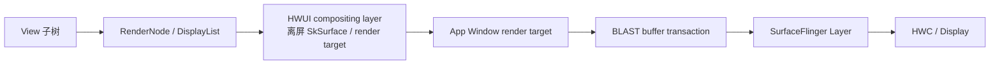

# MainThread、RenderThread 与 Hardware Layer

主线程负责视图状态、布局和 DisplayList 录制，RenderThread 负责 HWUI 渲染与 GPU 提交。Hardware Layer 可以复用离屏结果，但也会增加显存、更新和合成成本。

## 主线程、RenderThread 与 GPU 提交

### Android 17 标准硬件加速窗口路径

讨论以 Android 17、硬件加速已开启的普通 App Window 为主线：

`Choreographer → ViewRootImpl → ThreadedRenderer → HWUI RenderThread → Surface / BLASTBufferQueue → SurfaceFlinger`

这里的 MainThread 指持有目标 `ViewRootImpl` 的 UI 线程。多数 Activity 窗口使用进程主线程，不过 `ViewRootImpl` 也可以绑定其他具有 Looper 的线程。RenderThread 是 HWUI（Android 的硬件加速 UI 渲染器）在应用进程中的共享渲染线程。软件 Canvas、`SurfaceView` 自建 Producer、游戏引擎直接使用 EGL/Vulkan 等路径具有不同的线程与 buffer 所有权，不能照搬这里的全部结论。

后文保留几组源码名称：RenderNode 保存一个渲染节点的属性和绘制记录；DisplayList 是可回放的绘制命令列表；RecordingCanvas 负责生成这份记录；CanvasContext 管理一条窗口渲染上下文。BLAST 用于协调窗口 buffer 与 SurfaceControl transaction（对 Layer 属性或 buffer 的一组更新）；fence 则表示异步读写何时完成。

标准路径的线程边界可用下图定位：

```mermaid
flowchart LR
    V["VSync-app / Choreographer"] --> U["UI 线程<br/>measure / layout / Record DisplayList"]
    U --> S["syncAndDrawFrame&#40;&#41;<br/>UI 等待 DrawFrameTask"]
    S --> P["RenderThread<br/>syncFrameState / prepareTree"]
    P --> D["CanvasContext::draw&#40;&#41;<br/>HWUI / Skia 后端"]
    D --> B["Surface / BLASTBufferQueue<br/>queueBuffer + Producer completion fence"]
    D --> G["GPU 异步执行"]
    B --> F["SurfaceFlinger<br/>latch / compose"]
    G -. "signal acquire fence" .-> F
    F --> H["HWC / Display"]
    P -. "满足提前解锁条件" .-> U
```



图中的虚线表示条件分支：RenderThread 完成同步后，UI 线程有时可以先返回；纹理缓存空间不足等情况下，UI 线程会继续等到本帧 draw 或 skip（跳过绘制）处理结束。`queueBuffer()` 只是 Producer 提交点，距离 SurfaceFlinger latch（选中并取得 buffer）和显示设备呈现仍有后续阶段。

### 四类执行者各自负责什么

| 执行者 | Android 17 主职责 | 不宜由该阶段单独推断的结论 |
|:---|:---|:---|
| UI 线程 | 输入与动画回调、measure、layout、把 View 绘制操作记录到 RenderNode、调用 `syncAndDrawFrame()` | `onDraw()` 返回不代表像素已经生成 |
| RenderThread | 同步 RenderNode 状态、准备渲染树和资源、驱动 HWUI/Skia 后端、获取并提交窗口 buffer | RenderThread 的 CPU slice 结束不代表 GPU 已完成 |
| GPU | 执行图形命令，写入目标 buffer | GPU 完成不代表 SurfaceFlinger 已 latch 或 display 已呈现 |
| SurfaceFlinger / HWC | 接收 layer buffer 与 transaction、latch、合成、提交显示 | present fence 描述显示管线进度，不能代表光子已到达人眼 |

MainThread 与 RenderThread 的并行来自相邻帧重叠：RenderThread 推进当前帧时，UI 线程可能开始处理后续消息和下一帧工作。两者仍有明确依赖；当前帧的 RenderNode 状态准备完成之前，RenderThread 无法凭空生成该帧内容。

### MainThread：从 View 树得到 RenderNode DisplayList

#### Measure 与 Layout

`ViewRootImpl.performTraversals()` 根据本帧状态决定是否执行 measure 和 layout：

- measure 自顶向下传播 `MeasureSpec`，再自底向上返回测量结果；
- layout 确定 View 的边界；
- 是否需要重复执行取决于布局请求、尺寸变化、窗口属性、Insets（系统栏、输入法等占用的窗口区域）等条件。

层级更深通常意味着更多遍历工作，但 measure 次数不具有“每多一层必然翻倍”这样的固定关系。自定义 `onMeasure()`、多轮 `requestLayout()`、权重测量和父子约束反复变化才是需要结合 Trace 与代码确认的因素。

#### 硬件加速路径中的绘制以记录为主

每个 View 都持有一个 `RenderNode`。View 需要更新显示列表时，`updateDisplayListIfDirty()` 会向 RenderNode 请求 `RecordingCanvas`，调用 View 的绘制逻辑，最终结束记录。下面的结构摘录保留了 Android 17 的关键判断，省略异常处理、overlay（额外叠加内容）和辅助绘制分支：

```java
// frameworks/base/core/java/android/view/View.java
// AOSP android-17.0.0_r1，结构摘录
public RenderNode updateDisplayListIfDirty() {
    final RenderNode renderNode = mRenderNode;
    if ((mPrivateFlags & PFLAG_DRAWING_CACHE_VALID) == 0
            || !renderNode.hasDisplayList()
            || (mRecreateDisplayList)) {
        if (renderNode.hasDisplayList() && !mRecreateDisplayList) {
            mPrivateFlags |= PFLAG_DRAWN | PFLAG_DRAWING_CACHE_VALID;
            mPrivateFlags &= ~PFLAG_DIRTY_MASK;
            dispatchGetDisplayList();
            return renderNode;
        }

        mRecreateDisplayList = true;
        final RecordingCanvas canvas =
                renderNode.beginRecording(getWidth(), getHeight());
        try {
            if ((mPrivateFlags & PFLAG_SKIP_DRAW) == PFLAG_SKIP_DRAW) {
                dispatchDraw(canvas);
            } else {
                draw(canvas);
            }
        } finally {
            renderNode.endRecording();
            setDisplayListProperties(renderNode);
        }
    } else {
        mPrivateFlags |= PFLAG_DRAWN | PFLAG_DRAWING_CACHE_VALID;
        mPrivateFlags &= ~PFLAG_DIRTY_MASK;
    }
    return renderNode;
}
```

这段代码给出两个排障边界。第一，`Canvas.drawRect()`、`drawText()`、`drawBitmap()` 等调用此时主要在记录绘制操作；像素生成留给后面的 HWUI/Skia 渲染。第二，RenderNode 已有可复用 DisplayList 且没有重建请求时，系统会复用记录结果并递归取得所需子节点。

`invalidate()`、内容变化、尺寸变化、软件/硬件 layer 状态和 View 自身绘制实现都会影响是否重录。仅凭“调用了 `requestLayout()`”无法保证 DisplayList 一定复用；也不能断言位置变化必然重录。能映射为 RenderNode 属性的 translation、alpha、scale 等更新，通常可以减少内容重录，但仍要看 View 是否同时改变了布局或绘制内容。

#### 根 RenderNode 与帧信息

`ThreadedRenderer.updateRootDisplayList()` 记录窗口根节点，并把 View 树生成的 RenderNode 挂入根 DisplayList。随后 `ThreadedRenderer.draw()` 取得 `FrameInfo`（记录本帧各阶段时间戳与 VSync 信息的结构），调用 `syncAndDrawFrame(frameInfo)`。

下面的调用骨架用于说明 Java 记录阶段怎样进入 native HWUI：

```text
ViewRootImpl.performDraw()
  → ThreadedRenderer.draw(...)
    → updateRootDisplayList(...)
    → getUpdatedFrameInfo()
    → HardwareRenderer.syncAndDrawFrame(frameInfo)
      → android_view_ThreadedRenderer_syncAndDrawFrame(...)
        → RenderProxy::syncAndDrawFrame()
          → DrawFrameTask::drawFrame()
```

到达 `DrawFrameTask::drawFrame()` 后，UI 线程会进入一次明确的等待。DisplayList 并没有被整棵复制到 RenderThread；HWUI 在两条线程间同步 RenderNode 树、属性、资源引用和本帧状态。

### SyncFrameState：UI 线程究竟等到什么时候

#### `postAndWait()` 是当前帧交接点

Android 17 的 `DrawFrameTask` 把任务投到 RenderThread WorkQueue（顺序执行渲染任务的工作队列），然后由 UI 线程等待条件变量：

```cpp
// frameworks/base/libs/hwui/renderthread/DrawFrameTask.cpp
// AOSP android-17.0.0_r1，省略无关分支
int DrawFrameTask::drawFrame() {
    mSyncResult = SyncResult::OK;
    mSyncQueued = systemTime(SYSTEM_TIME_MONOTONIC);
    postAndWait();
    return mSyncResult;
}

void DrawFrameTask::postAndWait() {
    AutoMutex _lock(mLock);
    mRenderThread->queue().post([this]() { run(); });
    mSignal.wait(mLock);
}
```

因此，UI 线程上的等待表示“RenderThread 尚未到达本次 `DrawFrameTask` 的解锁点”。它可能在等 RenderThread 获得 CPU，也可能在等 WorkQueue 前方的任务结束，还可能在等本帧同步或后续绘制。看到一段长 `syncAndDrawFrame()`，不能直接写成“GPU 正在运行”。

#### `syncFrameState()` 做了什么

RenderThread 执行 `DrawFrameTask::run()` 后创建 `TreeInfo`（记录本轮渲染树准备输入与结果的结构），再进入 `syncFrameState(info)`。Android 17 主线包含这些工作：

1. 把 VSync、intended VSync、VSync ID、frame deadline 和 frame interval 交给 RenderThread 的 `TimeLord`，由这个内部对象维护帧时序状态。
2. 确认渲染上下文可用，执行 `makeCurrent()`，把当前图形上下文绑定到线程与目标 Surface。
3. 解除上一轮图片固定状态，应用延迟的 layer 更新。
4. 调用 `CanvasContext::prepareTree()`，把 UI 侧变化同步进 RenderThread 使用的 RenderNode 树，并准备动画和资源。
5. 根据 Surface、stop 状态、可绘制内容、buffer 预留结果等设置 skip reason（本帧跳过绘制的原因）。
6. 汇总 `UIRedrawRequired`（需要 UI 重新绘制）、`FrameDropped`（本帧被放弃）等同步结果。

`CanvasContext::prepareTree()` 还会导入 UI 侧 `FrameInfo`、标记 SyncStart、执行动画上下文、遍历 RenderNode、释放未使用的预取 layer，并通过 `mNativeSurface->reserveNext()` 尝试预留下一块窗口 buffer。预留失败时，本帧可被标成 `NoBuffer` 并跳过。也就是说，buffer backpressure（Consumer 尚未释放可复用缓冲区，导致 Producer 等待）可能在 draw 之前就出现在本帧证据链中。

#### UI 解锁存在早、晚两条路径

下面的控制流摘录专门展示解锁条件：

```cpp
// frameworks/base/libs/hwui/renderthread/DrawFrameTask.cpp
// AOSP android-17.0.0_r1，结构摘录
TreeInfo info(TreeInfo::MODE_FULL, *mContext);
const bool canUnblockUiThread = syncFrameState(info);
const bool canDrawThisFrame = !info.out.skippedFrameReason.has_value();

if (canUnblockUiThread) {
    unblockUiThread();
}

if (canDrawThisFrame) {
    context->draw(...);
} else {
    // 同步阶段可能已产生纹理上传或删除工作。
    grContext->flushAndSubmit();
    context->waitOnFences();
}

if (!canUnblockUiThread) {
    unblockUiThread();
}
```

`syncFrameState()` 最终返回 `info.prepareTextures`。这个名字容易被误解为“是否准备纹理”；在该解锁判断中，源码注释明确说明，值为 `false` 表示纹理缓存空间已经用尽。返回 `true` 时，UI 可在 RenderThread 进入 `CanvasContext::draw()` 前继续执行；返回 `false` 时，解锁推迟到 draw 或 skip 处理之后。

“SyncFrameState 栅栏”适合描述 UI → RenderThread 的同步等待关系，无法代表一条固定时长、固定解锁位置的 GPU fence。这里实际用条件变量协调两个线程，与 Linux `sync_file`（把图形同步 fence 暴露为文件描述符的框架）的实现和参与者不同。

### RenderThread：准备、绘制与 buffer 提交

#### RenderThread 是进程级共享线程

`RenderThread::getInstance()` 在应用进程内返回单例。线程初始化后设置显示优先级、绑定 Looper、创建线程局部渲染资源，并循环处理 WorkQueue 与帧回调。一个进程里的多个 HWUI `CanvasContext` 会共享该 RenderThread。

RenderThread 负责驱动 HWUI/Skia 选中的后端并持有相关渲染上下文。Skia 是 Android 使用的二维图形引擎，后端决定它通过 OpenGL ES 还是 Vulkan 等图形 API 提交工作。把 RenderThread 概括为“逐条把 DisplayList 翻译成一条 GLES/Vulkan 命令”会遗漏 Skia 的录制、资源准备、批处理与后端差异。

#### `CanvasContext::draw()` 的 Android 17 主线

下面的结构摘录用来划分 CPU 绘制、异步任务等待和 buffer 交换：

```cpp
// frameworks/base/libs/hwui/renderthread/CanvasContext.cpp
// AOSP android-17.0.0_r1，结构摘录
void CanvasContext::draw(bool solelyTextureViewUpdates) {
    SkRect dirty;
    mDamageAccumulator.finish(&dirty);

    Frame frame = getFrame();
    SkRect windowDirty = computeDirtyRect(frame, &dirty);

    IRenderPipeline::DrawResult drawResult = mRenderPipeline->draw(
            frame, windowDirty, dirty, mLightGeometry,
            &mLayerUpdateQueue, mContentDrawBounds, mOpaque,
            mLightInfo, mRenderNodes, &profiler(),
            mBufferParams, profilerLock());

    waitOnFences();
    if (mRenderPipeline->hasRenderTarget()) {
        ANativeWindowFrameTimelineInfo ftl = { /* 本帧 timing 数据 */ };
        mRenderPipeline->setFrameTimelineInfo(ftl);
    }

    bool requireSwap = false;
    bool didSwap = mRenderPipeline->swapBuffers(
            frame, drawResult, windowDirty,
            mCurrentFrameInfo, &requireSwap);
}
```

`getFrame()` 由当前渲染后端取得目标 frame；`draw()` 处理脏区（本帧相对上一帧发生变化的区域）、RenderNode 和 layer 更新；`swapBuffers()` 将结果交给 NativeWindow（图形 Producer 操作 Surface 的原生接口）/BufferQueue 路径。CPU 方法返回时，GPU 仍可能继续执行已经提交的图形工作。

这里还有一个容易混淆的同名概念：`CanvasContext::waitOnFences()` 等待的是 `mFrameFences` 中的 `std::future<void>`。这些 future 是异步任务的完成凭据，由 HWUI 的共享工作线程池 `CommonPool::async()` 创建，用来保证相关任务在本帧结束前完成。方法名虽然含有 `Fences`，等待对象却不是 `sync_file` 图形 fence，也不能解释成“等待 SurfaceFlinger release fence”。GraphicBuffer 的 Producer/Consumer fence 由 NativeWindow、BufferQueue、BLAST 和 SurfaceFlinger 路径携带，排查时要按来源区分。

#### `queueBuffer()` 表示 Producer 已提交

在标准 App Window 中，`swapBuffers()` 最终会使 Producer 提交一个 buffer，并附带描述 Producer 写入完成状态的 fence。此时可以确认：

- Producer 已把 slot（BufferQueue 中可复用的编号位置）从 `DEQUEUED` 推向 `QUEUED`；
- Consumer 能取得 buffer 元数据；
- Consumer 使用内容前仍需遵守输入 fence；
- SurfaceFlinger 是否在目标周期 latch、怎样合成、何时 present，需要继续看下游事件。

`queueBuffer()` 结束不能证明 GPU 已完成，也不能证明该帧已经显示。Android 11 之后的普通窗口通常还要经过应用进程内的 BLAST Consumer，把 `BufferItem`（一次入队 buffer 及其元数据）组织进 `SurfaceControl.Transaction`，再进入 SurfaceFlinger 的待处理、latch、compose 和 present 阶段。

### Fence：先按“谁等待谁”来命名

同一个 fence 沿 Producer/Consumer 边界传递时，名称会随观察方变化。下面的时间线用于说明两种常见方向：

```text
Producer / RenderThread
  dequeueBuffer(slot, release fence)
      │ 等 Consumer 结束对旧内容的使用
      ▼
  GPU 写入新内容
      │
  queueBuffer(slot, input fence)
      │ input fence 描述 Producer 写入完成
      ▼
Consumer / BLAST / SurfaceFlinger
  acquireBuffer → 把 input fence 作为 acquire fence
      │ 使用内容前遵守 acquire fence
      ▼
  latch / compose / present
      │ 使用结束后产生 release 信息
      └────────────────────────────→ slot 后续可供 Producer 复用
```

从 Producer 视角看：

- `dequeueBuffer()` 返回的 fence 约束“何时可以重新写旧 slot”；
- `queueBuffer()` 携带的 input fence 约束“Consumer 何时可以读取新内容”。

从 Consumer 视角看，后一条 fence 就是 acquire fence。release fence 表示 Consumer 何时不再使用 buffer，决定 slot 何时可回收。SurfaceFlinger/HWC 的 present fence 描述显示管线的提交完成进度。分析 trace 时，先写清 fence 的生产者、等待者和所保护的 buffer，再讨论耗时。

#### buffer 数量没有“永远是三个”的结论

Android 17 的 `CanvasContext.cpp` 定义了文件内静态函数 `setBufferCount()`：它查询 `NATIVE_WINDOW_MIN_UNDEQUEUED_BUFFERS`，再设置 `min_undequeued_buffers + 2`。`CanvasContext::setupPipelineSurface()` 只在 NativeSurface 尚未设置额外 buffer 时调用它。这个表达式不代表所有设备、所有 Surface、所有时刻都固定为三块 buffer。

Producer 能否继续 dequeue 还取决于：

- max dequeued 与 max acquired 配置；
- async / non-blocking（异步/不等待）模式；
- slot 当前处于 `FREE`、`DEQUEUED`、`QUEUED` 还是 `ACQUIRED`；
- release fence 是否 signal（变为完成状态）；
- BLAST 是否还有 pending release（尚未处理完的 buffer 释放回调）；
- Surface 生命周期、尺寸变化与重新分配。

看到长 `dequeueBuffer` 或 `reserveNext` 时，要把 slot 状态、fence、BLAST transaction 和 SurfaceFlinger latch 放在同一时间轴检查。只写“缓冲区全被占用”会遗漏队列上限和 slot 状态。

### Bitmap 资源准备：首帧开销该怎样判断

#### 普通 Bitmap 可能需要上传

硬件加速 Canvas 绘制 Bitmap 时，HWUI/Skia 需要让图形后端能够读取其像素。尚未准备好的图片、发生修改的 mutable Bitmap（允许修改像素的位图）、被缓存淘汰后的资源，都可能带来纹理创建或上传工作。相关工作可能出现在 RenderThread 的同步或绘制阶段，具体 slice 名由版本、后端和 trace 配置决定。

不要给图片尺寸套用固定上传毫秒数。上传成本受像素格式、尺寸、内存布局、缓存状态、GPU、总线、后端和系统负载共同影响。可靠做法是在目标设备上对齐同一帧的资源 slice、RenderThread 时间、GPU 工作和 FrameTimeline。

#### `Bitmap.prepareToDraw()`

`Bitmap.prepareToDraw()` 很早就已存在。官方 API 文档说明，从 Android N 开始，如果 Bitmap 尚未上传，该调用会启动由 RenderThread 完成的异步上传。它适合在图片即将显示前做准备；第一次直接绘制通常也会触发上传。Bitmap 内容发生修改后，后续绘制仍可能需要重新上传。

这项 API 只能减少“首次可见帧才遇到上传”的概率，不能保证图片解码、内存分配、导入和所有 GPU 准备工作都已结束。调用时机过早还会增加纹理驻留时间和缓存压力。

#### `Bitmap.Config.HARDWARE`

Android 8.0 引入 `Bitmap.Config.HARDWARE`。官方文档将其描述为像素只存储在图形内存（graphic memory）、不可变、适合只绘制用途。它可减少普通 mutable Bitmap 的重复上传机会，但仍有 GraphicBuffer 导入、资源绑定、同步和内存占用成本，也受到软件 Canvas 访问限制。

选择 HARDWARE Bitmap 前，要确认后续是否需要读写像素、软件绘制、序列化或兼容旧 API。把它当成“零上传、零首帧成本”的开关会造成新的误判。

#### `prepareTextures` 与 UI 解锁的关系

`TreeInfo::prepareTextures` 是同步阶段状态，不是一个公开上传方法。Android 17 的 `DrawFrameTask::syncFrameState()` 用它决定 UI 能否提前解锁；源码只把 `false` 明确解释为纹理缓存空间不足。若本帧被跳过，而同步阶段已经产生纹理上传或删除工作，`DrawFrameTask::run()` 会调用 `GrDirectContext::flushAndSubmit()`，避免这些工作滞留到下一帧。

这条分支可以解释某些长 `syncAndDrawFrame()`：资源压力既可能增加 RenderThread 工作，也可能把 UI 解锁推迟到 draw/skip 之后。确认时仍需查看同帧的 cache、upload、skip reason 和 GPU 证据。

### Deferred GPU Commands（延迟提交的 GPU 命令）与 flush 边界

DisplayList 记录的是有顺序与状态语义的绘制操作。HWUI/Skia 可以在不改变画面语义的前提下合并批次、缓存资源、延迟提交或调整后端工作，但不能把所有同类型命令跨越裁剪、混合、保存/恢复和依赖关系随意重排。这里的 flush 指把已经积累的后端命令提交出去，`flushAndSubmit()` 则同时要求执行提交步骤；它不等同于等待 GPU 全部执行完成。

Android 17 源码能直接确认两个 flush 场景：

- `syncFrameState()` 做过纹理上传，而本帧随后跳过 draw 时，`DrawFrameTask` 调用 `flushAndSubmit()`；
- `CanvasContext::draw()` 发现没有可绘内容，但仍需让纹理上传完成并释放 staging buffer（暂存上传数据的缓冲区）时，也可以调用 `flushAndSubmit()`。

正常绘制还会经过具体 pipeline 的 `draw()`、`swapBuffers()` 和后端提交。Perfetto 中的 slice 名随 Skia 后端、系统 build 和 atrace 配置变化，不能预设所有设备都有同名的 flush 切片。CPU 侧 flush 时长也不等同于 GPU 执行时长；应结合 GPU queue、fence 和 FrameTimeline 判断。

### RenderThread Animations：哪些动画能离开 UI traversal

Android 5.0 已有 `RenderNodeAnimator` 和 `ViewPropertyAnimatorRT` 基础。alpha、translation、scale、rotation 等能直接映射到 RenderNode 属性的动画，有机会由 RenderThread 推进，减少每帧重新执行完整 View traversal 的需要。

Android 17 的 `RenderThread` 使用 `AChoreographer` VSync callback 驱动 RenderThread 帧回调。`CanvasContext::prepareTree()` 检测到仍有动画且不要求 UI redraw（重新执行 UI 绘制记录）时，会继续注册 RenderThread frame callback。VSync 到达后，`CanvasContext::doFrame()` 调用 `prepareAndDraw(nullptr)`；`prepareAndDraw()` 使用 `TreeInfo::MODE_RT_ONLY` 准备树并绘制。`RenderProxy::drawRenderNode()` 也会同步调用同一个 `prepareAndDraw(node)` 入口。

判断一段动画能否持续走 RT 路径，要看这些条件：

- 属性能否由 RenderNode 表示；
- 动画是否修改布局尺寸、位置关系或 View 内容；
- 是否有 update listener 每帧回到 UI 改状态；
- 动画是否要求重新构建 DisplayList；
- surface 和渲染上下文是否仍可用。

例如下面的动画只修改 RenderNode 常见属性，具备进入 RT 后端的条件：

```java
view.animate()
        .translationX(100f)
        .alpha(0.5f)
        .setDuration(300)
        .start();
```

最终选择仍由当前版本实现和动画配置决定。若回调里同时执行 `requestLayout()`、修改文本或重绘内容，UI 线程仍会参与。RenderThread 动画也没有绕过 GPU、BufferQueue 和 SurfaceFlinger 的帧 deadline。

### ADPF：性能提示不等于频率承诺

ADPF（Android Dynamic Performance Framework）让应用或系统组件向平台提供性能目标与实际工作时长。Android 17 的 `CanvasContext.cpp` 通过 `HintSessionWrapper` 更新目标工作时长并上报帧的实际工作时长。AOSP Android 14 源码中已经能看到这条 HWUI hint session（持续提交性能提示的会话）路径。Android 16 增加的 CPU/GPU headroom API 用于查询距离性能上限还有多少余量，两者的 API 边界不同。

ADPF 是系统调度与电源策略的提示输入。收到提示后，系统仍会综合温控、功耗、并发负载和设备策略。trace 中出现 hint session 更新，不能单独证明 CPU/GPU 频率已提升，也不能证明帧一定按时。需要把 hint、频率/idle counter（频率与空闲状态轨道）、线程运行位置、GPU 工作和帧结果一并核对。

### Perfetto：沿同一个 VSync ID 找证据

#### 第一步：从 FrameTimeline 选择问题帧

Android 12+ 的 FrameTimeline 提供 App `SurfaceFrame` 与系统 `DisplayFrame` 的 expected/actual 时间线：expected 是系统计划的呈现窗口，actual 是实际执行与呈现结果。选中一帧后，记录 VSync ID、deadline、jank type（异常原因分类）和关联 layer。高刷新率、可变刷新率和调度 offset（相对目标 VSync 的时间偏移）都会改变可用预算，不应固定使用 16.67 ms 作为所有设备的阈值。

App actual timeline 的结束还会考虑 GPU completion（完成时间）与 buffer post（提交时间）等边界。它比单看 UI `doFrame` 更接近窗口帧结果，但光学显示边界仍需结合 display/present 证据。

#### 第二步：检查 UI 线程

Android 17 常见的 UI 侧关注点包括：

- `Choreographer#doFrame <vsyncId>`；
- input、animation、insets animation、traversal、commit；
- `performTraversals`、measure、layout；
- `Record View#draw()` 或相关 DisplayList 记录 slice；
- `syncAndDrawFrame()` / `postAndWait()` 等待区间。

slice 名可能因 `user`（量产）/`userdebug`（保留更多调试能力）build、trace category（采集类别）和厂商插桩不同。颜色只代表 UI 展示规则，不能充当根因证据。

#### 第三步：检查 RenderThread

在同一 VSync ID 附近查看：

- `DrawFrames <vsyncId>` 或 `DrawFrame`；
- `syncFrameState`、`prepareTree`；
- 资源上传、layer 更新、skip reason；
- `reserveNext` / `dequeueBuffer`；
- pipeline draw（当前图形后端执行绘制）、swap、`queueBuffer`；
- RenderThread 是否处于 runnable（已经可运行）但长时间未获得 CPU。

UI 线程上看到的是等待；`syncFrameState` 的工作本身运行在 RenderThread。把两条 track 叠在一起，才能区分“本帧同步慢”和“RenderThread 前方还有旧工作”。

#### 第四步：继续追 buffer、GPU 与显示

如果 UI 与 RenderThread 都按时，继续检查：

- App 进程的 BufferQueue/BLAST slot 状态；
- `BufferTX - <layerName>`、transaction ready 与 latch；
- Producer completion/acquire/release fence；
- GPU queue、GPU completion 与厂商提供的 busy/counter（忙碌状态或硬件计数器）；
- SurfaceFlinger composition、HWC present 和 FrameTimeline DisplayFrame。

`queueBuffer()`、BLAST acquire、SurfaceFlinger 收到 transaction、latch、GPU 完成和 present 是不同事件。把它们放在一条时间轴上，才能定位延迟发生在哪个所有权边界。

#### 一条可移植性较高的 SQL 起点

下面的查询用于列出 UI 与 RenderThread 上常见的长 slice。它只负责筛选候选项，slice 名和阈值要按目标 Trace 调整：

```sql
SELECT
  p.name AS process_name,
  t.name AS thread_name,
  s.name AS slice_name,
  s.ts / 1e6 AS ts_ms,
  s.dur / 1e6 AS dur_ms
FROM slice s
JOIN thread_track tt ON s.track_id = tt.id
JOIN thread t ON tt.utid = t.utid
LEFT JOIN process p ON t.upid = p.upid
WHERE t.name IN ('main', 'RenderThread')
  AND s.dur > 1000000
  AND (
    s.name GLOB 'Choreographer#doFrame*'
    OR s.name GLOB 'DrawFrame*'
    OR s.name GLOB 'DrawFrames*'
    OR s.name GLOB '*syncAndDrawFrame*'
    OR s.name GLOB '*syncFrameState*'
    OR s.name GLOB '*dequeueBuffer*'
    OR s.name GLOB '*queueBuffer*'
  )
ORDER BY s.ts;
```

查询结果只说明某个 CPU slice 较长。GPU 执行、fence、FrameTimeline 和线程调度状态还要从对应表与轨道补充，不能由这张结果表直接定性。

### 六种常见 Trace 组合

| Trace 组合 | 优先检查 | 仍需排除 |
|:---|:---|:---|
| UI `doFrame` 很长，RenderThread 很晚才接到本帧 | input、animation、measure、layout、DisplayList 记录、UI runnable delay | RenderThread 可能同时有旧帧积压 |
| UI 长时间停在 `syncAndDrawFrame`，RT 同期执行 `syncFrameState` | `prepareTree`、资源准备、layer update、`reserveNext`、纹理缓存 | 仅凭 UI 等待不能判定 GPU 过载 |
| UI 在等待，RT 仍处理前一帧 draw/swap | GPU queue、buffer slot、fence、旧帧 deadline | 后一帧同步工作本身可能很短 |
| RT CPU slice 不长，App actual 因 GPU completion 延后 | GPU workload（工作量）、overdraw（同一像素被重复绘制）、shader、纹理带宽、频率与温控 | SurfaceFlinger/HWC 也可能贡献 GPU 工作 |
| `dequeueBuffer` / `reserveNext` 很长 | FREE slot、max dequeued/acquired、release fence、BLAST pending release | buffer 数量不能固定按三块推断 |
| App `queueBuffer` 按时，DisplayFrame 仍迟到 | BLAST transaction、SF latch、composition、HWC/present | App 侧的 completion fence 也可能晚 signal |

#### 主线程过重：RenderThread 得到的时间窗口变窄

复杂布局、自定义绘制、同步 I/O、锁竞争或运行队列等待都可能让 UI 线程错过提交时间。排查时先区分线程处于运行、RUNNABLE、SLEEPING 还是 BLOCKED，再定位 Java/Kotlin/native 调用栈。一个很长的 `performTraversals` 需要继续拆成 measure、layout、record 和 `syncAndDrawFrame`，不能只按总时长优化 View 数量。

改动也要与证据对应：

- measure/layout 慢：检查多轮测量、布局请求来源和约束变化；
- DisplayList 记录慢：检查自定义绘制循环、文本、Path、阴影和无效区域；
- runnable delay 长：检查 CPU 竞争、线程优先级、cgroup（Linux 资源控制组）与调度；
- 阻塞调用长：检查锁持有者、Binder、I/O 或同步任务。

#### RenderThread 同步或资源准备慢

大量 RenderNode 状态变化、layer 更新、首次资源准备和纹理缓存压力可能拉长 `syncFrameState`。DisplayList 命令数量通常没有稳定的公开逐 View counter；可先用 trace 找到重录和上传发生的帧，再通过局部埋点、逐步禁用一半页面区域或可复现实验缩小到具体 View。

hardware layer（把 View 内容缓存为可复用纹理的硬件层）适合内容稳定、需要反复做几何变换的区域。它会增加纹理内存和更新成本，内容频繁变化时可能适得其反。优化前后应比较同场景的 record、upload、RT/GPU 和内存数据。

#### GPU 过载

连续高 overdraw、复杂 fragment shader（逐像素运行的着色器）、大面积模糊/阴影、高分辨率纹理和频繁离屏渲染都会增加 GPU 工作。判断 GPU 过载至少需要一项直接 GPU 证据，例如 GPU queue slice、`GPU_DURATION`（设备与版本支持时）、vendor counter 或 completion fence，再用 App/SF FrameTimeline 确认帧结果。

“GPU utilization（利用率）接近 100%”也要结合频率与采样周期解读：低频运行时的高利用率和满频饱和含义不同；某些 counter 还混合 App、SurfaceFlinger 和其他进程工作。优化时保持刷新率、分辨率、场景、温度和固件一致。

#### buffer 反压

Producer 提交过快、Consumer/SF 处理变慢、acquire fence 迟到、release 回调积压或队列上限变化，都可能让可 dequeue slot 减少。观察 `dequeueBuffer` 变短只能说明等待减少，不能单独证明队列深度扩大。

Android 17 还存在 buffer stuffing（Producer 持续提交，导致多个 buffer 排队等待）检测与恢复逻辑。遇到 `Buffer stuffing recovery`、`swap chain stuffed`、`buffer stuffed` 或 `Negative offset` 等 slice 时，要结合后续 queued count（排队数量）、dequeue wait 和 FrameTimeline，判断系统是在主动控制排队延迟，还是 CPU/GPU 吞吐不足。

### 多窗口：共享关系要按进程划分

同一进程的多个 HWUI 窗口共享 `RenderThread::getInstance()`。它们常常也使用同一主线程，但 UI 线程归属取决于各自 `ViewRootImpl` 的 Looper。RenderThread WorkQueue 是共享的，一个窗口的长同步、资源上传或 draw 可能延迟队列后方的另一个窗口。

来自不同进程的分屏应用拥有各自的 UI 线程和 RenderThread。它们仍共享系统 GPU、SurfaceFlinger、HWC、内存带宽和显示 deadline。两边 App 都按时 `queueBuffer()`，仍可能在合成或显示阶段相互影响。

Dialog、PopupWindow、画中画、嵌入式 Surface 等场景还要确认是否创建独立 Window 或 Producer。减少 Window 数量有时能降低调度与 buffer 成本，但 UI 语义、无障碍、输入、层级和生命周期同样是设计约束，不能只按线程数量改架构。

### Kernel 边界：调度证据与图形 fence 分开看

kernel 行为以 `android17-6.18-2026-06_r6` 为准。通用调度路径可从以下文件核对：

- `kernel/sched/core.c`：唤醒、调度核心与任务状态转换；
- `kernel/sched/fair.c`：普通任务的 fair 调度类及 EEVDF（Earliest Eligible Virtual Deadline First，优先选择已满足资格且虚拟截止时间最早的任务）运行队列逻辑。

当 UI 线程或 RenderThread 长时间处于 runnable，可结合 `sched_wakeup`、`sched_switch`、CPU 频率、idle（CPU 空闲状态）、优先级和 cgroup 判断调度延迟。线程在睡眠或等待锁/fence 时，调整 scheduler（调度器）参数通常不能解决上游依赖。

GPU 与 display fence 的等待点还涉及 `dma_fence`（内核表示异步硬件任务完成关系的对象）、`sync_file` 框架和厂商 GPU、DRM/display 驱动。AOSP framework 的 `syncAndDrawFrame()` 条件变量、CommonPool frame fence、GraphicBuffer acquire/release fence 属于不同层次；后两者的设备实现不能只靠 `kernel/sched` 两个文件解释。详细 fence 生命周期见 [2.8 BufferQueue、Gralloc 与 Sync Fence](08-bufferqueue-gralloc-sync-fence.md)。

### 版本演进：保留历史，结论锚定 Android 17

| 版本 | 已核对的变化 | 对分析方法的影响 |
|:---|:---|:---|
| Android 5.0 / API 21 | HWUI RenderThread、`RenderNodeAnimator`、`ViewPropertyAnimatorRT` 已进入平台 | 硬件加速窗口形成 UI 记录、RT 渲染的线程分工，部分属性动画可由 RT 推进 |
| Android 7.0 / API 24 | FrameMetrics API；`Bitmap.prepareToDraw()` 文档说明从 N 起可触发 RenderThread 异步上传 | App 可观察更细帧耗时，也可提前准备即将绘制的 Bitmap |
| Android 8.0 / API 26 | `Bitmap.Config.HARDWARE` | 适合只绘制的不可变图片；仍要考虑导入、同步、内存与软件访问限制 |
| Android 11 / API 30 | `BLASTBufferQueue.cpp` 已进入 AOSP 主线 | 普通窗口的 buffer 与 SurfaceControl transaction 结合更紧，BufferQueue slot/fence 机制仍在 |
| Android 12 / API 31 | FrameTimeline 可用于系统级帧追踪；Performance Hint 公开 API | 可用 expected/actual timeline 对齐 App 与 DisplayFrame；hint 不能当成频率保证 |
| Android 14 / API 34 | 该版本 AOSP HWUI 已有 `HintSessionWrapper` 帧工作时长上报 | 分析 RT 时可检查 ADPF session，同时仍需频率与帧结果证据 |
| Android 16 / API 36 | CPU/GPU headroom API 扩展性能余量观察能力 | headroom 查询与 HWUI 每帧 hint session 要分别解释 |
| Android 17 / API 37 | 源码基线：`android-17.0.0_r1`；kernel 基线：`android17-6.18-2026-06_r6` | 方法名、条件分支、BLAST buffer 状态和调度边界均按该版本复核 |

版本表只记录能由对应源码或官方 API 文档支持的变化。当前源码中存在某段逻辑，只能证明 Android 17 有该实现；若要声称它在 Android 17 首次加入，还需要逐个历史 tag 追溯。

### 常见误解校正

#### “UI 的 `draw` 已经画出像素”

硬件加速 View 路径中的 `draw` 主要记录 DisplayList。后续 RenderThread、GPU、BufferQueue、SurfaceFlinger 和显示阶段仍未完成。

#### “`syncAndDrawFrame()` 长就是 GPU 慢”

它表示 UI 正在等 `DrawFrameTask` 的解锁点。RenderThread 排队、同步、资源准备、buffer 预留和条件性晚解锁都可能贡献时长。GPU 结论需要额外证据。

#### “同步结束后 UI 总会立刻返回”

Android 17 根据 `info.prepareTextures` 选择早解锁或晚解锁。纹理缓存空间不足时，UI 等到 draw/skip 处理之后。

#### “`queueBuffer()` 返回就是一帧完成”

它只确认 Producer 完成提交调用。Producer completion fence、BLAST acquire、SF latch、composition、present 都可能发生在后面。

#### “RenderThread 的 `waitOnFences()` 就是在等 SF release fence”

`CanvasContext::waitOnFences()` 处理 CommonPool 异步帧任务。GraphicBuffer release fence来自 Producer/Consumer 路径，两者需按对象与调用栈区分。

#### “所有窗口都使用相同的 buffer 数量”

Android 17 根据 NativeWindow 的最小不可 dequeue 数量和其他队列配置计算 buffer 数。slot 状态、模式、上限与 fence 共同决定能否继续 dequeue。

### 源码锚点速查

| 需要验证的结论 | Android 17 源码锚点 |
|:---|:---|
| View 何时重录/复用 DisplayList | `core/java/android/view/View.java`：`updateDisplayListIfDirty()` |
| 根 DisplayList 与 Java → native 入口 | `core/java/android/view/ThreadedRenderer.java`、`graphics/java/android/graphics/HardwareRenderer.java` |
| UI 线程怎样等待 RT | `libs/hwui/renderthread/DrawFrameTask.cpp`：`drawFrame()`、`postAndWait()` |
| 早/晚解锁条件 | `DrawFrameTask.cpp`：`run()`、`syncFrameState()`、`info.prepareTextures` |
| RenderNode、动画和 buffer 预留 | `libs/hwui/renderthread/CanvasContext.cpp`：`prepareTree()` |
| HWUI 绘制、异步任务 fence、swap | `CanvasContext.cpp`：`draw()`、`waitOnFences()` |
| 进程级 RT 与 RT VSync callback | `libs/hwui/renderthread/RenderThread.cpp` |
| BLAST transaction 与 release callback | `frameworks/native/libs/gui/BLASTBufferQueue.cpp` |
| Producer slot、queue/dequeue fence | `frameworks/native/libs/gui/BufferQueueProducer.cpp` |
| runnable delay 与公平调度 | kernel `kernel/sched/core.c`、`kernel/sched/fair.c` |

遇到厂商设备特有的 GPU、display 或 fence 行为，还要补充对应 kernel vendor driver、HAL 实现和设备 Trace。只看 AOSP framework 无法解释所有硬件差异。

### Android 17 的主线程与 RenderThread 边界

MainThread 负责计算 View 层级并记录 RenderNode DisplayList；RenderThread 同步渲染树、准备资源、驱动 HWUI/Skia 后端并提交窗口 buffer；GPU、SurfaceFlinger 和 HWC 继续完成异步执行、latch、合成与显示。线程拆分让相邻帧可以重叠，却没有消除它们之间的同步与反压。

分析卡顿时，可以按以下顺序收集证据：

1. 用 FrameTimeline 选定 VSync ID 和错过的 deadline；
2. 在 UI 线程拆分 input、animation、traversal、record 与 `syncAndDrawFrame()`；
3. 在 RenderThread 对齐 `syncFrameState`、资源准备、draw、dequeue 和 queue；
4. 沿 completion/acquire/release fence 检查 BLAST 与 SurfaceFlinger；
5. 用 GPU 与 scheduler 证据区分执行过重、buffer 反压和 runnable delay。

这条顺序能避免把 UI 等待、RT CPU 工作、GPU 完成、buffer 提交和显示呈现压缩成一个“渲染耗时”。


## Hardware Layer 的录制、缓存与失效

线程分工解释了一帧如何产生，Hardware Layer 进一步改变 DisplayList 和纹理是否复用。收益取决于内容稳定性、更新范围和显存压力。

### 区分三种“Layer”

Hardware Layer 这个名称容易混淆概念。Android 图形栈里至少有三种不同对象会被称为 layer：

| 名称 | 所在范围 | 是否有独立 BufferQueue / SurfaceControl | SurfaceFlinger 能否单独看到 |
|:---|:---|:---|:---|
| View Hardware Layer / RenderNode compositing layer | 应用进程 HWUI 内部 | 否 | 否，它先被合成进 App Window buffer |
| `TextureLayer` / `TextureView` 输入层 | 应用进程，HWUI 消费外部 SurfaceTexture | 输入端有独立 BufferQueue，但最终采样进宿主窗口 | 通常只能看到最终宿主 App Window |
| SurfaceFlinger Layer | 系统合成层，来自 SurfaceControl | 通常携带独立 buffer/transaction 状态 | 是 |

先约定本文的几个对象：HWUI 是 Android 渲染 View 的硬件加速管线；`RenderNode` 保存一个 View 子树的绘制指令与合成属性，`DisplayList` 是其中可重放的绘制指令列表；layer surface 或 render target 是 GPU 接收绘制结果的目标图像。这里讨论第一种 Layer：HWUI 为某个 View/RenderNode 子树创建中间渲染结果，后续将它作为一个整体参与 App Window 绘制。它不会为这个 View 创建新的窗口，也不会给 HWC 增加一个可独立分配 overlay plane（显示控制器硬件叠加通道）的 Layer。

整体关系如下：



Hardware Layer 的收益与代价都发生在 `DL → L → W` 这一段：先把 View 子树画到离屏目标，再把这个中间结果合成进窗口。SurfaceFlinger 只处理最终窗口 Layer，无法从 SF Layer 数量直接判断某个 View 是否使用 Hardware Layer。

### 硬件加速与 Hardware Layer

硬件加速描述整个窗口的渲染管线：View 绘制调用记录进 RenderNode/DisplayList，HWUI 在 RenderThread 上通过 OpenGL 或 Vulkan 等图形后端生成窗口 buffer。

Hardware Layer 描述单个 RenderNode 的中间合成策略：先把该节点及其子树绘制到离屏 render target，再把结果作为一个整体画回窗口。后续只改变 translation、scale、rotation、alpha（位移、缩放、旋转、透明度）等 layer 属性时，系统可以复用已经栅格化为像素的内容。

两者的边界是：

- 窗口开启硬件加速，View 保持 `LAYER_TYPE_NONE`：现代 App 的常规路径；
- 窗口开启硬件加速，View 使用 `LAYER_TYPE_HARDWARE`：显式要求中间 hardware layer；
- View 使用 `LAYER_TYPE_SOFTWARE`：该 View 走软件 Bitmap cache，再进入宿主绘制；
- 窗口没有硬件加速：`LAYER_TYPE_HARDWARE` 会表现得与 software layer 相近，无法获得 HWUI RenderThread hardware layer。

`LAYER_TYPE_NONE` 只表示没有显式 View layer。它不会强制每帧 measure、layout 或重录 DisplayList；这些工作是否发生仍由布局请求、`invalidate()`、当前帧属性和 RenderNode dirty state（内容或属性已失效、等待更新的状态）决定。

Android 17 设备端的 `CanvasContext::create()` 根据 `Properties::getRenderPipelineType()` 选择 SkiaGL 或 SkiaVulkan；默认值由 `skiagl`/`skiavk` 配置决定。两条路径都继承 `SkiaGpuPipeline`，其 `createOrUpdateLayer()` 使用 `SkSurfaces::RenderTarget()` 创建 budgeted `SkSurface`。这里的 budgeted 表示该资源计入 Skia 的 GPU 资源缓存预算，可由缓存策略管理，并非预先承诺一块固定内存。

因此，“GPU 纹理缓存”可以概括设备端的常见效果；跟源码时，更准确的对象是“RenderNode 持有的 layer surface / GPU render target”。它没有独立的 BufferQueue、GraphicBuffer 或 SurfaceControl，也不能直接交给 SurfaceFlinger 或 HWC。

### `setLayerType()` 在 Android 17 做了什么

#### 类型切换会触发一次失效

`View.setLayerType()` 检查类型范围，把类型写入 RenderNode，清理不再需要的软件 drawing cache（以 Bitmap 保存的旧式绘制缓存），更新 layer Paint，并使父缓存与当前 View 失效。下面是 Android 17 的结构摘录：

```java
// frameworks/base/core/java/android/view/View.java
// AOSP android-17.0.0_r1，结构摘录
public void setLayerType(@LayerType int layerType, @Nullable Paint paint) {
    if (layerType < LAYER_TYPE_NONE || layerType > LAYER_TYPE_HARDWARE) {
        throw new IllegalArgumentException(...);
    }

    boolean typeChanged = mRenderNode.setLayerType(layerType);
    if (!typeChanged) {
        setLayerPaint(paint);
        return;
    }

    if (layerType != LAYER_TYPE_SOFTWARE) {
        destroyDrawingCache();
    }

    mLayerType = layerType;
    mLayerPaint = mLayerType == LAYER_TYPE_NONE ? null : paint;
    mRenderNode.setLayerPaint(mLayerPaint);
    invalidateParentCaches();
    invalidate(true);
}
```

在动画已经开始后才切到 HARDWARE，建层成本可能落在首个动画帧。若确有收益，可在动画前预建，或使用 `ViewPropertyAnimator.withLayer()`，让框架在动画开始前的 setup action（准备动作）中建层，并在结束后恢复原类型。

#### 三种 LayerType

| LayerType | Android 17 行为 | 适用边界 |
|:---|:---|:---|
| `NONE` | 使用常规 RenderNode/DisplayList 路径，HWUI 仍可按属性自动升层 | 默认选择 |
| `SOFTWARE` | `buildLayer()` 进入 `buildDrawingCache(true)`，生成软件 Bitmap cache | 硬件路径不支持的绘制，或必须使用软件绘制行为的局部内容；需要实测 |
| `HARDWARE` | RenderNode 类型设为 `RenderLayer`；HWUI 创建或更新离屏 layer surface | 内容稳定、会被多帧复用，或需要明确的离屏合成行为 |

Software Layer 的 Bitmap 在硬件加速窗口中仍需成为 GPU 可采样资源。内容频繁变化会同时增加主线程软件绘制、Bitmap 更新和图形资源准备成本，因此不适合当作通用性能优化。

`buildDrawingCache()` 所属的公开 drawing-cache API 已废弃，但 Android 17 的 `View.buildLayer()` 内部仍保留这条 SOFTWARE 分支。内部实现仍然存在，不代表应用应重新依赖这套公开 API。

### `buildLayer()`：显式预建的调用链

`View.buildLayer()` 只对 SOFTWARE/HARDWARE 生效，并要求 View 已 attach 到 Window、宽高非零。Hardware 分支先确保 RenderNode 有 DisplayList，再交给 `ThreadedRenderer`：

```java
// frameworks/base/core/java/android/view/View.java
// AOSP android-17.0.0_r1
public void buildLayer() {
    if (mLayerType == LAYER_TYPE_NONE) return;

    final AttachInfo attachInfo = mAttachInfo;
    if (attachInfo == null) {
        throw new IllegalStateException(
                "This view must be attached to a window first");
    }
    if (getWidth() == 0 || getHeight() == 0) return;

    switch (mLayerType) {
        case LAYER_TYPE_HARDWARE:
            updateDisplayListIfDirty();
            if (attachInfo.mThreadedRenderer != null
                    && mRenderNode.hasDisplayList()) {
                attachInfo.mThreadedRenderer.buildLayer(mRenderNode);
            }
            break;
        case LAYER_TYPE_SOFTWARE:
            buildDrawingCache(true);
            break;
    }
}
```

native HWUI（HWUI 的 C++ 实现）中的 `CanvasContext::buildLayer()` 会暂停当前绘制，用 `TreeInfo::MODE_FULL` 完整遍历并准备目标节点，把需要更新的 layer 交给渲染管线，再把节点记入 `mPrefetchedLayers`（已经提前构建、等待下一帧使用的 layer 集合）。下一次正常 `prepareTree()` 若见到该节点，会通过 `markLayerInUse()` 标记预建结果已被使用；若预建节点没有进入树，`freePrefetchedLayers()` 会记录警告并销毁该 layer。

`buildLayer()` 适合已确认首帧建层会影响动画、且 View 即将参与下一次绘制的场景。无条件提前为大量 View 预建，会占用 RenderThread、GPU 和缓存，并可能因节点未被使用而白做。

### 自动升层：应用没有手动设置也可能出现离屏层

#### `RenderProperties::promotedToLayer()`

Android 17 不以“绘制指令复杂度评分”决定自动升层。当前条件是确定的布尔组合，并受最大纹理尺寸限制：

```cpp
// frameworks/base/libs/hwui/RenderProperties.h
// AOSP android-17.0.0_r1
bool fitsOnLayer() const {
    const DeviceInfo* deviceInfo = DeviceInfo::get();
    return mWidth <= deviceInfo->maxTextureSize()
            && mHeight <= deviceInfo->maxTextureSize()
            && mWidth > 0 && mHeight > 0;
}

bool promotedToLayer() const {
    return mLayerProperties.mType == LayerType::None
            && fitsOnLayer()
            && (mNeedLayerForFunctors
                || mLayerProperties.mImageFilter != nullptr
                || mLayerProperties.getStretchEffect().requiresLayer()
                || (!MathUtils::isZero(mAlpha)
                    && mAlpha < 1
                    && mHasOverlappingRendering));
}

LayerType effectiveLayerType() const {
    return promotedToLayer()
            ? LayerType::RenderLayer
            : mLayerProperties.mType;
}
```

摘录中的字段名做了类成员前缀压缩，条件与 Android 17 源码一致。自动升层覆盖 functor（由外部渲染组件交给 HWUI 执行的绘制回调）隔离、`ImageFilter` 图像滤镜、`StretchEffect` 拉伸效果，以及非零半透明 alpha 与 overlapping rendering（子树中的绘制内容彼此重叠）的组合。尺寸超过最大纹理限制时无法走这条 RenderLayer 路径。

#### `hasOverlappingRendering()` 为什么重要

alpha 直接乘到每条绘制操作上，与“先把整棵子树画到离屏层，再对整体乘 alpha”在重叠区域会产生不同结果。View 声明没有 overlapping rendering 时，HWUI 有机会直接调制每条绘制指令的 alpha，避免创建离屏 buffer。

自定义 View 只有在语义可靠时才应让 `hasOverlappingRendering()` 返回 `false`。错误声明可能改变视觉结果；它不是纯粹的性能标记。

#### `RenderNode.setUseCompositingLayer()`

Android 17 的公开 `RenderNode` API 可以显式控制中间缓冲：

- `setUseCompositingLayer(true, paint)`：把 native layer type 设为 RenderLayer，并设置合成阶段使用的 Paint；
- `setUseCompositingLayer(false, null)`：恢复默认，让 HWUI 决定是否自动升层；
- `getUseCompositingLayer()`：查询是否显式设置了 layer type。

官方注释把 `false` 作为默认且通常推荐的值。合成 Paint 可提供额外 alpha、blend mode（源像素与目标像素的混合方式）和 `ColorFilter`；使用 compositing layer 还会带来 `clipToBounds=true`，即超出 RenderNode 边界的像素会被裁掉，需要同时检查视觉结果。

`View.setLayerType(HARDWARE)` 与 `RenderNode.setUseCompositingLayer(true, ...)` 最终都影响 RenderNode 的 layer type。前者还维护 View drawing cache、失效和 View API 状态，不能在同一 View 上随意混用两套控制方式。

### layer 内容怎样更新

#### dirty 通常触发重绘，不等于重新分配

Android 17 的 `RenderNode::prepareTreeImpl()` 先计算有效 layer type，再进入 `pushLayerUpdate()`：

```text
RenderNode::prepareTreeImpl()
  → prepareLayer()
  → prepare DisplayList and children
  → pushLayerUpdate()
      if no longer a layer / not renderable / invalid size / too large
          destroy existing layer surface
      else
          CanvasContext::createOrUpdateLayer(...)
          LayerUpdateQueue::enqueueLayerWithDamage(node, dirtyRect)

CanvasContext::draw()
  → SkiaPipeline::renderLayers(layerUpdateQueue, ...)
      → renderLayerImpl(node, damage)
          clear/update the layer surface
          replay RenderNode content into dirty region
  → render App Window frame using the layer result
```

内容 `invalidate()` 后，现有 layer surface 可以按 damage（本次需要重绘的受损区域）更新。尺寸、像素格式、图形 context（保存 GPU 资源与提交状态的上下文）、可渲染状态或最大纹理限制变化时，才可能释放并重分配资源。把每次内容变化都称为“纹理重建”会高估分配次数，却仍可能低估重绘和 GPU 带宽成本。

#### 属性变化与内容变化

| 变化 | DisplayList 是否可能重录 | layer 内容是否要重绘 | 可否复用中间结果 |
|:---|:---|:---|:---|
| translation / rotation / scale | 通常不需要 | 通常不需要 | 可以 |
| 整体 alpha、合成 Paint | 通常不需要 | 取决于是否只在合成阶段应用 | 常可复用 |
| 子 View 文本、图片、Path、draw state（影响绘制结果的状态） | 需要或使节点 dirty | 需要 | 更新后才能复用 |
| View 尺寸变化 | 可能需要 | 需要 | 可能还要重分配 |
| RenderEffect/ImageFilter 参数或输入变化 | 取决于属性和内容 | 通常需要重新执行受影响效果 | 需测量 |

“属性动画”也可能在 listener 中修改文本、布局或绘制状态。判断缓存命中率要看完整动画代码和 Trace，不能只看 Animator 的属性名。

### 成本模型

#### 1. 离屏内存

Android 17 的 `SkiaGpuPipeline::createOrUpdateLayer()` 会先把 layer surface 宽高按 `LAYER_SIZE=64` 像素向上取整：

```text
W = ceil(w / 64) × 64
H = ceil(h / 64) × 64
单个 layer surface 的像素存储下界 = W × H × b
```

这里的 `w`、`h` 是 RenderNode 尺寸，`b` 是每个像素占用的字节数。这个结果仍只是下界，真实成本还可能包含：

- row/tile（行或分块）对齐和 allocator（内存分配器）的分配粒度；
- 像素格式、色彩空间与 HDR 精度；
- 图形 backend/driver 为 render target 保存的纹理元数据；
- blur、shadow、MSAA（多重采样抗锯齿）或效果处理使用的临时 surface；
- 缓存、staging（CPU 与 GPU 之间传输数据时使用的中转资源）与延迟释放。

64 像素是 Android 17 HWUI layer surface 的尺寸取整，不是 Linux 页面大小。CPU 进程使用 16KB 页面，也不能推出 GPU texture 按 16KB 固定取整。GraphicBuffer/gralloc、GPU 驱动和 HWUI/Skia allocator 具有各自策略；需要使用目标设备的 memtrack（Android 图形内存统计接口）、GPU memory counter、厂商工具或可复现实验测量。

#### 2. 首次建立

首次建立要创建或取得 layer surface，并把整个有效 dirty 区域栅格化。对只使用一次的内容，这一步还增加了一轮离屏 render pass（向一个渲染目标提交的一组 GPU 绘制）和一次把结果合成回窗口的工作。

多帧复用带来的节省能否抵消建层成本，取决于：

`多帧直接重放子树的成本 - 多帧复用 layer 的成本 > 首次建立 + 额外内存/合成成本`

这个不等式没有跨设备固定阈值。刷新率、分辨率、GPU、Skia backend、内容复杂度和复用帧数都会改变结果。

#### 3. 内容重绘

内容 dirty 后，HWUI 可只重绘 layer 的受损区域，但复杂裁剪、effect（图像效果）、子树 damage 扩散或整层清除会扩大工作范围。内容每帧变化时，Hardware Layer 仍可能每帧执行离屏绘制，再额外合成回窗口，成本可能高于常规路径。

#### 4. 采样质量与裁剪

Hardware Layer 是已经栅格化的图像。大幅放大可能暴露采样模糊；旋转、透视和缩放的视觉结果还受纹理 filter（采样过滤方式）与像素密度影响。强制 compositing layer 的 clip-to-bounds 行为也可能裁掉原先越界绘制的内容。

#### 5. GPU 与内存带宽

离屏 pass 会写 layer surface，最终窗口 pass 又要读取它。复杂子树复用可以节省重复光栅化，但大面积 layer 会增加 render target 写入、纹理采样和内存带宽。Tile-based GPU（把画面分块后在片上缓存中处理的 GPU）能否把部分工作留在片上、何时写回外部内存，取决于 backend 与驱动，AOSP View API 无法给出统一结论。

#### Kernel 与 driver 边界

kernel 侧统一以 `android17-6.18-2026-06_r6` 为版本锚点。View Hardware Layer 是 HWUI/Skia 内部 render target，不保证每个 layer 都对应一个可在 `drivers/dma-buf/dma-buf.c` 中单独识别的导出 dma-buf；dma-buf 是 Linux 在设备和进程间共享缓冲内存的机制。最终 App Window `GraphicBuffer` 通常跨进程共享，内部 layer texture 则可能只存在于 GPU 驱动和图形 API 的资源空间。

因此，进程 dma-buf 总量、`dumpsys SurfaceFlinger` Layer 数和 View Hardware Layer 数之间没有一一对应关系。分析内部纹理分配要依赖 GPU/driver 工具；最终窗口 buffer 才进入 gralloc（Android 图形缓冲分配模块）、dma-buf、BufferQueue 与 SurfaceFlinger 的共享路径。

### 什么时候值得显式使用

#### 候选场景

- 大而复杂的子树内容保持稳定，却要连续多帧做 translation、scale、rotation；
- 整棵子树做 alpha 动画，重叠内容要求整体离屏合成；
- 需要用 layer Paint 对整棵子树施加 blend mode 或 ColorFilter；
- Trace 已显示常规路径反复栅格化同一稳定内容，预建后能把成本移出关键动画帧；
- 某些 RenderEffect/隔离语义要求中间结果，并已确认内存与 GPU 预算可接受。

#### 高风险场景

- 文本、图片、列表 item 或自定义绘制内容每帧变化；
- layer 接近全屏或数量很多，内存和带宽压力明显；
- 子树绘制本来很便宜，复用帧数又少；
- View 尺寸在动画中持续变化；
- 内容需要清晰的大幅缩放；
- 依赖越界绘制，clip-to-bounds 会改变结果；
- 现代 HWUI 已自动升层，手动设置只增加生命周期管理。

建议用 A/B Trace（只改变是否使用 Hardware Layer 的对照实验）做决定：保持设备、刷新率、页面数据、动画阶段和热状态一致，分别比较 layer build/update、RenderThread、GPU、FrameTimeline 与内存。

### 动画期间怎样管理生命周期

#### 优先考虑 `withLayer()`

`ViewPropertyAnimator.withLayer()` 会保存当前 layer type，在下一次动画准备阶段切到 HARDWARE；View 已 attach 时还会调用 `buildLayer()`。动画结束后恢复原类型。

下面的写法适合纯 View property animation，并能减少漏恢复：

```java
view.animate()
        .translationX(240f)
        .rotation(8f)
        .setDuration(300)
        .withLayer()
        .start();
```

`withLayer()` 只对下一次动画有效。调用它之后又独立修改 View layer type，会与动画结束时的恢复动作产生冲突。内容在动画期间持续 dirty 时，它也无法创造缓存收益。

#### 其他 Animator 要覆盖取消路径

使用 `ObjectAnimator` 或自定义动画时，如实测证明需要 layer，应在 start 前设置，在 end 与 cancel 都恢复原类型。还要处理 View detach、动画被替换和多个动画重叠，避免一个 listener 提前释放另一个动画仍在使用的 layer。

长期把整个页面或 RecyclerView item 固定为 HARDWARE 通常缺少收益证据。动态场景更适合把稳定背景与频繁变化内容拆成不同节点，再单独评估稳定部分。

### Perfetto 中怎样找 Hardware Layer 成本

#### 先锁定线程与帧

Android 17 可关注这些 HWUI 证据：

- UI 线程：DisplayList record、View invalidation、Software Layer 的 drawing cache 工作；
- RenderThread：`buildLayer`、`draw layers`、`drawLayer [name]`、目标帧 `DrawFrame`；
- GPU：离屏 pass、GPU duration，以及 texture/render-target allocation（设备支持时）；
- FrameTimeline：App SurfaceFrame 的 expected/actual present time 与 jank type（系统给出的卡顿分类）；
- 内存：memtrack、GPU memory counter（GPU 内存计数器）或厂商图形工具。

slice 名会受 build、atrace category（Trace 采集时启用的数据类别）和 Skia backend 影响。看到 `buildLayer` 一次，只能说明发生过预建或 layer 更新；连续出现也可能来自预期的内容变化。必须对齐 View/RenderNode 名称、dirty 来源和动画阶段。

#### 四种典型组合

| Trace 现象 | 解释方向 | 下一步 |
|:---|:---|:---|
| 动画开始前一次 `buildLayer`，后续内容稳定 | 预建可能命中 | 比较后续 GPU/RT 与无 layer 版本 |
| 每帧都有 `drawLayer [name]`，同时内容 invalidate | layer 内容持续重绘 | 找出 dirty 来源，评估拆分稳定与动态节点 |
| layer build/update 很短，但 GPU/带宽上升 | 离屏面积或额外采样成本 | 比较 GPU counter、分辨率和 layer bounds |
| 去掉手动 layer 后视觉不变且帧时间更低 | HWUI 自动路径已足够 | 保持 `LAYER_TYPE_NONE` |

#### “显示硬件层更新”只用于辅助定位

开发者选项中的“显示硬件层更新”（Show hardware layer updates）会在 hardware layer 更新时闪色。它适合快速确认某一区域是否持续更新，不能给出耗时、GPU 工作或内存。最终结论仍要回到 Perfetto 与设备内存证据。

### RenderEffect 与 Hardware Layer

`View.setRenderEffect()` 把 effect 写入 RenderNode。Android 17 的自动升层条件包含非空 `ImageFilter`，因此这类效果通常需要中间合成结果。

`RenderEffect` 用于产生 blur（模糊）、color filter（颜色过滤）或其他图像效果；显式 Hardware Layer 用于控制中间结果复用与 layer Paint。二者可能在同一 RenderNode 汇合，却不保证“叠加两个 API 就一定缓存一次”。effect 输入或参数变化时仍需执行相应绘制与滤镜工作。

分析 RenderEffect 时，除 layer update 外还要检查 effect 范围、blur 半径、HDR/颜色空间、GPU pass 和 damage。全屏模糊即使内容稳定，也可能带来很高的中间 surface 与采样成本。

### Compose `graphicsLayer`：与平台版本分开看

Jetpack Compose 属于 AndroidX，`graphicsLayer` 行为由应用依赖的 artifact（发布到 Maven 仓库的库组件）版本决定，不能只写“Android 17 就是某个 Compose 实现”。下面的语义固定到 `androidx.compose.ui:ui:1.11.4` 的 `GraphicsLayerModifier.kt` 与 `GraphicsLayerScope.kt`，并与 Android Developers 文档交叉核对。

Compose UI 1.11.4 的核心语义是：

- `Modifier.graphicsLayer` 先提供绘制指令隔离与整体 transform（位移、旋转、缩放等变换）；
- 创建 draw layer 不代表一定分配离屏 buffer；
- layer 被 rasterize（栅格化为像素）时，内容才会进入 offscreen buffer；
- 内容绘制指令不变时，渲染管线可以重新发出已有指令，而不必重跑应用绘制代码。

`CompositingStrategy` 决定何时强制离屏：

| 策略 | 官方语义 | 风险 |
|:---|:---|:---|
| `Auto` | 默认；alpha < 1 或设置 RenderEffect 等条件会使用 offscreen | 由参数决定，不能只看 modifier 名称 |
| `Offscreen` | 总是先渲染到离屏 buffer，再合成到目标 | 增加内存、render pass 和边界裁剪 |
| `ModulateAlpha` | 把 alpha 调制到每条绘制指令；无 RenderEffect 时可避免 alpha 离屏 | 重叠内容可能得到不同视觉结果 |

除 `CompositingStrategy.Offscreen` 外，1.11.4 的 `GraphicsLayerScope` 还规定：非 `SrcOver`（源内容覆盖到目标内容之上的默认混合模式）的 `blendMode` 和非空 `colorFilter` 都会强制离屏，行为等价于 Offscreen。`Auto` 仍可能离屏，会根据 alpha、RenderEffect 和这些合成属性选择中间 buffer。

下面的代码显式要求 Offscreen，适合需要把 `BlendMode` 限制在当前 composable 内容范围内的场景：

```kotlin
Box(
    Modifier.graphicsLayer {
        alpha = 0.7f
        rotationZ = 8f
        compositingStrategy = CompositingStrategy.Offscreen
    }
)
```

Offscreen 会把绘制限制在 layer bounds（图层边界）内。只有 rotation/translation 变化且内容不变时，复用概率较高；state 变化导致内容重新绘制时，离屏结果也要更新。Compose 优化应同时查看 recomposition（状态变化触发的组合内容重算）、measure/layout、draw layer、宿主 RenderThread 与 GPU，不能把所有成本归到 `graphicsLayer`。

### 与 TextureView、SurfaceFlinger Layer 的边界

`TextureView` 的 `TextureLayer` 用来消费外部 `SurfaceTexture` buffer。Android 17 的 `DeferredLayerUpdater` 按 BufferQueue slot（缓冲槽位）包装或复用 `SkImage`，再把外部内容采样进宿主 App Window。这个对象与 View Hardware Layer 都在 HWUI 内部，但数据来源和生命周期不同：

- Hardware Layer 的内容来自 View/RenderNode 子树重放；
- TextureLayer 的内容来自外部 Producer 的 BufferQueue；
- 两者最终都进入宿主窗口 buffer；
- HWC 通常只能把宿主 App Window 当成一个 SurfaceFlinger Layer 处理。

`TextureView` 使用“layer”不代表它获得独立 HWC overlay，也不能用 View 的 `setLayerType()` 解决外部 Producer queue、SurfaceTexture acquire 或 fence 问题。

### 常见误解

#### “窗口开启硬件加速，每个 View 就有 Hardware Layer”

默认 View 使用 `LAYER_TYPE_NONE`。HWUI 只在显式要求或 `promotedToLayer()` 条件满足时创建中间 layer。

#### “用了 Hardware Layer 就能跳过 measure/layout”

Layer 缓存的是绘制结果。measure/layout 是否执行由布局请求和约束变化决定。

#### “内容 invalidate 会重新分配纹理”

常见路径是在现有 layer surface 上按 damage 重绘。尺寸、context、格式、可渲染状态等变化才可能要求重分配。

#### “Hardware Layer 一定能让属性动画更快”

简单内容、复用帧少、内容持续变化或 layer 面积过大时，首次建立和额外 pass 可能超过节省的工作。现代 HWUI 还会自动升层。

#### “16KB 页设备的 layer 内存可以直接按 16KB 取整”

CPU 页面大小无法决定 GPU/gralloc allocator 的全部粒度。内存结论要来自目标设备的实际统计。

#### “View Hardware Layer 会在 SurfaceFlinger 中出现独立 Layer”

它先合成进 App Window buffer。SurfaceFlinger 通常只看到窗口 SurfaceControl Layer。

### Android 17 源码锚点

| 需要确认的问题 | 源码入口 |
|:---|:---|
| View layer type 切换、Paint 与失效 | `core/java/android/view/View.java`：`setLayerType()` |
| SOFTWARE/HARDWARE 预建 | `View.java`：`buildLayer()` |
| 动画临时 layer 与恢复 | `core/java/android/view/ViewPropertyAnimator.java`：`withLayer()` |
| RenderNode 显式 compositing API | `graphics/java/android/graphics/RenderNode.java` |
| 自动升层与尺寸限制 | `libs/hwui/RenderProperties.h`：`promotedToLayer()`、`fitsOnLayer()` |
| layer surface 保留、销毁与 damage | `libs/hwui/RenderNode.cpp`：`prepareLayer()`、`pushLayerUpdate()` |
| dirty rect 合并 | `libs/hwui/LayerUpdateQueue.cpp` |
| 显式预建与 prefetched layer | `libs/hwui/renderthread/CanvasContext.cpp`：`buildLayer()`、`freePrefetchedLayers()` |
| Skia 离屏 layer 重绘 | `libs/hwui/pipeline/skia/SkiaPipeline.cpp`：`renderLayers()`、`renderLayerImpl()` |
| GPU layer surface 的 64 像素尺寸取整与分配 | `libs/hwui/pipeline/skia/SkiaGpuPipeline.cpp`：`createOrUpdateLayer()` |
| 设备端 SkiaGL/SkiaVulkan 选择 | `libs/hwui/Properties.cpp`、`renderthread/CanvasContext.cpp` |
| TextureView 输入与 HWUI 采样 | `core/java/android/view/TextureView.java`、`graphics/java/android/graphics/TextureLayer.java`、`libs/hwui/DeferredLayerUpdater.cpp` |

### Android 17 的 Hardware Layer 使用边界

Hardware Layer 是 HWUI 内部的 RenderNode 中间渲染结果。它用一次离屏绘制换取后续多帧对子树结果的复用，也会增加内存、render pass、采样、失效重绘和生命周期管理成本。

决策时依次回答：

1. View 内容在动画期间是否稳定；
2. 变化的是 layer 属性，还是子树绘制内容或尺寸；
3. Android 17 的自动升层是否已经覆盖该场景；
4. 首次 build、后续 update、GPU 与内存各花多少；
5. 复用帧数是否足以覆盖建层成本；
6. clip、alpha overlap、采样质量是否保持正确。

没有 Trace 证据时保持 `LAYER_TYPE_NONE`；需要临时 layer 的 ViewPropertyAnimator 优先使用 `withLayer()`；显式预建与长期缓存都要以目标设备 A/B 数据为准。


## 版本与实现边界

| 版本 | 已核对的变化 | 当前解释 |
|:---|:---|:---|
| Android 3.0 / API 11 | `View.setLayerType()`、Hardware Layer 随硬件加速 View 系统进入 API | 早期 API 起点 |
| Android 5.0 / API 21 | HWUI 引入 RenderThread 架构 | Hardware Layer 的准备与离屏绘制进入现代 UI/RT 分工 |
| Android 10 / API 29 | `RenderNode` 成为公开 API，提供 `setUseCompositingLayer()` | 可在 RenderNode 级显式要求中间缓冲 |
| Android 12 / API 31 | `View.setRenderEffect()` / RenderEffect 进入公开 API | ImageFilter/effect 需要结合自动升层与离屏成本分析 |
| Android 17 / API 37 | 源码锚点：`promotedToLayer()`、`effectiveLayerType()`、damage queue、Skia layer render 与 `CanvasContext::buildLayer()` | 当前条件、方法名和资源生命周期按 `android-17.0.0_r1` 解读 |

Compose 的 `graphicsLayer`、`CompositingStrategy` 与 `rememberGraphicsLayer()` 由 AndroidX artifact 版本管理，不放进平台 API 版本表。检查时记录应用的 Compose UI 依赖版本。


## 参考资料

### Android 17 AOSP

- [View.java](https://android.googlesource.com/platform/frameworks/base/+/android-17.0.0_r1/core/java/android/view/View.java)
- [ViewRootImpl.java](https://android.googlesource.com/platform/frameworks/base/+/android-17.0.0_r1/core/java/android/view/ViewRootImpl.java)
- [ThreadedRenderer.java](https://android.googlesource.com/platform/frameworks/base/+/android-17.0.0_r1/core/java/android/view/ThreadedRenderer.java)
- [HardwareRenderer.java](https://android.googlesource.com/platform/frameworks/base/+/android-17.0.0_r1/graphics/java/android/graphics/HardwareRenderer.java)
- [HWUI JNI](https://android.googlesource.com/platform/frameworks/base/+/android-17.0.0_r1/libs/hwui/jni/android_graphics_HardwareRenderer.cpp)
- [RenderProxy.cpp](https://android.googlesource.com/platform/frameworks/base/+/android-17.0.0_r1/libs/hwui/renderthread/RenderProxy.cpp)
- [DrawFrameTask.cpp](https://android.googlesource.com/platform/frameworks/base/+/android-17.0.0_r1/libs/hwui/renderthread/DrawFrameTask.cpp)
- [CanvasContext.cpp](https://android.googlesource.com/platform/frameworks/base/+/android-17.0.0_r1/libs/hwui/renderthread/CanvasContext.cpp)
- [HintSessionWrapper.cpp](https://android.googlesource.com/platform/frameworks/base/+/android-17.0.0_r1/libs/hwui/renderthread/HintSessionWrapper.cpp)
- [RenderThread.cpp](https://android.googlesource.com/platform/frameworks/base/+/android-17.0.0_r1/libs/hwui/renderthread/RenderThread.cpp)
- [Bitmap.java](https://android.googlesource.com/platform/frameworks/base/+/android-17.0.0_r1/graphics/java/android/graphics/Bitmap.java)
- [BLASTBufferQueue.cpp](https://android.googlesource.com/platform/frameworks/native/+/android-17.0.0_r1/libs/gui/BLASTBufferQueue.cpp)
- [BufferQueueProducer.cpp](https://android.googlesource.com/platform/frameworks/native/+/android-17.0.0_r1/libs/gui/BufferQueueProducer.cpp)
- [BufferQueueConsumer.cpp](https://android.googlesource.com/platform/frameworks/native/+/android-17.0.0_r1/libs/gui/BufferQueueConsumer.cpp)

#### Kernel

- [`kernel/sched/core.c`](https://android.googlesource.com/kernel/common/+/android17-6.18-2026-06_r6/kernel/sched/core.c)
- [`kernel/sched/fair.c`](https://android.googlesource.com/kernel/common/+/android17-6.18-2026-06_r6/kernel/sched/fair.c)

#### 官方文档

- [Hardware acceleration](https://developer.android.com/topic/performance/hardware-accel)
- [Bitmap.prepareToDraw](https://developer.android.com/reference/android/graphics/Bitmap#prepareToDraw())
- [Bitmap.Config.HARDWARE](https://developer.android.com/reference/android/graphics/Bitmap.Config#HARDWARE)
- [FrameMetrics](https://developer.android.com/reference/android/view/FrameMetrics)
- [Perfetto FrameTimeline](https://perfetto.dev/docs/data-sources/frametimeline)

#### 相关章节

- [2.3 VSync、Choreographer 与 SurfaceFlinger 调度](03-vsync-choreographer-sf-scheduling.md)
- [2.5 SurfaceFlinger 合成、FrontEnd 与事务队列](05-surfaceflinger-frontend-transaction.md)
- [2.4 MainThread、RenderThread 与 Hardware Layer](04-main-render-thread-hardware-layer.md)
- [2.8 BufferQueue、Gralloc 与 Sync Fence](08-bufferqueue-gralloc-sync-fence.md)


- [ViewPropertyAnimator.java](https://android.googlesource.com/platform/frameworks/base/+/android-17.0.0_r1/core/java/android/view/ViewPropertyAnimator.java)
- [RenderNode.java](https://android.googlesource.com/platform/frameworks/base/+/android-17.0.0_r1/graphics/java/android/graphics/RenderNode.java)
- [RenderProperties.h](https://android.googlesource.com/platform/frameworks/base/+/android-17.0.0_r1/libs/hwui/RenderProperties.h)
- [RenderNode.cpp](https://android.googlesource.com/platform/frameworks/base/+/android-17.0.0_r1/libs/hwui/RenderNode.cpp)
- [LayerUpdateQueue.cpp](https://android.googlesource.com/platform/frameworks/base/+/android-17.0.0_r1/libs/hwui/LayerUpdateQueue.cpp)
- [SkiaPipeline.cpp](https://android.googlesource.com/platform/frameworks/base/+/android-17.0.0_r1/libs/hwui/pipeline/skia/SkiaPipeline.cpp)
- [SkiaGpuPipeline.cpp](https://android.googlesource.com/platform/frameworks/base/+/android-17.0.0_r1/libs/hwui/pipeline/skia/SkiaGpuPipeline.cpp)
- [Properties.cpp](https://android.googlesource.com/platform/frameworks/base/+/android-17.0.0_r1/libs/hwui/Properties.cpp)
- [TextureView.java](https://android.googlesource.com/platform/frameworks/base/+/android-17.0.0_r1/core/java/android/view/TextureView.java)
- [TextureLayer.java](https://android.googlesource.com/platform/frameworks/base/+/android-17.0.0_r1/graphics/java/android/graphics/TextureLayer.java)
- [DeferredLayerUpdater.cpp](https://android.googlesource.com/platform/frameworks/base/+/android-17.0.0_r1/libs/hwui/DeferredLayerUpdater.cpp)

#### Kernel 边界

- [`drivers/dma-buf/dma-buf.c`](https://android.googlesource.com/kernel/common/+/android17-6.18-2026-06_r6/drivers/dma-buf/dma-buf.c)


- [View.setLayerType](https://developer.android.com/reference/android/view/View#setLayerType(int,%20android.graphics.Paint))
- [ViewPropertyAnimator.withLayer](https://developer.android.com/reference/android/view/ViewPropertyAnimator#withLayer())
- [RenderNode.setUseCompositingLayer](https://developer.android.com/reference/android/graphics/RenderNode#setUseCompositingLayer(boolean,%20android.graphics.Paint))
- [Compose graphics modifiers](https://developer.android.com/develop/ui/compose/graphics/draw/modifiers)
- [Compose UI 1.11.4 sources](https://dl.google.com/dl/android/maven2/androidx/compose/ui/ui/1.11.4/ui-1.11.4-sources.jar)


- [7.1 卡顿定义、分类与原因体系](../../part2-performance/ch07-smoothness/01-jank-definition-causes.md)
- [22.1 View 布局与自定义绘制优化](../../part5-app/ch22-rendering-practice/01-view-layout-custom-drawing.md)
