# MainThread 与 RenderThread 协作

## Android 17 标准硬件加速窗口路径

讨论以 Android 17、硬件加速已开启的普通 App Window 为主线：

`Choreographer → ViewRootImpl → ThreadedRenderer → HWUI RenderThread → Surface / BLASTBufferQueue → SurfaceFlinger`

这里的 MainThread 指持有目标 `ViewRootImpl` 的 UI 线程。多数 Activity 窗口使用进程主线程，不过 `ViewRootImpl` 也可以绑定其他具有 Looper 的线程。RenderThread 是 HWUI 在应用进程中的共享渲染线程。软件 Canvas、`SurfaceView` 自建 Producer、游戏引擎直接使用 EGL/Vulkan 等路径具有不同的线程与缓冲所有权，不能照搬这里的全部结论。

标准路径的线程边界可用下图定位：

```mermaid
flowchart LR
    V["VSync-app / Choreographer"] --> U["UI 线程<br/>measure / layout / Record DisplayList"]
    U --> S["syncAndDrawFrame&#40;&#41;<br/>UI 等待 DrawFrameTask"]
    S --> P["RenderThread<br/>syncFrameState / prepareTree"]
    P --> D["CanvasContext::draw&#40;&#41;<br/>HWUI / Skia 后端"]
    D --> B["Surface / BLASTBufferQueue<br/>queueBuffer + Producer completion fence"]
    D --> G["GPU 异步执行"]
    B --> F["SurfaceFlinger<br/>latch / compose"]
    G -. "signal acquire fence" .-> F
    F --> H["HWC / Display"]
    P -. "满足提前解锁条件" .-> U
```



图中的虚线表示条件分支：RenderThread 完成同步后，UI 线程有时可以先返回；纹理缓存空间不足等情况下，UI 线程会继续等到本帧绘制或跳过处理结束。`queueBuffer()` 只是 Producer 提交点，距离 SurfaceFlinger 采纳和显示设备呈现仍有后续阶段。

## 四类执行者各自负责什么

| 执行者 | Android 17 主职责 | 不宜由该阶段单独推断的结论 |
|:---|:---|:---|
| UI 线程 | 输入与动画回调、measure、layout、把 View 绘制操作记录到 RenderNode、调用 `syncAndDrawFrame()` | `onDraw()` 返回不代表像素已经生成 |
| RenderThread | 同步 RenderNode 状态、准备渲染树和资源、驱动 HWUI/Skia 后端、获取并提交窗口缓冲 | RenderThread 的 CPU 切片结束不代表 GPU 已完成 |
| GPU | 执行图形命令，写入目标缓冲 | GPU 完成不代表 SurfaceFlinger 已锁存或 display 已呈现 |
| SurfaceFlinger / HWC | 接收 layer buffer 与事务、latch、合成、提交显示 | present fence 描述显示管线进度，不能代表光子已到达人眼 |

MainThread 与 RenderThread 的并行来自相邻帧重叠：RenderThread 推进当前帧时，UI 线程可能开始处理后续消息和下一帧工作。两者仍有明确依赖；当前帧的 RenderNode 状态准备完成之前，RenderThread 无法凭空生成该帧内容。

## MainThread：从 View 树得到 RenderNode DisplayList

### Measure 与 Layout

`ViewRootImpl.performTraversals()` 根据本帧状态决定是否执行测量和布局：

- measure 自顶向下传播 `MeasureSpec`，再自底向上返回测量结果；
- layout 确定 View 的边界；
- 是否需要重复执行取决于布局请求、尺寸变化、窗口属性、insets 等条件。

层级更深通常意味着更多遍历工作，但测量次数不具有“每多一层必然翻倍”这样的固定关系。自定义 `onMeasure()`、多轮 `requestLayout()`、权重测量和父子约束反复变化才是需要结合 Trace 与代码确认的因素。

### 硬件加速路径中的绘制以记录为主

每个 View 都持有一个 `RenderNode`。View 需要更新显示列表时，`updateDisplayListIfDirty()` 会向 RenderNode 请求 `RecordingCanvas`，调用 View 的绘制逻辑，最终结束记录。下面的结构摘录保留了 Android 17 的关键判断，省略异常处理、overlay 和辅助绘制分支：

```java
// frameworks/base/core/java/android/view/View.java
// AOSP android-17.0.0_r1，结构摘录
public RenderNode updateDisplayListIfDirty() {
    final RenderNode renderNode = mRenderNode;
    if ((mPrivateFlags & PFLAG_DRAWING_CACHE_VALID) == 0
            || !renderNode.hasDisplayList()
            || (mRecreateDisplayList)) {
        if (renderNode.hasDisplayList() && !mRecreateDisplayList) {
            mPrivateFlags |= PFLAG_DRAWN | PFLAG_DRAWING_CACHE_VALID;
            mPrivateFlags &= ~PFLAG_DIRTY_MASK;
            dispatchGetDisplayList();
            return renderNode;
        }

        mRecreateDisplayList = true;
        final RecordingCanvas canvas =
                renderNode.beginRecording(getWidth(), getHeight());
        try {
            if ((mPrivateFlags & PFLAG_SKIP_DRAW) == PFLAG_SKIP_DRAW) {
                dispatchDraw(canvas);
            } else {
                draw(canvas);
            }
        } finally {
            renderNode.endRecording();
            setDisplayListProperties(renderNode);
        }
    } else {
        mPrivateFlags |= PFLAG_DRAWN | PFLAG_DRAWING_CACHE_VALID;
        mPrivateFlags &= ~PFLAG_DIRTY_MASK;
    }
    return renderNode;
}
```

这段代码给出两个排障边界。第一，`Canvas.drawRect()`、`drawText()`、`drawBitmap()` 等调用此时主要在记录绘制操作；像素生成留给后面的 HWUI/Skia 渲染。第二，RenderNode 已有可复用 DisplayList 且没有重建请求时，系统会复用记录结果并递归取得所需子节点。

`invalidate()`、内容变化、尺寸变化、软件/硬件图层状态和 View 自身绘制实现都会影响是否重录。仅凭“调用了 `requestLayout()`”无法保证 DisplayList 一定复用；也不能断言位置变化必然重录。能映射为 RenderNode 属性的平移、alpha、scale 等更新，通常可以减少内容重录，但仍要看 View 是否同时改变了布局或绘制内容。

### 根 RenderNode 与帧信息

`ThreadedRenderer.updateRootDisplayList()` 记录窗口根节点，并把 View 树生成的 RenderNode 挂入根 DisplayList。随后 `ThreadedRenderer.draw()` 取得 `FrameInfo`，调用 `syncAndDrawFrame(frameInfo)`。

下面的调用骨架用于说明 Java 记录阶段怎样进入原生 HWUI：

```text
ViewRootImpl.performDraw()
  → ThreadedRenderer.draw(...)
    → updateRootDisplayList(...)
    → getUpdatedFrameInfo()
    → HardwareRenderer.syncAndDrawFrame(frameInfo)
      → android_view_ThreadedRenderer_syncAndDrawFrame(...)
        → RenderProxy::syncAndDrawFrame()
          → DrawFrameTask::drawFrame()
```

到达 `DrawFrameTask::drawFrame()` 后，UI 线程会进入一次明确的等待。DisplayList 并没有被整棵复制到 RenderThread；HWUI 在两条线程间同步 RenderNode 树、属性、资源引用和本帧状态。

## SyncFrameState：UI 线程究竟等到什么时候

### `postAndWait()` 是当前帧交接点

Android 17 的 `DrawFrameTask` 把任务投到 RenderThread WorkQueue，然后由 UI 线程等待条件变量：

```cpp
// frameworks/base/libs/hwui/renderthread/DrawFrameTask.cpp
// AOSP android-17.0.0_r1，省略无关分支
int DrawFrameTask::drawFrame() {
    mSyncResult = SyncResult::OK;
    mSyncQueued = systemTime(SYSTEM_TIME_MONOTONIC);
    postAndWait();
    return mSyncResult;
}

void DrawFrameTask::postAndWait() {
    AutoMutex _lock(mLock);
    mRenderThread->queue().post([this]() { run(); });
    mSignal.wait(mLock);
}
```

因此，UI 线程上的等待表示“RenderThread 尚未到达本次 `DrawFrameTask` 的解锁点”。它可能在等 RenderThread 调度运行，也可能在等前方任务结束，还可能在等本帧同步或后续绘制。看到一段长 `syncAndDrawFrame()`，不能直接写成“GPU 正在运行”。

### `syncFrameState()` 做了什么

RenderThread 执行 `DrawFrameTask::run()` 后创建 `TreeInfo`，再进入 `syncFrameState(info)`。Android 17 主线包含这些工作：

1. 把 VSync、intended VSync、VSync ID、frame deadline 和 frame interval 交给 RenderThread 的 `TimeLord`。
2. 确认渲染上下文可用，执行 `makeCurrent()`。
3. 解除上一轮图片固定状态，应用延迟的图层更新。
4. 调用 `CanvasContext::prepareTree()` 同步 RenderNode 树、动画和资源状态。
5. 根据 Surface、stop 状态、可绘制内容、buffer 预留结果等设置 skip reason。
6. 汇总 `UIRedrawRequired`、`FrameDropped` 等同步结果。

`CanvasContext::prepareTree()` 还会导入 UI 侧 `FrameInfo`、标记 SyncStart、执行动画上下文、遍历 RenderNode、释放未使用的预取图层，并通过 `mNativeSurface->reserveNext()` 预留下一块窗口缓冲。预留失败时，本帧可被标成 `NoBuffer` 并跳过。缓冲反压可能在绘制之前进入本帧证据链。

### UI 解锁存在早、晚两条路径

下面的控制流摘录专门展示解锁条件：

```cpp
// frameworks/base/libs/hwui/renderthread/DrawFrameTask.cpp
// AOSP android-17.0.0_r1，结构摘录
TreeInfo info(TreeInfo::MODE_FULL, *mContext);
const bool canUnblockUiThread = syncFrameState(info);
const bool canDrawThisFrame = !info.out.skippedFrameReason.has_value();

if (canUnblockUiThread) {
    unblockUiThread();
}

if (canDrawThisFrame) {
    context->draw(...);
} else {
    // 同步阶段可能已产生纹理上传或删除工作。
    grContext->flushAndSubmit();
    context->waitOnFences();
}

if (!canUnblockUiThread) {
    unblockUiThread();
}
```

`syncFrameState()` 最终返回 `info.prepareTextures`。源码注释明确说明：它为 `false` 表示纹理缓存空间已经用尽。返回 `true` 时，UI 可在 RenderThread 进入 `CanvasContext::draw()` 前继续执行；返回 `false` 时，解锁推迟到绘制或跳过处理之后。

“SyncFrameState 栅栏”适合描述 UI → RenderThread 的同步等待关系，无法代表一条固定时长、固定解锁位置的 GPU fence。它通过条件变量协调两个线程，与 `sync_file` 文件描述符的实现和参与者不同。

## RenderThread：准备、绘制与缓冲提交

### RenderThread 是进程级共享线程

`RenderThread::getInstance()` 在应用进程内返回单例。线程初始化后设置显示优先级、绑定 Looper、创建线程局部渲染资源，并循环处理 WorkQueue 与帧回调。一个进程里的多个 HWUI `CanvasContext` 会共享该 RenderThread。

RenderThread 负责驱动 HWUI/Skia 选中的后端并持有相关渲染上下文。把它概括为“逐条把 DisplayList 翻译成一条 GLES/Vulkan 命令”会丢失 Skia 的录制、资源准备、批处理与后端差异。当前设备使用 OpenGL 还是 Vulkan，还受 HWUI 配置、设备能力和系统实现影响。

### `CanvasContext::draw()` 的 Android 17 主线

下面的结构摘录用来划分 CPU 绘制、异步任务等待和缓冲交换：

```cpp
// frameworks/base/libs/hwui/renderthread/CanvasContext.cpp
// AOSP android-17.0.0_r1，结构摘录
void CanvasContext::draw(bool solelyTextureViewUpdates) {
    SkRect dirty;
    mDamageAccumulator.finish(&dirty);

    Frame frame = getFrame();
    SkRect windowDirty = computeDirtyRect(frame, &dirty);

    IRenderPipeline::DrawResult drawResult = mRenderPipeline->draw(
            frame, windowDirty, dirty, mLightGeometry,
            &mLayerUpdateQueue, mContentDrawBounds, mOpaque,
            mLightInfo, mRenderNodes, &profiler(),
            mBufferParams, profilerLock());

    waitOnFences();
    if (mRenderPipeline->hasRenderTarget()) {
        ANativeWindowFrameTimelineInfo ftl = { /* 本帧 timing 数据 */ };
        mRenderPipeline->setFrameTimelineInfo(ftl);
    }

    bool requireSwap = false;
    bool didSwap = mRenderPipeline->swapBuffers(
            frame, drawResult, windowDirty,
            mCurrentFrameInfo, &requireSwap);
}
```

`getFrame()` 由当前渲染后端取得目标帧；`draw()` 处理脏区、RenderNode 和图层更新；`swapBuffers()` 将结果交给 NativeWindow/BufferQueue 路径。CPU 方法返回时，GPU 仍可能继续执行已经提交的图形工作。

这里还有一个容易混淆的同名概念：`CanvasContext::waitOnFences()` 等待的是 `mFrameFences` 中的 `std::future<void>`，这些 future 对象由 `CommonPool::async()` 创建，用来保证异步帧任务在本帧结束前完成。方法名虽然含有 `Fences`，等待对象却不是 `sync_file` 图形栅栏，也不能解释成“等待 SurfaceFlinger release fence”。GraphicBuffer 的 Producer/Consumer fence 由 NativeWindow、BufferQueue、BLAST 和 SurfaceFlinger 路径携带，排查时要按来源区分。

### `queueBuffer()` 表示 Producer 已提交

在标准 App Window 中，`swapBuffers()` 最终会使 Producer 提交一个缓冲，并附带描述 Producer 写入完成状态的栅栏。此时可以确认：

- Producer 已把槽位从 `DEQUEUED` 推向 `QUEUED`；
- Consumer 能取得缓冲元数据；
- Consumer 使用内容前仍需遵守输入栅栏；
- SurfaceFlinger 是否在目标周期锁存、怎样合成、何时呈现，需要继续看下游事件。

`queueBuffer()` 结束不能证明 GPU 已完成，也不能证明该帧已经显示。Android 11 之后的普通窗口通常还要经过应用进程内的 BLAST Consumer，把 `BufferItem` 组织进 `SurfaceControl.Transaction`，再进入 SurfaceFlinger 的 pending、latch、compose 和 present。

## Fence：先按“谁等待谁”来命名

同一个栅栏沿 Producer/Consumer 边界传递时，名称会随观察方变化。下面的时间线用于说明两种常见方向：

```text
Producer / RenderThread
  dequeueBuffer(slot, release fence)
      │ 等 Consumer 结束对旧内容的使用
      ▼
  GPU 写入新内容
      │
  queueBuffer(slot, input fence)
      │ input fence 描述 Producer 写入完成
      ▼
Consumer / BLAST / SurfaceFlinger
  acquireBuffer → 把 input fence 作为 acquire fence
      │ 使用内容前遵守 acquire fence
      ▼
  latch / compose / present
      │ 使用结束后产生释放信息
      └────────────────────────────→ slot 后续可供 Producer 复用
```

从 Producer 视角看：

- `dequeueBuffer()` 返回的栅栏约束“何时可以重新写旧槽位”；
- `queueBuffer()` 携带的 input fence 约束“Consumer 何时可以读取新内容”。

从 Consumer 视角看，后一条栅栏就是 acquire fence。release fence 与槽位回收有关。SurfaceFlinger/HWC 的显示栅栏描述显示管线的提交完成进度。分析 Trace 时，先写清栅栏的生产者、等待者和所保护的缓冲，再讨论耗时。

### buffer 数量没有“永远是三个”的结论

Android 17 的 `CanvasContext.cpp` 定义了文件内静态函数 `setBufferCount()`：它查询 `NATIVE_WINDOW_MIN_UNDEQUEUED_BUFFERS`，再设置 `min_undequeued_buffers + 2`。`CanvasContext::setupPipelineSurface()` 只在 NativeSurface 尚未设置额外缓冲时调用它。这个表达式不代表所有设备、所有 Surface、所有时刻都固定为三块缓冲。

Producer 能否继续出队还取决于：

- 最大出队数与最大获取数配置；
- async / non-blocking 模式；
- slot 当前处于 `FREE`、`DEQUEUED`、`QUEUED` 还是 `ACQUIRED`；
- 释放栅栏是否已发出信号；
- BLAST 是否还有 pending release；
- Surface 生命周期、尺寸变化与重新分配。

看到长 `dequeueBuffer` 或 `reserveNext` 时，要把槽位状态、fence、BLAST 事务和 SurfaceFlinger 锁存放在同一时间轴检查。只写“缓冲区全被占用”会遗漏队列上限和槽位状态。

## Bitmap 资源准备：首帧开销该怎样判断

### 普通 Bitmap 可能需要上传

硬件加速 Canvas 绘制 Bitmap 时，HWUI/Skia 需要让图形后端能够读取其像素。尚未准备好的图片、发生修改的可变 Bitmap、缓存驱逐后的资源，都可能带来纹理创建或上传工作。相关工作可能出现在 RenderThread 的同步或绘制阶段，具体切片名由版本、后端和跟踪配置决定。

不要给图片尺寸套用固定上传毫秒数。上传成本受像素格式、尺寸、内存布局、缓存状态、GPU、总线、后端和系统负载共同影响。可靠做法是在目标设备上对齐同一帧的资源切片、RenderThread 时间、GPU 工作和 FrameTimeline。

### `Bitmap.prepareToDraw()`

`Bitmap.prepareToDraw()` 很早就已存在。官方 API 文档说明，从 Android N 开始，如果 Bitmap 尚未上传，该调用会启动由 RenderThread 完成的异步上传。它适合在图片即将显示前做准备；第一次直接绘制通常也会触发上传。Bitmap 内容发生修改后，后续绘制仍可能需要重新上传。

这项 API 只能减少“首次可见帧才遇到上传”的概率，不能保证图片解码、内存分配、导入和所有 GPU 准备工作都已结束。调用时机过早还会增加纹理驻留时间和缓存压力。

### `Bitmap.Config.HARDWARE`

Android 8.0 引入 `Bitmap.Config.HARDWARE`。官方文档将其描述为像素只存储在 graphic memory、不可变、适合只绘制用途。它可减少普通 mutable Bitmap 的重复上传机会，但仍有 GraphicBuffer 导入、资源绑定、同步和内存占用成本，也受到软件 Canvas 访问限制。

选择 HARDWARE Bitmap 前，要确认后续是否需要读写像素、软件绘制、序列化或兼容旧 API。把它当成“零上传、零首帧成本”的开关会造成新的误判。

### `prepareTextures` 与 UI 解锁的关系

`TreeInfo::prepareTextures` 是同步阶段状态，不是一个公开上传方法。Android 17 的 `DrawFrameTask::syncFrameState()` 用它决定 UI 能否提前解锁；源码只把 `false` 明确解释为纹理缓存空间不足。若本帧被跳过，而同步阶段已经产生纹理上传或删除工作，`DrawFrameTask::run()` 会调用 `GrDirectContext::flushAndSubmit()`，避免这些工作滞留到下一帧。

这条分支可以解释某些长 `syncAndDrawFrame()`：资源压力既可能增加 RenderThread 工作，也可能把 UI 解锁推迟到 draw/skip 之后。确认时仍需查看同帧的缓存、upload、skip reason 和 GPU 证据。

## Deferred GPU Commands GPU 命令与刷新的边界

DisplayList 记录的是有顺序与状态语义的绘制操作。HWUI/Skia 可以在不改变画面语义的前提下合并批次、缓存资源、延迟提交或调整后端工作，但不能把所有同类型命令跨越裁剪、混合、保存/恢复和依赖关系随意重排。

Android 17 源码能直接确认两个刷新场景：

- `syncFrameState()` 做过纹理上传，而本帧随后跳过绘制时，`DrawFrameTask` 调用 `flushAndSubmit()`；
- `CanvasContext::draw()` 发现没有可绘内容，但仍需让纹理上传完成并释放 staging buffer 时，也可以调用 `flushAndSubmit()`。

正常绘制还会经过具体管线的 `draw()`、`swapBuffers()` 和后端提交。Perfetto 中的切片名随 Skia 后端、系统构建和 atrace 配置变化，不能预设所有设备都有同名的刷新切片。CPU 侧刷新时长也不等同于 GPU 执行时长；应结合 GPU queue、fence 和 FrameTimeline 判断。

## RenderThread Animations：哪些动画能离开 UI traversal

Android 5.0 已有 `RenderNodeAnimator` 和 `ViewPropertyAnimatorRT` 基础。alpha、translation、scale、rotation 等能直接映射到 RenderNode 属性的动画，有机会由 RenderThread 推进，减少每帧重新执行完整 View 遍历的需要。

Android 17 的 `RenderThread` 使用 `AChoreographer` VSync 回调驱动 RenderThread 帧回调。`CanvasContext::prepareTree()` 检测到仍有动画且不要求 UI 重绘时，会继续注册 RenderThread frame callback。VSync 到达后，`CanvasContext::doFrame()` 调用 `prepareAndDraw(nullptr)`；`prepareAndDraw()` 使用 `TreeInfo::MODE_RT_ONLY` 准备树并绘制。`RenderProxy::drawRenderNode()` 也会同步调用同一个 `prepareAndDraw(node)` 入口。

判断一段动画能否持续走 RT 路径，要看这些条件：

- 属性能否由 RenderNode 表示；
- 动画是否修改布局尺寸、位置关系或 View 内容；
- 是否有 update listener 每帧回到 UI 改状态；
- 动画是否要求重新构建 DisplayList；
- surface 和渲染上下文是否仍可用。

例如下面的动画只修改 RenderNode 常见属性，具备进入 RT 后端的条件：

```java
view.animate()
        .translationX(100f)
        .alpha(0.5f)
        .setDuration(300)
        .start();
```

最终选择仍由当前版本实现和动画配置决定。若回调里同时执行 `requestLayout()`、修改文本或重绘内容，UI 线程仍会参与。RenderThread 动画也没有绕过 GPU、BufferQueue 和 SurfaceFlinger 的帧 deadline。

## ADPF：性能提示不等于频率承诺

Android 17 的 `CanvasContext.cpp` 通过 `HintSessionWrapper` 更新目标工作时长并上报帧的实际工作时长。AOSP Android 14 源码中已经能看到这条 HWUI 提示会话路径。Android 16 增加的 CPU/GPU headroom API 用于查询性能余量，两者的 API 边界不同。

ADPF 是系统调度与电源策略的提示输入。收到提示后，系统仍会综合温控、功耗、并发负载和设备策略。Trace 中出现 hint session 更新，不能单独证明 CPU/GPU 频率已提升，也不能证明帧一定按时。需要把提示、频率/idle counter、线程运行位置、GPU 工作和帧结果一并核对。

## Perfetto：沿同一个 VSync ID 找证据

### 第一步：从 FrameTimeline 选择问题帧

Android 12+ 的 FrameTimeline 提供应用 `SurfaceFrame` 与系统 `DisplayFrame` 的 expected/actual 时间线。选中一帧后，记录 VSync ID、deadline、jank type 和关联图层。高刷新率、可变刷新率和调度偏移都会改变可用预算，不应固定使用 16.67 ms 作为所有设备的阈值。

App actual timeline 的结束还会考虑 GPU 完成与 buffer post 等时间。它比单看 UI `doFrame` 更接近窗口帧结果，但光学显示边界仍需结合 display/present 证据。

### 第二步：检查 UI 线程

Android 17 常见的 UI 侧关注点包括：

- `Choreographer#doFrame <vsyncId>`；
- input、animation、insets animation、traversal、commit；
- `performTraversals`、measure、layout；
- `Record View#draw()` 或相关 DisplayList 记录切片；
- `syncAndDrawFrame()` / `postAndWait()` 等待区间。

slice 名可能因 user/userdebug build、Trace category 和厂商插桩不同。颜色只代表界面展示规则，不能充当根因证据。

### 第三步：检查 RenderThread

在同一 VSync ID 附近查看：

- `DrawFrames <vsyncId>` 或 `DrawFrame`；
- `syncFrameState`、`prepareTree`；
- 资源上传、layer 更新、skip reason；
- `reserveNext` / `dequeueBuffer`；
- pipeline draw、swap、`queueBuffer`；
- RenderThread 是否处于 runnable 但长时间未获得 CPU。

UI 线程上看到的是等待；`syncFrameState` 的工作本身运行在 RenderThread。把两条轨道叠在一起，才能区分“本帧同步慢”和“RenderThread 前方还有旧工作”。

### 第四步：继续追 buffer、GPU 与显示

如果 UI 与 RenderThread 都按时，继续检查：

- App 进程的 BufferQueue/BLAST 槽位状态；
- `BufferTX - <layerName>`、transaction ready 与锁存；
- Producer completion/acquire/release fence；
- GPU queue、GPU 完成与厂商提供的 busy/counter；
- SurfaceFlinger composition、HWC 显示提交和 FrameTimeline DisplayFrame。

`queueBuffer()`、BLAST acquire、SurfaceFlinger 收到事务、latch、GPU 完成和呈现是不同事件。把它们放在一条时间轴上，才能定位延迟发生在哪个所有权边界。

### 一条可移植性较高的 SQL 起点

下面的查询用于列出 UI 与 RenderThread 上常见的长切片。它只负责筛选候选项，slice 名和阈值要按目标 Trace 调整：

```sql
SELECT
  p.name AS process_name,
  t.name AS thread_name,
  s.name AS slice_name,
  s.ts / 1e6 AS ts_ms,
  s.dur / 1e6 AS dur_ms
FROM slice s
JOIN thread_track tt ON s.track_id = tt.id
JOIN thread t ON tt.utid = t.utid
LEFT JOIN process p ON t.upid = p.upid
WHERE t.name IN ('main', 'RenderThread')
  AND s.dur > 1000000
  AND (
    s.name GLOB 'Choreographer#doFrame*'
    OR s.name GLOB 'DrawFrame*'
    OR s.name GLOB 'DrawFrames*'
    OR s.name GLOB '*syncAndDrawFrame*'
    OR s.name GLOB '*syncFrameState*'
    OR s.name GLOB '*dequeueBuffer*'
    OR s.name GLOB '*queueBuffer*'
  )
ORDER BY s.ts;
```

查询结果只说明某个 CPU 切片较长。GPU 执行、fence、FrameTimeline 和线程调度状态还要从对应表与轨道补充，不能由这张结果表直接定性。

## 六种常见跟踪组合

| Trace 组合 | 优先检查 | 仍需排除 |
|:---|:---|:---|
| UI `doFrame` 很长，RenderThread 很晚才接到本帧 | input、animation、measure、layout、DisplayList 记录、UI runnable delay | RenderThread 可能同时有旧帧积压 |
| UI 长时间停在 `syncAndDrawFrame`，RT 同期执行 `syncFrameState` | `prepareTree`、资源准备、layer update、`reserveNext`、纹理缓存 | 仅凭 UI 等待不能判定 GPU 过载 |
| UI 在等待，RT 仍处理前一帧 draw/swap | GPU queue、buffer slot、fence、旧帧 deadline | 后一帧同步工作本身可能很短 |
| RT CPU 切片不长，App actual 因 GPU 完成延后 | GPU workload、overdraw、shader、纹理带宽、频率与温控 | SurfaceFlinger/HWC 也可能贡献 GPU 工作 |
| `dequeueBuffer` / `reserveNext` 很长 | FREE slot、max dequeued/acquired、release fence、BLAST pending release | buffer 数量不能固定按三块推断 |
| App `queueBuffer` 按时，DisplayFrame 仍迟到 | BLAST transaction、SF latch、composition、HWC/present | App 侧的 completion fence 也可能晚 signal |

### 主线程过重：RenderThread 得到的时间窗口变窄

复杂布局、自定义绘制、同步 I/O、锁竞争或运行队列等待都可能让 UI 线程错过提交时间。排查时先区分线程处于运行、RUNNABLE、SLEEPING 还是 BLOCKED，再定位 Java/Kotlin/native 调用栈。一个很长的 `performTraversals` 需要继续拆成测量、layout、record 和 `syncAndDrawFrame`，不能只按总时长优化 View 数量。

改动也要与证据对应：

- measure/layout 慢：检查多轮测量、布局请求来源和约束变化；
- DisplayList 记录慢：检查自定义绘制循环、文本、Path、阴影和无效区域；
- runnable delay 长：检查 CPU 竞争、线程优先级、cgroup 与调度；
- 阻塞调用长：检查锁持有者、Binder、I/O 或同步任务。

### RenderThread 同步或资源准备慢

大量 RenderNode 状态变化、layer 更新、首次资源准备和纹理缓存压力可能拉长 `syncFrameState`。DisplayList 命令数量通常没有稳定的公开逐 View counter；可先用 Trace 找到重录和上传发生的帧，再通过局部埋点、页面二分或可复现实验收窄 View 范围。

硬件图层适合内容稳定、需要反复做几何变换的区域。它会增加纹理内存和更新成本，内容频繁变化时可能适得其反。优化前后应比较同场景的记录、upload、RT/GPU 和内存数据。

### GPU 过载

连续高 overdraw、复杂 fragment shader、大面积模糊/阴影、高分辨率纹理和频繁离屏渲染都会增加 GPU 工作。判断 GPU 过载至少需要一项直接 GPU 证据，例如 GPU queue slice、`GPU_DURATION`（设备与版本支持时）、vendor counter 或 completion fence，再用 App/SF FrameTimeline 确认帧结果。

“GPU 利用率接近 100%”也要结合频率与采样周期解读：低频运行时的高利用率和满频饱和含义不同；某些 counter 还混合应用、SurfaceFlinger 和其他进程工作。优化时保持刷新率、分辨率、场景、温度和固件一致。

### buffer 反压

Producer 提交过快、Consumer/SF 处理变慢、acquire fence 迟到、release 回调积压或队列上限变化，都可能让可 dequeue slot 减少。观察 `dequeueBuffer` 变短只能说明等待减少，不能单独证明队列深度扩大。

Android 17 还存在 buffer stuffing 检测与恢复逻辑。遇到 `Buffer stuffing recovery`、`swap chain stuffed`、`buffer stuffed` 或 `Negative offset` 等切片时，要结合后续 queued count、dequeue wait 和 FrameTimeline，判断系统是在主动控制排队延迟，还是 CPU/GPU 吞吐不足。

## 多窗口：共享关系要按进程划分

同一进程的多个 HWUI 窗口共享 `RenderThread::getInstance()`。它们常常也使用同一主线程，但 UI 线程归属取决于各自 `ViewRootImpl` 的 Looper。RenderThread WorkQueue 是共享的，一个窗口的长同步、资源上传或绘制可能延迟队列后方的另一个窗口。

来自不同进程的分屏应用拥有各自的 UI 线程和 RenderThread。它们仍共享系统 GPU、SurfaceFlinger、HWC、内存带宽和显示 deadline。两边应用都按时 `queueBuffer()`，仍可能在合成或显示阶段相互影响。

Dialog、PopupWindow、画中画、嵌入式 Surface 等场景还要确认是否创建独立窗口或 Producer。减少窗口数量有时能降低调度与缓冲成本，但 UI 语义、无障碍、输入、层级和生命周期同样是设计约束，不能只按线程数量改架构。

## Kernel 边界：调度证据与图形栅栏分开看

内核行为以 `android17-6.18-2026-06_r6` 为准。通用调度路径可从以下文件核对：

- `kernel/sched/core.c`：唤醒、调度核心与任务状态转换；
- `kernel/sched/fair.c`：CFS/EEVDF 公平调度类的选择与运行队列逻辑。

当 UI 线程或 RenderThread 长时间处于 runnable，可结合 `sched_wakeup`、`sched_switch`、CPU 频率、idle、优先级和 cgroup 判断调度延迟。线程在睡眠或等待锁/fence 时，优化 scheduler 参数通常不能解决上游依赖。

GPU 与 display fence 的等待点还涉及 `dma_fence`/`sync_file` 框架和厂商 GPU、DRM/display 驱动。AOSP 框架的 `syncAndDrawFrame()` 条件变量、CommonPool frame fence、GraphicBuffer acquire/release fence属于不同层次；后两者的设备实现不能只靠 `kernel/sched` 两个文件解释。详细栅栏生命周期见 [2.16 Sync Fence 框架与帧同步机制](16-sync-fence.md)。

## 版本演进：保留历史，结论锚定 Android 17

| 版本 | 已核对的变化 | 对分析方法的影响 |
|:---|:---|:---|
| Android 5.0 / API 21 | HWUI RenderThread、`RenderNodeAnimator`、`ViewPropertyAnimatorRT` 已进入平台 | 硬件加速窗口形成 UI 记录、RT 渲染的线程分工，部分属性动画可由 RT 推进 |
| Android 7.0 / API 24 | FrameMetrics API；`Bitmap.prepareToDraw()` 文档说明从 N 起可触发 RenderThread 异步上传 | App 可观察更细帧耗时，也可提前准备即将绘制的 Bitmap |
| Android 8.0 / API 26 | `Bitmap.Config.HARDWARE` | 适合只绘制的不可变图片；仍要考虑导入、同步、内存与软件访问限制 |
| Android 11 / API 30 | `BLASTBufferQueue.cpp` 已进入 AOSP 主线 | 普通窗口的缓冲与 SurfaceControl 事务结合更紧，BufferQueue 槽位/栅栏机制仍在 |
| Android 12 / API 31 | FrameTimeline 可用于系统级帧追踪；Performance Hint 公开 API | 可用 expected/actual timeline 对齐应用与 DisplayFrame；hint 不能当成频率保证 |
| Android 14 / API 34 | 该版本 AOSP HWUI 已有 `HintSessionWrapper` 帧工作时长上报 | 分析 RT 时可检查 ADPF session，同时仍需频率与帧结果证据 |
| Android 16 / API 36 | CPU/GPU headroom API 扩展性能余量观察能力 | headroom 查询与 HWUI 每帧 hint session 要分别解释 |
| Android 17 / API 37 | 源码基线：`android-17.0.0_r1`；kernel 基线：`android17-6.18-2026-06_r6` | 方法名、条件分支、BLAST 缓冲状态和调度边界均按该版本复核 |

版本表只记录能由对应源码或官方 API 文档支持的变化。当前源码中存在某段逻辑，只能证明 Android 17 有该实现；若要声称它在 Android 17 首次加入，还需要逐个历史 tag 追溯。

## 常见误解校正

### “UI 的 `draw` 已经画出像素”

硬件加速 View 路径中的 `draw` 主要记录 DisplayList。后续 RenderThread、GPU、BufferQueue、SurfaceFlinger 和显示阶段仍未完成。

### “`syncAndDrawFrame()` 长就是 GPU 慢”

它表示 UI 正在等 `DrawFrameTask` 的解锁点。RenderThread 排队、同步、资源准备、buffer 预留和条件性晚解锁都可能贡献时长。GPU 结论需要额外证据。

### “同步结束后 UI 总会立刻返回”

Android 17 根据 `info.prepareTextures` 选择早解锁或晚解锁。纹理缓存空间不足时，UI 等到 draw/skip 处理之后。

### “`queueBuffer()` 返回就是一帧完成”

它只确认 Producer 完成提交调用。Producer completion fence、BLAST acquire、SF latch、composition、present 都可能发生在后面。

### “RenderThread 的 `waitOnFences()` 就是在等 SF release fence”

`CanvasContext::waitOnFences()` 处理 CommonPool 异步帧任务。GraphicBuffer release fence来自 Producer/Consumer 路径，两者需按对象与调用栈区分。

### “所有窗口都使用相同的缓冲数量”

Android 17 根据 NativeWindow 的最小不可出队数量和其他队列配置计算缓冲数。slot 状态、模式、上限与栅栏共同决定能否继续出队。

## 源码锚点速查

| 需要验证的结论 | Android 17 源码锚点 |
|:---|:---|
| View 何时重录/复用 DisplayList | `core/java/android/view/View.java`：`updateDisplayListIfDirty()` |
| 根 DisplayList 与 Java → native 入口 | `core/java/android/view/ThreadedRenderer.java`、`graphics/java/android/graphics/HardwareRenderer.java` |
| UI 线程怎样等待 RT | `libs/hwui/renderthread/DrawFrameTask.cpp`：`drawFrame()`、`postAndWait()` |
| 早/晚解锁条件 | `DrawFrameTask.cpp`：`run()`、`syncFrameState()`、`info.prepareTextures` |
| RenderNode、动画和缓冲预留 | `libs/hwui/renderthread/CanvasContext.cpp`：`prepareTree()` |
| HWUI 绘制、异步任务栅栏、swap | `CanvasContext.cpp`：`draw()`、`waitOnFences()` |
| 进程级 RT 与 RT VSync callback | `libs/hwui/renderthread/RenderThread.cpp` |
| BLAST 事务与 release callback | `frameworks/native/libs/gui/BLASTBufferQueue.cpp` |
| Producer slot、queue/dequeue fence | `frameworks/native/libs/gui/BufferQueueProducer.cpp` |
| runnable delay 与公平调度 | kernel `kernel/sched/core.c`、`kernel/sched/fair.c` |

遇到厂商设备特有的 GPU、display 或栅栏行为，还要补充对应 kernel vendor driver、HAL 实现和设备 Trace。只看 AOSP 框架无法解释所有硬件差异。

## Android 17 的主线程与 RenderThread 边界

MainThread 负责计算 View 层级并记录 RenderNode DisplayList；RenderThread 同步渲染树、准备资源、驱动 HWUI/Skia 后端并提交窗口缓冲；GPU、SurfaceFlinger 和 HWC 继续完成异步执行、latch、合成与显示。线程拆分让相邻帧可以重叠，却没有消除它们之间的同步与反压。

分析卡顿时，可以按以下顺序收集证据：

1. 用 FrameTimeline 选定 VSync ID 和错过的 deadline；
2. 在 UI 线程拆分输入、animation、traversal、record 与 `syncAndDrawFrame()`；
3. 在 RenderThread 对齐 `syncFrameState`、资源准备、draw、dequeue 和入队；
4. 沿 completion/acquire/release fence 检查 BLAST 与 SurfaceFlinger；
5. 用 GPU 与 scheduler 证据区分执行过重、buffer 反压和 runnable delay。

这条顺序能避免把 UI 等待、RT CPU 工作、GPU 完成、buffer 提交和显示呈现压缩成一个“渲染耗时”。

## 参考资料

### Android 17 AOSP

- [View.java](https://android.googlesource.com/platform/frameworks/base/+/android-17.0.0_r1/core/java/android/view/View.java)
- [ViewRootImpl.java](https://android.googlesource.com/platform/frameworks/base/+/android-17.0.0_r1/core/java/android/view/ViewRootImpl.java)
- [ThreadedRenderer.java](https://android.googlesource.com/platform/frameworks/base/+/android-17.0.0_r1/core/java/android/view/ThreadedRenderer.java)
- [HardwareRenderer.java](https://android.googlesource.com/platform/frameworks/base/+/android-17.0.0_r1/graphics/java/android/graphics/HardwareRenderer.java)
- [HWUI JNI](https://android.googlesource.com/platform/frameworks/base/+/android-17.0.0_r1/libs/hwui/jni/android_graphics_HardwareRenderer.cpp)
- [RenderProxy.cpp](https://android.googlesource.com/platform/frameworks/base/+/android-17.0.0_r1/libs/hwui/renderthread/RenderProxy.cpp)
- [DrawFrameTask.cpp](https://android.googlesource.com/platform/frameworks/base/+/android-17.0.0_r1/libs/hwui/renderthread/DrawFrameTask.cpp)
- [CanvasContext.cpp](https://android.googlesource.com/platform/frameworks/base/+/android-17.0.0_r1/libs/hwui/renderthread/CanvasContext.cpp)
- [HintSessionWrapper.cpp](https://android.googlesource.com/platform/frameworks/base/+/android-17.0.0_r1/libs/hwui/renderthread/HintSessionWrapper.cpp)
- [RenderThread.cpp](https://android.googlesource.com/platform/frameworks/base/+/android-17.0.0_r1/libs/hwui/renderthread/RenderThread.cpp)
- [Bitmap.java](https://android.googlesource.com/platform/frameworks/base/+/android-17.0.0_r1/graphics/java/android/graphics/Bitmap.java)
- [BLASTBufferQueue.cpp](https://android.googlesource.com/platform/frameworks/native/+/android-17.0.0_r1/libs/gui/BLASTBufferQueue.cpp)
- [BufferQueueProducer.cpp](https://android.googlesource.com/platform/frameworks/native/+/android-17.0.0_r1/libs/gui/BufferQueueProducer.cpp)
- [BufferQueueConsumer.cpp](https://android.googlesource.com/platform/frameworks/native/+/android-17.0.0_r1/libs/gui/BufferQueueConsumer.cpp)

### Kernel

- [`kernel/sched/core.c`](https://android.googlesource.com/kernel/common/+/android17-6.18-2026-06_r6/kernel/sched/core.c)
- [`kernel/sched/fair.c`](https://android.googlesource.com/kernel/common/+/android17-6.18-2026-06_r6/kernel/sched/fair.c)

### 官方文档

- [Hardware acceleration](https://developer.android.com/topic/performance/hardware-accel)
- [Bitmap.prepareToDraw](https://developer.android.com/reference/android/graphics/Bitmap#prepareToDraw())
- [Bitmap.Config.HARDWARE](https://developer.android.com/reference/android/graphics/Bitmap.Config#HARDWARE)
- [FrameMetrics](https://developer.android.com/reference/android/view/FrameMetrics)
- [Perfetto FrameTimeline](https://perfetto.dev/docs/data-sources/frametimeline)

### 相关章节

- [2.3 VSync 机制](03-vsync.md)
- [2.4 Choreographer 与渲染流水线](04-choreographer.md)
- [2.6 SurfaceFlinger 合成机制](06-surfaceflinger.md)
- [2.7 Hardware Layer](07-hardware-layer.md)
- [2.13 BufferQueue](13-buffer-queue.md)
- [2.16 Sync Fence 框架与帧同步机制](16-sync-fence.md)
