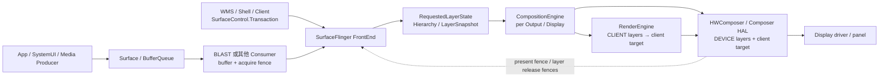
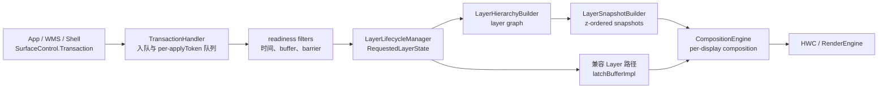
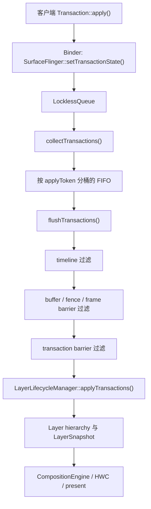

# SurfaceFlinger 合成、FrontEnd 与事务队列

SurfaceFlinger 接收 buffer 与 SurfaceControl transaction，生成 layer 快照，再交给 CompositionEngine 和 HWC。FrontEnd 状态、事务就绪条件和 latch 时刻共同决定一次窗口更新何时进入当前合成周期。

## Layer、合成策略与 present

### SurfaceFlinger 位于哪一段

应用完成一帧渲染并提交 buffer 后，显示流程仍没有结束。SurfaceFlinger 要接收 buffer 与 `SurfaceControl.Transaction`，更新 Layer 层级，为每个 Display 构造可见内容，再与硬件合成器（Hardware Composer，HWC）协商合成方案并执行 present。

先约定贯穿全文的对象：Layer 是 SurfaceFlinger 组织合成内容的单位，transaction 是对一个或多个 Layer 属性或 buffer 的一组更新。FrontEnd 把客户端请求整理成 RequestedLayerState，再生成本轮可消费的 LayerSnapshot；CompositionEngine 按每个 Display 构造 Output。需要 GPU 合成的 CLIENT Layer 由 RenderEngine 先画成 client target，DEVICE Layer 则交给 HWC 的设备合成路径。fence 表示 buffer 何时可读、可复用或完成 present。

Android 17 标准窗口的主路径可以概括为：



这张图有两个边界。SurfaceFlinger 处理 Layer 与 Display，不了解 App 内部的 View 或 Compose 节点。设备合成与客户端合成可以在同一帧同时出现：RenderEngine 先生成 client target，HWC 再把它与可由设备处理的 Layer 一起提交显示。

源码分析以 `android-17.0.0_r1` 为当前锚点。Android 12 的 `INVALIDATE/REFRESH` 只用于解释旧 Trace，Android 13 之后按 `commit/composite` 主线阅读。

### 四项核心职责

#### 1. 管理 Transaction 与 Layer 状态

来自应用、WindowManager、WM Shell、SystemUI、媒体组件的 `SurfaceControl.Transaction` 最终进入 SurfaceFlinger。Transaction 可以同时修改多个 Layer 的 buffer、位置、裁剪、alpha、可见性、父子关系、z-order（前后显示顺序）、dataspace（色彩空间与传递特性等颜色描述）和 frame timeline 信息。

Android 17 的 FrontEnd 将客户端请求整理成服务器侧状态：

- `TransactionHandler` 收集并筛选可提交的 transaction；
- `LayerLifecycleManager` 维护 `RequestedLayerState` 与 Layer 生命周期；
- `LayerHierarchyBuilder` 构造父子、relative-z（相对另一个 Layer 的前后顺序）与镜像关系；
- `LayerSnapshotBuilder` 生成按 z-order 排列的 `LayerSnapshot`；
- CompositionEngine 和输入、无障碍等消费者读取 snapshot。

这套结构划清了“客户端请求”与“本帧合成状态”的边界。当前源码仍保留部分 legacy `Layer`（兼容旧实现的 Layer 对象）互操作，但分析 Android 17 合成时，应优先跟踪 FrontEnd state、snapshot 和 Output。

#### 2. 参与 VSync 调度与帧目标计算

HWC 的硬件 VSync callback 为预测器提供样本，Scheduler 的 VSync schedule、dispatch 与 EventThread 生成应用和系统侧的调度事件。`VsyncModulator` 调整 app/SF work duration 与 phase，但它不代表完整的 VSync 分发实现。

SurfaceFlinger 还创建 DisplayEventConnection，让应用侧 Choreographer 等消费者接收软件 VSync。SF 自身的帧信号进入 `Scheduler::onFrameSignal()`。Android 17 会先为 pacesetter display（提供调度基准的显示器）和可参与本轮的 follower display（跟随该节拍的显示器）计算 `FrameTarget`，也就是本轮期望呈现时间与 deadline 等目标，再决定 commit 与 composite。

详细的预测、phase 与 VSync-app/VSync-sf 关系见 [2.3 VSync、Choreographer 与 SurfaceFlinger 调度](03-vsync-choreographer-sf-scheduling.md)。这里关注 SF 收到帧信号后的工作。

#### 3. 为每个 Display 选择并执行合成方案

FrontEnd snapshot 是全局 Layer 状态，CompositionEngine 的 Output 面向具体 Display。它会根据 layer stack（分配给某个显示输出的一组 Layer）、projection（从 Layer 空间映射到 Display 的变换）、可见区域、damage（本帧发生变化的区域）、色彩与输出能力构造该 Display 的 OutputLayer 集合，再与 HWC 协商 CLIENT/DEVICE 等 composition type（合成方式）。

同一个 Layer 可能经镜像或虚拟显示出现在多个 Output。每个物理 Display 有自己的 frame target、HWC state、present fence 和 deadline，不能使用默认屏的结果解释外接屏。

#### 4. 跟踪 buffer、fence 与 FrameTimeline

SurfaceFlinger 需要知道：

- 哪个 buffer 已随 transaction 到达；
- Producer completion/acquire fence 是否满足读取条件；
- 哪个 buffer 被本帧 snapshot 选中；
- RenderEngine client target 何时可供 HWC 读取；
- HWC 何时不再使用各 Layer buffer；
- 该 Display 的 present 工作何时到达完成边界。

这些状态决定 buffer 能否 latch、是否复用旧内容、是否产生 backpressure（下游未及时释放 buffer，反过来限制 Producer），也为 FrameTimeline 的 App `SurfaceFrame` 与 SF `DisplayFrame` 提供时间归因。

### Layer：从层级关系得到显示顺序

#### Layer 与 View 没有一一映射

普通 Activity 的整棵 View 树通常绘制进一个 App Window buffer，SurfaceFlinger 看到的是宿主窗口 Layer。`SurfaceView`、视频、相机、壁纸、系统栏、输入法、截图动画、transition leash（窗口过渡期间临时承载动画的父 Layer）和 display decoration（圆角遮罩等显示装饰）可能引入更多 Layer。

Android 17 的 `SurfaceView` 还可能维护容器 Layer、BLAST buffer Layer 和背景 color Layer。Layer 数量增加只说明 SurfaceControl 层级发生变化；还要结合 owner pid/uid（创建者的进程与用户标识）、parent、layer stack、buffer 和 transaction 确认来源。

#### z-order 是层级遍历结果

FrontEnd README 对绘制顺序给出了明确规则：

- Layer 形成类似 scene graph（场景中对象及其父子关系图）的层级；
- relative-z Layer 按 relative parent 参与排序；
- 负 z 子节点位于 parent 下方；
- 非负 z 子节点位于 parent 上方；
- 相同 z 值还需要稳定的次序，客户端不应依赖创建先后来控制关键遮挡关系。

下面的伪代码用于说明从底到顶的遍历：

```text
traverseBottomToTop(node):
  visit children and relative children with z < 0
      sorted by z and stable tie-break
  visit node
  visit children and relative children with z >= 0
      sorted by z and stable tie-break
```

`LayerSnapshot` 还保存 `globalZ`（全局显示顺序）、变换后边界、crop（裁剪范围）、透明度、圆角、shadow（阴影参数）、dataspace、buffer、damage、frame rate 等合成输入。CompositionEngine 会再按目标 Output 过滤不可见或不属于该 layer stack 的 snapshot。

#### 可见不等于本周期有新 buffer

一个可见 Layer 没有新 buffer 时，SurfaceFlinger 可以继续使用上次选中的内容。视频以 24/30 fps 更新、Display 以 60/120 Hz 刷新时，多次复用旧 buffer 可能符合设计。判断丢帧要检查 Producer 时间戳、目标 present、buffer 选择和 cadence（内容帧与显示刷新之间的节奏关系），不能要求每个 SF frame 都出现新 `BufferTX`。

### Transaction：状态原子性与 buffer 就绪是两回事

#### 合并与顺序

Transaction 把一组 Layer 修改作为一个提交单元。合并操作具有顺序语义：后写入的属性可以覆盖前值。Android 17 FrontEnd README 说明，transaction 按 `ApplyToken`（用于标识顺序队列的 token）建立队列；相同 `ApplyToken` 内保证顺序，不同 token 之间需要显式 barrier（屏障依赖）才能约束先后关系。

`TransactionHandler` 使用 `LocklessQueue<QueuedTransactionState>` 接收 transaction；这里的 `LocklessQueue` 是入队所用的无锁队列模板。commit 时先调用 `collectTransactions()`，再由 ready filter（就绪筛选器）检查条件，并按每个 `ApplyToken` 的 pending FIFO（先进先出待处理队列）执行 `flushTransactions()`。readiness（可提交条件）会考虑 fence、present time、barrier 与 unsignaled buffer。transaction barrier 的默认 TTL（依赖的最长保留时间）是 5 秒，用于避免依赖永久悬挂。

这里的 lockless queue 只说明 transaction 入队结构。SurfaceFlinger 主流程仍会在 snapshot、display state 和 legacy 互操作处使用相应锁；不能据此推断 commit 全程无锁。

#### 原子提交不保证像素已经可读

一笔 transaction 可以原子地表达“新 buffer、位置和裁剪一起生效”。buffer 的 Producer 仍可能异步写入，acquire fence 负责保护内容。Android 13 起支持受限的 unsignaled buffer latch（fence 尚未 signal 时提前接纳 buffer）模式。满足策略条件的简单更新可以先推进 transaction readiness，但 RenderEngine/HWC 真正读取内容前仍要等待 fence 允许。

SyncTransaction、WMS transition sync（WindowManager 为窗口过渡组织的同步）与应用的 `SurfaceSyncGroup`（应用侧把多个 Surface 更新纳入同一同步组的接口）覆盖的参与者和等待条件并不完全相同。排查跨窗口动画时，先确认哪些 Surface 被加入同一个同步组，再检查 transaction barrier、buffer readiness 和 callback；屏幕上同时移动不代表它们自动属于同一同步事务。

### BLAST：标准 App Window 的 buffer 怎样进入 SF

#### Android 11 进入主线

BLASTBufferQueue 从 Android 11 起进入 AOSP 主窗口路径。它把 BufferQueue Consumer 与 `SurfaceControl.Transaction` 更紧密地结合，使 buffer、frame number（Producer 为 buffer 分配的递增帧号）、dataspace、damage、transform（旋转、缩放等几何变换）和窗口几何状态可以按同一帧语义提交。

Android 12 的变化体现在观察能力上：FrameTimeline、VSync ID、expected/actual present 让 buffer transaction 与显示帧更容易对齐。BLAST 并非 Android 12 才出现。

#### Android 17 标准窗口链

标准 App Window 通常沿下面的顺序进入 SurfaceFlinger：

```text
App RenderThread / Producer
  queueBuffer(slot, producer completion fence)
    → App 进程内 BLAST Consumer
      onFrameAvailable()
      acquireNextBufferLocked()
      Transaction::setBuffer(surfaceControl, buffer, acquireFence, frameNumber, ...)
      Transaction::setFrameTimelineInfo(...)
      merge geometry / sync transaction when required
      apply()
        → SurfaceFlinger FrontEnd
          TransactionHandler
          RequestedLayerState / LayerSnapshot
```

普通 BLAST 窗口中的 BufferQueue acquire 常发生在应用进程的 BLAST Consumer，SurfaceFlinger 接收带 buffer 和 fence 的 transaction。把所有现代窗口都写成“SurfaceFlinger 直接调用 BufferQueue `acquireBuffer()`”会混淆进程与所有权。

SurfaceFlinger 不再使用 buffer 后，通过 release callback（释放回调）把完成信息返回 BLAST，再由 BLAST 释放对应的 `BufferItem`（BufferQueue 中记录 buffer、slot、fence 等信息的条目）。`queueBuffer()`、BLAST acquire、`BufferTX - <layerName>` 增加、SF latch、HWC present 与 release callback 都是不同时间点。

### Android 17 主循环：`onFrameSignal → commit → composite`

#### Scheduler 先按 Display 建立 FrameTarget

Android 17 的主入口在 `Scheduler::onFrameSignal()`。下面的结构摘录保留关键分支：

```cpp
// frameworks/native/services/surfaceflinger/Scheduler/Scheduler.cpp
// AOSP android-17.0.0_r1，结构摘录
void Scheduler::onFrameSignal(ICompositor& compositor,
                              VsyncId vsyncId,
                              TimePoint expectedVsyncTime) {
    pacesetterPtr->targeterPtr->beginFrame(
            beginFrameArgs, *pacesetterPtr->schedulePtr);

    FrameTargets targets;
    targets.try_emplace(pacesetterPtr->displayId,
                        &pacesetterPtr->targeterPtr->target());
    // 遍历 follower display，调用 targeter.beginFrame()，
    // 再把本轮可 present 的目标加入 targets。

    if (!compositor.commit(pacesetterPtr->displayId, targets)) {
        compositor.sendNotifyExpectedPresentHint(pacesetterPtr->displayId);
        mSchedulerCallback.onCommitNotComposited();
        return;
    }

    FrameTargeters targeters;
    targeters.try_emplace(pacesetterPtr->displayId,
                          pacesetterPtr->targeterPtr.get());
    // 把 commit 后仍可 present 的 follower targeter 加入 targeters。

    const auto resultsPerDisplay =
            compositor.composite(pacesetterPtr->displayId, targeters);
    compositor.sendNotifyExpectedPresentHint(pacesetterPtr->displayId);
    compositor.sample();

    for (const auto& [id, targeter] : targeters) {
        const auto resultOpt = resultsPerDisplay.get(id);
        targeter->endFrame(*resultOpt);
    }
}
```

源码会分别处理 pacesetter 与 follower display 的 deadline、present fence backpressure（上次 present 尚未完成而形成的反压）和 lockstep（多个 Display 需要同步推进）条件。摘录省略了 follower 的循环判断；系统先生成 `FrameTargets`，`commit` 返回 `false` 时本轮不会进入 `composite`。

#### `commit()`：准备本帧合成状态

Android 17 的 `SurfaceFlinger::commit(PhysicalDisplayId, FrameTargets)` 主要处理：

1. 检查 display mode transition（分辨率或刷新率等显示模式切换）、HWC backpressure 和本帧目标；
2. 为 FrameTimeline 记录 SF wake-up；
3. 清理 transaction flag，进入 `updateLayerSnapshots()`；
4. 收集、筛选和应用 transaction；
5. 更新 Layer 生命周期、层级与 snapshot；
6. latch 可用的新 buffer，并发送 transaction commit callback（表示 transaction 已由 SF 提交的回调）；
7. 更新可见区域、输入、Layer history 与刷新率选择；
8. 根据 transaction、buffer、Display/HWC 请求判断 `mustComposite`（本轮是否必须进入合成阶段）。

`updateLayerSnapshots()` 会执行 `TransactionHandler:flushTransactions`、`LayerLifecycleManager.applyTransactions()`、`LayerHierarchyBuilder.update()` 与 `LayerSnapshotBuilder:update`。看到 commit 变长时，还要区分 transaction 数量、Layer 创建销毁、hierarchy/geometry（层级或几何属性）变化、buffer latch 和锁等待。

`commit` 返回 `false` 可能只是本轮没有需要提交到显示的变化，也可能受 mode set 或 backpressure 分支影响。没有 composite slice 不能自动归为丢帧。

#### `composite()`：把 snapshot 交给各个 Output

`SurfaceFlinger::composite()` 构造 `CompositionRefreshArgs`（一次合成刷新所需参数的集合），把物理/虚拟 Display 对应的 Output 和 frame target 交给 CompositionEngine。每个 Output 会建立自己的 `OutputLayer`，也就是某个全局 Layer 在该 Display 上的合成表示。Output 的主流程包括：

1. 更新输出与 Layer composition state；
2. 重建该 Output 的可见 Layer stack；
3. 规划并写入 HWC Layer 状态；
4. `beginFrame()` 根据 dirty（输出内容或状态是否变化）与 `mMustRecompose` 判断是否重做合成；
5. `prepareFrame()` / `prepareFrameAsync()` 选择 composition strategy（CLIENT、DEVICE 等类型的组合方案）；
6. 需要 CLIENT 时由 RenderEngine 生成 client target；
7. `presentFrameAndReleaseLayers()` 执行 present 并分发 fence。

Android 17 在特定条件下可把 GPU-backed virtual display composition（以 GPU 生成虚拟显示输出）放到后台执行器，但这条路径受功能开关、RenderEngine 是否支持 threaded（在独立线程执行）以及物理 Display 是否使用 client composition 等条件约束。不能把多显示场景概括成“全部并行合成”。

### Android 12 与 Android 13+ 的主循环边界

#### Android 12：`INVALIDATE / REFRESH`

`android-12.0.0_r1` 的 `SurfaceFlinger::onMessageReceived()` 处理 `MessageQueue::INVALIDATE` 与 `MessageQueue::REFRESH`。旧 Trace 中的 `onMessageInvalidate`、`onMessageRefresh`、`INVALIDATE` 和 `REFRESH` 属于这套消息模型。

INVALIDATE 侧处理 transaction、Layer/buffer 状态和脏区；REFRESH 侧推进合成与 present。阅读 Android 12 源码或 Trace 时，应使用该版本的方法与 slice。

#### Android 13 起：`commit / composite`

Android 13 的 MessageQueue handler 已直接进入 `commit()` 与 `composite()`。Android 14 进一步由 `Scheduler::onFrameSignal()` 统一帧入口。Android 17 延续这条主线，并把 per-display `FrameTargeter`、FrontEnd snapshot 和 CompositionEngine Output 纳入当前实现。

`INVALIDATE/REFRESH` 适合解释 Android 12 历史，不能用作 Android 17 的源码调用名。版本对比时先确认系统 build 和 tag，再搜索对应 slice。

### Client Composition 与 Device Composition

#### CLIENT：RenderEngine 生成 client target

当 HWC 要求某些 Layer 使用 `Composition.CLIENT` 时，SurfaceFlinger 通过 RenderEngine 把这些 Layer 按顺序绘制进一个 client target。RenderEngine 后端可使用基于 OpenGL 的 SkiaGL 或基于 Vulkan 的 SkiaVk，具体选择取决于设备配置与系统 build。

client target 连同它的 acquire fence 一起交给 HWC；该 fence 告诉 HWC 何时可以读取 RenderEngine 的输出。HWC 再把它作为一个输入，与仍为 DEVICE、CURSOR、SIDEBAND 等类型的 Layer 一起 present。CLIENT composition 会使用 GPU 和内存带宽，但成本取决于 client Layer 的像素覆盖、格式、色彩转换、blur、shadow、缩放和 GPU 状态，不能按 Layer 数量直接换算。

#### DEVICE：Composer 负责该 Layer

Composer3 对 `Composition.DEVICE` 的定义是设备必须通过 hardware overlay（不先写入 GPU client target 的硬件叠加路径）或其他类似方式处理该 Layer。具体实现可能涉及 DPU/display controller 的 plane（可独立扫描输出的硬件图层通道）、scaler（缩放单元）、color pipeline（色彩处理单元）或厂商内部资源。

DEVICE composition 通常可以减少 SF 的 GPU client composition 工作，但仍有 validate、state programming（向显示硬件配置本帧状态）、fence、带宽和显示硬件成本。某个 Layer 能否保持 DEVICE 由整屏 Layer 集合和设备能力共同决定。

#### 混合合成是常见结果

同一 Display 可以同时包含：

- DEVICE：视频、简单不透明 Layer 或设备能直接处理的内容；
- CLIENT：需要 RenderEngine 处理的 Layer；
- client target：CLIENT Layer 的合成结果；
- SOLID_COLOR（纯色）、CURSOR（硬件光标）、SIDEBAND（不经普通 BufferQueue 提交内容的旁路流）、DISPLAY_DECORATION（显示装饰）和 REFRESH_RATE_INDICATOR（刷新率指示）等 Composer3 类型。

Android 17 AIDL `Composition.aidl` 中没有通用 `CLIENT_BYPASS` 枚举。厂商日志若出现额外类型，应按 vendor 扩展记录设备、版本和日志来源。

#### 哪些因素会改变策略

下面这些条件可能影响 HWC 决策，但 AOSP 不规定统一 plane 数量或固定降级公式：

- buffer format、modifier（内存排布修饰信息）、usage（生产者与消费者的用途标记）、dataspace 与 HDR metadata（高动态范围内容的描述信息）；
- crop、scale、rotation、blend、alpha、rounded corner 和 color transform；
- protected content（受保护、不能走普通非安全路径的内容）与 secure display 要求；
- overlay plane、scaler、色彩单元和内存带宽是否被其他 Layer 占用；
- Display 分辨率、刷新率、输出模式和厂商功耗策略；
- transition leash、SystemUI、IME（输入法窗口）、dim Layer（用于压暗背景的半透明 Layer）和多个视频流形成的整屏组合。

验证策略变化要看该帧的 composition type、Layer 属性、RenderEngine slice、HWC/vendor trace 和 present 结果。只看功耗或某条 SF slice 变短，证据不足。

### HWC 协商：validate、presentOrValidate 与 present

#### Android 17 调用关系

CompositionEngine 的 `Display::chooseCompositionStrategy()` 调用 `HWComposer::getDeviceCompositionChanges()`。后者根据当前是否已有 client composition 与 earliest-present（HWC 允许本帧最早 present 的时间）条件，决定能否尝试 `presentOrValidate()`。

下面的控制流用于避免重复计算 present 调用：

```text
getDeviceCompositionChanges(display)
  canSkipValidate =
      no current client composition
      AND (Composer 支持 expected-present，或当前已到 earliest-present)

  if canSkipValidate:
    presentOrValidate()
    if state == PresentSucceeded:
      保存 present fence 与 layer release fences
      validateWasSkipped = true
      return
    # 否则本次调用完成 validate
  else:
    validate()

  读取 changed composition types / display requests / layer requests
  读取 client target property / requested layer LUTs
  acceptChanges()

如最终存在 CLIENT layer:
  RenderEngine 生成 client target
  setClientTarget(client target, acquire fence)

presentAndGetReleaseFences()
  if validateWasSkipped:
    executeCommands()       # 不再调用第二次 present
  else:
    等待 earliest-present（若需要）
    present()
    getReleaseFences()
```

`PresentSucceeded` 是 `presentOrValidate()` 的返回状态，表示 Composer HAL 已执行 present 分支并返回 fence；它不代表面板扫描完成。普通 validate 分支要等 composition changes 被接受、client target 准备好之后，才调用 present。

#### AIDL 与 HIDL 边界

Android 13 起 Composer3 AIDL（Android Interface Definition Language，Android 接口定义语言）进入平台主线。Android 17 的 SurfaceFlinger 仍通过 `ComposerHal` 抽象保留 AIDL/HIDL 适配实现；HIDL 是较早的 HAL 接口定义体系，设备实际使用哪条 vendor HAL 路径要看 VINTF（系统与 vendor 接口兼容性清单）和运行时注册的服务。

分析 framework 调用时优先使用：

- SF/HWC2 侧：`validate()`、`presentOrValidate()`、`present()`；
- ComposerHal 侧：`validateDisplay()`、`presentOrValidateDisplay()`、`presentDisplay()`。

不要把两层方法名写成同一个类的方法，也不要把旧 HIDL composition 枚举与当前 AIDL 新增值混在一张无版本表里。

### Buffer 与 fence：四种完成边界

以下时间线把 Layer buffer、client target 和 Display present 分开：

```text
App / Producer
  queueBuffer(buffer, producer completion fence)
        │
BLAST / SurfaceControl transaction
  setBuffer(buffer, acquire fence)
        │
SurfaceFlinger FrontEnd
  transaction ready → snapshot / latch
        │ acquire fence 仍保护 buffer 内容
CompositionEngine
  ├─ DEVICE layer ────────────────────────────────┐
  └─ CLIENT layers → RenderEngine client target┤
                         + client-target fence   │
                                                 ▼
Composer HAL / HWC
  validate / present
  ├─ per-layer release fences → buffer 可在满足条件后复用
  └─ per-display present fence → 本次 Display present 完成边界
```

四种边界分别回答不同问题：

1. Producer completion/acquire fence：新 buffer 何时可读；
2. client-target acquire fence：HWC 何时可读取 RenderEngine 输出；
3. Layer release fence：Consumer 何时不再使用对应 Layer buffer；
4. Display present fence：一次 Display present 何时到达显示栈完成边界。

present fence 属于 Display，不属于某个 App Window。它也不能覆盖面板扫描、像素响应和用户感知时间；触摸到光子的测量还需要 driver trace 或外部仪器。

### 下游变慢怎样反压到 App

SurfaceFlinger/HWC 长时间持有 Layer buffer 或 release callback 积压时，可复用 slot 会减少。Producer 下一次 `dequeueBuffer()` 或 HWUI 的 `reserveNext()` 可能等待 FREE slot 与 release fence，于是 App RenderThread 被下游反压。

这条因果关系要按同一 Layer 和相邻 frame number 验证：

1. App 是否及时 `queueBuffer()`；
2. BLAST 是否生成对应 `BufferTX`；
3. SF 是否 latch，acquire fence 是否及时 signal；
4. HWC/SF 何时返回 release fence；
5. BLAST 何时 release BufferItem；
6. Producer 的 `dequeueBuffer()` 等待是否随之结束。

RenderThread `dequeueBuffer()` 长不能单独证明 SurfaceFlinger 慢。max dequeued/acquired、async mode、shared buffer mode、buffer allocation、surface resize 和 Producer 自己持有 slot 也会影响结果。详细的状态机与 fence 生命周期见 [2.8 BufferQueue、Gralloc 与 Sync Fence](08-bufferqueue-gralloc-sync-fence.md)。

### Perfetto：从 App SurfaceFrame 追到 DisplayFrame

#### 先区分两类 token

FrameTimeline 用 token（跨轨道关联同一帧记录的标识）串起不同阶段：

- App `SurfaceFrame` 使用 `surface_frame_token` 关联应用工作与 Layer 提交；
- SF `DisplayFrame` 使用 `display_frame_token` 表示一次显示合成；
- 一个 DisplayFrame 可以包含多个进程、多个 Layer 的 SurfaceFrame。

两类 token 不能合成一个“全程 VSync ID”。分析时先用 process/layer 锁定 App SurfaceFrame，再查看它进入哪个 DisplayFrame。

#### SurfaceFlinger 主线程常见 slice

Android 17 userdebug/eng（保留较多调试能力的系统构建类型）Trace 中可关注：

- `commit <vsyncId>`；
- `composite <vsyncId>`；
- WorkloadTracer 的 `Commit`、`Composition`；
- `Transaction Handling`、`TransactionHandler:flushTransactions`；
- `LayerSnapshotBuilder:update`；
- `Refresh Rate Selection`；
- CompositionEngine `prepareFrame`、`chooseCompositionStrategy`；
- `presentAndGetReleaseFences`、`wait for earliest present time`；
- `postComposition` 或对应 present 后处理。

具体名称受 build、功能开关、Trace category（采集配置中启用的数据类别）和厂商插桩影响。某个 slice 缺失时，先检查 trace config 和源码宏，不能按颜色或固定名字判定阶段不存在。

#### Buffer 与 Layer 轨道

标准窗口可继续查看：

- App 的 `dequeueBuffer`、`queueBuffer`；
- BLAST acquire/release callback；
- `BufferTX - <layerName>` pending 数量，也就是尚待 SF 处理的 buffer transaction 数；
- Layer buffer id、frame number、desired present time；
- acquire/release/present fence；
- SurfaceFlinger Layer lifecycle、transaction 与 latch 事件。

`BufferTX` 增加只表示 pending buffer transaction 增加。要确认系统采纳本帧，还需看到目标 Layer 的 transaction/latch 与关联 DisplayFrame。

#### composition 与显示轨道

判断 CLIENT/DEVICE 时查看：

- CompositionEngine/RenderEngine 是否生成 client target；
- 每个 Layer 的 composition type；
- GPU composition 或 client composition slice；
- HWC validate/present、DisplayHAL 与厂商 DPU trace；
- per-display present fence、FrameTimeline present/jank type。

`dumpsys SurfaceFlinger` 适合查看 Layer 树、Display、buffer 和 composition type 快照；它不能还原几百毫秒前某一帧的时序。Perfetto、dump 和 vendor log 应在相同设备状态下采集。

#### 常用快照命令

下面的命令用于采集当前状态，具体 section 随版本和 build 变化：

```bash
adb shell dumpsys SurfaceFlinger
adb shell dumpsys SurfaceFlinger --list
adb shell dumpsys SurfaceFlinger --display-id
```

快照中先确认目标 Layer 名、owner（创建该 Layer 的进程）、parent、layer stack、active buffer、composition type 与目标 Display，再回到 Perfetto 对齐发生时刻。不要用一次静态 dump 代替连续帧证据。

### 七种常见 Jank 组合

| 现象 | 优先检查 | 可排除前不要下的结论 |
|:---|:---|:---|
| App SurfaceFrame 已晚，SF 复用旧 buffer | App UI/RT、GPU、queue time、acquire fence | SF commit 长未必是首因 |
| `commit` 长，transaction/layer 数突增 | transaction burst、Layer 创建销毁、hierarchy/snapshot、锁与 Binder | 不能直接归因 GPU |
| `composite` 中 RenderEngine 长 | CLIENT Layer、damage、blur/HDR/color transform、SF GPU queue | 不能只按 Layer 数量优化 |
| HWC validate/present 长 | Composer HAL、DPU/driver、fence、mode/color change | DEVICE composition 仍有成本 |
| SF runnable delay（线程已可运行但尚未获得 CPU 的等待）长 | `sched_wakeup/sched_switch`、CPU/cgroup、优先级、系统负载 | 线程没有运行时不能算函数耗时 |
| App `dequeueBuffer` 长，SF/HWC release 晚 | slot 状态、release fence、BLAST callback、Display present | 固定“三缓冲耗尽”解释不完整 |
| App 和 SF CPU 都按时，DisplayFrame 晚 | GPU completion、DisplayHAL、present fence、prediction/mode switch | App `queueBuffer` 按时不代表已显示 |

#### FrameTimeline jank type 是分类入口

Android 17 可见的分类包括 App deadline、SurfaceFlinger CPU/GPU deadline、DisplayHAL、SurfaceFlinger scheduling、Buffer Stuffing（Producer 提交过快造成 buffer 堆积）和 Prediction Error（预测呈现时间与实际情况不符）等。分类由时间关系推导，适合选择下一组证据；它不提供业务代码或 vendor driver 的根因。

例如 `SurfaceFlingerCpuDeadlineMissed` 出现时，仍要区分主线程执行过长和 runnable delay；`SurfaceFlingerGpuDeadlineMissed` 还要确认是 RenderEngine、App GPU 竞争还是其他 GPU 客户端；`DisplayHAL` 要继续进入 Composer/driver/present。

#### SF 主线程卡顿的影响范围

SurfaceFlinger 是系统级服务，同一主线程上的 transaction、snapshot 和部分 per-display 工作可能影响多个窗口。Android 17 又按 pacesetter/follower display 计算 frame target，并可在满足条件时 offload（转交后台执行器）虚拟显示合成，因此影响范围要按目标 Display 和当轮 Output 判断。

同一 Display 上，SF commit/composite 迟到可能让多个 App 的内容一起错过 DisplayFrame deadline。某个 App 没有新 buffer 时，其他 Layer 仍可更新；是否整屏重复旧帧取决于该轮合成与 present 结果。

### 多窗口与多 Display

#### 多窗口共享整屏 HWC 约束

分屏、PiP（画中画）、freeform（自由窗口）、Dialog、IME、SystemUI 与 transition leash 会形成同一 Display 的可见 Layer 集合。HWC 按整套 Layer 状态选择策略，因此 App A 的 alpha/scale、视频格式或 protected Layer 可能改变 App B 所在 Display 的 composition 方案。

窗口数量多不必然触发 CLIENT；单个具有复杂色彩或特效的 Layer 也可能要求 RenderEngine。比较前后策略时，应记录整个可见 Layer 集合、Display mode 和 Composer 输出。

#### per-display frame target 与 fence

Android 17 `Scheduler::onFrameSignal()` 先为 pacesetter display 建立目标，再计算 follower display 是否参与本轮。`FrameTargeter` 会考虑 expected present、pending present fence 与 backpressure。每个 Display 最终拥有自己的 present fence。

多显示排查至少按 `displayId` 分组：

- refresh rate 与 expected present；
- Output 可见 Layer；
- composition strategy；
- HWC validate/present；
- present fence 与 DisplayFrame。

默认屏按时不能证明外接屏按时。镜像场景还要确认 Layer snapshot 如何映射到两个 Output。

### Kernel 与 vendor driver 边界

kernel 基线固定为 `android17-6.18-2026-06_r6`：

- `drivers/dma-buf/dma-buf.c`：跨设备共享 buffer 的通用 dma-buf 对象；dma-buf 让不同设备驱动引用同一块缓冲内存；
- `drivers/dma-buf/dma-fence.c`：描述异步工作完成依赖的 dma-fence；
- `drivers/dma-buf/sync_file.c`：把一个或一组 fence 封装成 `sync_file` 文件描述符，以便跨进程传递；
- `include/linux/dma-fence.h`：通用 fence 接口与语义。

AOSP SurfaceFlinger 能说明 framework 怎样传递 buffer/fence、调用 Composer HAL 和记录 FrameTimeline。Overlay plane 分配、内存带宽投票、secure path（受保护内容使用的安全显示链路）、DRM/KMS atomic commit（Linux 显示子系统一次性提交完整显示状态）与 panel 时序由厂商 HAL/driver 决定。Android 设备也不保证使用与主线一致的 DRM/KMS 实现。

当 present 或 release fence 迟到时，需要把 Composer HAL、vendor display trace、GPU/DPU frequency、DRM/display driver、IOMMU（设备访问内存时使用的地址映射与隔离单元）和内存带宽放在同一时间轴。通用 dma-fence 只描述依赖关系，不解释硬件任务为何执行过慢。

### Android 11—17 版本演进

| 版本 | 已核对的主线变化 | 阅读与排查口径 |
|:---|:---|:---|
| Android 11 / API 30 | BLASTBufferQueue 进入主窗口 AOSP 路径 | buffer 与窗口 geometry transaction 可以按同帧语义组织 |
| Android 12 / API 31 | SurfaceFlinger 仍使用 `onMessageReceived()` 的 INVALIDATE/REFRESH；FrameTimeline 成为现代诊断入口 | 旧 Trace 用 INVALIDATE/REFRESH，App SurfaceFrame 与 DisplayFrame 分开分析 |
| Android 13 / API 33 | 主循环进入 `commit/composite`；Composer3 AIDL 进入平台；默认 unsignaled latch 策略有严格适用条件 | 不能沿用 Android 12 方法名；简单单 Layer buffer update 与跨 Layer sync 要分开 |
| Android 14 / API 34 | `Scheduler::onFrameSignal()` 统一 commit/composite 帧入口 | VSync 调度与 SF 工作由 Scheduler/FrameTarget 证据关联 |
| Android 15 / API 35 | 源码已有 per-display `FrameTargeter`，以及带 `PhysicalDisplayId`、`FrameTargets/FrameTargeters` 的 commit/composite 参数；支持 ARR 的设备可以在一个显示模式内改变 VSync 周期 | 多显示按 displayId、target、present fence 分开；SF deadline 与 present 不能再按固定 60/120 Hz 周期推断 |
| Android 16 / API 36 | 延续 per-display frame target 与 pacesetter/follower 调度结构 | 不能把 Android 15 已存在的参数和类误记成 Android 16 首次引入 |
| Android 17 / API 37 | 当前锚点：FrontEnd transaction/snapshot、`commit(PhysicalDisplayId, FrameTargets)`、`composite(...FrameTargeters)`、AIDL Composer3/HWComposer 协商 | 所有当前方法名、composition type 和 fence 分支按 `android-17.0.0_r1` 解释 |

这张表只把已核对的版本差异写成“该版本存在”。判断某个内部类或优化是否首次出现，需要继续比较父 tag 与提交历史。

### 常见边界

#### App 按时 `queueBuffer()` 只覆盖 Producer 提交点

后面还有 BLAST acquire、SF transaction、latch、acquire fence、composition 和 present。即使 App 与 SF 的 CPU 工作都按时，也不能据此证明 DisplayFrame 正常。

#### commit 长不等于所有时间都在合成像素

`commit` 主要处理 transaction、Layer state、snapshot、buffer latch、refresh rate 和 callback。RenderEngine 绘制与 HWC present 位于后续 `composite`/Output 流程。

#### DEVICE composition 不代表“零 GPU”

它说明该 Layer 由 Composer 设备路径处理。其他 CLIENT Layer、App 渲染和 SurfaceFlinger 特效仍可占用 GPU，HWC/DPU 也有带宽与同步成本。

#### Layer 退回 CLIENT 没有跨设备固定阈值

HWC 能力和策略来自 vendor 实现。plane 数量、格式、缩放、HDR、保护内容和带宽要以目标设备的 HAL/driver 与当帧可见集合为准。

#### present fence 不代表光学呈现完成

它是 Display present 的同步边界。panel scanout、像素响应和用户观察时间还在其后。

### Android 17 源码锚点

| 要验证的结论 | 源码入口 |
|:---|:---|
| 帧信号、pacesetter/follower 与 commit/composite | `services/surfaceflinger/Scheduler/Scheduler.cpp` |
| commit、snapshot、composite、FrameTimeline | `services/surfaceflinger/SurfaceFlinger.cpp` |
| transaction 队列、readiness、barrier TTL | `services/surfaceflinger/FrontEnd/TransactionHandler.*` |
| RequestedLayerState、hierarchy、z-order、snapshot | `services/surfaceflinger/FrontEnd/` |
| Output 可见层、strategy、client target、present | `services/surfaceflinger/CompositionEngine/src/Output.cpp`、`Display.cpp` |
| `validate`/`presentOrValidate`/`present` 与 fence | `services/surfaceflinger/DisplayHardware/HWComposer.cpp`、`HWC2.cpp` |
| AIDL/HIDL Composer 适配 | `services/surfaceflinger/DisplayHardware/AidlComposerHal.*`、`HidlComposerHal.*` |
| AIDL composition type 与 DisplayCommand | `hardware/interfaces/graphics/composer/aidl/.../composer3/` |
| BLAST buffer transaction 与 release callback | `frameworks/native/libs/gui/BLASTBufferQueue.cpp` |
| BufferQueue slot 与 fence | `frameworks/native/libs/gui/BufferQueueProducer.cpp`、`BufferQueueConsumer.cpp` |
| kernel buffer/fence 语义 | `drivers/dma-buf/`、`include/linux/dma-fence.h` |

### Android 17 的 SurfaceFlinger 合成边界

SurfaceFlinger 把多个 Producer 的 buffer 与客户端 transaction 整理成 LayerSnapshot，再为每个 Display 构造 Output、选择合成方案并完成 present。Android 17 的当前主线是：

`Scheduler::onFrameSignal → SurfaceFlinger::commit → FrontEnd snapshot → SurfaceFlinger::composite → CompositionEngine → RenderEngine/HWComposer → present fences`

性能分析时按同一 App SurfaceFrame、Layer、DisplayFrame 和 displayId 依次检查：

1. Producer 是否按时提交 buffer；
2. BLAST 与 transaction 是否按时进入 SF；
3. commit 是否在 transaction、snapshot 或 latch 阶段变长；
4. composite 使用 CLIENT、DEVICE 还是混合方案；
5. RenderEngine、Composer HAL、driver 与 present fence 哪一段越过 deadline；
6. release 是否延迟并反压 App 的 buffer 周转。

这套顺序能把 App 迟到、SF CPU、SF GPU、HWC/display 与 buffer backpressure 分开。

## FrontEnd 状态与 Layer 快照

合成阶段消费的是 FrontEnd 处理后的 layer 状态。RequestedLayerState、生命周期和 snapshot 更新决定本轮合成能看到什么。

SurfaceFlinger 收到 `SurfaceControl.Transaction`（一次提交的一组图层状态更新）后，不能立即把每个字段原样交给 HWC（Hardware Composer，硬件合成器）。它还要处理四个问题：

1. 这笔 transaction 到了可以应用的时间吗？
2. 它携带的 buffer（图像缓冲区）、fence（同步栅栏）和 barrier（事务间依赖屏障）满足当前帧的条件吗？
3. layer（合成图层）的父子、relative Z（相对另一图层的 Z 轴顺序）和 mirror（镜像）关系变化后，本轮应按什么顺序遍历？
4. CompositionEngine（SurfaceFlinger 的合成策略组件）最终应读取哪份几何、可见性、内容和效果状态？

Android 17 的 SurfaceFlinger FrontEnd（前端状态层）位于这段边界上。它消费 transaction，维护 layer 的服务端请求状态和生命周期，构建可遍历的 layer 图，再生成 CompositionEngine 使用的 `LayerSnapshot`（包含继承与可见性计算结果的图层快照）。

下文的平台实现按 Android 17（API 37）的 `android-17.0.0_r1` 核对。acquire fence、release fence 和 dma-fence 的内核语义见 §2.8；这里集中说明 SurfaceFlinger 如何把 fence 用作 transaction readiness（事务就绪性）与 buffer 使用条件。

### 1. FrontEnd 的职责边界

FrontEnd 负责把客户端请求转换为当前帧可消费的状态，不覆盖完整的显示流水线。



这张图表示职责关系，不对应逐行调用栈。Android 17 的 `SurfaceFlinger::updateLayerSnapshots()` 主要按以下顺序执行：

1. `collectTransactions()` 把无锁入口队列中的 transaction 收到 pending queues（待处理队列）。
2. 新建 layer 先交给 `LayerLifecycleManager::addLayers()`。
3. `flushTransactions()` 只取出 readiness filters（就绪过滤器）判定可应用的 transaction。
4. `applyTransactions()` 把属性合入 `RequestedLayerState`。
5. `LayerHierarchyBuilder::update()` 更新 layer 图。
6. `LayerSnapshotBuilder::update()` 更新 snapshot（快照）。
7. 当前兼容路径继续让对应 `Layer` 执行 `latchBufferImpl()`，把已经就绪的 buffer 接入当前图层状态。
8. 后续 composition（合成阶段）把 snapshot 加入 `RefreshArgs`，再调用 `CompositionEngine::present()` 生成显示输出。

因此，下面三句话不能互相替换：

- transaction 已进入 `RequestedLayerState`；
- 新 buffer 已被 latch（接入图层状态）；
- 目标 display（显示设备）已经 present（提交显示）。

第一项是请求状态更新，后两项还涉及 buffer、fence、CompositionEngine、HWC 和显示设备。

### 2. FrontEnd 与旧 `Layer` 对象共存

Android 17 没有用 `RequestedLayerState` 完全替换旧的 `Layer` 对象。

`SurfaceFlinger` 同时持有：

- `mLayerLifecycleManager`
- `mLayerHierarchyBuilder`
- `mLayerSnapshotBuilder`
- `mLegacyLayers`

`updateLayerSnapshots()` 在更新 FrontEnd 状态和 snapshot 后，仍会找到对应的 legacy `Layer`（旧实现的图层对象），执行 `latchBufferImpl()`，并维护 release callback（buffer 可再次使用时的回调）、FrameTimeline 和 layer history（图层历史）。composition 阶段则把 snapshot 绑定到 `LayerFE`（CompositionEngine 读取图层状态的前端接口）。

这是一段共存实现。阅读 Android 17 源码时：

- layer 请求、层级、可见性与合成输入，优先从 FrontEnd 对象理解；
- buffer latch、release callback 和一部分历史兼容行为，仍要回到 `Layer`；
- 不要把 Android 12、13 的“逐个 `Layer` 更新全部状态”模型照搬到 Android 17；
- 也不能因为看到 FrontEnd，就假设所有 legacy 路径都已删除。

### 3. `RequestedLayerState` 保存什么

`RequestedLayerState` 的源码注释说明：它保存某个 layer 的客户端请求状态，不保存其他 layer 的状态。Android 17 中，它继承 `layer_state_t`：

```cpp
struct RequestedLayerState : layer_state_t {
    const uint32_t id;
    const std::string name;
    uint32_t parentId;
    uint32_t relativeParentId;
    std::shared_ptr<renderengine::ExternalTexture> externalTexture;
    ftl::Flags<Changes> changes;
    // ...
};
```

这段摘录只用于说明结构关系。transaction 携带的通用 layer 属性来自 `layer_state_t`；FrontEnd 再补上服务端身份、解析后的引用、buffer 对象、生命周期和变化索引。

#### 3.1 `layer_state_t::what` 与 `RequestedLayerState::Changes`

这两组 bitmask（位掩码）处在不同层次：

- `layer_state_t::what` 表示客户端 transaction 带来了哪些字段。
- `RequestedLayerState::Changes` 表示这些字段合并后，服务端哪些语义区域受到了影响。

例如，buffer 尺寸改变不只产生 `Changes::Buffer`，还会影响 `BufferSize` 和 `Geometry`；alpha（透明度）从 0 变为非 0 时，还会影响 `Visibility`。后续代码不必再次比较所有字段，可以根据变化类型决定更新范围。

Android 17 的 `Changes` 包含：

| 分组 | change flags（变化标志位） | 主要用途 |
| --- | --- | --- |
| 生命周期 | `Created`、`Destroyed` | 新建、销毁和 listener（监听器）回调 |
| 层级 | `Hierarchy`、`Z`、`Mirror`、`Parent`、`RelativeParent`、`AffectsChildren` | 更新图、排序和子节点继承 |
| 几何与可见性 | `Geometry`、`Visibility`、`VisibleRegion`、`Input` | 更新 bounds（边界）、遮挡和输入窗口 |
| 内容 | `Content`、`Buffer`、`SidebandStream`、`BufferSize`、`BufferUsageFlags`、`PostProcess` | 更新当前内容、旁路视频流及合成属性 |
| 策略 | `Metadata`、`FrameRate`、`GameMode`、`Animation` | 更新 metadata（附加元数据）、刷新率投票和调度提示 |

`kMustComposite` 是一组发生变化后需要推动 composition 的 flags，不包含全部 flags。例如，`FrameRate` 还会触发 attached Choreographer（绑定到该图层的 Choreographer）的刷新率更新；是否需要 composition 由各调用点分别判断。

#### 3.2 为什么 layer 关系保存为 id

`RequestedLayerState` 使用 `parentId`、`relativeParentId`、`layerIdToMirror`、`touchCropId` 等 id 表示跨 layer 关系，不再持有客户端 handle（对象引用句柄）。这样可以避免状态对象因保存 handle 而意外延长其生命周期。

对应的引用关系由 `LayerLifecycleManager` 维护。这个区别很重要：

- id 是关系的稳定标识；
- handle 是否仍存活，是生命周期条件；
- layer 是否仍有 parent，是另一个生命周期条件；
- “从可见层级不可达”和“对象可以销毁”也不是同一件事。

#### 3.3 请求状态不等于最终状态

客户端的 `setPosition()` 只提供局部位置请求。`LayerSnapshotBuilder` 还要叠加以下状态：

- 父节点 transform（变换）、crop（裁剪）、alpha 和可见性策略；
- relative parent（相对 Z 轴参照图层）带来的遍历位置；
- mirror path（镜像路径）带来的另一组几何上下文；
- display rotation（显示旋转）和 output filter（输出筛选条件）；
- 输入区域、圆角、阴影、模糊和 metadata 继承。

因此，Winscope 中的最终 bounds 与 transaction 参数不同，并不能直接说明 transaction 丢失。应先确认父层级和 traversal path（图层在关系图中的遍历路径）。

### 4. `LayerLifecycleManager` 管理创建、更新和销毁

`LayerLifecycleManager` 拥有 `RequestedLayerState` 集合，并维护 id 到状态的映射，以及“哪些 layer 正在引用它”的反向映射。它不是线程安全类；Android 17 通过 SurfaceFlinger 主线程上下文保护其成员。只有 transaction 入口的收集过程使用 `LocklessQueue`（无锁队列），整个 FrontEnd 并非无锁实现。

#### 4.1 新建 layer

`addLayers()` 会：

- 把 layer 加入 id 映射、`mAddedLayers` 和 `mChangedLayers`；
- 建立 parent、relative parent、mirror、touch crop（触摸区域裁剪）等引用；
- 处理 layer stack mirror（图层栈镜像）和 display mirror（显示内容镜像）；
- 把 `Changes::Hierarchy` 加到全局变化集合。

新建 layer 会在 `flushTransactions()` 筛选并取出就绪事务之前加入 manager。这样，同一轮里引用新 layer 的 transaction 才能解析到对应状态。

#### 4.2 合并 transaction

`applyTransactions()` 按 transaction 中的 `ResolvedComposerState`（已把客户端引用解析到服务端 layer 的状态项）找到目标 layer，然后调用 `RequestedLayerState::merge()`。本轮首次发生变化的 layer 会进入 `mChangedLayers`；各 layer 的 flags 再汇总到 `mGlobalChanges`。

这两个集合服务于不同问题：

- `getChangedLayers()`：需要更新哪些具体 layer。
- `getGlobalChanges()`：本轮是否出现了要求重走 hierarchy（层级）、geometry（几何）、input（输入）或 composition 的变化。

#### 4.3 释放 handle 不会立即删除对象

公开 FrontEnd 文档给出的生命周期规则是：

- 客户端持有的强 Binder handle（跨进程对象引用）可以维持 layer 生命周期；
- parent 对 child 的关系也可以维持 child；
- handle 仍存活但从屏幕 root（可见层级根节点）不可达的 layer 会进入 offscreen hierarchy（离屏层级），资源不会因此立即释放；
- 客户端用完后应显式释放 `SurfaceControl`，不要依赖 Java GC 的时机。

`onHandlesDestroyed()` 先把 `handleAlive` 置为 `false`。只有 layer 已没有 parent，`canBeDestroyed()` 才返回 true。删除 parent 时，manager 还会更新 child、relative、mirror 和 touch-crop 引用，并继续处理由此满足销毁条件的 layer。

#### 4.4 `commitChanges()` 清理本轮变化记录

`commitChanges()` 会：

1. 通知 listener 哪些 layer 新增；
2. 清空仍存活 layer 的 `what` 和 `changes`；
3. 通知 listener 哪些 layer 已销毁；
4. 清空 added、destroyed、changed 集合，以及记录本轮全局变化的 global change 集合。

它不会替代 snapshot 更新。`LayerSnapshotBuilder::update()` 必须在它之前读取 change flags。Android 17 的调用点也把 `commitChanges()` 放在 snapshot 更新、buffer latch 和 dirty-region（需要重绘的区域）处理之后。

### 5. `LayerHierarchy` 为什么是图

普通 parent-child（父子）关系可以画成树，但 relative Z 轴与 mirror 会让同一状态节点通过多条路径被访问。Android 17 用图表示这组关系，不为每条镜像路径复制一份 `RequestedLayerState`。

#### 5.1 五种边类型

| `LayerHierarchy::Variant` | 源码语义 | 阅读方式 |
| --- | --- | --- |
| `Attached` | parent 的普通 child | 随 parent 继承并遍历 |
| `Detached` | 名义上仍是 child，但当前 relative parent 指向别处 | 不从原 parent 的普通位置参与 z-order（Z 轴顺序） |
| `Relative` | relative parent 的相对 child | 按 relative parent 的位置参与排序 |
| `Mirror` | 从另一 layer 或 layer stack 镜像 | 同一状态节点从镜像路径再次访问 |
| `Detached_Mirror` | 镜像另一 layer，并忽略镜像根的 local transform（局部变换） | 区分镜像根与被镜像内容的几何 |

`LayerHierarchyBuilder` 同时维护 onscreen root（屏上层级根节点）和 offscreen root（离屏层级根节点）。更新 parent、relative parent、Z 或 mirror 时，它会重新连接或排序相应节点；发现 relative-Z loop（相对 Z 轴关系形成的环）时，会记录问题并调用 `fixRelativeZLoop()` 解除非法关系，避免遍历无限递归。

#### 5.2 Z 轴顺序规则

FrontEnd `readme.md` 将绘制顺序描述为一次中序式遍历：

1. 先遍历 Z 值小于 0 的 children；
2. 再访问 parent；
3. 最后遍历 Z 值大于等于 0 的 children。

relative children 的 Z 值相同时，再按 layer id 保持稳定顺序，较新的 layer 位于上方。源码不建议依赖创建顺序，调用方应尽量使用明确且唯一的 Z 值。

#### 5.3 `TraversalPath` 解决镜像身份问题

同一个 layer id 经过不同 mirror root（镜像根节点）时，继承到的 transform、crop 和可见性可能不同。`TraversalPath` 用 `id` 与 `mirrorRootIds` 区分这些 snapshot；`relativeRootIds` 主要用于发现 relative-Z 循环，`detached` 则记录路径是否仍附着到 onscreen hierarchy（屏上层级）。

同一 layer 编号可能对应多份最终状态。`LayerSnapshotBuilder` 因而同时维护：

- `mPathToSnapshot`：按 traversal path 找 snapshot；
- `mIdToSnapshots`：找到同一 layer id 对应的全部 snapshot。

### 6. `TransactionHandler` 如何决定本轮应用哪些事务

`queueTransaction()` 把 transaction 推进 `mLocklessTransactionQueue`，同时增加 `TransactionQueue` trace counter（随队列长度变化的跟踪计数器）。`collectTransactions()` 再按 `applyToken` 分组放入 pending queues；`applyToken` 是约束同组事务应用顺序的标识。

#### 6.1 顺序只在同一 `applyToken` 内保证

每个 pending queue 都是 FIFO（First In, First Out，先进先出）。同一个 `applyToken` 的队首 transaction 未 ready（就绪）时，后面的 transaction 不能越过它；其他 `applyToken` 的队列仍可继续扫描。

FrontEnd 文档说明，默认情况下每个进程和每个 buffer producer（缓冲区生产者）提供不同的 `applyToken`。这个隔离可以避免一个客户端的队首等待直接堵住全部客户端，但不提供不同 token 之间的天然全序。

需要跨进程排序时，Android 17 还提供显式 transaction barrier。提交时间顺序不能代替跨 `applyToken` 的生效顺序。

#### 6.2 三组 readiness filters

Android 17 的 `addTransactionReadyFilters()` 按顺序注册：

| filter | 主要检查 |
| --- | --- |
| `transactionReadyTimelineCheck()` | desired present time（期望显示时间）、VSync cadence（垂直同步节奏）以及 FrameTimeline 预测是否表明当前应用过早 |
| `transactionReadyBufferCheck()` | buffer frame barrier、backpressure（背压）和 acquire fence |
| `isBarrierSignalledOrExpired()` | 跨 transaction 的 WAIT/SIGNAL token（等待与唤醒标记） |

任一 filter（过滤器）返回 `NotReady` 或 `NotReadyBarrier`，当前 `applyToken` 队列就会停在队首。

#### 6.3 四种 readiness 结果

| `TransactionReadiness` | 精确含义 |
| --- | --- |
| `Ready` | 所有 filter 都允许本轮应用 |
| `NotReady` | 时间、VSync cadence、backpressure 或 fence 等普通条件未满足 |
| `NotReadyBarrier` | buffer frame barrier 或 transaction token barrier 仍在等待 |
| `NotReadyUnsignaled` | acquire fence 尚未进入 signaled（已触发）状态，但满足 latch-unsignaled 的候选条件 |

`NotReadyUnsignaled` 不是“忽略 fence”。它只表示 handler 可以把这笔 transaction 记为 latch-unsignaled 路径的候选项。只有本轮尚未找到其他 ready transaction 时，`applyUnsignaledBufferTransaction()` 才会取出一笔候选事务；后续 RenderEngine 或 HWC 读取 buffer 时仍必须遵守 acquire fence。

在 `AutoSingleLayer` 配置下，候选还必须满足：

- transaction 只更新一个 layer；
- 它是本轮取出的第一笔 transaction；
- Scheduler 当前不使用 early VSync config（提前唤醒的 VSync 配置）；
- `RequestedLayerState::isSimpleBufferUpdate()` 判定为简单 buffer 更新。

后一个检查会拒绝 reparent（更换父图层）、relative layer（相对 Z 轴参照图层）、layer stack（图层栈）、透明区域、blur region（模糊区域）等变化，也会拒绝 position、alpha、color transform（颜色变换）、crop、matrix（变换矩阵）等会改变显示语义的字段。

#### 6.4 Android 17 的两类 barrier

这两类机制名字相近，但数据和超时逻辑不同。

**buffer frame barrier**

`BufferData` 可以要求同一 surface（图像缓冲区生产端）的某个 producer 与 frame number（生产者和帧编号）先被应用。`transactionReadyBufferCheck()` 会结合 `RequestedLayerState::barrierProducerId`、`barrierFrameNumber`，以及本轮已准备应用的 buffer frame，判断依赖是否满足。Android 17 的实现对该等待使用 4 秒超时。

**transaction token barrier**

一笔 transaction 可以携带 `KIND_WAIT` token，另一笔携带相同 token 的 `KIND_SIGNAL`。`TransactionHandler` 会保存已经 signal（发出唤醒信号）的 token，默认 TTL（Time To Live，有效期）为 5 秒；WAIT 超时后也会继续应用，避免永久阻塞。

跨 `applyToken` 的 barrier 可能在一次扫描的后半段才被 signal。`flushTransactions()` 因此反复扫描 pending queues，直到等待 barrier 的 transaction 数量不再变化，以便在同一帧继续处理已经满足条件的依赖链。

这些秒数是 `android-17.0.0_r1` 的内部实现值，不是 App 可以依赖的稳定 API 契约。

### 7. 从请求状态生成 `LayerSnapshot`

`LayerSnapshot` 继承 `compositionengine::LayerFECompositionState`，保存 CompositionEngine 和 RenderEngine 所需的计算结果，包括：

- 全局 z-order 与 traversal path；
- 叠加父层级后的 transform、bounds、crop 和可见性；
- buffer size、`ExternalTexture`（RenderEngine 可读取的外部纹理）、sideband（旁路视频流）与内容脏区；
- alpha、blend（混合方式）、dataspace（颜色数据空间）、HDR、圆角、阴影、模糊和后处理状态；
- input info（输入窗口信息）、metadata、frame-rate vote（刷新率投票）和 game mode（游戏模式）；
- output filter、mirror crop（镜像裁剪）和 reachability（层级可达性）。

snapshot 还会供输入系统、无障碍和 layer trace（图层跟踪）使用，不只服务 HWC。

#### 7.1 增量更新与 fast path

`LayerSnapshotBuilder::tryFastUpdate()` 的 Android 17 fast path（增量快路径）条件很具体：

- 没有 global changes、没有 force update（强制更新）、display 未变化时，可以直接返回；
- 只有 `Content` 或 `Buffer` 变化时，只 merge（合并）`getChangedLayers()` 对应的 snapshot；
- 出现 hierarchy、geometry、visibility、input 等变化时，需要继续遍历 hierarchy；
- force update 或 display change（显示设备变化）会更新全部 snapshot，并进入完整更新。

所以“只有 buffer 变化更便宜”有源码依据，但不能扩写为“所有属性更新都只改一个对象”。position、crop、alpha、parent、relative Z 等字段可能影响子节点或可见区域，更新范围不同。

#### 7.2 mirror 与 reachability

mirror 场景下，同一个 layer id 可以生成多份 snapshot。每份 snapshot 继承各自 traversal path 上的父级状态。

Android 17 还区分：

- `Reachable`：从 root（层级根节点）可达；
- `Unreachable`：当前无法从 root 到达；
- `ReachableByRelativeParent`：只能经 relative parent 到达，但普通 parent 不可达。

后两类不能直接视作可合成 layer。特别是 `ReachableByRelativeParent`，它缺少有效的 parent 继承上下文，源码注释要求 composition 和 input 忽略这种 snapshot。

#### 7.3 怎样交给 CompositionEngine

FrontEnd 文档说明，snapshot 理论上可以 clone（复制）；当前实现为了减少热路径上的复制，会把 snapshot 移交给 CompositionEngine，present 后再移回 builder。`SurfaceFlinger::composite()` 通过 `addLayerSnapshotsToCompositionArgs()` 准备 layer，再调用 `mCompositionEngine->present(refreshArgs)`。

这次交接仍未决定各 display layer 最终采用 `DEVICE` composition（由 HWC 合成），还是 `CLIENT` composition（由 RenderEngine 合成）。CompositionEngine 与 HWC 还要根据目标 Output（显示输出）的能力、几何、效果和资源约束继续协商。

### 8. 如何从 trace 判断问题在哪一段

应分别观察请求排队、状态计算、buffer latch 和 present。Perfetto 中，counter（计数器）记录随时间变化的数值，slice（时间片）记录一段工作的持续时间；两者不能互相代替。

| 证据 | 能说明什么 | 不能单独说明什么 |
| --- | --- | --- |
| `TransactionQueue` counter | 尚未从 handler flush 并应用的 transaction 数量 | 卡在时间、barrier、fence，还是线程调度 |
| `TransactionHandler:flushTransactions` slice | 本轮筛选 pending queues 的 CPU 时间 | 新 buffer 已上屏 |
| `LayerSnapshotBuilder:update` 与 `FastPath` | snapshot 更新耗时，以及是否进入 fast path | HWC 为何选择 `CLIENT` composition |
| `LayerLifecycleManager:commitChanges` | listener 通知与 change flags 清理耗时 | transaction readiness |
| `BufferTX - <layerName>` | 某个 buffer layer 的 pending buffer transaction | 全部属性 transaction 的数量 |
| Winscope transaction 与 layer trace | transaction、层级、可见性和几何随时间的变化 | GPU 或 HWC 已完成读取 |
| present fence 与 release fence | display present 或 buffer 可复用的时间边界 | 客户端最初提交了什么请求 |

`TransactionQueue` 在 `queueTransaction()` 时增加，在 ready transaction 被 flush 后按数量减少。它持续升高只说明消费速度跟不上入队速度，还要继续检查：

- 队首是否反复出现 `NotReadyBarrier`；
- acquire fence 是否长时间处于 unsignaled（未触发）状态；
- desired present time 或 FrameTimeline 是否让 transaction 过早；
- backpressure 是否阻止同一 layer 连续提交 buffer；
- SurfaceFlinger 主线程是否没有及时运行。

如果队列不积压，而 composition、HWC validate/present（验证与送显）或 fence wait（栅栏等待）变长，应转向 §2.5、§2.8 和 HWC 相关章节。

### 9. 一套可复现的验证方法

验证 FrontEnd 开销时，至少准备两组负载：

1. **内容与属性组**：固定 layer 数，只更新 buffer，或只更新不会改变 hierarchy 的内容属性。
2. **层级组**：使用同样的 layer 数，再加入 reparent、relative Z、mirror，以及 create/destroy（创建与销毁）。

采集时固定设备、刷新率、构建类型和测试时长，并记录：

- 每帧提交的 transaction 数，以及每笔 transaction 包含的 layer state（图层状态项）数；
- `TransactionQueue` 峰值及回落时间；
- `TransactionHandler:flushTransactions`、`LayerSnapshotBuilder:update` 耗时的分位数；
- `FastPath` 命中情况；
- SurfaceFlinger 主线程处于 runnable（可运行）、running（正在运行）状态的时长，以及调度延迟；
- 对应 display 的 present fence 与 FrameTimeline 结果。

如果第二组的 snapshot 更新耗时显著增长，而 HWC 与 present 时长接近，证据更支持 hierarchy 或 snapshot 计算带来的压力；如果两组 FrontEnd slice 接近，但 fence 或 HWC 耗时变长，瓶颈位于下游。没有同机、同配置对照数据时，无法量化 FrontEnd 节省的毫秒数。

### 10. App 和系统组件怎样提交 transaction

#### 10.1 同一视觉原子操作放在一笔 transaction

同一帧需要一起生效的 position、crop、alpha、visibility 和 buffer 应放在同一笔 transaction，或按明确顺序 merge 后一次 apply（提交）。transaction merge 满足结合律，但不满足交换律：后合入的同字段值会覆盖前面的值。

也不要为了“减少笔数”合并没有原子关系的更新。一笔 transaction 中任一关键 buffer 或 barrier 未 ready，可能让整笔 transaction 等待。粒度应由视觉一致性决定。

#### 10.2 区分属性更新和层级更新

reparent、relative Z、mirror、create/destroy（创建与销毁）会改变 hierarchy；position、crop、alpha 等几何或可见性字段也可能要求更新子节点和 visible region（可见区域）。只更新内容时，不要顺带反复提交无变化的层级操作。

#### 10.3 动画跟随正确的帧节奏

由 App 驱动的逐帧 `SurfaceControl` 动画通常应跟 Choreographer 与 FrameTimeline 的节奏对齐，避免定时器无界地产生 transaction。媒体、相机等独立 producer 有自己的时钟，不应强行套用 App UI 节奏；这类路径要靠 frame-rate vote、时间戳和同步策略协调。

#### 10.4 用完显式释放

handle 存活会让 offscreen layer 继续占用资源。Java 代码应在生命周期结束时显式释放拥有的 `SurfaceControl`，避免把回收时机交给 GC（垃圾回收器）。对 WMS、Shell 或系统动画创建的 leash（动画期间使用的临时父 Surface），也要检查异常与取消路径是否成对清理。

### 结论

Android 17 SurfaceFlinger FrontEnd 可以按五个对象理解：

- `TransactionHandler`：按 `applyToken` 排队，并用时间、buffer、fence 和 barrier filters（屏障过滤器）决定本轮可应用事务。
- `RequestedLayerState`：保存客户端请求在服务端合并后的状态，并把字段变化归类成 FrontEnd change flags（变化标志位）。
- `LayerLifecycleManager`：维护 layer 身份、引用、创建、销毁和本轮变化集合。
- `LayerHierarchyBuilder`：用图表达 parent、relative Z、mirror 与 offscreen 关系。
- `LayerSnapshotBuilder`：把请求状态和 traversal path 计算成按 z-order 排列的 snapshot。

排查时始终问清楚当前证据属于哪一层：transaction 入队、请求状态、snapshot、buffer latch、composition strategy（合成策略），还是 display present。只要这些边界没有混在一起，就能把 FrontEnd 问题定位到具体队列、filter、layer 或 traversal path。

## 事务入队、分桶与就绪过滤

状态进入 FrontEnd 之前先经过事务队列。无锁入口只减少提交端竞争，apply token、时间戳和同步条件仍会影响事务何时可用。

### 1. 先限定“无锁架构”的范围

`LocklessQueue` 的无锁性质只适用于事务入口，不能扩大到整个事务系统。这里的“无锁”指队列用原子操作协调并发，不获取队列自身的互斥锁；transaction（事务）是一次提交的一组 SurfaceControl 图层状态更新。

Android 17 中，`SurfaceFlinger::setTransactionState()` 会在 Binder 调用线程上完成权限清洗、layer handle（图层引用句柄）解析、buffer（图像缓冲区）包装、workload hint（工作负载提示）收集等工作，然后把 `QueuedTransactionState` 交给 `TransactionHandler::queueTransaction()`。只有最后这段入口交接使用 `LocklessQueue<QueuedTransactionState>`。

进入主线程后仍能看到多种同步边界：

- 新建 layer 队列由 `mCreatedLayersLock` 保护，源码旁仍有改成无锁队列的 TODO；
- stalled transaction（长时间未就绪的事务）信息由 `mStalledMutex` 保护；
- display state（显示设备状态）、snapshot（图层快照）构建过程中的共享状态、部分回调与统计逻辑仍在 `mStateLock` 下处理；
- Scheduler、CompositionEngine、HWC 和 buffer 生命周期各有自己的同步规则。

这里讨论 SurfaceFlinger transaction ingress（事务入口）的无锁 MPSC（Multiple Producers, Single Consumer，多生产者单消费者）交接，以及交接后的分桶与就绪过滤。该设计没有消除 SurfaceFlinger 的所有锁。

### 2. Android 17 的主路径

下图按职责标出各组件。“提交”与“本轮显示”之间还要经过 readiness（就绪判断）、snapshot、合成和 present（送显）。



Android 17 的正常处理入口位于 `SurfaceFlinger::updateLayerSnapshots()`：

1. `collectTransactions()` 排空无锁入口队列；
2. 主线程在 `mCreatedLayersLock` 下接收本轮创建、销毁的 layer；
3. `LayerLifecycleManager::addLayers()` 先登记新 layer；
4. `flushTransactions()` 从 per-token FIFO（按 token 分组的先进先出队列）中取出本轮就绪事务；
5. `LayerLifecycleManager::applyTransactions()` 更新 `RequestedLayerState`；
6. `LayerHierarchyBuilder` 和 `LayerSnapshotBuilder` 更新层级与合成快照；
7. 在 `mStateLock` 下处理 display transaction、snapshot 所需共享状态，以及 `applyTransactionsLocked()` 中的回调、统计、input command（输入系统命令）和遗留事务标记。

这里有两个需要同时记住的结论：

- layer 请求状态进入 FrontEnd 的关键调用是 `LayerLifecycleManager::applyTransactions()`；
- `applyTransactionState()` 在 Android 17 没有消失，它仍在主线程、`mStateLock` 保护下处理回调、统计、输入命令和事务标记等职责。

将整条链描述为“flush 后直接在 `mStateLock` 内逐 layer 修改”会漏掉 FrontEnd；Android 17 也仍会调用 `applyTransactionState()`。

### 3. LocklessQueue 如何工作

#### 3.1 数据结构与入队线性化点

`LocklessQueue<T>` 维护两个原子指针：

- `mPush`：生产者头插链表；
- `mPop`：消费者反转后逐项读取的链表。

下面的伪代码保留算法骨架，用于说明 CAS（Compare-And-Swap，比较并交换）重试和批量接管：

```text
push(value):
  entry = new Entry(value)
  previousHead = mPush.load()
  do:
    entry.next = previousHead
  while !mPush.compare_exchange_weak(previousHead, entry)

pop():
  if mPop is not empty:
    remove and return its head

  grabbed = mPush.exchange(nullptr)
  if grabbed is empty:
    return empty

  reverse grabbed
  keep the remaining nodes in mPop
  return the first value
```

伪代码表明，生产者只修改 `mPush`，消费者在 `mPop` 为空时一次接管当前批次。一次成功的 `compare_exchange_weak` 是该次入队的线性化点，也就是并发操作在逻辑上生效的瞬间。多个生产者读到同一个旧头时，只会有一个先成功；其他线程拿到更新后的头并重试。源码没有显式传入 memory order（内存顺序），注释中的候选参数被注释掉，因此这些原子操作使用 C++ 默认的顺序一致性语义。

#### 3.2 为什么要反转

生产者使用头插法，链表方向与 CAS 成功次序相反。单消费者通过 `mPush.exchange(nullptr)` 接管整批节点，再把链表反转，恢复这批事务的入队次序。接管之后才到达的节点留在新的 `mPush` 链表，等待下一次接管。

队列一直有明确的原子入队次序；反转只用于修正头插链表的方向，并非从无序数据中重新推断顺序。

#### 3.3 无锁不等于 wait-free，也不等于零系统调用

源码能支持的结论是：

- `push()` 不获取队列 mutex（互斥锁）；
- 竞争时 CAS 可以反复失败，因此该操作不满足 wait-free（每个线程都能在有限步骤内完成）的保证；
- 每次 `push()` 会 `new Entry`，每次 `pop()` 会 `delete`，分配器内部行为不属于这个数据结构的保证；
- 在高竞争下，CAS 重试会消耗 CPU 和 cache coherence（多核缓存一致性）带宽；
- 该实现要求单消费者，不能让多个线程并发 `pop()`。

因此，不能把 `queueTransaction()` 简写成“永不阻塞、只执行一次 CAS、绝不发生系统调用”。AOSP 只从入口队列自身的同步设计中移除了互斥锁。

### 4. 两层队列与 applyToken

`TransactionHandler` 有两层容器：

| 层次 | Android 17 类型 | 写入者与读取者 | 用途 |
|---|---|---|---|
| 入口 | `LocklessQueue<QueuedTransactionState>` | 多个 Binder 线程写入、SF 主线程读取 | 低共享的 MPSC 交接 |
| pending | `unordered_map<sp<IBinder>, queue<...>>` | SF 主线程读写 | 按 apply token 保持 FIFO、执行就绪判断 |

`collectTransactions()` 从第一层取出事务，以 `applyToken` 为 key（分组键）放入第二层。

#### 4.1 applyToken 约束什么

`applyToken` 是约束同组事务应用顺序的标识。`SurfaceComposerClient::Transaction::setApplyToken()` 的 AOSP 注释给出了边界：

- 默认情况下，同一客户端的事务放在同一条队列；
- 显式设置 token 可把事务放入不同队列，避免多笔事务互相阻塞。

相同 token 下，`flushPendingTransactionQueues()` 只看队头。队头返回 `NotReady`、`NotReadyBarrier` 或 `NotReadyUnsignaled` 后，该桶停止继续弹出，后续事务不能越过它。这是同一桶内的 head-of-line blocking（队首阻塞）。

外层循环仍会检查其他 token 的桶。一个 token 因 desired present time 或 fence 等待时，不必把所有客户端都停住。Android 17 新增的 transaction barrier 可以跨 token 建立显式依赖，因此“不同 token 永远互不影响”也不成立。

#### 4.2 one-way 与队列就绪是两件事

客户端调用 `Transaction::apply(false, true)` 时，`oneWay = true` 会让 `ISurfaceComposer` Binder 调用带 `FLAG_ONEWAY`（异步 Binder 调用标志）。它只改变客户端等待 Binder 返回的方式，不会：

- 绕过 per-token FIFO；
- 绕过 timeline、buffer 或 barrier 过滤；
- 保证事务在当前 display frame 被采纳；
- 让 acquire fence 自动变为 signaled。

排查 BLAST transaction 时，应分别观察 Binder 异步提交和 SF 主线程的就绪判断。

### 5. Android 17 的三个过滤器

`SurfaceFlinger::addTransactionReadyFilters()` 在 `android-17.0.0_r1` 固定注册以下三个回调，执行次序与注册次序一致：

1. `transactionReadyTimelineCheck()`；
2. `transactionReadyBufferCheck()`；
3. `TransactionHandler::isBarrierSignalledOrExpired()`。

`mTransactionReadyFilters` 的类型是 `ftl::SmallVector<TransactionFilter, 3>`。`SmallVector` 的模板参数表示三个元素可以放在对象自身的 inline storage（内联存储）中，不限制 `emplace_back()` 的总数量。AOSP 当前正好注册三个过滤器，但不能据此推导“最多三个”或“第三个留给厂商”。

#### 5.1 timeline：判断这笔事务是否适合本轮

timeline 过滤器综合检查：

- 非自动 timestamp（提交时间戳）的 `desiredPresentTime`（期望显示时间）；
- Scheduler 给本轮计算的 `expectedPresentTime`（预计显示时间）；
- origin UID（事务来源进程身份）对应的 VSync cadence（垂直同步节奏）；
- `FrameTimelineInfo.vsyncId`（关联目标帧的 VSync 标识）是否说明这帧仍然过早。

如果 desired present time 不早于本轮 expected present time，且差值小于一秒，事务会返回 `NotReady`。更远的未来时间会被忽略，避免异常 timestamp 长期卡住队列。

带有效 VSync ID 的事务已按该 ID 对应的帧节奏被 Choreographer 节流，SF 不会再按 origin UID 的 cadence 重复节流。使用自动 timestamp 的事务还会通过 `frameIsEarly()` 判断是否过早。

#### 5.2 buffer：frame barrier、backpressure 与 acquire fence

buffer 过滤器会遍历事务中带 buffer 的 layer state，主要处理三类条件。

第一类是 BLAST buffer frame barrier（缓冲帧依赖屏障）。事务可以声明“先让同一 layer 的某个 frame number（帧编号）进入本轮，再应用当前 buffer”。若目标 barrier frame 尚未达到，返回 `NotReadyBarrier`。这类 barrier 从事务 `postTime`（提交时间）起等待超过 **4 秒** 后会被忽略。

第二类是 buffer backpressure（缓冲区背压）。同一轮已经选中该 layer 的一个 buffer、layer 开启 backpressure、当前事务又使用自动 timestamp 时，后续 buffer transaction 返回 `NotReady`，避免一轮提交多个 buffer。

第三类是 acquire fence（表示生产者写入完成的同步栅栏）。尚未 signaled（触发）时通常返回 `NotReady`。只有同时满足 `shouldLatchUnsignaled()` 与 `RequestedLayerState::isSimpleBufferUpdate()` 的事务，才有机会返回 `NotReadyUnsignaled`。

Android 17 的 `AutoSingleLayer` 至少要求：

- transaction 只有一个 layer state；
- 它是本轮候选中的第一笔事务；
- Scheduler 当前不处于 early VSync（提前唤醒）配置；
- layer state 是简单 buffer update，不能夹带破坏 fast path（快速路径）的几何或同步语义。

`NotReadyUnsignaled` 也不表示立即应用。`TransactionHandler` 先记住该 token；只有本轮尚未选出任何正常 ready transaction，才会单独弹出这笔事务。后续 RenderEngine 或 HWC 读取 buffer 时依然必须遵守 fence。

#### 5.3 transaction barrier：Android 17 的显式 token 依赖

Android 17 的第三个过滤器处理 transaction 中的 `KIND_WAIT` 和 `KIND_SIGNAL` barrier token（事务间依赖标识）：

- 含 `KIND_SIGNAL` 的事务被弹出时，将 token 与本轮处理时间写入 `mSignalledTransactionBarriers`；
- 含 `KIND_WAIT` 的事务在 token 未出现时返回 `NotReadyBarrier`；
- wait transaction 从 `postTime` 起超过默认 **5 秒** 后放行；
- 已 signal（发出唤醒信号）的 token 记录超过默认 **5 秒** 后会被清理。

这套五秒 TTL（Time To Live，有效期）与 buffer frame barrier 的四秒超时属于两种机制，不能共用一个“barrier TTL”概念。

### 6. 为什么 flush 要重复扫描

pending 容器按 apply token 分桶，`unordered_map` 的遍历次序没有业务含义。某个 WAIT barrier 所在桶可能先被检查，此时 signal 事务还没被弹出；signal 又可能位于另一个 token 的桶。

`flushTransactions()` 会反复调用 `flushPendingTransactionQueues()`，直到 `NotReadyBarrier` 的数量在相邻两轮之间不再变化。这个循环用于继续解析跨 token 的 barrier 依赖链；停止条件是等待 barrier 的事务数不再变化，不是笼统的“没有新 Ready 事务”。

每弹出一笔事务，处理状态会同步更新：

- `firstTransaction` 变为 `false`；
- 带 buffer 的 layer 与 frame number 记入 `bufferLayersReadyToPresent`；
- `KIND_SIGNAL` token 记入已 signal 集合；
- stalled transaction 记录被移除。

这些状态会影响后续事务的 buffer barrier、backpressure、unsignaled 和显式 barrier 判断。

### 7. 从客户端到 FrontEnd 的准确调用关系

#### 7.1 普通 SurfaceControl transaction

客户端 `Transaction::apply()` 把 transaction state（事务状态）发送给 `ISurfaceComposer::setTransactionState()`。SF Binder 入口完成清洗和解析后，构造 `QueuedTransactionState`，再执行：

```text
TransactionHandler::queueTransaction()
  LocklessQueue::push()
  mPendingTransactionCount.fetch_add(1)
  SFTRACE_INT("TransactionQueue", pendingCount)

SurfaceFlinger::setTransactionFlags(eTransactionFlushNeeded, ...)
  Scheduler::resync(...)
  scheduleCommit(...)
    Scheduler::scheduleFrame(...)
```

这段调用关系说明，事务入队后还会设置刷新标志并请求调度合成帧。`ftl::FakeGuard(kMainThreadContext)` 服务于静态线程安全标注，不会在运行时获取 `mStateLock`。不过，`setTransactionState()` 在进入 `queueTransaction()` 前已经做了不少工作，不能把整个 Binder 入口的成本等同于一次 CAS。

#### 7.2 `scheduleCommit()` 不承诺“立即”或“下一个硬件 VSync”

`scheduleCommit()` 调用 `Scheduler::scheduleFrame()`，由 Scheduler 根据当前 frame target（目标显示帧）、VSync modulation（VSync 调度配置切换）和既有调度状态安排唤醒。如果相同 transaction flag 已经置位，新的事务通常不会重复安排一帧，但 active frame hint（活跃帧提示）仍会重置 idle timer（空闲计时器）。

Android 17 有一个单独的例外：事务包含 frame-rate change（帧率变化），且已安排的 callback 距当前超过 30 ms 时，SF 会调用 `scheduleImmediateFrame()`。这个分支不能推广为所有 transaction 都会立即唤醒。

因此，从 App `apply()` 到 SF 采纳事务的延迟，需要结合 Binder 调度、SF 已安排的 scheduled frame（已调度帧）、就绪状态和系统负载判断，不能套用固定的 0.5～2 ms 进程间通信耗时。

### 8. BLASTBufferQueue 与 TransactionHandler

`BLASTBufferQueue::initialize()` 的源码注释明确说明 adapter（适配器）位于客户端进程。它在客户端侧创建 BufferQueue producer 与 consumer（缓冲区生产者与消费者），并由 `BLASTBufferItemConsumer` 接收 frame available（新帧可用）通知。

处理一块新 buffer 时，关键步骤是：

```text
BLASTBufferQueue::onFrameAvailable()
  acquireNextBufferLocked()
    从 BLAST consumer 取得 BufferItem
    Transaction::setBuffer(surfaceControl, buffer, acquireFence, frameNumber, producerId, ...)
    合并等待中的 SurfaceControl transaction
    setApplyToken(mApplyToken).apply(false, true)
```

这段路径表明 BLAST 先从客户端 BufferQueue 取得 `BufferItem`，再把 buffer 及其同步信息放进 SurfaceControl transaction。由此可以得到三个诊断结论：

1. BLAST 在客户端侧把 `GraphicBuffer`、acquire fence、frame number 和 release callback（buffer 可再次使用时的回调）写入 transaction；
2. SF 的 buffer readiness 检查发生在 transaction 已进入 `TransactionHandler` 之后；
3. release callback 把 buffer 复用时机等信息返回给客户端，不能把它当作 SF 主动拉取下一块 buffer 的接口。

在完整显示链上，transaction ready、buffer latch（把就绪 buffer 接入图层状态）、HWC 或 RenderEngine 读取和 display present 是不同边界。看到 `TransactionQueue` 下降，只能说明事务被 flush；它没有证明目标 buffer 已经显示。

### 9. 锁边界与性能判断

#### 9.1 这项设计解决了什么

Android 13 的入口使用 `mQueueLock` 保护 `mTransactionQueue`，主线程把事务移入 per-token pending 队列时也要遵守相同锁约束。Android 14 把事务入口移入 `TransactionHandler` 的 MPSC `LocklessQueue` 后，多 Binder 线程不再与 SF 主线程争夺入口 queue mutex（队列互斥锁）。

在多窗口、转场或多个 SurfaceControl producer 并发提交时，这个改变可以减少入口队列锁竞争，并让主线程一次接管一批节点。

#### 9.2 这项设计没有解决什么

以下现象不能归因于 `LocklessQueue` 已经失效：

- desired present time 或 VSync ID 让 transaction 尚未到期；
- 同 token 队头在等 acquire fence；
- buffer frame barrier 或 transaction barrier 未满足；
- created layer 队列、`mStateLock` 或其他组件发生锁等待；
- CompositionEngine、RenderEngine、HWC 或 display driver（显示驱动）后段变慢；
- Producer 没有及时提交 buffer。

无锁入口优化的是一个局部交接点。端到端帧延迟还取决于 Producer、readiness、FrontEnd、合成和 present。

#### 9.3 为什么不能给固定收益

收益取决于 Binder producer 数量、事务频率、CPU 拓扑、cache（缓存）竞争、SF 主线程负载和原有锁冲突程度。事务量较低时，两种入口的差异可能很小；压力升高后，CAS 重试本身也有成本。

没有同设备、同构建、同场景的变更前后对照数据时，只能提出可验证假设，不能写“节省若干毫秒”或“完全消除上下文切换”。

### 10. Android 13 到 Android 17 的演进

| 版本 | 入口与 pending 结构 | 就绪处理 | 相关变化 |
|---|---|---|---|
| Android 13（API 33） | `mQueueLock` 保护 `mTransactionQueue` 与 per-token pending queues | timeline、buffer barrier、fence 等判断仍在 SF 内 | 旧互斥入口；已有 per-token 排队与 readiness，不能写成“无过滤” |
| Android 14（API 34） | `TransactionHandler` 与 `LocklessQueue<TransactionState>` | timeline、buffer 两个过滤器 | 无锁 MPSC 入口已出现，文件位于 `services/surfaceflinger/LocklessQueue.h` |
| Android 15（API 35） | 同上；`collectTransactions()` 从 flush 中拆出 | FrontEnd 开关下选择新旧 buffer check | 新 layer 创建与 transaction 收集次序更清楚 |
| Android 16（API 36） | `LocklessQueue<QueuedTransactionState>` | timeline、buffer 两个过滤器 | 队列元素切换为 FrontEnd 使用的 queued state |
| Android 17（API 37） | `LocklessQueue` 头文件移到 `libs/gui/include/gui/` | timeline、buffer、transaction barrier 三个过滤器 | 新增显式 WAIT/SIGNAL barrier 与五秒 TTL |

`LocklessQueue` 在 Android 14 已进入这条路径。到 Android 17，AOSP 注册了第三个显式 transaction barrier 过滤器，没有预留“自定义第三槽位”。

### 11. Perfetto：怎样验证是哪一段在等

#### 11.1 采集

快速复现场景时，可以先采集调度、Binder、图形和窗口相关的 atrace（Android 用户态跟踪）类别：

```bash
adb shell perfetto \
  -o /data/misc/perfetto-traces/sf-transaction.perfetto-trace \
  -t 15s \
  sched freq idle binder_driver gfx view wm
```

这条命令采集 15 秒，并写入设备上的指定 trace 文件。复现多窗口 resize、桌面窗口移动、SurfaceView 与 BLAST 高频更新或系统转场，再把 trace 拉到本地分析。需要长期、可重复测试时，应改用显式 Perfetto 配置，固定 buffer 大小、数据源和持续时间。

#### 11.2 先看入口是否积压

`TransactionHandler::queueTransaction()` 每次入队后增加 `mPendingTransactionCount`，`flushTransactions()` 按本轮返回事务数减少它，两处都记录 `TransactionQueue` counter（随队列数量变化的跟踪计数器）。

因此这个 counter 表示 **已进入 TransactionHandler、尚未被 flush 返回的事务总数**，覆盖无锁入口和 per-token pending 两层。它不是 `LocklessQueue` 链表节点数，也不是当前帧 buffer 数。

- 短暂尖峰后迅速归零：通常是正常批处理；
- 长时间上升：提交速率持续高于 flush 速率，或队头条件长期不满足；
- 周期性高位：需要与 SF scheduled frame、timeline 和 fence 条件对齐。

#### 11.3 再看 flush 为什么没有弹出

Android 17 可关注这些 SF trace 名称：

- `TransactionHandler:flushTransactions`；
- `not current desiredPresentTime`、`frameIsEarly`、`!isVsyncValid`；
- `NotReadyBarrier`、`IgnoreBarrierDueToTimeout`；
- `hasPendingBuffer`；
- `fence unsignaled`；
- `Transaction id=... is waiting on barrier ...`。

同 token 的队头条件最重要。一个等待中的事务可能让该 token 后续事务全部留在队列，但其他 token 仍在正常前进。

#### 11.4 一帧从提交到送显的完整证据

可按以下顺序检查完整链路：

1. 先确认 Producer（缓冲区生产者）是否按时 `queueBuffer` 或提交 SurfaceControl transaction；
2. 检查 BLAST 是否取得 `BufferItem` 并调用 `Transaction::setBuffer()`；
3. 用 `TransactionQueue` 与 readiness trace 判断 SF 在等时间、barrier 还是 fence；
4. 用 `BufferTX - <layerName>`（指定图层的待处理 buffer transaction）、latch 事件确认新 buffer 是否被采纳；
5. 最终结合 FrameTimeline、HWC 与 present fence 判断显示后段。

`TransactionQueue` 下降、transaction committed callback（事务已提交回调）、buffer latch 和 display present 分别对应四个阶段。只看其中一个，无法确定内容何时出现在屏幕上。

#### 11.5 Perfetto 看不到什么

现有 trace 没有直接记录每次 `compare_exchange_weak` 的失败次数。Binder 线程没有 mutex wait（互斥锁等待），也不能自动证明 CAS 没有重试。要量化原子竞争，可使用：

- 针对目标构建的源码计数或 tracepoint（跟踪点）；
- simpleperf 或 perf 的采样与硬件计数器；
- 同场景旧实现与新实现的对照构建。

这类数据应与端到端 FrameTimeline、SF 主线程耗时一起分析，避免把局部 CPU 指标当成显示延迟。

### 12. 常见误读

| 误读 | Android 17 的准确边界 |
|---|---|
| SurfaceFlinger transaction handler 已完全无锁 | 仅 MPSC 入口 queue 无 mutex；created layers、stalled 信息和全局状态仍有锁 |
| push 永远只做一次 CAS | `compare_exchange_weak` 在竞争或弱失败时会循环 |
| push 与 pop 保证不发生任何系统调用 | 节点使用 `new/delete`；数据结构只保证自身不调用 queue mutex 或 futex（内核快速用户态互斥机制） |
| `SmallVector<..., 3>` 表示最多三个过滤器 | `3` 是内联容量；Android 17 AOSP 当前注册三个 |
| 不同 apply token 对应不同进程 | token 由客户端排队策略决定；一个客户端也可以使用多个 token |
| one-way transaction 可以绕过 readiness | one-way 只改变 Binder 调用方式 |
| BLAST 是 SF 拉取 buffer 的接口 | BLAST adapter（适配器）在客户端取得 buffer，再通过 transaction 发送给 SF |
| barrier 都是五秒 TTL | buffer frame barrier 超时为四秒；显式 transaction barrier 默认 TTL 为五秒 |
| `NotReadyUnsignaled` 表示可以忽略 fence | 只允许特定的简单单层事务提前进入后段，读取方仍遵守 fence |
| `scheduleCommit()` 总是立即处理 | 常规路径调用 `scheduleFrame()`；frame-rate change 有条件触发 immediate frame（立即帧） |
| TransactionQueue 就是无锁链表深度 | 它统计尚未 flush 的事务总数，包含入口和 per-token pending |

### 结论

Android 17 的 transaction queue 设计可以拆成三段：

- Binder 线程通过 `LocklessQueue` 完成 MPSC 入口交接；
- SF 主线程按 apply token 放入 FIFO，保持同 token 次序并隔离队头阻塞；
- 三个过滤器按 timeline、buffer、显式 transaction barrier 决定本轮可应用集合。

这套设计降低了入口 queue mutex 的共享压力，同时保留了 transaction 顺序、buffer fence、barrier 和 display 时序约束。分析性能时，先证明事务卡在入口、per-token 队头还是合成后段，再讨论无锁队列是否相关。

> 版本范围：主线按 AOSP `android-17.0.0_r1` 核对；历史表保留 Android 13～16 的架构演进，结论最高到 Android 17（API 37）。

## 版本与实现边界

| 版本 | 可确认的实现边界 |
| --- | --- |
| Android 13（API 33） | 公开 `android-13.0.0_r1` tag 中没有这组 `FrontEnd` 文件。旧资料通常围绕 `Layer` 内部状态与 latch 路径组织。 |
| Android 14（API 34） | 公开 `android-14.0.0_r1` tag 已包含 `RequestedLayerState`、`LayerLifecycleManager`、`LayerHierarchyBuilder`、`LayerSnapshotBuilder` 和 `TransactionHandler`。不能写成“Android 15 首次引入 FrontEnd”。 |
| Android 15（API 35） | FrontEnd 继续演进。引用 Android 15 代码时只能说明该版本已有某机制，不能据此断言首引版本。 |
| Android 16（API 36） | 对象主线延续，但字段、change flags、readiness 和 SurfaceFlinger 兼容路径仍在变化。 |
| Android 17（API 37） | 当前版本锚点。以上函数名、`PostProcess` change flag、WAIT/SIGNAL barrier、fast path 和 legacy `Layer` 共存关系均按 `android-17.0.0_r1` 解释。 |

这些类位于 SurfaceFlinger 内部，不是稳定的 SDK API。调试其他 Android 版本或厂商分支时，应查看对应 tag 或 commit（源码版本标签或提交），不能只按 API 级别推测内部实现。

## 参考资料

### Android 17 AOSP

- [SurfaceFlinger.cpp](https://android.googlesource.com/platform/frameworks/native/+/android-17.0.0_r1/services/surfaceflinger/SurfaceFlinger.cpp)
- [FrontEnd README](https://android.googlesource.com/platform/frameworks/native/+/android-17.0.0_r1/services/surfaceflinger/FrontEnd/readme.md)
- [TransactionHandler.h](https://android.googlesource.com/platform/frameworks/native/+/android-17.0.0_r1/services/surfaceflinger/FrontEnd/TransactionHandler.h)
- [LayerHierarchy.cpp](https://android.googlesource.com/platform/frameworks/native/+/android-17.0.0_r1/services/surfaceflinger/FrontEnd/LayerHierarchy.cpp)
- [LayerSnapshotBuilder.cpp](https://android.googlesource.com/platform/frameworks/native/+/android-17.0.0_r1/services/surfaceflinger/FrontEnd/LayerSnapshotBuilder.cpp)
- [Scheduler.cpp](https://android.googlesource.com/platform/frameworks/native/+/android-17.0.0_r1/services/surfaceflinger/Scheduler/Scheduler.cpp)
- [Output.cpp](https://android.googlesource.com/platform/frameworks/native/+/android-17.0.0_r1/services/surfaceflinger/CompositionEngine/src/Output.cpp)
- [Display.cpp](https://android.googlesource.com/platform/frameworks/native/+/android-17.0.0_r1/services/surfaceflinger/CompositionEngine/src/Display.cpp)
- [HWComposer.cpp](https://android.googlesource.com/platform/frameworks/native/+/android-17.0.0_r1/services/surfaceflinger/DisplayHardware/HWComposer.cpp)
- [AidlComposerHal.cpp](https://android.googlesource.com/platform/frameworks/native/+/android-17.0.0_r1/services/surfaceflinger/DisplayHardware/AidlComposerHal.cpp)
- [HidlComposerHal.cpp](https://android.googlesource.com/platform/frameworks/native/+/android-17.0.0_r1/services/surfaceflinger/DisplayHardware/HidlComposerHal.cpp)
- [ComposerHal.cpp](https://android.googlesource.com/platform/frameworks/native/+/android-17.0.0_r1/services/surfaceflinger/DisplayHardware/ComposerHal.cpp)
- [JankInfo.h](https://android.googlesource.com/platform/frameworks/native/+/android-17.0.0_r1/libs/gui/include/gui/JankInfo.h)
- [Composition.aidl](https://android.googlesource.com/platform/hardware/interfaces/+/android-17.0.0_r1/graphics/composer/aidl/android/hardware/graphics/composer3/Composition.aidl)
- [DisplayCommand.aidl](https://android.googlesource.com/platform/hardware/interfaces/+/android-17.0.0_r1/graphics/composer/aidl/android/hardware/graphics/composer3/DisplayCommand.aidl)
- [BLASTBufferQueue.cpp](https://android.googlesource.com/platform/frameworks/native/+/android-17.0.0_r1/libs/gui/BLASTBufferQueue.cpp)
- [BufferQueueProducer.cpp](https://android.googlesource.com/platform/frameworks/native/+/android-17.0.0_r1/libs/gui/BufferQueueProducer.cpp)
- [BufferQueueConsumer.cpp](https://android.googlesource.com/platform/frameworks/native/+/android-17.0.0_r1/libs/gui/BufferQueueConsumer.cpp)

#### Kernel

- [`drivers/dma-buf/dma-buf.c`](https://android.googlesource.com/kernel/common/+/android17-6.18-2026-06_r6/drivers/dma-buf/dma-buf.c)
- [`drivers/dma-buf/dma-fence.c`](https://android.googlesource.com/kernel/common/+/android17-6.18-2026-06_r6/drivers/dma-buf/dma-fence.c)
- [`drivers/dma-buf/sync_file.c`](https://android.googlesource.com/kernel/common/+/android17-6.18-2026-06_r6/drivers/dma-buf/sync_file.c)
- [`include/linux/dma-fence.h`](https://android.googlesource.com/kernel/common/+/android17-6.18-2026-06_r6/include/linux/dma-fence.h)

#### 官方文档

- [SurfaceFlinger and WindowManager](https://source.android.com/docs/core/graphics/surfaceflinger-windowmanager)
- [Graphics architecture](https://source.android.com/docs/core/graphics/architecture)
- [Hardware Composer HAL](https://source.android.com/docs/core/graphics/hwc)
- [FrameTimeline](https://perfetto.dev/docs/data-sources/frametimeline)
- [Unsignaled buffer latching](https://source.android.com/docs/core/graphics/unsignaled-buffer-latch)

#### 相关章节

- [2.3 VSync、Choreographer 与 SurfaceFlinger 调度](03-vsync-choreographer-sf-scheduling.md)
- [2.4 MainThread、RenderThread 与 Hardware Layer](04-main-render-thread-hardware-layer.md)
- [2.7 GPU 渲染与图形 API 选型](07-gpu-rendering-graphics-api.md)
- [2.8 BufferQueue、Gralloc 与 Sync Fence](08-bufferqueue-gralloc-sync-fence.md)

- [AOSP Android 17：SurfaceFlinger FrontEnd 总览](https://android.googlesource.com/platform/frameworks/native/+/android-17.0.0_r1/services/surfaceflinger/FrontEnd/readme.md)
- [AOSP Android 17：`RequestedLayerState.h`](https://android.googlesource.com/platform/frameworks/native/+/android-17.0.0_r1/services/surfaceflinger/FrontEnd/RequestedLayerState.h) 与 [`RequestedLayerState.cpp`](https://android.googlesource.com/platform/frameworks/native/+/android-17.0.0_r1/services/surfaceflinger/FrontEnd/RequestedLayerState.cpp)
- [AOSP Android 17：`LayerLifecycleManager.h`](https://android.googlesource.com/platform/frameworks/native/+/android-17.0.0_r1/services/surfaceflinger/FrontEnd/LayerLifecycleManager.h) 与 [`LayerLifecycleManager.cpp`](https://android.googlesource.com/platform/frameworks/native/+/android-17.0.0_r1/services/surfaceflinger/FrontEnd/LayerLifecycleManager.cpp)
- [AOSP Android 17：`LayerHierarchy.h`](https://android.googlesource.com/platform/frameworks/native/+/android-17.0.0_r1/services/surfaceflinger/FrontEnd/LayerHierarchy.h) 与 [`LayerHierarchy.cpp`](https://android.googlesource.com/platform/frameworks/native/+/android-17.0.0_r1/services/surfaceflinger/FrontEnd/LayerHierarchy.cpp)
- [AOSP Android 17：`LayerSnapshot.h`](https://android.googlesource.com/platform/frameworks/native/+/android-17.0.0_r1/services/surfaceflinger/FrontEnd/LayerSnapshot.h) 与 [`LayerSnapshotBuilder.cpp`](https://android.googlesource.com/platform/frameworks/native/+/android-17.0.0_r1/services/surfaceflinger/FrontEnd/LayerSnapshotBuilder.cpp)
- [AOSP Android 17：`TransactionHandler.h`](https://android.googlesource.com/platform/frameworks/native/+/android-17.0.0_r1/services/surfaceflinger/FrontEnd/TransactionHandler.h) 与 [`TransactionHandler.cpp`](https://android.googlesource.com/platform/frameworks/native/+/android-17.0.0_r1/services/surfaceflinger/FrontEnd/TransactionHandler.cpp)
- [AOSP Android 17：`SurfaceFlinger.cpp`](https://android.googlesource.com/platform/frameworks/native/+/android-17.0.0_r1/services/surfaceflinger/SurfaceFlinger.cpp)
- [AOSP Android 14：FrontEnd 总览](https://android.googlesource.com/platform/frameworks/native/+/android-14.0.0_r1/services/surfaceflinger/FrontEnd/readme.md)

建议按以下顺序跟读 Android 17 源码：

1. [`LocklessQueue.h`](https://android.googlesource.com/platform/frameworks/native/+/refs/tags/android-17.0.0_r1/libs/gui/include/gui/LocklessQueue.h)：先确认 MPSC、CAS、exchange（批量接管）、反转和 `new/delete`；
2. [`TransactionHandler.h`](https://android.googlesource.com/platform/frameworks/native/+/refs/tags/android-17.0.0_r1/services/surfaceflinger/FrontEnd/TransactionHandler.h) 与 [`TransactionHandler.cpp`](https://android.googlesource.com/platform/frameworks/native/+/refs/tags/android-17.0.0_r1/services/surfaceflinger/FrontEnd/TransactionHandler.cpp)：看两层队列、readiness、重复扫描和 barrier TTL；
3. [`SurfaceFlinger.cpp`](https://android.googlesource.com/platform/frameworks/native/+/refs/tags/android-17.0.0_r1/services/surfaceflinger/SurfaceFlinger.cpp)：依次找 `setTransactionState()`、`addTransactionReadyFilters()`、`transactionReadyTimelineCheck()`、`transactionReadyBufferCheck()`、`updateLayerSnapshots()`；
4. [`SurfaceComposerClient.h`](https://android.googlesource.com/platform/frameworks/native/+/refs/tags/android-17.0.0_r1/libs/gui/include/gui/SurfaceComposerClient.h) 与 [`SurfaceComposerClient.cpp`](https://android.googlesource.com/platform/frameworks/native/+/refs/tags/android-17.0.0_r1/libs/gui/SurfaceComposerClient.cpp)：核对 apply token 和 one-way 的客户端契约；
5. [`BLASTBufferQueue.cpp`](https://android.googlesource.com/platform/frameworks/native/+/refs/tags/android-17.0.0_r1/libs/gui/BLASTBufferQueue.cpp)：看 client-process adapter（客户端进程适配器）、`setBuffer()`、transaction merge、apply token 与 release callback。

版本演进可分别对照以下固定 tag：

- [`android-13.0.0_r1`](https://android.googlesource.com/platform/frameworks/native/+/refs/tags/android-13.0.0_r1/services/surfaceflinger/)；
- [`android-14.0.0_r1`](https://android.googlesource.com/platform/frameworks/native/+/refs/tags/android-14.0.0_r1/services/surfaceflinger/)；
- [`android-15.0.0_r1`](https://android.googlesource.com/platform/frameworks/native/+/refs/tags/android-15.0.0_r1/services/surfaceflinger/)；
- [`android-16.0.0_r1`](https://android.googlesource.com/platform/frameworks/native/+/refs/tags/android-16.0.0_r1/services/surfaceflinger/)；
- [`android-17.0.0_r1`](https://android.googlesource.com/platform/frameworks/native/+/refs/tags/android-17.0.0_r1/services/surfaceflinger/)。
