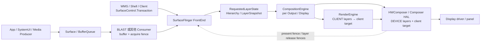

# 2.6 SurfaceFlinger 与合成

## SurfaceFlinger 位于哪一段

应用完成一帧渲染并提交 buffer 后，显示流程仍没有结束。SurfaceFlinger 要接收 buffer 与 `SurfaceControl.Transaction`，更新 Layer 层级，为每个 Display 构造可见内容，再与硬件合成器（Hardware Composer，HWC）协商合成方案并执行 present。

Android 17 标准窗口的主路径可以概括为：



这张图有两个边界。SurfaceFlinger 处理图层与 Display，不了解 App 内部的 View 或 Compose 节点。设备合成与客户端合成可以在同一帧同时出现：RenderEngine 先生成 client target，HWC 再把它与可由设备处理的 Layer 一起提交显示。

源码分析以 `android-17.0.0_r1` 为当前锚点。Android 12 的 `INVALIDATE/REFRESH` 只用于解释旧 Trace，Android 13 之后按 `commit/composite` 主线阅读。

## 四项核心职责

### 1. 管理 Transaction 与 Layer 状态

来自应用、WindowManager、WM Shell、SystemUI、媒体组件的 `SurfaceControl.Transaction` 最终进入 SurfaceFlinger。Transaction 可以同时修改多个 Layer 的 buffer、位置、裁剪、alpha、可见性、父子关系、z-order、dataspace 和 frame timeline 信息。

Android 17 的 FrontEnd 将客户端请求整理成服务器侧状态：

- `TransactionHandler` 收集并筛选可提交的 transaction；
- `LayerLifecycleManager` 维护 `RequestedLayerState` 与 Layer 生命周期；
- `LayerHierarchyBuilder` 构造父子、relative-z 与镜像关系；
- `LayerSnapshotBuilder` 生成按 z-order 排列的 `LayerSnapshot`；
- CompositionEngine 和输入、无障碍等消费者读取 snapshot。

这套结构划清了“客户端请求”与“本帧合成状态”的边界。当前源码仍保留部分 legacy `Layer` 互操作，但合成分析应优先跟踪 FrontEnd state、snapshot 和 Output。

### 2. 参与 VSync 调度与帧目标计算

HWC 的硬件 VSync callback 为预测器提供样本，Scheduler 的 VSync schedule、dispatch 与 EventThread 生成应用和系统侧的调度事件。`VsyncModulator` 调整 app/SF work duration 与 phase，但它不代表完整的 VSync 分发实现。

SurfaceFlinger 还创建 DisplayEventConnection，让应用侧 Choreographer 等消费者接收软件 VSync。SF 自身的帧信号进入 `Scheduler::onFrameSignal()`。Android 17 会先为 pacesetter display 和可参与本轮的 follower display 计算 `FrameTarget`，再决定 commit 与 composite。

详细的预测、phase 与 VSync-app/VSync-sf 关系见 [2.3 VSync 机制](03-vsync.md)。这里关注 SF 收到帧信号后的工作。

### 3. 为每个 Display 选择并执行合成方案

FrontEnd snapshot 是全局 Layer 状态，CompositionEngine 的 Output 面向具体 Display。它会根据 layer stack、projection、可见区域、damage、色彩与输出能力构造该 Display 的 OutputLayer 集合，再与 HWC 协商 CLIENT/DEVICE 等 composition type。

同一个 Layer 可能经镜像或虚拟显示出现在多个 Output。每个物理 Display 有自己的 frame target、HWC state、present fence 和 deadline，不能使用默认屏的结果解释外接屏。

### 4. 跟踪 buffer、fence 与 FrameTimeline

SurfaceFlinger 需要知道：

- 哪个 buffer 已随 transaction 到达；
- Producer completion/acquire fence 是否满足读取条件；
- 哪个 buffer 被本帧 snapshot 选中；
- RenderEngine client target 何时可供 HWC 读取；
- HWC 何时不再使用各 Layer buffer；
- 该 Display 的 present 工作何时到达完成边界。

这些状态决定 buffer 能否 latch、是否复用旧内容、是否产生 backpressure，也为 FrameTimeline 的 App `SurfaceFrame` 与 SF `DisplayFrame` 提供时间归因。

## Layer：从层级关系得到显示顺序

### Layer 与 View 没有一一映射

普通 Activity 的整棵 View 树通常绘制进一个 App Window buffer，SurfaceFlinger 看到宿主窗口 Layer。`SurfaceView`、视频、相机、壁纸、系统栏、输入法、截图动画、transition leash 和 display decoration 可能引入更多 Layer。

Android 17 的 `SurfaceView` 还可能维护容器 Layer、BLAST buffer Layer 和背景 color Layer。图层数量增加只说明 SurfaceControl 层级发生变化；还要结合 owner pid/uid、parent、layer stack、buffer 和 transaction 确认来源。

### z-order 是层级遍历结果

FrontEnd README 对绘制顺序给出了明确规则：

- Layer 形成类似 scene graph 的层级；
- relative-z Layer 按 relative parent 参与排序；
- 负 z 子节点位于 parent 下方；
- 非负 z 子节点位于 parent 上方；
- 相同 z 值还需要稳定的次序，客户端不应依赖创建先后来控制关键遮挡关系。

下面的伪代码用于说明从底到顶的遍历：

```text
traverseBottomToTop(node):
  visit children and relative children with z < 0
      sorted by z and stable tie-break
  visit node
  visit children and relative children with z >= 0
      sorted by z and stable tie-break
```

`LayerSnapshot` 还保存 `globalZ`、变换后边界、crop、透明度、圆角、shadow、dataspace、buffer、damage、frame rate 等合成输入。CompositionEngine 会再按目标 Output 过滤不可见或不属于该 layer stack 的 snapshot。

### 可见不等于本周期有新 buffer

一个可见 Layer 没有新 buffer 时，SurfaceFlinger 可以继续使用上次选中的内容。视频以 24/30 fps 更新、Display 以 60/120 Hz 刷新时，多次复用旧 buffer 可能符合设计。判断丢帧要检查 Producer 时间戳、目标 present、buffer 选择和 cadence，不能要求每个 SF frame 都出现新 `BufferTX`。

## Transaction：状态原子性与 buffer 就绪是两回事

### 合并与顺序

Transaction 把一组 Layer 修改作为一个提交单元。合并操作具有顺序语义：后写入的属性可以覆盖前值。Android 17 FrontEnd README 说明，transaction 按 ApplyToken 建立队列；相同 ApplyToken 内保证顺序，不同 token 之间需要显式 barrier 才能建立跨队列依赖。

`TransactionHandler` 使用 `LocklessQueue<QueuedTransactionState>` 接收 transaction，commit 时先调用 `collectTransactions()`，再按 ready filter 和每个 ApplyToken 的 pending FIFO 执行 `flushTransactions()`。readiness 会考虑 fence、present time、barrier 与 unsignaled buffer 条件。transaction barrier 的默认 TTL 是 5 秒，用于避免依赖永久悬挂。

这里的 lockless queue 只说明 transaction 入队结构。SurfaceFlinger 主流程仍会在 snapshot、display state 和 legacy 互操作处使用相应锁；不能据此推断 commit 全程无锁。

### 原子提交不保证像素已经可读

一笔 transaction 可以原子地表达“新 buffer、位置和裁剪一起生效”。buffer 的 Producer 仍可能异步写入，acquire fence 负责保护内容。Android 13 起支持受限的 unsignaled buffer latch 模式，SurfaceFlinger 可以在满足策略条件的简单更新中先推进 transaction readiness，但 RenderEngine/HWC 读取内容前仍要遵守 fence。

SyncTransaction、WMS transition sync 与应用的 `SurfaceSyncGroup` 解决的参与者和等待条件并不完全相同。排查跨窗口动画时，先确认哪些 Surface 被加入同一个同步组，再检查 transaction barrier、buffer readiness 和 callback；屏幕上同时移动不代表它们自动属于同一同步事务。

## BLAST：标准 App Window 的 buffer 怎样进入 SF

### Android 11 进入主线

BLASTBufferQueue 从 Android 11 起进入 AOSP 主窗口路径。它把 BufferQueue Consumer 与 `SurfaceControl.Transaction` 更紧密地结合，使 buffer、frame number、dataspace、damage、transform 和窗口几何状态可以按同一帧语义提交。

Android 12 的变化体现在观察能力上：FrameTimeline、VSync ID、expected/actual present 让 buffer transaction 与显示帧更容易对齐。BLAST 并非 Android 12 才出现。

### Android 17 标准窗口链

标准 App Window 通常沿下面的顺序进入 SurfaceFlinger：

```text
App RenderThread / Producer
  queueBuffer(slot, producer completion fence)
    → App 进程内 BLAST Consumer
      onFrameAvailable()
      acquireNextBufferLocked()
      Transaction::setBuffer(surfaceControl, buffer, acquireFence, frameNumber, ...)
      Transaction::setFrameTimelineInfo(...)
      merge geometry / sync transaction when required
      apply()
        → SurfaceFlinger FrontEnd
          TransactionHandler
          RequestedLayerState / LayerSnapshot
```

普通 BLAST 窗口中的 BufferQueue acquire 常发生在应用进程的 BLAST Consumer，SurfaceFlinger 接收带 buffer 和 fence 的 transaction。把所有现代窗口都写成“SurfaceFlinger 直接调用 BufferQueue `acquireBuffer()`”会混淆进程与所有权。

SurfaceFlinger 完成消费后，release callback 返回 BLAST，再由 BLAST 释放对应 BufferItem。`queueBuffer()`、BLAST acquire、`BufferTX - <layerName>` 增加、SF latch、HWC present 与 release callback 都是不同时间点。

## Android 17 主循环：`onFrameSignal → commit → composite`

### Scheduler 先按 Display 建立 FrameTarget

Android 17 的主入口在 `Scheduler::onFrameSignal()`。下面的结构摘录保留关键分支：

```cpp
// frameworks/native/services/surfaceflinger/Scheduler/Scheduler.cpp
// AOSP android-17.0.0_r1，结构摘录
void Scheduler::onFrameSignal(ICompositor& compositor,
                              VsyncId vsyncId,
                              TimePoint expectedVsyncTime) {
    pacesetterPtr->targeterPtr->beginFrame(
            beginFrameArgs, *pacesetterPtr->schedulePtr);

    FrameTargets targets;
    targets.try_emplace(pacesetterPtr->displayId,
                        &pacesetterPtr->targeterPtr->target());
    // 遍历 follower display，调用 targeter.beginFrame()，
    // 再把本轮可 present 的目标加入 targets。

    if (!compositor.commit(pacesetterPtr->displayId, targets)) {
        compositor.sendNotifyExpectedPresentHint(pacesetterPtr->displayId);
        mSchedulerCallback.onCommitNotComposited();
        return;
    }

    FrameTargeters targeters;
    targeters.try_emplace(pacesetterPtr->displayId,
                          pacesetterPtr->targeterPtr.get());
    // 把 commit 后仍可 present 的 follower targeter 加入 targeters。

    const auto resultsPerDisplay =
            compositor.composite(pacesetterPtr->displayId, targeters);
    compositor.sendNotifyExpectedPresentHint(pacesetterPtr->displayId);
    compositor.sample();

    for (const auto& [id, targeter] : targeters) {
        const auto resultOpt = resultsPerDisplay.get(id);
        targeter->endFrame(*resultOpt);
    }
}
```

源码会分别处理 pacesetter 与 follower display 的 deadline、present fence backpressure 和 lockstep 条件。摘录省略了 follower 的循环判断；系统先生成 `FrameTargets`，`commit` 返回 `false` 时本轮不会进入 `composite`。

### `commit()`：准备本帧合成状态

Android 17 的 `SurfaceFlinger::commit(PhysicalDisplayId, FrameTargets)` 主要处理：

1. 检查 display mode transition、HWC backpressure 和本帧目标；
2. 为 FrameTimeline 记录 SF wake-up；
3. 清理 transaction flag，进入 `updateLayerSnapshots()`；
4. 收集、筛选和应用 transaction；
5. 更新 Layer 生命周期、层级与 snapshot；
6. latch 可用的新 buffer，发送 transaction commit callback；
7. 更新可见区域、输入、Layer history 与刷新率选择；
8. 根据 transaction、buffer、display/HWC 请求判断 `mustComposite`。

`updateLayerSnapshots()` 会执行 `TransactionHandler:flushTransactions`、`LayerLifecycleManager.applyTransactions()`、`LayerHierarchyBuilder.update()` 与 `LayerSnapshotBuilder:update`。看到 commit 变长时，要继续区分 transaction 数量、Layer 创建销毁、hierarchy/geometry 变化、buffer latch 和锁等待。

`commit` 返回 `false` 可能只是本轮没有需要提交到显示的变化，也可能受 mode set 或 backpressure 分支影响。没有 composite slice 不能自动归为丢帧。

### `composite()`：把 snapshot 交给各个 Output

`SurfaceFlinger::composite()` 构造 `CompositionRefreshArgs`，把物理/虚拟 Display 对应的 Output 和 frame target 交给 CompositionEngine。Output 的主流程包括：

1. 更新输出与 Layer composition state；
2. 重建该 Output 的可见 Layer stack；
3. 规划并写入 HWC Layer 状态；
4. `beginFrame()` 判断 dirty 与 `mMustRecompose`；
5. `prepareFrame()` / `prepareFrameAsync()` 选择 composition strategy；
6. 需要 CLIENT 时由 RenderEngine 生成 client target；
7. `presentFrameAndReleaseLayers()` 执行 present 并分发 fence。

Android 17 在特定条件下可把 GPU-backed virtual display composition 放到后台执行器，但这条路径受 flag、RenderEngine threaded 能力和物理 Display 是否使用 client composition 等条件约束。不能把多显示场景概括成“全部并行合成”。

## Android 12 与 Android 13+ 的主循环边界

### Android 12：`INVALIDATE / REFRESH`

`android-12.0.0_r1` 的 `SurfaceFlinger::onMessageReceived()` 处理 `MessageQueue::INVALIDATE` 与 `MessageQueue::REFRESH`。旧 Trace 中的 `onMessageInvalidate`、`onMessageRefresh`、`INVALIDATE` 和 `REFRESH` 属于这套消息模型。

INVALIDATE 侧处理 transaction、Layer/buffer 状态和脏区；REFRESH 侧推进合成与 present。阅读 Android 12 源码或 Trace 时，应使用该版本的方法与 slice。

### Android 13 起：`commit / composite`

Android 13 的 MessageQueue handler 已直接进入 `commit()` 与 `composite()`。Android 14 进一步由 `Scheduler::onFrameSignal()` 统一帧入口。Android 17 延续这条主线，并把 per-display `FrameTargeter`、FrontEnd snapshot 和 CompositionEngine Output 纳入当前实现。

`INVALIDATE/REFRESH` 适合解释 Android 12 历史，不能用作 Android 17 的源码调用名。版本对比时先确认系统 build 和 tag，再搜索对应 slice。

## Client Composition 与 Device Composition

### CLIENT：RenderEngine 生成 client target

当 HWC 要求某些 Layer 使用 `Composition.CLIENT` 时，SurfaceFlinger 通过 RenderEngine 把这些 Layer 按顺序绘制进一个 client target。RenderEngine 后端可使用 SkiaGL 或 SkiaVk，具体选择取决于设备配置与系统 build。

client target 带 acquire fence 交给 HWC。HWC 再把它作为一个输入，与仍为 DEVICE、CURSOR、SIDEBAND 等类型的 Layer 一起 present。CLIENT composition 会使用 GPU 和内存带宽，但成本取决于 client Layer 的像素覆盖、格式、色彩转换、blur、shadow、缩放和 GPU 状态，不能按 Layer 数量直接换算。

### DEVICE：Composer 负责该 Layer

Composer3 对 `Composition.DEVICE` 的定义是设备必须通过 hardware overlay 或其他类似方式处理该 Layer。具体实现可能涉及 DPU/display controller plane、scaler、color pipeline 或厂商内部资源。

DEVICE composition 通常可以减少 SF 的 GPU client composition 工作，但仍有 validate、state programming、fence、带宽和 display hardware 成本。某个 Layer 能否保持 DEVICE 由整屏 Layer 集合和设备能力共同决定。

### 混合合成是常见结果

同一 Display 可以同时包含：

- DEVICE：视频、简单不透明 Layer 或设备能直接处理的内容；
- CLIENT：需要 RenderEngine 处理的 Layer；
- client target：CLIENT Layer 的合成结果；
- SOLID_COLOR、CURSOR、SIDEBAND、DISPLAY_DECORATION、REFRESH_RATE_INDICATOR 等 Composer3 类型。

Android 17 AIDL `Composition.aidl` 中没有通用 `CLIENT_BYPASS` 枚举。厂商日志若出现额外类型，应按 vendor 扩展记录设备、版本和日志来源。

### 哪些因素会改变策略

下面这些条件可能影响 HWC 决策，但 AOSP 不规定统一 plane 数量或固定降级公式：

- buffer format、modifier/usage、dataspace 与 HDR metadata；
- crop、scale、rotation、blend、alpha、rounded corner 和 color transform；
- protected content 与 secure display 要求；
- overlay plane、scaler、色彩单元和内存带宽是否被其他 Layer 占用；
- Display 分辨率、刷新率、输出模式和厂商功耗策略；
- transition leash、SystemUI、IME、dim Layer 和多个视频流形成的整屏组合。

验证策略变化要看该帧的 composition type、Layer 属性、RenderEngine slice、HWC/vendor trace 和 present 结果。只看功耗或某条 SF slice 变短，证据不足。

## HWC 协商：validate、presentOrValidate 与 present

### Android 17 调用关系

CompositionEngine 的 `Display::chooseCompositionStrategy()` 调用 `HWComposer::getDeviceCompositionChanges()`。后者根据当前是否已有 client composition 与 earliest-present 条件，决定能否尝试 `presentOrValidate()`。

下面的控制流用于避免重复计算 present 调用：

```text
getDeviceCompositionChanges(display)
  canSkipValidate =
      no current client composition
      AND (Composer 支持 expected-present，或当前已到 earliest-present)

  if canSkipValidate:
    presentOrValidate()
    if state == PresentSucceeded:
      保存 present fence 与 layer release fences
      validateWasSkipped = true
      return
    # 否则本次调用完成 validate
  else:
    validate()

  读取 changed composition types / display requests / layer requests
  读取 client target property / requested layer LUTs
  acceptChanges()

如最终存在 CLIENT layer:
  RenderEngine 生成 client target
  setClientTarget(client target, acquire fence)

presentAndGetReleaseFences()
  if validateWasSkipped:
    executeCommands()       # 不再调用第二次 present
  else:
    等待 earliest-present（若需要）
    present()
    getReleaseFences()
```

`PresentSucceeded` 只表示 Composer HAL 的 present 分支已经执行并返回 fence，不代表面板扫描完成。普通 validate 分支在 composition changes 被接受、client target 准备后才调用 present。

### AIDL 与 HIDL 边界

Android 13 起 Composer3 AIDL 进入平台主线。Android 17 的 SurfaceFlinger 仍通过 `ComposerHal` 抽象保留 AIDL/HIDL 适配实现，设备使用哪条 vendor HAL 路径要看 VINTF 与运行时服务。

分析 framework 调用时优先使用：

- SF/HWC2 侧：`validate()`、`presentOrValidate()`、`present()`；
- ComposerHal 侧：`validateDisplay()`、`presentOrValidateDisplay()`、`presentDisplay()`。

不要把两层方法名写成同一个类的方法，也不要把旧 HIDL composition 枚举与当前 AIDL 新增值混在一张无版本表里。

## Buffer 与 fence：四种完成边界

以下时间线把 Layer buffer、client target 和 Display present 分开：

```text
App / Producer
  queueBuffer(buffer, producer completion fence)
        │
BLAST / SurfaceControl transaction
  setBuffer(buffer, acquire fence)
        │
SurfaceFlinger FrontEnd
  transaction ready → snapshot / latch
        │ acquire fence 仍保护 buffer 内容
CompositionEngine
  ├─ DEVICE layer ────────────────────────────────┐
  └─ CLIENT layers → RenderEngine client target┤
                         + client-target fence   │
                                                 ▼
Composer HAL / HWC
  validate / present
  ├─ per-layer release fences → buffer 可在满足条件后复用
  └─ per-display present fence → 本次 Display present 完成边界
```

四种边界分别回答不同问题：

1. Producer completion/acquire fence：新 buffer 何时可读；
2. client-target acquire fence：HWC 何时可读取 RenderEngine 输出；
3. Layer release fence：Consumer 何时不再使用对应 Layer buffer；
4. Display present fence：一次 Display present 何时到达显示栈完成边界。

present fence 属于 Display，不属于某个 App Window。它也不能覆盖面板扫描、像素响应和用户感知时间；触摸到光子的测量还需要 driver trace 或外部仪器。

## 下游变慢怎样反压到 App

SurfaceFlinger/HWC 长时间持有 Layer buffer 或 release callback 积压时，可复用 slot 会减少。Producer 下一次 `dequeueBuffer()` 或 HWUI 的 `reserveNext()` 可能等待 FREE slot 与 release fence，于是 App RenderThread 被下游反压。

这条因果关系要按同一 Layer 和相邻 frame number 验证：

1. App 是否及时 `queueBuffer()`；
2. BLAST 是否生成对应 `BufferTX`；
3. SF 是否 latch，acquire fence 是否及时 signal；
4. HWC/SF 何时返回 release fence；
5. BLAST 何时 release BufferItem；
6. Producer 的 `dequeueBuffer()` 等待是否随之结束。

RenderThread `dequeueBuffer()` 长不能单独证明 SurfaceFlinger 慢。max dequeued/acquired、async mode、shared buffer mode、buffer allocation、surface resize 和 Producer 自己持有 slot 也会影响结果。详细状态机见 [2.13 BufferQueue](13-buffer-queue.md)，fence 见 [2.16 Sync Fence](16-sync-fence.md)。

## Perfetto：从 App SurfaceFrame 追到 DisplayFrame

### 先区分两类 token

FrameTimeline 中：

- App `SurfaceFrame` 使用 `surface_frame_token` 关联应用工作与 Layer 提交；
- SF `DisplayFrame` 使用 `display_frame_token` 表示一次显示合成；
- 一个 DisplayFrame 可以包含多个进程、多个 Layer 的 SurfaceFrame。

两类 token 不能合成一个“全程 VSync ID”。分析时先用 process/layer 锁定 App SurfaceFrame，再查看它进入哪个 DisplayFrame。

### SurfaceFlinger 主线程常见 slice

Android 17 userdebug/eng Trace 中可关注：

- `commit <vsyncId>`；
- `composite <vsyncId>`；
- WorkloadTracer 的`Commit`、`Composition`；
- `Transaction Handling`、`TransactionHandler:flushTransactions`；
- `LayerSnapshotBuilder:update`；
- `Refresh Rate Selection`；
- CompositionEngine `prepareFrame`、`chooseCompositionStrategy`；
- `presentAndGetReleaseFences`、`wait for earliest present time`；
- `postComposition` 或对应 present 后处理。

具体名称受 build、flag、Trace category 和厂商插桩影响。某个 slice 缺失时，先检查 trace config 和源码宏，不能按颜色或固定名字判定阶段不存在。

### Buffer 与 Layer 轨道

标准窗口可继续查看：

- App 的 `dequeueBuffer`、`queueBuffer`；
- BLAST acquire/release callback；
- `BufferTX - <layerName>` pending 数量；
- Layer buffer id、frame number、desired present time；
- acquire/release/present fence；
- SurfaceFlinger Layer lifecycle、transaction 与 latch 事件。

`BufferTX` 增加只表示 pending buffer transaction 增加。要确认系统采纳本帧，还需看到目标 Layer 的 transaction/latch 与关联 DisplayFrame。

### composition 与显示轨道

判断 CLIENT/DEVICE 时查看：

- CompositionEngine/RenderEngine 是否生成 client target；
- 每个 Layer 的 composition type；
- GPU composition 或 client composition slice；
- HWC validate/present、DisplayHAL 与厂商 DPU trace；
- per-display present fence、FrameTimeline present/jank type。

`dumpsys SurfaceFlinger` 适合查看 Layer 树、Display、buffer 和 composition type 快照；它不能还原几百毫秒前某一帧的时序。Perfetto、dump 和 vendor log 应在相同设备状态下采集。

### 常用快照命令

下面的命令用于采集当前状态，具体 section 随版本和 build 变化：

```bash
adb shell dumpsys SurfaceFlinger
adb shell dumpsys SurfaceFlinger --list
adb shell dumpsys SurfaceFlinger --display-id
```

快照中先确认目标 Layer 名、owner、parent、layer stack、active buffer、composition type 与目标 Display，再回到 Perfetto 对齐发生时刻。不要用一次静态 dump 代替连续帧证据。

## 七种常见 Jank 组合

| 现象 | 优先检查 | 可排除前不要下的结论 |
|:---|:---|:---|
| App SurfaceFrame 已晚，SF 复用旧 buffer | App UI/RT、GPU、queue time、acquire fence | SF commit 长未必是首因 |
| `commit` 长，transaction/layer 数突增 | transaction burst、Layer 创建销毁、hierarchy/snapshot、锁与 Binder | 不能直接归因 GPU |
| `composite` 中 RenderEngine 长 | CLIENT Layer、damage、blur/HDR/color transform、SF GPU queue | 不能只按 Layer 数量优化 |
| HWC validate/present 长 | Composer HAL、DPU/driver、fence、mode/color change | DEVICE composition 仍有成本 |
| SF runnable delay 长 | `sched_wakeup/sched_switch`、CPU/cgroup、优先级、系统负载 | 线程没有运行时不能算函数耗时 |
| App `dequeueBuffer` 长，SF/HWC release 晚 | slot 状态、release fence、BLAST callback、Display present | 固定“三缓冲耗尽”解释不完整 |
| App 和 SF CPU 都按时，DisplayFrame 晚 | GPU completion、DisplayHAL、present fence、prediction/mode switch | App `queueBuffer` 按时不代表已显示 |

### FrameTimeline jank type 是分类入口

Android 17 可见的分类包括 App deadline、SurfaceFlinger CPU/GPU deadline、DisplayHAL、SurfaceFlinger scheduling、Buffer Stuffing、Prediction Error 等。分类由时间关系推导，适合选择下一组证据；它不提供业务代码或 vendor driver 的根因。

例如 `SurfaceFlingerCpuDeadlineMissed` 出现时，仍要区分主线程执行过长和 runnable delay；`SurfaceFlingerGpuDeadlineMissed` 还要确认是 RenderEngine、App GPU 竞争还是其他 GPU 客户端；`DisplayHAL` 要继续进入 Composer/driver/present。

### SF 主线程卡顿的影响范围

SurfaceFlinger 是系统级服务，同一主线程上的 transaction、snapshot 和部分 per-display 工作可能影响多个窗口。Android 17 又按 pacesetter/follower display 计算 frame target，并存在有条件的虚拟显示 offload，因此影响范围要按目标 Display 和当轮 Output 判断。

同一 Display 上，SF commit/composite 迟到可能让多个 App 的内容一起错过 DisplayFrame deadline。某个 App 没有新 buffer 时，其他 Layer 仍可更新；是否整屏重复旧帧取决于该轮合成与 present 结果。

## 多窗口与多 Display

### 多窗口共享整屏 HWC 约束

分屏、PiP、freeform、Dialog、IME、SystemUI 与 transition leash 会形成同一 Display 的可见 Layer 集合。HWC 按整套 Layer 状态选择策略，因此 App A 的 alpha/scale、视频格式或 protected Layer 可能改变 App B 所在 Display 的 composition 方案。

窗口数量多不必然触发 CLIENT；单个具有复杂色彩或特效的 Layer 也可能要求 RenderEngine。比较前后策略时，应记录整个可见集合、Display mode Composer 输出。

### per-display frame target 与 fence

Android 17 `Scheduler::onFrameSignal()` 先为 pacesetter display 建立目标，再计算 follower display 是否参与本轮。`FrameTargeter` 会考虑 expected present、pending present fence 与 backpressure。每个 Display 最终拥有自己的 present fence。

多显示排查至少按 `displayId` 分组：

- refresh rate 与 expected present；
- Output 可见 Layer；
- composition strategy；
- HWC validate/present；
- present fence 与 DisplayFrame。

默认屏按时不能证明外接屏按时。镜像场景还要确认 Layer snapshot 如何映射到两个 Output。

## Kernel 与 vendor driver 边界

kernel 基线固定为 `android17-6.18-2026-06_r6`：

- `drivers/dma-buf/dma-buf.c`：跨设备共享 buffer 的通用 dma-buf 对象；
- `drivers/dma-buf/dma-fence.c`：异步工作完成依赖；
- `drivers/dma-buf/sync_file.c`：把 fence 暴露为可跨进程传递的文件描述符；
- `include/linux/dma-fence.h`：通用 fence 接口与语义。

AOSP SurfaceFlinger 能说明 framework 怎样传递 buffer/fence、调用 Composer HAL 和记录 FrameTimeline。Overlay plane 分配、内存带宽投票、secure path、DRM/KMS atomic commit 与 panel 时序由厂商 HAL/driver 决定。Android 设备也不保证使用与主线一致的 DRM/KMS 实现。

当 present 或 release fence 迟到时，需要把 Composer HAL、vendor display trace、GPU/DPU frequency、DRM/display driver、IOMMU 和内存带宽放在同一时间轴。通用 dma-fence 只描述依赖关系，不解释硬件任务为何执行过慢。

## Android 11—17 版本演进

| 版本 | 已核对的主线变化 | 阅读与排查口径 |
|:---|:---|:---|
| Android 11 / API 30 | BLASTBufferQueue 进入主窗口 AOSP 路径 | buffer 与窗口 geometry transaction 可以按同帧语义组织 |
| Android 12 / API 31 | SurfaceFlinger 仍使用 `onMessageReceived()` 的 INVALIDATE/REFRESH；FrameTimeline 成为现代诊断入口 | 旧 Trace 用 INVALIDATE/REFRESH，App SurfaceFrame 与 DisplayFrame 分开分析 |
| Android 13 / API 33 | 主循环进入 `commit/composite`；Composer3 AIDL 进入平台；默认 unsignaled latch 策略有严格适用条件 | 不能沿用 Android 12 方法名；简单单 Layer buffer update 与跨 Layer sync 要分开 |
| Android 14 / API 34 | `Scheduler::onFrameSignal()` 统一 commit/composite 帧入口 | VSync 调度与 SF 工作由 Scheduler/FrameTarget 证据关联 |
| Android 15 / API 35 | 源码已有 per-display `FrameTargeter`，以及带 `PhysicalDisplayId`、`FrameTargets/FrameTargeters` 的 commit/composite 参数；支持 ARR 的设备可以在一个显示模式内改变 VSync 周期 | 多显示按 displayId、target、present fence 分开；SF deadline 与 present 不能再按固定 60/120 Hz 周期推断 |
| Android 16 / API 36 | 延续 per-display frame target 与 pacesetter/follower 调度结构 | 不能把 Android 15 已存在的参数和类误记成 Android 16 首次引入 |
| Android 17 / API 37 | 当前锚点：FrontEnd transaction/snapshot、`commit(PhysicalDisplayId, FrameTargets)`、`composite(...FrameTargeters)`、AIDL Composer3/HWComposer 协商 | 所有当前方法名、composition type 和 fence 分支按 `android-17.0.0_r1` 解释 |

这张表只把已核对的版本差异写成“该版本存在”。判断某个内部类或优化是否首次出现，需要继续比较父 tag 与提交历史。

## 常见边界

### App 按时 `queueBuffer()` 只覆盖 Producer 提交点

后面还有 BLAST acquire、SF transaction、latch、acquire fence、composition CPU 正常也不能证明 DisplayFrame 正常。

### commit 长不等于所有时间都在合成像素

`commit` 主要处理 transaction、Layer state、snapshot、buffer latch、refresh rate 和 callback。RenderEngine 绘制与 HWC present 位于后续 `composite`/Output 流程。

### DEVICE composition 不代表“零 GPU”

它说明该 Layer 由 Composer 设备路径处理。其他 CLIENT Layer、App 渲染和 SurfaceFlinger 特效仍可占用 GPU，HWC/DPU 也有带宽与同步成本。

### Layer 退回 CLIENT 没有跨设备固定阈值

HWC 能力和策略来自 vendor 实现。plane 数量、格式、缩放、HDR、保护内容和带宽要以目标设备的 HAL/driver 与当帧可见集合为准。

### present fence 不代表光学呈现完成

它是 Display present 的同步边界。panel scanout、像素响应和用户观察时间还在其后。

## Android 17 源码锚点

| 要验证的结论 | 源码入口 |
|:---|:---|
| 帧信号、pacesetter/follower 与 commit/composite | `services/surfaceflinger/Scheduler/Scheduler.cpp` |
| commit、snapshot、composite、FrameTimeline | `services/surfaceflinger/SurfaceFlinger.cpp` |
| transaction 队列、readiness、barrier TTL | `services/surfaceflinger/FrontEnd/TransactionHandler.*` |
| RequestedLayerState、hierarchy、z-order、snapshot | `services/surfaceflinger/FrontEnd/` |
| Output 可见层、strategy、client target、present | `services/surfaceflinger/CompositionEngine/src/Output.cpp`、`Display.cpp` |
| `validate`/`presentOrValidate`/`present` 与 fence | `services/surfaceflinger/DisplayHardware/HWComposer.cpp`、`HWC2.cpp` |
| AIDL/HIDL Composer 适配 | `services/surfaceflinger/DisplayHardware/AidlComposerHal.*`、`HidlComposerHal.*` |
| AIDL composition type 与 DisplayCommand | `hardware/interfaces/graphics/composer/aidl/.../composer3/` |
| BLAST buffer transaction 与 release callback | `frameworks/native/libs/gui/BLASTBufferQueue.cpp` |
| BufferQueue slot 与 fence | `frameworks/native/libs/gui/BufferQueueProducer.cpp`、`BufferQueueConsumer.cpp` |
| kernel buffer/fence 语义 | `drivers/dma-buf/`、`include/linux/dma-fence.h` |

## Android 17 的 SurfaceFlinger 合成边界

SurfaceFlinger 把多个 Producer 的 buffer 与客户端 transaction 整理成 LayerSnapshot，再为每个 Display 构造 Output、选择合成方案并完成 present。Android 17 的当前主线是：

`Scheduler::onFrameSignal → SurfaceFlinger::commit → FrontEnd snapshot → SurfaceFlinger::composite → CompositionEngine → RenderEngine/HWComposer → present fences`

性能分析时按同一 App SurfaceFrame、Layer、DisplayFrame 和 displayId 依次检查：

1. Producer 是否按时提交 buffer；
2. BLAST 与 transaction 是否按时进入 SF；
3. commit 是否在 transaction、snapshot 或 latch 阶段变长；
4. composite 使用 CLIENT、DEVICE 还是混合方案；
5. RenderEngine、Composer HAL、driver 与 present fence 哪一段越过 deadline；
6. release 是否延迟并反压 App 的 buffer 周转。

这套顺序能把 App 迟到、SF CPU、SF GPU、HWC/display 与 buffer backpressure 分开。

## 参考资料

### Android 17 AOSP

- [SurfaceFlinger.cpp](https://android.googlesource.com/platform/frameworks/native/+/android-17.0.0_r1/services/surfaceflinger/SurfaceFlinger.cpp)
- [FrontEnd README](https://android.googlesource.com/platform/frameworks/native/+/android-17.0.0_r1/services/surfaceflinger/FrontEnd/readme.md)
- [TransactionHandler.h](https://android.googlesource.com/platform/frameworks/native/+/android-17.0.0_r1/services/surfaceflinger/FrontEnd/TransactionHandler.h)
- [LayerHierarchy.cpp](https://android.googlesource.com/platform/frameworks/native/+/android-17.0.0_r1/services/surfaceflinger/FrontEnd/LayerHierarchy.cpp)
- [LayerSnapshotBuilder.cpp](https://android.googlesource.com/platform/frameworks/native/+/android-17.0.0_r1/services/surfaceflinger/FrontEnd/LayerSnapshotBuilder.cpp)
- [Scheduler.cpp](https://android.googlesource.com/platform/frameworks/native/+/android-17.0.0_r1/services/surfaceflinger/Scheduler/Scheduler.cpp)
- [Output.cpp](https://android.googlesource.com/platform/frameworks/native/+/android-17.0.0_r1/services/surfaceflinger/CompositionEngine/src/Output.cpp)
- [Display.cpp](https://android.googlesource.com/platform/frameworks/native/+/android-17.0.0_r1/services/surfaceflinger/CompositionEngine/src/Display.cpp)
- [HWComposer.cpp](https://android.googlesource.com/platform/frameworks/native/+/android-17.0.0_r1/services/surfaceflinger/DisplayHardware/HWComposer.cpp)
- [AidlComposerHal.cpp](https://android.googlesource.com/platform/frameworks/native/+/android-17.0.0_r1/services/surfaceflinger/DisplayHardware/AidlComposerHal.cpp)
- [HidlComposerHal.cpp](https://android.googlesource.com/platform/frameworks/native/+/android-17.0.0_r1/services/surfaceflinger/DisplayHardware/HidlComposerHal.cpp)
- [ComposerHal.cpp](https://android.googlesource.com/platform/frameworks/native/+/android-17.0.0_r1/services/surfaceflinger/DisplayHardware/ComposerHal.cpp)
- [JankInfo.h](https://android.googlesource.com/platform/frameworks/native/+/android-17.0.0_r1/libs/gui/include/gui/JankInfo.h)
- [Composition.aidl](https://android.googlesource.com/platform/hardware/interfaces/+/android-17.0.0_r1/graphics/composer/aidl/android/hardware/graphics/composer3/Composition.aidl)
- [DisplayCommand.aidl](https://android.googlesource.com/platform/hardware/interfaces/+/android-17.0.0_r1/graphics/composer/aidl/android/hardware/graphics/composer3/DisplayCommand.aidl)
- [BLASTBufferQueue.cpp](https://android.googlesource.com/platform/frameworks/native/+/android-17.0.0_r1/libs/gui/BLASTBufferQueue.cpp)
- [BufferQueueProducer.cpp](https://android.googlesource.com/platform/frameworks/native/+/android-17.0.0_r1/libs/gui/BufferQueueProducer.cpp)
- [BufferQueueConsumer.cpp](https://android.googlesource.com/platform/frameworks/native/+/android-17.0.0_r1/libs/gui/BufferQueueConsumer.cpp)

### Kernel

- [`drivers/dma-buf/dma-buf.c`](https://android.googlesource.com/kernel/common/+/android17-6.18-2026-06_r6/drivers/dma-buf/dma-buf.c)
- [`drivers/dma-buf/dma-fence.c`](https://android.googlesource.com/kernel/common/+/android17-6.18-2026-06_r6/drivers/dma-buf/dma-fence.c)
- [`drivers/dma-buf/sync_file.c`](https://android.googlesource.com/kernel/common/+/android17-6.18-2026-06_r6/drivers/dma-buf/sync_file.c)
- [`include/linux/dma-fence.h`](https://android.googlesource.com/kernel/common/+/android17-6.18-2026-06_r6/include/linux/dma-fence.h)

### 官方文档

- [SurfaceFlinger and WindowManager](https://source.android.com/docs/core/graphics/surfaceflinger-windowmanager)
- [Graphics architecture](https://source.android.com/docs/core/graphics/architecture)
- [Hardware Composer HAL](https://source.android.com/docs/core/graphics/hwc)
- [FrameTimeline](https://perfetto.dev/docs/data-sources/frametimeline)
- [Unsignaled buffer latching](https://source.android.com/docs/core/graphics/unsignaled-buffer-latch)

### 相关章节

- [2.3 VSync 机制](03-vsync.md)
- [2.5 MainThread 与 RenderThread 协作](05-main-render-thread.md)
- [2.10 GPU 渲染](10-gpu-rendering.md)
- [2.13 BufferQueue](13-buffer-queue.md)
- [2.16 Sync Fence](16-sync-fence.md)
