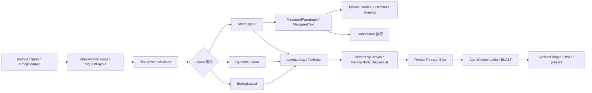

# 文字渲染性能

一段文字从业务数据变成屏幕像素，至少要经过内容处理、段落测量、换行、View 绘制命令录制、Skia glyph（字形）资源准备和窗口 buffer 提交。这些工作分布在不同线程，也受不同缓存约束，把文字卡顿只记在 `TextView.onMeasure()` 头上，往往会查偏方向。

排查时我们先回答两个问题：

1. 本帧为什么需要重新排版或重录文字？
2. 最早超时的是主线程、RenderThread 与 GPU，还是后续窗口显示链路？

列表滚动时，可见 `TextView` 未必每个都在每帧重新 measure；RenderThread 上出现文字相关开销，也推不出主线程必然重新执行了文字整形。两个方向要分别取证。

## 文字工作的五个层次

拿到文字相关的卡顿，我们第一步是按线程和产物把工作拆开：同样表现为“文字慢”，慢的可能在测量、在绘制录制，也可能在字形准备，对应的优化完全不同。普通 View 页面走的是标准 HWUI 应用窗口路径，文字工作可以分成五层：

| 层次 | 常见线程 | 主要产物 | 典型触发条件 |
|---|---|---|---|
| 内容处理 | 调用 `setText()` 的线程，通常是主线程 | `CharSequence`、Span（附加在文本区间上的样式或行为）、EmojiCompat 处理结果 | bind（把数据绑定到 View）、文本更新、filter（过滤器）、linkify（识别并添加链接）、emoji 处理 |
| 排版准备 | 主线程，或显式预计算线程 | `MeasuredParagraph` 与 `MeasuredText`、行断点、`Layout` | 新文本、宽度或测量参数变化 |
| 绘制录制 | 主线程 | RenderNode 与 DisplayList（可重复回放的绘制命令列表）中的文字绘制命令 | View 失效、DisplayList 需要重录 |
| 绘制执行 | RenderThread 与 GPU | Skia text blob（批量文字绘制数据）、strike 与 glyph（特定字体参数下的字形资源）、应用窗口 buffer | DisplayList 回放、字形资源冷启动、GPU 提交 |
| 显示 | SurfaceFlinger、HWC（Hardware Composer，硬件合成器）与 Display | 合成后的 display frame（显示帧） | buffer latch（把本帧 buffer 纳入合成）、composition（合成）、present（送显） |

下面的流程图标出排版和出图的分界，描述的是标准硬件加速 View 页面；软件 Canvas、自定义原生文字引擎或独立 Surface 要另行分析。



`measure`、`layout` 和 `draw` 是否执行，由 `ViewRootImpl.performTraversals()` 根据 dirty flag 决定。只改变滚动位置、item 与 DisplayList 都能复用时，文字布局可能完全不重建；新的 item bind、宽度变化、字体参数变化或 `requestLayout()`，才会把排版工作带回本帧。后面讲到的优化手段，大多围绕“让能复用的层继续复用”这一条展开。

## `TextView` 怎样选择 Layout

一段文本最终交给哪个 Layout 排版，`TextView` 有一套固定的判断顺序。`TextView.makeNewLayout()` 最终调用 `makeSingleLayout()`：先看文本是否需要 `DynamicLayout`；其余文本由 `BoringLayout.isBoring()` 做资格检查，资格和宽度条件都通过时用 `BoringLayout`，否则用 `StaticLayout`。常见的“单行用 Boring、多行用 Static、EditText 用 Dynamic”只是这条顺序的粗略概括。我们评估文字测量成本前，先要弄清目标文本实际落在哪条路径上。

### `DynamicLayout`：面向可变或可选择文本

`TextView.useDynamicLayout()` 在以下任一条件成立时返回 true：

- 文本可选择；
- `mSpannable` 非空，并且当前文本没有以 `PrecomputedText` 形式保存。

`DynamicLayout` 的适用面比 `EditText` 宽：可选择的普通 `TextView`、需要监听 Span 变化的文本都可能用它。它通过 `reflow()` 只重新排版受编辑影响的区域，并维护供硬件加速绘制使用的 block（文本分块）信息，增量更新因此不必每次重建全部文本；不过单次编辑的成本仍可能不小。

### `BoringLayout` 的资格条件

轮不到 `DynamicLayout` 的文本，`TextView` 会先调用 `BoringLayout.isBoring()` 做资格检查。实现会拒绝以下几类文本：

- 换行符或制表符；
- 可能影响双向文本的字符和 surrogate code unit（UTF-16 代理代码单元）；
- 按 text-direction heuristic（文本方向判断规则）判定为 RTL 的整段文本；
- 任意 `ParagraphStyle`。

这份清单比“单行无 Span”的直觉细得多：`CharacterStyle` 就未必让 `isBoring()` 失败，“有任何 Span 就不能用 BoringLayout”的说法并不成立。通过资格检查后还有宽度一关——文字宽度和 ellipsize（超宽时截断并显示省略号）条件要适合当前可用宽度，`TextView` 才会构造或复用 `BoringLayout`。

`setSingleLine(true)` 或 `maxLines = 1` 都强制不了这条路径。文本包含换行、RTL、用 UTF-16 代理对表示的 emoji 或段落级样式时，单行显示仍可能落到 `StaticLayout`；反过来，部分 BMP 文字即使不是拉丁字母，只要满足上述条件，也可能被判定为 boring。

`BoringLayout` 的“简单”指单行、LTR 和较少的段落结构，整形这一步并没有省掉：`isBoring()` 仍要通过 `TextLine.metrics()` 计算宽度和字体指标，ellipsize 后还可能再次测量。它的工作量少于完整的多行换行，但单次 `Paint.measureText()` 估算不了它。

### `StaticLayout`：不可变多行文本的主路径

其余常见文本由 `StaticLayout.Builder` 构建，构造大致分两步：

1. 为每个段落取得或创建 `PrecomputedText.ParagraphInfo`，其中保存 `MeasuredParagraph`；
2. 把 `MeasuredParagraph` 与当前宽度、缩进、断行策略、hyphenation（自动连字符）、两端对齐等约束交给 `LineBreaker.computeLineBreaks()`。

`StaticLayout` 还要处理 `LeadingMarginSpan`、`LineHeightSpan`、tab、ellipsize、最大行数、行高和每行方向信息。一段长文本慢不慢，字符数说明不了全部：段落数、run（连续采用同类排版属性的文本段）数量、Span 的分布、宽度和断行策略都会改变工作量，字体 fallback（缺字时换用其他字体）也在其列。我们拿到一段慢文本时，先看的就是这些结构因素。

## Minikin：字体选择、整形和断行

排版准备落到 Minikin 这一层，要做的是字体选择、整形和断行三件事，它们的开销要分开算。`LayoutPiece` 先调用 `FontCollection.itemize()`，按字体覆盖范围把输入拆成若干 font run，再对每个 script run 调用 HarfBuzz 的 `hb_shape()`。所谓 font run，是采用同一字体匹配结果的连续文本段；script run 则采用同一文字体系的排版规则。`android-17.0.0_r1` 中的 `external/harfbuzz_ng` 对应 HarfBuzz 11.4.1。

整形（shaping）做的是把 Unicode 输入映射成 glyph、cluster、advance 和 offset：cluster 是共同参与排版的一组字符，advance 是排版推进距离，offset 是字形偏移。判断一段文字的整形复杂度，“一个 Unicode 对应一个 glyph”这个假设是靠不住的——连字、组合附加符号、emoji ZWJ（Zero Width Joiner，零宽连接符）序列、variation selector 和字体 fallback 都会改变码点与 glyph 的关系。不同语言文字体系的开销也没有固定倍数，应以目标字体、真实语料和设备测量为准。

### 断行包含两个阶段

Minikin 的 `WordBreaker` 先用 ICU break iterator（Unicode 文本边界迭代器）给出候选断点，`LineBreaker` 再按当前宽度和 break strategy（断行策略）选出实际行断点。CJK、泰文、URL、emoji 序列适用的规则各不相同，“CJK 都靠字典查找”并不是通用描述。

自动连字符要进入对应的测量路径，前提是断行策略不是 `BREAK_STRATEGY_SIMPLE`，且 hyphenation frequency 不是 `NONE`。`TextView` 的注释里还留着一段版本历史：

- Android 10 之前，主题默认可能是 `HYPHENATION_FREQUENCY_NORMAL`；
- Android 10 起，`TextView` 和 `EditText` 的主题默认改为 `NONE`；
- 自建 `PrecomputedText.Params.Builder` 的默认值与 `TextView` 未必相同，应优先从目标 View 取得 `getTextMetricsParams()`。

动手优化前，我们先读出设备上实际的 `breakStrategy` 和 `hyphenationFrequency`：默认已是 `NONE` 的设备上再设置一遍，省不下排版工作。

### LayoutCache 与 StrikeCache

整形结果缓存在 Minikin 的 `LayoutCache` 里：这是进程内单例的 LRU（Least Recently Used，最近最少使用）缓存，当前最多保存 5000 个条目；待整形的 piece 长度达到 128 个 UTF-16 code unit 时，会绕过这层缓存直接计算。

缓存键里装了大量排版参数：文字上下文与 range、font collection ID、字号、scale/skew、letter/word spacing、locale、方向、font feature、variation settings 和 hyphen edit 都在其中。可用宽度恰恰不在键里，于是：

- 宽度变化通常会让 `StaticLayout` 重新断行，但相同 shaping piece 仍可能命中 Minikin 缓存；
- 文本、字体、locale、方向或 variation settings 改变，会形成不同的缓存键；
- 两条业务文本只有局部字词相同时未必共享缓存，因为键里还包含传入的文字上下文和 range。

`TextLine` 另有一个容量为 3 的静态对象池，用来减少临时对象分配；它缓存的是可复用对象，排版结果不在里面。再往绘制执行一侧，Skia 的 `StrikeCache` 管理 GPU 文字 strike/glyph 资源，一个 strike 对应同一字体、字号和变换参数下的一组字形。它和 Minikin 的整形缓存处在流水线的不同阶段，我们分开统计各自的命中率，不合成一个笼统的“文字缓存命中率”。

## Span 与 Emoji 的成本层次

Span 和 emoji 是文字内容里最常见的两个变量，它们把成本加在哪一层，直接决定优化时该动谁。

### Span 类型与排版成本

我们按 Span 改变的层次来分类：

| Span 类型 | 主要影响 |
|---|---|
| `MetricAffectingSpan` | 改变字号、Typeface、scale 等测量参数，会切分测量 run（连续文本段） |
| `ReplacementSpan` 与 `ImageSpan` | 通过 `getSize()` 提供替代宽度，并在 draw 阶段执行自定义绘制 |
| `ParagraphStyle` | 影响 margin（边距）、tab stop（制表位）、行高或段落布局；也会让 `BoringLayout.isBoring()` 失败 |
| `CharacterStyle` | 通常改变颜色、背景或绘制效果；不一定改变测量 |
| `ClickableSpan` | 主要增加点击命中和 movement method（键盘、触摸移动处理）开销，本身不是文字测量参数 |

所以评估富文本时，要数的是会改变 metrics（测量指标）的 Span 切分点、`ReplacementSpan` 数量和段落级 Span；把 Span 总数直接换算成排版耗时，会把只影响绘制和交互的 Span 也算进去。

### 系统 emoji 与 EmojiCompat 是两条路径

系统 emoji 走系统或厂商字体的正常路径，参与 fallback、整形和 Skia 绘制。EmojiCompat（emoji2）是另一条路：它先把需要兼容的序列处理成带 `EmojiSpan` 的 `Spanned`；在当前 AndroidX 实现里，`TypefaceEmojiSpan` 最终切换到 emoji typeface 并调用 `Canvas.drawText()`，“每次绘制都先解码 bitmap”的描述并不成立。

EmojiCompat 的成本，我们也按阶段拆开看：

- 初始化和可下载字体的准备属于字体加载阶段；
- `EmojiCompat.process()` 扫描并生成 Span，官方允许在后台处理并缓存结果；
- `EmojiSpan.getSize()` 和 `draw()` 属于布局/绘制阶段；
- 新 glyph 的 Skia 资源准备属于后续绘制执行阶段。

AndroidX 默认的 initializer 会把字体加载推迟到首个 Activity 进入 resumed 状态之后，避免与首屏直接争用资源；手动配置时，下载、初始化和首屏绘制要分别测量。

## 减少无效重建

前面把文字工作拆到了线程、层次和缓存，优化要解决的就是其中的重复劳动：让没变的内容复用旧结果，把重算留给真正变化的部分。

### `PrecomputedText` 预计算了什么

API 28 的 `PrecomputedText.create()` 提前算好每个段落的 `MeasuredParagraph` 与 native 层 `MeasuredText`，覆盖文字测量和 glyph positioning（字形位置计算）；`StaticLayout` 收到兼容的 `PrecomputedText` 后，可以直接复用这些 `ParagraphInfo`。

预计算的内容由 `PrecomputedText.Params` 决定：`TextPaint`、text direction、断行策略、hyphenation frequency 和 `LineBreakConfig` 都在其中，View 的最终可用宽度留到了后面。最终的 line breaking、maxLines、ellipsize、行距和高度计算，仍在创建 `Layout` 时完成。

下面的示例演示两个工程要点：参数从目标 `TextView` 取得；异步结果写回时，要防止 RecyclerView holder 复用后写入旧内容。

```kotlin
class MessageHolder(
    private val textView: TextView,
    private val executor: Executor
) {
    private var bindGeneration = 0

    fun bind(content: CharSequence) {
        val generation = ++bindGeneration
        val params = textView.textMetricsParams

        executor.execute {
            val computed = PrecomputedText.create(content, params)
            textView.post {
                if (generation == bindGeneration
                    && textView.textMetricsParams == params
                ) {
                    textView.text = computed
                }
            }
        }
    }
}
```

这段代码演示的是写回条件：`generation` 未变、测量参数仍一致，两项都过才把预计算结果设回 `TextView`。实际项目里还要取消无用任务、限制队列长度，并按 API 版本选择平台或 AndroidX 实现。`TextView.setText(PrecomputedText)` 遇到不兼容的测量参数会抛出 `IllegalArgumentException`；只有可重新计算的文字方向存在差异时，framework 也可能重新计算。

AndroidX 的 `AppCompatTextView.setTextFuture()` 会在 `onMeasure()` 中调用 `future.get()`，后台任务没算完，主线程就阻塞等待。它适合提前 prefetch（预取）；用了它之后主线程还有多少文字处理成本，取决于后台任务是否及时算完。

### 列表场景的触发源

列表里重复创建 Layout 的触发源屈指可数，我们优先处理这几类：

1. 用 payload 或内容 diff 避免对未变化字段重复 `setText()`；
2. 固定 item 的文字宽度约束，避免动画期间反复改变可用宽度；
3. 在数据层预先生成稳定的富文本或 EmojiCompat 结果，避免 bind 时重复扫描；
4. 缩小 `MetricAffectingSpan` 与 `ReplacementSpan` 的数量和覆盖范围；
5. 对长文本使用预计算，并让任务在 item measure 前完成；
6. 把字体下载、Typeface 创建和大段文本解析移出首个需要显示它们的帧。

`TextView.setText()` 除了保存引用，还可能执行 filter、listener 通知、spannable/watcher 处理、auto-link 和 transformation，并通过 `checkForRelayout()` 立即重建内部 Layout 或申请新的 View layout。应用层能守住的一条是：相同内容不再重复设置。

### `includeFontPadding` 与 glyph bounds 选项

`includeFontPadding` 决定首尾行用 font top/bottom 还是 ascent/descent（基线上方与下方的高度指标）。关掉它，布局可能更紧凑，把它当成“测量会更快”的依据却站不住；对阿拉伯文、Kannada（卡纳达文）或带高低延伸的字体，还要验证会不会裁切。

API 35 增加了以 glyph bounds 计算宽度和处理 start overhang（起始悬垂）的相关 API。`TextView` 对 target SDK 35 及以上默认启用 `useBoundsForWidth`；`shiftDrawingOffsetForStartOverhang` 默认仍为 false，并且只有前者启用时才生效。自建 `StaticLayout.Builder` 的话，默认值要按 Builder 文档单独确认。

这一组选项的用途，是修正 advance width 与 glyph bounds 对不上时造成的裁切和对齐问题，会影响宽度、断行或 drawing offset。开启前我们做的是视觉回归和基准测试；“只有微秒级成本”这类脱离字体与文本的结论，并不可靠。

### 可变字体动画与缓存

Minikin 的 `Font.cpp` 会缓存调整过的 HarfBuzz font 和 typeface；variation settings 同时也是 `LayoutCacheKey` 的一部分。动画反复落在同一组 axis 值上，对象和整形结果都可能复用；连续扫过大量不同的 axis 值，则会不断产生新的 cache key。

字重动画若每帧修改 variation settings，可能同时带来排版、DisplayList 重录和 glyph 资源变化。我们先用真实动画范围做 cold/warm（首次运行与缓存已热）两组测量，再决定是否降低更新频率、量化 axis 值，或改用不改变文字 metrics 的视觉方案。

## 用 Perfetto 定位文字卡顿

`ViewRootImpl` 在 `TRACE_TAG_VIEW`（View 子系统的 trace 标签）下稳定记录的是窗口级 `measure`、`layout` 和 `draw`；逐个 View 的 `onMeasure TextView ...`、`onLayout ...` 要启用 framework 的 traversal tracing（逐 View 遍历跟踪）才会出现。所以在普通应用 trace 里，我们先按窗口级 slice 分析，不假定能看到 `TextView.onMeasure()` slice。

采集时至少启用：

- `view`、`gfx` atrace category；
- 目标应用进程的 atrace 事件；
- `sched` 调度数据与 CPU frequency/idle；
- FrameTimeline（应用帧与显示帧的时间线）；
- 需要判断 GPU 时，再加入设备支持的 GPU data source。

先用 FrameTimeline 锁定 jank frame（超过截止时间的帧），再按以下顺序判断：

| 观察结果 | 下一步 |
|---|---|
| 主线程窗口级 `measure` 很长 | 检查本帧为何调用 `requestLayout()`，再用采样栈或自定义 trace 定位 TextView、Span 或业务解析 |
| `measure` 正常，主线程的 draw/DisplayList 录制时间长 | 检查大量脏 TextView、复杂 `ReplacementSpan`、阴影或路径文字，以及重复调用的 `invalidate()` |
| 主线程按时，RenderThread `DrawFrame` 变长 | 区分 Skia 与 GPU 工作、glyph 资源冷启动、其他 View 绘制和 buffer wait（缓冲区等待） |
| App SurfaceFrame（应用窗口帧）按时，DisplayFrame（显示帧）超时 | 沿 BLAST 缓冲队列、SurfaceFlinger、HWC 和 present（提交显示）继续分析，不能只改文字布局 |
| 只在首次字体、emoji 或生僻字出现时变慢 | 对比首次运行与缓存已热的运行，检查字体准备、EmojiCompat 初始化和 Skia strike/glyph cache（字形资源缓存） |

窗口级 `measure` 定位不到具体控件时，我们可以在应用可控的位置补少量 trace。下面的标记用于区分业务富文本构造和 `setText()`，不用在每个字符或每个 Span 上打点。

```kotlin
Trace.beginSection("messageText/buildSpans")
val displayText = try {
    buildMessageSpans(message)
} finally {
    Trace.endSection()
}

Trace.beginSection("messageText/setText")
try {
    holder.textView.text = displayText
} finally {
    Trace.endSection()
}
```

`buildSpans` 已经超时，问题在内容处理，先修它；它很短而后续窗口级 `measure` 变长，再回头看 Layout、可用宽度和 metrics。自定义 trace 给出的只是 wall time（墙钟时间），线程当时在执行、被抢占还是等待，要配合 CPU 采样栈、线程状态和 FrameTimeline 才能判断。

### 基准测试的对照组

文字缓存可能让一次 warm run 掩盖冷启动成本，基准测试要靠对照组把变量拆开：

| 维度 | 对照组 |
|---|---|
| 缓存 | 首次显示、重复显示 |
| 内容 | 短拉丁文本、CJK、RTL 与复杂文字体系、emoji ZWJ、混合字体 |
| 排版 | 固定宽度、宽度变化；简单断行、高质量断行与 hyphenation |
| 样式 | 纯文本、`MetricAffectingSpan`、`ReplacementSpan`、`ParagraphStyle` |

跑分时记录 Android 系统 build、字体文件与版本、locale、刷新率、应用构建类型和文本长度；缺了这些条件，跨设备的“快几倍”就没法比较。

## 版本演进

| 版本与组件 | 可核对变化 | 对性能分析的影响 |
|---|---|---|
| Android 5.0（API 21） | AOSP 已有独立 `frameworks/minikin` | 平台文字测量可沿 Minikin 源码分析 |
| Android 6.0（API 23） | `StaticLayout.Builder` 公开 | 自定义多行排版可显式设置断行、hyphenation（自动连字符）和 ellipsize（省略策略）等参数 |
| Android 8.0（API 26） | `StaticLayout.Builder.setJustificationMode()` 公开 | justification（两端对齐）成为需要单独记录的排版变量 |
| Android 9（API 28） | `PrecomputedText` 公开 | shaping（文字整形）与 measurement（测量）可以提前执行，按最终宽度断行仍留在 Layout 构建阶段 |
| Android 10（API 29） | `TextView` 与 `EditText` 主题默认 hyphenation 改为 `NONE` | 不能把“关闭默认 hyphenation”当成 Android 10 及以上版本的通用优化 |
| Android 12（API 31） | `Canvas.drawGlyphs()` 公开；FrameTimeline 可用于标准 App Window | 自定义 glyph 绘制有公开入口，掉帧归因应关联 App SurfaceFrame 与 DisplayFrame |
| Android 13（API 33） | `LineBreakConfig` 公开 | line-break style（断行样式）与 word style（单词边界样式）进入测量参数和预计算兼容性判断 |
| Android 15（API 35） | bounds-for-width、start overhang 和 minimum font metrics（最小字体指标）API 公开；target SDK 35 及以上版本的 `TextView` 默认使用 glyph bounds 计算宽度 | 升级 target SDK 后需要回归文字宽度、换行、对齐与裁切 |
| Android 17（API 37） | 当前源码锚点；Minikin 当前的排版与可变字体缓存、HarfBuzz 11.4.1，以及 HWUI 到 Skia text blob 的路径 | 当前方法名和缓存 key 按 `android-17.0.0_r1` 解读；若要判断某项是否由 Android 17 新增，还需查历史 tag（源码版本标签） |
| AndroidX emoji2 与 appcompat | 独立于 Android 平台版本发布 | 记录具体依赖版本、字体来源、初始化策略，以及 `setTextFuture()` 是否等待 |

## 常见误区

### 列表滚动时，每个 TextView 都会重走 measure、layout、draw

Traversal 会依据脏标记、`MeasureSpec` 和缓存决定工作量。能复用 DisplayList 的列表项，可能只需改变位置；新 bind、宽度变化或 `requestLayout()` 才可能重建文字 Layout。

### 单行文本一定使用 BoringLayout

单行只是必要条件之一：RTL、UTF-16 代理代码单元、换行符、制表符、`ParagraphStyle`、宽度和 ellipsize 条件都会改变选择结果。

### 所有 Span 都会让 shaping 成本成倍增加

直接改变对应排版阶段的，是改变 metrics 的 Span、`ReplacementSpan` 或段落级 Span；颜色和点击 Span 的主要成本在绘制或交互，统计时应与 `MetricAffectingSpan` 分开算。

### PrecomputedText 已经算好最终换行

它预计算的是段落测量和 glyph positioning，Params 里没有最终宽度；`StaticLayout` 仍要按当时的宽度、maxLines、ellipsize 和行距计算行布局。

### RenderThread 慢说明 TextView.onMeasure 慢

`onMeasure()` 在主线程执行，RenderThread 处理 DisplayList、Skia 与 GPU 工作以及窗口 buffer。同一次文本变化可能让两边同时变忙，归因时要分别取证。

## 与其他机制的关系

- **§2.1、§2.3 Choreographer**：文字更新只有在触发 traversal 或 draw 时才进入帧生产。
- **§2.4 MainThread 与 RenderThread**：主线程负责内容处理、排版和 DisplayList 录制，RenderThread 与 GPU 负责后续执行及窗口 buffer 处理。
- **§22.2 RecyclerView**：prefetch、payload、holder 复用和宽度稳定性决定预计算是否来得及完成。
- **§22.1 View 体系**：先找 `requestLayout()` 与脏区域来源，再判断 TextView 是否为主要贡献者。

## 参考资料

- [AOSP Android 17 `TextView`](https://android.googlesource.com/platform/frameworks/base/+/refs/tags/android-17.0.0_r1/core/java/android/widget/TextView.java)
- [AOSP Android 17 `View`](https://android.googlesource.com/platform/frameworks/base/+/refs/tags/android-17.0.0_r1/core/java/android/view/View.java)
- [AOSP Android 17 `ViewRootImpl`](https://android.googlesource.com/platform/frameworks/base/+/refs/tags/android-17.0.0_r1/core/java/android/view/ViewRootImpl.java)
- [AOSP Android 17 `BoringLayout`](https://android.googlesource.com/platform/frameworks/base/+/refs/tags/android-17.0.0_r1/core/java/android/text/BoringLayout.java)
- [AOSP Android 17 `StaticLayout`](https://android.googlesource.com/platform/frameworks/base/+/refs/tags/android-17.0.0_r1/core/java/android/text/StaticLayout.java)
- [AOSP Android 17 `DynamicLayout`](https://android.googlesource.com/platform/frameworks/base/+/refs/tags/android-17.0.0_r1/core/java/android/text/DynamicLayout.java)
- [AOSP Android 17 `PrecomputedText`](https://android.googlesource.com/platform/frameworks/base/+/refs/tags/android-17.0.0_r1/core/java/android/text/PrecomputedText.java)
- [AOSP Android 17 `MeasuredParagraph`](https://android.googlesource.com/platform/frameworks/base/+/refs/tags/android-17.0.0_r1/core/java/android/text/MeasuredParagraph.java)
- [AOSP Android 17 `MeasuredText`](https://android.googlesource.com/platform/frameworks/base/+/refs/tags/android-17.0.0_r1/graphics/java/android/graphics/text/MeasuredText.java)
- [AOSP Android 17 `TextLine`](https://android.googlesource.com/platform/frameworks/base/+/refs/tags/android-17.0.0_r1/core/java/android/text/TextLine.java)
- [AOSP Android 17 HWUI `SkiaCanvas`](https://android.googlesource.com/platform/frameworks/base/+/refs/tags/android-17.0.0_r1/libs/hwui/SkiaCanvas.cpp)
- [Minikin Android 17 `LayoutCache`](https://android.googlesource.com/platform/frameworks/minikin/+/refs/tags/android-17.0.0_r1/include/minikin/LayoutCache.h)
- [Minikin Android 17 `LayoutCore`](https://android.googlesource.com/platform/frameworks/minikin/+/refs/tags/android-17.0.0_r1/libs/minikin/LayoutCore.cpp)
- [Minikin Android 17 `WordBreaker`](https://android.googlesource.com/platform/frameworks/minikin/+/refs/tags/android-17.0.0_r1/libs/minikin/WordBreaker.cpp)
- [Minikin Android 17 `Font`](https://android.googlesource.com/platform/frameworks/minikin/+/refs/tags/android-17.0.0_r1/libs/minikin/Font.cpp)
- [HarfBuzz Android 17 snapshot](https://android.googlesource.com/platform/external/harfbuzz_ng/+/refs/tags/android-17.0.0_r1/meson.build)
- [Skia Android 17 `StrikeCache`](https://android.googlesource.com/platform/external/skia/+/refs/tags/android-17.0.0_r1/src/text/gpu/StrikeCache.cpp)
- [Android Developers：`PrecomputedText`](https://developer.android.com/reference/android/text/PrecomputedText)
- [Android Developers：`StaticLayout.Builder`](https://developer.android.com/reference/android/text/StaticLayout.Builder)
- [Android Developers：EmojiCompat / emoji2](https://developer.android.com/develop/ui/views/text-and-emoji/emoji2)
- [AndroidX `AppCompatTextView`](https://android.googlesource.com/platform/frameworks/support/+/androidx-main/appcompat/appcompat/src/main/java/androidx/appcompat/widget/AppCompatTextView.java)
- [AndroidX `PrecomputedTextCompat`](https://android.googlesource.com/platform/frameworks/support/+/androidx-main/core/core/src/main/java/androidx/core/text/PrecomputedTextCompat.java)
- [Perfetto：Android system tracing](https://perfetto.dev/docs/learning-more/android)
- [Perfetto：ATrace](https://perfetto.dev/docs/data-sources/atrace)
