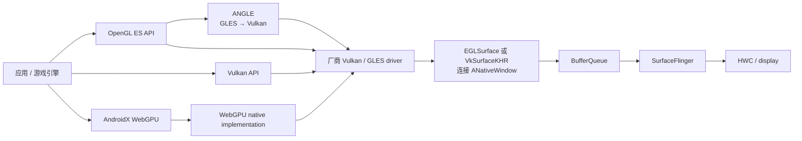

# GPU 渲染与图形 API 选型

“主线程不忙，所以 GPU 慢”会混淆不同的完成边界。UI 线程结束、RenderThread 提交命令、GPU completion（GPU 完成这批工作）、buffer queue（窗口 buffer 入队）和 present（把显示帧提交给显示设备）彼此独立；任何一个边界迟到，都可能让画面错过目标周期。

以下分析以 Android 17 / API 37 的 `android-17.0.0_r1` 为源码锚点，覆盖三类内容：

- View/Compose 经过 HWUI 与 Skia 生成 App Window buffer；
- 原生图形应用或游戏通过 GLES/Vulkan 自己生产 Surface buffer；
- SurfaceFlinger 必要时用 RenderEngine 做 CLIENT composition。

它们可以共享同一块 GPU，也会竞争内存带宽，但线程、Surface、fence 和工具入口并不相同。

先约定贯穿全文的对象：Producer 生成并提交 buffer，Consumer 取得并使用它，fence 表示异步读写何时完成。HWUI 是 View/Compose 的硬件加速管线，RenderEngine 是 SurfaceFlinger 使用 GPU 合成 CLIENT Layer 的组件。HWC（Hardware Composer，硬件合成器）通过 display plane（显示控制器可独立处理的图层通道）处理 DEVICE Layer，或接收 RenderEngine 生成的 client target。本文会分别标明“App GPU 工作”“SurfaceFlinger GPU 工作”和“不一定经过通用 GPU 的显示硬件工作”。

GPU 性能取决于工作负载、提交方式、同步和带宽，图形 API 只决定应用怎样表达这些工作。选型前先确认渲染内容、设备覆盖和工具能力，再比较 OpenGL ES、Vulkan 与 ANGLE 的工程成本。

## GPU 管线、瓶颈与测量

### 画面的生产者

同一个页面可能同时存在多条 GPU 路径：

| 内容类型 | 主要 Producer | GPU 工作出现在哪里 | SurfaceFlinger 看到什么 |
| --- | --- | --- | --- |
| 普通 View / Compose | App HWUI RenderThread | SkiaOpenGL 或 SkiaVulkan | 宿主 App Window Layer |
| TextureView 视频/相机 | 外部 Producer + 宿主 HWUI | 外部生产一次，HWUI 再采样一次 | 通常只有宿主 App Window Layer |
| SurfaceView 视频/游戏 | codec、Camera、GLES/Vulkan engine | 独立 Producer | 独立的 child Surface Layer |
| SurfaceFlinger CLIENT composition | RenderEngine | SurfaceFlinger 进程的 GPU 工作 | client target 交给 HWC |
| HWC DEVICE composition | Composer/display hardware | 不一定使用通用 GPU | 独立 Layer 由硬件平面合成 |

看到 GPU busy（GPU 处于工作状态的时间比例）升高时，应先确认 workload（提交给 GPU 的工作负载）属于 App、另一个进程还是 SurfaceFlinger。页面里存在 `SurfaceView`、`TextureView`、游戏引擎或视频时，宿主 `RenderThread` 不能代表全部内容。

表中的 child Surface 是挂在宿主窗口层级之下、拥有独立 buffer 提交路径的 Surface；它仍由 SurfaceFlinger 与宿主窗口一起组织显示。

### Android GPU 渲染管线：从 API 到颜色附件

#### “Vertex → Fragment → Framebuffer”是简化模型

传统图形管线可以概括为：

```text
CPU record / submit
  → vertex processing
  → primitive assembly + clipping
  → rasterization
  → fragment shading
  → depth/stencil tests + blending
  → color attachment / presentable image
```

这个模型适合建立概念，但不能据此断言每个 Canvas 操作固定生成多少顶点或使用哪一种 shader。Skia 可以根据图形、抗锯齿、clip、transform、backend 和 GPU capability 选择 analytic shader、实例化几何、tessellation、纹理 quad、离屏 pass 或其他策略。

图中的 vertex processing 负责变换顶点，primitive assembly 把顶点组成三角形等图元，clipping 去掉视口外部分。rasterization 把图元转换成片元候选，fragment shading 计算颜色或采样纹理；depth/stencil tests 决定哪些结果可写入，blending 再与目标中已有颜色混合。color attachment 是最终接收颜色结果的图像。

Skia 的具体选择会随内容变化。analytic shader 用数学表达式直接计算覆盖率；实例化几何复用同一份几何描述绘制多个对象；tessellation 把曲线等复杂形状细分为 GPU 可处理的图元；纹理 quad 是用于采样一张纹理的矩形；离屏 pass 先把结果画到中间目标。backend 指 Skia 连接 OpenGL/Vulkan 与驱动的后端实现，GPU capability 则是设备实际支持的功能与限制。

`View.invalidate()` 也不会立即启动 GPU。它只标记内容需要更新并安排 traversal（测量、布局、绘制等 View 树遍历工作）；UI 线程在帧回调中记录或更新 RenderNode，随后由 RenderThread 同步状态、准备 GPU 工作并提交窗口 buffer。RenderNode 是 HWUI 保存绘制指令与合成属性的节点。

#### Vertex Shader 与几何阶段

Vertex Shader 对每个输入顶点执行位置变换，并输出后续插值所需的属性。primitive assembly、viewport clipping（按视口裁剪）、culling（剔除背面或不可见图元）和 rasterization 还会在后续阶段处理图元；“Vertex Shader 自己判断所有不可见图元”并不准确。

Android UI 中的矩形、圆角、文字和 Path 最终可能变成几何、coverage mask（记录像素被形状覆盖程度的遮罩）、glyph atlas（集中存放已栅格化字形的纹理图集）采样或特定 GPU primitive。一个 `drawRect()` 不保证始终是“四个顶点”，复杂 Path 的成本也可能落在 CPU tessellation、GPU 几何、片元 coverage 或缓存失效中的任一处。

对原生 3D engine，vertex/geometry 压力常来自：

- 过多顶点和小 draw call（一次绘制提交）；
- 过细 mesh（网格模型）、粒子或阴影几何；
- skinning（骨骼蒙皮）、morph（顶点形变）和复杂 vertex shader；
- 可见性裁剪和 LOD（按观察距离选择不同几何精度）不充分；
- vertex buffer 访问与 cache miss（缓存未命中）。

标准 View 页面出现纯 vertex bound 的概率通常低于游戏，但需要用目标设备 counter 或帧分析确认，不能按 UI 元素数量猜测。

#### Fragment Shader、测试与混合

Rasterizer 为被覆盖的 sample（像素内的采样位置）生成 fragment（等待着色与测试的片元候选）。Fragment Shader 计算颜色、纹理采样或 coverage；随后还可能经过 depth/stencil test、color write mask（控制哪些颜色通道可写）和 blend。

alpha blending 通常由固定功能混合阶段按 pipeline state（图形管线当前配置）完成，不应笼统写成 Fragment Shader 的内部职责。`RuntimeShader`、复杂滤镜、模糊、阴影、颜色空间转换和多纹理效果会增加 shader、采样或额外 render pass 的成本。

片元压力大致与下面几项相关：

- render target 的像素/采样数；
- 同一像素被覆盖的次数；
- 每个 fragment 的 shader 指令和纹理采样；
- MSAA（多重采样抗锯齿）、HDR/宽色格式、blend 和颜色转换；
- 离屏层、后处理和 SurfaceFlinger client target。

纹理访问会经过 GPU cache 和设备内存系统，并不等于每次采样都访问一次外部 DRAM（设备主内存）。带宽是否成为瓶颈，要看 cache 命中、压缩、格式、采样模式、render pass 和设备 counter（硬件性能计数器）。

#### Framebuffer、render target 与 Android GraphicBuffer

“Framebuffer”在不同 API 中含义不同，不能把它统一理解成“屏幕上正在显示的那张 buffer”：

- GLES framebuffer 是一组 attachment（颜色、深度或模板等渲染附件）的绑定状态；
- Vulkan framebuffer 与传统 render pass 绑定 attachment；使用 dynamic rendering（在命令中直接声明渲染附件）时也可以不创建 `VkFramebuffer` 对象；
- HWUI/Skia 可能绘制到窗口 buffer，也可能先绘制到离屏 surface；
- Android 窗口最终交付的是 `ANativeWindow`/BufferQueue 中的图形 buffer。

App Window buffer 可以作为 GPU color attachment，完成后连同 producer fence（表示 Producer 何时写完 buffer 的同步对象）一起 queue 给下游。SurfaceFlinger 获得 buffer 以后，还要处理 transaction、acquire fence、Layer snapshot 和 composition。HWC 可能直接使用该 Layer，也可能让 RenderEngine 把多个 CLIENT Layer 合成到另一张 client target。

这套流程不同于“VSync 到来时交换 front/back 指针”的简单桌面双缓冲模型。BufferQueue 管理多个 slot（缓冲槽位）和 buffer：Producer 通过 dequeue 取得可写 buffer，再通过 queue 提交；Consumer 通过 acquire 取得可读 buffer，再通过 release 归还，并用 fence 表达异步完成关系。

#### buffer 大小只能做下界估算

对于线性 RGBA_8888，`width × height × 4` 可以估算紧密排列像素的下界。实际 allocation（分配大小）还会受 stride（相邻两行像素起点之间的字节跨度）、对齐、layer count、像素格式、压缩 modifier（描述内存排布或压缩方式的修饰信息）、metadata、保护属性和 allocator（内存分配器）实现影响。即使窗口使用三块 1080p buffer，也不能把它们的大小直接当成“GPU 总内存”；系统还要容纳 depth/stencil、纹理、glyph atlas、离屏层、client target 与 driver 私有分配。

### Shader Compilation Jank 与 pipeline 创建

#### 一次“首次出现效果”的卡顿包含多层工作

从源码到 GPU 可执行状态，可能经历：

1. 解析或编译 GLSL、SkSL、AGSL 等着色语言；GLSL 面向 OpenGL，SkSL 是 Skia 的着色语言，AGSL 是 Android Graphics Shading Language；
2. 生成中间表示，例如 Vulkan 使用的 SPIR-V 字节码；
3. link program（把多个 shader 阶段链接成可用程序）或组合 pipeline state；
4. 驱动针对具体 GPU 生成机器码；
5. 创建 pipeline、descriptor layout（描述 shader 如何访问 buffer、纹理等资源的布局）或其他关联对象；
6. 把结果放入进程内或磁盘缓存。

GLES 的 `glCompileShader()` / `glLinkProgram()` 可以触发编译与链接。Vulkan 使用 SPIR-V，仍可能在 `vkCreateGraphicsPipelines()`、首次使用 pipeline 或驱动内部阶段完成面向具体硬件的编译。SPIR-V 能把一部分工作提前完成，但不能消除 pipeline compilation jank（创建或编译 pipeline 导致的卡顿）。

卡顿发生在 CPU 线程等待编译、驱动 worker（驱动内部工作线程）、RenderThread、RHI thread（游戏引擎封装图形 API 的渲染硬件接口线程）或 GPU pipeline 切换中的哪一处，由 backend 和驱动决定。不能把这类卡顿简单解释为“GPU 第一次看到 shader 后阻塞”。

#### Android 17 的 HWUI 持久缓存

`android-17.0.0_r1` 的 HWUI Skia 路径包含：

- `pipeline/skia/PersistentGraphicsCache.*`；
- `pipeline/skia/ShaderCache.*`；
- `pipeline/skia/PipelineCache.*`；
- `renderthread/CacheManager.*`。

`CacheManager::configureContext()` 把 `PersistentGraphicsCache` 挂到 Skia 的 `fPersistentCache`。`separate_pipeline_cache()` 关闭时，shader 与 Vulkan pipeline 数据都交给 `ShaderCache`；该 flag（功能开关）开启时，`PipelineCache` 只接收标记为 `VkPipelineCache` 的数据，其余条目仍进入 `ShaderCache`。Vulkan 帧 flush（把已记录工作提交或完成必要刷新）后，代码会检查是否出现新的 pipeline cache 数据，再按大小上限和写入节流策略持久化。缓存命中可以减少重复编译，但以下情况仍可能产生 miss：

- 首次使用新的 shader/pipeline 变体；
- app、framework、Skia 或 GPU driver 更新；
- cache identity（判断缓存是否仍适用的身份信息）、格式或 backend 变化；
- 不同 blend、clip、色彩空间、render target 或 effect 组合；
- 缓存淘汰、损坏或被清理。

普通 App 不能假设自己能直接控制 HWUI 内部缓存，也不应把历史 Flutter `--cache-sksl` 方案套到所有 Skia/HWUI 页面。

#### 怎样确认是 compilation/pipeline jank

建议做冷/热两组采集：冷路径从没有可复用缓存或初始化状态开始，热路径则在同一进程已使用过该效果后再次执行。

1. 清理或使用新安装状态，首次进入目标效果；
2. 保持同一进程，再次进入同一效果；
3. 比较 UI/RenderThread/RHI 的 compile、link、pipeline creation、cache load/store 和 driver slice（Trace 中的驱动执行区间）；
4. 用 AGI 查看受支持帧的 pipeline、shader、render pass 与 command；
5. 改变一个 shader/pipeline 维度，验证卡顿是否随 cache key（用于索引某个缓存变体的键）变化复现。

“第一次慢、第二次快”只是线索。首次纹理上传、字形图集、类加载、磁盘 I/O 和页面初始化也会产生相同形态。

#### 预热要控制范围

应用自管 GLES/Vulkan renderer 可以在非关键阶段创建已知 program/pipeline，并持久化 Vulkan pipeline cache。这里的预热是指把高概率会用到的编译与创建工作提前到非关键时段。预热应：

- 只覆盖高概率场景；
- 避免阻塞启动关键线程；
- 绑定正确的 render-pass/format/state 变体，避免预热出的对象与实际渲染配置不匹配；
- 处理 driver 或 app 更新后的缓存失效；
- 记录预热时间、缓存大小和实际命中率。

把所有组合一次性创建出来，可能增加启动时间、内存和 cache churn（缓存条目频繁加入与淘汰）。

### Vulkan、OpenGL ES 与 ANGLE

#### 性能差异来自控制模型

| 维度 | OpenGL ES | Vulkan |
| --- | --- | --- |
| 状态模型 | 全局/上下文状态较多，驱动负责更多隐式验证 | pipeline 与资源状态更显式 |
| 命令记录 | 典型路径由持有 context（图形 API 状态上下文）的线程发调用 | 支持多线程记录 command buffer |
| 同步 | API/驱动包含较多隐式行为 | semaphore（GPU 队列或阶段间同步）、fence（主机观察 GPU 完成）和 barrier（约束资源访问顺序）等由应用显式设计 |
| 内存 | 驱动管理较多 | 应用选择 memory type（设备提供的内存类别）、分配与绑定 |
| pipeline | program 与驱动状态组合 | pipeline creation 更显式，也更需要缓存 |
| 工程复杂度 | 接入较简单 | 生命周期、同步和兼容判断更复杂 |

Vulkan 可以降低 CPU driver overhead（驱动在 CPU 侧附加的管理开销），并让成熟引擎更好地并行记录命令。它也允许应用制造昂贵的 barrier、频繁 allocation、pipeline miss 和过多 in-flight work（已提交但尚未完成的工作）。GLES 驱动在简单场景中可能足够快。不存在“同一 draw call 固定快十倍”这类跨设备结论。

#### Vulkan 与 Android 窗口的连接

Android 17 的 `frameworks/native/vulkan/libvulkan/swapchain.cpp` 把 Vulkan swapchain image（交换链中轮流用于渲染和呈现的图像）与 `ANativeWindowBuffer` 对应起来：

- acquire 路径调用 `ANativeWindow::dequeueBuffer()`；
- image 通过 `ANativeWindowBuffer_getHardwareBuffer()` 关联底层 `AHardwareBuffer`（可跨 native API 和设备共享的图形缓冲对象）；
- present 路径最终调用 `queueBuffer()` 并携带完成 fence；
- BufferQueue、BLAST（把 buffer 更新纳入 Surface transaction 的窗口路径）、SurfaceFlinger 和 HWC 继续负责 Android 显示后半段。

`vkQueuePresentKHR()` 返回不表示 panel 已显示，`vkQueueSubmit()` 返回也不表示 GPU 已完成。需要区分 GPU fence/semaphore、producer fence、SurfaceFlinger latch、display present fence（显示系统完成本次 present 的同步边界）和 buffer release（Consumer 不再使用该 buffer）。

Android 17 的 loader/swapchain 路径增加 `VK_EXT_present_timing` 支持，可以按 present ID（一次 present 的关联标识）查询 dequeue、queue operations end、first pixel out（面板开始输出首个像素）和 first pixel visible（首个像素达到可见状态）等阶段。这个扩展并非所有 Android 17 设备都可用。应用要枚举 extension（扩展），同时检查 `VK_KHR_present_id2`、`presentTiming` / `presentId2` feature，并在创建 swapchain 时启用 `VK_SWAPCHAIN_CREATE_PRESENT_TIMING_BIT_EXT`。缺少条件时可回退到 `VK_GOOGLE_display_timing` 或 Swappy（Android 游戏帧节奏库）。

#### Render pass 与 tile-based GPU

移动 GPU 多采用 tile-based（分块渲染）架构，但 Vulkan 不保证某次绘制如何映射到物理 tile memory（处理一个画面分块时使用的片上存储）。频繁切换 render target、需要保留旧内容、全尺寸离屏 pass 和高带宽 attachment 可能增加 load/store（从外部内存读入或把结果写回）。

`VK_ATTACHMENT_LOAD_OP_DONT_CARE` 或 store-op 优化只能在旧内容或最终结果允许丢弃时使用。错误使用会破坏像素结果。现代 Vulkan 还支持 dynamic rendering，优化应围绕 attachment 生命周期与实际 counter，不要机械追求最少的 `VkRenderPass` 对象。

#### ANGLE：GLES API，Vulkan backend

ANGLE 可以把 GLES/EGL 调用翻译到 Vulkan；EGL 负责 GLES context、Surface 与显示系统之间的连接。应用仍提交 GLES 状态和 draw call，ANGLE 负责状态跟踪、shader 翻译、pipeline/descriptor（shader 访问资源时使用的描述信息）管理和 Vulkan command。

ANGLE 的结果有两面：

- 统一 backend 有助于兼容性和驱动一致性；
- 状态翻译、pipeline 变体和缓存 miss 也会产生 CPU/内存成本。

Android 15 起 ANGLE 是可选 GLES-on-Vulkan 层；Android 17 的 `com.android.graphics.driver.prefer_angle` manifest metadata（应用清单中的元数据）只表达偏好，平台无法使用时会回到 vendor GLES driver。比较性能前应记录 EGL vendor/renderer、实际 driver、ANGLE 版本，并使用相同 workload。

Android 17 HWUI 目录中没有 Graphite pipeline；Graphite 是 Skia 正在发展的新一代 GPU 后端。ANGLE 的开发分支也不能直接当作 `android-17.0.0_r1` 平台行为；PSO（Pipeline State Object，管线状态对象）缓存层级或固定节流时长等说法，如果无法映射到该平台标签，就不能用来解释当前版本。

### GPU 瓶颈分类

GPU 慢帧常被分为 vertex/geometry bound、fragment/fill bound 和 bandwidth bound。工程分析还要加入 CPU submission、同步/back-pressure、频率/温控和 SurfaceFlinger composition。

这里的 bound 表示帧时间主要受某类资源限制：vertex/geometry 看几何处理，fragment/fill 看像素覆盖与片元着色，bandwidth 看内存传输，CPU/driver 看命令准备与提交。A/B 实验是保持其他条件一致、只改变一个变量的对照；它用于验证方向，硬件 counter 与 Trace 再提供直接证据。

| 类别 | 常见现象 | 有区分力的 A/B 实验 | 需要的直接证据 |
| --- | --- | --- | --- |
| CPU / driver bound | GPU 队列有空洞，submit（提交）晚 | 减少 draw call、状态切换或 command record | CPU profile、RHI/driver slice、GPU queue |
| Vertex / geometry bound | 几何工作增加时 GPU 时间上升 | 降低 mesh/粒子或阴影几何，保持像素条件 | vertex/primitive counter、AGI geometry |
| Fragment / fill bound | 分辨率、overdraw、shader 复杂度影响大 | 降 render scale、简化 fragment shader、缩小效果面积 | fragment/sample counter、shader 分析 |
| Bandwidth bound | 大纹理、HDR target、多 pass、upload 影响大 | 降纹理/target 带宽，减少 load/store | external-memory/cache counter、render pass |
| 同步 / back-pressure | GPU 可能有空洞，线程等 acquire/fence | 减少 in-flight 帧、修正 pacing（生产节奏）、减少 resource hazard（并发读写同一资源产生的冲突） | fence owner、队列深度、等待依赖关系 |
| SF client composition | App buffer ready，SF GPU 工作增加 | 比较 DEVICE/CLIENT composition | layer composition type、RenderEngine、HWC |
| Thermal / power bound | 运行一段时间后频率下降 | 固定温度/电源条件做短长对照 | GPU frequency、thermal、power rail（芯片供电轨的功耗数据） |

没有跨 GPU 通用的“Fragment Shader 超过 60% 就是 fill bound”阈值。counter 名称、单位与统计范围由 GPU producer/driver 在 descriptor（数据源对计数器字段的描述）中声明。

#### Fillrate bound

fillrate（单位时间内生成并写出像素或片元结果的能力）问题与 samples、shader、blend、overdraw 和 render-target 格式有关。降低 native game Surface 的 render scale（内部渲染分辨率比例），如果 GPU 时间随像素数明显下降，说明 fragment 或带宽压力值得继续查；标准 View 页面没有通用的独立 render-scale 开关。

Debug GPU Overdraw（开发者选项中的“调试 GPU 过度绘制”）只能定位 HWUI App Window 的逻辑重复绘制。它会额外重放一遍内容，不能在开启时测性能，也不能覆盖独立 `SurfaceView` 或最终 HWC composition。颜色含义与完整流程见 [2.5 过度绘制](05-overdraw.md)。

优化方向包括：

- 移除没有视觉贡献的背景或 pass；
- 缩小模糊、阴影、半透明遮罩与后处理面积；
- 减少不必要的 MSAA/sample count；
- 降低昂贵 fragment shader 的采样和分支；
- 在视觉允许时减少 HDR/高精度中间 target；
- 避免重复的全屏离屏合成。

#### Vertex bound

应先确认 GPU 的 vertex/primitive counter 与几何复杂度相关。复杂 Path 在 HWUI 中可能走 CPU tessellation、mask/coverage（像素覆盖遮罩）或缓存，不能因为 Path 多就归为 vertex bound。

原生 engine 可尝试：

- LOD、frustum culling（视锥外剔除）和 occlusion culling（被其他物体完全遮挡时剔除）；
- 合理合批，减少微小 draw；
- 降低粒子、shadow caster（生成阴影的物体）与 skinning 顶点；
- 改善 vertex buffer layout 和复用；
- 把与顶点无关的 CPU/RHI 成本分开。

#### Bandwidth bound

带宽压力可能来自：

- 大尺寸/高精度 texture 与 render target；
- 多次全屏读写和离屏 pass；
- texture upload（把纹理传到 GPU）、readback（从 GPU 读回 CPU）或频繁 resolve（把多采样结果解析为普通图像）；
- 低 cache 命中、各向异性过滤或多采样；
- GPU、CPU、ISP（图像信号处理器）、codec 与 display 共享内存带宽；
- SurfaceFlinger client composition。

GPU busy 高而 shader stage 利用率不高，只能作为线索。应使用厂商定义的 external-memory、cache、texture、tile 或 stall（流水线等待）counter，并做受控 A/B。

### ASTC、ETC2 与普通 Android Bitmap 的边界

ASTC（Adaptive Scalable Texture Compression）与 ETC2（Ericsson Texture Compression 2）是 GPU 可直接采样的 texture 压缩格式，主要服务 GLES/Vulkan 游戏资源。它们不等于 JPEG/PNG 文件压缩，也不会自动改变普通 `Bitmap`、App Window `GraphicBuffer` 或 SurfaceFlinger client target 的格式。

| 格式 | 能力边界 | 使用建议 |
| --- | --- | --- |
| ETC1 | RGB、4 bpp（每像素 4 bit）、无原生 alpha | 兼容很老的设备；alpha 常需额外纹理 |
| ETC2 | GLES 3.0 级设备广泛支持；可支持 RGB、RGBA、sRGB（带标准颜色传递特性的 RGB）等 | 现代设备的兼容 fallback（后备格式） |
| ASTC | 多种 block size（每个压缩块覆盖的像素范围），可在质量与大小间选择 | 设备支持时常作为现代游戏主格式 |

纹理压缩可以减少存储、GPU memory footprint 和采样带宽，但也会引入编码质量、解码支持和发布包管理问题。应用应：

1. 运行时查询 GLES extension 或 Vulkan format feature（目标格式是否支持采样、渲染等用途）；
2. 为不支持 ASTC 的设备准备 ETC2 等 fallback；
3. 用 Play Asset Delivery 的 texture-compression targeting（按设备纹理格式能力选择资源包）分发合适资产；
4. 在同一场景比较画质、内存、加载和 GPU counter。

ASTC block 越大通常压缩率越高、质量风险也越高。透明纹理、法线贴图、UI atlas（把多张小图集中到一张大纹理）和 HDR 资源应分别测试，不能只按文件大小选格式。

### Tile-Based Rendering 的性能含义

典型 tile-based GPU 会先把几何分配到屏幕 tile，再在片上存储中完成一个 tile 的 raster、fragment 和 blend，最后把需要保留的结果写回设备内存。

这能减少某些中间颜色的外部内存流量，但不会消除过度绘制、纹理采样和复杂 shader 的成本。以下行为仍可能增加开销：

- render pass 开始时加载已有 attachment；
- pass 结束时保存 attachment；
- tile memory 容量不足或格式过大；
- 多个全屏 target、resolve、readback；
- 半透明内容和依赖旧颜色的 blend；
- driver 无法应用预期的隐藏面剔除或压缩优化。

不同 Adreno、Mali、PowerVR 或其他 GPU 的 tile 大小、压缩、early test（在执行片元着色前提前做深度/模板测试）和 counter 都不同。架构名只能指导实验，不能代替目标设备数据。

### GPU 内存：对象、分配与共享

#### Android 17 的对象链

从应用到 kernel，可以按以下层次理解：

```text
Bitmap / HardwareBuffer / Surface / ANativeWindow
  → AHardwareBuffer / ANativeWindowBuffer / GraphicBuffer
  → GraphicBufferAllocator + graphics allocator HAL
  → GraphicBufferMapper + mapper HAL
  → native_handle: fd + metadata
  → dma-buf exporter / heap or vendor allocator
  → GPU, codec, SurfaceFlinger, HWC imports and mappings
```

这条对象链说明包装和接口层次，不表示“每层复制一份像素”。多个进程/设备可以导入同一个 dma-buf（Linux 跨设备共享缓冲内存的对象），对应不同的进程虚拟地址、IOMMU（设备访问内存时使用的地址映射与隔离单元）映射和引用。`GraphicBuffer` 是 native 图形栈中的包装对象，`AHardwareBuffer` 是公开 NDK/Java 边界，底层 `native_handle` 用 fd（文件描述符）和 metadata 描述共享 buffer。

Android 17 的 `frameworks/native/libs/ui/GraphicBufferAllocator.cpp` / `GraphicBufferMapper.cpp` 对接 graphics allocator/mapper：allocator 负责创建 buffer，mapper 负责导入、锁定和查询其布局。`hardware/interfaces` 同时保留历史 HIDL 版本，并提供 allocator AIDL 与 mapper stable-C 接口。HIDL（HAL Interface Definition Language）与 AIDL（Android Interface Definition Language）是两代 HAL 接口定义体系，stable-C 是稳定的 C 接口。具体产品使用哪个版本，应看 vendor manifest（系统与 vendor 接口清单）和运行时注册的 service。

#### Gralloc 根据描述符选择布局

分配请求至少包含 width、height、layer count、format 和 usage。usage 是生产者与消费者用途标记，会描述 CPU 读写、GPU texture/render target、video encoder、composer、protected content（只能经过受保护路径处理的内容）等需求。Allocator/mapper 与厂商 gralloc（Android 图形缓冲分配模块）可以据此选择：

- stride 与对齐；
- 线性、tiled（分块）或厂商压缩布局；
- metadata（描述布局、格式等附加信息的数据）与 plane（多平面格式中分别存放亮度、色度等数据的区域）；
- cache 属性；
- protected 或设备专用 heap（特定用途的内存分配池）。

`width × height × bytesPerPixel` 只能估算简单线性格式。应用不要依赖未公开的物理布局。

#### BufferQueue slot 不等于常驻 allocation

BufferQueue 管理 slot、dequeued/acquired 状态和 buffer 引用。Producer dequeue 时可以触发新 allocation，也可以复用已有 buffer。buffer 数量受 Producer/Consumer、usage、尺寸变化、async（异步队列）/shared buffer（重复使用同一 buffer）模式和 in-flight 约束影响。

release fence 表示 Consumer 何时不再使用旧 buffer，Producer 必须在重新写入前等待该依赖完成。queue 满或 release 晚会让 dequeue/acquire/swap/present 等待，这属于 back-pressure（下游释放不及时造成的反压）。

#### ION 到 DMA-BUF Heaps

Android 12 GKI 2.0（Google Kernel Image 2.0，共用内核方案）开始用 DMA-BUF heaps 替代 ION（Android 早期使用的内核共享内存分配机制）。DMA-BUF heaps 提供稳定 UAPI（用户空间与内核之间的接口），并按 `/dev/dma_heap/<name>` 分开访问控制；vendor 仍可提供特定 heap，protected heap 也常由厂商实现。

kernel 源码锚点 `android17-6.18-2026-06_r6` 包含以下相关文件：

- `drivers/dma-buf/dma-buf.c`；
- `drivers/dma-buf/dma-heap.c`；
- `drivers/dma-buf/dma-fence.c`；
- `drivers/dma-buf/sync_file.c`。

通用 kernel 定义共享、引用和同步规则。GPU page table（GPU 地址映射表）、压缩 metadata、heap 选择、eviction（内存压力下的资源驱逐）和 job scheduler 多在厂商驱动中实现。

#### 16 KB page 与 GPU buffer

16 KB page 兼容性约束 native ELF 的 segment（可加载代码或数据段）对齐、APK 中未压缩 `.so` 的 ZIP 对齐，以及 `mmap()`（把文件或设备内存映射进进程地址空间）等代码对 page size 的假设。它不会把 gralloc buffer 自动改成线性 16 KB 分块，也不表示每张纹理固定浪费 16 KB。`GraphicBuffer` 仍应以 allocator 返回的 allocation size、stride、plane layout、heap 与映射数据为准。

### GPU 内存怎样追踪

没有单一数字能代表“应用独占 GPU 内存”。同一 dma-buf 可被 App、SurfaceFlinger、codec 和 HWC 导入，简单相加会重复计数。

#### Perfetto

根据设备支持，可以采集：

- `linux.ftrace` 中的 `gpu_mem/gpu_mem_total`：进程可被 GPU 寻址的内存总量；
- `vulkan.memory_tracker`：Vulkan allocation/bind（分配与资源绑定事件）；
- `gpu.counters`，或 `gpu.counters.adreno` 等硬件后缀名称：设备声明的 counters；
- `gpu.renderstages`，或 `gpu.renderstages.mali` 等硬件后缀名称：graphics/compute submission timeline（图形/计算工作提交时间线）；
- dma-buf、process memory、频率和调度 ftrace（Linux 内核 Trace 事件）。

Perfetto 对 data source（数据源）名称做精确匹配，带后缀的 producer（向 Perfetto 提供数据的组件）必须在 trace config（采集配置）中写出完整名称。counter id/name、单位和分组由 descriptor 声明；不存在跨 Android 16/17 通用的单一 `gpu_busy` 轨道或固定 counter ID。

#### 系统与厂商数据

按设备权限与 build 类型补充：

- `dumpsys meminfo <package>` 的 graphics/EGL 等分类；
- `dumpsys SurfaceFlinger`、layer/buffer dump；
- dma-buf heap/bufinfo；
- Vulkan allocation callbacks 或引擎 allocator telemetry（分配器自身记录的统计数据）；
- Adreno/Mali/PowerVR 的厂商 profiler；
- AGI memory pane 与 Vulkan memory tracker。

这些口径覆盖范围不同。报告中应写清是否包含 driver private allocation（驱动私有分配）、共享 buffer、SurfaceFlinger、纹理、render target 和缓存。

### Android 16 GPU Headroom

API 36 的 `SystemHealthManager.getGpuHeadroom()` 返回 `[0, 100]` 的可用 GPU capacity（余量）估计，0 表示系统无法再提供更多 GPU 资源；暂时无数据时返回 `Float.NaN`，设备不支持时抛 `UnsupportedOperationException`。

每次有效调用至少包含一次同步 Binder transaction（调用线程等待系统服务返回的跨进程调用），官方说明它可能超过 1 ms，首次调用或更换参数还可能因延迟初始化更慢。不能在 UI、RenderThread 或游戏关键 render loop（逐帧执行的渲染循环）中调用。

以下示例把一次查询放到后台 executor（任务执行器），并读取设备声明的最小采样间隔；周期调度应保证相邻查询不短于这个值：

```java
SystemHealthManager health =
        context.getSystemService(SystemHealthManager.class);

executor.execute(() -> {
    try {
        long intervalMs = health.getGpuHeadroomMinIntervalMillis();
        float headroom = health.getGpuHeadroom(null);
        if (!Float.isNaN(headroom)) {
            gpuPolicy.onSample(headroom, intervalMs);
        }
    } catch (UnsupportedOperationException ignored) {
        gpuPolicy.disableHeadroomInput();
    }
});
```

这段代码只展示线程和异常边界。采样调度、阈值、滞回（升档和降档使用不同阈值，防止画质频繁抖动）、最短档位保持时间与画质策略应根据应用测试确定。

Headroom 是容量估计，不能区分片元、顶点或带宽瓶颈，也不表示某一帧的 GPU duration。应结合 thermal status（系统热状态）、帧时间、GPU counter 和业务质量档位使用。

### Profiling 工具怎样分工

#### Perfetto：定位系统责任边界

Perfetto 适合把以下时间放在同一时钟域，也就是用可直接对齐的时间戳观察不同线程和硬件事件：

- UI、RenderThread、Game/RHI 和 driver 线程；
- GPU render stages、频率和 counters（设备支持时）；
- BufferQueue/BLAST、fence 和 FrameTimeline；
- SurfaceFlinger、RenderEngine、HWC 与 display present；
- CPU scheduling、thermal、memory 和 I/O。

用 FrameTimeline 选中目标 `SurfaceFrame`（应用向某个 Surface 提交的一帧）和 `DisplayFrame`（显示系统合成并呈现的一帧）后，再追 producer fence 和 GPU submission。GPU 数据缺失时，不要用 RenderThread slice 代替 GPU completion。

#### APA 与 AGI：区分系统 profile、单帧分析

当前官方把 Android Performance Analyzer（APA）定位为面向游戏和 Vulkan 图形的 profiler；AGI 页面仍称 APA 是 profiling games（游戏性能分析）的推荐工具，并指向 public beta 发布。APA 的 System Profiler 可以记录系统 trace，但不宜泛化到所有 App：非游戏、非 Vulkan 图形场景优先使用 Android Studio profiler 或 Perfetto。Android GPU Inspector（AGI）的 System Profiler 仍可采集 Perfetto 与 GPU 数据；新建游戏/图形 system profile 时，再根据 APA 的设备验证、数据源覆盖和目标场景决定是否使用 APA。

AGI Frame Profiler 继续负责单帧检查：对受支持应用查看 Vulkan API call、framebuffer、draw call、pipeline、shader、texture、render state（本帧图形管线配置）与 memory。

当前 AGI Frame Profiler 直接支持 Vulkan；GLES frame profile 使用 OpenGL on ANGLE 模式，由工具自带的 ANGLE build 转成 Vulkan 进行抓取。capture（抓帧）和插桩会改变时序，适合分析命令与相对差异，不宜把抓帧耗时当作生产性能。

工具版本变化独立于 Android platform，要记录 APA/AGI 版本、capture 模式与设备是否处于工具支持列表。

#### 厂商 profiler

- Qualcomm 平台可用 Snapdragon Profiler/相关厂商 GPU 工具；
- Arm Mali 可用 Streamline 与 Mali counter；
- 其他 GPU 使用对应 IHV 工具。

厂商工具能解释 cache、shader core（执行 shader 的计算单元）、tiler（把几何分配到屏幕分块的单元）、external memory 或 stall 等硬件 counter。counter 语义和权限随 GPU/driver 变化，不能跨厂商直接比较数值。

#### GPU Rendering 柱状图

开发者选项中的柱状图主要反映 HWUI 各阶段的时间代理。它适合快速发现 View 页面是否接近帧预算，不适合分析独立 Vulkan game Surface，也不能单独区分 vertex、fragment 和 bandwidth。

### GPU Trace 数据源与证据链

GPU 数据不是由 SurfaceFlinger 统一产生。采集前先查询目标设备的 data-source descriptor（数据源及字段描述）与 tracefs event（Linux 内核 Trace 事件），再按问题逐层增加数据，避免“空轨道等于 GPU 空闲”的误判。

| 数据入口 | 主要证据 | 关键边界 |
|---|---|---|
| `gpu.renderstages` | GPU queue、stage、context（图形 API/GPU 上下文）、submission、render pass | 粒度由 producer 决定，不等于逐 draw capture |
| `gpu.counters*` | 设备描述符定义的硬件计数器 | 名称、单位、block capacity（同一硬件计数块可同时采集的容量）和采样方式不可跨 GPU 套用 |
| `power/gpu_frequency` | DVFS（按负载动态调节电压与频率）变化 | event 常由 vendor kernel 提供；频率不等于利用率 |
| `android.gpu.memory` + `gpu_mem_total` | Trace 起点快照与后续 GPU addressable total（GPU 可寻址总量） | total 不是本次 allocation 增量，也不是唯一物理驻留量 |
| `vulkan.memory_tracker` | Vulkan create、bind、destroy 与 heap/type | 不覆盖 GLES、HWC、Camera、Codec 和全部 vendor 私有池 |
| FrameTimeline / FrameTracer | 帧 deadline（截止时间）、jank 与 Layer buffer 生命周期 | 不提供 shader 指令或硬件瓶颈根因 |

`GpuRenderStagesConfig` 的 `low_overhead=true` 会把多个细粒度 stage 合并为 workload stage（粗粒度工作阶段），适合先定位问题窗口。`full_loadstore` 和更详细的 per-stage metric（分阶段指标）会增加观测成本，应该只在固定复现场景后短时开启。`submission_id` 是 producer 可选的提交标识：Vulkan 通常对应一次 `vkQueueSubmit`，但它不是 FrameTimeline token（跨轨道关联一帧的标识）、BufferQueue frame number 或 SurfaceFlinger Layer sequence（Layer 事件序号）。

硬件 counter 必须连同 descriptor 保存。descriptor 会声明 counter id、名称、单位、可选峰值、group 以及 counter block capacity；一次请求超过 block capacity，producer 可能拒绝、只启用子集或 multiplex（把多组 counter 分时轮换采集）。`counter_period_ns` 越短，采样扰动越大；`fix_gpu_clock` 会固定 GPU 时钟并改变正常 DVFS 条件，只适合受控 A/B。

Android 17 的 Trace Processor 会把 GPU counter 的“向前回看型”值回填到前一个样本区间：当前样本值描述的是刚刚结束的区间，而非从当前时刻开始的区间。计算平均频率、带宽或利用率时应按 duration 加权，不能直接平均所有 `counter.value`。`gpu_slice` 也不只包含 render stage，它还可能包含 Vulkan event 与 GPU log；下面的查询按 track type 过滤出 GPU render stage：

```sql
SELECT
  s.ts / 1e6 AS ts_ms,
  s.dur / 1e6 AS dur_ms,
  p.name AS process_name,
  t.name AS hardware_queue,
  s.name AS stage_name,
  s.submission_id,
  s.context_id
FROM gpu_slice AS s
JOIN track AS t ON s.track_id = t.id
LEFT JOIN process AS p ON s.upid = p.upid
WHERE t.type = 'gpu_render_stage'
ORDER BY s.ts;
```

上面的查询把 GPU stage 与所属进程、硬件队列和 submission id 对齐。频率与内存则优先使用带 duration 的 stdlib（Perfetto 标准 SQL 模块库）视图：

```sql
INCLUDE PERFETTO MODULE android.gpu.frequency;
INCLUDE PERFETTO MODULE android.gpu.memory;

SELECT ts, dur, gpu_id, gpu_freq
FROM android_gpu_frequency
ORDER BY ts;

SELECT m.ts, m.dur, p.name, m.gpu_memory
FROM android_gpu_memory_per_process AS m
JOIN process AS p USING (upid)
ORDER BY m.ts;
```

第二组查询返回可按持续时间加权的频率与进程 GPU 内存区间。表为空时，依次检查数据源是否注册、配置名称是否精确匹配、driver 是否上报、权限是否满足以及目标 API 是否处于 producer 覆盖范围。不要补造不存在的关联字段。

### 从系统 Trace 到帧级工具

一轮完整分析按证据粒度递进：

1. 用 APA/Perfetto 的 sched（线程调度事件）、应用 marker（应用自行记录的 Trace 标记）、FrameTimeline、FrameTracer（帧生命周期轨道）、BufferQueue、frequency/memory 找到具体进程、Surface 和异常帧。
2. 对齐 CPU submission、GPU stage、producer fence、queue、SurfaceFlinger latch/composition 和 display present，先区分 App GPU 与 RenderEngine GPU。
3. 依据 descriptor 短时加入少量 counter 或详细 stage，一次只验证一个假设。
4. 需要 draw、shader、pipeline、texture 或资源级证据时，再用 AGI Frame Profiler、RenderDoc（单帧图形调试器）、Sokatoa（面向 Android Vulkan 的多帧 GPU 分析工具）或厂商 profiler。
5. 关闭 fixed clock、强制 client composition、instrumentation（插桩）和调试 layer，以量产配置重复多轮。

AGI 的 Vulkan frame capture、GLES-on-ANGLE capture、RenderDoc 与 Sokatoa 都可能改变原始驱动路径或时序。它们用来解释已定位的 GPU 时间窗口，不替代原始系统 Trace。AOSP 的 `sfdo force-client-composition` 可强制 SurfaceFlinger 走 CLIENT composition，适合做 HWC/RenderEngine 单变量对照；`flatland` 是平台显示合成基准。两者都不是应用 GPU profiler，测试结束后必须恢复设备状态。

下列证据门槛可以减少误判：

- CPU submission 按时、同一进程/context 的 GPU stage 跨过 deadline、producer fence 同步变晚，且降低 render scale 或关闭 pass 后窗口缩短，才足以把方向指向 App GPU workload。
- App buffer 很早就 ready（可供下游读取），`DisplayFrame` 仍 late（迟到），并且 RenderEngine/client target 或 HWC/present 证据变晚，问题才更靠近系统合成或显示。
- GPU memory total 上升只说明统计口径内的 addressable total（GPU 可寻址总量）变化；需要 Vulkan event、dma-buf、buffer 数量、进程退出后状态和厂商分配证据才能判断泄漏。
- GPU fence 长时间没有 signal（标记为完成），只能形成“疑似 GPU/驱动停滞”的判断；hang/reset（挂起或重置）结论还需要 vendor kernel log、fault/reset event、device-lost（设备丢失错误）或 crash dump。

### 一套可复现的 GPU 排查流程

#### 1. 固定场景

记录设备、build、GPU/driver、刷新率、分辨率/render scale、图形 API、ANGLE 状态、温度、充电状态和页面数据。预热与冷启动要分开。

#### 2. 建立 Surface 拓扑

列出每个可见内容对象的 Producer、Consumer、SurfaceFlinger Layer、buffer format/size、fence 和 composition type。TextureView 输入需要展开到宿主 HWUI，SurfaceView 则单独跟踪。

#### 3. 锁定一帧

用 FrameTimeline 选择 janky App `SurfaceFrame`（被系统判定为卡顿的应用帧）和对应 `DisplayFrame`。对原生图形应用或游戏，额外记录 engine frame id（引擎内部帧标识）、submit、swap/present、buffer id 和 producer fence。

#### 4. 分开 CPU、GPU 与显示

- submit 晚：查 UI/Game/RHI/driver CPU；
- submit 早、producer fence 晚：查 GPU workload、queue、frequency；
- buffer ready、display 晚：查 SF/HWC/composition；
- acquire/dequeue/swap 周期等待：查 pacing、in-flight 和 release 时机。

#### 5. 用 A/B 区分瓶颈

一次只改变一个维度：

- render scale 或 effect 面积；
- fragment shader/采样；
- mesh/粒子/阴影几何；
- texture/target 格式与分辨率；
- draw-call/state 数量；
- SurfaceFlinger DEVICE/CLIENT 条件；
- in-flight frame 与 pacing。

比较 GPU completion、counter、帧 deadline、功耗和画质。平均 FPS 不能代替长帧分布与输入到 present 延迟。

#### 6. 检查首次编译与资源上传

对比冷/热路径，查 pipeline/cache、texture upload、glyph atlas、磁盘 I/O 和 driver worker。不要把所有首次慢帧都归因于 shader。

#### 7. 做持续运行测试

至少覆盖热稳定后的频率、温度和功耗。首分钟通过、十分钟降频的方案仍需调整画质、帧率或 ADPF（Android Dynamic Performance Framework，应用与系统协同管理持续性能的框架）策略。

### 示例：图片列表滚动

图片列表同时可能有 UI、纹理上传、采样、overdraw 和带宽压力。不应预设“图片太大就是 bandwidth bound”，可以按以下证据推进：

1. Layout Inspector 与 Debug GPU Overdraw 检查宿主窗口的重复背景；
2. 关闭 overdraw 调试后抓取 Perfetto，确认 UI、RenderThread、GPU completion 和 App deadline；
3. 对比首次进入与二次滚动，分开 decode（图片解码）、upload 和 cache miss；
4. 固定图片内容，A/B 纹理尺寸、色彩格式、圆角/阴影和预取（在内容即将进入可见区域前提前加载）；
5. 有 GPU counter 时观察 fragment、texture、cache/external memory 的相对变化；
6. 若存在 TextureView/SurfaceView，展开独立 Producer 和最终 composition。

如果降低图片纹理尺寸后 upload、GPU time 和外部带宽同时下降，证据支持纹理/带宽方向；如果只有 UI 线程 decode 或布局耗时下降，应记录为 CPU 改善。

### Android 12–17 相关边界

| 版本 | 与 GPU 渲染直接相关的变化 |
| --- | --- |
| Android 12 / API 31 | FrameTimeline；`FrameMetrics.GPU_DURATION` 与 `DEADLINE`；GPU/SF 责任更容易关联。 |
| Android 13 / API 33 | AGSL `RuntimeShader`；Choreographer FrameData/FrameTimeline 公共 API。 |
| Android 15 / API 35 | ANGLE 作为可选 GLES-on-Vulkan 层；支持设备引入 ARR（Adaptive Refresh Rate，自适应刷新率）。 |
| Android 16 / API 36 | GPU Headroom；64 位、非 low-memory launch device 的 Vulkan 1.4 要求；`RuntimeColorFilter` / `RuntimeXfermode`。 |
| Android 17 / API 37 | 当前源码锚点；`VK_EXT_present_timing`；Jetpack WebGPU `1.0.0-alpha05`；GLES `prefer_angle` 请求。HWUI 仍按设备选择 SkiaOpenGL/SkiaVulkan。 |

版本号不能替代运行时 capability（设备实际能力）。Vulkan extension、ASTC、ANGLE、GPU counter、ARR 和 HWC plane 都要在目标设备上查询。

### Kernel 与厂商驱动边界

`android17-6.18-2026-06_r6` 固定了通用 dma-buf、dma-heap（内核共享 buffer 分配池）、dma-fence/`sync_file` 和 scheduler 规则。它不能证明目标设备使用哪种 GPU job scheduler、tile 大小、压缩、counter 或内存回收策略。

fence wait 只说明依赖尚未完成。判断 GPU 为何晚，需要找到 fence owner（创建或负责把 fence 标记为完成的组件）、对应 submission、frequency、queue 和 workload。dma-buf 被多个模块共享时，还要避免重复计算内存。

### Android 17 源码入口

- HWUI [`DrawFrameTask.cpp`](https://android.googlesource.com/platform/frameworks/base/+/android-17.0.0_r1/libs/hwui/renderthread/DrawFrameTask.cpp)、[`CanvasContext.cpp`](https://android.googlesource.com/platform/frameworks/base/+/android-17.0.0_r1/libs/hwui/renderthread/CanvasContext.cpp)：RenderThread 同步、绘制和窗口 buffer。
- HWUI [`PersistentGraphicsCache.cpp`](https://android.googlesource.com/platform/frameworks/base/+/android-17.0.0_r1/libs/hwui/pipeline/skia/PersistentGraphicsCache.cpp)、[`ShaderCache.cpp`](https://android.googlesource.com/platform/frameworks/base/+/android-17.0.0_r1/libs/hwui/pipeline/skia/ShaderCache.cpp)、[`PipelineCache.cpp`](https://android.googlesource.com/platform/frameworks/base/+/android-17.0.0_r1/libs/hwui/pipeline/skia/PipelineCache.cpp)：Skia shader/pipeline cache。
- Native [`GraphicBuffer.cpp`](https://android.googlesource.com/platform/frameworks/native/+/android-17.0.0_r1/libs/ui/GraphicBuffer.cpp)、[`GraphicBufferAllocator.cpp`](https://android.googlesource.com/platform/frameworks/native/+/android-17.0.0_r1/libs/ui/GraphicBufferAllocator.cpp)、[`GraphicBufferMapper.cpp`](https://android.googlesource.com/platform/frameworks/native/+/android-17.0.0_r1/libs/ui/GraphicBufferMapper.cpp)：图形 buffer 包装、分配和映射。
- Native [`BufferQueueProducer.cpp`](https://android.googlesource.com/platform/frameworks/native/+/android-17.0.0_r1/libs/gui/BufferQueueProducer.cpp)、[`Surface.cpp`](https://android.googlesource.com/platform/frameworks/native/+/android-17.0.0_r1/libs/gui/Surface.cpp)、[`BLASTBufferQueue.cpp`](https://android.googlesource.com/platform/frameworks/native/+/android-17.0.0_r1/libs/gui/BLASTBufferQueue.cpp)：dequeue/queue、slot 与 transaction。
- Vulkan [`swapchain.cpp`](https://android.googlesource.com/platform/frameworks/native/+/android-17.0.0_r1/vulkan/libvulkan/swapchain.cpp)：swapchain image、ANativeWindowBuffer 与 queueBuffer。
- SurfaceFlinger [FrontEnd](https://android.googlesource.com/platform/frameworks/native/+/android-17.0.0_r1/services/surfaceflinger/FrontEnd/)、[`HWComposer.cpp`](https://android.googlesource.com/platform/frameworks/native/+/android-17.0.0_r1/services/surfaceflinger/DisplayHardware/HWComposer.cpp)：LayerSnapshot、CLIENT/DEVICE 与 present。
- Graphics HAL [allocator AIDL](https://android.googlesource.com/platform/hardware/interfaces/+/android-17.0.0_r1/graphics/allocator/aidl/)、[mapper stable-C](https://android.googlesource.com/platform/hardware/interfaces/+/android-17.0.0_r1/graphics/mapper/stable-c/)：allocator/mapper 当前接口。
- Kernel [`dma-buf.c`](https://android.googlesource.com/kernel/common/+/refs/tags/android17-6.18-2026-06_r6/drivers/dma-buf/dma-buf.c)、[`dma-heap.c`](https://android.googlesource.com/kernel/common/+/refs/tags/android17-6.18-2026-06_r6/drivers/dma-buf/dma-heap.c)、[`dma-fence.c`](https://android.googlesource.com/kernel/common/+/refs/tags/android17-6.18-2026-06_r6/drivers/dma-buf/dma-fence.c)、[`sync_file.c`](https://android.googlesource.com/kernel/common/+/refs/tags/android17-6.18-2026-06_r6/drivers/dma-buf/sync_file.c)：共享 buffer 与同步。

### 官方资料

- [Android graphics architecture: BufferQueue and Gralloc](https://source.android.com/docs/core/graphics/arch-bq-gralloc)
- [Transition from ION to DMA-BUF heaps](https://source.android.com/docs/core/architecture/kernel/dma-buf-heaps)
- [Perfetto GPU data sources](https://perfetto.dev/docs/data-sources/gpu)
- [Android GPU Inspector](https://developer.android.com/agi)
- [AGI Frame Profiler](https://developer.android.com/agi/frame-trace/frame-profiler)
- [Android Performance Analyzer](https://developer.android.com/android-performance-analyzer)
- [SystemHealthManager GPU Headroom](https://developer.android.com/reference/android/os/health/SystemHealthManager#getGpuHeadroom(android.os.GpuHeadroomParams))
- [Vulkan on Android](https://developer.android.com/games/develop/vulkan/overview)
- [Vulkan frame pacing extensions](https://developer.android.com/games/develop/vulkan/frame-pacing-extensions)
- [WebGPU for Android](https://developer.android.com/develop/ui/views/graphics/webgpu)、[AndroidX WebGPU releases](https://developer.android.com/jetpack/androidx/releases/webgpu)
- [Texture compression](https://developer.android.com/games/optimize/textures)
- [FrameTimeline](https://perfetto.dev/docs/data-sources/frametimeline)

### 常见误区

#### “Perfetto 有 GPU Track，就能直接看 Vertex/Fragment 时间”

设备可能只提供粗粒度 render stage 或 busy/frequency。Vertex、fragment、tiler、cache 和带宽通常依赖厂商 counter 或 AGI/厂商 profiler。

#### “Vulkan 使用 SPIR-V，所以没有 shader jank”

驱动仍需生成硬件代码并创建 pipeline。pipeline cache、预热和稳定 state 设计依然重要。

#### “Vulkan 一定比 GLES 快”

结果取决于 renderer、driver、同步、内存、pipeline 和 workload。Vulkan 给出更多控制，也要求应用正确使用这些控制。

#### “ANGLE 固定增加某个百分比的开销”

ANGLE 可能增加翻译成本，也可能因 Vulkan driver 质量改善表现。只能在相同设备、driver 和场景下测量。

#### “GPU busy 高就一定有问题”

稳定按 deadline 完成的高利用率可能是有效工作。还要看 deadline、功耗、温度和画质目标；系统或其他进程也可能占用 GPU。

#### “GraphicBuffer 都计入 App RSS”

图形 buffer 可通过 dma-buf 跨进程和设备共享，RSS（进程映射的驻留页总量）、PSS（共享页按比例分摊后的驻留量）、gpu_mem、dumpsys 和 driver 统计口径不同。归属需要结合 exporter（创建并导出 dma-buf 的组件）、importer（导入该对象的组件）与引用生命周期。

#### “SurfaceFlinger 合成不算 App 的 GPU 问题”

它不属于 App renderer，但会影响最终 DisplayFrame，并与 App 争用 GPU/带宽。报告时应分开归因，再说明共同资源影响。

## OpenGL ES、Vulkan 与 ANGLE 选型

确认瓶颈位于 CPU 提交、GPU 执行还是内存带宽后，API 选型才有意义。低层控制能力需要与驱动差异、着色器管线和维护成本一起评估。

Android 上的 OpenGL ES、Vulkan、ANGLE 和 WebGPU 分属不同抽象层。OpenGL ES 与 Vulkan 是应用可直接使用的 GPU API；ANGLE 接收 EGL/OpenGL ES 调用，再翻译到 Vulkan 等后端；AndroidX WebGPU 则用更高层的对象模型和 WGSL（WebGPU Shading Language）屏蔽一部分后端差异。只比较“谁更快”，会把 API 开销、驱动质量、引擎实现和显示管线混在一起。

先约定四个容易混用的名称：API 是应用发出图形命令的接口；renderer 是应用或引擎组织场景、资源和绘制的渲染实现；backend 是 renderer 连接某种图形 API/驱动的后端；driver 则把 API 命令变成目标 GPU 能执行的工作。ANGLE 属于翻译层：应用仍调用 GLES，ANGLE 可以在内部使用 Vulkan backend，厂商 Vulkan driver 才负责接到硬件。

分析以 Android 17/API 37、`android-17.0.0_r1` 为平台源码锚点，内核侧以 `android17-6.18-2026-06_r6` 为锚点。选型原则如下：

- 已有稳定的 GLES 渲染器，不必仅因系统升级就重写为 Vulkan。先测 CPU 提交、GPU 执行、驱动兼容性和维护成本。
- Vulkan 适合需要可预测资源管理、多线程命令录制、复杂同步或现代渲染能力的引擎，但它把更多正确性责任交给应用。
- ANGLE 是 GLES 驱动选项，不是新的应用 API。Android 17 允许应用表达偏好，平台仍会结合设备能力和策略决定是否采用。
- WebGPU 在 Android 17 时间点仍是 AndroidX developer preview（开发者预览版）。它适合能够接受预览期 API 变化、又希望获得现代图形与计算接口的项目，不能当作成熟 Vulkan 渲染器的无成本替代。
- 无论上游使用哪种 API，可见画面通常都要经 `ANativeWindow`（原生窗口接口）、BufferQueue、SurfaceFlinger 和 HWC（Hardware Composer，硬件合成器）到达显示设备。API 选型不会绕过显示系统。

### 1. 先分清四个抽象层

一帧从应用代码到屏幕，至少跨过 API、驱动、Android 图形缓冲区和显示合成四层。下面这张图用于确认每个名字所在的位置。



图中 GLES 有两条可能路径：厂商原生 GLES 驱动，或 ANGLE 的 Vulkan backend。应用调用 `glDraw*()` 并不能证明底层没有 Vulkan。Dawn 是一种 WebGPU 原生实现；这类实现也可能使用 Vulkan，但应用看到的是 WebGPU 对象、WGSL 和 command encoder（记录 WebGPU 命令的编码器），而非 Vulkan 的逻辑设备对象 `VkDevice`。

HWUI 还要单独看待。普通 View 的硬件加速由 `libhwui`、Skia 和 RenderThread 管理；应用直接创建 EGL context（保存 GLES 状态和资源关系的上下文）或 Vulkan device 时，资源和提交策略由应用或引擎管理。平台 HWUI 的实现可以说明 Android 自身如何使用 Vulkan，却不能直接推导第三方引擎应当复制其线程、队列或缓存结构。

### 2. API 演进：版本号只回答“接口何时出现”

#### 2.1 OpenGL ES

Android 从 API 1 就有 OpenGL ES 1.x，OpenGL ES 2.0 从 API 8 开始提供可编程 shader（运行在 GPU 上的着色程序）。后续版本逐步加入实例化、计算着色器和更完整的图形能力。

| OpenGL ES | Android API 起点 | 主要变化 |
|---|---:|---|
| 1.0 / 1.1 | API 1 | 固定功能管线 |
| 2.0 | API 8 | vertex/fragment shader（顶点/片段着色器），GLSL ES |
| 3.0 | API 18 | MRT（多渲染目标）、instancing（实例化绘制）、transform feedback（把顶点处理结果写回 buffer）等 |
| 3.1 | API 21 | compute shader（计算着色器）、SSBO（Shader Storage Buffer Object，可读写的大块 shader buffer）等 |
| 3.2 | API 24 | geometry/tessellation（几何/曲面细分着色阶段）等进入 ES 标准 |

API 起点不代表设备必须实现该版本。应用仍应通过 manifest 的 `uses-feature`（声明所需硬件/软件能力）、EGL 配置和运行时查询约束能力。Android 17 CDD（Compatibility Definition Document，兼容性定义文档）7.1.4.1 对带屏幕和视频输出的设备要求支持 GLES 1.1、2.0、3.0 和 3.1，并建议支持 3.2；这是 Android 17 兼容设备的要求，不应倒推到旧系统。

GLES 的核心模型是 context 内的可变状态。`glBindTexture()`、`glUseProgram()` 和 blend/depth（混合/深度测试）设置会改变后续 draw call 的解释方式。驱动要根据当前状态生成或选择底层命令，并处理应用看不到的缓存、资源驻留和同步。这个模型容易入门，也给驱动留下了较大的实现空间。

“GLES 必然单线程”并不准确。应用可以建立共享 context，在不同线程上传或编译资源；驱动内部也可以异步工作。限制主要来自 context 状态的顺序语义和共享对象同步：不能把同一个 context 的 draw call 随意分发给多个线程，多 context 方案又需要仔细管理资源何时可见以及 fence（异步工作完成凭证）。

#### 2.2 Vulkan

Vulkan 从 Android 7.0 / API 24 开始提供。Android 官方的版本表给出以下平台演进：

| Vulkan | Android 平台节点 | 说明 |
|---|---|---|
| 1.0 | Android 7 / API 24 | Android 首次支持 Vulkan |
| 1.1 | Android 9 / API 28 | 平台加入 Vulkan 1.1 支持 |
| 1.3 | Android 13 / API 33 | Android 13 首发设备基线提升到 1.3 |
| 1.4 | Android 16 / API 36 | Android 16 及以后首发设备要求 1.4 |

表里的“平台支持”和“首发设备要求”含义不同。升级到 Android 17 的旧设备不会因为系统版本变化就获得新的 GPU 硬件特性。创建 device 前必须查询 physical device（物理 GPU）的 API version、extension（扩展接口）、feature（可启用能力）、format（像素/数据格式）和 queue family（具有某类命令能力的一组队列）。

Vulkan 把大量隐式工作变成应用可见对象：

- command buffer（命令缓冲区）明确记录命令，queue submission（队列提交）明确提交批次；
- image layout（图像当前用途布局）、pipeline stage（管线阶段）和访问掩码共同管理资源 hazard，即前后读写互相冲突的风险；
- memory allocation、binding（把内存绑定给资源）、预算和回收策略由应用或 allocator（分配器）管理；
- pipeline（着色器与固定功能状态的组合）、descriptor（shader 访问资源的绑定描述）和 render state 的组合更早确定；
- semaphore 处理 GPU 工作之间的依赖，fence 让 CPU 等待 GPU，barrier 表达命令之间的内存可见性与执行顺序。

这不等于 `vkCmdDraw()`“完全没有校验”或 Vulkan“自动更快”。Release 构建通常不启用 validation layer（验证 API 使用是否合规的可插入层），但 loader（加载器）、ICD（Installable Client Driver，可安装的厂商驱动实现）和应用自身封装仍有工作；录制成本还会受 descriptor 更新、pipeline 查找、内存分配和锁竞争影响。Vulkan 的优势在于应用能看到并控制更多成本，把昂贵工作移出帧关键路径。若资源生命周期、同步或缓存设计不稳，结果可能比成熟的 GLES 驱动更差。

#### 2.3 ANGLE

ANGLE 对应用暴露 EGL/OpenGL ES，在内部维护 GLES 状态并生成 Vulkan 等后端命令。它的价值主要有两类：

1. 让平台用一套持续维护的 GLES 实现适配不同 GPU 驱动；
2. 让已有 GLES 应用在不改应用 API 的前提下测试 Vulkan 后端。

ANGLE 不会消除 GLES 状态机的语义。它仍需跟踪状态、翻译 shader，并为 Vulkan backend 组织 pipeline。某个应用在 ANGLE 上更快或更慢，取决于 workload（实际命令和资源负载）、ANGLE 版本、pipeline cache（已创建管线的缓存）、厂商 Vulkan 驱动和设备热状态，不能只按 API 名称判断。

#### 2.4 WebGPU

AndroidX WebGPU 提供 Kotlin/Java 风格的 WebGPU 接口，以 WGSL 编写 shader，并支持图形与通用计算。它比 Vulkan 更高层，能减少平台相关样板代码；相应地，底层资源状态和提交细节也不再全部由应用直接控制。

截至 2026-07-25，AndroidX WebGPU 最新公开版本为 `1.0.0-alpha05`，仍处于 developer preview。官方入门文档给出的最低系统版本是 API 24，优先使用 Vulkan 1.1；兼容 feature level（库定义的一组较低能力档位）可覆盖部分 GLES 设备。这里的 API 24 是库的系统下限，不代表每台 API 24 设备都有相同后端能力。

WebGPU 适合新工具、跨平台可视化、计算任务和能够承受预览 API 调整的项目。已有大型 Vulkan 引擎若依赖自定义内存分配、精细 barrier、特定 extension 或厂商工具，迁移收益需要逐项评估。

### 3. Android 17 的 Vulkan 要求要分三层读

Android 17 同时存在 CDD、平台源码内的设备要求 profile（能力配置集合），以及面向活跃设备生态的 Android Vulkan Profile（AVP）。三者服务的对象不同。

| 层次 | 主要对象 | Android 17 下应怎样理解 |
|---|---|---|
| CDD 7.1.4.2 | Android 兼容设备 | 设备若包含 Vulkan 实现，CDD 规定最低 API、WSI（Vulkan 与窗口系统的接口）与外部同步等要求；特定设备类型另有首发约束 |
| `VP_ANDROID_17_requirements` | Android 17 首发或重新进行 Google Requirements Freeze（重新冻结并审核芯片组要求）的芯片组 | AOSP JSON 声明 `api-version: 1.4.335`，并列出该代芯片组的强制 feature/extension |
| AVP 2025 | 活跃 Vulkan 设备生态 | 用一组带有覆盖率统计的能力帮助应用选择兼容路径，不等同于某个 Android 平台版本 |

Android 17 CDD 的强制项与建议项要分开读。对包含 Vulkan 实现的设备，CDD 7.1.4.2 要求支持 `VK_EXT_present_mode_fifo_latest_ready`、`VK_KHR_present_wait2`、`VK_KHR_android_surface`、`VK_KHR_incremental_present`、`VK_KHR_present_id`、`VK_KHR_present_id2`、`VK_KHR_surface` 和 `VK_KHR_swapchain`。`VK_EXT_present_timing`、`VK_GOOGLE_display_timing` 与 `VK_KHR_driver_properties` 在 CDD 中属于强烈建议项，与强制项层级不同。

Android 17 还增加了两类限制。第一，声明 Vulkan 1.1 及相应 feature flag 的实现必须支持 `SYNC_FD` external semaphore handle（用文件描述符跨 API/进程传递 semaphore）和 `VK_ANDROID_external_memory_android_hardware_buffer`（导入 Android HardwareBuffer），而 `VK_KHR_external_fence_fd` 仍是强烈建议项。第二，普通不可调试应用不能枚举包外 Vulkan layer，也不能被包外实现跟踪或拦截 Vulkan API；这里的 layer 是插在应用与驱动之间的 Vulkan 功能层，不是 SurfaceFlinger 图层。只有应用设置 `com.android.graphics.injectLayers.enable=true` 时才放行这一入口，OEM 和平台 layer 按 CDD 例外处理。这会直接影响抓帧、验证层和图形调试工具的接入方式。

`frameworks/native/vulkan/vkprofiles/profiles/VP_ANDROID_17_requirements.json` 列出的 Android 17 芯片组要求更宽。它除了 present 扩展，还包含 `VK_KHR_pipeline_binary`、`VK_KHR_pipeline_library`、`VK_EXT_graphics_pipeline_library`、`VK_EXT_present_timing`，并要求 Vulkan 1.4 的 `hostImageCopy` feature（允许主机侧直接复制部分图像数据）。该 JSON 的说明把适用范围限定为在 Android 17 首发或重新进行 Google Requirements Freeze 的芯片组，不能拿它约束所有从旧版本升级到 Android 17 的设备。

应用仍应在运行时枚举设备真正暴露的能力。AOSP `libvulkan/driver.cpp` 提供了一个直接例子：只有在 SurfaceFlinger present timestamp 属性和对应平台 flag 开启，并且 ICD 支持 `VK_KHR_calibrated_timestamps` 时，加载器才会暴露 `VK_EXT_present_timing`。系统镜像、设备首发条件、厂商 ICD 和升级路径会共同影响最终结果。

AVP 2025 也不能替代运行时查询。官方覆盖率统计回答“活跃 Vulkan 设备中有多少满足某组能力”，适合制定降级策略；它不会让缺失的 extension 出现在设备上。工程上可以先用 Profile 做设备分层，再对要启用的 feature、extension 和 format 做精确检查。

### 4. GLES 与 Vulkan 的架构差异

#### 4.1 状态提交

GLES 允许应用逐步修改 context 状态，驱动在 draw 前后决定怎样映射到硬件。Vulkan 通常要求应用先构造较完整的对象与命令，再把命令批次交给 queue。

| 维度 | OpenGL ES | Vulkan |
|---|---|---|
| 状态模型 | context 内可变状态 | pipeline、descriptor、dynamic state（可在录制命令时改变的状态）等显式对象 |
| 命令组织 | API 调用按序进入驱动 | 先录制 command buffer，再提交 queue |
| 内存 | 驱动负责大部分分配与迁移 | 应用选择 memory type（具有不同可见性和缓存属性的内存类型）并管理分配、绑定与预算 |
| 同步 | API 隐含规则较多，也支持 GL sync | semaphore、fence、barrier、event 等显式表达 |
| 错误暴露 | 部分错误可由 `glGetError()` 观察 | 错误码、validation layer、GPU-assisted validation（借助 GPU 检查越界访问等问题） |
| 多线程 | 多 context 可用，状态和共享同步较难 | command pool（分配命令缓冲区所用内存的池）/command buffer 可按线程组织，queue 外部同步仍由应用负责 |

Vulkan 适合把 scene traversal（遍历场景对象）、visibility（可见性判断）、resource preparation（资源准备）和 command recording（命令录制）分配给多个 worker（工作线程）。它不会自动完成并行化。若所有 worker 争用同一个 allocator、descriptor pool（集中分配 descriptor set 的池）或 pipeline cache，线程数越多，锁竞争和缓存抖动越明显。

#### 4.2 Command buffer 复用

静态场景可以复用部分 secondary command buffer（由主命令缓冲区调用的次级命令缓冲区），减少 CPU 录制。但以下变化通常会迫使应用更新命令或其引用的数据：

- swapchain 重建，或 framebuffer/attachment（帧缓冲及其颜色、深度等附件）变化；
- pipeline、descriptor binding 或 draw 数量变化；
- 资源生命周期和 image layout 方案变化；
- dynamic rendering（不预先创建传统 render pass/framebuffer 对象的动态渲染）配置或渲染目标变化。

复用也不是“录一次永久使用”。应用要确认 command buffer 不处于 pending（已提交但尚未执行完）状态，引用的对象仍然有效，并处理多帧并行时的资源版本。很多引擎更常见的策略是复用渲染图、pipeline 和 descriptor 布局，同时用每帧 arena（整批分配、整批释放的临时内存区）快速重录命令。

#### 4.3 Pipeline 编译

GLES 驱动可能在 program link、首次 draw 或状态组合变化时编译底层 shader/pipeline。Vulkan 把 pipeline 对象暴露给应用，使预热和持久化更可控，但 pipeline 变体数量仍可能很大。

`VK_EXT_shader_object`、graphics pipeline library 和 pipeline binary 解决不同环节，不能把某一个扩展描述成“消除 shader jank（shader 准备导致的卡顿）”的通用开关：

- shader object 允许独立绑定 shader，减少对完整 graphics pipeline 对象的依赖；
- graphics pipeline library 允许把 pipeline 分成可复用的几部分；
- pipeline binary 让实现导出并复用管线的二进制表示；
- 应用仍要控制 shader 变体、缓存命中、后台预热和首次使用时机。

Android 17 的设备要求 profile 提高了 pipeline library/binary 的基线，但旧设备与升级设备仍需要兼容路径。

#### 4.4 两条 queue 不会自动消除阻塞

Vulkan 可以提供多个 queue，也可以只提供一个满足要求的 graphics queue family。transfer、compute 和 graphics 使用独立 queue 时，仍可能共享同一硬件执行单元、内存带宽或内核调度器；queue family ownership transfer（资源在队列族之间转移所有权）和 semaphore 还会增加同步工作。

Android 17 的 HWUI `VulkanManager` 会请求同一 graphics family 的两条 queue，一条用于主要图形工作，一条服务 `HardwareBitmapUploader`/`GrallocUploadThread`。这是平台针对自身上传 workload 的实现选择，不表示所有 Vulkan 应用都应申请两条 graphics queue。应用要根据 queue family、驱动行为和 trace 数据决定是否拆分。

### 5. Android WSI：不同 API 的共同出口

Native Graphics 的边界是画面生产权。应用或引擎通过自身 render loop（持续获取图像、生成并提交每帧工作的循环）取得 buffer、记录 GPU 工作并提交到可见 `Surface`。宿主可以是 `SurfaceView`、`GameActivity`、`NativeActivity` 或其他能提供 `Surface` 的组件。

Java `Surface` 可由 `ANativeWindow_fromSurface()` 转成 `ANativeWindow`。EGL window surface 与 Vulkan Android surface 都通过它连接 Android 图形缓冲区。

#### 5.1 EGL / GLES 提交

GLES 应用发出 draw call 后，通过 `eglSwapBuffers()` 提交 window surface 的当前 buffer。实现内部要完成必要的 driver flush（把尚未提交的驱动命令送入执行队列）、producer fence 传递和 `ANativeWindow` buffer 交换。

`eglSwapBuffers()` 返回只说明 EGL 定义的交换动作完成，不等于像素已经显示。buffer 之后还要等待 SurfaceFlinger latch（选定本轮采用的 buffer）、合成决策、HWC 显示和面板扫描。函数耗时长也不能直接归因于 shader：它可能在等待可用 BufferQueue slot、release fence、swap interval（允许交换的刷新间隔）或 frame pacing（控制提交节拍）。

#### 5.2 Vulkan / present

以下序列用于解释 Android 17 AOSP WSI 的职责分界，不表示 vendor ICD 内部只能按此线程模型执行。

```text
vkAcquireNextImageKHR
  → ANativeWindow::dequeueBuffer
  → 把 dequeue fence 交给 vkAcquireImageANDROID

应用录制并提交 GPU 工作

vkQueuePresentKHR
  → vkQueueSignalReleaseImageANDROID 生成 producer 完成 fence
  → ANativeWindow::queueBuffer(buffer, fence)
  → BufferQueue → SurfaceFlinger → HWC → display
```

`frameworks/native/vulkan/libvulkan/swapchain.cpp` 中包含对应的 `dequeueBuffer()`、`AcquireImageANDROID()`、`QueueSignalReleaseImageANDROID()` 和 `queueBuffer()` 调用。`VK_ANDROID_native_buffer` 是 loader 与 ICD 之间的 Android 私有桥接，普通应用应使用公开的 `VK_KHR_android_surface`/swapchain API。

acquire fence 防止 producer 过早覆盖仍被 consumer 使用的 buffer；queue 给 SurfaceFlinger 的 fence 表示 GPU 何时完成本次生产。显示端不再读取后返回的 release fence，再控制该 buffer 何时可重用。到了内核锚点 `android17-6.18-2026-06_r6`，跨模块的 buffer 共享仍建立在 dma-buf（Linux 共享 buffer 机制）上，同步文件由 `sync_file` 承载 fence。改用 Vulkan 不会取消这些所有权与同步约束。

#### 5.3 Present mode 需要查询

不能把桌面 Vulkan 的常见 present mode（交换链怎样排队并呈现图像）当成 Android 固定配置。应用应查询 surface 支持的 format、color space（颜色空间）、extent（图像宽高）、transform（显示变换）、usage、image count 和 present mode，再建立 swapchain。

Android 17 增加的 `VK_EXT_present_mode_fifo_latest_ready` 允许 FIFO（先进先出）队列在同一刷新周期内选择更晚准备好的 present，以减少旧帧排队；它仍受 surface 能力、extension 暴露和应用 pacing 影响。`VK_KHR_present_wait2`、`VK_KHR_present_id2` 和 `VK_EXT_present_timing` 提供更精确的 present 标识、等待与时间反馈，但不能替代 GPU semaphore、resource barrier 或 BufferQueue release fence。

### 6. Android 17 的 ANGLE 选路

Android 17 CDD 没有规定所有设备都必须把 ANGLE 作为默认 GLES 驱动。官方路线是让更多新设备采用 ANGLE，同时保留 GLES 应用兼容性。对应用来说，需要区分“manifest 或设置表达偏好”“平台策略选中 ANGLE”和“EGL loader 实际加载 ANGLE”三个阶段。

Android 17 提供 manifest 偏好。以下配置适合希望优先测试或使用 ANGLE 的游戏：

```xml
<application
    android:appCategory="game">
    <meta-data
        android:name="com.android.graphics.driver.prefer_angle"
        android:value="true" />
</application>
```

这个元数据只表达偏好，不能保证驱动存在。官方文档说明：ANGLE 不可用时仍使用厂商 GLES。AOSP 的执行路径更细：`GraphicsEnvironment` 先根据设备条件和多级策略决定该进程是否应使用 ANGLE，只有选路成立后，`EGL/Loader.cpp` 才优先加载 ANGLE；在这一阶段加载失败会触发 fatal（进程无法继续运行的致命错误），不会静默切回另一个已选路径。

Android 17 `GraphicsEnvironment.java` 的决策来源包括：

1. 半全局设置 `angle_gl_driver_all_angle`，即对广泛应用生效、但仍受平台条件约束的开关；
2. 每包设置 `angle_gl_driver_selection_pkgs`/`angle_gl_driver_selection_values`；
3. 平台资源 `config_angleAllowList`；
4. 在 `enableAngleDenyList` flag 开启时检查 device、global 与 dynamic denylist（设备级、全局和动态拒绝名单）；
5. 同一 flag 分支内，对 `ApplicationInfo.CATEGORY_GAME` 再检查调试属性 `debug.graphics.angle.force_enable_angle_for_games` 和资源 `config_angleForGamesEnabled`；
6. 应用 manifest 的 `com.android.graphics.driver.prefer_angle`。

manifest 偏好还有设备门槛。源码会排除 essential tier（基础能力等级）、low-RAM（低内存）以及 vendor API level 早于 `202604` 的设备。选路成立后，系统先配置 ANGLE APK；没有对应 APK 时再尝试 system ANGLE（系统镜像内置版本）。`GraphicsEnv.cpp` 保存包名、ANGLE 路径与规则结果，EGL loader 据此选择 ANGLE、可更新驱动、指定原生驱动或系统默认驱动。

开发阶段可以用官方 ADB 设置对单个包强制选择 ANGLE。下面的命令只用于测试机，测试结束要清理全局设置：

```bash
adb shell settings put global angle_gl_driver_selection_pkgs your.package.name
adb shell settings put global angle_gl_driver_selection_values angle

adb shell settings delete global angle_gl_driver_selection_pkgs
adb shell settings delete global angle_gl_driver_selection_values
```

配置命令本身只改变选路输入。验证结果时还应检查 `dumpsys gpu`、logcat（Android 日志）的 GraphicsEnvironment/EGL 信息，以及 `glGetString(GL_VENDOR)`、`glGetString(GL_RENDERER)`；如需性能结论，再结合 Perfetto 或 AGI（Android GPU Inspector）。不能仅凭“设备是 Android 17”判断 backend。

### 7. 怎样选择 API

#### 7.1 先看负载，再选 API

| 场景 | 优先评估 | 原因 |
|---|---|---|
| 已稳定运行的 2D、滤镜或轻量 3D GLES 项目 | 保持 GLES，并在目标设备测试 ANGLE | 重写成本可能高于 API 开销收益 |
| 高 draw count（单帧绘制调用很多）、大型材质系统、复杂资源流式加载 | Vulkan | 更容易控制命令录制、pipeline、内存和同步 |
| 使用 Unity、Unreal 等成熟引擎 | 采用引擎已验证的 Vulkan/GLES 路径 | 引擎版本、渲染后端和设备名单比手写 API 偏好更关键 |
| 需要兼容旧 GLES 代码，同时评估 Vulkan 驱动 | GLES + ANGLE A/B 测试 | 应用接口保持不变，可比较两种 GLES 实现 |
| 新的 Kotlin/Java 图形或 GPU 计算项目 | 评估 AndroidX WebGPU preview | 接口更高层，但要接受 alpha 阶段变化 |
| 依赖特定 Vulkan extension、显式显存预算或厂商工具 | Vulkan | WebGPU/GLES 不一定暴露所需控制面 |

“Vulkan 比 GLES 快多少”没有脱离 workload 的固定答案。若 CPU 时间主要耗在游戏逻辑，换 API 不会缩短逻辑；若 GPU 被 fragment shader 或带宽压满，降低 draw-call 驱动开销也不会直接解决；若首帧卡在 shader/pipeline 编译，则缓存、预热和变体管理往往比 API 标签更重要。

#### 7.2 Vulkan 的采用条件

项目适合 Vulkan，通常至少满足以下条件：

- 团队能维护 validation、GPU crash dump（GPU 崩溃现场信息）、设备兼容名单和降级路径；
- 引擎能管理多帧并行的资源生命周期，不依赖频繁 `vkDeviceWaitIdle()`；
- command recording、descriptor、pipeline cache 和 allocator 有清晰所有权；
- 对 surface 旋转、生命周期、swapchain 重建、颜色空间和 protected content（受 DRM 等机制保护的内容）有测试；
- 有足够目标设备验证厂商 ICD，而不只在模拟器或单台旗舰机测试。

如果这些条件尚不具备，优化成熟 GLES 路径通常更稳。也可以使用已有 RHI（Rendering Hardware Interface，屏蔽底层图形 API 差异的渲染硬件接口）或引擎后端，把 API 差异限制在渲染抽象层。

#### 7.3 从 GLES 迁移时先保存可比证据

迁移前先固定相同的场景、分辨率、刷新率、温度窗口和画质设置，记录：

- 应用逻辑、render preparation（生成可提交渲染工作之前的准备）、driver 调用分别占多少 CPU 时间；
- draw/dispatch（绘制/计算派发）数量、pipeline 变体、纹理上传和显存峰值；
- GPU 各阶段、带宽、频率与热降频；
- acquire、submit、present、SurfaceFlinger latch 和 display present 时间；
- 首帧、切场景、后台恢复和旋转时的缓存行为。

随后建立 Vulkan capability matrix（目标设备支持能力的对照表），再逐步迁移资源、shader、render pass（描述渲染附件及各阶段读写关系的对象）/dynamic rendering、同步和 swapchain。每完成一段都与 GLES 基线比较。这样能判断收益来自并行录制、资源策略、pipeline 预热还是驱动差异，也能及时发现画质或同步错误。

### 8. 性能分析：沿一帧向下定位

#### 8.1 CPU 侧

先找应用掌握的 render loop。GLES 常见边界是 `eglSwapBuffers()`；Vulkan 还应观察 acquire、command recording、`vkQueueSubmit*()` 与 `vkQueuePresentKHR()`。线程名字只能当线索，调用栈、应用 trace marker 和提交事件更可靠。

| 现象 | 可能原因 | 下一步证据 |
|---|---|---|
| `eglSwapBuffers()` 很长 | driver flush、无空闲 buffer、release fence、swap interval、pacing | 线程状态、BufferQueue 深度、GPU queue、fence |
| `vkAcquireNextImageKHR()` 很长 | 没有可用 image、consumer 释放晚、FIFO 节拍、surface 变化 | image count、present mode、release fence、返回码 |
| command recording 很长 | 单线程瓶颈、pipeline/descriptor 查找、内存分配、锁竞争 | worker 分布、调度延迟、allocator/cache marker（自定义性能标记） |
| submit 很快但 GPU 晚 | shader、overdraw、带宽、同步 bubble（前后任务依赖造成的 GPU 空档）、频率或热限制 | GPU render stage、counter、频率、fence signal |
| buffer 已 queue 但未及时显示 | acquire fence 晚、错过 latch、目标时间未到、合成或 HWC 延迟 | layer trace、FrameTimeline、SF/HWC slice、present fence |

`eglSwapBuffers()` 或 `vkQueuePresentKHR()` 返回都不表示“用户已经看到这一帧”。显示时间需要继续跟到 BufferQueue、SurfaceFlinger、HWC 和 display present。producer completion fence 与 display present fence 分开，避免把 GPU 完成误写成屏幕显示。

#### 8.2 ANGLE 侧

ANGLE 路径要分成应用 GLES、ANGLE 状态跟踪/shader 翻译，以及 Vulkan driver/GPU 三段。大量细碎状态切换可能增加翻译成本；pipeline cache 命中、厂商 Vulkan 驱动质量也可能让它优于原生 GLES。

AGI 适合检查 Vulkan queue、shader 和 GPU counter；Perfetto 适合把应用线程、调度、GPU、BufferQueue、SurfaceFlinger 与 FrameTimeline 放到同一时间轴。trace 中出现 Vulkan slice，只能证明该层存在 Vulkan 工作，不能据此断言应用直接使用 Vulkan：ANGLE、HWUI 或系统 RenderEngine 都可能提交 Vulkan。

#### 8.3 Queue stuffing 与延迟

producer 持续尽快提交会逐渐占满可用 buffer。随后 render thread 周期性阻塞在 swap 或 acquire，帧率看似稳定，输入采样却落在更早的一帧，触控到显示延迟增加。这就是 queue stuffing：在途帧（in-flight frame，已经提交但尚未显示或释放的帧）过多。

修复方向包括匹配目标刷新率、减少不必要的 in-flight frame、把输入采样安排得更接近提交时刻，以及采用明确的 frame pacing。Swappy 是 Android Game Development Kit 提供的帧节奏库，可以包装 GLES 的 swap 或 Vulkan present，并结合 Choreographer、presentation timestamp 与 fence 控制节拍；它属于应用库，不是 `android-17.0.0_r1` 平台内部固定路径。

### 9. 版本迭代：保留历史，结论止于 Android 17

- Android 1.0 / API 1：提供 OpenGL ES 1.x。
- Android 2.2 / API 8：OpenGL ES 2.0 进入 SDK。
- Android 4.3 / API 18：OpenGL ES 3.0。
- Android 5.0 / API 21：OpenGL ES 3.1。
- Android 7.0 / API 24：Vulkan 1.0 与 OpenGL ES 3.2 平台支持。
- Android 9 / API 28：平台加入 Vulkan 1.1。
- Android 13 / API 33：新设备 Vulkan 基线提升到 1.3。
- Android 15 / API 35：官方进一步明确 ANGLE 作为可选 GLES-on-Vulkan 层及后续路线。
- Android 16 / API 36：首发设备 Vulkan 基线提升到 1.4。
- Android 17/API 37：CDD 增加 present、外部同步与 layer 注入要求；`VP_ANDROID_17_requirements` 定义该代首发/重新冻结芯片组的 Vulkan 1.4.335 能力集合；应用可通过 `com.android.graphics.driver.prefer_angle` 表达 ANGLE 偏好；AndroidX WebGPU 仍处预览阶段。

这里没有把“平台新增”“兼容设备要求”“新芯片组要求”和“活跃设备覆盖率”写成一条递增版本线。它们回答的问题不同，也是做设备分层时最容易混淆的地方。

### 10. 源码阅读入口

| 目标 | Android 17 源码 |
|---|---|
| ANGLE 选路策略 | `frameworks/base/core/java/android/os/GraphicsEnvironment.java` |
| native 侧 ANGLE 配置 | `frameworks/native/libs/graphicsenv/GraphicsEnv.cpp` |
| EGL 驱动加载顺序 | `frameworks/native/opengl/libs/EGL/Loader.cpp` |
| Vulkan Android WSI | `frameworks/native/vulkan/libvulkan/swapchain.cpp` |
| loader extension 暴露条件 | `frameworks/native/vulkan/libvulkan/driver.cpp` |
| Android 私有 WSI 接口 | `frameworks/native/vulkan/include/vulkan/vk_android_native_buffer.h` |
| Android 17 Vulkan 芯片组要求 | `frameworks/native/vulkan/vkprofiles/profiles/VP_ANDROID_17_requirements.json` |
| kernel fence 文件桥接 | `drivers/dma-buf/sync_file.c` |

阅读源码时应确认 tag（固定版本标签）。平台文件均以 `android-17.0.0_r1` 为准，kernel 文件以 `android17-6.18-2026-06_r6` 为准。厂商 ICD 不在 AOSP 中，涉及 shader compiler（着色器编译器）、GPU scheduler（调度器）、内存压缩和硬件 counter（计数器）的结论还要结合具体 SoC 文档与设备 trace。

### 常见误区

#### Vulkan 没有 driver overhead

driver overhead 指应用发出绘制意图后，驱动在校验、状态处理、命令构造和内核提交上消耗的 CPU 时间。Vulkan 减少了部分隐式状态推导，并允许应用更早组织工作，但 loader、ICD、内存管理、descriptor、pipeline 和内核提交仍有成本。目标是让成本更可控，无法让成本消失。

#### Vulkan 多线程录制一定更快

只有 workload 可拆分、每线程资源独立且 CPU 核数足够时才可能获益。任务过小或共享锁过多时，并行录制会增加开销。

#### Android 17 上 GLES 都会走 ANGLE

CDD 没有这一规定。系统默认、allowlist/denylist（允许/拒绝名单）、设备等级、vendor API level、开发设置和 manifest 都可能影响选路。应以进程运行时信息为准。

#### ANGLE 只是兼容层，所以一定更慢

ANGLE 多了一层状态翻译，也可能绕开质量较差的厂商 GLES 实现，并利用较好的 Vulkan 驱动。结论只能来自同设备、同场景、同温度条件下的 A/B 测试。

#### `vkQueuePresentKHR()` 返回表示画面已显示

present 只把 swapchain image 交给 presentation engine（接收待呈现图像并对接窗口系统的组件）。Android 上还要经过 native window、BufferQueue、SurfaceFlinger、HWC 和显示设备。若要判断可见时间，应使用 present timing、FrameTimeline、layer trace 和 display fence 等证据。

#### 满足 Android 17 就可以跳过 capability query

capability query 是应用在运行时查询 GPU、驱动和 Surface 实际支持能力的过程。升级设备、不同设备类型、系统属性、平台 flag 和 ICD 能力都会影响结果。版本号适合筛选大范围，feature/extension/format 查询负责最终决策。

## 参考资料

- [Android 17 Compatibility Definition](https://source.android.com/docs/compatibility/17/android-17-cdd)
- [Implement Vulkan](https://source.android.com/docs/core/graphics/implement-vulkan)
- [Android Vulkan Profile](https://developer.android.com/ndk/guides/graphics/android-vulkan-profile)
- [Vulkan on Android 与 ANGLE](https://developer.android.com/games/develop/vulkan/overview)
- [WebGPU on Android](https://developer.android.com/develop/ui/views/graphics/webgpu)
- [Get started with WebGPU](https://developer.android.com/develop/ui/views/graphics/webgpu/getting-started)
- [AndroidX WebGPU release notes](https://developer.android.com/jetpack/androidx/releases/webgpu)
- [AGDK Frame Pacing/Swappy](https://developer.android.com/games/sdk/frame-pacing)
- [Android 17 Vulkan present timing](https://developer.android.com/games/develop/vulkan/frame-pacing-extensions)
- [Perfetto FrameTimeline](https://perfetto.dev/docs/data-sources/frametimeline)
