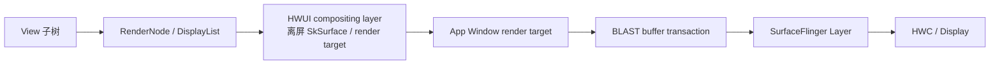

# Hardware Layer

## 区分三种“Layer”

Hardware Layer 这个名称容易混淆概念。Android 图形栈里至少有三种不同对象会被称为 layer：

| 名称 | 所在范围 | 是否有独立 BufferQueue / SurfaceControl | SurfaceFlinger 能否单独看到 |
|:---|:---|:---|:---|
| View Hardware Layer / RenderNode compositing layer | 应用进程 HWUI 内部 | 否 | 否，它先被合成进 App Window buffer |
| `TextureLayer` / `TextureView` 输入层 | 应用进程，HWUI 消费外部 SurfaceTexture | 输入端有独立 BufferQueue，但最终采样进宿主窗口 | 通常只能看到最终宿主 App Window |
| SurfaceFlinger Layer | 系统合成层，来自 SurfaceControl | 通常携带独立 buffer/transaction 状态 | 是 |

这里讨论第一种：HWUI 为某个 View/RenderNode 子树创建中间渲染结果，后续将它作为一个整体参与 App Window 绘制。它不会为这个 View 创建新的窗口，也不会给 HWC 增加一个可独立分配 overlay plane 的图层。

整体关系如下：



Hardware Layer 的收益与代价都发生在 `DL → L → W` 这一段。SurfaceFlinger 只处理最终窗口图层，无法从 SurfaceFlinger 图层数量直接判断某个 View 是否使用 Hardware Layer。

## 硬件加速与 Hardware Layer

硬件加速描述窗口的渲染管线：View 绘制调用记录进 RenderNode/DisplayList，HWUI 在 RenderThread 上使用图形后端生成窗口缓冲。

Hardware Layer 描述单个 RenderNode 的中间合成策略：先把该节点及其子树绘制到离屏 render target，再把结果作为一个整体画回窗口。后续只改变平移、scale、rotation、alpha 等图层属性时，系统可以复用已经栅格化的内容。

两者的边界是：

- 窗口开启硬件加速，View 保持 `LAYER_TYPE_NONE`：现代应用的常规路径；
- 窗口开启硬件加速，View 使用 `LAYER_TYPE_HARDWARE`：显式要求中间 hardware layer；
- View 使用 `LAYER_TYPE_SOFTWARE`：该 View 走软件 Bitmap cache，再进入宿主绘制；
- 窗口没有硬件加速：`LAYER_TYPE_HARDWARE` 会表现得与 software layer 相近，无法获得 HWUI RenderThread hardware layer。

`LAYER_TYPE_NONE` 只表示没有显式 View layer。它不会强制每帧测量、layout 或重录 DisplayList；这些工作是否发生仍由布局请求、invalidate、RenderNode 脏状态和当前帧属性决定。

Android 17 设备端的 `CanvasContext::create()` 根据 `Properties::getRenderPipelineType()` 选择 SkiaGL 或 SkiaVulkan；默认值由 `skiagl`/`skiavk` 配置决定。两条路径都继承 `SkiaGpuPipeline`，其 `createOrUpdateLayer()` 使用 `SkSurfaces::RenderTarget()` 创建 budgeted `SkSurface`。

因此，“GPU 纹理缓存”适合描述设备端常见效果，跟源码时则应使用“RenderNode 持有的 layer surface / GPU render target”。它没有独立的 BufferQueue、GraphicBuffer 或 SurfaceControl，也不能直接交给 SurfaceFlinger 或 HWC。

## `setLayerType()` 在 Android 17 做了什么

### 类型切换会触发一次失效

`View.setLayerType()` 检查类型范围，把类型写入 RenderNode，清理不再需要的软件 drawing cache，更新图层 Paint，并使父缓存与当前 View 失效。下面是 Android 17 的结构摘录：

```java
// frameworks/base/core/java/android/view/View.java
// AOSP android-17.0.0_r1，结构摘录
public void setLayerType(@LayerType int layerType, @Nullable Paint paint) {
    if (layerType < LAYER_TYPE_NONE || layerType > LAYER_TYPE_HARDWARE) {
        throw new IllegalArgumentException(...);
    }

    boolean typeChanged = mRenderNode.setLayerType(layerType);
    if (!typeChanged) {
        setLayerPaint(paint);
        return;
    }

    if (layerType != LAYER_TYPE_SOFTWARE) {
        destroyDrawingCache();
    }

    mLayerType = layerType;
    mLayerPaint = mLayerType == LAYER_TYPE_NONE ? null : paint;
    mRenderNode.setLayerPaint(mLayerPaint);
    invalidateParentCaches();
    invalidate(true);
}
```

因此，在动画已经开始后才切到 HARDWARE，建层成本可能落在首个动画帧。若确有收益，可在动画前预建，或使用 `ViewPropertyAnimator.withLayer()` 让框架在 setup action 中建层并在结束后恢复原类型。

### 三种 LayerType

| LayerType | Android 17 行为 | 适用边界 |
|:---|:---|:---|
| `NONE` | 使用常规 RenderNode/DisplayList 路径，HWUI 仍可按属性自动升层 | 默认选择 |
| `SOFTWARE` | `buildLayer()` 进入 `buildDrawingCache(true)`，生成软件 Bitmap cache | 硬件路径不支持的绘制或必须使用软件语义的局部内容；需要实测 |
| `HARDWARE` | RenderNode 类型设为 RenderLayer；HWUI 创建或更新离屏 layer surface | 内容稳定、会被多帧复用，或需要明确离屏合成语义 |

Software Layer 的 Bitmap 在硬件加速窗口中仍需成为 GPU 可采样资源。内容频繁变化会同时增加主线程软件绘制、Bitmap 更新和图形资源准备成本，因此不适合当作通用性能优化。

`buildDrawingCache()` 所属的公开绘制缓存 API 已废弃，但 Android 17 的 `View.buildLayer()` 内部仍保留这条 SOFTWARE 分支。内部实现仍然存在，不代表应用应重新依赖这套公开 API。

## `buildLayer()`：显式预建的调用链

`View.buildLayer()` 只对 SOFTWARE/HARDWARE 生效，并要求 View 已 attach、宽高非零。Hardware 分支先确保 RenderNode 有 DisplayList，再交给 `ThreadedRenderer`：

```java
// frameworks/base/core/java/android/view/View.java
// AOSP android-17.0.0_r1
public void buildLayer() {
    if (mLayerType == LAYER_TYPE_NONE) return;

    final AttachInfo attachInfo = mAttachInfo;
    if (attachInfo == null) {
        throw new IllegalStateException(
                "This view must be attached to a window first");
    }
    if (getWidth() == 0 || getHeight() == 0) return;

    switch (mLayerType) {
        case LAYER_TYPE_HARDWARE:
            updateDisplayListIfDirty();
            if (attachInfo.mThreadedRenderer != null
                    && mRenderNode.hasDisplayList()) {
                attachInfo.mThreadedRenderer.buildLayer(mRenderNode);
            }
            break;
        case LAYER_TYPE_SOFTWARE:
            buildDrawingCache(true);
            break;
    }
}
```

native HWUI 的 `CanvasContext::buildLayer()` 会暂停当前绘制、用 `TreeInfo::MODE_FULL` 准备目标节点、把 dirty layer 交给渲染管线，并把节点记入 `mPrefetchedLayers`。下一次正常 `prepareTree()` 若见到该节点，会通过 `markLayerInUse()` 接管预建结果；若预建节点没有进入树，`freePrefetchedLayers()` 会记录警告并销毁该图层。

`buildLayer()` 适合已确认首帧建层会影响动画、且 View 即将参与下一次绘制的场景。无条件提前为大量 View 预建，会占用 RenderThread、GPU 和缓存，并可能因节点未被使用而白做。

## 自动升层：应用没有手动设置也可能出现离屏层

### `RenderProperties::promotedToLayer()`

Android 17 不以“绘制指令复杂度评分”决定自动升层。当前条件是确定的布尔组合，并受最大纹理尺寸限制：

```cpp
// frameworks/base/libs/hwui/RenderProperties.h
// AOSP android-17.0.0_r1
bool fitsOnLayer() const {
    const DeviceInfo* deviceInfo = DeviceInfo::get();
    return mWidth <= deviceInfo->maxTextureSize()
            && mHeight <= deviceInfo->maxTextureSize()
            && mWidth > 0 && mHeight > 0;
}

bool promotedToLayer() const {
    return mLayerProperties.mType == LayerType::None
            && fitsOnLayer()
            && (mNeedLayerForFunctors
                || mLayerProperties.mImageFilter != nullptr
                || mLayerProperties.getStretchEffect().requiresLayer()
                || (!MathUtils::isZero(mAlpha)
                    && mAlpha < 1
                    && mHasOverlappingRendering));
}

LayerType effectiveLayerType() const {
    return promotedToLayer()
            ? LayerType::RenderLayer
            : mLayerProperties.mType;
}
```

摘录中的字段名做了类成员前缀压缩，条件与 Android 17 原码一致。自动升层覆盖函子（functor）隔离、ImageFilter、StretchEffect，以及非零半透明度与 overlapping rendering 的组合。尺寸超过最大纹理限制时无法走这条 RenderLayer 路径。

### `hasOverlappingRendering()` 为什么重要

alpha 直接乘到每条绘制操作上，与“先把整棵子树画到离屏层，再对整体乘 alpha”在重叠区域会产生不同结果。View 声明没有重叠内容时，HWUI 有机会直接调制 alpha，避免离屏缓冲。

自定义 View 只有在语义可靠时才应让 `hasOverlappingRendering()` 返回 `false`。错误声明可能改变视觉结果；它不是纯粹的性能标记。

### `RenderNode.setUseCompositingLayer()`

Android 17 的公开 `RenderNode` API 可以显式控制中间缓冲：

- `setUseCompositingLayer(true, paint)`：把 native layer type 设为 RenderLayer，并设置合成 Paint；
- `setUseCompositingLayer(false, null)`：恢复默认，让 HWUI 决定是否自动升层；
- `getUseCompositingLayer()`：查询是否显式设置了 layer type。

官方注释把 `false` 作为默认且通常推荐的值。合成 Paint 可提供额外 alpha、blend mode 和 `ColorFilter`；使用 compositing layer 还会带来 `clipToBounds=true` 的行为，需要同时检查视觉语义。

`View.setLayerType(HARDWARE)` 与 `RenderNode.setUseCompositingLayer(true, ...)` 最终都影响 RenderNode 的 layer type。前者还维护 View drawing cache、失效和 View API 状态，不能在同一 View 上随意混用两套控制方式。

## layer 内容怎样更新

### dirty 通常触发重绘，不等于重新分配

Android 17 的 `RenderNode::prepareTreeImpl()` 先计算有效 layer type，再进入 `pushLayerUpdate()`：

```text
RenderNode::prepareTreeImpl()
  → prepareLayer()
  → prepare DisplayList and children
  → pushLayerUpdate()
      if no longer a layer / not renderable / invalid size / too large
          destroy existing layer surface
      else
          CanvasContext::createOrUpdateLayer(...)
          LayerUpdateQueue::enqueueLayerWithDamage(node, dirtyRect)

CanvasContext::draw()
  → SkiaPipeline::renderLayers(layerUpdateQueue, ...)
      → renderLayerImpl(node, damage)
          clear/update the layer surface
          replay RenderNode content into dirty region
  → render App Window frame using the layer result
```

内容 `invalidate()` 后，现有 layer surface 可以按 damage 重绘。尺寸、格式、context、可渲染状态或最大纹理限制变化时，才可能释放并重分配资源。把每次内容变化都称为“纹理重建”会高估分配次数，却仍可能低估重绘和 GPU 带宽成本。

### 属性变化与内容变化

| 变化 | DisplayList 是否可能重录 | layer 内容是否要重绘 | 可否复用中间结果 |
|:---|:---|:---|:---|
| translation / rotation / scale | 通常不需要 | 通常不需要 | 可以 |
| 整体 alpha、合成 Paint | 通常不需要 | 取决于是否只在合成阶段应用 | 常可复用 |
| 子 View 文本、图片、Path、draw state | 需要或使节点变脏 | 需要 | 更新后才能复用 |
| View 尺寸变化 | 可能需要 | 需要 | 可能还要重分配 |
| RenderEffect/ImageFilter 参数或输入变化 | 取决于属性和内容 | 通常需要重新执行受影响效果 | 需测量 |

“属性动画”也可能在 listener 中修改文本、布局或绘制状态。判断缓存命中率要看完整动画代码和 Trace，不能只看 Animator 的属性名。

## 成本模型

### 1. 离屏内存

Android 17 的 `SkiaGpuPipeline::createOrUpdateLayer()` 会先把 layer surface 宽高按 `LAYER_SIZE=64` 像素向上取整：

```text
W = ceil(w / 64) × 64
H = ceil(h / 64) × 64
单个 layer surface 的像素存储下界 = W × H × b
```

这里的 `w`、`h` 是 RenderNode 尺寸，`b` 是每像素字节数。这个结果仍只是下界，真实成本还可能包含：

- 行/图块对齐和分配器粒度；
- 像素格式、色彩空间与 HDR 精度；
- 后端/驱动的渲染目标与纹理元数据；
- blur、shadow、MSAA 或效果处理使用的临时表面；
- 缓存、staging 与延迟释放。

64 像素是 Android 17 HWUI 图层表面的尺寸取整，不是 Linux 页面大小。CPU 进程使用 16KB 页面，也不能推出 GPU 纹理按 16KB 固定取整。GraphicBuffer/gralloc、GPU 驱动和 HWUI/Skia 分配器具有各自策略；需要使用目标设备的 memtrack、GPU memory counter、厂商工具或可复现实验测量。

### 2. 首次建立

首次建立要创建或取得 layer surface，并把整个有效脏区域栅格化。对只使用一次的内容，这一步还增加了一轮离屏绘制和一次回写窗口的合成。

建层是否“回本”取决于：

`多帧直接重放子树的成本 - 多帧复用图层的成本 > 首次建立 + 额外内存/合成成本`

这个不等式没有跨设备固定阈值。刷新率、分辨率、GPU、Skia backend、内容复杂度和复用帧数都会改变结果。

### 3. 内容重绘

内容变脏后，HWUI 可只重绘图层的受损区域，但复杂裁剪、effect、子树损伤扩散或整层清除会扩大工作范围。内容每帧变化时，Hardware Layer 仍可能每帧执行离屏绘制，再额外合成回窗口，成本可能高于常规路径。

### 4. 采样质量与裁剪

Hardware Layer 是已经栅格化的图像。大幅放大可能暴露采样模糊；旋转、透视和缩放的视觉结果还受 filter 与像素密度影响。强制 compositing layer 的 clip-to-bounds 语义也可能裁掉原先越界绘制的内容。

### 5. GPU 与内存带宽

离屏绘制会写 layer surface，最终窗口绘制又要读取它。复杂子树复用可以节省重复光栅化，但大面积图层会增加 render target 写入、纹理采样和内存带宽。Tile-based GPU 是否把部分工作留在片上、何时落到外部内存，取决于后端与驱动，AOSP View API 无法给出统一结论。

### Kernel 与驱动边界

kernel 侧统一以 `android17-6.18-2026-06_r6` 为版本锚点。View Hardware Layer 是 HWUI/Skia 内部 render target，不保证每个图层都对应一个可在 `drivers/dma-buf/dma-buf.c` 中单独识别的导出 dma-buf。最终应用窗口 GraphicBuffer 通常跨进程共享，内部 layer texture 则可能只存在于 GPU 驱动和图形 API 的资源空间。

因此，进程 dma-buf 总量、`dumpsys SurfaceFlinger` Layer 数和 View Hardware Layer 数之间没有一一对应关系。分析内部纹理分配要依赖 GPU/driver 工具；分析最终窗口缓冲才进入 gralloc、dma-buf、BufferQueue 与 SurfaceFlinger 的共享路径。

## 什么时候值得显式使用

### 候选场景

- 大而复杂的子树内容保持稳定，却要连续多帧做平移、scale、rotation；
- 整棵子树做 alpha 动画，重叠内容要求整体离屏合成；
- 需要用图层 Paint 对整棵子树施加 blend mode 或 ColorFilter；
- Trace 已显示常规路径反复栅格化同一稳定内容，预建后能把成本移出关键动画帧；
- 某些 RenderEffect/隔离语义要求中间结果，并已确认内存与 GPU 预算可接受。

### 高风险场景

- 文本、图片、列表项或自定义绘制内容每帧变化；
- layer 接近全屏或数量很多，内存和带宽压力明显；
- 子树绘制本来很便宜，复用帧数又少；
- View 尺寸在动画中持续变化；
- 内容需要清晰的大幅缩放；
- 依赖越界绘制，clip-to-bounds 会改变结果；
- 现代 HWUI 已自动升层，手动设置只增加生命周期管理。

建议用 A/B 跟踪做决定：保持设备、刷新率、页面数据、动画阶段和热状态一致，分别比较 layer build/update、RenderThread、GPU、FrameTimeline 与内存。

## 动画期间怎样管理生命周期

### 优先考虑 `withLayer()`

`ViewPropertyAnimator.withLayer()` 会保存当前 layer type，在下一次动画准备阶段切到 HARDWARE；View 已 attach 时还会调用 `buildLayer()`。动画结束后恢复原类型。

下面的写法适合纯 View property animation，并能减少漏恢复：

```java
view.animate()
        .translationX(240f)
        .rotation(8f)
        .setDuration(300)
        .withLayer()
        .start();
```

`withLayer()` 只对下一次动画有效。调用它之后又独立修改 View layer type，会与动画结束时的恢复动作产生冲突。内容在动画期间持续变脏时，它也无法创造缓存收益。

### 其他 Animator 要覆盖取消路径

使用 `ObjectAnimator` 或自定义动画时，如实测证明需要图层，应在开始前设置，在结束与 cancel 都恢复原类型。还要处理 View detach、动画被替换和多个动画重叠，避免一个 listener 提前释放另一个动画仍在使用的图层。

长期把整个页面或 RecyclerView 列表项固定为 HARDWARE 通常缺少收益证据。动态场景更适合把稳定背景与频繁变化内容拆成不同节点，再单独评估稳定部分。

## Perfetto 中怎样找 Hardware Layer 成本

### 先锁定线程与帧

Android 17 可关注这些 HWUI 证据：

- UI 线程：DisplayList record、View invalidation、Software Layer 的 drawing cache 工作；
- RenderThread：`buildLayer`、`draw layers`、`drawLayer [name]`、目标帧 `DrawFrame`；
- GPU：离屏 pass、GPU duration、texture/render-target allocation（设备支持时）；
- FrameTimeline：App SurfaceFrame expected/actual SurfaceFrame 的预期时间、实际时间与 jank type；
- 内存：memtrack、GPU 内存计数器或厂商图形工具。

slice 名会受 build、atrace category 和 Skia 后端影响。看到 `buildLayer` 一次，只能说明发生过预建或图层更新；连续出现也可能来自预期的内容变化。必须对齐 View/RenderNode 名称、dirty 来源和动画阶段。

### 四种典型组合

| Trace 现象 | 解释方向 | 下一步 |
|:---|:---|:---|
| 动画开始前一次 `buildLayer`，后续内容稳定 | 预建可能命中 | 比较后续 GPU/RT 与无图层版本 |
| 每帧都有 `drawLayer [name]`，同时内容失效 | layer 内容持续重绘 | 找出 dirty 来源，评估拆分稳定与动态节点 |
| layer build/update 很短，但 GPU/带宽上升 | 离屏面积或额外采样成本 | 比较 GPU counter、分辨率和 layer bounds |
| 去掉手动图层后视觉不变且帧时间更低 | HWUI 自动路径已足够 | 保持 `LAYER_TYPE_NONE` |

### “显示硬件层更新”只用于辅助定位

开发者选项中的“显示硬件层更新”（Show hardware layer updates）会在 hardware layer 更新时闪色。它适合快速确认某一区域是否持续更新，不能给出耗时、GPU 工作或内存。最终结论仍要回到 Perfetto 与设备内存证据。

## RenderEffect 与 Hardware Layer

`View.setRenderEffect()` 把效果写入 RenderNode。Android 17 的自动升层条件包含非空 ImageFilter，因此这类效果通常需要中间合成结果。

RenderEffect 用于产生模糊、color filter 或其他图像效果；显式 Hardware Layer 用于控制中间结果复用与图层 Paint。二者可能在同一 RenderNode 汇合，却不保证“叠加两个 API 就一定缓存一次”。effect 输入或参数变化时仍需执行相应绘制与滤镜工作。

分析 RenderEffect 时，除 layer update 外还要检查效果范围、blur 半径、HDR/颜色空间、GPU 绘制轮次和 damage。全屏模糊即使内容稳定，也可能带来很高的中间表面与采样成本。

## Compose `graphicsLayer`：与平台版本分开看

Jetpack Compose 属于 AndroidX，`graphicsLayer` 行为由应用依赖版本决定，不能只写“Android 17 就是某个 Compose 实现”。下面的语义固定到 `androidx.compose.ui:ui:1.11.4` 的 `GraphicsLayerModifier.kt` 与 `GraphicsLayerScope.kt`，并与 Android Developers 文档交叉核对。

Compose UI 1.11.4 的核心语义是：

- `Modifier.graphicsLayer` 先提供绘制指令隔离与整体变换；
- draw layer 不保证分配离屏缓冲；
- 图层被栅格化时，内容才会进入离屏缓冲；
- 内容绘制指令不变时，渲染管线可以重新发出已有指令，而不必重跑应用绘制代码。

`CompositingStrategy` 决定何时强制离屏：

| 策略 | 官方语义 | 风险 |
|:---|:---|:---|
| `Auto` | 默认；alpha < 1 或设置 RenderEffect 等条件会使用 offscreen | 由参数决定，不能只看 modifier 名称 |
| `Offscreen` | 总是先渲染到离屏缓冲，再合成到目标 | 增加内存、pass 和 bounds clipping |
| `ModulateAlpha` | 把 alpha 调制到每条绘制指令；无 RenderEffect 时可避免 alpha 离屏 | 重叠内容可能得到不同视觉结果 |

除 `CompositingStrategy.Offscreen` 外，1.11.4 的 `GraphicsLayerScope` 还规定：非 `SrcOver` 的 `blendMode` 和非空 `colorFilter` 都会强制离屏，语义等价于 Offscreen。`Auto` 仍可能离屏，会根据 alpha、RenderEffect 和这些合成属性选择中间缓冲。

下面的代码显式要求 Offscreen，适合需要把 `BlendMode` 限制在当前 composable 内容范围内的场景：

```kotlin
Box(
    Modifier.graphicsLayer {
        alpha = 0.7f
        rotationZ = 8f
        compositingStrategy = CompositingStrategy.Offscreen
    }
)
```

Offscreen 会把绘制限制在 layer bounds 内。只有 rotation/translation 变化且内容不变时，复用概率较高；state 变化导致内容重新绘制时，离屏结果也要更新。Compose 优化应同时查看重组、measure/layout、draw layer、宿主 RenderThread 与 GPU，不能把所有成本归到 `graphicsLayer`。

## 与 TextureView、SurfaceFlinger Layer 的边界

`TextureView` 的 `TextureLayer` 用来消费外部 SurfaceTexture buffer。Android 17 的 `DeferredLayerUpdater` 按槽位包装或复用 `SkImage`，把外部内容采样进宿主 App Window。这个对象与 View Hardware Layer 都在 HWUI 内部，但数据来源和生命周期不同：

- Hardware Layer 的内容来自 View/RenderNode 子树重放；
- TextureLayer 的内容来自外部 Producer 的 BufferQueue；
- 两者最终都进入宿主窗口缓冲；
- HWC 通常只能把宿主 App Window 当成一个 SurfaceFlinger 图层处理。

`TextureView` 使用“layer”不代表它获得独立 HWC overlay，也不能用 View 的 `setLayerType()` 解决外部 Producer queue、SurfaceTexture acquire 或 fence 问题。

## 版本演进

| 版本 | 已核对的变化 | 当前解释 |
|:---|:---|:---|
| Android 3.0 / API 11 | `View.setLayerType()`、Hardware Layer 随硬件加速 View 系统进入 API | 早期 API 起点 |
| Android 5.0 / API 21 | HWUI 引入 RenderThread 架构 | Hardware Layer 的准备与离屏绘制进入现代 UI/RT 分工 |
| Android 10 / API 29 | `RenderNode` 成为公开 API，提供 `setUseCompositingLayer()` | 可在 RenderNode 级显式要求中间缓冲 |
| Android 12 / API 31 | `View.setRenderEffect()` / RenderEffect 进入公开 API | ImageFilter/effect 需要结合自动升层与离屏成本分析 |
| Android 17 / API 37 | 源码锚点：`promotedToLayer()`、`effectiveLayerType()`、damage queue、Skia 图层渲染与 `CanvasContext::buildLayer()` | 当前条件、方法名和资源生命周期按 `android-17.0.0_r1` 解读 |

Compose 的 `graphicsLayer`、`CompositingStrategy` 与 `rememberGraphicsLayer()` 由 AndroidX artifact 版本管理，不放进平台 API 版本表。Review 时记录应用的 Compose UI 依赖版本。

## 常见误解

### “窗口开启硬件加速，每个 View 就有 Hardware Layer”

默认 View 使用 `LAYER_TYPE_NONE`。HWUI 只在显式要求或 `promotedToLayer()` 条件满足时创建中间图层。

### “用了 Hardware Layer 就能跳过 measure/layout”

Layer 缓存的是绘制结果。measure/layout 是否执行由布局请求和约束变化决定。

### “内容 invalidate 会重新分配纹理”

常见路径是在现有 layer surface 上按 damage 重绘。尺寸、context、格式、可渲染状态等变化才可能要求重分配。

### “Hardware Layer 一定能让属性动画更快”

简单内容、复用帧少、内容持续变化或图层面积过大时，首次建立和额外 pass 可能超过节省的工作。现代 HWUI 还会自动升层。

### “16KB 页设备的 layer 内存可以直接按 16KB 取整”

CPU 页面大小无法决定 GPU/gralloc 分配器的全部粒度。内存结论要来自目标设备的实际统计。

### “View Hardware Layer 会在 SurfaceFlinger 中出现独立 Layer”

它先合成进 App Window buffer。SurfaceFlinger 通常只看到窗口 SurfaceControl Layer。

## Android 17 源码锚点

| 需要确认的问题 | 源码入口 |
|:---|:---|
| View 图层类型切换、Paint 与失效 | `core/java/android/view/View.java`：`setLayerType()` |
| SOFTWARE/HARDWARE 预建 | `View.java`：`buildLayer()` |
| 动画临时图层与恢复 | `core/java/android/view/ViewPropertyAnimator.java`：`withLayer()` |
| RenderNode 显式 compositing API | `graphics/java/android/graphics/RenderNode.java` |
| 自动升层与尺寸限制 | `libs/hwui/RenderProperties.h`：`promotedToLayer()`、`fitsOnLayer()` |
| layer surface 保留、销毁与 damage | `libs/hwui/RenderNode.cpp`：`prepareLayer()`、`pushLayerUpdate()` |
| dirty rect 合并 | `libs/hwui/LayerUpdateQueue.cpp` |
| 显式预建与 prefetched layer | `libs/hwui/renderthread/CanvasContext.cpp`：`buildLayer()`、`freePrefetchedLayers()` |
| Skia 离屏图层重绘 | `libs/hwui/pipeline/skia/SkiaPipeline.cpp`：`renderLayers()`、`renderLayerImpl()` |
| GPU 图层表面的 64 像素尺寸取整与分配 | `libs/hwui/pipeline/skia/SkiaGpuPipeline.cpp`：`createOrUpdateLayer()` |
| 设备端 SkiaGL/SkiaVulkan 选择 | `libs/hwui/Properties.cpp`、`renderthread/CanvasContext.cpp` |
| TextureView 输入与 HWUI 采样 | `core/java/android/view/TextureView.java`、`graphics/java/android/graphics/TextureLayer.java`、`libs/hwui/DeferredLayerUpdater.cpp` |

## Android 17 的 Hardware Layer 使用边界

Hardware Layer 是 HWUI 内部的 RenderNode 中间渲染结果。它用一次离屏绘制换取后续多帧对子树结果的复用，也会增加内存、render pass、采样、失效重绘和生命周期管理成本。

决策时依次回答：

1. View 内容在动画期间是否稳定；
2. 变化的是图层属性，还是子树绘制内容或尺寸；
3. Android 17 的自动升层是否已经覆盖该场景；
4. 首次构建、后续更新、GPU 与内存各花多少；
5. 复用帧数是否足以覆盖建层成本；
6. clip、alpha overlap、采样质量是否保持正确。

没有跟踪证据时保持 `LAYER_TYPE_NONE`；需要临时图层的 ViewPropertyAnimator 优先使用 `withLayer()`；显式预建与长期缓存都要以目标设备 A/B 数据为准。

## 参考资料

### Android 17 AOSP

- [View.java](https://android.googlesource.com/platform/frameworks/base/+/android-17.0.0_r1/core/java/android/view/View.java)
- [ViewPropertyAnimator.java](https://android.googlesource.com/platform/frameworks/base/+/android-17.0.0_r1/core/java/android/view/ViewPropertyAnimator.java)
- [RenderNode.java](https://android.googlesource.com/platform/frameworks/base/+/android-17.0.0_r1/graphics/java/android/graphics/RenderNode.java)
- [RenderProperties.h](https://android.googlesource.com/platform/frameworks/base/+/android-17.0.0_r1/libs/hwui/RenderProperties.h)
- [RenderNode.cpp](https://android.googlesource.com/platform/frameworks/base/+/android-17.0.0_r1/libs/hwui/RenderNode.cpp)
- [LayerUpdateQueue.cpp](https://android.googlesource.com/platform/frameworks/base/+/android-17.0.0_r1/libs/hwui/LayerUpdateQueue.cpp)
- [CanvasContext.cpp](https://android.googlesource.com/platform/frameworks/base/+/android-17.0.0_r1/libs/hwui/renderthread/CanvasContext.cpp)
- [SkiaPipeline.cpp](https://android.googlesource.com/platform/frameworks/base/+/android-17.0.0_r1/libs/hwui/pipeline/skia/SkiaPipeline.cpp)
- [SkiaGpuPipeline.cpp](https://android.googlesource.com/platform/frameworks/base/+/android-17.0.0_r1/libs/hwui/pipeline/skia/SkiaGpuPipeline.cpp)
- [Properties.cpp](https://android.googlesource.com/platform/frameworks/base/+/android-17.0.0_r1/libs/hwui/Properties.cpp)
- [TextureView.java](https://android.googlesource.com/platform/frameworks/base/+/android-17.0.0_r1/core/java/android/view/TextureView.java)
- [TextureLayer.java](https://android.googlesource.com/platform/frameworks/base/+/android-17.0.0_r1/graphics/java/android/graphics/TextureLayer.java)
- [DeferredLayerUpdater.cpp](https://android.googlesource.com/platform/frameworks/base/+/android-17.0.0_r1/libs/hwui/DeferredLayerUpdater.cpp)

### Kernel 边界

- [`drivers/dma-buf/dma-buf.c`](https://android.googlesource.com/kernel/common/+/android17-6.18-2026-06_r6/drivers/dma-buf/dma-buf.c)

### 官方文档

- [View.setLayerType](https://developer.android.com/reference/android/view/View#setLayerType(int,%20android.graphics.Paint))
- [ViewPropertyAnimator.withLayer](https://developer.android.com/reference/android/view/ViewPropertyAnimator#withLayer())
- [Hardware acceleration](https://developer.android.com/topic/performance/hardware-accel)
- [RenderNode.setUseCompositingLayer](https://developer.android.com/reference/android/graphics/RenderNode#setUseCompositingLayer(boolean,%20android.graphics.Paint))
- [Compose graphics modifiers](https://developer.android.com/develop/ui/compose/graphics/draw/modifiers)
- [Compose UI 1.11.4 sources](https://dl.google.com/dl/android/maven2/androidx/compose/ui/ui/1.11.4/ui-1.11.4-sources.jar)

### 相关章节

- [2.4 Choreographer 与渲染流水线](04-choreographer.md)
- [2.5 MainThread 与 RenderThread 协作](05-main-render-thread.md)
- [2.6 SurfaceFlinger 与合成](06-surfaceflinger.md)
- [7.1 卡顿定义](../../part2-performance/ch07-smoothness/01-jank-definition.md)
- [7.5 优化策略](../../part2-performance/ch07-smoothness/05-optimization.md)
