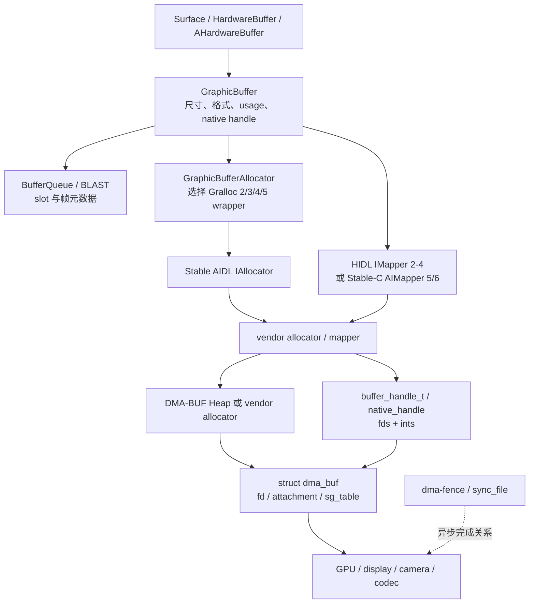
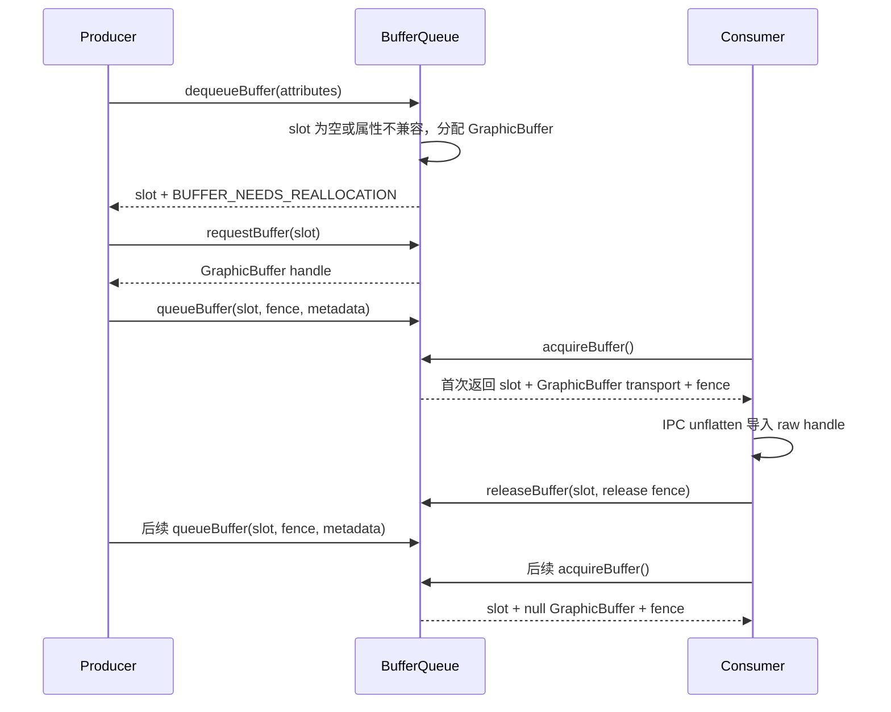
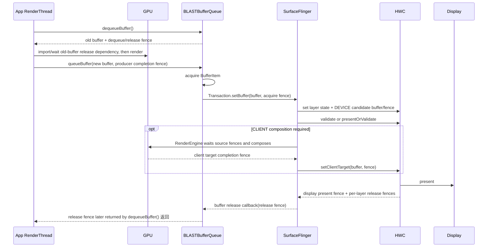

# BufferQueue、Gralloc 与 Sync Fence

BufferQueue 管理 Producer 与 Consumer 之间的缓冲区所有权，Gralloc 和 DMA-BUF 提供实际内存，fence 表示读写何时完成。三个层次共同决定是否阻塞、能否复用以及跨进程共享是否安全。

## BufferQueue 的槽位、所有权与反压

### 先把问题放到正确的一段

Perfetto 中出现以下现象时，BufferQueue 是必须检查的一层：

- RenderThread 的 `dequeueBuffer()` 变长；
- App 已调用 `queueBuffer()`，SurfaceFlinger 迟迟没有采用新内容；
- 窗口尺寸、crop（裁剪区域）或位置已经改变，内容仍像上一帧；
- 连续几帧越积越深，输入响应随之变迟；
- 某个 layer 的 release fence 很晚，后续 Producer 拿不到合适的 buffer。

这些现象横跨“取 buffer、写 buffer、交 buffer、合成、释放”五个阶段。只看 App CPU、GPU busy（GPU 正在执行工作）或 SurfaceFlinger 任意一条轨道，都不足以判断责任位置。分析以 Android 17/API 37、`android-17.0.0_r1` 为平台锚点；fence 的内核规则固定到 `android17-6.18-2026-06_r6`。

### 一组 slot 如何代替整帧复制

BufferQueue 连接一个 Producer（生产者）和一个 Consumer（消费者）。Producer 写入内容，Consumer 读取内容；`BufferQueueCore` 维护一组 slot（可循环复用的槽位索引）、各 slot 绑定的 `GraphicBuffer`、队列元数据和同步对象。`GraphicBuffer` 代表一块可供图形组件共享的 buffer，slot 则用于反复引用它，二者不是同一个对象。

`GraphicBuffer` 底层通常关联可跨进程、跨设备共享的 dma-buf（Linux 内核的共享 buffer 机制）。双方传递 slot、buffer 引用、时间戳、crop、transform（旋转或翻转）、dataspace（颜色空间和传输特征）以及 fence，无需在每次交接时复制整帧像素。fence 是异步读写的完成凭证：signal 表示对应工作已经完成，acquire fence 约束下游何时可读，release fence 约束上游何时可复用。

这里的“零拷贝”只描述 BufferQueue 的交接方式。TextureView 回流、截图、格式转换或 SurfaceFlinger 的 client composition（由 GPU 合成多个输入图层）仍可能增加采样和输出 buffer。

Android 的可见 Surface 也不都采用同一种拓扑：

| 场景 | 常见 Producer | BufferQueue Consumer 所在处 | 最终去向 |
|---|---|---|---|
| 标准 App Window | HWUI RenderThread | App 进程内的 BLAST | `SurfaceControl.Transaction` 进入 SF |
| `SurfaceView`/视频/Camera 输出 | 应用、codec HAL（编解码硬件抽象层） | 取决于该 Surface 的创建路径 | 独立 SF layer 或中间消费者 |
| `TextureView` 输入 | 外部 Producer | App 进程中的 `SurfaceTexture` | 被宿主 HWUI 再采样 |
| Vulkan swapchain（轮换呈现的一组图像） | Vulkan queue | Android WSI（Vulkan 与窗口系统的接口）/BufferQueue 路径 | 对应 Surface 的消费链 |

BLAST 是 BufferQueue Layer Aware Surface Transactions，用于把 App 窗口内容 buffer 与对应的图层事务关联起来。下文用 SF 代指 SurfaceFlinger，用 HWC 代指 Hardware Composer（硬件合成器）。因此，“App 是 Producer、SF 是 Consumer”只适用于一部分历史或独立 Surface 模型。Android 17 的标准 App Window 要按 App 内 BLAST Consumer 分析。

### Producer 的三个主调用

`IGraphicBufferProducer` 把选 slot、取得 buffer 引用和提交内容分成不同操作。以下接口片段用于说明职责边界。

```cpp
// android-17.0.0_r1
virtual status_t requestBuffer(int slot, sp<GraphicBuffer>* buf) = 0;

virtual status_t dequeueBuffer(
        int* slot, sp<Fence>* fence,
        uint32_t width, uint32_t height,
        PixelFormat format, uint64_t usage,
        uint64_t* outBufferAge,
        FrameEventHistoryDelta* outTimestamps) = 0;

virtual status_t queueBuffer(
        int slot, const QueueBufferInput& input,
        QueueBufferOutput* output) = 0;
```

三步分别回答“用哪个 slot”“这个 slot 绑定哪块内存”“本帧何时可供 Consumer 读取”。接口中的 `usage` 描述 CPU、GPU、显示或视频等使用方式，`outBufferAge` 则告诉 Producer 这块 buffer 距离上次显示经过了多少帧，可用于决定局部重绘范围。

#### 1. `dequeueBuffer()`：选出满足约束的 slot

`BufferQueueProducer::dequeueBuffer()` 优先从 `mFreeBuffers` 选择已经分配内存的 FREE slot；没有合适对象且允许分配时，再从 `mFreeSlots` 选一个空 slot。返回值包括 slot 编号和上一位所有者留下的 fence。

这里有两个容易混淆的边界：

- FREE 表示 slot 已回到 BufferQueue 的可选集合；
- 返回的 fence 标记为完成后，Producer 才能安全覆盖 buffer 的旧内容。

`BufferQueueProducer` 可以先返回 slot 和 fence。EGL（OpenGL ES 与原生窗口系统之间的接口）、Vulkan、HWUI（Android View 的硬件加速渲染器）或其他 Producer 负责等待 fence，或把 fence 导入后续 GPU 工作。一次高层 `dequeue` 时长可能同时包含“等 free slot”和图形后端处理 fence 的时间，分析调用栈时要把两者分开。

#### 2. `requestBuffer()`：按需取得新映射

首次分配、尺寸、格式或 usage 变化，以及 Consumer 重新附着 buffer 等情况，会让 `dequeueBuffer()` 返回 `BUFFER_NEEDS_REALLOCATION`，表示 Producer 需要刷新 slot 对应的 buffer 引用。`Surface::dequeueBuffer()` 收到该标志，或者本地 slot 尚未缓存 `GraphicBuffer` 时，才调用 `requestBuffer()`。

稳定渲染时，Producer 已缓存 slot 到 `GraphicBuffer` 的映射。native handle 是跨进程描述底层内存和相关文件描述符的句柄；每帧都传一份完整 handle 会增加 Binder 与句柄映射成本，AOSP 的 slot 设计用于避免这项开销。

#### 3. `queueBuffer()`：提交 slot、元数据和生产完成 fence

Producer 生成内容后调用 `queueBuffer()`。`QueueBufferInput` 携带生产完成 fence、时间戳、crop、transform、dataspace、surface damage（本帧实际更新的区域）等信息。该 fence 到达下游后充当 acquire fence：Consumer 读取像素前必须遵守它。

`queueBuffer()` 返回只说明 CPU 侧提交完成。此后还可能发生：

- GPU 继续执行写入命令；
- App 内 BLAST 尚未 acquire `BufferItem`；
- buffer transaction 尚未到达 SurfaceFlinger；
- 本轮 SF latch 没有采用该 buffer；
- HWC 尚未显示。

### slot 状态与 fence 要分开读

Android 17 的 `BufferState` 使用计数器和 shared 标志表达状态。shared buffer mode（共享 buffer 模式）允许 Producer 和 Consumer 围绕固定 buffer 重复交接，因此状态不再总是四选一。以下片段解释源码为何用 `isFree()` 等方法判断。

```cpp
// frameworks/native/libs/gui/include/gui/BufferSlot.h
struct BufferState {
    uint32_t mDequeueCount;
    uint32_t mQueueCount;
    uint32_t mAcquireCount;
    bool mShared;

    bool isFree() const {
        return !isAcquired() && !isDequeued() && !isQueued();
    }
    bool isDequeued() const { return mDequeueCount > 0; }
    bool isQueued() const { return mQueueCount > 0; }
    bool isAcquired() const { return mAcquireCount > 0; }
    bool isShared() const { return mShared; }
};
```

普通单 Producer、单 Consumer 路径通常呈现以下顺序：

```text
FREE
  -> dequeueBuffer()
DEQUEUED
  -> queueBuffer()
QUEUED
  -> acquireBuffer()
ACQUIRED
  -> releaseBuffer(releaseFence)
FREE + releaseFence
```

shared buffer mode 允许 `mShared` 与 dequeued、queued、acquired 计数并存，也允许相关计数大于 1。诊断当前源码时，应使用 `isFree()`、`isDequeued()`、`isQueued()`、`isAcquired()` 和 `isShared()`，不能套用旧版互斥 enum（枚举状态）。

状态和访问权限的对应关系如下：

| 状态/动作 | 所有权含义 | fence 约束 |
|---|---|---|
| FREE | BufferQueue 可把 slot 交给 Producer | slot 仍可能保存上一轮 release fence |
| DEQUEUED | Producer 已取得 slot | 写入前等待 `dequeueBuffer()` 返回的 fence |
| QUEUED | Producer 已提交，等待 Consumer | Consumer 读取前等待生产完成 fence |
| ACQUIRED | Consumer 已取得 `BufferItem` | Consumer/HWC/RenderEngine 继续遵守 acquire fence |
| `releaseBuffer()` | Consumer 归还 slot | release fence 表示何时可安全复用旧内容 |

`releaseBuffer()` 会把 slot 放回 FREE 集合并保存 release fence，无需先等待 fence 完成。下一次 Producer 可能马上 dequeue 到该 slot，同时取得尚未 signal 的 fence。因此，“已经 FREE”和“已经可写”是两个时间点：前者表示所有权可以交回 Producer，后者还要求旧读操作确实结束。

### buffer 数量没有固定答案

“三缓冲”适合描述常见现象，不适合作为 Android 17 的固定配置。max dequeued 表示 Producer 最多同时持有多少个已 dequeue 的 slot，max acquired 表示 Consumer 最多同时持有多少个已 acquire 的 slot；`BufferQueueCore::getMaxBufferCountLocked()` 由下式约束：

```text
maxBufferCount =
    maxAcquiredBufferCount
  + maxDequeuedBufferCount
  + (asyncMode || dequeueBufferCannotBlock ? 1 : 0)

最终结果还受 mMaxBufferCount 上限限制
```

Android 17 的 `BLASTBufferQueue::initialize()` 给 Producer 设置安全默认值 `setMaxDequeuedBufferCount(2)`，但 Producer 可以按能力覆盖。BLAST 还会向 SurfaceComposer service 查询最大刷新率下建议的 acquired 数，再设置内部 `BLASTBufferItemConsumer` 的 `maxAcquiredBufferCount`。SurfaceFlinger 根据 present latency（提交显示到完成显示之间的延迟）与刷新周期计算建议值，并受 `min_acquired_buffers`/`max_acquired_buffers` 属性约束。

SF 的 release 信息还会携带当前刷新率对应的 acquired 数。对于 EGL Producer，BLAST 可能暂存一部分已收到 release 信息的 buffer，以适应当前刷新率低于设备最大刷新率的情况。可用深度因此取决于：

- max dequeued 与 max acquired；
- async/non-blocking（异步/不可阻塞）配置；
- DEQUEUED、QUEUED、ACQUIRED 的实时数量；
- BLAST 的 pending release（已收到释放信息、但仍暂存的 buffer）；
- buffer 是否需要重分配；
- release fence 的完成时间。

看到三个 buffer 时，可以称其为三缓冲工作形态；不能由此反推所有 Surface 都固定分配三块。

#### slot 复用不是 framework 通用显存池

Android 17 的 `BufferQueueCore` 默认准备 64 个 slot 索引，但刚创建的队列可以一块 `GraphicBuffer` 都没有。slot 分布在四类容器：`mFreeSlots` 保存尚未绑定 buffer 的 FREE slot，`mFreeBuffers` 保存仍绑定旧 buffer 的 FREE slot，`mUnusedSlots` 保存当前不计入可用数量且无 buffer 的 slot，`mActiveBuffers` 保存 DEQUEUED、QUEUED、ACQUIRED 等活动 slot。64 描述可用索引的容量，不代表已经分配了 64 块内存；经过 Consumer/Producer 显式协商的路径还可以扩展 slot 数。

普通 `dequeueBuffer()` 优先从 `mFreeBuffers.front()` 取得已分配对象；没有可复用 buffer 且允许分配时，才选择 `mFreeSlots` 并在 `dequeueBuffer()` 内创建新 `GraphicBuffer`。`requestBuffer()` 只是把新映射交给 Producer 缓存，分配动作不发生在这个调用中。

`GraphicBufferAllocator` 的 `sAllocList` 记录当前 handle、请求者和估算尺寸，用于 dump（状态转储）与 `mem.gralloc.*` trace；gralloc 是 Android 分配图形 buffer 的硬件抽象接口。释放时条目会移除，列表没有按规格查找已释放 handle 的接口。稳定渲染中的“池化”主要来自 slot 保留 `GraphicBuffer` 绑定。vendor allocator（厂商内存分配器）或驱动是否另有 free-list（空闲对象表）、heap cache（堆缓存）或压缩布局，必须用设备实现和对象身份取证，不能从 AOSP slot 复用反推。

清理 slot 也只释放 BufferQueue 自己持有的引用。Producer `Surface` 缓存、Consumer/BLAST/SF buffer cache、EGLImage 或 Vulkan import（图形 API 对该 buffer 建立的资源映射）、其他进程 handle，以及驱动 attachment（驱动仍持有的绑定）都可能延长底层分配寿命。因此 `FREE`、slot 中没有 `GraphicBuffer`、底层物理页已回收是三个不同结论。

### `dequeueBuffer()` 等待的精确条件

`waitForFreeSlotThenRelock()` 先统计当前 dequeued/acquired 数，再选择 free buffer 或 free slot。Android 17 需要区分三种结果：

1. 历史标志 `mBufferHasBeenQueued` 已为 true，且 `dequeuedCount >= mMaxDequeuedBufferCount`：直接返回 `INVALID_OPERATION`。它表示 Producer 试图超过 dequeued 上限，属于调用状态不合法；不要求当前 `mQueue` 非空，也不会等待 Consumer release。
2. 没有满足条件的 free slot，或 `mQueue.size() > maxBufferCount`：进入重试。
3. 重试时处于 async/non-blocking 模式，且 acquired 数未超过允许的临时额外值：返回 `WOULD_BLOCK`，表示当前没有 buffer、调用方又不能在这里等待；其余情况等待 buffer 状态变化，超时配置生效时也可能返回 `TIMED_OUT`。

下面的结构示意用于记住分支，不代表完整源码。

```text
waitForFreeSlotThenRelock()
  count DEQUEUED / ACQUIRED

  if max DEQUEUED already reached
      return INVALID_OPERATION

  find FREE buffer or allocatable FREE slot

  if none found or queue is over its limit
      if async / non-blocking conditions match
          return WOULD_BLOCK
      waitForBufferRelease()
      retry
```

把 `INVALID_OPERATION`、`WOULD_BLOCK` 和长时间等待都归为“背压”，会得到错误结论。背压指下游消费不及，使上游不能继续生产；判断是否属于这种情况，需要同时记录返回码、Surface 模式、slot 数量和 Consumer 进度。

### 通用 BufferQueue 与 Android 17 BLAST 的等待方式

#### 通用路径：条件变量

`BufferQueueCore::mMutex` 是保护 slot、free lists、FIFO（先进先出队列）、计数和大部分队列配置的互斥锁。Producer 与 Consumer 操作共享 core 时都会短暂持有这把锁。BufferQueue 还有 callback lock、allocation condition（等待分配完成的条件变量）、BLAST 自身 mutex 等其他同步对象，因此 `mCore->mMutex` 不能代表整条图形管线的唯一锁。

通用 `BufferQueueProducer::waitForBufferRelease()` 使用 `mDequeueCondition.wait()`/`wait_for()` 等待条件变化。等待期间 `std::unique_lock` 会释放 `mCore->mMutex`，Consumer 才能进入 `acquireBuffer()` 或 `releaseBuffer()` 改变状态。`releaseBuffer()`、`cancelBuffer()`、队列消费及部分配置变化都会调用 `notifyBufferReleased()`，默认实现再通过 `notify_all()` 唤醒等待者，让它们重新检查条件。

listener callback（监听器回调）也会在 core lock 之外执行。Perfetto 中一条较长的 `dequeueBuffer` slice，不能直接解释为 `mCore->mMutex` 全程被占用。

#### 标准 App Window：`BufferReleaseChannel`

Android 17 的 BLAST 创建 `BBQBufferQueueCore` 和 `BBQBufferQueueProducer`。它们仍复用通用 slot 状态机，但等待 release 时走了专门路径：

```text
BBQBufferQueueProducer::waitForBufferRelease()
  clear pending interrupt
  unlock mCore->mMutex
  BufferReleaseReader::readBlocking()
    epoll waits for:
      - SF buffer release message
      - local interrupt
  BLASTBufferQueue::releaseBufferCallback()
  BLASTBufferItemConsumer::releaseBuffer(releaseFence)
  reacquire mCore->mMutex and retry
```

BLAST 初始化时创建 `BufferReleaseChannel` 两端，并通过独立的 `SurfaceControl.Transaction::setBufferReleaseChannel()` 把 Producer endpoint（通道端点）交给 SF。等待侧使用 epoll（Linux 事件等待接口）同时监听 SF 的 buffer release 消息和本地 interrupt（中断等待）消息。`Layer::callReleaseBufferCallback()` 将 `ReleaseCallbackId`（一次 buffer 提交的释放标识）、release fence 和当前刷新率的 acquired 数写回 channel；transaction 的 release callback 入口仍然存在，BLAST 会对重复的 release 信息去重。channel 传回“哪块 buffer 被释放以及对应 fence”，后续仍可能存在 fence wait。

`BBQBufferQueueCore::notifyBufferReleased()` 的当前实现会中断阻塞读取，让等待线程重新检查本地 free slot。标准 App Window 的长 dequeue 不能只按 `mDequeueCondition` 分析。

正常归还主要来自 SF 的 release callback 或 release channel。BLAST 注册的 transaction-completed callback 还有一条兜底：如果较新的 transaction 已越过仍留在 `mSubmitted` 中的旧 buffer，它会以 `fakeRelease=true` 补发 stale-buffer release（为已经过时的旧提交补记一次释放），再由同一个 `releaseBufferCallbackLocked()` 去重和归还。这个“fake”只处理漏掉正常 release 的旧提交，不能据此把每次 buffer 回收都归到 transaction-completed callback。

### BLAST 如何把 buffer 变成 transaction

Android 17 的 `ViewRootImpl.updateBlastSurfaceIfNeeded()` 在应用进程创建或更新 `BLASTBufferQueue`，再把它生成的 `Surface` 交给 HWUI。BLAST 内部包含 Producer、`BufferQueueCore`、`BufferQueueConsumer` 和 `BLASTBufferItemConsumer`。

以下调用骨架用于区分 App 侧 queue、BLAST acquire 和 SF buffer transaction；它展示的是责任顺序，不代表这些调用都在同一线程同步执行。

```text
RenderThread / Producer
  Surface::dequeueBuffer()
  draw or submit GPU work
  Surface::queueBuffer(producerCompletionFence)

BLASTBufferQueue::onFrameAvailable()
  acquireNextBufferLocked()
    BLASTBufferItemConsumer::acquireBuffer()
    Transaction::setBuffer(
        surfaceControl,
        graphicBuffer,
        acquireFence,
        frameNumber,
        producerId,
        releaseBufferCallback,
        dequeueTime)
    set dataspace / HDR metadata / damage / crop / transform
    merge pending transactions up to frameNumber
    Transaction::apply()

SurfaceFlinger
  receive pending buffer transaction
  evaluate readiness and select buffer for a display frame
  compose / present
  send per-buffer release information back to BLAST
```

`queueBuffer()` 触发的 frame-available callback（新帧可用回调）先到 App 内 BLAST；BLAST acquire `BufferItem` 后，才调用 `Transaction::setBuffer()` 把 buffer update 发送给 SF。也就是说，本地 Consumer 取得 buffer 和 SF 收到图层事务是前后两个动作，不能写成“本地 Consumer 直接通知 SF acquire buffer”。

#### geometry 同步能保证到哪里

`mergeWithNextTransaction(transaction, frameNumber)` 允许窗口 resize、crop、position 或其他受控 `SurfaceControl` 状态按 frame number 与目标 buffer 合并。`syncNextTransaction()`、transition sync 和 `SurfaceSyncGroup` 还能协调参与同一同步协议的对象，让这些对象满足 ready 条件后再一起提交。

这些机制只覆盖已经加入 transaction 或 sync group 的状态与 buffer。外部 codec（编解码器）、Camera、另一个进程的独立帧循环，以及未加入同步组的 Surface，不会因为同屏显示就自动采用同一业务帧。acquire fence 未满足时，目标更新也可能被推迟。

BLAST 提供明确的 transaction 边界，不能保证所有窗口始终使用同一帧。

#### latch 与读取是两个同步边界

Android 13 起，`AutoSingleLayer` 允许 SurfaceFlinger 在严格条件下先 latch acquire fence 尚未 signal 的 buffer。Android 17 的 `transactionReadyBufferCheck()` 会检查 `shouldLatchUnsignaled()`；`AutoSingleLayer` 路径要求本次只更新一个 layer、位于 transaction 队首、不使用 early VSync（提前触发的 VSync 调度）配置，并且通过 `RequestedLayerState::isSimpleBufferUpdate()`。包含 geometry change 或 sync transaction 的更新不符合该模型。

满足这些条件，只表示 transaction readiness（事务是否可以进入后续处理）阶段可以先采纳 buffer 状态。RenderEngine 或 HWC 开始读取像素前仍需遵守 acquire fence。因此，trace 中“buffer 已 latch”和“Producer 写入已完成”是两个时间点；queue 时 fence 尚未 signal，也不能直接断言本轮一定无法 latch。

### 三类 fence 的方向

这里讨论 BufferQueue 交接，后文继续解释 sync_file 与 dma-fence。排障时至少要标明以下三类对象：

| 名称 | 粒度 | 产生方与流向 | 能证明什么 |
|---|---|---|---|
| Producer completion/acquire fence | 每块输入 buffer | Producer 随 `queueBuffer()` 提交，交给 Consumer/SF/HWC | 写入何时完成、下游何时可读 |
| layer release fence | 每个被消费的 layer buffer | HWC/RenderEngine 经 SF 回到 BLAST/BufferQueue | 下游何时不再读、何时可复用 |
| display present fence | 每个 display frame | HWC present 返回给 SF | 本轮 display present 到达 Android 显示栈可观察边界 |

present fence 不是某个 App buffer 独享的 fence；release fence 也不等同于 present fence。CLIENT composition（由 RenderEngine/GPU 先合成）时，RenderEngine 会消费输入 layer fence，并为 client target（交给显示硬件的合成结果 buffer）产生自己的 acquire fence。SF 还可能按 layer 使用方式合并或选择 release fence。

进入 kernel 后，native fence fd（文件描述符）由 `sync_file` 暴露，底层依赖 `dma_fence` 的 signal、callback 与 wait。公共 kernel 只能说明通用同步机制，无法解释 vendor GPU、DPU（显示处理单元）或 codec 为何在某台设备上晚 signal；这部分需要设备驱动、vendor trace 和调用现场。

### Android 17 的 buffer-stuffing recovery

buffer stuffing 指队列中的在途帧过多，Producer 因缺少 free buffer 而被迫等待。标准 App Window 出现这种情况时，`BBQBufferQueueProducer::waitForBufferRelease()` 会统计阻塞时长；`ViewRootImpl` 再通过 `ThreadedRenderer` 把等待回调接到 `Choreographer.onWaitForBufferRelease()`。

等待超过上一帧间隔的一半后，`Choreographer` 标记 stuffed（队列拥塞）状态。随后的 `doFrame()` 可以：

- 主动推迟一个 VSync，给队列释放空间；
- 恢复期间给动画 frame time 加一个负 offset（从动画使用的帧时间中减去一段时间，修正主动跳过 VSync 后的动画进度）；
- 检测到空闲后结束恢复。

`buffer_stuffing_multi_recovery` 控制同一段动画能否多次触发恢复；`buffer_stuffing_recovery_threshold` 启用时，累计主动延迟受 `MAX_BUFFER_STUFFING_DELAY_NS = 100 ms` 限制。这些是可变 aconfig flag（Android 平台配置开关），设备取值必须从配置或 trace 确认。

这套策略在队列已经过深时主动少生产一帧，以降低后续延迟。Perfetto 中出现 `Buffer stuffing recovery`、`buffer stuffed` 或 `Negative offset`，说明系统正在恢复排队状态，不能把那次主动 delay（延后执行）直接归因于 CPU 执行过慢。

### 在 Perfetto 中建立证据链

绝对毫秒阈值会随刷新率、Surface 类型、GPU/HWC、热状态和 trace 开销变化。应先采集同机型、同刷新率、同场景的顺畅基线，再比较异常段。

#### 三个时间点需要分开

对标准 App Window，至少分开：

1. App `queueBuffer()` 返回；
2. App 内 BLAST acquire 并 apply buffer transaction；
3. SF 收到 pending buffer transaction，随后 latch/select/present。

Android 17 中常见的观测对象包括：

| 观测项 | 所在处 | 解读 |
|---|---|---|
| `dequeueBuffer - <surface>`/`queueBuffer` | App Producer | Producer 取出或提交 slot |
| `QueuedBuffer - <name>BLAST#<id>` | App 内 BLAST counter（计数器） | BLAST 可用、acquired、pending release 的组合计数 |
| `BufferTX - <layerName>` | SurfaceFlinger | SF 服务端 pending buffer transaction 数 |
| FrameTimeline `SurfaceFrame` | App/目标 Surface | 该 Surface 帧的 expected/actual（预期/实际时刻）与 jank（卡顿原因）分类 |
| FrameTimeline `DisplayFrame` | SurfaceFlinger/display | 整屏 expected/actual present |
| release/present fence | SF/HWC/display | buffer 回收和显示完成边界 |

`BufferTX` 增加只说明 SF 记录了一笔 pending buffer update。它没有直接给出 acquire fence 是否就绪、sync barrier（阻止事务继续推进的同步条件）是否满足，或 display 是否已使用新 buffer。计数在 latch 或 drop（丢弃更新）后都会下降，不能仅靠下降本身区分两种结果。

BLAST 在 `acquireNextBufferLocked()` 中按 frame number 查找 pending FrameTimeline info，并调用 `Transaction::setFrameTimelineInfo()`；相关 trace 会带 frame number 和 VSync ID。VSync ID/FrameTimeline token 用于把应用帧与预期显示时刻关联起来，`queueBuffer` slice 本身没有该 ID 后缀。对齐时应结合 BLAST transaction、FrameTimeline token、layer/buffer id 和相邻 SF display frame 判断。

#### `dequeueBuffer()` 变长

按以下顺序检查：

1. 返回码是成功、`INVALID_OPERATION`、`WOULD_BLOCK` 还是 `TIMED_OUT`；
2. 当前 Surface 是 App Window BLAST、SurfaceView、SurfaceTexture、codec 还是 Vulkan swapchain；
3. max dequeued/acquired、async mode 和已分配 buffer 数；
4. `QueuedBuffer` 与 `BufferTX` 是否持续堆高；
5. SF 是否迟迟未选用或释放旧 buffer；
6. release fence 是否晚到，返回 slot 后又在哪里等待 fence；
7. 是否出现 buffer-stuffing recovery。

单个 Producer 长 dequeue 通常只说明对应队列缺少可用 buffer。多窗口中的其他 App 有独立队列和主线程，不能直接推断所有窗口都被同一个锁阻塞。

#### `queueBuffer()` 后很久才显示

沿下游逐段确认：

1. BLAST 是否及时 acquire；
2. SF 的 `BufferTX` 何时增加；
3. transaction 是否受 sync group、barrier、desired present（期望显示时刻）或 acquire fence 影响；
4. 本轮 display frame 采用新 buffer，还是沿用旧内容；
5. HWC strategy 是否发生 DEVICE/CLIENT 切换，即从显示硬件直接合成改为 GPU 合成，或反向切换；
6. present fence 与 FrameTimeline actual present 位于哪里。

Producer 完成早而 `BufferTX` 晚，优先查 App 内 BLAST 与 transaction；`BufferTX` 已到而 latch 晚，查 transaction readiness 和 fence；latch 已完成而 present 晚，继续查 CompositionEngine、RenderEngine、HWC 和 display。

#### native 锁竞争

`android.monitor_contention` 面向 Java/Kotlin monitor，不能证明 `BufferQueueCore::mMutex` 发生争用。native BufferQueue 需要结合函数 slice、thread state、futex（Linux 用户态锁的内核等待机制）、scheduler blocked reason（调度器记录的阻塞原因）、调用栈与 Consumer 时序。由于 wait 会释放 core mutex，一条处于 sleeping 状态的 `dequeueBuffer` 也不能自动归类为 mutex contention（互斥锁竞争）。

### 版本与实现边界

| 版本 | 可由 tag 确认的变化 | 排障模型 |
|---|---|---|
| Android 4.1/API 16 | `android-4.1.2_r1` 已包含 native `BufferQueue.cpp` | BufferQueue 是 Project Butter 时代已有的图形基础组件 |
| Android 11 / API 30 | `android-11.0.0_r48` 已包含 `BLASTBufferQueue.cpp`，`ViewRootImpl` 已有 BLAST 创建路径 | 可确认 BLAST 已进入窗口代码，不能由文件存在推断所有设备都默认采用 |
| Android 12/API 31 | BLAST 与 FrameTimeline 构成现代 App Window 分析基线 | 分开 App queue、BLAST transaction、SF `BufferTX` 和 display present |
| Android 13—16/API 33—36 | 主体仍沿 BLAST/SurfaceControl transaction 演进，公开同步与 transaction API 继续增加 | 版本差异应落到具体 API、flag、Surface 类型和设备实现 |
| Android 17/API 37 | 当前实现包含 `BufferReleaseChannel`、动态 acquired-count 反馈、buffer-stuffing recovery 与现行 FrontEnd（SF 前端状态处理）/SF 观测 | 等待路径不能只套经典 `mDequeueCondition`，队列深度也不能写成固定三缓冲 |

版本表只陈述能从固定 tag 或官方文档确认的内容。Android 17 源码中存在某个实现，不足以证明它从 Android 17 首次引入；判断引入版本时，还需比较历史 tag 和提交。

### 常见误区

#### 把 FREE 当成 fence 已 signal

`releaseBuffer()` 可以先把 slot 归还 FREE，再把尚未 signal 的 release fence 交给 Producer。FREE 描述所有权，fence 描述访问时序。

#### 把 `queueBuffer()` 当成已经上屏

它只完成 Producer 提交。BLAST acquire、SF transaction、latch、composition 和 display present 仍在后面。

#### 把三缓冲当成常量

Android 17 的 max dequeued、max acquired、async extra、SF 刷新率反馈和 pending release 共同决定可用深度。

#### 把 BLAST 当成纯性能加速器

BLAST 的职责是把 buffer、frame number、fence 和受控 layer 状态放入明确的 transaction 边界。它无法替未参与同步的外部 Producer 保证业务帧一致。

#### 由一条 slice 判断责任方

长 `dequeueBuffer` 可能在等待 free slot，也可能在更高层处理 release fence；`BufferTX` 高可能来自 pending、readiness 或 drop；present 晚还可能发生在 HWC/display。责任结论需要相邻阶段互相印证。

## Gralloc 分配与 DMA-BUF 共享

BufferQueue 只管理槽位和状态，GraphicBuffer 背后的物理页、格式和映射由 Gralloc 与 DMA-BUF 决定。

BufferQueue 负责回答“哪个 slot（可复用的槽位索引）归谁使用”，Gralloc（graphics allocator，图形 buffer 分配接口）负责回答“按什么规格分配、怎样导入和访问”，DMA-BUF 负责回答“同一份 buffer 怎样被多个设备驱动和进程引用”。三者解决不同问题。

先区分几个贯穿全文的对象：handle 是描述 buffer 及其文件描述符、私有整数等信息的不透明句柄；raw handle 是尚未导入当前进程的传输形态，imported handle 是 Mapper 导入后可供当前进程使用的形态；backing storage 是真正承载像素和元数据的底层存储；attachment 则表示某个硬件设备已经把这块 DMA-BUF 接入自己的访问路径。关闭一个 fd、释放一个 handle、解除一次 attachment 和回收 backing storage 是四个不同动作。

理解这组边界后，许多常见现象会变得清楚：

- Binder 传递 `GraphicBuffer` 时会复制元数据和文件描述符引用，不会复制整帧像素；
- “零拷贝”只描述跨模块共享这一段，不保证后续没有 GPU 合成、格式转换、resolve（把多重采样或中间结果转成目标图像）或 CPU copy；
- handle 传到另一个进程后还要由 Mapper（Gralloc 的导入与访问接口）执行 import，得到该进程可用的 imported handle；
- 同一个 BufferQueue slot 在两端都有缓存，稳定阶段通常只传 slot、fence（异步工作完成信号）和帧元数据；
- fd、imported handle、设备 attachment、内存映射和队列引用都会延长生命周期，关闭某一个 fd 不代表 backing storage 立即释放。

分析以 Android 17/API 37、`android-17.0.0_r1` 为用户空间锚点，内核侧以 `android17-6.18-2026-06_r6` 为锚点。Gralloc 的分配策略和 handle 布局由 SoC（System on Chip，系统级芯片）厂商实现，AOSP（Android Open Source Project）只能证明接口与框架行为。

### 1. 为什么图形 buffer 不能按普通 Binder 数据传

一张 1080 × 2400、每像素 4 字节的未压缩 RGBA 图像，按紧密排布估算约为 9.9 MiB（1 MiB = 1,048,576 字节）：

```text
1080 × 2400 × 4 = 10,368,000 bytes ≈ 9.9 MiB
```

这个数只用于说明数量级。Gralloc 分配还可能包含 stride padding（每行末尾的对齐填充）、多个 plane（分别存放亮度、色度等分量的平面）、压缩元数据、对齐区和实现私有区域，不能用它推算设备上的准确占用。

若每帧都把像素从应用复制到 SurfaceFlinger，60 fps 时单次 IPC（跨进程调用）边界就会增加约 593 MiB/s 的读写数据量。Android 因而让参与者共享 buffer，并用 handle 传递访问能力。这里仍会产生真实内存流量：GPU 渲染要写，SurfaceFlinger 或 HWC（Hardware Composer，硬件合成器）要读，CLIENT composition（由 RenderEngine/GPU 合成）还会读取源图层，并写入 client target（交给显示系统的 GPU 合成结果）。共享避免的是跨进程所有权转移所需的整帧复制。

### 2. 从 API 到内核的分层

下图用于区分对象、接口和内核资源。箭头表示控制或引用关系，不表示每台设备都由 DMA-BUF Heap 提供 backing storage。AIDL/HIDL 是 Android HAL 的接口描述机制，Stable-C 则用稳定 C ABI（二进制调用约定）连接 framework 与厂商 Mapper。



图中的 `sg_table` 是 scatter-gather table，即把多个物理页段描述成一份 DMA 映射的数据结构。`buffer_handle_t` 是不透明类型，也是 `native_handle_t` 的图形缓冲区别名，可以带多个 fd 和整数；AOSP 不规定“第一个 fd 必定是像素 DMA-BUF”，也不规定厂商私有整数的意义。只能通过 Mapper metadata API、厂商文档和内核 fd 信息解释具体 handle。

#### 2.1 GraphicBuffer 与 AHardwareBuffer

`GraphicBuffer` 是 framework native 层的包装对象，保存 width、height、stride（相邻两行起点之间的跨度）、format、layer count、usage（预期访问方式）、generation number（区分 Surface 重新配置前后 buffer 的代次）、ID 和 handle。像素不在 C++ 对象内部。

公开 NDK（Native Development Kit）API 使用 `AHardwareBuffer`。它允许 native 应用分配、引用、描述、CPU lock（映射并取得 CPU 可访问地址），并把同一 buffer 导入 EGL 或 Vulkan。Java `HardwareBuffer` 包装同类 native 对象。应用应先用 `AHardwareBuffer_isSupported()` 或 `HardwareBuffer.isSupported()` 检查 format、layer 与 usage 组合；系统版本达到 API 下限也不能保证任意组合可分配。

#### 2.2 Gralloc Allocator

Android 17 的主线分配接口是 Stable AIDL `IAllocator`。Stable AIDL 表示接口可以跨 framework/vendor 版本稳定通信。当前接口包含：

- `allocate2(BufferDescriptorInfo, count)`：按结构化 descriptor（分配规格描述）分配；
- `isSupported()`：判断 descriptor 是否受支持，内存等资源耗尽仍可能让后续实际分配失败；
- `getIMapperLibrarySuffix()`：定位 vendor Stable-C Mapper SP-HAL（同进程加载的稳定厂商 HAL 库）；
- `isMultiViewSupported()`/`allocateMultiView()`：Android 17 源码中的 multi-view（同一分配具有多个视图）接口。

旧 `allocate(byte[] descriptor, count)` 仍在 AIDL 中，但注释明确：配合 `AIMAPPER_VERSION_5` 时已由 `allocate2()` 替代；设备仍使用 `mapper@4` 时，旧入口还需要实现。Android 17 framework 同时保留新旧 vendor 接口适配，不能概括为“Gralloc 已完全改成 AIDL”。

`BufferDescriptorInfo` 包含名称、宽高、layer count、format、usage、`reservedSize`（为调用方保留的额外区域大小）与 `additionalOptions`。`additionalOptions` 用于不改变总体 usage、却影响分配方式的扩展条件；AIDL 注释以 surface compression level（表面压缩级别）为例。它不是公开的 `AHardwareBuffer_allocateWithOptions()`，NDK 没有这个函数。

#### 2.3 Gralloc Mapper

Mapper 负责把 raw handle 导入当前进程，并提供 metadata（描述 buffer 布局和属性的元数据）、CPU lock/unlock、reserved region（保留区域）和释放 imported handle 等操作。Android 17 源码中：

- IMapper 2–4 使用 HIDL；
- C 风格 `AIMapper` 从版本 5 开始；
- `AIMapperV6` 增加 multi-view 查询与 view handle 导入；
- framework 的 `GraphicBufferMapper` 把 Stable-C 路径归在 `GRALLOC_5` wrapper 下，同时保留 Gralloc 2/3/4 wrapper。

Stable-C `IMapper.h` 明确说明它是 `libui` 与 vendor Mapper 之间的 SP-HAL 接口，不是给普通应用直接调用的 NDK API。

#### 2.4 Usage 描述访问者，不承诺执行路径

usage 会影响 allocator 选择内存布局、压缩、cache policy（缓存策略）和安全属性。常见对应关系如下：

| 现代 usage | 典型含义 |
|---|---|
| `CPU_READ_*`/`CPU_WRITE_*` | 允许通过 Mapper/AHardwareBuffer lock 进行 CPU 访问 |
| `GPU_SAMPLED_IMAGE` | GPU 作为纹理或 sampled image 读取 |
| `GPU_COLOR_OUTPUT`/`GPU_FRAMEBUFFER` | GPU 作为 framebuffer attachment 写入 |
| `COMPOSER_OVERLAY` | buffer 可能交给 Composer HAL（显示合成硬件抽象层）使用 |
| `VIDEO_ENCODE` | 视频编码器读取 |
| `PROTECTED_CONTENT` | 仅允许受保护路径，禁止普通 CPU 访问 |
| `FRONT_BUFFER` | 请求 front-buffer（直接更新当前显示使用的前台 buffer）用途，其他 usage 会影响具体行为 |

usage 表达“哪些访问必须被支持”。带 `COMPOSER_OVERLAY` 不保证 HWC 一定分配 overlay plane（显示硬件可直接合成的平面）；带 CPU usage 也不保证 lock 没有同步和 cache maintenance（缓存维护）成本。format 与 usage 的组合要通过 `isSupported()` 验证。

### 3. DMA-BUF：共享框架，不是唯一分配器

Linux DMA-BUF 把共享对象表示为 `struct dma_buf`，并能以 fd（文件描述符）暴露给用户空间。Android 17 内核文档将相关能力分成三个主要原语：

- `dma-buf`：共享 buffer，内部关联 backing storage 与 attachment；
- `dma-fence`：异步硬件工作完成信号；
- `dma-resv`：为某个 dma-buf 管理一组 implicit synchronization fence（由驱动隐式关联的同步依赖）。

Android 图形栈大量使用显式 fence fd；不能因为内核提供 `dma-resv`，就假设所有 Android GPU、HWC 与 Camera 访问都由 implicit sync 自动排序。

#### 3.1 Exporter 与 importer

Exporter（导出方）决定怎样分配 backing storage，实现 `dma_buf_ops`，并通过 `dma_buf_export()` 建立共享对象。Importer（导入方）通过 fd 获得引用，再为自己的硬件设备建立 attachment 与 DMA mapping（设备可访问的 DMA 地址映射）。典型内核接口包括：

- `dma_buf_get()` / `dma_buf_put()`：取得与释放引用；
- `dma_buf_attach()` / `dma_buf_detach()`：把设备关联到共享对象；
- `dma_buf_map_attachment()`/`dma_buf_unmap_attachment()`：获得或释放适合该设备 DMA 的 scatter-gather 映射，即把多个不连续内存段组成设备可访问的列表；
- `dma_buf_begin_cpu_access()`/`dma_buf_end_cpu_access()`：在 CPU 访问边界处理 coherency（CPU 与设备看到一致内容所需的同步和缓存维护）。

Importer 看到的是适合自身设备的 DMA 地址与 scatterlist。IOMMU（输入输出内存管理单元）可以把设备看到的地址映射到一组物理页，因此“共享一份 buffer”不表示所有设备使用同一个物理地址；scatter-gather、压缩布局与迁移也可能由 exporter 和驱动处理。

#### 3.2 fd 传递与引用

Binder 把 fd 传到目标进程时，会在那里安装一个指向同一 file object（内核文件对象）的 fd。两个进程中的整数编号通常不同，且每个 fd 都有自己的 close 生命周期。像素 payload（实际数据内容）没有随 Parcel 复制。

backing storage 的寿命也不只由可见 fd 数量决定。imported handle、`mmap`（把对象映射进进程虚拟地址空间）、设备 attachment、内核引用和对象缓存都可能继续持有它。最后一个相关引用释放后，dma-buf exporter 的 `release` 才有机会回收资源。

DMA-BUF 文档要求 exporter 创建 fd 时支持原子设置 `O_CLOEXEC`，使该 fd 在进程执行新程序时自动关闭，避免多线程程序在 `fork`/`exec` 之间的竞态窗口泄漏访问能力。这既是资源问题，也是安全边界。

#### 3.3 DMA-BUF Heap 与 ION

DMA-BUF 本身不规定 backing storage 从哪里来。DMA-BUF Heap 是一个标准用户空间分配前端，通过 `/dev/dma_heap/<heap-name>` 分配并返回 dma-buf fd；GPU GEM（图形执行管理器的内存对象）、Camera 或 vendor allocator 也可以成为 exporter。

Android 12 的 GKI（Generic Kernel Image，通用内核镜像）2.0 用 DMA-BUF Heaps 替换 ION（Android 旧的共享内存分配框架）作为 GKI 分配框架。`libdmabufheap` 在迁移阶段曾支持把 heap name 映射回 ION；Android 17 的 `android-17.0.0_r1` 已移除 ION 实现。当前 `Alloc()` 打开 `/dev/dma_heap/<name>` 后直接执行 `DMA_HEAP_IOCTL_ALLOC`，打开失败就返回错误。带旧参数的 overload（重载函数）和 `MapNameToIonHeap()` 仅为二进制兼容保留，`CheckIonSupport()` 固定返回 false，不能再据此推导 ION fallback（备用路径）。设备上的 heap 名称、安全或物理连续策略、cache policy 与访问权限仍由产品和 vendor 决定。看到 `/dev/dma_heap/system` 等节点可以确认分配入口，不能据此断定物理内存控制器或带宽已经隔离。

### 4. 一次分配怎样发生

以 classic BufferQueue（不含 BLAST 特有封装的通用队列路径）为例，Android 17 `BufferQueueProducer::dequeueBuffer()` 会先选择可用 slot，再检查该 slot 的 `GraphicBuffer` 是否为空，或 width、height、format、layer count、usage 是否需要重新分配。

需要新 buffer 时，流程如下：

1. `BufferQueueProducer` 清理旧 slot 内容并设置 `BUFFER_NEEDS_REALLOCATION`（需要重新分配）；
2. 创建新的 `GraphicBuffer`；
3. `GraphicBufferAllocator` 按 Mapper 版本选择 Gralloc 2/3/4/5 allocator wrapper（对不同代接口的适配封装）；
4. vendor Allocator 按 descriptor 分配，并返回 raw native handle；
5. 常规 `GraphicBuffer` 分配会把 allocator 返回的 raw handle 导入为当前进程可用的 handle；只有显式请求 raw handle 的内部调用方会跳过这一步；
6. producer 看到 reallocation flag 后调用 `requestBuffer(slot)`，取得这一 slot 的 `GraphicBuffer`；
7. `queueBuffer()` 要求该 slot 已经执行过 `requestBuffer()`。

`GraphicBufferAllocator` 不直接承诺使用某个 DMA-BUF Heap。它只调用适配当前 Gralloc 版本的 allocator。AOSP 的 `sAllocList` 保存已分配 handle 的估算尺寸和请求者，用于 `dump()`、`getTotalSize()` 与 atrace（Android 系统 trace 标记）计数；释放后不会由这张表保留 buffer 供再次分配。

#### 4.1 什么时候会复用 slot 中的 buffer

`GraphicBuffer::needsReallocation()` 在以下条件变化时返回 true：

- width 或 height；
- pixel format；
- layer count；
- 现有 usage 不能覆盖新 usage；
- protected usage 状态变化。

Android 17 的扩展分配 flag 开启时，additional options generation（附加分配选项的代次）变化也会触发 reallocation（重新分配）。反过来，属性仍兼容且 slot 中已有 buffer 时，dequeue 可以复用对象，不经过新的物理分配。

这里的“复用”是 BufferQueue slot 持有同一个 `GraphicBuffer`。vendor allocator 释放后是否缓存 backing storage 属于设备实现，不能从 AOSP `GraphicBufferAllocator` 或 slot 状态推导。

#### 4.2 16 KB page size 怎样影响估算

Android 15 起平台支持 16 KB page size（内存页大小）设备。它会影响 ELF 可执行文件、`mmap`、页表和许多按页管理的区域，但不能简单写成“每个 GraphicBuffer 都按 16 KB 向上取整”。图形 buffer 可能采用多 plane、tile（分块布局）、压缩或 vendor 私有布局，最终 allocation size 由 allocator 和 exporter 决定。

评估图形内存时至少要区分：

- 逻辑尺寸：width × height；
- stride 与 plane layout；
- format、compression metadata 和 alignment；
- `reservedSize`；
- IOMMU/CPU mapping 与页表成本；
- 多进程统计是否重复计算同一 dma-buf inode（内核中标识同一文件对象的编号）。

`GraphicBufferAllocator` 的 `stride × height × bytesPerPixel` 只是部分格式的估算，源码也把 dump 文案写成 estimate。判断 16 KB 设备上的变化应使用 allocator metadata、dma-buf size 和目标设备测量。

#### 4.3 DMA-BUF Heap 的页对齐边界

在 `android17-6.18-2026-06_r6` 中，通用 `dma_heap_buffer_alloc()` 会对传入长度执行 `__PAGE_ALIGN`（按内核页大小向上对齐）。16 KB 内核因而把交给 DMA-BUF Heap 的最终长度向上取整到 16 KB；这一步发生在 Gralloc 已经决定 stride、plane、压缩 metadata 和实现对齐之后，不能反推所有 GraphicBuffer 的 stride 都是 16 KB 倍数。

通用 system heap 可以用多个不同 order（连续页块大小等级）的 page 构造 `sg_table`，不承诺整块 buffer 物理连续。IOMMU domain（同一套 I/O 地址空间）还会按自己的 `pgsize_bitmap` 选择支持的映射页大小；CPU base page、IOMMU page 和 GPU page table 不是同一个参数。

Android 17 的 `libdmabufheap` 已移除 ION 实现。`Alloc()` 打开目标 `/dev/dma_heap/<name>` 失败后直接返回错误，带 `legacy_align` 的 overload 只保留二进制兼容，`CheckIonSupport()` 固定为 false。`AllocSystem()` 是否选择 `system-uncached` 也只描述通用库入口；vendor Gralloc 仍可根据 format、usage、protected content 和硬件约束选择其他 exporter。

#### 4.4 16 KB App 兼容不是图形内存开关

ELF `LOAD` segment（装载段）、APK 中未压缩 `.so`、`mmap()` 参数和硬编码 `4096` 属于应用运行时兼容问题。它们可以用 `getconf PAGE_SIZE`、`readelf -lW` 和 `zipalign -c -P 16` 分别验证，但通过这些检查既不能证明 GraphicBuffer layout 改变，也不能证明 GPU/HWC 性能提升。

排查时把三组证据分开保存：页大小与原生二进制文件兼容性；Surface、slot、buffer id、format/usage 和 fence 生命周期；dma-buf inode、size、exporter 与跨进程引用。多个进程导入同一个 inode 时不能把每个进程的映射大小相加成唯一物理占用。

### 5. GraphicBuffer 怎样跨进程

`GraphicBuffer` 实现 flatten/unflatten，即把对象序列化为可传输数据，再在接收端恢复。Android 17 的 `flatten()` 写入 13 个基础整数，其中包括尺寸、格式、usage、ID、generation number、transport fd 数量和 transport int 数量；transport ints 是随 handle 传输的普通整数，fd 则放入独立数组，私有整数跟在扁平数据之后。

接收端 `unflatten()`：

1. 校验格式、数量与边界；
2. 创建临时 `native_handle`；
3. 填入 Binder 已安装到本进程的 fd 和 transport ints；
4. 调用 `GraphicBufferMapper::importBuffer()`；
5. 关闭并删除临时 raw handle，保存 imported handle；
6. 对象析构时按 owner（负责释放资源的一方）类型调用 Mapper `freeBuffer()` 或 Allocator `free()`。

因此，fd 被成功传递仍不等于 Mapper import 一定成功。vendor metadata 不兼容、资源不足或错误 handle 都可能让 import 返回错误。

#### 5.1 BufferQueue 为何不在每帧重传 handle

BufferQueue 两端按 slot 缓存 buffer。`BufferQueueConsumer::acquireBuffer()` 在某个 slot 第一次 acquire 新对象时返回 `mGraphicBuffer`；该 slot 之前已被 consumer acquire 过时，源码把输出的 `mGraphicBuffer` 设为 null，避免 consumer 再次 remap（重新导入或映射同一对象）。后续帧仍会携带 slot、frame number、fence、crop、transform、dataspace、damage 和时间信息。

以下序列用于说明 classic BufferQueue 的 handle 缓存点。以跨进程 consumer 为例，首次返回的 `GraphicBuffer` 在 IPC 反序列化时由 `GraphicBuffer::unflatten()` 调用 Mapper import；consumer 侧业务代码不会额外发起这次调用。



图中 import 的进程和 IPC 次数取决于 BufferQueue 拓扑。同进程 producer/consumer 不需要跨 Binder 复制 fd。标准应用窗口常由应用进程内的 BLASTBufferQueue 先消费窗口 buffer，再用 `SurfaceControl.Transaction` 把 buffer 与窗口状态提交给 SurfaceFlinger；此时 SF（SurfaceFlinger）侧还有自己的 buffer cache 与 import 边界。不能把 classic BufferQueue 的单次 IPC 示意直接套到所有窗口。

### 6. 同步：共享地址不代表可以同时读写

Producer 把 GPU 或 CPU 写入完成的 fence 随 buffer 提交给 consumer。consumer 在读取前必须遵守该依赖；读取或显示结束后，再返回 release fence，告诉 producer 何时可以安全复用。Android native fence fd 通常由 `sync_file` 包装一个或多个 `dma_fence`。

这条关系与 fd 引用是两套机制：

- dma-buf/native handle 传递“访问哪块 buffer”；
- dma-fence/sync_file 传递“前一项异步工作何时完成”；
- BufferQueue slot 状态传递“当前所有权处于哪个阶段”。

关闭 fence fd 不等于释放 buffer，关闭 buffer fd 也不表示 GPU 工作已经完成。本节前文已经展开 fence 所有权和 signal/wait（标记完成/等待完成）。

#### 6.1 CPU lock 也要处理同步与 cache

`AHardwareBuffer_lock()` 接收一个 fence fd。fence 非负时，API 会在 lock 过程中等待；传入负值时，调用者要保证先前写入已经完成。lock 还可能因硬件工作尚未完成、cache synchronization（CPU 与设备缓存同步）或实现条件而阻塞。

创建 buffer 时必须声明兼容的 CPU usage。受保护 buffer 不能与 CPU read/write usage 组合。CPU 写完后调用 `AHardwareBuffer_unlock()`：若传入 fence 输出指针，函数返回有效 fence fd 或 `-1`，调用者负责关闭有效 fd；若传入 `nullptr`，函数会阻塞到 unlock 工作完成。不能只依赖“同一进程里调用顺序”推断其他设备何时能看到新内容。

### 7. 生命周期与内存占用

一块图形 buffer 可能同时被以下对象持有：

- allocator/exporter 的 backing storage；
- 各进程中的 raw 或 imported native handle；
- BufferQueue producer/consumer slot；
- BLAST 或 SurfaceFlinger transaction/buffer cache；
- RenderEngine、HWC、Camera、codec 或 GPU driver 的设备 attachment；
- CPU mmap、EGLImage、Vulkan image/memory import；
- 尚未完成的异步工作与 fence 关联对象。

“Java 对象已回收”只排除了其中一类引用。排查泄漏需要同时确认 fd、imported handle、queue slot、layer、API image 与驱动对象的寿命。

常见错误包括：

- clone/dup（复制 handle 或 fd 引用）后遗漏 `native_handle_close()` 或关闭 fd；
- Mapper import 成功后遗漏 `freeBuffer()`；
- `AHardwareBuffer_acquire()` 与 `AHardwareBuffer_release()` 不配对；
- `Image`、`HardwareBuffer`、EGLImage 或 Vulkan import 对象关闭顺序错误；
- Surface 断开后，业务缓存仍持有旧 buffer；
- 异常路径提前返回，跳过 unlock、release 或 transaction release callback。

### 8. 怎样观测与归因

#### 8.1 先按 dma-buf inode 去重

`/proc/<pid>/fd` 可以找到进程持有的 fd，`/proc/<pid>/fdinfo/<fd>` 在内核与驱动支持时提供 inode、size、exporter 等信息。不同进程中的两个 fd 若指向同一 dma-buf，按进程分别相加会重复统计，因此应先按 inode 去重。

内核开启 `CONFIG_DMABUF_SYSFS_STATS` 时，`/sys/kernel/dmabuf/buffers/<inode>/` 可提供 `size` 与 `exporter_name`。debugfs（内核调试文件系统）可用的调试设备上，还可以看 `/sys/kernel/debug/dma_buf/bufinfo`。user build（面向用户发布的系统构建）是否开放这些节点由内核配置与权限决定。

以下命令用于在有权限的设备上快速查看某个进程的 fd 与 fdinfo。它不会自动识别所有 vendor handle，还需要按 inode 汇总。

```bash
adb shell 'for f in /proc/<pid>/fd/*; do readlink \"$f\"; done'
adb shell 'for f in /proc/<pid>/fdinfo/*; do echo \"$f\"; cat \"$f\"; done'
adb shell 'find /sys/kernel/dmabuf/buffers -maxdepth 2 -type f -print 2>/dev/null'
```

第一组输出用于发现 fd 类型，第二组提供可关联字段，第三组查看全系统 dma-buf 统计。生产设备上遇到 permission denied 属于正常安全限制，不应为了普通性能采样而修改 SELinux 策略。

#### 8.2 Perfetto 与系统 dump

Android 17 `GraphicBufferAllocator.cpp` 定义了两个直接观察点：

- `mem.gralloc.buffers`：当前注册在该进程 `sAllocList` 中的数量；
- `mem.gralloc.allocations`：分配 instant track（记录瞬时事件的轨道），包含 requestor、尺寸和 handle。

它们只覆盖经过该进程 `GraphicBufferAllocator` 的对象，不是系统全部 dma-buf。设备支持时还可采集 `dmabuf_heap/dma_heap_stat` ftrace event（内核函数跟踪事件）；事件是否存在取决于内核配置和 vendor 实现，应先检查 tracefs（内核 trace 接口文件系统）的 `available_events`。

结合以下信息更容易定位：

| 证据 | 回答的问题 |
|---|---|
| BufferQueue/BufferTX、slot 与 frame number | 哪条数据流在增加或长期持有 buffer |
| `mem.gralloc.*` | 哪个进程、请求者和尺寸触发 framework 分配 |
| dma-buf fdinfo/sysfs inode | 同一 backing storage 被哪些进程引用、大小与 exporter 是什么 |
| SurfaceFlinger layer trace/dump | layer 是否仍存在，buffer cache 与合成路径怎样 |
| fence、GPU 与 HWC trace | buffer 因异步工作未完成而不能复用，还是引用没有释放 |
| PSI（Pressure Stall Information，资源压力停顿统计）、direct reclaim（当前线程直接回收内存）、IOMMU/GPU driver 事件 | 分配慢是否来自内存压力或设备映射 |

看到 buffer 长时间处于 ACQUIRED 状态时，先判断 consumer 是否按协议持有，再看 release fence 和队列上限。Mapper import 通常发生在新 handle 首次出现时，不能把每次 ACQUIRED 停留都归因于 import。

### 9. 三类常见性能问题

#### 9.1 分配抖动

Surface resize、format/usage 变化、protected 状态变化、slot 被清理、外部 buffer attach/detach（接入或移除队列），以及 additional options 更新，都可能触发 reallocation。分配路径会跨 framework、HAL、vendor allocator 和内核，内存压力下还可能伴随 reclaim（内存回收）或 IOMMU mapping。

优化时先查谁改变了 descriptor，再考虑预分配、稳定尺寸、减少 pool（可复用对象池）重建或延后非关键资源。不能使用脱离设备、格式和压力条件的统一毫秒数。

#### 9.2 Camera/codec/display 的带宽竞争

Camera preview（相机预览）常把 HAL 产出的 buffer 交给 SurfaceTexture、ImageReader、GPU filter、codec 或 HWC。一个 camera buffer 可以在模块间共享，但 ISP（图像信号处理器）写入、GPU 采样、颜色转换、编码器读取和显示扫描都消耗内存带宽。

因此，零拷贝不等于零带宽。分析相机打开后 UI 掉帧时，应分别测量 Camera fence、GPU render pass、最终 Surface present、内存控制器与热状态；heap 名称本身不能证明物理带宽隔离。两条 BufferQueue 与中间 consumer/producer 需要分别检查，以确认积压位置。

视频也遵循同一原则。SurfaceView 视频可能保留独立 layer，TextureView 会把解码 buffer 再采样进宿主窗口；是否获得 HWC DEVICE composition 取决于格式、变换、protected 属性、plane 和带宽等整屏条件。“共享同一 buffer”“省去一次 RenderEngine 合成”和“没有内存带宽成本”是三种不同结论。

#### 9.3 引用泄漏

fd 数量上涨只是线索。若 imported handle 被释放但进程还保留 mmap，或 fd 已关闭但 GPU object 仍持有 attachment，单看 `/proc/<pid>/fd` 都会漏判。反过来，同一个 dma-buf 在多个进程各有 fd 也不能按 fd 数量乘以 size。

应把分配事件、dma-buf inode、BufferQueue slot/layer、API 对象和释放时点放在同一时间范围内。只有确定“哪个引用超过预期寿命”，才能修正实际持有方。

### 10. Android 17 源码入口

| 目标 | 源码 |
|---|---|
| GraphicBuffer transport 与释放 | `frameworks/native/libs/ui/GraphicBuffer.cpp` |
| allocator wrapper、统计 trace | `frameworks/native/libs/ui/GraphicBufferAllocator.cpp` |
| slot 分配与 producer 复用 | `frameworks/native/libs/gui/BufferQueueProducer.cpp` |
| consumer 首次 handle 传递 | `frameworks/native/libs/gui/BufferQueueConsumer.cpp` |
| BLAST transaction buffer 路径 | `frameworks/native/libs/gui/BLASTBufferQueue.cpp` |
| Stable AIDL Allocator | `hardware/interfaces/graphics/allocator/aidl/.../IAllocator.aidl` |
| Stable-C Mapper v5/v6 | `hardware/interfaces/graphics/mapper/stable-c/.../IMapper.h` |
| dma-buf exporter/importer | `drivers/dma-buf/dma-buf.c`、`include/linux/dma-buf.h` |
| DMA-BUF Heap | `drivers/dma-buf/dma-heap.c` |
| native fence fd | `drivers/dma-buf/sync_file.c` |

### 版本与实现边界

#### Android 12 / API 31

Android 12 的 GKI 2.0 以 DMA-BUF Heaps 替换 ION 分配框架。BufferQueue、GraphicBuffer 和 dma-buf 共享早已存在，变化集中在 allocator 的内核入口与 GKI 可维护性。旧版本或 vendor 私有组件仍可能保留 ION，不能仅按系统 API level 猜测节点；Android 17 AOSP 的 `libdmabufheap` 本身不再提供 ION fallback。

#### Android 13–14

这两版持续演进 BLAST、SurfaceFlinger buffer cache、Composer 与内存诊断，但没有改变 dma-buf/Gralloc 的基本职责。讨论某个 cache purge（主动清理缓存）或 Composer 优化时，要绑定对应实现、HAL 版本和可复现内存变化，不能把它写成所有 buffer 生命周期的固定步骤。

#### Android 15–16

16 KB page size 支持让 native library 与映射对齐受到更多关注；图形内存仍应以 allocator 返回的布局和 dma-buf size 为准。Stable AIDL Allocator 与 Stable-C Mapper 路径继续取代旧接口的主线位置，同时保留 vendor 兼容层。

#### Android 17 / API 37

`android-17.0.0_r1` 中，Stable AIDL `IAllocator` 同时提供 `allocate2()`、capability（支持能力）查询和 multi-view 分配；Stable-C `IMapper.h` 同时声明 `AIMAPPER_VERSION_5` 与 `AIMAPPER_VERSION_6`，后者增加 multi-view 操作。framework 仍有 Gralloc 2/3/4/5 wrapper，说明当前系统需要适配多代 vendor HAL。

在内核 `android17-6.18-2026-06_r6` 中，dma-buf、dma-fence、dma-resv、sync_file 与 DMA-BUF Heap 仍是共享和同步基础。具体 GPU、display、Camera 与 codec driver 的 exporter、attachment、IOMMU 和 tracepoint（可供 trace 采集的内核事件点）要按设备补齐。

### 常见误区

#### GraphicBuffer 里保存了整帧像素

`GraphicBuffer` 保存描述信息与 handle。像素在 handle 引用的 backing storage 中，CPU lock 后获得的虚拟地址也只是一次映射。

#### 跨进程传 GraphicBuffer 会复制像素

flatten/Binder 传递元数据、transport ints 和 fd 引用，不复制整帧 payload。后续 GPU 合成、格式转换或软件 copy 仍可能产生新的像素写入，需按渲染拓扑判断。

#### 一个 GraphicBuffer 只有一个 dma-buf fd

常见 RGBA buffer 可能只有一个主 fd，但 `native_handle` 约定支持多个 fd 和整数。多 plane 与 vendor metadata 的布局由 Mapper 实现决定。

#### 只要关闭 fd，内存就会释放

其他 fd、imported handle、mmap、attachment、queue slot 或驱动对象仍可持有引用。应追踪对象的完整生命周期。

#### BufferQueue slot 复用等于 vendor 显存池

slot 复用表示继续持有同一个 `GraphicBuffer`。buffer 被释放后，vendor allocator 是否缓存 backing storage 是另一层策略，AOSP `sAllocList` 不提供该能力。

#### 零拷贝意味着不占内存带宽

共享省去 IPC 边界的整帧副本，producer 写入、consumer 读取、合成与显示仍消耗带宽。Camera、GPU、codec 和 display 并发时尤其明显。

## Acquire、Release 与 Present Fence

缓冲区跨 CPU、GPU、HWC 和显示设备流转时，所有权变化还需要 fence 约束访问顺序。等待错误会表现为卡顿、撕裂或复用过早。

Fence（同步栅栏）是异步工作的完成凭证。它不保存像素、不拥有 BufferQueue slot，也不让两个线程自动互斥；它只表达一条依赖：“在这项工作完成前，后续访问不能越过这个点。”

Android 图形链路需要 fence，因为 CPU、GPU、Camera ISP（Image Signal Processor，图像信号处理器）、codec（编解码器）、SurfaceFlinger、HWC（Hardware Composer，硬件合成器）和 display controller（显示控制器）可以并行工作。Producer（生产者）可以先把 buffer 与 fence 交给 consumer（消费者），再让 GPU 继续写；consumer 也可以先安排显示，再返回一条稍后才 signal（发出完成信号）的 release fence。这样既避免 CPU 在每个阶段同步阻塞，也避免 consumer 读到尚未写完的像素。

分析以 Android 17/API 37、`android-17.0.0_r1` 为平台锚点，内核侧以 `android17-6.18-2026-06_r6` 为锚点。fence 名称由观察边界决定，同一个同步对象从 producer 传到 consumer 后，角色名称可能变化。

### 1. Fence 描述完成，不描述开始

一个 fence 通常经历三种状态：

- pending（等待中）：异步工作尚未完成；
- signaled（已发出信号）：工作已完成，依赖可以继续；
- error（错误）：工作以错误结束，等待方必须按接口约定处理。

signal 是单向状态变化。已经 signal 的 fence 不会回到 pending。多个 frame（帧）需要多个完成点；驱动可以在同一 execution context（执行上下文）中用递增 seqno（sequence number，序列号）表示顺序，但用户空间拿到的 sync_file fd 仍代表一个固定完成条件。

`-1` 在 Android native fence API 中通常表示 `NO_FENCE`，即没有待等待的依赖。它不是“未知 fence”或错误 fd。具体函数仍要以其参数约定为准。

### 2. Android 17 的三层实现

#### 2.1 内核：dma-fence

`struct dma_fence` 是内核中跨驱动的基础同步对象。Android 17 内核的 `drivers/dma-buf/dma-fence.c` 定义了 context（执行上下文）、seqno、signal、error、timestamp（时间戳）、callback（回调）与 wait（等待）语义。

同一 context 中的 fence 按 seqno 完全有序；不同 context 可能来自独立的 GPU engine（执行引擎）、display pipeline（显示管线）或 codec queue（编解码队列），不能只比较 seqno 大小。驱动还必须保证 fence 在合理时间内结束，并提供 hang recovery（挂起恢复）或强制完成策略，防止等待永久卡住内存管理和其他设备。

#### 2.2 从内核到用户空间：sync_file

`sync_file` 把一个 `dma_fence` 或 fence 集合包装成匿名文件，用户空间通过 fd 传递，并用 poll（等待 fd 状态变化）、wait 和查询接口观察它。`drivers/dma-buf/sync_file.c` 的主要职责包括：

- `sync_file_create()`：持有 fence 引用并建立文件对象；
- `sync_file_get_fence()`：从 fd 取得 fence 引用；
- `SYNC_IOC_MERGE`：建立新的合并 sync_file；
- `SYNC_IOC_FILE_INFO`：返回 sync_file 名称、整体状态，以及内部 fence 的 driver（驱动）、timeline（时间线）、状态与 signal timestamp；
- poll callback：fence signal 后唤醒等待者。

关闭 sync_file fd 会释放该文件对象持有的 fence 引用。它不会自动释放 GraphicBuffer，也不会改变 BufferQueue slot 状态；buffer 和 fence 是两类对象。

#### 2.3 Framework：`android::Fence`

`frameworks/native/libs/ui/Fence.cpp` 用 `unique_fd` 管理一个 sync_file fd。`unique_fd` 会在对象离开作用域时自动关闭 fd，减少遗漏释放：

- `Fence::wait()` 向下调用 `sync_wait()`；
- `waitForever()` 先等 3 秒，超时后打印 fence 信息，再继续无限等待；
- `Fence::merge()` 调用 `sync_merge()`；
- `getSignalTime()` 通过 `sync_file_info()` 读取状态与最晚 signal timestamp；
- flatten/unflatten（序列化/反序列化）只传 0 或 1 个 fd；
- `Fence::NO_FENCE` 内部持有 `-1`。

这种 RAII（资源获取即初始化，由对象生命周期自动管理资源）封装能减少 framework 内的 fd 泄漏，但跨 API 交接时仍要遵守所有权规则。

### 3. 旧 sync 术语与当前内核对象

Android 官方同步文档仍用 `sync_timeline`、`sync_pt`、`sync_fence` 解释早期模型。它们适合帮助理解“时间线、完成点、完成点集合”，但 Android 17 内核的主线类型已经是 `dma_fence`、`sync_file` 与 `dma_resv`。

| 历史/文档术语 | Android 17 对应理解 |
|---|---|
| `sync_timeline` | 某个执行上下文的有序工作序列；内核 fence 使用 context/seqno 表达 |
| `sync_pt` | 序列中的一个完成点；由具体 `dma_fence` 表达 |
| `sync_fence` | 旧 Android sync 对象名称；现代用户空间边界主要看到 sync_file fd |
| `sync_file_info`/`sync_fence_info` | 用户空间查询 sync_file 及其内部 fence 的 UAPI（用户空间与内核之间的接口） |
| `dma_resv` | 随 dma-buf 保存 implicit fence（驱动隐式关联的 fence）集合，和 Android 显式传 fd 的路径要分开分析 |

Android 8.1 的 `libsync` 已同时处理旧、新两套 ioctl（设备控制调用）。读历史代码时可以保留旧名；分析 Android 17 trace 时，应以 driver、timeline、context、seqno 和实际 fd 流向为准。

### 4. Acquire、release、present：先看方向

三种名称描述的是接口角色，并非三种不同的内核类型。

| 名称 | 谁产生或返回 | 谁等待 | 保护的访问 |
|---|---|---|---|
| acquire fence（获取栅栏） | producer 随新 buffer 提交 | consumer、SurfaceFlinger、HWC 或下一处理级 | producer 对新 buffer 的写入尚未完成 |
| release fence（释放栅栏） | consumer 释放旧 buffer 时返回 | producer 再次写旧 buffer 前 | consumer 对旧 buffer 的读取尚未完成 |
| present fence（显示栅栏） | HWC `present`/`presentDisplay` 每个显示帧返回 | SurfaceFlinger、时间统计与后续显示资源管理 | 本轮显示合成的完成条件 |

#### 4.1 生产完成点到 consumer 侧叫 acquire fence

应用调用 `queueBuffer(buffer, fence)` 时，这条 fence 表示 producer 的写入可能仍在进行。`BufferQueueProducer::queueBuffer()` 把 `QueueBufferInput` 中的字段命名为 `acquireFence`，保存到 slot，并随 `BufferItem` 交给 consumer。

这里有两个常见说法：

- 从 producer 看：GPU completion fence 或 render-done fence，即 GPU 渲染完成栅栏；
- 从 consumer 看：acquire fence，读取 buffer 前要遵守的依赖。

两种说法可以指向同一个 fd。判断语义时要注明观察方。

#### 4.2 Consumer 释放后，producer 侧拿到 dequeue/release fence

`BufferQueueConsumer::releaseBuffer(slot, frameNumber, releaseFence)` 把 release fence 保存回 slot。之后 producer 再次 `dequeueBuffer()` 选中该 slot，`BufferQueueProducer` 把同一字段作为 `outFence` 返回并清空 slot 中的引用。

Vulkan、EGL 和 `ANativeWindow` 代码常把这个返回值叫 `dequeue_fence`。它的语义仍是“上一位 consumer 何时不再使用旧内容”。Producer 可以把它导入 GPU queue（命令队列），让 GPU 等待；也可以让 CPU 同步等待，后者会占用调用线程。

#### 4.3 Present fence 的边界

Android 官方文档说明：物理显示的 present fence 表示当前帧出现在屏幕上的完成点；虚拟显示则表示 output buffer（输出 buffer）可以安全读取。它按显示、按帧生成，不是逐图层的 release fence。

present fence 很接近显示完成边界，但仍不是面板光学测量值，也不能代替输入到显示延迟测试。可变刷新率、panel scanout（面板逐行扫描输出）与厂商显示管线会影响“用户看到”的具体时刻。

### 5. 一帧中的 fence 流向

下面的图以标准应用窗口的 BLAST 路径为基线，用于区分生产完成、显示消费与旧 buffer 回收。



图中 BLASTBufferQueue 位于应用进程，先作为窗口 BufferQueue 的 consumer，再把 buffer 与窗口状态放进 `SurfaceControl.Transaction`。`BLASTBufferQueue.cpp` 会复制 `BufferItem.mFence`，作为这次 transaction（窗口状态事务）的 acquire fence；SurfaceFlinger 返回 release fence 后，BLAST 进入 `releaseBufferCallback()`，再调用本地 consumer 的 `releaseBuffer()`。

Android 17 还为 BLAST 建立了 `BufferReleaseChannel`。SurfaceFlinger 可把 callback ID（用于匹配回调的编号）、release fence 和当前最大 acquired buffer（已被 consumer 取得的 buffer）数量写入 channel；应用侧既会用非阻塞 drain（持续读取到暂时无数据），也能在没有空闲 slot 时由 `BBQBufferQueueProducer::waitForBufferRelease()` 做可中断的阻塞读取。旧的 transaction listener（事务监听器）和 completion（完成通知）信息仍参与释放与兜底，排查时不能把所有 release 都归成一次同步 Binder callback。

`SurfaceView`、Camera、codec 和自定义 native producer 可以有不同的进程连接关系。三类 fence 的方向仍相同，但 producer、consumer 与 IPC 边界要从对应 BufferQueue 和 layer 确认。Camera 还会有 HAL（硬件抽象层）输出的 acquire/release fence，不能用 display present fence 代替 camera frame completion（相机帧处理完成点）。

### 6. SurfaceFlinger 与 HWC 的 fence

SurfaceFlinger 交给 HWC 的 layer buffer 和 client target 都带 acquire fence。HWC 在 present 后提供：

- 每层 release fence：该层上一张 buffer 何时不再被 HWC 使用；
- display present fence：本轮 display frame 的 present 完成条件。

Android 17 `HWComposer.cpp` 有两条 present 路径：

1. `presentOrValidate()` 返回 state 1 时，present 已在快路径完成，代码直接保存 `outPresentFence` 并获取 release fences；
2. 普通路径在 validate/accept 后，由 `presentAndGetReleaseFences()` 调用 `present()`，再调用 `getReleaseFences()`。

因此，不能把所有帧固定画成“validate → presentOrValidate → 再 present”。分析 trace 时先看 `validateWasSkipped` 和 `PresentSucceeded` 的含义。

CLIENT composition（由 SurfaceFlinger 的 RenderEngine/GPU 完成合成）还会引入 RenderEngine GPU 工作和 client target（交给显示系统的 GPU 合成结果）。Layer acquire fence 保护源 buffer；RenderEngine 完成 client target 的 fence 再交给 HWC。此时 trace 里可能同时存在应用 GPU、SurfaceFlinger GPU 与 display fence，不能把所有 GPU fence 归到应用。

### 7. Fence merge 的语义

一个操作若依赖两项或更多异步工作，可以合并 fence。Android 17 `Fence::merge(name, f1, f2)` 调用 `sync_merge()`；内核的 `sync_file` merge 会建立一个新文件对象，并通过 `dma_fence_unwrap_merge()` 组合输入 fence。

合并后的依赖在所有输入完成后才满足。原输入 sync_file 仍独立有效，merge 不会替调用者关闭它们。输入之一为 `NO_FENCE` 时，framework 会用另一条有效 fence 与自身 merge，从而获得指定名称的新 fence；两条都无效时返回 `NO_FENCE`。

merge 适合表达“等待所有前置工作”，但不应无条件合并整条显示管线：

- HWC layer release fence 本来就按 layer 生成；
- present fence 按 display 生成；
- 为了方便只保留一个 fd 而合并无关 fence，会扩大等待范围并掩盖慢依赖；
- 调试名称、driver、timeline 与内部 fence 列表要保留，便于定位哪一项最晚发出信号。

### 8. EGL 与 Vulkan 怎样桥接 native fence

#### 8.1 EGL

`EGL_ANDROID_native_fence_sync` 能把 Android native fence fd 包装成 `EGLSyncKHR`，也能从 EGL 同步对象导出 fd。`EGL_KHR_wait_sync`/`EGL_ANDROID_wait_sync` 允许把等待提交给 GPU，减少 CPU 线程阻塞。

Android 17 HWUI（Android 的硬件加速 UI 渲染库）的 `EglManager::createReleaseFence()` 优先创建 `EGL_SYNC_NATIVE_FENCE_ANDROID`，`glFlush()` 后通过 `eglDupNativeFenceFDANDROID()` 导出 fd。设备不支持 native fence、但支持普通 EGL fence sync 时，`SkiaOpenGLPipeline::flush()` 会在 CPU 侧等待 EGLSync，然后返回 `-1`，表示同步已经在本地完成。

#### 8.2 Vulkan

Android native fence 使用 `VK_EXTERNAL_SEMAPHORE_HANDLE_TYPE_SYNC_FD_BIT` 与 Vulkan binary semaphore（二值信号量，状态只有未触发和已触发）互操作。Android 17 HWUI 展示了两个方向：

- dequeue 返回的 fence fd 被临时导入 binary `VkSemaphore`，GPU 在写 buffer 前等待；
- Skia flush 触发一个可导出的 binary `VkSemaphore`，随后用 `vkGetSemaphoreFdKHR()` 取出 sync fd，随 buffer 提交。

源码中的 `VkSemaphoreCreateInfo` 没有挂接 `VkSemaphoreTypeCreateInfo`，因此这条边界使用 binary semaphore。变量 `VkDrawResult.presentFence` 最终传给 `presentCurrentBuffer()`；站在 BufferQueue consumer 侧看，它是新 buffer 的 acquire fence，并非 HWC 的 display present fence。

`SYNC_FD` 的 import 只支持 temporary import（临时导入）和 copy transference（句柄携带当次同步状态，供一次性交接）语义；这里的 payload 指信号量内部携带的同步状态。成功调用 `vkImportSemaphoreFdKHR()` 后，fd 所有权交给 Vulkan；binary semaphore 的 wait 会消费临时 payload，随后恢复信号量原来的 permanent payload（永久同步状态）。对 `SYNC_FD` 调用 `vkGetSemaphoreFdKHR()` 同样会消费当次可导出的状态，不能把同一次 signal 当成可重复导出的状态。Android 17 HWUI 会为每次桥接创建 semaphore，交给 Skia wait/signal 后销毁，避免把一次性 payload 当成可复用计数器。

Timeline semaphore（时间线信号量）是 Vulkan 1.2 的计数器型同步，可用于应用或引擎内部的多轮 queue 依赖。Vulkan 1.4.335 规范要求具有 copy-transference 语义的 handle 从 binary semaphore 导出。因此，时间线信号量不能直接替代 BufferQueue、SurfaceFlinger 与 HWC 的 native fence fd 协议。设备是否支持 timeline feature（时间线信号量能力）仍需在运行时查询。

### 9. fd 所有权与错误处理

Fence fd 的所有权由每个 API 约定。这里的“所有权”指谁负责最终调用 `close()`。Android 官方 HAL 约定可以概括为：

- API 把 fd 提供给调用方时，接收方负责关闭；
- 调用方把 fd 传给会接管所有权的 API 后，不再自行关闭；
- 还需要继续使用时，先 `dup()`，再传副本。

`Fence`、`unique_fd`、EGL 和 Vulkan import 的接管规则不同，不能用一条“调用后总要关闭”覆盖。Android 17 `VulkanManager` 在成功导入 temporary semaphore 后，由 semaphore 持有并关闭 fd；导入失败的分支则显式关闭。

Fence fd 泄漏会占用进程的 fd 表项，并延长 fence 引用寿命，但不等价于 GraphicBuffer 泄漏。BufferQueue 是否把 slot 放回空闲集合取决于 consumer release 协议；GraphicBuffer backing storage（底层存储）是否回收取决于 handle、Mapper、设备 attachment（接入关系）与 buffer 引用。两类问题可以同时出现，也可以互不相关。

error fence 也不能按普通 signal 静默忽略。`sync_file_info.status` 小于 0 表示 error；`Fence::getSignalTime()` 会返回 invalid（无有效时间）。驱动的 hang recovery 可能强制结束 fence 并附带错误，等待结束不代表 GPU 输出内容有效。

### 10. Perfetto：先确定谁在等哪条 fence

Fence wait 是因果链的观察点，并不自动等同于 bug。先确定 waiter（正在等待的线程或设备）、目标 fence 和被保护的 buffer，再看 signal 之前发生了什么。

| 现象 | 初步解释 | 需要补的证据 |
|---|---|---|
| SF/HWC 等 layer acquire fence | producer 写入未到完成点 | 应用 submit（提交）、GPU Render Stages（GPU 阶段轨道）、buffer ID |
| App `dequeueBuffer()` 变长 | 无可用 slot，或选中 slot 的 release fence 未完成 | queue depth（队列深度）、release callback、HWC layer release、pacing（帧节奏控制） |
| present fence 晚 | display present 链路晚 | HWC validate/present、display mode、FrameTimeline（系统帧时间线） |
| CPU 上 `sync_wait` 很长 | 调用线程被同步阻塞 | 调用栈、是否可改为 GPU-side wait（由 GPU 等待）、driver forward progress（驱动是否持续推进） |
| fence 已 signal 但帧仍晚 | 同步完成后还有调度、latch（锁存新帧）、composition（合成）或 present 延迟 | sched（线程调度）、SF snapshot（SurfaceFlinger 状态快照）、HWC 与 display |
| fence 长期 pending 且 driver 无进展 | GPU/display hang（挂起）或依赖环 | driver error、reset（复位）、IOMMU fault（设备地址映射故障）、内核日志 |

标准应用窗口还要区分本地 `queueBuffer()` 与 SurfaceFlinger 收到 BLAST transaction 的时间。`queueBuffer()` 返回只说明帧进入应用侧 BLAST consumer，不代表 SurfaceFlinger 已看到 BufferTX（buffer transaction，buffer 事务）事件。

#### 10.1 可用的 trace 事件

Android 17 内核的 `include/trace/events/dma_fence.h` 定义了 emit、init、destroy、enable_signal、signaled、wait_start 和 wait_end 等 tracepoint（内核跟踪事件点）。下面的 Perfetto ftrace 配置用于在 userdebug 构建或有 root 权限的环境中验证 fence 生命周期。

```text
data_sources {
  config {
    name: "linux.ftrace"
    ftrace_config {
      ftrace_events: "dma_fence/dma_fence_emit"
      ftrace_events: "dma_fence/dma_fence_signaled"
      ftrace_events: "dma_fence/dma_fence_wait_start"
      ftrace_events: "dma_fence/dma_fence_wait_end"
      atrace_categories: "gfx"
      atrace_categories: "view"
    }
  }
}
```

设备必须先检查 tracefs（内核 trace 接口文件系统）中的 `available_events`。厂商内核可能裁剪事件，user build（面向用户发布的系统构建）也可能限制访问。缺少 dma_fence 事件时，可以结合 `gfx` atrace、`FenceMonitor`、BufferQueue/BufferTX、FrameTimeline、GPU Render Stages、HWC slice（时间片段）与内核日志补齐证据。

#### 10.2 四步归因

1. 锁定 Surface ID、buffer ID、slot 和 frame number。
2. 标出 queue、transaction、latch、validate/present、release callback 与下一次 dequeue。
3. 找出长 wait 对应的驱动、时间线、上下文、序列号和信号时刻。
4. 回到 signal 方之前的 CPU 调度、GPU queue、HWC、display 或 error 事件。

只看 wait duration（等待时长）无法区分 producer 晚、consumer 持有过久、queue-stuffing（持续入队造成队列积压）、线程抢占或硬件 hang。

### 11. `sw_sync` 的边界

内核的 `drivers/dma-buf/sw_sync.c` 提供软件 timeline，主要用于测试、selftest（内核自测试）与受控软件路径。普通应用不应创建可任意 signal 的 fence 去伪造 GPU/HWC 完成；设备节点权限和 SELinux 通常也会阻止这类访问。

测试代码使用 `sw_sync` 时，仍需保证依赖图会向前推进。由用户空间任意决定 signal 的 fence 进入内核资源回收或设备依赖后，容易形成内核无法观察完整因果关系的死锁。

### 12. Android 17 源码入口

| 目标 | 源码 |
|---|---|
| 用户空间 Fence 的 wait/merge/signal time | `frameworks/native/libs/ui/Fence.cpp` |
| BufferQueue producer acquire fence | `frameworks/native/libs/gui/BufferQueueProducer.cpp` |
| consumer release fence 回传 | `frameworks/native/libs/gui/BufferQueueConsumer.cpp` |
| BLAST transaction、release callback 与 channel | `frameworks/native/libs/gui/BLASTBufferQueue.cpp`、`BufferReleaseChannel.cpp` |
| HWC present/release fence | `frameworks/native/services/surfaceflinger/DisplayHardware/HWComposer.cpp` |
| HWUI EGL bridge | `frameworks/base/libs/hwui/renderthread/EglManager.cpp` |
| HWUI Vulkan binary semaphore bridge | `frameworks/base/libs/hwui/renderthread/VulkanManager.cpp` |
| 内核 fence 约定 | `drivers/dma-buf/dma-fence.c`、`include/linux/dma-fence.h` |
| sync_file UAPI | `drivers/dma-buf/sync_file.c`、`include/uapi/linux/sync_file.h` |
| fence tracepoints | `include/trace/events/dma_fence.h` |

### 版本与实现边界

#### Android 7 / API 24

HWC2 已明确 layer/client target acquire fence、逐图层 release fence 与 display present fence 的接口职责，因此这里以 Android 7 作为现代基线。

#### Android 8–11

用户空间的 libsync 同时兼容旧 Android sync ioctl 与较新的 sync_file UAPI；内核主线逐步收敛到 dma-fence/sync_file。Skia 的 GL/Vulkan 后端在这一阶段持续演进，但具体 release fence 路径应按对应源码 tag（版本标签）读取。

#### Android 12 / API 31

BLAST 与 FrameTimeline 成为现代应用窗口诊断基线。应用 RenderThread 的 queue 先进入进程内 BLAST consumer，再通过 buffer transaction 到 SurfaceFlinger；fence 方向未改变，观察点增加了一层。

#### Android 13–16

Composer HAL 向 Stable AIDL（可跨版本稳定通信的 AIDL 接口）演进，Vulkan、EGL 与 native fence 互操作继续使用 sync fd。Timeline semaphore 适合 Vulkan 内部同步，未替代 Android 显示边界的 binary semaphore/sync_file。

#### Android 17 / API 37

`android-17.0.0_r1` 的 BufferQueue、BLAST release callback、SurfaceFlinger `presentOrValidate` 快路径、HWUI GL/Vulkan fence 桥接仍遵循 acquire、release、present 三类方向。`android17-6.18-2026-06_r6` 继续以 dma-fence、sync_file 与对应 tracepoint 提供内核同步基础。Android 17 没有在 16 KB page size（内存页大小）与 fence signal latency（发出信号的延迟）之间建立通用性能保证。

### 常见误区

#### `queueBuffer()` 的 fence 一定叫 release fence

站在 producer 局部代码中，它可能被描述为“释放给下一阶段”的 fence；进入 BufferQueue consumer 后，接口字段与语义是 acquire fence。描述时应注明方向。

#### `dequeueBuffer()` 返回的是 acquire fence

代码里常叫 dequeue fence，表示该 buffer 上一轮 consumer 访问尚未结束。站在 producer 即将写入的视角，它是 consumer release fence。

#### Present fence 等于屏幕每个像素完成发光

它是 HWC/display 协议的完成点。面板扫描与光学响应仍需专用测量。

#### Fence signal 后 buffer 一定释放

signal 只满足同步依赖。slot 状态、GraphicBuffer 引用、Mapper handle、HWC/GPU cache 与应用对象仍会影响 buffer 生命周期。

#### Timeline semaphore 能直接导出 Android sync fd

`SYNC_FD` 桥接使用 binary semaphore。Timeline semaphore 可用于 Vulkan 内部计数同步，不能直接替换 native fence fd。

#### Fence wait 很长就是 Fence 框架的问题

Fence 让等待过程变得可见。GPU 工作慢、HWC 持有、display 迟到、queue 深度、调度延迟与 driver hang 都可能让它变长；根因位于 signal 方或依赖关系时，修改 wait 本身没有帮助。

## 参考资料

- Android 17 AOSP：
  - [`IGraphicBufferProducer.h`](https://android.googlesource.com/platform/frameworks/native/+/refs/tags/android-17.0.0_r1/libs/gui/include/gui/IGraphicBufferProducer.h)
  - [`BufferSlot.h`](https://android.googlesource.com/platform/frameworks/native/+/refs/tags/android-17.0.0_r1/libs/gui/include/gui/BufferSlot.h)
  - [`BufferQueueProducer.cpp`](https://android.googlesource.com/platform/frameworks/native/+/refs/tags/android-17.0.0_r1/libs/gui/BufferQueueProducer.cpp)
  - [`BufferQueueConsumer.cpp`](https://android.googlesource.com/platform/frameworks/native/+/refs/tags/android-17.0.0_r1/libs/gui/BufferQueueConsumer.cpp)
  - [`BLASTBufferQueue.cpp`](https://android.googlesource.com/platform/frameworks/native/+/refs/tags/android-17.0.0_r1/libs/gui/BLASTBufferQueue.cpp)
  - [`BufferReleaseChannel.cpp`](https://android.googlesource.com/platform/frameworks/native/+/refs/tags/android-17.0.0_r1/libs/gui/BufferReleaseChannel.cpp)
  - [`Surface.cpp`](https://android.googlesource.com/platform/frameworks/native/+/refs/tags/android-17.0.0_r1/libs/gui/Surface.cpp)
  - [`Layer.cpp`](https://android.googlesource.com/platform/frameworks/native/+/refs/tags/android-17.0.0_r1/services/surfaceflinger/Layer.cpp)
  - [`SurfaceFlinger.cpp`](https://android.googlesource.com/platform/frameworks/native/+/refs/tags/android-17.0.0_r1/services/surfaceflinger/SurfaceFlinger.cpp)
  - [`RequestedLayerState.cpp`](https://android.googlesource.com/platform/frameworks/native/+/refs/tags/android-17.0.0_r1/services/surfaceflinger/FrontEnd/RequestedLayerState.cpp)
  - [`ViewRootImpl.java`](https://android.googlesource.com/platform/frameworks/base/+/refs/tags/android-17.0.0_r1/core/java/android/view/ViewRootImpl.java)
  - [`Choreographer.java`](https://android.googlesource.com/platform/frameworks/base/+/refs/tags/android-17.0.0_r1/core/java/android/view/Choreographer.java)
- Kernel `android17-6.18-2026-06_r6`：
  - [`sync_file.c`](https://android.googlesource.com/kernel/common/+/refs/tags/android17-6.18-2026-06_r6/drivers/dma-buf/sync_file.c)
  - [`dma-fence.c`](https://android.googlesource.com/kernel/common/+/refs/tags/android17-6.18-2026-06_r6/drivers/dma-buf/dma-fence.c)
  - [`dma-buf.c`](https://android.googlesource.com/kernel/common/+/refs/tags/android17-6.18-2026-06_r6/drivers/dma-buf/dma-buf.c)
- 官方文档：
  - [Graphics architecture](https://source.android.com/docs/core/graphics/architecture)
  - [Unsignaled buffer latching](https://source.android.com/docs/core/graphics/unsignaled-buffer-latch)
  - [Perfetto FrameTimeline](https://perfetto.dev/docs/data-sources/frametimeline)
- 交叉阅读：§2.1、§2.3、§2.4、§2.9、§2.8、§7.1。

- [Android Graphics architecture](https://source.android.com/docs/core/graphics/architecture)
- [Reduce graphics memory consumption](https://source.android.com/docs/core/graphics/reduce-consumption)
- [Transition from ION to DMA-BUF Heaps](https://source.android.com/docs/core/architecture/kernel/dma-buf-heaps)
- [AHardwareBuffer NDK reference](https://developer.android.com/ndk/reference/group/a-hardware-buffer)
- [Support 16 KB page sizes](https://developer.android.com/guide/practices/page-sizes)
- [Perfetto memory profiling：DMA-BUF ftrace event](https://perfetto.dev/docs/quickstart/heap-profiling)
- [Linux DMA-BUF documentation](https://docs.kernel.org/6.18/driver-api/dma-buf.html)

- [Android synchronization framework](https://source.android.com/docs/core/graphics/sync)
- [Linux DMA-BUF / dma-fence documentation](https://docs.kernel.org/6.18/driver-api/dma-buf.html)
- [Vulkan 1.4.335 synchronization specification](https://github.com/KhronosGroup/Vulkan-Docs/blob/v1.4.335/chapters/synchronization.adoc)
