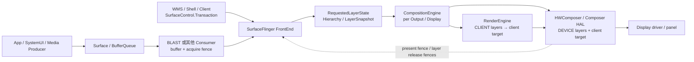
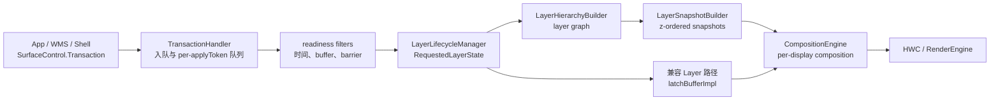
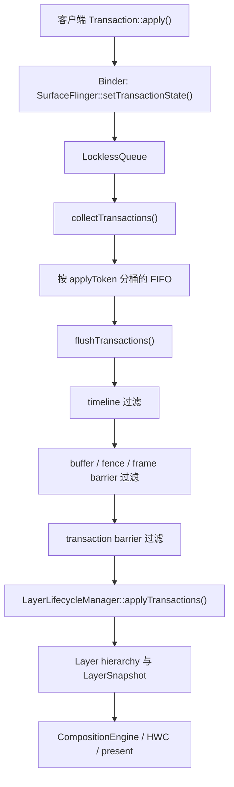

# SurfaceFlinger 合成、FrontEnd 与事务队列

SurfaceFlinger 接收 buffer 与 SurfaceControl transaction，生成 layer 快照，再交给 CompositionEngine 和 HWC。一次窗口更新什么时候进入当前合成周期，由 FrontEnd 状态、事务就绪条件和 latch 时刻共同决定，这正是本文要展开的主线。

> 源码基线：AOSP `android-17.0.0_r1`；内核 `android17-6.18-2026-06_r6`。

## Layer、合成策略与 present

### SurfaceFlinger 位于哪一段

应用完成一帧渲染并提交 buffer 后，显示流程还没走完。SurfaceFlinger 要接收 buffer 与 `SurfaceControl.Transaction`，更新 Layer 层级，为每个 Display 构造可见内容，再与 HWC 协商合成方案并执行 present。

我们先约定贯穿全文的对象：Layer 是 SurfaceFlinger 组织合成内容的单位，transaction 是对一个或多个 Layer 属性或 buffer 的一组更新。FrontEnd 把客户端请求整理成 RequestedLayerState，再生成本轮可消费的 LayerSnapshot；CompositionEngine 按每个 Display 构造 Output。

需要 GPU 合成的 CLIENT Layer 由 RenderEngine 先画成 client target，DEVICE Layer 则交给 HWC 的设备合成路径。fence 表示 buffer 何时可读、可复用或完成 present。

标准窗口的主路径可以概括为：



这张图上要留意两件事。SurfaceFlinger 只处理 Layer 与 Display，看不到 App 内部的 View 或 Compose 节点；设备合成与客户端合成也可以在同一帧同时出现，RenderEngine 先生成 client target，HWC 再把它与可由设备处理的 Layer 一起提交显示。

Android 12 的 `INVALIDATE/REFRESH` 只用于解释旧 Trace，Android 13 之后按 `commit/composite` 主线阅读。

### 四项核心职责

#### 1. 管理 Transaction 与 Layer 状态

来自应用、WindowManager、WM Shell、SystemUI、媒体组件的 `SurfaceControl.Transaction` 最终进入 SurfaceFlinger。Transaction 可以同时修改多个 Layer 的 buffer、位置、裁剪、alpha、可见性、父子关系、z-order（前后显示顺序）、dataspace 和 frame timeline 信息。

FrontEnd 把客户端请求整理成服务器侧状态：

- `TransactionHandler` 收集并筛选可提交的 transaction；
- `LayerLifecycleManager` 维护 `RequestedLayerState` 与 Layer 生命周期；
- `LayerHierarchyBuilder` 构造父子、relative-z 与镜像关系；
- `LayerSnapshotBuilder` 生成按 z-order 排列的 `LayerSnapshot`；
- CompositionEngine 和输入、无障碍等消费者读取 snapshot。

这套结构把“客户端请求”与“本帧合成状态”分开了。当前源码仍保留部分 legacy `Layer` 互操作，但跟踪合成问题时，应优先看 FrontEnd state、snapshot 和 Output。

#### 2. 参与 VSync 调度与帧目标计算

HWC 的硬件 VSync callback 为预测器提供样本，Scheduler 的 VSync schedule、dispatch 与 EventThread 生成应用和系统侧的调度事件。`VsyncModulator` 调整 app/SF work duration 与 phase，完整的 VSync 分发实现不止这一个类。

SurfaceFlinger 还创建 DisplayEventConnection，让应用侧 Choreographer 等消费者接收软件 VSync。SF 自身的帧信号进入 `Scheduler::onFrameSignal()`。SF 的帧处理会先为 pacesetter display 和可参与本轮的 follower display 计算 `FrameTarget`——前者提供调度基准，后者跟随该节拍——再决定 commit 与 composite。`FrameTarget` 里就是本轮期望呈现时间与 deadline 等目标。

详细的预测、phase 与 VSync-app/VSync-sf 关系见 [2.3 VSync、Choreographer 与 SurfaceFlinger 调度](03-vsync-choreographer-sf-scheduling.md)。这里我们关注 SF 收到帧信号之后的工作。

#### 3. 为每个 Display 选择并执行合成方案

FrontEnd snapshot 是全局 Layer 状态，CompositionEngine 的 Output 面向具体 Display。每个 Output 会按 layer stack、projection、可见区域、damage、色彩与输出能力构造该 Display 的 OutputLayer 集合，再与 HWC 协商 CLIENT/DEVICE 等 composition type。

同一个 Layer 可能经镜像或虚拟显示出现在多个 Output。每个物理 Display 有自己的 frame target、HWC state、present fence 和 deadline，外接屏要用它自己的数据来解释，默认屏的结果照搬不过去。

#### 4. 跟踪 buffer、fence 与 FrameTimeline

SurfaceFlinger 需要知道：

- 哪个 buffer 已随 transaction 到达；
- Producer completion/acquire fence 是否满足读取条件；
- 哪个 buffer 被本帧 snapshot 选中；
- RenderEngine client target 何时可供 HWC 读取；
- HWC 何时不再使用各 Layer buffer；
- 该 Display 的 present 工作何时到达完成边界。

这些状态决定 buffer 能否 latch、是否复用旧内容、是否产生 backpressure；backpressure 指下游未及时释放 buffer，反过来限制 Producer。它们也为 FrameTimeline 的 App `SurfaceFrame` 与 SF `DisplayFrame` 提供时间归因。

### Layer：从层级关系得到显示顺序

#### Layer 与 View 的数量关系

普通 Activity 的整棵 View 树通常绘制进一个 App Window buffer，SurfaceFlinger 看到的是宿主窗口 Layer。`SurfaceView`、视频、相机、壁纸、系统栏、输入法、截图动画可能各自引入 Layer；transition leash 是窗口过渡期间临时承载动画的父 Layer，display decoration 是圆角遮罩等显示装饰，这两类也可能带来额外的 Layer。

`SurfaceView` 还可能维护容器 Layer、BLAST buffer Layer 和背景 color Layer。Layer 数量增加只说明 SurfaceControl 层级发生了变化，要确认来源，还要结合 owner pid/uid、parent、layer stack、buffer 和 transaction。

#### z-order 是层级遍历结果

FrontEnd README 对绘制顺序给出了明确规则：

- Layer 形成类似 scene graph 的层级；
- relative-z Layer 按 relative parent 参与排序；
- 负 z 子节点位于 parent 下方；
- 非负 z 子节点位于 parent 上方；
- 相同 z 值还需要稳定的次序，客户端不应依赖创建先后来控制关键遮挡关系。

下面的伪代码用于说明从底到顶的遍历：

```text
traverseBottomToTop(node):
  visit children and relative children with z < 0
      sorted by z and stable tie-break
  visit node
  visit children and relative children with z >= 0
      sorted by z and stable tie-break
```

`LayerSnapshot` 还保存 `globalZ`、变换后的几何范围、crop、透明度、圆角、shadow、dataspace、buffer、damage、frame rate 等合成输入。CompositionEngine 会再按目标 Output 过滤不可见或不属于该 layer stack 的 snapshot。

#### 可见 Layer 与 buffer 复用

一个可见 Layer 没有新 buffer 时，SurfaceFlinger 可以继续使用上次选中的内容。视频以 24/30 fps 更新、Display 以 60/120 Hz 刷新时，多次复用旧 buffer 可能符合设计。我们判断丢帧时看的是 Producer 时间戳、目标 present、buffer 选择和 cadence，即内容帧与显示刷新之间的节奏关系；也不能要求每个 SF frame 都出现新 `BufferTX`。

### Transaction：状态原子性与 buffer 就绪

#### 合并与顺序

Transaction 把一组 Layer 修改作为一个提交单元。合并操作具有顺序语义：后写入的属性可以覆盖前值。FrontEnd README 说明，transaction 按 `ApplyToken` 建立队列，相同 `ApplyToken` 内保证顺序；不同 token 之间要约束先后关系，需要显式 barrier（事务间依赖屏障）。

`TransactionHandler` 使用 `LocklessQueue<QueuedTransactionState>` 接收 transaction；这里的 `LocklessQueue` 是入队所用的无锁队列模板。commit 时先调用 `collectTransactions()`，再由 ready filter 检查就绪条件，并按每个 `ApplyToken` 的 pending FIFO（First In, First Out，先进先出）执行 `flushTransactions()`。

readiness 判断会考虑 fence、present time、barrier 与 unsignaled buffer；transaction barrier 的默认 TTL 是 5 秒，用于避免依赖永久悬挂。

这里的 lockless queue 只描述 transaction 入队结构。SurfaceFlinger 主流程仍会在 snapshot、display state 和 legacy 互操作处使用相应锁；要判断 commit 全程的加锁情况，还得回到这些具体位置看。

#### 原子提交与像素可读

一笔 transaction 可以原子地表达“新 buffer、位置和裁剪一起生效”。buffer 的 Producer 仍可能异步写入，acquire fence 负责保护内容。Android 13 起支持受限的 unsignaled buffer latch 模式，即 fence 尚未 signal 时先接纳 buffer：满足策略条件的简单更新可以先推进 transaction readiness，但 RenderEngine/HWC 真正读取内容前仍要等 acquire fence signal。

SyncTransaction、WMS transition sync 与应用的 `SurfaceSyncGroup` 是三套相关但不同的机制：WMS transition sync 是 WindowManager 为窗口过渡组织的同步，`SurfaceSyncGroup` 是应用侧把多个 Surface 更新纳入同一同步组的接口，它们覆盖的参与者和等待条件并不完全相同。我们排查跨窗口动画时，先确认哪些 Surface 被加入同一个同步组，再检查 transaction barrier、buffer readiness 和 callback；屏幕上同时移动的 Surface，未必自动属于同一同步事务。

### BLAST：标准 App Window 的 buffer 怎样进入 SF

#### Android 11 进入主线

BLASTBufferQueue 从 Android 11 起进入 AOSP 主窗口路径。它把 BufferQueue Consumer 与 `SurfaceControl.Transaction` 更紧密地结合，使 buffer、frame number、dataspace、damage、transform 和窗口几何状态可以按同一帧语义提交。

Android 12 的变化主要体现在观察能力上：FrameTimeline、VSync ID、expected/actual present 让 buffer transaction 与显示帧更容易对齐；BLAST 本身在 Android 11 就已进入主线。

#### Android 17 标准窗口链

标准 App Window 通常沿下面的顺序进入 SurfaceFlinger：

```text
App RenderThread / Producer
  queueBuffer(slot, producer completion fence)
    → App 进程内 BLAST Consumer
      onFrameAvailable()
      acquireNextBufferLocked()
      Transaction::setBuffer(surfaceControl, buffer, acquireFence, frameNumber, ...)
      Transaction::setFrameTimelineInfo(...)
      merge geometry / sync transaction when required
      apply()
        → SurfaceFlinger FrontEnd
          TransactionHandler
          RequestedLayerState / LayerSnapshot
```

普通 BLAST 窗口中的 BufferQueue acquire 常发生在应用进程的 BLAST Consumer，SurfaceFlinger 接收带 buffer 和 fence 的 transaction。把所有现代窗口都写成“SurfaceFlinger 直接调用 BufferQueue `acquireBuffer()`”会混淆进程与所有权。

SurfaceFlinger 不再使用 buffer 后，通过 release callback 把完成信息返回 BLAST，再由 BLAST 释放对应的 `BufferItem`，也就是 BufferQueue 中记录 buffer、slot、fence 等信息的条目。`queueBuffer()`、BLAST acquire、`BufferTX - <layerName>` 增加、SF latch、HWC present 与 release callback 分别对应各自的时间点，分析时不要把它们混成一个时刻。

### Android 17 主循环：`onFrameSignal → commit → composite`

#### Scheduler 先按 Display 建立 FrameTarget

主入口在 `Scheduler::onFrameSignal()`。下面的结构摘录保留关键分支：

```cpp
// frameworks/native/services/surfaceflinger/Scheduler/Scheduler.cpp
// AOSP android-17.0.0_r1，结构摘录
void Scheduler::onFrameSignal(ICompositor& compositor,
                              VsyncId vsyncId,
                              TimePoint expectedVsyncTime) {
    pacesetterPtr->targeterPtr->beginFrame(
            beginFrameArgs, *pacesetterPtr->schedulePtr);

    FrameTargets targets;
    targets.try_emplace(pacesetterPtr->displayId,
                        &pacesetterPtr->targeterPtr->target());
    // 遍历 follower display，调用 targeter.beginFrame()，
    // 再把本轮可 present 的目标加入 targets。

    if (!compositor.commit(pacesetterPtr->displayId, targets)) {
        compositor.sendNotifyExpectedPresentHint(pacesetterPtr->displayId);
        mSchedulerCallback.onCommitNotComposited();
        return;
    }

    FrameTargeters targeters;
    targeters.try_emplace(pacesetterPtr->displayId,
                          pacesetterPtr->targeterPtr.get());
    // 把 commit 后仍可 present 的 follower targeter 加入 targeters。

    const auto resultsPerDisplay =
            compositor.composite(pacesetterPtr->displayId, targeters);
    compositor.sendNotifyExpectedPresentHint(pacesetterPtr->displayId);
    compositor.sample();

    for (const auto& [id, targeter] : targeters) {
        const auto resultOpt = resultsPerDisplay.get(id);
        targeter->endFrame(*resultOpt);
    }
}
```

源码会分别处理 pacesetter 与 follower display 的 deadline、present fence backpressure 和 lockstep 条件：backpressure 在这里是上次 present 尚未完成形成的反压，lockstep 指多个 Display 需要同步推进。摘录省略了 follower 的循环判断；系统先生成 `FrameTargets`，`commit` 返回 `false` 时本轮不会进入 `composite`。

#### `commit()`：准备本帧合成状态

`SurfaceFlinger::commit(PhysicalDisplayId, FrameTargets)` 主要处理：

1. 检查 display mode transition（分辨率或刷新率等显示模式切换）、HWC backpressure 和本帧目标；
2. 为 FrameTimeline 记录 SF wake-up；
3. 清理 transaction flag，进入 `updateLayerSnapshots()`；
4. 收集、筛选和应用 transaction；
5. 更新 Layer 生命周期、层级与 snapshot；
6. latch 可用的新 buffer，并发送 transaction commit callback；
7. 更新可见区域、输入、Layer history 与刷新率选择；
8. 根据 transaction、buffer、Display/HWC 请求判断 `mustComposite`（本轮是否必须进入合成阶段）。

`updateLayerSnapshots()` 会执行 `TransactionHandler:flushTransactions`、`LayerLifecycleManager.applyTransactions()`、`LayerHierarchyBuilder.update()` 与 `LayerSnapshotBuilder:update`。commit 变长时，我们要先区分时间花在了哪：transaction 数量、Layer 创建销毁、hierarchy/geometry 变化、buffer latch，还是锁等待。

`commit` 返回 `false` 可能只是本轮没有需要提交到显示的变化，也可能受 mode set 或 backpressure 分支影响；把它直接记成丢帧，结论下早了。

#### `composite()`：把 snapshot 交给各个 Output

`SurfaceFlinger::composite()` 构造 `CompositionRefreshArgs`，把物理/虚拟 Display 对应的 Output 和 frame target 交给 CompositionEngine；`CompositionRefreshArgs` 装的是一次合成刷新所需的参数。每个 Output 会建立自己的 `OutputLayer`，也就是某个全局 Layer 在该 Display 上的合成表示。Output 的主流程包括：

1. 更新输出与 Layer composition state；
2. 重建该 Output 的可见 Layer stack；
3. 规划并写入 HWC Layer 状态；
4. `beginFrame()` 根据 dirty 状态与 `mMustRecompose` 判断是否重做合成；
5. `prepareFrame()` / `prepareFrameAsync()` 选择 composition strategy（CLIENT、DEVICE 等组合）；
6. 需要 CLIENT 时由 RenderEngine 生成 client target；
7. `presentFrameAndReleaseLayers()` 执行 present 并分发 fence。

在特定条件下，GPU-backed virtual display composition（以 GPU 生成虚拟显示输出）可以放到后台执行器，但这条路径受功能开关、RenderEngine 是否支持 threaded 执行、物理 Display 是否使用 client composition 等条件约束，“全部并行合成”的概括并不成立。

### Android 12 与 Android 13+ 的主循环边界

#### Android 12：`INVALIDATE / REFRESH`

`android-12.0.0_r1` 的 `SurfaceFlinger::onMessageReceived()` 处理 `MessageQueue::INVALIDATE` 与 `MessageQueue::REFRESH`。旧 Trace 中的 `onMessageInvalidate`、`onMessageRefresh`、`INVALIDATE` 和 `REFRESH` 属于这套消息模型。

INVALIDATE 侧处理 transaction、Layer/buffer 状态和脏区；REFRESH 侧推进合成与 present。阅读 Android 12 源码或 Trace 时，应使用该版本的方法与 slice。

#### Android 13 起：`commit / composite`

Android 13 的 MessageQueue handler 已直接进入 `commit()` 与 `composite()`。Android 14 进一步由 `Scheduler::onFrameSignal()` 统一帧入口。Android 17 延续这条主线，并把 per-display `FrameTargeter`、FrontEnd snapshot 和 CompositionEngine Output 纳入当前实现。

`INVALIDATE/REFRESH` 适合解释 Android 12 历史；讲当前实现时应使用 `commit/composite` 这些调用名。版本对比时先确认系统 build 和 tag，再搜索对应 slice。

### Client Composition 与 Device Composition

#### CLIENT：RenderEngine 生成 client target

当 HWC 要求某些 Layer 使用 `Composition.CLIENT` 时，SurfaceFlinger 通过 RenderEngine 把这些 Layer 按顺序绘制进一个 client target。RenderEngine 后端可使用基于 OpenGL 的 SkiaGL 或基于 Vulkan 的 SkiaVk，具体选择取决于设备配置与系统 build。

client target 连同它的 acquire fence 一起交给 HWC；该 fence 告诉 HWC 何时可以读取 RenderEngine 的输出。HWC 再把这个 client target 作为一个输入，与仍为 DEVICE、CURSOR、SIDEBAND 等类型的 Layer 一起 present。CLIENT composition 会使用 GPU 和内存带宽，但成本取决于 client Layer 的像素覆盖、格式、色彩转换、blur、shadow、缩放和 GPU 状态，按 Layer 数量直接换算会算错。

#### DEVICE：Composer 负责该 Layer

Composer3 对 `Composition.DEVICE` 的定义是：设备必须通过 hardware overlay 或其他类似方式处理该 Layer，也就是走不先写入 GPU client target 的硬件叠加路径。具体实现可能涉及 DPU/display controller 的 plane（可独立扫描输出的硬件图层通道）、scaler、color pipeline 或厂商内部资源。

DEVICE composition 通常可以减少 SF 的 GPU client composition 工作，但仍有 validate、state programming、fence、带宽和显示硬件成本。某个 Layer 能否保持 DEVICE 由整屏 Layer 集合和设备能力共同决定。

#### 混合合成是常见结果

同一 Display 可以同时包含：

- DEVICE：视频、简单不透明 Layer 或设备能直接处理的内容；
- CLIENT：需要 RenderEngine 处理的 Layer；
- client target：CLIENT Layer 的合成结果；
- SOLID_COLOR、CURSOR、SIDEBAND、DISPLAY_DECORATION 和 REFRESH_RATE_INDICATOR 等 Composer3 类型，其中 SIDEBAND 是不经普通 BufferQueue 提交内容的旁路流。

Android 17 AIDL `Composition.aidl` 中没有通用 `CLIENT_BYPASS` 枚举。厂商日志若出现额外类型，应按 vendor 扩展记录设备、版本和日志来源。

#### 哪些因素会改变策略

下面这些条件可能影响 HWC 决策，但 AOSP 不规定统一 plane 数量或固定降级公式：

- buffer format、modifier（内存排布修饰信息）、usage、dataspace 与 HDR metadata；
- crop、scale、rotation、blend、alpha、rounded corner 和 color transform；
- protected content 与 secure display 要求；
- overlay plane、scaler、色彩单元和内存带宽是否被其他 Layer 占用；
- Display 分辨率、刷新率、输出模式和厂商功耗策略；
- transition leash、SystemUI、IME、dim Layer 和多个视频流形成的整屏组合。

验证策略变化，要看该帧的 composition type、Layer 属性、RenderEngine slice、HWC/vendor trace 和 present 结果；只看功耗或某条 SF slice 变短，还说明不了策略变了。

### HWC 协商：validate、presentOrValidate 与 present

#### Android 17 调用关系

CompositionEngine 的 `Display::chooseCompositionStrategy()` 调用 `HWComposer::getDeviceCompositionChanges()`。后者根据当前是否已有 client composition 与 earliest-present 条件，决定能否尝试 `presentOrValidate()`；earliest-present 是 HWC 允许本帧最早 present 的时间。

下面的控制流用于避免重复计算 present 调用：

```text
getDeviceCompositionChanges(display)
  canSkipValidate =
      no current client composition
      AND (Composer 支持 expected-present，或当前已到 earliest-present)

  if canSkipValidate:
    presentOrValidate()
    if state == PresentSucceeded:
      保存 present fence 与 layer release fences
      validateWasSkipped = true
      return
    # 否则本次调用完成 validate
  else:
    validate()

  读取 changed composition types / display requests / layer requests
  读取 client target property / requested layer LUTs
  acceptChanges()

如最终存在 CLIENT layer:
  RenderEngine 生成 client target
  setClientTarget(client target, acquire fence)

presentAndGetReleaseFences()
  if validateWasSkipped:
    executeCommands()       # 不再调用第二次 present
  else:
    等待 earliest-present（若需要）
    present()
    getReleaseFences()
```

`PresentSucceeded` 是 `presentOrValidate()` 的返回状态，表示 Composer HAL 已执行 present 分支并返回 fence；这个状态不代表面板扫描完成。普通 validate 分支要等 composition changes 被接受、client target 准备好之后，才调用 present。

#### AIDL 与 HIDL 边界

Android 13 起 Composer3 AIDL 进入平台主线，Android 17 的 SurfaceFlinger 仍通过 `ComposerHal` 抽象保留 AIDL/HIDL 适配实现；HIDL 是较早的 HAL 接口定义体系，设备实际使用哪条 vendor HAL 路径，要看 VINTF（vendor 接口兼容性清单）和运行时注册的服务。

分析 framework 调用时优先使用：

- SF/HWC2 侧：`validate()`、`presentOrValidate()`、`present()`；
- ComposerHal 侧：`validateDisplay()`、`presentOrValidateDisplay()`、`presentDisplay()`。

不要把两层方法名写成同一个类的方法，也不要把旧 HIDL composition 枚举与当前 AIDL 新增值混在一张无版本表里。

### Buffer 与 fence：四种完成边界

以下时间线把 Layer buffer、client target 和 Display present 分开：

```text
App / Producer
  queueBuffer(buffer, producer completion fence)
        │
BLAST / SurfaceControl transaction
  setBuffer(buffer, acquire fence)
        │
SurfaceFlinger FrontEnd
  transaction ready → snapshot / latch
        │ acquire fence 仍保护 buffer 内容
CompositionEngine
  ├─ DEVICE layer ────────────────────────────────┐
  └─ CLIENT layers → RenderEngine client target┤
                         + client-target fence   │
                                                 ▼
Composer HAL / HWC
  validate / present
  ├─ per-layer release fences → buffer 可在满足条件后复用
  └─ per-display present fence → 本次 Display present 完成边界
```

这四种 fence 各自回答一个问题：

1. Producer completion/acquire fence：新 buffer 何时可读；
2. client-target acquire fence：HWC 何时可读取 RenderEngine 输出；
3. Layer release fence：Consumer 何时不再使用对应 Layer buffer；
4. Display present fence：一次 Display present 何时到达显示侧的完成点。

present fence 属于 Display，不属于某个 App Window。它也不能覆盖面板扫描、像素响应和用户感知时间；触摸到光子的测量还需要 driver trace 或外部仪器。

### 下游变慢怎样反压到 App

当 SurfaceFlinger/HWC 长时间持有 Layer buffer，或 release callback 积压时，可复用 slot 会减少。Producer 下一次 `dequeueBuffer()` 或 HWUI 的 `reserveNext()` 可能等待 FREE slot 与 release fence，于是 App RenderThread 被下游反压。

这条因果链要按同一 Layer 和相邻 frame number 逐段验证：

1. App 是否及时 `queueBuffer()`；
2. BLAST 是否生成对应 `BufferTX`；
3. SF 是否 latch，acquire fence 是否及时 signal；
4. HWC/SF 何时返回 release fence；
5. BLAST 何时 release BufferItem；
6. Producer 的 `dequeueBuffer()` 等待是否随之结束。

单看 RenderThread `dequeueBuffer()` 长，还定不了 SurfaceFlinger 慢这个结论：max dequeued/acquired、async mode、shared buffer mode、buffer allocation、surface resize 和 Producer 自己持有 slot 也会影响结果。详细的状态机与 fence 生命周期见 [2.8 BufferQueue、Gralloc 与 Sync Fence](08-bufferqueue-gralloc-sync-fence.md)。

### Perfetto：从 App SurfaceFrame 追到 DisplayFrame

#### 先区分两类 token

FrameTimeline 用 token（跨轨道关联同一帧记录的标识）串起不同阶段：

- App `SurfaceFrame` 使用 `surface_frame_token` 关联应用工作与 Layer 提交；
- SF `DisplayFrame` 使用 `display_frame_token` 表示一次显示合成；
- 一个 DisplayFrame 可以包含多个进程、多个 Layer 的 SurfaceFrame。

两类 token 各管一段，合成一个“全程 VSync ID”会丢信息。分析时先用 process/layer 锁定 App SurfaceFrame，再查看它进入哪个 DisplayFrame。

#### SurfaceFlinger 主线程常见 slice

userdebug/eng 这类保留较多调试能力的构建，其 Trace 中可关注：

- `commit <vsyncId>`；
- `composite <vsyncId>`；
- WorkloadTracer 的 `Commit`、`Composition`；
- `Transaction Handling`、`TransactionHandler:flushTransactions`；
- `LayerSnapshotBuilder:update`；
- `Refresh Rate Selection`；
- CompositionEngine `prepareFrame`、`chooseCompositionStrategy`；
- `presentAndGetReleaseFences`、`wait for earliest present time`；
- `postComposition` 或对应 present 后处理。

具体名称受 build、功能开关、Trace category 和厂商插桩影响，category 指采集配置中启用的数据类别。某个 slice 缺失时，先检查 trace config 和源码宏；单凭名字或颜色没出现，判定不了该阶段不存在。

#### Buffer 与 Layer 轨道

标准窗口可继续查看：

- App 的 `dequeueBuffer`、`queueBuffer`；
- BLAST acquire/release callback；
- `BufferTX - <layerName>` pending 数量，也就是尚待 SF 处理的 buffer transaction 数；
- Layer buffer id、frame number、desired present time；
- acquire/release/present fence；
- SurfaceFlinger Layer lifecycle、transaction 与 latch 事件。

`BufferTX` 增加只表示 pending buffer transaction 增加。要确认系统采纳本帧，还需看到目标 Layer 的 transaction/latch 与关联 DisplayFrame。

#### composition 与显示轨道

判断 CLIENT/DEVICE 时查看：

- CompositionEngine/RenderEngine 是否生成 client target；
- 每个 Layer 的 composition type；
- GPU composition 或 client composition slice；
- HWC validate/present、DisplayHAL 与厂商 DPU trace；
- per-display present fence、FrameTimeline present/jank type。

`dumpsys SurfaceFlinger` 适合查看 Layer 树、Display、buffer 和 composition type 快照，几百毫秒前某一帧的时序还得靠 trace 还原。Perfetto、dump 和 vendor log 应在相同设备状态下采集。

#### 常用快照命令

下面的命令用于采集当前状态，具体 section 随版本和 build 变化：

```bash
adb shell dumpsys SurfaceFlinger
adb shell dumpsys SurfaceFlinger --list
adb shell dumpsys SurfaceFlinger --display-id
```

快照中先确认目标 Layer 名、owner、parent、layer stack、active buffer、composition type 与目标 Display，再回到 Perfetto 对齐发生时刻。一次静态 dump 代替不了连续帧的时序。

### 七种常见 Jank 组合

下表按 trace 上先看到的现象排列；第三列列出在该行原因被排除之前不要下的结论。

| 现象 | 优先检查 | 可排除前不要下的结论 |
|:---|:---|:---|
| App SurfaceFrame 已晚，SF 复用旧 buffer | App UI/RT、GPU、queue time、acquire fence | SF commit 长未必是首因 |
| `commit` 长，transaction/layer 数突增 | transaction burst、Layer 创建销毁、hierarchy/snapshot、锁与 Binder | 不能直接归因 GPU |
| `composite` 中 RenderEngine 长 | CLIENT Layer、damage、blur/HDR/color transform、SF GPU queue | 不能只按 Layer 数量优化 |
| HWC validate/present 长 | Composer HAL、DPU/driver、fence、mode/color change | DEVICE composition 仍有成本 |
| SF runnable delay（线程已可运行但尚未获得 CPU 的等待）长 | `sched_wakeup/sched_switch`、CPU/cgroup、优先级、系统负载 | 线程没有运行时不能算函数耗时 |
| App `dequeueBuffer` 长，SF/HWC release 晚 | slot 状态、release fence、BLAST callback、Display present | 固定“三缓冲耗尽”解释不完整 |
| App 和 SF CPU 都按时，DisplayFrame 晚 | GPU completion、DisplayHAL、present fence、prediction/mode switch | App `queueBuffer` 按时不代表已显示 |

#### FrameTimeline jank type 是分类入口

当前可见的分类包括 App deadline、SurfaceFlinger CPU/GPU deadline、DisplayHAL、SurfaceFlinger scheduling、Buffer Stuffing 和 Prediction Error 等。Buffer Stuffing 指 Producer 提交过快造成的 buffer 堆积，Prediction Error 指预测呈现时间与实际情况不符。分类由时间关系推导，适合用来选择下一组该看的材料；业务代码或 vendor driver 的根因还要继续往下查。

例如 `SurfaceFlingerCpuDeadlineMissed` 出现时，仍要区分主线程执行过长和 runnable delay；`SurfaceFlingerGpuDeadlineMissed` 还要确认是 RenderEngine、App GPU 竞争还是其他 GPU 客户端；`DisplayHAL` 要继续进入 Composer/driver/present。

#### SF 主线程卡顿的影响范围

SurfaceFlinger 是系统级服务，同一主线程上的 transaction、snapshot 和部分 per-display 工作可能影响多个窗口；加上按 pacesetter/follower display 计算 frame target、满足条件时把虚拟显示合成 offload 到后台执行器，影响范围更要按目标 Display 和当轮 Output 判断。

同一 Display 上，SF commit/composite 迟到可能让多个 App 的内容一起错过 DisplayFrame deadline。某个 App 没有新 buffer 时，其他 Layer 仍可更新；是否整屏重复旧帧取决于该轮合成与 present 结果。

### 多窗口与多 Display

#### 多窗口共享整屏 HWC 约束

分屏、PiP、freeform、Dialog、IME、SystemUI 与 transition leash 会形成同一 Display 的可见 Layer 集合。HWC 按整套 Layer 状态选择策略，因此 App A 的 alpha/scale、视频格式或 protected Layer 可能改变 App B 所在 Display 的 composition 方案。

窗口数量多不必然触发 CLIENT；单个具有复杂色彩或特效的 Layer 也可能要求 RenderEngine。比较前后策略时，应记录整个可见 Layer 集合、Display mode 和 Composer 输出。

#### per-display frame target 与 fence

`Scheduler::onFrameSignal()` 先为 pacesetter display 建立目标，再计算 follower display 是否参与本轮；`FrameTargeter` 会考虑 expected present、pending present fence 与 backpressure，每个 Display 最终拥有自己的 present fence。

多显示排查至少按 `displayId` 分组：

- refresh rate 与 expected present；
- Output 可见 Layer；
- composition strategy；
- HWC validate/present；
- present fence 与 DisplayFrame。

默认屏按时，说明不了外接屏也按时；镜像场景还要确认 Layer snapshot 如何映射到两个 Output。

### Kernel 与 vendor driver 边界

kernel 基线固定为 `android17-6.18-2026-06_r6`：

- `drivers/dma-buf/dma-buf.c`：跨设备共享 buffer 的通用 dma-buf 对象；dma-buf 让不同设备驱动引用同一块缓冲内存；
- `drivers/dma-buf/dma-fence.c`：描述异步工作完成依赖的 dma-fence；
- `drivers/dma-buf/sync_file.c`：把一个或一组 fence 封装成 `sync_file` 文件描述符，以便跨进程传递；
- `include/linux/dma-fence.h`：通用 fence 接口与语义。

AOSP SurfaceFlinger 能说明 framework 怎样传递 buffer/fence、调用 Composer HAL 和记录 FrameTimeline。Overlay plane 分配、内存带宽投票、secure path、DRM/KMS atomic commit 与 panel 时序由厂商 HAL/driver 决定。secure path 指受保护内容使用的安全显示链路，DRM/KMS atomic commit 是 Linux 显示子系统一次性提交完整显示状态的方式。Android 设备也不保证使用与主线一致的 DRM/KMS 实现。

当 present 或 release fence 迟到时，需要把 Composer HAL、vendor display trace、GPU/DPU frequency、DRM/display driver、IOMMU 和内存带宽放在同一时间轴；IOMMU 是设备访问内存时使用的地址映射与隔离单元。通用 dma-fence 只描述依赖关系，硬件任务为何执行过慢要靠上述时间轴回答。

### Android 11—17 版本演进

| 版本 | 已核对的主线变化 | 阅读与排查口径 |
|:---|:---|:---|
| Android 11 / API 30 | BLASTBufferQueue 进入主窗口 AOSP 路径 | buffer 与窗口 geometry transaction 可以按同帧语义组织 |
| Android 12 / API 31 | SurfaceFlinger 仍使用 `onMessageReceived()` 的 INVALIDATE/REFRESH；FrameTimeline 成为现代诊断入口 | 旧 Trace 用 INVALIDATE/REFRESH，App SurfaceFrame 与 DisplayFrame 分开分析 |
| Android 13 / API 33 | 主循环进入 `commit/composite`；Composer3 AIDL 进入平台；默认 unsignaled latch 策略有严格适用条件 | 不能沿用 Android 12 方法名；简单单 Layer buffer update 与跨 Layer sync 要分开 |
| Android 14 / API 34 | `Scheduler::onFrameSignal()` 统一 commit/composite 帧入口 | VSync 调度与 SF 工作由 Scheduler/FrameTarget 证据关联 |
| Android 15 / API 35 | 源码已有 per-display `FrameTargeter`，以及带 `PhysicalDisplayId`、`FrameTargets/FrameTargeters` 的 commit/composite 参数；支持 ARR 的设备可以在一个显示模式内改变 VSync 周期 | 多显示按 displayId、target、present fence 分开；SF deadline 与 present 不能再按固定 60/120 Hz 周期推断 |
| Android 16 / API 36 | 延续 per-display frame target 与 pacesetter/follower 调度结构 | 不能把 Android 15 已存在的参数和类误记成 Android 16 首次引入 |
| Android 17 / API 37 | 当前锚点：FrontEnd transaction/snapshot、`commit(PhysicalDisplayId, FrameTargets)`、`composite(...FrameTargeters)`、AIDL Composer3/HWComposer 协商 | 所有当前方法名、composition type 和 fence 分支按 `android-17.0.0_r1` 解释 |

这张表只把已核对的版本差异写成“该版本存在”。判断某个内部类或优化是否首次出现，需要继续比较父 tag 与提交历史。

### 常见误判

#### `queueBuffer()` 之后的链路

后面还有 BLAST acquire、SF transaction、latch、acquire fence、composition 和 present。要确认 DisplayFrame 正常，App 与 SF 的 CPU 工作按时只是起点，还要看后续各段。

#### commit 阶段的时间构成

`commit` 主要处理 transaction、Layer state、snapshot、buffer latch、refresh rate 和 callback。RenderEngine 绘制与 HWC present 位于后续 `composite`/Output 流程。

#### DEVICE composition 的 GPU 成本

它说明该 Layer 由 Composer 设备路径处理。其他 CLIENT Layer、App 渲染和 SurfaceFlinger 特效仍可占用 GPU，HWC/DPU 也有带宽与同步成本。

#### Layer 退回 CLIENT 的判定条件

HWC 能力和策略来自 vendor 实现。plane 数量、格式、缩放、HDR、保护内容和带宽要以目标设备的 HAL/driver 与当帧可见集合为准。

#### present fence 的完成范围

它标记 Display present 的同步完成点，panel scanout、像素响应和用户观察时间还在其后。

### Android 17 源码锚点

| 要验证的结论 | 源码入口 |
|:---|:---|
| 帧信号、pacesetter/follower 与 commit/composite | `services/surfaceflinger/Scheduler/Scheduler.cpp` |
| commit、snapshot、composite、FrameTimeline | `services/surfaceflinger/SurfaceFlinger.cpp` |
| transaction 队列、readiness、barrier TTL | `services/surfaceflinger/FrontEnd/TransactionHandler.*` |
| RequestedLayerState、hierarchy、z-order、snapshot | `services/surfaceflinger/FrontEnd/` |
| Output 可见层、strategy、client target、present | `services/surfaceflinger/CompositionEngine/src/Output.cpp`、`Display.cpp` |
| `validate`/`presentOrValidate`/`present` 与 fence | `services/surfaceflinger/DisplayHardware/HWComposer.cpp`、`HWC2.cpp` |
| AIDL/HIDL Composer 适配 | `services/surfaceflinger/DisplayHardware/AidlComposerHal.*`、`HidlComposerHal.*` |
| AIDL composition type 与 DisplayCommand | `hardware/interfaces/graphics/composer/aidl/.../composer3/` |
| BLAST buffer transaction 与 release callback | `frameworks/native/libs/gui/BLASTBufferQueue.cpp` |
| BufferQueue slot 与 fence | `frameworks/native/libs/gui/BufferQueueProducer.cpp`、`BufferQueueConsumer.cpp` |
| kernel buffer/fence 语义 | `drivers/dma-buf/`、`include/linux/dma-fence.h` |

### Android 17 的 SurfaceFlinger 合成边界

SurfaceFlinger 把多个 Producer 的 buffer 与客户端 transaction 整理成 LayerSnapshot，再为每个 Display 构造 Output、选择合成方案并完成 present。当前主线是：

`Scheduler::onFrameSignal → SurfaceFlinger::commit → FrontEnd snapshot → SurfaceFlinger::composite → CompositionEngine → RenderEngine/HWComposer → present fences`

性能分析时，我们按同一 App SurfaceFrame、Layer、DisplayFrame 和 displayId 依次检查：

1. Producer 是否按时提交 buffer；
2. BLAST 与 transaction 是否按时进入 SF；
3. commit 是否在 transaction、snapshot 或 latch 阶段变长；
4. composite 使用 CLIENT、DEVICE 还是混合方案；
5. RenderEngine、Composer HAL、driver 与 present fence 哪一段越过 deadline；
6. release 是否延迟并反压 App 的 buffer 周转。

这套顺序能把 App 迟到、SF CPU、SF GPU、HWC/display 与 buffer backpressure 分开。

## FrontEnd 状态与 Layer 快照

合成阶段消费的是 FrontEnd 处理后的 layer 状态；RequestedLayerState、生命周期和 snapshot 的更新情况，决定了本轮合成能看到什么。

SurfaceFlinger 收到 `SurfaceControl.Transaction`，即一次提交的一组图层状态更新后，还要先回答四个问题，才能把字段交给 HWC：

1. 这笔 transaction 到了可以应用的时间吗？
2. 它携带的 buffer、fence 和 barrier 满足当前帧的条件吗？
3. layer 的父子、relative Z 和 mirror 关系变化后，本轮应按什么顺序遍历？
4. CompositionEngine 最终应读取哪份几何、可见性、内容和效果状态？

SurfaceFlinger FrontEnd 就处在请求与合成状态之间：它消费 transaction，维护 layer 的服务端请求状态和生命周期，构建可遍历的 layer 图，再生成 CompositionEngine 使用的 `LayerSnapshot`——一份包含继承与可见性计算结果的图层快照。

acquire fence、release fence 和 dma-fence 的内核语义见 §2.8；这里集中说明 SurfaceFlinger 如何把 fence 用作 transaction readiness 与 buffer 使用条件。

### 1. FrontEnd 的职责边界

FrontEnd 的职责是把客户端请求转换成当前帧可消费的状态，显示流水线的其余部分不在它的范围内。



这张图表示职责关系，与逐行调用栈并不一一对应。`SurfaceFlinger::updateLayerSnapshots()` 主要按以下顺序执行：

1. `collectTransactions()` 把无锁入口队列中的 transaction 收进 pending queues；
2. 新建 layer 先交给 `LayerLifecycleManager::addLayers()`；
3. `flushTransactions()` 只取出 readiness filters 判定可应用的 transaction；
4. `applyTransactions()` 把属性合入 `RequestedLayerState`；
5. `LayerHierarchyBuilder::update()` 更新 layer 图；
6. `LayerSnapshotBuilder::update()` 更新 snapshot；
7. 兼容路径继续让对应 `Layer` 执行 `latchBufferImpl()`，把已经就绪的 buffer 接入当前图层状态；
8. 后续 composition 阶段把 snapshot 加入 `RefreshArgs`，再调用 `CompositionEngine::present()` 生成显示输出。

上面八步里有三个常被混为一谈的时刻，我们把它们摆在一起区分：transaction 已进入 `RequestedLayerState`、新 buffer 已被 latch、目标 display 已经 present。第一项是请求状态更新；后两项还涉及 buffer、fence、CompositionEngine、HWC 和显示设备，各自有各自的完成条件。

### 2. FrontEnd 与旧 `Layer` 对象共存

`RequestedLayerState` 并没有完全替换旧的 `Layer` 对象。

`SurfaceFlinger` 同时持有：

- `mLayerLifecycleManager`
- `mLayerHierarchyBuilder`
- `mLayerSnapshotBuilder`
- `mLegacyLayers`

`updateLayerSnapshots()` 在更新 FrontEnd 状态和 snapshot 后，仍会找到对应的 legacy `Layer`，执行 `latchBufferImpl()`，并维护 release callback、FrameTimeline 和 layer history；composition 阶段则把 snapshot 绑定到 `LayerFE`，即 CompositionEngine 读取图层状态的前端接口。

这是一段共存实现，读源码时两边都要照顾：layer 请求、层级、可见性与合成输入，优先从 FrontEnd 对象理解；buffer latch、release callback 和一部分历史兼容行为，仍要回到 `Layer`。另外两个提醒：Android 12、13 那种“逐个 `Layer` 更新全部状态”的模型照搬不过来；看到 FrontEnd 也别假设 legacy 路径都已删除。

### 3. `RequestedLayerState` 保存什么

`RequestedLayerState` 的源码注释说明：它只保存某个 layer 自己的客户端请求状态，其他 layer 的状态放在各自的对象里。它继承 `layer_state_t`：

```cpp
struct RequestedLayerState : layer_state_t {
    const uint32_t id;
    const std::string name;
    uint32_t parentId;
    uint32_t relativeParentId;
    std::shared_ptr<renderengine::ExternalTexture> externalTexture;
    ftl::Flags<Changes> changes;
    // ...
};
```

这段摘录只用于说明结构关系。transaction 携带的通用 layer 属性来自 `layer_state_t`；FrontEnd 再补上服务端身份、解析后的引用、buffer 对象、生命周期和变化索引。

#### 3.1 `layer_state_t::what` 与 `RequestedLayerState::Changes`

这两组 bitmask 处在不同层次：

- `layer_state_t::what` 表示客户端 transaction 带来了哪些字段。
- `RequestedLayerState::Changes` 表示这些字段合并后，服务端哪些语义区域受到了影响。

例如，buffer 尺寸改变不只产生 `Changes::Buffer`，还会影响 `BufferSize` 和 `Geometry`；alpha 从 0 变为非 0 时，还会影响 `Visibility`。有了这层归类，后续代码就无须再次比较所有字段，按变化类型决定更新范围即可。

`Changes` 的分组如下：

| 分组 | change flags（变化标志位） | 主要用途 |
| --- | --- | --- |
| 生命周期 | `Created`、`Destroyed` | 新建、销毁和 listener（监听器）回调 |
| 层级 | `Hierarchy`、`Z`、`Mirror`、`Parent`、`RelativeParent`、`AffectsChildren` | 更新图、排序和子节点继承 |
| 几何与可见性 | `Geometry`、`Visibility`、`VisibleRegion`、`Input` | 更新 bounds（边界）、遮挡和输入窗口 |
| 内容 | `Content`、`Buffer`、`SidebandStream`、`BufferSize`、`BufferUsageFlags`、`PostProcess` | 更新当前内容、旁路视频流及合成属性 |
| 策略 | `Metadata`、`FrameRate`、`GameMode`、`Animation` | 更新 metadata（附加元数据）、刷新率投票和调度提示 |

`kMustComposite` 是发生变化后需要推动 composition 的那组 flags，范围小于全部 flags。例如，`FrameRate` 还会触发 attached Choreographer 的刷新率更新；是否需要 composition，由各调用点分别判断。

#### 3.2 为什么 layer 关系保存为 id

`RequestedLayerState` 用 `parentId`、`relativeParentId`、`layerIdToMirror`、`touchCropId` 等 id 表示跨 layer 关系，而不是持有客户端 handle：这样可以避免状态对象因保存 handle 而意外延长其生命周期。

对应的引用关系由 `LayerLifecycleManager` 维护。这组概念值得分开记：id 是关系的稳定标识；handle 是否仍存活是一个生命周期条件；layer 是否仍有 parent 是另一个生命周期条件；“从可见层级不可达”和“对象可以销毁”同样不是一回事。

#### 3.3 请求状态不等于最终状态

客户端的 `setPosition()` 只提供局部位置请求。`LayerSnapshotBuilder` 还要叠加以下状态：

- 父节点 transform（变换）、crop（裁剪）、alpha 和可见性策略；
- relative parent（相对 Z 轴参照图层）带来的遍历位置；
- mirror path（镜像路径）带来的另一组几何上下文；
- display rotation（显示旋转）和 output filter（输出筛选条件）；
- 输入区域、圆角、阴影、模糊和 metadata 继承。

所以，Winscope 中的最终 bounds 与 transaction 参数对不上时，先怀疑路径：确认父层级和 traversal path，再考虑 transaction 丢失的可能。

### 4. `LayerLifecycleManager` 管理创建、更新和销毁

`LayerLifecycleManager` 拥有 `RequestedLayerState` 集合，同时维护 id 到状态的映射，以及“哪些 layer 正在引用它”的反向映射。它本身不是线程安全类，成员由 SurfaceFlinger 主线程上下文保护；FrontEnd 里只有 transaction 入口的收集过程用了 `LocklessQueue`，把整个 FrontEnd 当成无锁实现就错了。

#### 4.1 新建 layer

`addLayers()` 会：

- 把 layer 加入 id 映射、`mAddedLayers` 和 `mChangedLayers`；
- 建立 parent、relative parent、mirror、touch crop 等引用；
- 处理 layer stack mirror 和 display mirror；
- 把 `Changes::Hierarchy` 加到全局变化集合。

新建 layer 会在 `flushTransactions()` 筛选并取出就绪事务之前先加入 manager；这样同一轮里引用新 layer 的 transaction 才能解析到对应状态。

#### 4.2 合并 transaction

`applyTransactions()` 按 transaction 中的 `ResolvedComposerState`（已把客户端引用解析到服务端 layer 的状态项）找到目标 layer，然后调用 `RequestedLayerState::merge()`。本轮首次发生变化的 layer 进入 `mChangedLayers`，各 layer 的 flags 汇总到 `mGlobalChanges`。

这两个集合服务于不同问题：

- `getChangedLayers()`：需要更新哪些具体 layer。
- `getGlobalChanges()`：本轮是否出现了要求重走 hierarchy、geometry、input 或 composition 的变化。

#### 4.3 释放 handle 不会立即删除对象

公开 FrontEnd 文档给出的生命周期规则是：

- 客户端持有的强 Binder handle 可以维持 layer 生命周期；
- parent 对 child 的关系也可以维持 child；
- handle 仍存活但从屏幕 root 不可达的 layer 会进入 offscreen hierarchy，资源不会因此立即释放；
- 客户端用完后应显式释放 `SurfaceControl`，不要依赖 Java GC 的时机。

`onHandlesDestroyed()` 先把 `handleAlive` 置为 `false`；layer 还要没有 parent，`canBeDestroyed()` 才会返回 true。删除 parent 时，manager 还会更新 child、relative、mirror 和 touch-crop 引用，并继续处理由此满足销毁条件的 layer。

#### 4.4 `commitChanges()` 清理本轮变化记录

`commitChanges()` 会：

1. 通知 listener 哪些 layer 新增；
2. 清空仍存活 layer 的 `what` 和 `changes`；
3. 通知 listener 哪些 layer 已销毁；
4. 清空 added、destroyed、changed 集合，以及记录本轮全局变化的 global change 集合。

它替代不了 snapshot 更新：`LayerSnapshotBuilder::update()` 必须在它之前读取 change flags，调用点也把 `commitChanges()` 放在 snapshot 更新、buffer latch 和 dirty-region 处理之后。

### 5. `LayerHierarchy` 为什么是图

只有普通 parent-child 关系时，层级可以画成树；relative Z 轴与 mirror 会让同一状态节点通过多条路径被访问，树就不够用了。所以这组关系用图表示，也不为每条镜像路径复制一份 `RequestedLayerState`。

#### 5.1 五种边类型

| `LayerHierarchy::Variant` | 源码语义 | 阅读方式 |
| --- | --- | --- |
| `Attached` | parent 的普通 child | 随 parent 继承并遍历 |
| `Detached` | 名义上仍是 child，但当前 relative parent 指向别处 | 不从原 parent 的普通位置参与 z-order（Z 轴顺序） |
| `Relative` | relative parent 的相对 child | 按 relative parent 的位置参与排序 |
| `Mirror` | 从另一 layer 或 layer stack 镜像 | 同一状态节点从镜像路径再次访问 |
| `Detached_Mirror` | 镜像另一 layer，并忽略镜像根的 local transform（局部变换） | 区分镜像根与被镜像内容的几何 |

`LayerHierarchyBuilder` 同时维护 onscreen root 和 offscreen root。更新 parent、relative parent、Z 或 mirror 时，它会重新连接或排序相应节点；发现 relative-Z loop（相对 Z 轴关系形成的环）时，记录问题并调用 `fixRelativeZLoop()` 解除非法关系，避免遍历无限递归。

#### 5.2 Z 轴顺序规则

FrontEnd `readme.md` 将绘制顺序描述为一次中序式遍历：

1. 先遍历 Z 值小于 0 的 children；
2. 再访问 parent；
3. 最后遍历 Z 值大于等于 0 的 children。

relative children 的 Z 值相同时，再按 layer id 保持稳定顺序，较新的 layer 位于上方。这个次序只保证遍历结果稳定；源码的建议是调用方使用明确且唯一的 Z 值来安排遮挡关系，依赖 id 顺序并不可靠。

#### 5.3 `TraversalPath` 解决镜像身份问题

同一个 layer id 经过不同 mirror root 时，继承到的 transform、crop 和可见性可能不同。`TraversalPath` 用 `id` 与 `mirrorRootIds` 区分这些 snapshot；`relativeRootIds` 主要用于发现 relative-Z 循环，`detached` 记录路径是否仍附着到 onscreen hierarchy。

同一 layer 编号可能对应多份最终状态，所以 `LayerSnapshotBuilder` 同时维护：

- `mPathToSnapshot`：按 traversal path 找 snapshot；
- `mIdToSnapshots`：找到同一 layer id 对应的全部 snapshot。

### 6. `TransactionHandler` 如何决定本轮应用哪些事务

`queueTransaction()` 把 transaction 推进 `mLocklessTransactionQueue`，同时增加 `TransactionQueue` trace counter；`collectTransactions()` 再按 `applyToken` 分组放入 pending queues。applyToken 约束的是同组事务的应用顺序。

#### 6.1 顺序只在同一 `applyToken` 内保证

每个 pending queue 都是 FIFO。同一个 `applyToken` 的队首 transaction 未就绪时，后面的 transaction 就排在后面等；其他 `applyToken` 的队列仍可继续扫描。

FrontEnd 文档说明，默认情况下每个进程和每个 buffer producer 提供不同的 `applyToken`：这个隔离可以避免一个客户端的队首等待直接堵住全部客户端，不过 token 之间并没有天然全序。

需要跨进程排序时，还有显式 transaction barrier 可用；跨 `applyToken` 的生效顺序，提交时间顺序顶替不了。

#### 6.2 三组 readiness filters

Android 17 的 `addTransactionReadyFilters()` 按顺序注册：

| filter | 主要检查 |
| --- | --- |
| `transactionReadyTimelineCheck()` | desired present time（期望显示时间）、VSync cadence（垂直同步节奏）以及 FrameTimeline 预测是否表明当前应用过早 |
| `transactionReadyBufferCheck()` | buffer frame barrier、backpressure（背压）和 acquire fence |
| `isBarrierSignalledOrExpired()` | 跨 transaction 的 WAIT/SIGNAL token（等待与唤醒标记） |

任一 filter 返回 `NotReady` 或 `NotReadyBarrier`，当前 `applyToken` 队列就会停在队首。

#### 6.3 四种 readiness 结果

| `TransactionReadiness` | 精确含义 |
| --- | --- |
| `Ready` | 所有 filter 都允许本轮应用 |
| `NotReady` | 时间、VSync cadence、backpressure 或 fence 等普通条件未满足 |
| `NotReadyBarrier` | buffer frame barrier 或 transaction token barrier 仍在等待 |
| `NotReadyUnsignaled` | acquire fence 尚未进入 signaled（已触发）状态，但满足 latch-unsignaled 的候选条件 |

`NotReadyUnsignaled` 并没有忽略 fence：它只表示 handler 可以把这笔 transaction 记为 latch-unsignaled 路径的候选项，而且要等本轮尚未找到其他 ready transaction，`applyUnsignaledBufferTransaction()` 才会取出一笔候选事务。后续 RenderEngine 或 HWC 读取 buffer 时仍必须遵守 acquire fence。

在 `AutoSingleLayer` 配置下，候选还必须满足：

- transaction 只更新一个 layer；
- 它是本轮取出的第一笔 transaction；
- Scheduler 当前不使用 early VSync config；
- `RequestedLayerState::isSimpleBufferUpdate()` 判定为简单 buffer 更新。

`isSimpleBufferUpdate()` 还会拒绝 reparent、relative layer、layer stack、透明区域、blur region 等变化，以及 position、alpha、color transform、crop、matrix 等会改变显示语义的字段。

#### 6.4 Android 17 的两类 barrier

这两类机制名字相近，但数据和超时逻辑不同。

**buffer frame barrier**

`BufferData` 可以要求同一 surface 的某个 producer 与 frame number 先被应用。`transactionReadyBufferCheck()` 会结合 `RequestedLayerState::barrierProducerId`、`barrierFrameNumber`，以及本轮已准备应用的 buffer frame，判断依赖是否满足；这个等待的默认超时是 4 秒。

**transaction token barrier**

一笔 transaction 可以携带 `KIND_WAIT` token，另一笔携带相同 token 的 `KIND_SIGNAL`。`TransactionHandler` 会保存已经 signal 的 token，默认 TTL 为 5 秒；WAIT 超时后也会继续应用，避免永久阻塞。

跨 `applyToken` 的 barrier 可能在一次扫描的后半段才被 signal，所以 `flushTransactions()` 会反复扫描 pending queues，直到等待 barrier 的 transaction 数量不再变化，同一帧内已经满足条件的依赖链就能继续处理下去。

这些秒数是 `android-17.0.0_r1` 的内部实现值，App 开发不应把它们当成稳定契约来依赖。

### 7. 从请求状态生成 `LayerSnapshot`

`LayerSnapshot` 继承 `compositionengine::LayerFECompositionState`，保存 CompositionEngine 和 RenderEngine 所需的计算结果，包括：

- 全局 z-order 与 traversal path；
- 叠加父层级后的 transform、bounds、crop 和可见性；
- buffer size、`ExternalTexture`、sideband 与内容脏区；
- alpha、blend、dataspace、HDR、圆角、阴影、模糊和后处理状态；
- input info、metadata、frame-rate vote 和 game mode；
- output filter、mirror crop 和 reachability。

snapshot 的消费者也不止 HWC：输入系统、无障碍和 layer trace 都会用到它。

#### 7.1 增量更新与 fast path

`LayerSnapshotBuilder::tryFastUpdate()` 的 fast path 条件很具体：

- 没有 global changes、没有 force update、display 未变化时，可以直接返回；
- 只有 `Content` 或 `Buffer` 变化时，只 merge `getChangedLayers()` 对应的 snapshot；
- 出现 hierarchy、geometry、visibility、input 等变化时，需要继续遍历 hierarchy；
- force update 或 display change 会更新全部 snapshot，并进入完整更新。

所以“只有 buffer 变化更便宜”有源码依据；把它扩写成“所有属性更新都只改一个对象”就过头了，position、crop、alpha、parent、relative Z 等字段可能影响子节点或可见区域，各自的更新范围并不同。

#### 7.2 mirror 与 reachability

mirror 场景下，同一个 layer id 可以生成多份 snapshot，每份继承各自 traversal path 上的父级状态。

可达性还分三档：

- `Reachable`：从 root 可达；
- `Unreachable`：当前无法从 root 到达；
- `ReachableByRelativeParent`：只能经 relative parent 到达，普通 parent 不可达。

后两类都不算可直接合成的 layer。`ReachableByRelativeParent` 尤其特殊：它缺少有效的 parent 继承上下文，源码注释要求 composition 和 input 忽略这种 snapshot。

#### 7.3 怎样交给 CompositionEngine

FrontEnd 文档说明，snapshot 理论上可以 clone；当前实现为了减少热路径上的复制，把 snapshot 移交给 CompositionEngine，present 后再移回 builder。`SurfaceFlinger::composite()` 通过 `addLayerSnapshotsToCompositionArgs()` 准备 layer，再调用 `mCompositionEngine->present(refreshArgs)`。

这次交接也还没有决定各 display layer 最终走 `DEVICE` composition 还是 `CLIENT` composition；CompositionEngine 与 HWC 还要根据目标 Output 的能力、几何、效果和资源约束继续协商。

### 8. 如何从 trace 判断问题在哪一段

观察时把请求排队、状态计算、buffer latch 和 present 分开看。Perfetto 中 counter 记录随时间变化的数值，slice 记录一段工作的持续时间，两者各有分工，互相顶替不了。

| 证据 | 能说明什么 | 不能单独说明什么 |
| --- | --- | --- |
| `TransactionQueue` counter | 尚未从 handler flush 并应用的 transaction 数量 | 卡在时间、barrier、fence，还是线程调度 |
| `TransactionHandler:flushTransactions` slice | 本轮筛选 pending queues 的 CPU 时间 | 新 buffer 已上屏 |
| `LayerSnapshotBuilder:update` 与 `FastPath` | snapshot 更新耗时，以及是否进入 fast path | HWC 为何选择 `CLIENT` composition |
| `LayerLifecycleManager:commitChanges` | listener 通知与 change flags 清理耗时 | transaction readiness |
| `BufferTX - <layerName>` | 某个 buffer layer 的 pending buffer transaction | 全部属性 transaction 的数量 |
| Winscope transaction 与 layer trace | transaction、层级、可见性和几何随时间的变化 | GPU 或 HWC 已完成读取 |
| present fence 与 release fence | display present 或 buffer 可复用的时间边界 | 客户端最初提交了什么请求 |

`TransactionQueue` 在 `queueTransaction()` 时增加，在 ready transaction 被 flush 后按数量减少。持续升高说明消费速度跟不上入队速度；具体卡在哪里，还要继续检查：

- 队首是否反复出现 `NotReadyBarrier`；
- acquire fence 是否长时间处于 unsignaled 状态；
- desired present time 或 FrameTimeline 是否让 transaction 过早；
- backpressure 是否阻止同一 layer 连续提交 buffer；
- SurfaceFlinger 主线程是否没有及时运行。

如果队列不积压，变长的却是 composition、HWC validate/present 或 fence wait，就应该转向本章“Layer、合成策略与 present”一节、§2.8 和 HWC 相关章节。

### 9. 一套可复现的验证方法

验证 FrontEnd 开销时，我们至少准备两组负载：

1. **内容与属性组**：固定 layer 数，只更新 buffer，或只更新不会改变 hierarchy 的内容属性。
2. **层级组**：使用同样的 layer 数，再加入 reparent、relative Z、mirror，以及 create/destroy。

采集时固定设备、刷新率、构建类型和测试时长，并记录：

- 每帧提交的 transaction 数，以及每笔 transaction 包含的 layer state 数；
- `TransactionQueue` 峰值及回落时间；
- `TransactionHandler:flushTransactions`、`LayerSnapshotBuilder:update` 耗时的分位数；
- `FastPath` 命中情况；
- SurfaceFlinger 主线程处于 runnable、running 状态的时长，以及调度延迟；
- 对应 display 的 present fence 与 FrameTimeline 结果。

如果第二组的 snapshot 更新耗时显著增长，而 HWC 与 present 时长接近，说明压力更可能来自 hierarchy 或 snapshot 计算；如果两组 FrontEnd slice 接近，变长的却是 fence 或 HWC 耗时，瓶颈就在下游。FrontEnd 节省了多少毫秒，离开同机、同配置的对照数据是量化不出来的。

### 10. App 和系统组件怎样提交 transaction

#### 10.1 同一视觉原子操作放在一笔 transaction

同一帧需要一起生效的 position、crop、alpha、visibility 和 buffer，应放在同一笔 transaction，或按明确顺序 merge 后一次 apply。transaction merge 满足结合律，不满足交换律：后合入的同字段值会覆盖前面的值。

反过来，没有原子关系的更新也别为了“减少笔数”硬合并：一笔 transaction 中任一关键 buffer 或 barrier 未 ready，整笔 transaction 都可能跟着等待。粒度由视觉一致性决定。

#### 10.2 区分属性更新和层级更新

reparent、relative Z、mirror、create/destroy 会改变 hierarchy；position、crop、alpha 等几何或可见性字段也可能要求更新子节点和 visible region。所以只更新内容时，别顺带反复提交无变化的层级操作。

#### 10.3 动画跟随正确的帧节奏

由 App 驱动的逐帧 `SurfaceControl` 动画，通常应与 Choreographer 与 FrameTimeline 的节奏对齐，避免定时器无界地产生 transaction。媒体、相机等独立 producer 有自己的时钟，App UI 节奏套用不上；这类路径靠 frame-rate vote、时间戳和同步策略协调。

#### 10.4 用完显式释放

handle 存活会让 offscreen layer 继续占用资源。Java 代码应在生命周期结束时显式释放拥有的 `SurfaceControl`，回收时机交给 GC 是不行的；对 WMS、Shell 或系统动画创建的 leash（动画期间使用的临时父 Surface），也要检查异常与取消路径是否成对清理。

### 结论

SurfaceFlinger FrontEnd 可以按五个对象理解：

- `TransactionHandler`：按 `applyToken` 排队，并用时间、buffer、fence 和 barrier filters 决定本轮可应用事务。
- `RequestedLayerState`：保存客户端请求在服务端合并后的状态，并把字段变化归类成 FrontEnd change flags。
- `LayerLifecycleManager`：维护 layer 身份、引用、创建、销毁和本轮变化集合。
- `LayerHierarchyBuilder`：用图表达 parent、relative Z、mirror 与 offscreen 关系。
- `LayerSnapshotBuilder`：把请求状态和 traversal path 计算成按 z-order 排列的 snapshot。

排查时始终先问一句：手上的材料属于哪一层——transaction 入队、请求状态、snapshot、buffer latch、composition strategy，还是 display present？只要这些层次没有混在一起，FrontEnd 问题就能定位到具体队列、filter、layer 或 traversal path。

## 事务入队、分桶与就绪过滤

状态进入 FrontEnd 之前先经过事务队列。无锁入口只减少提交端竞争，apply token、时间戳和同步条件仍会影响事务何时可用。“TransactionHandler 如何决定本轮应用哪些事务”一节已经列出 readiness 的四种结果和两类 barrier，我们这里接着补齐入口结构、三个过滤器各自检查的字段，以及 flush 重复扫描的停止条件。

### 1. 先限定“无锁架构”的范围

`LocklessQueue` 的无锁性质只覆盖事务入口，扩大到整个事务系统就错了。这里的“无锁”指队列用原子操作协调并发，不获取队列自身的互斥锁。transaction 是一次提交的一组 SurfaceControl 图层状态更新。

`SurfaceFlinger::setTransactionState()` 会在 Binder 调用线程上完成权限清洗、layer handle 解析、buffer 包装、workload hint 收集等工作，然后把 `QueuedTransactionState` 交给 `TransactionHandler::queueTransaction()`；只有最后这段入口交接使用 `LocklessQueue<QueuedTransactionState>`。

进入主线程后，仍能看到多种同步位置：

- 新建 layer 队列由 `mCreatedLayersLock` 保护，源码旁仍有改成无锁队列的 TODO；
- stalled transaction 信息由 `mStalledMutex` 保护；
- display state、snapshot 构建过程中的共享状态、部分回调与统计逻辑仍在 `mStateLock` 下处理；
- Scheduler、CompositionEngine、HWC 和 buffer 生命周期各有自己的同步规则。

本节讨论的是 transaction ingress 的无锁 MPSC（多生产者单消费者）交接，以及交接后的分桶与就绪过滤；SurfaceFlinger 的所有锁并没有因此消失。

### 2. Android 17 的主路径

下图按职责标出各组件。从“提交”到“本轮显示”，中间还要经过 readiness、snapshot、合成和 present。



正常处理入口位于 `SurfaceFlinger::updateLayerSnapshots()`：

1. `collectTransactions()` 排空无锁入口队列；
2. 主线程在 `mCreatedLayersLock` 下接收本轮创建、销毁的 layer；
3. `LayerLifecycleManager::addLayers()` 先登记新 layer；
4. `flushTransactions()` 从 per-token FIFO 中取出本轮就绪事务；
5. `LayerLifecycleManager::applyTransactions()` 更新 `RequestedLayerState`；
6. `LayerHierarchyBuilder` 和 `LayerSnapshotBuilder` 更新层级与合成快照；
7. 在 `mStateLock` 下处理 display transaction、snapshot 所需共享状态，以及 `applyTransactionsLocked()` 中的回调、统计、input command（输入系统命令）和遗留事务标记。

这里有两个要一起记住的结论：

- layer 请求状态进入 FrontEnd 的关键调用是 `LayerLifecycleManager::applyTransactions()`；
- `applyTransactionState()` 没有消失，仍在主线程、`mStateLock` 保护下处理回调、统计、输入命令和事务标记等职责。

把整条链描述成“flush 后直接在 `mStateLock` 内逐 layer 修改”，FrontEnd 就被漏掉了；`applyTransactionState()` 的调用今天也仍然存在。

### 3. LocklessQueue 如何工作

#### 3.1 数据结构与入队线性化点

`LocklessQueue<T>` 维护两个原子指针：

- `mPush`：生产者头插链表；
- `mPop`：消费者反转后逐项读取的链表。

下面的伪代码保留算法骨架，用于说明 CAS 重试和批量接管：

```text
push(value):
  entry = new Entry(value)
  previousHead = mPush.load()
  do:
    entry.next = previousHead
  while !mPush.compare_exchange_weak(previousHead, entry)

pop():
  if mPop is not empty:
    remove and return its head

  grabbed = mPush.exchange(nullptr)
  if grabbed is empty:
    return empty

  reverse grabbed
  keep the remaining nodes in mPop
  return the first value
```

伪代码表明，生产者只修改 `mPush`，消费者在 `mPop` 为空时一次接管当前批次。一次成功的 `compare_exchange_weak` 就是该次入队的线性化点，即并发操作在逻辑上生效的瞬间；多个生产者读到同一个旧头时，只会有一个先成功，其他线程拿到更新后的头并重试。

源码没有显式传入 memory order，注释中的候选参数被注释掉，因此这些原子操作使用 C++ 默认的顺序一致性语义。

#### 3.2 为什么要反转

生产者使用头插法，链表方向与 CAS 成功次序相反；单消费者通过 `mPush.exchange(nullptr)` 接管整批节点，再把链表反转，恢复这批事务的入队次序。接管之后才到达的节点留在新的 `mPush` 链表，等下一次接管。

队列一直有明确的原子入队次序；反转只修正头插链表的方向，顺序本身从没有丢过。

#### 3.3 无锁、wait-free 与系统调用的区别

源码能支持的结论是：

- `push()` 不获取队列 mutex；
- 竞争时 CAS 可以反复失败，因此该操作满足不了 wait-free（每个线程都能在有限步骤内完成）的保证；
- 每次 `push()` 会 `new Entry`，每次 `pop()` 会 `delete`，分配器内部行为不属于这个数据结构的保证；
- 在高竞争下，CAS 重试会消耗 CPU 和 cache coherence 带宽；
- 该实现要求单消费者，多个线程并发 `pop()` 是不支持的。

所以，把 `queueTransaction()` 简写成“永不阻塞、只执行一次 CAS、绝不发生系统调用”是不成立的；AOSP 只是从入口队列自身的同步设计里移除了互斥锁。

### 4. 两层队列与 applyToken

`TransactionHandler` 有两层容器：

| 层次 | Android 17 类型 | 写入者与读取者 | 用途 |
|---|---|---|---|
| 入口 | `LocklessQueue<QueuedTransactionState>` | 多个 Binder 线程写入、SF 主线程读取 | 低共享的 MPSC 交接 |
| pending | `unordered_map<sp<IBinder>, queue<...>>` | SF 主线程读写 | 按 apply token 保持 FIFO、执行就绪判断 |

`collectTransactions()` 从第一层取出事务，以 `applyToken` 为分组键放入第二层。

#### 4.1 applyToken 约束什么

`applyToken` 约束同组事务的应用顺序。`SurfaceComposerClient::Transaction::setApplyToken()` 的 AOSP 注释说明了它的适用范围：

- 默认情况下，同一客户端的事务放在同一条队列；
- 显式设置 token 可把事务放入不同队列，避免多笔事务互相阻塞。

相同 token 下，`flushPendingTransactionQueues()` 只看队头。队头返回 `NotReady`、`NotReadyBarrier` 或 `NotReadyUnsignaled` 后，该桶停止继续弹出，后续事务只能排在后面，这就是同一桶内的 head-of-line blocking。

外层循环仍会检查其他 token 的桶，一个 token 因 desired present time 或 fence 等待时，其他客户端不必跟着停住。不过 Android 17 新增的 transaction barrier 可以跨 token 建立显式依赖，“不同 token 永远互不影响”也就不成立了。

#### 4.2 one-way 与队列就绪是两件事

客户端调用 `Transaction::apply(false, true)` 时，`oneWay = true` 会让 `ISurfaceComposer` Binder 调用带 `FLAG_ONEWAY`。它只改变客户端等待 Binder 返回的方式，下面这些事它都做不到：

- 绕过 per-token FIFO；
- 绕过 timeline、buffer 或 barrier 过滤；
- 保证事务在当前 display frame 被采纳；
- 让 acquire fence 自动变为 signaled。

排查 BLAST transaction 时，应分别观察 Binder 异步提交和 SF 主线程的就绪判断。

### 5. Android 17 的三个过滤器

`SurfaceFlinger::addTransactionReadyFilters()` 固定注册以下三个回调，执行次序与注册次序一致：

1. `transactionReadyTimelineCheck()`；
2. `transactionReadyBufferCheck()`；
3. `TransactionHandler::isBarrierSignalledOrExpired()`。

`mTransactionReadyFilters` 的类型是 `ftl::SmallVector<TransactionFilter, 3>`。`SmallVector` 的模板参数 `3` 表示三个元素可以放在对象自身的 inline storage，对 `emplace_back()` 的总数量没有限制；AOSP 当前正好注册三个过滤器，由此推不出“最多三个”，更推不出“第三个留给厂商”。

#### 5.1 timeline：判断这笔事务是否适合本轮

timeline 过滤器综合检查：

- 非自动 timestamp 的 `desiredPresentTime`；
- Scheduler 给本轮计算的 `expectedPresentTime`；
- origin UID 对应的 VSync cadence；
- `FrameTimelineInfo.vsyncId` 是否说明这帧仍然过早。

如果 desired present time 不早于本轮 expected present time，且差值小于一秒，事务会返回 `NotReady`；更远的未来时间会被忽略，免得异常 timestamp 长期卡住队列。

带有效 VSync ID 的事务已按该 ID 对应的帧节奏被 Choreographer 节流，SF 不会再按 origin UID 的 cadence 重复节流；使用自动 timestamp 的事务还会通过 `frameIsEarly()` 判断是否过早。

#### 5.2 buffer：frame barrier、backpressure 与 acquire fence

buffer 过滤器会遍历事务中带 buffer 的 layer state，主要处理三类条件。

第一类是 BLAST buffer frame barrier。事务可以声明“先让同一 layer 的某个 frame number 进入本轮，再应用当前 buffer”，目标 barrier frame 尚未达到时返回 `NotReadyBarrier`；这类 barrier 从事务 `postTime` 起等待超过 **4 秒** 后会被忽略。

第二类是 buffer backpressure。同一轮已经选中该 layer 的一个 buffer、layer 开启 backpressure、当前事务又使用自动 timestamp 时，后续 buffer transaction 返回 `NotReady`，一轮提交多个 buffer 的情况就此避免。

第三类是 acquire fence。尚未 signaled 时通常返回 `NotReady`；只有同时满足 `shouldLatchUnsignaled()` 与 `RequestedLayerState::isSimpleBufferUpdate()` 的事务，才有机会返回 `NotReadyUnsignaled`。

Android 17 的 `AutoSingleLayer` 至少要求：

- transaction 只有一个 layer state；
- 它是本轮候选中的第一笔事务；
- Scheduler 当前不处于 early VSync 配置；
- layer state 是简单 buffer update，不能夹带破坏 fast path 的几何或同步语义。

`NotReadyUnsignaled` 也不等于立即应用：`TransactionHandler` 先记住该 token，等本轮尚未选出任何正常 ready transaction，才单独弹出这笔事务；后续 RenderEngine 或 HWC 读取 buffer 时依然必须遵守 fence。

#### 5.3 transaction barrier：Android 17 的显式 token 依赖

第三个过滤器处理 transaction 中的 `KIND_WAIT` 和 `KIND_SIGNAL` barrier token：

- 含 `KIND_SIGNAL` 的事务被弹出时，将 token 与本轮处理时间写入 `mSignalledTransactionBarriers`；
- 含 `KIND_WAIT` 的事务在 token 未出现时返回 `NotReadyBarrier`；
- wait transaction 从 `postTime` 起超过默认 **5 秒** 后放行；
- 已 signal 的 token 记录超过默认 **5 秒** 后会被清理。

这套五秒 TTL 与 buffer frame barrier 的四秒超时属于两种机制，讨论时别共用一个“barrier TTL”概念。

### 6. 为什么 flush 要重复扫描

pending 容器按 apply token 分桶，`unordered_map` 的遍历次序没有业务含义。某个 WAIT barrier 所在桶可能先被检查，此时 signal 事务还没被弹出，而 signal 又可能位于另一个 token 的桶。

`flushTransactions()` 因此反复调用 `flushPendingTransactionQueues()`，直到 `NotReadyBarrier` 的数量在相邻两轮之间不再变化。循环的目的是继续解析跨 token 的 barrier 依赖链；停止条件是等待 barrier 的事务数不再变化，并非笼统的“没有新 Ready 事务”。

每弹出一笔事务，处理状态会同步更新：

- `firstTransaction` 变为 `false`；
- 带 buffer 的 layer 与 frame number 记入 `bufferLayersReadyToPresent`；
- `KIND_SIGNAL` token 记入已 signal 集合；
- stalled transaction 记录被移除。

这些状态会影响后续事务的 buffer barrier、backpressure、unsignaled 和显式 barrier 判断。

### 7. 从客户端到 FrontEnd 的准确调用关系

#### 7.1 普通 SurfaceControl transaction

客户端 `Transaction::apply()` 把 transaction state 发送给 `ISurfaceComposer::setTransactionState()`，SF Binder 入口完成清洗和解析后构造 `QueuedTransactionState`，再执行：

```text
TransactionHandler::queueTransaction()
  LocklessQueue::push()
  mPendingTransactionCount.fetch_add(1)
  SFTRACE_INT("TransactionQueue", pendingCount)

SurfaceFlinger::setTransactionFlags(eTransactionFlushNeeded, ...)
  Scheduler::resync(...)
  scheduleCommit(...)
    Scheduler::scheduleFrame(...)
```

这段调用关系说明，事务入队后还会设置刷新标志并请求调度合成帧。`ftl::FakeGuard(kMainThreadContext)` 服务于静态线程安全标注，运行时并不获取 `mStateLock`；同时也要记得，`setTransactionState()` 在进入 `queueTransaction()` 之前还要完成权限清洗、layer handle 解析、buffer 包装和 workload hint 收集，整个 Binder 入口的成本不能等同于一次 CAS。

#### 7.2 `scheduleCommit()` 不承诺“立即”或“下一个硬件 VSync”

`scheduleCommit()` 调用 `Scheduler::scheduleFrame()`，由 Scheduler 根据当前 frame target、VSync modulation 和既有调度状态安排唤醒。相同 transaction flag 已经置位时，新的事务通常不会重复安排一帧，但 active frame hint 仍会重置 idle timer。

有一个单独的例外：事务包含 frame-rate change，且已安排的 callback 距当前超过 30 ms 时，SF 会调用 `scheduleImmediateFrame()`。这个分支推广不到“所有 transaction 都会立即唤醒”。

从 App `apply()` 到 SF 采纳事务的延迟也一样：要结合 Binder 调度、SF 已安排的 scheduled frame、就绪状态和系统负载判断，固定的 0.5～2 ms 进程间通信耗时套用不上。

### 8. BLASTBufferQueue 与 TransactionHandler

`BLASTBufferQueue::initialize()` 的源码注释明确说明 adapter 位于客户端进程：它在客户端侧创建 BufferQueue producer 与 consumer，并由 `BLASTBufferItemConsumer` 接收 frame available 通知。

处理一块新 buffer 时，关键步骤是：

```text
BLASTBufferQueue::onFrameAvailable()
  acquireNextBufferLocked()
    从 BLAST consumer 取得 BufferItem
    Transaction::setBuffer(surfaceControl, buffer, acquireFence, frameNumber, producerId, ...)
    合并等待中的 SurfaceControl transaction
    setApplyToken(mApplyToken).apply(false, true)
```

这段路径表明 BLAST 先从客户端 BufferQueue 取得 `BufferItem`，再把 buffer 及其同步信息放进 SurfaceControl transaction。由此可得三个诊断结论：

1. BLAST 在客户端侧把 `GraphicBuffer`、acquire fence、frame number 和 release callback 写入 transaction；
2. SF 的 buffer readiness 检查发生在 transaction 已进入 `TransactionHandler` 之后；
3. release callback 把 buffer 复用时机等信息返回给客户端，SF 并不用它主动拉取下一块 buffer。

在完整显示链上，transaction ready、buffer latch、HWC 或 RenderEngine 读取和 display present 各是各的阶段。`TransactionQueue` 下降只能说明事务被 flush，目标 buffer 是否已经显示，还要往后看。

### 9. 锁边界与性能判断

#### 9.1 这项设计解决了什么

Android 13 的入口使用 `mQueueLock` 保护 `mTransactionQueue`，主线程把事务移入 per-token pending 队列时也要遵守相同锁约束；Android 14 把事务入口移入 `TransactionHandler` 的 MPSC `LocklessQueue` 后，多 Binder 线程与 SF 主线程就不再争夺入口 queue mutex。

在多窗口、转场或多个 SurfaceControl producer 并发提交时，这个改变可以减少入口队列锁竞争，并让主线程一次接管一批节点。

#### 9.2 这项设计没有解决什么

下面这些现象不能归因于 `LocklessQueue` 已经失效：

- desired present time 或 VSync ID 让 transaction 尚未到期；
- 同 token 队头在等 acquire fence；
- buffer frame barrier 或 transaction barrier 未满足；
- created layer 队列、`mStateLock` 或其他组件发生锁等待；
- CompositionEngine、RenderEngine、HWC 或 display driver 后段变慢；
- Producer 没有及时提交 buffer。

无锁入口优化的只是一个局部交接点，端到端帧延迟还取决于 Producer、readiness、FrontEnd、合成和 present。

#### 9.3 为什么不能给固定收益

收益取决于 Binder producer 数量、事务频率、CPU 拓扑、cache 竞争、SF 主线程负载和原有锁冲突程度。事务量较低时，两种入口的差异可能很小；压力升高后，CAS 重试本身也有成本。

没有同设备、同构建、同场景的变更前后对照数据时，我们能做的只是提出可验证假设；“节省若干毫秒”“完全消除上下文切换”这类写法都超出证据范围。

### 10. Android 13 到 Android 17 的演进

| 版本 | 入口与 pending 结构 | 就绪处理 | 相关变化 |
|---|---|---|---|
| Android 13（API 33） | `mQueueLock` 保护 `mTransactionQueue` 与 per-token pending queues | timeline、buffer barrier、fence 等判断仍在 SF 内 | 旧互斥入口；已有 per-token 排队与 readiness，不能写成“无过滤” |
| Android 14（API 34） | `TransactionHandler` 与 `LocklessQueue<TransactionState>` | timeline、buffer 两个过滤器 | 无锁 MPSC 入口已出现，文件位于 `services/surfaceflinger/LocklessQueue.h` |
| Android 15（API 35） | 同上；`collectTransactions()` 从 flush 中拆出 | FrontEnd 开关下选择新旧 buffer check | 新 layer 创建与 transaction 收集次序更清楚 |
| Android 16（API 36） | `LocklessQueue<QueuedTransactionState>` | timeline、buffer 两个过滤器 | 队列元素切换为 FrontEnd 使用的 queued state |
| Android 17（API 37） | `LocklessQueue` 头文件移到 `libs/gui/include/gui/` | timeline、buffer、transaction barrier 三个过滤器 | 新增显式 WAIT/SIGNAL barrier 与五秒 TTL |

`LocklessQueue` 在 Android 14 已进入这条路径；到 Android 17，AOSP 注册了第三个显式 transaction barrier 过滤器，“自定义第三槽位”是预留不出来的。

### 11. Perfetto：怎样验证是哪一段在等

#### 11.1 采集

快速复现场景时，可以先采集调度、Binder、图形和窗口相关的 atrace 类别：

```bash
adb shell perfetto \
  -o /data/misc/perfetto-traces/sf-transaction.perfetto-trace \
  -t 15s \
  sched freq idle binder_driver gfx view wm
```

这条命令采集 15 秒，并写入设备上的指定 trace 文件。复现多窗口 resize、桌面窗口移动、SurfaceView 与 BLAST 高频更新或系统转场，再把 trace 拉到本地分析。需要长期、可重复测试时，应改用显式 Perfetto 配置，固定 buffer 大小、数据源和持续时间。

#### 11.2 先看入口是否积压

`TransactionHandler::queueTransaction()` 每次入队后增加 `mPendingTransactionCount`，`flushTransactions()` 按本轮返回事务数减少它，两处都记录 `TransactionQueue` counter。

所以这个 counter 表示 **已进入 TransactionHandler、尚未被 flush 返回的事务总数**，覆盖无锁入口和 per-token pending 两层；`LocklessQueue` 链表节点数和当前帧 buffer 数都不是它。

- 短暂尖峰后迅速归零：通常是正常批处理；
- 长时间上升：提交速率持续高于 flush 速率，或队头条件长期不满足；
- 周期性高位：需要与 SF scheduled frame、timeline 和 fence 条件对齐。

#### 11.3 再看 flush 为什么没有弹出

Android 17 可关注这些 SF trace 名称：

- `TransactionHandler:flushTransactions`；
- `not current desiredPresentTime`、`frameIsEarly`、`!isVsyncValid`；
- `NotReadyBarrier`、`IgnoreBarrierDueToTimeout`；
- `hasPendingBuffer`；
- `fence unsignaled`；
- `Transaction id=... is waiting on barrier ...`。

同 token 的队头条件最要紧：一个等待中的事务可能让该 token 后续事务全部留在队列，而其他 token 仍在正常前进。

#### 11.4 一帧从提交到送显的完整证据

可按以下顺序检查完整链路：

1. 先确认 Producer 是否按时 `queueBuffer` 或提交 SurfaceControl transaction；
2. 检查 BLAST 是否取得 `BufferItem` 并调用 `Transaction::setBuffer()`；
3. 用 `TransactionQueue` 与 readiness trace 判断 SF 在等时间、barrier 还是 fence；
4. 用 `BufferTX - <layerName>`、latch 事件确认新 buffer 是否被采纳；
5. 最终结合 FrameTimeline、HWC 与 present fence 判断显示后段。

`TransactionQueue` 下降、transaction committed callback、buffer latch 和 display present 分别对应四个阶段，只盯其中一个，内容什么时候上屏是确定不下来的。

#### 11.5 Perfetto 看不到什么

现有 trace 没有直接记录每次 `compare_exchange_weak` 的失败次数；Binder 线程没有 mutex wait，也证明不了 CAS 没有重试。要量化原子竞争，可使用：

- 针对目标构建的源码计数或 tracepoint；
- simpleperf 或 perf 的采样与硬件计数器；
- 同场景旧实现与新实现的对照构建。

这类数据应与端到端 FrameTimeline、SF 主线程耗时一起分析，避免把局部 CPU 指标当成显示延迟。

### 12. 常见误读

| 误读 | Android 17 的准确边界 |
|---|---|
| SurfaceFlinger transaction handler 已完全无锁 | 仅 MPSC 入口 queue 无 mutex；created layers、stalled 信息和全局状态仍有锁 |
| push 永远只做一次 CAS | `compare_exchange_weak` 在竞争或弱失败时会循环 |
| push 与 pop 保证不发生任何系统调用 | 节点使用 `new/delete`；数据结构只保证自身不调用 queue mutex 或 futex（内核快速用户态互斥机制） |
| `SmallVector<..., 3>` 表示最多三个过滤器 | `3` 是内联容量；Android 17 AOSP 当前注册三个 |
| 不同 apply token 对应不同进程 | token 由客户端排队策略决定；一个客户端也可以使用多个 token |
| one-way transaction 可以绕过 readiness | one-way 只改变 Binder 调用方式 |
| BLAST 是 SF 拉取 buffer 的接口 | BLAST adapter（适配器）在客户端取得 buffer，再通过 transaction 发送给 SF |
| barrier 都是五秒 TTL | buffer frame barrier 超时为四秒；显式 transaction barrier 默认 TTL 为五秒 |
| `NotReadyUnsignaled` 表示可以忽略 fence | 只允许特定的简单单层事务提前进入后段，读取方仍遵守 fence |
| `scheduleCommit()` 总是立即处理 | 常规路径调用 `scheduleFrame()`；frame-rate change 有条件触发 immediate frame（立即帧） |
| TransactionQueue 就是无锁链表深度 | 它统计尚未 flush 的事务总数，包含入口和 per-token pending |

### 结论

Android 17 的 transaction queue 设计可以拆成三段：

- Binder 线程通过 `LocklessQueue` 完成 MPSC 入口交接；
- SF 主线程按 apply token 放入 FIFO，保持同 token 次序并隔离队头阻塞；
- 三个过滤器按 timeline、buffer、显式 transaction barrier 决定本轮可应用集合。

这套设计降低了入口 queue mutex 的共享压力，transaction 顺序、buffer fence、barrier 和 display 时序约束则原样保留。分析性能时，先证明事务卡在入口、per-token 队头还是合成后段，再来讨论无锁队列是否相关。

> 版本范围：主线按 AOSP `android-17.0.0_r1` 核对；历史表保留 Android 13～16 的架构演进，结论最高到 Android 17（API 37）。

## 版本与实现边界

| 版本 | 可确认的实现边界 |
| --- | --- |
| Android 13（API 33） | 公开 `android-13.0.0_r1` tag 中没有这组 `FrontEnd` 文件。旧资料通常围绕 `Layer` 内部状态与 latch 路径组织。 |
| Android 14（API 34） | 公开 `android-14.0.0_r1` tag 已包含 `RequestedLayerState`、`LayerLifecycleManager`、`LayerHierarchyBuilder`、`LayerSnapshotBuilder` 和 `TransactionHandler`。不能写成“Android 15 首次引入 FrontEnd”。 |
| Android 15（API 35） | FrontEnd 继续演进。引用 Android 15 代码时只能说明该版本已有某机制，不能据此断言首引版本。 |
| Android 16（API 36） | 对象主线延续，但字段、change flags、readiness 和 SurfaceFlinger 兼容路径仍在变化。 |
| Android 17（API 37） | 当前版本锚点。以上函数名、`PostProcess` change flag、WAIT/SIGNAL barrier、fast path 和 legacy `Layer` 共存关系均按 `android-17.0.0_r1` 解释。 |

这些类位于 SurfaceFlinger 内部，不是稳定的 SDK API。调试其他 Android 版本或厂商分支时，应查看对应 tag 或 commit，只按 API 级别推测内部实现是要出错的。

## 参考资料

### Android 17 AOSP

- [SurfaceFlinger.cpp](https://android.googlesource.com/platform/frameworks/native/+/android-17.0.0_r1/services/surfaceflinger/SurfaceFlinger.cpp)
- [FrontEnd README](https://android.googlesource.com/platform/frameworks/native/+/android-17.0.0_r1/services/surfaceflinger/FrontEnd/readme.md)
- [TransactionHandler.h](https://android.googlesource.com/platform/frameworks/native/+/android-17.0.0_r1/services/surfaceflinger/FrontEnd/TransactionHandler.h)
- [LayerHierarchy.cpp](https://android.googlesource.com/platform/frameworks/native/+/android-17.0.0_r1/services/surfaceflinger/FrontEnd/LayerHierarchy.cpp)
- [LayerSnapshotBuilder.cpp](https://android.googlesource.com/platform/frameworks/native/+/android-17.0.0_r1/services/surfaceflinger/FrontEnd/LayerSnapshotBuilder.cpp)
- [Scheduler.cpp](https://android.googlesource.com/platform/frameworks/native/+/android-17.0.0_r1/services/surfaceflinger/Scheduler/Scheduler.cpp)
- [Output.cpp](https://android.googlesource.com/platform/frameworks/native/+/android-17.0.0_r1/services/surfaceflinger/CompositionEngine/src/Output.cpp)
- [Display.cpp](https://android.googlesource.com/platform/frameworks/native/+/android-17.0.0_r1/services/surfaceflinger/CompositionEngine/src/Display.cpp)
- [HWComposer.cpp](https://android.googlesource.com/platform/frameworks/native/+/android-17.0.0_r1/services/surfaceflinger/DisplayHardware/HWComposer.cpp)
- [AidlComposerHal.cpp](https://android.googlesource.com/platform/frameworks/native/+/android-17.0.0_r1/services/surfaceflinger/DisplayHardware/AidlComposerHal.cpp)
- [HidlComposerHal.cpp](https://android.googlesource.com/platform/frameworks/native/+/android-17.0.0_r1/services/surfaceflinger/DisplayHardware/HidlComposerHal.cpp)
- [ComposerHal.cpp](https://android.googlesource.com/platform/frameworks/native/+/android-17.0.0_r1/services/surfaceflinger/DisplayHardware/ComposerHal.cpp)
- [JankInfo.h](https://android.googlesource.com/platform/frameworks/native/+/android-17.0.0_r1/libs/gui/include/gui/JankInfo.h)
- [Composition.aidl](https://android.googlesource.com/platform/hardware/interfaces/+/android-17.0.0_r1/graphics/composer/aidl/android/hardware/graphics/composer3/Composition.aidl)
- [DisplayCommand.aidl](https://android.googlesource.com/platform/hardware/interfaces/+/android-17.0.0_r1/graphics/composer/aidl/android/hardware/graphics/composer3/DisplayCommand.aidl)
- [BLASTBufferQueue.cpp](https://android.googlesource.com/platform/frameworks/native/+/android-17.0.0_r1/libs/gui/BLASTBufferQueue.cpp)
- [BufferQueueProducer.cpp](https://android.googlesource.com/platform/frameworks/native/+/android-17.0.0_r1/libs/gui/BufferQueueProducer.cpp)
- [BufferQueueConsumer.cpp](https://android.googlesource.com/platform/frameworks/native/+/android-17.0.0_r1/libs/gui/BufferQueueConsumer.cpp)

#### Kernel

- [`drivers/dma-buf/dma-buf.c`](https://android.googlesource.com/kernel/common/+/android17-6.18-2026-06_r6/drivers/dma-buf/dma-buf.c)
- [`drivers/dma-buf/dma-fence.c`](https://android.googlesource.com/kernel/common/+/android17-6.18-2026-06_r6/drivers/dma-buf/dma-fence.c)
- [`drivers/dma-buf/sync_file.c`](https://android.googlesource.com/kernel/common/+/android17-6.18-2026-06_r6/drivers/dma-buf/sync_file.c)
- [`include/linux/dma-fence.h`](https://android.googlesource.com/kernel/common/+/android17-6.18-2026-06_r6/include/linux/dma-fence.h)

#### 官方文档

- [SurfaceFlinger and WindowManager](https://source.android.com/docs/core/graphics/surfaceflinger-windowmanager)
- [Graphics architecture](https://source.android.com/docs/core/graphics/architecture)
- [Hardware Composer HAL](https://source.android.com/docs/core/graphics/hwc)
- [FrameTimeline](https://perfetto.dev/docs/data-sources/frametimeline)
- [Unsignaled buffer latching](https://source.android.com/docs/core/graphics/unsignaled-buffer-latch)

#### 相关章节

- [2.3 VSync、Choreographer 与 SurfaceFlinger 调度](03-vsync-choreographer-sf-scheduling.md)
- [2.4 MainThread、RenderThread 与 Hardware Layer](04-main-render-thread-hardware-layer.md)
- [2.7 GPU 渲染与图形 API 选型](07-gpu-rendering-graphics-api.md)
- [2.8 BufferQueue、Gralloc 与 Sync Fence](08-bufferqueue-gralloc-sync-fence.md)

- [AOSP Android 17：SurfaceFlinger FrontEnd 总览](https://android.googlesource.com/platform/frameworks/native/+/android-17.0.0_r1/services/surfaceflinger/FrontEnd/readme.md)
- [AOSP Android 17：`RequestedLayerState.h`](https://android.googlesource.com/platform/frameworks/native/+/android-17.0.0_r1/services/surfaceflinger/FrontEnd/RequestedLayerState.h) 与 [`RequestedLayerState.cpp`](https://android.googlesource.com/platform/frameworks/native/+/android-17.0.0_r1/services/surfaceflinger/FrontEnd/RequestedLayerState.cpp)
- [AOSP Android 17：`LayerLifecycleManager.h`](https://android.googlesource.com/platform/frameworks/native/+/android-17.0.0_r1/services/surfaceflinger/FrontEnd/LayerLifecycleManager.h) 与 [`LayerLifecycleManager.cpp`](https://android.googlesource.com/platform/frameworks/native/+/android-17.0.0_r1/services/surfaceflinger/FrontEnd/LayerLifecycleManager.cpp)
- [AOSP Android 17：`LayerHierarchy.h`](https://android.googlesource.com/platform/frameworks/native/+/android-17.0.0_r1/services/surfaceflinger/FrontEnd/LayerHierarchy.h) 与 [`LayerHierarchy.cpp`](https://android.googlesource.com/platform/frameworks/native/+/android-17.0.0_r1/services/surfaceflinger/FrontEnd/LayerHierarchy.cpp)
- [AOSP Android 17：`LayerSnapshot.h`](https://android.googlesource.com/platform/frameworks/native/+/android-17.0.0_r1/services/surfaceflinger/FrontEnd/LayerSnapshot.h) 与 [`LayerSnapshotBuilder.cpp`](https://android.googlesource.com/platform/frameworks/native/+/android-17.0.0_r1/services/surfaceflinger/FrontEnd/LayerSnapshotBuilder.cpp)
- [AOSP Android 17：`TransactionHandler.h`](https://android.googlesource.com/platform/frameworks/native/+/android-17.0.0_r1/services/surfaceflinger/FrontEnd/TransactionHandler.h) 与 [`TransactionHandler.cpp`](https://android.googlesource.com/platform/frameworks/native/+/android-17.0.0_r1/services/surfaceflinger/FrontEnd/TransactionHandler.cpp)
- [AOSP Android 17：`SurfaceFlinger.cpp`](https://android.googlesource.com/platform/frameworks/native/+/android-17.0.0_r1/services/surfaceflinger/SurfaceFlinger.cpp)
- [AOSP Android 14：FrontEnd 总览](https://android.googlesource.com/platform/frameworks/native/+/android-14.0.0_r1/services/surfaceflinger/FrontEnd/readme.md)

建议按以下顺序跟读 Android 17 源码：

1. [`LocklessQueue.h`](https://android.googlesource.com/platform/frameworks/native/+/refs/tags/android-17.0.0_r1/libs/gui/include/gui/LocklessQueue.h)：先确认 MPSC、CAS、exchange（批量接管）、反转和 `new/delete`；
2. [`TransactionHandler.h`](https://android.googlesource.com/platform/frameworks/native/+/refs/tags/android-17.0.0_r1/services/surfaceflinger/FrontEnd/TransactionHandler.h) 与 [`TransactionHandler.cpp`](https://android.googlesource.com/platform/frameworks/native/+/refs/tags/android-17.0.0_r1/services/surfaceflinger/FrontEnd/TransactionHandler.cpp)：看两层队列、readiness、重复扫描和 barrier TTL；
3. [`SurfaceFlinger.cpp`](https://android.googlesource.com/platform/frameworks/native/+/refs/tags/android-17.0.0_r1/services/surfaceflinger/SurfaceFlinger.cpp)：依次找 `setTransactionState()`、`addTransactionReadyFilters()`、`transactionReadyTimelineCheck()`、`transactionReadyBufferCheck()`、`updateLayerSnapshots()`；
4. [`SurfaceComposerClient.h`](https://android.googlesource.com/platform/frameworks/native/+/refs/tags/android-17.0.0_r1/libs/gui/include/gui/SurfaceComposerClient.h) 与 [`SurfaceComposerClient.cpp`](https://android.googlesource.com/platform/frameworks/native/+/refs/tags/android-17.0.0_r1/libs/gui/SurfaceComposerClient.cpp)：核对 apply token 和 one-way 的客户端契约；
5. [`BLASTBufferQueue.cpp`](https://android.googlesource.com/platform/frameworks/native/+/refs/tags/android-17.0.0_r1/libs/gui/BLASTBufferQueue.cpp)：看 client-process adapter（客户端进程适配器）、`setBuffer()`、transaction merge、apply token 与 release callback。

版本演进可分别对照以下固定 tag：

- [`android-13.0.0_r1`](https://android.googlesource.com/platform/frameworks/native/+/refs/tags/android-13.0.0_r1/services/surfaceflinger/)；
- [`android-14.0.0_r1`](https://android.googlesource.com/platform/frameworks/native/+/refs/tags/android-14.0.0_r1/services/surfaceflinger/)；
- [`android-15.0.0_r1`](https://android.googlesource.com/platform/frameworks/native/+/refs/tags/android-15.0.0_r1/services/surfaceflinger/)；
- [`android-16.0.0_r1`](https://android.googlesource.com/platform/frameworks/native/+/refs/tags/android-16.0.0_r1/services/surfaceflinger/)；
- [`android-17.0.0_r1`](https://android.googlesource.com/platform/frameworks/native/+/refs/tags/android-17.0.0_r1/services/surfaceflinger/)。
