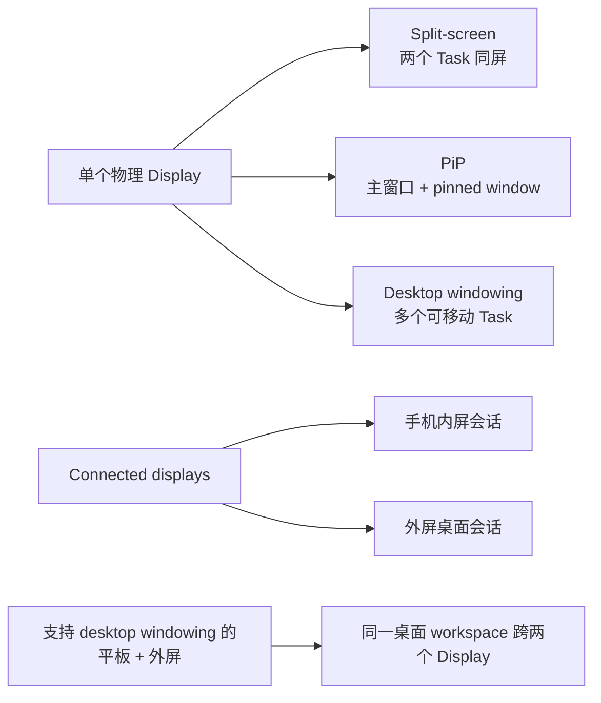
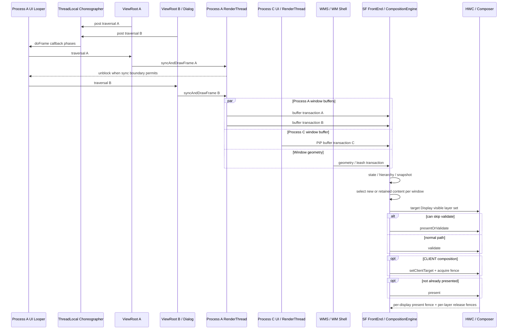

# 多窗口、PiP 与桌面模式渲染管线

在平板分屏、折叠屏展开态、PiP（Picture-in-Picture，画中画）或外接显示器场景中，可见 window/layer 数量、应用工作负载和 display 拓扑（显示设备及其连接关系）可能同时变化。SurfaceFlinger 要处理更多 layer 和更复杂的 composition decision（合成路径决策），窗口 resize（调整大小）的几何变化与新内容还可能在不同时刻到达。掉帧可能来自应用、WindowManager/WM Shell、SurfaceFlinger、GPU、Composer HAL 或显示硬件，不能只看应用主线程。

分析的起点是区分分屏、PiP、desktop windowing（桌面窗口）与 connected displays（连接的外部显示器）对应的显示会话，再建立 Display、Window、进程与 layer 的映射。映射准确后，Perfetto 中的应用 jank（卡顿归因）、SurfaceFlinger jank、HWC（Hardware Composer，硬件合成器）策略变化和 display present 才能归到正确对象。

## 多窗口形态和 display 会话

以下四类场景的会话边界不同。

**分屏（Split-screen）** 从 Android 7.0（API 24）开始进入平台主线。两个应用同时可见，SurfaceFlinger 每一帧都要处理两组应用窗口，以及分割线和系统栏。渲染分析面对的是新增的一组持续变化的 layer 树，而非单纯增加一个应用进程。

**画中画（PiP）** 从 Android 8.0（API 26）扩展到小屏设备。PiP 窗口面积不大，但常会持续提交视频帧或地图帧。主窗口和小窗同时刷新时，SurfaceFlinger 会在前景主窗口之上处理一组持续更新的小窗 layer。

**Freeform/desktop windowing** 与“手机连接外接显示器”是两类能力。桌面窗口指兼容设备上的可调整大小窗口：用户可以同时打开多个应用窗口，底部有 taskbar（任务栏），窗口顶部有标题栏和最小化、最大化控件。外接显示器能力关注设备连接外屏后，桌面会话如何分布到两块屏幕。

各类场景的会话形态与渲染观察点如下：

| 场景 | 公开边界 | 会话形态 | 渲染观察点 |
|---|---|---|---|
| Split-screen | Android 7.0（API 24）平台支持 | 一块屏幕里并排两个可见应用窗口 | 同时可见 layer 增多，分割线和系统栏常驻 |
| PiP | Android 7.0 在部分设备提供，Android 8.0（API 26）扩展到小屏 | 一块屏幕里包含主窗口和持续更新的小窗 | 小窗经常持续提交 buffer，并与主窗口叠加 |
| Freeform/desktop windowing | 大屏或兼容设备上的可调整大小窗口 | 一块或多块屏幕里的多个可调整大小窗口 | layer 数量和窗口遮挡关系更复杂，composition decision 更频繁 |
| 手机和 connected display | 手机连接外接显示器 | 手机保持原有状态，外屏启动独立 desktop session（桌面会话），形成两个显示会话 | SurfaceFlinger 同时驱动两个 display，会话内容彼此独立 |
| desktop windowing 设备和外接显示器 | 平板等 desktop windowing 设备连接外屏 | 桌面会话跨两块屏幕扩展，窗口和光标可跨屏移动 | 仍是同一套桌面会话，但 display 范围更大、像素更多 |



这张图描述产品会话，不代表进程或渲染线程拓扑。两个可见窗口可能属于同一进程，也可能属于不同进程；应用窗口移动到外屏后，其 display、密度、刷新率、HDR 能力和窗口尺寸都可能变化。

## Android 17 的 Display 对象不能按一对一理解

多窗口主要由 WindowManager 和 WM Shell 组织；多个显示设备的发现、logical display（逻辑显示）策略和投影则由 DisplayManagerService（DMS，显示管理服务）管理。排查前应区分五类对象：

| 对象 | 所在层 | 主要职责 |
|---|---|---|
| physical display/`PhysicalDisplayId` | SurfaceFlinger/Composer | 物理连接、mode、VSync、HWC present |
| `DisplayDevice` | DMS adapter（适配）层 | 表示本地、虚拟、Wi-Fi、overlay（叠加）等显示设备 |
| `LogicalDisplay`/`displayId` | DMS policy（策略）层 | 向系统暴露逻辑显示、layer stack（图层栈）、投影和 display group（显示组） |
| `DisplayContent` | WindowManager | 按 `displayId` 组织 Task、Window、Insets、focus（焦点）与 transition（窗口过渡） |
| CompositionEngine Output | SurfaceFlinger | 为每个目标输出构造可见 layer 集合并与 HWC 协商 |

`LogicalDisplay.java` 的类注释说明：logical display 与 display device 是相互独立的概念，映射可以是 many-to-many（多对多），也可能没有直接关系。镜像、虚拟显示和 display projection（显示投影）都会打破“一块 logical display 对应一块物理屏”的简化模型。因此，必须分别记录 DMS 的 `displayId`、SurfaceFlinger 的 physical display ID、layer stack 和 HWC display handle（显示句柄）。

### physical display 的发现与 logical display 的建立

`LocalDisplayAdapter.registerLocked()` 从 SurfaceFlinger 枚举 physical display ID，并用 `tryConnectDisplayLocked()` 读取 token（对象标识）、静态信息、动态 mode 信息和 desired mode specs（期望显示模式约束）。新设备先成为 `LocalDisplayDevice`，再由 `DisplayDeviceRepository` 通知 `LogicalDisplayMapper` 建立或更新 logical display；这就是 hotplug（热插拔）事件进入系统显示对象的主要路径。

`mDevices.size() == 0` 只决定 `LocalDisplayDevice` 的 `mIsFirstDisplay`，影响首屏资源和背光等初始化。默认逻辑显示还要经过 `LogicalDisplayMapper` 的 layout（设备布局）与 `FLAG_ALLOWED_TO_BE_DEFAULT_DISPLAY` 规则，不能只凭枚举顺序推断 `displayId = 0`。下图用于串起物理显示热插拔到 SurfaceFlinger output 的控制路径：

```mermaid
flowchart LR
    HP["SurfaceFlinger hotplug / physical display"] --> LDA["LocalDisplayAdapter"]
    LDA --> DDR["DisplayDeviceRepository"]
    DDR --> LDM["LogicalDisplayMapper"]
    LDM --> LD["LogicalDisplay / display group / layer stack"]
    LD --> DMS["DisplayManagerService listener"]
    DMS --> WMS["WindowManager traversal"]
    WMS --> SCT["SurfaceControl.Transaction"]
    SCT --> SF["SurfaceFlinger outputs"]
```



箭头表示对象建立与状态传递顺序，不表示每一步都在同一帧完成，也不表示 logical display 与 physical display 固定一一对应。

### `DeviceState` 处理硬件布局，不等于 desktop windowing mode

`LogicalDisplayMapper.setDeviceState()` 处理折叠、展开、lid（上盖）、dock（扩展坞）等可能改变物理显示布局的设备状态。它会在 `mSyncRoot` 锁保护下设置 pending state（待完成状态），按需临时关闭参与切换的 display，并依据 `DeviceState` property 决定 wake/sleep（唤醒或休眠）；如果完成条件迟迟没有满足，延迟消息会强制结束 pending transition（待完成过渡）。

普通 freeform/desktop windowing 是 Task/Window 的 windowing mode（窗口形态），不必触发 `LogicalDisplayMapper.setDeviceState()`。只有 dock、lid 或厂商硬件状态同时改变 display layout 时，两条路径才会在同一场景中相遇。冷启动阶段的状态还可能暂存至 boot completed（启动完成）后再应用，不能据此断言冷启动 trace 一定没有 fold/unfold（折叠/展开）事件。

### 外接显示策略不等于自动进入扩展桌面

`ExternalDisplayPolicy.isExternalDisplayLocked()` 以 `Display.TYPE_EXTERNAL` 识别外接 logical display，并负责 enable/disable（启用/停用）、thermal（温度）限制、连接事件和统计。Android 17 中，`isDisplayContentModeManagementEnabled()` 为真时，`isExtendedDisplayAllowed()` 不再依赖开发者选项；但“允许 extended content mode（扩展内容模式）”不等于连接后必然自动进入桌面扩展。

是否自动启用还受 layout、boot 阶段、用户确认、thermal 状态和设备配置影响。应用侧只能根据运行时 `DisplayManager`、当前 activity context 与 window metrics 判断，不能用 Android 版本号推导外屏已经可用。

### DMS traversal 如何进入显示 transaction

`mSyncRoot` 的源码注释是“保护 DMS 的大部分状态”，并非所有显示工作都在这把锁内完成。`scheduleTraversalLocked()` 用单个 `mPendingTraversal` 合并重复请求，Handler（消息处理器）收到 `MSG_REQUEST_TRAVERSAL` 后调用 `WindowManagerInternal.requestTraversalFromDisplayManager()`。随后 WMS 回调 DMS 的 `performTraversal()`：logical display 的 layer stack、orientation（方向）、projection 和 Surface 状态进入对应的 `SurfaceControl.Transaction`；desired mode specs 则由 `ModeRequestManager` 收集后交给 display adapter 批量应用。

这条链路能证明 DMS 变更会并入 WMS/display traversal（遍历与状态提交），但不能保证热插拔发生后的下一个 VSync 就能完成。`android.display` 线程的长 slice（时间片段）只能证明该线程繁忙；判断 `mSyncRoot` 竞争还需结合 monitor contention（Java 监视器锁争用）、线程调度和锁持有者证据。Android 17 的 lock-free `MessageQueue`（无锁消息队列）也不会拆除 DMS 自身的 `mSyncRoot`。

### DMS 与 SurfaceFlinger 的观察面

- `dumpsys display`：查看 logical display、display group、DisplayDevice、当前 layout、device state 和 power controller。
- `dumpsys SurfaceFlinger` 与 Winscope：查看 physical/virtual output、layer tree、projection 与每个 output 的 composition 状态。
- `surfaceflinger_layer`：提供全局 layer snapshot（图层状态快照），没有 `display_id` 列。
- `android_surfaceflinger_display`：提供同一 snapshot 中的 display 信息，但没有通用的 layer 外键（用于关联另一张表的字段）。
- `android_surfaceflinger_transaction`：包含 `layer_id` 与 `display_id`，适合确认某次 transaction（状态事务）的目标，不能代替最终 output-layer 可见性。

多屏归属应结合 Winscope 的 output tree、display transaction、layer parent chain（图层父子链）和目标时间片确认。不能仅按 `snapshot_id` 连接两个表，就把 snapshot 中的所有 layer 归给每一个 display。

## 先建立 Window、线程和 Surface 拓扑

多窗口不一定对应多进程。一个进程可以有多个顶层 Window，每个 Window 有自己的 `ViewRootImpl`、窗口 Surface 和 BLAST buffer 流；这些窗口仍可能共享 UI Looper 和 HWUI RenderThread。

| 证据 | 执行拓扑 | 性能含义 |
|---|---|---|
| 同一 pid（进程 ID）、同一 UI tid（线程 ID）、多个 ViewRoot | 共享 UI Looper（消息循环）与同一个 ThreadLocal（线程局部）`Choreographer` | 到期的 traversal callback（界面遍历回调）在同一线程串行执行 |
| 同一 pid、多个硬件加速窗口 | 每个窗口有 renderer/CanvasContext（渲染上下文），共享进程级 HWUI RenderThread | 一个窗口的 DrawFrame、dequeue 或 fence wait 可能推迟另一个窗口 |
| 不同 pid | UI Looper、Choreographer 与 RenderThread 分离 | 应用 CPU 工作可以独立，仍共享目标 Display 的 SF/HWC/GPU/带宽 |
| 不同 `displayId` | 分属不同 WMS `DisplayContent` 与 SF output | mode、deadline、color、HWC 能力和 present fence 要分别分析 |

`Choreographer` 在源码中是 ThreadLocal，不是“每个 Window 一个”。`RenderThread::getInstance()` 则提供进程级 HWUI RenderThread。共享线程不代表共享 BufferQueue：每个应用窗口仍独立提交 buffer，拥有自己的 acquire/release 关系和 layer identity（图层标识）。

判断时应按 `pid/tid/ViewRootImpl/WindowState/layerId/displayId` 建表。屏幕上的两个 pane（窗格）也可能只是同一 Activity 中的双栏 View，此时只有一个 ViewRoot 和应用窗口 buffer，不应按多窗口管线分析。

### 先确认画面是否对应多个 Window

同一 Activity 内的双栏 View、`SlidingPaneLayout` 或 Compose pane 可能只有一个 `ViewRootImpl` 和一条 App Window buffer 链路。较强的多窗口证据包括：

- 多个顶层 `ViewRootImpl`；
- WMS 中存在不同的 `WindowState`、Window token、Task 或 TaskFragment；
- 各窗口拥有独立的 App Window Surface、BLAST 提交链和 SF buffer layer；
- 窗口可分别映射到不同的 `pid`、UI `tid` 或 `displayId`。

系统栏、壁纸、输入法、dim layer 和 transition leash 也会增加 SF layer。layer 数量本身不能证明应用创建了多个 Window；需要同时核对 WMS 与 SF 两棵树。

### 同进程不等于只有一个 Choreographer

`Choreographer` 使用 ThreadLocal，即每个线程保存自己的实例。多个 `ViewRootImpl` 若创建在同一个 UI Looper 上，会取得同一个 Choreographer，并分别向 `CALLBACK_TRAVERSAL` 队列提交 traversal 回调。

同一批次中已经到期的回调会在 UI 线程上按队列顺序执行；批次结束后才加入的回调会进入后续 frame。应用也可以在其他带 Looper 的线程创建 Choreographer，因此判断单位是 Looper/tid，不能只看 pid。

### 每个窗口状态与 buffer 独立

同进程多个顶层 Window 仍各有：

- `ViewRootImpl`、保存窗口附着信息的 AttachInfo、Insets，以及标记待重绘区域的 dirty state；
- `ThreadedRenderer` / `CanvasContext`，即该硬件加速窗口的渲染入口与上下文；
- App Window Surface、BLAST/BufferQueue，也就是应用向 SF 交付 buffer 的队列；
- SF buffer layer、表示新 buffer 到达的 `BufferTX`，以及 buffer 可复用时触发的 release callback。

共享主线程和 RenderThread 不会合并 Window A 与 Dialog B 的 buffer 周转。A 的 release fence 直接决定 A 的旧 buffer 何时可以复用；如果 A 在共享 RenderThread 上等待，排在后面的 B 也会被推迟。

### 跨进程也不是完全隔离

不同进程各有 UI Looper、Choreographer 待处理帧状态、RenderThread、App Surface、GC 和处理 Binder 调用的线程池。它们通过各自的 display event connection 接收 VSync 预测，应用任务不会直接排在同一线程。

同一 Display 上仍共享：

- SurfaceFlinger 处理 transaction 和 layer 的时间预算；
- CompositionEngine，以及由 RenderEngine 执行的 CLIENT composition（客户端合成）；
- HWC 的 plane（硬件叠加层）、scaler（缩放器）、带宽和 protected path（受保护内容显示路径）；
- display mode、color mode、present deadline 和显示面板；
- GPU、CPU、内存带宽、温控与功耗等设备资源。

即使 App A 和 App B 的 `doFrame()` 都正常，Shell transition、CLIENT composition、HWC 或 Display 阶段仍可能让目标 DisplayFrame 迟到。

### 多 Display 要分别计时

每个 Display 都有自己的可见 layer 集合、mode、HWC output 与 present fence。窗口从内屏移动到外接屏后，不能用默认屏的 FrameTimeline 或 present fence 解释外屏延迟。

同一个 layer 还可能通过镜像、virtual display（虚拟显示）或投屏出现在多个 Output。Output 表示 SF 面向某个 Display 构造的合成输出，因此要检查目标 Display 的 output layer state，不能只确认全局 layer 是否存在。

## 共享线程上的串行执行

同一 Looper 或 RenderThread 上的串行执行，是多窗口场景中的常见瓶颈。跨进程资源竞争、SF/HWC 合成和 Display 输出同样可能造成延迟，不能只检查应用线程。

### UI callback 串行

多个 ViewRoot 位于同一 UI 线程时，到期的 traversal 会依次执行。Window A 的输入处理、动画、Insets、relayout 或 `performTraversals()` 占用 CPU，都会推迟队列中的 Window B。

一个 `doFrame` 不一定包含两次完整 traversal：某个 Window 没有 dirty 或 layout 工作时可能不绘制，两个回调也可能进入不同 frame。阅读 trace 时，应按 ViewRoot/Window identity 标记每段工作，不能只数 traversal 次数。

### RenderThread 队列共享

Android 17 的 `RenderThread::getInstance()` 提供进程级 HWUI RenderThread。每个硬件窗口各有 CanvasContext，但任务进入同一 RenderThread 系统：

- A 的 CPU 渲染准备耗时较长时，B 的任务只能排队；
- A 的 `dequeueBuffer()` 或 release fence 等待占用 RenderThread 时，B 无法及时开始；
- A 提交大量 GPU 工作后，即使 B 的 CPU 任务很短，仍可能受 GPU 队列与带宽影响。

`DrawFrameTask::run()` 在 `syncFrameState()` 后，会根据 `info.prepareTextures` 决定是否先解除 UI 线程的等待。此时 UI 线程可能已经开始处理 B，RenderThread 却仍在绘制 A。主线程回调、RenderThread 任务和 GPU 工作是三段不同的时间线，应分别判断排队与依赖。

### GL/Vulkan 后端不能套同一解释

SkiaGL 可能涉及不同 EGLSurface 的 current 状态、buffer swap 和 GL context；SkiaVulkan 使用另一套 surface、queue 与同步路径。仅凭“两个窗口”无法推出固定的 `eglMakeCurrent` 开销，也不能据此认定 Vulkan 没有上下文或队列切换成本。

如果 trace 显示窗口切换附近变慢，应核对当前 HWUI backend（后端）、对应的 context/surface、GPU queue、fence 和厂商驱动 slice。

### 跨进程窗口的竞争位置

跨进程窗口不会共享 App RenderThread，但仍会在 CPU 调度、GPU 队列、内存和同一 Display 的 HWC 阶段竞争。瓶颈可能位于任一应用进程，也可能位于 SurfaceFlinger、HWC 或底层设备资源。

正确顺序是分别完成每个窗口的应用侧判断，再检查同一 Display 的 geometry、SF/HWC 与 present。

## Android 17 桌面窗口的 Shell 路径

桌面模式的 caption（标题栏）、最大化菜单、拖拽与 resize handle（调整大小控件）由 SystemUI 进程中的 WM Shell window decoration（窗口装饰）子系统管理，不属于应用 `PhoneWindow` 的 `DecorView`。一扇桌面窗口至少要区分应用窗口、Task/container leash（动画期间承载容器的临时 Surface）、Shell decoration 与 resize 过渡层；它们可能属于不同进程、Surface 和帧循环。

`DesktopTasksController` 通过 `WindowContainerTransaction`（WCT，窗口容器状态事务）改变 task bounds（任务边界）、windowing mode、层级和 display 归属。后台 task 进入桌面、运行中 task 转为 freeform、freeform 最大化/还原和退出桌面会走不同 transition（窗口过渡）；“画面已经开始动画”不表示 WMS active bounds、应用 configuration 和新尺寸 buffer 已在同一时刻完成。

Android 17 的 window decoration 可以复用 `ViewHost`，减少 caption 反复创建的成本。它仍不会把 decoration 合入应用 View 树：Shell host 有自己的 ViewRoot/Surface 生命周期，应用内容有独立的 BLAST buffer。排查 caption 卡顿时先看 SystemUI/Shell 线程；排查内容重布局则回到目标应用 UI/RenderThread。

拖拽和 resize 还要分两类：

- 只移动位置时，Shell 可以直接更新 task surface 的 position，避免每次 pointer move（指针移动）都触发应用 configuration。
- fluid resize（实时调整大小）会持续改变 leash/bounds，并等待应用产生匹配新尺寸的内容；veiled resize（遮罩式调整大小）先移动遮罩或预览，结束时再提交最终 bounds。

fluid resize 期间，几何先到而新 buffer 未到时，旧内容可能被暂时缩放；veiled resize 则可能把成本推迟到结束点。应记录当前策略、pointer/input、WCT、transition start/finish transaction、应用 relayout/traversal、BLAST buffer 尺寸和 display present，不能把“模糊”统一归因于 GPU sampling（纹理采样）。

WMS 内部 `BLASTSyncEngine` 与 transition handler（过渡处理器）会协调参与同一过渡的 WindowContainer 和 surface transaction。start transaction 建立起始视觉状态，finish transaction 恢复或提交最终状态；未注册的 Camera、codec（编解码器）、SurfaceView producer 不会因为同屏就自动参加该同步协议。

## WMS geometry 与应用 buffer 是两条输入

窗口 resize、PiP 和 Shell transition 同时涉及管理状态、layer 几何属性和应用内容：

| 输入 | 典型对象 | 改变什么 |
|---|---|---|
| `WindowContainerTransaction` | Task、TaskFragment、WindowContainer | bounds、windowing mode、层级与 reparent（更换父容器）请求 |
| `SurfaceControl.Transaction` | container、transition leash、window layer | position、crop（裁剪）、变换参数、alpha（透明度）、Z 轴顺序、visibility |
| 应用 BLAST transaction | 应用窗口 buffer layer | 新 buffer、acquire fence、frame number |

Shell transition 常把 Task 或 Activity Surface 临时 reparent 到 leash 上执行动画。此时 position/crop 可能落在 leash，应用的新尺寸 buffer 则由 BLAST 单独到达。新 geometry（几何属性）配旧 buffer 可能是过渡策略的一部分；只有对齐 WCT、leash transaction、应用 relayout/traversal 和 buffer 选择，才能判断黑边、拉伸或跳变来自哪条路径。

`ViewRootImpl.performTraversals()` 不会每帧都调用 WMS relayout。首帧、尺寸、可见性、Insets（系统栏等占用区域）或 `LayoutParams` 等条件变化时才进入 `IWindowSession.relayout()`。稳定绘制帧没有 relayout slice 时，不能把应用 draw 迟归因于 WMS。

WMS 内部的 `BLASTSyncEngine` 可以等待一组 WindowContainer 的 draw/transaction；公开的 `SurfaceSyncGroup` 面向应用与嵌入 Surface。两者只等待已注册参与者，不能替 Camera、codec 或游戏引擎的下一业务帧建立同步关系。

### 从回调队列到 Display present

下面的时序图说明 A/B 的共享执行与 C 的独立执行：



图中只表达任务和状态的关系，不代表 A/B 每一帧都会同时绘制。`PresentSucceeded` 表示 HWC 调用已经进入 present 分支并保存相关 fence，不能据此认定显示面板已经扫描到该帧。

## SurfaceFlinger 与 HWC 按 Output 组织合成

SurfaceFlinger FrontEnd（前端状态层）接收所有窗口、Shell/WMS 几何属性和 buffer transaction，更新 layer hierarchy（图层层级）与 snapshot；CompositionEngine 再为每个 Output/Display 构造可见 layer 集合。同一 layer 还可能因 mirror（镜像）或 display projection 出现在多个 output，不能只检查全局 layer 是否存在。

多窗口的成本主要来自三类变化：

1. 可见 layer、leash、caption、dim（变暗遮罩）、IME（输入法窗口）与 SystemUI layer 增多；
2. scale、rotation、alpha、HDR/SDR、protected content（受保护内容）等组合让 HWC strategy 更复杂；
3. 多个 output 带来各自的 mode、可见 layer 集合、client target 和 present。

窗口变多不一定切换到 CLIENT composition（由 GPU 合成），单个复杂窗口也可能触发 GPU 合成。应比较相邻帧整个 output 的 layer 属性和 DEVICE/CLIENT（显示硬件合成/GPU 合成）结果，不能把 layer 数量直接换算成 GPU 开销。

### fence 要按 buffer 与 Display 分层

| 信号 | 粒度 | 能证明什么 |
|---|---|---|
| acquire fence | 一块 producer buffer | producer 何时写完，consumer 何时可读 |
| release fence | 被消费的 layer/buffer | 旧 buffer 何时可以复用 |
| present fence | 一次 Display present | 该 output 的 present 工作何时到达 Android 显示栈完成边界 |

present fence 不属于某个 Window。内屏与外屏各有自己的 present 结果；刷新率不同时，也不能用 60 Hz 的帧预算解释 120 Hz output。FrameTimeline 中出现 SurfaceFlinger jank 后，应通过 DisplayFrame token、目标 output 和相邻 display 状态确定归属，再判断另一块屏是否受到影响。

### 不用固定数字推导多窗口开销

overlay plane（显示硬件平面）、scaler（缩放器）、分辨率、刷新率、内存带宽和厂商 Composer 都会改变结果，因此无法给出“每增加一个窗口固定多耗时几毫秒”或“必然增加多少 PSS（按共享比例分摊后的驻留内存）”的通用结论。可复用的比较方法是在同一设备上固定场景，记录每个 output 的可见 layer、composition type、FrameTimeline、GPU/fence 和 present。

## PiP 与 Freeform 的特殊边界

PiP 和 Freeform（可自由移动、调整尺寸的窗口）仍使用常规的应用绘制链路。普通 View 由 ViewRoot/HWUI 生产窗口 buffer，视频或 Camera 的独立 Surface 由各自的 Producer（内容生产方）供帧；主要变化发生在 Task/Window bounds、transition leash、layer geometry 和同屏合成策略上。

### PiP 进入流程与参数

应用请求进入 PiP 后，WindowManager 会把目标 Task 切换到 pinned windowing mode（画中画专用窗口模式）。WM Shell 取得 Task leash，并在动画过程中持续更新 position、crop、scale、round 和 alpha，结束时再提交最终的 WindowContainerTransaction。系统可以先对已有内容做缩放和裁剪，无须等待应用在每个动画采样点都生成新 buffer。视频以 24/30 fps 供帧、Display 以 60/90/120 Hz present 时，多次使用同一视频 buffer 属于正常行为。

`PictureInPictureParams` 会直接改变 transition 质量：

| 参数或回调 | 正确边界 |
| --- | --- |
| `sourceRectHint` | 指出切换到小窗后仍可见的源内容区域；它只为进出动画提供取景提示，不是持续裁剪内容的 API |
| `setAutoEnterEnabled(true)` | API 31+ 中，用户通过手势回到桌面时，系统可更早获知进入 PiP 的意图，不必依赖较晚的生命周期回调 |
| `setSeamlessResizeEnabled(true)` | 适合视频等可连续缩放的内容；复杂 UI 应明确设为 `false`，并验证 snapshot 或 cross-fade（交叉淡入淡出）的效果 |
| `onPictureInPictureUiStateChanged()` | target API 35+ 可在进入动画开始时隐藏标题、推荐卡片等不需要出现在小窗中的 UI |

Android 17 r1 中，未设置的 `autoEnterEnabled` 返回 `false`。`seamlessResizeEnabled` 的注释与实际调用路径存在差异：getter 遇到空值会返回 `false`，`PipTaskOrganizer` 又直接用该 getter 决定 resize 结束时是否执行 snapshot cross-fade。因此应用不应依赖隐式默认值：视频场景明确传 `true`，复杂 UI 明确传 `false`，并在旋转、折叠或内容 bounds 变化后更新 params。

PiP 的常见风险包括：leash geometry 已经变化，新 buffer 仍未到达；圆角、alpha、HDR 的组合改变 HWC strategy；旧的大尺寸 buffer 尚未 release，新尺寸 buffer 已开始分配；进入小窗后，Producer 仍维持不必要的高分辨率或高帧率。SurfaceFlinger 缩小 layer，只会改变合成时的几何，不会自动调整 Producer 的分辨率和供帧节奏。

### Freeform resize：分开 geometry 与 buffer

为便于对照，把旧 geometry 与旧 buffer 记为 `G0/B0`，新 geometry 与新 buffer 记为 `G1/B1`：

| 组合 | 视觉结果 |
| --- | --- |
| `G0 + B0` | 旧窗口仍一致 |
| `G1 + B0` | 旧内容被缩放、裁剪或以 letterbox（留黑边）方式适配；这可能是过渡期的预期结果 |
| `G1 + B1` | 新几何与新内容一致 |
| `G0 + B1` | 新内容落在旧几何中，通常属于需要避免的时序错配 |
| snapshot / starting layer | 系统提供的替代内容覆盖应用重绘间隙 |

WMS 的 `BLASTSyncEngine` 收集已加入 sync group 的 WindowContainer transaction；应用窗口的 `BLASTBufferQueue` 把下一块 buffer 封装进 SurfaceControl transaction；API 34+ 的 `SurfaceSyncGroup` 则让应用和嵌入式 Surface 协调提交。三者都与同步有关，但参与对象、调用权限和 ready 条件不同。独立的 codec、Camera 或游戏 Producer 没有加入同步关系时，WMS 不会自动等待它们。

## 三个容易越界的 Android 17 话题

### lock-free MessageQueue 只优化 Looper 队列

Android 17 为 target SDK 37 及以上的应用启用 lock-free `MessageQueue`（DeliQueue）。Google 内部 beta trace 报告的 missed-frame（错过截止时间的帧）降幅，归因于 MessageQueue monitor contention 减少。该变化不能证明 SurfaceFlinger transaction、WMS `mGlobalLock` 或 DMS `mSyncRoot` 已经拆分。

### 桌面窗口公开能力按 API 与运行时查询

官方 desktop windowing 文档描述 caption/header insets（标题栏占用区域）、可调整大小窗口、taskbar 和多实例交互；其中 `PROPERTY_SUPPORTS_MULTI_INSTANCE_SYSTEM_UI` 从 Android 15 开始提供。文档没有通用的 `applyCachedState` Perfetto slice，也不能支撑“SurfaceControl 属性持久化缓存”这一平台结论。设备是否启用 desktop windowing、connected display content mode 和多实例入口，仍要在运行时确认。

### 16 KB page size 不是多窗口专属机制

16 KB page size（内存页大小）会影响 native 库兼容性和进程内存布局，但不会创建另一条多窗口渲染管线。评估多窗口驻留内存时，可用 `linux.process_stats` 查看进程 RSS（驻留内存）与交换空间，再结合系统 `MemAvailable`、`android.memory.process`、GPU memory、`dumpsys meminfo` 和 LMK（低内存终止进程）事件判断。

仅看到 `MemAvailable` 下降，不能断言系统已超过后台回收能力。还要确认进程重要性、RSS/swap、GraphicBuffer/GPU memory、缓存回收和是否发生 LMK。优化对象应是已确认不再需要的纹理、离屏 buffer、解码输出或缓存，不应仅因失去 top-resumed（顶层恢复）状态就无条件释放可见窗口仍在使用的资源。

## 配置变更和大屏适配，先把边界写对

### `recreateOnConfigChanges` 的公开语义

`recreateOnConfigChanges` 的方向和 `android:configChanges` 相反。`configChanges` 表示这类变化由应用自行处理，系统不重建 Activity；`recreateOnConfigChanges` 表示即使系统默认不重建，这类变化仍要重新经历完整的 Activity 生命周期。

这个属性并非所有配置变化的通用重启开关。Android O 之后，`mcc|mnc`（移动国家码与移动网络码）默认不再触发 Activity 重建，应用可以用 `recreateOnConfigChanges` 显式要求这两类变化触发重建。API 37 又把 touchscreen、keyboard、keyboardHidden、navigation、colorMode 变化纳入默认不重建范围；依赖完整重建来加载资源的应用，需要在 manifest（应用清单）中显式声明。

窗口尺寸、方向和屏幕 layout 这类多窗口场景中的高频变化，仍要通过 `android:configChanges`、`onConfigurationChanged()`、状态保存和系统实际生命周期回调处理。`recreateOnConfigChanges` 不能充当折叠屏或桌面模式的尺寸变化开关。

### Android 16 / 17 的真实边界

和大屏多窗口直接相关的边界，在 Android 16（API 36）和 Android 17（API 37）。

Android 12（API 31）把 multi-window 变成 large-screen（大屏）上的标准行为。公开文档指出，大屏设备会让所有应用进入 multi-window 流程，`resizeableActivity="false"` 不再是绝对开关；无法适配的应用会进入 compatibility mode（兼容模式）。

Android 16（API 36）进一步把大屏规则扩展到 `sw >= 600dp`，其中 `sw` 指 smallest width（最小宽度）资源限定，`dp` 是密度无关像素。对 `targetSdkVersion >= 36` 的应用，平台会忽略 `screenOrientation`、`android:resizeableActivity="false"`、`minAspectRatio`、`maxAspectRatio`，以及 `setRequestedOrientation()` 与 `getRequestedOrientation()` 这类限制窗口形态的接口。文档同时提供了临时退出选项：

```xml
<activity ...>
    <property
        android:name="android.window.PROPERTY_COMPAT_ALLOW_RESTRICTED_RESIZABILITY"
        android:value="true" />
</activity>
```

这项退出配置只在 API 36 过渡期有效。应用面向 API 37 后，该配置不再生效。Android 17（API 37）会直接忽略 `sw >= 600dp` 设备上的方向、宽高比和 resizability 限制。

这条规则不适用于 `sw < 600dp` 的屏幕；按 `android:appCategory` 标记的游戏也有例外，系统仍尊重用户为单个应用选择的宽高比。设备厂商还可以调整多窗口行为，因此测试记录必须包含 target SDK、目标 display 的 `smallestScreenWidthDp`、应用类别与设备设置。

这会改变 `android:configChanges` 的风险边界。应用仍可声明自行处理某些配置变化，但大屏上的窗口被拉伸、旋转或进入分屏、桌面窗口时，系统施加的形态约束已经减少，Activity 更容易连续收到尺寸、方向、screen layout 变化。声明了 `configChanges` 的应用也要更新资源、布局和渲染目标；没有声明或声明不完整时，系统仍可能重建 Activity。

API 37 的 `recreateOnConfigChanges` 应与这条大屏规则分开理解。它面向 touchscreen、keyboard、keyboardHidden、navigation、colorMode 变化，用来恢复这些变化触发 Activity 重建的旧行为；它不会让 `screenOrientation`、宽高比或 resizability（可调整大小）限制重新生效。对于渲染分析，大屏和外接显示器上的窗口尺寸变化会更频繁地触发 relayout、buffer 重新分配和 `performTraversals()`。应用应保存 UI state（界面状态），并把窗口尺寸变化视为常态输入。

## Multi-resume 区分失去焦点与停止可见

多窗口场景不能把失去焦点近似为进入 `onStop()`。Android 10（API 29）引入 Multi-resume（多 Activity 同时处于恢复态）后，多个可见 Activity 可以同时停留在 `RESUMED`。画中画等不具备焦点的窗口可能进入暂停状态，但只要 Activity 仍在屏幕上，就不能按后台窗口已经停止来推导其生命周期。

**顶层恢复（top resumed）** 是资源仲裁和交互强度调整的重要信号，但不构成失去顶层状态后必须释放相机的所有权契约。官方允许非 top-resumed 的可见 Activity 继续相机预览；应用仍要处理 `CameraDevice.StateCallback#onDisconnected()` 等资源抢占信号。高频动画、连续 invalidation（请求重绘）和 frame-rate vote 应同时参考 top-resumed、实际可见性与内容是否仍在更新。下面的代码分别处理顶层交互资格变化和 Activity 进入 `onStop()` 后的离屏状态：

```kotlin
override fun onTopResumedActivityChanged(topResumed: Boolean) {
    super.onTopResumedActivityChanged(topResumed)
    if (topResumed) {
        resumeHighFrequencyRendering()
        tryReacquireExclusiveResources()
    } else {
        dropNonEssentialAnimations()
        prepareForExclusiveResourcePreemption()
    }
}

override fun onStop() {
    super.onStop()
    stopOffscreenWork()
}
```

这段代码背后的分工要说清楚。

- `topResumed = true`：窗口取得前台交互资格，可以尝试获取独占资源并恢复高交互频率。
- visible 但不是 top resumed，窗口可能仍处于 `RESUMED`。视频小窗、导航小窗和分屏副窗口都可能属于这一类。此时适合减少非必要重绘并准备处理资源抢占，不应停掉全部渲染。
- `onStop()`：只在 Activity 离开屏幕时触发，离屏工作应在这里停止。

PiP 也要单独判断。它通常“可见但不可获得输入焦点（not focusable）”。持续播放视频时，不能把它当成静态后台窗口；内容已暂停时，则不必每帧都执行完整 UI 刷新。

## Perfetto 和 dumpsys 的正确观察面

多窗口分析要避免两类查询错误：使用不存在的表名，以及把某个版本中的 slice 名当成平台通用名称。

### 0. 建立 Window 表

| 字段 | 记录内容 |
|---|---|
| 归属 | uid（应用身份）、pid、package，以及 Activity/Dialog/Popup/PiP/SystemUI 类型 |
| 执行 | UI tid/Looper、Choreographer、RenderThread tid 和 ViewRoot identity（实例标识） |
| WMS | displayId、Task/TaskFragment、WindowToken/WindowState、windowing mode 和 bounds |
| SF | container/leash/buffer layer id、父节点、Z、crop 和可见性 |
| Buffer | BLAST/BufferQueue、`BufferTX`、frame number 和相关 fence |
| FrameTimeline | SurfaceFrame/DisplayFrame token、layer 名称和 present type |

这张表可以识别同名窗口已经重建、Dialog 与主窗口共享线程、PiP 位于另一个 Display 等情况，避免把名称相同的 slice 当成同一对象。

### 1. 列出当前 trace 中的 SurfaceFlinger slice 名

`doCompose` 不能直接作为通用过滤条件。应先列出当前 trace 中 SurfaceFlinger 线程存在的 slice 名，再筛选与合成相关的项目：

```sql
SELECT DISTINCT slice.name
FROM slice
JOIN thread_track ON slice.track_id = thread_track.id
JOIN thread ON thread_track.utid = thread.utid
JOIN process ON thread.upid = process.upid
WHERE process.name GLOB '*surfaceflinger*'
  AND thread.tid = process.pid
ORDER BY 1;
```

这一步可以直接发现版本升级、厂商裁剪或 trace config（采集配置）变化造成的 slice 名称差异。

### 2. layer 快照表要使用真实 schema

Perfetto stdlib（标准函数库）文档中，SurfaceFlinger layer snapshot 对应的表是 `surfaceflinger_layers_snapshot` 和 `surfaceflinger_layer`。`surfaceflinger_layers` 并不存在。这里的 schema 指 trace 数据库的表与字段定义。可直接执行的查询如下：

```sql
SELECT
  s.ts / 1e6 AS ts_ms,
  l.layer_name,
  l.is_visible,
  l.hwc_composition_type
FROM surfaceflinger_layers_snapshot s
JOIN surfaceflinger_layer l ON l.snapshot_id = s.id
WHERE l.is_visible = 1
ORDER BY s.ts DESC, l.layer_name
LIMIT 100;
```

这个查询用于查看某个 snapshot 中的可见 layer、名称与 HWC composition 类型。Perfetto stdlib 的 `surfaceflinger_layer` 表没有 `display_id` 列，connected display trace 中不能直接写 `WHERE l.display_id = 0`。区分 display 时，应先在 Winscope SurfaceFlinger output tree（输出树）中确认目标输出，再用 `android_surfaceflinger_transaction` 的 `layer_id/display_id` 和相邻 transaction 辅助定位。`android_surfaceflinger_display` 只有 display 记录，不能把同一 snapshot 的全部 layer 自动归到该 display。

### 3. 完整记录 FrameTimeline 卡顿名称

FrameTimeline 中，应用侧和 SurfaceFlinger 侧至少要分成三类：

- `AppDeadlineMissed`：应用没有按时交帧。
- `SurfaceFlingerCpuDeadlineMissed`：SurfaceFlinger 主线程没有在 deadline（截止时间）前完成 CPU 侧工作。
- `SurfaceFlingerGpuDeadlineMissed`：CPU 侧工作已经推进，GPU composition 没有按时完成。

多窗口场景下，后两类尤其值得关注。窗口、display 多时，应先区分 SurfaceFlinger 侧和应用侧的 deadline miss，再决定检查应用主线程、RenderThread、图片上传、视频解码，或继续沿 SurfaceFlinger、HWC 与 GPU composition 向下排查。

一套可复用的顺序是：在 `actual_frame_timeline_slice` 中找到异常 SurfaceFrame/DisplayFrame token（帧关联标识），对齐目标进程的 `doFrame`、RenderThread 与 buffer transaction；选择最接近异常时刻的 layer snapshot，确认 output、可见 layer 和 composition type；再检查 SurfaceFlinger main thread、GPU fence、Composer/HAL 与 present。这样可以区分单个窗口晚交帧与整屏合成延迟。

## 优化策略

优化要对应已经确认的责任边界。“减少 Window 数”只能解决一部分共享线程或合成开销，不能替代对迟到阶段的定位。

### 同 UI Looper

- 停止被遮挡窗口中不必要的动画、定时刷新和持续 invalidate；
- 缩小实际需要更新的 View 子树，避免无关 `requestLayout()`；
- 把非 UI 计算移出主线程，但保留 View 访问的线程约束；
- Dialog/Popup 首帧提前准备数据、图片与布局输入，避免 show 时同步 I/O；
- 如果浮层不需要独立 Window 提供焦点、Insets、安全策略或系统行为，可以评估把它放进现有 View hierarchy。

把 Dialog 改为宿主窗口内的 overlay（覆盖层），会减少一个 ViewRoot/Surface，但也可能扩大宿主重绘范围，并改变输入、Insets、无障碍和生命周期行为。是否采用要在目标场景中验证，不能只看窗口数量。

### 共享 RenderThread / GPU

- 找出长期占用队列的具体 CanvasContext、dequeue/fence wait 或 GPU pass；
- 减少背景 Window 的无效 draw、全屏模糊、大面积透明和离屏 layer；
- 检查各窗口的 buffer 尺寸是否随 bounds 调整，避免小窗长期生产全尺寸内容；
- 根据实际使用的 SkiaGL/SkiaVulkan backend 分析，不能套用固定的 EGL 结论。

### resize、PiP 与 transition

- 正确处理 configuration、window bounds、Insets 和状态保存；
- 避免在 resize loop（连续尺寸变化的回调周期）中反复分配大 Bitmap/buffer 或重建重量级资源；
- 让 geometry transaction 与新尺寸 buffer 进入既定的 sync/transition 边界；
- 记录 starting window、snapshot 和 letterbox 的预期策略，避免把过渡期的旧 buffer 缩放误判成应用黑屏。

### 跨进程与 HWC

- 分别修复每个 App 的 late frame，不用一个进程的 slice 代替另一个进程的证据；
- 比较问题前后的 visible layer set、DEVICE/CLIENT、client target 和 display mode；
- 分析 protected、HDR 或外接屏问题时，结合目标设备能力和 vendor trace；
- 低帧率 PiP 要按媒体内容的供帧节奏判断，无须要求每次 Display VSync 都产生新 buffer。

## 版本演进

| Android 版本 | 公开变化 | 对渲染分析的影响 |
|---|---|---|
| 7.0 (API 24) | 引入 split-screen，freeform capability（自由窗口能力）进入平台 | SurfaceFlinger 开始稳定处理多个可见应用窗口 |
| 8.0 (API 26) | PiP 扩展到小屏设备 | 主窗口之外增加一条持续更新的小窗 layer |
| 10 (API 29) | Multi-resume 与 `onTopResumedActivityChanged()` | 失去焦点不再等于离开 `RESUMED`，生命周期判断需要细分 |
| 12 (API 31) | 多窗口成为大屏设备的标准行为 | 平板、折叠屏更频繁进入 resizable/compatibility mode |
| 12L (API 32) | 大屏系统 UI、多任务与 Activity Embedding（Activity 嵌入）体验增强 | 同一 Task window 可包含并列的 Activity container，视觉双栏仍可能只有一个顶层 Window |
| 13 (API 33) | Composer HAL 转向 AIDL；AutoSingleLayer 仅覆盖受限的单 layer buffer update | HAL 接口变化不改变 per-display（逐显示）HWC 职责；不能用 unsignaled latch（未发信号时锁存）解释跨窗口同步 |
| 14 (API 34) | `SurfaceSyncGroup` 成为公开 API | 应用和嵌入 Surface 可收集同步 transaction，WMS 内部仍使用独立 sync engine |
| 15 (API 35) | target 35 edge-to-edge（内容延伸到系统栏区域）；`PROPERTY_SUPPORTS_MULTI_INSTANCE_SYSTEM_UI` 提供多实例声明 | caption、Insets 和多实例窗口增加布局与任务组织变量，不改变 BLAST/SF 主线 |
| 16 (API 36) | target 36 在 `sw >= 600dp` 时忽略方向、宽高比和 resizability 限制，并提供临时 opt-out（退出选项） | 窗口尺寸与方向变化更常见；测试要覆盖 desktop window、外屏、折叠状态和 compatibility mode |
| 17 (API 37) | target 37 不再支持上述 opt-out；`recreateOnConfigChanges` 扩展到新的默认不重建配置类型；target 37 启用 lock-free MessageQueue | 大屏适配不能依赖固定方向或不可缩放；DeliQueue 的收益仅限 Looper 队列，显示主线仍按 Android 17 AOSP 分析 |

## 常见问题与误区

### 误区 1：失去焦点就等于进入 `onStop()`

Android 10 之后，多窗口中的多个可见 Activity 可以同时停留在 `RESUMED`。焦点、可见性、top resumed 是三套不同信号，资源与渲染策略要分别处理。

### 误区 2：`recreateOnConfigChanges` 能处理折叠屏和窗口尺寸变化

这个属性只声明哪些默认不重建的配置变化仍要触发重建。折叠屏展开、窗口缩放、横竖屏切换等场景，仍要检查 `android:configChanges`、`onConfigurationChanged()`、状态保存，以及系统是否触发 Activity 重建。API 37 对 touchscreen、keyboard、keyboardHidden、navigation、colorMode 的处理，不能外推成窗口尺寸变化的通用方案。

### 误区 3：多窗口掉帧一定是应用的问题

多窗口也会增加 Shell transaction、SurfaceFlinger output 和 HWC 策略变量。应先检查 FrameTimeline 的 `jank_type`，再检查目标 output 的 layer 快照与 composition type；确认最早发生延迟的阶段后，才能判断修复对象属于应用、系统还是设备。

### 误区 4：窗口越多就一定走 GPU composition

HWC 评估整个 output 的 layer 属性和硬件资源。多个简单 layer 仍可能全部采用 DEVICE 合成，单个带复杂变换、HDR 混合或受保护内容的窗口也可能改变策略。

### 误区 5：layer snapshot 可以直接按 `displayId` 过滤

`surfaceflinger_layer` 没有 `display_id`。多 display trace 必须先确认 Winscope output，再结合 transaction、layer parent 和目标时间片归属，不能把 snapshot 中的所有 layer 都算到每块屏幕。

## 参考资料

- [AOSP `DisplayManagerService`](https://android.googlesource.com/platform/frameworks/base/+/refs/tags/android-17.0.0_r1/services/core/java/com/android/server/display/DisplayManagerService.java)
- [AOSP `LogicalDisplayMapper`](https://android.googlesource.com/platform/frameworks/base/+/refs/tags/android-17.0.0_r1/services/core/java/com/android/server/display/LogicalDisplayMapper.java)
- [AOSP `LogicalDisplay`](https://android.googlesource.com/platform/frameworks/base/+/refs/tags/android-17.0.0_r1/services/core/java/com/android/server/display/LogicalDisplay.java)
- [AOSP `LocalDisplayAdapter`](https://android.googlesource.com/platform/frameworks/base/+/refs/tags/android-17.0.0_r1/services/core/java/com/android/server/display/LocalDisplayAdapter.java)
- [AOSP `ExternalDisplayPolicy`](https://android.googlesource.com/platform/frameworks/base/+/refs/tags/android-17.0.0_r1/services/core/java/com/android/server/display/ExternalDisplayPolicy.java)
- [AOSP `ViewRootImpl`](https://android.googlesource.com/platform/frameworks/base/+/refs/tags/android-17.0.0_r1/core/java/android/view/ViewRootImpl.java)
- [AOSP `Choreographer`](https://android.googlesource.com/platform/frameworks/base/+/refs/tags/android-17.0.0_r1/core/java/android/view/Choreographer.java)
- [AOSP HWUI `RenderThread`](https://android.googlesource.com/platform/frameworks/base/+/refs/tags/android-17.0.0_r1/libs/hwui/renderthread/RenderThread.cpp)
- [AOSP manifest `recreateOnConfigChanges`](https://android.googlesource.com/platform/frameworks/base/+/refs/tags/android-17.0.0_r1/core/res/res/values/attrs_manifest.xml)
- [AOSP `WindowContainerTransaction`](https://android.googlesource.com/platform/frameworks/base/+/refs/tags/android-17.0.0_r1/core/java/android/window/WindowContainerTransaction.java)
- [AOSP `SurfaceSyncGroup`](https://android.googlesource.com/platform/frameworks/base/+/refs/tags/android-17.0.0_r1/core/java/android/window/SurfaceSyncGroup.java)
- [AOSP `WindowContainer`](https://android.googlesource.com/platform/frameworks/base/+/refs/tags/android-17.0.0_r1/services/core/java/com/android/server/wm/WindowContainer.java)
- [AOSP `BLASTSyncEngine`](https://android.googlesource.com/platform/frameworks/base/+/refs/tags/android-17.0.0_r1/services/core/java/com/android/server/wm/BLASTSyncEngine.java)
- [AOSP `BLASTBufferQueue`](https://android.googlesource.com/platform/frameworks/native/+/refs/tags/android-17.0.0_r1/libs/gui/BLASTBufferQueue.cpp)
- [AOSP `SurfaceFlinger`](https://android.googlesource.com/platform/frameworks/native/+/refs/tags/android-17.0.0_r1/services/surfaceflinger/SurfaceFlinger.cpp)
- [AOSP `HWComposer`](https://android.googlesource.com/platform/frameworks/native/+/refs/tags/android-17.0.0_r1/services/surfaceflinger/DisplayHardware/HWComposer.cpp)
- [Android Developers：Multi-window mode](https://developer.android.com/develop/ui/compose/layouts/adaptive/support-multi-window-mode)
- [Android Developers：Desktop windowing](https://developer.android.com/develop/ui/compose/layouts/adaptive/support-desktop-windowing)
- [Android Developers：Connected displays](https://developer.android.com/develop/ui/compose/layouts/adaptive/support-connected-displays)
- [Android Developers：Picture-in-picture](https://developer.android.com/develop/ui/views/picture-in-picture)
- [AOSP：Multi-window support](https://source.android.com/docs/core/display/multi-window)
- [AOSP `PictureInPictureParams`](https://android.googlesource.com/platform/frameworks/base/+/refs/tags/android-17.0.0_r1/core/java/android/app/PictureInPictureParams.java)
- [AOSP `PipTaskOrganizer`](https://android.googlesource.com/platform/frameworks/base/+/refs/tags/android-17.0.0_r1/libs/WindowManager/Shell/src/com/android/wm/shell/pip/PipTaskOrganizer.java)
- [Android Developers：Android 16 behavior changes](https://developer.android.com/about/versions/16/behavior-changes-16)
- [Android Developers：Android 17 behavior changes](https://developer.android.com/about/versions/17/behavior-changes-17)
- [Android Developers Blog：Android 17 lock-free MessageQueue](https://android-developers.googleblog.com/2026/02/under-hood-android-17s-lock-free.html)
- [PerfettoSQL standard library](https://perfetto.dev/docs/analysis/stdlib-docs)
- [Perfetto FrameTimeline](https://perfetto.dev/docs/data-sources/frametimeline)
- [AOSP Graphics：SurfaceFlinger and WindowManager](https://source.android.com/docs/core/graphics/surfaceflinger-windowmanager)
- [AOSP Graphics：Hardware Composer HAL](https://source.android.com/docs/core/graphics/hwc)
- [`android17-6.18-2026-06_r6`：sync_file](https://android.googlesource.com/kernel/common/+/refs/tags/android17-6.18-2026-06_r6/drivers/dma-buf/sync_file.c)
- [`android17-6.18-2026-06_r6`：dma-fence](https://android.googlesource.com/kernel/common/+/refs/tags/android17-6.18-2026-06_r6/drivers/dma-buf/dma-fence.c)
