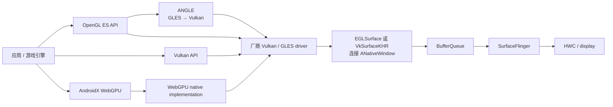

# 2.14 图形 API 演进与选择策略（OpenGL ES / Vulkan / ANGLE）

Android 上的 OpenGL ES、Vulkan、ANGLE 和 WebGPU 分属不同抽象层。OpenGL ES 与 Vulkan 是应用可直接使用的 GPU API；ANGLE 接收 EGL/OpenGL ES 调用，再翻译到 Vulkan 等后端；AndroidX WebGPU 则用更高层的对象模型和 WGSL 屏蔽一部分后端差异。只比较“谁更快”，会把 API 开销、驱动质量、引擎实现和显示管线混在一起。

分析以 Android 17/API 37、`android-17.0.0_r1` 为平台源码锚点，kernel 侧以 `android17-6.18-2026-06_r6` 为锚点。选型原则如下：

- 已有稳定的 GLES 渲染器，不必仅因系统升级就重写为 Vulkan。先测 CPU 提交、GPU 执行、驱动兼容性和维护成本。
- Vulkan 适合需要可预测资源管理、多线程命令录制、复杂同步或现代渲染能力的引擎，但它把更多正确性责任交给应用。
- ANGLE 是 GLES 驱动选项，不是新的应用 API。Android 17 允许应用表达偏好，平台仍会结合设备能力和策略决定是否采用。
- WebGPU 在 Android 17 时间点仍是 AndroidX developer preview。它适合能够接受预览期 API 变化、又希望获得现代图形与计算接口的项目，不能当作成熟 Vulkan 渲染器的无成本替代。
- 无论上游使用哪种 API，可见画面通常都要经 `ANativeWindow`、BufferQueue、SurfaceFlinger 和 HWC 到达显示设备。API 选型不会绕过显示系统。

## 1. 先分清四个抽象层

一帧从应用代码到屏幕，至少跨过 API、驱动、Android 图形缓冲区和显示合成四层。下面这张图用于确认每个名字所在的位置。



图中 GLES 有两条可能路径：厂商原生 GLES 驱动，或 ANGLE 的 Vulkan backend。应用调用 `glDraw*()` 并不能证明底层没有 Vulkan。WebGPU 的实现也可能使用 Vulkan，但应用看到的是 WebGPU 对象、WGSL 和 command encoder，而非 `VkDevice`。

HWUI 还要单独看待。普通 View 的硬件加速由 `libhwui`、Skia 和 RenderThread 管理；应用直接创建 EGL context 或 Vulkan device 时，资源和提交策略由应用或引擎管理。平台 HWUI 的实现可以说明 Android 自身如何使用 Vulkan，却不能直接推导第三方引擎应当复制其线程、队列或缓存结构。

## 2. API 演进：版本号只回答“接口何时出现”

### 2.1 OpenGL ES

Android 从 API 1 就有 OpenGL ES 1.x，OpenGL ES 2.0 从 API 8 开始提供可编程 shader。后续版本逐步加入实例化、计算着色器和更完整的图形能力。

| OpenGL ES | Android API 起点 | 主要变化 |
|---|---:|---|
| 1.0 / 1.1 | API 1 | 固定功能管线 |
| 2.0 | API 8 | vertex / fragment shader，GLSL ES |
| 3.0 | API 18 | MRT、instancing、transform feedback 等 |
| 3.1 | API 21 | compute shader、SSBO 等 |
| 3.2 | API 24 | geometry / tessellation 等进入 ES 标准 |

API 起点不代表设备必须实现该版本。应用仍应通过 manifest 的 `uses-feature`、EGL 配置和运行时查询约束能力。Android 17 CDD 7.1.4.1 对带屏幕和视频输出的设备要求支持 GLES 1.1、2.0、3.0 和 3.1，并建议支持 3.2；这是 Android 17 兼容设备的要求，不应倒推到旧系统。

GLES 的核心模型是 context 内的可变状态。`glBindTexture()`、`glUseProgram()` 和 blend/depth 设置会改变后续 draw 的解释方式。驱动要根据当前状态生成或选择底层命令，并处理应用看不到的缓存、资源驻留和同步。这个模型容易入门，也给驱动留下了较大的实现空间。

“GLES 必然单线程”并不准确。应用可以建立共享 context，在不同线程上传或编译资源；驱动内部也可以异步工作。限制主要来自 context 状态的顺序语义和共享对象同步：同一个 context 的 draw call 随意分发给多个线程，多 context 方案又需要仔细管理可见性与 fence。

### 2.2 Vulkan

Vulkan 从 Android 7.0 / API 24 开始提供。Android 官方的版本表给出以下平台演进：

| Vulkan | Android 平台节点 | 说明 |
|---|---|---|
| 1.0 | Android 7 / API 24 | Android 首次支持 Vulkan |
| 1.1 | Android 9 / API 28 | 平台加入 Vulkan 1.1 支持 |
| 1.3 | Android 13 / API 33 | Android 13 首发设备基线提升到 1.3 |
| 1.4 | Android 16 / API 36 | Android 16 及以后首发设备要求 1.4 |

表里的“平台支持”和“首发设备要求”含义不同。升级到 Android 17 的旧设备不会因为系统版本变化就获得新的 GPU 硬件特性。创建 device 前必须查询 physical device 的 API version、extension、feature、format 和 queue family。

Vulkan 把大量隐式工作变成应用可见对象：

- command buffer 明确记录命令，queue submission 明确提交批次；
- image layout、pipeline stage 和访问掩码参与资源 hazard 管理；
- memory allocation、binding、预算和回收策略由应用或 allocator 管理；
- pipeline、descriptor 和 render state 的组合更早确定；
- semaphore 处理 GPU 工作依赖，fence 处理主机等待，barrier 处理命令间的内存与执行依赖。

这不等于 `vkCmdDraw()`“完全没有校验”或 Vulkan“自动更快”。Release 构建通常不启用 validation layer，但 loader、ICD 和应用自身封装仍有工作；录制成本还会受 descriptor 更新、pipeline 查找、内存分配和锁竞争影响。Vulkan 的优势在于应用能看到并控制更多成本，把昂贵工作移出帧关键路径。若资源生命周期、同步或缓存设计不稳，结果可能比成熟的 GLES 驱动更差。

### 2.3 ANGLE

ANGLE 对应用暴露 EGL/OpenGL ES，在内部维护 GLES 状态并生成 Vulkan 等后端命令。它的价值主要有两类：

1. 让平台用一套持续维护的 GLES 实现适配不同 GPU 驱动；
2. 让已有 GLES 应用在不改应用 API 的前提下测试 Vulkan 后端。

ANGLE 不会消除 GLES 状态机的语义。它仍需跟踪状态、翻译 shader，并为 Vulkan backend 组织 pipeline。某个应用在 ANGLE 上更快或更慢，取决于 workload、ANGLE 版本、pipeline cache、厂商 Vulkan 驱动和设备热状态，不能只按 API 名称判断。

### 2.4 WebGPU

AndroidX WebGPU 提供 Kotlin/Java 风格的 WebGPU 接口，以 WGSL 编写 shader，并支持图形与通用计算。它比 Vulkan 更高层，能减少平台相关样板代码；相应地，底层资源状态和提交细节也不再全部由应用直接控制。

截至 2026-07-25，AndroidX WebGPU 最新公开版本为 `1.0.0-alpha05`，仍处于 developer preview。官方入门文档给出的最低系统版本是 API 24，优先使用 Vulkan 1.1；兼容 feature level 可覆盖部分 GLES 设备。这里的 API 24 是库的系统下限，不代表每台 API 24 设备都有相同后端能力。

WebGPU 适合新工具、跨平台可视化、计算任务和能够承受预览 API 调整的项目。已有大型 Vulkan 引擎若依赖自定义内存分配、精细 barrier、特定 extension 或厂商工具，迁移收益需要逐项评估。

## 3. Android 17 的 Vulkan 要求要分三层读

Android 17 同时存在 CDD、平台源码内的设备要求 profile，以及面向活跃设备生态的 Android Vulkan Profile。三者服务的对象不同。

| 层次 | 主要对象 | Android 17 下应怎样理解 |
|---|---|---|
| CDD 7.1.4.2 | Android 兼容设备 | 设备若包含 Vulkan 实现，CDD 规定最低 API、WSI 与外部同步等要求；特定设备类型另有首发约束 |
| `VP_ANDROID_17_requirements` | Android 17 首发或重新进行 Google Requirements Freeze 的芯片组 | AOSP JSON 声明 `api-version: 1.4.335`，并列出该代芯片组的强制 feature/ extension |
| AVP 2025 | 活跃 Vulkan 设备生态 | 用一组已统计覆盖率的能力帮助应用选择兼容路径，不等同于某个 Android 平台版本 |

Android 17 CDD 的强制项与建议项要分开读。对包含 Vulkan 实现的设备，CDD 7.1.4.2 要求支持 `VK_EXT_present_mode_fifo_latest_ready`、`VK_KHR_present_wait2`、`VK_KHR_android_surface`、`VK_KHR_incremental_present`、`VK_KHR_present_id`、`VK_KHR_present_id2`、`VK_KHR_surface` 和 `VK_KHR_swapchain`。`VK_EXT_present_timing`、`VK_GOOGLE_display_timing` 与 `VK_KHR_driver_properties` 在 CDD 中属于强烈建议项，与强制项层级不同。

Android 17 还增加了两类限制。第一，声明 Vulkan 1.1 及相应 feature flag 的实现必须支持 `SYNC_FD` external semaphore handle 和 `VK_ANDROID_external_memory_android_hardware_buffer`，而 `VK_KHR_external_fence_fd` 仍是强烈建议项。第二，普通不可调试应用不能枚举包外 layer，也不能被包外实现跟踪或拦截 Vulkan API；只有应用设置 `com.android.graphics.injectLayers.enable=true` 时才放行这一入口，OEM 和平台 layer 按 CDD 例外处理。这会直接影响抓帧、验证层和图形调试工具的接入方式。

`frameworks/native/vulkan/vkprofiles/profiles/VP_ANDROID_17_requirements.json` 列出的 Android 17 芯片组要求更宽。它除了 present 扩展，还包含 `VK_KHR_pipeline_binary`、`VK_KHR_pipeline_library`、`VK_EXT_graphics_pipeline_library`、`VK_EXT_present_timing`，并要求 Vulkan 1.4 的 `hostImageCopy` feature。该 JSON 的说明把适用范围限定为在 Android 17 首发或重新进行 Google Requirements Freeze 的芯片组，不能拿它约束所有从旧版本升级到 Android 17 的设备。

应用仍应在运行时枚举。AOSP `libvulkan/driver.cpp` 提供了一个直接例子：只有在 SurfaceFlinger present timestamp 属性和对应平台 flag 开启，并且 ICD 支持 `VK_KHR_calibrated_timestamps` 时，加载器才会暴露 `VK_EXT_present_timing`。系统镜像、设备首发条件、厂商 ICD 和升级路径会共同影响最终结果。

AVP 2025 也不能替代运行时查询。官方覆盖率统计回答“活跃 Vulkan 设备中有多少满足某组能力”，适合制定降级策略；它不会让缺失的 extension 出现在设备上。工程上可以先用 Profile 做设备分层，再对要启用的 feature、extension 和 format 做精确检查。

## 4. GLES 与 Vulkan 的架构差异

### 4.1 状态提交

GLES 允许应用逐步修改 context 状态，驱动在 draw 前后决定怎样映射到硬件。Vulkan 通常要求应用先构造较完整的对象与命令，再把命令批次交给 queue。

| 维度 | OpenGL ES | Vulkan |
|---|---|---|
| 状态模型 | context 内可变状态 | pipeline、descriptor、dynamic state 等显式对象 |
| 命令组织 | API 调用按序进入驱动 | 先录制 command buffer，再提交 queue |
| 内存 | 驱动负责大部分分配与迁移 | 应用选择 memory type 并管理分配、绑定与预算 |
| 同步 | API 隐含规则较多，也支持 GL sync | semaphore、fence、barrier、event 等显式表达 |
| 错误暴露 | 部分错误可由 `glGetError()` 观察 | 错误码、validation layer、GPU-assisted validation |
| 多线程 | 多 context 可用，状态和共享同步较难 | command pool / command buffer 可按线程组织，queue 外部同步仍由应用负责 |

Vulkan 适合把 scene traversal、visibility、resource preparation 和 command recording 拆到多个 worker。它不会自动完成并行化。若所有 worker 争用同一个 allocator、descriptor pool 或 pipeline cache，线程数越多，锁和缓存抖动越明显。

### 4.2 Command buffer 复用

静态场景可以复用部分 secondary command buffer，减少 CPU 录制。但以下变化通常会迫使应用更新命令或其引用的数据：

- swapchain 重建或 framebuffer / attachment 变化；
- pipeline、descriptor binding 或 draw 数量变化；
- 资源生命周期和 image layout 方案变化；
- dynamic rendering 配置或渲染目标变化。

复用也不是“录一次永久使用”。应用要确认 command buffer 不处于 pending 状态，引用的对象仍然有效，并处理多帧并行时的资源版本。很多引擎更常见的策略是复用渲染图、pipeline 和 descriptor 布局，同时用每帧 arena 快速重录命令。

### 4.3 Pipeline 编译

GLES 驱动可能在 link、首次 draw 或状态组合变化时编译底层 shader / pipeline。Vulkan 把 pipeline 对象暴露给应用，使预热和持久化更可控，但 pipeline 变体数量仍可能很大。

`VK_EXT_shader_object`、graphics pipeline library 和 pipeline binary 解决不同环节，不能把某一个扩展描述成“消除 shader jank”的通用开关：

- shader object 减少对完整 graphics pipeline 对象的依赖；
- graphics pipeline library 允许把 pipeline 拆成可复用部分；
- pipeline binary 让实现生成和复用二进制表示；
- 应用仍要控制 shader 变体、缓存命中、后台预热和首次使用时机。

Android 17 的设备要求 profile 提高了 pipeline library / binary 的基线，但旧设备与升级设备仍需要兼容路径。

### 4.4 两条 queue 不会自动消除阻塞

Vulkan 可以提供多个 queue，也可以只提供一个满足要求的 graphics queue family。transfer、compute 和 graphics 使用独立 queue 时，仍可能共享同一硬件执行单元、内存带宽或内核调度器；queue family ownership transfer 和 semaphore 还会增加同步工作。

Android 17 的 HWUI `VulkanManager` 会请求同一 graphics family 的两条 queue，一条用于主要图形工作，一条服务 `HardwareBitmapUploader`/`GrallocUploadThread`。这是平台针对自身上传 workload 的实现选择，不表示所有 Vulkan 应用都应申请两条 graphics queue。应用要根据 queue family、驱动行为和 trace 数据决定是否拆分。

## 5. Android WSI：不同 API 的共同出口

Native Graphics 的边界是画面生产权。应用或引擎通过自身 render loop 获取 buffer、记录 GPU 工作并提交到可见 `Surface`。宿主可以是 `SurfaceView`、`GameActivity`、`NativeActivity` 或其他能提供 `Surface` 的组件。

Java `Surface` 可由 `ANativeWindow_fromSurface()` 转成 `ANativeWindow`。EGL window surface 与 Vulkan Android surface 都通过它连接 Android 图形缓冲区。

### 5.1 EGL / GLES 提交

GLES 应用发出 draw call 后，通过 `eglSwapBuffers()` 提交 window surface 的当前 buffer。实现内部要完成必要的 driver flush、producer fence 传递和 `ANativeWindow` buffer 交换。

`eglSwapBuffers()` 返回只说明 EGL 定义的交换动作完成，不等于像素已经显示。buffer 之后还要等待 SurfaceFlinger latch、合成决策、HWC 显示和面板扫描。函数耗时长也不能直接归因于 shader：它可能在等待可用 BufferQueue slot、release fence、swap interval 或 frame pacing。

### 5.2 Vulkan / present

以下序列用于解释 Android 17 AOSP WSI 的职责分界，不表示 vendor ICD 内部只能按此线程模型执行。

```text
vkAcquireNextImageKHR
  → ANativeWindow::dequeueBuffer
  → 把 dequeue fence 交给 vkAcquireImageANDROID

应用录制并提交 GPU 工作

vkQueuePresentKHR
  → vkQueueSignalReleaseImageANDROID 生成 producer 完成 fence
  → ANativeWindow::queueBuffer(buffer, fence)
  → BufferQueue → SurfaceFlinger → HWC → display
```

`frameworks/native/vulkan/libvulkan/swapchain.cpp` 中包含对应的 `dequeueBuffer()`、`AcquireImageANDROID()`、`QueueSignalReleaseImageANDROID()` 和 `queueBuffer()` 调用。`VK_ANDROID_native_buffer` 是 loader 与 ICD 之间的 Android 私有桥接，普通应用应使用公开的 `VK_KHR_android_surface`/swapchain API。

acquire fence 防止 producer 过早覆盖仍被 consumer 使用的 buffer；queue 给 SurfaceFlinger 的 fence 表示 GPU 何时完成本次生产。显示完成后的 release fence 再控制该 buffer 何时可重用。到了 kernel 锚点 `android17-6.18-2026-06_r6`，跨模块的 buffer 共享仍建立在 dma-buf 上，同步文件由 `sync_file` 承载 fence。改用 Vulkan 不会取消这些所有权与同步约束。

### 5.3 Present mode 需要查询

不能把桌面 Vulkan 的常见 present mode 当成 Android 固定配置。应用应查询 surface 支持的 format、color space、extent、transform、usage、image count 和 present mode，再建立 swapchain。

Android 17 增加的 `VK_EXT_present_mode_fifo_latest_ready` 允许 FIFO 在同一刷新周期内选择更晚准备好的 present，以减少旧帧排队；它仍受 surface 能力、extension 暴露和应用 pacing 影响。`VK_KHR_present_wait2`、`VK_KHR_present_id2` 和 `VK_EXT_present_timing` 提供更精确的 present 标识、等待与时间反馈，但不能替代 GPU semaphore、resource barrier 或 BufferQueue release fence。

## 6. Android 17 的 ANGLE 选路

Android 17 CDD 没有规定所有设备都必须把 ANGLE 作为默认 GLES 驱动。官方路线是让更多新设备采用 ANGLE，同时保留 GLES 应用兼容性。对应用来说，需要区分“表达偏好”“平台选中”和“loader 已加载”三个阶段。

Android 17 提供 manifest 偏好。以下配置适合希望优先测试或使用 ANGLE 的游戏：

```xml
<application
    android:appCategory="game">
    <meta-data
        android:name="com.android.graphics.driver.prefer_angle"
        android:value="true" />
</application>
```

这个元数据只表达偏好，不能保证驱动存在。官方文档说明：ANGLE 不可用时仍使用厂商 GLES。AOSP 的执行路径更细：`GraphicsEnvironment` 先根据设备条件和多级策略决定该进程是否应使用 ANGLE，只有选路成立后，`EGL/Loader.cpp` 才优先加载 ANGLE；在这一阶段加载失败会触发 fatal，不会静默切回另一个已选路径。

Android 17 `GraphicsEnvironment.java` 的决策来源包括：

1. 半全局设置 `angle_gl_driver_all_angle`；
2. 每包设置 `angle_gl_driver_selection_pkgs` / `angle_gl_driver_selection_values`；
3. 平台资源 `config_angleAllowList`；
4. 在 `enableAngleDenyList` flag 开启时检查 device、global 与 dynamic denylist；
5. 同一 flag 分支内，对 `ApplicationInfo.CATEGORY_GAME` 再检查调试属性 `debug.graphics.angle.force_enable_angle_for_games` 和资源 `config_angleForGamesEnabled`；
6. 应用 manifest 的 `com.android.graphics.driver.prefer_angle`。

manifest 偏好还有设备门槛。源码会排除 essential tier、low-RAM，以及 vendor API level 早于 `202604` 的设备。选路成立后，系统先配置 ANGLE APK；没有对应 APK 时再尝试 system ANGLE。`GraphicsEnv.cpp` 保存包名、ANGLE 路径与规则结果，EGL loader 据此选择 ANGLE、可更新驱动、指定原生驱动或系统默认驱动。

开发阶段可以用官方 ADB 设置对单个包强制选择 ANGLE。下面的命令只用于测试机，测试结束要清理全局设置：

```bash
adb shell settings put global angle_gl_driver_selection_pkgs your.package.name
adb shell settings put global angle_gl_driver_selection_values angle

adb shell settings delete global angle_gl_driver_selection_pkgs
adb shell settings delete global angle_gl_driver_selection_values
```

配置命令本身只改变选路输入。验证结果时还应检查 `dumpsys gpu`、logcat 的 GraphicsEnvironment/EGL 信息，以及 `glGetString(GL_VENDOR)`、`glGetString(GL_RENDERER)`；如需性能结论，再结合 Perfetto 或 AGI。不能仅凭“设备是 Android 17”判断 backend。

## 7. 怎样选择 API

### 7.1 先看负载，再选 API

| 场景 | 优先评估 | 原因 |
|---|---|---|
| 已稳定运行的 2D、滤镜或轻量 3D GLES 项目 | 保持 GLES，并在目标设备测试 ANGLE | 重写成本可能高于 API 开销收益 |
| 高 draw count、大型材质系统、复杂资源流式加载 | Vulkan | 更容易控制命令录制、pipeline、内存和同步 |
| 使用 Unity、Unreal 等成熟引擎 | 采用引擎已验证的 Vulkan/GLES 路径 | 引擎版本、渲染后端和设备名单比手写 API 偏好更关键 |
| 需要兼容旧 GLES 代码，同时评估 Vulkan 驱动 | GLES + ANGLE A/B 测试 | 应用接口保持不变，可比较两种 GLES 实现 |
| 新的 Kotlin/Java 图形或 GPU 计算项目 | 评估 AndroidX WebGPU preview | 接口更高层，但要接受 alpha 阶段变化 |
| 依赖特定 Vulkan extension、显式显存预算或厂商工具 | Vulkan | WebGPU/GLES 不一定暴露所需控制面 |

“Vulkan 比 GLES 快多少”没有脱离 workload 的固定答案。若 CPU 时间主要耗在游戏逻辑，换 API 不会缩短逻辑；若 GPU 被 fragment shader 或带宽压满，降低 draw-call 驱动开销也不会直接解决；若首帧卡在 shader / pipeline 编译，则缓存、预热和变体管理往往比 API 标签更重要。

### 7.2 Vulkan 的采用条件

项目适合 Vulkan，通常至少满足以下条件：

- 团队能维护 validation、GPU crash dump、设备兼容名单和降级路径；
- 引擎能管理多帧并行的资源生命周期，不依赖频繁 `vkDeviceWaitIdle()`；
- command recording、descriptor、pipeline cache 和 allocator 有清晰所有权；
- 对 surface 旋转、生命周期、swapchain 重建、颜色空间和 protected content 有测试；
- 有足够目标设备验证厂商 ICD，而不只在模拟器或单台旗舰机测试。

如果这些条件尚不具备，优化成熟 GLES 路径通常更稳。也可以使用已有 RHI 或引擎后端，把 API 差异限制在渲染抽象层。

### 7.3 从 GLES 迁移时先保存可比证据

迁移前先固定相同的场景、分辨率、刷新率、温度窗口和画质设置，记录：

- 应用逻辑、render preparation、driver 调用分别占多少 CPU 时间；
- draw / dispatch 数量、pipeline 变体、纹理上传和显存峰值；
- GPU 各阶段、带宽、频率与热降频；
- acquire、submit、present、SurfaceFlinger latch 和 display present 时间；
- 首帧、切场景、后台恢复和旋转时的缓存行为。

随后建立 Vulkan capability matrix，再逐步迁移资源、shader、render pass / dynamic rendering、同步和 swapchain。每完成一段都与 GLES 基线比较。这样能判断收益来自并行录制、资源策略、pipeline 预热还是驱动差异，也能及时发现画质或同步错误。

## 8. 性能分析：沿一帧向下定位

### 8.1 CPU 侧

先找应用掌握的 render loop。GLES 常见边界是 `eglSwapBuffers()`；Vulkan 还应观察 acquire、command recording、`vkQueueSubmit*()` 与 `vkQueuePresentKHR()`。线程名字只能当线索，调用栈、应用 trace marker 和提交事件更可靠。

| 现象 | 可能原因 | 下一步证据 |
|---|---|---|
| `eglSwapBuffers()` 很长 | driver flush、无空闲 buffer、release fence、swap interval、pacing | 线程状态、BufferQueue 深度、GPU queue、fence |
| `vkAcquireNextImageKHR()` 很长 | 没有可用 image、consumer 释放晚、FIFO 节拍、surface 变化 | image count、present mode、release fence、返回码 |
| command recording 很长 | 单线程瓶颈、pipeline / descriptor 查找、内存分配、锁竞争 | worker 分布、调度延迟、allocator / cache marker |
| submit 很快但 GPU 晚 | shader、overdraw、带宽、同步 bubble、频率或热限制 | GPU renderstage、counter、频率、fence signal |
| buffer 已 queue 但未及时显示 | acquire fence 晚、错过 latch、目标时间未到、合成或 HWC 延迟 | layer trace、FrameTimeline、SF/HWC slice、present fence |

`eglSwapBuffers()` 或 `vkQueuePresentKHR()` 返回都不表示“用户已经看到这一帧”。显示时间需要继续跟到 BufferQueue、SurfaceFlinger、HWC 和 display present。producer completion fence 与 display present fence 分开，避免把 GPU 完成误写成屏幕显示。

### 8.2 ANGLE 侧

ANGLE 路径要拆成应用 GLES、ANGLE 状态跟踪/ shader 翻译，以及 Vulkan driver/GPU 三段。大量细碎状态切换可能增加翻译成本；pipeline cache 命中、厂商 Vulkan 驱动质量也可能让它优于原生 GLES。

AGI 适合检查 Vulkan queue、shader 和 GPU counter；Perfetto 适合把应用线程、调度、GPU、BufferQueue、SurfaceFlinger 与 FrameTimeline 放到同一时间轴。trace 中出现 Vulkan slice，只能证明该层存在 Vulkan 工作，不能据此断言应用直接使用 Vulkan：ANGLE、HWUI 或系统 RenderEngine 都可能提交 Vulkan。

### 8.3 Queue stuffing 与延迟

producer 持续尽快提交会逐渐占满可用 buffer。随后 render thread 周期性阻塞在 swap 或 acquire，帧率看似稳定，输入采样却落在更早的一帧，触控到显示延迟增加。

修复方向包括匹配目标刷新率、减少不必要的 in-flight frame、推迟输入采样和采用明确的 frame pacing。Swappy 可以包装 GLES 的 swap 或 Vulkan present，并结合 Choreographer、presentation timestamp 与 fence 控制节拍；它属于应用库，不是 `android-17.0.0_r1` 平台内部固定路径。

## 9. 版本迭代：保留历史，结论止于 Android 17

- Android 1.0 / API 1：提供 OpenGL ES 1.x。
- Android 2.2 / API 8：OpenGL ES 2.0 进入 SDK。
- Android 4.3 / API 18：OpenGL ES 3.0。
- Android 5.0 / API 21：OpenGL ES 3.1。
- Android 7.0 / API 24：Vulkan 1.0 与 OpenGL ES 3.2 平台支持。
- Android 9 / API 28：平台加入 Vulkan 1.1。
- Android 13 / API 33：新设备 Vulkan 基线提升到 1.3。
- Android 15 / API 35：官方进一步明确 ANGLE 作为可选 GLES-on-Vulkan 层及后续路线。
- Android 16 / API 36：首发设备 Vulkan 基线提升到 1.4。
- Android 17/API 37：CDD 增加 present、外部同步与 layer 注入要求；`VP_ANDROID_17_requirements` 定义该代首发/重新冻结芯片组的 Vulkan 1.4.335 能力集合；应用可通过 `com.android.graphics.driver.prefer_angle` 表达 ANGLE 偏好；AndroidX WebGPU 仍处预览阶段。

这里没有把“平台新增”“兼容设备要求”“新芯片组要求”和“活跃设备覆盖率”写成一条递增版本线。它们回答的问题不同，也是做设备分层时最容易混淆的地方。

## 10. 常见误区

### Vulkan 没有 driver overhead

Vulkan 减少了部分隐式状态推导，并允许应用更早组织工作，但 loader、ICD、内存管理、descriptor、pipeline 和内核提交仍有成本。目标是让成本更可控，无法让成本消失。

### Vulkan 多线程录制一定更快

只有 workload 可拆分、每线程资源独立且 CPU 核数足够时才可能获益。任务过小或共享锁过多时，并行录制会增加开销。

### Android 17 上 GLES 都会走 ANGLE

CDD 没有这一规定。系统默认、allowlist / deny 规则、设备等级、vendor API level、开发设置和 manifest 都可能影响选路。应以进程运行时信息为准。

### ANGLE 只是兼容层，所以一定更慢

ANGLE 多了一层状态翻译，也可能绕开质量较差的厂商 GLES 实现，并利用较好的 Vulkan 驱动。结论只能来自同设备、同场景、同温度条件下的 A/B 测试。

### `vkQueuePresentKHR()` 返回表示画面已显示

present 只把 swapchain image 交给 presentation engine。Android 上还要经过 native window、BufferQueue、SurfaceFlinger、HWC 和显示设备。若要判断可见时间，应使用 present timing、FrameTimeline、layer trace 和 display fence 等证据。

### 满足 Android 17 就可以跳过 capability query

升级设备、不同设备类型、系统属性、平台 flag 和 ICD 能力都会影响结果。版本号适合筛选大范围，feature / extension / format 查询负责最终决策。

## 11. 源码阅读入口

| 目标 | Android 17 源码 |
|---|---|
| ANGLE 选路策略 | `frameworks/base/core/java/android/os/GraphicsEnvironment.java` |
| native 侧 ANGLE 配置 | `frameworks/native/libs/graphicsenv/GraphicsEnv.cpp` |
| EGL 驱动加载顺序 | `frameworks/native/opengl/libs/EGL/Loader.cpp` |
| Vulkan Android WSI | `frameworks/native/vulkan/libvulkan/swapchain.cpp` |
| loader extension 暴露条件 | `frameworks/native/vulkan/libvulkan/driver.cpp` |
| Android 私有 WSI 接口 | `frameworks/native/vulkan/include/vulkan/vk_android_native_buffer.h` |
| Android 17 Vulkan 芯片组要求 | `frameworks/native/vulkan/vkprofiles/profiles/VP_ANDROID_17_requirements.json` |
| kernel fence 文件桥接 | `drivers/dma-buf/sync_file.c` |

阅读源码时应确认 tag。平台文件均以 `android-17.0.0_r1` 为准，kernel 文件以 `android17-6.18-2026-06_r6` 为准。厂商 ICD 不在 AOSP 中，涉及 shader compiler、GPU scheduler、内存压缩和硬件 counter 的结论还要结合具体 SoC 文档与设备 trace。

## 参考资料

- [Android 17 Compatibility Definition](https://source.android.com/docs/compatibility/17/android-17-cdd)
- [Implement Vulkan](https://source.android.com/docs/core/graphics/implement-vulkan)
- [Android Vulkan Profile](https://developer.android.com/ndk/guides/graphics/android-vulkan-profile)
- [Vulkan on Android 与 ANGLE](https://developer.android.com/games/develop/vulkan/overview)
- [WebGPU on Android](https://developer.android.com/develop/ui/views/graphics/webgpu)
- [Get started with WebGPU](https://developer.android.com/develop/ui/views/graphics/webgpu/getting-started)
- [AndroidX WebGPU release notes](https://developer.android.com/jetpack/androidx/releases/webgpu)
- [AGDK Frame Pacing/Swappy](https://developer.android.com/games/sdk/frame-pacing)
- [Android 17 Vulkan present timing](https://developer.android.com/games/develop/vulkan/frame-pacing-extensions)
- [Perfetto FrameTimeline](https://perfetto.dev/docs/data-sources/frametimeline)
