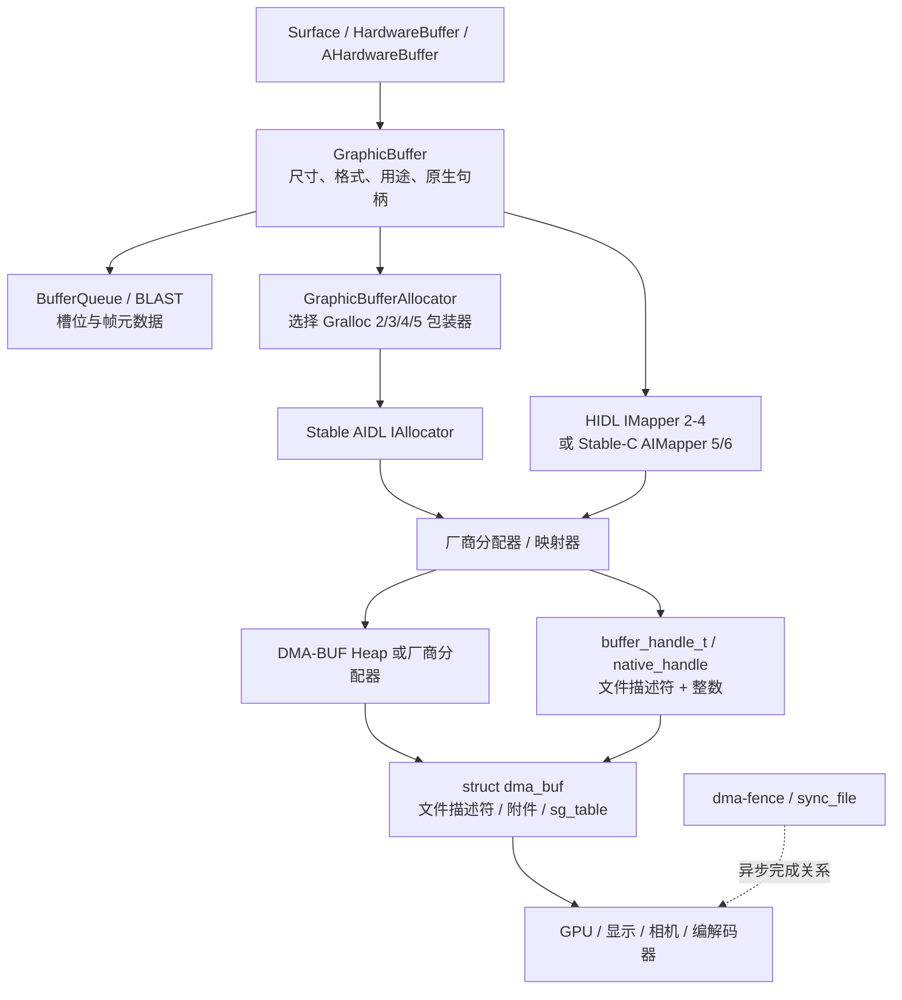
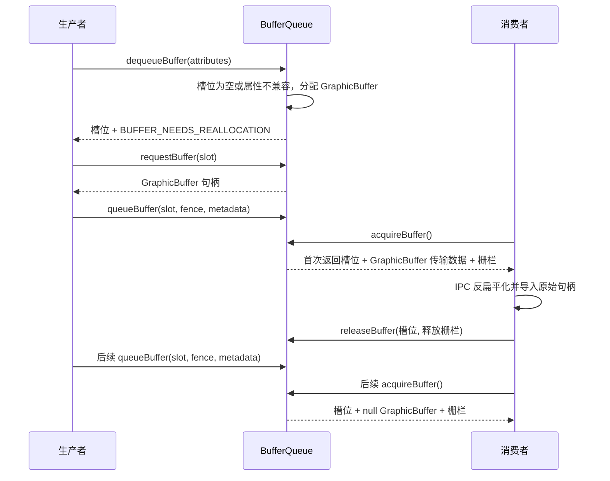

# 2.15 DMA-BUF、Gralloc 与跨进程图形内存共享

BufferQueue 负责回答“哪个槽位归谁使用”，Gralloc 负责回答“按什么规格分配、怎样导入和访问”，DMA-BUF 负责回答“同一份缓冲怎样被多个设备驱动和进程引用”。三者解决不同问题。

理解这组边界后，许多常见现象会变得清楚：

- Binder 传递 `GraphicBuffer` 时会复制元数据和文件描述符引用，不会复制整帧像素；
- “零拷贝”只描述跨模块共享这一段，不保证后续没有 GPU 合成、格式转换、解析或 CPU 复制；
- 句柄传到另一个进程后还要由 Mapper 导入，得到该进程可用的已导入句柄；
- 同一个 BufferQueue 槽位在两端都有缓存，稳定阶段通常只传槽位、栅栏和帧元数据；
- 文件描述符、已导入句柄、设备附件、内存映射和队列引用都会延长生命周期，关闭某一个文件描述符不代表底层存储立即释放。

分析以 Android 17/API 37、`android-17.0.0_r1` 为用户空间锚点，内核侧以 `android17-6.18-2026-06_r6` 为锚点。Gralloc 的分配策略和句柄布局由 SoC 厂商实现，AOSP 只能证明接口与框架行为。

## 1. 为什么图形缓冲不能按普通 Binder 数据传

一张 1080 × 2400、每像素 4 字节的未压缩 RGBA 图像，按紧密排布估算约为 9.9 MiB：

```text
1080 × 2400 × 4 = 10,368,000 bytes ≈ 9.9 MiB
```

这个数只用于说明数量级。Gralloc 分配还可能包含步幅填充、多个平面、压缩元数据、对齐区和实现私有区域，不能用它推算设备上的准确占用。

若每帧都把像素从应用复制到 SurfaceFlinger，60 fps 时单次 IPC 边界就会增加约 593 MiB/s 的读写数据量。Android 因而让参与者共享缓冲，并用句柄传递访问能力。这里仍会产生真实内存流量：GPU 渲染要写，SurfaceFlinger 或 HWC 要读，客户端合成还会读源图层并写客户端目标。共享避免的是跨进程所有权转移所需的整帧复制。

## 2. 从 API 到内核的分层

下图用于区分对象、接口和内核资源。箭头表示控制或引用关系，不表示每台设备都由 DMA-BUF Heap 提供底层存储。



`buffer_handle_t` 是不透明类型。它是 `native_handle_t` 的图形缓冲区别名，可以带多个文件描述符和整数；AOSP 不规定“第一个文件描述符必定是像素 DMA-BUF”，也不规定厂商私有整数的意义。只能通过 Mapper 元数据 API、厂商文档和内核文件描述符信息解释具体句柄。

### 2.1 GraphicBuffer 与 AHardwareBuffer

`GraphicBuffer` 是框架原生层的包装对象，保存宽度、高度、步幅、格式、图层数、用途、代数、ID 和句柄。像素不在 C++ 对象内部。

公开 NDK API 使用 `AHardwareBuffer`。它允许原生应用分配、引用、描述、CPU 锁定，并把同一缓冲导入 EGL 或 Vulkan。Java `HardwareBuffer` 包装同类原生对象。应用应先用 `AHardwareBuffer_isSupported()` 或 `HardwareBuffer.isSupported()` 检查格式、图层与用途组合；系统版本达到 API 下限也不能保证任意组合可分配。

### 2.2 Gralloc 分配器

Android 17 的主线分配接口是 Stable AIDL `IAllocator`。当前接口包含：

- `allocate2(BufferDescriptorInfo, count)`：按结构化描述符分配；
- `isSupported()`：判断描述符是否可分配，资源耗尽仍可能让后续分配失败；
- `getIMapperLibrarySuffix()`：定位厂商 Stable-C Mapper SP-HAL；
- `isMultiViewSupported()`/`allocateMultiView()`：Android 17 源码中的多视图分配接口。

旧 `allocate(byte[] descriptor, count)` 仍在 AIDL 中，但注释明确：配合 `AIMAPPER_VERSION_5` 时已由 `allocate2()` 替代；设备仍使用 `mapper@4` 时，旧入口还需要实现。Android 17 框架同时保留新旧厂商接口适配，不能概括为“Gralloc 已完全改成 AIDL”。

`BufferDescriptorInfo` 包含名称、宽高、图层数、格式、用途、`reservedSize` 与 `additionalOptions`。`additionalOptions` 用于不改变总体用途却影响分配方式的扩展条件；AIDL 注释以表面压缩级别为例。它不是公开的 `AHardwareBuffer_allocateWithOptions()`，NDK 没有这个函数。

### 2.3 Gralloc Mapper

Mapper 负责把原始句柄导入当前进程，并提供元数据、CPU 锁定/解锁、保留区域和释放已导入句柄等操作。Android 17 源码中：

- IMapper 2–4 使用 HIDL；
- C 风格 `AIMapper` 从版本 5 开始；
- `AIMapperV6` 增加多视图查询与视图句柄导入；
- 框架的 `GraphicBufferMapper` 把 Stable-C 路径归在 `GRALLOC_5` 包装器下，同时保留 Gralloc 2/3/4 包装器。

Stable-C `IMapper.h` 明确说明它是 `libui` 与厂商 Mapper 之间的 SP-HAL 接口，不是给普通应用直接调用的 NDK API。

### 2.4 用途描述访问者，不承诺执行路径

用途会影响分配器选择内存布局、压缩、缓存策略和安全属性。常见对应关系如下：

| 现代用途 | 典型含义 |
|---|---|
| `CPU_READ_*`/`CPU_WRITE_*` | 允许通过 Mapper/AHardwareBuffer 锁定进行 CPU 访问 |
| `GPU_SAMPLED_IMAGE` | GPU 作为纹理或采样图像读取 |
| `GPU_COLOR_OUTPUT`/`GPU_FRAMEBUFFER` | GPU 作为帧缓冲附件写入 |
| `COMPOSER_OVERLAY` | 缓冲可能交给 Composer HAL 使用 |
| `VIDEO_ENCODE` | 视频编码器读取 |
| `PROTECTED_CONTENT` | 仅允许受保护路径，禁止普通 CPU 访问 |
| `FRONT_BUFFER` | 请求前缓冲用途，其他用途会影响具体行为 |

用途表达“哪些访问必须被支持”。带 `COMPOSER_OVERLAY` 不保证 HWC 一定分配叠加平面；带 CPU 用途也不保证锁定操作没有同步和缓存维护成本。格式与用途的组合要通过 `isSupported()` 验证。

## 3. DMA-BUF：共享框架，不是唯一分配器

Linux DMA-BUF 把共享对象表示为 `struct dma_buf`，并能以文件描述符暴露给用户空间。Android 17 内核文档将相关能力分成三个主要原语：

- `dma-buf`：共享缓冲，内部关联底层存储与附件；
- `dma-fence`：异步硬件工作完成信号；
- `dma-resv`：为某个 dma-buf 管理一组隐式同步栅栏。

Android 图形栈大量使用显式栅栏文件描述符；不能因为内核提供 `dma-resv` 就假设所有 Android GPU、HWC 与相机访问都由隐式同步自动排序。

### 3.1 导出方与导入方

导出方决定怎样分配底层存储，实现 `dma_buf_ops`，并通过 `dma_buf_export()` 建立共享对象。导入方通过文件描述符获得引用，再为自己的硬件设备建立附件与 DMA 映射。典型内核接口包括：

- `dma_buf_get()` / `dma_buf_put()`：取得与释放引用；
- `dma_buf_attach()` / `dma_buf_detach()`：把设备关联到共享对象；
- `dma_buf_map_attachment()`/`dma_buf_unmap_attachment()`：获得或释放适合该设备 DMA 的分散聚集映射；
- `dma_buf_begin_cpu_access()`/`dma_buf_end_cpu_access()`：在 CPU 访问边界处理一致性。

导入方看到的是适合自身设备的 DMA 地址与分散列表，不能把“共享一份缓冲”理解成“所有设备使用同一个物理地址”。IOMMU、分散聚集、压缩布局与迁移都可能由导出方和驱动处理。

### 3.2 文件描述符传递与引用

Binder 把文件描述符传到目标进程时，会在那里安装一个指向同一文件对象的文件描述符。两个进程中的整数编号通常不同，且每个文件描述符都有自己的关闭生命周期。像素载荷没有随 Parcel 复制。

底层存储的寿命也不只由可见文件描述符数量决定。已导入句柄、mmap、设备附件、内核引用和对象缓存都可能继续持有它。末尾一个相关引用释放后，dma-buf 导出方的 `release` 才有机会回收资源。

DMA-BUF 文档要求导出方创建文件描述符时支持原子设置 `O_CLOEXEC`，避免多线程程序在 `fork`/`exec` 窗口泄漏访问能力。这既是资源问题，也是安全边界。

### 3.3 DMA-BUF Heap 与 ION

DMA-BUF 本身不规定底层存储从哪里来。DMA-BUF Heap 是一个标准用户空间分配前端，通过 `/dev/dma_heap/<heap-name>` 分配并返回 dma-buf 文件描述符；GPU GEM、相机或厂商分配器也可以成为导出方。

Android 12 的 GKI 2.0 用 DMA-BUF Heaps 替换 ION 作为 GKI 分配框架。`libdmabufheap` 在迁移阶段曾支持把堆名称映射回 ION；Android 17 的 `android-17.0.0_r1` 已移除 ION 实现。当前 `Alloc()` 打开 `/dev/dma_heap/<name>` 后直接执行 `DMA_HEAP_IOCTL_ALLOC`，打开失败就返回错误。带旧参数的重载和 `MapNameToIonHeap()` 仅为二进制兼容保留，`CheckIonSupport()` 固定返回 false，不能再据此推导 ION 回退。设备上的堆名称、安全/连续策略、缓存策略与访问权限仍由产品和厂商决定。看到 `/dev/dma_heap/system` 等节点可以确认分配入口，不能据此断定物理内存控制器或带宽已经隔离。

## 4. 一次分配怎样发生

以经典 BufferQueue 为例，Android 17 `BufferQueueProducer::dequeueBuffer()` 会先选择可用槽位，再检查该槽位的 `GraphicBuffer` 是否为空，或宽度、高度、格式、图层数、用途是否需要重新分配。

需要新缓冲时，流程如下：

1. `BufferQueueProducer` 清理旧槽位内容并设置 `BUFFER_NEEDS_REALLOCATION`；
2. 创建新的 `GraphicBuffer`；
3. `GraphicBufferAllocator` 按 Mapper 版本选择 Gralloc 2/3/4/5 分配器包装器；
4. 厂商分配器按描述符分配，并返回原始原生句柄；
5. 常规 `GraphicBuffer` 分配会把分配器返回的原始句柄导入为当前进程可用的句柄；只有显式请求原始句柄的内部调用方会跳过这一步；
6. 生产者看到重新分配标志后调用 `requestBuffer(slot)`，取得这一槽位的 `GraphicBuffer`；
7. `queueBuffer()` 要求该槽位已经执行过 `requestBuffer()`。

`GraphicBufferAllocator` 不直接承诺使用某个 DMA-BUF Heap。它只调用适配当前 Gralloc 版本的分配器。AOSP 的 `sAllocList` 保存已分配句柄的估算尺寸和请求者，用于 `dump()`、`getTotalSize()` 与 atrace 计数；释放后不会由这张表保留缓冲供再次分配。

### 4.1 什么时候会复用槽位中的缓冲

`GraphicBuffer::needsReallocation()` 在以下条件变化时返回 true：

- 宽度或高度；
- 像素格式；
- 图层数；
- 现有用途不能覆盖新用途；
- 受保护用途状态变化。

Android 17 的扩展分配标志开启时，附加选项代数变化也会触发重新分配。反过来，属性仍兼容且槽位中已有缓冲时，出队可以复用对象，不经过新的物理分配。

这里的“复用”是 BufferQueue 槽位持有同一个 `GraphicBuffer`。厂商分配器释放后是否缓存底层存储属于设备实现，不能从 AOSP `GraphicBufferAllocator` 或槽位状态推导。

### 4.2 16 KB 页大小怎样影响估算

Android 15 起平台支持 16 KB 页大小设备。它会影响 ELF、mmap、页表和许多按页管理的区域，但不能简单写成“每个 GraphicBuffer 都按 16 KB 向上取整”。图形缓冲可能采用多平面、分块、压缩或厂商私有布局，最终分配大小由分配器和导出方决定。

评估图形内存时至少要区分：

- 逻辑尺寸：宽度 × 高度；
- 步幅与平面布局；
- 格式、压缩元数据和对齐；
- `reservedSize`；
- IOMMU/CPU 映射与页表成本；
- 多进程统计是否重复计算同一 dma-buf inode。

`GraphicBufferAllocator` 的 `stride × height × bytesPerPixel` 只是部分格式的估算，源码也把转储文案写成估算值。判断 16 KB 设备上的变化应使用分配器元数据、dma-buf 大小和目标设备测量。

## 5. GraphicBuffer 怎样跨进程

`GraphicBuffer` 实现扁平化/反扁平化。Android 17 的 `flatten()` 写入 13 个基础整数，其中包括尺寸、格式、用途、ID、代数、传输文件描述符数量和传输整数数量；句柄的文件描述符放入独立数组，私有整数跟在扁平数据之后。

接收端 `unflatten()`：

1. 校验格式、数量与边界；
2. 创建临时 `native_handle`；
3. 填入 Binder 已安装到本进程的文件描述符和传输整数；
4. 调用 `GraphicBufferMapper::importBuffer()`；
5. 关闭并删除临时原始句柄，保存已导入句柄；
6. 对象析构时按所有者类型调用 Mapper `freeBuffer()` 或 Allocator `free()`。

因此，文件描述符被成功传递仍不等于 Mapper 一定能成功导入。厂商元数据不兼容、资源不足或错误句柄都可能让导入操作返回错误。

### 5.1 BufferQueue 为何不在每帧重传句柄

BufferQueue 两端按槽位缓存缓冲。`BufferQueueConsumer::acquireBuffer()` 在某个槽位第一次获取新对象时返回 `mGraphicBuffer`；该槽位之前已被消费者获取过时，源码把输出的 `mGraphicBuffer` 设为 null，避免消费者再次映射。后续帧仍会携带槽位、帧号、栅栏、裁剪、变换、数据空间、受损区域和时间信息。

以下序列用于说明经典 BufferQueue 的句柄缓存点。以跨进程消费者为例，首次返回的 `GraphicBuffer` 在 IPC 反序列化时由 `GraphicBuffer::unflatten()` 调用 Mapper 导入；消费者业务代码不会额外发起这次调用。



图中导入操作所在的进程和 IPC 次数取决于 BufferQueue 拓扑。同进程生产者/消费者不需要跨 Binder 复制文件描述符。标准应用窗口常由应用进程内的 BLASTBufferQueue 先消费窗口缓冲，再用 `SurfaceControl.Transaction` 把缓冲与窗口状态提交给 SurfaceFlinger；此时 SF 侧还有自己的缓冲缓存与导入边界。不能把经典 BufferQueue 的单次 IPC 示意直接套到所有窗口。

## 6. 同步：共享地址不代表可以同时读写

生产者把 GPU 或 CPU 写入完成的栅栏随缓冲提交给消费者。消费者在读取前必须遵守该依赖；读取或显示结束后，再返回释放栅栏，告诉生产者何时可以安全复用。Android 原生栅栏文件描述符通常由 `sync_file` 包装一个或多个 `dma_fence`。

这条关系与 fd 引用是两套机制：

- dma-buf/原生句柄传递“访问哪块缓冲”；
- dma-fence/sync_file 传递“前一项异步工作何时完成”；
- BufferQueue 槽位状态传递“当前所有权处于哪个阶段”。

关闭栅栏文件描述符不等于释放缓冲，关闭缓冲文件描述符也不表示 GPU 工作已经完成。第 2.16 节会继续展开栅栏所有权和信号/等待。

### 6.1 CPU 锁定也要处理同步与缓存

`AHardwareBuffer_lock()` 接收一个栅栏文件描述符。栅栏非负时，API 会在锁定过程中等待；传入负值时，调用者要保证先前写入已经完成。锁定还可能因硬件完成、缓存同步或实现条件而阻塞。

创建缓冲时必须声明兼容的 CPU 用途。受保护缓冲不能与 CPU 读写用途组合。CPU 写完后调用 `AHardwareBuffer_unlock()`：若传入栅栏输出指针，函数返回有效栅栏文件描述符或 `-1`，调用者负责关闭有效文件描述符；若传入 `nullptr`，函数会阻塞到解锁工作完成。不能只依赖“同一进程里调用顺序”推断设备可见性。

## 7. 生命周期与内存占用

一块图形缓冲可能同时被以下对象持有：

- 分配器/导出方的底层存储；
- 各进程中的原始或已导入原生句柄；
- BufferQueue 生产者/消费者槽位；
- BLAST 或 SurfaceFlinger 事务/缓冲缓存；
- RenderEngine、HWC、相机、编解码器或 GPU 驱动的设备附件；
- CPU mmap、EGLImage、Vulkan 图像/内存导入；
- 尚未完成的异步工作与栅栏关联对象。

“Java 对象已回收”只排除了其中一类引用。排查泄漏需要同时确认文件描述符、已导入句柄、队列槽位、图层、API 图像与驱动对象的寿命。

常见错误包括：

- 克隆/复制后遗漏 `native_handle_close()` 或关闭文件描述符；
- Mapper import 成功后遗漏 `freeBuffer()`；
- `AHardwareBuffer_acquire()` 与 `AHardwareBuffer_release()` 不配对；
- `Image`、`HardwareBuffer`、EGLImage 或 Vulkan 导入对象关闭顺序错误；
- Surface 断开后，业务缓存仍持有旧缓冲；
- 异常路径提前返回，跳过解锁、释放或事务释放回调。

## 8. 怎样观测与归因

### 8.1 先按 dma-buf inode 去重

`/proc/<pid>/fd` 可以找到进程持有的文件描述符，`/proc/<pid>/fdinfo/<fd>` 在内核与驱动支持时提供 inode、大小、导出方等信息。不同进程中的两个文件描述符若指向同一 dma-buf，按进程分别相加会重复统计。

内核开启 `CONFIG_DMABUF_SYSFS_STATS` 时，`/sys/kernel/dmabuf/buffers/<inode>/` 可提供 `size` 与 `exporter_name`。debugfs 可用的调试设备上，还可以看 `/sys/kernel/debug/dma_buf/bufinfo`。用户构建是否开放这些节点由内核配置与权限决定。

以下命令用于在有权限的设备上快速查看某个进程的文件描述符与 fdinfo。它不会自动识别所有厂商句柄，还需要按 inode 汇总。

```bash
adb shell 'for f in /proc/<pid>/fd/*; do readlink \"$f\"; done'
adb shell 'for f in /proc/<pid>/fdinfo/*; do echo \"$f\"; cat \"$f\"; done'
adb shell 'find /sys/kernel/dmabuf/buffers -maxdepth 2 -type f -print 2>/dev/null'
```

第一组输出用于发现文件描述符类型，第二组提供可关联字段，第三组查看全系统 dma-buf 统计。生产设备上遇到权限拒绝属于正常安全限制，不应通过修改 SELinux 来完成普通性能采样。

### 8.2 Perfetto 与系统 dump

Android 17 `GraphicBufferAllocator.cpp` 定义了两个直接观察点：

- `mem.gralloc.buffers`：当前注册在该进程 `sAllocList` 中的数量；
- `mem.gralloc.allocations`：分配即时轨道，包含请求者、尺寸和句柄。

它们只覆盖经过该进程 `GraphicBufferAllocator` 的对象，不是系统全部 dma-buf。设备支持时还可采集 `dmabuf_heap/dma_heap_stat` ftrace 事件；事件是否存在取决于内核配置和厂商实现，应先检查 tracefs 的 `available_events`。

结合以下信息更容易定位：

| 证据 | 回答的问题 |
|---|---|
| BufferQueue/BufferTX、槽位与帧号 | 哪条数据流在增加或长期持有缓冲 |
| `mem.gralloc.*` | 哪个进程、请求者和尺寸触发框架分配 |
| dma-buf fdinfo/sysfs inode | 同一底层存储被哪些进程引用、大小与导出方是什么 |
| SurfaceFlinger 图层跟踪数据/转储 | 图层是否仍存在，缓冲缓存与合成路径怎样 |
| 栅栏、GPU 与 HWC 跟踪数据 | 缓冲因异步工作未完成而不能复用，还是引用没有释放 |
| PSI、直接回收、IOMMU/GPU 驱动事件 | 分配慢是否来自内存压力或设备映射 |

看到缓冲长时间处于 ACQUIRED 状态时，先判断消费者是否按协议持有，再看释放栅栏和队列上限。Mapper 导入通常发生在新句柄首次出现时，不能把每次 ACQUIRED 停留都归因于导入操作。

## 9. 三类常见性能问题

### 9.1 分配抖动

Surface 尺寸、格式/用途、受保护状态变化，槽位被清理、外部缓冲附着/分离，以及附加选项更新，都可能触发重新分配。分配路径会跨框架、HAL、厂商分配器和内核，内存压力下还可能伴随回收或 IOMMU 映射。

优化时先查谁改变了描述符，再考虑预分配、稳定尺寸、减少内存池重建或延后非关键资源。不能使用脱离设备、格式和压力条件的统一毫秒数。

### 9.2 相机、编解码器与显示的带宽竞争

相机预览常把 HAL 产出的缓冲交给 SurfaceTexture、ImageReader、GPU 滤镜、编解码器或 HWC。一个相机缓冲可以在模块间共享，但 ISP 写入、GPU 采样、颜色转换、编码器读取和显示扫描都消耗内存带宽。

因此，零拷贝不等于零带宽。分析相机打开后 UI 掉帧时，应分别测量相机栅栏、GPU 渲染轮次、最终 Surface 显示、内存控制器与热状态；堆名称本身不能证明物理带宽隔离。两条 BufferQueue 与中间消费者/生产者需要分别检查，以确认积压位置。

视频也遵循同一原则。SurfaceView 视频可能保留独立图层，TextureView 会把解码缓冲再采样进宿主窗口；是否获得 HWC DEVICE 合成取决于格式、变换、受保护属性、平面和带宽等整屏条件。“共享同一缓冲”“省去一次 RenderEngine 合成”和“没有内存带宽成本”是三种不同结论。

### 9.3 引用泄漏

文件描述符数量上涨只是线索。若已导入句柄被释放但进程还保留 mmap，或文件描述符已关闭但 GPU 对象仍持有附件，单看 `/proc/<pid>/fd` 都会漏判。反过来，同一个 dma-buf 在多个进程各有文件描述符，也不能按文件描述符数量乘以大小。

应把分配事件、dma-buf inode、BufferQueue 槽位/图层、API 对象和释放时点放在同一时间范围内。只有确定“哪个引用超过预期寿命”，才能修正实际持有方。

## 10. 版本演进

### Android 12 / API 31

Android 12 的 GKI 2.0 以 DMA-BUF Heaps 替换 ION 分配框架。BufferQueue、GraphicBuffer 和 dma-buf 共享早已存在，变化集中在分配器的内核入口与 GKI 可维护性。旧版本或厂商私有组件仍可能保留 ION，不能仅按系统 API 级别猜测节点；Android 17 AOSP 的 `libdmabufheap` 本身不再提供 ION 回退。

### Android 13–14

这两版持续演进 BLAST、SurfaceFlinger 缓冲缓存、Composer 与内存诊断，但没有改变 dma-buf/Gralloc 的基本职责。讨论某个缓存清理或 Composer 优化时，要绑定对应实现、HAL 版本和可复现内存变化，不能把它写成所有缓冲生命周期的固定步骤。

### Android 15–16

16 KB 页大小支持让原生库与映射对齐受到更多关注；图形内存仍应以分配器返回的布局和 dma-buf 大小为准。Stable AIDL Allocator 与 Stable-C Mapper 路径继续取代旧接口的主线位置，同时保留厂商兼容层。

### Android 17 / API 37

`android-17.0.0_r1` 中，Stable AIDL `IAllocator` 同时提供 `allocate2()`、能力查询和多视图分配；Stable-C `IMapper.h` 同时声明 `AIMAPPER_VERSION_5` 与 `AIMAPPER_VERSION_6`，后者增加多视图操作。框架仍有 Gralloc 2/3/4/5 包装器，说明当前系统需要适配多代厂商 HAL。

内核 `android17-6.18-2026-06_r6` 下，dma-buf、dma-fence、dma-resv、sync_file 与 DMA-BUF Heap 仍是共享和同步基础。具体 GPU、显示、相机与编解码器驱动的导出方、附件、IOMMU 和跟踪点要按设备补齐。

## 11. 常见误区

### GraphicBuffer 里保存了整帧像素

`GraphicBuffer` 保存描述信息与句柄。像素在句柄引用的底层存储中，CPU 锁定后获得的虚拟地址也只是一次映射。

### 跨进程传 GraphicBuffer 会复制像素

扁平化/Binder 传递元数据、传输整数和文件描述符引用，不复制整帧载荷。后续 GPU 合成、格式转换或软件复制仍可能产生新的像素写入，需按渲染拓扑判断。

### 一个 GraphicBuffer 只有一个 dma-buf fd

常见 RGBA 缓冲可能只有一个主文件描述符，但 `native_handle` 契约支持多个文件描述符和整数。多平面与厂商元数据的布局由 Mapper 实现决定。

### 只要关闭文件描述符，内存就会释放

其他文件描述符、已导入句柄、mmap、附件、队列槽位或驱动对象仍可持有引用。应追踪对象的完整生命周期。

### BufferQueue 槽位复用等于厂商显存池

槽位复用表示继续持有同一个 `GraphicBuffer`。缓冲被释放后，厂商分配器是否缓存底层存储是另一层策略，AOSP `sAllocList` 不提供该能力。

### 零拷贝意味着不占内存带宽

共享省去 IPC 边界的整帧副本，生产者写入、消费者读取、合成与显示仍消耗带宽。相机、GPU、编解码器和显示并发时尤其明显。

## 12. Android 17 源码入口

| 目标 | 源码 |
|---|---|
| GraphicBuffer 传输与释放 | `frameworks/native/libs/ui/GraphicBuffer.cpp` |
| 分配器包装器、统计跟踪点 | `frameworks/native/libs/ui/GraphicBufferAllocator.cpp` |
| 槽位分配与生产者复用 | `frameworks/native/libs/gui/BufferQueueProducer.cpp` |
| 消费者首次句柄传递 | `frameworks/native/libs/gui/BufferQueueConsumer.cpp` |
| BLAST 事务缓冲路径 | `frameworks/native/libs/gui/BLASTBufferQueue.cpp` |
| Stable AIDL Allocator | `hardware/interfaces/graphics/allocator/aidl/.../IAllocator.aidl` |
| Stable-C Mapper v5/v6 | `hardware/interfaces/graphics/mapper/stable-c/.../IMapper.h` |
| dma-buf 导出方/导入方 | `drivers/dma-buf/dma-buf.c`、`include/linux/dma-buf.h` |
| DMA-BUF Heap | `drivers/dma-buf/dma-heap.c` |
| 原生栅栏文件描述符 | `drivers/dma-buf/sync_file.c` |

## 参考资料

- [Android 图形架构](https://source.android.com/docs/core/graphics/architecture)
- [降低图形内存消耗](https://source.android.com/docs/core/graphics/reduce-consumption)
- [从 ION 迁移到 DMA-BUF Heaps](https://source.android.com/docs/core/architecture/kernel/dma-buf-heaps)
- [AHardwareBuffer NDK 参考](https://developer.android.com/ndk/reference/group/a-hardware-buffer)
- [支持 16 KB 页大小](https://developer.android.com/guide/practices/page-sizes)
- [Perfetto memory profiling：DMA-BUF ftrace event](https://perfetto.dev/docs/quickstart/heap-profiling)
- [Linux DMA-BUF 文档](https://docs.kernel.org/6.18/driver-api/dma-buf.html)
