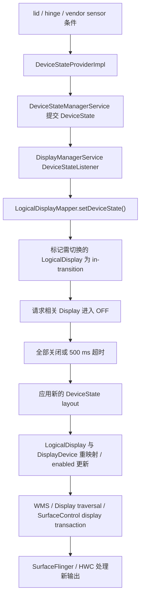

# 折叠屏显示切换、窗口连续性与渲染性能

折叠屏的性能问题常被简化为“大屏像素更多，所以 GPU 更慢”，但像素量只能解释部分现象。一次折叠或展开可能同时触发：

- 设备 posture（姿态）条件变化；
- 内建物理 Display（显示设备）的开关或重映射；
- WMS（WindowManagerService，窗口管理服务）的 DisplayContent、Task、Window 与 Insets（窗口避让区域）更新；
- Shell 与 SystemUI 的可选 unfold transition（展开转场）；
- 应用窗口尺寸、资源配置与布局变化；
- SurfaceFlinger 为目标 Display 重新构建可见 layer（合成图层）集合；
- HWC（Hardware Composer，硬件合成器）针对新 Display、mode（显示模式）和 layer 属性重新选择合成策略。

这些阶段属于不同进程和时间边界。排查时先判断问题落在哪一层，再讨论 GPU、Activity 重建或铰链传感器。

以下分析以 Android 17（API 37）的 `android-17.0.0_r1` 为准。Android 12～16 仅用于说明演进。

## 1. 先建立对象模型

### 1.1 Physical Display、DisplayDevice 与 LogicalDisplay

Android 显示框架区分物理设备和系统对外使用的逻辑 Display：

- **物理 Display**：面板与 HWC display，由物理地址标识；
- **`DisplayDevice`**：DisplayManager 对物理或虚拟显示设备的包装；
- **`LogicalDisplay`**：系统用于组织 layer stack（图层栈）、`DisplayInfo`、display group（显示组）和窗口内容的逻辑对象；
- **SurfaceFlinger Display 与 CompositionEngine Output**：针对最终输出建立合成状态并执行 present（送显）。

折叠设备可能让一个稳定的 logical display ID（逻辑显示标识）在不同设备状态下映射到不同内建面板。它也可能保留多个逻辑 Display，并在 layout（显示布局配置）中改变 enabled（是否启用）状态。具体方式由设备厂商配置决定。

因此：

- “内屏与外屏切换”不一定表现为 `DisplayListener.onDisplayRemoved()` 后再调用 `onDisplayAdded()`；
- logical display ID 没变，也不能推导底层物理面板、分辨率、density（像素密度）或 mode 没变；
- 看到两个内建面板，不代表两个面板始终能同时点亮。

### 1.2 DeviceStateToLayoutMap 决定什么

Android 17 的 `DeviceStateToLayoutMap` 从以下位置读取 display layout：

```text
/data/system/displayconfig/display_layout_configuration.xml
/vendor/etc/displayconfig/display_layout_configuration.xml
```

这两个文件按 device state（设备状态）描述显示布局。每个 layout 可以为 Display 配置：

- 物理 `DisplayAddress`；
- logical display ID；
- 是否 enabled；
- display group；
- 前后位置；
- lead display；
- brightness、refresh-rate、thermal、power throttling（亮度、刷新率、热管理和功耗限制）策略 ID。

刷新率和亮度策略可以随 layout 改变，但 AOSP 没有“展开态固定 120 Hz、折叠态固定低刷新率”的通用规则。具体 mode 还要经过 `DisplayModeDirector`、设备配置、内容帧率投票、热限制和用户设置。

### 1.3 多内屏并发属于设备能力

`config_supportsConcurrentInternalDisplays` 表示设备是否支持同时点亮多个内建 Display。layout 还要把相应 Display 设为 enabled，系统才会进入并发内屏状态。

即使两个 Display 同时工作，也不能假设它们的硬件资源完全隔离。HWC 对每个 Display 进行 validate 与 present（验证合成方案并送显），但 overlay（硬件叠加平面）、内存带宽、GPU、显示控制器和功耗预算可能受 SoC 与 vendor（设备厂商）实现共同约束。

## 2. Android 17 的设备状态主线

### 2.1 状态来源由设备配置决定

`DeviceStateProviderImpl` 从 vendor 或 data 分区的 `device_state_configuration.xml` 读取状态及条件。条件可以引用：

- lid switch（开合检测开关）；
- 指定 string type 与 name 的 sensor（传感器）；
- 一个 sensor 的一个或多个数值范围。

Provider 按 ID 从小到大检查条件，选择首个匹配状态。所需传感器会以 `SENSOR_DELAY_FASTEST` 注册，但事件频率仍受具体 sensor 能力与 HAL（Hardware Abstraction Layer，硬件抽象层）行为限制。

这里没有强制规定“所有折叠设备只看 `TYPE_HINGE_ANGLE`”。厂商可以组合 hall sensor（霍尔传感器）、hinge angle（铰链角度）、lid switch 或其他传感器条件。DeviceState ID 也是设备配置值，不应在跨设备脚本中写死 `STATE_OPEN = ...`。

### 2.2 从 DeviceState 到显示 layout

Android 17 的关键路径可以概括为：



`DeviceStateManagerService` 提交状态时会写入：

- `DeviceStateChanged` trace instant；
- `debug.tracing.device_state` system property（系统属性）；
- `DEVICE_STATE_CHANGED` stats atom（系统统计事件）。

这条路径先把连续的传感器条件归纳成离散 DeviceState，再选择相应 display layout。DisplayManager 收到回调后，先向 WMS 投递 device state 消息，再调用 `LogicalDisplayMapper.setDeviceState()`。源码注释说明，这个次序用于让 WMS 的 device-state 更新与 display change 事件保持可控的先后关系。

### 2.3 为什么切换过程中会看到黑场或过渡层

`LogicalDisplayMapper` 比较新 layout。以下情况会把 Display 标为 `in-transition`（正在切换）：

- enabled 状态变化；
- 同一个物理 DisplayDevice 将映射到新的 logical display id；
- DisplayDevice 只出现在新旧 layout 的一侧；
- Display 已处于 transition。

系统先发送 transition 阶段更新，让相关 Display 关闭。所有 transitioning Display（正在切换的显示设备）确认 `OFF` 后，才会清除 transition 标记、应用新 layout 并发出后续更新。源码给这段等待设置了 **500 ms** 的强制推进超时。

该机制通过 display blanking（暂时关闭显示输出）遮住 resize 过程中可能出现的错误尺寸。500 ms 是框架状态转换的兜底上限，不代表屏幕一定黑场 500 ms，也不代表折叠动画时长。

“固定丢 1～3 帧”“第一帧高 30%～50%”之类数值没有 AOSP 保证。设备的面板时序、power sequence（面板上电与下电顺序）、Shell transition、应用重绘和 HWC 能力都会改变观测结果。

### 2.4 layout 应用与 SurfaceFlinger 的边界

`applyLayoutLocked()` 会：

1. 按 layout 中的物理地址查找 `DisplayDevice`；
2. 查找或创建对应 `LogicalDisplay`；
3. 必要时交换 `LogicalDisplay` 背后的 `DisplayDevice`；
4. 更新 position（前后位置）、lead display（联动显示中的主显示）、refresh-rate zone（刷新率策略区域）、thermal throttling（热限制）与 enabled 状态。

后续 DisplayManager traversal（显示设备遍历）使用 `SurfaceControl.Transaction` 更新 display layer stack、flags（标志位）、projection（投影与旋转映射）、size 和 surface。SurfaceFlinger 接收 display transaction，并为新的 display 与 output 状态构建合成输入。

SurfaceFlinger 不负责识别手机处于书本姿态还是桌面姿态。它处理的是 system_server（承载系统核心服务的进程）已转换好的 Display 与 layer 状态。

## 3. WMS、Shell 与应用窗口

### 3.1 Display 树和 Surface 树要分开看

WMS 侧按以下对象组织窗口：

```text
RootWindowContainer
  DisplayContent
    DisplayArea / TaskDisplayArea
      Task / TaskFragment
        ActivityRecord
          WindowToken / WindowState
```

这棵树表达 WMS 的窗口与任务管理关系，不会与 SurfaceFlinger layer tree 一一对应。

Shell transition 可以创建 leash（转场期间使用的临时父 Surface），把 Task 或窗口 Surface 临时 reparent（更换父节点）到 leash，再对 leash 设置 matrix（变换矩阵）、crop（裁剪）、corner radius（圆角）和 position。

折叠动画期间看到 task leash 缩放，不能据此判断 App 在每次 progress（进度回调）时都重新提交了一张完整 buffer。

### 3.2 Android 17 的可选 unfold 动画

平台资源 `config_unfoldTransitionEnabled` 与 `config_unfoldTransitionHingeAngle` 决定设备是否启用相应能力。启用角度进度时，SystemUI 的 `HingeSensorAngleProvider` 获取 `TYPE_HINGE_ANGLE`，并通过后台 Handler（消息处理器）以 `SENSOR_DELAY_FASTEST` 接收事件。

`PhysicsBasedUnfoldTransitionProgressProvider` 把 hinge angle 映射到 0～1 的 progress，并用 spring animation（弹簧动画）平滑更新。

WM Shell 的 `UnfoldTransitionHandler` 在进度回调中创建 `SurfaceControl.Transaction`，让 task animator（任务动画器）更新 leash。

以 fullscreen task 为例，AOSP 的 animator 主要更新：

- `setWindowCrop()`；
- `setMatrix()`；
- `setCornerRadius()`；
- `show()`。

这些调用只更新 layer 几何。App 仍按自己的 Choreographer、View 与 HWUI 或其他 Producer（缓冲区生产者）路径生产内容。

动画由资源和设备能力控制。未启用这组模块的设备、厂商自定义 transition、锁屏与 AOD（Always-On Display，息屏显示）和半开状态都可能走不同路径。

### 3.3 Configuration 与 WindowLayoutInfo 没有固定先后顺序

物理 Display 切换、窗口 bounds（边界）更新和 WindowManager Extensions posture 更新来自不同组件。下面的顺序仅用于说明一个不可靠的假设，应用不应依赖它：

```text
WindowLayoutInfo → Configuration → onConfigurationChanged
```

这些事件可以按不同顺序到达。一次折叠或展开可能改变 `screenSize`、`smallestScreenSize`、`screenLayout`、`orientation`、`density` 或其他配置；具体集合取决于物理面板、windowing mode（窗口模式）、rotation（旋转）与厂商实现。

默认情况下，Activity 未声明自行处理的 configuration change（配置变化）会触发重建。若使用 `android:configChanges`，应用必须重新读取受影响资源并更新 UI，不能只记录回调后原样返回。

### 3.5 Shell Transition 状态机与 BLAST 同步

折叠或展开时，App 端观察到的“动画期 buffer 一起出现”，是 WMS 通过 `BLASTSyncEngine` 统一合并提交的结果。Android 自 Android 12 起把窗口动画从 WMS 内置的 `AppTransition` 迁出，由 `WM Shell` 进程通过 `ITransitionPlayer` AIDL 与 WMS 对接；同步则由 WMS 的 `BLASTSyncEngine` 完成。[来源: juejin Shell Transition 机制详解, 2026-09-23, https://juejin.cn/post/7688334749719035940][已验证: AOSP android-17.0.0_r1 `frameworks/base/services/core/java/com/android/server/wm/Transition.java`、`TransitionController.java`、`BLASTSyncEngine.java`、`WindowOrganizerController.java`、`frameworks/base/libs/WindowManager/Shell/src/com/android/wm/shell/transition/Transitions.java`、`DefaultTransitionHandler.java`、`frameworks/base/core/java/android/window/ITransitionPlayer.aidl`]

#### 3.5.1 进程边界与两条 Binder 通知

WMS 在 `system_server`，`WM Shell` 跑在 `com.android.systemui` 进程内，二者通过 AIDL 通信：

- `ITransitionPlayer.requestStartTransition(token, request)`：WMS 把 token（`Transition.mToken`，由 `new Binder()` 创建）和 `TransitionRequestInfo`（type、triggerTask、displayChange、flags、pipChange、remoteTransition）发给 Shell。此时 Shell 还没有窗口细节，只知道“要发生什么类型”。[来源: juejin Shell Transition 机制详解 5.1；AOSP `ITransitionPlayer.aidl`、`TransitionRequestInfo`][已验证: AOSP `frameworks/base/core/java/android/window/ITransitionPlayer.aidl`]
- `ITransitionPlayer.onTransitionReady(token, info, startT, finishT)`：BLAST 同步完成后，WMS 把 `TransitionInfo`（包含 Roots、每个参与容器的 Changes、leash Surface）和两张 `SurfaceControl.Transaction` 发给 Shell。`startT` 是 BLAST 合并后的初态，`finishT` 是动画结束需恢复的终态。[来源: juejin Shell Transition 机制详解 5.2、6.1、6.2][已验证: AOSP `Transition.onTransactionReady`]

`requestStartTransition` 与 `startTransition`（Shell 经 `WindowOrganizerController` 回告 WMS）的执行在 Shell 端是同一方法内的同步序列：先 dispatch Handler 链认领、再回告 WMS，最后才把 transition 状态从 `STATE_COLLECTING` 推进到 `STATE_STARTED`。[来源: juejin Shell Transition 机制详解 阶段 2；AOSP `Transitions.requestStartTransition` 第 1860 行附近] 这条链路是 AOSP 自 Android 12 起就固定的形态，不是 Android 17 才引入。

#### 3.5.2 Transition 状态机

`Transition`（WMS 侧）按以下状态推进：

```
STATE_COLLECTING → STATE_STARTED → STATE_PLAYING → STATE_FINISHED
                                          ↘ STATE_ABORT
```

- `STATE_COLLECTING`：`TransitionController.moveToCollecting()` 之后，正在收集参与者；此时 `mCollectingTransition` 唯一指向它。
- `STATE_STARTED`：Shell 通过 `WindowOrganizerController.startTransition()` 调用 `transition.start()` 后进入；BLAST 开始等待所有参与窗口绘制。`isCollecting()` 对 `COLLECTING` 与 `STARTED` 都返回 true，目的是防止新 transition 抢占 `mCollectingTransition`。[来源: juejin Shell Transition 机制详解 7.2；AOSP `Transition.java` `isCollecting` / `isPopulated`]
- `STATE_PLAYING`：`Transition.onTransactionReady()` 内部 `moveToPlaying()` 之后，并通过 Binder `onTransitionReady` 通知 Shell。`onTransactionReady` 会按顺序做：`commitVisibleActivities` → `commitVisibleWallpapers` → `calculateTargets` → `calculateTransitionInfo` → `assignTrack` → `moveToPlaying` → `mController.getTransitionPlayer().onTransitionReady(...)`。[来源: juejin Shell Transition 机制详解 4.4、5.2；AOSP `Transition.onTransactionReady`]
- `STATE_FINISHED` / `STATE_ABORT`：Shell 在 `onFinish()` 中调用 `mOrganizer.finishTransitionWithState()`；WMS 收到后从 `mPlayingTransitions` 移除、清理 starting window、通知监听器；`abort()` 则用于超时或 SystemUI 异常。[来源: juejin Shell Transition 机制详解 阶段 5、7.1；AOSP `TransitionController.finishTransition`、`Transition.finishTransition`]

`isPopulated()` 为 `mState >= STATE_STARTED && allReady()`，是“可以让新 transition 并行”的判定条件。[来源: juejin Shell Transition 机制详解 7.2、7.3；AOSP `Transition.isPopulated`]

#### 3.5.3 BLAST 同步：避免多 Surface 抖动

`BLASTSyncEngine` 把多个参与窗口（Activity 容器、Task、Wallpaper、starting window）合成一个 `SyncGroup`，等待所有窗口把首帧 buffer 提交，再统一合并事务、回调 `Transition.onTransactionReady()`。[来源: juejin Shell Transition 机制详解 4.1、4.3；AOSP `BLASTSyncEngine.startSyncSet` / `addToSyncSet` / `onSurfacePlacement` / `tryFinish` / `finishNow`]

执行要点：

1. `prepareSync()` 递归把子树 `mSyncState` 设为 `SYNC_STATE_READY`。此后 `getSyncTransaction()` 返回各容器的隔离 `mSyncTransaction`，直到 `finishSync()` 把它合并到 `SyncGroup.mOrphanTransaction`。[来源: juejin Shell Transition 机制详解 4.2.1、4.2.3；AOSP `WindowContainer.getSyncTransaction`]
2. App 在 `WindowState.finishDrawing(postDrawT)` 处触发 `onSyncFinishedDrawing()`，`mSyncState` 进入 `READY`，事务并入隔离事务。
3. WMS 的 surface placement（`onSurfacePlacement()`）遍历活跃 SyncGroup，对每个 group 依次检查 `mReady`、依赖为空、全部成员 `isSyncFinished()`；都满足后 `finishNow()` 合并 `mOrphanTransaction`、调用 `mListener.onTransactionReady(syncId, merged)`。[来源: juejin Shell Transition 机制详解 4.3；AOSP `BLASTSyncEngine.tryFinish` / `finishNow`]
4. `merged` 传给 `Transition.onTransactionReady()` 后，再由 WMS 转给 Shell 作为 `startT`。[来源: juejin Shell Transition 机制详解 6.1；AOSP `Transition.onTransactionReady`]

`persist.wm.debug.shell_transit_blast` 决定 `TransitionController.SYNC_METHOD`：`true` 走 `METHOD_BLAST`（完整 BLAST 同步），`false` 走 `METHOD_NONE`（仅 App 内部绘制报告，不做 BLAST 级 buffer 同步）。[来源: juejin Shell Transition 机制详解 4.5；AOSP `TransitionController.SYNC_METHOD`]

在折叠/展开场景里，如果 transition 跨 Display，或同时携带 starting window、旧 Task leash 与新 Activity Surface，BLAST 是避免“先看到旧 Activity 残影，再看到新 Activity 边界”的关键一环。它不能保证 buffer 同步耗时为零，也不能保证 App 内部 `performTraversals` 在窗口准备好后立即提交。[来源: juejin Shell Transition 机制详解 10.2；AOSP `BLASTSyncEngine`]

#### 3.5.4 TransitionController 的三个队列与“伪并行”

`TransitionController` 维护三个容器：

- `mCollectingTransition`：当前唯一正在收参与者的 transition（`STATE_COLLECTING` 或 `STATE_STARTED`）。
- `mWaitingTransitions`：已进入 `STATE_STARTED` 且 `isPopulated()=true`、但仍在等 BLAST 同步的 transition。
- `mQueuedTransitions`：还没创建 `Transition` 对象、连并行收集条件都不满足的申请。

新 transition 申请按以下优先级处理：队列非空 → 排队；无 active sync 或无 collecting → 直接 `moveToCollecting`；当前 collecting 满足并行条件 → 旧的进 `mWaitingTransitions`，新的成为 `mCollectingTransition`；否则进 `mQueuedTransitions`。[来源: juejin Shell Transition 机制详解 8.2、8.6；AOSP `TransitionController.canStartCollectingNow` / `tryStartCollectFromQueue`]

并行收集的三个前置条件：

1. 当前 collecting 已 populated（`isPopulated()=true`）。
2. 新 transition 与当前 collecting 独立（`getCanBeIndependent()` 返回 true）。
3. 新 transition 与所有 waiting transitions 都独立。

`getCanBeIndependent()` 的默认返回是 false；同 display 上的窗口变化、参与者可能重叠的 case 都不会独立——所以 `TRANSIT_SPLIT_TO_FREEFORM_AND_FULL` 必须由一个 transition 统一处理，Shell 端一次播放，而不是拆成两个 transition 各自播放。[来源: juejin Shell Transition 机制详解 8.4、8.5；AOSP `Transition.getCanBeIndependent`]

折叠展开期间，task leash 通常就是 transition 用的 leash Surface；新 transition 是否能并行，取决于是否有第二个独立的 Display 或 `PARALLEL_TYPE_RECENTS` 这类特例。[来源: juejin Shell Transition 机制详解 8.5]

#### 3.5.5 折叠/展开分析时可用的观察点

折叠与展开常伴随 task 切换、`displayChange`、resize 与 starting window 出现，按上面这套机制排查时，应区分：

- WMS 端是否真的进入了 BLAST 同步：检查 `persist.wm.debug.shell_transit_blast`、`BLASTSyncEngine` logcat、`TransitionController.moveToPlaying` 时机。
- Shell 是否正确回告：检查 `Transitions.requestStartTransition` 是否在 `WindowOrganizerController.startTransition` 之前完成；如果 `transition.start()` 看到的 state 已不是 `STATE_COLLECTING`，说明 Shell 回告时序已乱。
- App 端 `onSyncFinishedDrawing()` 时机：检查 `WindowState.finishDrawing` 与 `Choreographer#doFrame` 的相对位置。
- 队列堆积：检查 `mQueuedTransitions` 与 `mWaitingTransitions` 长度、是否有 transition 长期停在 `STATE_STARTED` 而没有 `onTransactionReady`。

Logcat 过滤 tag：`TransitionController`、`Transition`、`BLASTSyncEngine`、`Transitions`、`DefaultTransitionHandler`。[来源: juejin Shell Transition 机制详解 10.1；AOSP 各模块 logcat tag]

## 4. Jetpack WindowManager：面向应用的窗口 posture

### 4.1 WindowInfoTracker 的职责

Jetpack WindowManager 的 `WindowInfoTracker.windowLayoutInfo(activity)` 返回持续更新的 `WindowLayoutInfo` 异步数据流。`displayFeatures` 中可能包含 `FoldingFeature`（窗口内的折叠或铰链特征）。

它描述当前应用窗口坐标系中的 fold 或 hinge 特征：

- `bounds`：feature 在应用窗口中的矩形；
- `state`：`FLAT` 或 `HALF_OPENED`；
- `orientation`：fold 或 hinge 轴线为 `HORIZONTAL` 或 `VERTICAL`；
- `occlusionType`：`NONE` 或 `FULL`；
- `isSeparating`：该 feature 是否把可用窗口视为两个逻辑区域。

`FoldingFeature` 没有 `CLOSED` 状态，也不提供精确 hinge angle。应用切到外屏后，当前窗口可能不再包含 folding feature。它适合描述当前窗口如何布局，不是底层物理铰链的完整状态接口。

### 4.2 orientation 的含义容易读反

`FoldingFeature.Orientation.HORIZONTAL` 表示 feature 的宽大于高，铰链线沿水平方向；`VERTICAL` 表示铰链线沿垂直方向。

判断 tabletop posture（桌面半开姿态）时通常检查：

```kotlin
foldingFeature.state == FoldingFeature.State.HALF_OPENED &&
    foldingFeature.orientation == FoldingFeature.Orientation.HORIZONTAL
```

这段条件把“半开”和“水平铰链”合并为桌面姿态。判断 book posture（书本姿态）时把方向换成 `VERTICAL`。双屏设备即使报告 `FLAT`，hinge 仍可能保持 separating（分隔窗口）。

### 4.3 occlusion 与 separating 回答不同问题

- `occlusionType == FULL`：feature bounds 内的内容不可见或不可触达；
- `occlusionType == NONE`：feature 自身不遮挡内容；
- `isSeparating == true`：布局应把 feature 视作两个逻辑区域的边界。

连续柔性屏在平放时可以 `NONE` 且不 separating；半开时通常 separating。双面板 hinge 可以 separating，即使 feature bounds 的某个维度为零。`occlusionType` 回答“是否遮挡”，`isSeparating` 回答“是否应分区布局”，两者不能互相代替。

布局代码应分别判断 bounds、遮挡和分隔状态，不能只用 `state == FLAT` 推导“整个窗口没有铰链约束”。

### 4.4 生命周期安全的收集方式

官方推荐在 `STARTED` 生命周期内收集，停止时自动取消。下面的代码把订阅绑定到 Activity 生命周期：

```kotlin
lifecycleScope.launch(Dispatchers.Main) {
    lifecycle.repeatOnLifecycle(Lifecycle.State.STARTED) {
        WindowInfoTracker.getOrCreate(this@MainActivity)
            .windowLayoutInfo(this@MainActivity)
            .collect { layoutInfo ->
                val fold = layoutInfo.displayFeatures
                    .filterIsInstance<FoldingFeature>()
                    .firstOrNull()
                renderPosture(fold)
            }
    }
}
```

这段代码在 Activity 低于 `STARTED` 状态时停止收集，解决订阅生命周期问题；它不限制重组或 View layout 成本。回调中应先把 posture 归一化为小而稳定的 UI state（界面状态），再让受影响的区域读取它。

## 5. 原始 hinge angle sensor 的使用边界

### 5.1 TYPE_HINGE_ANGLE 是 on-change sensor

`Sensor.TYPE_HINGE_ANGLE` 的类型值是 36，string type（字符串类型名）为 `android.sensor.hinge_angle`。AOSP 传感器规范将它定义为：

- on-change reporting mode（值变化时才报告）；
- 角度单位为 degree（度）；
- 默认传感器是 wake-up sensor（可唤醒系统处理事件的传感器）。

它不是每台设备都必须提供的公共能力。应用需要检查 `getDefaultSensor(TYPE_HINGE_ANGLE)` 是否为 null。

on-change 也意味着不能把它写成固定 60 Hz 或 120 Hz 的周期源。`SENSOR_DELAY_FASTEST` 只是请求尽快交付，不会突破 sensor 的实际 min delay（最小报告间隔）、HAL 去抖或事件变化规律。

### 5.2 精确角度动画需要设备校准

Android 官方明确提醒：不同设备的上报范围和精度可能不同，基于精确角度的动画或业务逻辑需要针对设备调校。

面向普通应用：

- posture 与 layout 优先使用 `FoldingFeature`；
- 只有需要连续角度体验时再订阅 sensor；
- 在后台线程接收并保存最新值；
- 按 UI frame（界面帧）节奏采样最新值，避免每个 sensor event 都触发全树 `requestLayout()`；
- 页面停止或不需要动画时及时注销。

“角度回调到屏幕超过两帧即可感知”没有统一依据。应按目标刷新率、设备、动画速度和输入到显示的测量结果设门槛。

### 5.3 系统状态与 App sensor 回调不是同一条时间线

DeviceStateProvider 可以用 hinge sensor 条件产生离散设备状态；SystemUI 又可能直接使用 hinge angle 驱动 unfold progress；App 还可以注册自己的 listener（监听器）。三者的线程、过滤、权限与消费时机不同。

Perfetto 中出现 `DeviceStateChanged`，只能证明 DeviceState 已提交。它不能替代原始 hall 或 hinge 采样时间。要测 sensor-to-photon（从传感器事件到屏幕像素变化的延迟），需要平台 tracepoint（跟踪点）、App 自定义 trace 或外部硬件时间基准。

## 6. 应用连续性与布局成本

### 6.1 Activity 重建与 ViewModel

默认 configuration handling（配置变化处理）会销毁并重建 Activity。Architecture Components `ViewModel` 会跨 configuration change 保留；`SavedStateHandle`、`rememberSaveable` 等用于恢复可保存 UI 状态，并应覆盖应用进程被系统回收的情况。

Activity 重建通常不会创建新的 ViewModel；`ViewModelStore`（保存 ViewModel 实例的容器）会跨配置变化保留实例。

需要保留的状态通常包括：

- 导航位置；
- 列表滚动位置；
- 输入中的表单；
- 媒体播放位置；
- 当前选中 pane（窗格）或 item（条目）；
- 尚未提交的编辑内容。

这些状态应与窗口尺寸和 posture 分离。折叠或展开改变布局时，不应顺带清空业务状态或跳到另一个导航 destination（目的页面）。

### 6.2 自行处理 configChanges 的代价

下面的 manifest 声明让 Activity 自行处理列出的四类配置变化：

```xml
android:configChanges="orientation|screenSize|smallestScreenSize|screenLayout"
```

任何未声明变化仍可能触发重建。自行处理还要求：

- 重新读取尺寸与资源；
- 更新 View 与 Compose 的 layout state（布局状态）；
- 处理 display、density、Insets 与 camera preview（相机预览）等派生状态；
- 验证资源限定符是否重新生效。

这是一项生命周期选择，不是通用性能开关。Activity 重建较慢时，应先检查视图加载、同步 I/O、重复初始化或状态恢复成本；不能仅靠增加 `configChanges` 掩盖问题。

### 6.3 Compose 的成本取决于依赖范围

Compose 中 window size 或 posture state 改变后，读取该 state 的 composable（可组合函数）会失效，随后可能发生 recomposition（重组）、remeasure（重新测量）和 redraw（重绘）。

成本取决于依赖范围与布局结构，没有“`BoxWithConstraints` 必然慢”或“Crossfade 在 RenderThread 上所以更快”的通用结论。

建议：

- 在靠近自适应布局决策的位置读取 `WindowSizeClass` 与 posture；
- 传递稳定、语义化的 compact、medium、expanded（紧凑、中等、展开）或 pane strategy（窗格策略）；
- 避免把原始 hinge angle 放进页面根节点的高频 state；
- 用 Layout Inspector、Compose tracing 与 Perfetto 查找具体失效范围；
- 对 list-detail（列表与详情）、supporting pane（辅助窗格）等结构优先使用 Material 3 Adaptive 组件。

### 6.4 Android 17 大屏行为

Android 16 对 target 36 的应用引入大屏方向、宽高比与 resizability 限制忽略行为，并提供临时退出项。

Android 17 对 target SDK 37 应用移除该 opt-out（临时退出项）。官方文档将适用范围写为 smallest width（最小宽度）至少 600 dp（sw600dp 及以上）的 Display；在这类环境中，以下限制不再能作为布局前提：

- 固定方向的 `screenOrientation` 值；
- 对应的 `setRequestedOrientation()` 和 `getRequestedOrientation()`；
- `resizeableActivity="false"`；
- `minAspectRatio` 与 `maxAspectRatio`。

按 `android:appCategory` 分类的 game（游戏）、smallest width 小于 600 dp 的屏幕，以及用户在设备比例设置中选择应用默认行为的情况，属于官方列出的例外。

这项变更增加了应用遇到旋转、resize、折叠和桌面窗口边界的机会，但没有改变 BLAST（应用窗口缓冲队列适配层）、SurfaceFlinger 或 HWC 的基本显示管线。

## 7. SurfaceFlinger、HWC 与像素成本

### 7.1 每个目标 Display 都有自己的 Output

SurfaceFlinger FrontEnd 接收 App、WMS 和 Shell 的 layer transaction。CompositionEngine 针对每个 Display 与 Output 构建可见 layer 集合，HWC 再为该 Display 执行 validate 与 present。

分析并发内外屏时，需要分别记录：

- display id 与物理地址；
- active mode（当前显示模式）、resolution（分辨率）、density 与 refresh rate；
- 目标 Output 的 visible layers（可见图层）；
- `DEVICE` composition（由 HWC 合成）与 `CLIENT` composition（由 RenderEngine 合成）；
- 每个 Display 的 present fence（标记显示提交完成的同步栅栏）。

同一 layer 经 mirror（镜像）或 projection（投影映射）出现在两个 Output 时，不能把两次 present 合并成一条时间线。

### 7.2 分辨率更高只说明潜在工作量上升

展开后的 App Window 可能有更大像素面积，影响：

- HWUI、游戏、视频的渲染分辨率；
- RenderEngine client target（客户端合成目标）面积；
- GPU texture（纹理）、render target（渲染目标）与带宽；
- buffer 内存占用；
- HWC scaler（缩放器）和 overlay 约束。

最终成本还取决于 damage（需要更新的区域）、遮挡、`DEVICE` composition、动态分辨率、buffer format（像素格式）、刷新率和内容复杂度。不同设备的内外屏尺寸差异很大，不能套用“内屏固定是外屏 2～3 倍像素”。

### 7.3 几何、buffer 与 present 是三个证据

折叠 transition 中常同时出现：

- Shell 与 WMS 对 task leash 的 matrix、crop、position；
- App 按新 bounds 提交的 BLAST buffer；
- SF 与 HWC 针对目标 Display 的 present。

新 geometry（几何状态）可以暂时显示旧 buffer，系统也可能用 snapshot、starting window（启动窗口）或背景层遮住重绘间隙。判断“第一帧已适配”时，应同时确认：

1. 应用收到新 window bounds 与 configuration；
2. 对应 App Window 提交新尺寸 buffer；
3. SF latch 了该 buffer；
4. 目标 Display 的 present 到达预期边界。

## 8. 性能测量：先定义起点与终点

### 8.1 推荐的时间点

一次 display switch 可以记录：

| 时间点 | 含义 | 可用证据 |
|---|---|---|
| T0 | 原始物理动作 | 外部夹具、平台 sensor trace 或 App 自定义 sensor trace |
| T1 | DeviceState 已提交 | `DeviceStateChanged` trace instant（瞬时事件） |
| T2 | display transition 与 WMS switch 开始 | DisplayThread（显示服务线程）、WMS 与 Shell transition |
| T3 | App 已收到新窗口信息 | configuration 与 WindowLayoutInfo 自定义 trace |
| T4 | App 新 bounds 的 buffer 被 SF 采纳 | App frame、`BufferTX`、latch |
| T5 | 目标 Display 完成对应 present | DisplayFrame、HWC、present fence |

测量前应声明范围是 T1→T5、T3→T5 还是 T0→光学显示：它们分别衡量系统状态切换、应用窗口响应和完整物理动作到显示的延迟。

### 8.2 Perfetto 采集

快速采集可以覆盖调度、图形、窗口、Binder 与 power（电源）类别：

```bash
adb shell perfetto \
  -o /data/misc/perfetto-traces/fold-switch.perfetto-trace \
  -t 20s \
  sched freq idle binder_driver gfx view wm power
```

这条命令采集 20 秒，并把结果写入设备上的指定 trace 文件。分析时重点找：

- system_server 的 `DeviceStateChanged`；
- `DisplayThread` 上的 DeviceState、DMS（DisplayManagerService）和 WMS 工作；
- `LogicalDisplayMapper`、display power state 与 logical display events；
- WM Shell transition、task leash transaction；
- `FoldUnfoldTransitionInProgress` 异步 slice 与 counter（时间片与计数器，设备启用对应模块时）；
- App `onConfigurationChanged`、Activity recreation（重建）、`Choreographer#doFrame`、measure、layout、Compose recomposition；
- App Window `BufferTX`、latch 与 FrameTimeline；
- SurfaceFlinger 每个目标 Display 的 composition 与 present。

系统不保证默认 trace 中包含原始 `android.sensor.hinge_angle` 连续轨道。需要原始角度时，应显式加入可控的 App 或 platform instrumentation（埋点与测试插桩）。

### 8.3 功能自动化与性能测试分开

截至 2026-07，Espresso Device API 1.0.1 可在兼容虚拟设备上执行以下模式切换：

```kotlin
onDevice().setClosedMode()
onDevice().setFlatMode()
```

这两行分别模拟 closed（闭合）和 flat（展开）模式，适合验证 compact 与 expanded UI、pane、导航和状态保存。`@RequiresDeviceMode` 可跳过不支持相应 mode 的设备。

模拟器适合功能回归，不适合产出代表用户设备的性能结论。官方 Macrobenchmark（宏基准测试）文档也建议在物理设备上测量。性能测试可以使用 `FrameTimingMetric` 和系统 trace，但必须提供稳定、可重复的折叠触发方式，例如人工节拍、机械夹具或受控系统测试接口。

### 8.4 device_state shell 命令的边界

Android 17 支持以下设备状态调试命令：

```bash
adb shell cmd device_state print-states
adb shell cmd device_state state <STATE_ID>
adb shell cmd device_state state reset
```

其中 `print-states` 用于查询可用状态，`state` 用于设置或重置模拟状态。`state <STATE_ID>` 请求的是 emulated device state（模拟设备状态），shell 帮助明确说明它不会改变设备的物理状态。

它可以覆盖 DMS、WMS、SF 的状态切换测试，却跳过真实 hall 与 hinge 运动、面板机械过程以及部分 power timing（电源时序）。

`STATE_ID` 来自当前设备配置，应先用 `print-states` 查询，测试结束后执行重置。

### 8.5 dumpsys 快照

```bash
adb shell dumpsys devicestate
adb shell dumpsys display
adb shell dumpsys window displays
adb shell dumpsys SurfaceFlinger --display
```

这些命令分别导出设备状态、显示、窗口和 SurfaceFlinger 快照，可以回答：

- base、pending、committed DeviceState（基础、待处理和已提交状态）与 override（覆盖状态）；
- DeviceState layout、LogicalDisplay、DisplayDevice、enabled、state、mode；
- WMS 的 DisplayContent、Task 和窗口边界；
- SF 侧 Display token、layer stack 与输出配置。

快照没有时间信息，不能代替 Perfetto。最好在切换前、异常时、稳定后各保存一份，并用 display ID、physical address（物理地址）和 layer stack 对齐。

## 9. 常见故障模式

### 9.1 切换后旧布局闪现

检查顺序：

1. 新 Configuration 与 WindowLayoutInfo 的到达时间；
2. Activity 是否重建，旧 window 是否仍可见；
3. 新 bounds 的首个 buffer 何时提交；
4. Shell transition 是否在缩放旧 buffer 或 snapshot；
5. SF 何时 latch 新 buffer。

### 9.2 折叠时状态丢失

先确认 Activity recreation 和进程生命周期，再检查 ViewModel、SavedStateHandle、`rememberSaveable` 与业务持久化。不能把 layout mode（布局模式）本身当成导航状态。

### 9.3 动画跟手性差

区分：

- 原始 angle 交付慢；
- SystemUI progress thread（进度线程）或 spring 更新慢；
- Shell transaction 提交慢；
- SF 与 HWC present 晚；
- App 自己用 angle 驱动大范围 layout。

只看 App `onSensorChanged()` 间隔无法定位显示后段。

如果 Shell 端看起来没有进度回调，先确认 transition 是否已经进入播放：检查 `Transition` 是否仍停在 `STATE_STARTED`、`onTransactionReady` 是否被触发、`moveToPlaying` 之前 BLAST 同步是否真的就绪。常见卡点：

- transition 卡在 `STATE_COLLECTING`：检查 Shell 是否收到 `requestStartTransition` 并回告了 `startTransition`，以及 `WindowOrganizerController.startTransition` 内 transition 是否仍处于 `isCollecting()` 状态。[来源: juejin Shell Transition 机制详解 10.2；AOSP `WindowOrganizerController.startTransition`]
- transition 卡在 `STATE_STARTED` 不进入 playing：检查 `BLASTSyncEngine.onSurfacePlacement` 是否触发、`tryFinish` 中 `isSyncFinished` 是否返回 true；`persist.wm.debug.shell_transit_blast` 是否打开。[来源: juejin Shell Transition 机制详解 10.2；AOSP `BLASTSyncEngine.onSurfacePlacement` / `tryFinish`]
- Shell 收到回调但没动画：检查 `Transitions.dispatchReady` 内的 track 分配、Handler 链是否有人认领。[来源: juejin Shell Transition 机制详解 10.2；AOSP `Transitions.dispatchReady`]
- 新 transition 未立即启动：检查 `mQueuedTransitions` 是否非空、是否 `canStartCollectingNow` 返回 false（`isPopulated` 为 false 或 `getCanBeIndependent` 返回 false）。[来源: juejin Shell Transition 机制详解 10.2；AOSP `TransitionController.canStartCollectingNow`]
- 动画出现闪烁、撕裂：检查 BLAST sync 是否实际生效、容器 `mSyncTransaction` 是否被正确隔离。[来源: juejin Shell Transition 机制详解 10.2；AOSP `WindowContainer.getSyncTransaction`]

### 9.4 展开后 GPU/功耗上升

记录新旧 Display 的：

- render target 与 app buffer 尺寸；
- refresh rate 和 display mode；
- `CLIENT` 与 `DEVICE` composition；
- visible layer set 与 transition leash；
- GPU frequency、busy（频率与忙碌度）、内存带宽和 thermal 状态。

面积、刷新率、合成策略和动画可能同时变化，应逐项对照。

### 9.5 双屏模式只有一侧更新

确认设备是否处于支持 concurrent internal displays（并发内建显示）的 state，两个 logical Display 是否 enabled，目标内容是 extended（扩展）、mirrored（镜像），还是 rear display 或 dual-display session（后屏或双屏会话）。

随后分别检查每个 Display 的 layer stack、Output 和 present。

## 10. 版本演进

| 平台 | 相关变化 | 分析边界 |
|---|---|---|
| Android 11（API 30） | `TYPE_HINGE_ANGLE` 进入平台 sensor API | sensor 可选、on-change；不等同于窗口 posture |
| Android 12（API 31） | 这里使用的现代 BLAST 与 FrameTimeline 基线 | 可按 App buffer、SF layer、DisplayFrame 分阶段分析 |
| Android 12L（API 32） | 大屏系统体验与 Activity Embedding（在同一任务内并排显示多个 Activity）进入主流支持范围 | foldable 展开态常进入多 pane 或 split（分栏）布局，但要运行时查询能力 |
| Android 13（API 33） | 多窗口与大屏路径继续演进 | 不改变 DeviceState、LogicalDisplay、App Window、SF Output 的分层 |
| Android 14（API 34） | 公开 `SurfaceSyncGroup`（协调多个 Surface 同步提交）；部分设备提供 rear 或 dual display mode | 同步 API 与 fold posture API 职责不同；特殊 display mode 需查询设备能力 |
| Android 15（API 35） | WindowManager Extensions 6 可查询 supported postures（支持的姿态集合） | supported posture 是能力信息，不给出连续 hinge angle |
| Android 16（API 36） | target SDK 36 大屏方向、比例、resizability 限制忽略，保留临时 opt-out | 应用要覆盖更多 resize、rotation 与展开态 |
| Android 17（API 37） | 移除上述 opt-out；当前平台源码锚点 | smallest width 至少 600 dp（sw600dp 及以上）时不能依赖固定方向与不可缩放声明 |

## 11. 源码与官方文档入口

### Android 17 AOSP

- [`DeviceStateProviderImpl.java`](https://android.googlesource.com/platform/frameworks/base/+/refs/tags/android-17.0.0_r1/services/core/java/com/android/server/policy/DeviceStateProviderImpl.java)：vendor 条件、lid 与 sensor 监听和 state 选择；
- [`DeviceStateManagerService.java`](https://android.googlesource.com/platform/frameworks/base/+/refs/tags/android-17.0.0_r1/services/core/java/com/android/server/devicestate/DeviceStateManagerService.java)：pending 与 committed state、trace 和 callback；
- [`LogicalDisplayMapper.java`](https://android.googlesource.com/platform/frameworks/base/+/refs/tags/android-17.0.0_r1/services/core/java/com/android/server/display/LogicalDisplayMapper.java)：transition、`OFF` 等待、500 ms 超时、logical 与 physical remap；
- [`DeviceStateToLayoutMap.java`](https://android.googlesource.com/platform/frameworks/base/+/refs/tags/android-17.0.0_r1/services/core/java/com/android/server/display/DeviceStateToLayoutMap.java) 与 [`Layout.java`](https://android.googlesource.com/platform/frameworks/base/+/refs/tags/android-17.0.0_r1/services/core/java/com/android/server/display/layout/Layout.java)：每个 state 的 display layout；
- [`DisplayManagerService.java`](https://android.googlesource.com/platform/frameworks/base/+/refs/tags/android-17.0.0_r1/services/core/java/com/android/server/display/DisplayManagerService.java)：DeviceState callback、logical display event、Display traversal；
- [`HingeSensorAngleProvider.kt`](https://android.googlesource.com/platform/frameworks/base/+/refs/tags/android-17.0.0_r1/packages/SystemUI/unfold/src/com/android/systemui/unfold/updates/hinge/HingeSensorAngleProvider.kt) 与 [`PhysicsBasedUnfoldTransitionProgressProvider.kt`](https://android.googlesource.com/platform/frameworks/base/+/refs/tags/android-17.0.0_r1/packages/SystemUI/unfold/src/com/android/systemui/unfold/progress/PhysicsBasedUnfoldTransitionProgressProvider.kt)：可选 angle-to-progress 路径；
- [`UnfoldTransitionHandler.java`](https://android.googlesource.com/platform/frameworks/base/+/refs/tags/android-17.0.0_r1/libs/WindowManager/Shell/src/com/android/wm/shell/unfold/UnfoldTransitionHandler.java) 与 [`FullscreenUnfoldTaskAnimator.java`](https://android.googlesource.com/platform/frameworks/base/+/refs/tags/android-17.0.0_r1/libs/WindowManager/Shell/src/com/android/wm/shell/unfold/animation/FullscreenUnfoldTaskAnimator.java)：Shell task leash 动画；
- [`SurfaceFlinger.cpp`](https://android.googlesource.com/platform/frameworks/native/+/refs/tags/android-17.0.0_r1/services/surfaceflinger/SurfaceFlinger.cpp) 与 [`CompositionEngine`](https://android.googlesource.com/platform/frameworks/native/+/refs/tags/android-17.0.0_r1/services/surfaceflinger/CompositionEngine/)：display transaction、snapshot 与 per-display output。
- [`TransitionController.java`](https://android.googlesource.com/platform/frameworks/base/+/refs/tags/android-17.0.0_r1/services/core/java/com/android/server/wm/TransitionController.java)：transition 的创建、收集、播放、完成；`mCollectingTransition` / `mWaitingTransitions` / `mQueuedTransitions` 三队列与 `canStartCollectingNow`。
- [`Transition.java`](https://android.googlesource.com/platform/frameworks/base/+/refs/tags/android-17.0.0_r1/services/core/java/com/android/server/wm/Transition.java)：单 transition 状态机（`STATE_COLLECTING` / `STATE_STARTED` / `STATE_PLAYING` / `STATE_FINISHED` / `STATE_ABORT`）、`onTransactionReady` 回调。
- [`BLASTSyncEngine.java`](https://android.googlesource.com/platform/frameworks/base/+/refs/tags/android-17.0.0_r1/services/core/java/com/android/server/wm/BLASTSyncEngine.java)：`SyncGroup` 合并、`onSurfacePlacement` → `tryFinish` → `finishNow` → `mListener.onTransactionReady`。
- [`WindowContainer.java`](https://android.googlesource.com/platform/frameworks/base/+/refs/tags/android-17.0.0_r1/core/java/android/view/WindowContainer.java)：`getSyncTransaction` / `prepareSync` / `finishSync` / `onSyncFinishedDrawing` 隔离事务。
- [`WindowOrganizerController.java`](https://android.googlesource.com/platform/frameworks/base/+/refs/tags/android-17.0.0_r1/services/core/java/com/android/server/wm/WindowOrganizerController.java)：Shell → WMS 的 Binder 服务端，`startTransition` / `finishTransitionWithState`。
- [`Transitions.java`](https://android.googlesource.com/platform/frameworks/base/+/refs/tags/android-17.0.0_r1/libs/WindowManager/Shell/src/com/android/wm/shell/transition/Transitions.java)：Shell 端 `requestStartTransition` / `onTransitionReady` / `playTransition` / `onFinish`，含内嵌 `TransitionPlayerImpl`。
- [`DefaultTransitionHandler.java`](https://android.googlesource.com/platform/frameworks/base/+/refs/tags/android-17.0.0_r1/libs/WindowManager/Shell/src/com/android/wm/shell/transition/DefaultTransitionHandler.java)：系统默认 Handler 链一环，`startAnimation` 驱动 `DefaultSurfaceAnimator`。
- [`ITransitionPlayer.aidl`](https://android.googlesource.com/platform/frameworks/base/+/refs/tags/android-17.0.0_r1/core/java/android/window/ITransitionPlayer.aidl)：WMS → Shell 的两条通知接口定义。

### 应用与测试文档

- [Make your app fold aware](https://developer.android.com/develop/adaptive-apps/guides/foldables/make-your-app-fold-aware)：`WindowInfoTracker`、`FoldingFeature` 与感知生命周期的收集方式；
- [`FoldingFeature` API](https://developer.android.com/reference/androidx/window/layout/FoldingFeature)：state、orientation、occlusion、separating 的定义；
- [Android 17 大屏方向与缩放行为](https://developer.android.com/about/versions/17/changes/ff-restrictions-ignored)：target 37 规则与例外；
- [Configuration and continuity](https://developer.android.com/guide/topics/large-screens/configuration-and-continuity)：Activity 重建、自行处理配置与状态连续性；
- [Espresso Device API](https://developer.android.com/studio/test/espresso-api)：虚拟设备上的 closed 与 flat mode 功能测试；
- [AOSP hinge angle sensor](https://source.android.com/docs/core/interaction/sensors/sensor-types#hinge_angle)：on-change、wake-up 与单位。

## 小结

折叠屏显示切换应按五层理解：

1. vendor 条件产生离散 DeviceState；
2. DMS 选择 layout，并在需要时先关闭 transitioning Display；
3. WMS 与 Shell 更新 Display、窗口树和 transition leash；
4. App 处理新 window bounds、configuration 与 `FoldingFeature`；
5. SurfaceFlinger 与 HWC 为每个目标 Display 合成并 present。

分析性能时，应使用明确的起止时间对齐这五层。缺少同一设备、状态和刷新率下的 trace 与显示证据时，不能为折叠切换套用固定帧数或毫秒结论。

> 版本范围：平台路径按 AOSP `android-17.0.0_r1` 核对；结论最高适用于 Android 17（API 37）。
