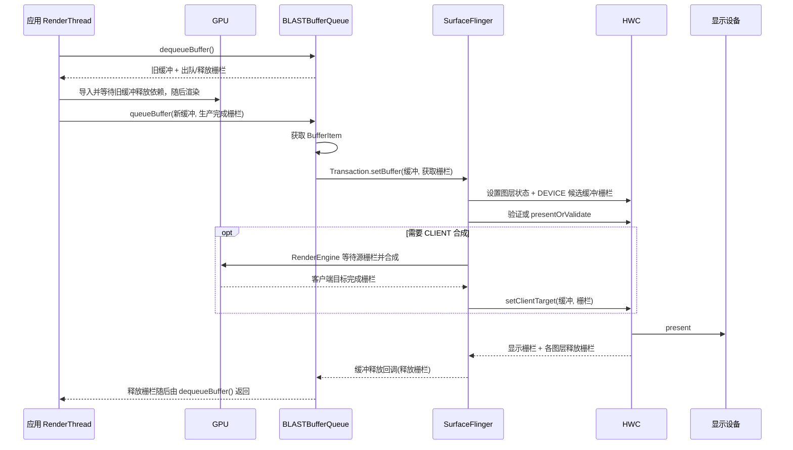

# 2.16 Sync Fence 框架与帧同步机制

栅栏是异步工作的完成凭证。它不保存像素、不拥有 BufferQueue 槽位，也不让两个线程自动互斥；它只表达一条依赖：“在这项工作完成前，后续访问不能越过这个点。”

Android 图形链路需要栅栏，因为 CPU、GPU、相机 ISP、编解码器、SurfaceFlinger、HWC 和显示控制器可以并行工作。生产者可以先把缓冲与栅栏交给消费者，再让 GPU 继续写；消费者也可以先安排显示，再返回一条稍后才发出信号的释放栅栏。这样既避免 CPU 在每个阶段同步阻塞，也避免消费者读到尚未写完的像素。

分析以 Android 17/API 37、`android-17.0.0_r1` 为平台锚点，内核侧以 `android17-6.18-2026-06_r6` 为锚点。栅栏名称由观察边界决定，同一个同步对象从生产者传到消费者后，角色名称可能变化。

## 1. 栅栏描述完成，不描述开始

一个 fence 通常经历三种状态：

- 待处理：异步工作尚未完成；
- 已发信号：工作已完成，依赖可以继续；
- 错误：工作以错误结束，等待方必须按接口约定处理。

发出信号是单向状态变化。已经发出信号的栅栏不会回到待处理状态。多个帧需要多个完成点；驱动可以在同一执行上下文中用递增序列号表示顺序，但用户空间拿到的 sync_file 文件描述符仍代表一个固定完成条件。

`-1` 在 Android 原生栅栏 API 中通常表示 `NO_FENCE`，即没有待等待的依赖。它不是“未知栅栏”或错误文件描述符。具体函数仍要以其参数约定为准。

## 2. Android 17 的三层实现

### 2.1 内核：dma-fence

`struct dma_fence` 是内核中的跨驱动完成原语。Android 17 内核的 `drivers/dma-buf/dma-fence.c` 定义了上下文、序列号、信号、错误、时间戳、回调与等待语义。

同一上下文中的栅栏按序列号完全有序；不同上下文可能来自独立 GPU 引擎、显示管线或编解码器队列，不能只比较序列号大小。驱动还必须保证栅栏在合理时间内结束，并提供挂起恢复或强制完成策略，防止等待永久卡住内存管理和其他设备。

### 2.2 从内核到用户空间：sync_file

`sync_file` 把一个 `dma_fence` 或栅栏集合包装成匿名文件，用户空间通过文件描述符传递、轮询、等待和查询。`drivers/dma-buf/sync_file.c` 的主要职责包括：

- `sync_file_create()`：持有栅栏引用并建立文件；
- `sync_file_get_fence()`：从文件描述符取得栅栏引用；
- `SYNC_IOC_MERGE`：建立新的合并 sync_file；
- `SYNC_IOC_FILE_INFO`：返回 sync_file 名称、整体状态，以及内部栅栏的驱动、时间线、状态与信号时间戳；
- 轮询回调：栅栏发出信号后唤醒等待者。

关闭 sync_file 文件描述符会释放该文件持有的栅栏引用。它不会自动释放 GraphicBuffer，也不会改变 BufferQueue 槽位状态；缓冲和栅栏是两类对象。

### 2.3 Framework：`android::Fence`

`frameworks/native/libs/ui/Fence.cpp` 用 `unique_fd` 管理一个 sync_file 文件描述符：

- `Fence::wait()` 向下调用 `sync_wait()`；
- `waitForever()` 先等 3 秒，超时后打印 fence 信息，再继续无限等待；
- `Fence::merge()` 调用 `sync_merge()`；
- `getSignalTime()` 通过 `sync_file_info()` 读取状态与最晚信号时间戳；
- 扁平化/反扁平化只传 0 或 1 个文件描述符；
- `Fence::NO_FENCE` 内部持有 `-1`。

这层 RAII 能减少框架内的文件描述符泄漏，但跨 API 交接时仍要遵守所有权规则。

## 3. 旧 sync 术语与当前内核对象

Android 官方同步文档仍用 `sync_timeline`、`sync_pt`、`sync_fence` 解释早期模型。它们适合帮助理解“时间线、完成点、完成点集合”，但 Android 17 内核的主线类型已经是 `dma_fence`、`sync_file` 与 `dma_resv`。

| 历史/文档术语 | Android 17 对应理解 |
|---|---|
| `sync_timeline` | 某个执行上下文的有序工作序列；内核栅栏使用上下文/序列号表达 |
| `sync_pt` | 序列中的一个完成点；由具体 `dma_fence` 表达 |
| `sync_fence` | 旧 Android 同步对象名称；现代用户空间边界主要看到 sync_file 文件描述符 |
| `sync_file_info`/`sync_fence_info` | 用户空间查询 sync_file 及其内部栅栏的 UAPI |
| `dma_resv` | 随 dma-buf 保存隐式栅栏集合，和 Android 显式传文件描述符的路径要分开分析 |

Android 8.1 的 `libsync` 已同时处理旧版与新版 ioctl。读历史代码时可以保留旧名；分析 Android 17 跟踪数据时，应以驱动、时间线、上下文、序列号和实际文件描述符流向为准。

## 4. 获取、释放、显示：先看方向

三种名称描述的是接口角色，并非三种不同的 kernel 类。

| 名称 | 谁产生或返回 | 谁等待 | 保护的访问 |
|---|---|---|---|
| 获取栅栏 | 生产者随新缓冲提交 | 消费者、SurfaceFlinger、HWC 或下一处理级 | 生产者对新缓冲的写入尚未完成 |
| 释放栅栏 | 消费者释放旧缓冲时返回 | 生产者再次写旧缓冲前 | 消费者对旧缓冲的读取尚未完成 |
| 显示栅栏 | HWC `present`/`presentDisplay` 每个显示帧返回 | SurfaceFlinger、时间统计与后续显示资源管理 | 本轮显示合成的完成条件 |

### 4.1 生产完成栅栏到消费者侧称为获取栅栏

应用调用 `queueBuffer(buffer, fence)` 时，这条栅栏表示生产者的写入可能仍在进行。`BufferQueueProducer::queueBuffer()` 把 `QueueBufferInput` 中的字段命名为 `acquireFence`，保存到槽位，并随 `BufferItem` 交给消费者。

这里有两个常见说法：

- 从生产者看：GPU 完成栅栏、渲染完成栅栏；
- 从消费者看：获取栅栏，读取缓冲前要遵守的依赖。

两种说法可以指向同一个文件描述符。判断语义时要注明观察方。

### 4.2 消费者释放栅栏到生产者侧称为出队/释放栅栏

`BufferQueueConsumer::releaseBuffer(slot, frameNumber, releaseFence)` 把释放栅栏保存回槽位。之后生产者再次 `dequeueBuffer()` 选中该槽位，`BufferQueueProducer` 把同一字段作为 `outFence` 返回并清空槽位中的引用。

Vulkan、EGL 和 `ANativeWindow` 代码常把这个返回值叫 `dequeue_fence`。它的语义仍是“上一位消费者何时不再使用旧内容”。生产者可以把它导入 GPU 队列，让 GPU 等待；也可以由 CPU 等待，后者会占用调用线程。

### 4.3 显示栅栏的边界

Android 官方文档说明：物理显示的显示栅栏表示当前帧出现在屏幕上的完成点；虚拟显示则表示输出缓冲可以安全读取。它按显示、按帧生成，不是按图层生成的释放栅栏。

显示栅栏很接近显示完成边界，但仍不是面板光学测量值，也不能代替输入到显示延迟测试。可变刷新率、面板扫描与厂商显示管线会影响“用户看到”的细节。

## 5. 一帧中的栅栏流向

下面的图以标准应用窗口的 BLAST 路径为基线，用于区分生产完成、显示消费与旧 buffer 回收。



图中 BLASTBufferQueue 位于应用进程，先作为窗口 BufferQueue 的消费者，再把缓冲与窗口状态放进 `SurfaceControl.Transaction`。`BLASTBufferQueue.cpp` 会复制 `BufferItem.mFence` 作为事务的获取栅栏；SurfaceFlinger 返回释放栅栏后，BLAST 进入 `releaseBufferCallback()`，再调用本地消费者的 `releaseBuffer()`。

Android 17 还为 BLAST 建立了 `BufferReleaseChannel`。SurfaceFlinger 可把回调 ID、释放栅栏和当前最大已获取缓冲数写入通道；应用侧既会非阻塞排空，也能在没有空闲槽位时由 `BBQBufferQueueProducer::waitForBufferRelease()` 做可中断的阻塞读取。旧的事务监听器/完成信息仍参与释放与兜底，排查时不能把所有释放都归成一次同步 Binder 回调。

`SurfaceView`、相机、编解码器和自定义原生生产者可以有不同进程拓扑。三类栅栏的方向仍相同，但生产者、消费者与 IPC 边界要从对应 BufferQueue 和图层确认。相机还会有 HAL 输出获取/释放栅栏，不能用显示栅栏替代相机帧完成信号。

## 6. SurfaceFlinger 与 HWC 的栅栏

SurfaceFlinger 交给 HWC 的图层缓冲和客户端目标都带获取栅栏。HWC 在显示后提供：

- 每层释放栅栏：该层上一张缓冲何时不再被 HWC 使用；
- 显示栅栏：本轮显示帧的完成条件。

Android 17 `HWComposer.cpp` 有两条 present 路径：

1. `presentOrValidate()` 返回状态 1 时，显示已在快路径完成，代码直接保存 `outPresentFence` 并获取释放栅栏；
2. 普通路径在验证/接受后，由 `presentAndGetReleaseFences()` 调用 `present()`，再调用 `getReleaseFences()`。

因此，不能把所有帧固定画成“validate → presentOrValidate → 再 present”。分析跟踪数据时先看 `validateWasSkipped`/PresentSucceeded 语义。

CLIENT 合成还会引入 RenderEngine GPU 工作和客户端目标。图层获取栅栏保护源缓冲；RenderEngine 完成客户端目标的栅栏再交给 HWC。此时跟踪数据里可能同时存在应用 GPU、SurfaceFlinger GPU 与显示栅栏，不能把所有 GPU 栅栏归到应用。

## 7. 栅栏合并的语义

一个操作若依赖两项或更多异步工作，可以合并栅栏。Android 17 `Fence::merge(name, f1, f2)` 调用 `sync_merge()`；内核 `sync_file` 合并操作建立一个新文件，并通过 `dma_fence_unwrap_merge()` 组合输入栅栏。

合并后的依赖在所有输入完成后才满足。原输入 sync_file 仍独立有效，合并操作不会替调用者关闭它们。输入之一为 `NO_FENCE` 时，框架会用另一条有效栅栏与自身合并，从而获得指定名称的新栅栏；两条都无效时返回 `NO_FENCE`。

合并适合表达“等待所有前置工作”，但不应无条件合并整条显示管线：

- HWC 图层释放栅栏本来就按图层生成；
- 显示栅栏按显示生成；
- 为了方便只保留一个文件描述符而合并无关栅栏，会扩大等待范围并掩盖慢依赖；
- 调试名称、驱动/时间线与内部栅栏列表要保留，便于定位哪一项最晚发出信号。

## 8. EGL 与 Vulkan 怎样桥接原生栅栏

### 8.1 EGL

`EGL_ANDROID_native_fence_sync` 能把 Android 原生栅栏文件描述符包装成 `EGLSyncKHR`，也能从 EGL 同步对象导出文件描述符。`EGL_KHR_wait_sync`/`EGL_ANDROID_wait_sync` 允许 GPU 等待，减少 CPU 阻塞。

Android 17 HWUI 的 `EglManager::createReleaseFence()` 优先创建 `EGL_SYNC_NATIVE_FENCE_ANDROID`，`glFlush()` 后通过 `eglDupNativeFenceFDANDROID()` 导出文件描述符。设备不支持原生栅栏、但支持普通 EGL 栅栏同步时，`SkiaOpenGLPipeline::flush()` 会在 CPU 侧等待 EGLSync，然后返回 `-1`，表示同步已经在本地完成。

### 8.2 Vulkan

Android 原生栅栏使用 `VK_EXTERNAL_SEMAPHORE_HANDLE_TYPE_SYNC_FD_BIT` 与 Vulkan 二进制信号量互操作。Android 17 HWUI 展示了两个方向：

- 出队返回的栅栏文件描述符被临时导入二进制 `VkSemaphore`，GPU 在写缓冲前等待；
- Skia 刷新操作发出一个可导出的二进制 `VkSemaphore` 信号，随后用 `vkGetSemaphoreFdKHR()` 取出同步文件描述符并随缓冲提交。

源码中的 `VkSemaphoreCreateInfo` 没有挂 `VkSemaphoreTypeCreateInfo`，因此这条边界使用二进制信号量。变量 `VkDrawResult.presentFence` 最终传给 `presentCurrentBuffer()`，站在 BufferQueue 消费者侧看，它是新缓冲的获取栅栏；它不是 HWC 显示栅栏。

`SYNC_FD` 的导入只支持临时、复制传递载荷。成功调用 `vkImportSemaphoreFdKHR()` 后，文件描述符所有权交给 Vulkan；二进制信号量的等待会消费临时载荷，随后恢复原来的永久载荷。对 `SYNC_FD` 调用 `vkGetSemaphoreFdKHR()` 也具有复制传递的消费语义，不能把同一次信号当成可重复导出的状态。Android 17 HWUI 为每次桥接创建信号量，交给 Skia 等待/发出信号后销毁，避免把一次性载荷当成可复用计数器。

时间线信号量是 Vulkan 1.2 的计数器型同步，可用于应用或引擎内部的多轮队列依赖。Vulkan 1.4.335 规范要求复制传递句柄从二进制信号量导出。因此，时间线信号量不能直接替代 BufferQueue、SurfaceFlinger 与 HWC 的原生栅栏文件描述符协议。设备是否支持时间线特性仍需运行时查询。

## 9. 文件描述符所有权与错误处理

栅栏文件描述符的所有权由每个 API 约定。Android 官方 HAL 约定可以概括为：

- API 把文件描述符提供给调用方时，接收方负责关闭；
- 调用方把文件描述符传给会接管所有权的 API 后，不再关闭；
- 还需要继续使用时，先 `dup()`，再传副本。

`Fence`、`unique_fd`、EGL 和 Vulkan 导入的接管规则不同，不能用一条“调用后总要关闭”覆盖。Android 17 `VulkanManager` 在成功导入临时信号量后，由信号量持有并关闭文件描述符；导入失败的分支显式关闭。

栅栏文件描述符泄漏会消耗文件描述符表并延长栅栏引用寿命，但不等价于 GraphicBuffer 泄漏。BufferQueue 是否把槽位放回空闲集合取决于消费者释放协议；GraphicBuffer 底层存储是否回收取决于句柄、Mapper、附件与缓冲引用。两类问题可以同时出现，也可以互不相关。

错误栅栏也不能按普通信号静默忽略。`sync_file_info.status` 小于 0 表示错误；`Fence::getSignalTime()` 会返回无效值。驱动挂起恢复可能强制完成栅栏并附带错误，等待结束不代表 GPU 输出内容有效。

## 10. Perfetto：先确定谁在等哪条栅栏

栅栏等待是因果链的观察点，并不自动等同于缺陷。先确定等待方、目标栅栏和被保护的缓冲，再看信号发出之前发生了什么。

| 现象 | 初步解释 | 需要补的证据 |
|---|---|---|
| SF/HWC 等图层获取栅栏 | 生产者写入未到完成点 | 应用提交、GPU 渲染阶段、缓冲/帧 ID |
| 应用 `dequeueBuffer()` 变长 | 无可用槽位，或选中槽位的释放栅栏未完成 | 队列深度、释放回调、HWC 图层释放、节拍 |
| 显示栅栏晚 | 显示链路晚 | HWC 验证/显示、显示模式、FrameTimeline |
| CPU 上 `sync_wait` 很长 | 调用线程被同步阻塞 | 调用栈、是否可改为 GPU 侧等待、驱动前进状态 |
| 栅栏已发出信号但帧仍晚 | 同步完成后还有调度、锁存、合成或显示延迟 | 调度、SF 快照、HWC 与显示端 |
| 栅栏长期待处理且驱动无进展 | GPU/显示挂起或依赖环 | 驱动错误、重置、IOMMU 故障、内核日志 |

标准应用窗口还要区分本地 `queueBuffer()` 与 SF 收到 BLAST 事务的时间。`queueBuffer()` 返回只说明帧进入应用侧 BLAST 消费者，不代表 SurfaceFlinger 已看到 BufferTX。

### 10.1 可用的 trace 事件

Android 17 kernel 的 `include/trace/events/dma_fence.h` 定义了 emit、init、destroy、enable_signal、signaled、wait_start 和 wait_end。下面的 Perfetto ftrace 配置用于 userdebug/root 环境验证 fence 生命周期。

```text
data_sources {
  config {
    name: "linux.ftrace"
    ftrace_config {
      ftrace_events: "dma_fence/dma_fence_emit"
      ftrace_events: "dma_fence/dma_fence_signaled"
      ftrace_events: "dma_fence/dma_fence_wait_start"
      ftrace_events: "dma_fence/dma_fence_wait_end"
      atrace_categories: "gfx"
      atrace_categories: "view"
    }
  }
}
```

设备必须先检查 tracefs `available_events`。厂商内核可能裁剪事件，用户构建也可能限制访问。缺少 dma_fence 事件时，可以结合 `gfx` atrace、`FenceMonitor`、BufferQueue/BufferTX、FrameTimeline、GPU 渲染阶段、HWC 切片与内核日志补齐。

### 10.2 四步归因

1. 锁定 Surface/图层、缓冲 ID、槽位和帧号。
2. 标出入队、事务、锁存、验证/显示、释放回调与下一次出队。
3. 找出长等待对应的驱动、时间线、上下文、序列号和信号时刻。
4. 回到信号方之前的 CPU 调度、GPU 队列、HWC、显示或错误事件。

只看等待时长无法区分生产者晚、消费者持有过久、队列堆积、线程抢占或硬件挂起。

## 11. `sw_sync` 的边界

内核 `drivers/dma-buf/sw_sync.c` 提供软件时间线，主要用于测试、自测与受控软件路径。普通应用不应创建可任意发出信号的栅栏去伪造 GPU/HWC 完成；设备节点权限和 SELinux 通常也会阻止这类访问。

测试代码使用 `sw_sync` 时，仍需保证依赖图会向前推进。由用户空间任意决定信号时机的栅栏进入内核资源回收或设备依赖后，容易形成内核无法观察完整因果的死锁。

## 12. 版本演进

### Android 7 / API 24

HWC2 已明确图层/客户端目标获取栅栏、各图层释放栅栏与显示栅栏的接口职责，因此 Android 7 可作为现代基线。

### Android 8–11

libsync 用户空间同时兼容旧 Android 同步 ioctl 与新版 sync_file UAPI；内核主线逐步收敛到 dma-fence/sync_file。Skia 的 GL/Vulkan 后端在这一阶段发展，但具体释放栅栏路径应按对应标签读取。

### Android 12 / API 31

BLAST 与 FrameTimeline 成为现代应用窗口诊断基线。应用 RenderThread 的入队操作先进入进程内 BLAST 消费者，再通过缓冲事务到 SurfaceFlinger；栅栏方向未改变，观察点增加了一层。

### Android 13–16

Composer HAL 向 Stable AIDL 演进，Vulkan、EGL 与原生栅栏互操作继续使用同步文件描述符。时间线信号量适合 Vulkan 内部同步，未替代 Android 显示边界的二进制信号量/sync_file。

### Android 17 / API 37

`android-17.0.0_r1` 的 BufferQueue、BLAST 释放回调、SurfaceFlinger `presentOrValidate` 快路径、HWUI GL/Vulkan 栅栏桥接仍遵循获取、释放、显示三类方向。`android17-6.18-2026-06_r6` 继续以 dma-fence、sync_file 与对应跟踪点提供内核同步基础。Android 17 没有在 16 KB 页大小与栅栏信号延迟之间建立通用性能保证。

## 13. 常见误区

### `queueBuffer()` 的栅栏一定叫释放栅栏

站在生产者局部代码中，它可能被描述为“释放给下一阶段”的栅栏；进入 BufferQueue 消费者后，接口字段与语义是获取栅栏。描述时应注明方向。

### `dequeueBuffer()` 返回的是获取栅栏

代码里常叫出队栅栏，表示该缓冲上一轮消费者访问尚未结束。站在生产者即将写入的视角，它是消费者释放栅栏。

### 显示栅栏等于屏幕每个像素完成发光

它是 HWC/显示协议的完成点。面板扫描与光学响应仍需专用测量。

### 栅栏发出信号后缓冲一定空闲

信号只满足同步依赖。槽位状态、GraphicBuffer 引用、Mapper 句柄、HWC/GPU 缓存与应用对象仍会影响缓冲生命周期。

### 时间线信号量能直接导出 Android 同步文件描述符

`SYNC_FD` 桥接使用二进制信号量。时间线信号量可用于 Vulkan 内部计数同步，不能直接替换原生栅栏文件描述符。

### 长栅栏等待的问题在栅栏框架

栅栏让等待可见。GPU 工作慢、HWC 持有、显示迟到、队列深度、调度延迟与驱动挂起都可能让它变长；根因位于信号方或依赖拓扑时，修改等待本身没有帮助。

## 14. Android 17 源码入口

| 目标 | 源码 |
|---|---|
| 用户空间栅栏等待/合并/信号时间 | `frameworks/native/libs/ui/Fence.cpp` |
| BufferQueue 生产者获取栅栏 | `frameworks/native/libs/gui/BufferQueueProducer.cpp` |
| 消费者释放栅栏回传 | `frameworks/native/libs/gui/BufferQueueConsumer.cpp` |
| BLAST 事务、释放回调与通道 | `frameworks/native/libs/gui/BLASTBufferQueue.cpp`、`BufferReleaseChannel.cpp` |
| HWC 显示/释放栅栏 | `frameworks/native/services/surfaceflinger/DisplayHardware/HWComposer.cpp` |
| HWUI EGL bridge | `frameworks/base/libs/hwui/renderthread/EglManager.cpp` |
| HWUI Vulkan binary semaphore bridge | `frameworks/base/libs/hwui/renderthread/VulkanManager.cpp` |
| 内核栅栏契约 | `drivers/dma-buf/dma-fence.c`、`include/linux/dma-fence.h` |
| sync_file UAPI | `drivers/dma-buf/sync_file.c`、`include/uapi/linux/sync_file.h` |
| 栅栏跟踪点 | `include/trace/events/dma_fence.h` |

## 参考资料

- [Android 同步框架](https://source.android.com/docs/core/graphics/sync)
- [Android 图形架构](https://source.android.com/docs/core/graphics/architecture)
- [Linux DMA-BUF/dma-fence 文档](https://docs.kernel.org/6.18/driver-api/dma-buf.html)
- [Vulkan 1.4.335 同步规范](https://github.com/KhronosGroup/Vulkan-Docs/blob/v1.4.335/chapters/synchronization.adoc)
