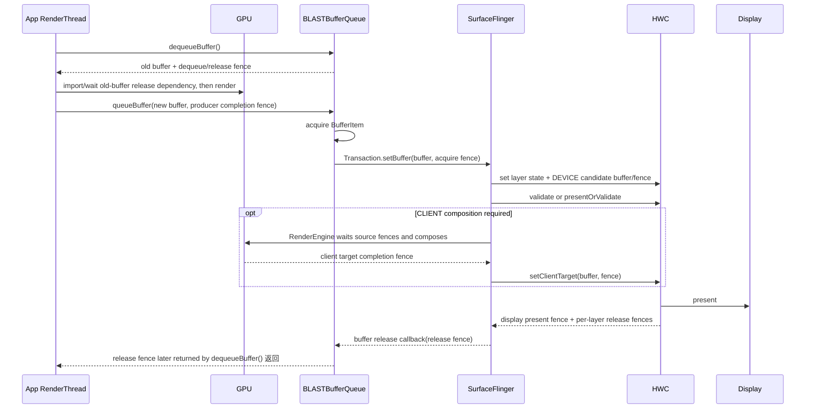

# 2.16 Sync Fence 框架与帧同步机制

Fence（同步栅栏）是异步工作的完成凭证。它不保存像素、不拥有 BufferQueue slot，也不让两个线程自动互斥；它只表达一条依赖：“在这项工作完成前，后续访问不能越过这个点。”

Android 图形链路需要 fence，因为 CPU、GPU、Camera ISP（Image Signal Processor，图像信号处理器）、codec（编解码器）、SurfaceFlinger、HWC（Hardware Composer，硬件合成器）和 display controller（显示控制器）可以并行工作。Producer（生产者）可以先把 buffer 与 fence 交给 consumer（消费者），再让 GPU 继续写；consumer 也可以先安排显示，再返回一条稍后才 signal（发出完成信号）的 release fence。这样既避免 CPU 在每个阶段同步阻塞，也避免 consumer 读到尚未写完的像素。

分析以 Android 17/API 37、`android-17.0.0_r1` 为平台锚点，内核侧以 `android17-6.18-2026-06_r6` 为锚点。fence 名称由观察边界决定，同一个同步对象从 producer 传到 consumer 后，角色名称可能变化。

## 1. Fence 描述完成，不描述开始

一个 fence 通常经历三种状态：

- pending（等待中）：异步工作尚未完成；
- signaled（已发出信号）：工作已完成，依赖可以继续；
- error（错误）：工作以错误结束，等待方必须按接口约定处理。

signal 是单向状态变化。已经 signal 的 fence 不会回到 pending。多个 frame（帧）需要多个完成点；驱动可以在同一 execution context（执行上下文）中用递增 seqno（sequence number，序列号）表示顺序，但用户空间拿到的 sync_file fd 仍代表一个固定完成条件。

`-1` 在 Android native fence API 中通常表示 `NO_FENCE`，即没有待等待的依赖。它不是“未知 fence”或错误 fd。具体函数仍要以其参数约定为准。

## 2. Android 17 的三层实现

### 2.1 内核：dma-fence

`struct dma_fence` 是内核中跨驱动的基础同步对象。Android 17 内核的 `drivers/dma-buf/dma-fence.c` 定义了 context（执行上下文）、seqno、signal、error、timestamp（时间戳）、callback（回调）与 wait（等待）语义。

同一 context 中的 fence 按 seqno 完全有序；不同 context 可能来自独立的 GPU engine（执行引擎）、display pipeline（显示管线）或 codec queue（编解码队列），不能只比较 seqno 大小。驱动还必须保证 fence 在合理时间内结束，并提供 hang recovery（挂起恢复）或强制完成策略，防止等待永久卡住内存管理和其他设备。

### 2.2 从内核到用户空间：sync_file

`sync_file` 把一个 `dma_fence` 或 fence 集合包装成匿名文件，用户空间通过 fd 传递，并用 poll（等待 fd 状态变化）、wait 和查询接口观察它。`drivers/dma-buf/sync_file.c` 的主要职责包括：

- `sync_file_create()`：持有 fence 引用并建立文件对象；
- `sync_file_get_fence()`：从 fd 取得 fence 引用；
- `SYNC_IOC_MERGE`：建立新的合并 sync_file；
- `SYNC_IOC_FILE_INFO`：返回 sync_file 名称、整体状态，以及内部 fence 的 driver（驱动）、timeline（时间线）、状态与 signal timestamp；
- poll callback：fence signal 后唤醒等待者。

关闭 sync_file fd 会释放该文件对象持有的 fence 引用。它不会自动释放 GraphicBuffer，也不会改变 BufferQueue slot 状态；buffer 和 fence 是两类对象。

### 2.3 Framework：`android::Fence`

`frameworks/native/libs/ui/Fence.cpp` 用 `unique_fd` 管理一个 sync_file fd。`unique_fd` 会在对象离开作用域时自动关闭 fd，减少遗漏释放：

- `Fence::wait()` 向下调用 `sync_wait()`；
- `waitForever()` 先等 3 秒，超时后打印 fence 信息，再继续无限等待；
- `Fence::merge()` 调用 `sync_merge()`；
- `getSignalTime()` 通过 `sync_file_info()` 读取状态与最晚 signal timestamp；
- flatten/unflatten（序列化/反序列化）只传 0 或 1 个 fd；
- `Fence::NO_FENCE` 内部持有 `-1`。

这种 RAII（资源获取即初始化，由对象生命周期自动管理资源）封装能减少 framework 内的 fd 泄漏，但跨 API 交接时仍要遵守所有权规则。

## 3. 旧 sync 术语与当前内核对象

Android 官方同步文档仍用 `sync_timeline`、`sync_pt`、`sync_fence` 解释早期模型。它们适合帮助理解“时间线、完成点、完成点集合”，但 Android 17 内核的主线类型已经是 `dma_fence`、`sync_file` 与 `dma_resv`。

| 历史/文档术语 | Android 17 对应理解 |
|---|---|
| `sync_timeline` | 某个执行上下文的有序工作序列；内核 fence 使用 context/seqno 表达 |
| `sync_pt` | 序列中的一个完成点；由具体 `dma_fence` 表达 |
| `sync_fence` | 旧 Android sync 对象名称；现代用户空间边界主要看到 sync_file fd |
| `sync_file_info`/`sync_fence_info` | 用户空间查询 sync_file 及其内部 fence 的 UAPI（用户空间与内核之间的接口） |
| `dma_resv` | 随 dma-buf 保存 implicit fence（驱动隐式关联的 fence）集合，和 Android 显式传 fd 的路径要分开分析 |

Android 8.1 的 `libsync` 已同时处理旧、新两套 ioctl（设备控制调用）。读历史代码时可以保留旧名；分析 Android 17 trace 时，应以 driver、timeline、context、seqno 和实际 fd 流向为准。

## 4. Acquire、release、present：先看方向

三种名称描述的是接口角色，并非三种不同的内核类型。

| 名称 | 谁产生或返回 | 谁等待 | 保护的访问 |
|---|---|---|---|
| acquire fence（获取栅栏） | producer 随新 buffer 提交 | consumer、SurfaceFlinger、HWC 或下一处理级 | producer 对新 buffer 的写入尚未完成 |
| release fence（释放栅栏） | consumer 释放旧 buffer 时返回 | producer 再次写旧 buffer 前 | consumer 对旧 buffer 的读取尚未完成 |
| present fence（显示栅栏） | HWC `present`/`presentDisplay` 每个显示帧返回 | SurfaceFlinger、时间统计与后续显示资源管理 | 本轮显示合成的完成条件 |

### 4.1 生产完成点到 consumer 侧叫 acquire fence

应用调用 `queueBuffer(buffer, fence)` 时，这条 fence 表示 producer 的写入可能仍在进行。`BufferQueueProducer::queueBuffer()` 把 `QueueBufferInput` 中的字段命名为 `acquireFence`，保存到 slot，并随 `BufferItem` 交给 consumer。

这里有两个常见说法：

- 从 producer 看：GPU completion fence 或 render-done fence，即 GPU 渲染完成栅栏；
- 从 consumer 看：acquire fence，读取 buffer 前要遵守的依赖。

两种说法可以指向同一个 fd。判断语义时要注明观察方。

### 4.2 Consumer 释放后，producer 侧拿到 dequeue/release fence

`BufferQueueConsumer::releaseBuffer(slot, frameNumber, releaseFence)` 把 release fence 保存回 slot。之后 producer 再次 `dequeueBuffer()` 选中该 slot，`BufferQueueProducer` 把同一字段作为 `outFence` 返回并清空 slot 中的引用。

Vulkan、EGL 和 `ANativeWindow` 代码常把这个返回值叫 `dequeue_fence`。它的语义仍是“上一位 consumer 何时不再使用旧内容”。Producer 可以把它导入 GPU queue（命令队列），让 GPU 等待；也可以让 CPU 同步等待，后者会占用调用线程。

### 4.3 Present fence 的边界

Android 官方文档说明：物理显示的 present fence 表示当前帧出现在屏幕上的完成点；虚拟显示则表示 output buffer（输出 buffer）可以安全读取。它按显示、按帧生成，不是逐图层的 release fence。

present fence 很接近显示完成边界，但仍不是面板光学测量值，也不能代替输入到显示延迟测试。可变刷新率、panel scanout（面板逐行扫描输出）与厂商显示管线会影响“用户看到”的具体时刻。

## 5. 一帧中的 fence 流向

下面的图以标准应用窗口的 BLAST 路径为基线，用于区分生产完成、显示消费与旧 buffer 回收。



图中 BLASTBufferQueue 位于应用进程，先作为窗口 BufferQueue 的 consumer，再把 buffer 与窗口状态放进 `SurfaceControl.Transaction`。`BLASTBufferQueue.cpp` 会复制 `BufferItem.mFence`，作为这次 transaction（窗口状态事务）的 acquire fence；SurfaceFlinger 返回 release fence 后，BLAST 进入 `releaseBufferCallback()`，再调用本地 consumer 的 `releaseBuffer()`。

Android 17 还为 BLAST 建立了 `BufferReleaseChannel`。SurfaceFlinger 可把 callback ID（用于匹配回调的编号）、release fence 和当前最大 acquired buffer（已被 consumer 取得的 buffer）数量写入 channel；应用侧既会用非阻塞 drain（持续读取到暂时无数据），也能在没有空闲 slot 时由 `BBQBufferQueueProducer::waitForBufferRelease()` 做可中断的阻塞读取。旧的 transaction listener（事务监听器）和 completion（完成通知）信息仍参与释放与兜底，排查时不能把所有 release 都归成一次同步 Binder callback。

`SurfaceView`、Camera、codec 和自定义 native producer 可以有不同的进程连接关系。三类 fence 的方向仍相同，但 producer、consumer 与 IPC 边界要从对应 BufferQueue 和 layer 确认。Camera 还会有 HAL（硬件抽象层）输出的 acquire/release fence，不能用 display present fence 代替 camera frame completion（相机帧处理完成点）。

## 6. SurfaceFlinger 与 HWC 的 fence

SurfaceFlinger 交给 HWC 的 layer buffer 和 client target 都带 acquire fence。HWC 在 present 后提供：

- 每层 release fence：该层上一张 buffer 何时不再被 HWC 使用；
- display present fence：本轮 display frame 的 present 完成条件。

Android 17 `HWComposer.cpp` 有两条 present 路径：

1. `presentOrValidate()` 返回 state 1 时，present 已在快路径完成，代码直接保存 `outPresentFence` 并获取 release fences；
2. 普通路径在 validate/accept 后，由 `presentAndGetReleaseFences()` 调用 `present()`，再调用 `getReleaseFences()`。

因此，不能把所有帧固定画成“validate → presentOrValidate → 再 present”。分析 trace 时先看 `validateWasSkipped` 和 `PresentSucceeded` 的含义。

CLIENT composition（由 SurfaceFlinger 的 RenderEngine/GPU 完成合成）还会引入 RenderEngine GPU 工作和 client target（交给显示系统的 GPU 合成结果）。Layer acquire fence 保护源 buffer；RenderEngine 完成 client target 的 fence 再交给 HWC。此时 trace 里可能同时存在应用 GPU、SurfaceFlinger GPU 与 display fence，不能把所有 GPU fence 归到应用。

## 7. Fence merge 的语义

一个操作若依赖两项或更多异步工作，可以合并 fence。Android 17 `Fence::merge(name, f1, f2)` 调用 `sync_merge()`；内核的 `sync_file` merge 会建立一个新文件对象，并通过 `dma_fence_unwrap_merge()` 组合输入 fence。

合并后的依赖在所有输入完成后才满足。原输入 sync_file 仍独立有效，merge 不会替调用者关闭它们。输入之一为 `NO_FENCE` 时，framework 会用另一条有效 fence 与自身 merge，从而获得指定名称的新 fence；两条都无效时返回 `NO_FENCE`。

merge 适合表达“等待所有前置工作”，但不应无条件合并整条显示管线：

- HWC layer release fence 本来就按 layer 生成；
- present fence 按 display 生成；
- 为了方便只保留一个 fd 而合并无关 fence，会扩大等待范围并掩盖慢依赖；
- 调试名称、driver、timeline 与内部 fence 列表要保留，便于定位哪一项最晚发出信号。

## 8. EGL 与 Vulkan 怎样桥接 native fence

### 8.1 EGL

`EGL_ANDROID_native_fence_sync` 能把 Android native fence fd 包装成 `EGLSyncKHR`，也能从 EGL 同步对象导出 fd。`EGL_KHR_wait_sync`/`EGL_ANDROID_wait_sync` 允许把等待提交给 GPU，减少 CPU 线程阻塞。

Android 17 HWUI（Android 的硬件加速 UI 渲染库）的 `EglManager::createReleaseFence()` 优先创建 `EGL_SYNC_NATIVE_FENCE_ANDROID`，`glFlush()` 后通过 `eglDupNativeFenceFDANDROID()` 导出 fd。设备不支持 native fence、但支持普通 EGL fence sync 时，`SkiaOpenGLPipeline::flush()` 会在 CPU 侧等待 EGLSync，然后返回 `-1`，表示同步已经在本地完成。

### 8.2 Vulkan

Android native fence 使用 `VK_EXTERNAL_SEMAPHORE_HANDLE_TYPE_SYNC_FD_BIT` 与 Vulkan binary semaphore（二值信号量，状态只有未触发和已触发）互操作。Android 17 HWUI 展示了两个方向：

- dequeue 返回的 fence fd 被临时导入 binary `VkSemaphore`，GPU 在写 buffer 前等待；
- Skia flush 触发一个可导出的 binary `VkSemaphore`，随后用 `vkGetSemaphoreFdKHR()` 取出 sync fd，随 buffer 提交。

源码中的 `VkSemaphoreCreateInfo` 没有挂接 `VkSemaphoreTypeCreateInfo`，因此这条边界使用 binary semaphore。变量 `VkDrawResult.presentFence` 最终传给 `presentCurrentBuffer()`；站在 BufferQueue consumer 侧看，它是新 buffer 的 acquire fence，并非 HWC 的 display present fence。

`SYNC_FD` 的 import 只支持 temporary import（临时导入）和 copy transference（句柄携带当次同步状态，供一次性交接）语义；这里的 payload 指信号量内部携带的同步状态。成功调用 `vkImportSemaphoreFdKHR()` 后，fd 所有权交给 Vulkan；binary semaphore 的 wait 会消费临时 payload，随后恢复信号量原来的 permanent payload（永久同步状态）。对 `SYNC_FD` 调用 `vkGetSemaphoreFdKHR()` 同样会消费当次可导出的状态，不能把同一次 signal 当成可重复导出的状态。Android 17 HWUI 会为每次桥接创建 semaphore，交给 Skia wait/signal 后销毁，避免把一次性 payload 当成可复用计数器。

Timeline semaphore（时间线信号量）是 Vulkan 1.2 的计数器型同步，可用于应用或引擎内部的多轮 queue 依赖。Vulkan 1.4.335 规范要求具有 copy-transference 语义的 handle 从 binary semaphore 导出。因此，时间线信号量不能直接替代 BufferQueue、SurfaceFlinger 与 HWC 的 native fence fd 协议。设备是否支持 timeline feature（时间线信号量能力）仍需在运行时查询。

## 9. fd 所有权与错误处理

Fence fd 的所有权由每个 API 约定。这里的“所有权”指谁负责最终调用 `close()`。Android 官方 HAL 约定可以概括为：

- API 把 fd 提供给调用方时，接收方负责关闭；
- 调用方把 fd 传给会接管所有权的 API 后，不再自行关闭；
- 还需要继续使用时，先 `dup()`，再传副本。

`Fence`、`unique_fd`、EGL 和 Vulkan import 的接管规则不同，不能用一条“调用后总要关闭”覆盖。Android 17 `VulkanManager` 在成功导入 temporary semaphore 后，由 semaphore 持有并关闭 fd；导入失败的分支则显式关闭。

Fence fd 泄漏会占用进程的 fd 表项，并延长 fence 引用寿命，但不等价于 GraphicBuffer 泄漏。BufferQueue 是否把 slot 放回空闲集合取决于 consumer release 协议；GraphicBuffer backing storage（底层存储）是否回收取决于 handle、Mapper、设备 attachment（接入关系）与 buffer 引用。两类问题可以同时出现，也可以互不相关。

error fence 也不能按普通 signal 静默忽略。`sync_file_info.status` 小于 0 表示 error；`Fence::getSignalTime()` 会返回 invalid（无有效时间）。驱动的 hang recovery 可能强制结束 fence 并附带错误，等待结束不代表 GPU 输出内容有效。

## 10. Perfetto：先确定谁在等哪条 fence

Fence wait 是因果链的观察点，并不自动等同于 bug。先确定 waiter（正在等待的线程或设备）、目标 fence 和被保护的 buffer，再看 signal 之前发生了什么。

| 现象 | 初步解释 | 需要补的证据 |
|---|---|---|
| SF/HWC 等 layer acquire fence | producer 写入未到完成点 | 应用 submit（提交）、GPU Render Stages（GPU 阶段轨道）、buffer ID |
| App `dequeueBuffer()` 变长 | 无可用 slot，或选中 slot 的 release fence 未完成 | queue depth（队列深度）、release callback、HWC layer release、pacing（帧节奏控制） |
| present fence 晚 | display present 链路晚 | HWC validate/present、display mode、FrameTimeline（系统帧时间线） |
| CPU 上 `sync_wait` 很长 | 调用线程被同步阻塞 | 调用栈、是否可改为 GPU-side wait（由 GPU 等待）、driver forward progress（驱动是否持续推进） |
| fence 已 signal 但帧仍晚 | 同步完成后还有调度、latch（锁存新帧）、composition（合成）或 present 延迟 | sched（线程调度）、SF snapshot（SurfaceFlinger 状态快照）、HWC 与 display |
| fence 长期 pending 且 driver 无进展 | GPU/display hang（挂起）或依赖环 | driver error、reset（复位）、IOMMU fault（设备地址映射故障）、内核日志 |

标准应用窗口还要区分本地 `queueBuffer()` 与 SurfaceFlinger 收到 BLAST transaction 的时间。`queueBuffer()` 返回只说明帧进入应用侧 BLAST consumer，不代表 SurfaceFlinger 已看到 BufferTX（buffer transaction，buffer 事务）事件。

### 10.1 可用的 trace 事件

Android 17 内核的 `include/trace/events/dma_fence.h` 定义了 emit、init、destroy、enable_signal、signaled、wait_start 和 wait_end 等 tracepoint（内核跟踪事件点）。下面的 Perfetto ftrace 配置用于在 userdebug 构建或有 root 权限的环境中验证 fence 生命周期。

```text
data_sources {
  config {
    name: "linux.ftrace"
    ftrace_config {
      ftrace_events: "dma_fence/dma_fence_emit"
      ftrace_events: "dma_fence/dma_fence_signaled"
      ftrace_events: "dma_fence/dma_fence_wait_start"
      ftrace_events: "dma_fence/dma_fence_wait_end"
      atrace_categories: "gfx"
      atrace_categories: "view"
    }
  }
}
```

设备必须先检查 tracefs（内核 trace 接口文件系统）中的 `available_events`。厂商内核可能裁剪事件，user build（面向用户发布的系统构建）也可能限制访问。缺少 dma_fence 事件时，可以结合 `gfx` atrace、`FenceMonitor`、BufferQueue/BufferTX、FrameTimeline、GPU Render Stages、HWC slice（时间片段）与内核日志补齐证据。

### 10.2 四步归因

1. 锁定 Surface ID、buffer ID、slot 和 frame number。
2. 标出 queue、transaction、latch、validate/present、release callback 与下一次 dequeue。
3. 找出长 wait 对应的驱动、时间线、上下文、序列号和信号时刻。
4. 回到 signal 方之前的 CPU 调度、GPU queue、HWC、display 或 error 事件。

只看 wait duration（等待时长）无法区分 producer 晚、consumer 持有过久、queue-stuffing（持续入队造成队列积压）、线程抢占或硬件 hang。

## 11. `sw_sync` 的边界

内核的 `drivers/dma-buf/sw_sync.c` 提供软件 timeline，主要用于测试、selftest（内核自测试）与受控软件路径。普通应用不应创建可任意 signal 的 fence 去伪造 GPU/HWC 完成；设备节点权限和 SELinux 通常也会阻止这类访问。

测试代码使用 `sw_sync` 时，仍需保证依赖图会向前推进。由用户空间任意决定 signal 的 fence 进入内核资源回收或设备依赖后，容易形成内核无法观察完整因果关系的死锁。

## 12. 版本演进

### Android 7 / API 24

HWC2 已明确 layer/client target acquire fence、逐图层 release fence 与 display present fence 的接口职责，因此这里以 Android 7 作为现代基线。

### Android 8–11

用户空间的 libsync 同时兼容旧 Android sync ioctl 与较新的 sync_file UAPI；内核主线逐步收敛到 dma-fence/sync_file。Skia 的 GL/Vulkan 后端在这一阶段持续演进，但具体 release fence 路径应按对应源码 tag（版本标签）读取。

### Android 12 / API 31

BLAST 与 FrameTimeline 成为现代应用窗口诊断基线。应用 RenderThread 的 queue 先进入进程内 BLAST consumer，再通过 buffer transaction 到 SurfaceFlinger；fence 方向未改变，观察点增加了一层。

### Android 13–16

Composer HAL 向 Stable AIDL（可跨版本稳定通信的 AIDL 接口）演进，Vulkan、EGL 与 native fence 互操作继续使用 sync fd。Timeline semaphore 适合 Vulkan 内部同步，未替代 Android 显示边界的 binary semaphore/sync_file。

### Android 17 / API 37

`android-17.0.0_r1` 的 BufferQueue、BLAST release callback、SurfaceFlinger `presentOrValidate` 快路径、HWUI GL/Vulkan fence 桥接仍遵循 acquire、release、present 三类方向。`android17-6.18-2026-06_r6` 继续以 dma-fence、sync_file 与对应 tracepoint 提供内核同步基础。Android 17 没有在 16 KB page size（内存页大小）与 fence signal latency（发出信号的延迟）之间建立通用性能保证。

## 13. 常见误区

### `queueBuffer()` 的 fence 一定叫 release fence

站在 producer 局部代码中，它可能被描述为“释放给下一阶段”的 fence；进入 BufferQueue consumer 后，接口字段与语义是 acquire fence。描述时应注明方向。

### `dequeueBuffer()` 返回的是 acquire fence

代码里常叫 dequeue fence，表示该 buffer 上一轮 consumer 访问尚未结束。站在 producer 即将写入的视角，它是 consumer release fence。

### Present fence 等于屏幕每个像素完成发光

它是 HWC/display 协议的完成点。面板扫描与光学响应仍需专用测量。

### Fence signal 后 buffer 一定释放

signal 只满足同步依赖。slot 状态、GraphicBuffer 引用、Mapper handle、HWC/GPU cache 与应用对象仍会影响 buffer 生命周期。

### Timeline semaphore 能直接导出 Android sync fd

`SYNC_FD` 桥接使用 binary semaphore。Timeline semaphore 可用于 Vulkan 内部计数同步，不能直接替换 native fence fd。

### Fence wait 很长就是 Fence 框架的问题

Fence 让等待过程变得可见。GPU 工作慢、HWC 持有、display 迟到、queue 深度、调度延迟与 driver hang 都可能让它变长；根因位于 signal 方或依赖关系时，修改 wait 本身没有帮助。

## 14. Android 17 源码入口

| 目标 | 源码 |
|---|---|
| 用户空间 Fence 的 wait/merge/signal time | `frameworks/native/libs/ui/Fence.cpp` |
| BufferQueue producer acquire fence | `frameworks/native/libs/gui/BufferQueueProducer.cpp` |
| consumer release fence 回传 | `frameworks/native/libs/gui/BufferQueueConsumer.cpp` |
| BLAST transaction、release callback 与 channel | `frameworks/native/libs/gui/BLASTBufferQueue.cpp`、`BufferReleaseChannel.cpp` |
| HWC present/release fence | `frameworks/native/services/surfaceflinger/DisplayHardware/HWComposer.cpp` |
| HWUI EGL bridge | `frameworks/base/libs/hwui/renderthread/EglManager.cpp` |
| HWUI Vulkan binary semaphore bridge | `frameworks/base/libs/hwui/renderthread/VulkanManager.cpp` |
| 内核 fence 约定 | `drivers/dma-buf/dma-fence.c`、`include/linux/dma-fence.h` |
| sync_file UAPI | `drivers/dma-buf/sync_file.c`、`include/uapi/linux/sync_file.h` |
| fence tracepoints | `include/trace/events/dma_fence.h` |

## 参考资料

- [Android synchronization framework](https://source.android.com/docs/core/graphics/sync)
- [Android graphics architecture](https://source.android.com/docs/core/graphics/architecture)
- [Linux DMA-BUF / dma-fence documentation](https://docs.kernel.org/6.18/driver-api/dma-buf.html)
- [Vulkan 1.4.335 synchronization specification](https://github.com/KhronosGroup/Vulkan-Docs/blob/v1.4.335/chapters/synchronization.adoc)
