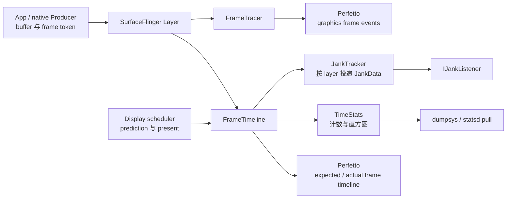

# 2.52 Android 17 帧诊断：FrameTimeline、FrameTracer、TimeStats 与 JankTracker

Android 17 的 SurfaceFlinger 同时维护多套帧观测机制。它们共享 layer、frame、fence 和 present 等输入，但职责并不相同：

- `FrameTimeline` 建立 expected/actual 时间线，完成 SurfaceFrame 与 DisplayFrame 的 jank 分类，并写入 Perfetto。
- `FrameTracer` 记录 buffer 的 dequeue、queue、acquire、latch、composition 和 present 事件。
- `TimeStats` 把逐帧结果聚合成计数与直方图，供 `dumpsys` 和 statsd pull atom 使用。
- `JankTracker` 保存 `FrameTimeline` 已经算好的 `JankData`，再批量通知注册到指定 layer 的 listener。

如果把四者画成一条线，很容易得出错误结论。例如，`JankTracker` 的批量发送不会延迟 jank 分类；`FrameTracer` 的 `GPU_*` phase 也不能直接证明 GPU shader 执行了多久。本章先把四者拆开，再说明怎样用它们复原同一帧。

工具选择与采集入口见 §2.15，FrameTimeline 的 proto 与 Trace Processor 表结构见 §2.32，GPU render stage、counter、frequency 和 memory 数据源见 §2.51。本章只处理 SurfaceFlinger 帧诊断机制及它们之间的数据关系。

## 1. 四套机制怎样分工

下面这张关系图用于确认数据从哪里产生、在哪里分类、最终由谁消费。



图中的两条 Perfetto 输出彼此独立。`FrameTimeline` 负责 deadline、present 和 jank 语义；`FrameTracer` 负责 buffer 生命周期节点。`TimeStats` 与 `JankTracker` 都接收 `FrameTimeline` 的分类结果，但一个做长期聚合，一个做 listener 通知。

| 机制 | 核心对象 | 输出 | 最适合回答的问题 |
|---|---|---|---|
| `FrameTimeline` | `SurfaceFrame`、`DisplayFrame` | `expected_frame_timeline_slice`、`actual_frame_timeline_slice` | 哪一帧偏离了预测；先由 App 侧还是 display 侧暴露异常 |
| `FrameTracer` | layer、buffer id、frame number、fence | `frame_slice` 与 `graphics_frame_event` track | buffer 在 queue、acquire、latch、present 哪一段停留 |
| `TimeStats` | refresh/render rate bucket、layer/UID、时间差直方图 | `dumpsys SurfaceFlinger --timestats`、statsd atoms | 一段时间内异常是否具有统计趋势 |
| `JankTracker` | layer id、`JankData`、listener | `IJankListener::onJankData()` | 已分类帧怎样交给 layer listener |

## 2. FrameTimeline：分类发生在这里

### 2.1 SurfaceFrame 与 DisplayFrame

`FrameTimeline` 用两类对象表达一帧：

- `SurfaceFrame` 描述一个应用或 transaction 关联的 surface 更新。它有 `surface_frame_token`，还会关联最终采用它的 `display_frame_token`。
- `DisplayFrame` 描述 SurfaceFlinger 为一次显示周期组织的合成与 present。一条 DisplayFrame 可以包含多个进程、多个 layer 的 SurfaceFrame。

这两个 token 不能当成同一个全程帧号。分析普通 App Window 时，先用进程和 `layer_name` 找 SurfaceFrame，再沿 `display_frame_token` 找显示侧结果。分析 SurfaceView、Camera、Video 或游戏独立 Surface 时，先确认目标 layer 是否有完整的 App FrameTimeline；没有对应 slice 时，应回到 Producer queue、`BufferTX`、fence、latch 和 present。

### 2.2 expected、actual 与分类输入

expected timeline 是调度器给出的预算，actual timeline 是观测到的执行与呈现区间。Android 17 的 `SurfaceFrame::classifyJankLocked()` 会使用：

- predicted start/end/present；
- actual start/end/present；
- 当前 display refresh rate 与 layer render rate；
- 前一帧的 predicted/actual present；
- `dequeueBuffer` duration；
- DisplayFrame 已判定的 jank 位；
- prediction、display power/mode change、是否 dropped 等状态。

应用侧 experimental 分类在判断 late finish 时，会从 deadline delta 中扣除 `dequeueBuffer` duration。原因是 dequeue 等待属于 buffer 背压，不应简单计入应用完成自身工作的预算。这个修正不等于 dequeue 等待可以忽略：它仍会增加端到端延迟，也可能与 `BufferStuffing` 同时出现。

DisplayFrame 会独立判断 SurfaceFlinger 的开始、结束、GPU fence 和 present。随后 `DisplayFrame::onPresent()` 把显示侧 jank 传给所包含的 SurfaceFrame；应用按时完成但最终 late present 时，显示侧分类可能传播到应用帧。

### 2.3 Android 17 的 jank 类型

`frameworks/native/libs/gui/include/gui/JankInfo.h` 在固定 tag 中定义了这些 bit：

| `JankType` | 代码语义 | 下一步应核对 |
|---|---|---|
| `AppDeadlineMissed` | App 或其 GPU 工作没有在应用 deadline 内完成 | main/RenderThread、producer completion fence、queue 时间 |
| `BufferStuffing` | 前序 buffer 占用预期 present，后续 buffer 排队并增加延迟 | present cadence、queued buffer、dequeue wait、recovery trace |
| `SurfaceFlingerCpuDeadlineMissed` | SF 主线程/HWC 阻塞路径错过 deadline | SF running/runnable、HWC validate/present、锁与 Binder |
| `SurfaceFlingerGpuDeadlineMissed` | SF 使用 GPU composition，CPU 部分按时但 GPU completion 偏晚 | RenderEngine、GPU fence、client composition、GPU workload |
| `DisplayHAL` | SF 按时交给显示侧，最终 present 没赶上目标 VSync | Composer HAL、present fence、display driver 与 mode switch |
| `SurfaceFlingerScheduling` | SF 工作时点与目标 cadence 不匹配 | SF wakeup、scheduler prediction、VSync 对齐 |
| `PredictionError` | 预测 present 与硬件 VSync 出现非 cadence 偏差 | VSync 轨迹、prediction state、display mode |
| `SurfaceFlingerStuffing` | 前一 DisplayFrame 占用当前周期，显示帧形成积压 | 连续 DisplayFrame 的 predicted/actual present |
| `Dropped` | 更新被更晚帧替代，未被呈现 | token、frame number、drop 时点与后继帧 |
| `AppResyncedJitter` | App 因主线程延迟调整了 VSync 时间 | `doFrame` 起点、resync jitter 与主线程负载 |
| `NonAnimating` | late/unknown present 不被当成可感知动画 jank | content priority、动画状态、相邻帧 cadence |
| `DisplayNotOn` / mode、power mode change | 显示关闭或切换状态影响分类 | power/mode change 区间；不要计入普通交互样本 |
| `Unknown` | 输入不足或现有条件不能归因 | present fence、prediction state、缺失的数据源 |

`jank_type` 是 bitmask 的字符串表示，一帧可以同时携带 App 和 display 侧原因。它用于缩小排查范围，不能替代线程、buffer、fence、GPU 和 HWC 证据。

Android 17 代码同时维护 legacy 与 experimental 分类。trace packet 中有主分类和 experimental 字段，`JankData` 也保留 `jankTypeLegacy`、`jankTypeExperimental`。Trace Processor 的公共 `actual_frame_timeline_slice.jank_type` 是主分类；跨版本或跨设备比较时，应记录 platform tag 与相关 flag，避免把不同算法口径混成一组数据。

### 2.4 用 SQL 先找目标帧

下面的查询用于把目标 App 的 actual SurfaceFrame 与 expected SurfaceFrame 对齐，并计算结束时间差。替换包名后，还要根据当前设备的 layer 名称收窄范围。

```sql
WITH app_actual AS (
  SELECT
    a.*,
    p.name AS process_name
  FROM actual_frame_timeline_slice AS a
  LEFT JOIN process AS p USING (upid)
  WHERE a.surface_frame_token != 0
),
app_expected AS (
  SELECT
    upid,
    surface_frame_token,
    ts AS expected_ts,
    dur AS expected_dur
  FROM expected_frame_timeline_slice
  WHERE surface_frame_token != 0
)
SELECT
  a.surface_frame_token,
  a.display_frame_token,
  a.ts AS actual_ts,
  a.dur AS actual_dur,
  e.expected_ts,
  e.expected_dur,
  (a.ts + a.dur) - (e.expected_ts + e.expected_dur) AS overrun_ns,
  a.jank_type,
  a.jank_severity_type,
  a.jank_score,
  a.present_type,
  a.on_time_finish,
  a.gpu_composition,
  a.layer_name
FROM app_actual AS a
LEFT JOIN app_expected AS e
  ON a.upid = e.upid
  AND a.surface_frame_token = e.surface_frame_token
WHERE a.process_name = 'com.example.app'
  AND a.layer_name GLOB '*com.example.app*'
ORDER BY a.ts;
```

`overrun_ns > 0` 只说明 actual end 晚于 expected end。相同 token 可能对应多个 layer 记录，统计前要按目标 layer 过滤或去重。`gpu_composition = 1` 表示该 FrameTimeline 对象涉及 GPU composition，不能据此推出应用 GPU 是根因。

## 3. FrameTracer：观察 buffer 生命周期

### 3.1 Android 17 的真实调用点

`FrameTracer` 注册的数据源名称是 `android.surfaceflinger.frame`。Android 17 的 `Layer.cpp` 在以下位置调用它：

1. `Layer::setBuffer()`：当 transaction 带有有效 `dequeueTime` 时，写入 `DEQUEUE` 和 `QUEUE`。
2. `Layer::latchBufferImpl()`：写入 acquire fence 与 `LATCH`。
3. `Layer::onCompositionPresented()`：
   - 目标 output layer 需要 client composition 时，写入 `FALLBACK_COMPOSITION`；
   - 有 present fence 时等待该 fence；没有有效 fence 但 HWC 提供 present timestamp 时，写入计算后的 present 时点。

因此，Android 17 的现行调用点不会为每个 proto 枚举值都生成事件。`POST`、`HWC_COMPOSITION_QUEUED`、`RELEASE_FENCE` 等类型仍在 `GraphicsFrameEvent` proto 中，但不能在没找到调用点时写成“每帧必有”。

| 当前调用点产生的事件 | 含义 | 常见误读 |
|---|---|---|
| `DEQUEUE` | Producer 开始取得/使用 buffer 的时间锚点 | 不是 Choreographer 帧起点 |
| `QUEUE` | buffer update 通过 transaction 交出 | queue 返回不代表 GPU 与显示都完成 |
| `ACQUIRE_FENCE` | Producer completion fence signal | fence 只说明依赖完成，不自动给出 GPU 函数级根因 |
| `LATCH` | SF 把 buffer 纳入当前 layer 状态 | latch 不等于已经上屏 |
| `FALLBACK_COMPOSITION` | 该 output layer 需要 client composition | 不能仅凭一次 fallback 推断设备永久不支持 overlay |
| `PRESENT_FENCE` | display present fence signal 或 HWC present timestamp | 它是显示侧时间锚点，不是面板像素响应完成证明 |

`traceFence()` 遇到 pending fence 时会把记录保存在 `pendingFences`。后续同一 layer/buffer 的 trace 调用会重新读取 signal time；超过 60 秒的旧 fence 会被丢弃。这里没有常驻轮询线程，也没有“fence 一 signal 就立即写包”的保证。

FrameTracer 只在数据源启用时执行 `DataSource::Trace()` 回调。`mTraceTracker` 是当前 trace 会话使用的 layer/fence 状态，不是常年保存的帧环形历史。源码也没有 `debug.sf.frametracer_full` 这样的 light/full 模式属性。

### 3.2 显式启用数据源

采集前先运行 `adb shell perfetto --query --long`，确认设备公开了所需数据源。下面的最小配置只验证 FrameTracer 与 FrameTimeline 是否有数据；正式分析还应加入目标进程 atrace 和所需 ftrace 事件。

```protobuf
buffers {
  size_kb: 65536
  fill_policy: RING_BUFFER
}
data_sources {
  config {
    name: "android.surfaceflinger.frame"
  }
}
data_sources {
  config {
    name: "android.surfaceflinger.frametimeline"
  }
}
duration_ms: 10000
```

将配置保存为 `sf-frame.pbtxt` 后，可以用下面的命令采集。

```bash
adb push sf-frame.pbtxt /data/local/tmp/sf-frame.pbtxt
adb shell perfetto --txt \
  -c /data/local/tmp/sf-frame.pbtxt \
  -o /data/misc/perfetto-traces/sf-frame.perfetto-trace
adb pull /data/misc/perfetto-traces/sf-frame.perfetto-trace
```

如果 `--query --long` 没有列出某个数据源，空轨迹只能说明当前 build/权限/配置没有提供它，不能说明业务没有发生对应工作。

### 3.3 Trace Processor 怎样解释 GraphicsFrameEvent

`graphics_frame_event_parser.cc` 会生成两组 slice：

- 原始事件 track：`Buffer: <buffer_id> <layer_name>`；
- 阶段 track：
  - `APP_<buffer_id> <layer_name>`：dequeue → queue；
  - `GPU_<buffer_id> <layer_name>`：queue → acquire fence；
  - `SF_<buffer_id> <layer_name>`：latch → present；
  - `Display_<layer_name>`：本次 present → 同 layer 下一次 present。

这些阶段名是 parser 的历史命名。尤其是 `GPU_*`，它表达 queue 到 acquire fence 的等待区间。Producer 可能来自 HWUI、Vulkan、codec、camera 或其他硬件；没有 GPU render stage、driver fence 或 submission 证据时，不能把整段都写成 shader 执行。

Perfetto 的 `frame_slice` 视图提供 `layer_name`、`frame_number`、`queue_to_acquire_time`、`acquire_to_latch_time` 和 `latch_to_present_time`。下面的查询同时显示 track 名，便于区分原始事件与合成阶段。

```sql
SELECT
  f.ts,
  f.dur,
  t.name AS track_name,
  f.name AS event_or_frame,
  f.layer_name,
  f.frame_number,
  f.queue_to_acquire_time,
  f.acquire_to_latch_time,
  f.latch_to_present_time
FROM frame_slice AS f
JOIN track AS t
  ON f.track_id = t.id
WHERE f.layer_name GLOB '*com.example.app*'
ORDER BY f.ts, f.track_id;
```

数值单位是纳秒。缺失事件、无效 fence 或 trace 在阶段中途开始都可能让 phase 不完整；查询结果需要与原始 slice、FrameTimeline 和 layer 状态一起核对。

## 4. TimeStats：把逐帧结果聚合成趋势

### 4.1 TimeStats 收集什么

TimeStats 有两类统计：

- legacy 全局/逐 layer 时序：total/missed frame、client composition、refresh-rate duration、present-to-present、frame duration、RenderEngine duration，以及 post/acquire/latch/desired 到 present 的直方图；
- FrameTimeline jank payload：total timeline frame、janky frame、SF long CPU/GPU、SF/App unattributed、SF scheduling、prediction error、App buffer stuffing，以及 deadline/present delta 直方图。

逐 layer key 包含 UID、layer name、game mode、display refresh-rate bucket 和 render-rate bucket。Android 17 的 bucket 宽度是 30 fps。TimeStats 还记录 late acquire、bad desired present、frame-rate vote 等字段。

`dumpsys` 文本输出的是计数、平均值和固定毫秒 bucket 的直方图。源码没有直接输出 P50/P90/P95/P99，也没有一行 `jankyPercentage`。如果报告需要分位数，应从原始 trace 或可复现的直方图算法计算，并写明精度与样本过滤规则。

### 4.2 正确的 dumpsys 用法

下面这组命令用于建立一个明确的统计窗口。

```bash
adb shell dumpsys SurfaceFlinger --timestats -clear
adb shell dumpsys SurfaceFlinger --timestats -enable

# 在固定刷新率、固定热状态和固定操作脚本下运行测试场景

adb shell dumpsys SurfaceFlinger --timestats -dump -maxlayers 20
adb shell dumpsys SurfaceFlinger --timestats -disable
```

`-dump` 不会自动清空；需要新窗口时显式执行 `-clear`。`TimeStats::parseArgs()` 只识别 `-enable`、`-disable`、`-dump`、`-clear` 和 `-maxlayers`。源码没有 `--dump-depth`，也没有 `debug.sf.timestats.period_seconds` 属性。

### 4.3 statsd pull 并非 TimeStats 内部定时器

`TimeStats::onPullAtom()` 处理两个 atom id：

- `10062`：`SURFACEFLINGER_STATS_GLOBAL_INFO`；
- `10063`：`SURFACEFLINGER_STATS_LAYER_INFO`。

一次 pull 完成后，TimeStats 才调用 `enable()`；所以某个 build 的第一次 pull 可能为空或样本很少。global pull 会清全局聚合，layer pull 会清逐 layer 聚合。pull 周期由 statsd 配置和系统消费者决定，TimeStats.cpp 没有写死“一小时上报一次”。

TimeStats 适合比较稳定场景的分布变化，不适合定位某一帧的线程或 fence。发现 jank 比例上升后，再采集 Perfetto 还原具体 token。

## 5. JankTracker：批量的是通知，不是分类

Android 17 的 `JankTracker` 位于：

```text
frameworks/native/services/surfaceflinger/Jank/JankTracker.{h,cpp}
```

路径是 `Jank/`，并非 `JankTracker/`。它的注释明确说明：维护 frame jank classification 的 backlog，并管理注册的 jank data listener。

`SurfaceFrame::onPresent()` 先在 `FrameTimeline` 中完成分类，然后构造 `gui::JankData`：

- `frameVsyncId`；
- legacy/experimental jank type；
- `frameIntervalNs`；
- `presentDelayNs`；
- `jankScore`；
- scheduled/actual App frame time。

随后才调用 `JankTracker::onJankData(layerId, jd)`。`JankTracker` 的行为是：

1. 没有 listener 时立即返回，避免主线程为常见的无人监听场景安排后台工作；
2. 有 listener 时，把数据交给 low-priority `BackgroundExecutor`；
3. 每个 layer 积累到 `kJankDataBatchSize = 50` 后调用 `doFlushJankData()`；
4. 显式 `flushJankData(layerId)` 也会安排一次发送；
5. listener 返回 `EX_NULL_POINTER` 时移除失效 listener。

固定 tag 中没有 10 帧 batch、100 ms timeout，也没有“批量完成 jank 判定”的实现。50 条只影响 listener 收到回调的时点；Perfetto FrameTimeline 与 TimeStats 使用的分类在此之前已经产生。

## 6. 一次可复用的排查顺序

### 第一步：先确定出图类型与目标 layer

普通 View/Compose App Window、SurfaceView、TextureView、Native/Vulkan、Camera、Video 和游戏可能使用不同 Producer 与 surface。先记录进程、layer id/name、parent、frame number 和 surface/display token。

FrameTimeline 对标准 App Window 覆盖较完整。Perfetto 官方文档仍说明 SurfaceView 不受完整支持；独立 Surface 没有 App actual slice 时，应使用对应 Producer、layer、buffer 和 fence 证据，不能拿宿主窗口 token 代替主体内容帧。

### 第二步：用 FrameTimeline 判断异常较早出现在哪一侧

- App actual late finish：看 main、RenderThread、Producer completion 和 queue。
- App on-time finish，但 DisplayFrame late：看 SF、RenderEngine、HWC 与 present。
- `Buffer Stuffing`：看连续 present cadence、queue 深度、dequeue wait 与 recovery。
- prediction/mode/power 相关分类：先排除显示状态变化样本。

此时只完成初步分区，还没有得到函数级根因。

### 第三步：用 FrameTracer 拆 buffer 停留区间

- dequeue → queue 长：Producer 取得 buffer 后的 CPU/GPU 准备阶段值得检查；
- queue → acquire 长：Producer completion fence 偏晚，继续看对应 GPU/codec/camera 工作；
- acquire → latch 长：检查 transaction readiness、目标 VSync、layer 状态和 SF 调度；
- latch → present 长：检查 composition strategy、RenderEngine/HWC 和 display。

如果目标 layer 没有 FrameTracer 记录，先确认 `android.surfaceflinger.frame` 是否启用、transaction 是否带有效 `dequeueTime`，以及 trace 是否覆盖了完整阶段。

### 第四步：按分类补相应数据源

| 初步现象 | 应增加的证据 | 仍然不能单独下结论的信号 |
|---|---|---|
| main/RenderThread 看起来很长 | `sched_switch`/wakeup、线程状态、CPU frequency、Binder/lock | CPU slice 外框长度 |
| queue → acquire 长 | GPU render stage/counter、submission/fence，或 codec/camera producer trace | 名为 `GPU_*` 的 FrameTracer phase |
| SF GPU deadline missed | RenderEngine、client composition、GPU completion fence | `gpu_composition = 1` |
| DisplayHAL | HWC validate/present、present fence、mode/power change、vendor display trace | 一条晚到的 display slice |
| buffer stuffing | queued/pending buffer、dequeue wait、连续 present、recovery trace | 单独一条 `Buffer Stuffing` |

调度侧若需要核到 kernel，实现锚点固定为 `android17-6.18-2026-06_r6`。通用 kernel 能证明 sched/cpufreq/cpuset 机制；某台设备的 vendor hook、Power HAL 和 thermal 策略仍需该设备源码或 trace。

### 第五步：用 TimeStats 做前后对照

修复前后保持设备、刷新率、温度区间、场景脚本和采样时长一致。比较：

- total timeline frames 与 janky frames；
- refresh/render rate bucket；
- SF long CPU/GPU、App buffer stuffing 等计数；
- post/acquire/latch/present 与 deadline delta 直方图。

样本数不同的时候使用比例并报告分母。直方图 bucket 精度有限，单帧尖刺仍回到 Perfetto。

## 7. 常见误区

### 7.1 FrameTracer 等同于 FrameTimeline

两者的数据源、proto 与 Trace Processor 表都不同。FrameTracer 以 buffer id/frame number 描述生命周期；FrameTimeline 以 surface/display token 描述预算、呈现和 jank。

### 7.2 `GPU_*` phase 就是 GPU 执行时间

该 phase 由 Trace Processor 将 queue → acquire fence 拼成。只有 producer 明确来自 GPU，且能用 submission/render stage/fence 对齐时，才能进一步解释为 GPU completion 路径。

### 7.3 JankTracker 在后台判定 jank

判定已经在 `FrameTimeline` 完成。JankTracker 只缓存并投递结果，50 条 batch 不改变 Perfetto 中的帧分类。

### 7.4 TimeStats 给出精确分位数和根因

Android 17 文本输出是计数与毫秒 bucket 直方图。它适合观察趋势；线程、函数、buffer 和 fence 的责任边界仍由 trace 给出。

### 7.5 App jank 就等于 App CPU 慢

`AppDeadlineMissed` 的结束点包含 `max(gpu completion, post time)` 语义。main/RenderThread CPU、GPU、Producer fence 与 queue 都要检查。`BufferStuffing` 还可能让一帧自身按时完成，却因为前序积压而 late present。

### 7.6 SF GPU jank 就等于应用 shader 慢

`SurfaceFlingerGpuDeadlineMissed` 指向 SF client composition 的 GPU completion。应用 GPU workload 与 SurfaceFlinger RenderEngine 是不同提交者，必须按 context、queue、submission 和 fence 区分。

## 8. 源码跟读顺序

建议按下面的顺序阅读固定 tag：

1. `Scheduler/FrameTimeline.cpp`：从 `DisplayFrame::onPresent()`、`SurfaceFrame::onPresent()` 跟到两套 `classifyJank*()`。
2. `libs/gui/include/gui/JankInfo.h`：确认 jank bit 与注释。
3. `Layer.cpp`：确认 post/acquire/latch/present 怎样分别送入 TimeStats、FrameTimeline 和 FrameTracer。
4. `FrameTracer/FrameTracer.cpp`：确认数据源、pending fence 与 trace packet。
5. Perfetto `graphics_frame_event.proto`、parser 与 `events.sql`：确认 proto 到 `frame_slice` 的转换。
6. `TimeStats/TimeStats.cpp` 与 `TimeStatsHelper.cpp`：确认 dumpsys 参数、statsd atom、清理行为和文本字段。
7. `Jank/JankTracker.cpp`：确认 listener 注册、50 条 batch、显式 flush 与后台投递。

这条阅读顺序能把“系统如何判定”与“工具如何显示”分开。先确认 AOSP 写出了什么，再解释某台设备的一次 trace。

## 9. 小结

Android 17 的帧诊断可以压缩为四个问题：

1. FrameTimeline 显示哪一帧偏离 expected，SurfaceFrame 与 DisplayFrame 谁先暴露异常？
2. FrameTracer 显示 buffer 卡在 dequeue/queue、acquire、latch 还是 present？
3. TimeStats 是否证明这个现象在稳定样本中持续存在？
4. JankTracker listener 收到的是哪一种已分类结果，是否因 batch/flush 产生通知延迟？

答案必须回到同一个进程、layer、token、frame number、buffer 与显示周期。做到这一点，jank type 才是排查入口；缺少这些身份关系时，再完整的工具列表也无法支撑根因结论。
