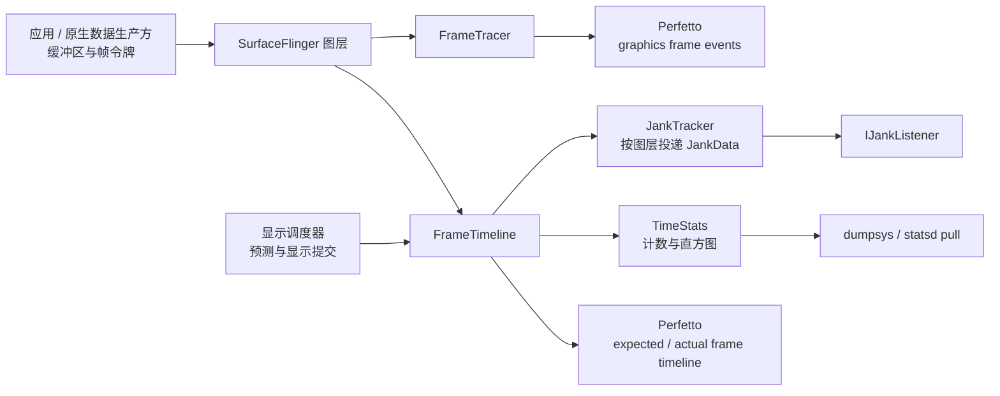

# 2.52 Android 17 帧诊断：FrameTimeline、FrameTracer、TimeStats 与 JankTracker

Android 17 的 SurfaceFlinger 同时维护多套帧观测机制。它们共享图层、帧、围栏和显示提交等输入，但职责各不相同：

- `FrameTimeline` 建立预期与实际时间线，完成 SurfaceFrame 与 DisplayFrame 的卡顿分类，并写入 Perfetto。
- `FrameTracer` 记录缓冲区的出队、入队、获取、锁存、合成和显示提交事件。
- `TimeStats` 把逐帧结果聚合成计数与直方图，供 `dumpsys` 和 statsd 拉取原子使用。
- `JankTracker` 保存 `FrameTimeline` 已经算好的 `JankData`，再批量通知注册到指定图层的监听器。

把四者看成串行步骤会导致错误归因。例如，`JankTracker` 的批量发送不会延迟卡顿分类；`FrameTracer` 的 `GPU_*` 阶段也不能直接证明 GPU 着色器执行了多久。应先区分各自职责，再用共享的帧身份复原同一帧。

工具选择与采集入口见 §2.15，FrameTimeline 的协议与 Trace Processor 表结构见 §2.32，GPU 渲染阶段、计数器、频率和内存数据源见 §2.51。这里集中说明 SurfaceFlinger 帧诊断机制及其数据关系。

## 1. 四套机制怎样分工

下面的关系图区分数据来源、分类位置和最终消费者。



图中的两条 Perfetto 输出彼此独立。`FrameTimeline` 负责截止时间、显示提交和卡顿语义，`FrameTracer` 负责缓冲区生命周期节点。`TimeStats` 与 `JankTracker` 都接收 `FrameTimeline` 的分类结果，前者做长期聚合，后者通知监听器。

| 机制 | 核心对象 | 输出 | 最适合回答的问题 |
|---|---|---|---|
| `FrameTimeline` | `SurfaceFrame`、`DisplayFrame` | `expected_frame_timeline_slice`、`actual_frame_timeline_slice` | 哪一帧偏离了预测；异常先在应用侧还是显示侧暴露 |
| `FrameTracer` | 图层、缓冲区编号、帧号、围栏 | `frame_slice` 与 `graphics_frame_event` 轨道 | 缓冲区在入队、获取、锁存、显示提交的哪一段停留 |
| `TimeStats` | 刷新率/渲染帧率分桶、图层/UID、时间差直方图 | `dumpsys SurfaceFlinger --timestats`、statsd 原子 | 一段时间内异常是否具有统计趋势 |
| `JankTracker` | 图层编号、`JankData`、监听器 | `IJankListener::onJankData()` | 已分类帧如何交给图层监听器 |

## 2. FrameTimeline：分类发生在这里

### 2.1 SurfaceFrame 与 DisplayFrame

`FrameTimeline` 用两类对象表达一帧：

- `SurfaceFrame` 描述一个应用或事务关联的 Surface 更新。它有 `surface_frame_token`，还会关联最终采用它的 `display_frame_token`。
- `DisplayFrame` 描述 SurfaceFlinger 为一次显示周期组织的合成与提交。一条 DisplayFrame 可以包含多个进程、多个图层的 SurfaceFrame。

这两个令牌不能当成同一个全程帧号。分析普通应用窗口时，先用进程和 `layer_name` 找到 SurfaceFrame，再沿 `display_frame_token` 查找显示侧结果。分析 SurfaceView、相机、视频或游戏的独立 Surface 时，先确认目标图层是否有完整的应用 FrameTimeline；没有对应切片时，应回到生产方入队、`BufferTX`、围栏、锁存和显示提交事件。

### 2.2 expected、actual 与分类输入

预期时间线是调度器给出的预算，实际时间线是观测到的执行与呈现区间。Android 17 的 `SurfaceFrame::classifyJankLocked()` 使用以下输入：

- 预测的开始、结束和显示提交时间；
- 实际的开始、结束和显示提交时间；
- 当前显示刷新率与图层渲染帧率；
- 前一帧的预测和实际显示提交时间；
- `dequeueBuffer` 持续时间；
- DisplayFrame 已判定的 jank 位；
- 预测、显示电源/模式切换、是否丢帧等状态。

应用侧实验分类在判断完成超时时，会从截止时间差中扣除 `dequeueBuffer` 持续时间。出队等待属于缓冲区背压，不应直接计入应用完成自身工作的预算。该修正没有消除出队等待的影响：它仍会增加端到端延迟，也可能与 `BufferStuffing` 同时出现。

DisplayFrame 会独立判断 SurfaceFlinger 的开始、结束、GPU 围栏和显示提交。随后，`DisplayFrame::onPresent()` 把显示侧卡顿传给其中的 SurfaceFrame；应用按时完成但最终提交延迟时，显示侧分类可能传播到应用帧。

### 2.3 Android 17 的 jank 类型

`frameworks/native/libs/gui/include/gui/JankInfo.h` 在固定标签中定义了以下标志位：

| `JankType` | 代码语义 | 下一步应核对 |
|---|---|---|
| `AppDeadlineMissed` | 应用或其 GPU 工作没有在截止时间内完成 | 主线程/RenderThread、生产方完成围栏、入队时间 |
| `BufferStuffing` | 前序缓冲区占用预期显示时点，后续缓冲区排队并增加延迟 | 显示节奏、排队缓冲区、出队等待、恢复过程 |
| `SurfaceFlingerCpuDeadlineMissed` | SF 主线程/HWC 阻塞路径错过截止时间 | SF 运行/可运行状态、HWC 验证/提交、锁与 Binder |
| `SurfaceFlingerGpuDeadlineMissed` | SF 使用 GPU 合成，CPU 部分按时但 GPU 完成偏晚 | RenderEngine、GPU 围栏、CLIENT 合成、GPU 工作负载 |
| `DisplayHAL` | SF 按时交给显示侧，最终提交没有赶上目标 VSync | Composer HAL、显示提交围栏、显示驱动与模式切换 |
| `SurfaceFlingerScheduling` | SF 工作时点与目标节奏不匹配 | SF 唤醒、调度器预测、VSync 对齐 |
| `PredictionError` | 预测显示时点与硬件 VSync 出现非周期性偏差 | VSync 轨迹、预测状态、显示模式 |
| `SurfaceFlingerStuffing` | 前一 DisplayFrame 占用当前周期，显示帧形成积压 | 连续 DisplayFrame 的预测和实际显示时点 |
| `Dropped` | 更新被更晚帧替代，未被呈现 | 令牌、帧号、丢弃时点与后继帧 |
| `AppResyncedJitter` | 应用因主线程延迟调整了 VSync 时间 | `doFrame` 起点、重同步抖动与主线程负载 |
| `NonAnimating` | 延迟或未知的显示提交不计为可感知动画卡顿 | 内容优先级、动画状态、相邻帧节奏 |
| `DisplayNotOn` / 模式、电源模式切换 | 显示关闭或状态切换影响分类 | 电源/模式切换区间；不要计入普通交互样本 |
| `Unknown` | 输入不足或现有条件不能归因 | 显示提交围栏、预测状态、缺失的数据源 |

`jank_type` 是位掩码的字符串表示，一帧可以同时携带应用侧和显示侧原因。它用于缩小排查范围，不能替代线程、缓冲区、围栏、GPU 和 HWC 证据。

Android 17 代码同时维护旧版分类与实验分类。跟踪数据包中有主分类和实验字段，`JankData` 也保留 `jankTypeLegacy`、`jankTypeExperimental`。Trace Processor 公共表 `actual_frame_timeline_slice.jank_type` 保存主分类；跨版本或跨设备比较时，应记录平台标签与相关开关，避免混用不同算法口径。

### 2.4 用 SQL 先找目标帧

下面的查询将目标应用的实际 SurfaceFrame 与预期 SurfaceFrame 对齐，并计算结束时间差。替换包名后，还要根据当前设备的图层名称收窄范围。

```sql
WITH app_actual AS (
  SELECT
    a.*,
    p.name AS process_name
  FROM actual_frame_timeline_slice AS a
  LEFT JOIN process AS p USING (upid)
  WHERE a.surface_frame_token != 0
),
app_expected AS (
  SELECT
    upid,
    surface_frame_token,
    ts AS expected_ts,
    dur AS expected_dur
  FROM expected_frame_timeline_slice
  WHERE surface_frame_token != 0
)
SELECT
  a.surface_frame_token,
  a.display_frame_token,
  a.ts AS actual_ts,
  a.dur AS actual_dur,
  e.expected_ts,
  e.expected_dur,
  (a.ts + a.dur) - (e.expected_ts + e.expected_dur) AS overrun_ns,
  a.jank_type,
  a.jank_severity_type,
  a.jank_score,
  a.present_type,
  a.on_time_finish,
  a.gpu_composition,
  a.layer_name
FROM app_actual AS a
LEFT JOIN app_expected AS e
  ON a.upid = e.upid
  AND a.surface_frame_token = e.surface_frame_token
WHERE a.process_name = 'com.example.app'
  AND a.layer_name GLOB '*com.example.app*'
ORDER BY a.ts;
```

`overrun_ns > 0` 只说明实际结束时间晚于预期结束时间。相同令牌可能对应多个图层记录，统计前要按目标图层过滤或去重。`gpu_composition = 1` 表示该 FrameTimeline 对象涉及 GPU 合成，不能据此认定根因位于应用 GPU。

## 3. FrameTracer：观察缓冲区生命周期

### 3.1 Android 17 的真实调用点

`FrameTracer` 注册的数据源名称是 `android.surfaceflinger.frame`。Android 17 的 `Layer.cpp` 在以下位置调用它：

1. `Layer::setBuffer()`：当事务带有有效的 `dequeueTime` 时，写入 `DEQUEUE` 和 `QUEUE`。
2. `Layer::latchBufferImpl()`：写入获取围栏与 `LATCH`。
3. `Layer::onCompositionPresented()`：
   - 目标输出图层需要 CLIENT 合成时，写入 `FALLBACK_COMPOSITION`；
   - 有显示提交围栏时等待该围栏；没有有效围栏但 HWC 提供显示时间戳时，写入计算后的显示时点。

Android 17 的现行调用点不会为协议中的每个枚举值都生成事件。`POST`、`HWC_COMPOSITION_QUEUED`、`RELEASE_FENCE` 等类型仍在 `GraphicsFrameEvent` 协议中，但未找到调用点时不能宣称“每帧必有”。

| 当前调用点产生的事件 | 含义 | 常见误读 |
|---|---|---|
| `DEQUEUE` | 生产方开始取得或使用缓冲区的时间锚点 | 不是 Choreographer 帧起点 |
| `QUEUE` | 缓冲区更新通过事务交出 | 入队返回不代表 GPU 与显示都已完成 |
| `ACQUIRE_FENCE` | 生产方完成围栏触发 | 围栏只说明依赖完成，不会自动给出 GPU 函数级根因 |
| `LATCH` | SF 把缓冲区纳入当前图层状态 | 锁存不等于已经上屏 |
| `FALLBACK_COMPOSITION` | 该输出图层需要 CLIENT 合成 | 不能根据一次回退推断设备始终不支持叠加层 |
| `PRESENT_FENCE` | 显示提交围栏触发或 HWC 提供显示时间戳 | 它是显示侧时间锚点，不能证明面板像素已完成响应 |

`traceFence()` 遇到待触发围栏时，会把记录保存在 `pendingFences`。后续对同一图层和缓冲区的跟踪调用会重新读取触发时间；超过 60 秒的旧围栏会被丢弃。这里没有常驻轮询线程，也不保证围栏触发后立即写入数据包。

FrameTracer 只在数据源启用时执行 `DataSource::Trace()` 回调。`mTraceTracker` 保存当前跟踪会话使用的图层与围栏状态，不是长期保留的帧环形历史。源码也没有 `debug.sf.frametracer_full` 这类轻量/完整模式属性。

### 3.2 显式启用数据源

采集前先运行 `adb shell perfetto --query --long`，确认设备公开了所需数据源。下面的最小配置只验证 FrameTracer 与 FrameTimeline 是否有数据；完整分析还应加入目标进程的 atrace 和所需 ftrace 事件。

```protobuf
buffers {
  size_kb: 65536
  fill_policy: RING_BUFFER
}
data_sources {
  config {
    name: "android.surfaceflinger.frame"
  }
}
data_sources {
  config {
    name: "android.surfaceflinger.frametimeline"
  }
}
duration_ms: 10000
```

将配置保存为 `sf-frame.pbtxt` 后，可以用下面的命令采集。

```bash
adb push sf-frame.pbtxt /data/local/tmp/sf-frame.pbtxt
adb shell perfetto --txt \
  -c /data/local/tmp/sf-frame.pbtxt \
  -o /data/misc/perfetto-traces/sf-frame.perfetto-trace
adb pull /data/misc/perfetto-traces/sf-frame.perfetto-trace
```

如果 `--query --long` 没有列出某个数据源，空轨迹只能说明当前构建版本、权限或配置没有提供它，不能说明业务没有发生对应工作。

### 3.3 Trace Processor 怎样解释 GraphicsFrameEvent

`graphics_frame_event_parser.cc` 会生成两组切片：

- 原始事件轨道：`Buffer: <buffer_id> <layer_name>`；
- 阶段轨道：
  - `APP_<buffer_id> <layer_name>`：出队 → 入队；
  - `GPU_<buffer_id> <layer_name>`：入队 → 获取围栏；
  - `SF_<buffer_id> <layer_name>`：锁存 → 显示提交；
  - `Display_<layer_name>`：本次显示提交 → 同一图层的下一次显示提交。

这些阶段名来自解析器的历史命名。`GPU_*` 表示从入队到获取围栏的等待区间。数据生产方可能是 HWUI、Vulkan、编解码器、相机或其他硬件；没有 GPU 渲染阶段、驱动围栏或提交证据时，不能把整个区间解释成着色器执行时间。

Perfetto 的 `frame_slice` 视图提供 `layer_name`、`frame_number`、`queue_to_acquire_time`、`acquire_to_latch_time` 和 `latch_to_present_time`。下面的查询同时显示轨道名，便于区分原始事件与合成阶段。

```sql
SELECT
  f.ts,
  f.dur,
  t.name AS track_name,
  f.name AS event_or_frame,
  f.layer_name,
  f.frame_number,
  f.queue_to_acquire_time,
  f.acquire_to_latch_time,
  f.latch_to_present_time
FROM frame_slice AS f
JOIN track AS t
  ON f.track_id = t.id
WHERE f.layer_name GLOB '*com.example.app*'
ORDER BY f.ts, f.track_id;
```

数值单位是纳秒。事件缺失、围栏无效或跟踪在阶段中途开始，都可能造成阶段不完整；查询结果需要与原始切片、FrameTimeline 和图层状态一起核对。

## 4. TimeStats：把逐帧结果聚合成趋势

### 4.1 TimeStats 收集什么

TimeStats 有两类统计：

- 旧版全局/逐图层时序：总帧数/丢帧数、CLIENT 合成、刷新率持续时间、相邻显示间隔、帧持续时间、RenderEngine 持续时间，以及提交/获取/锁存/期望时点到显示时点的直方图；
- FrameTimeline 卡顿数据：时间线总帧数、卡顿帧数、SF CPU/GPU 超时、SF/应用未归因、SF 调度、预测误差、应用缓冲区堆积，以及截止时间和显示时点差值直方图。

逐图层键包含 UID、图层名称、游戏模式、显示刷新率分桶和渲染帧率分桶。Android 17 的分桶宽度是 30 fps。TimeStats 还记录获取延迟、期望显示时点异常、帧率投票等字段。

`dumpsys` 文本输出计数、平均值和按固定毫秒分桶的直方图。源码不直接输出 P50/P90/P95/P99，也没有 `jankyPercentage` 字段。报告需要分位数时，应从原始跟踪数据或可复现的直方图算法计算，并写明精度与样本过滤规则。

### 4.2 正确的 dumpsys 用法

下面这组命令用于建立一个明确的统计窗口。

```bash
adb shell dumpsys SurfaceFlinger --timestats -clear
adb shell dumpsys SurfaceFlinger --timestats -enable

# 在固定刷新率、固定热状态和固定操作脚本下运行测试场景

adb shell dumpsys SurfaceFlinger --timestats -dump -maxlayers 20
adb shell dumpsys SurfaceFlinger --timestats -disable
```

`-dump` 不会自动清空；需要新窗口时显式执行 `-clear`。`TimeStats::parseArgs()` 只识别 `-enable`、`-disable`、`-dump`、`-clear` 和 `-maxlayers`。源码没有 `--dump-depth`，也没有 `debug.sf.timestats.period_seconds` 属性。

### 4.3 statsd 拉取并非 TimeStats 内部定时器

`TimeStats::onPullAtom()` 处理两个 atom id：

- `10062`：`SURFACEFLINGER_STATS_GLOBAL_INFO`；
- `10063`：`SURFACEFLINGER_STATS_LAYER_INFO`。

一次拉取完成后，TimeStats 才调用 `enable()`，因此某个构建版本的首次拉取可能为空或样本很少。全局拉取会清除全局聚合，图层拉取会清除逐图层聚合。拉取周期由 statsd 配置和系统消费者决定，TimeStats.cpp 没有写死“一小时上报一次”。

TimeStats 适合比较稳定场景的分布变化，不适合定位某一帧的线程或围栏。发现卡顿比例上升后，再采集 Perfetto 还原具体令牌。

## 5. JankTracker：批量的是通知，不是分类

Android 17 的 `JankTracker` 位于：

```text
frameworks/native/services/surfaceflinger/Jank/JankTracker.{h,cpp}
```

路径是 `Jank/`，并非 `JankTracker/`。注释说明它负责维护帧卡顿分类的待发送数据，并管理已注册的卡顿数据监听器。

`SurfaceFrame::onPresent()` 先在 `FrameTimeline` 中完成分类，然后构造 `gui::JankData`：

- `frameVsyncId`；
- 旧版/实验卡顿类型；
- `frameIntervalNs`；
- `presentDelayNs`；
- `jankScore`；
- 计划/实际应用帧时间。

随后才调用 `JankTracker::onJankData(layerId, jd)`。`JankTracker` 的行为是：

1. 没有监听器时立即返回，避免主线程为无人监听的常见场景安排后台工作；
2. 有监听器时，把数据交给低优先级 `BackgroundExecutor`；
3. 每个图层积累到 `kJankDataBatchSize = 50` 后调用 `doFlushJankData()`；
4. 显式 `flushJankData(layerId)` 也会安排一次发送；
5. 监听器返回 `EX_NULL_POINTER` 时移除失效监听器。

固定标签中没有 10 帧一批、100 毫秒超时，也没有“批量完成卡顿判定”的实现。50 条只影响监听器收到回调的时点；Perfetto FrameTimeline 与 TimeStats 使用的分类在此之前已经产生。

## 6. 一次可复用的排查顺序

### 第一步：确定出图类型与目标图层

普通 View/Compose 应用窗口、SurfaceView、TextureView、原生/Vulkan、相机、视频和游戏可能使用不同的数据生产方与 Surface。先记录进程、图层编号和名称、父图层、帧号，以及 Surface 和显示令牌。

FrameTimeline 对标准应用窗口的覆盖较完整。Perfetto 官方文档仍说明 SurfaceView 未获完整支持；独立 Surface 没有应用实际时间线切片时，应使用对应的数据生产方、图层、缓冲区和围栏证据，不能用宿主窗口令牌代替主体内容帧。

### 第二步：用 FrameTimeline 判断异常先出现在哪一侧

- 应用实际完成延迟：检查主线程、RenderThread、生产方完成时间和入队时间。
- 应用按时完成，但 DisplayFrame 延迟：检查 SF、RenderEngine、HWC 与显示提交。
- `Buffer Stuffing`：检查连续显示节奏、队列深度、出队等待与恢复过程。
- 预测、模式或电源相关分类：先排除显示状态变化样本。

此时只完成初步分区，还没有得到函数级根因。

### 第三步：用 FrameTracer 拆分缓冲区停留区间

- 出队 → 入队耗时长：检查生产方取得缓冲区后的 CPU/GPU 准备阶段；
- 入队 → 获取耗时长：生产方完成围栏偏晚，继续检查对应的 GPU、编解码器或相机工作；
- 获取 → 锁存耗时长：检查事务就绪状态、目标 VSync、图层状态和 SF 调度；
- 锁存 → 显示提交耗时长：检查合成策略、RenderEngine/HWC 和显示链路。

如果目标图层没有 FrameTracer 记录，先确认 `android.surfaceflinger.frame` 是否启用、事务是否带有有效的 `dequeueTime`，以及跟踪是否覆盖完整阶段。

### 第四步：按分类补相应数据源

| 初步现象 | 应增加的证据 | 仍然不能单独下结论的信号 |
|---|---|---|
| 主线程/RenderThread 看起来很长 | `sched_switch`/唤醒、线程状态、CPU 频率、Binder/锁 | CPU 切片外框长度 |
| 入队 → 获取耗时长 | GPU 渲染阶段/计数器、提交/围栏，或编解码器/相机生产方的跟踪 | 名为 `GPU_*` 的 FrameTracer 阶段 |
| SF GPU 错过截止时间 | RenderEngine、CLIENT 合成、GPU 完成围栏 | `gpu_composition = 1` |
| DisplayHAL | HWC 验证/提交、显示围栏、模式/电源切换、厂商显示跟踪 | 一条延迟的显示切片 |
| 缓冲区堆积 | 已排队/待处理缓冲区、出队等待、连续显示时点、恢复过程 | 单独一条 `Buffer Stuffing` |

调度侧若需核对内核实现，应以 `android17-6.18-2026-06_r6` 为基准。通用内核可证明调度、CPU 频率与 cpuset 机制；具体设备的厂商钩子、Power HAL 和温控策略仍需该设备源码或跟踪数据。

### 第五步：用 TimeStats 做前后对照

修复前后保持设备、刷新率、温度区间、场景脚本和采样时长一致。比较：

- 时间线总帧数与卡顿帧数；
- 刷新率/渲染帧率分桶；
- SF CPU/GPU 超时、应用缓冲区堆积等计数；
- 提交/获取/锁存/显示与截止时间差值直方图。

样本数不同时应使用比例并报告分母。直方图分桶精度有限，单帧尖刺仍要回到 Perfetto 分析。

## 7. 常见误区

### 7.1 把 FrameTracer 与 FrameTimeline 当成同一机制

两者的数据源、协议与 Trace Processor 表均不同。FrameTracer 以缓冲区编号和帧号描述生命周期；FrameTimeline 以 Surface 和显示令牌描述预算、呈现和卡顿。

### 7.2 把 `GPU_*` 阶段视为 GPU 执行时间

该阶段由 Trace Processor 将入队到获取围栏的区间拼接而成。只有数据生产方明确来自 GPU，且能用提交、渲染阶段和围栏对齐时，才能进一步解释为 GPU 完成路径。

### 7.3 认为 JankTracker 在后台判定卡顿

判定已经在 `FrameTimeline` 完成。JankTracker 只缓存并投递结果，50 条一批不会改变 Perfetto 中的帧分类。

### 7.4 认为 TimeStats 会给出精确分位数和根因

Android 17 文本输出是计数与毫秒分桶直方图，适合观察趋势；线程、函数、缓冲区和围栏的责任边界仍由跟踪数据给出。

### 7.5 把应用卡顿归结为应用 CPU 慢

`AppDeadlineMissed` 的结束点包含 `max(gpu completion, post time)` 语义。主线程/RenderThread CPU、GPU、生产方围栏与入队时间都要检查。`BufferStuffing` 还可能让一帧自身按时完成，却因前序积压而延迟显示。

### 7.6 把 SF GPU 卡顿归结为应用着色器慢

`SurfaceFlingerGpuDeadlineMissed` 指向 SF CLIENT 合成的 GPU 完成时点。应用 GPU 工作负载与 SurfaceFlinger RenderEngine 来自不同的提交者，必须按上下文、队列、提交和围栏区分。

## 8. 源码跟读顺序

建议按以下顺序阅读固定标签：

1. `Scheduler/FrameTimeline.cpp`：从 `DisplayFrame::onPresent()`、`SurfaceFrame::onPresent()` 跟到两套 `classifyJank*()`。
2. `libs/gui/include/gui/JankInfo.h`：确认卡顿位与注释。
3. `Layer.cpp`：确认提交、获取、锁存与显示事件如何分别送入 TimeStats、FrameTimeline 和 FrameTracer。
4. `FrameTracer/FrameTracer.cpp`：确认数据源、待触发围栏与跟踪数据包。
5. Perfetto `graphics_frame_event.proto`、解析器与 `events.sql`：确认协议到 `frame_slice` 的转换。
6. `TimeStats/TimeStats.cpp` 与 `TimeStatsHelper.cpp`：确认 dumpsys 参数、statsd 原子、清理行为和文本字段。
7. `Jank/JankTracker.cpp`：确认监听器注册、50 条一批、显式刷新与后台投递。

这条阅读顺序将系统判定与工具显示分开。确认 AOSP 的输出契约后，再解释具体设备的一次跟踪结果。

## 9. 小结

Android 17 的帧诊断可以压缩为四个问题：

1. FrameTimeline 显示哪一帧偏离预期，SurfaceFrame 与 DisplayFrame 哪一侧先暴露异常？
2. FrameTracer 显示缓冲区停在出队/入队、获取、锁存还是显示提交？
3. TimeStats 是否证明这个现象在稳定样本中持续存在？
4. JankTracker 监听器收到哪一种已分类结果，通知是否因批量发送或显式刷新而延迟？

答案必须对应同一个进程、图层、令牌、帧号、缓冲区与显示周期。身份关系完整时，卡顿类型才能作为排查入口；缺少这些关系，再完整的工具列表也无法支撑根因结论。
