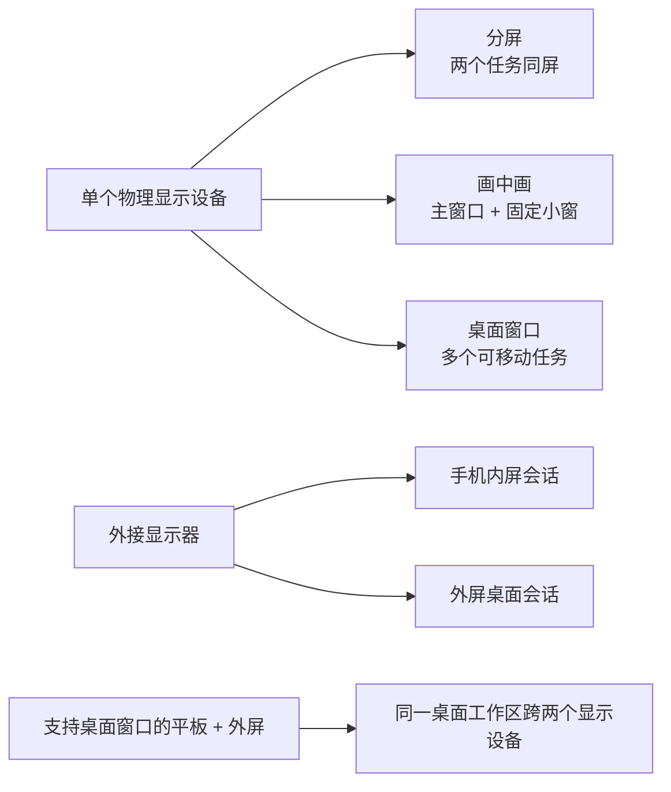
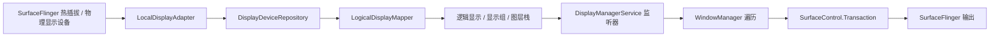

# 2.20 多窗口与桌面模式渲染性能

在平板分屏、折叠屏展开态、画中画或外接显示器场景中，可见窗口与图层数量、应用工作负载和显示拓扑可能同时变化。SurfaceFlinger 要处理更大的图层集合和更复杂的合成决策；调整窗口大小时，WMS 几何属性与应用缓冲区还可能在不同时刻到达。掉帧可能来自应用、WindowManager/Shell、SurfaceFlinger、GPU、Composer HAL 或显示硬件，不能只看应用主线程。

分析的起点是区分分屏、画中画、桌面窗口和外接显示器对应的显示会话，再建立 Display、Window、进程与图层的映射。映射准确后，Perfetto 中的应用卡顿、SurfaceFlinger 卡顿、HWC 策略变化和显示提交才能归到正确对象。

## 多窗口形态和显示会话

以下四类场景的会话边界不同。

**分屏（Split-screen）** 从 Android 7.0（API 24）开始进入平台主线。两个应用同时可见，SurfaceFlinger 每一帧都要处理两组应用窗口，以及分割线和系统栏。渲染分析面对的是新增的一组持续变化的图层树，而非单纯增加一个应用。

**画中画（PiP）** 从 Android 8.0（API 26）扩展到小屏设备。画中画窗口面积不大，但常会持续提交视频帧或地图帧。主窗口和小窗同时刷新时，SurfaceFlinger 会在前景主窗口之上处理一组持续更新的小窗图层。

**自由窗口/桌面窗口** 与“手机连接外接显示器”是两类能力。桌面窗口指兼容设备上的可调整大小窗口：用户可以同时打开多个应用窗口，底部有任务栏，窗口顶部有标题栏和最小化、最大化控件。外接显示器能力关注设备连接外屏后，桌面会话如何分布到两块屏幕。

各类场景的会话形态与渲染观察点如下：

| 场景 | 公开边界 | 会话形态 | 渲染观察点 |
|---|---|---|---|
| 分屏 | Android 7.0（API 24）平台支持 | 一块屏幕里并排两个可见应用窗口 | 同时可见图层增多，分割线和系统栏常驻 |
| 画中画 | Android 7.0 在部分设备提供，Android 8.0（API 26）扩展到小屏 | 一块屏幕里包含主窗口和持续更新的小窗 | 小窗经常持续提交缓冲区，并与主窗口叠加 |
| 自由窗口/桌面窗口 | 大屏或兼容设备上的可调整大小窗口 | 一块或多块屏幕里的多个可调整大小窗口 | 图层数量和窗口遮挡关系更复杂，合成决策更频繁 |
| 手机 + 外接显示器 | 手机连接外接显示器 | 手机保持原有状态，外屏启动独立桌面会话，形成两个显示会话 | SurfaceFlinger 同时驱动两个显示设备，会话内容彼此独立 |
| 桌面窗口设备 + 外接显示器 | 平板等桌面窗口设备连接外屏 | 桌面会话跨两块屏幕扩展，窗口和光标可跨屏移动 | 仍是同一套桌面会话，但显示范围更大、像素更多 |



这张图描述产品会话，不代表进程或渲染线程拓扑。两个可见窗口可能属于同一进程，也可能属于不同进程；应用窗口移动到外屏后，其显示设备、密度、刷新率、HDR 能力和窗口尺寸都可能变化。

## Android 17 的 Display 对象不能按一对一理解

多窗口主要由 WindowManager/WM Shell 组织，多个显示设备的发现、逻辑显示策略和投影则由 DisplayManagerService（DMS）管理。排查前应区分五类对象：

| 对象 | 所在层 | 主要职责 |
|---|---|---|
| 物理显示设备 / `PhysicalDisplayId` | SurfaceFlinger / Composer | 物理连接、模式、VSync、HWC 显示提交 |
| `DisplayDevice` | DMS 适配器层 | 表示本地、虚拟、Wi-Fi、叠加等显示设备 |
| `LogicalDisplay` / `displayId` | DMS 策略层 | 向系统暴露逻辑显示、图层栈、投影和显示组 |
| `DisplayContent` | WindowManager | 按 `displayId` 组织任务、窗口、Insets、焦点与过渡 |
| CompositionEngine 输出 | SurfaceFlinger | 为目标输出构造可见图层集合并与 HWC 协商 |

`LogicalDisplay.java` 的类注释说明：逻辑显示与显示设备是正交概念，映射可以是多对多，也可能没有直接关系。镜像、虚拟显示和显示投影都会打破“一块逻辑显示对应一块物理屏”的简化模型。因此，必须分别记录 DMS 的 `displayId`、SurfaceFlinger 的物理显示编号、图层栈和 HWC 显示句柄。

### 物理显示设备的发现与逻辑显示的建立

`LocalDisplayAdapter.registerLocked()` 从 SurfaceFlinger 枚举物理显示编号，并用 `tryConnectDisplayLocked()` 读取令牌、静态信息、动态模式信息和期望模式参数。新设备先成为 `LocalDisplayDevice`，再由 `DisplayDeviceRepository` 通知 `LogicalDisplayMapper` 建立或更新逻辑显示。

`mDevices.size() == 0` 只决定 `LocalDisplayDevice` 的 `mIsFirstDisplay`，影响首屏资源和背光等初始化。默认逻辑显示还要经过 `LogicalDisplayMapper` 的布局与 `FLAG_ALLOWED_TO_BE_DEFAULT_DISPLAY` 规则，不能只凭枚举顺序推断 `displayId=0`。



### `DeviceState` 处理硬件布局，不等于桌面窗口模式

`LogicalDisplayMapper.setDeviceState()` 处理折叠、展开、上盖、扩展坞等可能改变物理显示布局的设备状态。它会在 `mSyncRoot` 下设置待处理状态，按需临时关闭参与切换的显示设备，并依据 `DeviceState` 属性决定唤醒或休眠；如果完成条件迟迟没有满足，延迟消息会强制结束待处理过渡。

普通自由窗口或桌面窗口属于任务和窗口的窗口模式，不必触发 `LogicalDisplayMapper.setDeviceState()`。只有扩展坞、上盖或厂商硬件状态同时改变显示布局时，两条路径才会在同一场景中相遇。冷启动阶段的状态还可能暂存至开机完成后再应用，不能据此断言冷启动跟踪中一定没有折叠或展开事件。

### 外接显示策略不等于自动进入扩展桌面

`ExternalDisplayPolicy.isExternalDisplayLocked()` 以 `Display.TYPE_EXTERNAL` 识别外接逻辑显示，并负责启用、停用、温控限制、连接事件和统计。Android 17 中，`isDisplayContentModeManagementEnabled()` 为真时，`isExtendedDisplayAllowed()` 不再依赖开发者选项；但允许扩展内容模式不等于连接后必然自动进入桌面扩展。

是否自动启用还受布局、开机阶段、用户确认、温控状态和设备配置影响。应用侧只能根据运行时 `DisplayManager`、当前 Activity 上下文与窗口指标判断，不能用 Android 版本号推导外屏已经可用。

### DMS 遍历如何进入显示事务

`mSyncRoot` 的源码注释是“保护 DMS 的大部分状态”，并非所有显示工作都在这把锁内完成。`scheduleTraversalLocked()` 用单个 `mPendingTraversal` 合并重复请求，Handler 收到 `MSG_REQUEST_TRAVERSAL` 后调用 `WindowManagerInternal.requestTraversalFromDisplayManager()`。随后 WMS 回调 DMS 的 `performTraversal()`：逻辑显示的图层栈、方向、投影和 Surface 状态进入对应的 `SurfaceControl.Transaction`；期望模式参数则由 `ModeRequestManager` 收集后交给显示适配器批量应用。

这条链路能证明 DMS 变更会并入 WMS 和显示遍历，但不能保证热插拔发生后的下一个 VSync 就能完成。`android.display` 线程的长切片只能证明该线程繁忙；判断 `mSyncRoot` 竞争还需结合监视器争用、线程调度和锁持有者证据。Android 17 的无锁 `MessageQueue` 也不会拆除 DMS 自身的 `mSyncRoot`。

### DMS 与 SurfaceFlinger 的观察面

- `dumpsys display`：查看逻辑显示、显示组、DisplayDevice、当前布局、设备状态和电源控制器。
- `dumpsys SurfaceFlinger` / Winscope：查看物理/虚拟输出、图层树、投影与每个输出的合成状态。
- `surfaceflinger_layer`：提供全局图层快照，没有 `display_id` 列。
- `android_surfaceflinger_display`：提供同一快照中的显示信息，但没有通用的图层外键。
- `android_surfaceflinger_transaction`：包含 `layer_id` 与 `display_id`，适合确认某次事务的目标，不能代替最终输出图层的可见性。

多屏归属应结合 Winscope 的输出树、显示事务、图层父链和目标时间片确认。不能仅按 `snapshot_id` 连接两个表，就把快照中的所有图层归给每一个显示设备。

## 先建立 Window、线程和 Surface 拓扑

多窗口不一定对应多进程。一个进程可以有多个顶层窗口，每个窗口有自己的 `ViewRootImpl`、窗口 Surface 和 BLAST 缓冲区流；这些窗口仍可能共享 UI Looper 和 HWUI RenderThread。

| 证据 | 执行拓扑 | 性能含义 |
|---|---|---|
| 同一 pid、同一 UI tid、多个 ViewRoot | 共享 UI Looper 与同一个线程局部 `Choreographer` | 到期的遍历回调在同一线程串行执行 |
| 同一 pid、多个硬件加速窗口 | 每个窗口有渲染器/CanvasContext，共享进程级 HWUI RenderThread | 一个窗口的 DrawFrame、出队或围栏等待可能推迟另一个窗口 |
| 不同 pid | UI Looper、Choreographer 与 RenderThread 分离 | 应用 CPU 工作可以独立，仍共享目标显示设备的 SF/HWC/GPU/带宽 |
| 不同 `displayId` | 分属不同 WMS `DisplayContent` 与 SF 输出 | 模式、截止时间、颜色、HWC 能力和显示围栏要分别分析 |

`Choreographer` 在源码中是线程局部对象，不是“每个窗口一个”。`RenderThread::getInstance()` 则提供进程级 HWUI RenderThread。共享线程不代表共享 BufferQueue：每个应用窗口仍独立提交缓冲区，拥有自己的获取/释放关系和图层身份。

判断时应按 `pid/tid/ViewRootImpl/WindowState/layerId/displayId` 建表。屏幕上的两个面板也可能只是同一 Activity 中的双栏 View，此时只有一个 ViewRoot 和应用窗口缓冲区，不应按多窗口管线分析。

## WMS 几何属性与应用缓冲区是两条输入

窗口缩放、画中画和 Shell 过渡同时涉及管理状态、图层几何属性和应用内容：

| 输入 | 典型对象 | 改变什么 |
|---|---|---|
| `WindowContainerTransaction` | Task、TaskFragment、WindowContainer | 边界、窗口模式、层级与重设父节点请求 |
| `SurfaceControl.Transaction` | 容器、过渡牵引层、窗口图层 | 位置、裁剪、变换参数、透明度、Z 轴顺序、可见性 |
| 应用 BLAST 事务 | 应用窗口缓冲区图层 | 新缓冲区、获取围栏、帧号 |

Shell 过渡常把任务或 Activity Surface 临时重设到牵引层上执行动画。此时位置和裁剪可能落在牵引层，应用的新尺寸缓冲区则由 BLAST 单独到达。新几何属性搭配旧缓冲区可能是过渡策略的一部分；只有对齐 WCT、牵引层事务、应用重新布局/遍历和缓冲区选择，才能判断黑边、拉伸或跳变来自哪条路径。

`ViewRootImpl.performTraversals()` 不会每帧都调用 WMS 重新布局。首帧、尺寸、可见性、Insets 或 `LayoutParams` 等条件命中时才进入 `IWindowSession.relayout()`。稳定绘制帧没有重新布局切片时，不能把应用绘制延迟归因于 WMS。

WMS 内部的 `BLASTSyncEngine` 可以等待一组 WindowContainer 的绘制和事务；公开的 `SurfaceSyncGroup` 面向应用与嵌入 Surface。两者只等待已注册参与者，不能替相机、编解码器或游戏引擎的下一业务帧建立同步关系。

## SurfaceFlinger 与 HWC 按输出组织合成

SurfaceFlinger FrontEnd 接收所有窗口、Shell/WMS 几何属性和缓冲区事务，更新图层层级与快照；CompositionEngine 再为每个输出和显示设备构造可见图层集合。同一图层还可能因镜像或显示投影出现在多个输出中，不能只检查全局图层是否存在。

多窗口的成本主要来自三类变化：

1. 可见图层、牵引层、标题栏、变暗层、IME 与 SystemUI 图层增多；
2. 缩放、旋转、透明度、HDR/SDR、受保护内容等组合让 HWC 策略更复杂；
3. 多个输出各自具有显示模式、可见图层集合、客户端目标和显示提交。

窗口变多不一定切换到 CLIENT 合成，单个复杂窗口也可能触发 GPU 合成。应比较相邻帧整个输出的图层属性和 DEVICE/CLIENT 结果，不能把图层数量直接换算成 GPU 开销。

### 围栏要按缓冲区与显示设备分层

| 信号 | 粒度 | 能证明什么 |
|---|---|---|
| 获取围栏 | 一块生产方缓冲区 | 生产方何时写完，消费方何时可读 |
| 释放围栏 | 被消费的图层/缓冲区 | 旧缓冲区何时可以复用 |
| 显示围栏 | 一次显示提交 | 该输出的显示工作何时到达 Android 显示栈完成边界 |

显示围栏不属于某个窗口。内屏与外屏各有自己的显示结果；刷新率不同时，也不能用 60 Hz 的帧预算解释 120 Hz 输出。FrameTimeline 中出现 SurfaceFlinger 卡顿后，应通过 DisplayFrame 令牌、目标输出和相邻显示状态确定归属，再判断另一块屏是否受到影响。

### 不用固定数字推导多窗口开销

叠加平面、缩放器、分辨率、刷新率、内存带宽和厂商 Composer 都会改变结果，因此无法给出“每增加一个窗口固定多耗时几毫秒”或“必然增加多少 PSS”的通用结论。可复用的比较方法是在同一设备上固定场景，记录每个输出的可见图层、合成类型、FrameTimeline、GPU/围栏和显示提交。

## 三个容易越界的 Android 17 话题

### 无锁 MessageQueue 只优化 Looper 队列

Android 17 为目标 SDK 37 及以上的应用启用无锁 `MessageQueue`（DeliQueue）。Google 内部测试跟踪报告的丢帧降幅，归因于 MessageQueue 监视器争用减少。该变化不能证明 SurfaceFlinger 事务、WMS `mGlobalLock` 或 DMS `mSyncRoot` 已经拆分。

### 桌面窗口公开能力按 API 与运行时查询

官方桌面窗口文档描述标题栏 Insets、可调整大小窗口、任务栏和多实例交互；其中 `PROPERTY_SUPPORTS_MULTI_INSTANCE_SYSTEM_UI` 从 Android 15 开始提供。文档没有通用的 `applyCachedState` Perfetto 切片，也不能支撑“SurfaceControl 属性持久化缓存”这一平台结论。设备是否启用桌面窗口、外接显示内容模式和多实例入口，仍要在运行时确认。

### 16 KB 页大小不是多窗口专属机制

16 KB 页大小会影响原生库兼容性和进程内存布局，但不会创建另一条多窗口渲染管线。评估多窗口驻留内存时，可用 `linux.process_stats` 查看进程 RSS/交换空间，用 `linux.sys_stats` 查看系统 `MemAvailable`，再结合 `android.memory.process`、GPU 内存、`dumpsys meminfo` 和 LMK 事件判断。

仅看到 `MemAvailable` 下降，不能断言系统已超过后台回收能力。还要确认进程重要性、RSS/交换空间、GraphicBuffer/GPU 内存、缓存回收和是否发生 LMK。优化对象应是已确认不再需要的纹理、离屏缓冲区、解码输出或缓存，不应仅因失去顶层恢复状态就无条件释放可见窗口仍在使用的资源。

## 配置变更和大屏适配，先把边界写对

### `recreateOnConfigChanges` 的公开语义

`recreateOnConfigChanges` 的方向和 `android:configChanges` 相反。`configChanges` 表示这类变化由应用自行处理，系统不重建 Activity；`recreateOnConfigChanges` 表示即使系统默认不重建，这类变化仍要重新经历完整的 Activity 生命周期。

这个属性并非所有配置变化的通用重启开关。Android O 之后，`mcc|mnc` 默认不再触发 Activity 重建，应用可以用 `recreateOnConfigChanges` 显式要求这两类变化触发重建。API 37 又把触摸屏、键盘、键盘显示状态、导航设备和颜色模式变化纳入默认不重建范围；依赖完整重建来加载资源的应用，需要在清单中显式声明。

窗口尺寸、方向和屏幕布局这类多窗口场景中的高频变化，仍要通过 `android:configChanges`、`onConfigurationChanged()`、状态保存和系统实际生命周期回调处理。`recreateOnConfigChanges` 不能充当折叠屏或桌面模式的尺寸变化开关。

### Android 16 / 17 的真实边界

和大屏多窗口直接相关的边界，在 Android 16（API 36）和 Android 17（API 37）。

Android 12（API 31）把多窗口变成大屏设备上的标准行为。公开文档指出，大屏设备会让所有应用进入多窗口流程，`resizeableActivity="false"` 不再是绝对开关；无法适配的应用会进入兼容模式。

Android 16（API 36）进一步把大屏规则扩展到 `sw >= 600dp`。对 `targetSdkVersion >= 36` 的应用，平台会忽略 `screenOrientation`、`android:resizeableActivity="false"`、`minAspectRatio`、`maxAspectRatio`，以及 `setRequestedOrientation()` / `getRequestedOrientation()` 这类限制窗口形态的接口。文档同时提供了临时退出选项：

```xml
<activity ...>
    <property
        android:name="android.window.PROPERTY_COMPAT_ALLOW_RESTRICTED_RESIZABILITY"
        android:value="true" />
</activity>
```

这项退出配置只在 API 36 过渡期有效。应用面向 API 37 后，该配置不再生效。Android 17（API 37）会直接忽略 `sw >= 600dp` 设备上的方向、宽高比和可调整大小限制。

这条规则不适用于 `sw < 600dp` 的屏幕；按 `android:appCategory` 标记的游戏也有例外，系统仍尊重用户为单个应用选择的宽高比。设备厂商还可以调整多窗口行为，因此测试记录必须包含目标 SDK、目标显示设备的 `smallestScreenWidthDp`、应用类别与设备设置。

这会改变 `android:configChanges` 的风险边界。应用仍可声明自行处理某些配置变化，但大屏上的窗口被拉伸、旋转或进入分屏、桌面窗口时，系统施加的形态约束已经减少，Activity 更容易连续收到尺寸、方向和屏幕布局变化。声明了 `configChanges` 的应用也要更新资源、布局和渲染目标；没有声明或声明不完整时，系统仍可能重建 Activity。

API 37 的 `recreateOnConfigChanges` 应与这条大屏规则分开理解。它面向触摸屏、键盘、键盘显示状态、导航设备和颜色模式变化，用来恢复这些变化触发 Activity 重建的旧行为；它不会让 `screenOrientation`、宽高比或可调整大小限制重新生效。对于渲染分析，大屏和外接显示器上的窗口尺寸变化会更频繁地触发重新布局、缓冲区重新分配和 `performTraversals()`。应用应保存界面状态，并把窗口尺寸变化视为常态输入。

## Multi-resume 区分失去焦点与停止可见

多窗口场景不能把失去焦点近似为进入 `onStop()`。Android 10（API 29）引入 Multi-resume 后，多个可见 Activity 可以同时停留在 `RESUMED`。画中画等不具备焦点的窗口可能进入暂停状态，但只要 Activity 仍在屏幕上，就不能按后台窗口已经停止来推导其生命周期。

**顶层恢复（top resumed）** 是资源仲裁和交互强度调整的重要信号，但不构成失去顶层状态后必须释放相机的所有权契约。官方允许非顶层恢复的可见 Activity 继续相机预览；应用仍要处理 `CameraDevice.StateCallback#onDisconnected()` 等资源抢占信号。高频动画、连续失效刷新和帧率投票应同时参考顶层恢复状态、实际可见性与内容是否仍在更新。

```kotlin
override fun onTopResumedActivityChanged(topResumed: Boolean) {
    super.onTopResumedActivityChanged(topResumed)
    if (topResumed) {
        resumeHighFrequencyRendering()
        tryReacquireExclusiveResources()
    } else {
        dropNonEssentialAnimations()
        prepareForExclusiveResourcePreemption()
    }
}

override fun onStop() {
    super.onStop()
    stopOffscreenWork()
}
```

这段代码背后的分工要说清楚。

- `topResumed = true`：窗口取得前台交互资格，可以尝试获取独占资源并恢复高交互频率。
- 窗口可见但不是顶层恢复状态：窗口可能仍处于 `RESUMED`。视频小窗、导航小窗和分屏副窗口都可能属于这一类。此时适合减少非必要重绘并准备处理资源抢占，不应停掉全部渲染。
- `onStop()`：只在 Activity 离开屏幕时触发，离屏工作应在这里停止。

画中画也要单独判断。它通常可见但不可获得焦点。持续播放视频时，不能把它当成静态后台窗口；内容已暂停时，则不必每帧都执行完整的界面刷新。

## Perfetto 和 dumpsys 的正确观察面

多窗口分析要避免两类查询错误：使用不存在的表名，以及把某个版本中的切片名当成平台通用名称。

### 1. 列出当前跟踪中的 SurfaceFlinger 切片名

`doCompose` 不能直接作为通用过滤条件。应先列出当前跟踪中 SurfaceFlinger 线程存在的切片名，再筛选与合成相关的项目：

```sql
SELECT DISTINCT slice.name
FROM slice
JOIN thread_track ON slice.track_id = thread_track.id
JOIN thread ON thread_track.utid = thread.utid
JOIN process ON thread.upid = process.upid
WHERE process.name GLOB '*surfaceflinger*'
  AND thread.tid = process.pid
ORDER BY 1;
```

这一步可以直接发现版本升级、厂商裁剪或跟踪配置变化造成的切片名称差异。

### 2. 图层快照表要使用真实表结构

Perfetto 标准库文档中，SurfaceFlinger 图层快照对应的表是 `surfaceflinger_layers_snapshot` 和 `surfaceflinger_layer`。`surfaceflinger_layers` 并不存在。可直接执行的查询如下：

```sql
SELECT
  s.ts / 1e6 AS ts_ms,
  l.layer_name,
  l.is_visible,
  l.hwc_composition_type
FROM surfaceflinger_layers_snapshot s
JOIN surfaceflinger_layer l ON l.snapshot_id = s.id
WHERE l.is_visible = 1
ORDER BY s.ts DESC, l.layer_name
LIMIT 100;
```

这个查询用于查看某个快照中的可见图层、名称与 HWC 合成类型。Perfetto 标准库的 `surfaceflinger_layer` 表没有 `display_id` 列，因此外接显示器跟踪中不能直接写 `WHERE l.display_id = 0`。区分显示设备时，应先在 Winscope SurfaceFlinger 输出树中确认目标输出，再用 `android_surfaceflinger_transaction` 的 `layer_id/display_id` 和相邻事务辅助定位。`android_surfaceflinger_display` 只有显示记录，不能把同一快照的全部图层自动归到该显示设备。

### 3. 完整记录 FrameTimeline 卡顿名称

FrameTimeline 中，应用侧和 SurfaceFlinger 侧至少要分成三类：

- `AppDeadlineMissed`：应用没有按时交帧。
- `SurfaceFlingerCpuDeadlineMissed`：SurfaceFlinger 主线程没有在截止时间前完成 CPU 侧工作。
- `SurfaceFlingerGpuDeadlineMissed`：CPU 侧工作已经推进，但 GPU 合成没有按时完成。

多窗口场景下，后两类尤其值得关注。窗口、图层和显示设备增多时，应先区分 SurfaceFlinger 侧与应用侧的截止时间异常，再决定检查应用主线程、RenderThread、图片上传、视频解码，或继续沿 SurfaceFlinger、HWC 与 GPU 合成向下排查。

一套可复用的顺序是：在 `actual_frame_timeline_slice` 中找到异常 SurfaceFrame/DisplayFrame 令牌，对齐目标进程的 `doFrame`、RenderThread 与缓冲区事务；选择最接近异常时刻的图层快照，确认输出、可见图层和合成类型；再检查 SurfaceFlinger 主线程、GPU 围栏、Composer/HAL 与显示提交。这样可以区分单个窗口晚交帧与整屏合成延迟。

## 版本演进

| Android 版本 | 公开变化 | 对渲染分析的影响 |
|---|---|---|
| 7.0 (API 24) | 引入分屏，自由窗口能力进入平台 | SurfaceFlinger 开始稳定处理多个可见应用窗口 |
| 8.0 (API 26) | 画中画扩展到小屏设备 | 主窗口之外增加一条持续更新的小窗图层 |
| 10 (API 29) | Multi-resume + `onTopResumedActivityChanged()` | 失去焦点不再等于离开 `RESUMED`，生命周期判断需要细分 |
| 12 (API 31) | 多窗口成为大屏设备的标准行为 | 平板、折叠屏更频繁进入可调整大小或兼容模式 |
| 12L (API 32) | 大屏系统 UI、多任务与 Activity Embedding 体验增强 | 同一任务窗口可包含并列的 Activity 容器，视觉双栏仍可能只有一个顶层窗口 |
| 13 (API 33) | Composer HAL 转向 AIDL；AutoSingleLayer 仅覆盖受限的单图层缓冲区更新 | HAL 接口变化不改变各显示设备的 HWC 职责；不能用未触发的锁存解释跨窗口同步 |
| 14 (API 34) | `SurfaceSyncGroup` 成为公开 API | 应用和嵌入 Surface 可收集同步事务，WMS 内部仍使用独立同步引擎 |
| 15 (API 35) | 目标 35 默认边到边；`PROPERTY_SUPPORTS_MULTI_INSTANCE_SYSTEM_UI` 提供多实例声明 | 标题栏、Insets 和多实例窗口增加布局与任务组织变量，不改变 BLAST/SF 主线 |
| 16 (API 36) | 目标 36 在 `sw >= 600dp` 时忽略方向、宽高比和可调整大小限制，并提供临时退出选项 | 窗口尺寸与方向变化更常见；测试要覆盖桌面窗口、外屏、折叠状态和兼容模式 |
| 17 (API 37) | 目标 37 不再支持上述退出选项；`recreateOnConfigChanges` 扩展到新的默认不重建配置类型；目标 37 启用无锁 MessageQueue | 大屏适配不能依赖固定方向或不可缩放；DeliQueue 的收益仅限 Looper 队列，显示主线仍按 Android 17 AOSP 分析 |

## 常见问题与误区

### 误区 1：失去焦点就等于进入 `onStop()`

Android 10 之后，多窗口中的多个可见 Activity 可以同时停留在 `RESUMED`。焦点、可见性和顶层恢复状态是三套不同信号，资源与渲染策略要分别处理。

### 误区 2：`recreateOnConfigChanges` 能处理折叠屏和窗口尺寸变化

这个属性只声明哪些默认不重建的配置变化仍要触发重建。折叠屏展开、窗口缩放、横竖屏切换等场景，仍要检查 `android:configChanges`、`onConfigurationChanged()`、状态保存，以及系统是否触发 Activity 重建。API 37 对触摸屏、键盘、键盘显示状态、导航设备和颜色模式的处理，不能外推成窗口尺寸变化的通用方案。

### 误区 3：多窗口掉帧一定是 App 的问题

多窗口也会增加 Shell 事务、SurfaceFlinger 输出和 HWC 策略变量。应先检查 FrameTimeline 的 `jank_type`，再检查目标输出的图层快照与合成类型；确认最早发生延迟的阶段后，才能判断修复对象属于应用还是系统或设备。

### 误区 4：窗口越多就一定走 GPU 合成

HWC 评估整个输出的图层属性和硬件资源。多个简单图层仍可能全部采用 DEVICE 合成，单个带复杂变换、HDR 混合或受保护内容的窗口也可能改变策略。

### 误区 5：图层快照可以直接按 `displayId` 过滤

`surfaceflinger_layer` 没有 `display_id`。多显示设备跟踪必须先确认 Winscope 输出，再结合事务、图层父节点和目标时间片归属，不能把快照中的所有图层都算到每块屏幕。

## 参考资料

- [AOSP `DisplayManagerService`](https://android.googlesource.com/platform/frameworks/base/+/refs/tags/android-17.0.0_r1/services/core/java/com/android/server/display/DisplayManagerService.java)
- [AOSP `LogicalDisplayMapper`](https://android.googlesource.com/platform/frameworks/base/+/refs/tags/android-17.0.0_r1/services/core/java/com/android/server/display/LogicalDisplayMapper.java)
- [AOSP `LogicalDisplay`](https://android.googlesource.com/platform/frameworks/base/+/refs/tags/android-17.0.0_r1/services/core/java/com/android/server/display/LogicalDisplay.java)
- [AOSP `LocalDisplayAdapter`](https://android.googlesource.com/platform/frameworks/base/+/refs/tags/android-17.0.0_r1/services/core/java/com/android/server/display/LocalDisplayAdapter.java)
- [AOSP `ExternalDisplayPolicy`](https://android.googlesource.com/platform/frameworks/base/+/refs/tags/android-17.0.0_r1/services/core/java/com/android/server/display/ExternalDisplayPolicy.java)
- [AOSP `ViewRootImpl`](https://android.googlesource.com/platform/frameworks/base/+/refs/tags/android-17.0.0_r1/core/java/android/view/ViewRootImpl.java)
- [AOSP `Choreographer`](https://android.googlesource.com/platform/frameworks/base/+/refs/tags/android-17.0.0_r1/core/java/android/view/Choreographer.java)
- [AOSP HWUI `RenderThread`](https://android.googlesource.com/platform/frameworks/base/+/refs/tags/android-17.0.0_r1/libs/hwui/renderthread/RenderThread.cpp)
- [AOSP manifest `recreateOnConfigChanges`](https://android.googlesource.com/platform/frameworks/base/+/refs/tags/android-17.0.0_r1/core/res/res/values/attrs_manifest.xml)
- [AOSP `WindowContainerTransaction`](https://android.googlesource.com/platform/frameworks/base/+/refs/tags/android-17.0.0_r1/core/java/android/window/WindowContainerTransaction.java)
- [AOSP `SurfaceSyncGroup`](https://android.googlesource.com/platform/frameworks/base/+/refs/tags/android-17.0.0_r1/core/java/android/window/SurfaceSyncGroup.java)
- [AOSP `WindowContainer`](https://android.googlesource.com/platform/frameworks/base/+/refs/tags/android-17.0.0_r1/services/core/java/com/android/server/wm/WindowContainer.java)
- [AOSP `BLASTSyncEngine`](https://android.googlesource.com/platform/frameworks/base/+/refs/tags/android-17.0.0_r1/services/core/java/com/android/server/wm/BLASTSyncEngine.java)
- [AOSP `BLASTBufferQueue`](https://android.googlesource.com/platform/frameworks/native/+/refs/tags/android-17.0.0_r1/libs/gui/BLASTBufferQueue.cpp)
- [AOSP `SurfaceFlinger`](https://android.googlesource.com/platform/frameworks/native/+/refs/tags/android-17.0.0_r1/services/surfaceflinger/SurfaceFlinger.cpp)
- [AOSP `HWComposer`](https://android.googlesource.com/platform/frameworks/native/+/refs/tags/android-17.0.0_r1/services/surfaceflinger/DisplayHardware/HWComposer.cpp)
- [Android Developers：Multi-window mode](https://developer.android.com/develop/ui/compose/layouts/adaptive/support-multi-window-mode)
- [Android Developers：Desktop windowing](https://developer.android.com/develop/ui/compose/layouts/adaptive/support-desktop-windowing)
- [Android Developers：Connected displays](https://developer.android.com/develop/ui/compose/layouts/adaptive/support-connected-displays)
- [Android Developers：Android 16 behavior changes](https://developer.android.com/about/versions/16/behavior-changes-16)
- [Android Developers：Android 17 behavior changes](https://developer.android.com/about/versions/17/behavior-changes-17)
- [Android Developers Blog：Android 17 lock-free MessageQueue](https://android-developers.googleblog.com/2026/02/under-hood-android-17s-lock-free.html)
- [PerfettoSQL standard library](https://perfetto.dev/docs/analysis/stdlib-docs)
- [Perfetto FrameTimeline](https://perfetto.dev/docs/data-sources/frametimeline)
- [AOSP Graphics：SurfaceFlinger and WindowManager](https://source.android.com/docs/core/graphics/surfaceflinger-windowmanager)
- [AOSP Graphics：Hardware Composer HAL](https://source.android.com/docs/core/graphics/hwc)
- [`android17-6.18-2026-06_r6`：sync_file](https://android.googlesource.com/kernel/common/+/refs/tags/android17-6.18-2026-06_r6/drivers/dma-buf/sync_file.c)
- [`android17-6.18-2026-06_r6`：dma-fence](https://android.googlesource.com/kernel/common/+/refs/tags/android17-6.18-2026-06_r6/drivers/dma-buf/dma-fence.c)
