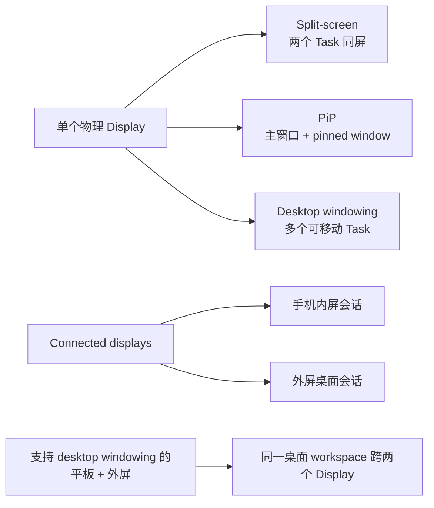

# 2.20 多窗口与桌面模式渲染性能

在平板分屏、折叠屏展开态、PiP 或外接显示器场景中，可见 window/layer 数量、应用工作负载和 display 拓扑可能同时变化。SurfaceFlinger 要处理更大的 layer 集合和更复杂的 composition decision，窗口 resize 还会让 WMS geometry 与 App buffer 在不同时间到达。掉帧可能来自 App、WindowManager/Shell、SurfaceFlinger、GPU、Composer HAL 或显示硬件，不能只看 App 主线程。

这一章先分清 split-screen、PiP、desktop windowing、connected displays 对应的显示会话，再建立 Display、Window、进程与 layer 的映射。只有映射成立，Perfetto 里的 App jank、SurfaceFlinger jank、HWC 策略变化和 display present 才能归到正确对象。

## 多窗口形态和 display 会话

先把几个容易混在一起的名词拆开。

**Split-screen** 从 Android 7.0（API 24）开始进入平台主线。两个 App 同时可见，SurfaceFlinger 每一帧都要处理两组应用窗口，再加上分割线和系统栏。对渲染分析来说，重点是多了一组持续变化的 layer 树，而不只是多了一个 App。

**PiP** 从 Android 8.0（API 26）扩展到小屏设备。PiP 窗口面积不大，但它常常持续提交视频帧或地图帧。主窗口和 PiP 小窗都在刷新时，SurfaceFlinger 侧看到的是一组前景主窗口，再叠一组持续更新的小窗 layer。

**Freeform / desktop windowing** 不能和“手机连外接显示器”写成一回事。公开文档把这两条线分得很清楚。desktop windowing 讲的是兼容设备上的可调整大小窗口，用户可以同时打开多个可调整大小的 app window，底部有 taskbar，窗口顶部有标题栏和最小化、最大化控制。connected displays 讲的是设备接到外部显示器后，桌面会话怎么分布到两块屏幕上。

下表把这几个形态放到同一张表里看，边界会清楚很多。

| 场景 | 公开边界 | 会话形态 | 渲染观察点 |
|---|---|---|---|
| Split-screen | Android 7.0（API 24）平台支持 | 一块屏幕里并排两个可见 app window | 同时可见 layer 增多，分割线和系统栏常驻 |
| PiP | Android 7.0 在部分设备提供，Android 8.0（API 26）扩展到小屏 | 一块屏幕里主窗口 + 持续更新的小窗 | 小窗经常持续提交 buffer，主窗口和小窗互相叠加 |
| Freeform / desktop windowing | 大屏 / 兼容设备上的可调整大小窗口 | 一块或多块屏幕里的多个可调整大小窗口 | layer 数量和窗口遮挡关系更复杂，composition decision 更频繁 |
| 手机 + connected display | 手机连接外接显示器 | 手机保持原有状态，外屏启动独立 desktop session，形成两个显示会话 | SurfaceFlinger 同时驱动两个 display，会话内容彼此独立 |
| desktop windowing 设备 + 外接显示器 | 平板等 desktop windowing 设备连接外屏 | 桌面会话跨两块屏幕扩展，窗口和光标可跨屏移动 | 仍是同一套桌面会话，但 display 范围更大、像素更多 |



这张图描述的是产品会话，不代表进程或渲染线程拓扑。两个可见窗口可能属于同一进程，也可能属于不同进程；一个应用窗口移动到外屏后，其 display、密度、刷新率、HDR 能力和窗口尺寸都可能变化。

## Android 17 的 Display 对象不能按一对一理解

多窗口主要由 WindowManager/WM Shell 组织，多个显示设备的发现、logical display 策略和投影则由 DisplayManagerService（DMS）管理。排查前先区分五类对象：

| 对象 | 所在层 | 主要职责 |
|---|---|---|
| physical display / `PhysicalDisplayId` | SurfaceFlinger / Composer | 物理连接、mode、VSync、HWC present |
| `DisplayDevice` | DMS adapter 层 | 表示 local、virtual、Wi-Fi、overlay 等显示设备 |
| `LogicalDisplay` / `displayId` | DMS policy 层 | 对系统暴露逻辑显示、layer stack、投影和 display group |
| `DisplayContent` | WindowManager | 按 displayId 组织 Task、Window、Insets、focus 与 transition |
| CompositionEngine Output | SurfaceFlinger | 为目标输出构造可见 layer 集合并与 HWC 协商 |

`LogicalDisplay.java` 的类注释明确说明：logical display 与 display device 是正交概念，映射可以是 many-to-many，也可能没有直接关系。镜像、虚拟显示和 display projection 都会打破“一块 logical display 对应一块物理屏”的简化模型。因此，DMS 的 `displayId`、SurfaceFlinger 的 physical display id、layer stack 和 HWC display handle 必须分别记录。

### physical display 的发现与 logical display 的建立

`LocalDisplayAdapter.registerLocked()` 从 SurfaceFlinger 枚举 physical display id，并用 `tryConnectDisplayLocked()` 读取 token、静态信息、动态 mode 信息和 desired mode specs。新设备先成为 `LocalDisplayDevice`，再经 `DisplayDeviceRepository` 通知 `LogicalDisplayMapper` 建立或更新 logical display。

`mDevices.size() == 0` 只决定 `LocalDisplayDevice` 的 `mIsFirstDisplay`，影响首屏资源和背光等初始化。默认 logical display 最终还要经过 `LogicalDisplayMapper` 的 layout 与 `FLAG_ALLOWED_TO_BE_DEFAULT_DISPLAY` 规则，不能只凭枚举顺序推断 `displayId=0`。

```mermaid
flowchart LR
    HP["SurfaceFlinger hotplug / physical display"] --> LDA["LocalDisplayAdapter"]
    LDA --> DDR["DisplayDeviceRepository"]
    DDR --> LDM["LogicalDisplayMapper"]
    LDM --> LD["LogicalDisplay / display group / layer stack"]
    LD --> DMS["DisplayManagerService listener"]
    DMS --> WMS["WindowManager traversal"]
    WMS --> SCT["SurfaceControl.Transaction"]
    SCT --> SF["SurfaceFlinger outputs"]
```



### `DeviceState` 处理硬件布局，不等于 desktop windowing mode

`LogicalDisplayMapper.setDeviceState()` 处理的是折叠、展开、lid、dock 等可能改变物理显示布局的设备状态。它会在 `mSyncRoot` 下设置 pending state，按需要临时关闭参与切换的 display，并依据 `DeviceState` property 决定 wake/sleep；若正常完成条件迟迟不到，延迟消息会强制结束 pending transition。

普通 freeform/desktop windowing 是 Task/Window 的 windowing mode，不必触发 `LogicalDisplayMapper.setDeviceState()`。只有设备的 dock、lid 或厂商硬件状态同时改变 display layout 时，两条路径才会在一次场景中相遇。冷启动阶段的状态还可能暂存到 boot completed 后再应用，不能据此断言冷启动 trace 一定没有 fold/unfold 事件。

### 外接显示策略不等于自动进入扩展桌面

`ExternalDisplayPolicy.isExternalDisplayLocked()` 以 `Display.TYPE_EXTERNAL` 识别外接 logical display，并负责 enable/disable、thermal 限制、连接事件和统计。Android 17 中，`isDisplayContentModeManagementEnabled()` 为真时，`isExtendedDisplayAllowed()` 不再依赖开发者选项；但“允许 extended content mode”不等于连接后必然自动进入桌面扩展。

是否自动启用还受 layout、boot 阶段、用户确认、thermal 状态和设备配置影响。应用侧只能按运行时 `DisplayManager`、当前 activity context 与 window metrics 判断，不能用 Android 版本号推导外屏已经可用。

### DMS traversal 如何进入显示 transaction

`mSyncRoot` 的源码注释是“保护 DMS 的大部分状态”，不是所有显示工作都在这把锁内完成。`scheduleTraversalLocked()` 用单个 `mPendingTraversal` 合并重复请求，Handler 收到 `MSG_REQUEST_TRAVERSAL` 后调用 `WindowManagerInternal.requestTraversalFromDisplayManager()`。随后 WMS 调回 DMS 的 `performTraversal()`：logical display 的 layer stack、orientation、projection 和 surface 状态进入对应的 `SurfaceControl.Transaction`；desired mode specs 则由 `ModeRequestManager` 收集后交给 display adapter 批量应用。

这条链路能证明 DMS 变更会并入 WMS/display traversal，不能保证“收到 hotplug 后恰好下一个 VSync 就完成”。`android.display` 线程的长 slice 只能证明该线程忙；若要判断 `mSyncRoot` 竞争，还需同时看到 monitor contention、线程调度和锁持有者证据。Android 17 的 lock-free `MessageQueue` 也不会拆除 DMS 自己的 `mSyncRoot`。

### DMS 与 SurfaceFlinger 的观察面

- `dumpsys display`：查看 logical display、display group、DisplayDevice、当前 layout、device state 和 power controller。
- `dumpsys SurfaceFlinger` / Winscope：查看 physical/virtual output、layer tree、projection 与每个 output 的 composition 状态。
- `surfaceflinger_layer`：提供全局 layer snapshot，没有 `display_id` 列。
- `android_surfaceflinger_display`：提供同一 snapshot 中的 display 信息，但没有通用的 layer 外键。
- `android_surfaceflinger_transaction`：有 `layer_id` 与 `display_id`，适合确认某次 transaction 的目标，不能替代最终 output-layer 可见性。

多屏归属应结合 Winscope 的 output tree、display transaction、layer parent chain 和目标时间片确认。不要把两个表按 `snapshot_id` 相连后，就把 snapshot 中所有 layer 都归给每一个 display。

## 先建立 Window、线程和 Surface 拓扑

多窗口不一定等于多进程。一个进程可以有多个顶层 Window，每个 Window 有自己的 `ViewRootImpl`、窗口 Surface 和 BLAST buffer 流；这些窗口仍可能共享 UI Looper 和 HWUI RenderThread。

| 证据 | 执行拓扑 | 性能含义 |
|---|---|---|
| 同 pid、同 UI tid、多个 ViewRoot | 共享 UI Looper 与同一个 ThreadLocal `Choreographer` | 到期的 traversal callback 在同一线程串行执行 |
| 同 pid、多个硬件加速窗口 | 每个窗口有 renderer/CanvasContext，共享进程级 HWUI RenderThread | 一个窗口的 DrawFrame、dequeue 或 fence wait 可能推迟另一个窗口 |
| 不同 pid | UI Looper、Choreographer 与 RenderThread 分离 | App CPU 工作可独立，仍共享目标 Display 的 SF/HWC/GPU/带宽 |
| 不同 displayId | 分属不同 WMS `DisplayContent` 与 SF output | mode、deadline、color、HWC 能力和 present fence 要分别分析 |

`Choreographer` 的源码是 ThreadLocal，不是“每个 Window 一个”。`RenderThread::getInstance()` 则提供进程级 HWUI RenderThread。共享线程不代表共享 BufferQueue：每个 App Window 仍独立提交 buffer，拥有自己的 acquire/release 关系和 layer identity。

判断时从 `pid/tid/ViewRootImpl/WindowState/layerId/displayId` 建表。屏幕上出现两个 pane 也可能只是一个 Activity 里的双栏 View，此时只有一个 ViewRoot 和 App Window buffer，不应按多窗口管线分析。

## WMS geometry 与 App buffer 是两条输入

窗口 resize、PiP 和 Shell transition 同时涉及管理状态、layer 几何和应用内容：

| 输入 | 典型对象 | 改变什么 |
|---|---|---|
| `WindowContainerTransaction` | Task、TaskFragment、WindowContainer | bounds、windowing mode、层级与 reparent 请求 |
| `SurfaceControl.Transaction` | container、transition leash、window layer | position、crop、matrix、alpha、Z、visibility |
| App BLAST transaction | App Window buffer layer | 新 buffer、acquire fence、frame number |

Shell transition 常把 Task 或 Activity surface 临时 reparent 到 leash 上做动画。此时 position/crop 可能落在 leash，应用新尺寸 buffer 则由 BLAST 单独到达。新 geometry 配旧 buffer 可以是过渡策略的一部分；只有把 WCT、leash transaction、应用 relayout/traversal 和 buffer 选择对齐，才能判断黑边、拉伸或跳变来自哪条路径。

`ViewRootImpl.performTraversals()` 也不会每帧都调用 WMS relayout。首帧、尺寸、可见性、Insets 或 `LayoutParams` 等条件命中时才进入 `IWindowSession.relayout()`。稳定绘制帧没有 relayout slice 时，不要把 App draw 迟到归因于 WMS。

WMS 内部的 `BLASTSyncEngine` 可以等待一组 WindowContainer 的 draw/transaction；公开的 `SurfaceSyncGroup` 面向应用与嵌入 Surface。两者只等待已注册参与者，不能替 Camera、codec 或游戏引擎的业务下一帧建立同步关系。

## SurfaceFlinger 与 HWC 按 Output 组织合成

SurfaceFlinger FrontEnd 接收所有窗口、Shell/WMS 几何和 buffer transaction，更新 layer hierarchy 与 snapshot；CompositionEngine 再为每个 Output/Display 构造可见 layer 集合。同一个 layer 还可能因 mirror 或 display projection 出现在多个 output，不能只看全局 layer 是否存在。

多窗口的成本主要来自三类变化：

1. 可见 layer、leash、caption、dim、IME 与 SystemUI layer 增多；
2. scale、rotation、alpha、HDR/SDR、protected content 等组合让 HWC strategy 更复杂；
3. 多个 output 带来各自的 mode、可见 layer 集合、client target 和 present。

窗口变多不保证切到 CLIENT composition，单个复杂窗口也可能触发 GPU 合成。要比较的是相邻帧整个 output 的 layer 属性和 DEVICE/CLIENT 结果，而不是把 layer 数量直接换算成 GPU 开销。

### fence 要按 buffer 与 Display 分层

| 信号 | 粒度 | 能证明什么 |
|---|---|---|
| acquire fence | 一块 producer buffer | producer 何时写完，consumer 何时可读 |
| release fence | 被消费的 layer/buffer | 旧 buffer 何时可以复用 |
| present fence | 一次 Display present | 该 output 的 present 工作到达 Android 显示栈完成边界 |

present fence 不属于某个 Window。内屏与外屏各有自己的 present 结果；它们使用不同刷新率时，也不能拿 60 Hz 的帧预算解释 120 Hz output。FrameTimeline 中出现 SurfaceFlinger jank 后，应先通过 DisplayFrame token、目标 output 和相邻 display 状态确定归属，再判断另一块屏是否受到影响。

### 不用固定数字推导多窗口开销

overlay plane、scaler、分辨率、刷新率、内存带宽和 vendor Composer 都会改变结果。通用文章不能给出“增加一个窗口固定多耗时几毫秒”或“必然增加多少 PSS”的结论。可复用的比较方法是：在同一设备上固定场景，记录每个 output 的可见 layer、composition type、FrameTimeline、GPU/fence 和 present。

## 三个容易越界的 Android 17 话题

### lock-free MessageQueue 只优化 Looper 队列

Android 17 为 target SDK 37 及以上应用启用 lock-free `MessageQueue`（DeliQueue）。Google 内部 beta trace 报告的 missed-frame 降幅，归因于 MessageQueue monitor contention 减少。它不能证明 SurfaceFlinger transaction、WMS `mGlobalLock` 或 DMS `mSyncRoot` 已经拆分。

### 桌面窗口公开能力按 API 与运行时查询

官方 desktop windowing 文档描述 caption/header insets、可调整大小窗口、taskbar 和多实例交互；其中 `PROPERTY_SUPPORTS_MULTI_INSTANCE_SYSTEM_UI` 从 Android 15 提供。文档没有通用 `applyCachedState` Perfetto slice，也不能支撑“SurfaceControl 属性持久化缓存”这一平台结论。设备是否启用 desktop windowing、connected display content mode 和多实例入口，仍要运行时确认。

### 16 KB page size 不是多窗口专属机制

16 KB page size 会影响 native 库兼容和进程内存布局，但不会创建另一条多窗口渲染管线。评估多窗口驻留内存时，进程 RSS/swap 使用 `linux.process_stats`，系统 `MemAvailable` 使用 `linux.sys_stats`；再结合 `android.memory.process`、GPU memory、`dumpsys meminfo` 和 LMK 事件判断。

只看到 `MemAvailable` 下降，不能直接写成“超过后台回收能力”。还要确认进程重要性、RSS/swap、GraphicBuffer/GPU memory、缓存回收和是否发生 LMK。优化对象应是已确认不再需要的纹理、离屏 buffer、解码输出或缓存，不应仅因失去 top-resumed 状态就无条件释放仍在可见窗口中使用的资源。

## 配置变更和大屏适配，先把边界写对

### `recreateOnConfigChanges` 的公开语义

`recreateOnConfigChanges` 的方向和 `android:configChanges` 相反。`configChanges` 表示“这类变化由 App 自己处理，系统不要重建 Activity”；`recreateOnConfigChanges` 表示“即使系统默认不重建，这类变化仍要按完整 Activity 生命周期重走一遍”。

这个属性的公开语义不是“所有配置变化的通用重启开关”。Android O 之后，`mcc|mnc` 默认不再触发 Activity 重建，应用可以用 `recreateOnConfigChanges` 显式要求这两类变化重建。API 37 又把 touchscreen、keyboard、keyboardHidden、navigation、colorMode 变化纳入默认不重建范围；依赖完整重建加载资源的应用，需要在 manifest 中显式声明。

窗口尺寸变化、方向变化、screen layout 变化这类多窗口场景里的高频变化，仍要回到 `android:configChanges`、`onConfigurationChanged()`、状态保存和系统实际生命周期回调。把 `recreateOnConfigChanges` 写成“折叠屏或桌面模式尺寸变化开关”，会把大屏适配的判断带偏。

### Android 16 / 17 的真实边界

和大屏多窗口直接相关的边界，在 Android 16（API 36）和 Android 17（API 37）。

Android 12（API 31）把 multi-window 变成 large-screen 上的标准行为。公开文档写得很明确，大屏设备上平台会让所有 App 进入 multi-window 流程，不再按旧习惯把 `resizeableActivity="false"` 当成绝对开关；如果应用不能适配，系统会把它放进 compatibility mode。

Android 16（API 36）进一步把大屏规则扩展到 `sw >= 600dp`。对 `targetSdkVersion >= 36` 的应用，平台会忽略 `screenOrientation`、`android:resizeableActivity="false"`、`minAspectRatio`、`maxAspectRatio`，以及 `setRequestedOrientation()` / `getRequestedOrientation()` 这类限制窗口形态的接口。文档同时给了临时 opt-out，写法是：

```xml
<activity ...>
    <property
        android:name="android.window.PROPERTY_COMPAT_ALLOW_RESTRICTED_RESIZABILITY"
        android:value="true" />
</activity>
```

这条 opt-out 只在 API 36 过渡期有效。行为变更文档已经写明，应用面向 API 37 之后，这个 opt-out 不再生效。到了 Android 17（API 37），`sw >= 600dp` 设备上的方向、宽高比和 resizability 限制会被平台直接忽略。

这条规则不适用于 `sw < 600dp` 的屏幕；按 `android:appCategory` 标记的游戏也有例外，用户的 per-app aspect-ratio 选择仍受尊重。设备厂商还可以调整多窗口行为，所以测试记录必须包含 target SDK、目标 display 的 `smallestScreenWidthDp`、应用类别与设备设置。

这会改变 `android:configChanges` 的风险边界。应用仍然可以声明某些配置变化自行处理，但大屏上窗口被拉伸、旋转、进入分屏或桌面窗口时，系统给出的形态约束已经变少，Activity 更容易收到连续的尺寸、方向、screen layout 变化。声明了 `configChanges` 的应用也要更新资源、布局和渲染目标；没有声明或声明不完整时，系统仍可能走 Activity 重建路径。

API 37 的 `recreateOnConfigChanges` 要和这条大屏规则分开读。它面向 touchscreen、keyboard、keyboardHidden、navigation、colorMode 变化，用来恢复“发生这些变化时重建 Activity”的旧行为；它不会让 `screenOrientation`、宽高比或 resizability 限制重新生效。对应到渲染分析，大屏和外接显示器上的窗口尺寸变化，会更频繁地触发 relayout、buffer 重新分配和 `performTraversals()`。保存 UI state，把窗口尺寸变化当成常态输入，不要把它当成少见异常。

## Multi-resume 把“失去焦点”和“停止可见”拆开了

多窗口优化最容易写错的地方，就是把“失去焦点”近似成“进入 `onStop()`”。Android 10（API 29）之后，这个近似已经不成立。官方 multi-window 文档明确写了 multi-resume，多个可见 Activity 可以同时停留在 `RESUMED`。PiP 这类不具备焦点的窗口可能被 pause，但只要 Activity 还在屏幕上，生命周期就不能按“后台窗口已经停掉”去推导。

**top resumed** 是资源仲裁和交互强度调整的重要信号，但不是“失去 top 就必须释放相机”的所有权契约。官方明确允许非 top-resumed 的可见 Activity 继续相机预览；应用仍要处理 `CameraDevice.StateCallback#onDisconnected()` 等资源被抢占信号。高频动画、连续 invalidation 和 frame-rate vote 应同时参考 top-resumed、真实可见性与内容是否仍在更新。

```kotlin
override fun onTopResumedActivityChanged(topResumed: Boolean) {
    super.onTopResumedActivityChanged(topResumed)
    if (topResumed) {
        resumeHighFrequencyRendering()
        tryReacquireExclusiveResources()
    } else {
        dropNonEssentialAnimations()
        prepareForExclusiveResourcePreemption()
    }
}

override fun onStop() {
    super.onStop()
    stopOffscreenWork()
}
```

这段代码背后的分工要说清楚。

- `topResumed = true`，窗口拿到前台交互资格，可以尝试获取独占资源并恢复高交互频率。
- visible 但不是 top resumed，窗口可能还在 `RESUMED`。视频小窗、导航小窗、分屏副窗口都可能属于这一类。这里适合减少非必要重绘并准备处理资源抢占，不应一刀切停掉全部渲染。
- `onStop()` 只在 Activity 离开屏幕时触发。停止 offscreen work，放这里才对。

PiP 也要单独看。它经常是“可见，但不 focusable”。如果 PiP 还在持续播放视频，你不能把它当成静态后台窗口；如果 PiP 只是一个暂停状态的小窗，也没必要让它每帧都做完整 UI 刷新。

## Perfetto 和 dumpsys 的正确观察面

多窗口分析里，Perfetto 最怕两种写法。第一种是把不存在的表名写进 SQL。第二种是把某个版本里的 slice 名写成平台通用名称。

### 1. 先列出当前 trace 里的 SurfaceFlinger slice 名

`doCompose` 不能直接写成通用过滤条件。先在当前 trace 里列出 SurfaceFlinger 线程上存在的 slice 名，再挑和合成相关的项继续看：

```sql
SELECT DISTINCT slice.name
FROM slice
JOIN thread_track ON slice.track_id = thread_track.id
JOIN thread ON thread_track.utid = thread.utid
JOIN process ON thread.upid = process.upid
WHERE process.name GLOB '*surfaceflinger*'
  AND thread.tid = process.pid
ORDER BY 1;
```

这样做的好处很直接。版本升级、厂商裁剪、trace config 改动时，slice 名有没有变，一眼就知道。

### 2. layer 快照表要用真实 schema

公开 stdlib 文档里，SurfaceFlinger layer 快照对应的表是 `surfaceflinger_layers_snapshot` 和 `surfaceflinger_layer`。写成 `surfaceflinger_layers`，读者大概率直接跑不通。一个能直接跑的查询可以写成这样：

```sql
SELECT
  s.ts / 1e6 AS ts_ms,
  l.layer_name,
  l.is_visible,
  l.hwc_composition_type
FROM surfaceflinger_layers_snapshot s
JOIN surfaceflinger_layer l ON l.snapshot_id = s.id
WHERE l.is_visible = 1
ORDER BY s.ts DESC, l.layer_name
LIMIT 100;
```

这个查询适合先看“某个 snapshot 有哪些可见 layer、名字是什么、HWC composition type 是什么”。Perfetto stdlib 的 `surfaceflinger_layer` 表没有 `display_id` 列，connected display trace 里不能直接写 `WHERE l.display_id = 0`。需要区分 display 时，先在 Winscope SurfaceFlinger output tree 中确认目标输出，再用 `android_surfaceflinger_transaction` 的 `layer_id/display_id` 和相邻 transaction 辅助定位。`android_surfaceflinger_display` 只有 display 记录，不能把同一 snapshot 的全部 layer 自动归到该 display。

### 3. FrameTimeline 的 jank 名称要写全

FrameTimeline 里，App 侧和 SurfaceFlinger 侧至少要分成三类：

- `AppDeadlineMissed`，App 自己没有按时交帧。
- `SurfaceFlingerCpuDeadlineMissed`，SurfaceFlinger 主线程没有在 deadline 前完成 CPU 侧工作。
- `SurfaceFlingerGpuDeadlineMissed`，CPU 侧推进了，GPU composition 还是没赶上。

多窗口场景下，后两类更有价值。窗口多、layer 多、display 多，先把 SurfaceFlinger 侧 miss 和 App 侧 miss 拆开，再决定是不是回头看应用主线程、RenderThread、图片上传、视频解码，还是继续沿着 SurfaceFlinger / HWC / GPU composition 往下查。

一次可复用的顺序是：先在 `actual_frame_timeline_slice` 找到异常 SurfaceFrame/DisplayFrame token，再对齐目标进程的 `doFrame`、RenderThread 与 buffer transaction；随后选择最接近异常时刻的 layer snapshot，确认 output、可见 layer 和 composition type；最后检查 SurfaceFlinger main thread、GPU fence、Composer/HAL 与 present。这样能把“某个窗口晚交帧”和“整屏合成晚”分开。

## 版本演进

| Android 版本 | 公开变化 | 对渲染分析的影响 |
|---|---|---|
| 7.0 (API 24) | 引入 split-screen，freeform capability 进入平台能力 | SurfaceFlinger 开始稳定面对多个可见 app window |
| 8.0 (API 26) | PiP 扩展到小屏设备 | 主窗口之外多了一条持续更新的小窗 layer |
| 10 (API 29) | multi-resume + `onTopResumedActivityChanged()` | 失去焦点不再等于离开 `RESUMED`，生命周期判断要更细 |
| 12 (API 31) | large-screen 上 multi-window 成为标准行为 | 平板、折叠屏更频繁进入 resizable / compatibility mode |
| 12L (API 32) | 大屏系统 UI、多任务与 Activity Embedding 体验增强 | 同一 Task window 可包含并列 Activity container，视觉双栏仍可能只有一个顶层 Window |
| 13 (API 33) | Composer HAL 转向 AIDL；AutoSingleLayer 仅覆盖受限的单 layer buffer update | HAL 接口变化不改变 per-display HWC 职责；不能用 unsignaled latch 解释跨窗口同步 |
| 14 (API 34) | `SurfaceSyncGroup` 成为公开 API | 应用和嵌入 Surface 可收集同步 transaction，WMS 内部仍使用独立 sync engine |
| 15 (API 35) | target 35 edge-to-edge；`PROPERTY_SUPPORTS_MULTI_INSTANCE_SYSTEM_UI` 提供多实例声明 | caption、Insets 和多实例窗口增加布局与任务组织变量，不改变 BLAST/SF 主线 |
| 16 (API 36) | target 36 在 `sw >= 600dp` 时忽略方向、宽高比和 resizability 限制，并提供临时 opt-out | 窗口尺寸与方向变化更常见；测试要覆盖 desktop window、外屏、折叠状态和 compatibility mode |
| 17 (API 37) | target 37 不再能使用上述 opt-out；`recreateOnConfigChanges` 扩展到新的默认不重建配置类型；target 37 启用 lock-free MessageQueue | 大屏适配不能依赖固定方向/不可缩放；DeliQueue 收益只属于 Looper 队列，显示主线仍按 Android 17 AOSP 分析 |

## 常见问题与误区

### 误区 1：失去焦点就等于进入 `onStop()`

Android 10 之后，多窗口里的多个可见 Activity 可以同时停留在 `RESUMED`。焦点、可见性、top resumed 是三套不同信号，资源与渲染策略要分别处理。

### 误区 2：`recreateOnConfigChanges` 能处理折叠屏和窗口尺寸变化

这个属性只声明“哪些默认不重建的配置变化仍要重建”。折叠屏展开、窗口缩放、横竖屏切换这些场景，还是查 `android:configChanges`、`onConfigurationChanged()`、状态保存，以及系统是否触发 Activity 重建。API 37 对 touchscreen、keyboard、keyboardHidden、navigation、colorMode 的处理，不应外推成窗口尺寸变化的通用方案。

### 误区 3：多窗口掉帧一定是 App 的问题

多窗口也会增加 Shell transaction、SurfaceFlinger output 和 HWC 策略变量。先看 FrameTimeline 的 jank_type，再看目标 output 的 layer 快照与 composition type；确认最早迟到阶段后，才能判断修复属于 App 还是系统/设备。

### 误区 4：窗口越多就一定走 GPU composition

HWC 评估的是整个 output 的 layer 属性和硬件资源。多个简单 layer 仍可能全部走 DEVICE，单个带复杂变换、HDR 混合或受保护内容的窗口也可能改变策略。

### 误区 5：layer snapshot 可以直接按 displayId 过滤

`surfaceflinger_layer` 没有 `display_id`。多 display trace 必须先确认 Winscope output，再结合 transaction、layer parent 和目标时间片归属，不能把 snapshot 中所有 layer 都算到每块屏幕。

## 参考资料

- [AOSP `DisplayManagerService`](https://android.googlesource.com/platform/frameworks/base/+/refs/tags/android-17.0.0_r1/services/core/java/com/android/server/display/DisplayManagerService.java)
- [AOSP `LogicalDisplayMapper`](https://android.googlesource.com/platform/frameworks/base/+/refs/tags/android-17.0.0_r1/services/core/java/com/android/server/display/LogicalDisplayMapper.java)
- [AOSP `LogicalDisplay`](https://android.googlesource.com/platform/frameworks/base/+/refs/tags/android-17.0.0_r1/services/core/java/com/android/server/display/LogicalDisplay.java)
- [AOSP `LocalDisplayAdapter`](https://android.googlesource.com/platform/frameworks/base/+/refs/tags/android-17.0.0_r1/services/core/java/com/android/server/display/LocalDisplayAdapter.java)
- [AOSP `ExternalDisplayPolicy`](https://android.googlesource.com/platform/frameworks/base/+/refs/tags/android-17.0.0_r1/services/core/java/com/android/server/display/ExternalDisplayPolicy.java)
- [AOSP `ViewRootImpl`](https://android.googlesource.com/platform/frameworks/base/+/refs/tags/android-17.0.0_r1/core/java/android/view/ViewRootImpl.java)
- [AOSP `Choreographer`](https://android.googlesource.com/platform/frameworks/base/+/refs/tags/android-17.0.0_r1/core/java/android/view/Choreographer.java)
- [AOSP HWUI `RenderThread`](https://android.googlesource.com/platform/frameworks/base/+/refs/tags/android-17.0.0_r1/libs/hwui/renderthread/RenderThread.cpp)
- [AOSP manifest `recreateOnConfigChanges`](https://android.googlesource.com/platform/frameworks/base/+/refs/tags/android-17.0.0_r1/core/res/res/values/attrs_manifest.xml)
- [AOSP `WindowContainerTransaction`](https://android.googlesource.com/platform/frameworks/base/+/refs/tags/android-17.0.0_r1/core/java/android/window/WindowContainerTransaction.java)
- [AOSP `SurfaceSyncGroup`](https://android.googlesource.com/platform/frameworks/base/+/refs/tags/android-17.0.0_r1/core/java/android/window/SurfaceSyncGroup.java)
- [AOSP `WindowContainer`](https://android.googlesource.com/platform/frameworks/base/+/refs/tags/android-17.0.0_r1/services/core/java/com/android/server/wm/WindowContainer.java)
- [AOSP `BLASTSyncEngine`](https://android.googlesource.com/platform/frameworks/base/+/refs/tags/android-17.0.0_r1/services/core/java/com/android/server/wm/BLASTSyncEngine.java)
- [AOSP `BLASTBufferQueue`](https://android.googlesource.com/platform/frameworks/native/+/refs/tags/android-17.0.0_r1/libs/gui/BLASTBufferQueue.cpp)
- [AOSP `SurfaceFlinger`](https://android.googlesource.com/platform/frameworks/native/+/refs/tags/android-17.0.0_r1/services/surfaceflinger/SurfaceFlinger.cpp)
- [AOSP `HWComposer`](https://android.googlesource.com/platform/frameworks/native/+/refs/tags/android-17.0.0_r1/services/surfaceflinger/DisplayHardware/HWComposer.cpp)
- [Android Developers：Multi-window mode](https://developer.android.com/develop/ui/compose/layouts/adaptive/support-multi-window-mode)
- [Android Developers：Desktop windowing](https://developer.android.com/develop/ui/compose/layouts/adaptive/support-desktop-windowing)
- [Android Developers：Connected displays](https://developer.android.com/develop/ui/compose/layouts/adaptive/support-connected-displays)
- [Android Developers：Android 16 behavior changes](https://developer.android.com/about/versions/16/behavior-changes-16)
- [Android Developers：Android 17 behavior changes](https://developer.android.com/about/versions/17/behavior-changes-17)
- [Android Developers Blog：Android 17 lock-free MessageQueue](https://android-developers.googleblog.com/2026/02/under-hood-android-17s-lock-free.html)
- [PerfettoSQL standard library](https://perfetto.dev/docs/analysis/stdlib-docs)
- [Perfetto FrameTimeline](https://perfetto.dev/docs/data-sources/frametimeline)
- [AOSP Graphics：SurfaceFlinger and WindowManager](https://source.android.com/docs/core/graphics/surfaceflinger-windowmanager)
- [AOSP Graphics：Hardware Composer HAL](https://source.android.com/docs/core/graphics/hwc)
- [`android17-6.18-2026-06_r6`：sync_file](https://android.googlesource.com/kernel/common/+/refs/tags/android17-6.18-2026-06_r6/drivers/dma-buf/sync_file.c)
- [`android17-6.18-2026-06_r6`：dma-fence](https://android.googlesource.com/kernel/common/+/refs/tags/android17-6.18-2026-06_r6/drivers/dma-buf/dma-fence.c)
- Writer `rendering_pipelines`：`S01_rendering_types_overview.md`、`S06_multi_window_type.md` 与 `S08_native_graphics_type.md`
