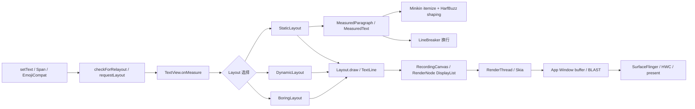

# 2.21 文字渲染性能

文字相关卡顿不能只归到 `TextView.onMeasure()`。一段文字从业务数据变成屏幕像素，至少会经过内容处理、段落测量、换行、View 绘制命令录制、Skia 字形资源准备和窗口 buffer 提交。这些工作分布在不同线程，也受不同缓存约束。

排查时先回答两个问题：

1. 本帧为什么需要重新排版或重录文字？
2. 最早超时的是主线程、RenderThread/GPU，还是后续窗口显示链路？

列表滚动不代表每个可见 `TextView` 每帧都会重新 measure；RenderThread 上出现文字相关开销，也不能反推主线程必然重新执行文字整形。

## 先按线程和产物拆开

Android 17 上，普通 View 页面仍走标准的 HWUI App Window 路径。文字工作可分为五层：

| 层次 | 常见线程 | 主要产物 | 典型触发条件 |
|---|---|---|---|
| 内容处理 | 调用 `setText()` 的线程，通常是主线程 | `CharSequence`、Span、EmojiCompat 处理结果 | bind、文本更新、filter、linkify、emoji 处理 |
| 排版准备 | 主线程，或显式预计算线程 | `MeasuredParagraph` / `MeasuredText`、行断点、`Layout` | 新文本、宽度或测量参数变化 |
| 绘制录制 | 主线程 | RenderNode / DisplayList 中的文字绘制命令 | View 失效、DisplayList 需要重录 |
| 绘制执行 | RenderThread / GPU | Skia text blob、strike/glyph 资源、App Window buffer | DisplayList 回放、字形资源冷启动、GPU 提交 |
| 显示 | SurfaceFlinger / HWC / Display | 合成后的 display frame | buffer latch、composition、present |

下面的流程图标出排版和出图的分界。它描述的是标准硬件加速 View 页面；软件 Canvas、自定义原生文字引擎或独立 Surface 需要另行分析。



`measure`、`layout` 和 `draw` 由 `ViewRootImpl.performTraversals()` 根据脏标记决定是否执行。只改变滚动位置且能复用 item 与 DisplayList 时，文字布局可能完全不重建；新 item bind、宽度变化、字体参数变化或 `requestLayout()` 才会把排版工作带回本帧。

## `TextView` 怎样选择 Layout

`TextView.makeNewLayout()` 最终调用 `makeSingleLayout()`。Android 17 的选择条件比“单行用 Boring、多行用 Static、EditText 用 Dynamic”更复杂。

### `DynamicLayout`：面向可变或可选择文本

`TextView.useDynamicLayout()` 在以下任一条件成立时返回 true：

- 文本可选择；
- `mSpannable` 非空，并且当前文本没有以 `PrecomputedText` 形式保存。

因此，`DynamicLayout` 不只服务于 `EditText`。可选择的普通 `TextView` 或需要监听 Span 变化的文本也可能使用它。它通过 `reflow()` 更新受编辑影响的区域，并维护供硬件加速绘制使用的 block 信息；增量更新表示无需每次重建全部文本，但不保证每次编辑的成本都很小。

### `BoringLayout`：资格比“单行无 Span”更严格，也更细

在不需要 `DynamicLayout` 时，`TextView` 先调用 `BoringLayout.isBoring()`。Android 17 的实现会拒绝：

- 换行符或制表符；
- 可能影响双向文本的字符和 surrogate code unit；
- 按 text-direction heuristic 判断为 RTL 的整段文本；
- 任意 `ParagraphStyle`。

`CharacterStyle` 并不会统一让 `isBoring()` 失败，所以“有任何 Span 就不能用 BoringLayout”也不准确。通过资格检查后，文字宽度和 ellipsize 条件还要适合当前可用宽度，`TextView` 才会构造或复用 `BoringLayout`。

`setSingleLine(true)` 或 `maxLines=1` 都不能强制这条路径。包含换行、RTL、surrogate emoji 或段落级样式时，单行显示仍可能落到 `StaticLayout`。反过来，部分 BMP 文字即使不是拉丁字母，只要满足上述条件，也可能被判定为 boring。

`BoringLayout` 的“简单”指单行、LTR 和较少的段落结构，不代表跳过文字整形。`isBoring()` 仍通过 `TextLine.metrics()` 计算宽度和字体指标；ellipsize 后还可能再次测量。它比完整多行换行少做一些工作，但不能简化成“一次 `Paint.measureText()`”。

### `StaticLayout`：不可变多行文本的主路径

其余常见文本由 `StaticLayout.Builder` 构建。构造过程大致分成两步：

1. 为每个段落取得或创建 `PrecomputedText.ParagraphInfo`，其中保存 `MeasuredParagraph`；
2. 把 `MeasuredParagraph` 与当前宽度、indent、break strategy、hyphenation、justification 等约束交给 `LineBreaker.computeLineBreaks()`。

`StaticLayout` 还要处理 `LeadingMarginSpan`、`LineHeightSpan`、tab、ellipsize、最大行数、行高和每行方向信息。长文本是否慢，不能只按字符数判断；段落数、run 数、Span 边界、字体 fallback、宽度和断行策略都会改变工作量。

## Minikin：字体选择、整形和断行要分开看

Android 17 的 Minikin `LayoutPiece` 先调用 `FontCollection.itemize()` 把输入分成字体 run，再对 script run 调用 `hb_shape()`。`android-17.0.0_r1` 中的 `external/harfbuzz_ng` 对应 HarfBuzz 11.4.1。

文字整形把 Unicode 输入映射为 glyph、cluster、advance 和 offset。不要使用“一个 Unicode 对应一个 glyph”判断复杂度：连字、组合附加符号、emoji ZWJ 序列、variation selector 和字体 fallback 都会改变码点与 glyph 的关系。不同语言脚本的开销也不能用固定倍数排序，应以目标字体、真实语料和设备测量为准。

### 断行包含两个阶段

Minikin 的 `WordBreaker` 使用 ICU break iterator 提供候选断点，`LineBreaker` 再按当前宽度和 break strategy 选择实际行断点。CJK、泰文、URL、emoji 序列等文本使用的规则不同；“CJK 都靠字典查找”不是通用描述。

只有断行策略不是 `BREAK_STRATEGY_SIMPLE`，且 hyphenation frequency 不是 `NONE` 时，自动连字符才进入对应的测量路径。Android 17 的 `TextView` 注释还保留了版本边界：

- Android 10 之前，主题默认可能是 `HYPHENATION_FREQUENCY_NORMAL`；
- Android 10 起，`TextView` 和 `EditText` 的主题默认改为 `NONE`；
- 自建 `PrecomputedText.Params.Builder` 的默认值与 `TextView` 未必相同，应优先从目标 View 取得 `getTextMetricsParams()`。

优化前应读取实际的 `breakStrategy` 和 `hyphenationFrequency`。在默认已经为 `NONE` 的设备上重复设置，不会减少排版工作。

### Android 17 的缓存边界

Minikin 的 `LayoutCache` 是进程内单例 LRU，当前最多保存 5000 个 entry；长度达到 128 个 UTF-16 code unit 的待整形 piece 会绕过这层缓存。key 包含文字上下文与 range、font collection id、字号、scale/skew、letter/word spacing、locale、方向、font feature、variation settings 和 hyphen edit。

可用宽度不在文字整形缓存键中。因此：

- 宽度变化通常会让 `StaticLayout` 重新断行，但相同 shaping piece 仍可能命中 Minikin cache；
- 文本、字体、locale、方向或 variation settings 改变，会形成不同 key；
- 两条业务文本只有局部字词相同，不代表必然共享缓存，因为 key 还包含传入的文字上下文和 range。

`TextLine` 还有一个容量为 3 的静态对象池，用于减少临时对象分配。它缓存可复用对象，不保存排版结果。Skia 的 `StrikeCache` 则管理 GPU 文字 strike/glyph 资源；它和 Minikin shaping cache 属于不同阶段，不能合并计算所谓的文字缓存命中率。

## Span 与 Emoji：先判断它改变哪一层

### 并非所有 Span 都会增加 shaping 成本

Span 的影响取决于类型：

| Span 类型 | 主要影响 |
|---|---|
| `MetricAffectingSpan` | 改变字号、Typeface、scale 等测量参数，会切分测量 run |
| `ReplacementSpan` / `ImageSpan` | 通过 `getSize()` 提供替代宽度，并在 draw 阶段执行自定义绘制 |
| `ParagraphStyle` | 影响 margin、tab、行高或段落布局；也会让 `BoringLayout.isBoring()` 失败 |
| `CharacterStyle` | 通常改变颜色、背景或绘制效果；不一定改变测量 |
| `ClickableSpan` | 主要增加点击命中和 movement method 处理，本身不是文字测量参数 |

评估富文本时应统计会改变 metrics 的 Span 边界、replacement 数量和段落级 Span，而不是把所有 Span 数量直接换算成排版耗时。

### 系统 emoji 与 EmojiCompat 是两条路径

系统 emoji 通过系统或厂商字体参与 fallback、shaping 和 Skia 绘制。EmojiCompat/emoji2 则先把需要兼容的序列处理成带 `EmojiSpan` 的 `Spanned`；当前 AndroidX 实现中，`TypefaceEmojiSpan` 最终切换到 emoji typeface 并调用 `Canvas.drawText()`，不应描述成每次绘制都先 decode bitmap。

EmojiCompat 的成本也要分开：

- 初始化和 downloadable font 准备属于字体加载阶段；
- `EmojiCompat.process()` 扫描并生成 Span，官方允许在后台处理并缓存结果；
- `EmojiSpan.getSize()` 和 `draw()` 属于布局/绘制阶段；
- 新 glyph 的 Skia 资源准备属于后续绘制执行阶段。

AndroidX 默认 initializer 会把字体加载推迟到首个 Activity resume 之后，避免直接与首屏争用资源；手动配置时也要分别测量下载、初始化和首屏绘制。

## 优化时优先减少无效重建

### `PrecomputedText` 预计算段落测量，不包含最终宽度

API 28 的 `PrecomputedText.create()` 会预先生成每个段落的 `MeasuredParagraph` / native `MeasuredText`，包括文字测量和 glyph positioning。`StaticLayout` 收到兼容的 `PrecomputedText` 后可以复用这些 `ParagraphInfo`。

`PrecomputedText.Params` 包含 `TextPaint`、text direction、break strategy、hyphenation frequency 和 `LineBreakConfig`，不包含 View 的最终可用宽度。最终的 line breaking、maxLines、ellipsize、行距和高度计算仍在创建 `Layout` 时完成。

下面的示例强调两个工程边界：参数从目标 `TextView` 取得，异步结果必须防止 RecyclerView holder 复用后写回旧内容。

```kotlin
class MessageHolder(
    private val textView: TextView,
    private val executor: Executor
) {
    private var bindGeneration = 0

    fun bind(content: CharSequence) {
        val generation = ++bindGeneration
        val params = textView.textMetricsParams

        executor.execute {
            val computed = PrecomputedText.create(content, params)
            textView.post {
                if (generation == bindGeneration
                    && textView.textMetricsParams == params
                ) {
                    textView.text = computed
                }
            }
        }
    }
}
```

这段代码只演示预计算结果的所有权。实际项目还要取消无用任务、限制队列长度，并按 API 版本选择 platform 或 AndroidX 实现。`TextView.setText(PrecomputedText)` 遇到不兼容的测量参数会抛出 `IllegalArgumentException`；只有可重新计算的方向差异时，framework 也可能重新计算。

AndroidX 的 `AppCompatTextView.setTextFuture()` 会在 `onMeasure()` 中调用 `future.get()`。如果后台任务尚未完成，主线程仍会阻塞等待。它适合提前 prefetch，但不能保证调用后的主线程完全没有文字处理成本。

### 列表场景按触发源优化

优先处理这些会重复创建 Layout 的原因：

1. 用 payload 或内容 diff 避免对未变化字段重复 `setText()`；
2. 固定 item 的文字宽度约束，避免动画期间反复改变可用宽度；
3. 在数据层预先生成稳定的富文本或 EmojiCompat 结果，避免 bind 时重复扫描；
4. 缩小 `MetricAffectingSpan` 与 `ReplacementSpan` 的数量和覆盖范围；
5. 对长文本使用预计算，并让任务在 item measure 前完成；
6. 把字体下载、Typeface 创建和大段文本解析移出首个需要显示它们的帧。

`TextView.setText()` 不只是保存一个引用。它还可能执行 filter、listener 通知、spannable/watcher 处理、auto-link、transformation，并通过 `checkForRelayout()` 立即重建内部 Layout 或申请新的 View layout。重复设置相同内容仍应由应用层避免。

### 不把视觉参数包装成性能开关

`includeFontPadding` 决定首尾行使用 font top/bottom 还是 ascent/descent。关闭后布局可能更紧凑，但不能据此宣称测量更快；对阿拉伯文、Kannada 或带高低延伸的字体，还要验证是否裁切。

API 35 增加了以字形 bounds 计算宽度和处理起始悬垂的相关 API。Android 17 的 `TextView` 对 target SDK 35 及以上默认启用 `useBoundsForWidth`；`shiftDrawingOffsetForStartOverhang` 默认仍为 false，并且只有前者启用时才生效。自建 `StaticLayout.Builder` 的默认值要按 Builder 文档单独确认。

这些选项用于修正 advance width 与 glyph bounds 不一致造成的裁切和对齐。它们会影响宽度、断行或 drawing offset，开启前应做视觉回归和基准测试，不应给出“只有微秒级成本”这类脱离字体与文本的结论。

### 可变字体动画要检查轴值是否稳定

Android 17 的 Minikin `Font.cpp` 会缓存调整后的 HarfBuzz font 和 typeface；同时，variation settings 也是 `LayoutCacheKey` 的一部分。重复使用相同 axis 组合可能复用对象和 shaping 结果，连续扫过大量不同 axis 值则会产生不同 cache key。

字重动画若每帧修改 variation settings，可能同时带来排版、DisplayList 重录和 glyph 资源变化。先用真实动画范围做冷/热两组测量，再决定是否降低更新频率、量化 axis 值或改用不会改变文字 metrics 的视觉方案。

## Perfetto：从窗口级证据逐步缩小

Android 17 的 `ViewRootImpl` 在 `TRACE_TAG_VIEW` 下稳定记录窗口级 `measure`、`layout` 和 `draw`。逐 View 的 `onMeasure TextView ...` / `onLayout ...` 只有启用 framework 的 traversal tracing 后才会出现；普通应用 trace 不能假定存在 `TextView.onMeasure()` slice。

采集时至少启用：

- `view`、`gfx` atrace category；
- 目标应用的 atrace；
- `sched` 与 CPU frequency/idle；
- FrameTimeline；
- 需要判断 GPU 时，再加入设备支持的 GPU data source。

先用 FrameTimeline 锁定 jank frame，再按以下顺序判断：

| 观察结果 | 下一步 |
|---|---|
| 主线程窗口级 `measure` 很长 | 检查本帧为何 `requestLayout`，再用采样栈或自定义 trace 找 TextView/Span/业务解析 |
| `measure` 正常，主线程 draw/DisplayList 录制长 | 检查大量脏 TextView、复杂 `ReplacementSpan`、阴影/路径文字和重复 invalidate |
| 主线程按时，RenderThread `DrawFrame` 变长 | 区分 Skia/GPU 工作、glyph 资源冷启动、其他 View 绘制与 buffer wait |
| App SurfaceFrame 按时，DisplayFrame 超时 | 沿 BLAST、SurfaceFlinger、HWC 和 present 分析，不能继续只改文字布局 |
| 只在首次字体、emoji 或生僻字出现时变慢 | 对比冷/热运行，检查字体准备、EmojiCompat 初始化和 Skia strike/glyph cache |

窗口级 `measure` 无法定位到具体控件时，可以在应用可控的边界补少量 trace。下面的标记用于区分业务富文本构造和 `setText()`，不要在每个字符或每个 Span 上打点。

```kotlin
Trace.beginSection("messageText/buildSpans")
val displayText = try {
    buildMessageSpans(message)
} finally {
    Trace.endSection()
}

Trace.beginSection("messageText/setText")
try {
    holder.textView.text = displayText
} finally {
    Trace.endSection()
}
```

如果 `buildSpans` 已经超时，先修内容处理；如果它很短而后续窗口级 `measure` 变长，再看 Layout、width 和 metrics。自定义 trace 只提供 wall time，还要配合 CPU sample、线程状态和 FrameTimeline 判断是在执行、被抢占还是等待。

### 基准测试至少分四组

文字缓存可能让一次 warm run 掩盖冷启动成本。可复用的测试对照如下：

| 维度 | 对照组 |
|---|---|
| 缓存 | 首次显示 / 重复显示 |
| 内容 | 短 Latin、CJK、RTL/复杂脚本、emoji ZWJ、混合字体 |
| 排版 | 固定宽度 / 宽度变化，简单断行 / 高质量断行与 hyphenation |
| 样式 | 纯文本 / `MetricAffectingSpan` / `ReplacementSpan` / ParagraphStyle |

记录 Android build、字体文件/版本、locale、刷新率、应用构建类型和文本长度。没有这些条件，跨设备的“快几倍”没有可比性。

## 版本演进

| 版本 / 组件 | 可核对变化 | 对性能分析的影响 |
|---|---|---|
| Android 5.0 / API 21 | AOSP 已有独立 `frameworks/minikin` | 平台文字测量可沿 Minikin 源码分析 |
| Android 6.0 / API 23 | `StaticLayout.Builder` 公开 | 自定义多行排版可显式设置断行、hyphenation、ellipsize 等参数 |
| Android 8.0 / API 26 | `StaticLayout.Builder.setJustificationMode()` 公开 | justification 成为需要单独记录的排版变量 |
| Android 9 / API 28 | `PrecomputedText` 公开 | shaping/measurement 可以提前执行，最终宽度断行仍留在 Layout 构建阶段 |
| Android 10 / API 29 | `TextView` / `EditText` 主题默认 hyphenation 改为 `NONE` | 不能把“关闭默认 hyphenation”当成 Android 10+ 的通用优化 |
| Android 12 / API 31 | `Canvas.drawGlyphs()` 公开；FrameTimeline 可用于标准 App Window | 自定义 glyph 绘制有公开入口，掉帧归因应连接 App SurfaceFrame 与 DisplayFrame |
| Android 13 / API 33 | `LineBreakConfig` 公开 | line-break style / word style 进入测量参数与预计算兼容性判断 |
| Android 15 / API 35 | bounds-for-width、start overhang 和 minimum font metrics API 公开；target 35+ 的 `TextView` 默认使用 glyph bounds 计算宽度 | 升级 target 后需要回归文字宽度、换行、对齐与裁切 |
| Android 17 / API 37 | 当前源码锚点；Minikin 当前 layout/variation cache、HarfBuzz 11.4.1、HWUI/Skia text blob 路径 | 当前方法名和缓存 key 按 `android-17.0.0_r1` 解读；是否为 Android 17 新增需另查历史 tag |
| AndroidX emoji2 / appcompat | 独立于 platform 发布 | 记录具体依赖版本、字体来源、初始化策略与 `setTextFuture()` 是否等待 |

## 常见误区

### 列表滚动时，每个 TextView 都会重走 measure、layout、draw

Traversal 会依据脏标记、MeasureSpec 和缓存决定工作。复用 DisplayList 的 item 可以只改变位置；新 bind、宽度变化或 layout request 才可能重建文字 Layout。

### 单行文本一定使用 BoringLayout

单行只是必要条件之一。RTL、surrogate、换行/制表符、ParagraphStyle、宽度和 ellipsize 条件都会改变选择结果。

### 所有 Span 都会让 shaping 成本成倍增加

只有改变 metrics、replacement 或段落布局的 Span 会直接改变对应排版阶段。颜色和点击 Span 的主要成本在绘制或交互，不应与 `MetricAffectingSpan` 混算。

### PrecomputedText 已经算好最终换行

它预计算段落测量和 glyph positioning，Params 不包含最终宽度。`StaticLayout` 仍要按当时的宽度、maxLines、ellipsize 和行距计算行布局。

### RenderThread 慢说明 TextView.onMeasure 慢

`onMeasure()` 在主线程执行；RenderThread 处理 DisplayList、Skia/GPU 和窗口 buffer。两边可能因同一次文本变化同时增加工作，但必须分别取证。

## 与其他机制的关系

- **§2.1 / §2.4 Choreographer**：文字更新只有在触发 traversal 或 draw 时才进入帧生产。
- **§2.5 MainThread/RenderThread**：主线程负责内容处理、排版和 DisplayList 录制，RenderThread/GPU 负责后续执行与窗口 buffer。
- **§7.8 RecyclerView**：prefetch、payload、holder 复用和宽度稳定性决定预计算是否来得及完成。
- **§7.10 View 体系**：先找 `requestLayout()` 与脏区域来源，再判断 TextView 是否为主要贡献者。

## 参考资料

- [AOSP Android 17 `TextView`](https://android.googlesource.com/platform/frameworks/base/+/refs/tags/android-17.0.0_r1/core/java/android/widget/TextView.java)
- [AOSP Android 17 `View`](https://android.googlesource.com/platform/frameworks/base/+/refs/tags/android-17.0.0_r1/core/java/android/view/View.java)
- [AOSP Android 17 `ViewRootImpl`](https://android.googlesource.com/platform/frameworks/base/+/refs/tags/android-17.0.0_r1/core/java/android/view/ViewRootImpl.java)
- [AOSP Android 17 `BoringLayout`](https://android.googlesource.com/platform/frameworks/base/+/refs/tags/android-17.0.0_r1/core/java/android/text/BoringLayout.java)
- [AOSP Android 17 `StaticLayout`](https://android.googlesource.com/platform/frameworks/base/+/refs/tags/android-17.0.0_r1/core/java/android/text/StaticLayout.java)
- [AOSP Android 17 `DynamicLayout`](https://android.googlesource.com/platform/frameworks/base/+/refs/tags/android-17.0.0_r1/core/java/android/text/DynamicLayout.java)
- [AOSP Android 17 `PrecomputedText`](https://android.googlesource.com/platform/frameworks/base/+/refs/tags/android-17.0.0_r1/core/java/android/text/PrecomputedText.java)
- [AOSP Android 17 `MeasuredParagraph`](https://android.googlesource.com/platform/frameworks/base/+/refs/tags/android-17.0.0_r1/core/java/android/text/MeasuredParagraph.java)
- [AOSP Android 17 `MeasuredText`](https://android.googlesource.com/platform/frameworks/base/+/refs/tags/android-17.0.0_r1/graphics/java/android/graphics/text/MeasuredText.java)
- [AOSP Android 17 `TextLine`](https://android.googlesource.com/platform/frameworks/base/+/refs/tags/android-17.0.0_r1/core/java/android/text/TextLine.java)
- [AOSP Android 17 HWUI `SkiaCanvas`](https://android.googlesource.com/platform/frameworks/base/+/refs/tags/android-17.0.0_r1/libs/hwui/SkiaCanvas.cpp)
- [Minikin Android 17 `LayoutCache`](https://android.googlesource.com/platform/frameworks/minikin/+/refs/tags/android-17.0.0_r1/include/minikin/LayoutCache.h)
- [Minikin Android 17 `LayoutCore`](https://android.googlesource.com/platform/frameworks/minikin/+/refs/tags/android-17.0.0_r1/libs/minikin/LayoutCore.cpp)
- [Minikin Android 17 `WordBreaker`](https://android.googlesource.com/platform/frameworks/minikin/+/refs/tags/android-17.0.0_r1/libs/minikin/WordBreaker.cpp)
- [Minikin Android 17 `Font`](https://android.googlesource.com/platform/frameworks/minikin/+/refs/tags/android-17.0.0_r1/libs/minikin/Font.cpp)
- [HarfBuzz Android 17 snapshot](https://android.googlesource.com/platform/external/harfbuzz_ng/+/refs/tags/android-17.0.0_r1/meson.build)
- [Skia Android 17 `StrikeCache`](https://android.googlesource.com/platform/external/skia/+/refs/tags/android-17.0.0_r1/src/text/gpu/StrikeCache.cpp)
- [Android Developers：`PrecomputedText`](https://developer.android.com/reference/android/text/PrecomputedText)
- [Android Developers：`StaticLayout.Builder`](https://developer.android.com/reference/android/text/StaticLayout.Builder)
- [Android Developers：EmojiCompat / emoji2](https://developer.android.com/develop/ui/views/text-and-emoji/emoji2)
- [AndroidX `AppCompatTextView`](https://android.googlesource.com/platform/frameworks/support/+/androidx-main/appcompat/appcompat/src/main/java/androidx/appcompat/widget/AppCompatTextView.java)
- [AndroidX `PrecomputedTextCompat`](https://android.googlesource.com/platform/frameworks/support/+/androidx-main/core/core/src/main/java/androidx/core/text/PrecomputedTextCompat.java)
- [Perfetto：Android system tracing](https://perfetto.dev/docs/learning-more/android)
- [Perfetto：ATrace](https://perfetto.dev/docs/data-sources/atrace)
