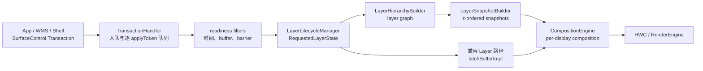

---


title: "SurfaceFlinger FrontEnd 与 RequestedLayerState"
chapter: "2.22"
section: "2.22"
status: finalized
finalized_by: openclaw-task2b-verifier
drafted_date: "2026-05-18"
applicable_versions: "Android 14 (API 34) - Android 17 (API 37)"
last_verified: "2026-07-25"
last_verified_against: "AOSP android-17.0.0_r1 frameworks/native/services/surfaceflinger/FrontEnd + SurfaceFlinger.cpp; rendering_pipelines S01/S03/S05/S06"
confidence: high
pipeline_stage: ready-to-publish
tags: [rendering, surfaceflinger, frontend, requestedlayerstate, transaction]
related_chapters: ["2.6", "2.12", "2.13", "2.16", "18.10", "13.3"]
created_by: "task2a-knowledge-gap"
created_date: "2026-05-18"
gap_source: "素材驱动/AOSP结构/官方文档"
sources:
  - type: aosp
    path: "frameworks/native/services/surfaceflinger/FrontEnd/readme.md"
  - type: aosp
    path: "frameworks/native/services/surfaceflinger/FrontEnd/RequestedLayerState.h"
  - type: aosp
    path: "frameworks/native/services/surfaceflinger/FrontEnd/LayerLifecycleManager.h"
  - type: aosp
    path: "frameworks/native/services/surfaceflinger/FrontEnd/LayerHierarchy.h"
  - type: aosp
    path: "frameworks/native/services/surfaceflinger/FrontEnd/LayerSnapshotBuilder.h"
  - type: aosp
    path: "frameworks/native/services/surfaceflinger/FrontEnd/TransactionHandler.h"
  - type: aosp
    path: "frameworks/native/services/surfaceflinger/FrontEnd/TransactionHandler.cpp"
  - type: official
    path: "https://source.android.com/docs/core/graphics/surfaceflinger-windowmanager"
  - type: research
    path: "DeepResearch/2026-05-09-surfaceflinger-frontend-architecture-android15.md"
task6_state: reviewed
task9_state: reviewed
task6_result: pass-light-edit
reviewed_by: openclaw-task6
reviewed_date: 2026-06-07
last_task6_at: 2026-06-07T16:07:00+08:00
task9_result: auto-fixed
task2b_state: fixed
last_task9_autofix_at: "2026-06-05"
last_task9_at: "2026-06-05T05:28:04+08:00"
task2b_result: fixed
deepseek_cn_review_state: done
last_deepseek_cn_review_at: 2026-06-08
---

# 2.22 SurfaceFlinger FrontEnd 与 RequestedLayerState

SurfaceFlinger 收到 `SurfaceControl.Transaction` 后，不能立即把每个字段原样交给 HWC。它还要处理四个问题：

1. 这笔事务是否已经到达可应用的时点？
2. 它携带的缓冲区、围栏和屏障是否满足当前帧的条件？
3. layer 的父子、relative Z 和 mirror 关系变化后，本轮应按什么顺序遍历？
4. CompositionEngine 最终应读取哪份几何、可见性、内容和效果状态？

Android 17 的 SurfaceFlinger FrontEnd 位于这段边界上。它消费事务，维护图层的服务端请求状态和生命周期，构建可遍历的图层图，再生成 CompositionEngine 使用的 `LayerSnapshot`。

下文的平台实现按 Android 17 / API 37 的 `android-17.0.0_r1` 核对。获取围栏、释放围栏和 dma-fence 的内核语义见 §2.16；这里集中说明 SurfaceFlinger 如何把围栏作为事务就绪与缓冲区使用条件。

## 1. FrontEnd 的职责边界

FrontEnd 负责把客户端请求转换为当前帧可消费的状态，不覆盖完整的显示流水线。



这张图表示职责关系，不对应逐行调用栈。Android 17 的 `SurfaceFlinger::updateLayerSnapshots()` 主要按以下顺序执行：

1. `collectTransactions()` 把无锁入口队列中的事务收集到待处理队列。
2. 新建图层先交给 `LayerLifecycleManager::addLayers()`。
3. `flushTransactions()` 只取出被就绪过滤器判定为可应用的事务。
4. `applyTransactions()` 把属性合入 `RequestedLayerState`。
5. `LayerHierarchyBuilder::update()` 更新图层图。
6. `LayerSnapshotBuilder::update()` 更新快照。
7. 当前兼容路径继续让对应 `Layer` 执行 `latchBufferImpl()`。
8. 后续合成把快照加入 `RefreshArgs`，再调用 `CompositionEngine::present()`。

因此，下面三句话不能互相替换：

- 事务已进入 `RequestedLayerState`；
- 新缓冲区已被锁存；
- 目标显示设备已经完成显示提交。

第一项是请求状态更新，后两项还涉及缓冲区、fence、CompositionEngine、HWC 和显示设备。

## 2. FrontEnd 与旧 `Layer` 对象共存

Android 17 没有用 `RequestedLayerState` 完全替换 `Layer`。

`SurfaceFlinger` 同时持有：

- `mLayerLifecycleManager`
- `mLayerHierarchyBuilder`
- `mLayerSnapshotBuilder`
- `mLegacyLayers`

`updateLayerSnapshots()` 更新 FrontEnd 状态和快照后，仍会找到对应的旧版 `Layer`，执行 `latchBufferImpl()`，并维护释放回调、FrameTimeline 和图层历史。合成阶段则把快照绑定到 `LayerFE`，供 CompositionEngine 读取。

这是一段共存实现。阅读 Android 17 源码时：

- 图层请求、层级、可见性与合成输入，优先从 FrontEnd 对象理解；
- buffer latch、release callback 和一部分历史兼容行为，仍要回到 `Layer`；
- 不要把 Android 12/13 的“逐个 `Layer` 更新全部状态”模型照搬到 Android 17；
- 也不能因为看到 FrontEnd，就假设所有旧版路径都已删除。

## 3. `RequestedLayerState` 保存什么

`RequestedLayerState` 的源码注释说明：它保存某个图层的客户端请求状态，不保存其他图层的状态。Android 17 中，它继承 `layer_state_t`：

```cpp
struct RequestedLayerState : layer_state_t {
    const uint32_t id;
    const std::string name;
    uint32_t parentId;
    uint32_t relativeParentId;
    std::shared_ptr<renderengine::ExternalTexture> externalTexture;
    ftl::Flags<Changes> changes;
    // ...
};
```

这段摘录用于说明结构关系。事务携带的通用图层属性来自 `layer_state_t`；FrontEnd 再补充服务端身份、解析后的引用、缓冲区对象、生命周期和变化索引。

### 3.1 `layer_state_t::what` 与 `RequestedLayerState::Changes`

这两组位掩码处在不同层次：

- `layer_state_t::what` 表示客户端事务带来了哪些字段。
- `RequestedLayerState::Changes` 表示这些字段合并后，服务端哪些语义区域受到了影响。

例如，缓冲区尺寸改变会产生 `Changes::Buffer`，并影响 `BufferSize` 和 `Geometry`；透明度从 0 变为非 0 时，还会影响 `Visibility`。后续代码无需再次比较所有字段，可根据变化类型决定更新范围。

Android 17 的 `Changes` 包含：

| 分组 | change flags | 主要用途 |
| --- | --- | --- |
| 生命周期 | `Created`、`Destroyed` | 新建、销毁和监听器回调 |
| 层级 | `Hierarchy`、`Z`、`Mirror`、`Parent`、`RelativeParent`、`AffectsChildren` | 更新图、排序和子节点继承 |
| 几何与可见性 | `Geometry`、`Visibility`、`VisibleRegion`、`Input` | 更新边界、遮挡、输入窗口 |
| 内容 | `Content`、`Buffer`、`SidebandStream`、`BufferSize`、`BufferUsageFlags`、`PostProcess` | 更新当前内容及合成属性 |
| 策略 | `Metadata`、`FrameRate`、`GameMode`、`Animation` | 更新元数据、刷新率投票和调度提示 |

`kMustComposite` 是一组变化后需要推动合成的标志，不包含全部变化标志。例如，`FrameRate` 还会触发所附 Choreographer 的刷新率更新；是否需要合成由各调用点分别判断。

### 3.2 为什么图层关系保存为编号

`RequestedLayerState` 使用 `parentId`、`relativeParentId`、`layerIdToMirror`、`touchCropId` 等编号表示跨图层关系，不再持有客户端句柄。这样可以避免状态对象因保存句柄而意外延长其生命周期。

对应的引用关系由 `LayerLifecycleManager` 维护。这个区别很重要：

- 编号是关系的稳定标识；
- 句柄是否仍存活，是一项生命周期条件；
- 图层是否仍有父节点，是另一项生命周期条件；
- “从可见层级不可达”和“对象可以销毁”也不是同一件事。

### 3.3 请求状态不等于最终状态

客户端的 `setPosition()` 只提供局部位置请求。`LayerSnapshotBuilder` 还要叠加以下状态：

- 父节点 transform、crop、alpha 和可见性策略；
- 相对父节点带来的遍历位置；
- 镜像路径带来的另一组几何上下文；
- 显示旋转和输出过滤器；
- 输入区域、圆角、阴影、模糊和元数据继承。

因此，Winscope 中的最终边界与事务参数不同，并不能直接说明事务丢失。应先确认父层级和遍历路径。

## 4. `LayerLifecycleManager` 管理创建、更新和销毁

`LayerLifecycleManager` 拥有 `RequestedLayerState` 集合，并维护编号到状态及反向引用的映射。它不是线程安全类；Android 17 通过 SurfaceFlinger 主线程上下文保护其成员。只有事务入口的收集过程使用 `LocklessQueue`，整个 FrontEnd 并非无锁实现。

### 4.1 新建图层

`addLayers()` 会：

- 把图层加入编号映射、`mAddedLayers` 和 `mChangedLayers`；
- 建立 parent、relative parent、mirror、touch crop 等引用；
- 处理图层栈镜像和显示镜像；
- 把 `Changes::Hierarchy` 加到全局变化集合。

新建图层会在刷新事务之前加入管理器，使同一轮中引用新图层的事务能够解析到对应状态。

### 4.2 合并事务

`applyTransactions()` 按事务中的 `ResolvedComposerState` 找到目标图层，然后调用 `RequestedLayerState::merge()`。本轮首次发生变化的图层会进入 `mChangedLayers`；各图层的变化标志再汇总到 `mGlobalChanges`。

这两个集合服务于不同问题：

- `getChangedLayers()`：需要更新哪些具体图层。
- `getGlobalChanges()`：本轮是否出现了要求重走 hierarchy、geometry、input 或 composition 的变化。

### 4.3 释放句柄不会立即删除对象

公开 FrontEnd 文档给出的生命周期规则是：

- 客户端持有的强 Binder 句柄可以维持图层生命周期；
- 父节点对子节点的关系也可以维持子节点；
- 句柄仍存活但从屏幕根节点不可达的图层会进入离屏层级，资源不会因此立即释放；
- 客户端用完后应显式释放 `SurfaceControl`，不要依赖 Java GC 的时机。

`onHandlesDestroyed()` 先把 `handleAlive` 置为 `false`。只有图层没有父节点时，`canBeDestroyed()` 才返回 true。删除父节点时，管理器还会更新子节点、relative、镜像和触摸裁剪引用，并继续处理因此满足销毁条件的图层。

### 4.4 `commitChanges()` 清理本轮变化记录

`commitChanges()` 会：

1. 通知监听器哪些图层新增；
2. 清空仍存活图层的 `what` 和 `changes`；
3. 通知监听器哪些图层已销毁；
4. 清空 added、destroyed、changed 和 global change 集合。

它不会代替快照更新。`LayerSnapshotBuilder::update()` 必须在它之前读取变化标志。Android 17 也把 `commitChanges()` 放在快照更新、缓冲区锁存和脏区域处理之后调用。

## 5. `LayerHierarchy` 为什么是图

普通父子关系可以画成树，但相对 Z 轴与镜像会让同一状态节点通过多条路径被访问。Android 17 用图表示这组关系，不为每条镜像路径复制一份 `RequestedLayerState`。

### 5.1 五种边类型

| `LayerHierarchy::Variant` | 源码语义 | 阅读方式 |
| --- | --- | --- |
| `Attached` | 父节点的普通子节点 | 随父节点继承并遍历 |
| `Detached` | 名义上仍是子节点，但当前相对父节点位于别处 | 不从原父节点的普通位置参与 Z 轴排序 |
| `Relative` | 相对父节点的子节点 | 按相对父节点的位置参与排序 |
| `Mirror` | 从另一图层或图层栈镜像 | 同一状态节点从镜像路径再次访问 |
| `Detached_Mirror` | 镜像另一图层，并忽略镜像根的局部变换 | 区分镜像根与被镜像内容的几何 |

`LayerHierarchyBuilder` 同时维护屏上根节点和离屏根节点。更新父节点、relative parent、Z 轴或镜像时，它会重新连接或排序相应节点；发现相对 Z 轴循环时，会记录问题并调用 `fixRelativeZLoop()` 解除非法关系，避免遍历无限递归。

### 5.2 Z 轴顺序规则

FrontEnd `readme.md` 将绘制顺序描述为一次中序式遍历：

1. 遍历 Z 值小于 0 的子节点；
2. 访问父节点；
3. 遍历 Z 值大于等于 0 的子节点。

relative children 值相同时，再按图层编号保持稳定顺序，较新的图层位于上方。源码不建议依赖创建顺序，调用方应尽量使用明确且唯一的 Z 值。

### 5.3 `TraversalPath` 解决镜像身份问题

同一图层编号经过不同镜像根节点时，继承到的变换、裁剪和可见性可能不同。`TraversalPath` 用 `id` 与 `mirrorRootIds` 区分这些快照；`relativeRootIds` 主要用于发现相对 Z 轴循环，`detached` 则记录路径是否仍附着到屏上层级。

同一图层编号可能对应多份最终状态。`LayerSnapshotBuilder` 因而同时维护：

- `mPathToSnapshot`：按遍历路径查找快照；
- `mIdToSnapshots`：查找同一图层编号对应的全部快照。

## 6. `TransactionHandler` 如何决定本轮应用哪些事务

`queueTransaction()` 把事务推进 `mLocklessTransactionQueue`，同时增加 `TransactionQueue` trace counter。`collectTransactions()` 再按 `applyToken` 分组放入待处理队列。

### 6.1 顺序只在同一 `applyToken` 内保证

每个待处理队列都按先进先出工作。同一 `applyToken` 的队首事务尚未就绪时，后续事务不能越过它；其他 `applyToken` 的队列仍可继续扫描。

FrontEnd 文档说明，默认情况下每个进程和每个缓冲区生产方提供不同的应用令牌。这种隔离可避免一个客户端的队首等待直接阻塞全部客户端，但不提供不同令牌之间的天然全序关系。

需要跨进程排序时，Android 17 还提供显式事务屏障。提交时间顺序不能代替跨 `applyToken` 的生效顺序。

### 6.2 三组就绪过滤器

Android 17 的 `addTransactionReadyFilters()` 按顺序注册：

| filter | 主要检查 |
| --- | --- |
| `transactionReadyTimelineCheck()` | desired present time、VSync cadence、FrameTimeline 预测是否过早 |
| `transactionReadyBufferCheck()` | buffer frame barrier、backpressure、acquire fence |
| `isBarrierSignalledOrExpired()` | 跨事务的 WAIT/SIGNAL 令牌 |

任一过滤器返回 `NotReady` 或 `NotReadyBarrier`，当前 `applyToken` 队列就会停在队首。

### 6.3 四种就绪结果

| `TransactionReadiness` | 精确含义 |
| --- | --- |
| `Ready` | 所有过滤器都允许本轮应用 |
| `NotReady` | 时间、VSync cadence、backpressure 或 fence 等普通条件未满足 |
| `NotReadyBarrier` | 缓冲区帧屏障或事务令牌屏障仍在等待 |
| `NotReadyUnsignaled` | 获取围栏尚未触发，但满足未触发锁存的候选条件 |

`NotReadyUnsignaled` 不表示忽略围栏，只表示处理器可以暂存这笔候选事务。只有本轮尚未找到其他就绪事务时，`applyUnsignaledBufferTransaction()` 才会取出一笔候选事务。后续 RenderEngine 或 HWC 读取缓冲区时仍必须遵守获取围栏。

在 `AutoSingleLayer` 配置下，候选还必须满足：

- 事务只更新一个图层；
- 它是本轮取出的第一笔事务；
- Scheduler 当前不使用 early VSync config；
- `RequestedLayerState::isSimpleBufferUpdate()` 判定为简单缓冲区更新。

后一个检查会拒绝 reparent、relative layer、layer stack、透明区域、blur region 等变化，也会拒绝 position、alpha、color transform、crop、matrix 等会改变显示语义的字段。

### 6.4 Android 17 的两类屏障

这两类机制名字相近，但数据和超时逻辑不同。

**buffer frame barrier**

`BufferData` 可以要求同一 Surface 的某个生产方帧号先被应用。`transactionReadyBufferCheck()` 会结合 `RequestedLayerState::barrierProducerId`、`barrierFrameNumber`，以及本轮已准备应用的缓冲区帧，判断依赖是否满足。Android 17 的实现对该等待使用 4 秒超时。

**transaction token barrier**

一笔事务可以携带 `KIND_WAIT` token，另一笔携带相同令牌的 `KIND_SIGNAL`。处理器会保存已经触发的令牌，默认生存时间为 5 秒；WAIT 超时后也会继续应用，以免永久阻塞。

跨 `applyToken` 的屏障可能在一次扫描的后半段才被触发。`flushTransactions()` 因此反复扫描待处理队列，直到等待屏障的事务数量不再变化，以便在同一帧继续解开已满足条件的依赖链。

这些秒数是 `android-17.0.0_r1` 的内部实现值，不是应用可以依赖的稳定 API 契约。

## 7. 从请求状态生成 `LayerSnapshot`

`LayerSnapshot` 继承 `compositionengine::LayerFECompositionState`，保存 CompositionEngine 和 RenderEngine 所需的计算结果，包括：

- 全局 Z 轴顺序与遍历路径；
- 叠加父层级后的 transform、bounds、crop 和可见性；
- buffer size、`ExternalTexture`、sideband 与内容脏区；
- alpha、blend、dataspace、HDR、圆角、阴影、模糊和后处理状态；
- input info、metadata、frame-rate vote、game mode；
- output filter、mirror crop 和 reachability。

快照还供输入、无障碍和图层跟踪等模块使用，不只服务 HWC。

### 7.1 增量更新与快速路径

`LayerSnapshotBuilder::tryFastUpdate()` 的 Android 17 条件很具体：

- 没有全局变化、没有强制更新、显示设备未变化时，可以直接返回；
- 只有 `Content` 或 `Buffer` 变化时，只合并 `getChangedLayers()` 对应的快照；
- 出现 hierarchy、geometry、visibility、input 等变化时，需要继续遍历 hierarchy；
- 强制更新或显示设备变化会更新全部快照，并进入完整更新。

只有缓冲区变化时更新成本通常较低，这一点有源码依据，但不能据此推断所有属性更新都只修改一个对象。位置、裁剪、透明度、父节点、相对 Z 轴等字段可能影响子节点或可见区域，更新范围各不相同。

### 7.2 镜像与可达性

镜像场景下，同一图层编号可以生成多份快照。每份快照继承各自遍历路径上的父级状态。

Android 17 还区分：

- `Reachable`：从根节点可达；
- `Unreachable`：当前无法从根节点到达；
- `ReachableByRelativeParent`：只能经相对父节点到达，但普通父节点不可达。

后两类不能直接视为可合成图层。`ReachableByRelativeParent` 缺少有效的父节点继承上下文，源码注释要求合成和输入模块忽略这种快照。

### 7.3 怎样交给 CompositionEngine

FrontEnd 文档说明，快照在理论上可以克隆；当前实现为了减少热路径复制，会把快照移交给 CompositionEngine，显示提交后再移回构建器。`SurfaceFlinger::composite()` 通过 `addLayerSnapshotsToCompositionArgs()` 准备图层，再调用 `mCompositionEngine->present(refreshArgs)`。

这次交接仍未决定各显示图层最终采用 DEVICE 还是 CLIENT composition。CompositionEngine 与 HWC 还要根据目标输出的能力、几何、效果和资源约束继续协商。

## 8. 如何从跟踪数据判断问题所在阶段

应分别观察请求排队、状态计算、缓冲区锁存和显示提交。

| 证据 | 能说明什么 | 不能单独说明什么 |
| --- | --- | --- |
| `TransactionQueue` counter | 尚未从 handler flush 应用的 transaction 数量 | 卡在时间、barrier、fence还是线程调度 |
| `TransactionHandler:flushTransactions` slice | 本轮筛选 pending queues 的 CPU 时间 | 新 buffer 已上屏 |
| `LayerSnapshotBuilder:update` / `FastPath` | 快照更新耗时以及是否进入快速路径 | HWC 为何选择 CLIENT 合成 |
| `LayerLifecycleManager:commitChanges` | listener 通知与 change flags 清理耗时 | transaction readiness |
| `BufferTX - <layerName>` | 某个缓冲区图层的待处理缓冲区事务 | 全部属性事务的数量 |
| Winscope transaction/layer trace | transaction、层级、可见性和几何随时间的变化 | GPU/HWC 已完成读取 |
| present/release fence | display present 或 buffer 可复用边界 | 客户端最初提交了什么请求 |

`TransactionQueue` 在 `queueTransaction()` 时增加，在就绪事务被刷新后按数量减少。它持续升高只说明消费速度跟不上入队速度，还要继续检查：

- 队首是否反复出现 `NotReadyBarrier`；
- 获取围栏是否长时间未触发；
- 期望显示时间或 FrameTimeline 是否让事务过早到达；
- 背压是否阻止同一图层连续提交缓冲区；
- SurfaceFlinger 主线程是否没有及时运行。

如果队列没有积压，而合成、HWC 验证/提交或围栏等待变长，应转向 §2.6、§2.16 和 HWC 相关章节。

## 9. 一套可复现的验证方法

验证 FrontEnd 开销时，至少准备两组负载：

1. **内容/属性组**：固定图层数量，只更新缓冲区，或只更新不会改变层级的内容属性。
2. **层级组**：使用同样的 layer 数，再加入 reparent、relative Z、mirror、create/destroy。

采集时固定设备、刷新率、构建类型和测试时长，并记录：

- 每帧提交的事务数和每笔事务的状态数；
- `TransactionQueue` 峰值及回落时间；
- `TransactionHandler:flushTransactions`、`LayerSnapshotBuilder:update` 的分位数；
- `FastPath` 命中情况；
- SurfaceFlinger 主线程的可运行、运行状态和调度延迟；
- 对应显示设备的显示围栏与 FrameTimeline 结果。

如果第二组的快照更新耗时显著增长，而 HWC 和显示提交时长接近，证据更支持层级与快照压力；如果两组 FrontEnd 切片接近，但围栏或 HWC 耗时变长，瓶颈位于下游。没有同机、同配置对照数据时，无法量化 FrontEnd 节省的毫秒数。

## 10. 应用和系统组件怎样提交事务

### 10.1 同一视觉原子操作放在一笔事务中

同一帧需要一起生效的 position、crop、alpha、visibility 和 buffer 应放在同一笔 transaction，或按明确顺序 merge 后一次 apply。transaction merge 满足结合律，但不满足交换律：后合入的同字段值会覆盖前面的值。

也不应为了减少事务数量而合并没有原子关系的更新。一笔事务中的任一关键缓冲区或屏障尚未就绪，都可能让整笔事务等待。事务粒度应由视觉一致性决定。

### 10.2 区分属性更新和层级更新

reparent、relative Z、mirror、create/destroy 会改变 hierarchy；position、crop、alpha 等几何或可见性字段也可能要求更新子节点和 visible region。只更新内容时，不要顺带反复提交无变化的层级操作。

### 10.3 动画跟随正确的帧节奏

由应用驱动的逐帧 `SurfaceControl` 动画通常应与 Choreographer/FrameTimeline 节奏对齐，避免定时器无界地产生事务。media、相机等独立数据生产方有自己的时钟，不应强行套用应用界面节奏；这类路径要通过帧率投票、时间戳和同步策略协调。

### 10.4 用完显式释放

句柄存活会让离屏图层继续占用资源。Java 代码应在生命周期结束时显式释放拥有的 `SurfaceControl`，避免把回收时机交给 GC。对 WMS、Shell 或系统动画创建的牵引层，也要检查异常与取消路径是否成对清理。

## 11. 版本边界

| 版本 | 可确认的实现边界 |
| --- | --- |
| Android 13 / API 33 | 公开 `android-13.0.0_r1` 标签中没有这组 `FrontEnd` 文件。该版本的实现通常围绕 `Layer` 内部状态与锁存路径组织。 |
| Android 14 / API 34 | 公开 `android-14.0.0_r1` tag 已包含 `RequestedLayerState`、lifecycle、hierarchy、snapshot builder 和 transaction handler。不能写成“Android 15 首次引入 FrontEnd”。 |
| Android 15 / API 35 | FrontEnd 继续演进。引用 Android 15 代码时只能说明该版本已有某机制，不能据此断言首引版本。 |
| Android 16 / API 36 | 对象主线延续，但字段、change flags、readiness 和 SurfaceFlinger 兼容路径仍在变化。 |
| Android 17 / API 37 | 当前版本锚点。以上函数名、`PostProcess` change、WAIT/SIGNAL barrier、fast path 和 legacy `Layer` 共存关系均按 `android-17.0.0_r1` 解释。 |

这些类位于 SurfaceFlinger 内部，不是稳定的 SDK API。调试其他 Android 版本或厂商分支时，应查看对应的标签或提交，不能只按 API 级别推测内部实现。

## 12. 小结

Android 17 SurfaceFlinger FrontEnd 可以按五个对象理解：

- `TransactionHandler`：按 apply token 排队，并用时间、buffer、fence 和 barrier filters 决定本轮可应用事务。
- `RequestedLayerState`：保存客户端请求在服务端合并后的状态，并把字段变化归类成 FrontEnd change flags。
- `LayerLifecycleManager`：维护图层身份、引用、创建、销毁和本轮变化集合。
- `LayerHierarchyBuilder`：用图表达 parent、relative Z、mirror 与 offscreen 关系。
- `LayerSnapshotBuilder`：把请求状态和遍历路径计算成按 Z 轴顺序排列的快照。

排查时始终问清楚当前证据属于哪一层：transaction 入队、请求状态、snapshot、buffer latch、composition strategy，还是 display present。只要这些边界没有混在一起，FrontEnd 问题就能从“SurfaceFlinger 很复杂”收敛到具体队列、filter、layer 或 traversal path。

## 参考资料

- [AOSP Android 17：SurfaceFlinger FrontEnd 总览](https://android.googlesource.com/platform/frameworks/native/+/android-17.0.0_r1/services/surfaceflinger/FrontEnd/readme.md)
- [AOSP Android 17：`RequestedLayerState.h`](https://android.googlesource.com/platform/frameworks/native/+/android-17.0.0_r1/services/surfaceflinger/FrontEnd/RequestedLayerState.h) 与 [`RequestedLayerState.cpp`](https://android.googlesource.com/platform/frameworks/native/+/android-17.0.0_r1/services/surfaceflinger/FrontEnd/RequestedLayerState.cpp)
- [AOSP Android 17：`LayerLifecycleManager.h`](https://android.googlesource.com/platform/frameworks/native/+/android-17.0.0_r1/services/surfaceflinger/FrontEnd/LayerLifecycleManager.h) 与 [`LayerLifecycleManager.cpp`](https://android.googlesource.com/platform/frameworks/native/+/android-17.0.0_r1/services/surfaceflinger/FrontEnd/LayerLifecycleManager.cpp)
- [AOSP Android 17：`LayerHierarchy.h`](https://android.googlesource.com/platform/frameworks/native/+/android-17.0.0_r1/services/surfaceflinger/FrontEnd/LayerHierarchy.h) 与 [`LayerHierarchy.cpp`](https://android.googlesource.com/platform/frameworks/native/+/android-17.0.0_r1/services/surfaceflinger/FrontEnd/LayerHierarchy.cpp)
- [AOSP Android 17：`LayerSnapshot.h`](https://android.googlesource.com/platform/frameworks/native/+/android-17.0.0_r1/services/surfaceflinger/FrontEnd/LayerSnapshot.h) 与 [`LayerSnapshotBuilder.cpp`](https://android.googlesource.com/platform/frameworks/native/+/android-17.0.0_r1/services/surfaceflinger/FrontEnd/LayerSnapshotBuilder.cpp)
- [AOSP Android 17：`TransactionHandler.h`](https://android.googlesource.com/platform/frameworks/native/+/android-17.0.0_r1/services/surfaceflinger/FrontEnd/TransactionHandler.h) 与 [`TransactionHandler.cpp`](https://android.googlesource.com/platform/frameworks/native/+/android-17.0.0_r1/services/surfaceflinger/FrontEnd/TransactionHandler.cpp)
- [AOSP Android 17：`SurfaceFlinger.cpp`](https://android.googlesource.com/platform/frameworks/native/+/android-17.0.0_r1/services/surfaceflinger/SurfaceFlinger.cpp)
- [AOSP Android 14：FrontEnd 总览](https://android.googlesource.com/platform/frameworks/native/+/android-14.0.0_r1/services/surfaceflinger/FrontEnd/readme.md)
