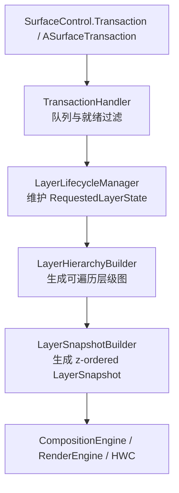

---

title: "SurfaceFlinger FrontEnd 与 RequestedLayerState"
chapter: "2.22"
section: "2.22"
status: finalized  # promoted by task2b-verifier 2026-06-08
finalized_by: openclaw-task2b-verifier
drafted_date: "2026-05-18"
applicable_versions: "Android 15 (API 35) - Android 16 (API 36); Android 17 待公开 tag 复核"
last_verified: "2026-05-18"
last_verified_against: "AOSP android-15.0.0_r1 / android-16.0.0_r1 frameworks/native/services/surfaceflinger/FrontEnd + source.android.com graphics docs; Android 17 tag 未公开"
confidence: medium
pipeline_stage: ready-to-publish
tags: [rendering, surfaceflinger, frontend, requestedlayerstate, transaction]
related_chapters: ["2.6", "2.12", "2.13", "2.16", "18.10", "13.3"]
created_by: "task2a-knowledge-gap"
created_date: "2026-05-18"
gap_source: "素材驱动/AOSP结构/官方文档"
sources:
  - type: aosp
    path: "frameworks/native/services/surfaceflinger/FrontEnd/readme.md"
  - type: aosp
    path: "frameworks/native/services/surfaceflinger/FrontEnd/RequestedLayerState.h"
  - type: aosp
    path: "frameworks/native/services/surfaceflinger/FrontEnd/LayerLifecycleManager.h"
  - type: aosp
    path: "frameworks/native/services/surfaceflinger/FrontEnd/LayerHierarchy.h"
  - type: aosp
    path: "frameworks/native/services/surfaceflinger/FrontEnd/LayerSnapshotBuilder.h"
  - type: aosp
    path: "frameworks/native/services/surfaceflinger/FrontEnd/TransactionHandler.h"
  - type: aosp
    path: "frameworks/native/services/surfaceflinger/FrontEnd/TransactionHandler.cpp"
  - type: official
    path: "https://source.android.com/docs/core/graphics/surfaceflinger-windowmanager"
  - type: research
    path: "DeepResearch/2026-05-09-surfaceflinger-frontend-architecture-android15.md"
task6_state: reviewed
task9_state: reviewed
task6_result: pass-light-edit
reviewed_by: openclaw-task6
reviewed_date: 2026-06-07
last_task6_at: 2026-06-07T16:07:00+08:00
task9_result: auto-fixed
task2b_state: fixed
last_task9_autofix_at: "2026-06-05"
last_task9_at: "2026-06-05T05:28:04+08:00"
task2b_result: auto-fixed
deepseek_cn_review_state: done
last_deepseek_cn_review_at: 2026-06-08
---

# 2.22 SurfaceFlinger FrontEnd 与 RequestedLayerState

<!-- outline-start -->
## 要点

### 🔹 FrontEnd 引入背景：Layer 状态从单体锁到请求快照
说明 Android 15 之后 SurfaceFlinger 为什么把客户端请求状态和合成计算状态拆开，重点落在事务吞吐、`mStateLock` 持锁范围、Layer 数量增长后的主线程压力。

### 🔹 RequestedLayerState：App 请求状态的稳定表示
梳理 `RequestedLayerState` 与 `layer_state_t` 的关系、`Changes` bitmask 的用途、几何/层级/元数据/帧率等字段如何记录客户端意图。

### 🔹 LayerLifecycleManager：Layer 创建、销毁与变更批处理
说明 `addLayers()`、`applyTransactions()`、`commitChanges()` 的边界，以及 `getChangedLayers()` / `getGlobalChanges()` 如何把全量状态管理变成增量更新。

### 🔹 LayerHierarchyBuilder：从请求状态构建可遍历层级
解释普通父子、relative parent、mirror layer、detached layer 的层级表达，以及为什么 SurfaceFlinger 需要在合成前重新计算遍历路径。

### 🔹 TransactionHandler：事务队列、就绪判断与 fence 约束
覆盖 `TransactionState`、`TransactionReadiness`、unsignaled buffer、present time、barrier 等因素如何决定一笔 SurfaceControl 事务是否能进入本帧。

### 🔹 FrontEnd 与合成线程的交接点
说明 FrontEnd 产出的 LayerSnapshot / 层级结果如何进入后续 composition planning，避免把 HWC、BufferQueue、Sync Fence 原理在本节重复展开。

### 🔹 观测方法：Perfetto、Winscope 与 dumpsys 如何对应 FrontEnd 状态
列出能观察事务、Layer 层级、latch 时间和合成结果的工具入口，说明哪些字段来自请求状态，哪些字段来自合成后的运行状态。

## 扩展

### 🔸 Android 15 前后 SurfaceFlinger 状态管理差异
对比旧架构中 Layer 内部状态直接更新的路径和 FrontEnd 架构的请求快照路径。

### 🔸 FrontEnd 对锁竞争与事务延迟的影响验证
设计一套验证方法：多 SurfaceControl 事务压测、Perfetto 中 SurfaceFlinger 主线程 slice、锁等待、事务排队时间和帧延迟的关联分析。

### 🔸 SurfaceControl API 使用误区
整理 App 侧频繁提交 position/alpha/crop/frameRate 事务时可能带来的调度压力，以及与 Choreographer 帧节奏的关系。

<!-- outline-end -->

## 为什么单独讲 FrontEnd

旧版 SurfaceFlinger 资料通常从 `Layer`、BufferQueue、HWC 协商开始讲。这个视角适合解释“画面怎么合成”，但不够解释 Android 15 之后越来越常见的另一个问题：大量 `SurfaceControl.Transaction` 到达 SurfaceFlinger 之后，系统怎样判断哪些事务能进本帧、哪些 Layer 状态需要重新计算、哪些信息可以直接交给合成引擎。

FrontEnd 补上的就是这段状态处理路径。按 AOSP `FrontEnd/readme.md` 的定位，FrontEnd 接收客户端对 buffer 合成方式的描述，处理 transaction，维护 layer 生命周期，并在每一帧为 CompositionEngine 提供 snapshot。换成排查语言：FrontEnd 把 App、WMS、Shell 提交的请求整理成层级和快照，供后续合成阶段直接使用。

[已验证: AOSP android-16.0.0_r1, `frameworks/native/services/surfaceflinger/FrontEnd/readme.md`]

这张图有一个排查上的分界：FrontEnd 管的是“本帧要拿哪些状态去合成”，不是“某个 buffer 为什么还没 signal”，也不是“HWC 为什么把某个 Layer 退回 CLIENT composition”。后两个问题分别回到 §2.16 Sync Fence 和 §2.6 SurfaceFlinger / HWC 协商。

## 请求状态与合成状态分开

FrontEnd 的设计把两类状态拆开：`RequestedLayerState` 保存客户端请求，`LayerSnapshot` 保存合成阶段使用的计算结果。客户端请求包括 position、alpha、crop、parent、relative parent、metadata、frame rate、buffer 等字段；合成结果还要叠加父节点变换、可见性、输入区域、圆角、阴影、镜像路径、全局 z-order、display rotation 等运行时信息。

这层拆分能减少不必要的重复计算。若一笔 transaction 只更新 buffer，系统可以走更短的 snapshot 更新路径；若层级、父子关系或 mirror 状态变化，LayerHierarchy 和 z-order 列表才需要更大范围刷新。AOSP `LayerSnapshotBuilder.h` 明确写着，它会根据 `RequestedLayerState` 的 change flags 与 `LayerLifecycleManager` 的变化信息更新已有 snapshot，并为纯 buffer 更新保留 fast path。

[已验证: AOSP android-16.0.0_r1, `LayerSnapshotBuilder.h`]

| 状态类型 | 代表结构 | 主要内容 | 典型消费者 |
| --- | --- | --- | --- |
| 客户端请求状态 | `RequestedLayerState` | `layer_state_t` 字段、父子关系、relative parent、mirror、metadata、buffer、frame rate | `LayerLifecycleManager`、`LayerHierarchyBuilder` |
| 层级遍历状态 | `LayerHierarchy::TraversalPath` | 普通父子、relative、mirror、detached、访问路径、环路检测 | `LayerSnapshotBuilder`、层级遍历 |
| 合成输入状态 | `LayerSnapshot` | 全局 z-order、父节点变换后的 bounds、可见性、输入区域、RenderEngine / CompositionEngine 需要的字段 | CompositionEngine、RenderEngine、输入与辅助功能消费者 |

对 Trace 分析来说，这个分层能避免一个常见混淆：`SurfaceControl.Transaction.setPosition()` 这类 API 只表达请求，最终参与合成的 bounds 还要经过父层级、relative Z、mirror path、display transform 等步骤才能确定。

## `RequestedLayerState`：客户端意图的服务器端表示

`RequestedLayerState` 继承自 `layer_state_t`。`layer_state_t` 是 transaction 里携带的属性集合，`RequestedLayerState` 在此基础上增加了 layer id、name、owner uid / pid、父子关系 id、mirror id、acquire fence、external texture、请求帧率、debugName、pending buffer 计数等服务器端字段。

AOSP 代码注释里还有一个容易忽略的设计点：与其他 layer 的关系用 layer id 表示，而不是继续持有 layer handle。这样状态对象不会因持有 handle 而无意延长其生命周期，销毁逻辑统一由 `LayerLifecycleManager` 管理。

[已验证: AOSP android-15.0.0_r1 / android-16.0.0_r1, `RequestedLayerState.h`]

`Changes` bitmask 是这套结构的工作索引。它把一次 merge 后的变化分成 `Hierarchy`、`Geometry`、`Content`、`Input`、`Z`、`Mirror`、`Parent`、`RelativeParent`、`Metadata`、`Visibility`、`FrameRate`、`Buffer`、`SidebandStream`、`Animation`、`BufferSize`、`GameMode`、`BufferUsageFlags` 等类型。后续组件不需要把所有字段重新扫一遍，而是根据 change flags 判断要不要重建层级、更新 snapshot、触发 composition 相关工作。

可以按这几组理解 `RequestedLayerState`：

- **几何与可见性**：position、crop、transform、alpha、flags、visible region 记录 App / WMS 对 Layer 外观的请求。
- **层级关系**：`parentId`、`relativeParentId`、`layerIdToMirror`、`layerStackToMirror`、`touchCropId` 决定 Layer 如何接入层级图。
- **内容与同步**：`externalTexture`、`acquireFenceTime`、`barrierFrameNumber`、`barrierProducerId` 表示 buffer 及其进入本帧前的约束。
- **调度提示**：`requestedFrameRate`、`gameMode`、`bufferUsageFlags` 会影响刷新率选择、游戏模式策略或 buffer 使用边界。
- **生命周期信息**：`handleAlive`、`bgColorLayer`、`mirrorIds`、`isRelativeOf` 帮助 manager 判断引用关系和销毁条件。

`RequestedLayerState` 不等同于“本帧一定会显示的状态”。它只保存请求。请求能否进本帧，还要看 `TransactionHandler` 的就绪过滤、fence、present time、barrier、以及后续 latch 与合成阶段。

## `LayerLifecycleManager`：把创建、事务和销毁批量化

`LayerLifecycleManager` 拥有一组 `RequestedLayerState`，并维护 id 到状态对象的映射。它的公开接口按调用顺序排列：`addLayers()` 接收新建 layer，`applyTransactions()` 把 transaction merge 进已有状态，`onHandlesDestroyed()` 处理 handle 释放，`commitChanges()` 提交生命周期变化并清空上一轮 change flags。

[已验证: AOSP android-16.0.0_r1, `LayerLifecycleManager.h` / `LayerLifecycleManager.cpp`]

`addLayers()` 做的工作不只是把对象放进数组。它会建立 parent、relative parent、mirror、touch crop 等引用关系；若 layer 是 display mirror，还会把对应 layer stack 上已有 root layer 纳入 mirror 列表；若 layer 是 root，也会更新 display mirror layer。层级变化会写入 `mGlobalChanges`，新增 layer 也会放进 `mChangedLayers`。

销毁路径同样不是“handle 消失就立刻释放对象”。一个 layer 的 handle 被销毁后，manager 会先把 `handleAlive` 置为 false；只有当它没有 parent 等强引用关系时，才标记 `Destroyed` 并进入待销毁集合。`commitChanges()` 执行时再通知 `ILifecycleListener`，然后清理 change flags。AOSP 注释明确要求 `commitChanges()` 放在非热路径调用，因为它不直接决定本次 composition。

这套批处理模型带来两个排查收益：

- `getChangedLayers()` 能把“本轮哪些 layer 变了”交给后续步骤，不必每帧从全量 layer 里重新推导。
- `getGlobalChanges()` 能告诉后续组件是否存在层级、几何、内容等全局变化，便于决定是否使用 fast path。

如果设备上存在大量短生命周期 layer，例如复杂启动动画、转场 leash、弹窗或临时截图 layer，`LayerLifecycleManager` 的变化量会直接影响 FrontEnd 这一帧要做多少状态整理。

## `LayerHierarchyBuilder`：Layer 层级是图，不只是树

SurfaceFlinger 的 layer 关系不能简单当作一棵树。普通父子关系是一棵树的形态，但 relative parent 会让节点按另一个父节点的 z-order 参与遍历，mirror layer 会让同一组状态从另一条路径被访问，detached layer 又会让“名义父子关系”和“当前遍历位置”分开。

`LayerHierarchy` 用图结构表达这些关系。AOSP 里列出的 variant 包括：

| Variant | 含义 | 排查时关注点 |
| --- | --- | --- |
| `Attached` | 普通 child，随 parent 参与遍历 | 常见窗口、子 surface、decor layer |
| `Detached` | 仍是 child，但当前通过 relative parent 接入另一处 | relative Z 或临时转场时容易出现 |
| `Relative` | 相对父节点参与 z-order | 判断“为什么这个 layer 不在原父节点位置显示” |
| `Mirror` | 从另一 layer 镜像而来 | 截图、转场、投屏、display mirror |
| `Detached_Mirror` | mirror 路径忽略本地 transform | 需要区分镜像源状态和镜像路径状态 |

[已验证: AOSP android-16.0.0_r1, `LayerHierarchy.h`]

`TraversalPath` 是理解 mirror 和 relative 的关键。一个 layer 可以通过多条路径被访问，路径里会记录 `mirrorRootIds`、`relativeRootIds` 和是否 detached。这样，系统不需要复制 `RequestedLayerState`，也能表达“同一个 layer 状态在不同 mirror 路径下拥有不同几何关系”的情况。

这也解释了为什么 FrontEnd 要在合成前生成可遍历层级。CompositionEngine 需要的是一份按 z-order 排好的、每个 snapshot 都带完整父级影响的列表，而客户端 transaction 提交的只是“改某个 SurfaceControl 的属性”。二者之间必须经过层级图和 traversal path 这一步。

## `TransactionHandler`：事务能不能进本帧

`TransactionHandler` 负责两件事：接收 transaction，筛出本帧可以应用的 transaction。入口 `queueTransaction()` 把 `TransactionState` 推进 `LocklessQueue`，并用 `SFTRACE_INT("TransactionQueue", ...)` 更新 Perfetto counter；`collectTransactions()` 再把 lockless queue 里的内容转移到按 `applyToken` 分组的 pending queue。

[已验证: AOSP android-16.0.0_r1, `TransactionHandler.h` / `TransactionHandler.cpp`]

`applyToken` 是事务顺序的边界。FrontEnd readme 说明，SurfaceFlinger 只保证同一 applyToken 下的 transaction 顺序；默认情况下，不同进程和不同 buffer producer 会有不同 applyToken。这能避免一个客户端的 transaction 队列长期阻塞另一个客户端。

`flushTransactions()` 会不断扫描 pending queue，并通过外部注册的 ready filter 判断队首 transaction 是否可应用。就绪结果分成四类：

| `TransactionReadiness` | 含义 | 常见原因 |
| --- | --- | --- |
| `Ready` | 可以进入本轮应用 | present time 已到、fence / barrier 条件满足 |
| `NotReady` | 还有条件没满足 | 等待 fence、present time 或其他过滤条件 |
| `NotReadyBarrier` | 被另一个 buffer 的 latch 顺序挡住 | BLAST / sync transaction 依赖前序 frame number |
| `NotReadyUnsignaled` | fence 未 signal，但在特定策略下可单独应用 | `LatchUnsignaledConfig::AutoSingleLayer` 这类单 layer 场景 |

barrier 处理有一个细节：`flushTransactions()` 会循环扫描，直到 pending barrier 数量不再变化。这是为了解开跨 applyToken 的 barrier 依赖链——否则某个本可在本帧满足的依赖可能因为扫描顺序被推迟到下一帧。

unsignaled buffer 的处理也有边界。代码只在当前没有其他 ready transaction 时，才把 `queueWithUnsignaledBuffer` 对应的 transaction 单独取出；如果已有 ready transaction，代码会打出 `fence unsignaled` trace 并跳过。这能避免把多个未完成 buffer 一起推进合成阶段。

## FrontEnd 和合成阶段的交接

FrontEnd 的输出不是 HWC 命令，也不是 RenderEngine draw call。它输出的是 `LayerSnapshot` 列表和相关遍历结果。`LayerSnapshot` 继承 `compositionengine::LayerFECompositionState`，内部包含 CompositionEngine / RenderEngine 需要读取的 layer 状态：全局 z-order、变换后的 bounds、可见性、input info、metadata、buffer size、external texture、frame rate、圆角、阴影、mirror path 等。

[已验证: AOSP android-16.0.0_r1, `LayerSnapshot.h`]

`LayerSnapshotBuilder` 会沿 `LayerHierarchy` 遍历，生成扁平的 z-ordered snapshot 列表。它也会维护 `mPathToSnapshot` 和 `mIdToSnapshots`，因为 mirror 场景下同一个 layer id 可能对应多个 traversal path。对 composition 来说，唯一的不是 layer id，而是“这个 layer 通过哪条路径来到当前位置”。

这层交接还有一个版本排查意义。Android 12-13 的资料常围绕 `INVALIDATE / REFRESH` 讲 SurfaceFlinger 主循环；Android 14+ 更常看到 `commit()`、`composite()`、`present` 这类 slice；Android 15/16 源码里，FrontEnd 是读 `commit` 之前和期间状态整理时绕不开的一层。看到 `composite()` 慢，未必是 FrontEnd；看到 transaction queue 长、layer hierarchy 变化多、snapshot 更新频繁，才更应该回到 FrontEnd 这组结构。

## 观测方法：把请求、层级和上屏结果分开看

FrontEnd 的状态不一定都有显式 UI 面板，但可以用三类工具交叉定位。

| 工具 | 看什么 | 对应 FrontEnd 层 |
| --- | --- | --- |
| Perfetto | `surfaceflinger` 主线程的 `commit` / `composite` / `present`，`TransactionQueue` counter，fence wait，BufferQueue 事件 | 事务排队、就绪过滤、合成阶段耗时 |
| Winscope | Layer hierarchy、Window / Surface 状态、transaction 变化、可见区域 | `RequestedLayerState` 与 `LayerHierarchy` 的外部表现 |
| `dumpsys SurfaceFlinger` | layer 列表、可见 layer、composition type、debugName、buffer 与合成状态 | snapshot 后的运行状态与 HWC 决策结果 |

读这些信息时要分清来源：

- **请求状态**：position、alpha、crop、parent、relative parent、frame rate 等，通常来自 App、WMS、Shell 提交的 transaction。
- **层级结果**：z-order、mirror path、detached / relative 关系，由 FrontEnd 层级构建和遍历产生。
- **合成结果**：CLIENT / DEVICE composition、present fence、release fence、HWC validate / present 耗时，属于 CompositionEngine、RenderEngine、HWC 和显示硬件路径。

实用排查顺序：先看 `TransactionQueue` 是否持续升高；再看 SurfaceFlinger 主线程是否卡在 `commit` 相关 slice；接着用 Winscope 或 dumpsys 检查是否短时间内 create、destroy、mirror、relative Z 或窗口转场 transaction 过多。如果队列不长但 `present` 或 fence wait 异常，转向 §2.16 和 §2.6 的同步与 HWC 路径。

## Android 15 前后的状态管理差异

旧资料里，Layer 状态经常和 SurfaceFlinger 主循环、`Layer` 对象内部字段一起讲。这个模型的好处是直观：收到 transaction，改 Layer；到 VSync，遍历 Layer；需要合成，就把 Layer 信息交给 HWC 或 RenderEngine。随着 Layer 数量、transaction 频率和多窗口场景增长，“改状态”和“算合成输入”会互相影响，主线程在状态整理阶段更容易变成瓶颈。

FrontEnd 之后，更适合按这条路径看：transaction 先进入队列并通过 readiness 过滤；通过过滤的 transaction merge 到 `RequestedLayerState`；生命周期 manager 记录 changed layers 和 global changes；hierarchy builder 生成可遍历图；snapshot builder 生成 CompositionEngine 输入。

| 观察点 | 旧资料里的常见理解 | FrontEnd 路径下的理解 |
| --- | --- | --- |
| transaction | 直接改 Layer 状态 | 先排队、按 applyToken 保序、通过 readiness 过滤后再 merge |
| Layer 状态 | 一个对象承载请求与合成运行态 | `RequestedLayerState` 与 `LayerSnapshot` 分工 |
| 层级 | 父子树 + z-order | 图结构，支持 relative、mirror、detached、多 traversal path |
| 增量更新 | 依赖主循环重新判断 | `Changes`、`getChangedLayers()`、`getGlobalChanges()` 指导更新范围 |
| 性能风险 | 合成或 HWC 慢 | transaction 队列、层级变化、snapshot 更新也可能成为 commit 前压力 |

这里不宜把 FrontEnd 写成“所有状态都在后台线程完成”。`LayerLifecycleManager` 注释明确说它不是线程安全类，需要外部同步；典型用法是后台收集输入状态，在 composition 开始时传给 manager 更新 layer 生命周期和状态。准确的表述是：FrontEnd 把队列、过滤、状态 merge、层级构建和 snapshot 生成拆成更清楚的阶段，减少无关客户端互相拖慢，也让后续组件更容易按变化范围更新。

[已验证: AOSP android-16.0.0_r1, `LayerLifecycleManager.h`; AOSP android-16.0.0_r1, `FrontEnd/readme.md`]

## 怎么验证 FrontEnd 是否影响事务延迟

验证 FrontEnd 对事务延迟的影响，不能只看 App 帧率。需要把 transaction 频率、SurfaceFlinger commit 耗时、layer 层级变化和上屏时间放到同一段 Trace 里。

一套可执行的验证方案：

1. **构造事务压力**：在测试 App 中创建固定数量的 child `SurfaceControl`，按 VSync 节奏批量更新 position、alpha、crop、visibility；另一组测试增加 create / remove / mirror / reparent 操作，区分纯属性更新和层级更新。
2. **采集 Perfetto**：打开 `gfx`、`view`、`binder_driver`、`sched`、`freq`、`surfaceflinger` 相关数据源，保留 SurfaceFlinger 主线程、RenderThread、Binder 线程、CPU 调度状态和 `TransactionQueue` counter。
3. **分段计算耗时**：统计 transaction apply 到 latch / present 的时间，SurfaceFlinger `commit` 相关 slice 耗时，`TransactionQueue` 是否在压力期间持续积压。
4. **对照层级变化**：用 Winscope 或 `dumpsys SurfaceFlinger` 对比测试前后 layer 数、mirror / relative / detached 情况、可见 layer 数和 composition type。
5. **排除下游瓶颈**：如果 `TransactionQueue` 不积压、`commit` 稳定，但 `present` 或 fence wait 变长，应转向 GPU / HWC / display fence；这类问题不能归到 FrontEnd。

判断口径要保守。没有同机型、同刷新率、同构建类型、同 SurfaceControl 数量和同 trace 配置的数据时，不给“FrontEnd 优化了多少毫秒”这类数字。更稳妥的结论是指出压力来源：纯 buffer 更新、属性更新、层级重建、mirror / relative path、还是下游合成等待。

## App 侧提交 `SurfaceControl.Transaction` 的边界

App、Shell 或 WMS 频繁提交 `SurfaceControl.Transaction` 时，影响不只发生在提交线程。每笔 transaction 都可能进入 SurfaceFlinger 的 per-applyToken 队列，并在后续帧里参与 readiness 过滤、状态 merge、change flag 更新和 snapshot 刷新。

常见误区有三类：

- **把每个属性拆成多笔 transaction**：同一帧内多次 `setPosition()`、`setAlpha()`、`setCrop()` 再分别 `apply()`，会增加队列与 merge 压力。能合并的属性应放进同一笔 transaction。
- **脱离帧节奏提交动画事务**：在非 Choreographer 节奏下高频提交位置或透明度变化，可能让 transaction 队列在 SurfaceFlinger 侧跨帧堆积。动画类更新最好跟显示节奏对齐。
- **把层级操作当成普通属性更新**：reparent、relative layer、mirror、create / destroy 会触发层级与 traversal path 变化，比单纯 buffer 或 alpha 更新更重。复杂转场要减少临时 layer 数量和无效 reparent。

这不是要求 App 不用 `SurfaceControl`。相反，现代窗口动画、SplashScreen、Shell transition、SurfaceView、media / camera 场景都离不开它。边界在于：一次视觉变化尽量用一笔 transaction 表达；只变内容时避免附带层级变更；只需要 App 自己重绘时，不要用额外 `SurfaceControl` 操作代替 View 层更新。

## 小结

SurfaceFlinger FrontEnd 解决的是 transaction 到 composition 输入之间的状态整理问题。`TransactionHandler` 决定哪些事务能进本帧，`LayerLifecycleManager` 维护 `RequestedLayerState` 和变化集合，`LayerHierarchyBuilder` 把请求状态组织成可遍历图，`LayerSnapshotBuilder` 再产出 CompositionEngine 能消费的 `LayerSnapshot`。

排查 Android 15+ 图形问题时，FrontEnd 提供了一条新的定位线索：如果 SurfaceFlinger 慢在 `commit` 前后的事务与层级处理，先看 transaction 队列、layer 生命周期和 snapshot 更新；如果慢在 `composite`、HWC validate / present 或 fence wait，再回到合成与同步章节。

## 参考资料

- [已验证: AOSP android-16.0.0_r1, `frameworks/native/services/surfaceflinger/FrontEnd/readme.md`]
- [已验证: AOSP android-15.0.0_r1 / android-16.0.0_r1, `frameworks/native/services/surfaceflinger/FrontEnd/RequestedLayerState.h`]
- [已验证: AOSP android-16.0.0_r1, `frameworks/native/services/surfaceflinger/FrontEnd/LayerLifecycleManager.h` / `.cpp`]
- [已验证: AOSP android-16.0.0_r1, `frameworks/native/services/surfaceflinger/FrontEnd/LayerHierarchy.h`]
- [已验证: AOSP android-16.0.0_r1, `frameworks/native/services/surfaceflinger/FrontEnd/LayerSnapshot.h` / `LayerSnapshotBuilder.h`]
- [已验证: AOSP android-16.0.0_r1, `frameworks/native/services/surfaceflinger/FrontEnd/TransactionHandler.h` / `.cpp`]
- [已验证: 官方文档, `https://source.android.com/docs/core/graphics/surfaceflinger-windowmanager`]
- [来源: `DeepResearch/2026-05-09-surfaceflinger-frontend-architecture-android15.md`]
