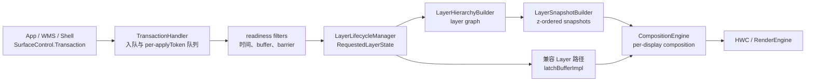

---


title: "SurfaceFlinger FrontEnd 与 RequestedLayerState"
chapter: "2.22"
section: "2.22"
status: finalized
finalized_by: openclaw-task2b-verifier
drafted_date: "2026-05-18"
applicable_versions: "Android 14 (API 34) - Android 17 (API 37)"
last_verified: "2026-07-25"
last_verified_against: "AOSP android-17.0.0_r1 frameworks/native/services/surfaceflinger/FrontEnd + SurfaceFlinger.cpp; rendering_pipelines S01/S03/S05/S06"
confidence: high
pipeline_stage: ready-to-publish
tags: [rendering, surfaceflinger, frontend, requestedlayerstate, transaction]
related_chapters: ["2.6", "2.12", "2.13", "2.16", "18.10", "13.3"]
created_by: "task2a-knowledge-gap"
created_date: "2026-05-18"
gap_source: "素材驱动/AOSP结构/官方文档"
sources:
  - type: aosp
    path: "frameworks/native/services/surfaceflinger/FrontEnd/readme.md"
  - type: aosp
    path: "frameworks/native/services/surfaceflinger/FrontEnd/RequestedLayerState.h"
  - type: aosp
    path: "frameworks/native/services/surfaceflinger/FrontEnd/LayerLifecycleManager.h"
  - type: aosp
    path: "frameworks/native/services/surfaceflinger/FrontEnd/LayerHierarchy.h"
  - type: aosp
    path: "frameworks/native/services/surfaceflinger/FrontEnd/LayerSnapshotBuilder.h"
  - type: aosp
    path: "frameworks/native/services/surfaceflinger/FrontEnd/TransactionHandler.h"
  - type: aosp
    path: "frameworks/native/services/surfaceflinger/FrontEnd/TransactionHandler.cpp"
  - type: official
    path: "https://source.android.com/docs/core/graphics/surfaceflinger-windowmanager"
  - type: research
    path: "DeepResearch/2026-05-09-surfaceflinger-frontend-architecture-android15.md"
task6_state: reviewed
task9_state: reviewed
task6_result: pass-light-edit
reviewed_by: openclaw-task6
reviewed_date: 2026-06-07
last_task6_at: 2026-06-07T16:07:00+08:00
task9_result: auto-fixed
task2b_state: fixed
last_task9_autofix_at: "2026-06-05"
last_task9_at: "2026-06-05T05:28:04+08:00"
task2b_result: fixed
deepseek_cn_review_state: done
last_deepseek_cn_review_at: 2026-06-08
---

# 2.22 SurfaceFlinger FrontEnd 与 RequestedLayerState

SurfaceFlinger 收到 `SurfaceControl.Transaction` 后，不能立即把每个字段原样交给 HWC。它还要处理四个问题：

1. 这笔 transaction 到了可以应用的时间吗？
2. 它携带的 buffer、fence 和 barrier 满足当前帧的条件吗？
3. layer 的父子、relative Z 和 mirror 关系变化后，本轮应按什么顺序遍历？
4. CompositionEngine 最终应读取哪份几何、可见性、内容和效果状态？

Android 17 的 SurfaceFlinger FrontEnd 位于这段边界上。它消费 transaction，维护 layer 的服务端请求状态和生命周期，构建可遍历的 layer 图，再生成 CompositionEngine 使用的 `LayerSnapshot`。

下文的平台实现按 Android 17 / API 37 的 `android-17.0.0_r1` 核对。acquire fence、release fence 和 dma-fence 的内核语义见 §2.16；这里集中说明 SurfaceFlinger 如何把 fence 作为 transaction readiness 与 buffer 使用条件。

## 1. FrontEnd 的职责边界

FrontEnd 负责把客户端请求转换为当前帧可消费的状态，不覆盖完整的显示流水线。



这张图表示职责关系，不对应逐行调用栈。Android 17 的 `SurfaceFlinger::updateLayerSnapshots()` 主要按以下顺序执行：

1. `collectTransactions()` 把无锁入口队列中的 transaction 收到 pending queues。
2. 新建 layer 先交给 `LayerLifecycleManager::addLayers()`。
3. `flushTransactions()` 只取出 readiness filters 判定可应用的 transaction。
4. `applyTransactions()` 把属性合入 `RequestedLayerState`。
5. `LayerHierarchyBuilder::update()` 更新 layer 图。
6. `LayerSnapshotBuilder::update()` 更新 snapshot。
7. 当前兼容路径继续让对应 `Layer` 执行 `latchBufferImpl()`。
8. 后续 composition 把 snapshot 加入 `RefreshArgs`，再调用 `CompositionEngine::present()`。

因此，下面三句话不能互相替换：

- transaction 已进入 `RequestedLayerState`；
- 新 buffer 已被 latch；
- 目标 display 已经 present。

第一项是请求状态更新，后两项还涉及 buffer、fence、CompositionEngine、HWC 和显示设备。

## 2. FrontEnd 与旧 `Layer` 对象共存

Android 17 没有用 `RequestedLayerState` 完全替换 `Layer`。

`SurfaceFlinger` 同时持有：

- `mLayerLifecycleManager`
- `mLayerHierarchyBuilder`
- `mLayerSnapshotBuilder`
- `mLegacyLayers`

`updateLayerSnapshots()` 在更新 FrontEnd 状态和 snapshot 后，仍会找到对应的 legacy `Layer`，执行 `latchBufferImpl()`、维护 release callback、FrameTimeline 和 layer history。composition 阶段则把 snapshot 绑定到 `LayerFE`，供 CompositionEngine 读取。

这是一段共存实现。阅读 Android 17 源码时：

- layer 请求、层级、可见性与合成输入，优先从 FrontEnd 对象理解；
- buffer latch、release callback 和一部分历史兼容行为，仍要回到 `Layer`；
- 不要把 Android 12/13 的“逐个 `Layer` 更新全部状态”模型照搬到 Android 17；
- 也不能因为看到 FrontEnd，就假设所有 legacy 路径都已删除。

## 3. `RequestedLayerState` 保存什么

`RequestedLayerState` 的源码注释说明：它保存某个 layer 的客户端请求状态，不保存其他 layer 的状态。Android 17 中，它继承 `layer_state_t`：

```cpp
struct RequestedLayerState : layer_state_t {
    const uint32_t id;
    const std::string name;
    uint32_t parentId;
    uint32_t relativeParentId;
    std::shared_ptr<renderengine::ExternalTexture> externalTexture;
    ftl::Flags<Changes> changes;
    // ...
};
```

这段摘录只用于说明结构关系。transaction 携带的通用 layer 属性来自 `layer_state_t`；FrontEnd 再补上服务端身份、解析后的引用、buffer 对象、生命周期和变化索引。

### 3.1 `layer_state_t::what` 与 `RequestedLayerState::Changes`

这两组 bitmask 处在不同层次：

- `layer_state_t::what` 表示客户端 transaction 带来了哪些字段。
- `RequestedLayerState::Changes` 表示这些字段合并后，服务端哪些语义区域受到了影响。

例如，buffer 尺寸改变不只产生 `Changes::Buffer`，还会影响 `BufferSize` 和 `Geometry`；alpha 从 0 变为非 0 时，还会影响 `Visibility`。后续代码不必再次比较所有字段，可以根据变化类型决定更新范围。

Android 17 的 `Changes` 包含：

| 分组 | change flags | 主要用途 |
| --- | --- | --- |
| 生命周期 | `Created`、`Destroyed` | 新建、销毁和 listener 回调 |
| 层级 | `Hierarchy`、`Z`、`Mirror`、`Parent`、`RelativeParent`、`AffectsChildren` | 更新图、排序和子节点继承 |
| 几何与可见性 | `Geometry`、`Visibility`、`VisibleRegion`、`Input` | 更新 bounds、遮挡、输入窗口 |
| 内容 | `Content`、`Buffer`、`SidebandStream`、`BufferSize`、`BufferUsageFlags`、`PostProcess` | 更新当前内容及合成属性 |
| 策略 | `Metadata`、`FrameRate`、`GameMode`、`Animation` | 更新 metadata、刷新率投票和调度提示 |

`kMustComposite` 是一组变化后需要推动 composition 的 flags，不包含全部 flags。例如，`FrameRate` 还会触发 attached choreographer 的刷新率更新；是否需要 composition 由各调用点分别判断。

### 3.2 为什么 layer 关系保存为 id

`RequestedLayerState` 使用 `parentId`、`relativeParentId`、`layerIdToMirror`、`touchCropId` 等 id 表示跨 layer 关系，不再持有客户端 handle。这样可以避免状态对象因保存 handle 而意外延长其生命周期。

对应的引用关系由 `LayerLifecycleManager` 维护。这个区别很重要：

- id 是关系的稳定标识；
- handle 是否仍存活，是生命周期条件；
- layer 是否仍有 parent，是另一个生命周期条件；
- “从可见层级不可达”和“对象可以销毁”也不是同一件事。

### 3.3 请求状态不等于最终状态

客户端的 `setPosition()` 只提供局部位置请求。`LayerSnapshotBuilder` 还要叠加以下状态：

- 父节点 transform、crop、alpha 和可见性策略；
- relative parent 带来的遍历位置；
- mirror path 带来的另一组几何上下文；
- display rotation 和 output filter；
- 输入区域、圆角、阴影、模糊和 metadata 继承。

因此，Winscope 中的最终 bounds 与 transaction 参数不同，并不能直接说明 transaction 丢失。应先确认父层级和 traversal path。

## 4. `LayerLifecycleManager` 管理创建、更新和销毁

`LayerLifecycleManager` 拥有 `RequestedLayerState` 集合，并维护 id 到状态及反向引用的映射。它不是线程安全类；Android 17 通过 SurfaceFlinger 主线程上下文保护其成员。只有 transaction 入口的收集过程使用 `LocklessQueue`，整个 FrontEnd 并非无锁实现。

### 4.1 新建 layer

`addLayers()` 会：

- 把 layer 加入 id 映射、`mAddedLayers` 和 `mChangedLayers`；
- 建立 parent、relative parent、mirror、touch crop 等引用；
- 处理 layer stack mirror 和 display mirror；
- 把 `Changes::Hierarchy` 加到全局变化集合。

新建 layer 在 flush transaction 之前加入 manager。这样，同一轮里引用新 layer 的 transaction 才能解析到对应状态。

### 4.2 合并 transaction

`applyTransactions()` 按 transaction 中的 `ResolvedComposerState` 找到目标 layer，然后调用 `RequestedLayerState::merge()`。本轮首次发生变化的 layer 会进入 `mChangedLayers`；各 layer 的 flags 再汇总到 `mGlobalChanges`。

这两个集合服务于不同问题：

- `getChangedLayers()`：需要更新哪些具体 layer。
- `getGlobalChanges()`：本轮是否出现了要求重走 hierarchy、geometry、input 或 composition 的变化。

### 4.3 释放 handle 不会立即删除对象

公开 FrontEnd 文档给出的生命周期规则是：

- 客户端持有的强 Binder handle 可以维持 layer 生命周期；
- parent 对 child 的关系也可以维持 child；
- handle 仍存活但从屏幕 root 不可达的 layer 会进入 offscreen hierarchy，资源不会因此立即释放；
- 客户端用完后应显式释放 `SurfaceControl`，不要依赖 Java GC 的时机。

`onHandlesDestroyed()` 先把 `handleAlive` 置为 `false`。只有 layer 已没有 parent，`canBeDestroyed()` 才返回 true。删除 parent 时，manager 还会更新 child、relative、mirror 和 touch-crop 引用，并继续处理因此满足销毁条件的 layer。

### 4.4 `commitChanges()` 清理本轮变化记录

`commitChanges()` 会：

1. 通知 listener 哪些 layer 新增；
2. 清空仍存活 layer 的 `what` 和 `changes`；
3. 通知 listener 哪些 layer 已销毁；
4. 清空 added、destroyed、changed 和 global change 集合。

它不会替代 snapshot 更新。`LayerSnapshotBuilder::update()` 必须在它之前读取 change flags。Android 17 的调用点也把 `commitChanges()` 放在 snapshot 更新、buffer latch 和 dirty-region 处理之后。

## 5. `LayerHierarchy` 为什么是图

普通 parent-child 关系可以画成树，但 relative Z 轴与 mirror 会让同一状态节点通过多条路径被访问。Android 17 用图表示这组关系，不为每条镜像路径复制一份 `RequestedLayerState`。

### 5.1 五种边类型

| `LayerHierarchy::Variant` | 源码语义 | 阅读方式 |
| --- | --- | --- |
| `Attached` | parent 的普通 child | 随 parent 继承并遍历 |
| `Detached` | 名义上仍是 child，但当前 relative-parent 到别处 | 不从原 parent 的普通位置参与 z-order |
| `Relative` | relative parent 的相对 child | 按 relative parent 的位置参与排序 |
| `Mirror` | 从另一 layer 或 layer stack 镜像 | 同一状态节点从镜像路径再次访问 |
| `Detached_Mirror` | 镜像另一 layer，并忽略镜像根的 local transform | 区分镜像根与被镜像内容的几何 |

`LayerHierarchyBuilder` 同时维护 onscreen root 和 offscreen root。更新 parent、relative parent、Z 或 mirror 时，它会重新连接或排序相应节点；发现 relative-Z loop 时，会记录问题并调用 `fixRelativeZLoop()` 解除非法关系，避免遍历无限递归。

### 5.2 Z 轴顺序规则

FrontEnd `readme.md` 将绘制顺序描述为一次中序式遍历：

1. 先遍历 z 小于 0 的 children；
2. 再访问 parent；
3. 最终遍历 z 大于等于 0 的 children。

relative children 值相同时，再按 layer id 保持稳定顺序，较新的 layer 位于上方。源码不建议依赖创建顺序，调用方应尽量使用明确且唯一的 Z 值。

### 5.3 `TraversalPath` 解决镜像身份问题

同一个 layer id 经过不同 mirror root 时，继承到的 transform、crop 和可见性可能不同。`TraversalPath` 用 `id` 与 `mirrorRootIds` 区分这些 snapshot；`relativeRootIds` 主要用于发现 relative-Z 循环，`detached` 则记录路径是否仍附着到 onscreen hierarchy。

同一 layer 编号可能对应多份最终状态。`LayerSnapshotBuilder` 因而同时维护：

- `mPathToSnapshot`：按 traversal path 找 snapshot；
- `mIdToSnapshots`：找到同一 layer id 对应的全部 snapshot。

## 6. `TransactionHandler` 如何决定本轮应用哪些事务

`queueTransaction()` 把 transaction 推进 `mLocklessTransactionQueue`，同时增加 `TransactionQueue` trace counter。`collectTransactions()` 再按 `applyToken` 分组放入 pending queues。

### 6.1 顺序只在同一 `applyToken` 内保证

每个 pending queue 都是 FIFO。同一个 `applyToken` 的队首 transaction 未 ready 时，后面的 transaction 不能越过它；其他 applyToken 的队列仍可继续扫描。

FrontEnd 文档说明，默认情况下每个进程和每个 buffer producer 提供不同的 apply token。这个隔离可以避免一个客户端的队首等待直接堵住全部客户端，但不提供不同 token 之间的天然全序。

需要跨进程排序时，Android 17 还提供显式 transaction barrier。提交时间顺序不能代替跨 `applyToken` 的生效顺序。

### 6.2 三组 readiness filters

Android 17 的 `addTransactionReadyFilters()` 按顺序注册：

| filter | 主要检查 |
| --- | --- |
| `transactionReadyTimelineCheck()` | desired present time、VSync cadence、FrameTimeline 预测是否过早 |
| `transactionReadyBufferCheck()` | buffer frame barrier、backpressure、acquire fence |
| `isBarrierSignalledOrExpired()` | 跨 transaction 的 WAIT/SIGNAL token |

任一 filter 返回 `NotReady` 或 `NotReadyBarrier`，当前 `applyToken` 队列就会停在队首。

### 6.3 四种 readiness 结果

| `TransactionReadiness` | 精确含义 |
| --- | --- |
| `Ready` | 所有 filter 都允许本轮应用 |
| `NotReady` | 时间、VSync cadence、backpressure 或 fence 等普通条件未满足 |
| `NotReadyBarrier` | buffer frame barrier 或 transaction token barrier 仍在等待 |
| `NotReadyUnsignaled` | acquire fence 未 signal，但满足 latch-unsignaled 的候选条件 |

`NotReadyUnsignaled` 不是“忽略 fence”。它只表示 handler 可以暂存这笔候选 transaction。只有本轮尚未找到其他 ready transaction 时，`applyUnsignaledBufferTransaction()` 才会取出一笔候选事务。后续 RenderEngine 或 HWC 读取 buffer 时仍必须遵守 acquire fence。

在 `AutoSingleLayer` 配置下，候选还必须满足：

- transaction 只更新一个 layer；
- 它是本轮取出的第一笔 transaction；
- Scheduler 当前不使用 early VSync config；
- `RequestedLayerState::isSimpleBufferUpdate()` 判定为简单 buffer 更新。

后一个检查会拒绝 reparent、relative layer、layer stack、透明区域、blur region 等变化，也会拒绝 position、alpha、color transform、crop、matrix 等会改变显示语义的字段。

### 6.4 Android 17 的两类 barrier

这两类机制名字相近，但数据和超时逻辑不同。

**buffer frame barrier**

`BufferData` 可以要求同一 surface 的某个 producer/frame number 先被应用。`transactionReadyBufferCheck()` 会结合 `RequestedLayerState::barrierProducerId`、`barrierFrameNumber`，以及本轮已准备应用的 buffer frame 判断依赖是否满足。Android 17 的实现对该等待使用 4 秒超时。

**transaction token barrier**

一笔 transaction 可以携带 `KIND_WAIT` token，另一笔携带相同 token 的 `KIND_SIGNAL`。handler 会保存已经 signal 的 token，默认 TTL 为 5 秒；WAIT 超时后也会继续应用，避免永久阻塞。

跨 `applyToken` 的 barrier 可能在一次扫描的后半段才被 signal。`flushTransactions()` 因此反复扫描 pending queues，直到等待 barrier 的 transaction 数量不再变化，以便在同一帧继续解开已满足条件的依赖链。

这些秒数是 `android-17.0.0_r1` 的内部实现值，不是 App 可以依赖的稳定 API 契约。

## 7. 从请求状态生成 `LayerSnapshot`

`LayerSnapshot` 继承 `compositionengine::LayerFECompositionState`，保存 CompositionEngine 和 RenderEngine 所需的计算结果，包括：

- 全局 z-order 与 traversal path；
- 叠加父层级后的 transform、bounds、crop 和可见性；
- buffer size、`ExternalTexture`、sideband 与内容脏区；
- alpha、blend、dataspace、HDR、圆角、阴影、模糊和后处理状态；
- input info、metadata、frame-rate vote、game mode；
- output filter、mirror crop 和 reachability。

snapshot 还有 input、无障碍、layer trace 等消费者，不只服务 HWC。

### 7.1 增量更新与 fast path

`LayerSnapshotBuilder::tryFastUpdate()` 的 Android 17 条件很具体：

- 没有 global changes、没有 force update、display 未变化时，可以直接返回；
- 只有 `Content` 或 `Buffer` 变化时，只 merge `getChangedLayers()` 对应的 snapshot；
- 出现 hierarchy、geometry、visibility、input 等变化时，需要继续遍历 hierarchy；
- force update 或 display change 会更新全部 snapshot，并进入完整更新。

所以“只有 buffer 变化更便宜”有源码依据，但不能扩写为“所有属性更新都只改一个对象”。position、crop、alpha、parent、relative Z 等字段可能影响子节点或可见区域，更新范围不同。

### 7.2 mirror 与 reachability

mirror 场景下，同一个 layer id 可以生成多份 snapshot。每份 snapshot 继承各自 traversal path 上的父级状态。

Android 17 还区分：

- `Reachable`：从 root 可达；
- `Unreachable`：当前无法从 root 到达；
- `ReachableByRelativeParent`：只能经 relative parent 到达，但普通 parent 不可达。

后两类不能简单视作可合成 layer。特别是 `ReachableByRelativeParent`，缺少有效的 parent 继承上下文，源码注释要求 composition 和 input 忽略这种 snapshot。

### 7.3 怎样交给 CompositionEngine

FrontEnd 文档说明，snapshot 理论上可以 clone；当前实现为了减少热路径复制，会把 snapshot 移交给 CompositionEngine，present 后再移回 builder。`SurfaceFlinger::composite()` 通过 `addLayerSnapshotsToCompositionArgs()` 准备 layer，再调用 `mCompositionEngine->present(refreshArgs)`。

这次交接仍未决定各 display layer 最终采用 DEVICE 还是 CLIENT composition。CompositionEngine 与 HWC 还要根据目标 Output 的能力、几何、效果和资源约束继续协商。

## 8. 如何从 trace 判断问题在哪一段

应分别观察请求排队、状态计算、buffer latch 和 present。

| 证据 | 能说明什么 | 不能单独说明什么 |
| --- | --- | --- |
| `TransactionQueue` counter | 尚未从 handler flush 应用的 transaction 数量 | 卡在时间、barrier、fence还是线程调度 |
| `TransactionHandler:flushTransactions` slice | 本轮筛选 pending queues 的 CPU 时间 | 新 buffer 已上屏 |
| `LayerSnapshotBuilder:update` / `FastPath` | snapshot 更新耗时以及是否进入 fast path | HWC 为何选择 CLIENT |
| `LayerLifecycleManager:commitChanges` | listener 通知与 change flags 清理耗时 | transaction readiness |
| `BufferTX - <layerName>` | 某个 buffer layer 的 pending buffer transaction | 全部属性 transaction 数量 |
| Winscope transaction/layer trace | transaction、层级、可见性和几何随时间的变化 | GPU/HWC 已完成读取 |
| present/release fence | display present 或 buffer 可复用边界 | 客户端最初提交了什么请求 |

`TransactionQueue` 在 `queueTransaction()` 时增加，在 ready transaction 被 flush 后按数量减少。它持续升高只说明消费速度跟不上入队速度，还要继续检查：

- 队首是否反复出现 `NotReadyBarrier`；
- acquire fence 是否长时间 unsignaled；
- desired present time 或 FrameTimeline 是否让 transaction 过早；
- backpressure 是否阻止同一 layer 连续 buffer；
- SurfaceFlinger 主线程是否没有及时运行。

如果队列不积压，而 composition、HWC validate/present 或 fence wait 变长，应转向 §2.6、§2.16 和 HWC 相关章节。

## 9. 一套可复现的验证方法

验证 FrontEnd 开销时，至少准备两组负载：

1. **内容/属性组**：固定 layer 数，只更新 buffer，或只更新不会改变 hierarchy 的内容属性。
2. **层级组**：使用同样的 layer 数，再加入 reparent、relative Z、mirror、create/destroy。

采集时固定设备、刷新率、构建类型和测试时长，并记录：

- 每帧提交的 transaction 数和每笔 transaction 的 state 数；
- `TransactionQueue` 峰值及回落时间；
- `TransactionHandler:flushTransactions`、`LayerSnapshotBuilder:update` 的分位数；
- `FastPath` 命中情况；
- SurfaceFlinger 主线程的 runnable、running 和调度延迟；
- 对应 display 的 present fence 与 FrameTimeline 结果。

如果第二组的 snapshot 更新耗时显著增长，而 HWC/present 时长接近，证据更支持 hierarchy/snapshot 压力；如果两组 FrontEnd slice 接近，但 fence 或 HWC 耗时变长，瓶颈位于下游。没有同机、同配置对照数据时，无法量化 FrontEnd 节省的毫秒数。

## 10. App 和系统组件怎样提交 transaction

### 10.1 同一视觉原子操作放在一笔 transaction

同一帧需要一起生效的 position、crop、alpha、visibility 和 buffer 应放在同一笔 transaction，或按明确顺序 merge 后一次 apply。transaction merge 满足结合律，但不满足交换律：后合入的同字段值会覆盖前面的值。

也不要为了“减少笔数”合并没有原子关系的更新。一笔 transaction 中任一关键 buffer 或 barrier 未 ready，可能让整笔 transaction 等待。粒度应由视觉一致性决定。

### 10.2 区分属性更新和层级更新

reparent、relative Z、mirror、create/destroy 会改变 hierarchy；position、crop、alpha 等几何或可见性字段也可能要求更新子节点和 visible region。只更新内容时，不要顺带反复提交无变化的层级操作。

### 10.3 动画跟随正确的帧节奏

由 App 驱动的逐帧 `SurfaceControl` 动画通常应跟 Choreographer/FrameTimeline 节奏对齐，避免定时器无界地产生 transaction。media、camera 等独立 producer 有自己的时钟，不应强行套用 App UI 节奏；这类路径要靠 frame-rate vote、时间戳和同步策略协调。

### 10.4 用完显式释放

handle 存活会让 offscreen layer 继续占用资源。Java 代码应在生命周期结束时显式释放拥有的 `SurfaceControl`，避免把回收时机交给 GC。对 WMS、Shell 或系统动画创建的 leash，也要检查异常与取消路径是否成对清理。

## 11. 版本边界

| 版本 | 可确认的实现边界 |
| --- | --- |
| Android 13 / API 33 | 公开 `android-13.0.0_r1` tag 中没有这组 `FrontEnd` 文件。旧资料通常围绕 `Layer` 内部状态与 latch 路径组织。 |
| Android 14 / API 34 | 公开 `android-14.0.0_r1` tag 已包含 `RequestedLayerState`、lifecycle、hierarchy、snapshot builder 和 transaction handler。不能写成“Android 15 首次引入 FrontEnd”。 |
| Android 15 / API 35 | FrontEnd 继续演进。引用 Android 15 代码时只能说明该版本已有某机制，不能据此断言首引版本。 |
| Android 16 / API 36 | 对象主线延续，但字段、change flags、readiness 和 SurfaceFlinger 兼容路径仍在变化。 |
| Android 17 / API 37 | 当前版本锚点。以上函数名、`PostProcess` change、WAIT/SIGNAL barrier、fast path 和 legacy `Layer` 共存关系均按 `android-17.0.0_r1` 解释。 |

这些类位于 SurfaceFlinger 内部，不是稳定的 SDK API。调试其他 Android 版本或厂商分支时，应查看对应 tag/commit，不能只按 API 级别推测内部实现。

## 12. 小结

Android 17 SurfaceFlinger FrontEnd 可以按五个对象理解：

- `TransactionHandler`：按 apply token 排队，并用时间、buffer、fence 和 barrier filters 决定本轮可应用事务。
- `RequestedLayerState`：保存客户端请求在服务端合并后的状态，并把字段变化归类成 FrontEnd change flags。
- `LayerLifecycleManager`：维护 layer 身份、引用、创建、销毁和本轮变化集合。
- `LayerHierarchyBuilder`：用图表达 parent、relative Z、mirror 与 offscreen 关系。
- `LayerSnapshotBuilder`：把请求状态和 traversal path 计算成按 z-order 排列的 snapshot。

排查时始终问清楚当前证据属于哪一层：transaction 入队、请求状态、snapshot、buffer latch、composition strategy，还是 display present。只要这些边界没有混在一起，FrontEnd 问题就能从“SurfaceFlinger 很复杂”收敛到具体队列、filter、layer 或 traversal path。

## 参考资料

- [AOSP Android 17：SurfaceFlinger FrontEnd 总览](https://android.googlesource.com/platform/frameworks/native/+/android-17.0.0_r1/services/surfaceflinger/FrontEnd/readme.md)
- [AOSP Android 17：`RequestedLayerState.h`](https://android.googlesource.com/platform/frameworks/native/+/android-17.0.0_r1/services/surfaceflinger/FrontEnd/RequestedLayerState.h) 与 [`RequestedLayerState.cpp`](https://android.googlesource.com/platform/frameworks/native/+/android-17.0.0_r1/services/surfaceflinger/FrontEnd/RequestedLayerState.cpp)
- [AOSP Android 17：`LayerLifecycleManager.h`](https://android.googlesource.com/platform/frameworks/native/+/android-17.0.0_r1/services/surfaceflinger/FrontEnd/LayerLifecycleManager.h) 与 [`LayerLifecycleManager.cpp`](https://android.googlesource.com/platform/frameworks/native/+/android-17.0.0_r1/services/surfaceflinger/FrontEnd/LayerLifecycleManager.cpp)
- [AOSP Android 17：`LayerHierarchy.h`](https://android.googlesource.com/platform/frameworks/native/+/android-17.0.0_r1/services/surfaceflinger/FrontEnd/LayerHierarchy.h) 与 [`LayerHierarchy.cpp`](https://android.googlesource.com/platform/frameworks/native/+/android-17.0.0_r1/services/surfaceflinger/FrontEnd/LayerHierarchy.cpp)
- [AOSP Android 17：`LayerSnapshot.h`](https://android.googlesource.com/platform/frameworks/native/+/android-17.0.0_r1/services/surfaceflinger/FrontEnd/LayerSnapshot.h) 与 [`LayerSnapshotBuilder.cpp`](https://android.googlesource.com/platform/frameworks/native/+/android-17.0.0_r1/services/surfaceflinger/FrontEnd/LayerSnapshotBuilder.cpp)
- [AOSP Android 17：`TransactionHandler.h`](https://android.googlesource.com/platform/frameworks/native/+/android-17.0.0_r1/services/surfaceflinger/FrontEnd/TransactionHandler.h) 与 [`TransactionHandler.cpp`](https://android.googlesource.com/platform/frameworks/native/+/android-17.0.0_r1/services/surfaceflinger/FrontEnd/TransactionHandler.cpp)
- [AOSP Android 17：`SurfaceFlinger.cpp`](https://android.googlesource.com/platform/frameworks/native/+/android-17.0.0_r1/services/surfaceflinger/SurfaceFlinger.cpp)
- [AOSP Android 14：FrontEnd 总览](https://android.googlesource.com/platform/frameworks/native/+/android-14.0.0_r1/services/surfaceflinger/FrontEnd/readme.md)
