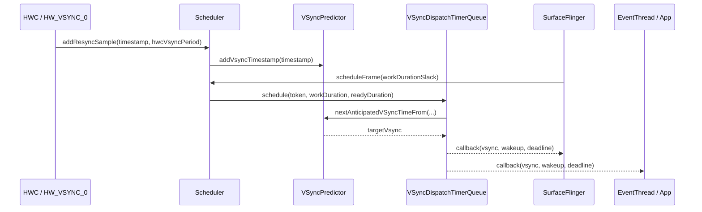
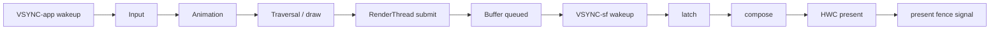

# 2.23 SurfaceFlinger VSync Scheduler 与 DisplayFrameRate 策略

<!-- outline-start -->
## 要点

### 🔹 硬件 VSync、VSyncDispatch 与 Scheduler 的分工
梳理 `HW_VSYNC_0` 进入 SurfaceFlinger 后，如何经过 `VSyncDispatch`、`Scheduler` 与 callback 分发给 App / SF 两条渲染循环。

### 🔹 VSyncPredictor 如何替代旧 DispSync 经验模型
解释预测模型需要的采样、period / phase 拟合、resync 条件，以及预测误差如何影响 latch 与 present deadline。

### 🔹 App VSync offset、SF VSync offset 与帧预算拆分
把输入处理、主线程遍历、RenderThread 提交、SurfaceFlinger latch / compose / present 放到同一条时间线里，说明 offset 为什么会改变端到端延迟。

### 🔹 DisplayFrameRate 请求与系统刷新率选择
对应 `Surface.setFrameRate()` / `View.setRequestedFrameRate()` / `SurfaceControl.Transaction.setFrameRate()`、兼容性参数、video / game / UI 场景的差异，以及 SurfaceFlinger 如何在多 layer 请求之间选择刷新率。

### 🔹 Android 15+ ARR 与 FrameRateEligibility 边界
整理 adaptive refresh rate、离散 VSync step、应用声明能力、GameManager 介入和设备策略之间的关系，避免把内容帧率、目标帧率和显示刷新率混成一个概念。

### 🔹 Perfetto 中识别 VSync 调度问题
列出 FrameTimeline、SurfaceFlinger、Choreographer、DisplayEventReceiver、HWC / present fence 等观察点，区分 App late、SF late、HWC present late 和刷新率切换带来的抖动。

## 扩展

### 🔸 VSyncPredictor 与 DispSync 的版本边界
核对 Android 11-17 的类名、启用路径和回退条件。

### 🔸 视频 24fps / 30fps 内容在 90Hz / 120Hz 设备上的刷新率选择
补充 media frame rate 文档中的典型场景，并和 8.8 多媒体管线性能交叉引用。

<!-- outline-end -->

## 为什么这一节要单独拆出来

2.3 节已经解释 VSync 的基本模型：硬件给出节拍，App 和 SurfaceFlinger 分别按 VSYNC-app、VSYNC-sf 工作。本节补上工程排障时更常用的一层：SurfaceFlinger 里的 Scheduler 怎么把硬件时间戳变成回调，怎么把刷新率请求折成一个显示模式，Perfetto 里又该按哪条时间线判断异常。

这部分容易混在一起的概念有三个：内容帧率、渲染目标帧率、显示刷新率。视频源可能是 24fps，游戏可能把目标帧率限制在 60fps，屏幕可能运行在 120Hz 或 ARR 的离散步进上。三者相等只是少数场景，系统调度的工作正是让它们在功耗、延迟和稳定性之间取得可接受的结果。

[来源: DeepResearch/2026-05-17-surfaceflinger-vsync-scheduler-frame-rate.md]

## 一、硬件 VSync 进来后，Scheduler 做了什么

SurfaceFlinger 不会把每一次硬件 VSync 原样广播给所有消费者。AOSP android-16.0.0_r1 的实现把职责拆成三层：`VsyncSchedule` 持有预测器、控制器和分发队列；`Scheduler` 管显示级策略和工作时长；`VSyncDispatchTimerQueue` 负责按预测时间唤醒注册的 callback。



`VsyncSchedule::createTracker()` 创建 `VSyncPredictor`，参数里能看到三个调度常量：历史样本数 20、预测最小样本数 6、异常样本丢弃阈值 20%。`VsyncSchedule::createDispatch()` 创建 `VSyncDispatchTimerQueue`，它把多个接近的 callback 分到同一个 VSync 目标附近，避免每个消费者都单独设一个 timer。[已验证: AOSP android-16.0.0_r1, frameworks/native/services/surfaceflinger/Scheduler/VsyncSchedule.cpp]

`Scheduler::addResyncSample()` 接收硬件时间戳后转给对应 display 的 `VsyncSchedule`。`Scheduler::addPresentFence()` 又会把 present fence 喂给控制器；如果控制器判断还缺信号，Scheduler 会打开硬件 VSync，样本够用后再关闭。这个设计让系统只在模型不稳、模式变化或 fence 信息不足时增加硬件采样，平时靠软件预测降低中断成本。[已验证: AOSP android-16.0.0_r1, frameworks/native/services/surfaceflinger/Scheduler/Scheduler.cpp]

## 二、VSyncDispatch：把目标 VSync 反推成唤醒时间

`VSyncDispatchTimerQueueEntry::schedule()` 的计算过程分三步：先找出不早于 `lastVsync`、当前时间、工作时长和 ready 时长约束的下一个 VSync，再把唤醒时间设成 `nextVsyncTime - workDuration - readyDuration`。

```text
nextVsyncTime = predictor.nextAnticipatedVSyncTimeFrom(max(lastVsync, now + workDuration + readyDuration))
readyTime     = nextVsyncTime - readyDuration
wakeupTime    = readyTime - workDuration
```

`workDuration` 是这条 callback 自己需要的执行时间，`readyDuration` 是给下一阶段预留的时间。App 侧的 callback 要给主线程、RenderThread 和 buffer 提交留空间；SF 侧的 callback 要给 latch、compose 和 HWC present 留空间。同一个 target VSync 下，App 通常更早醒，SurfaceFlinger 晚一点醒，这就是 VSYNC-app 与 VSYNC-sf 在 Perfetto 中错开的来源。[已验证: AOSP android-16.0.0_r1, frameworks/native/services/surfaceflinger/Scheduler/VSyncDispatchTimerQueue.cpp]

这套模型解释了一个排障细节：Perfetto 里看到 App 收到 VSync 早，不代表 App 有更多预算。高刷设备上周期变短，120Hz 只有约 8.33ms；如果 work duration 没变，wakeup 到 deadline 之间的余量会明显变少。offset 只是移动开工时刻，不会凭空增加 CPU/GPU 能力。

## 三、VSyncPredictor：从样本到下一次 deadline

老资料里常把 SurfaceFlinger 的软件节拍器叫 DispSync。到了 android-16.0.0_r1，公开源码中的主入口已经是 `Scheduler/` 目录下的 `VSyncPredictor`、`VSyncReactor`、`VsyncSchedule` 和 `VSyncDispatchTimerQueue`。阅读时应按职责找文件，不要只搜 `DispSync.cpp`。

`VSyncPredictor::addVsyncTimestamp()` 会先调用 `validate()`。校验做两件事：新时间戳要和当前模型对得上，且不能和已有样本过近。样本在学习期内不合格时，预测器会清掉样本重新学习；学习期之后遇到异常样本，则更新 `mKnownTimestamp` 并拒绝把它写入 ring buffer。这一步防止偶发抖动污染 period / phase 模型。[已验证: AOSP android-16.0.0_r1, frameworks/native/services/surfaceflinger/Scheduler/VSyncPredictor.cpp]

预测路径集中在 `nextAnticipatedVSyncTimeFrom()`：它先根据当前模型把请求时间吸附到最近的 VSync 序列上，再交给 `VsyncTimeline` 处理 render rate、missed VSync 和最小帧间隔。ARR / VRR 打开时，`minFramePeriod()` 不一定等于硬件 TE 周期；预测器要保证相邻帧不会违反面板允许的最小间隔。[已验证: AOSP android-16.0.0_r1, frameworks/native/services/surfaceflinger/Scheduler/VSyncPredictor.cpp]

`setRenderRate()` 是可变刷新率路径里的重要入口。刷新率升高时，旧 timeline 可能被清掉并重新开始；非立即生效的切换会把旧 timeline freeze 在已提交的 VSync 上，再插入新 timeline。Perfetto 里看到切换前后 VSYNC 间隔短暂不均匀，常见原因是 timeline 过渡，不要直接判成掉帧。[已验证: AOSP android-16.0.0_r1, frameworks/native/services/surfaceflinger/Scheduler/VSyncPredictor.cpp]

## 四、offset 改的是时序分工，不是帧周期

`Scheduler::setVsyncConfig()` 把 `VsyncConfig` 里的 `appWorkDuration`、`sfWorkDuration` 写进不同 cycle。`VsyncConfiguration.cpp` 又从系统属性和刷新率构造 Early、EarlyGl、Late 等配置。源码注释里还写明了一个边界：某些 offset 会被解释成面向 N+2 VSync，而不是 N+1 VSync。[已验证: AOSP android-16.0.0_r1, frameworks/native/services/surfaceflinger/Scheduler/Scheduler.cpp] [已验证: AOSP android-16.0.0_r1, frameworks/native/services/surfaceflinger/Scheduler/VsyncConfiguration.cpp]

一帧里常见的时间预算可以写成下面这条线：



App VSync 提早，输入到首帧绘制的延迟可能下降；SF VSync 提早，latch 和合成的安全窗口可能变大。但 App 提早太多会读到更旧的输入，SF 提早太多会更容易错过刚提交的 buffer。调 offset 时看的是端到端结果：FrameTimeline 是否 late、present fence 是否推迟、输入事件到显示的间隔是否变短。

## 五、DisplayFrameRate 请求怎样进入 SurfaceFlinger

Android 11 起，应用可以通过 `Surface.setFrameRate()` 告诉平台某个 Surface 的期望帧率。官方文档给了清晰边界：调用只是 hint，调度器会结合多 Surface、系统策略、电量模式、是否允许无缝切换等因素决定显示刷新率；应用仍要能处理系统没有切到请求刷新率的情况。[已验证: 官方文档, developer.android.com/media/optimize/performance/frame-rate]

普通 UI 的入口在 Android 15+ 又多了一层。ARR 文档建议 View 层通过 `View.setRequestedFrameRate()` 表达类别或具体帧率，滚动组件通过 `setFrameContentVelocity()` 传递内容速度，Window 层还可控制 touch boost 和 power-savings balanced 策略。SurfaceView / TextureView 明确设置的帧率会被尊重并下传到低层 layer。[已验证: 官方文档, developer.android.com/develop/ui/views/animations/adaptive-refresh-rate]

SurfaceFlinger 侧，`SurfaceFlinger.cpp` 会把前端 snapshot 中的 `frameRate` 写入 `LayerProps.setFrameRateVote`，再通过 Scheduler 的 layer history 汇总成 content requirements。`Scheduler::chooseRefreshRateForContent()` 调用 `LayerHistory::summarize()`，随后 `RefreshRateSelector::getRankedFrameRates()` 对候选刷新率排序。[已验证: AOSP android-16.0.0_r1, frameworks/native/services/surfaceflinger/SurfaceFlinger.cpp] [已验证: AOSP android-16.0.0_r1, frameworks/native/services/surfaceflinger/Scheduler/Scheduler.cpp] [已验证: AOSP android-16.0.0_r1, frameworks/native/services/surfaceflinger/Scheduler/RefreshRateSelector.cpp]

`RefreshRateSelector` 里能看到几类输入：layer 的 vote 类型、owner UID、touch signal、power-on signal、pacesetter display、当前 active mode。源码还专门处理了游戏通过 `setFrameRate()` 限制帧率后不应被 touch boost 拉高的场景。刷新率选择不会让“最高 layer”单独胜出；系统会把 layer 投票、全局信号和设备策略放在一起排序。

## 六、ARR 和 FrameRateEligibility 的边界

Android 15 引入 ARR，官方定义是：显示刷新率可用离散 VSync step 跟随内容帧率。ARR 面板上，display VSync rate 和 refresh rate 解耦；面板可以按 TE 信号的整倍数展示新帧。文档里的例子是 TE 对应 240Hz，而最大刷新率对应 120Hz，帧可以在满足 `minFrameIntervalNs` 后落到某个 VSync step 上。[已验证: 官方文档, source.android.com/docs/core/graphics/arr]

这带来三个术语边界：

- 内容帧率：视频源或游戏逻辑想生产多少帧，例如 24fps、30fps、60fps。
- 渲染目标帧率：App / View / Surface 给系统的偏好或限制，可能来自 `setFrameRate()`、`setRequestedFrameRate()`、Game Mode。
- 显示刷新率：面板实际刷新或展示新帧的频率，可能是 60Hz / 90Hz / 120Hz，也可能是 ARR 的离散 step。

DeepResearch 素材里提到 `FrameRateEligibility`。本轮按 android-16.0.0_r1 公开源码核对，只确认到 `RefreshRateSelector`、`LayerRequirement`、`LayerVoteType`、GameManager FPS intervention 和 ARR 文档中的 eligibility 语义，没有确认一个稳定可引用的同名 SurfaceFlinger 类或 API。正文把它作为“某个请求是否有资格影响刷新率选择”的策略概念处理，不把它写成固定源码入口。[待验证: FrameRateEligibility 同名实现路径]

GameManager 的帧率干预又是另一条线。官方 frame pacing 文档说明，`GameManagerService` 按用户和游戏维护 FPS、分辨率降档等 intervention 信息，SurfaceFlinger 维护 UID 到 frame rate 的映射，并在 VSync 到来时检查节流后的应用帧率是否与 VSync timestamp 同相位；不同相位时会 hold frame，直到帧率和 VSync 对上。[已验证: 官方文档, source.android.com/docs/core/graphics/frame-pacing]

## 七、Perfetto 里怎么判断调度问题

看 VSync 调度问题不要只盯单个线程的长条。较稳的顺序是按 target VSync 串起 App、SurfaceFlinger、HWC 和 present fence。

| 观察点 | 看什么 | 常见判断 |
|---|---|---|
| VSYNC-app / VSYNC-sf | 两条 VSync 轨道间距、offset 是否变化 | offset 变化常和 refresh rate 切换、Early/Late 配置或 timeline 过渡有关 |
| Choreographer / DisplayEventReceiver | App 是否按预期收到 VSync，`doFrame` 是否晚启动 | App late 常从主线程被占用、Binder 回调、锁等待开始 |
| RenderThread / GPU queue | buffer 是否在 SF latch 前提交 | RT 或 GPU 晚会导致本轮 latch 继续使用旧 buffer |
| SurfaceFlinger | commit、latch、compose、present 的起止时间 | SF late 常表现为 latch/compose 跨过 deadline |
| HWC / present fence | present fence signal 是否推迟 | HWC present late 更接近显示硬件或合成后段问题 |
| FrameTimeline | expected / actual / present 是否偏离 | ARR 场景要按变化后的 VSync interval 判断，不按固定 16.67ms 阈值 |

ARR 设备上，VSYNC 间隔变长不等于卡顿。滚动结束后降到 60Hz 或更低，是省电策略的一部分；视频 24fps 在 120Hz 上按 5:1 展示，也会让内容帧和显示刷新频率不同。异常判断应落到“目标帧是否错过自己的 expected present time”，而不是“本帧是否等于 60Hz 周期”。[已验证: 官方文档, perfetto.dev/docs/data-sources/frametimeline] [已验证: 官方文档, developer.android.com/media/optimize/performance/frame-rate]

## 八、版本边界：DispSync、VSyncPredictor 与 ARR

| 版本段 | 调度重点 | 阅读入口 |
|---|---|---|
| Android 11 | `Surface.setFrameRate()` 成为公开 API，多刷新率选择进入应用可见阶段 | `Surface.setFrameRate()` 文档、multiple refresh rate / media frame rate 文档 |
| Android 12-14 | Scheduler 目录下的预测、分发、layer history 逐步替代老式 DispSync 叙述 | `VSyncPredictor.cpp`、`VsyncSchedule.cpp`、`VSyncDispatchTimerQueue.cpp` |
| Android 15-QPR1+ | ARR 系统能力开始面向支持 HAL 的设备，显示刷新率可按离散 VSync step 调整 | source.android.com ARR 文档、`RefreshRateSelector.cpp` |
| Android 16+ | App 可见 ARR 查询和 View / Window 层策略更完整 | `Display.hasArrSupport()`、`getSupportedRefreshRates()`、`View.setRequestedFrameRate()`、Window touch boost / power savings API |

旧资料里写 DispSync 时，最好把它当成历史概念：它描述的是“用硬件样本拟合软件 VSync”的职责，不一定对应当前源码中的单个类名。当前分析以 `Scheduler/` 下的预测器、控制器和 dispatch queue 为准。

## 九、24fps / 30fps 视频在 90Hz / 120Hz 上怎么选

视频场景要从内容帧率出发。24fps 视频在 60Hz 上通常要做 3:2 pulldown，节奏不均；如果设备能切到 120Hz，每个视频帧可以对应 5 个刷新周期，节奏更稳。官方 media frame rate 文档也用 24Hz 视频触发 60Hz 到 120Hz 的切换作为例子。[已验证: 官方文档, developer.android.com/media/optimize/performance/frame-rate]

30fps 内容在 90Hz 和 120Hz 上都是整数倍，理论上都能均匀展示。最终选 90 还是 120，要看同屏其它 surface、系统刷新率范围、电量策略、是否允许无缝切换。两个 surface 同屏时，系统可能选择能同时兼容多个内容帧率的刷新率；例如 24fps 和 60fps 同时存在，120Hz 通常比 60Hz 更适合，因为 24 和 60 都能整除 120。[已验证: 官方文档, source.android.com/docs/core/graphics/multiple-refresh-rate]

短视频和长视频的策略也不同。官方建议长时间播放电影时可使用 `CHANGE_FRAME_RATE_ALWAYS`，因为匹配内容帧率带来的收益高于切换中断；预计只播放几分钟或更短时，不建议为了内容匹配强制非无缝切换。多媒体管线的解码、渲染和时间戳策略详见 8.8 节，本节只讨论 SurfaceFlinger 看到的帧率提示和显示侧选择。[已验证: 官方文档, developer.android.com/media/optimize/performance/frame-rate] 详见 8.8 节。

## 小结

SurfaceFlinger 的 VSync Scheduler 不是单纯转发硬件中断。它用 `VSyncPredictor` 建模，用 `VSyncDispatchTimerQueue` 按 work / ready duration 反推唤醒时刻，再用 `RefreshRateSelector` 把 layer 投票、GameManager 干预、touch signal 和设备策略折成一个刷新率选择。Perfetto 排障时，把 App late、SF late、HWC present late 分开看，才能避免把正常的 ARR 降频或 timeline 过渡误判成卡顿。
