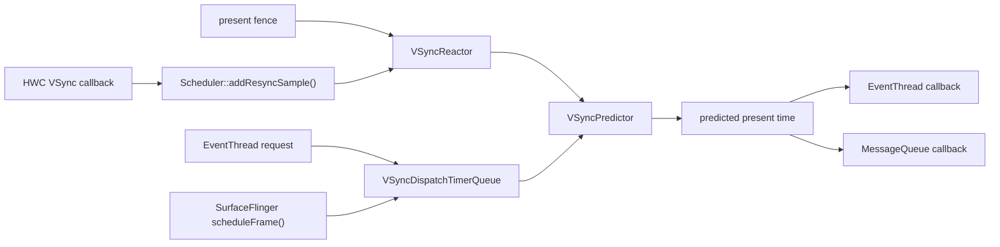
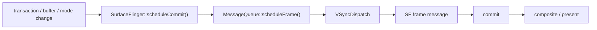

---

title: "SurfaceFlinger VSync Scheduler 与 DisplayFrameRate 策略"
chapter: "2.23"
section: "2.23"
status: finalized
applicable_versions: "Android 11 (API 30) - Android 17 (API 37)"
last_verified: "2026-08-07"
last_verified_against: "AOSP android-17.0.0_r1 frameworks/native SurfaceFlinger Scheduler/VsyncSchedule/VSyncPredictor/VSyncReactor/VSyncDispatchTimerQueue/EventThread/RefreshRateSelector/FrameTimeline；Android 17 API 37 Display/View/Surface 文档；Android ARR/frame pacing 官方文档；kernel android17-6.18-2026-06_r6"
confidence: high
sources:
  - type: research
    path: "DeepResearch/2026-05-17-surfaceflinger-vsync-scheduler-frame-rate.md"
  - type: official
    path: "https://source.android.com/docs/core/graphics/frame-pacing"
  - type: official
    path: "https://source.android.com/docs/core/graphics/arr"
  - type: official
    path: "https://developer.android.com/media/optimize/performance/frame-rate"
  - type: official
    path: "https://developer.android.com/develop/ui/views/animations/adaptive-refresh-rate"
  - type: official
    path: "https://perfetto.dev/docs/data-sources/frametimeline"
  - type: aosp
    path: "frameworks/native/services/surfaceflinger/Scheduler/VSyncPredictor.cpp"
  - type: aosp
    path: "frameworks/native/services/surfaceflinger/Scheduler/VsyncSchedule.cpp"
  - type: aosp
    path: "frameworks/native/services/surfaceflinger/Scheduler/VSyncDispatchTimerQueue.cpp"
  - type: aosp
    path: "frameworks/native/services/surfaceflinger/Scheduler/Scheduler.cpp"
  - type: aosp
    path: "frameworks/native/services/surfaceflinger/Scheduler/VsyncConfiguration.cpp"
  - type: aosp
    path: "frameworks/native/services/surfaceflinger/Scheduler/RefreshRateSelector.cpp"
  - type: aosp
    path: "frameworks/native/services/surfaceflinger/SurfaceFlinger.cpp"
tags: [surfaceflinger, vsync, frame-rate, arr, rendering, scheduler]
related_chapters: ["2.3", "2.18", "2.19", "18.18", "13.14"]
pipeline_stage: ready-to-publish
task6_state: reviewed
task9_state: reviewed
task2b_state: fixed
last_idle_audit_at: "2026-08-07T18:35:49+08:00"
last_idle_audit_run_id: "20260807-183549-idle-audit-cad65fbd"
---

# 2.23 SurfaceFlinger VSync Scheduler 与 DisplayFrameRate 策略

Android 显示调度包含两类彼此独立的问题：

1. 下一帧应当在什么时间唤醒 App 和 SurfaceFlinger？
2. 当前内容适合使用哪个渲染帧率和显示模式？

第一类由 `VsyncSchedule`、`VSyncPredictor`、`VSyncReactor`、`VSyncDispatch`、`EventThread` 等组件协作完成；第二类由 layer frame-rate vote（图层帧率投票）、`LayerHistory`、`RefreshRateSelector` 和设备策略共同决定。`Surface.setFrameRate()` 会影响第二类决策，但不会直接触发 `Scheduler::requestNextVsync()`。排查卡顿或刷新率异常时，应先区分这两类路径。

下文的平台实现按 Android 17（API 37）的 `android-17.0.0_r1` 核对，内核能力以 `android17-6.18-2026-06_r6` 为版本边界。面板 TE（Tearing Effect，面板时序信号）、HWC（Hardware Composer，硬件合成器）、DRM/KMS（Direct Rendering Manager 与 Kernel Mode Setting，内核显示框架）与厂商 VRR（Variable Refresh Rate，可变刷新率）驱动仍取决于具体设备，AOSP 通用代码不能替代设备侧证据。

## 一、三种频率与两个时间点

显示问题里至少要区分三种频率：

- **内容帧率**：内容自身产生新画面的速度，例如视频的 24 fps。
- **渲染帧率**：App 或某个 layer 希望提交新 buffer（图像缓冲区）的速度，例如游戏限制为 60 fps。
- **显示刷新率**：显示设备当前模式的输出速率，例如 120 Hz。

在 Android 17 的 VRR 模型里还要区分：

- **VSync rate**：面板时间事件或 TE 所在的节拍。
- **Peak refresh rate**：当前模式允许的最高刷新速率。

二者在固定刷新率模式中通常一致，在 ARR（Adaptive Refresh Rate，自适应刷新率）或 VRR 模式中可能分离。`DisplayMode::getVsyncRate()`、`getPeakFps()` 和 `VSyncPredictor::minFramePeriod()` 用于表达这种差异。仅看到 120 Hz，不能推断每个 TE 都必须产生一帧。

调度时间线上还要区分：

- **wakeup time**：调度器应当唤醒回调的时间；
- **expected present time**：这次工作的目标显示时间。

FrameTimeline 使用 predicted（预测）和 actual（实际）的 start、deadline、present，记录一帧何时开始、何时到达截止时间以及何时显示。它不等同于硬件 VSync trace，也不等同于 App 主线程的 `Choreographer#doFrame`。

## 二、Android 17 的 VSync 调度骨架

每个物理显示都有自己的 `VsyncSchedule`。它组合三部分：

- `VSyncPredictor`：根据有效时间戳预测后续 VSync；
- `VSyncReactor`：管理硬件 VSync、present fence（标记实际 present 时刻的同步栅栏）、模式切换与重新采样；
- `VSyncDispatchTimerQueue`：把多个消费者的目标 VSync 换算成定时回调。

`Scheduler` 再把显示级策略、`EventThread`、SurfaceFlinger `MessageQueue` 和这些 per-display schedule（各显示设备的调度器）连接起来。多显示场景下，SurfaceFlinger 的主合成循环及 EventThread 使用 pacesetter display（节拍基准显示设备）的 schedule；pacesetter 变化时，`Scheduler::promotePacesetterDisplay()` 会替换它们使用的 `VsyncSchedule`。

下面这张图用于确定硬件样本、预测和回调各自停留在哪一层：



HWC 回调的入口是 `SurfaceFlinger::onComposerHalVsync()`，随后进入 `Scheduler::addResyncSample(displayId, timestamp, period, source)`。回调可能同时携带 HWC 估算的 period（周期），也可能只有时间戳。`VSyncReactor` 根据当前模式和采样状态决定是否继续启用硬件 VSync。

源码入口：

- [`VsyncSchedule.cpp`](https://cs.android.com/android/platform/superproject/+/android-17.0.0_r1:frameworks/native/services/surfaceflinger/Scheduler/VsyncSchedule.cpp)
- [`VSyncReactor.cpp`](https://cs.android.com/android/platform/superproject/+/android-17.0.0_r1:frameworks/native/services/surfaceflinger/Scheduler/VSyncReactor.cpp)
- [`Scheduler.cpp`](https://cs.android.com/android/platform/superproject/+/android-17.0.0_r1:frameworks/native/services/surfaceflinger/Scheduler/Scheduler.cpp)

### 2.1 Predictor、Reactor、Dispatch 不共享一套“误差阈值”

Android 17 源码中有几个容易被混用的常量：

| 常量 | Android 17 值 | 负责的机制 |
|---|---:|---|
| Predictor history 与 minimum samples | 20（历史容量）、6（最低样本数） | 默认预测模型的样本容量与开始拟合所需样本 |
| Predictor discard outlier percent | 20% | 时间戳相位校验与近重复样本判断 |
| `VSyncTracker::kPredictorThreshold` | 200 ms | 优先选择近期样本，并作为部分 resync（重新同步）节流的默认时间域 |
| Reactor period allowance | 10% | 模式切换时确认观测周期是否接近目标周期 |
| Dispatch timer slack | 500 µs | 合并时间相近的 callback（回调）唤醒 |
| Dispatch minimum VSync distance | 3 ms | 避免把同一或过近的目标当成两次独立 VSync |

这些常量属于不同组件。200 ms 不是 Predictor 允许的预测误差，3 ms 也不是 GPU pipeline（图形处理流水线）的固定安全余量。

## 三、VSyncPredictor 如何建立时间模型

`VsyncSchedule::createTracker()` 在默认路径创建一个历史容量为 20、至少积累 6 个样本才开始拟合的 `VSyncPredictor`，离群比例为 20%。Android 17 还有一条条件严格的单样本路径：只有启用 `use_last_vsync_predict` flag（功能开关）、使用 VRR config（可变刷新率配置），且 present fence 功能可用时，历史容量和最少样本数才会都改为 1。

因此，Android 17 并非总是使用末次 VSync 预测。调试具体设备前，应在 `dumpsys SurfaceFlinger` 诊断输出、日志和对应产品 flag 中确认它使用默认模型还是单样本模型。

### 3.1 `validate()` 检查的是什么

默认模型收到新时间戳后，先调用 `validate()`：

1. 以理想 VSync period 为模，检查新时间戳的 phase（相位）是否落在已有模型的 tolerance（容差）内；
2. 从历史里寻找与新样本最接近的时间戳，并优先考虑 200 ms 内的近期样本；
3. 如果两者距离小于一个周期的 20%，把新时间戳视作重复样本。

相位校验允许样本落在周期起点或终点附近的 20% 区间，而不是以拟合值为中心的简单“±20% 周期”判断。跨周期的合法样本因此不会仅因取模后靠近周期尾部而被误拒。

### 3.2 多样本模式做线性拟合

样本足够后，`VSyncPredictor` 通过最小二乘法拟合时间戳序列：

```text
timestamp(n) ≈ intercept + slope × sequence(n)
```

这里 `slope` 表示模型估计的周期，`intercept` 表示相位。实现先对时间值做缩放以降低大整数参与运算时的精度风险，最终再恢复纳秒尺度。拟合完成后还会检查各样本与模型之间的误差，超出 20% 容差的模型不会直接采用。

单样本模式不会执行这组回归；它以最新有效 pulse（VSync 脉冲）为锚点，并使用理想 period 预测。分析 trace 时，要区分样本较少和预测器失效。

### 3.3 ARR 下的最小帧间隔

`idealPeriod()` 来自 mode（显示模式）的 `vsyncRate`。`minFramePeriod()` 则使用拟合后的 slope 乘以 `mNumVsyncsForFrame`；后者由 peak refresh period（最高刷新周期）与 VSync period 的比值计算。这样可以在 TE 节拍与最低帧间隔分离时，避免连续 present 违反当前 VRR 模式约束。

`setRenderRate()` 也不是每次都清空相位：

- `applyImmediately = true` 时，当前 timeline（渲染帧率时间线）直接更新 render rate；
- 延迟应用且切到更高 render rate 的特定路径会重置 timeline；
- 其他延迟切换会冻结旧 timeline，并加入承载新 render rate 的 timeline。

模式切换附近出现不均匀的预测间隔，需要结合 timeline 过渡、真实 present fence 和显示模式事件判断，不能只凭一两个 interval（时间间隔）定性为掉帧。

源码依据见 [`VSyncPredictor.cpp`](https://cs.android.com/android/platform/superproject/+/android-17.0.0_r1:frameworks/native/services/surfaceflinger/Scheduler/VSyncPredictor.cpp) 与 [`VSyncTracker.h`](https://cs.android.com/android/platform/superproject/+/android-17.0.0_r1:frameworks/native/services/surfaceflinger/Scheduler/VSyncTracker.h)。

## 四、VSyncReactor 如何决定重新采样

软件预测仍要由真实显示结果校正。`VSyncReactor` 可以接收两类证据：

- HWC VSync 时间戳及可选 period；
- present fence 表示的实际 present 时间。

模式切换期间，`periodConfirmed()` 用 10% allowance（容差）判断观测周期是否接近目标周期。若 HWC 直接给出 period，就比较该值与目标；否则比较相邻硬件 VSync 时间戳的距离。这里没有固定的 17～33 ms 模式切换窗口。

present fence 可靠且功能启用时，它可以补充预测样本。若样本被拒、模式尚未确认或 fence 信息不足，Reactor 会请求更多硬件 VSync；进入周期过渡时还会临时忽略 present fence，避免把新旧模式交界处的时间戳写入错误模型。样本稳定后，可以关闭硬件 VSync 以减少持续中断。

这条控制逻辑可以解释两类 trace：

- 一段时间内 HW VSync 重新密集出现，可能是模型正在重新采样，不必先归因于 App；
- 模式切换时 present fence 没进入 Predictor，可能是 Reactor 主动忽略，不代表 fence 丢失。

## 五、VSyncDispatch 如何反推唤醒时间

消费者注册 callback 后，`VSyncDispatchTimerQueueEntry::schedule()` 根据工作预算寻找下一次目标 VSync。下面的伪代码保留 Android 17 实现中的主要关系，用于在 trace 中核对目标 VSync、唤醒和就绪三个时间点：

```text
earliest = max(lastVsync, now + workDuration + readyDuration)
nextVsync = tracker.nextAnticipatedVSyncTimeFrom(
    earliest,
    committedVsyncOpt.value_or(lastVsync)
)
nextWakeup = max(now, nextVsync - workDuration - readyDuration)
nextReady = nextVsync - readyDuration
```

这组计算先找到满足工作预算的目标 VSync，再减去工作与准备时长得到唤醒时间。`workDuration` 是消费者完成自身工作的预算；`readyDuration` 表示消费者必须提前多久准备好：

- 对 App 这类 SF 外部消费者，`readyDuration` 通常使用 SF 的工作时长，为后续 latch（接收 buffer）、compose（合成）和 present 留出预算；
- 对 SF 内部消费者，`readyDuration` 通常为 0。

如果重新调度会跳过已经 armed（已设定等待）的目标或唤醒点，队列会保留原目标。`adjustVsyncIfNeeded()` 还会避开已经分发过或距离过近的 VSync。500 µs timer slack（定时器宽限）用于把时间接近的 callback 放进同一次 timer 唤醒；3 ms minimum VSync distance（最小 VSync 间距）用于区分目标事件。

源码依据见 [`VSyncDispatch.h`](https://cs.android.com/android/platform/superproject/+/android-17.0.0_r1:frameworks/native/services/surfaceflinger/Scheduler/VSyncDispatch.h) 与 [`VSyncDispatchTimerQueue.cpp`](https://cs.android.com/android/platform/superproject/+/android-17.0.0_r1:frameworks/native/services/surfaceflinger/Scheduler/VSyncDispatchTimerQueue.cpp)。

## 六、App 与 SurfaceFlinger 是两条调度路径

### 6.1 App 请求下一次 VSync

App UI 路径从 `DisplayEventReceiver::requestNextVsync()` 开始，经 Binder（Android 跨进程通信机制）请求到 `EventThreadConnection`，再由 `EventThread` 标记该连接需要一次 VSync。EventThread 的 VSync callback 由 pacesetter schedule 的 Dispatch 驱动，事件最终回到 `DisplayEventReceiver`，由 Choreographer 组织 input（输入）、animation（动画）、traversal（View 树遍历）等工作。

```mermaid
flowchart LR
    CH["Choreographer"] --> DER["DisplayEventReceiver::requestNextVsync()"]
    DER --> CONN["EventThreadConnection"]
    CONN --> ET["EventThread request state"]
    ET --> VD["VSyncDispatch registration"]
    VD --> VP["VSyncPredictor"]
    VP --> ET2["EventThread VSync event"]
    ET2 --> CH2["Choreographer#doFrame"]
```



连续 VSync 与 one-shot request（单次请求）在 EventThread 内有不同状态；`requestNextVsync()` 不会无限叠加已经待处理的请求。App 侧发生阻塞时，可沿 `Choreographer`、`DisplayEventReceiver`、EventThread connection（连接）和 Dispatch registration（注册项）逐级确认。

### 6.2 SurfaceFlinger 请求合成帧

SurfaceFlinger 在 transaction、buffer latch、mode change（显示模式变化）等事件到来时调用 `scheduleCommit()` 或 `scheduleFrame()`。Android 17 的 SF `MessageQueue::scheduleFrame()` 使用以下时长：

```text
workDuration = sfWorkDuration - workDurationSlack
readyDuration = 0
```

Dispatch 到点后，MessageQueue 投递 SF frame message（合成帧消息），依次进入 commit（提交状态）、composite 和 present。App 请求与 SF 请求可以指向同一个 predicted present time，但两者的 wakeup time 不同。

下面的流程图只展示 SF 侧从状态变化到显示提交的调度路径：



图中的 commit、composite 和 present 是连续阶段，不表示一收到 transaction 就已经完成显示。

### 6.3 WorkDuration 与旧 phase offset 的边界

`Scheduler::setVsyncConfig()` 最终向 EventThread 写入 `appWorkDuration` 与 `sfWorkDuration`，向 SF MessageQueue 写入 `sfWorkDuration`。这说明 Dispatch 当前使用持续时间语义。

不过，Android 17 的 `VsyncConfiguration` 同时保留 `PhaseOffsets`（相位偏移）和 `WorkDuration`（工作时长）两套配置实现；默认工厂还会依据 `debug.sf.use_phase_offsets_as_durations` 属性选择实现。旧 offset 会先转换成 `VsyncConfig` 中的 duration。写排障结论时，可以说“当前分发以 work duration 和 ready duration 计算”，不应说“Android 17 已删除 phase offset 配置”。

## 七、frame-rate 请求如何进入刷新率选择

frame-rate 请求的主路径与 `requestNextVsync()` 分离：

```mermaid
flowchart LR
    API["View / Surface / SurfaceControl frame-rate request"] --> TX["layer transaction state"]
    TX --> SNAP["LayerSnapshot frameRate"]
    SNAP --> HIST["SurfaceFlinger::updateLayerHistory()"]
    HIST --> SUM["LayerHistory::summarize()"]
    SUM --> CHOOSE["Scheduler::chooseRefreshRateForContent()"]
    CHOOSE --> RRS["RefreshRateSelector::getRankedFrameRates()"]
    RRS --> DECISION["mode / render-rate decision"]
```



Android 17 的 `SurfaceFlinger::updateLayerHistory()` 遍历 FrontEnd 生成的 layer snapshot。当 `FrameRate`、`Buffer`、`Animation`、几何或可见性发生变化时，它把 layer 属性写入历史。刷新率选择发生在 layer 更新与 buffer latch 之后，以便纳入本次已经生效的内容状态。

`LayerHistory::summarize()` 把历史与当前属性整理成 `LayerRequirement`（图层刷新率需求）。`RefreshRateSelector` 处理的 vote 类型包括：

- `NoVote`：没有主动投票；
- `Min`、`Max`：选择允许范围的最低或最高帧率；
- `Heuristic`：根据 buffer 历史推断；
- `ExplicitDefault`：显式帧率请求，使用默认兼容策略；
- `ExplicitExactOrMultiple`：请求精确帧率或其整数倍；
- `ExplicitExact`：请求精确帧率；
- `ExplicitGte`：请求不低于指定值；
- `ExplicitCategory`：按高、低、普通等类别请求。

每个 requirement 还带 owner UID（所属进程身份）、desired refresh rate（期望刷新率）、seamlessness（是否要求无缝切换）、category（请求类别）、weight（权重）、focused（是否聚焦）、smooth-switch-only（仅允许平滑切换）与 layer filter（图层筛选条件）等信息。选择器在 display policy（显示策略）、primary 与 app request（系统主范围与应用请求范围）、mode group（模式组）和设备能力允许的候选中评分，并结合 touch、idle、power-on-imminent（即将点亮屏幕）等全局信号。

应用提交的 frame rate 是投票输入，不是切换命令。它可能被以下条件压低或覆盖：

- 当前 display policy 不允许该候选；
- 多个可见 layer 的请求冲突；
- focused layer 权重更高；
- 切换要求 seamless（无缝），而目标模式需要非无缝切换；
- 省电、idle、触摸或热管理策略介入；
- 多显示的 pacesetter 与 follower 约束不允许各自任意选择。

源码依据见 [`SurfaceFlinger.cpp`](https://cs.android.com/android/platform/superproject/+/android-17.0.0_r1:frameworks/native/services/surfaceflinger/SurfaceFlinger.cpp)、[`LayerHistory.cpp`](https://cs.android.com/android/platform/superproject/+/android-17.0.0_r1:frameworks/native/services/surfaceflinger/Scheduler/LayerHistory.cpp) 与 [`RefreshRateSelector.cpp`](https://cs.android.com/android/platform/superproject/+/android-17.0.0_r1:frameworks/native/services/surfaceflinger/Scheduler/RefreshRateSelector.cpp)。

## 八、MRR、ARR 与应用 API

### 8.1 MRR：在离散显示模式之间切换

MRR（Multiple Refresh Rate，多刷新率）设备通常暴露 60 Hz、90 Hz、120 Hz 等离散 mode。SurfaceFlinger 选出候选后，还要由 mode switch（模式切换）、HWC 和显示驱动执行。跨 mode group 或需要重新训练显示链路的切换可能黑屏或抖动，因此 compatibility（兼容模式）与 change strategy（切换策略）会影响是否允许切换。

### 8.2 ARR：同一模式内调整帧间隔

Android 15 引入平台 ARR 支持。面板可以在一个 VRR mode 内依据 present 时机调整实际刷新间隔，不必每次切换完整 display mode。官方 ARR 文档将硬件能力、Composer HAL（硬件合成器接口）、内核与驱动，以及 SurfaceFlinger 列为协作条件；设备是否支持仍需实机确认。

ARR 不保证支持任意连续帧率。设备通常受离散 VSync step（步进间隔）、最小帧间隔、面板范围和 HWC 实现约束。应用把 57 fps 传入 API，不代表显示器会稳定输出 57 Hz。

### 8.3 公开 API 的版本边界

| Android 版本 | 公开能力 |
|---|---|
| Android 11（API 30） | `Surface.setFrameRate(float, int)`，应用可声明 surface 内容帧率与 compatibility |
| Android 12（API 31） | 增加带 `changeFrameRateStrategy` 的三参数 overload（重载），可表达仅无缝切换或始终允许切换 |
| Android 15（API 35） | `View.setRequestedFrameRate()`、`View.setFrameContentVelocity()`；Window 增加触摸 boost（触摸期间提升帧率）与省电平衡控制 |
| Android 16（API 36） | `Display.hasArrSupport()`、`Display.getSuggestedFrameRate()`；新系统上的 supported refresh rates 更偏向“可用 render rate”语义 |
| Android 17（API 37） | `Display.getFrameRateVelocityMapping()`，为 View fling（快速滑动）的速度到帧率映射提供设备建议 |

API 只能表达意图。`SurfaceControl.Transaction.setFrameRate()` 适合直接管理 SurfaceControl layer 的系统组件；普通 View 应优先使用 View 或 Window 层 API，让声明随可见性和 View 生命周期传播。

Android 17 源码中还有受 flag 控制的 `Surface.FrameRateParams` overload，但当前 Java 实现仍留有“把 desired min 与 max（期望下限与上限）继续传给原生层”的 TODO。只有同时核对目标 SDK、设备 flag 和实现后，才能判断区间控制是否完整生效。

参考：

- [Frame rate（Android media）](https://developer.android.com/media/optimize/performance/frame-rate)
- [Adaptive refresh rate（Android Developers）](https://developer.android.com/develop/ui/views/animations/adaptive-refresh-rate)
- [Adaptive refresh rate（AOSP）](https://source.android.com/docs/core/graphics/arr)
- [`Surface.setFrameRate()`](https://developer.android.com/reference/android/view/Surface#setFrameRate(float,%20int))
- [`Display` API](https://developer.android.com/reference/android/view/Display)

## 九、24 fps、30 fps 内容该选什么刷新率

判断候选时，先看整数倍关系，再看切换成本：

- 24 fps 在 120 Hz 上每帧可显示 5 个刷新周期，节奏均匀；
- 30 fps 在 60 Hz、90 Hz、120 Hz 上分别对应 2、3、4 个周期；
- 24 fps 在 90 Hz 上不是整数倍，若固定在 90 Hz，系统可能采用不均匀 cadence（帧呈现节奏）；
- 从 120 Hz 切到 60 Hz 能降低功耗，但 mode switch 成本、其他 layer 请求和交互状态可能让系统暂时保留 120 Hz。

视频播放应把媒体帧率声明给承载视频的 Surface，并让 Media3 或平台 frame-rate strategy（帧率策略）处理模式切换。游戏需要同时考虑目标 FPS、swap interval（交换间隔）、Frame Pacing 库与热预算。普通 UI 动画若只降低渲染频率，却没有调整动画时间基准，可能减少帧数，但不会修复卡顿。

## 十、多显示：确认节拍基准设备

Android 17 的 Scheduler 为每个 display 保存独立的 selector（刷新率选择器）与 `VsyncSchedule`。SurfaceFlinger 主循环需要一个时间基准，因此会选择 pacesetter display，并让 EventThread 与 SF MessageQueue 使用它的 schedule。

这带来两个排障原则：

1. 外接显示器存在时，主合成节拍未必来自内屏；
2. follower display（跟随显示设备）的 mode 与 render-rate 选择可能受 pacesetter 限制，除非相应 feature flag（功能开关）允许更独立的选择。

仅看到某个 display 的 HWC VSync，不能断定它驱动了 App 的 `Choreographer`。应同时查看 display ID、pacesetter 变化、active mode（当前显示模式）与 EventThread 使用的 schedule。

## 十一、用 FrameTimeline 和 Perfetto 定位问题

推荐同时开启：

- FrameTimeline；
- `gfx`（SurfaceFlinger）事件；
- `view`（Choreographer）事件；
- `sched` 调度数据与 CPU frequency（频率）；
- HWC、VSync、fence 与 GPU 相关数据源；
- 存在模式切换时的 display mode 与 power 事件。

### 11.1 先对齐同一帧

优先使用 VSync ID 或 token（帧关联标识）关联 App frame（应用帧）、SurfaceFrame（单个 layer 的帧）与 DisplayFrame（最终显示帧），再比较：

- predicted start、deadline、present（预测的开始、截止和显示时间）；
- actual start、end、present（实际的开始、结束和显示时间）；
- App buffer 是否按时进入 BufferQueue（连接生产者与消费者的缓冲区队列）；
- SF 是否及时 latch、compose 并提交 HWC；
- present fence 是否晚于 expected present。

Android 17 `TokenManager` 使用容量为 500 的环形存储保存 prediction（预测记录）。源码中没有按时间戳执行的固定 120 ms TTL；不能用“token 超过 120 ms 必然过期”解释关联失败。

### 11.2 Jank 类型要按责任域解释

Android 17 `JankType` 中，除 `None` 外有 15 个 bit flag（位标志）：

- `DisplayHAL`
- `SurfaceFlingerCpuDeadlineMissed`
- `SurfaceFlingerGpuDeadlineMissed`
- `AppDeadlineMissed`
- `AppResyncedJitter`
- `PredictionError`
- `SurfaceFlingerScheduling`
- `BufferStuffing`
- `Unknown`
- `SurfaceFlingerStuffing`
- `Dropped`
- `NonAnimating`
- `DisplayNotOn`
- `DisplayModeChangeInProgress`
- `DisplayPowerModeChangeInProgress`

`SurfaceFrame::isSelfJanky()` 只把 `AppDeadlineMissed`、`Unknown`、`AppResyncedJitter` 归入该 layer 的 self-janky（由该 layer 自身造成的卡顿）集合。其他 bit 仍可能与这一帧同时出现，但责任域不同。完整定义见 [`JankInfo.h`](https://cs.android.com/android/platform/superproject/+/android-17.0.0_r1:frameworks/native/libs/gui/include/gui/JankInfo.h) 与 [`FrameTimeline.cpp`](https://cs.android.com/android/platform/superproject/+/android-17.0.0_r1:frameworks/native/services/surfaceflinger/Scheduler/FrameTimeline.cpp)。

### 11.3 排查顺序

**第一步：确认显示上下文。**

记录 display ID、pacesetter、active mode、peak refresh rate、VSync rate、ARR support（是否支持 ARR）、模式切换和 power state（电源状态）。缺少这些信息时，8.33 ms 与 16.67 ms 的预算都可能套错对象。

**第二步：判断 App 是否按时提交 buffer。**

查看 `Choreographer#doFrame`、主线程 traversal、RenderThread 与 GPU、`queueBuffer` 和 App FrameTimeline。若出现 `AppDeadlineMissed`，继续追踪 CPU 调度、锁、GC、Binder 或 GPU 工作负载。

**第三步：判断 SF 与 HWC 是否按时 present。**

App 按时而 `SurfaceFlingerCpuDeadlineMissed`、`SurfaceFlingerGpuDeadlineMissed` 或 `DisplayHAL` 出现时，检查 latch、composition strategy（合成策略）、GPU composition、HWC validate 与 present（验证与送显）和 fence。

**第四步：检查预测与模式过渡。**

出现 `PredictionError`、`AppResyncedJitter` 或 interval 突变时，核对 VSyncReactor 是否正在重新采样、Predictor 使用 20 个历史样本与 6 个最低样本，还是单样本模型，以及是否发生 render-rate timeline 切换。

**第五步：审查 frame-rate vote。**

显示模式“不按应用请求切换”时，查看可见 layer vote、focused 与 weight、seamlessness、全局 touch 与 idle 信号、policy 范围和多显示约束。只检查应用传入的 FPS，不足以解释 selector 的结果。

## 十二、常见误判

### 收到 VSync 就代表马上显示

App 收到的是面向 predicted present 的调度事件。之后还有 App 工作、buffer queue、SF latch 与 compose、HWC present 和面板扫描输出。

### `setFrameRate(60)` 会固定屏幕为 60 Hz

这只是 layer vote。SurfaceFlinger 仍要综合其他 layer、策略、设备能力和切换成本。

### “120 Hz 的每一帧都只有 8.33 ms App CPU 时间”

8.33 ms 是刷新周期。App 实际获得的 CPU 时间由 wakeup VSync config（唤醒配置）和调度目标共同决定；流水线可以跨周期，ARR 还可能让实际 frame interval 与 TE 周期不同。

### “present fence 可以完全替代 HW VSync”

两者都能提供时间证据，但 Reactor 会根据可靠性和模式切换状态选择是否采纳。过渡期可能忽略 present fence，并重新启用硬件 VSync。

### 看到 `PredictionError` 就说明 Predictor 算法有 bug

该 bit 表示预测与实际时间关系不满足分类条件。模式切换、周期错误、样本丢失、HWC 或 present 异常都可能产生同样结果，需要回到原始时间线验证。

## 十三、源码阅读路线

可按以下顺序阅读 Android 17 源码：

1. `SurfaceFlinger::initScheduler()`：查看 EventThread 与 SF MessageQueue 分别获得的持续时间；
2. `VsyncSchedule.cpp`：看 tracker（预测跟踪器）、controller（采样控制器）、dispatch（分发器）的创建参数；
3. `VSyncPredictor.cpp`：看样本校验、拟合、timeline 与 render rate；
4. `VSyncReactor.cpp`：看 HW VSync、present fence 和 period transition（周期过渡）；
5. `VSyncDispatchTimerQueue.cpp`：看 target、wakeup、ready 的换算；
6. `EventThread.cpp` 与 `MessageQueue.cpp`：区分 App 和 SF callback；
7. `SurfaceFlinger::updateLayerHistory()`：看 snapshot 如何进入 layer history；
8. `RefreshRateSelector.cpp`：看 vote、policy、scoring（评分）与最终候选；
9. `FrameTimeline.cpp`：用预测、实际 present 和 jank 分类校验结论。

内核锚点 `android17-6.18-2026-06_r6` 主要用于确认通用时间、fence、DRM/KMS 基础设施的版本边界。某款设备能否执行 ARR、最小间隔是多少、模式切换是否无缝，仍应补充对应 kernel module（内核模块）、Composer HAL、panel timing（面板时序）和实机 trace。

## 小结

Android 17 的显示调度可以按两条主线理解：

- 时间线：真实 VSync 与 present 样本进入 Reactor 和 Predictor，Dispatch 再按 work duration 与 ready duration 唤醒 App 和 SF；
- 策略线：layer 的 frame-rate 请求进入 snapshot 与 LayerHistory，RefreshRateSelector 综合 policy、候选模式和全局信号做选择。

排障时先确认 display 与 pacesetter，再用 FrameTimeline 关联同一帧，接着按 App、SF、HWC、预测与切换四个责任域缩小范围。这样得到的是有时间戳、frame token 和源码分支支撑的结论，不会把一个 API hint（提示）、一个 VSync slice（时间片）或一个常量孤立地解释成根因。
