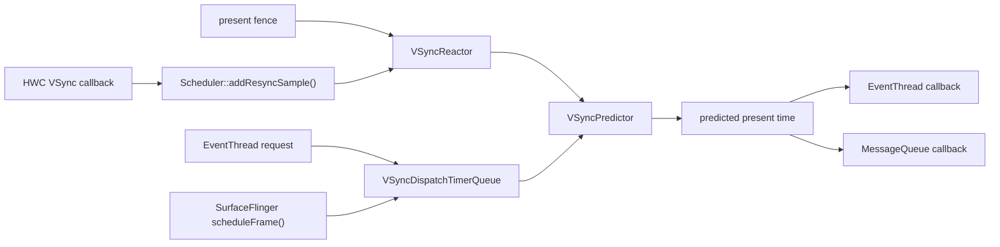
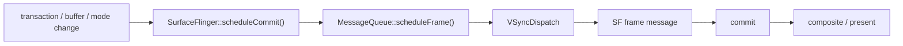

```mermaid
flowchart LR
    CH["Choreographer"] --> DER["DisplayEventReceiver::requestNextVsync()"]
    DER --> CONN["EventThreadConnection"]
    CONN --> ET["EventThread request state"]
    ET --> VD["VSyncDispatch registration"]
    VD --> VP["VSyncPredictor"]
    VP --> ET2["EventThread VSync event"]
    ET2 --> CH2["Choreographer#doFrame"]
```

---

title: "SurfaceFlinger VSync Scheduler 与 DisplayFrameRate 策略"
chapter: "2.23"
section: "2.23"
status: finalized
drafted_date: "2026-05-18"
drafted_by: "openclaw-task2a"
applicable_versions: "Android 11 (API 30) - Android 17 (API 37)"
last_verified: "2026-08-07"
last_verified_against: "AOSP android-17.0.0_r1 frameworks/native SurfaceFlinger Scheduler/VsyncSchedule/VSyncPredictor/VSyncReactor/VSyncDispatchTimerQueue/EventThread/RefreshRateSelector/FrameTimeline；Android 17 API 37 Display/View/Surface 文档；Android ARR/frame pacing 官方文档；kernel android17-6.18-2026-06_r6"
confidence: high
sources:
  - type: research
    path: "DeepResearch/2026-05-17-surfaceflinger-vsync-scheduler-frame-rate.md"
  - type: official
    path: "https://source.android.com/docs/core/graphics/frame-pacing"
  - type: official
    path: "https://source.android.com/docs/core/graphics/arr"
  - type: official
    path: "https://developer.android.com/media/optimize/performance/frame-rate"
  - type: official
    path: "https://developer.android.com/develop/ui/views/animations/adaptive-refresh-rate"
  - type: official
    path: "https://perfetto.dev/docs/data-sources/frametimeline"
  - type: aosp
    path: "frameworks/native/services/surfaceflinger/Scheduler/VSyncPredictor.cpp"
  - type: aosp
    path: "frameworks/native/services/surfaceflinger/Scheduler/VsyncSchedule.cpp"
  - type: aosp
    path: "frameworks/native/services/surfaceflinger/Scheduler/VSyncDispatchTimerQueue.cpp"
  - type: aosp
    path: "frameworks/native/services/surfaceflinger/Scheduler/Scheduler.cpp"
  - type: aosp
    path: "frameworks/native/services/surfaceflinger/Scheduler/VsyncConfiguration.cpp"
  - type: aosp
    path: "frameworks/native/services/surfaceflinger/Scheduler/RefreshRateSelector.cpp"
  - type: aosp
    path: "frameworks/native/services/surfaceflinger/SurfaceFlinger.cpp"
tags: [surfaceflinger, vsync, frame-rate, arr, rendering, scheduler]
related_chapters: ["2.3", "2.18", "2.19", "18.19", "13.14"]
created_by: "task2a-knowledge-gap"
created_date: "2026-05-18"
gap_source: "研究素材/官方文档/AOSP结构"
gap_score: 16
material_count: 4
pipeline_stage: ready-to-publish
task6_state: reviewed
reviewed_by: "openclaw-task6"
reviewed_date: 2026-06-20
task6_result: pass-light-edit
task9_state: reviewed
last_task6_at: "2026-06-20T12:07:00+08:00"
last_task6_review_log: "logs/review/2026-06-20-12-review.md"
task9_result: pass-idle-audit
task9_reviewed_date: "2026-08-07"
task9_reviewed_by: "aiw-polish-idle-audit"
last_task9_at: "2026-08-07T18:35:49+08:00"
task2b_state: fixed
task2b_result: fixed
last_task2b_lite_at: "2026-05-27"
task6_reviewed_date: "2026-05-27"
task6_reviewed_by: "openclaw-task6"
review_type: "task6-writing-quality-review"
task6_review_notes: "2026-06-20 12:07 Task6 revisiting-review：Task9 idle audit auto-fix（P1: Android 17 VRR 单样本预测模式版本边界）写作质量复审通过；L1 禁用词/高频词/结构性元叙述 0 命中；L2 开头/节奏/结构/读者视角全部通过；outline 8/8 覆盖；无新增 L3/L4 回炉项；task9_result=auto-fixed → pass-tech-review，queue.json 无 pending，自动晋升 finalized。"
last_task9_review_log: "logs/deep-review/2026-07-08-17-audit.md"
p0: 0
p1: 0
p2: 0
task9_review_notes: "2026-05-27 13:20 Task9：pass-tech-review。复核 VsyncSchedule/VSyncPredictor/VSyncDispatchTimerQueue/Scheduler/RefreshRateSelector 与 ARR/FrameTimeline 官方文档；未发现 P0/P1，自动晋升 finalized。；2026-07-08 17:49 Task9 idle audit：AUTO-FIX。android-17.0.0_r1 复核 FrameTimeline/VSyncPredictor/VSyncReactor；修正 jank bitmask 数量 13→15、VSyncPredictor 离群容差 10%→20%；queue 无新增，回到 Task6 复审。；2026-08-03 18:35 idle audit：PASS。抽检 Android 18/API38 越界、待验证残留、来源标记、frontmatter 与正文表达；未发现需降级问题，清理已修复 P1 计数残留。"
deepseek_cn_review_state: done
last_deepseek_cn_review_at: 2026-07-08
last_task9_autofix_at: "2026-07-08"
last_task9_audit: "2026-08-07"
last_task9_audit_at: "2026-08-07T18:35:49+08:00"
last_task9_audit_log: "logs/audit/2026-08-07-20260807-183549-idle-audit-cad65fbd-idle-audit.md"
last_task9_audit_result: "pass-idle-audit"
task9_audit_notes: "2026-07-08 Task9 idle audit: AUTO-FIX。按 Android 17(android-17.0.0_r1) 复核 FrameTimeline/VSyncPredictor/VSyncReactor；修正 FrameTimeline jank bitmask 数量 13→15，修正 VSyncPredictor 离群容差 10%→20%，VSyncReactor 10% 周期确认边界保持独立；回到 Task6 复审。；2026-08-03 idle audit: PASS。无 Android 18/API38 越界；sources 已有 research/official/aosp 标记；清理 p1=1 残留为 p1=0。；2026-08-05 idle audit: PASS。抽检 Android 18/API38 越界、待验证残留、来源标记、frontmatter 与正文表达；quality_flags 经复核不构成正文问题，未修改正文。；2026-08-07 idle audit: PASS。复核 Android 18/API38 越界、TODO/待验证残留、sources 标记、frontmatter 与正文表达；正文 TODO 属于 Android 17 API 实现 caveat，非待补占位；sources 含 research/official/aosp，未修改正文。"
last_idle_audit_at: "2026-08-07T18:35:49+08:00"
last_idle_audit_run_id: "20260807-183549-idle-audit-cad65fbd"
last_idle_audit_result: "pass-idle-audit"
last_idle_audit_log: "logs/audit/2026-08-07-20260807-183549-idle-audit-cad65fbd-idle-audit.md"
last_idle_audit_notes: "抽检 Android 18/API38 越界、TODO/待验证残留、sources 标记、frontmatter 和正文表达；正文 TODO 为 Android 17 Surface.FrameRateParams 实现 caveat，不是待验证占位；未发现需降级或安全正文补丁的问题。"
---

# 2.23 SurfaceFlinger VSync Scheduler 与 DisplayFrameRate 策略

Android 显示调度包含两类彼此独立的问题：

1. 下一帧应当在什么时间唤醒应用和 SurfaceFlinger？
2. 当前内容适合使用哪个渲染帧率和显示模式？

第一类由 `VsyncSchedule`、`VSyncPredictor`、`VSyncReactor`、`VSyncDispatch`、`EventThread` 等组件协作完成；第二类由图层帧率投票、`LayerHistory`、`RefreshRateSelector` 和设备策略共同决定。`Surface.setFrameRate()` 会影响第二类决策，但不会直接触发 `Scheduler::requestNextVsync()`。排查卡顿或刷新率异常时，应先区分这两类路径。

下文的平台实现按 Android 17 / API 37 的 `android-17.0.0_r1` 核对，内核能力以 `android17-6.18-2026-06_r6` 为版本边界。面板 TE、HWC、DRM/KMS 与厂商 VRR 驱动仍取决于具体设备，AOSP 通用代码不能替代设备侧证据。

## 一、三种频率与两个时间点

显示问题里至少要区分三种频率：

- **内容帧率**：内容自身产生新画面的速度，例如视频的 24fps。
- **渲染帧率**：应用或某个图层希望提交新缓冲区的速度，例如游戏限制为 60fps。
- **显示刷新率**：显示设备当前模式的输出速率，例如 120Hz。

在 Android 17 的 VRR 模型里还要区分：

- **VSync rate**：面板时间事件或 TE 所在的节拍。
- **Peak refresh rate**：当前模式允许的最高刷新速率。

二者在固定刷新率模式中通常一致，在 ARR/VRR 模式中可能分离。`DisplayMode::getVsyncRate()`、`getPeakFps()` 和 `VSyncPredictor::minFramePeriod()` 用于表达这种差异。仅看到 120Hz，不能推断每个 TE 都必须产生一帧。

调度时间线上还要区分：

- **wakeup time**：回调应当开始执行的时间；
- **expected present time**：这次工作的目标显示时间。

FrameTimeline 使用预测/实际开始时间、截止时间和显示时间记录一帧的预期与结果。它不等同于硬件 VSync trace，也不等同于应用主线程的 `Choreographer#doFrame`。

## 二、Android 17 的 VSync 调度骨架

每个物理显示都有自己的 `VsyncSchedule`。它组合三部分：

- `VSyncPredictor`：根据有效时间戳预测后续 VSync；
- `VSyncReactor`：管理硬件 VSync、present fence、模式切换与重新采样；
- `VSyncDispatchTimerQueue`：把多个消费者的目标 VSync 换算成定时回调。

`Scheduler` 再把显示级策略、`EventThread`、SurfaceFlinger `MessageQueue` 和这些逐显示设备的调度器连接起来。多显示场景下，SurfaceFlinger 主合成循环和 EventThread 使用节拍基准显示设备的调度器；节拍基准变化时，`Scheduler::promotePacesetterDisplay()` 会替换它们使用的 `VsyncSchedule`。

下面这张图用于确定硬件样本、预测和回调各自停留在哪一层：



HWC 回调的入口是 `SurfaceFlinger::onComposerHalVsync()`，随后进入 `Scheduler::addResyncSample(displayId, timestamp, period, source)`。回调可能同时携带 HWC 估算的周期，也可能只有时间戳。`VSyncReactor` 根据当前模式和采样状态决定是否继续启用硬件 VSync。

源码入口：

- [`VsyncSchedule.cpp`](https://cs.android.com/android/platform/superproject/+/android-17.0.0_r1:frameworks/native/services/surfaceflinger/Scheduler/VsyncSchedule.cpp)
- [`VSyncReactor.cpp`](https://cs.android.com/android/platform/superproject/+/android-17.0.0_r1:frameworks/native/services/surfaceflinger/Scheduler/VSyncReactor.cpp)
- [`Scheduler.cpp`](https://cs.android.com/android/platform/superproject/+/android-17.0.0_r1:frameworks/native/services/surfaceflinger/Scheduler/Scheduler.cpp)

### 2.1 Predictor、Reactor、Dispatch 不共享一套“误差阈值”

Android 17 源码中有几个容易被混用的常量：

| 常量 | Android 17 值 | 负责的机制 |
|---|---:|---|
| Predictor history / minimum samples | 20 / 6 | 默认预测模型的样本容量与开始拟合所需样本 |
| Predictor discard outlier percent | 20% | 时间戳相位校验与近重复样本判断 |
| `VSyncTracker::kPredictorThreshold` | 200ms | 优先选择近期样本，并作为部分 resync 节流的默认时间域 |
| Reactor period allowance | 10% | 模式切换时确认观测周期是否接近目标周期 |
| Dispatch timer slack | 500µs | 合并时间相近的 callback 唤醒 |
| Dispatch minimum VSync distance | 3ms | 避免把同一或过近的目标当成两次独立 VSync |

这些常量属于不同组件。200ms 不是 Predictor 允许的预测误差，3ms 也不是 GPU 流水线的固定安全余量。

## 三、VSyncPredictor 如何建立时间模型

`VsyncSchedule::createTracker()` 在默认路径创建一个历史容量为 20、至少积累 6 个样本才开始拟合的 `VSyncPredictor`，离群比例为 20%。Android 17 还有一条条件严格的单样本路径：只有启用 `use_last_vsync_predict` flag VRR 配置且显示围栏功能可用时，历史容量和最少样本数才会改为 1/1。

因此，Android 17 并非总是使用末次 VSync 预测。调试具体设备前，应在 `dumpsys SurfaceFlinger`、日志和对应产品开关中确认它使用默认模型还是单样本模型。

### 3.1 `validate()` 检查的是什么

默认模型收到新时间戳后，先调用 `validate()`：

1. 以理想 VSync 周期为模，检查新时间戳的相位是否落在已有模型的容差内；
2. 从历史里寻找与新样本最接近的时间戳，并优先考虑 200ms 内的近期样本；
3. 如果两者距离小于一个周期的 20%，把新时间戳视作重复样本。

相位校验允许样本落在周期起点或终点附近的 20% 区间，而不是以拟合值为中心的简单 ±20% 周期判断。跨周期的合法样本因此不会仅因取模后靠近周期尾部而被误拒。

### 3.2 多样本模式做线性拟合

样本足够后，`VSyncPredictor` 通过最小二乘法拟合时间戳序列：

```text
timestamp(n) ≈ intercept + slope × sequence(n)
```

这里 `slope` 表示模型估计的周期，`intercept` 表示相位。实现先对时间值做缩放以降低大整数参与运算时的精度风险，最终再恢复纳秒尺度。拟合完成后还会检查各样本与模型之间的误差，超出 20% 容差的模型不会直接采用。

单样本模式不会执行这组回归；它以最新有效脉冲为锚点，并使用理想周期预测。分析跟踪数据时，要区分样本较少和预测器失效。

### 3.3 ARR 下的最小帧间隔

`idealPeriod()` 来自显示模式的 `vsyncRate`。`minFramePeriod()` 则使用拟合后的斜率乘以 `mNumVsyncsForFrame`；后者由峰值刷新周期与 VSync 周期的比值计算。这样可在 TE 节拍与最低帧间隔分离时，避免连续显示提交违反当前 VRR 模式约束。

`setRenderRate()` 也不是每次都清空相位：

- `applyImmediately=true` 时，当前时间线直接更新渲染帧率；
- 延迟应用且切到更高渲染帧率的特定路径会重置时间线；
- 其他延迟切换会冻结旧时间线，并加入承载新渲染帧率的时间线。

模式切换附近出现不均匀的预测间隔时，需要结合时间线过渡、真实显示围栏和显示模式事件判断，不能只凭一两个间隔认定发生掉帧。

源码依据见 [`VSyncPredictor.cpp`](https://cs.android.com/android/platform/superproject/+/android-17.0.0_r1:frameworks/native/services/surfaceflinger/Scheduler/VSyncPredictor.cpp) 与 [`VSyncTracker.h`](https://cs.android.com/android/platform/superproject/+/android-17.0.0_r1:frameworks/native/services/surfaceflinger/Scheduler/VSyncTracker.h)。

## 四、VSyncReactor 如何决定重新采样

软件预测仍要由真实显示结果校正。`VSyncReactor` 可以接收两类证据：

- HWC VSync 时间戳及可选周期；
- 显示围栏表示的实际显示时间。

模式切换期间，`periodConfirmed()` 用 10% 容差判断观测周期是否接近目标周期。若 HWC 直接给出周期，就比较该值与目标；否则比较相邻硬件 VSync 时间戳的距离。这里没有固定的 17～33ms 模式切换窗口。

显示围栏可靠且功能启用时，它可以补充预测样本。若样本被拒、模式尚未确认或围栏信息不足，Reactor 会请求更多硬件 VSync；进入周期过渡时还会临时忽略显示围栏，避免把新旧模式交界处的时间戳写入错误模型。样本稳定后，可以关闭硬件 VSync 以减少持续中断。

这条控制逻辑可以解释两类跟踪现象：

- 一段时间内硬件 VSync 重新密集出现，可能是模型正在重新采样，不必先归因于应用；
- 模式切换时显示围栏没有进入 Predictor，可能是 Reactor 主动忽略，不代表围栏丢失。

## 五、VSyncDispatch 如何反推唤醒时间

消费者注册回调后，`VSyncDispatchTimerQueueEntry::schedule()` 根据工作预算寻找下一次目标 VSync。下面的伪代码保留 Android 17 实现中的主要关系，用于核对跟踪中的三个时间点：

```text
earliest = max(lastVsync, now + workDuration + readyDuration)
nextVsync = tracker.nextAnticipatedVSyncTimeFrom(
    earliest,
    committedVsyncOpt.value_or(lastVsync)
)
nextWakeup = max(now, nextVsync - workDuration - readyDuration)
nextReady = nextVsync - readyDuration
```

`workDuration` 是消费者完成自身工作的预算。`readyDuration` 表示消费者必须提前多久准备好：

- 对 App 这类 SF 外部消费者，`readyDuration` 通常使用 SF 的工作时长，为后续 latch、compose、present 留出预算；
- 对 SF 内部消费者，`readyDuration` 通常为 0。

如果重新调度会跳过已经设定的目标或唤醒点，队列会保留原目标。`adjustVsyncIfNeeded()` 还会避开已经分发过或距离过近的 VSync。500µs 的定时器余量用于把时间接近的回调放进同一次定时器唤醒；3ms 的最小 VSync 间距用于区分目标事件。

源码依据见 [`VSyncDispatch.h`](https://cs.android.com/android/platform/superproject/+/android-17.0.0_r1:frameworks/native/services/surfaceflinger/Scheduler/VSyncDispatch.h) 与 [`VSyncDispatchTimerQueue.cpp`](https://cs.android.com/android/platform/superproject/+/android-17.0.0_r1:frameworks/native/services/surfaceflinger/Scheduler/VSyncDispatchTimerQueue.cpp)。

## 六、应用与 SurfaceFlinger 是两条调度路径

### 6.1 应用请求下一次 VSync

应用界面路径从 `DisplayEventReceiver::requestNextVsync()` 开始，经 Binder 请求到 `EventThreadConnection`，再由 `EventThread` 标记该连接需要一次 VSync。EventThread 的 VSync 回调由节拍基准显示设备的 Dispatch 驱动，事件最终回到 `DisplayEventReceiver`，由 Choreographer 组织输入、animation、遍历等工作。



连续 VSync 与单次请求在 EventThread 内有不同状态；`requestNextVsync()` 不会无限叠加已经待处理的请求。应用侧发生阻塞时，可沿 `Choreographer`、`DisplayEventReceiver`、EventThread 连接和 Dispatch 注册项逐级确认。

### 6.2 SurfaceFlinger 请求合成帧

SurfaceFlinger 在事务、buffer latch、模式切换等事件到来时调用 `scheduleCommit()` / `scheduleFrame()`。Android 17 的 SF `MessageQueue::scheduleFrame()` 使用：

```text
workDuration = sfWorkDuration - workDurationSlack
readyDuration = 0
```

Dispatch 到点后，MessageQueue 投递 SF frame message，进入提交、合成和显示流程。应用请求与 SF 请求可以指向同一个预测显示时间，但两者的唤醒时间不同。



### 6.3 WorkDuration 与旧相位偏移的边界

`Scheduler::setVsyncConfig()` 最终向 EventThread 写入 `appWorkDuration` 与 `sfWorkDuration`，向 SF MessageQueue 写入 `sfWorkDuration`。这说明 Dispatch 当前使用持续时间语义。

Android 17 的 `VsyncConfiguration` 同时保留 `PhaseOffsets` 和 `WorkDuration` 两套配置实现；默认工厂还会依据 `debug.sf.use_phase_offsets_as_durations` 属性选择实现。旧偏移会先转换成 `VsyncConfig` 中的持续时间。排障结论可以写成“当前分发按工作/就绪持续时间计算”，不能宣称 Android 17 已删除相位偏移配置。

## 七、帧率请求如何进入刷新率选择

frame-rate 请求的主路径与 `requestNextVsync()` 分离：

```mermaid
flowchart LR
    API["View / Surface / SurfaceControl frame-rate request"] --> TX["layer transaction state"]
    TX --> SNAP["LayerSnapshot frameRate"]
    SNAP --> HIST["SurfaceFlinger::updateLayerHistory()"]
    HIST --> SUM["LayerHistory::summarize()"]
    SUM --> CHOOSE["Scheduler::chooseRefreshRateForContent()"]
    CHOOSE --> RRS["RefreshRateSelector::getRankedFrameRates()"]
    RRS --> DECISION["mode / render-rate decision"]
```



Android 17 的 `SurfaceFlinger::updateLayerHistory()` 遍历 FrontEnd 生成的图层快照。当 `FrameRate`、`Buffer`、`Animation`、几何或可见性发生变化时，它把图层属性写入历史。刷新率选择发生在图层更新与缓冲区锁存之后，以便纳入本次已经生效的内容状态。

`LayerHistory::summarize()` 把历史与当前属性整理成 `LayerRequirement`。`RefreshRateSelector` 处理的投票类型包括：

- `NoVote`
- `Min`
- `Max`
- `Heuristic`
- `ExplicitDefault`
- `ExplicitExactOrMultiple`
- `ExplicitExact`
- `ExplicitGte`
- `ExplicitCategory`

每个 requirement 还带 owner UID、desired refresh rate、seamlessness、category、weight、focused、smooth-switch-only 与 layer filter 等信息。选择器在 display policy、primary/app request 范围、mode group 和设备能力允许的候选中评分，并结合 touch、idle、power-on-imminent 等全局信号。

应用提交的帧率是投票输入，不是切换命令。它可能被以下条件压低或覆盖：

- 当前显示策略不允许该候选；
- 多个可见图层的请求冲突；
- 获得焦点的图层权重更高；
- 切换要求无缝，而目标模式需要非无缝切换；
- 省电、idle、触摸或热管理策略介入；
- 多显示设备的节拍基准/跟随约束不允许各自任意选择。

源码依据见 [`SurfaceFlinger.cpp`](https://cs.android.com/android/platform/superproject/+/android-17.0.0_r1:frameworks/native/services/surfaceflinger/SurfaceFlinger.cpp)、[`LayerHistory.cpp`](https://cs.android.com/android/platform/superproject/+/android-17.0.0_r1:frameworks/native/services/surfaceflinger/Scheduler/LayerHistory.cpp) 与 [`RefreshRateSelector.cpp`](https://cs.android.com/android/platform/superproject/+/android-17.0.0_r1:frameworks/native/services/surfaceflinger/Scheduler/RefreshRateSelector.cpp)。

## 八、MRR、ARR 与应用 API

### 8.1 MRR：在离散显示模式之间切换

多刷新率设备通常暴露 60Hz、90Hz、120Hz 等离散模式。SurfaceFlinger 选出候选后，还要由 HWC 和显示驱动执行模式切换。跨模式组或需要重新训练链路的切换可能出现黑屏或抖动，因此兼容性与切换策略会影响是否允许切换。

### 8.2 ARR：同一模式内调整帧间隔

Android 15 引入平台 ARR 支持。面板可以在一个 VRR 模式内依据显示时机调整实际刷新间隔，而不必每次切换完整显示模式。官方 ARR 文档将硬件能力、Composer HAL、内核/驱动和 SurfaceFlinger 列为协作条件；设备是否支持仍需实机确认。

ARR 不保证支持任意连续帧率。设备通常受离散 VSync step、最小帧间隔、面板范围和 HWC 实现约束。应用把 57fps 传入 API，不代表显示器会稳定输出 57Hz。

### 8.3 公开 API 的版本边界

| Android / API | 公开能力 |
|---|---|
| Android 11 / API 30 | `Surface.setFrameRate(float, int)`，应用可声明 Surface 内容帧率与兼容性 |
| Android 12 / API 31 | 增加带 `changeFrameRateStrategy` 的三参数重载，可表达仅无缝切换或始终允许切换 |
| Android 15 / API 35 | `View.setRequestedFrameRate()`、`View.setFrameContentVelocity()`；Window 增加触摸 boost 与省电平衡控制 |
| Android 16 / API 36 | `Display.hasArrSupport()`、`Display.getSuggestedFrameRate()`；新系统中的支持刷新率更偏向可用渲染帧率语义 |
| Android 17 / API 37 | `Display.getFrameRateVelocityMapping()`，为 View fling 的速度到帧率映射提供设备建议 |

API 只能表达意图。`SurfaceControl.Transaction.setFrameRate()` 适合直接管理 SurfaceControl 图层的系统组件；普通 View 应优先使用 View/Window 层 API，让声明随可见性和 View 生命周期传播。

Android 17 源码中还有受开关控制的 `Surface.FrameRateParams` overload，但当前 Java 实现仍有将期望最小值和最大值继续传给原生层的 TODO。只有同时核对目标 SDK、设备开关和实现后，才能判断区间控制是否完整生效。

参考：

- [Frame rate（Android media）](https://developer.android.com/media/optimize/performance/frame-rate)
- [Adaptive refresh rate（Android Developers）](https://developer.android.com/develop/ui/views/animations/adaptive-refresh-rate)
- [Adaptive refresh rate（AOSP）](https://source.android.com/docs/core/graphics/arr)
- [`Surface.setFrameRate()`](https://developer.android.com/reference/android/view/Surface#setFrameRate(float,%20int))
- [`Display` API](https://developer.android.com/reference/android/view/Display)

## 九、24fps、30fps 内容该选什么刷新率

判断候选时，先看整数倍关系，再看切换成本：

- 24fps 在 120Hz 上每帧可显示 5 个刷新周期，节奏均匀；
- 30fps 在 60Hz、90Hz、120Hz 上分别对应 2、3、4 个周期；
- 24fps 在 90Hz 上不是整数倍，若固定在 90Hz，系统可能采用不均匀节奏；
- 从 120Hz 切到 60Hz 能降低功耗，但模式切换成本、其他图层请求和交互状态可能让系统暂时保留 120Hz。

视频播放应把媒体帧率声明给承载视频的 Surface，并由 Media3 或平台帧率策略处理模式切换。游戏需要同时考虑目标 FPS、swap interval、Frame Pacing 库与热预算。普通界面动画若只降低渲染频率，却没有调整动画时间基准，可能减少帧数但不会修复卡顿。

## 十、多显示：确认节拍基准设备

Android 17 的 Scheduler 为每个显示设备保存独立的选择器与 `VsyncSchedule`。SurfaceFlinger 主循环需要一个时间基准，因此会选择节拍基准显示设备，并让 EventThread 与 SF MessageQueue 使用它的调度器。

这带来两个排障原则：

1. 外接显示器存在时，主合成节拍未必来自内屏；
2. 跟随显示设备的模式和渲染帧率选择可能受节拍基准设备限制，除非相应特性允许更独立的选择。

仅看到某个显示设备的 HWC VSync，不能断定它驱动了应用的 `Choreographer`。应同时查看显示编号、节拍基准变化、活动模式与 EventThread 使用的调度器。

## 十一、用 FrameTimeline 和 Perfetto 定位问题

推荐同时开启：

- FrameTimeline；
- `gfx` / SurfaceFlinger；
- `view` / Choreographer；
- `sched` 与 CPU frequency；
- HWC、VSync、fence 与 GPU 相关数据源；
- 存在模式切换时的显示模式和电源事件。

### 11.1 先对齐同一帧

优先使用 VSync 编号或令牌关联应用帧、SurfaceFrame 与 DisplayFrame，再比较：

- predicted start / deadline / present；
- actual start / end / present；
- 应用缓冲区是否按时进入 BufferQueue；
- SF 是否及时锁存、合成并提交 HWC；
- 显示围栏是否晚于预期显示时间。

Android 17 `TokenManager` 使用容量为 500 的环形存储保存预测。源码中没有按时间戳执行的固定 120ms 生存时间，不能用令牌超过 120ms 必然过期来解释关联失败。

### 11.2 Jank 类型要按责任域解释

Android 17 `JankType` 中，除 `None` 外有 15 个 bit：

- `DisplayHAL`
- `SurfaceFlingerCpuDeadlineMissed`
- `SurfaceFlingerGpuDeadlineMissed`
- `AppDeadlineMissed`
- `AppResyncedJitter`
- `PredictionError`
- `SurfaceFlingerScheduling`
- `BufferStuffing`
- `Unknown`
- `SurfaceFlingerStuffing`
- `Dropped`
- `NonAnimating`
- `DisplayNotOn`
- `DisplayModeChangeInProgress`
- `DisplayPowerModeChangeInProgress`

`SurfaceFrame::isSelfJanky()` 只把 `AppDeadlineMissed`、`Unknown`、`AppResyncedJitter` 归入该图层的自身卡顿集合。其他标志位仍可能与这一帧同时出现，但责任域不同。完整定义见 [`JankInfo.h`](https://cs.android.com/android/platform/superproject/+/android-17.0.0_r1:frameworks/native/libs/gui/include/gui/JankInfo.h) 与 [`FrameTimeline.cpp`](https://cs.android.com/android/platform/superproject/+/android-17.0.0_r1:frameworks/native/services/surfaceflinger/Scheduler/FrameTimeline.cpp)。

### 11.3 排查顺序

**第一步：确认显示上下文。**

记录 display ID、pacesetter、active mode、peak refresh rate、VSync rate、ARR support、模式切换和 power state。缺少这些信息时，8.33ms 与 16.67ms 的预算都可能套错对象。

**第二步：判断应用是否按时提交缓冲区。**

查看 `Choreographer#doFrame`、主线程遍历、RenderThread/GPU、queueBuffer 与应用 FrameTimeline。若出现 `AppDeadlineMissed`，继续追踪 CPU 调度、锁、GC、Binder 或 GPU 工作负载。

**第三步：判断 SF/HWC 是否按时完成显示提交。**

应用按时而出现 `SurfaceFlingerCpuDeadlineMissed`、`SurfaceFlingerGpuDeadlineMissed` 或 `DisplayHAL` 时，应检查锁存、合成策略、GPU latch、HWC 验证/提交和围栏。

**第四步：检查预测与模式过渡。**

出现 `PredictionError`、`AppResyncedJitter` 或间隔突变时，核对 VSyncReactor 是否正在重新采样、Predictor 使用 20/6 还是 1/1，以及是否发生渲染帧率时间线切换。

**第五步：审查帧率投票。**

显示模式“不按应用请求切换”时，查看可见 layer vote、focused/weight、seamlessness、全局 touch/idle 信号、policy 范围和多显示约束。只检查应用传入的 FPS 不足以解释 selector 的结果。

## 十二、常见误判

### 收到 VSync 就代表马上显示

应用收到的是面向预测显示时间的调度事件。之后还要经过应用工作、缓冲区队列、SF 锁存与合成、HWC 显示提交和扫描输出。

### `setFrameRate(60)` 会固定屏幕为 60Hz

这只是图层投票。SurfaceFlinger 仍要综合其他图层、策略、设备能力和切换成本。

### “120Hz 的每一帧都只有 8.33ms App CPU 时间”

8.33ms 是刷新周期。App wakeup VSync 配置和调度目标决定；流水线可以跨周期，ARR 还可能让实际帧间隔与 TE 周期不同。

### “present fence 可以完全替代 HW VSync”

两者都能提供时间证据，但 Reactor 会根据可靠性和模式切换状态选择是否采纳。过渡期可能忽略显示围栏，并重新启用硬件 VSync。

### 看到 `PredictionError` 就说明 Predictor 算法有缺陷

该标志位表示预测与实际时间关系不满足分类条件。模式切换、周期错误、样本丢失、HWC 或显示提交异常都可能产生同样结果，需要回到原始时间线验证。

## 十三、源码阅读路线

可按以下顺序阅读 Android 17 源码：

1. `SurfaceFlinger::initScheduler()`：查看 EventThread 与 SF MessageQueue 分别获得的持续时间；
2. `VsyncSchedule.cpp`：查看跟踪器、控制器和分发器的创建参数；
3. `VSyncPredictor.cpp`：查看样本校验、拟合、时间线与渲染帧率；
4. `VSyncReactor.cpp`：查看硬件 VSync、显示围栏和周期过渡；
5. `VSyncDispatchTimerQueue.cpp`：查看目标、唤醒和就绪时间的换算；
6. `EventThread.cpp` 与 `MessageQueue.cpp`：区分应用和 SF 回调；
7. `SurfaceFlinger::updateLayerHistory()`：查看快照如何进入图层历史；
8. `RefreshRateSelector.cpp`：看 vote、policy、scoring 与最终候选；
9. `FrameTimeline.cpp`：用预测、实际显示时间和卡顿分类校验结论。

内核标签 `android17-6.18-2026-06_r6` 主要用于确认通用时间、fence、DRM/KMS 基础设施的版本边界。具体设备能否执行 ARR、最小间隔是多少、模式切换是否无缝，仍需补充对应的内核模块、Composer HAL、面板时序和实机跟踪数据。

## 小结

Android 17 的显示调度可以按两条主线理解：

- 时间线：真实 VSync 和显示样本进入 Reactor 与 Predictor，Dispatch 再按工作/就绪持续时间唤醒应用与 SF；
- 策略线：图层的帧率请求进入快照与 LayerHistory，RefreshRateSelector 综合策略、候选模式和全局信号做选择。

排障时先确认 display 与 pacesetter，再用 FrameTimeline 关联同一帧，接着按 App、SF、HWC、预测/切换四个责任域缩小范围。这样得到的是有时间戳、frame token 和源码分支支撑的结论，不会把一个 API hint、一个 VSync slice 或一个常量孤立地解释成根因。
